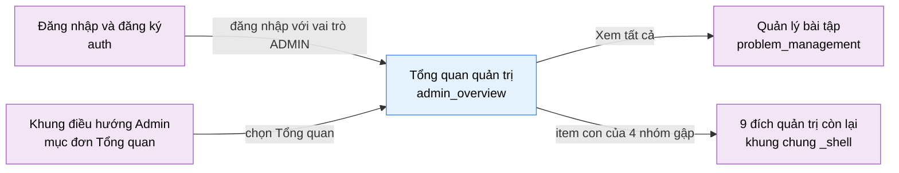

# Tài liệu thiết kế cơ bản (BD) — Tổng quan quản trị (`ADM0101`)

## Phương châm tài liệu [Nội bộ — không cần khách duyệt]

- Viết theo **mẫu 9 sheet**. Bộ thẻ đóng, quy ước ID, ký hiệu chuẩn, ranh giới với tài liệu khác và
  checklist kiểm toán nằm ở `02-bd/_rules/bd-template-9sheet.md` — file này không chép lại.
- Phần gắn nhãn `[Nội bộ]` phục vụ sinh mã và tự kiểm toán, không phải yêu cầu của khách hàng: mục 4.5, mục
  7.3 và các ghi chú quy ước.
- Mã màn `ADM0101` theo bảng mã ở `02-bd/_rules/bd-template-9sheet.md` mục 8; tên file mang tiền tố mã.
- Màn này **không có màn con và không có popup**. Nó thuần là màn tổng hợp số liệu và điều hướng: mọi hành vi
  nghiệp vụ chi tiết nằm ở các màn con mà thanh điều hướng trỏ tới
  [Nguồn: 01-rd/screens/admin/ADM0101_overview.md:33-34].

> Đọc cùng `01-rd/screens/admin/ADM0101_overview.md` (hành vi ở mức yêu cầu, không lặp lại ở đây),
> `02-bd/screens/admin/_shell.md` (khung điều hướng dùng chung khu Admin — file này **không** mô tả lại
> sidebar, toolbar, theme, ngôn ngữ) và ba file BD module: `02-bd/architecture/identity.md`,
> `02-bd/database/identity.md`, `02-bd/security/identity.md`.
>
> **Không thiết kế** ô tìm kiếm liên thực thể "Tìm người dùng, bài toán…" — đã bỏ khỏi UI thật theo
> `DEC-2026-0831-admin-overview-ui-decisions` [Nguồn: 01-rd/screens/admin/ADM0101_overview.md:187].
> **Không thiết kế** đích nav "Chấm lại" — đã loại khỏi phạm vi theo `DEC-2026-0828-remove-rejudge-scope`
> [Nguồn: 01-rd/screens/admin/ADM0101_overview.md:52].
> **Không thiết kế** trục "AI sinh / Giảng viên soạn" của biểu đồ độ khó — đó là nhãn dữ liệu mẫu vẽ sai ở
> prototype, hệ thống không có AI sinh đề bài [Nguồn: 01-rd/req/identity.md:163-166].

---

## Sheet 1. Bìa

| Mục | Giá trị |
| :--- | :--- |
| Hệ thống | AlgoPrep |
| Phân hệ | `identity` (F1) |
| Công đoạn | BD — Thiết kế cơ bản |
| Phân loại | Màn hình |
| Tên màn | Tổng quan quản trị |
| Mã màn hình | `ADM0101` |
| Tên vật lý (slug) | `admin_overview` |
| Trục tài liệu | Màn hình (`02-bd/screens/`) |
| Actor | A3 (`ADMIN`) |
| Phiên bản | V0.5 |
| Người tạo | Nhóm phát triển AlgoPrep |
| Ngày tạo | 2026/09/15 |
| Người cập nhật | Nhóm phát triển AlgoPrep |
| Ngày cập nhật | 2026/10/01 |

---

## Sheet 2. Lịch sử sửa đổi

| Ver | Sheet bị sửa | Nội dung sửa | Ngày | Người sửa |
| :--- | :--- | :--- | :--- | :--- |
| V0.1 | Toàn bộ | Tạo mới theo cấu trúc 8 mục văn xuôi (bounded context theo khối, layout regions, component inventory, screen states, API dự kiến, navigation, access rights, câu hỏi mở) | 2026/09/15 | Nhóm phát triển AlgoPrep |
| V0.2 | Toàn bộ | Chuyển sang mẫu 9 sheet. Chốt nguồn dữ liệu của mọi trường hiển thị, chốt khung thời gian tính delta và đơn vị trục biểu đồ theo ngôn ngữ (hai điểm RD uỷ quyền cho BD), bổ sung Sheet 5/6 danh sách và điều khiển item, Sheet 8 danh sách sự kiện, Sheet 9 đặc tả kiểm tra. Phát sinh hai câu hỏi mở mới về đường lấy số liệu xuyên module và về mốc đăng nhập gần nhất | 2026/09/20 | Nhóm phát triển AlgoPrep |
| V0.3 | 3, 4, 5, 6, 7, 8; Câu hỏi mở | Thêm thẻ chỉ số thứ ba "Yêu cầu đặt lại mật khẩu" ở hàng 1 cột trái (chuyển từ dải thẻ của `ADM0201` theo `DEC-2026-1001-single-overview-page-kpi`): Khu vực A thêm item NO 9-12, thêm endpoint `GetPasswordResetsSummary` (NO 10), số khối số liệu 9 thành 10, sửa các câu "hai thẻ chỉ số" thành "ba thẻ". Giá trị 6, +20 phần trăm, sparkline 7 điểm hiện là dữ liệu giả. Thêm Q4 về nguồn số liệu 24 giờ của thẻ mới | 2026/10/01 | AI |
| V0.4 | Sheet 5, 7, Câu hỏi mở | Đã chốt 2026-10-01 (owner uỷ quyền cân nhắc), xem `DEC-2026-1001-admin-configurable-settings`: Q4 đóng — thẻ "Yêu cầu đặt lại mật khẩu" lấy số liệu từ **nhật ký hệ thống, không dùng Redis**: giá trị = `COUNT` dòng `identity.system_audit_logs` có `action_type = PASSWORD_RESET_REQUESTED` trong 24 giờ gần nhất, delta so với 24 giờ liền trước, sparkline 7 điểm theo ngày. Sửa NO 10, 11, 12 (Sheet 5), bảng DTO NO 1, thêm `identity.system_audit_logs` vào bảng dữ liệu (4 thành 5 bảng), bỏ câu "không đọc bảng nào" | 2026/10/01 | AI |
| V0.5 | Sheet 5, Câu hỏi mở | Đã chốt 2026-10-01 (owner uỷ quyền), xem `DEC-2026-1001-admin-configurable-settings`: thẻ "Yêu cầu đặt lại mật khẩu" đếm **số mã OTP đã phát hành** (dòng `PASSWORD_RESET_REQUESTED`), không đếm mọi lần bấm "Quên mật khẩu"; yêu cầu cho email không khớp tài khoản nào không ghi dòng nên không vào số. Nhãn và ghi chú NO 9-10 nêu rõ nghĩa của số. Q4 giữ đóng | 2026/10/01 | AI |

---

## Sheet 3. Sơ đồ chuyển màn

> [Nội bộ] Quy ước vẽ: bố trí từ trái sang phải. Màn gọi tới tô tím, màn hiện tại tô xanh nhạt, màn đi tiếp
> tô tím. Màu và `[Nguồn:]` dùng để truy vết, không phải yêu cầu của khách hàng.

### 3.1 Danh sách chuyển màn

#### Đăng nhập và đăng ký → Tổng quan quản trị

[Điều kiện mở] Đăng nhập thành công bằng tài khoản có `roles.base_category = ADMIN`; đây là đích mặc định
theo vai trò.

[Chế độ mở] Không có.

[Thông tin truyền] Không có. Màn không nhận tham số truy vấn nào — không có deep-link lọc theo khoảng thời
gian.

[Giá trị trả về] Không có.

[Khi thành công] Hiển thị khung Admin và 10 khối số liệu, mỗi khối tự tải dữ liệu riêng.

[Khi huỷ] Không có.

#### Khung điều hướng Admin → Tổng quan quản trị

[Điều kiện mở] Bấm mục đơn "Tổng quan" trên thanh điều hướng bên trái, từ bất kỳ màn Admin nào khác. Mục này
không có item con nên bấm vào là điều hướng thật.

[Chế độ mở] Không có.

[Thông tin truyền] Không có.

[Giá trị trả về] Không có.

[Khi thành công] Như trên: hiển thị khung Admin và 10 khối số liệu.

[Khi huỷ] Không có.

#### Tổng quan quản trị → Quản lý bài tập

[Điều kiện mở] Bấm liên kết "Xem tất cả" ở góc phải khối "Bài phổ biến nhất". Đây là **liên kết đi tiếp duy
nhất** trong phần nội dung của màn; các khối biểu đồ còn lại giữ nguyên là tóm tắt.

[Chế độ mở] Không có.

[Thông tin truyền] Không có. Màn `problem_management` mở ở bộ lọc mặc định, không mang theo tiêu chí "phổ
biến nhất".

[Giá trị trả về] Không có.

[Khi thành công] Điều hướng sang màn `problem_management`.

[Khi huỷ] Không có.

#### Tổng quan quản trị → Các đích khác của khung điều hướng Admin

[Điều kiện mở] Bấm một item con trong 4 nhóm gập (Nội dung, Vận hành, AI, Hệ thống) hoặc một liên kết trong
nhóm "KHÁC". Bấm chính **tên nhóm** chỉ mở hoặc đóng nhóm, không rời màn.

[Chế độ mở] Không có.

[Thông tin truyền] Không có.

[Giá trị trả về] Không có.

[Khi thành công] Điều hướng sang màn tương ứng. Danh sách đích và hành vi gập nhóm thuộc khung chung, mô tả
ở `02-bd/screens/admin/_shell.md` mục 2 — không lặp lại ở đây.

[Khi huỷ] Không có.

### 3.2 Sơ đồ

[Nguồn: 09-layoutBase/Admin - Tổng quan.dc.html:254,359,380-390; 01-rd/screens/shared/SHR0101_auth.md:89;
01-rd/screens/admin/ADM0101_overview.md:160-163]

---

## Sheet 4. Bố cục màn hình

### 4.1 Tổng quan màn

[Mục đích màn] Cho quản trị viên một cái nhìn tổng hợp về mức sử dụng và sức khoẻ nội dung của hệ thống —
lượt nộp, người dùng, phân bố ngôn ngữ, phân bố kết quả chấm, phân bố độ khó, bài phổ biến, người dùng mới và
quay lại — trước khi đi vào từng màn vận hành cụ thể
[Nguồn: 01-rd/screens/admin/ADM0101_overview.md:29-34; 01-rd/req/identity.md:142-147].

[Luồng nghiệp vụ chính]

1. **Điều hướng vào màn**: tài khoản `ADMIN` đăng nhập thành công thì hệ thống đưa thẳng tới màn này; hoặc
   người dùng bấm mục "Tổng quan" trên thanh điều hướng.
2. **Hiển thị ban đầu**: khung Admin (thanh điều hướng, thanh công cụ) render ngay vì không phụ thuộc API
   nào. Mười khối số liệu tải **song song và độc lập**, mỗi khối hiển thị khung chờ đúng kích thước của nó.
3. **Đọc số liệu**: người dùng đọc, không nhập gì. Màn **không có trường nhập liệu, không có nút lưu, không
   có trạng thái biên soạn** — do đó không bao giờ tồn tại thay đổi chưa lưu và không cần cảnh báo khi rời
   màn.
4. **Xử lý khối lỗi**: khối nào tải thất bại thì chỉ khối đó hiện thông báo lỗi cục bộ kèm nút "Thử lại"; các
   khối còn lại vẫn hiển thị bình thường.
5. **Đi tiếp**: bấm "Xem tất cả" để sang `problem_management`, hoặc chọn một đích trên thanh điều hướng.

[Người dùng] Quản trị viên đã đăng nhập, có `roles.base_category = ADMIN` và `users.status = ACTIVE`.

[Tệp liên quan] Không có. Màn này không xuất hay nhập tệp.

[Phạm vi]
- Chỉ đọc. Không có thao tác ghi dữ liệu nào trên màn.
- Số liệu luôn là **toàn hệ thống**, không giới hạn theo phạm vi cá nhân hay lớp của người xem.
- Không có bộ lọc thời gian, không có tham số truy vấn — mỗi khối dùng đúng khoảng thời gian cố định ghi ở
  Sheet 5.
- Không có khối số liệu nào đọc từ `ai-review` ở phiên bản này; số liệu AI thuộc màn `admin_ai_usage`
  [Nguồn: 01-rd/req/identity.md:142-147 — F1-29 không nhắc `ai-review`].
- Thanh điều hướng, thanh công cụ, công tắc theme và ngôn ngữ thuộc khung chung, mô tả ở
  `02-bd/screens/admin/_shell.md`.

[Quyền sử dụng]
- Xem: được, với mọi tài khoản `base_category = ADMIN`. **Không** gác bằng một Function riêng trong ma trận
  F1-10 vì đây là đích mặc định sau đăng nhập, không phải màn con
  [Nguồn: 01-rd/req/identity.md:146-147].
- Thêm: không.
- Sửa: không.
- Xoá: không.

[Số bản ghi tối đa] Thẻ chỉ số: 3. Biểu đồ theo ngôn ngữ: 20 mốc thời gian, 3 chuỗi. Kết quả chấm: đúng 5
verdict. Độ khó: 3 nhóm, mỗi nhóm 2 cột. Theo ngày: 7 cột. Theo tháng: 6 điểm. Bài phổ biến: 4 dòng. Người
dùng mới và quay lại: 6 nhóm, mỗi nhóm 2 cột. Không phân trang ở bất kỳ khối nào.

Mười khối số liệu của màn lấy dữ liệu từ ba Bounded Context khác nhau; bảng dưới ánh xạ từng khối sang BC
cung cấp số liệu, để xác định đúng nơi viết DD:

| # | Khối nội dung | BC cung cấp số liệu | Mã RD |
| :-: | :--- | :--- | :--- |
| 1 | Thẻ "Tổng lượt nộp bài" | `judge-orchestration` | F1-29 |
| 2 | Thẻ "Người dùng hoạt động" | `identity` | F1-29 |
| 3 | "Lượt nộp theo ngôn ngữ" | `judge-orchestration` | F1-29 |
| 4 | "Kết quả chấm" (5 verdict) | `judge-orchestration` | F1-29, `DEC-2026-0831-admin-overview-ui-decisions` |
| 5 | "Độ khó bài toán" | `problem-bank` kết hợp `judge-orchestration` | F1-29, F2-02 |
| 6 | "Lượt nộp theo ngày" | `judge-orchestration` | F1-29 |
| 7 | "Lượt nộp theo tháng" | `judge-orchestration` | F1-29 |
| 8 | "Bài phổ biến nhất" | `problem-bank` kết hợp `judge-orchestration` | F1-29 |
| 9 | "Người dùng mới / quay lại" | `identity` | F1-29 |
| 10 | Thẻ "Yêu cầu đặt lại mật khẩu" (chuyển từ `ADM0201` ngày 2026-10-01, `DEC-2026-1001-single-overview-page-kpi`) | `identity` | F1-13 `[Suy luận]`: chỉ số này vốn thuộc dải thẻ của màn quản lý người dùng; chưa có mã RD riêng cho việc hiển thị nó trên tổng quan |

Màn thuộc `identity` vì đây là đích mặc định sau đăng nhập của `ADMIN`, nhưng `identity` **không đọc trực
tiếp schema `judge` hay `problem`** — kiến trúc cấm phá vỡ ranh giới module dù chung một instance Postgres
[Nguồn: 02-bd/architecture/identity.md:44-47]. Đường lấy số liệu cụ thể (read model tổng hợp mới, hay truy vấn
xuyên module qua cổng) chưa có thiết kế, xem Câu hỏi mở Q1.

[Nguồn: 01-rd/screens/admin/ADM0101_overview.md:29-34,160-174; 01-rd/req/identity.md:142-166;
02-bd/architecture/identity.md:44-56]

### 4.2 DTO liên quan

| DTO | Khối dùng |
| :--- | :--- |
| `StatSummary` | Ba thẻ chỉ số |
| `SubmissionsByLanguage` | Lượt nộp theo ngôn ngữ |
| `VerdictDistribution` | Kết quả chấm |
| `DifficultyBreakdown` | Độ khó bài toán |
| `SubmissionsByDay` | Lượt nộp theo ngày |
| `SubmissionsByMonth` | Lượt nộp theo tháng |
| `TopProblems` | Bài phổ biến nhất |
| `UserRetention` | Người dùng mới / quay lại |

Tám tên DTO này **không phải đề xuất mới** — chúng đã tồn tại dưới dạng schema Zod trong bản dựng giao diện
[Nguồn: 05-coding/frontend/src/views/admin/overview/model/types.ts:14,20,25,36,43,49,54,65]. `03-dd/api/identity.md`
chốt tên phía máy chủ và giữ đúng hình dạng này để tầng chống hư hỏng dữ liệu không phải biến đổi thêm.

### 4.3 Bảng dữ liệu liên quan (5)

| NO | Bảng | Ghi chú |
| --: | :--- | :--- |
| 1 | `identity.users` | [Nguồn: 02-bd/database/identity.md:13-24] |
| 2 | `identity.refresh_tokens` | [Nguồn: 02-bd/database/identity.md:74-78] — nguồn duy nhất hiện có cho mốc đăng nhập, xem Q2 |
| 3 | `judge.submissions` | [Nguồn: 02-bd/database/judge-orchestration.md:14-34] |
| 4 | `problem.problems` | [Nguồn: 02-bd/database/problem-bank.md:13-29] |
| 5 | `identity.system_audit_logs` | [Nguồn: 02-bd/database/identity.md:104-121] — chỉ cho thẻ "Yêu cầu đặt lại mật khẩu": đếm `action_type = PASSWORD_RESET_REQUESTED` (chốt 2026-10-01, Q4) |

Cả 5 bảng đều **chỉ đọc** với màn này; `judge.submissions` và `problem.problems` thuộc module khác nên `identity` không truy cập trực
tiếp (xem 4.1 và Q1). Các read model sẵn có của `identity` (`user_submission_stats`,
`user_problem_best_score`, `identity_recent_activity`) đều gom **theo từng người dùng**
[Nguồn: 02-bd/database/identity.md:109-118], không dùng lại được cho số liệu toàn hệ thống theo ngôn ngữ,
theo verdict hay theo chuỗi thời gian — đây chính là lý do Q1 tồn tại.

### 4.4 Vùng bố cục

Đối chiếu `09-layoutBase/Admin - Tổng quan.dc.html` — bằng chứng bố cục chỉ-đọc, **không phải** design system
cuối cùng.

| Vùng | Vị trí trong prototype | Nội dung |
| :--- | :--- | :--- |
| Thanh điều hướng bên trái (khung chung Admin) | `:57-101` | Thương hiệu, nút thu gọn, mục đơn "Tổng quan" đang chọn, 4 nhóm gập, nhóm "KHÁC", công tắc theme — dùng lại khung chung |
| Thanh công cụ đầu trang (khung chung Admin) | `:106-122` | Khoảng đệm co giãn, 3 nút biểu tượng trang trí, khối danh tính — dùng lại khung chung. **Ô tìm kiếm đã bỏ** theo quyết định |
| Vùng nội dung | `:104` | Container căn giữa, `max-width: 1320px` — áp ở khung chung, màn không tự khai |
| Hàng 1 — lưới 3 cột `1fr 1.25fr 1fr` | `:124-178` | Ba khối đầu tiên |
| Hàng 1, cột trái — 3 thẻ chỉ số | `:125-140` | "Tổng lượt nộp bài" và "Người dùng hoạt động", mỗi thẻ có giá trị, delta và đường sparkline. Thẻ thứ ba "Yêu cầu đặt lại mật khẩu" thêm 2026-10-01 **không có trong prototype** (chỉ vẽ 2 thẻ), dựng theo cùng kiểu hai thẻ đầu |
| Hàng 1, cột giữa — "Lượt nộp theo ngôn ngữ" | `:142-156` | Chú giải 3 ngôn ngữ, 20 cột bar |
| Hàng 1, cột phải — "Kết quả chấm" | `:158-177` | Đồng hồ nửa vòng 40 vạch, chú giải 5 verdict kèm phần trăm |
| Hàng 2 — lưới 2 cột `1.3fr 1fr` | `:180-231` | Hai khối tiếp theo |
| Hàng 2, trái — "Độ khó bài toán" | `:181-205` | Chú giải 2 chuỗi, trục dọc 5 mốc, 3 nhóm cột đôi Dễ / Trung bình / Khó |
| Hàng 2, phải — "Lượt nộp theo ngày" | `:207-230` | Lưới 7 cột x 10 chấm, nhãn T2 đến CN, chân khối hiện tổng tuần và trung bình mỗi ngày |
| Hàng 3 — lưới 3 cột đều `1fr 1fr 1fr` | `:233-293` | Ba khối cuối |
| Hàng 3, trái — "Lượt nộp theo tháng" | `:234-249` | Số tổng lớn, đường 6 tháng, nhãn T1 đến T6 |
| Hàng 3, giữa — "Bài phổ biến nhất" | `:251-268` | Liên kết "Xem tất cả", 4 dòng bài kèm thanh tỉ lệ và số lượt |
| Hàng 3, phải — "Người dùng mới / cũ" | `:270-292` | Chú giải 2 chuỗi, 6 nhóm cột đôi theo tháng |

Prototype riêng của màn này **không có chân trang**; tệp kết thúc ngay sau `</main>`
[Nguồn: 09-layoutBase/Admin - Tổng quan.dc.html:296-297]. **Cập nhật 2026-09-21**: khung chung Admin đã
chốt dựng chân trang thật cho mọi route, kể cả màn này — đây là divergence có chủ đích với prototype
riêng của `admin_overview` (không phải mượn chân trang của màn khác, mà khung chung áp đều)
[Nguồn: 02-bd/screens/admin/_shell.md mục 9.2]. Câu hỏi mở Q4 cũ ở `_shell.md` mục 7 đã đóng.

Màn **cố ý không có tiêu đề hiển thị**: prototype đi thẳng từ thanh công cụ vào lưới, khác 10 màn Admin còn
lại [Nguồn: 02-bd/screens/admin/_shell.md:78-80]. Giữ nguyên khi dựng Next.js; không quy định màu sắc, khoảng
cách hay typography ở BD.

### 4.5 Cấu trúc slice FSD [Nội bộ]

| Khối | Slice | Căn cứ |
| :--- | :--- | :--- |
| Trang | `views/admin/overview` | Đã tồn tại: `05-coding/frontend/src/views/admin/overview/ui/admin-overview-view.tsx` |
| Khung Admin | Dùng lại `widgets/app-shell` | `02-bd/screens/admin/_shell.md:20-24` |
| Ba thẻ chỉ số | `views/admin/overview/ui/blocks/stat-cards-row.tsx` | Đã tồn tại (thẻ thứ ba dùng `usePasswordResetsSummary` ở `api/queries.ts`) |
| Lượt nộp theo ngôn ngữ | `.../blocks/submissions-by-language-block.tsx` | Đã tồn tại |
| Kết quả chấm | `.../blocks/verdict-distribution-block.tsx` | Đã tồn tại |
| Độ khó bài toán | `.../blocks/difficulty-breakdown-block.tsx` | Đã tồn tại |
| Lượt nộp theo ngày | `.../blocks/submissions-by-day-block.tsx` | Đã tồn tại |
| Lượt nộp theo tháng | `.../blocks/submissions-by-month-block.tsx` | Đã tồn tại |
| Bài phổ biến nhất | `.../blocks/top-problems-block.tsx` | Đã tồn tại |
| Người dùng mới / quay lại | `.../blocks/user-retention-block.tsx` | Đã tồn tại |
| DTO và truy vấn | `views/admin/overview` | Đã tồn tại, gồm `model/types.ts` và `api/queries.ts` |

Khác các màn chưa dựng, ánh xạ slice của màn này **không phải suy luận** — bản dựng giao diện đã có đủ 8 khối
và lớp `views/admin/overview`. Dữ liệu hiện là dữ liệu giả ở `api/__mock__/dashboard-mocks.ts`, nợ được
ghi nhận ngay trong mã nguồn (`// PROTOTYPE — no DD yet`)
[Nguồn: 05-coding/frontend/src/views/admin/overview/model/types.ts:1-2].

> [Nội bộ] Ảnh minh hoạ đặt ở `08-diagram/02-bd/screens/admin/`, chụp bằng Playwright trên ứng dụng Next.js
> thật khi đã có mã chạy được. Chưa có thì tham chiếu prototype, không vẽ tay.

---

## Sheet 5. Danh sách item màn hình

> Quy ước ID, bộ thẻ và giá trị chuẩn: `02-bd/_rules/bd-template-9sheet.md` mục 2, 3, 4.
>
> Toàn bộ item của màn có `I/O = O` trừ hai nút. Màn không có ô nhập liệu nào.

### Khu vực A — Ba thẻ chỉ số

| Khu vực | NO | Tên item | ID item | Bảng DB | Cột DB | Loại UI | Kiểu | Độ dài | Bắt buộc | I/O | Giá trị mặc định | Định dạng | Ghi chú |
| :--- | --: | :--- | :--- | :--- | :--- | :--- | :--- | :--- | :-: | :-: | :--- | :--- | :--- |
| Ba thẻ chỉ số | | | | | | | | | | | | | |
| | 1 | Nhãn thẻ tổng lượt nộp | `adminOverview.statSubmissions.label` | - | - | Label | String | - | - | O | Tổng lượt nộp bài | - | Tên chỉ số [Nguồn giá trị] Nhãn tĩnh i18n [EVT liên quan] - |
| | 2 | Giá trị tổng lượt nộp | `adminOverview.statSubmissions.value` | `judge.submissions` | `id` | Label | Number | 9 | - | O | - | Số nguyên, ngăn cách nghìn bằng dấu chấm | Tổng lượt nộp **toàn hệ thống**, không giới hạn thời gian [Công thức] Đếm mọi dòng `judge.submissions`, không lọc trạng thái [EVT liên quan] EVT-1 |
| | 3 | Delta tổng lượt nộp | `adminOverview.statSubmissions.delta` | `judge.submissions` | `submitted_at` | Label | Number | 6 | - | O | - | `+{số},{số}%` hoặc `−{số},{số}%` | Mức tăng giảm so với kỳ trước [Công thức] **Chốt ở BD**: (số lượt nộp 30 ngày gần nhất − số lượt nộp 30 ngày liền trước) chia số lượt nộp 30 ngày liền trước, theo `submitted_at`. Mẫu bằng 0 thì hiển thị `-` thay vì vô cực [EVT liên quan] EVT-1 |
| | 4 | Sparkline tổng lượt nộp | `adminOverview.statSubmissions.spark` | `judge.submissions` | `submitted_at` | Label | List | - | - | O | - | Đường 7 điểm | Xu hướng ngắn hạn kèm thẻ [Công thức] Số lượt nộp của từng ngày trong 7 ngày gần nhất [EVT liên quan] EVT-1 |
| | 5 | Nhãn thẻ người dùng hoạt động | `adminOverview.statActiveUsers.label` | - | - | Label | String | - | - | O | Người dùng hoạt động | - | Tên chỉ số [Nguồn giá trị] Nhãn tĩnh i18n [EVT liên quan] - |
| | 6 | Giá trị người dùng hoạt động | `adminOverview.statActiveUsers.value` | `identity.refresh_tokens` | `user_id`, `issued_at` | Label | Number | 9 | - | O | - | Số nguyên, ngăn cách nghìn bằng dấu chấm | Tài khoản có đăng nhập trong **30 ngày gần nhất**, loại trừ `users.status = DEACTIVATED` (F1-16) [Công thức] Đếm `user_id` phân biệt trong `refresh_tokens` có `issued_at` trong 30 ngày gần nhất, trừ tài khoản `DEACTIVATED`. Bảng `users` **không có cột mốc đăng nhập gần nhất**, xem Q2 [EVT liên quan] EVT-1 |
| | 7 | Delta người dùng hoạt động | `adminOverview.statActiveUsers.delta` | `identity.refresh_tokens` | `issued_at` | Label | Number | 6 | - | O | - | `+{số},{số}%` hoặc `−{số},{số}%` | Mức tăng giảm so với kỳ trước [Công thức] Cùng quy tắc kỳ 30 ngày như NO 3, áp trên số người dùng hoạt động [EVT liên quan] EVT-1 |
| | 8 | Sparkline người dùng hoạt động | `adminOverview.statActiveUsers.spark` | `identity.refresh_tokens` | `issued_at` | Label | List | - | - | O | - | Đường 7 điểm | Xu hướng ngắn hạn kèm thẻ [Công thức] Số người dùng hoạt động tính tới cuối từng ngày trong 7 ngày gần nhất [EVT liên quan] EVT-1 |
| | 9 | Nhãn thẻ yêu cầu đặt lại mật khẩu | `adminOverview.statPasswordResets.label` | - | - | Label | String | - | - | O | Yêu cầu đặt lại mật khẩu | - | Tên chỉ số. Thẻ chuyển từ `ADM0201` sang 2026-10-01 [Nguồn: .nexa/control/decision-registry.md:2376-2378]; khoá i18n trong mã là `adminOverview.blocks.passwordResetsSummary` [Nguồn giá trị] Nhãn tĩnh i18n [EVT liên quan] - |
| | 10 | Giá trị yêu cầu đặt lại mật khẩu | `adminOverview.statPasswordResets.value` | - | - | Label | Number | 9 | - | O | - | Số nguyên, ngăn cách nghìn bằng dấu chấm | Số mã OTP đặt lại mật khẩu đã phát hành trong 24 giờ gần nhất — không phải số lần bấm "Quên mật khẩu", vì yêu cầu cho email không khớp tài khoản nào không ghi dòng (đã chốt 2026-10-01) (ý nghĩa của thẻ cũ ở `ADM0201`; dữ liệu giả hiện là 6) [Nguồn giá trị] Bảng `identity.system_audit_logs`, cột `action_type`, `created_at`. [Công thức] `COUNT(*) WHERE action_type = 'PASSWORD_RESET_REQUESTED' AND created_at >= now() - interval '24 hours'`. **Không đếm khoá Redis** `identity:pwreset:<userId>` (TTL 10 phút [Nguồn: 02-bd/database/identity.md:134], không giữ lịch sử). Dòng nhật ký được ghi mỗi lần phát hành OTP, không lưu OTP — xem Q4 (đã đóng) và `02-bd/database/identity.md` mục 1.11 [EVT liên quan] EVT-1 |
| | 11 | Delta yêu cầu đặt lại mật khẩu | `adminOverview.statPasswordResets.delta` | - | - | Label | Number | 6 | - | O | - | `+{số},{số}%` hoặc `−{số},{số}%` | Mức tăng giảm so với kỳ trước (dữ liệu giả hiện là +20%) [Công thức] So **24 giờ gần nhất** với **24 giờ liền trước**: `(hiện tại − trước) / trước`; trước = 0 thì hiển thị `-`. Cả hai đếm từ `system_audit_logs` theo `action_type = PASSWORD_RESET_REQUESTED` (khác kỳ 30 ngày của NO 3, vì thẻ này đo sự kiện ngắn hạn) — xem Q4 [EVT liên quan] EVT-1 |
| | 12 | Sparkline yêu cầu đặt lại mật khẩu | `adminOverview.statPasswordResets.spark` | - | - | Label | List | - | - | O | - | Đường 7 điểm | Xu hướng ngắn hạn kèm thẻ (dữ liệu giả hiện có 7 điểm) [Công thức] Số dòng `PASSWORD_RESET_REQUESTED` của từng ngày trong 7 ngày gần nhất, nhóm theo ngày của `created_at` — cùng nguồn ở NO 10, xem Q4 [EVT liên quan] EVT-1 |

### Khu vực B — Lượt nộp theo ngôn ngữ

| Khu vực | NO | Tên item | ID item | Bảng DB | Cột DB | Loại UI | Kiểu | Độ dài | Bắt buộc | I/O | Giá trị mặc định | Định dạng | Ghi chú |
| :--- | --: | :--- | :--- | :--- | :--- | :--- | :--- | :--- | :-: | :-: | :--- | :--- | :--- |
| Lượt nộp theo ngôn ngữ | | | | | | | | | | | | | |
| | 1 | Tiêu đề khối | `adminOverview.byLanguage.title` | - | - | Label | String | - | - | O | Lượt nộp theo ngôn ngữ | - | Tên khối [Nguồn giá trị] Nhãn tĩnh i18n [EVT liên quan] - |
| | 2 | Chú giải ngôn ngữ | `adminOverview.byLanguage.legend` | - | - | List | List | - | - | O | 3 dòng | - | Đúng 3 ngôn ngữ nộp bài: Python, C++, Java — khoá cứng theo phạm vi dự án [Nguồn giá trị] Nhãn tĩnh i18n map từ enum `submissions.language` (`PYTHON`, `CPP`, `JAVA`) [EVT liên quan] - |
| | 3 | Biểu đồ cột theo mốc | `adminOverview.byLanguage.bars` | `judge.submissions` | `language`, `submitted_at` | List | List | - | - | O | 20 mốc | - | 20 cột, mỗi cột một mốc thời gian [Công thức] Đếm `judge.submissions` nhóm theo `language` và theo ngày, lấy **20 ngày gần nhất** — đơn vị trục do RD uỷ quyền cho BD chốt [Nguồn: 01-rd/req/identity.md:150] [EVT liên quan] EVT-1 |
| | 4 | Nhãn trục hoành | `adminOverview.byLanguage.axisLabels` | `judge.submissions` | `submitted_at` | Label | List | - | - | O | 20 nhãn | `DD/MM` | Nhãn ngày của 20 mốc. **Prototype không render nhãn trục** (`:151-155` chỉ có cột), đây là phần phải bổ sung khi dựng giao diện thật [Công thức] Ngày tương ứng từng mốc của NO 3 [EVT liên quan] EVT-1 |

### Khu vực C — Kết quả chấm

| Khu vực | NO | Tên item | ID item | Bảng DB | Cột DB | Loại UI | Kiểu | Độ dài | Bắt buộc | I/O | Giá trị mặc định | Định dạng | Ghi chú |
| :--- | --: | :--- | :--- | :--- | :--- | :--- | :--- | :--- | :-: | :-: | :--- | :--- | :--- |
| Kết quả chấm | | | | | | | | | | | | | |
| | 1 | Tiêu đề khối | `adminOverview.verdict.title` | - | - | Label | String | - | - | O | Kết quả chấm | - | Tên khối [Nguồn giá trị] Nhãn tĩnh i18n [EVT liên quan] - |
| | 2 | Đồng hồ nửa vòng | `adminOverview.verdict.gauge` | `judge.submissions` | `status` | ProgressBar | List | - | - | O | 40 vạch | - | Nửa vòng 40 vạch, mỗi vạch tô màu của verdict mà nó rơi vào [Công thức] Chia 40 vạch theo đúng tỉ lệ của NO 5 [EVT liên quan] EVT-1 |
| | 3 | Danh sách chú giải verdict | `adminOverview.verdict.list` | `judge.submissions` | `status` | List | List | - | - | O | 5 dòng | - | Đúng **5 verdict thật** `AC`, `WA`, `TLE`, `RE`, `CE` thay cho 3 nhóm gộp ở prototype (`DEC-2026-0831-admin-overview-ui-decisions`). Giữ `CE` (lỗi harness F3) và `RE` (lỗi sandbox) tách biệt [Nguồn giá trị] Nhóm `judge.submissions` theo `status` [EVT liên quan] EVT-1 |
| | 4 | Nhãn verdict | `adminOverview.verdict.col.label` | `judge.submissions` | `status` | ListColumn | Enum | - | - | O | - | Nhãn tiếng Việt | Tên kết quả hiển thị cho người dùng [Nguồn giá trị] Nhãn tĩnh i18n map từ `status`: `ACCEPTED` thành "Accepted"; `WRONG_ANSWER` thành "Sai kết quả"; `TIME_LIMIT_EXCEEDED` thành "Quá thời gian"; `RUNTIME_ERROR` thành "Lỗi thực thi"; `COMPILE_ERROR` thành "Lỗi biên dịch" [EVT liên quan] - |
| | 5 | Tỉ lệ verdict | `adminOverview.verdict.col.percent` | `judge.submissions` | `status` | ListColumn | Number | 3 | - | O | - | `{số}%` | Phần trăm trên tổng số bài nộp đã có kết quả cuối [Công thức] Số bài của verdict đó chia tổng số bài ở **7 trạng thái cuối**, làm tròn tới số nguyên. Bài đang `PENDING`, `COMPILING`, `JUDGING` không tính vào mẫu; `SYSTEM_ERROR` không có lát riêng trên đồ thị nên cũng loại khỏi mẫu để tổng 5 lát luôn quy về 100% [EVT liên quan] EVT-1 |

### Khu vực D — Độ khó bài toán

| Khu vực | NO | Tên item | ID item | Bảng DB | Cột DB | Loại UI | Kiểu | Độ dài | Bắt buộc | I/O | Giá trị mặc định | Định dạng | Ghi chú |
| :--- | --: | :--- | :--- | :--- | :--- | :--- | :--- | :--- | :-: | :-: | :--- | :--- | :--- |
| Độ khó bài toán | | | | | | | | | | | | | |
| | 1 | Tiêu đề khối | `adminOverview.difficulty.title` | - | - | Label | String | - | - | O | Độ khó bài toán | - | Tên khối [Nguồn giá trị] Nhãn tĩnh i18n [EVT liên quan] - |
| | 2 | Chú giải hai chuỗi | `adminOverview.difficulty.legend` | - | - | List | List | - | - | O | 2 dòng | - | **Đổi trục so với prototype**: "Tổng lượt nộp" và "Lượt Accepted", thay cho "AI sinh" / "Giảng viên soạn" là nhãn dữ liệu mẫu vẽ sai [Nguồn: 01-rd/req/identity.md:163-166] [Nguồn giá trị] Nhãn tĩnh i18n [EVT liên quan] - |
| | 3 | Nhãn trục dọc | `adminOverview.difficulty.axis` | `judge.submissions` | `id` | Label | List | - | - | O | 5 mốc | Số nguyên | 5 mốc chia đều từ 0 tới giá trị lớn nhất [Công thức] Làm tròn lên giá trị cột cao nhất rồi chia 4 khoảng đều [EVT liên quan] EVT-1 |
| | 4 | Nhóm cột theo độ khó | `adminOverview.difficulty.groups` | `problem.problems` | `difficulty` | List | List | - | - | O | 3 nhóm | - | Đúng 3 mức của enum `problems.difficulty` [Nguồn giá trị] Nhóm bài toán theo `difficulty`, chỉ tính bài `status = PUBLISHED` và `deleted = false` [EVT liên quan] EVT-1 |
| | 5 | Nhãn mức độ khó | `adminOverview.difficulty.col.label` | `problem.problems` | `difficulty` | ListColumn | Enum | - | - | O | - | Nhãn tiếng Việt | Tên mức độ khó hiển thị cho người dùng [Nguồn giá trị] Nhãn tĩnh i18n map từ `difficulty`: `EASY` thành "Dễ"; `MEDIUM` thành "Trung bình"; `HARD` thành "Khó" [EVT liên quan] - |
| | 6 | Cột tổng lượt nộp | `adminOverview.difficulty.col.totalBar` | `judge.submissions` | `problem_id` | ListColumn | Number | 9 | - | O | - | Số nguyên | Cột thứ nhất của mỗi nhóm [Công thức] Đếm `judge.submissions` của các bài thuộc mức độ khó đó [EVT liên quan] EVT-1 |
| | 7 | Cột lượt Accepted | `adminOverview.difficulty.col.acceptedBar` | `judge.submissions` | `problem_id`, `status` | ListColumn | Number | 9 | - | O | - | Số nguyên | Cột thứ hai của mỗi nhóm; so hai cột là ra tỉ lệ pass trực quan [Công thức] Đếm `judge.submissions` có `status = ACCEPTED` của các bài thuộc mức độ khó đó [EVT liên quan] EVT-1 |

### Khu vực E — Lượt nộp theo ngày

| Khu vực | NO | Tên item | ID item | Bảng DB | Cột DB | Loại UI | Kiểu | Độ dài | Bắt buộc | I/O | Giá trị mặc định | Định dạng | Ghi chú |
| :--- | --: | :--- | :--- | :--- | :--- | :--- | :--- | :--- | :-: | :-: | :--- | :--- | :--- |
| Lượt nộp theo ngày | | | | | | | | | | | | | |
| | 1 | Tiêu đề khối | `adminOverview.byDay.title` | - | - | Label | String | - | - | O | Lượt nộp theo ngày | - | Tên khối [Nguồn giá trị] Nhãn tĩnh i18n [EVT liên quan] - |
| | 2 | Lưới chấm 7 cột | `adminOverview.byDay.dotGrid` | `judge.submissions` | `submitted_at` | List | List | - | - | O | 7 cột | 10 chấm mỗi cột | Mỗi cột một ngày trong tuần gần nhất, số chấm sáng thể hiện bậc giá trị [Công thức] Số chấm sáng bằng số lượt nộp của ngày đó chia giá trị ngày cao nhất trong tuần, nhân 10, làm tròn [EVT liên quan] EVT-1 |
| | 3 | Nhãn thứ trong tuần | `adminOverview.byDay.col.dayLabel` | - | - | ListColumn | String | 2 | - | O | T2 tới CN | - | Nhãn cố định của 7 cột [Nguồn giá trị] Nhãn tĩnh i18n [EVT liên quan] - |
| | 4 | Tổng lượt nộp trong tuần | `adminOverview.byDay.weekTotal` | `judge.submissions` | `submitted_at` | Label | Number | 9 | - | O | - | `{số} · Tổng lượt nộp` | Tổng **trong 7 ngày đang hiển thị** — khác hẳn thẻ "Tổng lượt nộp bài" ở khu vực A (toàn hệ thống) [Công thức] Cộng giá trị của 7 cột [EVT liên quan] EVT-1 |
| | 5 | Trung bình mỗi ngày | `adminOverview.byDay.dayAverage` | `judge.submissions` | `submitted_at` | Label | Number | 9 | - | O | - | `{số} · TB/ngày` | Trung bình trong cùng 7 ngày đó [Công thức] Tổng của NO 4 chia 7, làm tròn tới số nguyên [EVT liên quan] EVT-1 |

### Khu vực F — Lượt nộp theo tháng

| Khu vực | NO | Tên item | ID item | Bảng DB | Cột DB | Loại UI | Kiểu | Độ dài | Bắt buộc | I/O | Giá trị mặc định | Định dạng | Ghi chú |
| :--- | --: | :--- | :--- | :--- | :--- | :--- | :--- | :--- | :-: | :-: | :--- | :--- | :--- |
| Lượt nộp theo tháng | | | | | | | | | | | | | |
| | 1 | Tiêu đề khối | `adminOverview.byMonth.title` | - | - | Label | String | - | - | O | Lượt nộp theo tháng | - | Tên khối [Nguồn giá trị] Nhãn tĩnh i18n [EVT liên quan] - |
| | 2 | Tổng 6 tháng | `adminOverview.byMonth.total` | `judge.submissions` | `submitted_at` | Label | Number | 9 | - | O | - | Số nguyên, ngăn cách nghìn bằng dấu chấm | Tổng **trong 6 tháng đang hiển thị** — phạm vi thứ ba, khác cả khu vực A lẫn khu vực E [Công thức] Cộng giá trị của 6 điểm ở NO 3 [EVT liên quan] EVT-1 |
| | 3 | Đường 6 tháng | `adminOverview.byMonth.line` | `judge.submissions` | `submitted_at` | List | List | - | - | O | 6 điểm | - | Chuỗi thời gian 6 tháng gần nhất [Công thức] Đếm `judge.submissions` nhóm theo tháng của `submitted_at`, lấy 6 tháng gần nhất kể cả tháng hiện tại [EVT liên quan] EVT-1 |
| | 4 | Nhãn tháng | `adminOverview.byMonth.col.monthLabel` | `judge.submissions` | `submitted_at` | ListColumn | String | 3 | - | O | - | `T{số}` | Nhãn tháng của 6 điểm [Công thức] Số thứ tự tháng của từng điểm ở NO 3 [EVT liên quan] - |

### Khu vực G — Bài phổ biến nhất

| Khu vực | NO | Tên item | ID item | Bảng DB | Cột DB | Loại UI | Kiểu | Độ dài | Bắt buộc | I/O | Giá trị mặc định | Định dạng | Ghi chú |
| :--- | --: | :--- | :--- | :--- | :--- | :--- | :--- | :--- | :-: | :-: | :--- | :--- | :--- |
| Bài phổ biến nhất | | | | | | | | | | | | | |
| | 1 | Tiêu đề khối | `adminOverview.topProblems.title` | - | - | Label | String | - | - | O | Bài phổ biến nhất | - | Tên khối [Nguồn giá trị] Nhãn tĩnh i18n [EVT liên quan] - |
| | 2 | Xem tất cả | `adminOverview.topProblems.linkSeeAll` | - | - | Link | - | - | - | I | - | - | Liên kết đi tiếp **duy nhất** của phần nội dung, dẫn sang `problem_management` (`DEC-2026-0831-admin-overview-ui-decisions`) [Nguồn giá trị] - [EVT liên quan] EVT-3 |
| | 3 | Danh sách bài | `adminOverview.topProblems.list` | `problem.problems` | `id` | List | List | - | - | O | 4 dòng | - | 4 bài có nhiều lượt nộp nhất [Công thức] Đếm `judge.submissions` nhóm theo `problem_id`, sắp giảm dần, lấy 4 dòng đầu; chỉ tính bài `PUBLISHED` và `deleted = false` [EVT liên quan] EVT-1 |
| | 4 | Tên bài | `adminOverview.topProblems.col.title` | `problem.problems` | `title` | ListColumn | String | - | - | O | - | Cắt bớt bằng dấu ba chấm khi tràn | Tên bài toán [Nguồn giá trị] Cột `title` [EVT liên quan] - |
| | 5 | Thanh tỉ lệ | `adminOverview.topProblems.col.bar` | - | - | ProgressBar | Number | - | - | O | - | - | Biểu diễn trực quan mức phổ biến [Công thức] Chiều rộng bằng số lượt của dòng chia số lượt của dòng cao nhất [EVT liên quan] - |
| | 6 | Số lượt nộp | `adminOverview.topProblems.col.count` | `judge.submissions` | `problem_id` | ListColumn | Number | 9 | - | O | - | Số nguyên | Số lượt nộp của bài đó [Công thức] Giá trị đếm ở NO 3 [EVT liên quan] - |

### Khu vực H — Người dùng mới và quay lại

| Khu vực | NO | Tên item | ID item | Bảng DB | Cột DB | Loại UI | Kiểu | Độ dài | Bắt buộc | I/O | Giá trị mặc định | Định dạng | Ghi chú |
| :--- | --: | :--- | :--- | :--- | :--- | :--- | :--- | :--- | :-: | :-: | :--- | :--- | :--- |
| Người dùng mới và quay lại | | | | | | | | | | | | | |
| | 1 | Tiêu đề khối | `adminOverview.retention.title` | - | - | Label | String | - | - | O | Người dùng mới / cũ | - | Tên khối [Nguồn giá trị] Nhãn tĩnh i18n [EVT liên quan] - |
| | 2 | Chú giải hai chuỗi | `adminOverview.retention.legend` | - | - | List | List | - | - | O | 2 dòng | - | "Người dùng mới" và "Quay lại" [Nguồn giá trị] Nhãn tĩnh i18n [EVT liên quan] - |
| | 3 | Nhóm cột theo tháng | `adminOverview.retention.groups` | `identity.users` | `created_at` | List | List | - | - | O | 6 nhóm | - | 6 tháng gần nhất, mỗi tháng một cặp cột [Nguồn giá trị] Nhóm theo tháng, cùng dải 6 tháng với khu vực F [EVT liên quan] EVT-1 |
| | 4 | Cột người dùng mới | `adminOverview.retention.col.newUsers` | `identity.users` | `created_at` | ListColumn | Number | 9 | - | O | - | Số nguyên | Số tài khoản tạo mới trong tháng đó [Công thức] Đếm `identity.users` có `created_at` thuộc tháng đó, trừ tài khoản `DEACTIVATED` [EVT liên quan] EVT-1 |
| | 5 | Cột quay lại | `adminOverview.retention.col.returningUsers` | `identity.refresh_tokens` | `user_id`, `issued_at` | ListColumn | Number | 9 | - | O | - | Số nguyên | Số tài khoản có hoạt động trong tháng đó nhưng được tạo từ trước tháng đó [Công thức] Đếm `user_id` phân biệt có `refresh_tokens.issued_at` thuộc tháng đó và `users.created_at` trước tháng đó. Phụ thuộc cùng một nguồn mốc đăng nhập như khu vực A NO 6, xem Q2 [EVT liên quan] EVT-1 |
| | 6 | Nhãn tháng | `adminOverview.retention.col.monthLabel` | `identity.users` | `created_at` | ListColumn | String | 3 | - | O | - | `T{số}` | Nhãn tháng của 6 nhóm [Công thức] Số thứ tự tháng của từng nhóm ở NO 3 [EVT liên quan] - |

### Khu vực I — Trạng thái khối dùng chung

Áp cho **cả 10 khối** ở mục 4.1, mỗi khối một thể hiện riêng. Ba trạng thái này là yêu cầu chốt của
`DEC-2026-0831-admin-overview-ui-decisions` [Nguồn: 01-rd/req/identity.md:157-159].

| Khu vực | NO | Tên item | ID item | Bảng DB | Cột DB | Loại UI | Kiểu | Độ dài | Bắt buộc | I/O | Giá trị mặc định | Định dạng | Ghi chú |
| :--- | --: | :--- | :--- | :--- | :--- | :--- | :--- | :--- | :-: | :-: | :--- | :--- | :--- |
| Trạng thái khối dùng chung | | | | | | | | | | | | | |
| | 1 | Khung chờ của khối | `adminOverview.blockState.skeleton` | - | - | Label | - | - | - | O | - | - | Khung xám mờ đúng kích thước khối cuối cùng, tránh giật bố cục khi dữ liệu về [Nguồn giá trị] Không có dữ liệu — chỉ là trạng thái giao diện [EVT liên quan] EVT-1 |
| | 2 | Dòng chú thích khi rỗng | `adminOverview.blockState.emptyText` | - | - | Label | String | - | - | O | Chưa có dữ liệu | - | Hiện khi khối trả về dữ liệu hợp lệ nhưng không có bản ghi nào [Nguồn giá trị] Nhãn tĩnh i18n [EVT liên quan] EVT-1 |
| | 3 | Thông báo lỗi cục bộ | `adminOverview.blockState.errorText` | - | - | Label | String | - | - | O | - | - | Hiện trong đúng khung của khối lỗi, không chiếm cả màn [Nguồn giá trị] Nội dung theo mã lỗi trong phản hồi, xem Sheet 9 NO 3 [EVT liên quan] EVT-1, EVT-2 |
| | 4 | Thử lại | `adminOverview.blockState.btnRetry` | - | - | Button | - | - | - | I | - | - | Tải lại đúng khối đang lỗi, không tải lại cả màn [Nguồn giá trị] - [EVT liên quan] EVT-2 |

[Nguồn: 09-layoutBase/Admin - Tổng quan.dc.html:124-293,423-492; 02-bd/database/judge-orchestration.md:14-34;
02-bd/database/problem-bank.md:13-29; 02-bd/database/identity.md:13-24,74-78; 01-rd/req/identity.md:142-166]

---

## Sheet 6. Đặc tả điều khiển item

> Ký hiệu cột `Hiển thị` và thứ tự thẻ: `02-bd/_rules/bd-template-9sheet.md` mục 2, 3. Dùng đúng NO, tên
> item và thứ tự của Sheet 5. Lỗi nhập liệu ghi ở Sheet 9, xử lý nghiệp vụ ghi ở Sheet 8.
>
> Màn không có trường nhập liệu nên không có dòng `[Điều kiện kích hoạt]` nào phụ thuộc dữ liệu người dùng
> nhập. Mọi item số liệu cùng chịu chung một luật hiển thị: chỉ hiện khi khối chứa nó ở trạng thái có dữ
> liệu, ghi một lần ở dòng danh sách hoặc dòng gốc của mỗi khu vực thay vì lặp trên từng cột.

### Khu vực A — Ba thẻ chỉ số

| Khu vực | NO | Tên item | Hiển thị | Ghi chú |
| :--- | --: | :--- | :-: | :--- |
| Ba thẻ chỉ số | | | | |
| | 1 | Nhãn thẻ tổng lượt nộp | Có | - |
| | 2 | Giá trị tổng lượt nộp | Điều kiện | [Điều kiện hiển thị] Chỉ hiện khi khối tải xong và không lỗi; trong lúc tải hiện khung chờ đúng kích thước thẻ. |
| | 3 | Delta tổng lượt nộp | Điều kiện | [Điều kiện hiển thị] Chỉ hiện khi kỳ so sánh trước đó có ít nhất một lượt nộp; mẫu bằng 0 thì hiện `-`. [Tự động đặt] Mũi tên và màu chữ đổi theo dấu của giá trị: tăng dùng hướng lên, giảm dùng hướng xuống. |
| | 4 | Sparkline tổng lượt nộp | Điều kiện | [Điều kiện hiển thị] Chỉ hiện khi có đủ 7 điểm dữ liệu; thiếu thì ẩn đường, giữ nguyên giá trị và delta. |
| | 5 | Nhãn thẻ người dùng hoạt động | Có | - |
| | 6 | Giá trị người dùng hoạt động | Điều kiện | [Điều kiện hiển thị] Như NO 2, tính riêng cho thẻ này. |
| | 7 | Delta người dùng hoạt động | Điều kiện | [Điều kiện hiển thị] Như NO 3, tính riêng cho thẻ này. |
| | 8 | Sparkline người dùng hoạt động | Điều kiện | [Điều kiện hiển thị] Như NO 4, tính riêng cho thẻ này. |
| | 9 | Nhãn thẻ yêu cầu đặt lại mật khẩu | Có | - |
| | 10 | Giá trị yêu cầu đặt lại mật khẩu | Điều kiện | [Điều kiện hiển thị] Như NO 2, tính riêng cho thẻ này. |
| | 11 | Delta yêu cầu đặt lại mật khẩu | Điều kiện | [Điều kiện hiển thị] Như NO 3, tính riêng cho thẻ này. |
| | 12 | Sparkline yêu cầu đặt lại mật khẩu | Điều kiện | [Điều kiện hiển thị] Như NO 4, tính riêng cho thẻ này. |

### Khu vực B — Lượt nộp theo ngôn ngữ

| Khu vực | NO | Tên item | Hiển thị | Ghi chú |
| :--- | --: | :--- | :-: | :--- |
| Lượt nộp theo ngôn ngữ | | | | |
| | 1 | Tiêu đề khối | Có | - |
| | 2 | Chú giải ngôn ngữ | Có | - |
| | 3 | Biểu đồ cột theo mốc | Điều kiện | [Điều kiện hiển thị] Trong lúc tải hiện khung chờ đúng 20 cột. Tải xong mà cả 20 mốc đều bằng 0 thì hiện dòng chú thích rỗng thay cho biểu đồ. |
| | 4 | Nhãn trục hoành | Điều kiện | [Điều kiện hiển thị] Hiện cùng lúc với biểu đồ ở NO 3. |

### Khu vực C — Kết quả chấm

| Khu vực | NO | Tên item | Hiển thị | Ghi chú |
| :--- | --: | :--- | :-: | :--- |
| Kết quả chấm | | | | |
| | 1 | Tiêu đề khối | Có | - |
| | 2 | Đồng hồ nửa vòng | Điều kiện | [Điều kiện hiển thị] Chỉ hiện khi có ít nhất một bài nộp đã ở trạng thái cuối; không có thì hiện dòng chú thích rỗng. [Tự động đặt] Số vạch của mỗi lát tính lại theo tỉ lệ ở NO 5. |
| | 3 | Danh sách chú giải verdict | Điều kiện | [Điều kiện hiển thị] Hiện cùng lúc với đồng hồ. Luôn hiện đủ 5 dòng, verdict không có bài nào vẫn hiện với giá trị 0 — ẩn dòng sẽ làm người đọc tưởng hệ thống không có loại lỗi đó. |
| | 4 | Nhãn verdict | Có | - |
| | 5 | Tỉ lệ verdict | Có | [Tự động đặt] Sau khi làm tròn, phần dư được dồn vào lát lớn nhất để tổng 5 lát luôn đúng 100%. |

### Khu vực D — Độ khó bài toán

| Khu vực | NO | Tên item | Hiển thị | Ghi chú |
| :--- | --: | :--- | :-: | :--- |
| Độ khó bài toán | | | | |
| | 1 | Tiêu đề khối | Có | - |
| | 2 | Chú giải hai chuỗi | Có | - |
| | 3 | Nhãn trục dọc | Điều kiện | [Điều kiện hiển thị] Hiện cùng lúc với biểu đồ. [Tự động đặt] Mốc cao nhất tính lại theo cột cao nhất mỗi lần dữ liệu đổi. |
| | 4 | Nhóm cột theo độ khó | Điều kiện | [Điều kiện hiển thị] Trong lúc tải hiện khung chờ đúng 3 nhóm. Luôn hiện đủ 3 mức, mức chưa có bài toán nào vẫn hiện với cột bằng 0. |
| | 5 | Nhãn mức độ khó | Có | - |
| | 6 | Cột tổng lượt nộp | Có | - |
| | 7 | Cột lượt Accepted | Có | - |

### Khu vực E — Lượt nộp theo ngày

| Khu vực | NO | Tên item | Hiển thị | Ghi chú |
| :--- | --: | :--- | :-: | :--- |
| Lượt nộp theo ngày | | | | |
| | 1 | Tiêu đề khối | Có | - |
| | 2 | Lưới chấm 7 cột | Điều kiện | [Điều kiện hiển thị] Trong lúc tải hiện khung chờ đúng 7 cột. Tuần không có lượt nộp nào thì vẫn vẽ lưới với toàn chấm mờ, không thay bằng dòng chú thích rỗng — lưới trống đã tự nói lên điều đó. |
| | 3 | Nhãn thứ trong tuần | Có | - |
| | 4 | Tổng lượt nộp trong tuần | Điều kiện | [Điều kiện hiển thị] Hiện cùng lúc với lưới chấm. |
| | 5 | Trung bình mỗi ngày | Điều kiện | [Điều kiện hiển thị] Hiện cùng lúc với lưới chấm. |

### Khu vực F — Lượt nộp theo tháng

| Khu vực | NO | Tên item | Hiển thị | Ghi chú |
| :--- | --: | :--- | :-: | :--- |
| Lượt nộp theo tháng | | | | |
| | 1 | Tiêu đề khối | Có | - |
| | 2 | Tổng 6 tháng | Điều kiện | [Điều kiện hiển thị] Hiện khi khối tải xong và không lỗi. |
| | 3 | Đường 6 tháng | Điều kiện | [Điều kiện hiển thị] Chỉ hiện khi có đủ 6 điểm; hệ thống mới chạy chưa đủ 6 tháng thì vẫn vẽ đủ 6 điểm, tháng chưa có dữ liệu lấy giá trị 0. |
| | 4 | Nhãn tháng | Có | - |

### Khu vực G — Bài phổ biến nhất

| Khu vực | NO | Tên item | Hiển thị | Ghi chú |
| :--- | --: | :--- | :-: | :--- |
| Bài phổ biến nhất | | | | |
| | 1 | Tiêu đề khối | Có | - |
| | 2 | Xem tất cả | Có | [Điều kiện kích hoạt] Luôn kích hoạt, kể cả khi danh sách rỗng hoặc khối đang lỗi — liên kết này không phụ thuộc dữ liệu của khối. |
| | 3 | Danh sách bài | Điều kiện | [Điều kiện hiển thị] Trong lúc tải hiện khung chờ đúng 4 dòng. Chưa có lượt nộp nào thì hiện dòng chú thích rỗng, giữ nguyên liên kết "Xem tất cả". Ít hơn 4 bài thì hiện đúng số bài có. |
| | 4 | Tên bài | Có | - |
| | 5 | Thanh tỉ lệ | Có | [Tự động đặt] Chiều rộng tính lại theo dòng có số lượt cao nhất mỗi lần dữ liệu đổi. |
| | 6 | Số lượt nộp | Có | - |

### Khu vực H — Người dùng mới và quay lại

| Khu vực | NO | Tên item | Hiển thị | Ghi chú |
| :--- | --: | :--- | :-: | :--- |
| Người dùng mới và quay lại | | | | |
| | 1 | Tiêu đề khối | Có | - |
| | 2 | Chú giải hai chuỗi | Có | - |
| | 3 | Nhóm cột theo tháng | Điều kiện | [Điều kiện hiển thị] Trong lúc tải hiện khung chờ đúng 6 nhóm. Tháng chưa có dữ liệu vẫn hiện nhóm với hai cột bằng 0. |
| | 4 | Cột người dùng mới | Có | - |
| | 5 | Cột quay lại | Có | - |
| | 6 | Nhãn tháng | Có | - |

### Khu vực I — Trạng thái khối dùng chung

| Khu vực | NO | Tên item | Hiển thị | Ghi chú |
| :--- | --: | :--- | :-: | :--- |
| Trạng thái khối dùng chung | | | | |
| | 1 | Khung chờ của khối | Điều kiện | [Điều kiện hiển thị] Chỉ hiện khi khối đang tải. Mỗi khối tự quản lý, khối này đang chờ không chặn khối khác render. |
| | 2 | Dòng chú thích khi rỗng | Điều kiện | [Điều kiện hiển thị] Chỉ hiện khi khối tải xong, không lỗi, và không có bản ghi nào. |
| | 3 | Thông báo lỗi cục bộ | Điều kiện | [Điều kiện hiển thị] Chỉ hiện khi khối tải thất bại. Không có trạng thái lỗi cấp màn: khung Admin và các khối khác vẫn hiển thị bình thường. |
| | 4 | Thử lại | Điều kiện | [Điều kiện hiển thị] Hiện cùng thông báo lỗi. [Điều kiện kích hoạt] Không kích hoạt trong lúc đang tải lại, kích hoạt lại sau khi có kết quả. |

[Nguồn: 01-rd/req/identity.md:157-159; 01-rd/screens/admin/ADM0101_overview.md:171-174;
09-layoutBase/Admin - Tổng quan.dc.html:151-155,168-176,212-229,256-267,279-286]

---

## Sheet 7. Danh sách truyền dữ liệu

### 7.1 Trường DTO

| NO | DTO | Trường DTO | Kiểu | Bảng DB | Cột DB | Item màn | Hiển thị | Ghi chú |
| --: | :--- | :--- | :--- | :--- | :--- | :--- | :-: | :--- |
| 1 | `StatSummary` | `value` | Number | `judge.submissions` / `identity.refresh_tokens` / `identity.system_audit_logs` | `id` / `user_id` / `action_type` | Thẻ chỉ số "Giá trị tổng lượt nộp", "Giá trị người dùng hoạt động", "Giá trị yêu cầu đặt lại mật khẩu" | Có | [Nguồn] Phản hồi của `GetSubmissionsSummary`, `GetActiveUsersSummary` và `GetPasswordResetsSummary` (thẻ thứ ba: nguồn `identity.system_audit_logs`, không dùng Redis — xem Q4) [Chuyển đổi] Máy chủ trả số nguyên thuần; định dạng ngăn cách nghìn do giao diện làm. |
| 2 | `StatSummary` | `deltaPercent` | Number | - | - | Thẻ chỉ số "Delta" | Có | [Nguồn] Máy chủ tính sẵn theo công thức kỳ 30 ngày ở Sheet 5 [Chuyển đổi] Giao diện **không** tự tính delta từ hai số — tránh hai nơi cùng định nghĩa một công thức. |
| 3 | `StatSummary` | `deltaDirection` | Enum | - | - | Thẻ chỉ số "Delta" | Có | [Chuyển đổi] `up` / `down` quyết định biểu tượng mũi tên và màu chữ. |
| 4 | `StatSummary` | `sparklineSeries` | List | `judge.submissions` / `identity.refresh_tokens` | `submitted_at` / `issued_at` | Thẻ chỉ số "Sparkline" | Có | [Nguồn] Mảng 7 số theo ngày, cũ nhất trước. |
| 5 | `SubmissionsByLanguage` | `pointLabels` | List | `judge.submissions` | `submitted_at` | "Nhãn trục hoành" | Có | [Nguồn] 20 nhãn ngày dạng `DD/MM`. |
| 6 | `SubmissionsByLanguage` | `series` | List | `judge.submissions` | `language`, `submitted_at` | "Biểu đồ cột theo mốc", "Chú giải ngôn ngữ" | Có | [Chuyển đổi] Mỗi phần tử là một ngôn ngữ kèm mảng 20 giá trị; nhãn hiển thị tra từ enum `language`. |
| 7 | `VerdictDistribution` | `slices` | List | `judge.submissions` | `status` | "Danh sách chú giải verdict", "Đồng hồ nửa vòng" | Có | [Chuyển đổi] Mỗi lát gồm mã verdict và phần trăm đã làm tròn; nhãn tiếng Việt tra bằng nhãn tĩnh i18n, **không** lấy chuỗi hiển thị từ máy chủ. |
| 8 | `DifficultyBreakdown` | `groups` | List | `problem.problems` | `difficulty` | "Nhóm cột theo độ khó" | Có | [Nguồn] Đúng 3 nhóm theo enum `difficulty`, thứ tự cố định `EASY`, `MEDIUM`, `HARD`. |
| 9 | `DifficultyBreakdown` | `legend` | List | - | - | "Chú giải hai chuỗi" | Có | [Chuyển đổi] Hai chuỗi "Tổng lượt nộp" và "Lượt Accepted" — trục đã đổi so với prototype, xem Sheet 5 khu vực D. |
| 10 | `SubmissionsByDay` | `columns` | List | `judge.submissions` | `submitted_at` | "Lưới chấm 7 cột" | Có | [Chuyển đổi] Máy chủ trả số lượt nộp thật của từng ngày; giao diện tự quy ra số chấm sáng. |
| 11 | `SubmissionsByDay` | `weekTotal`, `dailyAverage` | Number | `judge.submissions` | `submitted_at` | "Tổng lượt nộp trong tuần", "Trung bình mỗi ngày" | Có | [Nguồn] Máy chủ tính sẵn, phạm vi đúng 7 ngày đang hiển thị. |
| 12 | `SubmissionsByMonth` | `points`, `monthTotal` | List, Number | `judge.submissions` | `submitted_at` | "Đường 6 tháng", "Tổng 6 tháng", "Nhãn tháng" | Có | [Nguồn] 6 điểm kèm nhãn tháng và tổng của đúng 6 điểm đó. |
| 13 | `TopProblems` | `items` | List | `problem.problems` | `id`, `title` | "Danh sách bài", "Tên bài", "Số lượt nộp" | Có | [Chuyển đổi] Máy chủ trả tên bài và số lượt; thanh tỉ lệ do giao diện tính từ giá trị lớn nhất, không truyền từ máy chủ. |
| 14 | `UserRetention` | `groups` | List | `identity.users`, `identity.refresh_tokens` | `created_at`, `issued_at` | "Nhóm cột theo tháng", "Cột người dùng mới", "Cột quay lại" | Có | [Nguồn] 6 nhóm tháng, mỗi nhóm hai giá trị; cùng dải 6 tháng với `SubmissionsByMonth`. |

Tên và hình dạng 8 DTO lấy từ bản dựng giao diện đã có
[Nguồn: 05-coding/frontend/src/views/admin/overview/model/types.ts:8-65].

### 7.2 Truy cập bảng dữ liệu (5)

| NO | Tên logic | Bảng | Repository | CRUD | Mục đích | Ghi chú |
| --: | :--- | :--- | :--- | :-: | :--- | :--- |
| 1 | Tài khoản người dùng | `identity.users` | `UserRepository` | R | Đếm người dùng hoạt động, người dùng mới theo tháng | `GetActiveUsersSummary`: R `GetUserRetention`: R |
| 2 | Phiên làm mới | `identity.refresh_tokens` | `RefreshTokenRepository` | R | Suy ra mốc đăng nhập gần nhất của từng tài khoản | `GetActiveUsersSummary`: R `GetUserRetention`: R Nguồn tạm, xem Q2 |
| 3 | Bài nộp | `judge.submissions` | `SubmissionRepository` | R | Mọi số liệu về lượt nộp, ngôn ngữ, verdict, chuỗi thời gian, bài phổ biến | `GetSubmissionsSummary`, `GetSubmissionsByLanguage`, `GetVerdictDistribution`, `GetSubmissionsByDay`, `GetSubmissionsByMonth`, `GetTopProblems`, `GetDifficultyBreakdown`: R |
| 4 | Bài toán | `problem.problems` | `ProblemRepository` | R | Phân nhóm theo độ khó, lấy tên bài cho danh sách phổ biến | `GetDifficultyBreakdown`, `GetTopProblems`: R |

Thẻ "Yêu cầu đặt lại mật khẩu" (thêm 2026-10-01) đọc bảng `identity.system_audit_logs` (hàng 5 ở trên), **không** đọc Redis: Q4 đã đóng 2026-10-01.

Toàn bộ là `R`. Màn không tạo, không sửa, không xoá bất kỳ bản ghi nào — không có thao tác `C`, `U`, `D`.

Hai bảng NO 3 và NO 4 thuộc module khác, `identity` **không** được mở repository trực tiếp lên chúng
[Nguồn: 02-bd/architecture/identity.md:44-47]. Tên repository trong bảng là repository của **module sở hữu**,
`identity` lấy số liệu qua đường nào thì còn mở — xem Q1.

`[Suy luận]` — tên repository do BD này đề xuất, DD module tương ứng chốt lại.

### 7.3 Danh sách endpoint [Nội bộ]

> Chỉ tên nghiệp vụ và BC sở hữu. Hợp đồng chi tiết thuộc `03-dd/api/identity.md`.

| NO | Endpoint (tên nghiệp vụ) | Mục đích | BC sở hữu |
| --: | :--- | :--- | :--- |
| 1 | `GetSubmissionsSummary` | Tổng lượt nộp toàn hệ thống kèm delta và sparkline | `identity` |
| 2 | `GetActiveUsersSummary` | Số người dùng hoạt động kèm delta và sparkline | `identity` |
| 3 | `GetSubmissionsByLanguage` | Chuỗi 20 mốc lượt nộp tách theo ba ngôn ngữ | `identity` |
| 4 | `GetVerdictDistribution` | Tỉ lệ 5 verdict trên tổng bài đã có kết quả cuối | `identity` |
| 5 | `GetDifficultyBreakdown` | Tổng lượt nộp và lượt Accepted theo ba mức độ khó | `identity` |
| 6 | `GetSubmissionsByDay` | Lượt nộp 7 ngày gần nhất kèm tổng tuần và trung bình ngày | `identity` |
| 7 | `GetSubmissionsByMonth` | Lượt nộp 6 tháng gần nhất kèm tổng | `identity` |
| 8 | `GetTopProblems` | Bốn bài toán có nhiều lượt nộp nhất | `identity` |
| 9 | `GetUserRetention` | Người dùng mới và quay lại theo 6 tháng | `identity` |
| 10 | `GetPasswordResetsSummary` | Số yêu cầu đặt lại mật khẩu kèm delta và sparkline; chuyển từ `ADM0201` 2026-10-01 | `identity` |

**Chốt ở BD: giữ 10 endpoint riêng, không gộp thành một payload tổng hợp.** Lý do là yêu cầu ba trạng thái
theo từng khối [Nguồn: 01-rd/req/identity.md:157-159] — một payload gộp sẽ khiến một nguồn số liệu hỏng làm
hỏng phản hồi của cả 10 khối, đúng thứ mà quyết định đó muốn tránh.

Cả 10 endpoint thuộc `identity`; hai module `judge-orchestration` và `problem-bank` **không** mở đường riêng
cho màn này. Cách `identity` lấy được số liệu của hai module đó là Q1.

[Nguồn: 02-bd/architecture/identity.md:44-56; 02-bd/database/identity.md:109-118]

---

## Sheet 8. Danh sách sự kiện

> Bộ thẻ và quy ước cột `Chuyển màn`: `02-bd/_rules/bd-template-9sheet.md` mục 2, 3.

### Màn chính: Tổng quan quản trị

| NO | Loại | Sự kiện | Chi tiết | Chuyển màn | Gọi API | Tên xử lý | Ghi chú |
| --: | :--- | :--- | :--- | :-: | :-: | :--- | :--- |
| 1 | Màn hình | Khởi tạo màn | Vào màn thì tải song song 10 khối số liệu. | Không | Có | `GetSubmissionsSummary`, `GetActiveUsersSummary`, `GetPasswordResetsSummary`, `GetSubmissionsByLanguage`, `GetVerdictDistribution`, `GetDifficultyBreakdown`, `GetSubmissionsByDay`, `GetSubmissionsByMonth`, `GetTopProblems`, `GetUserRetention` | [Các bước] 1. Kiểm tra tài khoản có `base_category = ADMIN` và `status = ACTIVE`. 2. Render ngay khung Admin — khung không gọi API nào nên không bao giờ phải chờ. 3. Hiện khung chờ cho cả 10 khối rồi gọi song song 10 endpoint. [Khi thành công] Mỗi khối thay khung chờ bằng nội dung của chính nó, khối nào có dữ liệu trước thì hiện trước. [Khi lỗi] Khối gọi thất bại hiện thông báo lỗi cục bộ kèm nút "Thử lại"; 9 khối còn lại **không bị ảnh hưởng**, không rời màn, không hiện lỗi cấp màn. |
| 2 | Nút | Tải lại một khối | Bấm "Thử lại" trong khung của một khối đang lỗi. | Không | Có | Đúng một endpoint của khối đó | [Các bước] 1. Đưa riêng khối đó về trạng thái đang tải. 2. Gọi lại đúng endpoint của khối. [Khi thành công] Khối hiện dữ liệu, thông báo lỗi biến mất. [Khi lỗi] Giữ nguyên thông báo lỗi, nút "Thử lại" kích hoạt lại để bấm tiếp. Không giới hạn số lần bấm ở phía giao diện. |
| 3 | Liên kết | Xem tất cả bài toán | Bấm "Xem tất cả" ở khối "Bài phổ biến nhất". | Có | Không | - | [Các bước] 1. Điều hướng sang màn `problem_management`. [Khi thành công] Mở `problem_management` ở bộ lọc mặc định. **Không hỏi xác nhận trước khi rời màn**: màn chỉ đọc, không có trạng thái biên soạn nên không tồn tại thay đổi chưa lưu. Các lời gọi API đang dang dở bị huỷ. |
| 4 | Liên kết | Điều hướng bằng thanh bên | Bấm một item con của 4 nhóm gập, hoặc một liên kết trong nhóm "KHÁC". | Có | Không | - | [Các bước] 1. Điều hướng sang màn tương ứng. [Khi thành công] Mở màn đích. Cũng không hỏi xác nhận, cùng lý do như EVT-3. Bấm chính **tên nhóm** thì chỉ mở hoặc đóng nhóm, không rời màn và không gọi API — hành vi này thuộc khung chung `02-bd/screens/admin/_shell.md` mục 2.2. |

Ba nút biểu tượng ở thanh công cụ (`layout-grid`, `moon`, `shield-check`) **không có sự kiện nào**: chúng là
phần trang trí, được đánh dấu `aria-hidden` và `disabled` để không thành điểm dừng bàn phím chết
[Nguồn: 02-bd/screens/admin/_shell.md:67-68]. Đây là lý do chúng không có dòng trong bảng trên dù nhìn giống
nút.

[Nguồn: 09-layoutBase/Admin - Tổng quan.dc.html:254,380-390,403-407;
01-rd/screens/admin/ADM0101_overview.md:160-163,171-174; 01-rd/req/identity.md:157-159]

---

## Sheet 9. Đặc tả kiểm tra

> Bộ thẻ và quy ước mã thông báo: `02-bd/_rules/bd-template-9sheet.md` mục 2, 4. Sheet này ghi **điều kiện
> kiểm và thông báo**; tiêu chí nghiệm thu `AC-nn` thuộc `04-tdd/admin_overview.md`, không lặp lại ở đây.
>
> Màn không có ô nhập liệu nên **không có mục kiểm nhập liệu nào**. Toàn bộ là kiểm quyền và kiểm nghiệp vụ.

| NO | Loại | Tóm tắt kiểm | Chi tiết | Mức | Mã thông báo | Ghi chú | EVT gọi | Thứ tự |
| --: | :--- | :--- | :--- | :--- | :--- | :--- | :--- | :-: |
| 1 | Kiểm quyền | Quyền truy cập màn | [Nội dung kiểm] Tài khoản không có `roles.base_category = ADMIN` thì không được vào màn. [Nơi thực thi] Chặn ở cả tầng định tuyến phía giao diện và tầng phân quyền phía máy chủ, không chỉ ẩn giao diện [Nguồn: 02-bd/security/identity.md:25-26]. | Lỗi | Chưa có mã thông báo | Nội dung "Bạn không có quyền truy cập chức năng này." Đây là **trường hợp duy nhất trong khu Admin không tra bảng `permissions`** — kiểm bằng `base_category`, vì F1-29 không phải một hàng trong ma trận F1-10 [Nguồn: 01-rd/req/identity.md:146-147]. | EVT-1 | 1 |
| 2 | Kiểm quyền | Tài khoản bị vô hiệu hoá | [Nội dung kiểm] Tài khoản có `users.status = DEACTIVATED` thì không được vào màn dù vai trò là `ADMIN`. [Nơi thực thi] Máy chủ. | Lỗi | Chưa có mã thông báo | Nội dung "Tài khoản đã bị vô hiệu hoá." Cùng luật F1-16 áp cho mọi màn, ghi ở đây vì màn là đích mặc định sau đăng nhập nên là nơi luật này chạm đầu tiên. | EVT-1 | 2 |
| 3 | Kiểm nghiệp vụ | Lỗi gọi máy chủ của một khối | [Nội dung kiểm] Endpoint của một khối thất bại hoặc trả lỗi thì chỉ khối đó chuyển sang trạng thái lỗi. [Nơi thực thi] Màn hình. [Tiêu điểm] Đúng khung của khối bị lỗi. | Cảnh báo | Mã lỗi trong phản hồi | Phản hồi có mã lỗi đã đăng ký thì hiển thị nội dung tương ứng; chưa đăng ký thì hiển thị "Không tải được dữ liệu khối này." Mức là **Cảnh báo** chứ không phải Lỗi vì màn vẫn dùng được: 9 khối còn lại vẫn hiển thị [Nguồn: 01-rd/screens/admin/ADM0101_overview.md:171-174]. | EVT-1, EVT-2 | 1 |
| 4 | Kiểm nghiệp vụ | Không có dữ liệu | [Nội dung kiểm] Endpoint trả về hợp lệ nhưng không có bản ghi nào thì khối hiện dòng chú thích rỗng, không hiện biểu đồ trống. [Nơi thực thi] Màn hình. [Tiêu điểm] Đúng khung của khối rỗng. | Thông tin | Chưa có mã thông báo | Nội dung "Chưa có dữ liệu". Rỗng **không phải lỗi** — hệ thống mới cài thì mọi khối số liệu nộp bài đều rỗng một cách hợp lệ. | EVT-1, EVT-2 | 2 |
| 5 | Kiểm nghiệp vụ | Không ghi nhật ký lượt xem | [Nội dung kiểm] Việc mở màn **không** được ghi vào `identity.system_audit_logs`. [Nơi thực thi] Máy chủ. | Thông tin | Chưa có mã thông báo | Không có thông báo cho người dùng. Ghi ở đây như một luật kiểm được: F1-14 chỉ ghi hành động quản trị làm đổi trạng thái, không ghi lượt truy cập xem [Nguồn: 02-bd/database/identity.md:105-107]. Màn chỉ đọc nên không có hành động nào phải ghi nhật ký. | EVT-1 | 3 |

Cột `Thứ tự` là thứ tự kiểm trong cùng một sự kiện.

[Nguồn: 02-bd/security/identity.md:25-34; 02-bd/database/identity.md:105-107;
01-rd/req/identity.md:146-147,157-159]

---

## Câu hỏi mở

| # | Câu hỏi | Vì sao chưa trả lời được | Chủ sở hữu |
| :-: | :--- | :--- | :--- |
| Q1 | `identity` lấy số liệu của `judge.submissions` và `problem.problems` bằng đường nào — thêm một read model tổng hợp toàn hệ thống do `identity` tự cập nhật từ domain event, hay truy vấn đồng bộ xuyên module qua cổng ra? Kiến trúc cấm đọc trực tiếp schema của module khác [Nguồn: 02-bd/architecture/identity.md:44-47], mà ba read model sẵn có đều gom theo từng người dùng nên không dùng lại được cho số liệu toàn hệ thống [Nguồn: 02-bd/database/identity.md:109-118]. | Chưa thiết kế ở BD module. Ảnh hưởng độ trễ số liệu (read model thì có trễ, truy vấn đồng bộ thì đúng thời điểm nhưng nặng) và ảnh hưởng cả 9 endpoint ở mục 7.3 | BD `identity` + DD `identity` |
| Q2 | Mốc đăng nhập gần nhất của một tài khoản lấy ở đâu? Bảng `users` **không có** cột nào kiểu `last_login_at` [Nguồn: 02-bd/database/identity.md:13-24], trong khi F1-29 định nghĩa "người dùng hoạt động" là có đăng nhập trong 30 ngày gần nhất [Nguồn: 01-rd/req/identity.md:148-149]. BD này tạm dùng `MAX(refresh_tokens.issued_at)` vì đó là dữ liệu đã có sẵn, nhưng nó đo **lần cấp token**, không hẳn là lần đăng nhập, và bản ghi có thể bị dọn khi hết hạn. | Cần chủ dự án hoặc BD `identity` quyết: chấp nhận xấp xỉ bằng `refresh_tokens`, hay thêm một cột mốc đăng nhập kèm migration. Ảnh hưởng hai khối (thẻ "Người dùng hoạt động" và "Người dùng mới / quay lại") | BD `identity` |
| Q3 | Số liệu của màn có cần làm mới tự động không, hay chỉ tải một lần khi vào màn? RD không nói gì về tần suất làm mới, prototype dùng dữ liệu hằng số tĩnh [Nguồn: 01-rd/screens/admin/ADM0101_overview.md:140-142]. | Ảnh hưởng thiết kế cache phía máy chủ và tải truy vấn; chưa có yêu cầu nào đòi số liệu thời gian thực | Chủ dự án |
| Q4 | ~~Thẻ "Yêu cầu đặt lại mật khẩu" lấy số 24 giờ, delta và sparkline 7 ngày từ đâu? Khoá OTP quên mật khẩu trên Redis chỉ sống 10 phút [Nguồn: 02-bd/database/identity.md:134] nên đếm khoá chỉ cho biết số mã đang treo lúc này.~~ **ĐÃ CHỐT 2026-10-01 (owner uỷ quyền cân nhắc), xem `DEC-2026-1001-admin-configurable-settings`:** nguồn là nhật ký hệ thống, **không dùng Redis**. Thêm `action_type` `PASSWORD_RESET_REQUESTED` (nhóm Xác thực) vào `identity.system_audit_logs`, ghi khi phát hành mã OTP, không lưu OTP; thẻ = `COUNT` dòng này trong 24 giờ gần nhất, delta so với 24 giờ liền trước, sparkline 7 điểm theo ngày. Hệ quả: F1-14 phải ghi một sự kiện xác thực do người dùng tự kích hoạt, không chỉ hành động quản trị — RD F1-14 chưa nhắc, cần mở rộng RD (xem báo cáo vòng 3). Yêu cầu cho email không khớp tài khoản nào không ghi dòng. | Đã đóng | DD `identity` (chốt tên chỉ mục) |

Ba câu hỏi mở của RD gốc đã đóng hết từ 2026-08-31
[Nguồn: 01-rd/screens/admin/ADM0101_overview.md:176-192]; bốn câu trên là câu **mới phát sinh** khi chốt nguồn
dữ liệu ở mức BD, không phải mở lại câu cũ.
