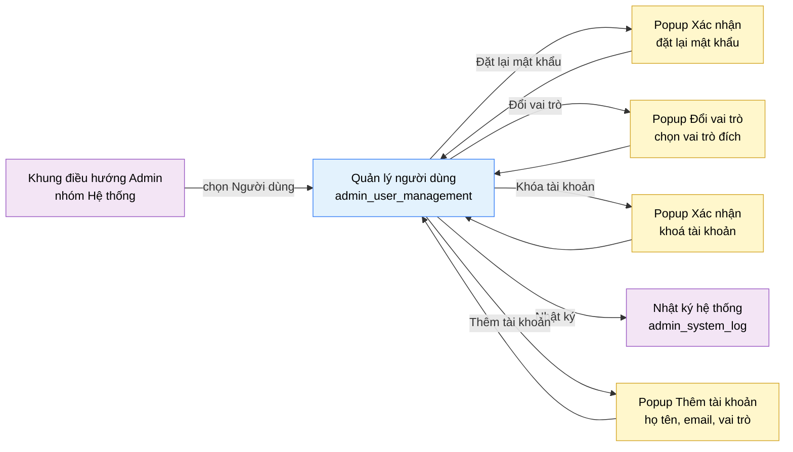

# Tài liệu thiết kế cơ bản (BD) — Quản lý người dùng (`ADM0201`)

## Phương châm tài liệu [Nội bộ — không cần khách duyệt]

- Viết theo **mẫu 9 sheet**. Bộ thẻ đóng, quy ước ID, ký hiệu chuẩn, ranh giới với tài liệu khác và
  checklist kiểm toán nằm ở `02-bd/_rules/bd-template-9sheet.md` — file này không chép lại.
- Phần gắn nhãn `[Nội bộ]` phục vụ sinh mã và tự kiểm toán, không phải yêu cầu của khách hàng: mục 4.5, mục
  7.3 và các ghi chú quy ước.
- Mã màn `ADM0201` theo bảng mã ở `02-bd/_rules/bd-template-9sheet.md` mục 8; tên file mang tiền tố mã.
- Màn này không có màn con, có 3 popup xác nhận (Đặt lại mật khẩu, Đổi vai trò, Khoá tài khoản) và từ V0.7
  (2026-10-01) thêm popup nhập liệu "Thêm tài khoản".

> Đọc cùng `01-rd/screens/admin/ADM0201_user_management.md` (hành vi ở mức yêu cầu, không lặp lại ở đây) và ba
> file BD module: `02-bd/architecture/identity.md`, `02-bd/database/identity.md`,
> `02-bd/security/identity.md`. Khung điều hướng, thanh công cụ và chân trang khu Admin dùng lại
> `02-bd/screens/admin/_shell.md`, không mô tả lại.
>
> **Phạm vi đã chốt trước khi viết BD** — kế thừa nguyên văn từ BD cũ (V0.1) và RD mục 5, không mở lại:
> - **Không thiết kế** mục "Báo cáo nghi gian lận" — ngoài phạm vi đồ án
>   (`DEC-2026-0831-remove-plagiarism-report`) [Nguồn: 01-rd/screens/admin/ADM0201_user_management.md:63].
> - **Không thiết kế** mục "Đề nghị cấp quyền giảng viên" và luồng tự yêu cầu nâng vai trò — chỉ ADMIN được
>   đổi vai trò, đúng nguyên văn F1-13 [Nguồn: 01-rd/screens/admin/ADM0201_user_management.md:62].
> - "Yêu cầu đặt lại mật khẩu" **tách khỏi** khối "Cần xử lý", chuyển sang dải chỉ số tổng
>   [Nguồn: 01-rd/screens/admin/ADM0201_user_management.md:64]. **Cập nhật 2026-10-01:** dải chỉ số tổng đã bị
>   bỏ khỏi UI (chỉ trang tổng quan hiển thị KPI, trang danh sách chỉ có bộ lọc và danh sách — xem
>   `02-bd/screens/admin/_shell.md`). Chỉ số này đã **chuyển lên trang tổng quan Admin làm thẻ thứ ba**
>   (`DEC-2026-1001-single-overview-page-kpi`, xem `02-bd/screens/admin/ADM0101_overview.md` Khu vực A NO 9-12); màn
>   này không còn hiển thị nó.

---

## Sheet 1. Bìa

| Mục | Giá trị |
| :--- | :--- |
| Hệ thống | AlgoPrep |
| Phân hệ | `identity` (F1) |
| Công đoạn | BD — Thiết kế cơ bản |
| Phân loại | Màn hình |
| Tên màn | Quản lý người dùng |
| Mã màn hình | `ADM0201` |
| Tên vật lý (slug) | `admin_user_management` |
| Trục tài liệu | Màn hình (`02-bd/screens/`) |
| Actor | A3 (`ADMIN`) |
| Phiên bản | V0.7 |
| Người tạo | Nhóm phát triển AlgoPrep |
| Ngày tạo | 2026/09/15 |
| Người cập nhật | Nhóm phát triển AlgoPrep |
| Ngày cập nhật | 2026/10/01 |

---

## Sheet 2. Lịch sử sửa đổi

| Ver | Sheet bị sửa | Nội dung sửa | Ngày | Người sửa |
| :--- | :--- | :--- | :--- | :--- |
| V0.1 | Toàn bộ | Tạo mới theo cấu trúc 8 mục văn xuôi (phạm vi đã chốt, layout, component inventory, screen states, API tiêu thụ, điều hướng, quyền truy cập, câu hỏi mở) | 2026/09/15 | Nhóm phát triển AlgoPrep |
| V0.2 | Toàn bộ | Chuyển sang mẫu 9 sheet. Bổ sung Sheet 3 sơ đồ chuyển màn, Sheet 5 và 6 danh sách item kèm nguồn giá trị từng trường, Sheet 8 danh sách sự kiện, Sheet 9 đặc tả kiểm tra (gồm các trường hợp nguy hiểm: tự khoá chính mình, tự hạ vai trò, ADMIN cuối cùng). Phát hiện thiếu nguồn dữ liệu cho trạng thái "Chờ xác thực email" — mở Q3 | 2026/09/20 | Nhóm phát triển AlgoPrep |
| V0.3 | 5, 6 | Áp `DEC-2026-0922-users-and-admin-conflict-resolutions`: điền nguồn cột `users.last_active_at` cho thẻ "Đang hoạt động 24 giờ" và cột "Hoạt động". Đóng Q4 | 2026-09-24 | AI |
| V0.4 | 3, 4, 5, 6, 7, 8; Câu hỏi mở | Bỏ dải 5 thẻ chỉ số tổng khỏi UI (Khu vực B còn ghi chú rỗng, giữ chữ cái C trở đi); `UserManagementStatsDto` chỉ còn `pendingVerificationCount`; đánh số lại DTO 9 → 11; Q5 hết áp dụng. Hai khối bên dưới (Phân bố theo vai trò, Cần xử lý) giữ nguyên. Theo quy ước "chỉ một trang tổng quan hiển thị KPI" | 2026-10-01 | AI |
| V0.5 | 4, Câu hỏi mở | Đồng bộ ngày 2026-10-01: chỉ số "Yêu cầu đặt lại mật khẩu" đã chuyển lên trang tổng quan Admin làm thẻ thứ ba (sửa các câu "chưa có chỗ hiển thị" và "nếu trang tổng quan dùng"); sửa trích dẫn khoá Redis `identity:pwreset:<userId>` từ dòng 132 sang đúng dòng 134 của `02-bd/database/identity.md`; thêm đề xuất cho Q1, Q6 theo nguyên tắc admin (chờ owner xác nhận) | 2026-10-01 | AI |
| V0.6 | Sheet 3, 5, 6, 8, 9, Câu hỏi mở | Đã chốt 2026-10-01 (owner uỷ quyền cân nhắc), xem `DEC-2026-1001-admin-configurable-settings`: (1) Q1: "Thêm tài khoản" **nằm trong phạm vi** (ADMIN tạo tài khoản INSTRUCTOR hoặc STUDENT, mật khẩu tạm qua email, ghi `system_audit_logs`), chưa dựng; cần mở rộng RD F1-13 (không sửa `01-rd/req` ở đợt này); (2) Q6: giữ **chặn cứng** "luôn còn ít nhất một ADMIN hoạt động" (bất biến bảo toàn khả năng cấu hình của admin); "không tự khoá" và "không tự hạ vai trò" đổi từ chặn cứng sang **cảnh báo xác nhận** (cho phép nếu xác nhận). Sửa Sheet 9 NO 6, 7 từ mức Lỗi sang Cảnh báo | 2026-10-01 | AI |
| V0.7 | Phương châm, Sheet 3, 4, 5, 6, 7, 8, 9, Câu hỏi mở | Đồng bộ với prototype dựng 2026-10-01 (kiểm ở vòng 5): popup "Thêm tài khoản" đã dựng nên bỏ các câu "chưa dựng", "prototype chỉ có nút", "chỉ dựng nút khi...". Mô tả đủ popup (họ tên bắt buộc, email đúng định dạng và không trùng, vai trò `INSTRUCTOR` hoặc `STUDENT`, thông báo "mật khẩu tạm đã gửi", tài khoản mới ở trạng thái chờ xác thực), thêm EVT-17 đến EVT-19, Sheet 9 NO 13-15, DTO NO 12, endpoint NO 8. RD F1-13 đã mở rộng (`01-rd/req/identity.md:69`) nên Q1 chỉ còn thiếu bảng và endpoint thật. Luồng khoá (chặn cứng ADMIN cuối cùng, cảnh báo khi tự khoá) đối chiếu `model/guards.ts` và khớp, không đổi quy tắc | 2026/10/01 | AI |

---

## Sheet 3. Sơ đồ chuyển màn

> [Nội bộ] Quy ước vẽ: bố trí từ trái sang phải. Màn gọi tới tô tím, màn hiện tại tô xanh nhạt, popup tô
> vàng. Màu và `[Nguồn:]` dùng để truy vết, không phải yêu cầu của khách hàng.

### 3.1 Danh sách chuyển màn

#### Khung điều hướng Admin → Quản lý người dùng

[Điều kiện mở] Chọn mục con "Người dùng" trong nhóm "Hệ thống" ở thanh điều hướng bên trái.

[Chế độ mở] Chế độ danh sách, không lọc sẵn — tab vai trò và tab trạng thái đều ở "Tất cả".

[Thông tin truyền] Không có.

[Giá trị trả về] Không có.

[Khi thành công] Tải trang đầu của bảng người dùng, khối phân bố theo vai trò và khối cần
xử lý.

[Khi huỷ] Không có.

#### Quản lý người dùng → Popup Xác nhận đặt lại mật khẩu

[Điều kiện mở] Đang chọn ít nhất một tài khoản và bấm "Đặt lại mật khẩu" trên thanh hành động gộp.

[Chế độ mở] Chế độ xác nhận, không nhập liệu.

[Thông tin truyền] Danh sách `id` tài khoản đang chọn và số lượng tài khoản.

[Giá trị trả về] Kết quả chọn "Xác nhận" hoặc "Huỷ".

[Khi thành công] Popup liệt kê số tài khoản chịu tác động và ghi rõ mật khẩu mới được gửi qua email cho
từng người dùng, không hiển thị cho quản trị viên.

[Khi huỷ] Đóng popup, giữ nguyên danh sách đang chọn.

#### Quản lý người dùng → Popup Đổi vai trò

[Điều kiện mở] Đang chọn ít nhất một tài khoản và bấm "Đổi vai trò" trên thanh hành động gộp.

[Chế độ mở] Chế độ chọn vai trò đích rồi xác nhận.

[Thông tin truyền] Danh sách `id` tài khoản đang chọn.

[Giá trị trả về] `role_id` đích đã chọn, hoặc không có gì nếu huỷ.

[Khi thành công] Popup hiển thị danh sách vai trò khả dụng để chọn một vai trò đích.

[Khi huỷ] Đóng popup, giữ nguyên danh sách đang chọn, không gọi máy chủ.

#### Quản lý người dùng → Popup Xác nhận khoá tài khoản

[Điều kiện mở] Đang chọn ít nhất một tài khoản và bấm "Khóa tài khoản" trên thanh hành động gộp.

[Chế độ mở] Chế độ xác nhận hành động phá huỷ.

[Thông tin truyền] Danh sách `id` tài khoản đang chọn và số lượng tài khoản.

[Giá trị trả về] Kết quả chọn "Xác nhận" hoặc "Huỷ".

[Khi thành công] Popup cảnh báo các tài khoản bị khoá sẽ mất quyền đăng nhập ngay ở lần kiểm quyền kế tiếp
[Nguồn: 02-bd/security/identity.md:60-62].

[Khi huỷ] Đóng popup, không tài khoản nào bị đổi trạng thái.

#### Quản lý người dùng → Nhật ký hệ thống

[Điều kiện mở] Bấm liên kết "Nhật ký" ở góc phải khối "Cần xử lý".

[Chế độ mở] Không có.

[Thông tin truyền] Không có. Màn đích không được lọc sẵn theo tài khoản nào.

[Giá trị trả về] Không có.

[Khi thành công] Điều hướng sang màn `admin_system_log`. Danh sách đang chọn ở màn này bị bỏ, không mang
theo.

[Khi huỷ] Không có.

#### Quản lý người dùng → Popup Thêm tài khoản (đã chốt vào phạm vi 2026-10-01, prototype đã dựng)

[Điều kiện mở] Bấm nút "Thêm tài khoản" ở thanh tiêu đề.

[Chế độ mở] Popup nhập liệu, mỗi lần mở bắt đầu với họ tên và email rỗng, vai trò mặc định `STUDENT`.

[Thông tin truyền] Tập email các tài khoản đang có (prototype dùng để báo trùng ở phía giao diện).

[Giá trị trả về] Tài khoản vừa tạo, hoặc không có gì nếu người dùng huỷ.

[Khi thành công] Popup đổi sang thông báo "Đã tạo tài khoản" ghi rõ mật khẩu tạm đã gửi tới email vừa nhập và tài khoản ở trạng thái chờ xác thực cho tới lần đăng nhập đầu tiên; nút "Huỷ" đổi thành "Xong". Tài khoản mới hiện **đầu danh sách** với trạng thái "chờ xác thực". RD F1-13 đã mở rộng cho việc này (`01-rd/req/identity.md:69`); phần còn thiếu là bảng và endpoint thật, xem Câu hỏi mở Q1.

[Khi huỷ] Đóng popup, không tạo tài khoản.

[Nguồn: 05-coding/frontend/src/views/admin/user-management/ui/add-account-dialog.tsx:24-115; 05-coding/frontend/src/views/admin/user-management/ui/admin-user-management-view.tsx:323-328]

### 3.2 Sơ đồ

[Nguồn: 09-layoutBase/Admin - Người dùng.dc.html:158,194-203,261,339-341; 01-rd/screens/admin/ADM0201_user_management.md:62-64]

---

## Sheet 4. Bố cục màn hình

### 4.1 Tổng quan màn

[Mục đích màn] Cho quản trị viên tìm kiếm và lọc tài khoản người dùng, rồi thực hiện ba thao tác xử lý sự cố
tài khoản: đổi vai trò, khoá tài khoản và đặt lại mật khẩu hộ — trên một hoặc nhiều tài khoản cùng lúc
[Nguồn: 01-rd/screens/admin/ADM0201_user_management.md:21-22].

[Luồng nghiệp vụ chính]

1. **Hiển thị ban đầu**: vào màn, hệ thống tải song song ba nhóm dữ liệu — trang đầu bảng người dùng,
   khối phân bố theo vai trò và khối cần xử lý. Trong lúc chờ, mỗi khối hiển thị khung chờ đúng
   số dòng dự kiến.
2. **Thu hẹp danh sách**: quản trị viên gõ từ khoá theo tên hoặc email, chọn tab vai trò và tab trạng thái.
   Mỗi lần đổi điều kiện thì về trang 1 và bỏ toàn bộ lựa chọn đang có.
3. **Chọn tài khoản**: tích chọn từng dòng. Có ít nhất một dòng được chọn thì thanh hành động gộp hiện ra.
4. **Thực hiện hành động**: bấm một trong ba nút hành động, xác nhận trong popup. Hệ thống áp dụng hành động
   cho **từng** tài khoản đã chọn.
5. **Ghi nhật ký**: mỗi tài khoản chịu tác động ghi **một dòng riêng** vào `system_audit_logs`, không gộp
   thành một dòng [Nguồn: 01-rd/screens/admin/ADM0201_user_management.md:53-56].
6. **Làm mới**: sau khi hành động thành công, tải lại bảng, xoá danh sách đang chọn.

[Người dùng] Quản trị viên đã đăng nhập, có Function `USER_MANAGEMENT`
[Nguồn: 02-bd/database/identity.md:47-49].

[Tệp liên quan] Không có. Màn này không xuất hay nhập tệp.

[Phạm vi]
- Không có "Báo cáo nghi gian lận" (`DEC-2026-0831-remove-plagiarism-report`).
- Không có luồng tự yêu cầu nâng vai trò; chỉ ADMIN đổi vai trò.
- Không sửa hồ sơ người dùng (tên hiển thị, email, ngôn ngữ mặc định) — F1-13 chỉ nêu ba thao tác xử lý sự
  cố tài khoản.
- Không cấu hình ma trận phân quyền — thuộc màn `admin_permission_matrix` (`ADM0202`).
- Nút "Thêm tài khoản" **nằm trong phạm vi** (đã chốt 2026-10-01, RD F1-13 đã mở rộng `01-rd/req/identity.md:69`); prototype đã dựng popup, chưa có endpoint thật, xem Câu hỏi mở Q1.
- Không có nút mở khoá tài khoản trong prototype, xem Câu hỏi mở Q2.

[Quyền sử dụng]
- Xem: được, khi có `USER_MANAGEMENT:READ`.
- Thêm: được, khi có `USER_MANAGEMENT:CREATE` (nút "Thêm tài khoản", đã chốt vào phạm vi 2026-10-01, prototype đã dựng popup, Q1).
- Sửa: được, khi có `USER_MANAGEMENT:UPDATE` — đổi vai trò, đổi trạng thái, đặt lại mật khẩu.
- Xoá: không. Khoá tài khoản là đặt `users.status = DEACTIVATED`, không xoá dòng
  [Nguồn: 02-bd/database/identity.md:21].

[Số bản ghi tối đa] Bảng người dùng phân trang phía máy chủ; prototype hiển thị 9 dòng một trang và nhãn
"Trang 1 trong 143" — kích thước trang thật chốt ở DD. Phân bố theo vai trò: đúng 4
dòng. Cần xử lý: 1 dòng sau khi cắt phạm vi.

[Nguồn: 01-rd/screens/admin/ADM0201_user_management.md:19-49; 02-bd/database/identity.md:8-24,45-49; 02-bd/security/identity.md:25-26]

### 4.2 DTO liên quan

- `AdminUserListItemDto`
- `UserManagementStatsDto` (chỉ còn `pendingVerificationCount` cho khối "Cần xử lý")
- `RoleDistributionItemDto`
- `RoleOptionDto`
- `BulkUserActionResultDto`

`[Suy luận]` — tên DTO do BD này đề xuất, `03-dd/api/identity.md` chốt lại.

### 4.3 Bảng dữ liệu liên quan (5)

| NO | Bảng | Ghi chú |
| --: | :--- | :--- |
| 1 | `users` | [Nguồn: 02-bd/database/identity.md:8-24] |
| 2 | `roles` | [Nguồn: 02-bd/database/identity.md:31-43] |
| 3 | `system_audit_logs` | [Nguồn: 02-bd/database/identity.md:103-107] |
| 4 | `user_problem_best_score` | [Nguồn: 02-bd/database/identity.md:111-112] |
| 5 | `user_submission_stats` | [Nguồn: 02-bd/database/identity.md:113-114] |

Chỉ số "Yêu cầu đặt lại mật khẩu" (thẻ đã bỏ khỏi màn 2026-10-01, nay thuộc trang tổng quan Admin) **không dùng
bảng PostgreSQL**: các khoá OTP quên mật khẩu nằm trên Redis theo mẫu `identity:pwreset:<userId>`, TTL 10 phút
[Nguồn: 02-bd/database/identity.md:134]; nguồn số liệu 24 giờ của thẻ mới là câu hỏi mở Q4 của `ADM0101`. Bảng `permissions` không liệt kê ở đây vì việc kiểm quyền do tầng
hạ tầng chung của `identity` thực hiện qua cache, không phải truy vấn của màn
[Nguồn: 02-bd/security/identity.md:35-37].

### 4.4 Vùng bố cục

Đối chiếu `09-layoutBase/Admin - Người dùng.dc.html` — bằng chứng bố cục chỉ-đọc, **không phải** design
system cuối cùng.

| Vùng | Vị trí trong prototype | Nội dung |
| :--- | :--- | :--- |
| Thanh điều hướng bên trái (khung chung Admin) | `:68-144` | Nhóm "Hệ thống" đang mở, mục con "Người dùng" đang chọn — dùng lại khung chung của mọi màn Admin |
| Thanh tiêu đề dính trên | `:148-159` | Tiêu đề, mô tả phụ, công tắc theme (khung chung), nút "Thêm tài khoản" |
| Dải chỉ số tổng | `:161-172`, dữ liệu `:422-428` | **Không dựng trên UI Next.js (2026-10-01)** — trang danh sách không hiển thị KPI |
| Khối bảng — hàng bộ lọc | `:176-192` | Ô tìm kiếm, tab vai trò 4 mục, tab trạng thái 3 mục, nhãn số kết quả |
| Khối bảng — thanh hành động gộp | `:194-203` | Chỉ hiện khi `hasSelection`; nhãn số đã chọn và 3 nút hành động |
| Khối bảng — bảng người dùng | `:205-228`, tiêu đề cột `:206-207` | Lưới 7 cột, tối thiểu 700px, cuộn ngang khi hẹp |
| Khối bảng — phân trang | `:230-236` | Nhãn trang và hai nút "Trước" / "Sau" |
| Cột trái dưới — "Phân bố theo vai trò" | `:240-256`, dữ liệu `:476-481` | 4 thanh ngang tỉ lệ |
| Cột phải dưới — "Cần xử lý" | `:258-274`, dữ liệu `:483-486` | Danh sách việc cần xử lý kèm liên kết "Nhật ký" |
| Chân trang (khung chung Admin) | `:277-290` | Phiên bản, trạng thái dịch vụ, liên kết phụ — dùng lại khung chung |

Hai khối dưới cùng nằm trong một lưới `repeat(auto-fit, minmax(320px, 1fr))` (`:239`): trên màn rộng là hai
cột ngang hàng, trên màn hẹp xếp chồng. Giữ nguyên cấu trúc này khi dựng Next.js; không quy định màu sắc,
khoảng cách hay typography ở BD.

### 4.5 Cấu trúc slice FSD [Nội bộ]

| Khối | Slice dự kiến | Căn cứ |
| :--- | :--- | :--- |
| Trang | `views/admin/user-management` | Quy ước FSD của dự án |
| Khung Admin | Dùng lại `widgets/admin-shell` | `02-bd/screens/admin/_shell.md` |
| Bảng người dùng | `widgets/user-table` + `entities/user` | Prototype `:174-237` |
| Bộ lọc | `features/user-filter` | Prototype `:176-192` |
| Hành động gộp | `features/user-bulk-action` | Prototype `:194-203` |
| Hai khối thống kê | `widgets/role-distribution`, `widgets/admin-todo-list` | Prototype `:239-274` |

`[Suy luận]` — ánh xạ slice do BD đề xuất, DD màn hình chốt lại.

> [Nội bộ] Ảnh minh hoạ đặt ở `08-diagram/02-bd/screens/admin/`, chụp bằng Playwright trên ứng dụng Next.js
> thật khi đã có mã chạy được. Chưa có thì tham chiếu prototype, không vẽ tay.

---

## Sheet 5. Danh sách item màn hình

> Quy ước ID, bộ thẻ và giá trị chuẩn: `02-bd/_rules/bd-template-9sheet.md` mục 2, 3, 4.

### Khu vực A — Thanh tiêu đề

| Khu vực | NO | Tên item | ID item | Bảng DB | Cột DB | Loại UI | Kiểu | Độ dài | Bắt buộc | I/O | Giá trị mặc định | Định dạng | Ghi chú |
| :--- | --: | :--- | :--- | :--- | :--- | :--- | :--- | :--- | :-: | :-: | :--- | :--- | :--- |
| Thanh tiêu đề | | | | | | | | | | | | | |
| | 1 | Tiêu đề màn | `adminUserManagement.header.title` | - | - | Label | String | - | - | O | Quản lý người dùng | - | Tên màn hiển thị cố định [Nguồn giá trị] Nhãn tĩnh i18n [EVT liên quan] - |
| | 2 | Mô tả phụ | `adminUserManagement.header.subtitle` | - | - | Label | String | - | - | O | Tài khoản, vai trò và trạng thái truy cập | - | Mô tả ngắn phạm vi màn [Nguồn giá trị] Nhãn tĩnh i18n [EVT liên quan] - |
| | 3 | Thêm tài khoản | `adminUserManagement.header.btnAddUser` | - | - | Button | - | - | - | I | - | - | Tạo tài khoản thủ công: ADMIN chọn vai trò `INSTRUCTOR` hoặc `STUDENT`, đặt mật khẩu tạm gửi qua email, bắt đổi ở lần đăng nhập đầu, mỗi lần tạo ghi một dòng `system_audit_logs`. **Đã chốt vào phạm vi 2026-10-01** (`DEC-2026-1001-admin-configurable-settings`); RD F1-13 đã mở rộng (`01-rd/req/identity.md:69`), xem Q1. Bấm nút chỉ mở popup "Thêm tài khoản" (Popup NO 4-11) [Nguồn giá trị] - [EVT liên quan] EVT-15 |

### Khu vực B — Dải chỉ số tổng (đã bỏ)

Khu vực này **không còn item nào** kể từ 2026-10-01: 5 thẻ chỉ số (Tổng tài khoản, Đang hoạt động 24 giờ, Chờ
xác thực email, Bị khoá, Yêu cầu đặt lại mật khẩu) cùng biến động và chú thích đã bị xoá khỏi UI theo quy ước
"chỉ một trang tổng quan hiển thị KPI" (`02-bd/screens/admin/_shell.md`). Giữ nguyên chữ cái khu vực C trở đi để
các tham chiếu hiện có không phải đánh số lại.

### Khu vực C — Bộ lọc và hành động gộp

| Khu vực | NO | Tên item | ID item | Bảng DB | Cột DB | Loại UI | Kiểu | Độ dài | Bắt buộc | I/O | Giá trị mặc định | Định dạng | Ghi chú |
| :--- | --: | :--- | :--- | :--- | :--- | :--- | :--- | :--- | :-: | :-: | :--- | :--- | :--- |
| Bộ lọc và hành động gộp | | | | | | | | | | | | | |
| | 1 | Ô tìm kiếm | `adminUserManagement.filter.query` | `users` | `display_name`, `email` | TextBox | String | 100 | - | I | rỗng | - | Tìm theo tên hoặc email. Prototype ghi placeholder "Tìm theo tên, email hoặc tài khoản" nhưng `users` không có cột tên đăng nhập riêng, nên chỉ khớp hai cột này [Nguồn giá trị] Giá trị người dùng nhập [EVT liên quan] EVT-2 |
| | 2 | Tab vai trò | `adminUserManagement.filter.roleTabs` | `roles` | `base_category` | Button | Enum | - | - | I | Tất cả | - | 4 tab: Tất cả, Người học, Giảng viên, Quản trị. Lọc theo `roles.base_category` **chứ không phải** `roles.code`, vì role tuỳ biến vẫn phải rơi đúng nhóm cơ bản [Nguồn: 02-bd/architecture/identity.md:74-80] [Nguồn giá trị] Nhãn tĩnh i18n map từ `base_category` [EVT liên quan] EVT-3 |
| | 3 | Tab trạng thái | `adminUserManagement.filter.statusTabs` | `users` | `status` | Button | Enum | - | - | I | Tất cả | - | 3 tab: Tất cả, Hoạt động, Bị khóa. Prototype không có tab "Chờ xác thực" dù bảng có nhãn đó [Nguồn giá trị] Nhãn tĩnh i18n map từ `users.status` [EVT liên quan] EVT-4 |
| | 4 | Số kết quả | `adminUserManagement.filter.resultCount` | - | - | Label | String | - | - | O | - | `{số} / {số} tài khoản` | Số dòng khớp bộ lọc trên tổng số [Công thức] Số bản ghi khớp điều kiện lọc, chia cho tổng số tài khoản — cả hai lấy từ phản hồi của `ListUsers` [EVT liên quan] EVT-2, EVT-3, EVT-4 |
| | 5 | Nhãn số đã chọn | `adminUserManagement.bulk.selectionLabel` | - | - | Label | String | - | - | O | - | `Đã chọn {số} tài khoản` | Số tài khoản đang được tích chọn [Công thức] Đếm số dòng đang tích chọn ở trạng thái màn hình [EVT liên quan] EVT-5 |
| | 6 | Đặt lại mật khẩu | `adminUserManagement.bulk.btnResetPassword` | - | - | Button | - | - | - | I | - | - | Mở popup xác nhận đặt lại mật khẩu cho các tài khoản đã chọn (F1-13) [Nguồn giá trị] - [EVT liên quan] EVT-8 |
| | 7 | Đổi vai trò | `adminUserManagement.bulk.btnChangeRole` | - | - | Button | - | - | - | I | - | - | Mở popup chọn vai trò đích cho các tài khoản đã chọn (F1-13) [Nguồn giá trị] - [EVT liên quan] EVT-10 |
| | 8 | Khóa tài khoản | `adminUserManagement.bulk.btnLock` | - | - | Button | - | - | - | I | - | - | Mở popup xác nhận khoá các tài khoản đã chọn (F1-13). Trong prototype nút này gắn nhầm vào hành động bỏ chọn (`clearSelection`, `:200`) — là lỗi nối dây của bản tĩnh, không phải hành vi thiết kế [Nguồn giá trị] - [EVT liên quan] EVT-12 |

### Khu vực D — Bảng người dùng

| Khu vực | NO | Tên item | ID item | Bảng DB | Cột DB | Loại UI | Kiểu | Độ dài | Bắt buộc | I/O | Giá trị mặc định | Định dạng | Ghi chú |
| :--- | --: | :--- | :--- | :--- | :--- | :--- | :--- | :--- | :-: | :-: | :--- | :--- | :--- |
| Bảng người dùng | | | | | | | | | | | | | |
| | 1 | Danh sách người dùng | `adminUserManagement.list` | `users` | - | List | List | - | - | O | rỗng | - | Mỗi dòng là một tài khoản. Phân trang phía máy chủ [Nguồn giá trị] Kết quả gọi `ListUsers` [EVT liên quan] EVT-1 |
| | 2 | Ô chọn dòng | `adminUserManagement.list.col.checkbox` | - | - | Button | Boolean | - | - | I | Không chọn | - | Tích chọn tài khoản trên dòng đó để đưa vào hành động gộp. Trạng thái chỉ tồn tại trên màn, không lưu máy chủ [Nguồn giá trị] Trạng thái chọn của màn hình [EVT liên quan] EVT-5 |
| | 3 | Chữ viết tắt | `adminUserManagement.list.col.initials` | `users` | `display_name` | ListColumn | String | 2 | - | O | - | 2 ký tự in hoa | Vòng tròn chữ cái đầu thay ảnh đại diện [Công thức] Lấy chữ cái đầu của hai từ cuối trong `display_name` [Nguồn: 09-layoutBase/Admin - Người dùng.dc.html:459] [EVT liên quan] - |
| | 4 | Tên người dùng | `adminUserManagement.list.col.displayName` | `users` | `display_name` | ListColumn | String | - | - | O | - | - | Tên hiển thị của tài khoản [Nguồn giá trị] Cột `display_name` [EVT liên quan] - |
| | 5 | Email | `adminUserManagement.list.col.email` | `users` | `email` | ListColumn | String | - | - | O | - | - | Địa chỉ email đăng nhập [Nguồn giá trị] Cột `email` [EVT liên quan] - |
| | 6 | Vai trò | `adminUserManagement.list.col.role` | `roles` | `name`, `base_category` | Badge | String | - | - | O | - | Nhãn tiếng Việt | Vai trò của tài khoản, hiển thị dạng thẻ [Nguồn giá trị] `roles.name` qua `users.role_id`; nhóm màu lấy theo `roles.base_category`, không theo `roles.code` — role tuỳ biến vẫn hiển thị đúng nhóm cơ bản [Nguồn: 02-bd/architecture/identity.md:74-80] [EVT liên quan] - |
| | 7 | Đã giải | `adminUserManagement.list.col.solvedCount` | `user_problem_best_score` | `best_verdict` | ListColumn | Number | 6 | - | O | 0 | Số nguyên | Số bài tập đã giải được [Công thức] Đếm số `problem_id` của người dùng có `best_verdict = 'ACCEPTED'` [Nguồn: 02-bd/database/identity.md:111-112] [EVT liên quan] - |
| | 8 | Lượt nộp | `adminUserManagement.list.col.submissionCount` | `user_submission_stats` | `total_submissions` | ListColumn | Number | 8 | - | O | 0 | Số nguyên phân cách nghìn | Tổng số lượt nộp bài [Nguồn giá trị] Cột `total_submissions` [Nguồn: 02-bd/database/identity.md:113-114] [EVT liên quan] - |
| | 9 | Hoạt động | `adminUserManagement.list.col.lastActive` | `users` | `last_active_at` | ListColumn | String | - | - | O | - | Mô tả tương đối | Mốc hoạt động gần nhất, dạng "5 phút trước" / "Đang trực tuyến" [Nguồn giá trị] Cột `users.last_active_at` [Nguồn: 02-bd/database/identity.md:22] [Công thức] Chưa có `last_active_at` thì hiển thị `-`; ngược lại đổi sang khoảng thời gian tương đối. Ngưỡng "Đang trực tuyến" (`last_active_at` trong 5 phút gần nhất) không có nguồn nào chốt số phút — `[SoT: Suy luận]` 5 phút, chọn theo cùng bậc với chu kỳ cập nhật hãm-theo-phút của cột này [Nguồn: 02-bd/database/identity.md:22], quá đó thì hiển thị dạng tương đối thường ("5 phút trước"). Đóng Q4 [EVT liên quan] - |
| | 10 | Trạng thái | `adminUserManagement.list.col.status` | `users` | `status` | Badge | Enum | - | - | O | - | Nhãn tiếng Việt kèm chấm màu | Trạng thái truy cập của tài khoản. Prototype có ba nhãn "Hoạt động" / "Chờ xác thực" / "Bị khóa" nhưng `users.status` chỉ có hai giá trị [Nguồn giá trị] `ACTIVE` thành "Hoạt động", `DEACTIVATED` thành "Bị khóa"; nhãn "Chờ xác thực" **chưa có nguồn**, xem Q3 [EVT liên quan] - |
| | 11 | Nhãn trang | `adminUserManagement.paging.label` | - | - | Label | String | - | - | O | - | `Trang {số} trong {số} · hiển thị {số} dòng` | Vị trí trang hiện tại và số dòng đang hiển thị [Công thức] Số trang hiện tại và tổng số trang lấy từ phần phân trang trong phản hồi của `ListUsers` [EVT liên quan] EVT-6, EVT-7 |
| | 12 | Trang trước | `adminUserManagement.paging.btnPrev` | - | - | Button | - | - | - | I | - | - | Lùi về trang liền trước của kết quả lọc [Nguồn giá trị] - [EVT liên quan] EVT-6 |
| | 13 | Trang sau | `adminUserManagement.paging.btnNext` | - | - | Button | - | - | - | I | - | - | Tiến tới trang liền sau của kết quả lọc [Nguồn giá trị] - [EVT liên quan] EVT-7 |

### Khu vực E — Phân bố theo vai trò

| Khu vực | NO | Tên item | ID item | Bảng DB | Cột DB | Loại UI | Kiểu | Độ dài | Bắt buộc | I/O | Giá trị mặc định | Định dạng | Ghi chú |
| :--- | --: | :--- | :--- | :--- | :--- | :--- | :--- | :--- | :-: | :-: | :--- | :--- | :--- |
| Phân bố theo vai trò | | | | | | | | | | | | | |
| | 1 | Tiêu đề khối | `adminUserManagement.roleDist.title` | - | - | Label | String | - | - | O | Phân bố theo vai trò | - | Tên khối thống kê [Nguồn giá trị] Nhãn tĩnh i18n [EVT liên quan] - |
| | 2 | Chú thích tổng | `adminUserManagement.roleDist.subtitle` | `users` | `status` | Label | String | - | - | O | - | `Tổng {số} tài khoản đang hoạt động` | Tổng số tài khoản đang hoạt động [Công thức] Đếm `users` có `status = 'ACTIVE'` [EVT liên quan] EVT-1 |
| | 3 | Danh sách nhóm | `adminUserManagement.roleDist.list` | `users` | `role_id`, `status` | List | List | - | - | O | 4 dòng | - | Đúng 4 dòng: Người học, Giảng viên, Quản trị, Đã vô hiệu [Nguồn giá trị] Kết quả gọi `GetRoleDistribution` [EVT liên quan] EVT-1 |
| | 4 | Tên nhóm | `adminUserManagement.roleDist.col.groupName` | `roles` | `base_category` | ListColumn | String | - | - | O | - | Nhãn tiếng Việt | Tên nhóm hiển thị [Nguồn giá trị] Ba nhóm đầu là nhãn tĩnh i18n map từ `base_category`; nhóm "Đã vô hiệu" là nhãn tĩnh i18n map từ `users.status = 'DEACTIVATED'` [EVT liên quan] - |
| | 5 | Số lượng và tỉ lệ | `adminUserManagement.roleDist.col.value` | `users` | `role_id`, `status` | ListColumn | String | - | - | O | - | `{số} · {số}%` | Số tài khoản và tỉ lệ phần trăm của nhóm [Công thức] Tài khoản có `status = 'DEACTIVATED'` đếm vào nhóm "Đã vô hiệu" và **không** đếm vào nhóm `base_category` của nó, để bốn nhóm loại trừ nhau và tổng đúng 100% `[Suy luận]` — prototype trình bày bốn nhóm ngang hàng nhưng `base_category` và `status` là hai chiều độc lập trong schema [EVT liên quan] - |
| | 6 | Thanh tỉ lệ | `adminUserManagement.roleDist.col.bar` | - | - | ProgressBar | Number | - | - | O | - | - | Biểu diễn trực quan tỉ lệ nhóm [Công thức] Chiều rộng bằng đúng tỉ lệ phần trăm của dòng [EVT liên quan] - |

### Khu vực F — Cần xử lý

| Khu vực | NO | Tên item | ID item | Bảng DB | Cột DB | Loại UI | Kiểu | Độ dài | Bắt buộc | I/O | Giá trị mặc định | Định dạng | Ghi chú |
| :--- | --: | :--- | :--- | :--- | :--- | :--- | :--- | :--- | :-: | :-: | :--- | :--- | :--- |
| Cần xử lý | | | | | | | | | | | | | |
| | 1 | Tiêu đề khối | `adminUserManagement.todo.title` | - | - | Label | String | - | - | O | Cần xử lý | - | Tên khối việc cần quản trị viên xử lý [Nguồn giá trị] Nhãn tĩnh i18n [EVT liên quan] - |
| | 2 | Nhật ký | `adminUserManagement.todo.linkAuditLog` | - | - | Link | - | - | - | I | - | - | Điều hướng sang màn `admin_system_log` [Nguồn giá trị] - [EVT liên quan] EVT-16 |
| | 3 | Danh sách việc | `adminUserManagement.todo.list` | - | - | List | List | - | - | O | 1 dòng | - | Còn đúng 1 dòng "Chờ xác thực email" sau khi cắt "Báo cáo nghi gian lận" và "Đề nghị cấp quyền giảng viên" khỏi phạm vi [Nguồn giá trị] Dùng lại phản hồi của `GetUserManagementStats`, không gọi riêng [EVT liên quan] EVT-1 |
| | 4 | Tên việc | `adminUserManagement.todo.col.title` | - | - | ListColumn | String | - | - | O | - | - | Tên việc cần xử lý [Nguồn giá trị] Nhãn tĩnh i18n map từ mã việc [EVT liên quan] - |
| | 5 | Chú thích việc | `adminUserManagement.todo.col.meta` | - | - | ListColumn | String | - | - | O | - | - | Câu giải thích cách xử lý, ví dụ "Quá hạn 7 ngày sẽ tự huỷ" [Nguồn giá trị] Nhãn tĩnh i18n map từ mã việc [EVT liên quan] - |
| | 6 | Số lượng | `adminUserManagement.todo.col.count` | - | - | ListColumn | Number | 6 | - | O | 0 | Số nguyên | Số bản ghi đang chờ xử lý [Nguồn giá trị] Lấy từ `pendingVerificationCount` của `GetUserManagementStats` (thẻ chỉ số cùng tên đã bỏ 2026-10-01) — **chưa có nguồn**, xem Q3 [EVT liên quan] - |

### Popup

| Khu vực | NO | Tên item | ID item | Bảng DB | Cột DB | Loại UI | Kiểu | Độ dài | Bắt buộc | I/O | Giá trị mặc định | Định dạng | Ghi chú |
| :--- | --: | :--- | :--- | :--- | :--- | :--- | :--- | :--- | :-: | :-: | :--- | :--- | :--- |
| Popup | | | | | | | | | | | | | |
| | 1 | Xác nhận đặt lại mật khẩu | `adminUserManagement.popup.resetPasswordConfirm` | - | - | Popup | - | - | - | I | - | Xác nhận / Huỷ | Xác nhận trước khi đặt lại mật khẩu cho các tài khoản đã chọn. Mật khẩu mới gửi qua email cho từng người dùng, **không hiển thị cho quản trị viên** [Nguồn giá trị] Danh sách tài khoản đang chọn [EVT liên quan] EVT-8, EVT-9, EVT-14 |
| | 2 | Đổi vai trò | `adminUserManagement.popup.changeRole` | `roles` | `id`, `name` | Popup | - | - | Có | I | - | - | Chọn một vai trò đích rồi xác nhận. Danh sách vai trò lấy từ bảng `roles`, gồm cả role tuỳ biến [Nguồn giá trị] Kết quả gọi `ListRoles` [EVT liên quan] EVT-10, EVT-11, EVT-14 |
| | 3 | Xác nhận khoá tài khoản | `adminUserManagement.popup.lockConfirm` | - | - | Popup | - | - | - | I | - | Xác nhận / Huỷ | Xác nhận trước khi đặt `status = 'DEACTIVATED'` cho các tài khoản đã chọn. Nếu khoá làm hệ thống không còn ADMIN hoạt động nào thì popup đổi sang thông báo chặn cứng thay vì xác nhận (Sheet 9 NO 8); nếu tập chọn có chính tài khoản đang đăng nhập thì thêm câu cảnh báo (Sheet 9 NO 6) [Nguồn giá trị] Danh sách tài khoản đang chọn [EVT liên quan] EVT-12, EVT-13, EVT-14 |
| | 4 | Popup Thêm tài khoản | `adminUserManagement.popup.addAccount` | `users` | - | Popup | - | - | - | I/O | - | Tạo tài khoản / Huỷ | Popup nhập liệu tạo tài khoản thủ công (F1-13 mở rộng). Mỗi lần mở khởi tạo lại; đóng thì bỏ nháp [Nguồn giá trị] - [EVT liên quan] EVT-15, EVT-17, EVT-18 |
| | 5 | Họ và tên | `adminUserManagement.popup.addAccount.name` | `users` | `display_name` | TextBox | String | 100 | Có | I | rỗng | Văn bản tự do, cắt khoảng trắng hai đầu | Tên hiển thị của tài khoản mới. Độ dài 100 theo `users.display_name` `[SoT: Suy luận]` (prototype không giới hạn) [Nguồn giá trị] Người dùng nhập [EVT liên quan] EVT-17 |
| | 6 | Email | `adminUserManagement.popup.addAccount.email` | `users` | `email` | TextBox | String | 255 | Có | I | rỗng | Địa chỉ email; hệ thống cắt khoảng trắng và đổi sang chữ thường | Email đăng nhập và nơi nhận mật khẩu tạm. Không được trùng với email tài khoản đang có [Nguồn giá trị] Người dùng nhập [EVT liên quan] EVT-17 |
| | 7 | Vai trò | `adminUserManagement.popup.addAccount.role` | `roles` | `id`, `name` | ComboBox | Enum | - | Có | I | Học viên (`STUDENT`) | Học viên / Giảng viên | Chỉ hai lựa chọn `STUDENT` và `INSTRUCTOR`; **không** cho tạo `ADMIN` ở popup này [Nguồn giá trị] Hai giá trị cố định của popup (chưa dùng `ListRoles`), xem Q1 [EVT liên quan] EVT-17 |
| | 8 | Ghi chú mật khẩu tạm | `adminUserManagement.popup.addAccount.note` | - | - | Label | String | - | - | O | Mật khẩu tạm được gửi qua email; người dùng phải đổi ở lần đăng nhập đầu tiên. | - | Nhắc rằng quản trị viên không đặt hay xem mật khẩu [Nguồn giá trị] Nhãn tĩnh i18n [EVT liên quan] - |
| | 9 | Tạo tài khoản | `adminUserManagement.popup.addAccount.btnSubmit` | - | - | Button | - | - | - | I | - | - | Kiểm ba ô rồi tạo tài khoản [Nguồn giá trị] - [EVT liên quan] EVT-17 |
| | 10 | Huỷ hoặc Xong | `adminUserManagement.popup.addAccount.btnClose` | - | - | Button | - | - | - | I | - | - | Nhãn "Huỷ" trước khi tạo, đổi thành "Xong" sau khi tạo xong. Đóng popup, xoá nháp [Nguồn giá trị] - [EVT liên quan] EVT-18 |
| | 11 | Thông báo đã tạo | `adminUserManagement.popup.addAccount.createdNotice` | - | - | Label | String | - | - | O | - | `Đã tạo tài khoản` + `Mật khẩu tạm đã được gửi tới {email}. Tài khoản ở trạng thái chờ xác thực cho tới lần đăng nhập đầu tiên.` | Thay toàn bộ form sau khi tạo [Nguồn giá trị] Phản hồi của `CreateUserAccount`; email lấy từ giá trị đã chuẩn hoá [EVT liên quan] EVT-17 |

[Nguồn: 09-layoutBase/Admin - Người dùng.dc.html:148-159,161-172,176-192,194-203,205-228,230-236,240-256,258-274,422-428,459,476-481,483-486; 02-bd/database/identity.md:8-24,31-43,111-114,132; 01-rd/screens/admin/ADM0201_user_management.md:36-49; Popup NO 3 (bổ sung chặn cứng, cảnh báo) và NO 4-11: 05-coding/frontend/src/views/admin/user-management/ui/add-account-dialog.tsx:22-115, 05-coding/frontend/src/views/admin/user-management/model/guards.ts:14-26, 05-coding/frontend/messages/vi.json:545-562]

---

## Sheet 6. Đặc tả điều khiển item

> Ký hiệu cột `Hiển thị` và thứ tự thẻ: `02-bd/_rules/bd-template-9sheet.md` mục 2, 3. Dùng đúng NO, tên
> item và thứ tự của Sheet 5. Lỗi nhập liệu ghi ở Sheet 9, xử lý nghiệp vụ ghi ở Sheet 8.

### Khu vực A — Thanh tiêu đề

| Khu vực | NO | Tên item | Hiển thị | Ghi chú |
| :--- | --: | :--- | :-: | :--- |
| Thanh tiêu đề | | | | |
| | 1 | Tiêu đề màn | Có | - |
| | 2 | Mô tả phụ | Có | - |
| | 3 | Thêm tài khoản | Điều kiện | [Điều kiện hiển thị] Phạm vi đã chốt 2026-10-01 (Q1) nên nút thuộc thiết kế; RD F1-13 đã mở rộng (`01-rd/req/identity.md:69`) và prototype đã dựng popup đích, nên không còn là nút trống. Khi làm UI thật, nút vẫn chỉ nên hoạt động khi đã có endpoint `CreateUserAccount`. [Điều kiện kích hoạt] Kích hoạt khi có quyền `USER_MANAGEMENT:CREATE`. |

### Khu vực B — Dải chỉ số tổng (đã bỏ)

Không còn item nào — xem Sheet 5, Khu vực B.

### Khu vực C — Bộ lọc và hành động gộp

| Khu vực | NO | Tên item | Hiển thị | Ghi chú |
| :--- | --: | :--- | :-: | :--- |
| Bộ lọc và hành động gộp | | | | |
| | 1 | Ô tìm kiếm | Có | [Điều kiện kích hoạt] Không kích hoạt trong lúc đang tải trang đầu, kích hoạt sau khi tải xong. [Tự động đặt] Gõ xong thì chờ một khoảng ngắn mới gọi máy chủ; mỗi lần gọi đưa về trang 1. |
| | 2 | Tab vai trò | Có | [Tự động đặt] Đổi tab thì đưa về trang 1 và bỏ toàn bộ lựa chọn đang có. |
| | 3 | Tab trạng thái | Có | [Tự động đặt] Đổi tab thì đưa về trang 1 và bỏ toàn bộ lựa chọn đang có. |
| | 4 | Số kết quả | Có | [Tự động đặt] Cập nhật lại sau mỗi lần tải danh sách. |
| | 5 | Nhãn số đã chọn | Điều kiện | [Điều kiện hiển thị] Cả thanh hành động gộp chỉ hiển thị khi có ít nhất một dòng được chọn [Nguồn: 09-layoutBase/Admin - Người dùng.dc.html:194]. |
| | 6 | Đặt lại mật khẩu | Điều kiện | [Điều kiện hiển thị] Theo thanh hành động gộp. [Điều kiện kích hoạt] Kích hoạt khi có quyền `USER_MANAGEMENT:UPDATE`; không có quyền thì hiển thị nhưng không kích hoạt. |
| | 7 | Đổi vai trò | Điều kiện | [Điều kiện hiển thị] Theo thanh hành động gộp. [Điều kiện kích hoạt] Kích hoạt khi có quyền `USER_MANAGEMENT:UPDATE`. |
| | 8 | Khóa tài khoản | Điều kiện | [Điều kiện hiển thị] Theo thanh hành động gộp. [Điều kiện kích hoạt] Kích hoạt khi có quyền `USER_MANAGEMENT:UPDATE` **và** tập đang chọn có ít nhất một tài khoản `status = 'ACTIVE'`. |

### Khu vực D — Bảng người dùng

| Khu vực | NO | Tên item | Hiển thị | Ghi chú |
| :--- | --: | :--- | :-: | :--- |
| Bảng người dùng | | | | |
| | 1 | Danh sách người dùng | Có | [Điều kiện hiển thị] Trong lúc tải hiển thị khung chờ đúng số dòng của một trang. Tải xong mà không có dòng nào thì hiển thị thông báo rỗng thay cho bảng — đây là kết quả lọc rỗng, **không phải** lỗi. |
| | 2 | Ô chọn dòng | Có | [Điều kiện kích hoạt] Không kích hoạt trong lúc một hành động gộp đang chạy. [Tự động xoá] Bỏ toàn bộ lựa chọn khi đổi trang, đổi bộ lọc, hoặc sau khi một hành động gộp kết thúc. |
| | 3 | Chữ viết tắt | Có | - |
| | 4 | Tên người dùng | Có | - |
| | 5 | Email | Có | - |
| | 6 | Vai trò | Có | - |
| | 7 | Đã giải | Có | - |
| | 8 | Lượt nộp | Có | - |
| | 9 | Hoạt động | Có | - |
| | 10 | Trạng thái | Có | [Điều kiện hiển thị] Nhãn "Chờ xác thực" chỉ hiển thị khi Q3 đã chốt nguồn dữ liệu; chưa chốt thì chỉ có hai nhãn "Hoạt động" và "Bị khóa". |
| | 11 | Nhãn trang | Có | [Tự động đặt] Cập nhật lại sau mỗi lần tải danh sách. |
| | 12 | Trang trước | Có | [Điều kiện kích hoạt] Không kích hoạt khi đang ở trang 1 hoặc đang tải. |
| | 13 | Trang sau | Có | [Điều kiện kích hoạt] Không kích hoạt khi đang ở trang cuối hoặc đang tải. |

### Khu vực E — Phân bố theo vai trò

| Khu vực | NO | Tên item | Hiển thị | Ghi chú |
| :--- | --: | :--- | :-: | :--- |
| Phân bố theo vai trò | | | | |
| | 1 | Tiêu đề khối | Có | - |
| | 2 | Chú thích tổng | Có | - |
| | 3 | Danh sách nhóm | Có | [Điều kiện hiển thị] Trong lúc tải hiển thị khung chờ đúng 4 dòng. |
| | 4 | Tên nhóm | Có | - |
| | 5 | Số lượng và tỉ lệ | Có | [Tự động đặt] Tính lại sau mỗi lần tải khối; **không** tính lại theo bộ lọc của bảng — khối này luôn thống kê toàn hệ thống. |
| | 6 | Thanh tỉ lệ | Có | [Tự động đặt] Chiều rộng cập nhật cùng lúc với tỉ lệ của dòng. |

### Khu vực F — Cần xử lý

| Khu vực | NO | Tên item | Hiển thị | Ghi chú |
| :--- | --: | :--- | :-: | :--- |
| Cần xử lý | | | | |
| | 1 | Tiêu đề khối | Có | - |
| | 2 | Nhật ký | Có | [Điều kiện kích hoạt] Kích hoạt khi có quyền `SYSTEM_AUDIT_LOG:READ`; không có quyền thì không hiển thị liên kết. |
| | 3 | Danh sách việc | Điều kiện | [Điều kiện hiển thị] Chỉ hiển thị khi còn ít nhất một dòng việc. Q3 chưa chốt thì khối này rỗng và ẩn cả khối, vì dòng duy nhất còn lại phụ thuộc nguồn dữ liệu đó. |
| | 4 | Tên việc | Có | - |
| | 5 | Chú thích việc | Có | - |
| | 6 | Số lượng | Có | - |

### Popup

| Khu vực | NO | Tên item | Hiển thị | Ghi chú |
| :--- | --: | :--- | :-: | :--- |
| Popup | | | | |
| | 1 | Xác nhận đặt lại mật khẩu | Điều kiện | [Điều kiện hiển thị] Chỉ hiển thị sau khi bấm "Đặt lại mật khẩu" trên thanh hành động gộp. |
| | 2 | Đổi vai trò | Điều kiện | [Điều kiện hiển thị] Chỉ hiển thị sau khi bấm "Đổi vai trò". [Điều kiện kích hoạt] Nút xác nhận trong popup chỉ kích hoạt khi đã chọn một vai trò đích. |
| | 3 | Xác nhận khoá tài khoản | Điều kiện | [Điều kiện hiển thị] Chỉ hiển thị sau khi bấm "Khóa tài khoản". Tập đang chọn mà khoá xong sẽ không còn ADMIN hoạt động nào thì hiển thị thông báo chặn cứng (chỉ có nút đóng) thay cho hộp xác nhận. Tập chọn có chính tài khoản đang đăng nhập thì hộp xác nhận thêm một dòng cảnh báo nổi bật. |
| | 4 | Popup Thêm tài khoản | Điều kiện | [Điều kiện hiển thị] Chỉ hiển thị sau khi bấm "Thêm tài khoản". |
| | 5 | Họ và tên | Có | [Tự động đặt] Lỗi (nếu có) chỉ hiện sau lần bấm "Tạo tài khoản" đầu tiên, không hiện khi mới gõ. |
| | 6 | Email | Có | [Tự động đặt] Như NO 5. |
| | 7 | Vai trò | Có | [Tự động đặt] Chọn sẵn "Học viên" mỗi lần mở popup. |
| | 8 | Ghi chú mật khẩu tạm | Có | - |
| | 9 | Tạo tài khoản | Điều kiện | [Điều kiện hiển thị] Ẩn sau khi tạo xong. [Điều kiện kích hoạt] Luôn kích hoạt; bấm khi còn ô không hợp lệ thì hiện lỗi và không tạo. |
| | 10 | Huỷ hoặc Xong | Có | [Tự động đặt] Nhãn "Huỷ" trước khi tạo, "Xong" sau khi tạo. |
| | 11 | Thông báo đã tạo | Điều kiện | [Điều kiện hiển thị] Chỉ hiển thị sau khi tạo xong. |

[Nguồn: 09-layoutBase/Admin - Người dùng.dc.html:194,230-236; 02-bd/database/identity.md:21,47-49; Popup NO 4-11: 05-coding/frontend/src/views/admin/user-management/ui/add-account-dialog.tsx:32-112]

---

## Sheet 7. Danh sách truyền dữ liệu

### 7.1 Trường DTO

| NO | DTO | Trường DTO | Kiểu | Bảng DB | Cột DB | Item màn | Hiển thị | Ghi chú |
| --: | :--- | :--- | :--- | :--- | :--- | :--- | :-: | :--- |
| 1 | `AdminUserListItemDto` | `id` | UUID | `users` | `id` | - | Không | [Nguồn] Phản hồi của `ListUsers` [Đích] Tham số của `ChangeUserRole`, `ChangeUserStatus`, `ResetUserPassword`. Không hiển thị trên màn. |
| 2 | `AdminUserListItemDto` | `displayName` | String | `users` | `display_name` | Bảng "Tên người dùng", "Chữ viết tắt" | Có | [Chuyển đổi] Chữ viết tắt sinh phía màn hình từ chính trường này, không có trường riêng trong DTO. |
| 3 | `AdminUserListItemDto` | `email` | String | `users` | `email` | Bảng "Email" | Có | [Nguồn] Phản hồi của `ListUsers` |
| 4 | `AdminUserListItemDto` | `roleId`, `roleName`, `baseCategory` | UUID, String, Enum | `roles` | `id`, `name`, `base_category` | Bảng "Vai trò" | Có | [Chuyển đổi] `roleName` hiển thị trên thẻ; `baseCategory` quyết định nhóm màu và là khoá lọc của tab vai trò. |
| 5 | `AdminUserListItemDto` | `status` | Enum | `users` | `status` | Bảng "Trạng thái" | Có | [Chuyển đổi] `ACTIVE` thành "Hoạt động", `DEACTIVATED` thành "Bị khóa". Nhãn thứ ba "Chờ xác thực" chưa có nguồn, xem Q3. |
| 6 | `AdminUserListItemDto` | `solvedCount` | Number | `user_problem_best_score` | `best_verdict` | Bảng "Đã giải" | Có | [Nguồn] Read model, tổng hợp từ domain event [Nguồn: 02-bd/database/identity.md:109-112] [Chuyển đổi] Đếm số bài có `best_verdict = 'ACCEPTED'`. |
| 7 | `AdminUserListItemDto` | `totalSubmissions` | Number | `user_submission_stats` | `total_submissions` | Bảng "Lượt nộp" | Có | [Nguồn] Read model [Nguồn: 02-bd/database/identity.md:113-114] |
| 8 | `UserManagementStatsDto` | `pendingVerificationCount` | Number | - | - | Khối "Cần xử lý" | Điều kiện | [Nguồn] **Chưa chốt** — schema `identity` chưa có chỗ lưu trạng thái xác thực email, xem Q3. Thẻ "Chờ xác thực email" đã bỏ 2026-10-01 nên trường này chỉ còn phục vụ khối "Cần xử lý". |
| 9 | `RoleDistributionItemDto` | `groupCode`, `count`, `percent` | String, Number, Number | `users`, `roles` | `role_id`, `status`, `base_category` | Khối "Phân bố theo vai trò" | Có | [Nguồn] Phản hồi của `GetRoleDistribution` [Chuyển đổi] `groupCode` là khoá tra nhãn tĩnh i18n; bốn nhóm loại trừ nhau, tài khoản `DEACTIVATED` chỉ đếm vào nhóm "Đã vô hiệu". |
| 10 | `RoleOptionDto` | `id`, `name`, `baseCategory` | UUID, String, Enum | `roles` | `id`, `name`, `base_category` | Popup "Đổi vai trò" | Có | [Nguồn] Phản hồi của `ListRoles` [Đích] `id` là tham số `targetRoleId` của `ChangeUserRole`. |
| 11 | `BulkUserActionResultDto` | `succeededIds`, `failedItems` | List, List | - | - | Thông báo hoàn tất của EVT-9, EVT-11, EVT-13 | Có | [Nguồn] Phản hồi của ba endpoint hành động [Chuyển đổi] Một hành động gộp phía màn là **N lệnh đơn** phía tầng ứng dụng, nên kết quả có thể thành công một phần; `failedItems` mang `id` kèm mã lỗi của từng tài khoản hỏng. |
| 12 | `CreateUserAccountRequestDto` | `displayName`, `email`, `roleCode` | String, String, Enum | `users`, `roles` | `display_name`, `email`, `role_id` | Popup Thêm tài khoản NO 5, 6, 7 | Không | [Nguồn] Giá trị người dùng nhập trong popup [Đích] Tham số của `CreateUserAccount` [Chuyển đổi] `email` được cắt khoảng trắng và đổi sang chữ thường trước khi gửi và so trùng; `roleCode` chỉ nhận `STUDENT` hoặc `INSTRUCTOR`. Mật khẩu tạm do máy chủ sinh và gửi qua email, **không** có trường mật khẩu trong DTO và không hiển thị cho quản trị viên. Tài khoản tạo ra có trạng thái chờ xác thực, nơi lưu trạng thái này là Q3. |

### 7.2 Truy cập bảng dữ liệu (5)

| NO | Tên logic | Bảng | Repository | CRUD | Mục đích | Ghi chú |
| --: | :--- | :--- | :--- | :-: | :--- | :--- |
| 1 | Tài khoản người dùng | `users` | `UserRepository` | C, R, U | Tìm kiếm, lọc, phân trang; tạo tài khoản mới; đổi `role_id`, đổi `status`, đặt `password_hash` mới | `CreateUserAccount`: C `ListUsers`: R `GetUserManagementStats`: R `ChangeUserRole`: R, U `ChangeUserStatus`: R, U `ResetUserPassword`: R, U |
| 2 | Vai trò | `roles` | `RoleRepository` | R | Đọc tên và `base_category` để hiển thị thẻ vai trò; nạp danh sách vai trò đích cho popup | `ListUsers`: R `ListRoles`: R `GetRoleDistribution`: R |
| 3 | Nhật ký quản trị | `system_audit_logs` | `SystemAuditLogRepository` | C | Ghi một dòng cho **mỗi** tài khoản chịu tác động của mỗi hành động ghi | `CreateUserAccount`: C `ChangeUserRole`: C `ChangeUserStatus`: C `ResetUserPassword`: C |
| 4 | Điểm tốt nhất theo bài | `user_problem_best_score` | `UserProblemBestScoreRepository` | R | Đếm số bài đã giải cho cột "Đã giải" | `ListUsers`: R |
| 5 | Thống kê lượt nộp | `user_submission_stats` | `UserSubmissionStatsRepository` | R | Đọc tổng lượt nộp cho cột "Lượt nộp" | `ListUsers`: R |

Thao tác `C` trên `users` là của `CreateUserAccount` (thêm V0.7). Không có thao tác xoá (`D`) trên màn này: khoá tài khoản là đặt `users.status = 'DEACTIVATED'`, không xoá
dòng [Nguồn: 02-bd/database/identity.md:21]. Chỉ số "Yêu cầu đặt lại mật khẩu" (nay hiển thị ở trang tổng quan Admin) đọc trên Redis, không qua
repository JPA.

`[Suy luận]` — tên repository do BD này đề xuất, DD module `identity` chốt lại.

### 7.3 Danh sách endpoint [Nội bộ]

> Chỉ tên nghiệp vụ và BC sở hữu. Hợp đồng chi tiết thuộc `03-dd/api/identity.md`.

| NO | Endpoint (tên nghiệp vụ) | Mục đích | BC sở hữu |
| --: | :--- | :--- | :--- |
| 1 | `ListUsers` | Tìm kiếm, lọc và phân trang danh sách tài khoản | `identity` |
| 2 | `GetUserManagementStats` | Tải số liệu cho khối "Cần xử lý" (hiện chỉ số tài khoản chờ xác thực email) | `identity` |
| 3 | `GetRoleDistribution` | Tải số liệu phân bố theo vai trò | `identity` |
| 4 | `ListRoles` | Tải danh sách vai trò đích cho popup đổi vai trò | `identity` |
| 5 | `ChangeUserRole` | Đổi vai trò của một hoặc nhiều tài khoản | `identity` |
| 6 | `ChangeUserStatus` | Khoá hoặc mở khoá một hoặc nhiều tài khoản | `identity` |
| 7 | `ResetUserPassword` | Đặt lại mật khẩu hộ và gửi mật khẩu mới qua email cho người dùng | `identity` |
| 8 | `CreateUserAccount` | Tạo tài khoản `STUDENT` hoặc `INSTRUCTOR`, sinh mật khẩu tạm gửi qua email, bắt đổi ở lần đăng nhập đầu, ghi một dòng `system_audit_logs` | `identity` |

Endpoint số 8 do BD này đề xuất `[SoT: Suy luận]` (RD F1-13 đã mở rộng, `01-rd/req/identity.md:69`); tên và quyền thật do `03-dd/api/identity.md` chốt, xem Q1. Việc gộp nhiều tài khoản vào một lời gọi
hay gọi nhiều lần là quyết định kỹ thuật của DD, không phải BD.

[Nguồn: 02-bd/database/identity.md:8-24,31-43,103-114]

---

## Sheet 8. Danh sách sự kiện

> Bộ thẻ và quy ước cột `Chuyển màn`: `02-bd/_rules/bd-template-9sheet.md` mục 2, 3.

### Màn chính: Quản lý người dùng

| NO | Loại | Sự kiện | Chi tiết | Chuyển màn | Gọi API | Tên xử lý | Ghi chú |
| --: | :--- | :--- | :--- | :-: | :-: | :--- | :--- |
| 1 | Màn hình | Khởi tạo màn | Vào màn thì tải ba nhóm dữ liệu cùng danh sách vai trò. | Không | Có | `ListUsers`, `GetUserManagementStats`, `GetRoleDistribution`, `ListRoles` | [Các bước] 1. Kiểm tra quyền `USER_MANAGEMENT:READ`. 2. Hiển thị khung chờ cho bảng và hai khối thống kê. 3. Tải song song bốn lời gọi; `ListRoles` tải sẵn để popup đổi vai trò mở ra không phải chờ. [Khi thành công] Bảng hiển thị trang 1 với bộ lọc "Tất cả", thanh hành động gộp không hiển thị vì chưa chọn dòng nào. [Khi lỗi] Hiển thị thông báo lỗi kèm nút thử lại tại đúng khối tải thất bại; **không** hiển thị dữ liệu cũ của khối đó để tránh hiểu nhầm. Các khối tải được vẫn hiển thị bình thường, không rời màn. |
| 2 | Nhập liệu | Tìm kiếm theo từ khoá | Gõ vào ô tìm kiếm. | Không | Có | `ListUsers` | [Các bước] 1. Chờ một khoảng ngắn sau khi ngừng gõ. 2. Bỏ toàn bộ lựa chọn đang có, đưa về trang 1. 3. Gọi lại danh sách với từ khoá mới. [Khi thành công] Bảng và nhãn số kết quả cập nhật theo từ khoá. [Khi lỗi] Giữ nguyên từ khoá đã gõ, hiển thị lỗi ở vùng bảng. |
| 3 | Nút | Đổi tab vai trò | Bấm một tab trong nhóm vai trò. | Không | Có | `ListUsers` | [Các bước] 1. Đặt tab đang chọn. 2. Bỏ toàn bộ lựa chọn đang có, đưa về trang 1. 3. Gọi lại danh sách. [Khi thành công] Bảng chỉ còn tài khoản thuộc `base_category` tương ứng; tab "Tất cả" bỏ điều kiện này. [Khi lỗi] Giữ nguyên tab vừa chọn, hiển thị lỗi ở vùng bảng. |
| 4 | Nút | Đổi tab trạng thái | Bấm một tab trong nhóm trạng thái. | Không | Có | `ListUsers` | [Các bước] 1. Đặt tab đang chọn. 2. Bỏ toàn bộ lựa chọn đang có, đưa về trang 1. 3. Gọi lại danh sách. [Khi thành công] Bảng chỉ còn tài khoản có `status` tương ứng. [Khi lỗi] Giữ nguyên tab vừa chọn, hiển thị lỗi ở vùng bảng. |
| 5 | Nút | Chọn hoặc bỏ chọn một dòng | Bấm ô chọn ở đầu dòng. | Không | Không | - | [Các bước] 1. Đảo trạng thái chọn của dòng đó. 2. Tính lại số tài khoản đang chọn. [Khi thành công] Có ít nhất một dòng được chọn thì thanh hành động gộp hiện ra; bỏ chọn hết thì thanh ẩn đi. Lựa chọn **không** được giữ khi đổi trang hoặc đổi bộ lọc. |
| 6 | Nút | Trang trước | Bấm "Trước" ở vùng phân trang. | Không | Có | `ListUsers` | [Các bước] 1. Giảm số trang một đơn vị. 2. Bỏ toàn bộ lựa chọn đang có. 3. Tải trang mới. [Khi thành công] Bảng hiển thị trang liền trước, nhãn trang cập nhật. [Khi lỗi] Giữ nguyên trang hiện tại, hiển thị lỗi ở vùng bảng. |
| 7 | Nút | Trang sau | Bấm "Sau" ở vùng phân trang. | Không | Có | `ListUsers` | [Các bước] 1. Tăng số trang một đơn vị. 2. Bỏ toàn bộ lựa chọn đang có. 3. Tải trang mới. [Khi thành công] Bảng hiển thị trang liền sau, nhãn trang cập nhật. [Khi lỗi] Giữ nguyên trang hiện tại, hiển thị lỗi ở vùng bảng. |
| 8 | Nút | Mở xác nhận đặt lại mật khẩu | Bấm "Đặt lại mật khẩu" trên thanh hành động gộp. | Không | Không | - | [Các bước] 1. Tổng hợp danh sách tài khoản đang chọn. 2. Mở popup xác nhận. [Khi thành công] Popup hiển thị số tài khoản chịu tác động và ghi rõ mật khẩu mới gửi qua email, không hiển thị cho quản trị viên. |
| 9 | Popup | Xác nhận đặt lại mật khẩu | Bấm "Xác nhận" trong popup đặt lại mật khẩu. | Không | Có | `ResetUserPassword` | [Các bước] 1. Kiểm tra quyền `USER_MANAGEMENT:UPDATE`. 2. Áp dụng cho **từng** tài khoản đã chọn, mỗi tài khoản ghi một dòng `system_audit_logs` riêng. 3. Đóng popup, bỏ lựa chọn, tải lại bảng và dải chỉ số. [Khi thành công] Mật khẩu mới được gửi tới email của từng người dùng; màn không hiển thị mật khẩu. [Khi lỗi] Thành công một phần thì vẫn đóng popup và báo rõ số tài khoản thành công, số tài khoản thất bại kèm lý do; **không** hoàn tác phần đã thành công. [Thông báo hoàn tất] "Đã gửi mật khẩu mới cho {số} tài khoản." |
| 10 | Nút | Mở popup đổi vai trò | Bấm "Đổi vai trò" trên thanh hành động gộp. | Không | Không | - | [Các bước] 1. Tổng hợp danh sách tài khoản đang chọn. 2. Mở popup với danh sách vai trò đã tải sẵn ở EVT-1. [Khi thành công] Popup hiển thị, chưa chọn vai trò nào, nút xác nhận chưa kích hoạt. |
| 11 | Popup | Xác nhận đổi vai trò | Chọn một vai trò đích rồi bấm "Xác nhận". | Không | Có | `ChangeUserRole` | [Các bước] 1. Kiểm tra quyền `USER_MANAGEMENT:UPDATE`. 2. Kiểm các ràng buộc nghiệp vụ ở Sheet 9: ADMIN cuối cùng là **chặn cứng**; tự hạ quyền chỉ là **cảnh báo xác nhận**, không chặn. 3. Áp dụng cho **từng** tài khoản đã chọn, mỗi tài khoản ghi một dòng `system_audit_logs` riêng. 4. Đóng popup, bỏ lựa chọn, tải lại bảng, dải chỉ số và khối phân bố theo vai trò. [Khi xác nhận] Trong tập đang chọn có chính tài khoản của người đang thao tác thì hỏi xác nhận lần nữa trước khi gửi. [Khi thành công] Thẻ vai trò của các dòng liên quan hiển thị vai trò mới. [Khi lỗi] Tài khoản vi phạm ràng buộc bị từ chối riêng, các tài khoản còn lại vẫn được đổi; báo rõ danh sách bị từ chối kèm lý do. [Thông báo hoàn tất] "Đã đổi vai trò cho {số} tài khoản." |
| 12 | Nút | Mở xác nhận khoá tài khoản | Bấm "Khóa tài khoản" trên thanh hành động gộp. | Không | Không | - | [Các bước] 1. Tổng hợp danh sách tài khoản đang chọn. 2. Mở popup xác nhận. [Khi thành công] Popup cảnh báo tài khoản bị khoá mất quyền đăng nhập ngay ở lần kiểm quyền kế tiếp [Nguồn: 02-bd/security/identity.md:60-62]. |
| 13 | Popup | Xác nhận khoá tài khoản | Bấm "Xác nhận" trong popup khoá tài khoản. | Không | Có | `ChangeUserStatus` | [Các bước] 1. Kiểm tra quyền `USER_MANAGEMENT:UPDATE`. 2. Kiểm các ràng buộc nghiệp vụ ở Sheet 9: ADMIN cuối cùng là **chặn cứng**; tự khoá chính mình chỉ là **cảnh báo xác nhận**, không chặn. 3. Đặt `status = 'DEACTIVATED'` và `deactivated_at` cho **từng** tài khoản đã chọn, mỗi tài khoản ghi một dòng `system_audit_logs` riêng. 4. Đóng popup, bỏ lựa chọn, tải lại bảng, dải chỉ số và khối phân bố theo vai trò. [Khi xác nhận] Trong tập đang chọn có chính tài khoản của người đang thao tác thì popup hiển thị cảnh báo rõ ("Bạn đang khoá chính tài khoản đang đăng nhập; phiên sẽ bị đăng xuất.") và yêu cầu xác nhận lần nữa trước khi gửi. [Khi thành công] Các dòng liên quan hiển thị trạng thái "Bị khóa". [Khi lỗi] Tài khoản vi phạm ràng buộc bị từ chối riêng, các tài khoản còn lại vẫn bị khoá; báo rõ danh sách bị từ chối kèm lý do. [Thông báo hoàn tất] "Đã khoá {số} tài khoản." |
| 14 | Nút | Huỷ trong popup xác nhận | Bấm "Huỷ" hoặc đóng một trong ba popup. | Không | Không | - | [Các bước] 1. Đóng popup. [Khi thành công] Không tài khoản nào bị đổi, danh sách đang chọn giữ nguyên để quản trị viên chọn hành động khác. Không cần hỏi xác nhận vì popup chỉ chứa thao tác chọn, chưa có thay đổi nào được ghi. |
| 15 | Nút | Mở popup Thêm tài khoản | Bấm "Thêm tài khoản" ở thanh tiêu đề. | Không | Không | - | [Các bước] 1. Mở popup nhập liệu, khởi tạo họ tên và email rỗng, vai trò "Học viên". [Khi thành công] Popup hiển thị (hành vi đã chốt vào phạm vi 2026-10-01, Q1; prototype đã dựng). |
| 16 | Liên kết | Mở nhật ký hệ thống | Bấm "Nhật ký" ở khối "Cần xử lý". | Có | Không | - | [Các bước] 1. Điều hướng sang màn `admin_system_log`. [Khi thành công] Mở màn `admin_system_log`. Màn này không có thay đổi chưa lưu — mọi hành động ghi đều đi qua popup xác nhận và hoàn tất ngay — nên **không** hỏi xác nhận khi rời màn; danh sách đang chọn bị bỏ. |
| 17 | Nút | Tạo tài khoản | Bấm "Tạo tài khoản" trong popup Thêm tài khoản. | Không | Có | `CreateUserAccount` | [Các bước] 1. Kiểm quyền `USER_MANAGEMENT:CREATE` (máy chủ). 2. Kiểm họ tên không rỗng, email đúng định dạng và không trùng (Sheet 9 NO 13, 14); không hợp lệ thì hiện lỗi dưới ô vi phạm và dừng. 3. Tạo tài khoản với vai trò đã chọn, sinh mật khẩu tạm gửi qua email, ghi một dòng `system_audit_logs`. [Khi thành công] Popup đổi sang thông báo "Đã tạo tài khoản"; tài khoản mới hiện đầu danh sách với trạng thái chờ xác thực. Prototype chỉ thêm dòng vào danh sách cục bộ và **không gửi email thật**. [Khi lỗi] Giữ popup, giữ nội dung đã nhập, hiển thị lỗi. [Thông báo hoàn tất] "Mật khẩu tạm đã được gửi tới {email}." |
| 18 | Nút | Đóng popup Thêm tài khoản | Bấm "Huỷ" hoặc "Xong", hoặc đóng popup. | Không | Không | - | [Các bước] 1. Đóng popup, xoá họ tên, email và vai trò đã nhập. [Khi thành công] Danh sách không đổi nếu đóng trước khi tạo. |
[Nguồn: 09-layoutBase/Admin - Người dùng.dc.html:158,177-190,194-203,212,230-236,261; 01-rd/screens/admin/ADM0201_user_management.md:53-56; 02-bd/security/identity.md:51-53,60-62]

---

## Sheet 9. Đặc tả kiểm tra

> Bộ thẻ và quy ước mã thông báo: `02-bd/_rules/bd-template-9sheet.md` mục 2, 4. Sheet này ghi **điều kiện
> kiểm và thông báo**; tiêu chí nghiệm thu `AC-nn` thuộc `04-tdd/admin_user_management.md`, không lặp lại ở
> đây.

| NO | Loại | Tóm tắt kiểm | Chi tiết | Mức | Mã thông báo | Ghi chú | EVT gọi | Thứ tự |
| --: | :--- | :--- | :--- | :--- | :--- | :--- | :--- | :-: |
| 1 | Kiểm quyền | Quyền xem màn | [Nội dung kiểm] Người dùng không có `USER_MANAGEMENT:READ` thì không được vào màn. [Nơi thực thi] Chặn ở cả tầng định tuyến phía giao diện và tầng phân quyền phía máy chủ, không chỉ ẩn giao diện [Nguồn: 02-bd/security/identity.md:25-26]. | Lỗi | Chưa có mã thông báo | Nội dung "Bạn không có quyền truy cập chức năng này." Đây là chức năng **Lớp 2** — kiểm qua ma trận `permissions` chứ không hard-code theo `base_category`, vì `USER_MANAGEMENT` là một trong 10 function seed bật/tắt được [Nguồn: 02-bd/database/identity.md:47-49]. | EVT-1 | 1 |
| 2 | Kiểm quyền | Quyền thực hiện hành động ghi | [Nội dung kiểm] Mọi hành động đổi vai trò, khoá tài khoản, đặt lại mật khẩu yêu cầu `USER_MANAGEMENT:UPDATE`. [Nơi thực thi] Máy chủ, kiểm lại từng lời gọi kể cả khi giao diện đã ẩn nút. [Tiêu điểm] Thanh hành động gộp. | Lỗi | Chưa có mã thông báo | Nội dung "Bạn không có quyền thực hiện thao tác này." | EVT-9, EVT-11, EVT-13 | 1 |
| 3 | Kiểm nhập liệu | Độ dài từ khoá tìm kiếm | [Nội dung kiểm] Từ khoá dài quá 100 ký tự thì không gửi lên máy chủ. [Nơi thực thi] Màn hình. [Tiêu điểm] Ô tìm kiếm. | Lỗi | Chưa có mã thông báo | Nội dung "Từ khoá tìm kiếm tối đa 100 ký tự." Giới hạn 100 là `[Suy luận]` theo độ dài thực tế của tên và email, DD chốt số chính xác. | EVT-2 | 1 |
| 4 | Kiểm nhập liệu | Phải chọn vai trò đích | [Nội dung kiểm] Chưa chọn vai trò đích thì không cho xác nhận đổi vai trò. [Nơi thực thi] Popup đổi vai trò và máy chủ. [Tiêu điểm] Danh sách vai trò trong popup. | Lỗi | Chưa có mã thông báo | Nội dung "Hãy chọn vai trò muốn áp dụng." Nút xác nhận đã chặn sẵn theo Sheet 6; kiểm này phòng trường hợp gọi thẳng máy chủ. | EVT-11 | 1 |
| 5 | Kiểm nhập liệu | Tập tài khoản không rỗng | [Nội dung kiểm] Danh sách tài khoản gửi lên rỗng thì từ chối lời gọi. [Nơi thực thi] Máy chủ. | Lỗi | Chưa có mã thông báo | Nội dung "Chưa chọn tài khoản nào." Thanh hành động gộp chỉ hiện khi có lựa chọn, nên lỗi này chỉ xảy ra khi gọi thẳng máy chủ. | EVT-9, EVT-11, EVT-13 | 2 |
| 6 | Kiểm nghiệp vụ | Cảnh báo khi tự khoá chính mình | [Nội dung kiểm] Tài khoản đích trùng tài khoản đang thao tác thì **không chặn**; yêu cầu xác nhận lần nữa có cảnh báo rõ trước khi gửi. Máy chủ chỉ nhận khi cờ xác nhận tự ảnh hưởng (`acknowledgeSelfImpact`, tên đề xuất `[SoT: Suy luận]`) bằng true. [Nơi thực thi] Màn hình (hộp xác nhận) và máy chủ (kiểm cờ). [Tiêu điểm] Dòng vi phạm trong bảng. | Cảnh báo | Chưa có mã thông báo | Nội dung "Bạn đang khoá chính tài khoản đang đăng nhập; phiên sẽ bị đăng xuất. Tiếp tục?" Đã chốt 2026-10-01 (Q6): đổi từ chặn cứng sang cảnh báo xác nhận; nếu đó là ADMIN hoạt động cuối cùng thì vẫn bị chặn cứng bởi NO 8. | EVT-13 | 3 |
| 7 | Kiểm nghiệp vụ | Cảnh báo khi tự hạ vai trò chính mình | [Nội dung kiểm] Tài khoản đích trùng tài khoản đang thao tác và vai trò đích có `base_category` khác `ADMIN` thì **không chặn**; yêu cầu xác nhận lần nữa có cảnh báo rõ. Máy chủ chỉ nhận khi cờ `acknowledgeSelfImpact` bằng true. [Nơi thực thi] Màn hình và máy chủ. [Tiêu điểm] Dòng vi phạm trong bảng. | Cảnh báo | Chưa có mã thông báo | Nội dung "Bạn sắp tự hạ quyền tài khoản đang đăng nhập và sẽ mất truy cập khu Admin. Tiếp tục?" Đã chốt 2026-10-01 (Q6); nếu đó là ADMIN hoạt động cuối cùng thì vẫn bị chặn cứng bởi NO 8. | EVT-11 | 3 |
| 8 | Kiểm nghiệp vụ | Giữ lại ít nhất một quản trị viên | [Nội dung kiểm] Thao tác làm cho hệ thống không còn tài khoản nào vừa có `roles.base_category = 'ADMIN'` vừa có `users.status = 'ACTIVE'` thì từ chối. [Nơi thực thi] Máy chủ, tính trên trạng thái sau khi áp dụng **toàn bộ** tập đang chọn, không tính từng tài khoản riêng lẻ. | Lỗi | Chưa có mã thông báo | Nội dung "Thao tác này sẽ không còn quản trị viên nào hoạt động." Phải tính trên cả tập vì chọn hai quản trị viên cuối cùng rồi khoá gộp sẽ lọt nếu chỉ kiểm từng dòng. Chưa có trong F1-13, xem Q6. | EVT-11, EVT-13 | 4 |
| 9 | Kiểm nghiệp vụ | Tài khoản đã ở trạng thái đích | [Nội dung kiểm] Tài khoản đã có `status = 'DEACTIVATED'` thì bỏ qua, không ghi nhật ký, không tính là lỗi. [Nơi thực thi] Máy chủ. | Cảnh báo | Chưa có mã thông báo | Nội dung "{số} tài khoản đã bị khoá từ trước, đã bỏ qua." Giữ hành động gộp mang tính bình thản khi quản trị viên quét chọn cả trang. | EVT-13 | 5 |
| 10 | Kiểm nghiệp vụ | Tài khoản chỉ đăng nhập bằng OAuth | [Nội dung kiểm] Tài khoản có `password_hash` rỗng (chỉ tạo qua OAuth, F1-15) thì không đặt lại mật khẩu, chỉ gửi email hướng dẫn quay lại đúng provider. [Nơi thực thi] Máy chủ. | Cảnh báo | Chưa có mã thông báo | Nội dung "{số} tài khoản chỉ đăng nhập bằng nhà cung cấp ngoài, đã gửi hướng dẫn thay vì mật khẩu mới." Cùng nguyên tắc với luồng quên mật khẩu [Nguồn: 02-bd/security/identity.md:46-48]. | EVT-9 | 3 |
| 11 | Kiểm nghiệp vụ | Ghi nhật ký không ngoại lệ | [Nội dung kiểm] Mỗi tài khoản chịu tác động phải ghi đúng một dòng `system_audit_logs`, kể cả khi quản trị viên thao tác trên một quản trị viên khác. [Nơi thực thi] Máy chủ, trong cùng giao dịch với thao tác ghi. | Lỗi | Chưa có mã thông báo | Ghi nhật ký thất bại thì thao tác trên tài khoản đó coi như thất bại và không áp dụng — không có đường ghi dữ liệu mà bỏ nhật ký [Nguồn: 02-bd/security/identity.md:51-53]. | EVT-9, EVT-11, EVT-13 | 6 |
| 12 | Kiểm nghiệp vụ | Lỗi hệ thống hoặc lỗi gọi máy chủ | [Nội dung kiểm] Gọi máy chủ thất bại hoặc trả lỗi nghiệp vụ thì dừng thao tác, không hiển thị dữ liệu cũ của khối lỗi. [Nơi thực thi] Màn hình. | Lỗi | Mã lỗi trong phản hồi | Phản hồi có mã lỗi đã đăng ký thì hiển thị nội dung tương ứng; chưa đăng ký thì hiển thị "Không kết nối được máy chủ." kèm nút thử lại. | EVT-1, EVT-2, EVT-3, EVT-4, EVT-6, EVT-7, EVT-9, EVT-11, EVT-13, EVT-17 | 1 |
| 13 | Kiểm nhập liệu | Họ tên bắt buộc | [Nội dung kiểm] Họ và tên rỗng (sau khi cắt khoảng trắng hai đầu) thì không tạo tài khoản. [Nơi thực thi] Màn hình (hiện sau lần bấm "Tạo tài khoản" đầu tiên) và máy chủ. [Tiêu điểm] Ô "Họ và tên". | Lỗi | Chưa có mã thông báo | Nội dung "Nhập họ và tên" (đúng chữ prototype). | EVT-17 | 1 |
| 14 | Kiểm nhập liệu | Email đúng định dạng và không trùng | [Nội dung kiểm] Email phải khớp dạng `chuỗi@chuỗi.chuỗi` không có khoảng trắng (prototype dùng mẫu `^[^\s@]+@[^\s@]+\.[^\s@]+$`) và, sau khi cắt khoảng trắng và đổi sang chữ thường, không trùng email của tài khoản đang có. [Nơi thực thi] Màn hình (so với tập email đã tải) và máy chủ (ràng buộc duy nhất trên `users.email`, bắt buộc vì màn hình chỉ biết các tài khoản đã tải). [Tiêu điểm] Ô "Email". | Lỗi | Chưa có mã thông báo | Hai nội dung: "Email không hợp lệ" và "Email này đã có tài khoản" (đúng chữ prototype). Kiểm định dạng chạy trước kiểm trùng. | EVT-17 | 2 |
| 15 | Kiểm quyền | Quyền tạo tài khoản và giới hạn vai trò | [Nội dung kiểm] Tạo tài khoản đòi `USER_MANAGEMENT:CREATE`; vai trò đích chỉ được là `STUDENT` hoặc `INSTRUCTOR`, vai trò khác (kể cả `ADMIN`) bị từ chối. [Nơi thực thi] Máy chủ, không chỉ ẩn lựa chọn ở popup. | Lỗi | Chưa có mã thông báo | Nội dung "Bạn không có quyền thực hiện thao tác này." `[SoT: Suy luận]` — giới hạn hai vai trò lấy từ phạm vi đã chốt của Q1 (INSTRUCTOR hoặc STUDENT) và từ popup prototype. | EVT-17 | 3 |

Cột `Thứ tự` là thứ tự kiểm trong cùng một sự kiện.

[Nguồn: 02-bd/security/identity.md:25-26,46-48,51-53; 02-bd/database/identity.md:15,21,47-49]

---

## Câu hỏi mở

| # | Câu hỏi | Vì sao chưa trả lời được | Chủ sở hữu |
| :-: | :--- | :--- | :--- |
| Q1 | ~~Nút "Thêm tài khoản" ở thanh tiêu đề có nằm trong phạm vi không?~~ F1-13 chỉ nêu đổi vai trò, khoá/mở khoá, đặt lại mật khẩu — **không** nêu việc quản trị viên tạo tài khoản thay người dùng [Nguồn: 01-rd/screens/admin/ADM0201_user_management.md:21-22]. Prototype có nút nhưng không có màn đích [Nguồn: 09-layoutBase/Admin - Người dùng.dc.html:158]. **ĐÃ CHỐT 2026-10-01 (owner uỷ quyền cân nhắc), xem `DEC-2026-1001-admin-configurable-settings`:** đưa vào phạm vi — ADMIN tạo tài khoản thủ công (chọn vai trò `INSTRUCTOR` hoặc `STUDENT`, đặt mật khẩu tạm gửi qua email, bắt đổi ở lần đăng nhập đầu), mỗi lần tạo ghi một dòng `system_audit_logs`. **Cập nhật V0.7 (vòng 5):** RD F1-13 đã mở rộng ở `01-rd/req/identity.md:69` (vòng 4, E7); prototype đã dựng popup (họ tên, email, vai trò, thông báo mật khẩu tạm, tài khoản mới ở trạng thái chờ xác thực, chỉ thêm cục bộ, không gửi email). **Còn lại:** endpoint `CreateUserAccount` thật, nơi lưu trạng thái "chờ xác thực" (Q3) và danh sách vai trò của popup (prototype cố định hai giá trị, BD đề xuất cuối cùng đọc từ `ListRoles` lọc `base_category` khác `ADMIN`, `[SoT: Suy luận]`). | Hai việc cuối thuộc DD `identity` và Q3 | Chủ dự án + DD `identity` |
| Q2 | Mở khoá tài khoản làm ở đâu? Thanh hành động gộp chỉ có "Khóa tài khoản", prototype không có nút mở khoá nào [Nguồn: 09-layoutBase/Admin - Người dùng.dc.html:194-203]. | Không có bằng chứng bố cục cho thao tác ngược. Đề xuất của BD cũ: nút "Mở khóa" hiện theo điều kiện khi dòng có `status = 'DEACTIVATED'`, hoặc dùng chung một nút đổi trạng thái đảo chiều. Endpoint `ChangeUserStatus` đã tính cả hai chiều, chỉ thiếu điểm chạm trên giao diện. | Chủ dự án + Prototype kế tiếp |
| Q3 | Trạng thái "Chờ xác thực email" lưu ở đâu? Màn dùng nó ở hai chỗ: nhãn trạng thái thứ ba trong bảng, và dòng duy nhất còn lại của khối "Cần xử lý" (chỗ thứ ba, thẻ chỉ số, đã bỏ 2026-10-01). Nhưng `02-bd/database/identity.md` mục 1.1 **không có cột `email_verified`** và `users.status` chỉ có hai giá trị `ACTIVE`/`DEACTIVATED` [Nguồn: 02-bd/database/identity.md:11-24]. | Đây là phát hiện mới của V0.2: BD cũ ghi công thức `COUNT(users WHERE email_verified = false)` nhưng cột đó chưa từng được thiết kế. F1-01 có bước xác thực email nên dữ liệu này phải tồn tại ở đâu đó — có thể là cột mới trên `users`, có thể là một giá trị thứ ba của `users.status`, có thể là khoá Redis có TTL 7 ngày như prototype gợi ý ("Quá hạn 7 ngày sẽ tự huỷ"). Ba phương án khác nhau về chi phí migration, BD này **không tự chọn**. | BD `database/identity.md` + Chủ dự án |
| Q4 | ~~Mốc "hoạt động gần nhất" của một tài khoản lấy từ đâu?~~ **ĐÃ CHỐT** theo `DEC-2026-0922-users-and-admin-conflict-resolutions`: `identity` đã có cột `users.last_active_at` (TIMESTAMPTZ nullable, ghi nhận đăng nhập/nộp bài, cập nhật hãm theo phút) [Nguồn: 02-bd/database/identity.md:22]. Cột này phục vụ đúng cả hai chỗ: cột "Hoạt động" trong bảng và thẻ chỉ số "Đang hoạt động 24 giờ" (đếm `users WHERE last_active_at >= now() - interval '24 hours'`). Ngưỡng "đang hoạt động" tức thời (khác 24 giờ) dùng cho việc khác không phát sinh ở màn này. Sheet 5, 6 và 7.1 đã cập nhật. | Đã đóng | Đã đóng |
| Q5 | **Không còn áp dụng từ 2026-10-01** (dải thẻ chỉ số đã bỏ khỏi màn). Con số biến động (`+42`, `−3`...) và phần số trong câu chú thích của mỗi thẻ chỉ số tính theo mốc so sánh nào — so với hôm qua, so với tuần trước, hay so với đầu tháng? | Prototype ghi số minh hoạ cứng [Nguồn: 09-layoutBase/Admin - Người dùng.dc.html:422-428], RD không nêu yêu cầu nào về biến động. Chưa chốt mốc thì không có công thức, và BD không bịa ra một cửa sổ thời gian. | Chủ dự án |
| Q6 | ~~Ba ràng buộc bảo vệ ở Sheet 9 (không tự khoá chính mình, không tự hạ vai trò, luôn còn ít nhất một quản trị viên hoạt động) có được chấp nhận làm quy tắc nghiệp vụ chính thức không?~~ **ĐÃ CHỐT 2026-10-01 (owner uỷ quyền cân nhắc), xem `DEC-2026-1001-admin-configurable-settings`:** (a) **giữ chặn cứng** "luôn còn ít nhất một quản trị viên hoạt động" — đây là bất biến bảo toàn khả năng vào lại và cấu hình hệ thống của admin, nhất quán với nguyên tắc "admin chủ động cấu hình mọi thứ" chứ không phải một giới hạn quyền; (b) "không tự khoá chính mình" và "không tự hạ vai trò chính mình" đổi từ chặn cứng sang **cảnh báo xác nhận có cảnh báo rõ** (cho phép làm, không chặn). Sheet 9 NO 6, 7 đã đổi sang mức Cảnh báo; NO 8 giữ nguyên mức Lỗi. `04-tdd/admin_user_management.md` cần tiêu chí tương ứng. | Đã đóng | Đã đóng |
