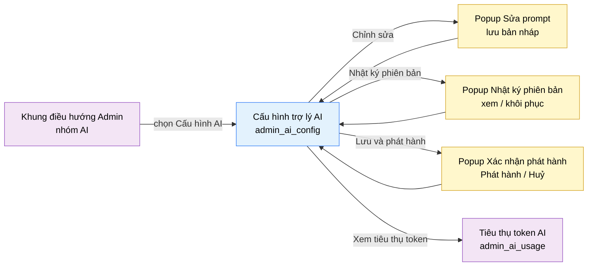

# Tài liệu thiết kế cơ bản (BD) — Cấu hình trợ lý AI (`ADM0301`)

## Phương châm tài liệu [Nội bộ — không cần khách duyệt]

- Viết theo **mẫu 9 sheet**. Bộ thẻ đóng, quy ước ID, ký hiệu chuẩn, ranh giới với tài liệu khác và
  checklist kiểm toán nằm ở `02-bd/_rules/bd-template-9sheet.md` — file này không chép lại.
- Phần gắn nhãn `[Nội bộ]` phục vụ sinh mã và tự kiểm toán, không phải yêu cầu của khách hàng: mục 4.5, mục
  7.3 và các ghi chú quy ước.
- Mã màn `ADM0301` theo bảng mã ở `02-bd/_rules/bd-template-9sheet.md` mục 8; tên file mang tiền tố mã.
- Màn này không có màn con, chỉ có 3 popup: Sửa prompt, Nhật ký phiên bản, Xác nhận phát hành.

> Đọc cùng `01-rd/screens/admin/ADM0301_ai_config.md` (hành vi ở mức yêu cầu, không lặp lại ở đây) và ba file
> BD module: `02-bd/architecture/ai-review.md`, `02-bd/database/ai-review.md`, `02-bd/security/ai-review.md`.
>
> **Không thiết kế** thẻ prompt "Gợi ý theo bậc", dòng giới hạn "Gợi ý mỗi bài" và toggle "Chuyển giảng viên
> khi bí" — đã cắt khỏi phạm vi theo `DEC-2026-0831-remove-tiered-hints-ai-config`
> [Nguồn: 01-rd/screens/admin/ADM0301_ai_config.md:66-67].
> **Không thiết kế** giao diện sửa trọng số rubric Mock Interview (F5-15) — cố định 25/30/25/20%
> [Nguồn: 02-bd/database/ai-review.md:33-34].

---

## Sheet 1. Bìa

| Mục | Giá trị |
| :--- | :--- |
| Hệ thống | AlgoPrep |
| Phân hệ | `ai-review` (F5) |
| Công đoạn | BD — Thiết kế cơ bản |
| Phân loại | Màn hình |
| Tên màn | Cấu hình trợ lý AI |
| Mã màn hình | `ADM0301` |
| Tên vật lý (slug) | `admin_ai_config` |
| Trục tài liệu | Màn hình (`02-bd/screens/`) |
| Actor | A3 (`ADMIN`) |
| Phiên bản | V0.2 |
| Người tạo | Nhóm phát triển AlgoPrep |
| Ngày tạo | 2026/09/13 |
| Người cập nhật | Nhóm phát triển AlgoPrep |
| Ngày cập nhật | 2026/09/20 |

---

## Sheet 2. Lịch sử sửa đổi

| Ver | Sheet bị sửa | Nội dung sửa | Ngày | Người sửa |
| :--- | :--- | :--- | :--- | :--- |
| V0.1 | Toàn bộ | Tạo mới theo cấu trúc 7 mục văn xuôi (layout regions, component inventory, screen states, APIs consumed, navigation, access rights, câu hỏi mở) | 2026/09/13 | Nhóm phát triển AlgoPrep |
| V0.2 | Toàn bộ | Chuyển sang mẫu 9 sheet. Chốt nguồn dữ liệu của mọi trường hiển thị (đóng Q7: không thêm cột DB nào), chốt nơi lưu giới hạn tần suất là Redis, bổ sung Sheet 8 danh sách sự kiện và Sheet 9 đặc tả kiểm tra, phát sinh thêm câu hỏi mở về bước nhảy trọng số và cảnh báo rời màn | 2026/09/20 | Nhóm phát triển AlgoPrep |

---

## Sheet 3. Sơ đồ chuyển màn

> [Nội bộ] Quy ước vẽ: bố trí từ trái sang phải. Màn gọi tới tô tím, màn hiện tại tô xanh nhạt, popup tô
> vàng. Màu và `[Nguồn:]` dùng để truy vết, không phải yêu cầu của khách hàng.

### 3.1 Danh sách chuyển màn

#### Khung điều hướng Admin → Cấu hình trợ lý AI

[Điều kiện mở] Chọn mục con "Cấu hình AI" trong nhóm "AI" ở thanh điều hướng bên trái.

[Chế độ mở] Không có.

[Thông tin truyền] Không có.

[Giá trị trả về] Không có.

[Khi thành công] Tải toàn bộ cấu hình hiện hành và hiển thị 5 khối nội dung ở trạng thái chỉ xem.

[Khi huỷ] Không có.

#### Cấu hình trợ lý AI → Popup Sửa prompt

[Điều kiện mở] Bấm liên kết "Chỉnh sửa" trên một thẻ prompt.

[Chế độ mở] Chế độ sửa bản nháp. Prompt đang ở trạng thái `ACTIVE` thì hệ thống tạo một bản `DRAFT` mới từ
bản đang chạy để sửa; đã có bản `DRAFT` thì mở chính bản đó.

[Thông tin truyền] `feature_code` và `id` của bản prompt được chọn.

[Giá trị trả về] Bản nháp đã lưu, hoặc không có gì nếu người dùng huỷ.

[Khi thành công] Popup hiển thị chỉ thị hệ thống của bản nháp.

[Khi huỷ] Đóng popup, giữ nguyên nội dung thẻ prompt trên màn chính.

#### Cấu hình trợ lý AI → Popup Nhật ký phiên bản

[Điều kiện mở] Bấm nút "Nhật ký phiên bản" ở đầu khối "Prompt theo tính năng".

[Chế độ mở] Chế độ chỉ xem, có hành động khôi phục.

[Thông tin truyền] `feature_code` đang chọn — phạm vi cụ thể còn mở, xem Câu hỏi mở Q4.

[Giá trị trả về] Phiên bản được chọn khôi phục, hoặc không có gì.

[Khi thành công] Hiển thị danh sách phiên bản trước đây theo thứ tự thời gian giảm dần.

[Khi huỷ] Đóng popup, màn chính không đổi.

#### Cấu hình trợ lý AI → Popup Xác nhận phát hành

[Điều kiện mở] Bấm nút "Lưu và phát hành" khi đang có ít nhất một thay đổi chưa lưu.

[Chế độ mở] Không có.

[Thông tin truyền] Danh sách tóm tắt các thay đổi đang chờ phát hành.

[Giá trị trả về] Kết quả chọn "Phát hành" hoặc "Huỷ".

[Khi thành công] Hiển thị danh sách thay đổi và cảnh báo rằng bản prompt đang chạy sẽ bị thay thế.

[Khi huỷ] Đóng popup, mọi thay đổi vẫn giữ ở trạng thái chưa phát hành.

#### Popup Xác nhận phát hành → Cấu hình trợ lý AI

[Điều kiện mở] Bấm "Phát hành" trong popup xác nhận.

[Chế độ mở] Không có.

[Thông tin truyền] Không có.

[Giá trị trả về] Kết quả phát hành.

[Khi thành công] Đóng popup, tải lại cấu hình, các thẻ prompt hiển thị phiên bản và trạng thái mới.

[Khi huỷ] Đóng popup, giữ nguyên trạng thái biên soạn.

#### Cấu hình trợ lý AI → Tiêu thụ token AI

[Điều kiện mở] Bấm liên kết "Xem tiêu thụ token" ở khối "Trước khi phát hành".

[Chế độ mở] Không có.

[Thông tin truyền] Không có.

[Giá trị trả về] Không có.

[Khi thành công] Điều hướng sang màn `admin_ai_usage`. Các thay đổi chưa phát hành **không** được mang theo
— có cảnh báo trước khi rời màn hay không là điểm mở, xem Câu hỏi mở Q8.

[Khi huỷ] Không có.

### 3.2 Sơ đồ

[Nguồn: 09-layoutBase/Admin - Cấu hình AI.dc.html:67-143,168,178,259; 01-rd/screens/admin/ADM0301_ai_config.md:58-60]

---

## Sheet 4. Bố cục màn hình

### 4.1 Tổng quan màn

[Mục đích màn] Cho quản trị viên cấu hình prompt theo phiên bản, trọng số rubric chấm bài giải, giới hạn tần
suất gọi AI và nguyên tắc trả lời chung của trợ lý AI, rồi phát hành toàn bộ thay đổi trong một lần
[Nguồn: 01-rd/req/ai-review.md — F5-19, F5-23].

[Luồng nghiệp vụ chính]

1. **Hiển thị ban đầu**: vào màn, hệ thống tải danh sách prompt theo tính năng, trọng số rubric của bản
   Solution Review đang biên soạn, giới hạn tần suất hiện hành và trạng thái các toggle nguyên tắc trả lời.
   Trong lúc chờ, mỗi khối hiển thị khung chờ đúng số dòng dự kiến. Nút "Lưu và phát hành" không kích hoạt
   khi chưa có thay đổi nào.
2. **Sửa prompt**: quản trị viên bấm "Chỉnh sửa" trên một thẻ để sửa chỉ thị hệ thống. Thay đổi lưu vào bản
   nháp, **không ảnh hưởng bản đang chạy cho tới khi phát hành**.
3. **Sửa trọng số rubric**: quản trị viên dùng nút giảm và tăng trên từng tiêu chí. Tổng trọng số hiển thị ở
   góc phải khối và đổi màu cảnh báo khi khác 100%.
4. **Sửa giới hạn tần suất và nguyên tắc trả lời**: chỉnh giá trị số và bật hoặc tắt toggle.
5. **Đối chiếu trước phát hành**: bấm "Chạy đối chiếu" để so điểm rubric giữa bản nháp và bản đang chạy trên
   bộ 30 bài giải mẫu. **Chỉ có giao diện, không gọi backend ở đợt này.**
6. **Phát hành**: bấm "Lưu và phát hành", xác nhận trong popup, hệ thống chuyển bản nháp thành bản đang chạy.

[Người dùng] Quản trị viên đã đăng nhập, có Function `AI_CONFIG`.

[Tệp liên quan] Không có. Màn này không xuất hay nhập tệp.

[Phạm vi]
- Không cấu hình rubric Mock Interview (4 tiêu chí cố định theo F5-15).
- Không cấu hình ngân sách token — thuộc màn `admin_ai_usage`, gác bởi Function `AI_TOKEN_BUDGET`.
- "Chạy đối chiếu" chỉ dựng tầng giao diện, không cam kết logic backend ở đợt này
  [Nguồn: 01-rd/req/ai-review.md — F5-23].
- Không thiết kế tính năng "Gợi ý theo bậc" (đã cắt phạm vi 2026-08-31).
- **Không đổi model, nhiệt độ, giới hạn token qua giao diện** ở đợt này — xem Câu hỏi mở Q7 đã đóng.

[Quyền sử dụng]
- Xem: được, khi có Function `AI_CONFIG`.
- Thêm: được (tạo bản nháp prompt mới từ bản đang chạy).
- Sửa: được.
- Xoá: không. Prompt cũ chuyển trạng thái `ARCHIVED`, không xoá vật lý.

[Số bản ghi tối đa] Danh sách prompt: theo số `feature_code` có thật, hiện là 3 thẻ. Rubric: đúng 5 tiêu chí.
Giới hạn tần suất: 3 dòng. Nguyên tắc trả lời: 3 toggle. Không phân trang.

[Nguồn: 01-rd/screens/admin/ADM0301_ai_config.md:20-50; 02-bd/database/ai-review.md:8-38; 02-bd/security/ai-review.md:79-82]

### 4.2 DTO liên quan

- `PromptTemplateDto`
- `RubricConfigDto`
- `RateLimitConfigDto`
- `ResponseGuardConfigDto`

`[Suy luận]` — tên DTO do BD này đề xuất, `03-dd/api/ai-review.md` chốt lại.

### 4.3 Bảng dữ liệu liên quan (2)

| NO | Bảng | Ghi chú |
| --: | :--- | :--- |
| 1 | `ai.prompt_templates` | [Nguồn: 02-bd/database/ai-review.md:8-25] |
| 2 | `ai.rubric_configs` | [Nguồn: 02-bd/database/ai-review.md:27-38] |

Hai nhóm dữ liệu còn lại **không dùng bảng PostgreSQL**: giới hạn tần suất lưu ở cấu hình rate-limit trên
Redis (`CLAUDE.md` — Redis dùng cho cache, `ChatMemory` và rate limiting); nguyên tắc trả lời chưa chốt nơi
lưu, xem Câu hỏi mở Q2.

### 4.4 Vùng bố cục

Đối chiếu `09-layoutBase/Admin - Cấu hình AI.dc.html` — bằng chứng bố cục chỉ-đọc, **không phải** design
system cuối cùng.

| Vùng | Vị trí trong prototype | Nội dung |
| :--- | :--- | :--- |
| Thanh điều hướng bên trái (khung chung Admin) | `:67-143` | Nhóm "AI" đang mở, mục con "Cấu hình AI" đang chọn, mục con "Token AI" liền kề — dùng lại khung chung của mọi màn Admin |
| Thanh tiêu đề dính trên | `:147-158` | Tiêu đề, mô tả phụ, nút "Lưu và phát hành" |
| Cột trái — "Prompt theo tính năng" | `:163-190` | Danh sách thẻ prompt theo `feature_code`, nút "Nhật ký phiên bản" |
| Cột trái — "Rubric chấm bài giải" | `:192-218` | 5 tiêu chí trọng số kèm nhãn tổng, chỉ áp dụng `SOLUTION_REVIEW` |
| Cột phải — "Giới hạn tần suất" | `:222-236` | Danh sách giới hạn dạng nhãn kèm giá trị |
| Cột phải — "Nguyên tắc trả lời" | `:238-253` | 3 toggle bật hoặc tắt |
| Cột phải — "Trước khi phát hành" | `:255-260` | Mô tả bộ đối chiếu 30 bài mẫu, nút "Chạy đối chiếu", dòng kết quả gần nhất kèm liên kết sang `admin_ai_usage` |
| Chân trang (khung chung Admin) | `:264-277` | Trạng thái dịch vụ, liên kết phụ — dùng lại khung chung |

Bố cục hai cột `minmax(0, 1.55fr) minmax(300px, 1fr)` (`:160`): cột trái chứa nội dung cần biên soạn nhiều,
cột phải chứa các khối cấu hình ngắn. Giữ nguyên cấu trúc này khi dựng Next.js; không quy định màu sắc,
khoảng cách hay typography ở BD.

### 4.5 Cấu trúc slice FSD [Nội bộ]

| Khối | Slice dự kiến | Căn cứ |
| :--- | :--- | :--- |
| Trang | `views/admin-ai-config` | Quy ước FSD của dự án |
| Khung Admin | Dùng lại `widgets/admin-shell` | `02-bd/screens/admin/_shell.md` |
| Khối prompt | `widgets/prompt-feature-list` + `entities/prompt-template` | Prototype `:163-190` |
| Khối rubric | `widgets/rubric-weight-editor` + `entities/rubric-config` | Prototype `:192-218` |
| Khối giới hạn, nguyên tắc | `features/ai-rate-limit`, `features/ai-response-guard` | Prototype `:222-253` |
| Popup | `features/prompt-edit`, `features/prompt-version-history`, `features/ai-config-publish` | Prototype `:168,178` |

`[Suy luận]` — ánh xạ slice do BD đề xuất, DD màn hình chốt lại.

> [Nội bộ] Ảnh minh hoạ đặt ở `08-diagram/02-bd/screens/admin/`, chụp bằng Playwright trên ứng dụng Next.js
> thật khi đã có mã chạy được. Chưa có thì tham chiếu prototype, không vẽ tay.

---

## Sheet 5. Danh sách item màn hình

> Quy ước ID, bộ thẻ và giá trị chuẩn: `02-bd/_rules/bd-template-9sheet.md` mục 2, 3, 4.

### Khu vực A — Thanh tiêu đề

| Khu vực | NO | Tên item | ID item | Bảng DB | Cột DB | Loại UI | Kiểu | Độ dài | Bắt buộc | I/O | Giá trị mặc định | Định dạng | Ghi chú |
| :--- | --: | :--- | :--- | :--- | :--- | :--- | :--- | :--- | :-: | :-: | :--- | :--- | :--- |
| Thanh tiêu đề | | | | | | | | | | | | | |
| | 1 | Tiêu đề màn | `adminAiConfig.header.title` | - | - | Label | String | - | - | O | Cấu hình trợ lý AI | - | Tên màn hiển thị cố định [Nguồn giá trị] Nhãn tĩnh i18n [EVT liên quan] - |
| | 2 | Mô tả phụ | `adminAiConfig.header.subtitle` | - | - | Label | String | - | - | O | Prompt, rubric chấm và giới hạn tần suất | - | Mô tả ngắn phạm vi màn [Nguồn giá trị] Nhãn tĩnh i18n [EVT liên quan] - |
| | 3 | Lưu và phát hành | `adminAiConfig.header.btnPublish` | - | - | Button | - | - | - | I | - | - | Phát hành toàn bộ thay đổi đang biên soạn [Nguồn giá trị] - [EVT liên quan] EVT-12 |

### Khu vực B — Prompt theo tính năng

| Khu vực | NO | Tên item | ID item | Bảng DB | Cột DB | Loại UI | Kiểu | Độ dài | Bắt buộc | I/O | Giá trị mặc định | Định dạng | Ghi chú |
| :--- | --: | :--- | :--- | :--- | :--- | :--- | :--- | :--- | :-: | :-: | :--- | :--- | :--- |
| Prompt theo tính năng | | | | | | | | | | | | | |
| | 1 | Nhật ký phiên bản | `adminAiConfig.prompt.btnVersionHistory` | - | - | Button | - | - | - | I | - | - | Mở danh sách phiên bản prompt trước đây (F5-23) [Nguồn giá trị] - [EVT liên quan] EVT-5 |
| | 2 | Danh sách prompt | `adminAiConfig.prompt.list` | `ai.prompt_templates` | - | List | List | - | - | O | rỗng | - | Mỗi dòng là một bản prompt của một tính năng AI. Hiện 3 dòng: Phân tích bài giải (F5.1), Phỏng vấn giả lập (F5.2), Sinh testcase (F2-14 — nguồn dữ liệu còn mở, xem Q1) [Nguồn giá trị] Kết quả gọi `ListPromptTemplates` [EVT liên quan] EVT-1 |
| | 3 | Tên tính năng | `adminAiConfig.prompt.col.featureName` | `ai.prompt_templates` | `feature_code` | ListColumn | Enum | - | - | O | - | Nhãn tiếng Việt | Mã tính năng hiển thị dưới dạng nhãn tiếng Việt [Nguồn giá trị] `SOLUTION_REVIEW` thành "Phân tích bài giải"; `MOCK_INTERVIEW` thành "Phỏng vấn giả lập" [EVT liên quan] - |
| | 4 | Phiên bản | `adminAiConfig.prompt.col.version` | `ai.prompt_templates` | `version` | ListColumn | String | 20 | - | O | - | `v{số}.{số}` | Số hiệu phiên bản của bản prompt [Nguồn giá trị] Cột `version` [EVT liên quan] - |
| | 5 | Trạng thái | `adminAiConfig.prompt.col.status` | `ai.prompt_templates` | `status` | Badge | Enum | - | - | O | - | Nhãn tiếng Việt | Trạng thái vòng đời của bản prompt [Nguồn giá trị] `ACTIVE` thành "Đang chạy"; `DRAFT` thành "Bản nháp"; `ARCHIVED` thành "Đã lưu trữ" [EVT liên quan] - |
| | 6 | Mô tả | `adminAiConfig.prompt.col.description` | - | - | ListColumn | String | - | - | O | - | - | Mô tả ngắn mục đích của prompt [Nguồn giá trị] **Nhãn tĩnh i18n** map từ `feature_code` — chữ cố định, quản trị viên không sửa. Không thêm cột DB, xem Q7 [EVT liên quan] - |
| | 7 | Model | `adminAiConfig.prompt.col.model` | - | - | ListColumn | String | 50 | - | O | - | - | Tên model AI dùng cho prompt này [Nguồn giá trị] **`application.yml` phía backend**, hiển thị chỉ đọc. Không thêm cột DB, xem Q7 [EVT liên quan] - |
| | 8 | Nhiệt độ | `adminAiConfig.prompt.col.temperature` | - | - | ListColumn | Number | 3 | - | O | - | Một chữ số thập phân | Tham số ngẫu nhiên của model [Nguồn giá trị] **`application.yml`**, hiển thị chỉ đọc. Không thêm cột DB, xem Q7 [EVT liên quan] - |
| | 9 | Giới hạn token | `adminAiConfig.prompt.col.maxTokens` | - | - | ListColumn | Number | 6 | - | O | - | Số nguyên | Số token tối đa cho một lần gọi [Nguồn giá trị] **`application.yml`**, hiển thị chỉ đọc. Không thêm cột DB, xem Q7 [EVT liên quan] - |
| | 10 | Ngày cập nhật | `adminAiConfig.prompt.col.updatedAt` | `ai.prompt_templates` | `published_at` / `created_at` | ListColumn | Date | - | - | O | - | `DD/MM` | Ngày sửa gần nhất của bản prompt [Công thức] Có `published_at` thì lấy `published_at`, ngược lại lấy `created_at` [EVT liên quan] - |
| | 11 | Chỉnh sửa | `adminAiConfig.prompt.col.linkEdit` | - | - | Link | - | - | - | I | - | - | Mở popup sửa bản nháp của prompt trên dòng đó [Nguồn giá trị] - [EVT liên quan] EVT-2 |

### Khu vực C — Rubric chấm bài giải

| Khu vực | NO | Tên item | ID item | Bảng DB | Cột DB | Loại UI | Kiểu | Độ dài | Bắt buộc | I/O | Giá trị mặc định | Định dạng | Ghi chú |
| :--- | --: | :--- | :--- | :--- | :--- | :--- | :--- | :--- | :-: | :-: | :--- | :--- | :--- |
| Rubric chấm bài giải | | | | | | | | | | | | | |
| | 1 | Tổng trọng số | `adminAiConfig.rubric.totalBadge` | - | - | Badge | Number | 3 | - | O | 100 | `Tổng {số}%` | Tổng trọng số của toàn bộ tiêu chí [Công thức] Cộng `weight_percent` của mọi dòng đang hiển thị [EVT liên quan] EVT-8 |
| | 2 | Danh sách tiêu chí | `adminAiConfig.rubric.list` | `ai.rubric_configs` | - | List | List | - | - | I/O | 5 dòng | - | 5 tiêu chí của rubric Solution Review: Tính đúng đắn, Độ phức tạp, Chất lượng mã, Xử lý biên, Diễn giải. Chỉ áp dụng `SOLUTION_REVIEW` [Nguồn giá trị] `rubric_configs` gắn với `prompt_template_id` của bản Solution Review đang biên soạn [EVT liên quan] EVT-1 |
| | 3 | Tên tiêu chí | `adminAiConfig.rubric.col.criterionName` | `ai.rubric_configs` | `criterion_code` | ListColumn | String | - | - | O | - | Nhãn tiếng Việt | Tên tiêu chí chấm hiển thị cho người dùng [Nguồn giá trị] **Nhãn tĩnh i18n** map từ `criterion_code` [EVT liên quan] - |
| | 4 | Mô tả tiêu chí | `adminAiConfig.rubric.col.criterionMeta` | - | - | ListColumn | String | - | - | O | - | - | Câu giải thích ngắn dưới tên tiêu chí [Nguồn giá trị] **Nhãn tĩnh i18n** map từ `criterion_code`. Không thêm cột DB, xem Q7 [EVT liên quan] - |
| | 5 | Giảm trọng số | `adminAiConfig.rubric.col.btnDecrease` | - | - | Button | - | - | - | I | - | `−` | Giảm trọng số của tiêu chí trên dòng đó [Công thức] Giá trị hiện tại trừ bước nhảy; bước nhảy chưa chốt, xem Q6 [EVT liên quan] EVT-8 |
| | 6 | Trọng số | `adminAiConfig.rubric.col.weightPercent` | `ai.rubric_configs` | `weight_percent` | NumberBox | Number | 5 | Có | I/O | Giá trị đang lưu | `{số}%` | Trọng số phần trăm của tiêu chí trong điểm tổng [Nguồn giá trị] Cột `weight_percent` [EVT liên quan] EVT-8 |
| | 7 | Tăng trọng số | `adminAiConfig.rubric.col.btnIncrease` | - | - | Button | - | - | - | I | - | `+` | Tăng trọng số của tiêu chí trên dòng đó [Công thức] Giá trị hiện tại cộng bước nhảy; bước nhảy chưa chốt, xem Q6 [EVT liên quan] EVT-8 |
| | 8 | Thanh tỉ lệ | `adminAiConfig.rubric.col.weightBar` | - | - | ProgressBar | Number | - | - | O | - | - | Biểu diễn trực quan trọng số [Công thức] Chiều rộng bằng đúng giá trị phần trăm của dòng [EVT liên quan] EVT-8 |

### Khu vực D — Giới hạn tần suất

| Khu vực | NO | Tên item | ID item | Bảng DB | Cột DB | Loại UI | Kiểu | Độ dài | Bắt buộc | I/O | Giá trị mặc định | Định dạng | Ghi chú |
| :--- | --: | :--- | :--- | :--- | :--- | :--- | :--- | :--- | :-: | :-: | :--- | :--- | :--- |
| Giới hạn tần suất | | | | | | | | | | | | | |
| | 1 | Danh sách giới hạn | `adminAiConfig.rateLimit.list` | - | - | List | List | - | - | I/O | 3 dòng | - | 3 giới hạn chống lạm dụng và giữ chi phí (F5-19): Phân tích mỗi ngày, Phỏng vấn mỗi tuần, Chờ giữa hai yêu cầu. Đã bỏ dòng "Gợi ý mỗi bài" [Nguồn giá trị] Cấu hình rate-limit trên **Redis**, không dùng bảng PostgreSQL [EVT liên quan] EVT-1 |
| | 2 | Tên giới hạn | `adminAiConfig.rateLimit.col.label` | - | - | ListColumn | String | - | - | O | - | - | Tên giới hạn hiển thị cho người dùng [Nguồn giá trị] Nhãn tĩnh i18n map từ mã giới hạn [EVT liên quan] - |
| | 3 | Đơn vị | `adminAiConfig.rateLimit.col.meta` | - | - | ListColumn | String | - | - | O | - | - | Câu giải thích cách tính giới hạn [Nguồn giá trị] Nhãn tĩnh i18n map từ mã giới hạn [EVT liên quan] - |
| | 4 | Giá trị giới hạn | `adminAiConfig.rateLimit.col.value` | - | - | NumberBox | Number | 6 | Có | I/O | Giá trị đang lưu | Số nguyên kèm đơn vị | Ngưỡng áp dụng cho mỗi người dùng [Nguồn giá trị] Redis. Prototype hiển thị 10 lượt/ngày, 5 phiên/tuần, 20 giây; đơn vị thời gian còn lệch với `02-bd/database/ai-review.md` mục 6, xem Q5 [EVT liên quan] EVT-9 |

### Khu vực E — Nguyên tắc trả lời

| Khu vực | NO | Tên item | ID item | Bảng DB | Cột DB | Loại UI | Kiểu | Độ dài | Bắt buộc | I/O | Giá trị mặc định | Định dạng | Ghi chú |
| :--- | --: | :--- | :--- | :--- | :--- | :--- | :--- | :--- | :-: | :-: | :--- | :--- | :--- |
| Nguyên tắc trả lời | | | | | | | | | | | | | |
| | 1 | Danh sách nguyên tắc | `adminAiConfig.guard.list` | - | - | List | List | - | - | I/O | 3 dòng | - | 3 nguyên tắc: "Không đưa lời giải đầy đủ" (F5-17), "Trích dẫn dòng mã người học", "Trả lời bằng tiếng Việt". Đã bỏ "Chuyển giảng viên khi bí" [Nguồn giá trị] Nơi lưu chưa chốt, xem Q2 [EVT liên quan] EVT-1 |
| | 2 | Tên nguyên tắc | `adminAiConfig.guard.col.title` | - | - | ListColumn | String | - | - | O | - | - | Tên nguyên tắc hiển thị cho người dùng [Nguồn giá trị] Nhãn tĩnh i18n map từ mã nguyên tắc [EVT liên quan] - |
| | 3 | Mô tả nguyên tắc | `adminAiConfig.guard.col.meta` | - | - | ListColumn | String | - | - | O | - | - | Câu giải thích tác dụng của nguyên tắc [Nguồn giá trị] Nhãn tĩnh i18n map từ mã nguyên tắc [EVT liên quan] - |
| | 4 | Công tắc | `adminAiConfig.guard.col.toggle` | - | - | Toggle | Boolean | - | - | I/O | Bật | Bật / Tắt | Trạng thái áp dụng của nguyên tắc [Nguồn giá trị] Giá trị đang lưu; mặc định "Bật" là `[Suy luận]` từ prototype, chưa có nguồn khẳng định [EVT liên quan] EVT-10 |

### Khu vực F — Trước khi phát hành

| Khu vực | NO | Tên item | ID item | Bảng DB | Cột DB | Loại UI | Kiểu | Độ dài | Bắt buộc | I/O | Giá trị mặc định | Định dạng | Ghi chú |
| :--- | --: | :--- | :--- | :--- | :--- | :--- | :--- | :--- | :-: | :-: | :--- | :--- | :--- |
| Trước khi phát hành | | | | | | | | | | | | | |
| | 1 | Mô tả đối chiếu | `adminAiConfig.regression.description` | - | - | Label | String | - | - | O | Chạy bộ kiểm thử 30 bài giải mẫu để so sánh điểm rubric giữa bản nháp và bản đang chạy. | - | Giải thích mục đích của bước đối chiếu [Nguồn giá trị] Nhãn tĩnh i18n [EVT liên quan] - |
| | 2 | Chạy đối chiếu | `adminAiConfig.regression.btnRun` | - | - | Button | - | - | - | I | - | - | Kích hoạt bộ đối chiếu 30 bài mẫu. **Chỉ có giao diện, không gọi backend ở đợt này** [Nguồn giá trị] - [EVT liên quan] EVT-11 |
| | 3 | Kết quả lần chạy gần nhất | `adminAiConfig.regression.lastRunText` | - | - | Label | String | - | - | O | - | `Lần chạy gần nhất: {ngày}, lệch trung bình {số} điểm.` | Tóm tắt kết quả đối chiếu gần nhất [Nguồn giá trị] Dữ liệu tĩnh ở đợt này, không có nguồn backend [EVT liên quan] - |
| | 4 | Xem tiêu thụ token | `adminAiConfig.regression.linkTokenUsage` | - | - | Link | - | - | - | I | - | - | Điều hướng sang màn `admin_ai_usage` [Nguồn giá trị] - [EVT liên quan] EVT-15 |

### Popup

| Khu vực | NO | Tên item | ID item | Bảng DB | Cột DB | Loại UI | Kiểu | Độ dài | Bắt buộc | I/O | Giá trị mặc định | Định dạng | Ghi chú |
| :--- | --: | :--- | :--- | :--- | :--- | :--- | :--- | :--- | :-: | :-: | :--- | :--- | :--- |
| Popup | | | | | | | | | | | | | |
| | 1 | Sửa prompt | `adminAiConfig.popup.promptEdit` | `ai.prompt_templates` | `system_instruction` | Popup | - | - | - | I/O | - | - | Form sửa chỉ thị hệ thống của bản nháp. Model, nhiệt độ và giới hạn token **không sửa ở đây** (đọc từ `application.yml`). Prototype chưa có form chi tiết, trường cụ thể do DD màn hình chốt [Nguồn giá trị] Bản `DRAFT` của prompt được chọn [EVT liên quan] EVT-2, EVT-3, EVT-4 |
| | 2 | Nhật ký phiên bản | `adminAiConfig.popup.versionHistory` | `ai.prompt_templates` | `version`, `status`, `published_at` | Popup | - | - | - | I/O | - | - | Danh sách phiên bản trước đây, có hành động khôi phục (F5-23) [Nguồn giá trị] Các dòng cùng `feature_code`, sắp xếp theo `published_at` giảm dần [EVT liên quan] EVT-5, EVT-6, EVT-7 |
| | 3 | Xác nhận phát hành | `adminAiConfig.popup.publishConfirm` | - | - | Popup | - | - | - | I | - | Phát hành / Huỷ | Xác nhận trước khi chuyển bản nháp thành bản đang chạy [Nguồn giá trị] Tóm tắt các thay đổi đang chờ [EVT liên quan] EVT-12, EVT-13, EVT-14 |

[Nguồn: 09-layoutBase/Admin - Cấu hình AI.dc.html:147-158,163-190,192-218,222-236,238-253,255-260; 02-bd/database/ai-review.md:8-38; 01-rd/screens/admin/ADM0301_ai_config.md:36-50]

---

## Sheet 6. Đặc tả điều khiển item

> Ký hiệu cột `Hiển thị` và thứ tự thẻ: `02-bd/_rules/bd-template-9sheet.md` mục 2, 3. Dùng đúng NO, tên
> item và thứ tự của Sheet 5. Lỗi nhập liệu ghi ở Sheet 9, xử lý nghiệp vụ ghi ở Sheet 8.

### Khu vực A — Thanh tiêu đề

| Khu vực | NO | Tên item | Hiển thị | Ghi chú |
| :--- | --: | :--- | :-: | :--- |
| Thanh tiêu đề | | | | |
| | 1 | Tiêu đề màn | Có | - |
| | 2 | Mô tả phụ | Có | - |
| | 3 | Lưu và phát hành | Có | [Điều kiện kích hoạt] Kích hoạt khi có ít nhất một thay đổi chưa phát hành **và** tổng trọng số rubric bằng 100%. Các trường hợp khác không kích hoạt. |

### Khu vực B — Prompt theo tính năng

| Khu vực | NO | Tên item | Hiển thị | Ghi chú |
| :--- | --: | :--- | :-: | :--- |
| Prompt theo tính năng | | | | |
| | 1 | Nhật ký phiên bản | Có | [Điều kiện kích hoạt] Không kích hoạt trong lúc đang tải dữ liệu, kích hoạt sau khi tải xong. |
| | 2 | Danh sách prompt | Có | [Điều kiện hiển thị] Trong lúc tải hiển thị khung chờ đúng 3 dòng. Tải xong mà không có dòng nào thì hiển thị "Chưa có prompt — Tạo mới" thay cho danh sách. |
| | 3 | Tên tính năng | Có | - |
| | 4 | Phiên bản | Có | - |
| | 5 | Trạng thái | Có | - |
| | 6 | Mô tả | Có | - |
| | 7 | Model | Có | - |
| | 8 | Nhiệt độ | Có | - |
| | 9 | Giới hạn token | Có | - |
| | 10 | Ngày cập nhật | Có | - |
| | 11 | Chỉnh sửa | Có | [Điều kiện kích hoạt] Không kích hoạt trên dòng có trạng thái "Đã lưu trữ"; kích hoạt trên dòng "Đang chạy" và "Bản nháp". |

### Khu vực C — Rubric chấm bài giải

| Khu vực | NO | Tên item | Hiển thị | Ghi chú |
| :--- | --: | :--- | :-: | :--- |
| Rubric chấm bài giải | | | | |
| | 1 | Tổng trọng số | Có | [Tự động đặt] Tính lại ngay sau mỗi lần trọng số của một tiêu chí thay đổi; đổi sang màu cảnh báo khi khác 100%, về màu trung tính khi bằng 100%. |
| | 2 | Danh sách tiêu chí | Có | [Điều kiện hiển thị] Trong lúc tải hiển thị khung chờ đúng 5 dòng. |
| | 3 | Tên tiêu chí | Có | - |
| | 4 | Mô tả tiêu chí | Có | - |
| | 5 | Giảm trọng số | Có | [Điều kiện kích hoạt] Không kích hoạt khi trọng số của dòng đó bằng 0. |
| | 6 | Trọng số | Có | [Tự động đặt] Giá trị cập nhật ngay khi bấm nút giảm hoặc tăng. |
| | 7 | Tăng trọng số | Có | [Điều kiện kích hoạt] Không kích hoạt khi trọng số của dòng đó bằng 100. |
| | 8 | Thanh tỉ lệ | Có | [Tự động đặt] Chiều rộng cập nhật cùng lúc với giá trị trọng số. |

### Khu vực D — Giới hạn tần suất

| Khu vực | NO | Tên item | Hiển thị | Ghi chú |
| :--- | --: | :--- | :-: | :--- |
| Giới hạn tần suất | | | | |
| | 1 | Danh sách giới hạn | Có | [Điều kiện hiển thị] Trong lúc tải hiển thị khung chờ đúng 3 dòng. |
| | 2 | Tên giới hạn | Có | - |
| | 3 | Đơn vị | Có | - |
| | 4 | Giá trị giới hạn | Có | [Điều kiện kích hoạt] Kích hoạt sau khi tải xong dữ liệu. [Tự động đặt] Sau khi sửa, item được đánh dấu là thay đổi chưa phát hành và kích hoạt nút "Lưu và phát hành". |

### Khu vực E — Nguyên tắc trả lời

| Khu vực | NO | Tên item | Hiển thị | Ghi chú |
| :--- | --: | :--- | :-: | :--- |
| Nguyên tắc trả lời | | | | |
| | 1 | Danh sách nguyên tắc | Có | [Điều kiện hiển thị] Trong lúc tải hiển thị khung chờ đúng 3 dòng. |
| | 2 | Tên nguyên tắc | Có | - |
| | 3 | Mô tả nguyên tắc | Có | - |
| | 4 | Công tắc | Có | [Điều kiện kích hoạt] Kích hoạt sau khi tải xong dữ liệu. [Tự động đặt] Sau khi bật hoặc tắt, item được đánh dấu là thay đổi chưa phát hành và kích hoạt nút "Lưu và phát hành". |

### Khu vực F — Trước khi phát hành

| Khu vực | NO | Tên item | Hiển thị | Ghi chú |
| :--- | --: | :--- | :-: | :--- |
| Trước khi phát hành | | | | |
| | 1 | Mô tả đối chiếu | Có | - |
| | 2 | Chạy đối chiếu | Có | [Điều kiện kích hoạt] Luôn kích hoạt về mặt giao diện. Ở đợt này nút không gọi backend nên không có trạng thái đang chạy. |
| | 3 | Kết quả lần chạy gần nhất | Điều kiện | [Điều kiện hiển thị] Chỉ hiển thị khi có dữ liệu lần chạy gần nhất; không có thì ẩn cả dòng, giữ nguyên liên kết "Xem tiêu thụ token". |
| | 4 | Xem tiêu thụ token | Có | - |

### Popup

| Khu vực | NO | Tên item | Hiển thị | Ghi chú |
| :--- | --: | :--- | :-: | :--- |
| Popup | | | | |
| | 1 | Sửa prompt | Điều kiện | [Điều kiện hiển thị] Chỉ hiển thị sau khi bấm "Chỉnh sửa" trên một thẻ prompt. Các thẻ prompt khác không bị khoá khi popup đang mở. |
| | 2 | Nhật ký phiên bản | Điều kiện | [Điều kiện hiển thị] Chỉ hiển thị sau khi bấm "Nhật ký phiên bản". |
| | 3 | Xác nhận phát hành | Điều kiện | [Điều kiện hiển thị] Chỉ hiển thị sau khi bấm "Lưu và phát hành" và nút đó đang ở trạng thái kích hoạt. |

[Nguồn: 09-layoutBase/Admin - Cấu hình AI.dc.html:172,195-196,199,226,241; 02-bd/database/ai-review.md:37; 01-rd/screens/admin/ADM0301_ai_config.md:58-60]

---

## Sheet 7. Danh sách truyền dữ liệu

### 7.1 Trường DTO

| NO | DTO | Trường DTO | Kiểu | Bảng DB | Cột DB | Item màn | Hiển thị | Ghi chú |
| --: | :--- | :--- | :--- | :--- | :--- | :--- | :-: | :--- |
| 1 | `PromptTemplateDto` | `id` | UUID | `ai.prompt_templates` | `id` | - | Không | [Nguồn] Phản hồi của `ListPromptTemplates` [Đích] Tham số của `UpdatePromptTemplateDraft` và `PublishPromptTemplate`. Không hiển thị trên màn. |
| 2 | `PromptTemplateDto` | `featureCode` | Enum | `ai.prompt_templates` | `feature_code` | Prompt "Tên tính năng" | Có | [Nguồn] Phản hồi của `ListPromptTemplates` [Chuyển đổi] Mã enum đổi sang nhãn tiếng Việt khi hiển thị. Cũng là khoá để tra nhãn "Mô tả". |
| 3 | `PromptTemplateDto` | `version` | String | `ai.prompt_templates` | `version` | Prompt "Phiên bản" | Có | [Nguồn] Phản hồi của `ListPromptTemplates` |
| 4 | `PromptTemplateDto` | `status` | Enum | `ai.prompt_templates` | `status` | Prompt "Trạng thái" | Có | [Chuyển đổi] `ACTIVE` / `DRAFT` / `ARCHIVED` đổi sang "Đang chạy" / "Bản nháp" / "Đã lưu trữ". |
| 5 | `PromptTemplateDto` | `systemInstruction` | String | `ai.prompt_templates` | `system_instruction` | Popup "Sửa prompt" | Có | [Nguồn] Giá trị người dùng nhập trong popup [Đích] Tham số của `UpdatePromptTemplateDraft` [Chuyển đổi] Không ghép chuỗi ở phía client: nội dung người dùng nhập là **dữ liệu**, câu ràng buộc chống chèn chỉ thị do backend thêm ở Lớp 1 [Nguồn: 02-bd/database/ai-review.md:19]. |
| 6 | `PromptTemplateDto` | `publishedAt` | Date | `ai.prompt_templates` | `published_at` | Prompt "Ngày cập nhật" | Có | [Chuyển đổi] Không có `published_at` thì lấy `created_at`; hiển thị theo `DD/MM`. |
| 7 | `PromptTemplateDto` | `model`, `temperature`, `maxTokens` | String, Number, Number | - | - | Prompt "Model", "Nhiệt độ", "Giới hạn token" | Có | [Nguồn] `application.yml` phía backend, trả kèm trong phản hồi của `ListPromptTemplates` [Đích] Chỉ hiển thị, **không có đường ghi ngược**. Xem Q7. |
| 8 | `RubricConfigDto` | `promptTemplateId` | UUID | `ai.rubric_configs` | `prompt_template_id` | - | Không | [Nguồn] Bản Solution Review đang biên soạn [Đích] Tham số của `GetRubricConfig` và `UpdateRubricConfig`. |
| 9 | `RubricConfigDto` | `criterionCode` | String | `ai.rubric_configs` | `criterion_code` | Rubric "Tên tiêu chí", "Mô tả tiêu chí" | Có | [Chuyển đổi] Mã tiêu chí là khoá tra hai nhãn tĩnh i18n: tên tiêu chí và câu mô tả. |
| 10 | `RubricConfigDto` | `weightPercent` | Number | `ai.rubric_configs` | `weight_percent` | Rubric "Trọng số" | Có | [Nguồn] Giá trị người dùng chỉnh bằng nút giảm hoặc tăng [Đích] Tham số của `UpdateRubricConfig` [Chuyển đổi] Gửi lên dạng số, không kèm ký hiệu phần trăm. |
| 11 | `RateLimitConfigDto` | `limitCode` | String | - | - | Giới hạn "Tên giới hạn", "Đơn vị" | Có | [Nguồn] Khoá cấu hình trên Redis [Chuyển đổi] Là khoá tra nhãn tĩnh i18n cho tên và đơn vị. |
| 12 | `RateLimitConfigDto` | `value` | Number | - | - | Giới hạn "Giá trị giới hạn" | Có | [Nguồn] Giá trị người dùng nhập [Đích] Tham số của `UpdateRateLimitConfig`, ghi xuống cấu hình rate-limit trên Redis. |
| 13 | `ResponseGuardConfigDto` | `guardCode` | String | - | - | Nguyên tắc "Tên nguyên tắc", "Mô tả nguyên tắc" | Có | [Chuyển đổi] Là khoá tra nhãn tĩnh i18n. Nơi lưu chưa chốt, xem Q2. |
| 14 | `ResponseGuardConfigDto` | `enabled` | Boolean | - | - | Nguyên tắc "Công tắc" | Có | [Nguồn] Trạng thái công tắc người dùng đặt [Đích] Tham số của `UpdateResponseGuardConfig`. |

### 7.2 Truy cập bảng dữ liệu (2)

| NO | Tên logic | Bảng | Repository | CRUD | Mục đích | Ghi chú |
| --: | :--- | :--- | :--- | :-: | :--- | :--- |
| 1 | Bản mẫu prompt | `ai.prompt_templates` | `PromptTemplateRepository` | C, R, U | Đọc danh sách prompt, tạo bản nháp, sửa bản nháp, chuyển trạng thái khi phát hành | `ListPromptTemplates`: R `GetPromptTemplateHistory`: R `UpdatePromptTemplateDraft`: C, U `PublishPromptTemplate`: U |
| 2 | Cấu hình rubric | `ai.rubric_configs` | `RubricConfigRepository` | R, U | Đọc và cập nhật trọng số các tiêu chí của rubric Solution Review | `GetRubricConfig`: R `UpdateRubricConfig`: U |

Không có thao tác xoá (`D`) trên màn này: prompt cũ chuyển sang trạng thái `ARCHIVED`, không xoá vật lý.
Giới hạn tần suất đọc và ghi trên Redis, không qua repository JPA.

`[Suy luận]` — tên repository do BD này đề xuất, DD module `ai-review` chốt lại.

### 7.3 Danh sách endpoint [Nội bộ]

> Chỉ tên nghiệp vụ và BC sở hữu. Hợp đồng chi tiết thuộc `03-dd/api/ai-review.md`.

| NO | Endpoint (tên nghiệp vụ) | Mục đích | BC sở hữu |
| --: | :--- | :--- | :--- |
| 1 | `ListPromptTemplates` | Tải danh sách prompt theo tính năng, kèm model/nhiệt độ/giới hạn token từ cấu hình | `ai-review` |
| 2 | `GetPromptTemplateHistory` | Tải lịch sử phiên bản của một prompt | `ai-review` |
| 3 | `UpdatePromptTemplateDraft` | Tạo hoặc sửa bản nháp của một prompt | `ai-review` |
| 4 | `PublishPromptTemplate` | Chuyển bản nháp thành bản đang chạy | `ai-review` |
| 5 | `GetRubricConfig` | Tải trọng số rubric Solution Review | `ai-review` |
| 6 | `UpdateRubricConfig` | Cập nhật trọng số rubric, backend kiểm tổng bằng 100 | `ai-review` |
| 7 | `GetRateLimitConfig` | Tải giới hạn tần suất hiện hành | `ai-review` |
| 8 | `UpdateRateLimitConfig` | Cập nhật giới hạn tần suất | `ai-review` |
| 9 | `GetResponseGuardConfig` | Tải trạng thái các nguyên tắc trả lời | `ai-review` |
| 10 | `UpdateResponseGuardConfig` | Cập nhật các nguyên tắc trả lời | `ai-review` |

Không có endpoint cho nút "Chạy đối chiếu" ở đợt này. Endpoint số 1 có thể phải gọi thêm module
`problem-bank` cho thẻ "Sinh testcase" — xem Câu hỏi mở Q1.

[Nguồn: 02-bd/database/ai-review.md:8-38]

---

## Sheet 8. Danh sách sự kiện

> Bộ thẻ và quy ước cột `Chuyển màn`: `02-bd/_rules/bd-template-9sheet.md` mục 2, 3.

### Màn chính: Cấu hình trợ lý AI

| NO | Loại | Sự kiện | Chi tiết | Chuyển màn | Gọi API | Tên xử lý | Ghi chú |
| --: | :--- | :--- | :--- | :-: | :-: | :--- | :--- |
| 1 | Màn hình | Khởi tạo màn | Vào màn thì tải toàn bộ cấu hình hiện hành. | Không | Có | `ListPromptTemplates`, `GetRubricConfig`, `GetRateLimitConfig`, `GetResponseGuardConfig` | [Các bước] 1. Kiểm tra quyền `AI_CONFIG`. 2. Hiển thị khung chờ cho cả 4 khối dữ liệu. 3. Tải song song 4 nhóm dữ liệu. [Khi thành công] Hiển thị đầy đủ 5 khối nội dung ở trạng thái chỉ xem, nút "Lưu và phát hành" không kích hoạt vì chưa có thay đổi. [Khi lỗi] Hiển thị thông báo lỗi tại đúng khối tải thất bại; các khối tải được vẫn hiển thị bình thường, không rời màn. |
| 2 | Liên kết | Mở popup sửa prompt | Bấm "Chỉnh sửa" trên một thẻ prompt. | Không | Không | - | [Các bước] 1. Prompt đang ở trạng thái "Đang chạy" thì tạo một bản nháp trong bộ nhớ từ bản đang chạy; đã có bản nháp thì dùng chính bản đó. 2. Mở popup với nội dung bản nháp. [Khi thành công] Popup hiển thị, thẻ tương ứng gắn nhãn "Đang sửa bản nháp", các thẻ khác không bị khoá. |
| 3 | Nút | Lưu bản nháp | Bấm "Lưu" trong popup sửa prompt. | Không | Có | `UpdatePromptTemplateDraft` | [Các bước] 1. Kiểm tra chỉ thị hệ thống không rỗng. 2. Gửi nội dung bản nháp lên máy chủ. 3. Đóng popup và cập nhật thẻ prompt tương ứng. [Khi thành công] Thẻ hiển thị trạng thái "Bản nháp" và ngày cập nhật mới; bản đang chạy không đổi. [Khi lỗi] Giữ popup mở, giữ nguyên nội dung người dùng đã nhập, hiển thị lỗi trong popup. [Thông báo hoàn tất] "Đã lưu bản nháp." |
| 4 | Nút | Huỷ sửa prompt | Bấm "Huỷ" hoặc đóng popup sửa prompt. | Không | Không | - | [Các bước] 1. Đóng popup. [Khi xác nhận] Nội dung đã bị sửa mà chưa lưu thì hỏi xác nhận trước khi bỏ thay đổi. [Khi thành công] Popup đóng, thẻ prompt giữ nguyên nội dung trước khi mở. |
| 5 | Nút | Mở nhật ký phiên bản | Bấm "Nhật ký phiên bản". | Không | Có | `GetPromptTemplateHistory` | [Các bước] 1. Tải danh sách phiên bản. 2. Mở popup hiển thị danh sách theo thứ tự thời gian giảm dần. [Khi thành công] Popup hiển thị các phiên bản kèm trạng thái và ngày phát hành. [Khi lỗi] Không mở popup, hiển thị thông báo lỗi trên màn chính. |
| 6 | Nút | Khôi phục phiên bản | Bấm "Khôi phục" trên một dòng trong popup nhật ký. | Không | Có | `UpdatePromptTemplateDraft` | [Các bước] 1. Sao chép nội dung phiên bản được chọn vào bản nháp hiện hành. 2. Đóng popup nhật ký. [Khi xác nhận] Hỏi xác nhận vì thao tác này ghi đè bản nháp đang có. [Khi thành công] Thẻ prompt hiển thị nội dung của phiên bản được khôi phục ở trạng thái "Bản nháp"; bản đang chạy **chưa** đổi cho tới khi phát hành. [Khi lỗi] Giữ popup mở và hiển thị lỗi, không thay đổi bản nháp. |
| 7 | Nút | Đóng nhật ký phiên bản | Bấm "Đóng" trong popup nhật ký. | Không | Không | - | [Các bước] 1. Đóng popup. [Khi thành công] Màn chính giữ nguyên. |
| 8 | Nút | Đổi trọng số tiêu chí | Bấm nút giảm hoặc tăng trên một tiêu chí rubric. | Không | Không | - | [Các bước] 1. Tăng hoặc giảm trọng số của tiêu chí theo bước nhảy. 2. Cập nhật thanh tỉ lệ của dòng đó. 3. Tính lại tổng trọng số. [Khi thành công] Tổng bằng 100% thì hiển thị màu trung tính và kích hoạt nút "Lưu và phát hành". Tổng khác 100% thì hiển thị màu cảnh báo và **không** kích hoạt nút "Lưu và phát hành". |
| 9 | Nhập liệu | Đổi giá trị giới hạn tần suất | Sửa giá trị của một dòng giới hạn. | Không | Không | - | [Các bước] 1. Ghi nhận giá trị mới vào trạng thái biên soạn. [Khi thành công] Đánh dấu có thay đổi chưa phát hành và kích hoạt nút "Lưu và phát hành". [Khi lỗi] Giá trị không hợp lệ thì hiển thị lỗi ngay tại dòng đó và không kích hoạt nút "Lưu và phát hành". |
| 10 | Công tắc | Bật hoặc tắt nguyên tắc trả lời | Bấm công tắc trên một dòng nguyên tắc. | Không | Không | - | [Các bước] 1. Đảo trạng thái công tắc trong trạng thái biên soạn. [Khi thành công] Đánh dấu có thay đổi chưa phát hành và kích hoạt nút "Lưu và phát hành". |
| 11 | Nút | Chạy đối chiếu | Bấm "Chạy đối chiếu". | Không | Không | - | [Các bước] 1. Ở đợt này không gọi backend. [Khi thành công] Không thay đổi dữ liệu. Chỉ dựng tầng giao diện theo phạm vi đã chốt [Nguồn: 01-rd/req/ai-review.md — F5-23]. |
| 12 | Nút | Mở xác nhận phát hành | Bấm "Lưu và phát hành". | Không | Không | - | [Các bước] 1. Tổng hợp danh sách thay đổi đang chờ. 2. Mở popup xác nhận. [Khi thành công] Popup hiển thị tóm tắt thay đổi và cảnh báo bản prompt đang chạy sẽ bị thay thế. |
| 13 | Popup | Xác nhận phát hành — "Phát hành" | Bấm "Phát hành" trong popup xác nhận. | Không | Có | `PublishPromptTemplate`, `UpdateRubricConfig`, `UpdateRateLimitConfig`, `UpdateResponseGuardConfig` | [Các bước] 1. Kiểm tra tổng trọng số rubric bằng 100%. 2. Gửi toàn bộ thay đổi lên máy chủ. 3. Đóng popup và tải lại cấu hình. [Khi thành công] Các thẻ prompt hiển thị phiên bản, trạng thái và ngày cập nhật mới; trạng thái biên soạn được xoá; nút "Lưu và phát hành" trở về không kích hoạt. [Khi lỗi] Giữ nguyên toàn bộ thay đổi đang biên soạn, hiển thị lỗi tại khối gây lỗi, **không** hoàn tác ngầm phần đã sửa ở khối khác. Phát hành có phải một giao dịch nguyên tử phía máy chủ hay không còn mở, xem Q3. [Thông báo hoàn tất] "Đã phát hành cấu hình mới." |
| 14 | Popup | Xác nhận phát hành — "Huỷ" | Bấm "Huỷ" trong popup xác nhận. | Không | Không | - | [Các bước] 1. Đóng popup. [Khi thành công] Mọi thay đổi vẫn ở trạng thái chưa phát hành, nút "Lưu và phát hành" vẫn kích hoạt. |
| 15 | Liên kết | Xem tiêu thụ token | Bấm "Xem tiêu thụ token". | Có | Không | - | [Các bước] 1. Điều hướng sang màn `admin_ai_usage`. [Khi xác nhận] Còn thay đổi chưa phát hành thì hỏi xác nhận trước khi rời màn, xem Q8. [Khi thành công] Mở màn `admin_ai_usage`. |

[Nguồn: 09-layoutBase/Admin - Cấu hình AI.dc.html:157,168,178,195-196,247,257,259; 01-rd/screens/admin/ADM0301_ai_config.md:58-60; 02-bd/database/ai-review.md:16,37]

---

## Sheet 9. Đặc tả kiểm tra

> Bộ thẻ và quy ước mã thông báo: `02-bd/_rules/bd-template-9sheet.md` mục 2, 4. Sheet này ghi **điều kiện
> kiểm và thông báo**; tiêu chí nghiệm thu `AC-nn` thuộc `04-tdd/admin_ai_config.md`, không lặp lại ở đây.

| NO | Loại | Tóm tắt kiểm | Chi tiết | Mức | Mã thông báo | Ghi chú | EVT gọi | Thứ tự |
| --: | :--- | :--- | :--- | :--- | :--- | :--- | :--- | :-: |
| 1 | Kiểm quyền | Quyền truy cập màn | [Nội dung kiểm] Người dùng không có Function `AI_CONFIG` thì không được vào màn. [Nơi thực thi] Chặn ở cả tầng định tuyến phía giao diện và tầng phân quyền phía máy chủ, không chỉ ẩn giao diện. | Lỗi | Chưa có mã thông báo | Nội dung "Bạn không có quyền truy cập chức năng này." | EVT-1 | 1 |
| 2 | Kiểm nhập liệu | Tổng trọng số rubric | [Nội dung kiểm] Tổng trọng số các tiêu chí khác 100% thì không cho phát hành. [Nơi thực thi] Kiểm ở màn hình khi đổi trọng số, kiểm lại ở máy chủ khi lưu. [Tiêu điểm] Nhãn tổng trọng số ở góc phải khối rubric. | Lỗi | Chưa có mã thông báo | Nội dung "Tổng trọng số phải bằng 100%." Máy chủ kiểm lại vì bất biến "tổng bằng 100" thuộc tầng ứng dụng [Nguồn: 02-bd/database/ai-review.md:37]. | EVT-8, EVT-13 | 1 |
| 3 | Kiểm nhập liệu | Khoảng giá trị trọng số | [Nội dung kiểm] Trọng số của một tiêu chí nằm ngoài khoảng 0 đến 100 thì không cho đặt. [Nơi thực thi] Màn hình. [Tiêu điểm] Ô trọng số của dòng vi phạm. | Lỗi | Chưa có mã thông báo | Nội dung "Trọng số phải nằm trong khoảng 0 đến 100." Nút giảm và tăng đã chặn sẵn theo Sheet 6; kiểm này phòng trường hợp nhập trực tiếp. | EVT-8 | 2 |
| 4 | Kiểm nhập liệu | Giá trị giới hạn tần suất | [Nội dung kiểm] Giá trị giới hạn không phải số nguyên dương thì báo lỗi. [Nơi thực thi] Màn hình và máy chủ. [Tiêu điểm] Ô giá trị của dòng vi phạm. | Lỗi | Chưa có mã thông báo | Nội dung "Giá trị phải là số nguyên lớn hơn 0." | EVT-9, EVT-13 | 1 |
| 5 | Kiểm nhập liệu | Chỉ thị hệ thống bắt buộc | [Nội dung kiểm] Chỉ thị hệ thống rỗng thì không cho lưu bản nháp. [Nơi thực thi] Popup sửa prompt. [Tiêu điểm] Ô chỉ thị hệ thống. | Lỗi | Chưa có mã thông báo | Nội dung "Chỉ thị hệ thống không được để trống." | EVT-3 | 1 |
| 6 | Kiểm nghiệp vụ | Xung đột phiên bản khi phát hành | [Nội dung kiểm] Bản đang chạy đã bị người khác thay đổi kể từ lúc tải màn thì dừng phát hành. [Nơi thực thi] Máy chủ. | Lỗi | Mã lỗi trong phản hồi | Nội dung "Cấu hình đã được người khác cập nhật. Vui lòng tải lại màn hình." Ràng buộc "đúng một bản `ACTIVE` cho mỗi `feature_code`" do máy chủ bảo đảm [Nguồn: 02-bd/database/ai-review.md:15]. | EVT-13 | 2 |
| 7 | Kiểm nghiệp vụ | Lỗi hệ thống hoặc lỗi gọi máy chủ | [Nội dung kiểm] Gọi máy chủ thất bại hoặc trả lỗi nghiệp vụ thì dừng thao tác, giữ nguyên dữ liệu đang hiển thị. [Nơi thực thi] Màn hình. | Lỗi | Mã lỗi trong phản hồi | Phản hồi có mã lỗi đã đăng ký thì hiển thị nội dung tương ứng; chưa đăng ký thì hiển thị "Không kết nối được máy chủ." | EVT-1, EVT-3, EVT-5, EVT-6, EVT-13 | 1 |

Cột `Thứ tự` là thứ tự kiểm trong cùng một sự kiện.

[Nguồn: 02-bd/security/ai-review.md:79-82; 02-bd/database/ai-review.md:15,37]

---

## Câu hỏi mở

| # | Câu hỏi | Vì sao chưa trả lời được | Chủ sở hữu |
| :-: | :--- | :--- | :--- |
| Q1 | Thẻ "Sinh testcase" (F2-14) lấy dữ liệu từ `ai.prompt_templates` hay từ một bảng riêng của `problem-bank`? Enum `feature_code` hiện chỉ có `SOLUTION_REVIEW` và `MOCK_INTERVIEW`, **không có** `GENERATE_TESTCASE` [Nguồn: 02-bd/database/ai-review.md:13]. | Ảnh hưởng endpoint `ListPromptTemplates` gọi một hay hai module | DD `ai-review` + `problem-bank` |
| Q2 | 3 nguyên tắc trả lời lưu ở đâu — ghép vào `system_instruction` của từng prompt, hay một cấu hình rời áp dụng cho mọi prompt? | BD module `ai-review` chưa thiết kế nơi lưu cho các toggle này | DD `ai-review` |
| Q3 | "Lưu và phát hành" là một giao dịch nguyên tử phía máy chủ, hay giao diện gọi tuần tự nhiều endpoint? Ảnh hưởng hành vi khi một phần thất bại giữa chừng (EVT-13). | Chưa thiết kế ở BD module | DD `ai-review` |
| Q4 | Popup "Nhật ký phiên bản" hiển thị lịch sử của tất cả tính năng cùng lúc hay phải chọn một thẻ trước? | Prototype chỉ có một nút chung ở đầu khối, không rõ phạm vi | Prototype kế tiếp + DD màn hình |
| Q5 | Con số và đơn vị của giới hạn tần suất: prototype ghi "10 lượt/ngày", "5 phiên/tuần"; `02-bd/database/ai-review.md` mục 6 lại đề xuất "10 lượt/giờ", "3 phiên/giờ". **Nơi lưu đã chốt là Redis**, chỉ còn mở phần con số và đơn vị. | Hai nơi dùng đơn vị thời gian khác nhau, chưa đối chiếu | DD `ai-review` |
| Q6 | Bước nhảy của nút `−`/`+` trên mỗi tiêu chí rubric là bao nhiêu — 1% hay 5%? | Prototype không ghi giá trị bước nhảy, chỉ có hai nút | DD màn hình |
| Q7 | ~~Các trường "Mô tả", "Model", "Nhiệt độ", "Giới hạn token" trên thẻ prompt và "Mô tả tiêu chí" của rubric hiển thị trên màn nhưng không có cột tương ứng trong `prompt_templates` / `rubric_configs` — có bổ sung cột không?~~ **ĐÃ CHỐT 2026-09-20: không bổ sung cột nào.** Mô tả là nhãn tĩnh i18n (chữ cố định, quản trị viên không sửa); model, nhiệt độ, giới hạn token đọc từ `application.yml` và màn chỉ hiển thị — prototype không có control sửa, cũng chưa có yêu cầu nào nói quản trị viên phải đổi model theo từng prompt. Khi nào có yêu cầu sửa thật thì mới thêm cột, lúc đó mới đủ dữ kiện để thiết kế đúng. | — | Đã đóng |
| Q8 | Rời màn khi còn thay đổi chưa phát hành (bấm "Xem tiêu thụ token", hoặc đổi mục ở thanh điều hướng) thì có hỏi xác nhận không? | RD không có yêu cầu nào về việc này; ảnh hưởng cả liên kết trong màn lẫn điều hướng bằng thanh bên | Chủ dự án |
