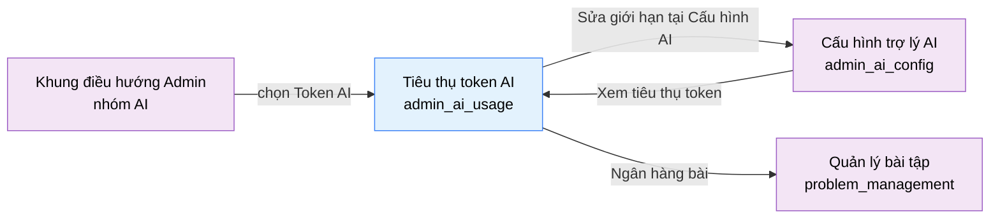

# Tài liệu thiết kế cơ bản (BD) — Tiêu thụ token AI (`ADM0302`)

## Phương châm tài liệu [Nội bộ — không cần khách duyệt]

- Viết theo **mẫu 9 sheet**. Bộ thẻ đóng, quy ước ID, ký hiệu chuẩn, ranh giới với tài liệu khác và
  checklist kiểm toán nằm ở `02-bd/_rules/bd-template-9sheet.md` — file này không chép lại.
- Phần gắn nhãn `[Nội bộ]` phục vụ sinh mã và tự kiểm toán, không phải yêu cầu của khách hàng: mục 4.5, mục
  7.3 và các ghi chú quy ước.
- Mã màn `ADM0302` theo bảng mã ở `02-bd/_rules/bd-template-9sheet.md` mục 8; tên file mang tiền tố mã.
- Màn này **không có màn con và không có popup** — toàn bộ nội dung nằm trên một trang, chỉ đọc là chính,
  đúng một hành động ghi nhẹ (đánh dấu cảnh báo đã xem).

> Đọc cùng `01-rd/screens/admin/ADM0302_ai_usage.md` (hành vi ở mức yêu cầu, không lặp lại ở đây) và ba file
> BD module: `02-bd/architecture/ai-review.md`, `02-bd/database/ai-review.md`, `02-bd/security/ai-review.md`.
> Khung điều hướng, thanh công cụ và nền dùng lại `02-bd/screens/admin/_shell.md`, không mô tả lại ở đây.
>
> **Không thiết kế** dải "Gợi ý" trong biểu đồ theo ngày và dòng "Gợi ý theo bậc" (45%) trong khối "Theo
> tính năng" — đã cắt khỏi phạm vi theo `DEC-2026-0831-remove-tiered-hints-ai-config`
> [Nguồn: 01-rd/screens/admin/ADM0302_ai_usage.md:8-10,33-35,38-41]. Prototype vẽ trước quyết định này nên còn
> hiện chúng; bằng chứng bố cục vẫn dùng được, riêng hai chỗ đó bỏ.
> **Không thiết kế** hành động khoá hoặc mở khoá ngân sách token tại màn này — màn chỉ đọc trạng thái
> `locked_at`, hành động sửa hạn mức thuộc `admin_ai_config` [Nguồn: 02-bd/architecture/ai-review.md:272-275].

---

## Sheet 1. Bìa

| Mục | Giá trị |
| :--- | :--- |
| Hệ thống | AlgoPrep |
| Phân hệ | `ai-review` (F5) |
| Công đoạn | BD — Thiết kế cơ bản |
| Phân loại | Màn hình |
| Tên màn | Tiêu thụ token AI |
| Mã màn hình | `ADM0302` |
| Tên vật lý (slug) | `admin_ai_usage` |
| Trục tài liệu | Màn hình (`02-bd/screens/`) |
| Actor | A3 (`ADMIN`) |
| Phiên bản | V0.6 |
| Người tạo | Nhóm phát triển AlgoPrep |
| Ngày tạo | 2026/09/15 |
| Người cập nhật | Nhóm phát triển AlgoPrep |
| Ngày cập nhật | 2026/10/03 |

---

## Sheet 2. Lịch sử sửa đổi

| Ver | Sheet bị sửa | Nội dung sửa | Ngày | Người sửa |
| :--- | :--- | :--- | :--- | :--- |
| V0.1 | Toàn bộ | Tạo mới theo cấu trúc 9 mục văn xuôi (hai cơ chế không gộp, layout regions, component inventory, screen states, API tiêu thụ, điều hướng, quyền truy cập, câu hỏi mở) | 2026/09/15 | Nhóm phát triển AlgoPrep |
| V0.2 | Toàn bộ | Chuyển sang mẫu 9 sheet. Chốt nguồn giá trị của mọi trường hiển thị (bốn thẻ chỉ số, hạn mức, hai bảng xếp hạng đều tính từ `ai.token_usage` — không thêm cột DB nào), bổ sung Sheet 6 điều kiện hiển thị và kích hoạt, Sheet 8 danh sách 9 sự kiện, Sheet 9 đặc tả kiểm tra tách bạch `AI_TOKEN_BUDGET:READ` và `:UPDATE` | 2026/09/20 | Nhóm phát triển AlgoPrep |
| V0.3 | 3, 4, 5, 6, 7, 8, 9; Câu hỏi mở | Bỏ dải 4 thẻ chỉ số tổng (Token tháng này, Trung bình mỗi ngày, Chi phí tạm tính, Lượt gọi AI) khỏi UI theo `DEC-2026-1001-single-overview-page-kpi`: Khu vực B còn ghi chú "đã bỏ" (giữ chữ cái C trở đi), bỏ `AiUsageSummaryDto` (DTO NO 2-4) và endpoint `GetAiUsageSummary` (NO 1 mục 7.3), bộ chọn khoảng thời gian chỉ còn nạp lại biểu đồ theo ngày (7 khối thành 6 khối nội dung, 6 nhóm dữ liệu thành 5). Q2 chỉ còn ảnh hưởng cột "Chi phí" của bảng người học. Ba khối còn lại giữ nguyên. Thêm đề xuất cho Q2, Q7 theo nguyên tắc admin (chờ owner xác nhận) | 2026/10/01 | AI |
| V0.4 | Sheet 5, 6, Câu hỏi mở | Đã chốt 2026-10-01 (owner uỷ quyền cân nhắc), xem `DEC-2026-1001-admin-configurable-settings`: Q2 (đơn giá token theo `model_name` do ADMIN nhập và sửa trên màn cấu hình AI, không hard-code `application.yml`, không giới hạn số model, model chưa có đơn giá hiển thị `-`) và Q7 (ngưỡng đổi màu thanh ngân sách do ADMIN đặt cùng chỗ với hạn mức token, mặc định 70%) đổi từ "Đề xuất (chờ owner xác nhận)" sang **đã chốt**. Hai tham số này cần nơi lưu và màn cấu hình ở `ai-review` (DD), chưa có | 2026/10/01 | AI |
| V0.5 | Sheet 8 | Áp `DEC-2026-1003-toast-feedback-channel`: kết quả thao tác và lỗi nhập liệu ghi là toast dùng chung, ô sai chỉ đổi viền đỏ. | 2026/10/03 | AI |
| V0.6 | Sheet 4, 5, 7 | Đồng bộ `DEC-2026-1001-admin-configurable-settings` mục (7): độ khó bài tập là danh mục do ADMIN quản lý (bảng riêng `problem_levels`), không còn enum cố định. Nhãn độ khó ở bảng "Bài toán tốn nhiều token" là `display_name` của mức, đọc qua port đọc của `problem-bank` cùng với tên bài (không thêm bảng `problem_levels` vào danh sách bảng của `ai`, vì `ai-review` không đọc bảng của module khác); `TopAiProblemDto.difficulty` thành `levelCode`/`levelDisplayName`. Màn chỉ hiển thị nhãn, không lọc và không gọi `ListProblemLevels` | 2026/10/03 | AI |

---

## Sheet 3. Sơ đồ chuyển màn

> [Nội bộ] Quy ước vẽ: bố trí từ trái sang phải. Màn gọi tới tô tím, màn hiện tại tô xanh nhạt. Màn này
> không có popup nên không dùng màu vàng. Màu và `[Nguồn:]` dùng để truy vết, không phải yêu cầu của khách
> hàng.

### 3.1 Danh sách chuyển màn

#### Khung điều hướng Admin → Tiêu thụ token AI

[Điều kiện mở] Chọn mục con "Token AI" trong nhóm "AI" ở thanh điều hướng bên trái.

[Chế độ mở] Chế độ chỉ xem.

[Thông tin truyền] Không có.

[Giá trị trả về] Không có.

[Khi thành công] Tải sáu khối nội dung với khoảng thời gian mặc định 14 ngày.

[Khi huỷ] Không có.

#### Cấu hình trợ lý AI → Tiêu thụ token AI

[Điều kiện mở] Bấm liên kết "Xem tiêu thụ token" ở khối "Trước khi phát hành" của màn `admin_ai_config`.

[Chế độ mở] Chế độ chỉ xem.

[Thông tin truyền] Không có. Các thay đổi chưa phát hành ở `admin_ai_config` **không** được mang theo.

[Giá trị trả về] Không có.

[Khi thành công] Mở màn `admin_ai_usage` ở trạng thái khởi tạo, giống hệt lối vào từ thanh điều hướng.

[Khi huỷ] Không có.

#### Tiêu thụ token AI → Cấu hình trợ lý AI

[Điều kiện mở] Bấm liên kết "Cấu hình AI" trong dòng "Sửa giới hạn tại Cấu hình AI" ở cuối khối "Cảnh báo".

[Chế độ mở] Không có.

[Thông tin truyền] Không có.

[Giá trị trả về] Không có.

[Khi thành công] Điều hướng sang màn `admin_ai_config`. Không có cảnh báo rời màn vì màn này không giữ thay
đổi chưa lưu nào.

[Khi huỷ] Không có.

#### Tiêu thụ token AI → Quản lý bài tập

[Điều kiện mở] Bấm liên kết "Ngân hàng bài" ở góc phải khối "Bài toán tốn token nhất".

[Chế độ mở] Không có.

[Thông tin truyền] Không có. Không truyền bộ lọc token sang màn quản lý bài tập.

[Giá trị trả về] Không có.

[Khi thành công] Điều hướng sang màn `problem_management`.

[Khi huỷ] Không có.

### 3.2 Sơ đồ

[Nguồn: 09-layoutBase/Admin - Token AI.dc.html:365-368,241,284; 02-bd/screens/admin/ADM0301_ai_config.md:131-144]

---

## Sheet 4. Bố cục màn hình

### 4.1 Tổng quan màn

[Mục đích màn] Cho quản trị viên theo dõi lượng token AI đã tiêu thụ theo ngày, theo tính năng và theo người
học, ngân sách còn lại, dự báo cạn quota, các cảnh báo chi phí, và hai bảng xếp hạng nơi tốn token nhiều
nhất [Nguồn: 01-rd/screens/admin/ADM0302_ai_usage.md:14-15].

[Luồng nghiệp vụ chính]

1. **Hiển thị ban đầu**: vào màn, hệ thống tải song song sáu khối dữ liệu với khoảng thời gian mặc định
   14 ngày. Mỗi khối có khung chờ riêng và tải độc lập, không khối nào chặn khối nào.
2. **Đổi khoảng thời gian**: quản trị viên chọn 7, 14 hoặc 30 ngày ở thanh tiêu đề. Biểu đồ
   theo ngày nạp lại theo khoảng mới; hai bảng xếp hạng giữ nguyên phạm vi cố định 30 ngày.
3. **Đọc cảnh báo**: quản trị viên xem khối "Cảnh báo", đánh dấu một cảnh báo bất thường là đã xem khi đã xử
   lý xong. Đây là hành động ghi **duy nhất** trên màn.
4. **Đi tiếp**: từ đây quản trị viên sang `admin_ai_config` để sửa giới hạn, hoặc sang `problem_management`
   để xem bài toán tốn token.
5. **Làm mới định kỳ**: số liệu làm mới theo chu kỳ 5 phút, đúng như dòng trạng thái ở chân trang.

[Người dùng] Quản trị viên đã đăng nhập, có Function `AI_TOKEN_BUDGET`.

[Tệp liên quan] Nút "Xuất báo cáo" ở thanh tiêu đề sinh một tệp báo cáo tải về — định dạng và phạm vi chưa
chốt, xem Câu hỏi mở Q1. Ngoài nút đó, màn không xuất hay nhập tệp nào.

[Phạm vi]
- Không sửa hạn mức token và không mở khoá ngân sách ở màn này — thuộc `admin_ai_config`, tránh hai nơi cùng
  ghi `ai_token_budget_configs` [Nguồn: 02-bd/architecture/ai-review.md:272-275].
- Không tự động khoá tài khoản từ cảnh báo bất thường — cảnh báo mềm, người xem xét
  [Nguồn: 02-bd/security/ai-review.md:83-86].
- Không xem nội dung chi tiết một `solution_review` hay một phiên phỏng vấn của học viên từ màn này — cần
  một Function riêng chưa được thiết kế [Nguồn: 02-bd/security/ai-review.md:50-54].
- Không thiết kế dải "Gợi ý" và dòng "Gợi ý theo bậc" (đã cắt phạm vi 2026-08-31).

[Quyền sử dụng]
- Xem: được, khi có Function `AI_TOKEN_BUDGET` action `READ`. **Khác** Function `AI_CONFIG` gác màn
  `ADM0301` — hai Function tách biệt cố ý theo F1-12, một vai trò có `AI_CONFIG` không tự động vào được màn
  này và ngược lại [Nguồn: 02-bd/security/ai-review.md:79-82].
- Thêm: không. Màn không tạo bản ghi nào.
- Sửa: chỉ đúng một trường — `ai_usage_anomaly_alerts.status` chuyển `OPEN` sang `REVIEWED`, gác bởi
  `AI_TOKEN_BUDGET` action `UPDATE` [Nguồn: 02-bd/database/ai-review.md:157].
- Xoá: không.

[Số bản ghi tối đa] Biểu đồ theo ngày: 7, 14 hoặc 30 cột theo khoảng đang chọn. Theo
tính năng: 3 dòng sau khi cắt "Gợi ý theo bậc". Cảnh báo: không giới hạn cứng, prototype minh hoạ 3 thẻ.
Hai bảng xếp hạng: 6 dòng mỗi bảng, không phân trang.

[Nguồn: 01-rd/screens/admin/ADM0302_ai_usage.md:29-46; 09-layoutBase/Admin - Token AI.dc.html:443-449,482-487,499-522; 02-bd/security/ai-review.md:79-86]

### 4.2 DTO liên quan

- ~~`AiUsageSummaryDto`~~ (đã bỏ 2026-10-01 cùng dải thẻ chỉ số tổng)
- `AiUsageDailyPointDto`
- `AiTokenBudgetStatusDto`
- `AiUsageAlertDto`
- `TopAiUserDto`
- `TopAiProblemDto`

`[Suy luận]` — tên DTO do BD này đề xuất, `03-dd/api/ai-review.md` chốt lại.

### 4.3 Bảng dữ liệu liên quan (3)

| NO | Bảng | Ghi chú |
| --: | :--- | :--- |
| 1 | `ai.token_usage` | [Nguồn: 02-bd/database/ai-review.md:104-118] |
| 2 | `ai.ai_token_budget_configs` | [Nguồn: 02-bd/database/ai-review.md:135-146] |
| 3 | `ai.ai_usage_anomaly_alerts` | [Nguồn: 02-bd/database/ai-review.md:147-161] |

Tên người học và tên bài toán hiển thị ở hai bảng xếp hạng **không** đọc trực tiếp từ `identity.users` hay
`problem.problems` — `ai-review` không có quyền đọc bảng của module khác, phải đi qua port đọc do module sở
hữu cung cấp; cách ghép cụ thể chốt ở DD, xem Câu hỏi mở Q6. Nhãn độ khó của bài (cột "Độ khó và số lượt") cũng đi đường này: port của `problem-bank` trả `problem_levels.display_name` cùng tên bài, nên `ai-review` không thêm bảng nào vào danh sách trên [Nguồn: 02-bd/database/problem-bank.md mục `problem_levels`].

### 4.4 Vùng bố cục

Đối chiếu `09-layoutBase/Admin - Token AI.dc.html` — bằng chứng bố cục chỉ-đọc, **không phải** design system
cuối cùng.

| Vùng | Vị trí trong prototype | Nội dung |
| :--- | :--- | :--- |
| Thanh điều hướng bên trái (khung chung Admin) | `:67-143` | Nhóm "AI" đang mở, mục con "Token AI" đang chọn, mục con "Cấu hình AI" liền kề — dùng lại khung chung của mọi màn Admin |
| Thanh tiêu đề dính trên | `:147-163` | Tiêu đề, mô tả phụ, bộ chọn khoảng thời gian 7/14/30 ngày, bộ chuyển nền sáng tối (thuộc khung chung), nút "Xuất báo cáo" |
| Hàng bốn thẻ chỉ số tổng (đã bỏ 2026-10-01) | `:165-176` | Không dựng nữa; bằng chứng prototype giữ lại để truy vết, xem `DEC-2026-1001-single-overview-page-kpi` |
| Cột trái — "Token theo ngày" | `:180-206` | Biểu đồ cột chồng theo ngày, chú giải theo tính năng, nhãn ngày trục hoành |
| Cột phải trên — "Hạn mức tháng" | `:209-229` | Dòng đã dùng trong hạn mức, thanh tiến độ, còn lại, dự kiến hết, kèm khối con "Theo tính năng" |
| Cột phải dưới — "Cảnh báo" | `:231-242` | Danh sách thẻ cảnh báo, dòng "Sửa giới hạn tại Cấu hình AI" |
| Hàng dưới trái — "Người học dùng nhiều nhất" | `:248-276` | Bảng xếp hạng 6 dòng, liên kết "Xem tất cả" |
| Hàng dưới phải — "Bài toán tốn token nhất" | `:278-304` | Bảng xếp hạng 6 dòng, liên kết "Ngân hàng bài" |
| Chân trang (khung chung Admin) | `:307-320` | Phiên bản, dòng "Số liệu cập nhật 5 phút một lần", liên kết phụ — dùng lại khung chung |

Bố cục hàng giữa hai cột `minmax(0, 1.6fr) minmax(300px, 1fr)` (`:178`): cột trái chứa biểu đồ cần bề ngang,
cột phải xếp chồng hai khối ngắn. Hàng dưới dùng `repeat(auto-fit, minmax(380px, 1fr))` (`:246`) nên hai
bảng xếp hạng tự xuống dòng khi hẹp. Giữ nguyên cấu trúc này khi dựng Next.js; không quy định màu sắc,
khoảng cách hay typography ở BD.

### 4.5 Cấu trúc slice FSD [Nội bộ]

| Khối | Slice dự kiến | Căn cứ |
| :--- | :--- | :--- |
| Trang | `views/admin/ai-usage` | Quy ước FSD của dự án |
| Khung Admin | Dùng lại `widgets/admin-shell` | `02-bd/screens/admin/_shell.md` |
| Bộ chọn khoảng thời gian | `features/ai-usage-range-filter` | Prototype `:152-156` |
| Bốn thẻ chỉ số (đã bỏ 2026-10-01) | - | Không còn slice `widgets/ai-usage-stats` |
| Biểu đồ theo ngày | `widgets/ai-usage-daily-chart` | Prototype `:180-206` |
| Hạn mức và theo tính năng | `widgets/ai-token-budget-panel` + `entities/ai-token-budget` | Prototype `:209-229` |
| Cảnh báo | `widgets/ai-usage-alerts` + `features/ai-alert-review` + `entities/ai-usage-alert` | Prototype `:231-242` |
| Hai bảng xếp hạng | `widgets/ai-usage-top-users`, `widgets/ai-usage-top-problems` | Prototype `:248-304` |
| Xuất báo cáo | `features/ai-usage-export` | Prototype `:162` |

`[Suy luận]` — ánh xạ slice do BD đề xuất, DD màn hình chốt lại.

> [Nội bộ] Ảnh minh hoạ đặt ở `08-diagram/02-bd/screens/admin/`, chụp bằng Playwright trên ứng dụng Next.js
> thật khi đã có mã chạy được. Chưa có thì tham chiếu prototype, không vẽ tay.

---

## Sheet 5. Danh sách item màn hình

> Quy ước ID, bộ thẻ và giá trị chuẩn: `02-bd/_rules/bd-template-9sheet.md` mục 2, 3, 4.

### Khu vực A — Thanh tiêu đề

| Khu vực | NO | Tên item | ID item | Bảng DB | Cột DB | Loại UI | Kiểu | Độ dài | Bắt buộc | I/O | Giá trị mặc định | Định dạng | Ghi chú |
| :--- | --: | :--- | :--- | :--- | :--- | :--- | :--- | :--- | :-: | :-: | :--- | :--- | :--- |
| Thanh tiêu đề | | | | | | | | | | | | | |
| | 1 | Tiêu đề màn | `adminAiUsage.header.title` | - | - | Label | String | - | - | O | Tiêu thụ token AI | - | Tên màn hiển thị cố định [Nguồn giá trị] Nhãn tĩnh i18n [EVT liên quan] - |
| | 2 | Mô tả phụ | `adminAiUsage.header.subtitle` | - | - | Label | String | - | - | O | Theo dõi mức dùng theo ngày, theo tính năng và theo người học | - | Mô tả ngắn phạm vi màn [Nguồn giá trị] Nhãn tĩnh i18n [EVT liên quan] - |
| | 3 | Bộ chọn khoảng thời gian | `adminAiUsage.header.rangeSelector` | - | - | Button | Enum | - | - | I/O | 14 ngày | `{số} ngày` | Ba lựa chọn 7, 14, 30 ngày; đổi lựa chọn thì nạp lại khu vực C (khu vực B đã bỏ) [Nguồn giá trị] Danh sách lựa chọn là nhãn tĩnh i18n, giá trị đang chọn giữ ở trạng thái màn [EVT liên quan] EVT-2 |
| | 4 | Xuất báo cáo | `adminAiUsage.header.btnExport` | - | - | Button | - | - | - | I | - | - | Tải về báo cáo tiêu thụ token; định dạng và phạm vi chưa chốt, xem Q1 [Nguồn giá trị] - [EVT liên quan] EVT-3 |

### Khu vực B — Chỉ số tổng (đã bỏ)

Khu vực này **không còn item nào** kể từ 2026-10-01: 4 thẻ chỉ số (Token tháng này, Trung bình mỗi ngày, Chi
phí tạm tính, Lượt gọi AI) cùng biến động so với kỳ trước và dòng chú thích đã bị xoá khỏi UI theo
`DEC-2026-1001-single-overview-page-kpi` (chỉ trang tổng quan hiển thị KPI). Bốn chỉ số này **chưa có chỗ mới**
trên trang tổng quan Admin. Giữ nguyên chữ cái khu vực C trở đi để các tham chiếu hiện có không phải đánh số
lại.

### Khu vực C — Token theo ngày

| Khu vực | NO | Tên item | ID item | Bảng DB | Cột DB | Loại UI | Kiểu | Độ dài | Bắt buộc | I/O | Giá trị mặc định | Định dạng | Ghi chú |
| :--- | --: | :--- | :--- | :--- | :--- | :--- | :--- | :--- | :-: | :-: | :--- | :--- | :--- |
| Token theo ngày | | | | | | | | | | | | | |
| | 1 | Tiêu đề khối | `adminAiUsage.daily.title` | - | - | Label | String | - | - | O | Token theo ngày | - | Tên khối biểu đồ [Nguồn giá trị] Nhãn tĩnh i18n [EVT liên quan] - |
| | 2 | Phụ đề khoảng thời gian | `adminAiUsage.daily.caption` | - | - | Label | String | - | - | O | - | `Tách theo tính năng, {số} ngày gần nhất` | Nhắc lại khoảng thời gian đang áp dụng [Công thức] Nhãn tĩnh i18n ghép với số ngày của khu vực A NO 3 [EVT liên quan] EVT-2 |
| | 3 | Chú giải theo tính năng | `adminAiUsage.daily.legend` | `ai.token_usage` | `feature_code` | List | List | - | - | O | 3 mục | - | Ba tính năng còn trong phạm vi: Phân tích bài giải, Phỏng vấn giả lập, Sinh testcase. Dải "Gợi ý" đã cắt [Nguồn giá trị] Nhãn tĩnh i18n map từ `feature_code`; "Sinh testcase" chưa có trong enum `feature_code`, xem Q3 [EVT liên quan] - |
| | 4 | Cột token theo ngày | `adminAiUsage.daily.col.bar` | `ai.token_usage` | `created_at`, `feature_code` | ListColumn | Number | 12 | - | O | - | Đoạn chồng theo tính năng | Mỗi cột là một ngày, chia đoạn theo tính năng [Công thức] Cộng `tokens_prompt + tokens_completion` của `token_usage`, gộp hai chiều: theo ngày của `created_at` và theo `feature_code`, trong khoảng ngày đang chọn [EVT liên quan] EVT-1, EVT-2 |
| | 5 | Nhãn ngày trục hoành | `adminAiUsage.daily.col.dayLabel` | - | - | ListColumn | Date | 5 | - | O | - | `d/M` | Ngày tương ứng của cột [Công thức] Lấy ngày của cột, hiển thị theo `d/M` [EVT liên quan] - |

### Khu vực D — Hạn mức tháng

| Khu vực | NO | Tên item | ID item | Bảng DB | Cột DB | Loại UI | Kiểu | Độ dài | Bắt buộc | I/O | Giá trị mặc định | Định dạng | Ghi chú |
| :--- | --: | :--- | :--- | :--- | :--- | :--- | :--- | :--- | :-: | :-: | :--- | :--- | :--- |
| Hạn mức tháng | | | | | | | | | | | | | |
| | 1 | Tiêu đề hạn mức | `adminAiUsage.budget.title` | `ai.ai_token_budget_configs` | `period_start` | Label | String | - | - | O | - | `Hạn mức tháng {số}` | Tên khối kèm tháng của chu kỳ hiện hành [Công thức] Nhãn tĩnh i18n ghép với tháng lấy từ `period_start` [EVT liên quan] EVT-1 |
| | 2 | Đã dùng trong hạn mức | `adminAiUsage.budget.usedLine` | `ai.ai_token_budget_configs` | `limit_tokens` | Label | String | - | - | O | - | `Đã dùng {số} trong {số}` | So sánh lượng đã dùng với hạn mức [Công thức] Lượng đã dùng là tổng `tokens_prompt + tokens_completion` của `token_usage` từ `period_start` tới hiện tại; hạn mức lấy thẳng cột `limit_tokens` [EVT liên quan] EVT-1, EVT-4 |
| | 3 | Thanh tiến độ ngân sách | `adminAiUsage.budget.progressBar` | `ai.ai_token_budget_configs` | `limit_tokens` | ProgressBar | Number | 3 | - | O | - | `{số}%` | Tỉ lệ phần trăm ngân sách đã tiêu [Công thức] Lượng đã dùng ở NO 2 chia `limit_tokens`, chặn trên ở 100% [EVT liên quan] EVT-1, EVT-4 |
| | 4 | Còn lại | `adminAiUsage.budget.remaining` | `ai.ai_token_budget_configs` | `limit_tokens` | Label | Number | 12 | - | O | - | `Còn {số}` | Số token còn được dùng trong chu kỳ [Công thức] `limit_tokens` trừ lượng đã dùng ở NO 2; âm thì hiển thị 0 [EVT liên quan] EVT-1, EVT-4 |
| | 5 | Dự kiến hết hoặc đã khoá | `adminAiUsage.budget.runOutOrLocked` | `ai.ai_token_budget_configs` | `locked_at` | Label | String | - | - | O | - | `Dự kiến hết {d/M}` hoặc `Đã khoá lúc {d/M HH:mm}` | Dự báo ngày cạn quota, hoặc thời điểm đã khoá nếu đã vượt hạn mức [Công thức] `locked_at` rỗng thì nội suy tuyến tính từ tốc độ tiêu thụ 7 ngày gần nhất của `token_usage` [Nguồn: 02-bd/architecture/ai-review.md:270-272]; `locked_at` có giá trị thì hiển thị thẳng mốc đó [EVT liên quan] EVT-1, EVT-4 |
| | 6 | Danh sách theo tính năng | `adminAiUsage.feature.list` | `ai.token_usage` | `feature_code` | List | List | - | - | O | 3 dòng | - | 3 dòng sau khi cắt "Gợi ý theo bậc": Phân tích bài giải, Phỏng vấn giả lập, Sinh testcase [Công thức] Gộp `token_usage` theo `feature_code` trong chu kỳ hiện hành [EVT liên quan] EVT-1, EVT-4 |
| | 7 | Tên tính năng | `adminAiUsage.feature.col.name` | `ai.token_usage` | `feature_code` | ListColumn | Enum | - | - | O | - | Nhãn tiếng Việt | Tên tính năng AI hiển thị cho người dùng [Nguồn giá trị] `SOLUTION_REVIEW` thành "Phân tích bài giải"; `MOCK_INTERVIEW` thành "Phỏng vấn giả lập"; "Sinh testcase" chưa có mã enum, xem Q3 [EVT liên quan] - |
| | 8 | Token theo tính năng | `adminAiUsage.feature.col.tokens` | `ai.token_usage` | `tokens_prompt`, `tokens_completion` | ListColumn | Number | 12 | - | O | - | Rút gọn đơn vị triệu | Lượng token của tính năng trong chu kỳ [Công thức] Cộng `tokens_prompt + tokens_completion` của các dòng cùng `feature_code` trong chu kỳ hiện hành [EVT liên quan] - |
| | 9 | Thanh tỉ lệ tính năng | `adminAiUsage.feature.col.shareBar` | - | - | ProgressBar | Number | 3 | - | O | - | `{số}%` | Tỉ trọng của tính năng trong tổng tiêu thụ [Công thức] Giá trị NO 8 của dòng chia tổng NO 8 của cả 3 dòng [EVT liên quan] - |

### Khu vực E — Cảnh báo

| Khu vực | NO | Tên item | ID item | Bảng DB | Cột DB | Loại UI | Kiểu | Độ dài | Bắt buộc | I/O | Giá trị mặc định | Định dạng | Ghi chú |
| :--- | --: | :--- | :--- | :--- | :--- | :--- | :--- | :--- | :-: | :-: | :--- | :--- | :--- |
| Cảnh báo | | | | | | | | | | | | | |
| | 1 | Danh sách cảnh báo | `adminAiUsage.alert.list` | `ai.ai_usage_anomaly_alerts` | `status` | List | List | - | - | O | rỗng | - | Gộp hai nguồn khác nhau trong cùng một danh sách giao diện nhưng **không gộp ở tầng dữ liệu**: cảnh báo ngân sách suy ra từ `ai_token_budget_configs`, cảnh báo bất thường đọc từ `ai_usage_anomaly_alerts` với `status = OPEN` [Nguồn giá trị] Kết quả gọi `ListAiUsageAlerts` [EVT liên quan] EVT-1, EVT-4 |
| | 2 | Tiêu đề cảnh báo | `adminAiUsage.alert.col.title` | - | - | ListColumn | String | - | - | O | - | - | Tên ngắn của cảnh báo [Nguồn giá trị] Nhãn tĩnh i18n map từ loại cảnh báo [EVT liên quan] - |
| | 3 | Nội dung cảnh báo | `adminAiUsage.alert.col.meta` | `ai.ai_usage_anomaly_alerts` | `call_count`, `baseline_avg`, `ratio` | ListColumn | String | - | - | O | - | - | Câu mô tả kèm số liệu của cảnh báo [Công thức] Cảnh báo bất thường: ghép nhãn tĩnh i18n với `call_count`, `ratio` và cửa sổ `window_start`-`window_end` của dòng. Cảnh báo ngân sách: ghép nhãn tĩnh với ngày dự báo ở khu vực D NO 5 [EVT liên quan] - |
| | 4 | Đánh dấu đã xem | `adminAiUsage.alert.col.btnReview` | `ai.ai_usage_anomaly_alerts` | `status`, `reviewed_at` | Button | - | - | - | I | - | - | Chuyển `status` từ `OPEN` sang `REVIEWED`. **Không có trong prototype**, BD bổ sung vì nếu không có cách đóng thì danh sách chỉ dài thêm mãi; cột `status`/`reviewed_at` đã có sẵn đúng mục đích này [Nguồn: 02-bd/database/ai-review.md:157] [Nguồn giá trị] - [EVT liên quan] EVT-5 |
| | 5 | Sửa giới hạn tại Cấu hình AI | `adminAiUsage.alert.linkAiConfig` | - | - | Link | - | - | - | I | - | - | Điều hướng sang màn `admin_ai_config` [Nguồn giá trị] - [EVT liên quan] EVT-6 |

### Khu vực F — Người học dùng nhiều nhất

| Khu vực | NO | Tên item | ID item | Bảng DB | Cột DB | Loại UI | Kiểu | Độ dài | Bắt buộc | I/O | Giá trị mặc định | Định dạng | Ghi chú |
| :--- | --: | :--- | :--- | :--- | :--- | :--- | :--- | :--- | :-: | :-: | :--- | :--- | :--- |
| Người học dùng nhiều nhất | | | | | | | | | | | | | |
| | 1 | Tiêu đề bảng | `adminAiUsage.topUser.title` | - | - | Label | String | - | - | O | Người học dùng nhiều nhất | - | Tên khối bảng xếp hạng [Nguồn giá trị] Nhãn tĩnh i18n [EVT liên quan] - |
| | 2 | Phụ đề phạm vi | `adminAiUsage.topUser.caption` | - | - | Label | String | - | - | O | Trong 30 ngày gần nhất | - | Ghi rõ bảng này cố định 30 ngày, không đổi theo bộ chọn ở khu vực A [Nguồn giá trị] Nhãn tĩnh i18n [EVT liên quan] - |
| | 3 | Xem tất cả | `adminAiUsage.topUser.linkViewAll` | - | - | Link | - | - | - | I | - | - | Mở danh sách đầy đủ; đích đến chưa chốt, xem Q4 [Nguồn giá trị] - [EVT liên quan] EVT-7 |
| | 4 | Danh sách người học | `adminAiUsage.topUser.list` | `ai.token_usage` | `user_id` | List | List | - | - | O | 6 dòng | - | Xếp hạng người học theo lượng token tiêu thụ (F5-25) [Công thức] Gộp `token_usage` theo `user_id` trong 30 ngày gần nhất, sắp giảm dần theo tổng token, lấy 6 dòng đầu [EVT liên quan] EVT-1, EVT-4 |
| | 5 | Thứ hạng | `adminAiUsage.topUser.col.rank` | - | - | ListColumn | Number | 2 | - | O | - | Số nguyên | Vị trí của dòng trong bảng [Công thức] Số thứ tự dòng sau khi sắp xếp ở NO 4 [EVT liên quan] - |
| | 6 | Người học | `adminAiUsage.topUser.col.user` | `ai.token_usage` | `user_id` | ListColumn | String | - | - | O | - | Tên đầy đủ, dòng phụ là tên đăng nhập và khoá | Danh tính người học kèm chữ cái đầu làm ảnh đại diện [Nguồn giá trị] `user_id` là khoá tra tên qua port đọc của module `identity`, `ai-review` không đọc thẳng bảng `identity.users`; cách ghép chốt ở DD, xem Q6 [EVT liên quan] - |
| | 7 | Token | `adminAiUsage.topUser.col.tokens` | `ai.token_usage` | `tokens_prompt`, `tokens_completion` | ListColumn | Number | 12 | - | O | - | Rút gọn đơn vị triệu | Lượng token người học đã tiêu thụ [Công thức] Cộng `tokens_prompt + tokens_completion` của các dòng cùng `user_id` trong 30 ngày gần nhất [EVT liên quan] - |
| | 8 | Lượt | `adminAiUsage.topUser.col.calls` | `ai.token_usage` | `user_id` | ListColumn | Number | 8 | - | O | - | Số nguyên | Số lượt gọi AI của người học [Công thức] Đếm số dòng `token_usage` cùng `user_id` trong 30 ngày gần nhất [EVT liên quan] - |
| | 9 | Chi phí | `adminAiUsage.topUser.col.cost` | `ai.token_usage` | `model_name` | ListColumn | Number | 10 | - | O | - | `{số} USD` | Chi phí tạm tính của người học [Công thức] Gộp token của người học theo `model_name` rồi nhân đơn giá từng model; bảng đơn giá do ADMIN nhập và sửa trên màn cấu hình AI (đã chốt 2026-10-01, xem Q2); model chưa có đơn giá hiển thị `-` [EVT liên quan] - |

### Khu vực G — Bài toán tốn token nhất

| Khu vực | NO | Tên item | ID item | Bảng DB | Cột DB | Loại UI | Kiểu | Độ dài | Bắt buộc | I/O | Giá trị mặc định | Định dạng | Ghi chú |
| :--- | --: | :--- | :--- | :--- | :--- | :--- | :--- | :--- | :-: | :-: | :--- | :--- | :--- |
| Bài toán tốn token nhất | | | | | | | | | | | | | |
| | 1 | Tiêu đề bảng | `adminAiUsage.topProblem.title` | - | - | Label | String | - | - | O | Bài toán tốn token nhất | - | Tên khối bảng xếp hạng [Nguồn giá trị] Nhãn tĩnh i18n [EVT liên quan] - |
| | 2 | Phụ đề phạm vi | `adminAiUsage.topProblem.caption` | - | - | Label | String | - | - | O | - | - | Ghi rõ bảng cộng gộp những tính năng nào. Prototype ghi "Gợi ý và phân tích cộng lại" — câu này **không còn đúng** sau khi cắt "Gợi ý", cần đổi, xem Q5 [Nguồn giá trị] Nhãn tĩnh i18n [EVT liên quan] - |
| | 3 | Ngân hàng bài | `adminAiUsage.topProblem.linkProblemBank` | - | - | Link | - | - | - | I | - | - | Điều hướng sang màn `problem_management` [Nguồn giá trị] - [EVT liên quan] EVT-8 |
| | 4 | Danh sách bài toán | `adminAiUsage.topProblem.list` | `ai.token_usage` | `owner_id` | List | List | - | - | O | 6 dòng | - | Xếp hạng bài toán theo lượng token tiêu thụ (F5-25) [Công thức] Gộp `token_usage` theo bài toán trong 30 ngày gần nhất, sắp giảm dần theo tổng token, lấy 6 dòng đầu. `token_usage` không có cột `problem_id`, phải đi qua `owner_id` để về `solution_reviews.problem_id` hoặc `interview_sessions`, xem Q6 [EVT liên quan] EVT-1, EVT-4 |
| | 5 | Thứ hạng | `adminAiUsage.topProblem.col.rank` | - | - | ListColumn | Number | 2 | - | O | - | Số nguyên | Vị trí của dòng trong bảng [Công thức] Số thứ tự dòng sau khi sắp xếp ở NO 4 [EVT liên quan] - |
| | 6 | Tên bài toán | `adminAiUsage.topProblem.col.name` | - | - | ListColumn | String | - | - | O | - | - | Tên bài toán hiển thị cho người dùng [Nguồn giá trị] Tra qua port đọc của module `problem-bank`, `ai-review` không đọc thẳng bảng `problem.problems`; cách ghép chốt ở DD, xem Q6 [EVT liên quan] - |
| | 7 | Độ khó và số lượt | `adminAiUsage.topProblem.col.meta` | - | - | ListColumn | String | - | - | O | - | - | Dòng phụ dưới tên bài: độ khó kèm số lượt gọi AI [Công thức] Độ khó là `display_name` của mức trong `problem_levels` (qua `problems.level_id`), **đọc từ dữ liệu** do ADMIN quản lý, không còn ánh xạ cứng enum; tra qua port đọc của `problem-bank` `DEC-2026-1001-admin-configurable-settings` mục (7) [Nguồn: 02-bd/database/problem-bank.md mục `problem_levels`]; số lượt là số dòng `token_usage` thuộc bài toán đó trong 30 ngày gần nhất. Prototype ghi "lượt gợi ý" — chữ này thuộc tính năng đã cắt, cần đổi cùng Q5 [EVT liên quan] - |
| | 8 | Token | `adminAiUsage.topProblem.col.tokens` | `ai.token_usage` | `tokens_prompt`, `tokens_completion` | ListColumn | Number | 12 | - | O | - | Rút gọn đơn vị triệu | Lượng token của bài toán [Công thức] Cộng `tokens_prompt + tokens_completion` của các dòng thuộc bài toán đó trong 30 ngày gần nhất [EVT liên quan] - |
| | 9 | Trung bình mỗi lượt | `adminAiUsage.topProblem.col.avg` | `ai.token_usage` | `tokens_prompt`, `tokens_completion` | ListColumn | Number | 8 | - | O | - | Số nguyên | Token trung bình một lượt gọi AI của bài toán [Công thức] Giá trị NO 8 chia số lượt ở NO 7 [EVT liên quan] - |

[Nguồn: 09-layoutBase/Admin - Token AI.dc.html:149-162,165-176,183-205,209-229,231-242,248-276,278-304,443-456,476-487,488-497,499-522,527-528; 02-bd/database/ai-review.md:104-118,135-146,147-161]

---

## Sheet 6. Đặc tả điều khiển item

> Ký hiệu cột `Hiển thị` và thứ tự thẻ: `02-bd/_rules/bd-template-9sheet.md` mục 2, 3. Dùng đúng NO, tên
> item và thứ tự của Sheet 5. Lỗi nhập liệu ghi ở Sheet 9, xử lý nghiệp vụ ghi ở Sheet 8.

### Khu vực A — Thanh tiêu đề

| Khu vực | NO | Tên item | Hiển thị | Ghi chú |
| :--- | --: | :--- | :-: | :--- |
| Thanh tiêu đề | | | | |
| | 1 | Tiêu đề màn | Có | - |
| | 2 | Mô tả phụ | Có | - |
| | 3 | Bộ chọn khoảng thời gian | Có | [Điều kiện kích hoạt] Không kích hoạt trong lúc khu vực C đang tải, kích hoạt lại sau khi tải xong. [Tự động đặt] Lựa chọn đang chọn được đánh dấu nổi; lần đầu vào màn mặc định "14 ngày". |
| | 4 | Xuất báo cáo | Có | [Điều kiện kích hoạt] Không kích hoạt trong lúc đang sinh tệp báo cáo, kích hoạt lại khi tệp đã tải xong hoặc thất bại. |

### Khu vực B — Chỉ số tổng (đã bỏ)

Không còn item nào kể từ 2026-10-01, xem Sheet 5 Khu vực B.

### Khu vực C — Token theo ngày

| Khu vực | NO | Tên item | Hiển thị | Ghi chú |
| :--- | --: | :--- | :-: | :--- |
| Token theo ngày | | | | |
| | 1 | Tiêu đề khối | Có | - |
| | 2 | Phụ đề khoảng thời gian | Có | [Tự động đặt] Số ngày trong câu đổi theo lựa chọn ở khu vực A NO 3. |
| | 3 | Chú giải theo tính năng | Có | [Điều kiện hiển thị] Hiển thị đủ 3 tính năng còn trong phạm vi kể cả khi một tính năng chưa có dữ liệu trong khoảng đang chọn, để người đọc biết biểu đồ gồm những gì. |
| | 4 | Cột token theo ngày | Có | [Điều kiện hiển thị] Trong lúc tải hiển thị khung chờ đúng bằng số ngày đang chọn. Khoảng đang chọn không có dữ liệu thì hiện dòng trung tính "Chưa có dữ liệu trong khoảng này" thay cho biểu đồ. [Tự động đặt] Vẽ lại khi đổi khoảng thời gian và khi làm mới định kỳ. |
| | 5 | Nhãn ngày trục hoành | Có | [Tự động đặt] Số nhãn đúng bằng số cột. |

### Khu vực D — Hạn mức tháng

| Khu vực | NO | Tên item | Hiển thị | Ghi chú |
| :--- | --: | :--- | :-: | :--- |
| Hạn mức tháng | | | | |
| | 1 | Tiêu đề hạn mức | Có | - |
| | 2 | Đã dùng trong hạn mức | Có | - |
| | 3 | Thanh tiến độ ngân sách | Có | [Tự động đặt] Chuyển sang màu cảnh báo khi tỉ lệ đạt hoặc vượt ngưỡng cảnh báo, giữ màu trung tính khi dưới ngưỡng. Ngưỡng do ADMIN đặt ở thẻ "Ngân sách và đơn giá" của màn cấu hình AI (`ADM0301_ai_config.md`, khu vực G), mặc định 70% (đã chốt 2026-10-01, xem Q7). Màn này chỉ đọc giá trị đó. |
| | 4 | Còn lại | Có | - |
| | 5 | Dự kiến hết hoặc đã khoá | Có | [Điều kiện hiển thị] `locked_at` rỗng thì hiển thị dạng "Dự kiến hết {ngày}"; `locked_at` có giá trị thì hiển thị "Đã khoá lúc {thời điểm}". Không hiển thị ngày dự báo đã trôi qua. |
| | 6 | Danh sách theo tính năng | Có | [Điều kiện hiển thị] Trong lúc tải hiển thị khung chờ đúng 3 dòng. |
| | 7 | Tên tính năng | Có | - |
| | 8 | Token theo tính năng | Có | - |
| | 9 | Thanh tỉ lệ tính năng | Có | [Tự động đặt] Chiều rộng cập nhật cùng lúc với giá trị NO 8. |

### Khu vực E — Cảnh báo

| Khu vực | NO | Tên item | Hiển thị | Ghi chú |
| :--- | --: | :--- | :-: | :--- |
| Cảnh báo | | | | |
| | 1 | Danh sách cảnh báo | Có | [Điều kiện hiển thị] Trong lúc tải hiển thị khung chờ đúng 3 dòng. Không có cảnh báo nào thì hiện dòng trung tính "Không có cảnh báo nào", không để trống khối. |
| | 2 | Tiêu đề cảnh báo | Có | - |
| | 3 | Nội dung cảnh báo | Có | - |
| | 4 | Đánh dấu đã xem | Điều kiện | [Điều kiện hiển thị] Chỉ hiển thị trên thẻ cảnh báo bất thường có `status = OPEN`; thẻ cảnh báo ngân sách không có nút này vì không có bản ghi để đánh dấu. [Điều kiện kích hoạt] Không kích hoạt trong lúc lời gọi đánh dấu đang chạy. [Tự động đặt] Đánh dấu xong thì thẻ rời khỏi danh sách. |
| | 5 | Sửa giới hạn tại Cấu hình AI | Có | - |

### Khu vực F — Người học dùng nhiều nhất

| Khu vực | NO | Tên item | Hiển thị | Ghi chú |
| :--- | --: | :--- | :-: | :--- |
| Người học dùng nhiều nhất | | | | |
| | 1 | Tiêu đề bảng | Có | - |
| | 2 | Phụ đề phạm vi | Có | - |
| | 3 | Xem tất cả | Có | [Điều kiện kích hoạt] Đích đến chưa chốt nên ở đợt này liên kết không kích hoạt, xem Q4. |
| | 4 | Danh sách người học | Có | [Điều kiện hiển thị] Trong lúc tải hiển thị khung chờ đúng 6 dòng. Không có dữ liệu thì hiện dòng trung tính "Chưa có dữ liệu". [Tự động đặt] Không nạp lại khi đổi khoảng thời gian ở khu vực A — bảng này cố định 30 ngày. |
| | 5 | Thứ hạng | Có | - |
| | 6 | Người học | Có | - |
| | 7 | Token | Có | - |
| | 8 | Lượt | Có | - |
| | 9 | Chi phí | Có | - |

### Khu vực G — Bài toán tốn token nhất

| Khu vực | NO | Tên item | Hiển thị | Ghi chú |
| :--- | --: | :--- | :-: | :--- |
| Bài toán tốn token nhất | | | | |
| | 1 | Tiêu đề bảng | Có | - |
| | 2 | Phụ đề phạm vi | Có | - |
| | 3 | Ngân hàng bài | Có | - |
| | 4 | Danh sách bài toán | Có | [Điều kiện hiển thị] Trong lúc tải hiển thị khung chờ đúng 6 dòng. Không có dữ liệu thì hiện dòng trung tính "Chưa có dữ liệu". [Tự động đặt] Không nạp lại khi đổi khoảng thời gian ở khu vực A — bảng này cố định 30 ngày. |
| | 5 | Thứ hạng | Có | - |
| | 6 | Tên bài toán | Có | - |
| | 7 | Độ khó và số lượt | Có | - |
| | 8 | Token | Có | - |
| | 9 | Trung bình mỗi lượt | Có | - |

[Nguồn: 09-layoutBase/Admin - Token AI.dc.html:153,166,187,193,202,217,234,252,260,290; 02-bd/database/ai-review.md:143,157]

---

## Sheet 7. Danh sách truyền dữ liệu

### 7.1 Trường DTO

| NO | DTO | Trường DTO | Kiểu | Bảng DB | Cột DB | Item màn | Hiển thị | Ghi chú |
| --: | :--- | :--- | :--- | :--- | :--- | :--- | :-: | :--- |
| 1 | `AiUsageSummaryDto` | `rangeDays` | Number | - | - | Thanh tiêu đề "Bộ chọn khoảng thời gian" | Có | [Nguồn] Lựa chọn người dùng đặt ở khu vực A [Đích] Tham số của `GetAiUsageDailyBreakdown` (`GetAiUsageSummary` đã bỏ); trường này trước đây thuộc `AiUsageSummaryDto`, nay chỉ là tham số của biểu đồ theo ngày |
| 2 | ~~`AiUsageSummaryDto`~~ | ~~`totalTokens, avgTokensPerDay, totalCalls`~~ | - | - | - | (đã bỏ 2026-10-01) | Không | [Nguồn] Thẻ chỉ số tổng đã bỏ khỏi UI, xem `DEC-2026-1001-single-overview-page-kpi`. Giữ số thứ tự để DTO NO 5 trở đi không đổi. |
| 3 | ~~`AiUsageSummaryDto`~~ | ~~`estimatedCostUsd`~~ | - | - | - | (đã bỏ 2026-10-01) | Không | [Nguồn] Thẻ chỉ số tổng đã bỏ khỏi UI, xem `DEC-2026-1001-single-overview-page-kpi`. Giữ số thứ tự để DTO NO 5 trở đi không đổi. |
| 4 | ~~`AiUsageSummaryDto`~~ | ~~`deltaPercent`~~ | - | - | - | (đã bỏ 2026-10-01) | Không | [Nguồn] Thẻ chỉ số tổng đã bỏ khỏi UI, xem `DEC-2026-1001-single-overview-page-kpi`. Giữ số thứ tự để DTO NO 5 trở đi không đổi. |
| 5 | `AiUsageDailyPointDto` | `date` | Date | `ai.token_usage` | `created_at` | Token theo ngày "Nhãn ngày trục hoành" | Có | [Chuyển đổi] Hiển thị theo `d/M`. |
| 6 | `AiUsageDailyPointDto` | `featureCode`, `tokens` | Enum, Number | `ai.token_usage` | `feature_code`, `tokens_prompt`, `tokens_completion` | Token theo ngày "Cột token theo ngày" | Có | [Nguồn] Phản hồi của `GetAiUsageDailyBreakdown`, đã gộp hai chiều ngày và tính năng [Chuyển đổi] Mỗi `featureCode` thành một đoạn của cột chồng. Không trả và không vẽ tính năng đã cắt khỏi phạm vi. |
| 7 | `AiTokenBudgetStatusDto` | `limitTokens`, `usedTokens` | Number | `ai.ai_token_budget_configs` | `limit_tokens` | Hạn mức tháng "Đã dùng trong hạn mức", "Thanh tiến độ ngân sách", "Còn lại" | Có | [Nguồn] `limit_tokens` đọc thẳng; `usedTokens` backend gộp từ `token_usage` theo `period_start`. |
| 8 | `AiTokenBudgetStatusDto` | `periodStart` | Date | `ai.ai_token_budget_configs` | `period_start` | Hạn mức tháng "Tiêu đề hạn mức" | Có | [Chuyển đổi] Chỉ lấy phần tháng để ghép vào tiêu đề. |
| 9 | `AiTokenBudgetStatusDto` | `lockedAt` | Date | `ai.ai_token_budget_configs` | `locked_at` | Hạn mức tháng "Dự kiến hết hoặc đã khoá" | Có | [Chuyển đổi] Rỗng thì màn hiển thị `projectedRunOutDate`; có giá trị thì hiển thị mốc khoá. Màn **không có đường ghi ngược** vào trường này. |
| 10 | `AiTokenBudgetStatusDto` | `projectedRunOutDate` | Date | - | - | Hạn mức tháng "Dự kiến hết hoặc đã khoá" | Có | [Nguồn] Backend nội suy tuyến tính từ tốc độ 7 ngày gần nhất [Nguồn: 02-bd/architecture/ai-review.md:270-272], không có cột DB tương ứng. |
| 11 | `AiTokenBudgetStatusDto` | `featureBreakdown` | List | `ai.token_usage` | `feature_code` | Hạn mức tháng "Danh sách theo tính năng" | Có | [Nguồn] Backend gộp `token_usage` theo `feature_code` trong chu kỳ [Chuyển đổi] Tỉ trọng phần trăm tính ở màn từ tổng các dòng trả về. |
| 12 | `AiUsageAlertDto` | `alertType` | Enum | - | - | Cảnh báo "Tiêu đề cảnh báo" | Có | [Chuyển đổi] Phân biệt cảnh báo ngân sách và cảnh báo bất thường — **bắt buộc có**, vì hai loại đến từ hai nguồn dữ liệu khác nhau và chỉ loại thứ hai có hành động đánh dấu đã xem. |
| 13 | `AiUsageAlertDto` | `alertId` | UUID | `ai.ai_usage_anomaly_alerts` | `id` | - | Không | [Nguồn] Chỉ có giá trị với cảnh báo bất thường [Đích] Tham số của `MarkAiUsageAlertReviewed`. |
| 14 | `AiUsageAlertDto` | `callCount`, `baselineAvg`, `ratio` | Number | `ai.ai_usage_anomaly_alerts` | `call_count`, `baseline_avg`, `ratio` | Cảnh báo "Nội dung cảnh báo" | Có | [Chuyển đổi] Ghép vào câu mô tả cùng nhãn tĩnh i18n; rỗng với cảnh báo ngân sách. |
| 15 | `AiUsageAlertDto` | `status` | Enum | `ai.ai_usage_anomaly_alerts` | `status` | Cảnh báo "Đánh dấu đã xem" | Có | [Chuyển đổi] `OPEN` thì hiện nút đánh dấu, `REVIEWED` thì thẻ không còn trong danh sách. |
| 16 | `TopAiUserDto` | `userId` | UUID | `ai.token_usage` | `user_id` | - | Không | [Nguồn] Khoá gộp của bảng xếp hạng [Đích] Khoá tra tên qua port đọc của `identity`, xem Q6. |
| 17 | `TopAiUserDto` | `displayName`, `userMeta` | String | - | - | Người học "Người học" | Có | [Nguồn] Port đọc của module `identity`, không phải bảng của `ai` [Chuyển đổi] Chữ cái đầu của tên dùng làm ảnh đại diện, tính ở màn. |
| 18 | `TopAiUserDto` | `tokens`, `calls`, `costUsd` | Number | `ai.token_usage` | `tokens_prompt`, `tokens_completion`, `model_name` | Người học "Token", "Lượt", "Chi phí" | Có | [Nguồn] Backend gộp theo `user_id` trong 30 ngày gần nhất. |
| 19 | `TopAiProblemDto` | `problemId` | UUID | - | - | - | Không | [Nguồn] Suy từ `token_usage.owner_id` về bài toán, xem Q6 [Đích] Khoá tra tên và nhãn độ khó qua port đọc của `problem-bank`. |
| 20 | `TopAiProblemDto` | `problemTitle`, `levelCode`, `levelDisplayName` | String, String, String | - | - | Bài toán "Tên bài toán", "Độ khó và số lượt" | Có | [Nguồn] Port đọc của module `problem-bank` (join `problems.level_id` tới `problem_levels`), không phải bảng của `ai` (thay trường `difficulty` kiểu Enum cũ, theo `DEC-2026-1001-admin-configurable-settings` mục (7)) [Chuyển đổi] Đọc `display_name` từ dữ liệu, bỏ ánh xạ cứng. |
| 21 | `TopAiProblemDto` | `tokens`, `calls`, `avgTokensPerCall` | Number | `ai.token_usage` | `tokens_prompt`, `tokens_completion` | Bài toán "Token", "Độ khó và số lượt", "Trung bình mỗi lượt" | Có | [Chuyển đổi] `avgTokensPerCall` backend tính sẵn để hai bảng dùng chung một cách làm tròn. |

### 7.2 Truy cập bảng dữ liệu (3)

| NO | Tên logic | Bảng | Repository | CRUD | Mục đích | Ghi chú |
| --: | :--- | :--- | :--- | :-: | :--- | :--- |
| 1 | Lượt tiêu thụ token | `ai.token_usage` | `TokenUsageRepository` | R | Gộp số liệu cho biểu đồ theo ngày, khối theo tính năng và hai bảng xếp hạng | `GetAiUsageDailyBreakdown`: R `GetAiTokenBudgetStatus`: R `ListTopAiUsers`: R `ListTopAiProblems`: R |
| 2 | Cấu hình ngân sách token | `ai.ai_token_budget_configs` | `AiTokenBudgetConfigRepository` | R | Đọc hạn mức, đầu chu kỳ và trạng thái khoá | `GetAiTokenBudgetStatus`: R |
| 3 | Cảnh báo dùng bất thường | `ai.ai_usage_anomaly_alerts` | `AiUsageAnomalyAlertRepository` | R, U | Đọc danh sách cảnh báo đang mở, đánh dấu một cảnh báo là đã xem | `ListAiUsageAlerts`: R `MarkAiUsageAlertReviewed`: U (chỉ `status` và `reviewed_at`) |

Không có thao tác tạo (`C`) và xoá (`D`) trên màn này. Thao tác ghi duy nhất là đổi `status` của một dòng
`ai_usage_anomaly_alerts`; màn **không** ghi vào `ai_token_budget_configs.locked_at`
[Nguồn: 02-bd/security/ai-review.md:83-86].

`[Suy luận]` — tên repository do BD này đề xuất, DD module `ai-review` chốt lại.

### 7.3 Danh sách endpoint [Nội bộ]

> Chỉ tên nghiệp vụ và BC sở hữu. Hợp đồng chi tiết thuộc `03-dd/api/ai-review.md`.

| NO | Endpoint (tên nghiệp vụ) | Mục đích | BC sở hữu |
| --: | :--- | :--- | :--- |
| 1 | ~~`GetAiUsageSummary`~~ | Đã bỏ 2026-10-01 cùng dải thẻ chỉ số tổng; giữ số thứ tự để NO 2-8 không đổi | `ai-review` |
| 2 | `GetAiUsageDailyBreakdown` | Tải số liệu token theo từng ngày, tách theo tính năng | `ai-review` |
| 3 | `GetAiTokenBudgetStatus` | Tải hạn mức, lượng đã dùng, dự báo cạn quota, trạng thái khoá và phân bổ theo tính năng | `ai-review` |
| 4 | `ListAiUsageAlerts` | Tải danh sách cảnh báo chi phí, phân biệt cảnh báo ngân sách và cảnh báo bất thường | `ai-review` |
| 5 | `MarkAiUsageAlertReviewed` | Đánh dấu một cảnh báo bất thường là đã xem | `ai-review` |
| 6 | `ListTopAiUsers` | Tải bảng xếp hạng người học tiêu thụ token nhiều nhất | `ai-review` |
| 7 | `ListTopAiProblems` | Tải bảng xếp hạng bài toán tiêu thụ token nhiều nhất | `ai-review` |
| 8 | `ExportAiUsageReport` | Sinh tệp báo cáo tiêu thụ token để tải về | `ai-review` |

Endpoint số 6 và 7 phải ghép tên người học và tên bài toán từ module khác qua port đọc — xem Câu hỏi mở Q6.
Endpoint số 8 chưa có mã yêu cầu trong RD — xem Câu hỏi mở Q1.

[Nguồn: 02-bd/database/ai-review.md:104-118,135-146,147-161]

---

## Sheet 8. Danh sách sự kiện

> Bộ thẻ và quy ước cột `Chuyển màn`: `02-bd/_rules/bd-template-9sheet.md` mục 2, 3.

### Màn chính: Tiêu thụ token AI

| NO | Loại | Sự kiện | Chi tiết | Chuyển màn | Gọi API | Tên xử lý | Ghi chú |
| --: | :--- | :--- | :--- | :-: | :-: | :--- | :--- |
| 1 | Màn hình | Khởi tạo màn | Vào màn thì tải toàn bộ số liệu với khoảng mặc định 14 ngày. | Không | Có | `GetAiUsageDailyBreakdown`, `GetAiTokenBudgetStatus`, `ListAiUsageAlerts`, `ListTopAiUsers`, `ListTopAiProblems` | [Các bước] 1. Kiểm tra quyền `AI_TOKEN_BUDGET` action `READ`. 2. Hiển thị khung chờ cho từng khối theo đúng số dòng dự kiến. 3. Tải song song năm nhóm dữ liệu, mỗi nhóm độc lập. [Khi thành công] Hiển thị đủ sáu khối nội dung ở trạng thái chỉ xem. [Khi lỗi] Hiển thị lỗi cục bộ tại đúng khối tải thất bại kèm nút "Thử lại"; các khối tải được vẫn hiển thị bình thường, không rời màn. |
| 2 | Nút | Đổi khoảng thời gian | Chọn 7, 14 hoặc 30 ngày ở thanh tiêu đề. | Không | Có | `GetAiUsageDailyBreakdown` | [Các bước] 1. Ghi nhận lựa chọn mới vào trạng thái màn. 2. Nạp lại khu vực C theo khoảng mới. [Khi thành công] Biểu đồ và phụ đề khoảng thời gian cập nhật. Khu vực D, E, F, G **không** nạp lại — hai bảng xếp hạng cố định 30 ngày theo đúng hành vi prototype. [Khi lỗi] Giữ nguyên lựa chọn mới, hiển thị lỗi tại khối tải thất bại. |
| 3 | Nút | Xuất báo cáo | Bấm "Xuất báo cáo". | Không | Có | `ExportAiUsageReport` | [Các bước] 1. Gửi yêu cầu sinh báo cáo theo khoảng thời gian đang chọn. 2. Trình duyệt tải tệp về. [Khi thành công] Tệp tải về, màn không đổi nội dung, không rời màn. [Khi lỗi] Hiện toast lỗi, không tải tệp, nút kích hoạt lại. [Thông báo hoàn tất] Toast "Đã xuất báo cáo" [Nguồn: 05-coding/frontend/src/views/admin/ai-usage/ui/admin-ai-usage-view.tsx:180]. Định dạng và phạm vi tệp chưa chốt, xem Q1. |
| 4 | Màn hình | Làm mới định kỳ | Hết chu kỳ 5 phút thì tải lại số liệu. | Không | Có | `GetAiUsageDailyBreakdown`, `GetAiTokenBudgetStatus`, `ListAiUsageAlerts`, `ListTopAiUsers`, `ListTopAiProblems` | [Các bước] 1. Tải lại năm nhóm dữ liệu với khoảng thời gian đang chọn. 2. Thay nội dung tại chỗ, **không** hiện lại khung chờ để tránh nhấp nháy. [Khi thành công] Số liệu cập nhật, vị trí cuộn và lựa chọn khoảng thời gian giữ nguyên. [Khi lỗi] Giữ nguyên số liệu cũ đang hiển thị, không hiện lỗi toàn màn, thử lại ở chu kỳ sau. Chu kỳ 5 phút suy ra từ dòng trạng thái ở chân trang [Nguồn: 09-layoutBase/Admin - Token AI.dc.html:313]. |
| 5 | Nút | Đánh dấu cảnh báo đã xem | Bấm "Đánh dấu đã xem" trên một thẻ cảnh báo bất thường. | Không | Có | `MarkAiUsageAlertReviewed` | [Các bước] 1. Kiểm tra quyền `AI_TOKEN_BUDGET` action `UPDATE`. 2. Gửi yêu cầu chuyển `status` sang `REVIEWED`. 3. Bỏ thẻ khỏi danh sách đang hiển thị. [Khi thành công] Thẻ biến mất khỏi khối "Cảnh báo"; khối rỗng thì hiện dòng "Không có cảnh báo nào". Tài khoản bị cảnh báo **không** bị khoá — đây là cảnh báo mềm [Nguồn: 02-bd/security/ai-review.md:83-86]. [Khi lỗi] Giữ nguyên thẻ trong danh sách, hiện toast lỗi. [Thông báo hoàn tất] Toast "Đã đánh dấu cảnh báo là đã xem." |
| 6 | Liên kết | Mở Cấu hình AI | Bấm "Cấu hình AI" trong dòng "Sửa giới hạn tại Cấu hình AI". | Có | Không | - | [Các bước] 1. Điều hướng sang màn `admin_ai_config`. [Khi thành công] Mở màn `admin_ai_config`. Không hỏi xác nhận rời màn vì màn này không giữ thay đổi chưa lưu nào — thao tác ghi duy nhất (EVT-5) gửi lên máy chủ ngay tại chỗ. |
| 7 | Liên kết | Xem tất cả người học | Bấm "Xem tất cả" ở khối "Người học dùng nhiều nhất". | Không | Không | - | [Các bước] 1. Ở đợt này liên kết không kích hoạt nên không có gì xảy ra. [Khi thành công] Không thay đổi dữ liệu và không rời màn. Đích đến chưa chốt, xem Q4 — chốt xong mới quyết cột `Chuyển màn` là `Có` hay `Không`. |
| 8 | Liên kết | Mở Ngân hàng bài | Bấm "Ngân hàng bài" ở khối "Bài toán tốn token nhất". | Có | Không | - | [Các bước] 1. Điều hướng sang màn `problem_management`. [Khi thành công] Mở màn `problem_management`, không truyền bộ lọc token. Không hỏi xác nhận rời màn, cùng lý do EVT-6. |
| 9 | Nút | Thử lại một khối lỗi | Bấm "Thử lại" trong khối đang báo lỗi. | Không | Có | Đúng endpoint của khối đó | [Các bước] 1. Gọi lại đúng endpoint phục vụ khối đó, không gọi lại toàn màn. [Khi thành công] Khối đó hiển thị dữ liệu, các khối khác giữ nguyên. [Khi lỗi] Giữ thông báo lỗi tại khối, nút "Thử lại" vẫn kích hoạt. |

[Nguồn: 09-layoutBase/Admin - Token AI.dc.html:152-156,162,241,254,284,313; 02-bd/database/ai-review.md:157; 02-bd/security/ai-review.md:79-86]

---

## Sheet 9. Đặc tả kiểm tra

> Bộ thẻ và quy ước mã thông báo: `02-bd/_rules/bd-template-9sheet.md` mục 2, 4. Sheet này ghi **điều kiện
> kiểm và thông báo**; tiêu chí nghiệm thu `AC-nn` thuộc `04-tdd/admin_ai_usage.md`, không lặp lại ở đây.

| NO | Loại | Tóm tắt kiểm | Chi tiết | Mức | Mã thông báo | Ghi chú | EVT gọi | Thứ tự |
| --: | :--- | :--- | :--- | :--- | :--- | :--- | :--- | :-: |
| 1 | Kiểm quyền | Quyền truy cập màn | [Nội dung kiểm] Người dùng không có Function `AI_TOKEN_BUDGET` action `READ` thì không được vào màn. [Nơi thực thi] Chặn ở cả tầng định tuyến phía giao diện và tầng phân quyền phía máy chủ, không chỉ ẩn giao diện. | Lỗi | Chưa có mã thông báo | Nội dung "Bạn không có quyền truy cập chức năng này." Có `AI_CONFIG` **không** đủ để vào màn này — hai Function tách biệt theo F1-12 [Nguồn: 02-bd/security/ai-review.md:79-82]. | EVT-1 | 1 |
| 2 | Kiểm quyền | Quyền đánh dấu cảnh báo | [Nội dung kiểm] Đánh dấu cảnh báo đã xem đòi Function `AI_TOKEN_BUDGET` action `UPDATE`, không phải `READ`. [Nơi thực thi] Máy chủ, kiểm độc lập với kiểm ở NO 1. [Tiêu điểm] Nút "Đánh dấu đã xem" của thẻ cảnh báo. | Lỗi | Chưa có mã thông báo | Nội dung "Bạn không có quyền thực hiện thao tác này." Chỉ có `READ` thì vẫn xem được màn nhưng nút không hiển thị. | EVT-5 | 1 |
| 3 | Kiểm nghiệp vụ | Trạng thái cảnh báo khi đánh dấu | [Nội dung kiểm] Cảnh báo đã ở `REVIEWED` (người khác vừa đánh dấu) thì không ghi đè, coi như đã xong. [Nơi thực thi] Máy chủ. | Cảnh báo | Chưa có mã thông báo | Nội dung "Cảnh báo này đã được đánh dấu trước đó." Màn vẫn bỏ thẻ khỏi danh sách vì kết quả cuối giống nhau [Nguồn: 02-bd/database/ai-review.md:157]. | EVT-5 | 2 |
| 4 | Kiểm nghiệp vụ | Hạn mức bằng không | [Nội dung kiểm] `limit_tokens` bằng 0 hoặc chưa cấu hình thì không tính phần trăm và không tính dự báo. [Nơi thực thi] Máy chủ và màn hình. [Tiêu điểm] Khối "Hạn mức tháng". | Cảnh báo | Chưa có mã thông báo | Nội dung "Chưa cấu hình hạn mức token." Thay thanh tiến độ bằng dòng chữ này, tránh chia cho 0. | EVT-1, EVT-4 | 1 |
| 5 | Kiểm nghiệp vụ | Khoảng thời gian không có dữ liệu | [Nội dung kiểm] Khoảng đang chọn không có dòng `token_usage` nào thì không vẽ biểu đồ rỗng. [Nơi thực thi] Màn hình. [Tiêu điểm] Khối "Token theo ngày". | Cảnh báo | Chưa có mã thông báo | Nội dung "Chưa có dữ liệu trong khoảng này." Các khối khác không bị ảnh hưởng. | EVT-1, EVT-2 | 1 |
| 6 | Kiểm nghiệp vụ | Lỗi hệ thống hoặc lỗi gọi máy chủ | [Nội dung kiểm] Gọi máy chủ thất bại hoặc trả lỗi nghiệp vụ thì dừng thao tác, giữ nguyên dữ liệu đang hiển thị. [Nơi thực thi] Màn hình. | Lỗi | Mã lỗi trong phản hồi | Phản hồi có mã lỗi đã đăng ký thì hiển thị nội dung tương ứng; chưa đăng ký thì hiển thị "Không kết nối được máy chủ." Lỗi cục bộ theo khối, không kéo sập cả màn. | EVT-1, EVT-2, EVT-3, EVT-5, EVT-9 | 1 |
| 7 | Kiểm nghiệp vụ | Lỗi làm mới định kỳ không quấy người dùng | [Nội dung kiểm] Lần làm mới định kỳ thất bại thì không hiện thông báo lỗi và không xoá số liệu đang hiển thị. [Nơi thực thi] Màn hình. | Cảnh báo | Chưa có mã thông báo | Không hiển thị thông báo nào; giữ số liệu cũ và thử lại ở chu kỳ sau. Khác NO 6 vì người dùng không chủ động gây ra lần gọi này. | EVT-4 | 1 |

Cột `Thứ tự` là thứ tự kiểm trong cùng một sự kiện.

[Nguồn: 02-bd/security/ai-review.md:79-86; 02-bd/database/ai-review.md:143,157]

---

## Câu hỏi mở

| # | Câu hỏi | Vì sao chưa trả lời được | Chủ sở hữu |
| :-: | :--- | :--- | :--- |
| Q1 | Nút "Xuất báo cáo" xuất định dạng gì (CSV hay PDF) và phạm vi dữ liệu nào — đúng khoảng đang chọn, hay cả chu kỳ ngân sách? | RD không có mã `Fx-nn` cho hành vi này, chỉ có nút trong prototype [Nguồn: 09-layoutBase/Admin - Token AI.dc.html:162] | Chủ dự án |
| Q2 | ~~Đơn giá quy đổi token sang USD theo từng `model_name` lấy ở đâu — `application.yml`, một bảng cấu hình mới, hay nhập tay?~~ Từ 2026-10-01 chỉ còn ảnh hưởng cột "Chi phí" của bảng xếp hạng người học (thẻ "Chi phí tạm tính" đã bỏ). **ĐÃ CHỐT 2026-10-01 (owner uỷ quyền cân nhắc), xem `DEC-2026-1001-admin-configurable-settings`:** đơn giá từng `model_name` do ADMIN tự nhập và sửa trên màn cấu hình AI, không hard-code trong `application.yml`, không giới hạn số model; model chưa có đơn giá thì cột "Chi phí" hiển thị `-` thay vì ước tính. Nơi lưu đơn giá (bảng cấu hình mới trong `ai-review`) thuộc DD, `02-bd/database/ai-review.md` chưa thiết kế. | `token_usage` chỉ lưu `model_name` và số token, không có cột đơn giá; `02-bd/database/ai-review.md` không thiết kế nơi lưu đơn giá | DD `ai-review` |
| Q3 | Tính năng "Sinh testcase" (F2-14) ghi tiêu thụ token vào đâu? Enum `feature_code` của `token_usage` hiện chỉ có `SOLUTION_REVIEW` và `MOCK_INTERVIEW` [Nguồn: 02-bd/database/ai-review.md:110], nhưng khối "Theo tính năng" và chú giải biểu đồ đều có dòng này. | Cùng gốc với câu hỏi Q1 của `ADM0301`: chưa rõ `problem-bank` hay `ai-review` sở hữu prompt sinh testcase | DD `ai-review` + `problem-bank` |
| Q4 | Liên kết "Xem tất cả" ở bảng "Người học dùng nhiều nhất" dẫn tới đâu — một trang danh sách đầy đủ riêng, hay `admin_user_management` có lọc theo token? | Prototype chỉ để `href="#"` [Nguồn: 09-layoutBase/Admin - Token AI.dc.html:254] | Chủ dự án |
| Q5 | Phụ đề bảng "Bài toán tốn token nhất" và chữ "lượt gợi ý" ở dòng phụ mỗi bài cần đổi thành gì sau khi cắt "Gợi ý theo bậc"? | Câu chữ prototype [Nguồn: 09-layoutBase/Admin - Token AI.dc.html:282,514] viết trước quyết định cắt phạm vi, không còn đúng | Chủ dự án |
| Q6 | Ghép tên người học và tên bài toán vào hai bảng xếp hạng bằng cách nào — gọi port đọc của `identity`/`problem-bank` cho từng dòng, hay `ai-review` giữ một bản sao tên? Riêng bài toán còn phải đi từ `token_usage.owner_id` về `problem_id` vì `token_usage` không có cột đó [Nguồn: 02-bd/database/ai-review.md:104-115]. | BD module `ai-review` chưa thiết kế port đọc phục vụ thống kê | DD `ai-review` + `problem-bank` |
| Q7 | ~~Ngưỡng phần trăm để thanh tiến độ ngân sách đổi sang màu cảnh báo là bao nhiêu?~~ **ĐÃ CHỐT 2026-10-01 (owner uỷ quyền cân nhắc), xem `DEC-2026-1001-admin-configurable-settings`:** ngưỡng do ADMIN tự đặt cùng chỗ với hạn mức token, mặc định 70% theo ví dụ của RD, không khoá cứng. | RD nêu "ví dụ 70%" [Nguồn: 01-rd/screens/admin/ADM0302_ai_usage.md:50-52] nhưng không chốt; prototype chỉ có một dữ liệu mẫu 74% [Nguồn: 09-layoutBase/Admin - Token AI.dc.html:527] | Đã đóng |
| Q8 | Cảnh báo "Prompt sinh testcase tốn hơn dự kiến" [Nguồn: 09-layoutBase/Admin - Token AI.dc.html:491] thuộc cơ chế nào — không khớp `ai_token_budget_configs` cũng không khớp `ai_usage_anomaly_alerts`. Có thiết kế thêm loại cảnh báo thứ ba hay bỏ? | Không có bảng dữ liệu nào ở `02-bd/database/ai-review.md` sinh ra cảnh báo này; phụ thuộc Q3 xác định module sở hữu trước | Chủ dự án + DD `ai-review`/`problem-bank` |
