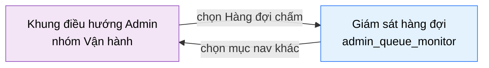

# Tài liệu thiết kế cơ bản (BD) — Giám sát hàng đợi (`ADM0401`)

## Phương châm tài liệu [Nội bộ — không cần khách duyệt]

- Viết theo **mẫu 9 sheet**. Bộ thẻ đóng, quy ước ID, ký hiệu chuẩn, ranh giới với tài liệu khác và
  checklist kiểm toán nằm ở `02-bd/_rules/bd-template-9sheet.md` — file này không chép lại.
- Phần gắn nhãn `[Nội bộ]` phục vụ sinh mã và tự kiểm toán, không phải yêu cầu của khách hàng: mục 4.5, mục
  7.3 và các ghi chú quy ước.
- Mã màn `ADM0401` theo bảng mã ở `02-bd/_rules/bd-template-9sheet.md` mục 8; tên file mang tiền tố mã.
- Màn này **không có màn con và không có popup**. Toàn bộ tương tác diễn ra tại chỗ trên màn chính.

> Đọc cùng `01-rd/screens/admin/ADM0401_queue_monitor.md` (hành vi ở mức yêu cầu, không lặp lại ở đây), hai
> file BD module `02-bd/architecture/judge-orchestration.md` (máy trạng thái, Outbox, sweep) và
> `02-bd/database/judge-orchestration.md` (bảng `submissions`, `outbox_events`), cùng khung chung
> `02-bd/screens/admin/_shell.md` (sidebar, toolbar, nền) — không mô tả lại khung ở đây.

### Phạm vi bị cắt — không thiết kế

- **Chấm lại (rejudge) đã bị loại khỏi phạm vi** theo `DEC-2026-0828-remove-rejudge-scope`
  [Nguồn: 01-rd/screens/admin/ADM0401_queue_monitor.md:41-42]. Vì vậy **không thiết kế**: mức "Hàng đợi chấm
  lại" trong khối Độ trễ [Nguồn: 09-layoutBase/Admin - Hàng đợi chấm.dc.html:477], giá trị `Chấm lại` của
  cột "Ưu tiên" trong bảng job [Nguồn: 09-layoutBase/Admin - Hàng đợi chấm.dc.html:503,509-510], và mục nav
  "Chấm lại" trong sidebar [Nguồn: 09-layoutBase/Admin - Hàng đợi chấm.dc.html:354]. Không có nút hay liên
  kết nào trên màn này dẫn sang màn `admin_rejudge`.
- **Không thiết kế toggle thứ ba "Ưu tiên cao"** [Nguồn: 09-layoutBase/Admin - Hàng đợi chấm.dc.html:473] —
  "kỳ thi" đã được chốt chỉ là nhãn phân loại ưu tiên, không phải một tính năng
  [Nguồn: 01-rd/screens/admin/ADM0401_queue_monitor.md:65]. Nhãn phân loại vẫn hiển thị ở cột "Ưu tiên" của
  bảng job, nhưng không có công tắc bật/tắt trên màn.
- **Không thiết kế điều hướng từ dòng job sang chi tiết bài nộp của học viên** — RD không mô tả hành vi đó.

---

## Sheet 1. Bìa

| Mục | Giá trị |
| :--- | :--- |
| Hệ thống | AlgoPrep |
| Phân hệ | `judge-orchestration` (F4) |
| Công đoạn | BD — Thiết kế cơ bản |
| Phân loại | Màn hình |
| Tên màn | Giám sát hàng đợi |
| Mã màn hình | `ADM0401` |
| Tên vật lý (slug) | `admin_queue_monitor` |
| Trục tài liệu | Màn hình (`02-bd/screens/`) |
| Actor | A3 (`ADMIN`) |
| Phiên bản | V0.2 |
| Người tạo | Nhóm phát triển AlgoPrep |
| Ngày tạo | 2026/09/15 |
| Người cập nhật | Nhóm phát triển AlgoPrep |
| Ngày cập nhật | 2026/09/20 |

---

## Sheet 2. Lịch sử sửa đổi

| Ver | Sheet bị sửa | Nội dung sửa | Ngày | Người sửa |
| :--- | :--- | :--- | :--- | :--- |
| V0.1 | Toàn bộ | Tạo mới theo cấu trúc 9 mục văn xuôi (mục đích và phạm vi, layout regions, component inventory, screen states, API tiêu thụ, navigation, access rights, việc còn mở, tham chiếu) | 2026/09/15 | Nhóm phát triển AlgoPrep |
| V0.2 | Toàn bộ | Chuyển sang mẫu 9 sheet. Tách từng chỉ số tổng thành item riêng kèm công thức, chỉ rõ nguồn của mọi trường hiển thị và phát hiện bốn nhóm trường **không có nguồn dữ liệu nào trong schema `judge`** (cụm worker, trạng thái hai công tắc, cờ ưu tiên job, sự kiện hạ tầng), bổ sung Sheet 8 danh sách sự kiện và Sheet 9 đặc tả kiểm tra, ghi rõ ba đường làm tươi dữ liệu và chuyển việc chọn cơ chế thành câu hỏi mở | 2026/09/20 | Nhóm phát triển AlgoPrep |

---

## Sheet 3. Sơ đồ chuyển màn

> [Nội bộ] Quy ước vẽ: bố trí từ trái sang phải. Màn gọi tới tô tím, màn hiện tại tô xanh nhạt. Màn này
> không có popup nên không dùng màu vàng. Màu và `[Nguồn:]` dùng để truy vết, không phải yêu cầu của khách.

### 3.1 Danh sách chuyển màn

#### Khung điều hướng Admin → Giám sát hàng đợi

[Điều kiện mở] Chọn mục con "Hàng đợi chấm" trong nhóm "Vận hành" ở thanh điều hướng bên trái
[Nguồn: 09-layoutBase/Admin - Hàng đợi chấm.dc.html:352-353].

[Chế độ mở] Chế độ chỉ xem kèm hai điều khiển vận hành. Không có chế độ biên soạn.

[Thông tin truyền] Không có.

[Giá trị trả về] Không có.

[Khi thành công] Tải ảnh chụp hiện trạng hàng đợi và hiển thị bảy khối nội dung; kênh làm tươi dữ liệu bắt
đầu hoạt động.

[Khi huỷ] Không có.

#### Giám sát hàng đợi → Khung điều hướng Admin (rời màn)

[Điều kiện mở] Chọn một mục khác trong thanh điều hướng bên trái.

[Chế độ mở] Không có.

[Thông tin truyền] Không có.

[Giá trị trả về] Không có.

[Khi thành công] Đóng kênh làm tươi dữ liệu và huỷ hẹn giờ trước khi rời màn. Màn này **không có thay đổi
chưa lưu** — hai công tắc gửi lệnh ngay khi bấm, nên không có cảnh báo rời màn.

[Khi huỷ] Không có.

### 3.2 Sơ đồ

[Nguồn: 09-layoutBase/Admin - Hàng đợi chấm.dc.html:68-144,352-353; 01-rd/screens/admin/ADM0401_queue_monitor.md:4]

---

## Sheet 4. Bố cục màn hình

### 4.1 Tổng quan màn

[Mục đích màn] Cho quản trị viên giám sát trực tiếp độ dài hàng đợi, tình trạng cụm worker go-judge và các
job đang chờ hoặc đang chấm, để biết hệ thống có đang khoẻ không và xử lý kịp khi có bài nộp treo
[Nguồn: 01-rd/screens/admin/ADM0401_queue_monitor.md:15-17].

[Luồng nghiệp vụ chính]

1. **Hiển thị ban đầu**: vào màn, hệ thống tải một ảnh chụp hiện trạng gồm bốn chỉ số tổng, danh sách
   worker, trạng thái hai công tắc điều khiển, độ trễ theo hàng đợi, trang đầu bảng job và danh sách sự
   kiện hạ tầng gần đây. Trong lúc chờ, mỗi khối hiển thị khung chờ đúng số dòng dự kiến.
2. **Làm tươi dữ liệu**: màn hiển thị dữ liệu thay đổi liên tục nên phải tự làm tươi. Có ba đường khả dĩ
   (bấm nút thủ công, hẹn giờ theo chu kỳ, đẩy qua kênh thời gian thực) — **nút thủ công đã chắc chắn**, cơ
   chế tự động còn mở, xem Câu hỏi mở Q1.
3. **Lọc bảng job**: quản trị viên chọn một trong ba nhóm Tất cả / Đang chờ / Lỗi, bảng chỉ hiển thị job
   thuộc nhóm đó. Lọc không ảnh hưởng bốn chỉ số tổng.
4. **Điều khiển cụm**: bật "Tạm dừng tiêu thụ hàng đợi" để worker ngừng nhận job mới nhưng job đang chấm
   vẫn chạy hết, không bị ngắt giữa chừng [Nguồn: 01-rd/screens/admin/ADM0401_queue_monitor.md:56-58]. Bật
   hoặc tắt "Tự động mở rộng worker" để đổi chính sách mở rộng cụm.
5. **Theo dõi sự cố**: đọc danh sách sự kiện hạ tầng gần đây để biết worker nào mất kết nối, bài nộp nào
   vượt thời gian chạy, dịch vụ nào lỗi.

[Người dùng] Quản trị viên đã đăng nhập, có Function `JUDGE_QUEUE_MONITOR`
[Nguồn: 02-bd/database/identity.md:48].

[Tệp liên quan] Không có. Màn này không xuất hay nhập tệp.

[Phạm vi]
- Chỉ đọc, cộng đúng **hai** điều khiển vận hành ghi (tạm dừng tiêu thụ hàng đợi, tự động mở rộng worker)
  [Nguồn: 01-rd/screens/admin/ADM0401_queue_monitor.md:35-36,64].
- Không có luồng chấm lại (`DEC-2026-0828-remove-rejudge-scope`).
- Không phải màn quản lý kỳ thi — "Ưu tiên cao" chỉ là nhãn phân loại độ ưu tiên
  [Nguồn: 01-rd/screens/admin/ADM0401_queue_monitor.md:65].
- Sự kiện hạ tầng trên màn này là log của máy móc, **không phải hành động quản trị của người** — hành động
  của người thuộc màn `admin_system_log` [Nguồn: 01-rd/screens/admin/ADM0401_queue_monitor.md:46-49].
- Không cấu hình ngôn ngữ và giới hạn tài nguyên (F4-11) — thuộc màn `admin_language_config`.

[Quyền sử dụng]
- Xem: được, khi có Function `JUDGE_QUEUE_MONITOR`.
- Thêm: không.
- Sửa: chỉ hai công tắc điều khiển cụm.
- Xoá: không.

[Số bản ghi tối đa] Chỉ số tổng: đúng 4 ô. Worker: theo số worker thật của cụm, prototype minh hoạ 4 và ghi
"tự động mở rộng tối đa 8" [Nguồn: 09-layoutBase/Admin - Hàng đợi chấm.dc.html:179]. Điều khiển: đúng 2
dòng. Độ trễ: 2 mức sau khi bỏ mức chấm lại. Bảng job: chưa chốt số dòng và cách phân trang, xem Câu hỏi mở
Q6. Sự kiện hạ tầng: prototype hiển thị 6 dòng gần nhất
[Nguồn: 09-layoutBase/Admin - Hàng đợi chấm.dc.html:523-530].

[Nguồn: 01-rd/screens/admin/ADM0401_queue_monitor.md:15-17,31-49,56-58,64-65; 02-bd/architecture/judge-orchestration.md:35; 02-bd/database/identity.md:48]

### 4.2 DTO liên quan

- `QueueSnapshotDto`
- `WorkerNodeDto`
- `ClusterControlDto`
- `QueueLatencyDto`
- `QueueJobDto`
- `InfraEventDto`

`[Suy luận]` — tên DTO do BD này đề xuất, `03-dd/api/judge-orchestration.md` chốt lại.

### 4.3 Bảng dữ liệu liên quan (2)

| NO | Bảng | Ghi chú |
| --: | :--- | :--- |
| 1 | `judge.submissions` | [Nguồn: 02-bd/database/judge-orchestration.md:8-34] |
| 2 | `judge.outbox_events` | [Nguồn: 02-bd/database/judge-orchestration.md:105-119] |

Bốn nhóm dữ liệu còn lại **không có bảng nào trong schema `judge`**: danh sách worker và số liệu tải của
cụm, trạng thái hai công tắc điều khiển, cờ ưu tiên của từng job, và danh sách sự kiện hạ tầng. Đây là phát
hiện của bản V0.2 chứ không phải thiếu sót trình bày — `02-bd/database/judge-orchestration.md` chỉ có sáu
bảng (`submissions`, `submission_testcase_results`, `judge_run_tokens`, `callback_logs`, `language_configs`,
`outbox_events`) và không bảng nào chứa các trường trên. Xem Câu hỏi mở Q2, Q3, Q4, Q5. **Không tự thêm cột
DB nào ở BD này.**

`judge.submission_testcase_results` **không** được màn này đọc: bảng job chỉ hiển thị trạng thái ở mức
submission, không đi xuống từng testcase.

### 4.4 Vùng bố cục

Đối chiếu `09-layoutBase/Admin - Hàng đợi chấm.dc.html` — bằng chứng bố cục chỉ-đọc, **không phải** design
system cuối cùng.

| Vùng | Vị trí trong prototype | Nội dung |
| :--- | :--- | :--- |
| Thanh điều hướng bên trái (khung chung Admin) | `:68-144` | Nhóm "Vận hành" đang mở, mục con "Hàng đợi chấm" đang chọn kèm số đếm — dùng lại khung chung của mọi màn Admin (`_shell.md` mục 2) |
| Thanh tiêu đề dính trên | `:148-158` | Tiêu đề, mô tả phụ, nút "Làm mới" |
| Dải 4 chỉ số tổng | `:162-174` | Lưới tự co giãn `minmax(210px, 1fr)`, mỗi ô: nhãn, giá trị lớn, mô tả phụ |
| Cột trái — "Cụm worker go-judge" | `:177-195` | Tiêu đề khối, mô tả khối, lưới thẻ worker `minmax(220px, 1fr)` |
| Cột phải — "Điều khiển cụm" | `:198-213` | Danh sách công tắc, mỗi dòng: tên, mô tả, công tắc |
| Cột phải — "Độ trễ theo hàng đợi" | `:215-227` | Danh sách mức hàng đợi, mỗi mức: tên, giá trị, thanh tỉ lệ |
| Bảng "Job trong hàng đợi" | `:231-268` | Tiêu đề, mô tả sắp xếp, bộ lọc phân đoạn 3 nút, bảng 6 cột, cuộn ngang khi hẹp (`min-width: 780px`) |
| "Sự kiện hạ tầng gần đây" | `:270-291` | Tiêu đề, mô tả khối, danh sách dòng log: giờ, mức độ, nội dung, dịch vụ nguồn |
| Chân trang (khung chung Admin) | `:294-307` | Phiên bản, trạng thái tổng quan dịch vụ, 4 liên kết phụ — dùng lại khung chung, ngoài phạm vi nghiệp vụ F4 |

Bố cục hai cột `minmax(0, 1.6fr) minmax(280px, 1fr)` (`:176`): cột trái chứa lưới thẻ worker, cột phải xếp
dọc hai khối cấu hình ngắn. Bảng job và khối sự kiện hạ tầng trải hết chiều rộng bên dưới. Giữ nguyên cấu
trúc này khi dựng Next.js; không quy định màu sắc, khoảng cách hay typography ở BD.

### 4.5 Cấu trúc slice FSD [Nội bộ]

| Khối | Slice dự kiến | Căn cứ |
| :--- | :--- | :--- |
| Trang | `views/admin-queue-monitor` | Quy ước FSD của dự án |
| Khung Admin | Dùng lại `widgets/app-shell` | `02-bd/screens/admin/_shell.md` mục 1 |
| Dải chỉ số tổng | `widgets/queue-kpi-strip` | Prototype `:162-174` |
| Cụm worker | `widgets/worker-cluster-grid` + `entities/worker-node` | Prototype `:177-195` |
| Điều khiển cụm | `features/queue-ops-control` | Prototype `:198-213` |
| Độ trễ hàng đợi | `widgets/queue-latency-panel` | Prototype `:215-227` |
| Bảng job | `widgets/queue-job-table` + `features/queue-job-filter` + `entities/queue-job` | Prototype `:231-268` |
| Sự kiện hạ tầng | `widgets/infra-event-feed` + `entities/infra-event` | Prototype `:270-291` |
| Kênh làm tươi dữ liệu | `shared/api` (một chỗ duy nhất, mọi khối cùng dùng) | Xem Câu hỏi mở Q1 |

`[Suy luận]` — ánh xạ slice do BD đề xuất, DD màn hình chốt lại.

> [Nội bộ] Ảnh minh hoạ đặt ở `08-diagram/02-bd/screens/admin/`, chụp bằng Playwright trên ứng dụng Next.js
> thật khi đã có mã chạy được. Chưa có thì tham chiếu prototype, không vẽ tay.

---

## Sheet 5. Danh sách item màn hình

> Quy ước ID, bộ thẻ và giá trị chuẩn: `02-bd/_rules/bd-template-9sheet.md` mục 2, 3, 4.

### Khu vực A — Thanh tiêu đề

| Khu vực | NO | Tên item | ID item | Bảng DB | Cột DB | Loại UI | Kiểu | Độ dài | Bắt buộc | I/O | Giá trị mặc định | Định dạng | Ghi chú |
| :--- | --: | :--- | :--- | :--- | :--- | :--- | :--- | :--- | :-: | :-: | :--- | :--- | :--- |
| Thanh tiêu đề | | | | | | | | | | | | | |
| | 1 | Tiêu đề màn | `adminQueueMonitor.header.title` | - | - | Label | String | - | - | O | Hàng đợi chấm và cụm go-judge | - | Tên màn hiển thị cố định [Nguồn giá trị] Nhãn tĩnh i18n, prototype `:533` [EVT liên quan] - |
| | 2 | Mô tả phụ | `adminQueueMonitor.header.subtitle` | - | - | Label | String | - | - | O | Giám sát trực tiếp | - | Mô tả ngắn phạm vi màn. Prototype ghi kèm "làm mới mỗi 5 giây" (`:534`) nhưng chu kỳ này chưa chốt nên **không đưa vào nhãn mặc định**, xem Q1 [Nguồn giá trị] Nhãn tĩnh i18n [EVT liên quan] - |
| | 3 | Làm mới | `adminQueueMonitor.header.btnRefresh` | - | - | Button | - | - | - | I | - | - | Tải lại toàn bộ ảnh chụp hiện trạng ngay lập tức, không chờ chu kỳ tự động (prototype `:535`) [Nguồn giá trị] - [EVT liên quan] EVT-2 |

### Khu vực B — Chỉ số tổng

| Khu vực | NO | Tên item | ID item | Bảng DB | Cột DB | Loại UI | Kiểu | Độ dài | Bắt buộc | I/O | Giá trị mặc định | Định dạng | Ghi chú |
| :--- | --: | :--- | :--- | :--- | :--- | :--- | :--- | :--- | :-: | :-: | :--- | :--- | :--- |
| Chỉ số tổng | | | | | | | | | | | | | |
| | 1 | Job đang chờ | `adminQueueMonitor.kpi.pendingCount` | `judge.submissions` | `status` | Label | Number | 6 | - | O | 0 | Số nguyên | Số bài nộp đã vào hàng đợi nhưng chưa có worker nhận [Công thức] Đếm `submissions` có `status = 'PENDING'`. Lấy từ bảng `submissions`, **không** đếm message tồn trong RabbitMQ — trạng thái trong DB là nguồn duy nhất không phụ thuộc broker `[Suy luận]` [EVT liên quan] EVT-1, EVT-3 |
| | 2 | Mô tả job đang chờ | `adminQueueMonitor.kpi.pendingSub` | `judge.submissions` | `submitted_at` | Label | String | - | - | O | - | `Chờ lâu nhất {số} giây` | Thời gian chờ của job cũ nhất còn trong hàng đợi (prototype `:441`) [Công thức] `now() - MIN(submitted_at)` trong tập `status = 'PENDING'`; không có dòng nào thì hiển thị `-` [EVT liên quan] EVT-1, EVT-3 |
| | 3 | Đang chấm | `adminQueueMonitor.kpi.runningCount` | `judge.submissions` | `status` | Label | Number | 6 | - | O | 0 | Số nguyên | Số bài nộp đang được worker xử lý [Công thức] Đếm `submissions` có `status IN ('COMPILING','JUDGING')` — đúng hai trạng thái trung gian còn lại của máy trạng thái [Nguồn: 02-bd/architecture/judge-orchestration.md:93-97] [EVT liên quan] EVT-1, EVT-3 |
| | 4 | Mô tả đang chấm | `adminQueueMonitor.kpi.runningSub` | - | - | Label | String | - | - | O | - | `{số} worker đang bận` | Số worker có ít nhất một job (prototype `:442`) [Nguồn giá trị] Trạng thái runtime của cụm go-judge, **không có bảng trong schema `judge`** — xem Q2 [EVT liên quan] EVT-1, EVT-3 |
| | 5 | Thông lượng | `adminQueueMonitor.kpi.throughput` | `judge.submissions` | `finished_at` | Label | Number | 6 | - | O | 0 | `{số}/phút` | Số job chấm xong trung bình mỗi phút trong một giờ qua [Công thức] Đếm `submissions` có `finished_at >= now() - interval '1 hour'` rồi chia 60, làm tròn số nguyên. Tính từ bảng `submissions`, **không cần Prometheus** vì `finished_at` đã đủ dữ kiện `[Suy luận]` [EVT liên quan] EVT-1, EVT-3 |
| | 6 | Mô tả thông lượng | `adminQueueMonitor.kpi.throughputSub` | - | - | Label | String | - | - | O | Trung bình 1 giờ qua | - | Cửa sổ thời gian dùng để tính thông lượng (prototype `:443`) [Nguồn giá trị] Nhãn tĩnh i18n, cố định theo công thức ở NO 5 [EVT liên quan] - |
| | 7 | Job lỗi 24 giờ | `adminQueueMonitor.kpi.failed24hCount` | `judge.submissions` | `status`, `finished_at` | Label | Number | 6 | - | O | 0 | Số nguyên | Số job hỏng vì lỗi hệ thống trong 24 giờ qua [Công thức] Đếm `submissions` có `status = 'SYSTEM_ERROR'` và `finished_at >= now() - interval '24 hours'`. **Không tính** `COMPILE_ERROR` và `WRONG_ANSWER` — đó là lỗi của bài giải, không phải lỗi hạ tầng `[Suy luận]` [EVT liên quan] EVT-1, EVT-3 |
| | 8 | Mô tả job lỗi | `adminQueueMonitor.kpi.failed24hSub` | `judge.submissions` | `failure_reason` | Label | String | - | - | O | - | `{số} lỗi sandbox · {số} hết thời gian` | Phân rã số job lỗi theo nguyên nhân (prototype `:444`) [Công thức] Đếm theo `failure_reason` trong cùng tập ở NO 7: `SANDBOX_FAULT` và `WORKER_TIMEOUT` — đúng hai giá trị enum đang có [Nguồn: 02-bd/database/judge-orchestration.md:23]. Prototype ghi "hết bộ nhớ" nhưng đó là verdict `MLE` ở mức testcase, không phải `failure_reason` ở mức submission, nên **không dùng** [EVT liên quan] EVT-1, EVT-3 |

### Khu vực C — Cụm worker go-judge

| Khu vực | NO | Tên item | ID item | Bảng DB | Cột DB | Loại UI | Kiểu | Độ dài | Bắt buộc | I/O | Giá trị mặc định | Định dạng | Ghi chú |
| :--- | --: | :--- | :--- | :--- | :--- | :--- | :--- | :--- | :-: | :-: | :--- | :--- | :--- |
| Cụm worker go-judge | | | | | | | | | | | | | |
| | 1 | Tiêu đề khối worker | `adminQueueMonitor.worker.blockTitle` | - | - | Label | String | - | - | O | Cụm worker go-judge | - | Tên khối [Nguồn giá trị] Nhãn tĩnh i18n, prototype `:178` [EVT liên quan] - |
| | 2 | Mô tả khối worker | `adminQueueMonitor.worker.blockSubtitle` | - | - | Label | String | - | - | O | - | `{số} worker · tự động mở rộng tối đa {số}` | Quy mô cụm hiện tại và trần mở rộng (prototype `:179`) [Nguồn giá trị] Cấu hình cụm go-judge, **không có bảng trong schema `judge`** — xem Q2 [EVT liên quan] EVT-1, EVT-3 |
| | 3 | Danh sách worker | `adminQueueMonitor.worker.list` | - | - | List | List | - | - | O | rỗng | - | Mỗi thẻ là một worker của cụm go-judge [Nguồn giá trị] Trạng thái runtime của cụm go-judge — xem Q2 [EVT liên quan] EVT-1, EVT-3 |
| | 4 | Mã worker | `adminQueueMonitor.worker.col.nodeId` | - | - | ListColumn | String | 50 | - | O | - | `go-judge-w{số}` | Định danh worker trong cụm (prototype `:453-456`) [Nguồn giá trị] Trạng thái runtime của cụm go-judge — xem Q2 [EVT liên quan] - |
| | 5 | Trạng thái worker | `adminQueueMonitor.worker.col.status` | - | - | Badge | Enum | - | - | O | - | Nhãn tiếng Việt | Ba giá trị: "Đang chạy", "Nhàn rỗi", "Quá tải" (prototype `:448-450`) [Nguồn giá trị] Trạng thái runtime của cụm go-judge — xem Q2 [EVT liên quan] - |
| | 6 | Thanh tải | `adminQueueMonitor.worker.col.loadBar` | - | - | ProgressBar | Number | - | - | O | - | - | Biểu diễn trực quan mức tải của worker [Công thức] Chiều rộng bằng đúng giá trị phần trăm ở NO 7; đổi sang màu cảnh báo khi vượt 85% [Nguồn: 09-layoutBase/Admin - Hàng đợi chấm.dc.html:460] [EVT liên quan] - |
| | 7 | Mức tải | `adminQueueMonitor.worker.col.loadPercent` | - | - | ListColumn | Number | 3 | - | O | - | `Tải {số}%` | Phần trăm tải hiện tại của worker [Nguồn giá trị] Trạng thái runtime của cụm go-judge — xem Q2 [EVT liên quan] - |
| | 8 | Số job của worker | `adminQueueMonitor.worker.col.jobCount` | - | - | ListColumn | Number | 3 | - | O | 0 | `{số} job` | Số job worker đang xử lý (prototype `:190`) [Nguồn giá trị] Trạng thái runtime của cụm go-judge — xem Q2 [EVT liên quan] - |
| | 9 | Thông tin phụ worker | `adminQueueMonitor.worker.col.meta` | - | - | ListColumn | String | - | - | O | - | `Uptime {chuỗi} · vCPU {số}` | Thời gian chạy liên tục và số vCPU cấp cho worker (prototype `:453-456`) [Nguồn giá trị] Trạng thái runtime của cụm go-judge — xem Q2 [EVT liên quan] - |

### Khu vực D — Điều khiển cụm

| Khu vực | NO | Tên item | ID item | Bảng DB | Cột DB | Loại UI | Kiểu | Độ dài | Bắt buộc | I/O | Giá trị mặc định | Định dạng | Ghi chú |
| :--- | --: | :--- | :--- | :--- | :--- | :--- | :--- | :--- | :-: | :-: | :--- | :--- | :--- |
| Điều khiển cụm | | | | | | | | | | | | | |
| | 1 | Tiêu đề khối điều khiển | `adminQueueMonitor.control.blockTitle` | - | - | Label | String | - | - | O | Điều khiển cụm | - | Tên khối [Nguồn giá trị] Nhãn tĩnh i18n, prototype `:199` [EVT liên quan] - |
| | 2 | Danh sách điều khiển | `adminQueueMonitor.control.list` | - | - | List | List | - | - | I/O | 2 dòng | - | Đúng 2 điều khiển vận hành thuộc phạm vi F4-10. Prototype có dòng thứ ba "Ưu tiên cao" (`:473`) — **không thiết kế**, xem phần Phạm vi bị cắt [Nguồn giá trị] Trạng thái vận hành của cụm, **không có bảng trong schema `judge`** — xem Q3 [EVT liên quan] EVT-1, EVT-3 |
| | 3 | Tạm dừng tiêu thụ hàng đợi | `adminQueueMonitor.control.togglePause` | - | - | Toggle | Boolean | - | - | I/O | Tắt | Bật / Tắt | Bật thì worker ngừng nhận job mới, job đang chấm vẫn chạy hết [Nguồn: 01-rd/screens/admin/ADM0401_queue_monitor.md:56-58]. Nhãn và mô tả "Giữ job lại, không giao cho worker" là nhãn tĩnh i18n (prototype `:471`) [Nguồn giá trị] Trạng thái vận hành của cụm — xem Q3 [EVT liên quan] EVT-7 |
| | 4 | Tự động mở rộng worker | `adminQueueMonitor.control.toggleAutoscale` | - | - | Toggle | Boolean | - | - | I/O | Bật | Bật / Tắt | Bật thì cụm tự thêm worker khi hàng đợi vượt ngưỡng. Nhãn và mô tả "Thêm worker khi hàng đợi vượt 20 job" là nhãn tĩnh i18n; **ngưỡng 20 chưa có nguồn**, xem Q3 (prototype `:472`) [Nguồn giá trị] Trạng thái vận hành của cụm — xem Q3 [EVT liên quan] EVT-8 |

### Khu vực E — Độ trễ theo hàng đợi

| Khu vực | NO | Tên item | ID item | Bảng DB | Cột DB | Loại UI | Kiểu | Độ dài | Bắt buộc | I/O | Giá trị mặc định | Định dạng | Ghi chú |
| :--- | --: | :--- | :--- | :--- | :--- | :--- | :--- | :--- | :-: | :-: | :--- | :--- | :--- |
| Độ trễ theo hàng đợi | | | | | | | | | | | | | |
| | 1 | Tiêu đề khối độ trễ | `adminQueueMonitor.latency.blockTitle` | - | - | Label | String | - | - | O | Độ trễ theo hàng đợi | - | Tên khối [Nguồn giá trị] Nhãn tĩnh i18n, prototype `:216` [EVT liên quan] - |
| | 2 | Danh sách mức hàng đợi | `adminQueueMonitor.latency.list` | `judge.submissions` | - | List | List | - | - | O | 2 dòng | - | Hai mức: "Hàng đợi thường" và "Hàng đợi ưu tiên cao". Mức "Hàng đợi chấm lại" của prototype (`:477`) **không thiết kế** — chấm lại đã cắt phạm vi [Nguồn giá trị] Tính từ `submissions`, phân nhóm theo cờ ưu tiên — cờ này chưa có nguồn, xem Q4 [EVT liên quan] EVT-1, EVT-3 |
| | 3 | Tên mức hàng đợi | `adminQueueMonitor.latency.col.name` | - | - | ListColumn | String | - | - | O | - | - | Tên mức hiển thị cho người dùng [Nguồn giá trị] Nhãn tĩnh i18n map từ mã mức [EVT liên quan] - |
| | 4 | Giá trị độ trễ | `adminQueueMonitor.latency.col.value` | `judge.submissions` | `submitted_at`, `started_grading_at` | ListColumn | Number | 6 | - | O | - | `{số},{số}s` | Thời gian chờ trung bình từ lúc nộp tới lúc worker nhận job [Công thức] Trung bình `started_grading_at - submitted_at` trong tập job đã bắt đầu chấm ở một giờ gần nhất, tính riêng cho từng mức `[Suy luận]` — cửa sổ 1 giờ lấy cùng cửa sổ với chỉ số Thông lượng cho nhất quán [EVT liên quan] EVT-1, EVT-3 |
| | 5 | Thanh tỉ lệ độ trễ | `adminQueueMonitor.latency.col.bar` | - | - | ProgressBar | Number | - | - | O | - | - | Biểu diễn trực quan độ trễ so với ngưỡng [Công thức] Chiều rộng tỉ lệ với giá trị độ trễ trên một ngưỡng trần; ngưỡng trần chưa có nguồn, xem Q6. Đổi màu cảnh báo khi vượt 70% chiều rộng [Nguồn: 09-layoutBase/Admin - Hàng đợi chấm.dc.html:480] [EVT liên quan] - |

### Khu vực F — Bảng job trong hàng đợi

| Khu vực | NO | Tên item | ID item | Bảng DB | Cột DB | Loại UI | Kiểu | Độ dài | Bắt buộc | I/O | Giá trị mặc định | Định dạng | Ghi chú |
| :--- | --: | :--- | :--- | :--- | :--- | :--- | :--- | :--- | :-: | :-: | :--- | :--- | :--- |
| Bảng job trong hàng đợi | | | | | | | | | | | | | |
| | 1 | Tiêu đề khối bảng job | `adminQueueMonitor.job.blockTitle` | - | - | Label | String | - | - | O | Job trong hàng đợi | - | Tên khối [Nguồn giá trị] Nhãn tĩnh i18n, prototype `:234` [EVT liên quan] - |
| | 2 | Mô tả sắp xếp | `adminQueueMonitor.job.blockSubtitle` | - | - | Label | String | - | - | O | Sắp xếp theo mức ưu tiên rồi thời gian chờ | - | Quy tắc sắp xếp mặc định của bảng (prototype `:235`) [Nguồn giá trị] Nhãn tĩnh i18n [EVT liên quan] - |
| | 3 | Bộ lọc trạng thái | `adminQueueMonitor.job.filter` | - | - | Button | Enum | - | - | I | Tất cả | Tất cả / Đang chờ / Lỗi | Nhóm 3 nút phân đoạn, chọn một tại một thời điểm (prototype `:483`) [Nguồn giá trị] Nhãn tĩnh i18n; giá trị lọc ánh xạ sang `submissions.status`: "Đang chờ" thành `PENDING`, "Lỗi" thành `SYSTEM_ERROR`, "Tất cả" không lọc [EVT liên quan] EVT-6 |
| | 4 | Danh sách job | `adminQueueMonitor.job.list` | `judge.submissions` | - | List | List | - | - | O | rỗng | - | Các bài nộp chưa vào trạng thái cuối, cộng các bài vừa rơi vào trạng thái lỗi hệ thống [Công thức] Lọc `submissions` có `status IN ('PENDING','COMPILING','JUDGING')`, cộng `status = 'SYSTEM_ERROR'` trong cửa sổ hiển thị tạm; cửa sổ này và cách phân trang chưa chốt, xem Q6 [EVT liên quan] EVT-1, EVT-3 |
| | 5 | Mã job | `adminQueueMonitor.job.col.jobCode` | - | - | ListColumn | String | 20 | - | O | - | `#J-{số}` | Mã job trong hàng đợi. **Không có cột nào trong schema `judge` tương ứng** — chỉ có `submissions.id`, không có thực thể "job" riêng. Đề xuất bỏ cột này vì trùng nghĩa với cột NO 6, xem Q5 [Nguồn giá trị] Không có nguồn — xem Q5 [EVT liên quan] - |
| | 6 | Lượt nộp | `adminQueueMonitor.job.col.submissionCode` | `judge.submissions` | `id` | ListColumn | String | 40 | - | O | - | `#SB-{chuỗi}` | Mã bài nộp, hiển thị dạng rút gọn để đọc được [Công thức] Rút gọn `submissions.id` (UUID) theo quy tắc hiển thị; quy tắc rút gọn chốt ở DD [EVT liên quan] - |
| | 7 | Ngôn ngữ | `adminQueueMonitor.job.col.language` | `judge.submissions` | `language` | ListColumn | Enum | - | - | O | - | Nhãn hiển thị | Ngôn ngữ của bài nộp [Nguồn giá trị] `JAVA` thành "Java 21"; `CPP` thành "C++ 17"; `PYTHON` thành "Python 3" — đúng ba ngôn ngữ khoá cứng [Nguồn: 02-bd/database/judge-orchestration.md:18] [EVT liên quan] - |
| | 8 | Ưu tiên | `adminQueueMonitor.job.col.priority` | - | - | Badge | Enum | - | - | O | Thường | Nhãn tiếng Việt | Hai giá trị: "Ưu tiên cao" và "Thường". Giá trị "Chấm lại" của prototype (`:503`) **không thiết kế**. **Bảng `submissions` không có cột cờ ưu tiên nào** [Nguồn: 02-bd/database/judge-orchestration.md:12-34] — xem Q4 [Nguồn giá trị] Không có nguồn — xem Q4 [EVT liên quan] - |
| | 9 | Trạng thái job | `adminQueueMonitor.job.col.status` | `judge.submissions` | `status` | Badge | Enum | - | - | O | - | Nhãn tiếng Việt | Ánh xạ từ máy trạng thái F4 [Nguồn: 02-bd/architecture/judge-orchestration.md:93-104]: `PENDING` thành "Đang chờ"; `COMPILING` và `JUDGING` thành "Đang chấm"; `SYSTEM_ERROR` thành "Lỗi sandbox". **Không hiển thị** `ACCEPTED`/`WRONG_ANSWER`/`TIME_LIMIT_EXCEEDED`/`RUNTIME_ERROR`/`COMPILE_ERROR` vì job đã rời hàng đợi [Nguồn giá trị] Cột `status` [EVT liên quan] - |
| | 10 | Thời gian chờ | `adminQueueMonitor.job.col.waitTime` | `judge.submissions` | `submitted_at`, `started_grading_at` | ListColumn | Number | 8 | - | O | - | `{số},{số}s` | Thời gian job đã chờ hoặc đã chạy [Công thức] Chưa có `started_grading_at` thì `now() - submitted_at`; đã có thì `now() - started_grading_at`. Job ở trạng thái lỗi hiển thị `-` (prototype `:511`) [EVT liên quan] EVT-3 |

### Khu vực G — Sự kiện hạ tầng gần đây

| Khu vực | NO | Tên item | ID item | Bảng DB | Cột DB | Loại UI | Kiểu | Độ dài | Bắt buộc | I/O | Giá trị mặc định | Định dạng | Ghi chú |
| :--- | --: | :--- | :--- | :--- | :--- | :--- | :--- | :--- | :-: | :-: | :--- | :--- | :--- |
| Sự kiện hạ tầng gần đây | | | | | | | | | | | | | |
| | 1 | Tiêu đề khối sự kiện | `adminQueueMonitor.infra.blockTitle` | - | - | Label | String | - | - | O | Sự kiện hạ tầng gần đây | - | Tên khối [Nguồn giá trị] Nhãn tĩnh i18n, prototype `:273` [EVT liên quan] - |
| | 2 | Mô tả khối sự kiện | `adminQueueMonitor.infra.blockSubtitle` | - | - | Label | String | - | - | O | Worker, AI Gateway, sao lưu · không phải hành động quản trị, xem hành động ở Nhật ký hệ thống | - | Phân định rõ với màn `admin_system_log` [Nguồn: 01-rd/screens/admin/ADM0401_queue_monitor.md:46-49] [Nguồn giá trị] Nhãn tĩnh i18n, prototype `:274` [EVT liên quan] - |
| | 3 | Danh sách sự kiện | `adminQueueMonitor.infra.list` | `judge.outbox_events` | `publish_attempts` | List | List | - | - | O | rỗng | - | Log hạ tầng của máy móc. Một phần nguồn đã xác định: dòng cảnh báo khi một bản ghi Outbox kẹt nhiều lần lấy từ `outbox_events.publish_attempts` [Nguồn: 02-bd/database/judge-orchestration.md:116,158-159]; phần còn lại (worker mất kết nối, lỗi gọi AI, sao lưu) **chưa có nguồn**, xem Q5 [Nguồn giá trị] Xem Q5 [EVT liên quan] EVT-1, EVT-3 |
| | 4 | Giờ sự kiện | `adminQueueMonitor.infra.col.time` | - | - | ListColumn | Date | 8 | - | O | - | `HH:mm:ss` | Thời điểm phát sinh sự kiện (prototype `:524-529`) [Nguồn giá trị] Theo nguồn của NO 3 — xem Q5 [EVT liên quan] - |
| | 5 | Mức độ sự kiện | `adminQueueMonitor.infra.col.level` | - | - | Badge | Enum | - | - | O | - | `ERROR` / `WARN` / `INFO` | Ba mức, giữ nguyên chữ in hoa như prototype `:518-521` vì đây là thuật ngữ log, không dịch [Nguồn giá trị] Theo nguồn của NO 3 — xem Q5 [EVT liên quan] - |
| | 6 | Nội dung sự kiện | `adminQueueMonitor.infra.col.message` | - | - | ListColumn | String | - | - | O | - | - | Câu mô tả sự kiện [Nguồn giá trị] Theo nguồn của NO 3 — xem Q5 [EVT liên quan] - |
| | 7 | Dịch vụ nguồn | `adminQueueMonitor.infra.col.service` | - | - | ListColumn | String | 30 | - | O | - | - | Tên dịch vụ phát sinh sự kiện: `go-judge`, `ai-gateway`, `db` (prototype `:524-529`) [Nguồn giá trị] Theo nguồn của NO 3 — xem Q5 [EVT liên quan] - |

### Khu vực H — Trạng thái kênh dữ liệu

| Khu vực | NO | Tên item | ID item | Bảng DB | Cột DB | Loại UI | Kiểu | Độ dài | Bắt buộc | I/O | Giá trị mặc định | Định dạng | Ghi chú |
| :--- | --: | :--- | :--- | :--- | :--- | :--- | :--- | :--- | :-: | :-: | :--- | :--- | :--- |
| Trạng thái kênh dữ liệu | | | | | | | | | | | | | |
| | 1 | Băng cảnh báo mất kết nối | `adminQueueMonitor.stream.disconnectBanner` | - | - | Label | String | - | - | O | - | - | Cảnh báo dữ liệu trên màn đã đóng băng vì kênh làm tươi rớt. Nội dung "Mất kết nối thời gian thực — đang thử kết nối lại." [Nguồn giá trị] Nhãn tĩnh i18n; trạng thái kết nối do tầng giao diện tự biết, không cần nguồn dữ liệu [EVT liên quan] EVT-4, EVT-5 |
| | 2 | Thời điểm cập nhật gần nhất | `adminQueueMonitor.stream.lastUpdatedAt` | - | - | Label | Date | 8 | - | O | - | `Cập nhật lúc HH:mm:ss` | Cho biết dữ liệu đang xem cũ bao lâu — bắt buộc trên một màn giám sát, vì không có nó người đọc không phân biệt được "hàng đợi đang trống" với "màn hình đang đứng" `[Suy luận]`. Prototype chưa có item này [Nguồn giá trị] Thời điểm tầng giao diện nhận lô dữ liệu gần nhất [EVT liên quan] EVT-2, EVT-3 |

[Nguồn: 09-layoutBase/Admin - Hàng đợi chấm.dc.html:148-158,162-174,177-195,198-227,231-268,270-291,440-445,452-462,470-474,476-481,483-493,505-516,518-530,533-535; 02-bd/database/judge-orchestration.md:12-34,105-119; 02-bd/architecture/judge-orchestration.md:93-104]

---

## Sheet 6. Đặc tả điều khiển item

> Ký hiệu cột `Hiển thị` và thứ tự thẻ: `02-bd/_rules/bd-template-9sheet.md` mục 2, 3. Dùng đúng NO, tên
> item và thứ tự của Sheet 5. Lỗi nhập liệu ghi ở Sheet 9, xử lý nghiệp vụ ghi ở Sheet 8.

**Nguyên tắc làm tươi dữ liệu áp cho toàn bộ Khu vực B, C, E, F, G.** Màn này hiển thị dữ liệu thay đổi
liên tục nên mọi ô số đều phải tự làm mới. Có ba đường:

1. **Bấm nút "Làm mới"** (EVT-2) — chắc chắn có, prototype `:535`.
2. **Hẹn giờ theo chu kỳ** — prototype ghi "làm mới mỗi 5 giây" ở mô tả phụ (`:534`).
3. **Đẩy qua kênh thời gian thực** — bản BD V0.1 đề xuất một topic STOMP tổng hợp cấp admin, tách khỏi
   topic theo `submissionId` của F4-08 [Nguồn: 02-bd/architecture/judge-orchestration.md:33].

**Đường 1 đã chốt. Chọn đường 2 hay đường 3 (hoặc cả hai) còn mở — xem Câu hỏi mở Q1.** Phần chung của cả
hai phương án, áp dụng bất kể chọn gì: dữ liệu về theo lô, thay tại chỗ, **không dựng lại khung chờ ở mỗi
lượt làm tươi** (nếu không màn sẽ nhấp nháy liên tục); lượt làm tươi nào thất bại thì giữ nguyên dữ liệu
lô trước và đổi item `Thời điểm cập nhật gần nhất` sang trạng thái cũ, không xoá trắng màn.

### Khu vực A — Thanh tiêu đề

| Khu vực | NO | Tên item | Hiển thị | Ghi chú |
| :--- | --: | :--- | :-: | :--- |
| Thanh tiêu đề | | | | |
| | 1 | Tiêu đề màn | Có | - |
| | 2 | Mô tả phụ | Có | - |
| | 3 | Làm mới | Có | [Điều kiện kích hoạt] Không kích hoạt trong lúc một lượt tải đang chạy, kích hoạt lại khi lượt đó kết thúc dù thành công hay thất bại. |

### Khu vực B — Chỉ số tổng

| Khu vực | NO | Tên item | Hiển thị | Ghi chú |
| :--- | --: | :--- | :-: | :--- |
| Chỉ số tổng | | | | |
| | 1 | Job đang chờ | Có | [Điều kiện hiển thị] Trong lúc tải lần đầu hiển thị khung chờ đúng 4 ô. [Tự động đặt] Cập nhật ở mỗi lượt làm tươi theo nguyên tắc chung ở đầu Sheet. |
| | 2 | Mô tả job đang chờ | Điều kiện | [Điều kiện hiển thị] Chỉ hiển thị khi có ít nhất một job `PENDING`; hàng đợi rỗng thì ẩn dòng mô tả, giữ nguyên số 0 ở NO 1. [Tự động đặt] Cập nhật ở mỗi lượt làm tươi. |
| | 3 | Đang chấm | Có | [Tự động đặt] Cập nhật ở mỗi lượt làm tươi. |
| | 4 | Mô tả đang chấm | Có | [Tự động đặt] Cập nhật ở mỗi lượt làm tươi. |
| | 5 | Thông lượng | Có | [Tự động đặt] Cập nhật ở mỗi lượt làm tươi. |
| | 6 | Mô tả thông lượng | Có | - |
| | 7 | Job lỗi 24 giờ | Có | [Tự động đặt] Cập nhật ở mỗi lượt làm tươi. |
| | 8 | Mô tả job lỗi | Điều kiện | [Điều kiện hiển thị] Chỉ hiển thị khi NO 7 lớn hơn 0; bằng 0 thì ẩn dòng phân rã. [Tự động đặt] Cập nhật ở mỗi lượt làm tươi. |

### Khu vực C — Cụm worker go-judge

| Khu vực | NO | Tên item | Hiển thị | Ghi chú |
| :--- | --: | :--- | :-: | :--- |
| Cụm worker go-judge | | | | |
| | 1 | Tiêu đề khối worker | Có | - |
| | 2 | Mô tả khối worker | Có | [Tự động đặt] Cập nhật ở mỗi lượt làm tươi khi số worker của cụm đổi. |
| | 3 | Danh sách worker | Có | [Điều kiện hiển thị] Trong lúc tải lần đầu hiển thị khung chờ đúng 4 thẻ. Tải xong mà không đọc được cụm thì hiển thị "Không đọc được trạng thái cụm worker" thay cho lưới thẻ, các khối khác vẫn hiển thị bình thường. [Tự động đặt] Cập nhật ở mỗi lượt làm tươi; worker mới xuất hiện hoặc biến mất thì thêm hoặc bỏ thẻ tương ứng. |
| | 4 | Mã worker | Có | - |
| | 5 | Trạng thái worker | Có | [Tự động đặt] Chuyển sang "Quá tải" khi mức tải vượt 85% [Nguồn: 01-rd/screens/admin/ADM0401_queue_monitor.md:53-55]. |
| | 6 | Thanh tải | Có | [Tự động đặt] Chiều rộng và màu cập nhật cùng lúc với mức tải ở NO 7. |
| | 7 | Mức tải | Có | [Tự động đặt] Cập nhật ở mỗi lượt làm tươi. |
| | 8 | Số job của worker | Có | [Tự động đặt] Cập nhật ở mỗi lượt làm tươi. |
| | 9 | Thông tin phụ worker | Có | [Tự động đặt] Uptime tăng dần theo mỗi lượt làm tươi. |

### Khu vực D — Điều khiển cụm

| Khu vực | NO | Tên item | Hiển thị | Ghi chú |
| :--- | --: | :--- | :-: | :--- |
| Điều khiển cụm | | | | |
| | 1 | Tiêu đề khối điều khiển | Có | - |
| | 2 | Danh sách điều khiển | Có | [Điều kiện hiển thị] Trong lúc tải lần đầu hiển thị khung chờ đúng 2 dòng. |
| | 3 | Tạm dừng tiêu thụ hàng đợi | Có | [Điều kiện kích hoạt] Kích hoạt sau khi tải xong dữ liệu; không kích hoạt trong lúc lệnh trước đó chưa có phản hồi. [Tự động đặt] Công tắc **không** đổi trạng thái hiển thị ngay khi bấm — chỉ đổi sau khi máy chủ xác nhận, tránh hiển thị sai trạng thái cụm nếu lệnh thất bại. Lượt làm tươi kế tiếp lấy trạng thái thật từ máy chủ ghi đè trạng thái đang hiển thị. |
| | 4 | Tự động mở rộng worker | Có | [Điều kiện kích hoạt] Kích hoạt sau khi tải xong dữ liệu; không kích hoạt trong lúc lệnh trước đó chưa có phản hồi. [Tự động đặt] Giống NO 3 — chỉ đổi sau khi máy chủ xác nhận. |

### Khu vực E — Độ trễ theo hàng đợi

| Khu vực | NO | Tên item | Hiển thị | Ghi chú |
| :--- | --: | :--- | :-: | :--- |
| Độ trễ theo hàng đợi | | | | |
| | 1 | Tiêu đề khối độ trễ | Có | - |
| | 2 | Danh sách mức hàng đợi | Có | [Điều kiện hiển thị] Trong lúc tải lần đầu hiển thị khung chờ đúng 2 dòng. [Tự động đặt] Cập nhật ở mỗi lượt làm tươi. |
| | 3 | Tên mức hàng đợi | Có | - |
| | 4 | Giá trị độ trễ | Điều kiện | [Điều kiện hiển thị] Mức không có job nào trong cửa sổ tính thì hiển thị `-` thay cho số, **không** hiển thị `0,0s` — hai thứ này khác nghĩa. |
| | 5 | Thanh tỉ lệ độ trễ | Có | [Tự động đặt] Chiều rộng và màu cập nhật cùng lúc với giá trị độ trễ. |

### Khu vực F — Bảng job trong hàng đợi

| Khu vực | NO | Tên item | Hiển thị | Ghi chú |
| :--- | --: | :--- | :-: | :--- |
| Bảng job trong hàng đợi | | | | |
| | 1 | Tiêu đề khối bảng job | Có | - |
| | 2 | Mô tả sắp xếp | Có | - |
| | 3 | Bộ lọc trạng thái | Có | [Điều kiện kích hoạt] Kích hoạt sau khi tải xong dữ liệu. Nút đang chọn vẫn kích hoạt nhưng bấm lại không làm gì. [Tự động đặt] Lựa chọn lọc **giữ nguyên** qua mọi lượt làm tươi, không tự về "Tất cả". |
| | 4 | Danh sách job | Có | [Điều kiện hiển thị] Trong lúc tải lần đầu hiển thị khung chờ đúng 6 dòng. Sau khi lọc mà không còn dòng nào thì hiển thị "Không có job nào đang chờ" thay cho thân bảng, giữ nguyên hàng tiêu đề và bộ lọc. [Tự động đặt] Cập nhật ở mỗi lượt làm tươi; job vào trạng thái cuối thành công thì biến mất khỏi bảng ở lượt kế tiếp. |
| | 5 | Mã job | Có | [Điều kiện hiển thị] Cột này chỉ dựng nếu Q5 kết luận có nguồn thật; chưa chốt thì **không dựng cột** khi làm giao diện thật. |
| | 6 | Lượt nộp | Có | - |
| | 7 | Ngôn ngữ | Có | - |
| | 8 | Ưu tiên | Có | [Điều kiện hiển thị] Cột này chỉ dựng nếu Q4 chốt được nguồn của cờ ưu tiên; chưa chốt thì mọi dòng hiển thị "Thường" và cột mất ý nghĩa phân biệt. |
| | 9 | Trạng thái job | Có | [Tự động đặt] Cập nhật ở mỗi lượt làm tươi theo `submissions.status`. |
| | 10 | Thời gian chờ | Có | [Tự động đặt] Tăng dần theo mỗi lượt làm tươi chừng nào job còn trong bảng. |

### Khu vực G — Sự kiện hạ tầng gần đây

| Khu vực | NO | Tên item | Hiển thị | Ghi chú |
| :--- | --: | :--- | :-: | :--- |
| Sự kiện hạ tầng gần đây | | | | |
| | 1 | Tiêu đề khối sự kiện | Có | - |
| | 2 | Mô tả khối sự kiện | Có | - |
| | 3 | Danh sách sự kiện | Có | [Điều kiện hiển thị] Trong lúc tải lần đầu hiển thị khung chờ đúng 6 dòng. Không có sự kiện nào thì hiển thị "Chưa có sự kiện hạ tầng nào gần đây". [Tự động đặt] Cập nhật ở mỗi lượt làm tươi; sự kiện mới chèn lên đầu danh sách, đẩy sự kiện cũ nhất ra khỏi cửa sổ hiển thị. |
| | 4 | Giờ sự kiện | Có | - |
| | 5 | Mức độ sự kiện | Có | - |
| | 6 | Nội dung sự kiện | Có | - |
| | 7 | Dịch vụ nguồn | Có | - |

### Khu vực H — Trạng thái kênh dữ liệu

| Khu vực | NO | Tên item | Hiển thị | Ghi chú |
| :--- | --: | :--- | :-: | :--- |
| Trạng thái kênh dữ liệu | | | | |
| | 1 | Băng cảnh báo mất kết nối | Điều kiện | [Điều kiện hiển thị] Chỉ hiển thị khi kênh làm tươi tự động đang rớt. Kết nối lại được thì ẩn ngay. Không áp dụng nếu Q1 chốt phương án chỉ làm mới thủ công. |
| | 2 | Thời điểm cập nhật gần nhất | Có | [Tự động đặt] Đặt lại sau mỗi lô dữ liệu nhận thành công. Lô thất bại **không** cập nhật giá trị này — đó chính là cách người đọc biết dữ liệu đang cũ. |

[Nguồn: 09-layoutBase/Admin - Hàng đợi chấm.dc.html:460,480,534-535; 01-rd/screens/admin/ADM0401_queue_monitor.md:53-55; 02-bd/architecture/judge-orchestration.md:33]

---

## Sheet 7. Danh sách truyền dữ liệu

### 7.1 Trường DTO

| NO | DTO | Trường DTO | Kiểu | Bảng DB | Cột DB | Item màn | Hiển thị | Ghi chú |
| --: | :--- | :--- | :--- | :--- | :--- | :--- | :-: | :--- |
| 1 | `QueueSnapshotDto` | `pendingCount` | Number | `judge.submissions` | `status` | Chỉ số "Job đang chờ" | Có | [Nguồn] Kết quả đếm phía máy chủ, không trả danh sách thô về client. |
| 2 | `QueueSnapshotDto` | `longestWaitSeconds` | Number | `judge.submissions` | `submitted_at` | Chỉ số "Mô tả job đang chờ" | Có | [Chuyển đổi] Máy chủ trả số giây, client ghép chuỗi hiển thị. |
| 3 | `QueueSnapshotDto` | `runningCount` | Number | `judge.submissions` | `status` | Chỉ số "Đang chấm" | Có | [Nguồn] Đếm `COMPILING` cộng `JUDGING`. |
| 4 | `QueueSnapshotDto` | `busyWorkerCount` | Number | - | - | Chỉ số "Mô tả đang chấm" | Có | [Nguồn] Trạng thái runtime cụm go-judge — xem Q2. |
| 5 | `QueueSnapshotDto` | `throughputPerMinute` | Number | `judge.submissions` | `finished_at` | Chỉ số "Thông lượng" | Có | [Chuyển đổi] Máy chủ tính sẵn và làm tròn; client không tự chia. |
| 6 | `QueueSnapshotDto` | `failed24hCount` | Number | `judge.submissions` | `status`, `finished_at` | Chỉ số "Job lỗi 24 giờ" | Có | [Nguồn] Chỉ đếm `SYSTEM_ERROR`. |
| 7 | `QueueSnapshotDto` | `failureBreakdown` | List | `judge.submissions` | `failure_reason` | Chỉ số "Mô tả job lỗi" | Có | [Chuyển đổi] Danh sách cặp `failure_reason` và số đếm; client ghép thành chuỗi hiển thị. |
| 8 | `QueueSnapshotDto` | `generatedAt` | Date | - | - | "Thời điểm cập nhật gần nhất" | Có | [Nguồn] Thời điểm máy chủ dựng ảnh chụp; client hiển thị theo múi giờ người dùng. |
| 9 | `WorkerNodeDto` | `nodeId` | String | - | - | Worker "Mã worker" | Có | [Nguồn] Trạng thái runtime cụm go-judge — xem Q2. |
| 10 | `WorkerNodeDto` | `status` | Enum | - | - | Worker "Trạng thái worker" | Có | [Chuyển đổi] Mã enum đổi sang nhãn tiếng Việt khi hiển thị. |
| 11 | `WorkerNodeDto` | `loadPercent` | Number | - | - | Worker "Mức tải", "Thanh tải" | Có | [Chuyển đổi] Một giá trị nuôi cả hai item: con số và chiều rộng thanh. |
| 12 | `WorkerNodeDto` | `runningJobCount` | Number | - | - | Worker "Số job của worker" | Có | [Nguồn] Trạng thái runtime cụm go-judge — xem Q2. |
| 13 | `WorkerNodeDto` | `uptimeSeconds`, `vcpuCount` | Number, Number | - | - | Worker "Thông tin phụ worker" | Có | [Chuyển đổi] Máy chủ trả số giây và số vCPU; client ghép chuỗi `Uptime ... · vCPU ...`. |
| 14 | `ClusterControlDto` | `queueConsumptionPaused` | Boolean | - | - | Điều khiển "Tạm dừng tiêu thụ hàng đợi" | Có | [Nguồn] Trạng thái vận hành của cụm — xem Q3 [Đích] Tham số của `SetQueueConsumptionPaused`. |
| 15 | `ClusterControlDto` | `autoscaleEnabled` | Boolean | - | - | Điều khiển "Tự động mở rộng worker" | Có | [Nguồn] Trạng thái vận hành của cụm — xem Q3 [Đích] Tham số của `SetWorkerAutoscaleEnabled`. |
| 16 | `QueueLatencyDto` | `queueCode` | String | - | - | Độ trễ "Tên mức hàng đợi" | Có | [Chuyển đổi] Là khoá tra nhãn tĩnh i18n. Chỉ hai mã sau khi bỏ mức chấm lại. |
| 17 | `QueueLatencyDto` | `avgWaitMillis` | Number | `judge.submissions` | `submitted_at`, `started_grading_at` | Độ trễ "Giá trị độ trễ", "Thanh tỉ lệ độ trễ" | Có | [Chuyển đổi] Máy chủ trả mili giây, client đổi sang giây một chữ số thập phân. |
| 18 | `QueueJobDto` | `submissionId` | UUID | `judge.submissions` | `id` | Bảng job "Lượt nộp" | Có | [Chuyển đổi] Rút gọn khi hiển thị, giữ nguyên giá trị đầy đủ trong dữ liệu. |
| 19 | `QueueJobDto` | `language` | Enum | `judge.submissions` | `language` | Bảng job "Ngôn ngữ" | Có | [Chuyển đổi] `JAVA` / `CPP` / `PYTHON` đổi sang nhãn hiển thị. |
| 20 | `QueueJobDto` | `priority` | Enum | - | - | Bảng job "Ưu tiên" | Có | [Nguồn] Chưa xác định — xem Q4. |
| 21 | `QueueJobDto` | `status` | Enum | `judge.submissions` | `status` | Bảng job "Trạng thái job" | Có | [Chuyển đổi] Gộp `COMPILING` và `JUDGING` thành một nhãn "Đang chấm". |
| 22 | `QueueJobDto` | `waitingMillis` | Number | `judge.submissions` | `submitted_at`, `started_grading_at` | Bảng job "Thời gian chờ" | Có | [Chuyển đổi] Máy chủ tính sẵn theo công thức ở Sheet 5 Khu vực F NO 10. |
| 23 | `InfraEventDto` | `occurredAt` | Date | - | - | Sự kiện "Giờ sự kiện" | Có | [Nguồn] Xem Q5. |
| 24 | `InfraEventDto` | `level` | Enum | - | - | Sự kiện "Mức độ sự kiện" | Có | [Chuyển đổi] Giữ nguyên `ERROR` / `WARN` / `INFO`, không dịch. |
| 25 | `InfraEventDto` | `message` | String | - | - | Sự kiện "Nội dung sự kiện" | Có | [Nguồn] Xem Q5. Nội dung là **dữ liệu hiển thị**, không được diễn giải như chỉ thị. |
| 26 | `InfraEventDto` | `service` | String | - | - | Sự kiện "Dịch vụ nguồn" | Có | [Nguồn] Xem Q5. |

### 7.2 Truy cập bảng dữ liệu (2)

| NO | Tên logic | Bảng | Repository | CRUD | Mục đích | Ghi chú |
| --: | :--- | :--- | :--- | :-: | :--- | :--- |
| 1 | Bài nộp | `judge.submissions` | `SubmissionRepository` | R | Đếm bốn chỉ số tổng, tính độ trễ theo mức hàng đợi, liệt kê job đang chờ và đang chấm | `GetQueueSnapshot`: R `ListQueueJobs`: R |
| 2 | Hàng đợi sự kiện Outbox | `judge.outbox_events` | `OutboxEventRepository` | R | Đọc `publish_attempts` để dựng dòng cảnh báo "bản ghi Outbox kẹt" trong khối sự kiện hạ tầng | `ListInfraEvents`: R |

Màn này **không ghi** vào bảng nào: hai công tắc điều khiển tác động lên trạng thái vận hành của cụm
go-judge, không phải lên PostgreSQL — nơi lưu trạng thái đó chưa chốt, xem Q3. Truy vấn đếm ở NO 1 dùng
index `submissions(status, updated_at)` đã có [Nguồn: 02-bd/database/judge-orchestration.md:123].

`[Suy luận]` — tên repository do BD này đề xuất, DD module `judge-orchestration` chốt lại.

### 7.3 Danh sách endpoint [Nội bộ]

> Chỉ tên nghiệp vụ và BC sở hữu. Hợp đồng chi tiết thuộc `03-dd/api/judge-orchestration.md`.

| NO | Endpoint (tên nghiệp vụ) | Mục đích | BC sở hữu |
| --: | :--- | :--- | :--- |
| 1 | `GetQueueSnapshot` | Tải ảnh chụp hiện trạng: bốn chỉ số tổng, danh sách worker, trạng thái hai công tắc, độ trễ theo mức hàng đợi | `judge-orchestration` |
| 2 | `ListQueueJobs` | Tải danh sách job trong hàng đợi theo bộ lọc trạng thái | `judge-orchestration` |
| 3 | `ListInfraEvents` | Tải danh sách sự kiện hạ tầng gần đây | `judge-orchestration` |
| 4 | `SetQueueConsumptionPaused` | Bật hoặc tắt tạm dừng tiêu thụ hàng đợi | `judge-orchestration` |
| 5 | `SetWorkerAutoscaleEnabled` | Bật hoặc tắt tự động mở rộng worker | `judge-orchestration` |
| 6 | `SubscribeQueueMonitorStream` | Kênh đẩy cập nhật tổng hợp cho màn giám sát — **chỉ tồn tại nếu Q1 chọn phương án đẩy thời gian thực** | `judge-orchestration` |

Không có endpoint của `problem-bank`, `ai-review` hay `identity` nào được màn này gọi trực tiếp — đúng ranh
giới Bounded Context, vì toàn bộ dữ liệu hàng đợi và cụm worker thuộc sở hữu `judge-orchestration`
[Nguồn: 02-bd/architecture/judge-orchestration.md:10-19].

[Nguồn: 02-bd/database/judge-orchestration.md:12-34,105-119,123; 02-bd/architecture/judge-orchestration.md:10-19]

---

## Sheet 8. Danh sách sự kiện

> Bộ thẻ và quy ước cột `Chuyển màn`: `02-bd/_rules/bd-template-9sheet.md` mục 2, 3.
>
> Sidebar, toolbar và chân trang thuộc khung chung `_shell.md`; sự kiện của chúng không lặp lại ở đây. Màn
> này không có popup nên toàn bộ sự kiện thuộc màn chính.

### Màn chính: Giám sát hàng đợi

| NO | Loại | Sự kiện | Chi tiết | Chuyển màn | Gọi API | Tên xử lý | Ghi chú |
| --: | :--- | :--- | :--- | :-: | :-: | :--- | :--- |
| 1 | Màn hình | Khởi tạo màn | Vào màn thì tải ảnh chụp hiện trạng và mở kênh làm tươi dữ liệu. | Không | Có | `GetQueueSnapshot`, `ListQueueJobs`, `ListInfraEvents` | [Các bước] 1. Kiểm tra quyền `JUDGE_QUEUE_MONITOR`. 2. Hiển thị khung chờ cho cả 5 khối dữ liệu. 3. Tải song song 3 nhóm dữ liệu. 4. Mở kênh làm tươi tự động theo phương án được chọn ở Q1. [Khi thành công] Hiển thị đủ bảy khối nội dung, đặt "Thời điểm cập nhật gần nhất". [Khi lỗi] Hiển thị thông báo lỗi tại đúng khối tải thất bại; các khối tải được vẫn hiển thị bình thường, không rời màn và **không** hiển thị dữ liệu cũ giả định. |
| 2 | Nút | Làm mới thủ công | Bấm "Làm mới" trên thanh tiêu đề. | Không | Có | `GetQueueSnapshot`, `ListQueueJobs`, `ListInfraEvents` | [Các bước] 1. Khoá nút "Làm mới". 2. Tải lại cả ba nhóm dữ liệu, giữ nguyên lựa chọn bộ lọc bảng job. 3. Thay dữ liệu tại chỗ, không dựng lại khung chờ. 4. Mở khoá nút. [Khi thành công] Mọi ô số đổi sang giá trị mới, "Thời điểm cập nhật gần nhất" đặt lại. [Khi lỗi] Giữ nguyên dữ liệu lô trước, không đặt lại "Thời điểm cập nhật gần nhất", hiển thị thông báo lỗi tạm rồi tự ẩn. |
| 3 | Màn hình | Làm tươi dữ liệu tự động | Đến chu kỳ hẹn giờ, hoặc nhận một lô đẩy từ kênh thời gian thực. | Không | Có | `GetQueueSnapshot`, `ListQueueJobs`, `ListInfraEvents` hoặc `SubscribeQueueMonitorStream` | [Các bước] 1. Nhận lô dữ liệu mới. 2. Thay giá trị tại chỗ ở Khu vực B, C, E, F, G. 3. Đặt lại "Thời điểm cập nhật gần nhất". [Khi thành công] Màn cập nhật không nhấp nháy, không mất vị trí cuộn, không mất lựa chọn bộ lọc. [Khi lỗi] Bỏ qua lô hỏng, giữ nguyên dữ liệu đang hiển thị, thử lại ở lượt sau. **Chọn cơ chế nào còn mở, xem Q1.** |
| 4 | Màn hình | Mất kết nối kênh làm tươi | Kênh đẩy rớt, hoặc nhiều lượt hẹn giờ liên tiếp thất bại. | Không | Không | - | [Các bước] 1. Hiển thị băng cảnh báo mất kết nối. 2. Đóng băng dữ liệu ở lô cuối nhận được, không xoá trắng. 3. Thử kết nối lại theo chu kỳ giãn dần. [Khi thành công] Băng cảnh báo hiển thị, nút "Làm mới" vẫn kích hoạt để người dùng tự tải lại. |
| 5 | Màn hình | Khôi phục kết nối kênh làm tươi | Kênh nối lại được sau khi rớt. | Không | Có | `GetQueueSnapshot`, `ListQueueJobs`, `ListInfraEvents` | [Các bước] 1. Ẩn băng cảnh báo. 2. Tải lại một lô đầy đủ thay vì chờ lô đẩy kế tiếp — dữ liệu trong lúc mất kết nối đã lệch, không vá từng phần được. [Khi thành công] Toàn bộ khối dữ liệu đồng bộ lại, "Thời điểm cập nhật gần nhất" đặt lại. |
| 6 | Nút | Đổi bộ lọc bảng job | Bấm một trong ba nút "Tất cả" / "Đang chờ" / "Lỗi". | Không | Có | `ListQueueJobs` | [Các bước] 1. Đặt nút được bấm thành nút đang chọn. 2. Tải lại danh sách job theo bộ lọc mới. [Khi thành công] Bảng chỉ còn job thuộc nhóm đã chọn; bốn chỉ số tổng, cụm worker và khối sự kiện hạ tầng **không đổi**. [Khi lỗi] Giữ nguyên bộ lọc cũ và danh sách cũ, hiển thị thông báo lỗi. |
| 7 | Công tắc | Bật hoặc tắt "Tạm dừng tiêu thụ hàng đợi" | Bấm công tắc trên dòng thứ nhất khối Điều khiển cụm. | Không | Có | `SetQueueConsumptionPaused` | [Các bước] 1. Khoá công tắc, hiển thị chỉ báo đang xử lý. 2. Gửi lệnh lên máy chủ. 3. Nhận xác nhận rồi mới đổi trạng thái hiển thị. [Khi xác nhận] Khi **bật** (dừng nhận job mới) thì hỏi xác nhận trước, vì thao tác này làm hàng đợi dài ra và học viên chờ lâu hơn. Khi **tắt** thì không cần hỏi — đưa hệ thống về trạng thái bình thường. [Khi thành công] Công tắc sang trạng thái mới. Worker ngừng nhận job mới nhưng job đang chấm vẫn chạy hết, không bị ngắt giữa chừng [Nguồn: 01-rd/screens/admin/ADM0401_queue_monitor.md:56-58]. [Khi lỗi] Công tắc trở về đúng trạng thái trước khi bấm, hiển thị thông báo lỗi. [Thông báo hoàn tất] "Đã tạm dừng tiêu thụ hàng đợi." hoặc "Đã tiếp tục tiêu thụ hàng đợi." |
| 8 | Công tắc | Bật hoặc tắt "Tự động mở rộng worker" | Bấm công tắc trên dòng thứ hai khối Điều khiển cụm. | Không | Có | `SetWorkerAutoscaleEnabled` | [Các bước] 1. Khoá công tắc, hiển thị chỉ báo đang xử lý. 2. Gửi lệnh lên máy chủ. 3. Nhận xác nhận rồi mới đổi trạng thái hiển thị. [Khi xác nhận] Khi **tắt** thì hỏi xác nhận, vì cụm sẽ không tự thêm worker khi hàng đợi dồn. Khi bật thì không cần hỏi. [Khi thành công] Công tắc sang trạng thái mới; mô tả khối worker cập nhật trần mở rộng ở lượt làm tươi kế tiếp. [Khi lỗi] Công tắc trở về đúng trạng thái trước khi bấm, hiển thị thông báo lỗi. [Thông báo hoàn tất] "Đã bật tự động mở rộng worker." hoặc "Đã tắt tự động mở rộng worker." |
| 9 | Màn hình | Rời màn | Chọn một mục khác trong thanh điều hướng, hoặc đóng tab. | Có | Không | - | [Các bước] 1. Huỷ hẹn giờ làm tươi và đóng kênh đẩy nếu có. 2. Huỷ mọi lượt tải đang chạy dở. [Khi thành công] Rời màn ngay, **không hỏi xác nhận** — màn này không có thay đổi chưa lưu, hai công tắc đã gửi lệnh ngay tại thời điểm bấm. |

[Nguồn: 09-layoutBase/Admin - Hàng đợi chấm.dc.html:471-472,483-488,535; 01-rd/screens/admin/ADM0401_queue_monitor.md:35-36,56-58,64]

---

## Sheet 9. Đặc tả kiểm tra

> Bộ thẻ và quy ước mã thông báo: `02-bd/_rules/bd-template-9sheet.md` mục 2, 4. Sheet này ghi **điều kiện
> kiểm và thông báo**; tiêu chí nghiệm thu `AC-nn` thuộc `04-tdd/admin_queue_monitor.md`, không lặp lại ở
> đây.

| NO | Loại | Tóm tắt kiểm | Chi tiết | Mức | Mã thông báo | Ghi chú | EVT gọi | Thứ tự |
| --: | :--- | :--- | :--- | :--- | :--- | :--- | :--- | :-: |
| 1 | Kiểm quyền | Quyền truy cập màn | [Nội dung kiểm] Người dùng không có Function `JUDGE_QUEUE_MONITOR` thì không được vào màn. [Nơi thực thi] Chặn ở cả tầng định tuyến phía giao diện và tầng phân quyền phía máy chủ, không chỉ ẩn giao diện. | Lỗi | Chưa có mã thông báo | Nội dung "Bạn không có quyền truy cập chức năng này." Function lấy từ danh sách đã chốt [Nguồn: 02-bd/database/identity.md:48]. | EVT-1 | 1 |
| 2 | Kiểm quyền | Quyền thực hiện lệnh điều khiển cụm | [Nội dung kiểm] Hai công tắc là hành động **ghi** có tác dụng phụ thật lên cụm, nên máy chủ kiểm lại vai trò `ADMIN` ở mỗi lệnh, không tin vào việc giao diện đã ẩn nút. [Nơi thực thi] Máy chủ. | Lỗi | Chưa có mã thông báo | Nội dung "Bạn không có quyền thực hiện thao tác này." | EVT-7, EVT-8 | 1 |
| 3 | Kiểm nghiệp vụ | Xác nhận trước khi dừng tiêu thụ hàng đợi | [Nội dung kiểm] Bật "Tạm dừng tiêu thụ hàng đợi" thì phải xác nhận trước khi gửi lệnh. [Nơi thực thi] Màn hình. [Tiêu điểm] Công tắc dòng thứ nhất khối Điều khiển cụm. | Cảnh báo | Chưa có mã thông báo | Nội dung "Tạm dừng tiêu thụ hàng đợi sẽ khiến bài nộp mới nằm chờ. Job đang chấm vẫn chạy hết. Tiếp tục?" | EVT-7 | 2 |
| 4 | Kiểm nghiệp vụ | Xác nhận trước khi tắt tự động mở rộng | [Nội dung kiểm] Tắt "Tự động mở rộng worker" thì phải xác nhận trước khi gửi lệnh. [Nơi thực thi] Màn hình. [Tiêu điểm] Công tắc dòng thứ hai khối Điều khiển cụm. | Cảnh báo | Chưa có mã thông báo | Nội dung "Tắt tự động mở rộng sẽ khiến cụm không tự thêm worker khi hàng đợi dồn. Tiếp tục?" | EVT-8 | 2 |
| 5 | Kiểm nghiệp vụ | Lệnh điều khiển bị từ chối vì trạng thái cụm đã đổi | [Nội dung kiểm] Trạng thái công tắc trên màn đã cũ so với trạng thái thật của cụm (người khác vừa đổi) thì máy chủ từ chối lệnh thay vì ghi đè. [Nơi thực thi] Máy chủ. | Lỗi | Mã lỗi trong phản hồi | Nội dung "Trạng thái cụm đã được thay đổi. Màn hình sẽ tải lại." Sau thông báo, giao diện tải lại một lô đầy đủ. | EVT-7, EVT-8 | 3 |
| 6 | Kiểm nghiệp vụ | Dữ liệu trên màn đã cũ | [Nội dung kiểm] Không nhận được lô dữ liệu mới nào quá một ngưỡng thời gian thì phải báo cho người đọc biết, không để màn đứng im mà trông như bình thường. [Nơi thực thi] Màn hình. [Tiêu điểm] Băng cảnh báo mất kết nối và item "Thời điểm cập nhật gần nhất". | Cảnh báo | Chưa có mã thông báo | Nội dung "Mất kết nối thời gian thực — đang thử kết nối lại." Ngưỡng cụ thể phụ thuộc cơ chế làm tươi được chọn, xem Q1. | EVT-4 | 1 |
| 7 | Kiểm nghiệp vụ | Lỗi hệ thống hoặc lỗi gọi máy chủ | [Nội dung kiểm] Gọi máy chủ thất bại hoặc trả lỗi nghiệp vụ thì dừng thao tác, giữ nguyên dữ liệu đang hiển thị. [Nơi thực thi] Màn hình. | Lỗi | Mã lỗi trong phản hồi | Phản hồi có mã lỗi đã đăng ký thì hiển thị nội dung tương ứng; chưa đăng ký thì hiển thị "Không kết nối được máy chủ." | EVT-1, EVT-2, EVT-3, EVT-5, EVT-6, EVT-7, EVT-8 | 1 |

Cột `Thứ tự` là thứ tự kiểm trong cùng một sự kiện.

[Nguồn: 02-bd/database/identity.md:48; 01-rd/screens/admin/ADM0401_queue_monitor.md:56-58]

---

## Câu hỏi mở

| # | Câu hỏi | Vì sao chưa trả lời được | Chủ sở hữu |
| :-: | :--- | :--- | :--- |
| Q1 | Dữ liệu trên màn được làm tươi bằng cách nào — hẹn giờ gọi lại REST theo chu kỳ, hay một topic STOMP tổng hợp cấp admin dạng `/topic/admin/queue`, hay cả hai? Nếu chọn hẹn giờ thì chu kỳ là bao nhiêu? | Prototype ghi "làm mới mỗi 5 giây" ở mô tả phụ [Nguồn: 09-layoutBase/Admin - Hàng đợi chấm.dc.html:534], trong khi `README.md` mục 5 và `02-bd/architecture/judge-orchestration.md:33` chỉ chốt WebSocket/STOMP cho kênh **theo từng `submissionId`**, không nói gì về kênh tổng hợp cho dashboard. Hai nguồn không mâu thuẫn nhưng cũng không nguồn nào chốt cho màn này. Ảnh hưởng cả Sheet 6, Sheet 8 (EVT-3, EVT-4, EVT-5) và endpoint số 6 ở mục 7.3 | DD `judge-orchestration` |
| Q2 | Số liệu cụm worker go-judge (mã worker, trạng thái, mức tải, số job, uptime, vCPU, trần mở rộng) đọc từ đâu — API quản trị của chính go-judge, hay Prometheus đã có trong stack, hay một bảng mới trong schema `judge`? | `02-bd/database/judge-orchestration.md` không có bảng nào chứa các trường này, và `02-bd/architecture/judge-orchestration.md:17-19` chỉ liệt kê kênh REST đồng bộ tới judge engine để **chấm bài**, không nói tới kênh đọc số liệu cụm. Không tự thêm bảng vì chưa biết go-judge có phơi sẵn số liệu này không — biết rồi mới chọn được phương án rẻ nhất | DD `judge-orchestration` |
| Q3 | Trạng thái hai công tắc "Tạm dừng tiêu thụ hàng đợi" và "Tự động mở rộng worker" lưu ở đâu để còn nguyên sau khi khởi động lại ứng dụng — bảng mới trong schema `judge`, hay cấu hình runtime của cụm go-judge? Và ngưỡng "20 job" trong mô tả tự động mở rộng [Nguồn: 09-layoutBase/Admin - Hàng đợi chấm.dc.html:472] lấy từ đâu, có sửa được không? | `DEC-2026-0831-judge-orchestration-ops-details` chốt hai điều khiển này **thuộc phạm vi** F4-10 [Nguồn: 02-bd/architecture/judge-orchestration.md:35] nhưng không chốt nơi lưu trạng thái. `judge-orchestration` không dùng Redis [Nguồn: 02-bd/database/judge-orchestration.md:133] nên không mượn được đường rẻ như `ai-review` đã làm với giới hạn tần suất | DD `judge-orchestration` |
| Q4 | Cờ ưu tiên của một job (cột "Ưu tiên", và việc tách "Hàng đợi ưu tiên cao" khỏi "Hàng đợi thường" trong khối độ trễ) lấy từ đâu? | Bảng `submissions` không có cột nào mang nghĩa ưu tiên [Nguồn: 02-bd/database/judge-orchestration.md:12-34]. Đã chốt "Ưu tiên cao" chỉ là nhãn phân loại chứ không phải tính năng kỳ thi [Nguồn: 01-rd/screens/admin/ADM0401_queue_monitor.md:65], nhưng nhãn đó vẫn phải tính ra từ một thứ gì đó. Nếu kết luận là hệ thống chưa có khái niệm ưu tiên nào thì cột này và mức độ trễ thứ hai đều phải bỏ, không phải để đó hiển thị một giá trị cố định | Chủ dự án + DD `judge-orchestration` |
| Q5 | Danh sách "Sự kiện hạ tầng gần đây" lấy từ đâu — đọc log ứng dụng, đọc cảnh báo Prometheus, hay một bảng sự kiện mới? Và cột "Mã job" `#J-...` trong bảng job có tương ứng thực thể nào không, hay chỉ là số hiệu trang trí của prototype? | Không có bảng nào trong schema `judge` lưu log hạ tầng. Phần duy nhất đã có nguồn là cảnh báo bản ghi Outbox kẹt qua `outbox_events.publish_attempts` [Nguồn: 02-bd/database/judge-orchestration.md:116,158-159] — và chính file đó cũng ghi ngưỡng cảnh báo "chưa có số cụ thể". Với "Mã job": schema chỉ có `submissions.id`, không có thực thể job riêng, nên **đề xuất bỏ cột** thay vì bịa một mã mới | Chủ dự án + DD `judge-orchestration` |
| Q6 | Bảng job hiển thị tối đa bao nhiêu dòng và có phân trang không? Job ở trạng thái `SYSTEM_ERROR` còn nằm lại trong bảng bao lâu trước khi bị dọn khỏi danh sách? Thanh tỉ lệ ở khối độ trễ lấy ngưỡng trần nào để tính chiều rộng? | Prototype chỉ có 6 dòng cứng, không có phân trang và không có quy tắc dọn. Hàng đợi thật có thể dài hơn nhiều; RD không nêu con số nào | DD màn hình |
