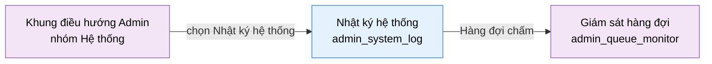

# Tài liệu thiết kế cơ bản (BD) — Nhật ký hệ thống (`ADM0403`)

## Phương châm tài liệu [Nội bộ — không cần khách duyệt]

- Viết theo **mẫu 9 sheet**. Bộ thẻ đóng, quy ước ID, ký hiệu chuẩn, ranh giới với tài liệu khác và
  checklist kiểm toán nằm ở `02-bd/_rules/bd-template-9sheet.md` — file này không chép lại.
- Phần gắn nhãn `[Nội bộ]` phục vụ sinh mã và tự kiểm toán, không phải yêu cầu của khách hàng: mục 4.5, mục
  7.3 và các ghi chú quy ước.
- Mã màn `ADM0403` theo bảng mã ở `02-bd/_rules/bd-template-9sheet.md` mục 8; tên file mang tiền tố mã.
- Màn này **không có popup nào** và không có màn con. Chỉ có một liên kết đi ra sang `admin_queue_monitor`.

> Đọc cùng `01-rd/screens/admin/ADM0403_system_log.md` (hành vi ở mức yêu cầu, không lặp lại ở đây),
> `01-rd/req/identity.md` (F1-10 → F1-14), `02-bd/database/identity.md`, `02-bd/security/identity.md`
> và `02-bd/screens/admin/_shell.md` (khung điều hướng dùng chung, không mô tả lại).

> **Ranh giới cứng của màn.** Màn này chỉ đọc **một luồng dữ liệu**: hành động quản trị của con người
> (đổi ma trận quyền, đổi vai trò, khoá/mở khoá, reset mật khẩu, thao tác nội dung kho bài và kho câu hỏi).
> **Không** gộp sự kiện hạ tầng (lỗi judge engine, worker mất kết nối, timeout sweep) — các sự kiện đó
> thuộc `judge-orchestration` (F4-10) và có màn riêng `admin_queue_monitor`
> [Nguồn: 01-rd/req/identity.md:68-75; 02-bd/database/identity.md:103-106;
> 09-layoutBase/Admin - Nhật ký hệ thống.dc.html:152]. Nếu DD sau này định gộp hai nguồn vào chung một
> bảng, đó là thay đổi kiến trúc cần một quyết định mới, không phải lựa chọn của DD.

> **Không thiết kế** phân loại "Chấm lại", chỉ số "Phiên chấm lại đã chạy" và dòng log mẫu `#RJ-0139` có
> trong prototype — đã cắt khỏi phạm vi theo `DEC-2026-0828-remove-rejudge-scope`
> [Nguồn: 01-rd/screens/admin/ADM0403_system_log.md:29-31]. Còn lại **4 phân loại**: Xác thực, Ma trận quyền,
> Cấu hình, Nội dung; và **3 thẻ chỉ số** thay vì 4.

---

## Sheet 1. Bìa

| Mục | Giá trị |
| :--- | :--- |
| Hệ thống | AlgoPrep |
| Phân hệ | `identity` (F1) |
| Công đoạn | BD — Thiết kế cơ bản |
| Phân loại | Màn hình |
| Tên màn | Nhật ký hệ thống |
| Mã màn hình | `ADM0403` |
| Tên vật lý (slug) | `admin_system_log` |
| Trục tài liệu | Màn hình (`02-bd/screens/`) |
| Actor | A3 (`ADMIN`) |
| Phiên bản | V0.2 |
| Người tạo | Nhóm phát triển AlgoPrep |
| Ngày tạo | 2026/09/15 |
| Người cập nhật | Nhóm phát triển AlgoPrep |
| Ngày cập nhật | 2026/09/20 |

---

## Sheet 2. Lịch sử sửa đổi

| Ver | Sheet bị sửa | Nội dung sửa | Ngày | Người sửa |
| :--- | :--- | :--- | :--- | :--- |
| V0.1 | Toàn bộ | Tạo mới theo cấu trúc 9 mục văn xuôi (phạm vi và ranh giới, layout regions, component inventory, screen states, APIs consumed, ghi chú cho DD/database, navigation, access rights, câu hỏi mở) | 2026/09/15 | Nhóm phát triển AlgoPrep |
| V0.2 | Toàn bộ | Chuyển sang mẫu 9 sheet. Chốt nguồn dữ liệu của mọi trường hiển thị về đúng 2 bảng `identity.system_audit_logs` và `identity.users` (không thêm cột `category`, `message`, `service` — đều suy ra từ `action_type`), bổ sung Sheet 8 danh sách sự kiện và Sheet 9 đặc tả kiểm tra, đề xuất thêm bộ lọc khoảng thời gian cho danh sách 12.408 dòng, giữ nguyên 3 câu hỏi mở cũ và phát sinh thêm câu hỏi về cách dựng câu nội dung log, tên dịch vụ và mã sự kiện hiển thị | 2026/09/20 | Nhóm phát triển AlgoPrep |

---

## Sheet 3. Sơ đồ chuyển màn

> [Nội bộ] Quy ước vẽ: bố trí từ trái sang phải. Màn gọi tới tô tím, màn hiện tại tô xanh nhạt. Màn này
> không có popup nên không dùng màu vàng. Màu và `[Nguồn:]` dùng để truy vết, không phải yêu cầu của khách.

### 3.1 Danh sách chuyển màn

#### Khung điều hướng Admin → Nhật ký hệ thống

[Điều kiện mở] Chọn mục con "Nhật ký hệ thống" trong nhóm "Hệ thống" ở thanh điều hướng bên trái.

[Chế độ mở] Chế độ chỉ xem. Màn này không có thao tác ghi dữ liệu nào.

[Thông tin truyền] Không có.

[Giá trị trả về] Không có.

[Khi thành công] Tải 4 khối dữ liệu độc lập: 3 thẻ chỉ số, danh sách sự kiện trang đầu, danh sách quản trị
viên hoạt động, biểu đồ phân loại 7 ngày. Bộ lọc ở trạng thái mặc định (tab "Tất cả", ô tìm rỗng).

[Khi huỷ] Không có.

#### Nhật ký hệ thống → Giám sát hàng đợi

[Điều kiện mở] Bấm liên kết "Hàng đợi chấm" trong dòng chú thích dưới biểu đồ phân loại.

[Chế độ mở] Không có.

[Thông tin truyền] Không có.

[Giá trị trả về] Không có.

[Khi thành công] Điều hướng sang màn `admin_queue_monitor` để xem sự kiện hạ tầng. Màn này không có thay
đổi chưa lưu nên rời màn không cần xác nhận.

[Khi huỷ] Không có.

### 3.2 Sơ đồ

[Nguồn: 09-layoutBase/Admin - Nhật ký hệ thống.dc.html:312-316,245; 02-bd/screens/admin/_shell.md:39]

---

## Sheet 4. Bố cục màn hình

### 4.1 Tổng quan màn

[Mục đích màn] Cho quản trị viên xem lại mọi hành động quản trị đã xảy ra trong hệ thống kèm ai đổi, đổi
gì, đổi lúc nào — không có ngoại lệ, kể cả chính thao tác đổi quyền
[Nguồn: 01-rd/req/identity.md:68-71 — F1-14].

[Luồng nghiệp vụ chính]

1. **Hiển thị ban đầu**: vào màn, hệ thống tải song song 4 khối dữ liệu. Mỗi khối có khung chờ riêng và
   trạng thái lỗi riêng — một khối hỏng không chặn ba khối còn lại.
2. **Lọc và tìm**: quản trị viên gõ từ khoá (dịch vụ, tài khoản, mã sự kiện) và/hoặc chọn một tab phân
   loại. Hai điều kiện áp dụng đồng thời theo phép AND. Bộ lọc **chỉ** ảnh hưởng khối danh sách, không
   ảnh hưởng 3 thẻ chỉ số và 2 khối phụ bên phải.
3. **Đọc danh sách**: mỗi dòng gồm giờ, nhãn phân loại, câu nội dung, và dòng phụ dịch vụ · người thực
   hiện · mã sự kiện. Dòng log là điểm cuối thông tin — **không** bấm được sang màn khác.
4. **Tải thêm**: bấm "Tải thêm 50 dòng" ở cuối danh sách để nối thêm trang kế tiếp. Đây là phân trang nối
   tiếp theo mốc thời gian, không phải phân trang số trang.
5. **Theo dõi trực tiếp**: bật toggle thì dòng log mới được chèn ngay ở đầu danh sách khi có sự kiện mới;
   tắt thì danh sách đứng yên.
6. **Xuất nhật ký**: bấm "Tải nhật ký" để tải về tệp nhật ký theo đúng bộ lọc đang áp dụng.

[Người dùng] Quản trị viên đã đăng nhập, vai trò `ADMIN`. Quyền đọc log **không** đi qua ma trận phân
quyền F1-10 — xem Câu hỏi mở Q1 và Sheet 9 NO 1.

[Tệp liên quan] Xuất một tệp nhật ký khi bấm "Tải nhật ký". Định dạng chưa chốt, xem Câu hỏi mở Q4. Màn
này không nhập tệp.

[Phạm vi]
- Chỉ đọc. Không có thao tác tạo, sửa, xoá bản ghi log trên màn này.
- Không hiển thị sự kiện hạ tầng — ranh giới cứng ghi ở đầu file.
- Không có phân loại "Chấm lại" (đã cắt phạm vi 2026-08-28).
- Không thiết kế màn cấu hình thời hạn lưu log; thời hạn chỉ hiển thị dưới dạng nhãn ở chân trang.
- Không cho bấm từ một dòng log sang đối tượng bị tác động (tài khoản, bài toán) — prototype không có
  liên kết đó và RD cũng không yêu cầu.

[Quyền sử dụng]
- Xem: được, với vai trò `ADMIN`.
- Thêm: không. Dòng log sinh ra như tác dụng phụ của các API quản trị khác, không phải do màn này tạo.
- Sửa: không.
- Xoá: không. Log cũ hơn thời hạn lưu do job dọn định kỳ xử lý, không xoá thủ công qua giao diện.

[Số bản ghi tối đa] Danh sách sự kiện: 50 dòng mỗi lần tải, nối tiếp không giới hạn cứng trong phạm vi
thời hạn lưu. Thẻ chỉ số: đúng 3. Quản trị viên hoạt động: prototype hiển thị 4 dòng, đề xuất giới hạn 5
dòng. Biểu đồ phân loại: đúng 4 cột.

[Nguồn: 01-rd/screens/admin/ADM0403_system_log.md:22-38; 01-rd/req/identity.md:68-75; 09-layoutBase/Admin - Nhật ký hệ thống.dc.html:211,451]

### 4.2 DTO liên quan

- `AuditLogEntryDto`
- `AuditLogStatsDto`
- `ActiveAdminDto`
- `AuditCategoryBreakdownDto`

`[Suy luận]` — tên DTO do BD này đề xuất, `03-dd/api/identity.md` chốt lại.

### 4.3 Bảng dữ liệu liên quan (2)

| NO | Bảng | Ghi chú |
| --: | :--- | :--- |
| 1 | `identity.system_audit_logs` | [Nguồn: 02-bd/database/identity.md:103-106] |
| 2 | `identity.users` | Tra tên hiển thị và vai trò của người thực hiện qua `actor_user_id` [Nguồn: 02-bd/database/identity.md:104] |

Màn này **không thêm cột nào** vào `system_audit_logs`. Ba trường prototype hiển thị mà bảng không có —
phân loại, câu nội dung, tên dịch vụ — đều **suy ra từ `action_type`** ở tầng ứng dụng, xem Sheet 5 khu
vực D và Câu hỏi mở Q5. Thời hạn lưu log là tham số của job dọn định kỳ, không phải một bảng.

### 4.4 Vùng bố cục

Đối chiếu `09-layoutBase/Admin - Nhật ký hệ thống.dc.html` — bằng chứng bố cục chỉ-đọc, **không phải**
design system cuối cùng.

| Vùng | Vị trí trong prototype | Nội dung |
| :--- | :--- | :--- |
| Thanh điều hướng bên trái (khung chung Admin) | `:296-320` | Nhóm "Hệ thống" đang mở, mục con "Nhật ký hệ thống" đang chọn — dùng lại khung chung của mọi màn Admin |
| Thanh tiêu đề dính trên | `:149-163` | Tiêu đề, phụ đề ghi rõ ranh giới phạm vi, toggle "Theo dõi trực tiếp", nút "Tải nhật ký" |
| Dải chỉ số tổng | `:165-176` | Lưới thẻ chỉ số tự co giãn; prototype có 4 thẻ, BD giữ 3 sau khi bỏ "Chấm lại" |
| Cột trái — Bộ lọc danh sách | `:181-192` | Ô tìm kiếm, dải tab phân loại, nhãn đếm kết quả |
| Cột trái — Danh sách sự kiện | `:194-207` | Mỗi dòng 3 cột: giờ, nhãn phân loại, nội dung kèm dòng phụ dịch vụ · người thực hiện · mã sự kiện |
| Cột trái — Chân danh sách | `:209-212` | Nhãn phạm vi hiển thị và nút "Tải thêm 50 dòng" |
| Cột phải — "Quản trị viên hoạt động" | `:216-231` | Danh sách người thực hiện gần nhất kèm vai trò, số hành động, thời điểm |
| Cột phải — "Phân loại hành động · 7 ngày" | `:233-247` | 4 cột ngang theo phân loại, kèm dòng chú thích trỏ sang `admin_queue_monitor` |
| Chân trang (khung chung Admin) | `:250-263` | Phiên bản, nhãn thời hạn lưu nhật ký, liên kết phụ |

Bố cục hai cột `minmax(0, 1fr) minmax(290px, 0.42fr)` (`:178`): cột trái là danh sách chính, cột phải là
hai khối tổng hợp ngắn. Giữ nguyên cấu trúc này khi dựng Next.js; không quy định màu sắc, khoảng cách hay
typography ở BD.

### 4.5 Cấu trúc slice FSD [Nội bộ]

| Khối | Slice dự kiến | Căn cứ |
| :--- | :--- | :--- |
| Trang | `views/admin-system-log` | Quy ước FSD của dự án |
| Khung Admin | Dùng lại `widgets/app-shell` | `02-bd/screens/admin/_shell.md:24-28` |
| Thẻ chỉ số | Dùng lại primitive thẻ chỉ số đã có ở `admin_overview` | Prototype `:165-176` |
| Bộ lọc | `features/audit-log-filter` | Prototype `:181-192` |
| Danh sách | `widgets/audit-log-list` + `entities/audit-log` | Prototype `:194-212` |
| Khối phụ | `widgets/active-admins-panel`, `widgets/audit-category-breakdown` | Prototype `:216-247` |
| Kênh thời gian thực | `features/audit-log-live` | Prototype `:154-156` |

`[Suy luận]` — ánh xạ slice do BD đề xuất, DD màn hình chốt lại.

> [Nội bộ] Ảnh minh hoạ đặt ở `08-diagram/02-bd/screens/admin/`, chụp bằng Playwright trên ứng dụng Next.js
> thật khi đã có mã chạy được. Chưa có thì tham chiếu prototype, không vẽ tay.

---

## Sheet 5. Danh sách item màn hình

> Quy ước ID, bộ thẻ và giá trị chuẩn: `02-bd/_rules/bd-template-9sheet.md` mục 2, 3, 4.

### Khu vực A — Thanh tiêu đề

| Khu vực | NO | Tên item | ID item | Bảng DB | Cột DB | Loại UI | Kiểu | Độ dài | Bắt buộc | I/O | Giá trị mặc định | Định dạng | Ghi chú |
| :--- | --: | :--- | :--- | :--- | :--- | :--- | :--- | :--- | :-: | :-: | :--- | :--- | :--- |
| Thanh tiêu đề | | | | | | | | | | | | | |
| | 1 | Tiêu đề màn | `adminSystemLog.header.title` | - | - | Label | String | - | - | O | Nhật ký hệ thống | - | Tên màn hiển thị cố định [Nguồn giá trị] Nhãn tĩnh i18n [EVT liên quan] - |
| | 2 | Phụ đề ranh giới phạm vi | `adminSystemLog.header.subtitle` | - | - | Label | String | - | - | O | Hành động quản trị của con người · sự kiện hạ tầng xem ở Hàng đợi chấm | - | Câu này là ranh giới phạm vi F1-14, giữ nguyên từng chữ, không rút gọn khi dựng UI [Nguồn giá trị] Nhãn tĩnh i18n [EVT liên quan] - |
| | 3 | Theo dõi trực tiếp | `adminSystemLog.header.toggleLive` | - | - | Toggle | Boolean | - | - | I/O | Bật | `Theo dõi trực tiếp` / `Đã tạm dừng` | Bật hoặc tắt việc nhận dòng log mới theo thời gian thực. Chỉ là trạng thái phía client, không đổi hành vi máy chủ [Nguồn giá trị] Trạng thái phía client, không lưu xuống máy chủ [EVT liên quan] EVT-6 |
| | 4 | Tải nhật ký | `adminSystemLog.header.btnExport` | - | - | Button | - | - | - | I | - | - | Xuất nhật ký ra tệp theo đúng bộ lọc đang áp dụng [Nguồn giá trị] - [EVT liên quan] EVT-9 |

### Khu vực B — Dải chỉ số tổng

| Khu vực | NO | Tên item | ID item | Bảng DB | Cột DB | Loại UI | Kiểu | Độ dài | Bắt buộc | I/O | Giá trị mặc định | Định dạng | Ghi chú |
| :--- | --: | :--- | :--- | :--- | :--- | :--- | :--- | :--- | :-: | :-: | :--- | :--- | :--- |
| Dải chỉ số tổng | | | | | | | | | | | | | |
| | 1 | Hành động quản trị 24 giờ | `adminSystemLog.stat.actions24h` | `identity.system_audit_logs` | `created_at` | Label | Number | 6 | - | O | 0 | Số nguyên | Tổng số dòng log sinh ra trong 24 giờ gần nhất [Công thức] Đếm dòng có `created_at` trong 24 giờ gần nhất [EVT liên quan] EVT-1 |
| | 2 | Biến động 24 giờ | `adminSystemLog.stat.actions24hDelta` | `identity.system_audit_logs` | `created_at` | Label | String | 6 | - | O | 0 | `+{số}` hoặc `-{số}` | So sánh với 24 giờ liền trước [Công thức] Số dòng 24 giờ gần nhất trừ số dòng của 24 giờ liền trước đó [EVT liên quan] EVT-1 |
| | 3 | Số tài khoản quản trị hoạt động | `adminSystemLog.stat.activeActorCount` | `identity.system_audit_logs` | `actor_user_id` | Label | String | - | - | O | - | `{số} tài khoản quản trị hoạt động` | Dòng phụ của thẻ chỉ số thứ nhất [Công thức] Đếm số `actor_user_id` khác nhau trong 24 giờ gần nhất [EVT liên quan] EVT-1 |
| | 4 | Đổi ma trận phân quyền | `adminSystemLog.stat.permissionChanges` | `identity.system_audit_logs` | `action_type`, `created_at` | Label | Number | 6 | - | O | 0 | Số nguyên | Số lần đổi ô ma trận quyền trong 24 giờ gần nhất [Công thức] Đếm dòng có `action_type` thuộc nhóm phân loại "Ma trận quyền" và `created_at` trong 24 giờ gần nhất [EVT liên quan] EVT-1 |
| | 5 | Khoá / mở khoá tài khoản | `adminSystemLog.stat.accountLockChanges` | `identity.system_audit_logs` | `action_type`, `created_at` | Label | Number | 6 | - | O | 0 | Số nguyên | Số lần khoá hoặc mở khoá tài khoản trong 24 giờ gần nhất [Công thức] Đếm dòng có `action_type` là khoá hoặc mở khoá tài khoản (F1-13) và `created_at` trong 24 giờ gần nhất [EVT liên quan] EVT-1 |
| | 6 | Chú thích thẻ chỉ số | `adminSystemLog.stat.caption` | - | - | Label | String | - | - | O | - | - | Dòng giải thích dưới mỗi thẻ, ví dụ "Chỉ ADMIN thực hiện được", "Do trùng mã nguồn hoặc báo cáo" [Nguồn giá trị] Nhãn tĩnh i18n map từ mã chỉ số [EVT liên quan] - |

### Khu vực C — Bộ lọc danh sách

| Khu vực | NO | Tên item | ID item | Bảng DB | Cột DB | Loại UI | Kiểu | Độ dài | Bắt buộc | I/O | Giá trị mặc định | Định dạng | Ghi chú |
| :--- | --: | :--- | :--- | :--- | :--- | :--- | :--- | :--- | :-: | :-: | :--- | :--- | :--- |
| Bộ lọc danh sách | | | | | | | | | | | | | |
| | 1 | Ô tìm kiếm | `adminSystemLog.filter.query` | - | - | TextBox | String | 100 | - | I | rỗng | - | Tìm theo **dịch vụ, tài khoản hoặc mã sự kiện**. **Không** tìm trong câu nội dung log, để tránh quét toàn bảng trên tập log lớn [Nguồn giá trị] Người dùng nhập; đối sánh với tên dịch vụ suy ra từ `action_type`, với `users.username` của người thực hiện, và với mã sự kiện [EVT liên quan] EVT-2 |
| | 2 | Tab phân loại | `adminSystemLog.filter.tabCategory` | `identity.system_audit_logs` | `action_type` | Button | Enum | - | - | I | Tất cả | Nhãn tiếng Việt | Dải 5 tab: Tất cả, Xác thực, Ma trận quyền, Cấu hình, Nội dung. Tab "Chấm lại" của prototype đã bị bỏ [Công thức] Mỗi tab lọc theo nhóm phân loại suy ra từ `action_type`; tab "Tất cả" không lọc [EVT liên quan] EVT-3 |
| | 3 | Từ ngày | `adminSystemLog.filter.dateFrom` | `identity.system_audit_logs` | `created_at` | TextBox | Date | 10 | - | I | rỗng | `DD/MM/YYYY` | **Đề xuất của BD, prototype không có.** Lý do: chân danh sách ghi "12.408 sự kiện" nhưng chỉ có nút tải thêm theo thời gian giảm dần, nên không cách nào tới được log của một ngày cũ mà không bấm hàng trăm lần. Dùng control ngày gốc của trình duyệt, không thêm thư viện. Cần chủ dự án xác nhận, xem Câu hỏi mở Q6 [Nguồn giá trị] Người dùng nhập; đối chiếu `created_at` [EVT liên quan] EVT-4 |
| | 4 | Đến ngày | `adminSystemLog.filter.dateTo` | `identity.system_audit_logs` | `created_at` | TextBox | Date | 10 | - | I | rỗng | `DD/MM/YYYY` | **Đề xuất của BD, prototype không có** — cùng lý do với NO 3, xem Câu hỏi mở Q6 [Nguồn giá trị] Người dùng nhập; đối chiếu `created_at` [EVT liên quan] EVT-4 |
| | 5 | Đếm kết quả | `adminSystemLog.filter.resultCount` | - | - | Label | String | - | - | O | - | `{số} / {số} dòng` | Số dòng khớp bộ lọc trên tổng số dòng đã tải [Công thức] Số dòng sau lọc và tổng số dòng trong phạm vi truy vấn, do máy chủ trả về [EVT liên quan] EVT-2, EVT-3, EVT-4 |
| | 6 | Xoá bộ lọc | `adminSystemLog.filter.btnClear` | - | - | Button | - | - | - | I | - | - | Đưa mọi tiêu chí lọc về mặc định. Chỉ xuất hiện trong trạng thái danh sách rỗng [Nguồn giá trị] - [EVT liên quan] EVT-5 |

### Khu vực D — Danh sách sự kiện

| Khu vực | NO | Tên item | ID item | Bảng DB | Cột DB | Loại UI | Kiểu | Độ dài | Bắt buộc | I/O | Giá trị mặc định | Định dạng | Ghi chú |
| :--- | --: | :--- | :--- | :--- | :--- | :--- | :--- | :--- | :-: | :-: | :--- | :--- | :--- |
| Danh sách sự kiện | | | | | | | | | | | | | |
| | 1 | Danh sách sự kiện | `adminSystemLog.list` | `identity.system_audit_logs` | - | List | List | - | - | O | rỗng | - | Mỗi dòng là một hành động quản trị, sắp xếp theo `created_at` giảm dần [Nguồn giá trị] Kết quả gọi `SearchSystemAuditLogs` [EVT liên quan] EVT-1, EVT-7, EVT-8 |
| | 2 | Giờ | `adminSystemLog.list.col.time` | `identity.system_audit_logs` | `created_at` | ListColumn | Date | 8 | - | O | - | `HH:mm:ss` | Thời điểm xảy ra hành động [Nguồn giá trị] Cột `created_at` [EVT liên quan] - |
| | 3 | Phân loại | `adminSystemLog.list.col.category` | `identity.system_audit_logs` | `action_type` | Badge | Enum | - | - | O | - | Nhãn tiếng Việt | Nhóm phân loại của hành động. Danh sách đóng 4 giá trị: Xác thực, Ma trận quyền, Cấu hình, Nội dung. Thêm phân loại mới phải sửa cả BD lẫn mã sinh log [Công thức] Ánh xạ `action_type` sang một trong 4 nhóm tại tầng ứng dụng `identity`; **không thêm cột `category`** [EVT liên quan] - |
| | 4 | Nội dung | `adminSystemLog.list.col.message` | `identity.system_audit_logs` | `action_type`, `target_type`, `target_id`, `before_json`, `after_json` | ListColumn | String | - | - | O | - | - | Câu mô tả hành động, ví dụ "Cấp quyền UPDATE trên TESTCASE_MANAGEMENT cho vai trò Trợ giảng" [Công thức] Dựng từ mẫu câu i18n chọn theo `action_type`, tham số lấy từ `target_type`, `target_id` và phần chênh lệch giữa `before_json` và `after_json`. Nơi dựng câu (máy chủ hay giao diện) chưa chốt, xem Q5 [EVT liên quan] - |
| | 5 | Dịch vụ | `adminSystemLog.list.col.service` | `identity.system_audit_logs` | `action_type` | ListColumn | String | 20 | - | O | - | chữ thường, ví dụ `auth`, `config`, `ai-config`, `content`, `permission` | Tên module sinh ra hành động, mịn hơn phân loại (prototype có cả `config` lẫn `ai-config` trong cùng phân loại "Cấu hình") [Công thức] Ánh xạ `action_type` sang tên module; **không thêm cột `service`**. Bảng ánh xạ đầy đủ thuộc DD, xem Q5 [EVT liên quan] - |
| | 6 | Người thực hiện | `adminSystemLog.list.col.actor` | `identity.users` | `username` | ListColumn | String | 50 | - | O | - | - | Tài khoản đã thực hiện hành động. Có thể là A3 hoặc A2 — F1-14 ghi "mọi thao tác quản trị", không giới hạn actor [Nguồn giá trị] `users.username` tra theo `system_audit_logs.actor_user_id` [EVT liên quan] - |
| | 7 | Mã sự kiện | `adminSystemLog.list.col.eventId` | `identity.system_audit_logs` | `id` | ListColumn | String | 20 | - | O | - | `evt_{6 ký tự}` | Mã tra cứu một dòng log, dùng để dán vào ô tìm kiếm [Công thức] Tiền tố `evt_` ghép 6 ký tự đầu của `id`. Độ dài rút gọn có rủi ro trùng, cách rút gọn chính thức thuộc DD, xem Q5 [EVT liên quan] - |
| | 8 | Nhãn phạm vi hiển thị | `adminSystemLog.list.pageLabel` | - | - | Label | String | - | - | O | - | `Hiển thị {số} dòng gần nhất trong {số} sự kiện` | Cho biết đang xem bao nhiêu dòng trên tổng số [Công thức] Số dòng đã tải và tổng số dòng khớp bộ lọc, do máy chủ trả về [EVT liên quan] EVT-8 |
| | 9 | Tải thêm 50 dòng | `adminSystemLog.list.btnLoadMore` | - | - | Button | - | - | - | I | - | - | Nối thêm 50 dòng kế tiếp vào cuối danh sách. Phân trang nối tiếp theo mốc thời gian, không phải phân trang số trang [Nguồn giá trị] - [EVT liên quan] EVT-8 |

**Dữ liệu nhạy cảm.** Câu nội dung log **không được chứa** giá trị bí mật: mật khẩu, mã OTP, chuỗi token,
khoá API. Với hành động reset mật khẩu, `before_json` và `after_json` chỉ ghi sự kiện đã xảy ra, không ghi
giá trị mật khẩu ở bất kỳ dạng nào. Với hành động đổi cấu hình có chứa khoá API, giá trị hiển thị phải
**che còn 4 ký tự cuối**. Kiểm tương ứng ở Sheet 9 NO 2.

### Khu vực E — Quản trị viên hoạt động

| Khu vực | NO | Tên item | ID item | Bảng DB | Cột DB | Loại UI | Kiểu | Độ dài | Bắt buộc | I/O | Giá trị mặc định | Định dạng | Ghi chú |
| :--- | --: | :--- | :--- | :--- | :--- | :--- | :--- | :--- | :-: | :-: | :--- | :--- | :--- |
| Quản trị viên hoạt động | | | | | | | | | | | | | |
| | 1 | Danh sách người thực hiện | `adminSystemLog.activeAdmin.list` | `identity.system_audit_logs` | `actor_user_id` | List | List | - | - | O | rỗng | - | Người thực hiện có hành động gần nhất, sắp xếp theo thời điểm hành động giảm dần. **Không** chịu ảnh hưởng của bộ lọc danh sách [Nguồn giá trị] Kết quả gọi `ListActiveAdmins` [EVT liên quan] EVT-1 |
| | 2 | Chữ viết tắt | `adminSystemLog.activeAdmin.col.initials` | `identity.users` | `full_name` | ListColumn | String | 4 | - | O | - | Chữ cái đầu | Ký hiệu thay ảnh đại diện [Công thức] Lấy chữ cái đầu của hai từ cuối trong `users.full_name` [EVT liên quan] - |
| | 3 | Họ tên | `adminSystemLog.activeAdmin.col.name` | `identity.users` | `full_name` | ListColumn | String | 100 | - | O | - | - | Tên hiển thị của người thực hiện [Nguồn giá trị] Cột `users.full_name` [EVT liên quan] - |
| | 4 | Vai trò và số hành động | `adminSystemLog.activeAdmin.col.meta` | `identity.users` | `role_id` | ListColumn | String | - | - | O | - | `{vai trò} · {số} hành động` | Vai trò kèm số hành động trong cửa sổ đếm [Công thức] Nhãn vai trò tra từ `users.role_id`, ghép với số dòng log của người đó trong cửa sổ 24 giờ. Cửa sổ đếm còn mở, xem Q3 [EVT liên quan] - |
| | 5 | Thời điểm gần nhất | `adminSystemLog.activeAdmin.col.lastActionAt` | `identity.system_audit_logs` | `created_at` | ListColumn | String | 20 | - | O | - | `{số} phút trước` / `{số} giờ trước` | Khoảng cách từ hành động gần nhất tới hiện tại [Công thức] Thời điểm hiện tại trừ `MAX(created_at)` của người đó, hiển thị dạng tương đối [EVT liên quan] - |

### Khu vực F — Phân loại hành động 7 ngày

| Khu vực | NO | Tên item | ID item | Bảng DB | Cột DB | Loại UI | Kiểu | Độ dài | Bắt buộc | I/O | Giá trị mặc định | Định dạng | Ghi chú |
| :--- | --: | :--- | :--- | :--- | :--- | :--- | :--- | :--- | :-: | :-: | :--- | :--- | :--- |
| Phân loại hành động 7 ngày | | | | | | | | | | | | | |
| | 1 | Danh sách phân loại | `adminSystemLog.breakdown.list` | `identity.system_audit_logs` | `action_type`, `created_at` | List | List | - | - | O | 4 dòng | - | Đúng 4 phân loại, cố định thứ tự, kể cả khi một phân loại có 0 hành động. **Không** chịu ảnh hưởng của bộ lọc danh sách [Nguồn giá trị] Kết quả gọi `GetAuditCategoryBreakdown` trong 7 ngày gần nhất [EVT liên quan] EVT-1 |
| | 2 | Tên phân loại | `adminSystemLog.breakdown.col.name` | - | - | ListColumn | String | - | - | O | - | Nhãn tiếng Việt | Tên phân loại hiển thị [Nguồn giá trị] Nhãn tĩnh i18n map từ mã phân loại, dùng chung với tab lọc [EVT liên quan] - |
| | 3 | Số lượng | `adminSystemLog.breakdown.col.count` | `identity.system_audit_logs` | `action_type` | ListColumn | Number | 6 | - | O | 0 | Số nguyên | Số hành động của phân loại đó trong 7 ngày [Công thức] Đếm dòng theo nhóm phân loại với `created_at` trong 7 ngày gần nhất [EVT liên quan] - |
| | 4 | Thanh tỉ lệ | `adminSystemLog.breakdown.col.bar` | - | - | ProgressBar | Number | - | - | O | - | - | Biểu diễn trực quan số lượng [Công thức] Chiều rộng bằng số lượng của dòng chia cho số lượng lớn nhất trong 4 dòng [EVT liên quan] - |
| | 5 | Chú thích sự kiện hạ tầng | `adminSystemLog.breakdown.linkQueueMonitor` | - | - | Link | - | - | - | I | - | Sự kiện hạ tầng (worker, AI, sao lưu) xem ở Hàng đợi chấm | - | Liên kết sang `admin_queue_monitor`. Giữ nguyên vì đúng ranh giới Bounded Context [Nguồn giá trị] Nhãn tĩnh i18n [EVT liên quan] EVT-10 |

### Khu vực G — Chân trang

| Khu vực | NO | Tên item | ID item | Bảng DB | Cột DB | Loại UI | Kiểu | Độ dài | Bắt buộc | I/O | Giá trị mặc định | Định dạng | Ghi chú |
| :--- | --: | :--- | :--- | :--- | :--- | :--- | :--- | :--- | :-: | :-: | :--- | :--- | :--- |
| Chân trang | | | | | | | | | | | | | |
| | 1 | Thời hạn lưu nhật ký | `adminSystemLog.footer.retentionLabel` | - | - | Label | String | - | - | O | Nhật ký giữ 90 ngày | `Nhật ký giữ {số} ngày` | Chỉ hiển thị, không sửa được trên màn. Số ngày tạm nhận 90 theo prototype, xem Câu hỏi mở Q2 [Nguồn giá trị] Tham số cấu hình `application.yml` phía backend, không thêm cột DB [EVT liên quan] - |

[Nguồn: 09-layoutBase/Admin - Nhật ký hệ thống.dc.html:151-162,165-176,181-192,194-212,216-231,233-247,256,395-399,402-412,424,431-436,438-441,450-453; 02-bd/database/identity.md:103-106; 01-rd/req/identity.md:68-75]

---

## Sheet 6. Đặc tả điều khiển item

> Ký hiệu cột `Hiển thị` và thứ tự thẻ: `02-bd/_rules/bd-template-9sheet.md` mục 2, 3. Dùng đúng NO, tên
> item và thứ tự của Sheet 5. Lỗi nhập liệu ghi ở Sheet 9, xử lý nghiệp vụ ghi ở Sheet 8.

### Khu vực A — Thanh tiêu đề

| Khu vực | NO | Tên item | Hiển thị | Ghi chú |
| :--- | --: | :--- | :-: | :--- |
| Thanh tiêu đề | | | | |
| | 1 | Tiêu đề màn | Có | - |
| | 2 | Phụ đề ranh giới phạm vi | Có | - |
| | 3 | Theo dõi trực tiếp | Có | [Điều kiện kích hoạt] Kích hoạt ngay cả trong lúc đang tải danh sách. [Tự động đặt] Mặc định bật khi vào màn. Mất kết nối kênh thời gian thực thì tự chuyển nhãn sang "Đã tạm dừng" và thử kết nối lại, không xoá dữ liệu đang hiển thị. |
| | 4 | Tải nhật ký | Có | [Điều kiện kích hoạt] Không kích hoạt trong lúc đang tải danh sách lần đầu và trong lúc một lần xuất trước đó chưa xong; kích hoạt trong các trường hợp còn lại, kể cả khi danh sách rỗng. |

### Khu vực B — Dải chỉ số tổng

| Khu vực | NO | Tên item | Hiển thị | Ghi chú |
| :--- | --: | :--- | :-: | :--- |
| Dải chỉ số tổng | | | | |
| | 1 | Hành động quản trị 24 giờ | Có | [Điều kiện hiển thị] Trong lúc tải hiển thị khung chờ đúng 3 thẻ. |
| | 2 | Biến động 24 giờ | Có | [Tự động đặt] Không có biến động thì hiển thị `0`, không ẩn dòng. |
| | 3 | Số tài khoản quản trị hoạt động | Có | - |
| | 4 | Đổi ma trận phân quyền | Có | - |
| | 5 | Khoá / mở khoá tài khoản | Có | - |
| | 6 | Chú thích thẻ chỉ số | Có | - |

### Khu vực C — Bộ lọc danh sách

| Khu vực | NO | Tên item | Hiển thị | Ghi chú |
| :--- | --: | :--- | :-: | :--- |
| Bộ lọc danh sách | | | | |
| | 1 | Ô tìm kiếm | Có | [Điều kiện kích hoạt] Kích hoạt sau khi tải xong lần đầu. Gõ phím không gọi máy chủ ngay mà chờ người dùng ngừng gõ rồi mới gọi một lần. |
| | 2 | Tab phân loại | Có | [Điều kiện kích hoạt] Kích hoạt sau khi tải xong lần đầu. Tại mọi thời điểm đúng một tab đang chọn; bấm lại tab đang chọn không làm gì. |
| | 3 | Từ ngày | Có | [Điều kiện kích hoạt] Kích hoạt sau khi tải xong lần đầu. Không nhận ngày muộn hơn hôm nay, và không nhận ngày cũ hơn thời hạn lưu nhật ký. [Tự động đặt] Để rỗng nghĩa là không giới hạn cận dưới. |
| | 4 | Đến ngày | Có | [Điều kiện kích hoạt] Kích hoạt sau khi tải xong lần đầu. Không nhận ngày muộn hơn hôm nay. [Tự động đặt] Để rỗng nghĩa là không giới hạn cận trên. |
| | 5 | Đếm kết quả | Có | [Tự động đặt] Tính lại sau mỗi lần bộ lọc đổi và sau mỗi lần tải thêm. |
| | 6 | Xoá bộ lọc | Điều kiện | [Điều kiện hiển thị] Chỉ hiển thị khi danh sách rỗng **và** đang có ít nhất một tiêu chí lọc khác mặc định. Danh sách rỗng vì thật sự chưa có log nào thì không hiển thị nút này. |

### Khu vực D — Danh sách sự kiện

| Khu vực | NO | Tên item | Hiển thị | Ghi chú |
| :--- | --: | :--- | :-: | :--- |
| Danh sách sự kiện | | | | |
| | 1 | Danh sách sự kiện | Có | [Điều kiện hiển thị] Trong lúc tải hiển thị khung chờ đúng 10 dòng. Tải xong mà không có dòng nào thì hiển thị "Không có sự kiện nào khớp bộ lọc hiện tại" thay cho danh sách; 3 thẻ chỉ số và 2 khối phụ vẫn hiển thị bình thường. |
| | 2 | Giờ | Có | - |
| | 3 | Phân loại | Có | - |
| | 4 | Nội dung | Có | [Tự động đặt] Câu quá dài thì xuống dòng, không cắt cụt — nội dung log là bằng chứng audit, mất chữ là mất bằng chứng. |
| | 5 | Dịch vụ | Có | - |
| | 6 | Người thực hiện | Có | - |
| | 7 | Mã sự kiện | Có | - |
| | 8 | Nhãn phạm vi hiển thị | Có | - |
| | 9 | Tải thêm 50 dòng | Điều kiện | [Điều kiện hiển thị] Chỉ hiển thị khi còn dòng chưa tải; đã tới dòng cuối thì ẩn nút và giữ nhãn phạm vi hiển thị. [Điều kiện kích hoạt] Không kích hoạt trong lúc đang tải thêm. |

### Khu vực E — Quản trị viên hoạt động

| Khu vực | NO | Tên item | Hiển thị | Ghi chú |
| :--- | --: | :--- | :-: | :--- |
| Quản trị viên hoạt động | | | | |
| | 1 | Danh sách người thực hiện | Có | [Điều kiện hiển thị] Trong lúc tải hiển thị khung chờ đúng 5 dòng. Không có ai hoạt động trong cửa sổ đếm thì hiển thị "Chưa có hành động nào trong 24 giờ qua". |
| | 2 | Chữ viết tắt | Có | - |
| | 3 | Họ tên | Có | - |
| | 4 | Vai trò và số hành động | Có | - |
| | 5 | Thời điểm gần nhất | Có | [Tự động đặt] Nhãn tương đối tính lại theo đồng hồ phía client, không gọi lại máy chủ. |

### Khu vực F — Phân loại hành động 7 ngày

| Khu vực | NO | Tên item | Hiển thị | Ghi chú |
| :--- | --: | :--- | :-: | :--- |
| Phân loại hành động 7 ngày | | | | |
| | 1 | Danh sách phân loại | Có | [Điều kiện hiển thị] Trong lúc tải hiển thị khung chờ đúng 4 dòng. Luôn đủ 4 dòng kể cả khi số lượng bằng 0. |
| | 2 | Tên phân loại | Có | - |
| | 3 | Số lượng | Có | - |
| | 4 | Thanh tỉ lệ | Có | [Tự động đặt] Cả 4 dòng đều bằng 0 thì mọi thanh có chiều rộng 0, không chia cho 0. |
| | 5 | Chú thích sự kiện hạ tầng | Có | - |

### Khu vực G — Chân trang

| Khu vực | NO | Tên item | Hiển thị | Ghi chú |
| :--- | --: | :--- | :-: | :--- |
| Chân trang | | | | |
| | 1 | Thời hạn lưu nhật ký | Có | - |

---

## Sheet 7. Danh sách truyền dữ liệu

### 7.1 Trường DTO

| NO | DTO | Trường DTO | Kiểu | Bảng DB | Cột DB | Item màn | Hiển thị | Ghi chú |
| --: | :--- | :--- | :--- | :--- | :--- | :--- | :-: | :--- |
| 1 | `AuditLogEntryDto` | `id` | UUID | `identity.system_audit_logs` | `id` | Danh sách "Mã sự kiện" | Có | [Chuyển đổi] Hiển thị dạng `evt_` ghép 6 ký tự đầu; giá trị đầy đủ giữ trong DTO để tra cứu chính xác. |
| 2 | `AuditLogEntryDto` | `createdAt` | Date | `identity.system_audit_logs` | `created_at` | Danh sách "Giờ" | Có | [Chuyển đổi] Máy chủ trả mốc thời gian có múi giờ; giao diện hiển thị `HH:mm:ss` theo múi giờ người dùng. |
| 3 | `AuditLogEntryDto` | `actionType` | Enum | `identity.system_audit_logs` | `action_type` | Danh sách "Phân loại", "Dịch vụ", "Nội dung" | Có | [Chuyển đổi] Một giá trị nuôi ba cột hiển thị: nhóm phân loại, tên dịch vụ, và mẫu câu nội dung. Bảng ánh xạ thuộc DD, xem Q5. |
| 4 | `AuditLogEntryDto` | `message` | String | - | - | Danh sách "Nội dung" | Có | [Nguồn] Dựng từ `actionType` + `targetType` + `targetId` + chênh lệch `before_json`/`after_json` [Chuyển đổi] **Không** chứa mật khẩu, OTP, token hay khoá API ở bất kỳ dạng nào — xem Sheet 9 NO 2. |
| 5 | `AuditLogEntryDto` | `targetType`, `targetId` | String | `identity.system_audit_logs` | `target_type`, `target_id` | - | Không | [Đích] Tham số dựng câu nội dung. Không hiển thị thành cột riêng vì prototype không có cột nào cho chúng. |
| 6 | `AuditLogEntryDto` | `actorUsername` | String | `identity.users` | `username` | Danh sách "Người thực hiện" | Có | [Nguồn] Tra theo `system_audit_logs.actor_user_id`. |
| 7 | `AuditLogStatsDto` | `actions24h`, `actions24hDelta`, `activeActorCount` | Number | `identity.system_audit_logs` | `created_at`, `actor_user_id` | Thẻ chỉ số NO 1, 2, 3 | Có | [Nguồn] Truy vấn tổng hợp trên cửa sổ 24 giờ, độc lập với bộ lọc danh sách. |
| 8 | `AuditLogStatsDto` | `permissionChanges`, `accountLockChanges` | Number | `identity.system_audit_logs` | `action_type`, `created_at` | Thẻ chỉ số NO 4, 5 | Có | [Nguồn] Đếm theo nhóm `action_type` trên cửa sổ 24 giờ. |
| 9 | `ActiveAdminDto` | `fullName`, `roleCode` | String | `identity.users` | `full_name`, `role_id` | Quản trị viên hoạt động NO 2, 3, 4 | Có | [Chuyển đổi] `roleCode` đổi sang nhãn tiếng Việt khi hiển thị; `fullName` còn dùng để sinh chữ viết tắt. |
| 10 | `ActiveAdminDto` | `actionCount`, `lastActionAt` | Number, Date | `identity.system_audit_logs` | `actor_user_id`, `created_at` | Quản trị viên hoạt động NO 4, 5 | Có | [Chuyển đổi] `lastActionAt` hiển thị dạng tương đối, tính ở phía giao diện. |
| 11 | `AuditCategoryBreakdownDto` | `categoryCode`, `count` | String, Number | `identity.system_audit_logs` | `action_type`, `created_at` | Phân loại 7 ngày NO 2, 3, 4 | Có | [Chuyển đổi] `categoryCode` là khoá tra nhãn tĩnh i18n, dùng chung với tab lọc. |
| 12 | — | `query`, `categoryCode`, `dateFrom`, `dateTo`, `cursor` | String, String, Date, Date, String | `identity.system_audit_logs` | `created_at`, `action_type` | Bộ lọc NO 1, 2, 3, 4 và nút "Tải thêm 50 dòng" | Không | [Nguồn] Giá trị người dùng đặt trên màn [Đích] Tham số của `SearchSystemAuditLogs` và `ExportSystemAuditLogs` [Chuyển đổi] `cursor` là mốc phân trang nối tiếp theo `created_at`, không phải số trang. |

### 7.2 Truy cập bảng dữ liệu (2)

| NO | Tên logic | Bảng | Repository | CRUD | Mục đích | Ghi chú |
| --: | :--- | :--- | :--- | :-: | :--- | :--- |
| 1 | Nhật ký hành động quản trị | `identity.system_audit_logs` | `SystemAuditLogRepository` | R | Đọc danh sách có lọc và phân trang, đếm chỉ số 24 giờ, đếm theo người thực hiện, đếm theo phân loại 7 ngày | `SearchSystemAuditLogs`: R `GetSystemAuditLogStats`: R `ListActiveAdmins`: R `GetAuditCategoryBreakdown`: R `ExportSystemAuditLogs`: R |
| 2 | Tài khoản người thực hiện | `identity.users` | `UserRepository` | R | Tra tên hiển thị, `username` và vai trò của `actor_user_id` | `SearchSystemAuditLogs`: R `ListActiveAdmins`: R |

Màn này **chỉ đọc**: không có thao tác `C`, `U`, `D` trên bất kỳ bảng nào. Việc **ghi** một dòng
`system_audit_logs` là tác dụng phụ nội bộ của các API quản trị khác khi chúng thực thi (đổi ma trận
quyền, đổi vai trò, xuất bản bài toán...), đi qua một cơ chế ghi chung ở tầng ứng dụng `identity` chứ
không phải từng module tự gọi một API ghi log rời rạc — như vậy mới không bỏ sót. Cơ chế đó thuộc
`03-dd/logic/identity.md`, không phải màn này.

`[Suy luận]` — tên repository do BD này đề xuất, DD module `identity` chốt lại.

### 7.3 Danh sách endpoint [Nội bộ]

> Chỉ tên nghiệp vụ và BC sở hữu. Hợp đồng chi tiết thuộc `03-dd/api/identity.md`.

| NO | Endpoint (tên nghiệp vụ) | Mục đích | BC sở hữu |
| --: | :--- | :--- | :--- |
| 1 | `SearchSystemAuditLogs` | Tìm, lọc và phân trang nối tiếp danh sách hành động quản trị | `identity` |
| 2 | `GetSystemAuditLogStats` | Lấy 3 chỉ số tổng của cửa sổ 24 giờ | `identity` |
| 3 | `ListActiveAdmins` | Lấy danh sách người thực hiện gần nhất kèm số hành động | `identity` |
| 4 | `GetAuditCategoryBreakdown` | Lấy số hành động theo 4 phân loại trong 7 ngày | `identity` |
| 5 | `StreamSystemAuditLog` | Kênh đẩy dòng log mới theo thời gian thực | `identity` |
| 6 | `ExportSystemAuditLogs` | Xuất nhật ký ra tệp theo bộ lọc đang áp dụng | `identity` |

Không có endpoint nào thuộc `judge-orchestration` hay `ai-review` trên màn này — đúng ranh giới ghi ở đầu
file. Endpoint số 5 dùng WebSocket (STOMP) theo stack đã khoá, **không** dùng SSE: SSE dành riêng cho
luồng hội thoại AI [Nguồn: CLAUDE.md — mục Locked stack, dòng "Queue and realtime"].

[Nguồn: 02-bd/database/identity.md:103-106]

---

## Sheet 8. Danh sách sự kiện

> Bộ thẻ và quy ước cột `Chuyển màn`: `02-bd/_rules/bd-template-9sheet.md` mục 2, 3.

### Màn chính: Nhật ký hệ thống

| NO | Loại | Sự kiện | Chi tiết | Chuyển màn | Gọi API | Tên xử lý | Ghi chú |
| --: | :--- | :--- | :--- | :-: | :-: | :--- | :--- |
| 1 | Màn hình | Khởi tạo màn | Vào màn thì tải 4 khối dữ liệu. | Không | Có | `SearchSystemAuditLogs`, `GetSystemAuditLogStats`, `ListActiveAdmins`, `GetAuditCategoryBreakdown` | [Các bước] 1. Kiểm tra vai trò `ADMIN`. 2. Hiển thị khung chờ riêng cho từng khối. 3. Tải song song 4 nhóm dữ liệu với bộ lọc mặc định. 4. Mở kênh thời gian thực vì toggle mặc định bật. [Khi thành công] Hiển thị đủ 3 thẻ chỉ số, trang đầu danh sách, 2 khối phụ. [Khi lỗi] Hiển thị thông báo lỗi kèm nút "Thử lại" tại đúng khối tải thất bại; các khối tải được vẫn hiển thị bình thường, không rời màn. |
| 2 | Nhập liệu | Tìm theo từ khoá | Gõ vào ô tìm kiếm. | Không | Có | `SearchSystemAuditLogs` | [Các bước] 1. Chờ người dùng ngừng gõ rồi mới gọi một lần, tránh gọi theo từng phím. 2. Đặt lại phân trang về trang đầu. 3. Tải lại **chỉ** khối danh sách. [Khi thành công] Danh sách và nhãn đếm kết quả cập nhật; 3 thẻ chỉ số và 2 khối phụ **không** đổi. [Khi lỗi] Giữ nguyên danh sách trước đó và hiển thị lỗi ở khối danh sách. |
| 3 | Nút | Chọn tab phân loại | Bấm một tab trong dải 5 tab. | Không | Có | `SearchSystemAuditLogs` | [Các bước] 1. Đặt tab đang chọn. 2. Đặt lại phân trang về trang đầu. 3. Tải lại khối danh sách, giữ nguyên từ khoá và khoảng thời gian đang có (kết hợp theo phép AND). [Khi thành công] Danh sách chỉ còn các dòng thuộc phân loại đã chọn. [Khi lỗi] Giữ nguyên tab trước đó và hiển thị lỗi ở khối danh sách. |
| 4 | Nhập liệu | Đổi khoảng thời gian | Đổi giá trị "Từ ngày" hoặc "Đến ngày". | Không | Có | `SearchSystemAuditLogs` | [Các bước] 1. Kiểm tra khoảng thời gian theo Sheet 9 NO 4 và NO 5. 2. Hợp lệ thì đặt lại phân trang về trang đầu và tải lại khối danh sách. [Khi thành công] Danh sách chỉ còn các dòng trong khoảng đã chọn. [Khi lỗi] Không gọi máy chủ, hiển thị lỗi ngay tại ô vi phạm, giữ nguyên danh sách đang hiển thị. |
| 5 | Nút | Xoá bộ lọc | Bấm "Xoá bộ lọc" trong trạng thái danh sách rỗng. | Không | Có | `SearchSystemAuditLogs` | [Các bước] 1. Đưa từ khoá về rỗng, tab về "Tất cả", khoảng thời gian về rỗng. 2. Tải lại khối danh sách. [Khi thành công] Danh sách quay về trang đầu không lọc. |
| 6 | Công tắc | Bật hoặc tắt theo dõi trực tiếp | Bấm toggle "Theo dõi trực tiếp". | Không | Có | `StreamSystemAuditLog` | [Các bước] 1. Bật thì mở kênh thời gian thực; tắt thì đóng kênh. [Khi thành công] Bật: nhãn thành "Theo dõi trực tiếp", chấm nhấp nháy. Tắt: nhãn thành "Đã tạm dừng", danh sách đứng yên, dữ liệu đã tải giữ nguyên. [Khi lỗi] Không mở được kênh thì giữ nhãn "Đã tạm dừng" và thử lại theo chu kỳ tăng dần; màn vẫn dùng được ở chế độ tải thủ công, không chặn thao tác nào. |
| 7 | Màn hình | Nhận dòng log mới | Kênh thời gian thực đẩy về một dòng log mới. | Không | Không | - | [Các bước] 1. Đối chiếu dòng mới với bộ lọc đang áp dụng; không khớp thì bỏ qua, không chèn. 2. Khớp thì chèn vào đầu danh sách và tăng nhãn đếm kết quả. [Khi thành công] Dòng mới xuất hiện ở đầu danh sách mà người dùng không phải tải lại. 3 thẻ chỉ số và 2 khối phụ **không** tự cập nhật theo dòng mới — chúng chỉ tải lại khi vào màn. |
| 8 | Nút | Tải thêm 50 dòng | Bấm "Tải thêm 50 dòng" ở cuối danh sách. | Không | Có | `SearchSystemAuditLogs` | [Các bước] 1. Gửi mốc phân trang là `created_at` của dòng cuối cùng đang hiển thị. 2. Nối kết quả vào cuối danh sách hiện có. [Khi thành công] Danh sách dài thêm tối đa 50 dòng, nhãn phạm vi hiển thị cập nhật; đã hết dòng thì ẩn nút. [Khi lỗi] Giữ nguyên các dòng đã tải, hiển thị lỗi ngay tại chân danh sách kèm nút thử lại. |
| 9 | Nút | Tải nhật ký | Bấm "Tải nhật ký" ở thanh tiêu đề. | Không | Có | `ExportSystemAuditLogs` | [Các bước] 1. Gửi đúng bộ lọc đang áp dụng, không phải chỉ các dòng đang hiển thị. 2. Chuyển nút sang trạng thái đang chuẩn bị tệp. 3. Trả tệp về cho trình duyệt tải xuống. [Khi thành công] Tệp được tải xuống, nút trở về trạng thái bình thường, màn không đổi. [Khi lỗi] Nút trở về trạng thái bình thường và hiển thị thông báo lỗi; không rời màn, không mất bộ lọc. [Thông báo hoàn tất] "Đã tạo tệp nhật ký." |
| 10 | Liên kết | Mở Giám sát hàng đợi | Bấm "Hàng đợi chấm" trong chú thích dưới biểu đồ phân loại. | Có | Không | - | [Các bước] 1. Điều hướng sang màn `admin_queue_monitor`. [Khi thành công] Mở màn `admin_queue_monitor`. Màn này chỉ đọc, không có thay đổi chưa lưu nên **không** hỏi xác nhận trước khi rời màn. |
| 11 | Nút | Thử lại một khối lỗi | Bấm "Thử lại" trong một khối đang ở trạng thái lỗi. | Không | Có | Endpoint của đúng khối đó | [Các bước] 1. Gọi lại đúng endpoint của khối đó, không tải lại cả màn. [Khi thành công] Khối đó chuyển sang hiển thị dữ liệu, các khối khác không bị ảnh hưởng. [Khi lỗi] Khối đó giữ trạng thái lỗi. |

[Nguồn: 09-layoutBase/Admin - Nhật ký hệ thống.dc.html:154-156,162,184,186-190,211,245,414-418,450-453; 01-rd/screens/admin/ADM0403_system_log.md:54-57]

---

## Sheet 9. Đặc tả kiểm tra

> Bộ thẻ và quy ước mã thông báo: `02-bd/_rules/bd-template-9sheet.md` mục 2, 4. Sheet này ghi **điều kiện
> kiểm và thông báo**; tiêu chí nghiệm thu `AC-nn` thuộc `04-tdd/admin_system_log.md`, không lặp lại ở đây.

| NO | Loại | Tóm tắt kiểm | Chi tiết | Mức | Mã thông báo | Ghi chú | EVT gọi | Thứ tự |
| --: | :--- | :--- | :--- | :--- | :--- | :--- | :--- | :-: |
| 1 | Kiểm quyền | Quyền truy cập màn | [Nội dung kiểm] Chỉ tài khoản vai trò `ADMIN` được vào màn. Giảng viên (A2) — dù là người thực hiện một phần hành động bị ghi log — **không** được xem. [Nơi thực thi] Chặn ở cả tầng định tuyến phía giao diện và tầng phân quyền phía máy chủ, không chỉ ẩn mục trên thanh điều hướng. | Lỗi | Chưa có mã thông báo | Nội dung "Bạn không có quyền truy cập chức năng này." Quyền đọc log **không** gác bởi Function `SYSTEM_AUDIT_LOG` trong ma trận F1-10 — nếu gác, một `ADMIN` có thể tự tắt quyền đọc log của chính mình, phá vỡ "không có ngoại lệ" của F1-14 [Nguồn: 01-rd/req/identity.md:60,68-71]. Cần chủ dự án chốt, xem Q1. | EVT-1 | 1 |
| 2 | Kiểm quyền | Che dữ liệu nhạy cảm trong nội dung log | [Nội dung kiểm] Câu nội dung và tệp xuất không được chứa mật khẩu, mã OTP, chuỗi token hay khoá API ở bất kỳ dạng nào; khoá API chỉ hiển thị 4 ký tự cuối. [Nơi thực thi] Máy chủ, ngay tại chỗ dựng câu nội dung — không che ở giao diện, vì tệp xuất và kênh thời gian thực không đi qua giao diện. | Lỗi | Chưa có mã thông báo | Đây là kiểm phòng ngự, người dùng không thấy thông báo: giá trị vi phạm bị thay bằng chuỗi che trước khi rời máy chủ. Áp cho cả `SearchSystemAuditLogs`, `StreamSystemAuditLog` và `ExportSystemAuditLogs`. Danh sách khoá cần che thuộc DD, xem Q5. | EVT-1, EVT-7, EVT-9 | 2 |
| 3 | Kiểm nhập liệu | Độ dài từ khoá tìm kiếm | [Nội dung kiểm] Từ khoá dài quá 100 ký tự thì không gọi máy chủ. [Nơi thực thi] Màn hình. [Tiêu điểm] Ô tìm kiếm. | Lỗi | Chưa có mã thông báo | Nội dung "Từ khoá tìm kiếm tối đa 100 ký tự." | EVT-2 | 1 |
| 4 | Kiểm nhập liệu | Thứ tự khoảng thời gian | [Nội dung kiểm] "Từ ngày" muộn hơn "Đến ngày" thì không gọi máy chủ. [Nơi thực thi] Màn hình và máy chủ. [Tiêu điểm] Ô "Từ ngày". | Lỗi | Chưa có mã thông báo | Nội dung "Ngày bắt đầu phải trước hoặc bằng ngày kết thúc." Máy chủ kiểm lại vì `ExportSystemAuditLogs` nhận cùng bộ tham số và có thể bị gọi trực tiếp. | EVT-4, EVT-9 | 1 |
| 5 | Kiểm nhập liệu | Độ rộng khoảng thời gian | [Nội dung kiểm] Khoảng thời gian rộng quá thời hạn lưu nhật ký (mặc định 90 ngày) thì không cho tìm — truy vấn rộng hơn thời hạn lưu chắc chắn không trả thêm dữ liệu nhưng vẫn quét bảng. [Nơi thực thi] Màn hình và máy chủ. [Tiêu điểm] Ô "Đến ngày". | Cảnh báo | Chưa có mã thông báo | Nội dung "Khoảng thời gian tối đa là 90 ngày, đúng bằng thời hạn lưu nhật ký." Số ngày lấy từ cùng tham số cấu hình với nhãn ở chân trang, không viết cứng hai nơi. Số 90 còn chờ xác nhận, xem Q2. | EVT-4, EVT-9 | 2 |
| 6 | Kiểm nhập liệu | Ngày trong tương lai | [Nội dung kiểm] "Từ ngày" hoặc "Đến ngày" muộn hơn hôm nay thì không cho tìm. [Nơi thực thi] Màn hình. [Tiêu điểm] Ô vi phạm. | Lỗi | Chưa có mã thông báo | Nội dung "Không chọn được ngày trong tương lai." Nhật ký chỉ ghi việc đã xảy ra. | EVT-4 | 3 |
| 7 | Kiểm nghiệp vụ | Mốc phân trang hết hiệu lực | [Nội dung kiểm] Mốc phân trang trỏ tới một dòng đã bị job dọn log xoá thì không trả lỗi kỹ thuật mà trả trang kế tiếp theo mốc thời gian. [Nơi thực thi] Máy chủ. | Cảnh báo | Chưa có mã thông báo | Trường hợp này có thật vì màn mở lâu còn job dọn chạy định kỳ. Xử lý im lặng, không làm phiền người dùng. | EVT-8 | 1 |
| 8 | Kiểm nghiệp vụ | Lỗi hệ thống hoặc lỗi gọi máy chủ | [Nội dung kiểm] Gọi máy chủ thất bại hoặc trả lỗi nghiệp vụ thì dừng thao tác của **đúng khối đó**, giữ nguyên dữ liệu các khối còn lại. [Nơi thực thi] Màn hình. | Lỗi | Mã lỗi trong phản hồi | Phản hồi có mã lỗi đã đăng ký thì hiển thị nội dung tương ứng; chưa đăng ký thì hiển thị "Không kết nối được máy chủ." Mỗi khối có nút "Thử lại" riêng (EVT-11). | EVT-1, EVT-2, EVT-3, EVT-4, EVT-8, EVT-9, EVT-11 | 1 |

Cột `Thứ tự` là thứ tự kiểm trong cùng một sự kiện.

[Nguồn: 02-bd/security/identity.md:51-53; 01-rd/req/identity.md:60,68-75; 09-layoutBase/Admin - Nhật ký hệ thống.dc.html:256]

---

## Câu hỏi mở

| # | Câu hỏi | Vì sao chưa trả lời được | Chủ sở hữu |
| :-: | :--- | :--- | :--- |
| Q1 | Quyền đọc Nhật ký hệ thống có bị gác bởi Function `SYSTEM_AUDIT_LOG` trong chính ma trận phân quyền không? RD liệt kê `SYSTEM_AUDIT_LOG` là một Function trong ma trận [Nguồn: 01-rd/req/identity.md:60], nhưng nếu áp dụng, một `ADMIN` có thể tự tắt quyền đọc log của chính mình hoặc của `ADMIN` khác, mâu thuẫn với "không có ngoại lệ" của F1-14 [Nguồn: 01-rd/req/identity.md:68-71]. **Đề xuất giữ nguyên từ V0.1:** `SYSTEM_AUDIT_LOG` chỉ gác thao tác **sửa cấu hình liên quan tới log** (ví dụ đổi thời hạn lưu), còn quyền **đọc** log mặc định có sẵn cho mọi tài khoản `ADMIN`, không đi qua ma trận. | Hai câu trong cùng RD `identity` chỉ về hai hướng khác nhau; BD không tự chọn một phía | Chủ dự án |
| Q2 | Thời hạn lưu log 90 ngày ở chân trang prototype [Nguồn: 09-layoutBase/Admin - Nhật ký hệ thống.dc.html:256] có phải giá trị chính thức không? BD **tạm nhận 90 ngày** làm mặc định vì không có căn cứ nào tốt hơn. Cần kèm chính sách cho log cũ hơn thời hạn: xoá hẳn hay nén và lưu trữ. | RD đánh dấu chính con số này là `[SoT: Suy luận]` cần chốt ở BD [Nguồn: 01-rd/screens/admin/ADM0403_system_log.md:76-78]; chính sách lưu trữ là quyết định nghiệp vụ, không phải kỹ thuật | Chủ dự án |
| Q3 | Cửa sổ đếm của khối "Quản trị viên hoạt động" là 24 giờ giống 3 thẻ chỉ số, hay một cửa sổ khác (ví dụ 7 ngày, hoặc phiên đăng nhập gần nhất)? BD **tạm chọn 24 giờ** cho nhất quán với thẻ chỉ số đầu tiên. | Prototype chỉ ghi "Theo hành động gần nhất" mà không nói cửa sổ [Nguồn: 09-layoutBase/Admin - Nhật ký hệ thống.dc.html:218] | DD màn hình |
| Q4 | Tệp xuất của nút "Tải nhật ký" có định dạng gì (CSV hay tương đương), gồm những cột nào, và có giới hạn số dòng tối đa mỗi lần xuất không? | Prototype chỉ có cái nút, không có hộp thoại tuỳ chọn nào [Nguồn: 09-layoutBase/Admin - Nhật ký hệ thống.dc.html:162]; RD cũng không nhắc tới chức năng xuất | DD `identity` |
| Q5 | Bảng ánh xạ từ `action_type` ra **ba thứ** hiển thị — nhóm phân loại, tên dịch vụ, mẫu câu nội dung — chưa tồn tại ở đâu. Kèm theo: câu nội dung dựng ở máy chủ hay ở giao diện, mã sự kiện rút gọn bao nhiêu ký tự mới đủ tránh trùng, và danh sách khoá cần che khi giá trị nhạy cảm lọt vào `before_json`/`after_json`. | `system_audit_logs` chỉ có `action_type`, `target_type`, `target_id`, `before_json`, `after_json` — không có cột `category`, `message`, `service` [Nguồn: 02-bd/database/identity.md:104]. `02-bd/database/identity.md:147` cũng đã để mở cấu trúc `before_json`/`after_json` theo từng loại hành động | DD `identity` |
| Q6 | Có thêm bộ lọc khoảng thời gian ("Từ ngày" / "Đến ngày") như BD đề xuất ở Sheet 5 khu vực C NO 3 và NO 4 không? Prototype **không có** hai ô này. Lý do đề xuất: chân danh sách ghi "12.408 sự kiện" [Nguồn: 09-layoutBase/Admin - Nhật ký hệ thống.dc.html:451] mà chỉ có nút tải thêm 50 dòng theo thời gian giảm dần, nên muốn xem log của một ngày cũ phải bấm hàng trăm lần; ô tìm kiếm cũng không tìm được theo thời gian. Không đồng ý thì gỡ NO 3, NO 4 ở Sheet 5 và Sheet 6, gỡ EVT-4 ở Sheet 8, gỡ NO 4, NO 5, NO 6 ở Sheet 9. | Đây là thêm phần tử giao diện không có trong prototype lẫn RD, nên phải hỏi chứ không tự chốt | Chủ dự án |
