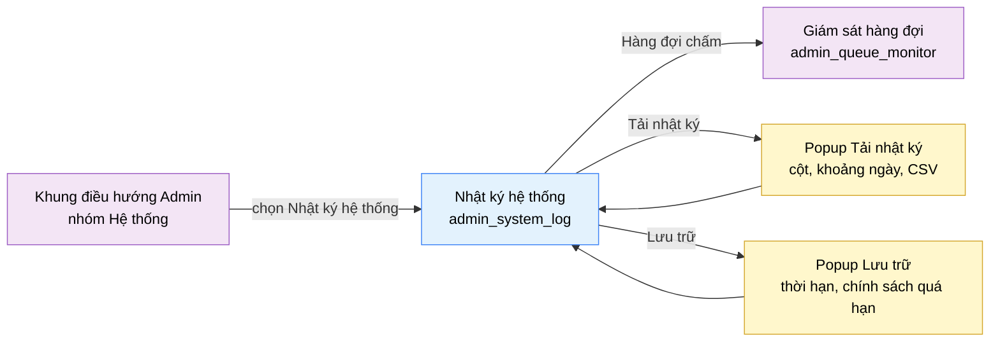

# Tài liệu thiết kế cơ bản (BD) — Nhật ký hệ thống (`ADM0403`)

## Phương châm tài liệu [Nội bộ — không cần khách duyệt]

- Viết theo **mẫu 9 sheet**. Bộ thẻ đóng, quy ước ID, ký hiệu chuẩn, ranh giới với tài liệu khác và
  checklist kiểm toán nằm ở `02-bd/_rules/bd-template-9sheet.md` — file này không chép lại.
- Phần gắn nhãn `[Nội bộ]` phục vụ sinh mã và tự kiểm toán, không phải yêu cầu của khách hàng: mục 4.5, mục
  7.3 và các ghi chú quy ước.
- Mã màn `ADM0403` theo bảng mã ở `02-bd/_rules/bd-template-9sheet.md` mục 8; tên file mang tiền tố mã.
- Màn này **không có màn con** và có **hai popup** (thêm V0.6, 2026-10-01): "Tải nhật ký" (chọn cột và khoảng
  thời gian để xuất CSV) và "Lưu trữ" (thời hạn lưu và chính sách với log quá hạn). Chỉ có một liên kết đi ra sang
  `admin_queue_monitor`.

> Đọc cùng `01-rd/screens/admin/ADM0403_system_log.md` (hành vi ở mức yêu cầu, không lặp lại ở đây),
> `01-rd/req/identity.md` (F1-10 → F1-14), `02-bd/database/identity.md`, `02-bd/security/identity.md`
> và `02-bd/screens/admin/_shell.md` (khung điều hướng dùng chung, không mô tả lại).

> **Ranh giới cứng của màn.** Màn này chỉ đọc **một luồng dữ liệu**: hành động quản trị của con người
> (đổi ma trận quyền, đổi vai trò, khoá/mở khoá, reset mật khẩu, thao tác nội dung kho bài và kho câu hỏi).
> **Không** gộp sự kiện hạ tầng (lỗi judge engine, worker mất kết nối, timeout sweep) — các sự kiện đó
> thuộc `judge-orchestration` (F4-10) và có màn riêng `admin_queue_monitor`
> [Nguồn: 01-rd/req/identity.md:68-75; 02-bd/database/identity.md:103-106;
> 09-layoutBase/Admin - Nhật ký hệ thống.dc.html:152]. Nếu DD sau này định gộp hai nguồn vào chung một
> bảng, đó là thay đổi kiến trúc cần một quyết định mới, không phải lựa chọn của DD.

> **Không thiết kế** phân loại "Chấm lại", chỉ số "Phiên chấm lại đã chạy" và dòng log mẫu `#RJ-0139` có
> trong prototype — đã cắt khỏi phạm vi theo `DEC-2026-0828-remove-rejudge-scope`
> [Nguồn: 01-rd/screens/admin/ADM0403_system_log.md:29-31]. Còn lại **4 phân loại**: Xác thực, Ma trận quyền,
> Cấu hình, Nội dung. **Cập nhật 2026-10-01:** dải thẻ chỉ số (còn 3 thẻ sau khi bỏ "Chấm lại") đã bỏ hẳn khỏi UI — chỉ
> trang tổng quan hiển thị KPI, trang danh sách chỉ có bộ lọc và danh sách (`02-bd/screens/admin/_shell.md`).

---

## Sheet 1. Bìa

| Mục | Giá trị |
| :--- | :--- |
| Hệ thống | AlgoPrep |
| Phân hệ | `identity` (F1) |
| Công đoạn | BD — Thiết kế cơ bản |
| Phân loại | Màn hình |
| Tên màn | Nhật ký hệ thống |
| Mã màn hình | `ADM0403` |
| Tên vật lý (slug) | `admin_system_log` |
| Trục tài liệu | Màn hình (`02-bd/screens/`) |
| Actor | A3 (`ADMIN`) |
| Phiên bản | V0.9 |
| Người tạo | Nhóm phát triển AlgoPrep |
| Ngày tạo | 2026/09/15 |
| Người cập nhật | Nhóm phát triển AlgoPrep |
| Ngày cập nhật | 2026/10/08 |

---

## Sheet 2. Lịch sử sửa đổi

| Ver | Sheet bị sửa | Nội dung sửa | Ngày | Người sửa |
| :--- | :--- | :--- | :--- | :--- |
| V0.1 | Toàn bộ | Tạo mới theo cấu trúc 9 mục văn xuôi (phạm vi và ranh giới, layout regions, component inventory, screen states, APIs consumed, ghi chú cho DD/database, navigation, access rights, câu hỏi mở) | 2026/09/15 | Nhóm phát triển AlgoPrep |
| V0.2 | Toàn bộ | Chuyển sang mẫu 9 sheet. Chốt nguồn dữ liệu của mọi trường hiển thị về đúng 2 bảng `identity.system_audit_logs` và `identity.users` (không thêm cột `category`, `message`, `service` — đều suy ra từ `action_type`), bổ sung Sheet 8 danh sách sự kiện và Sheet 9 đặc tả kiểm tra, đề xuất thêm bộ lọc khoảng thời gian cho danh sách 12.408 dòng, giữ nguyên 3 câu hỏi mở cũ và phát sinh thêm câu hỏi về cách dựng câu nội dung log, tên dịch vụ và mã sự kiện hiển thị | 2026/09/20 | Nhóm phát triển AlgoPrep |
| V0.3 | 3, 4, 5, 6, 7, 8; Câu hỏi mở | Bỏ dải thẻ chỉ số khỏi UI (Khu vực B còn ghi chú rỗng, giữ chữ cái C trở đi), bỏ `AuditLogStatsDto` và endpoint `GetSystemAuditLogStats`, đánh số lại DTO và endpoint; màn còn 3 khối dữ liệu. Hai khối phụ (Quản trị viên hoạt động, Phân loại 7 ngày) giữ nguyên. Theo quy ước "chỉ một trang tổng quan hiển thị KPI" | 2026/10/01 | Nhóm phát triển AlgoPrep |
| V0.4 | Câu hỏi mở | Thêm đề xuất cho Q1, Q2, Q4 theo nguyên tắc admin (chờ owner xác nhận). Không đổi thiết kế màn | 2026-10-01 | AI |
| V0.5 | Phương châm, Sheet 5, 7, Câu hỏi mở | Đã chốt 2026-10-01 (owner uỷ quyền cân nhắc), xem `DEC-2026-1001-admin-configurable-settings`: (1) thêm `action_type` `PASSWORD_RESET_REQUESTED` ("yêu cầu đặt lại mật khẩu") vào nhóm phân loại **Xác thực** — nguồn số liệu thẻ mật khẩu ở `ADM0101`, ghi khi phát hành OTP, không lưu OTP (`02-bd/database/identity.md` mục 1.11); (2) Q1, Q2, Q4 đổi từ "Đề xuất (chờ owner xác nhận)" sang **đã chốt**; Q2: thời hạn lưu log và chính sách log quá hạn là cấu hình ADMIN, nhãn chân trang đọc từ cấu hình thay vì `application.yml`; nhật ký giữ **bất biến** (không xoá tay từng dòng); Q4: tệp xuất CSV tự chọn cột và khoảng thời gian, không trần số dòng, xuất theo luồng, mỗi lần xuất ghi một dòng log | 2026-10-01 | AI |
| V0.6 | Phương châm, Sheet 3, 4, 5, 6, 7, 8, 9, Câu hỏi mở | Đồng bộ với prototype dựng 2026-10-01: (a) thêm nút "Lưu trữ" (giữa toggle "Theo dõi trực tiếp" và "Tải nhật ký") mở popup gồm "Thời hạn lưu" (số nguyên ngày, tối thiểu 1, không trần, mặc định 90) và "Với log quá hạn" (Xoá hẳn / Nén và lưu trữ), kèm gợi ý không có thao tác xoá tay từng dòng; (b) "Tải nhật ký" thành nút mở hộp thoại: tick chọn cột (Thời gian, Người thực hiện, Dịch vụ, Phân loại, Nội dung, Mã sự kiện; ít nhất một cột), khoảng "Từ ngày"/"Đến ngày" tuỳ chọn (ngày kết thúc không trước ngày bắt đầu), CSV không trần số dòng, ghi chú mỗi lần xuất ghi một dòng log. EVT-9 đổi từ "gọi xuất" sang "mở hộp thoại", thêm EVT-12 đến EVT-16; thêm DTO NO 13-15, endpoint NO 6-7, Sheet 9 NO 9-12, Q7, Q8. Bỏ các câu "không có popup", "không thiết kế màn cấu hình thời hạn lưu", "màn cấu hình chưa có". Vị trí nút "Lưu trữ" là do prototype tự chọn | 2026/10/01 | AI |
| V0.7 | Sheet 3, 5, 6, 8, 9 | Áp `DEC-2026-1003-toast-feedback-channel`: kết quả thao tác và lỗi nhập liệu ghi là toast dùng chung, ô sai chỉ đổi viền đỏ. | 2026/10/03 | AI |
| V0.8 | Sheet 4, 5, 6, 8, 9, Câu hỏi mở | Đồng bộ prototype 2026-10-08 và chốt của owner cùng ngày (`DEC-2026-1008-admin-system-screens-review`). (1) **Q6 đã chốt: bộ lọc "Từ ngày" / "Đến ngày" nằm trong phạm vi** — prototype dựng hai ô ngày gốc của trình duyệt trong thanh bộ lọc, khoảng đóng ở cả hai đầu, khoảng ngược thì ô "Đến ngày" đổi viền đỏ (`aria-invalid`), hiện toast cảnh báo và không trả dòng nào; Sheet 5/6 Khu vực C NO 3, 4 và Sheet 9 NO 4-6 hết là đề xuất. (2) Nút "Tải thêm 50 dòng" nay nạp thêm 50 dòng và **tắt** (không ẩn) khi đã tải hết. (3) Mỗi dòng log hiện thêm **ngày** (dd/MM) dưới giờ; dòng **khoá tài khoản** hiện thêm dòng phụ "Lý do: ..." (lý do quản trị viên nhập, F1-32), dòng mở khoá không có — thêm Khu vực D NO 10. Q8 (hộp thoại xuất có theo bộ lọc chính không) vẫn mở | 2026/10/08 | AI |
| V0.9 | Sheet 3, 4, 5, 6, 7, 8, 9, Câu hỏi mở | Đồng bộ prototype vòng 2 ngày 2026-10-08 và chốt của owner (`DEC-2026-1008-admin-system-open-questions-closed`). (1) **Q7 chốt phần (a) và phần vị trí nút:** nút "Lưu trữ" **ở lại** màn này; trước khi lưu, nếu thời hạn mới **ngắn hơn** giá trị đã lưu hoặc chính sách chuyển sang "Xoá hẳn" từ "Nén và lưu trữ" thì popup hiện cảnh báo và hỏi lại ("Vẫn lưu" / "Quay lại") — thêm Khu vực I NO 7-9, viết lại EVT-15; phần (b) nơi lưu bản nén và (c) bảng cấu hình **còn mở cho DD `identity`** (Q7 đổi thành "Q7 phần còn lại", không đổi số). (2) **Q8 đã chốt:** hộp thoại "Tải nhật ký" áp bộ lọc đang chọn trên màn khi mở (tóm tắt từ khoá và phân loại, hai ô ngày bắt đầu từ "Từ ngày"/"Đến ngày" của màn chính), chỉ dựng khi đang mở; Sheet 9 NO 5 và NO 6 **đã dựng cho hai ô ngày của hộp thoại** (máy chủ cũng phải kiểm) — thêm Khu vực H NO 9, sửa EVT-9, EVT-12, DTO NO 13. (3) **Q3 đã chốt:** "Quản trị viên hoạt động" đếm cửa sổ 24 giờ. (4) Sửa lỗi bảng: EVT-9 và EVT-10 từng dính trên một dòng. | 2026/10/08 | AI |

---

## Sheet 3. Sơ đồ chuyển màn

> [Nội bộ] Quy ước vẽ: bố trí từ trái sang phải. Màn gọi tới tô tím, màn hiện tại tô xanh nhạt, popup tô
> vàng (hai popup "Tải nhật ký" và "Lưu trữ", thêm V0.6). Màu và `[Nguồn:]` dùng để truy vết, không phải yêu cầu của khách.

### 3.1 Danh sách chuyển màn

#### Khung điều hướng Admin → Nhật ký hệ thống

[Điều kiện mở] Chọn mục con "Nhật ký hệ thống" trong nhóm "Hệ thống" ở thanh điều hướng bên trái.

[Chế độ mở] Chế độ chỉ xem. Màn này không có thao tác ghi dữ liệu nào.

[Thông tin truyền] Không có.

[Giá trị trả về] Không có.

[Khi thành công] Tải 3 khối dữ liệu độc lập: danh sách sự kiện trang đầu, danh sách quản trị
viên hoạt động, biểu đồ phân loại 7 ngày. Bộ lọc ở trạng thái mặc định (tab "Tất cả", ô tìm rỗng).

[Khi huỷ] Không có.

#### Nhật ký hệ thống → Giám sát hàng đợi

[Điều kiện mở] Bấm liên kết "Hàng đợi chấm" trong dòng chú thích dưới biểu đồ phân loại.

[Chế độ mở] Không có.

[Thông tin truyền] Không có.

[Giá trị trả về] Không có.

[Khi thành công] Điều hướng sang màn `admin_queue_monitor` để xem sự kiện hạ tầng. Màn này không có thay
đổi chưa lưu nên rời màn không cần xác nhận.

[Khi huỷ] Không có.

#### Nhật ký hệ thống → Popup Tải nhật ký

[Điều kiện mở] Bấm nút "Tải nhật ký" ở thanh tiêu đề.

[Chế độ mở] Chế độ nhập: chọn cột và khoảng thời gian. Mỗi lần mở bắt đầu với cả 6 cột được tick, hai ô ngày lấy sẵn "Từ ngày" / "Đến ngày" của bộ lọc màn chính (rỗng nếu màn chính để rỗng). Hộp thoại chỉ được dựng trong lúc mở nên luôn khởi tạo lại từ bộ lọc hiện tại (Q8 đã chốt) [Nguồn: 05-coding/frontend/src/views/admin/system-log/ui/admin-system-log-view.tsx:334-346].

[Thông tin truyền] Bộ lọc đang chọn trên màn chính: từ khoá, tab phân loại, "Từ ngày", "Đến ngày" (Q8 đã chốt) [Nguồn: 05-coding/frontend/src/views/admin/system-log/ui/admin-system-log-view.tsx:339-344].

[Giá trị trả về] Yêu cầu xuất đã gửi, hoặc không có gì nếu người dùng huỷ.

[Khi thành công] Hộp thoại đóng và hiện toast "Đã xuất nhật ký" kèm số cột đã chọn [Nguồn: 05-coding/frontend/src/views/admin/system-log/ui/export-log-dialog.tsx:38-40].

[Khi huỷ] Đóng hộp thoại, không xuất tệp, không ghi log.

#### Nhật ký hệ thống → Popup Lưu trữ

[Điều kiện mở] Bấm nút "Lưu trữ" ở thanh tiêu đề (giữa toggle "Theo dõi trực tiếp" và nút "Tải nhật ký").

[Chế độ mở] Chế độ sửa; mỗi lần mở bắt đầu từ giá trị đã lưu.

[Thông tin truyền] Thời hạn lưu và chính sách với log quá hạn đang lưu.

[Giá trị trả về] Hai giá trị đã lưu, hoặc không có gì nếu người dùng huỷ.

[Khi thành công] Popup hiển thị ô "Thời hạn lưu" (ngày), ô chọn "Với log quá hạn" và dòng gợi ý; "Lưu" ghi hai giá trị và đóng popup. Nếu thời hạn mới ngắn hơn giá trị đã lưu, hoặc chính sách chuyển sang "Xoá hẳn" từ "Nén và lưu trữ", popup hiện cảnh báo và hỏi lại ("Vẫn lưu" / "Quay lại") trước khi ghi (Q7 phần xác nhận đã chốt) [Nguồn: 05-coding/frontend/src/views/admin/system-log/ui/admin-system-log-view.tsx:314-324].

[Khi huỷ] Đóng popup, bỏ nháp, giá trị đã lưu không đổi.

[Nguồn: 05-coding/frontend/src/views/admin/system-log/ui/admin-system-log-view.tsx:96-126,227-254,296-346; 05-coding/frontend/src/views/admin/system-log/ui/export-log-dialog.tsx:15-137]

### 3.2 Sơ đồ

[Nguồn: 09-layoutBase/Admin - Nhật ký hệ thống.dc.html:312-316,245; 02-bd/screens/admin/_shell.md:39]

---

## Sheet 4. Bố cục màn hình

### 4.1 Tổng quan màn

[Mục đích màn] Cho quản trị viên xem lại mọi hành động quản trị đã xảy ra trong hệ thống kèm ai đổi, đổi
gì, đổi lúc nào — không có ngoại lệ, kể cả chính thao tác đổi quyền
[Nguồn: 01-rd/req/identity.md:68-71 — F1-14].

[Luồng nghiệp vụ chính]

1. **Hiển thị ban đầu**: vào màn, hệ thống tải song song 3 khối dữ liệu. Mỗi khối có khung chờ riêng và
   trạng thái lỗi riêng — một khối hỏng không chặn hai khối còn lại.
2. **Lọc và tìm**: quản trị viên gõ từ khoá (dịch vụ, tài khoản, mã sự kiện) và/hoặc chọn một tab phân
   loại, và/hoặc đặt khoảng "Từ ngày" / "Đến ngày" (Q6 đã chốt 2026-10-08, khoảng đóng ở cả hai đầu). Các điều kiện
   áp dụng đồng thời theo phép AND. Bộ lọc **chỉ** ảnh hưởng khối danh sách, không
   ảnh hưởng 2 khối phụ bên phải.
3. **Đọc danh sách**: mỗi dòng gồm giờ kèm **ngày** (dd/MM) bên dưới, nhãn phân loại, câu nội dung, và dòng phụ
   dịch vụ · người thực hiện · mã sự kiện. Dòng **khoá tài khoản** có thêm một dòng "Lý do: ..." ngay dưới câu nội dung
   (lý do do quản trị viên nhập, F1-32); dòng mở khoá không có dòng này [Nguồn: 05-coding/frontend/src/views/admin/system-log/ui/admin-system-log-view.tsx:341-358; 05-coding/frontend/src/views/admin/system-log/model/types.ts:29-33]. Dòng log là điểm cuối thông tin — **không** bấm được sang màn khác.
4. **Tải thêm**: bấm "Tải thêm 50 dòng" ở cuối danh sách để nối thêm trang kế tiếp. Đây là phân trang nối
   tiếp theo mốc thời gian, không phải phân trang số trang.
5. **Theo dõi trực tiếp**: bật toggle thì dòng log mới được chèn ngay ở đầu danh sách khi có sự kiện mới;
   tắt thì danh sách đứng yên.
6. **Xuất nhật ký**: bấm "Tải nhật ký" để mở hộp thoại, tick các cột cần xuất (ít nhất một), tuỳ chọn khoảng
   "Từ ngày" / "Đến ngày", rồi "Xuất CSV". Mỗi lần xuất được ghi thành một dòng log. Hộp thoại **áp bộ lọc đang chọn
   trên màn** (Q8 đã chốt 2026-10-08): từ khoá và phân loại hiện thành một dòng tóm tắt "Áp bộ lọc đang chọn trên màn: ...",
   hai ô ngày bắt đầu từ "Từ ngày" / "Đến ngày" của màn chính; ngày bắt đầu cũ hơn thời hạn lưu hoặc ngày trong tương lai
   bị chặn (Sheet 9 NO 5, NO 6) [Nguồn: 05-coding/frontend/src/views/admin/system-log/ui/export-log-dialog.tsx:17-49,128-132].
7. **Đặt thời hạn lưu** (thêm V0.6): bấm "Lưu trữ" để đặt số ngày giữ log và chính sách với log quá hạn
   (Xoá hẳn hoặc Nén và lưu trữ). Không có thao tác xoá tay từng dòng; chỉ job hệ thống dọn khi quá hạn. Giảm thời hạn hoặc
   chuyển sang "Xoá hẳn" thì popup cảnh báo và hỏi lại trước khi ghi (Q7 phần xác nhận đã chốt) [Nguồn: 05-coding/frontend/src/views/admin/system-log/ui/admin-system-log-view.tsx:314-324].

[Người dùng] Quản trị viên đã đăng nhập, vai trò `ADMIN`. Quyền đọc log **không** đi qua ma trận phân
quyền F1-10 — xem Câu hỏi mở Q1 và Sheet 9 NO 1.

[Tệp liên quan] Xuất một tệp nhật ký khi bấm "Xuất CSV" trong hộp thoại "Tải nhật ký". Định dạng CSV, cột và khoảng thời gian do ADMIN chọn, không trần số dòng (đã chốt 2026-10-01, xem Câu hỏi mở Q4). Màn
này không nhập tệp.

[Phạm vi]
- Chỉ đọc đối với **bản ghi log**: không có thao tác tạo, sửa, xoá bản ghi log trên màn này. Ngoại lệ duy nhất là
  hai tham số cấu hình lưu log (thời hạn lưu, chính sách với log quá hạn) sửa trong popup "Lưu trữ" (V0.6).
- Không hiển thị sự kiện hạ tầng — ranh giới cứng ghi ở đầu file.
- Không có phân loại "Chấm lại" (đã cắt phạm vi 2026-08-28).
- Không thiết kế một màn cấu hình log riêng; thời hạn lưu hiển thị dưới dạng nhãn ở chân trang và được sửa trong
  popup "Lưu trữ" của màn này. Nút ở lại màn này (Q7 đã chốt 2026-10-08); nơi lưu bản nén và bảng cấu hình còn mở cho DD, xem Q7 phần còn lại.
- Không cho bấm từ một dòng log sang đối tượng bị tác động (tài khoản, bài toán) — prototype không có
  liên kết đó và RD cũng không yêu cầu.

[Quyền sử dụng]
- Xem: được, với vai trò `ADMIN`.
- Thêm: không. Dòng log sinh ra như tác dụng phụ của các API quản trị khác, không phải do màn này tạo.
- Sửa: không đối với bản ghi log. Chỉ thời hạn lưu và chính sách log quá hạn là sửa được (popup "Lưu trữ").
- Xoá: không. Log cũ hơn thời hạn lưu do job dọn định kỳ xử lý, không xoá thủ công qua giao diện.

[Số bản ghi tối đa] Danh sách sự kiện: 50 dòng mỗi lần tải, nối tiếp không giới hạn cứng trong phạm vi
thời hạn lưu. Quản trị viên hoạt động: prototype hiển thị 4 dòng, đề xuất giới hạn 5
dòng. Biểu đồ phân loại: đúng 4 cột.

[Nguồn: 01-rd/screens/admin/ADM0403_system_log.md:22-38; 01-rd/req/identity.md:68-75; 09-layoutBase/Admin - Nhật ký hệ thống.dc.html:211,451]

### 4.2 DTO liên quan

- `AuditLogEntryDto`
- `ActiveAdminDto`
- `AuditCategoryBreakdownDto`
- `AuditLogExportRequestDto` (thêm V0.6)
- `AuditLogRetentionSettingsDto` (thêm V0.6)

`[Suy luận]` — tên DTO do BD này đề xuất, `03-dd/api/identity.md` chốt lại.

### 4.3 Bảng dữ liệu liên quan (2)

| NO | Bảng | Ghi chú |
| --: | :--- | :--- |
| 1 | `identity.system_audit_logs` | [Nguồn: 02-bd/database/identity.md:103-106] |
| 2 | `identity.users` | Tra tên hiển thị và vai trò của người thực hiện qua `actor_user_id` [Nguồn: 02-bd/database/identity.md:104] |

Màn này **không thêm cột nào** vào `system_audit_logs`. Ba trường prototype hiển thị mà bảng không có —
phân loại, câu nội dung, tên dịch vụ — đều **suy ra từ `action_type`** ở tầng ứng dụng, xem Sheet 5 khu
vực D và Câu hỏi mở Q5. Thời hạn lưu log là cấu hình do ADMIN đặt, job dọn định kỳ đọc cấu hình đó; nhật ký không bao giờ bị xoá tay từng dòng.
Hai tham số cấu hình (thời hạn lưu, chính sách log quá hạn) **chưa có bảng lưu** trong
`02-bd/database/identity.md`; bảng cấu hình hệ thống của `identity` là việc của DD, xem Q7. Từ V0.6 màn này
ghi vào hai tham số đó qua popup "Lưu trữ", nhưng vẫn không ghi vào `system_audit_logs`.

### 4.4 Vùng bố cục

Đối chiếu `09-layoutBase/Admin - Nhật ký hệ thống.dc.html` — bằng chứng bố cục chỉ-đọc, **không phải**
design system cuối cùng.

| Vùng | Vị trí trong prototype | Nội dung |
| :--- | :--- | :--- |
| Thanh điều hướng bên trái (khung chung Admin) | `:296-320` | Nhóm "Hệ thống" đang mở, mục con "Nhật ký hệ thống" đang chọn — dùng lại khung chung của mọi màn Admin |
| Thanh tiêu đề dính trên | `:149-163` | Tiêu đề, phụ đề ghi rõ ranh giới phạm vi, toggle "Theo dõi trực tiếp", nút "Tải nhật ký"; mã prototype thêm nút "Lưu trữ" đứng giữa hai nút này (`views/admin/system-log/ui/admin-system-log-view.tsx:113-123`), mockup tĩnh không vẽ nút này `[SoT: Suy luận]` do prototype tự chọn |
| Dải chỉ số tổng | `:165-176` | **Không dựng trên UI Next.js (2026-10-01)** — prototype có 4 thẻ, BD từng giữ 3 sau khi bỏ "Chấm lại", nay bỏ cả dải |
| Cột trái — Bộ lọc danh sách | `:181-192` | Ô tìm kiếm, dải tab phân loại, nhãn đếm kết quả. **Prototype Next.js (2026-10-08):** thêm hai ô ngày "Từ ngày" / "Đến ngày" trong cùng thanh lọc [Nguồn: 05-coding/frontend/src/views/admin/system-log/ui/admin-system-log-view.tsx:175-200] |
| Cột trái — Danh sách sự kiện | `:194-207` | Mỗi dòng 3 cột: giờ (kèm ngày dd/MM bên dưới), nhãn phân loại, nội dung kèm dòng phụ dịch vụ · người thực hiện · mã sự kiện; dòng khoá tài khoản có thêm dòng "Lý do: ..." [Nguồn: 05-coding/frontend/src/views/admin/system-log/ui/admin-system-log-view.tsx:341-358] |
| Cột trái — Chân danh sách | `:209-212` | Nhãn phạm vi hiển thị và nút "Tải thêm 50 dòng" |
| Cột phải — "Quản trị viên hoạt động" | `:216-231` | Danh sách người thực hiện gần nhất kèm vai trò, số hành động, thời điểm |
| Cột phải — "Phân loại hành động · 7 ngày" | `:233-247` | 4 cột ngang theo phân loại, kèm dòng chú thích trỏ sang `admin_queue_monitor` |
| Chân trang (khung chung Admin) | `:250-263` | Phiên bản, nhãn thời hạn lưu nhật ký, liên kết phụ |

Bố cục hai cột `minmax(0, 1fr) minmax(290px, 0.42fr)` (`:178`): cột trái là danh sách chính, cột phải là
hai khối tổng hợp ngắn. Giữ nguyên cấu trúc này khi dựng Next.js; không quy định màu sắc, khoảng cách hay
typography ở BD.

### 4.5 Cấu trúc slice FSD [Nội bộ]

| Khối | Slice dự kiến | Căn cứ |
| :--- | :--- | :--- |
| Trang | `views/admin/system-log` | Quy ước FSD của dự án |
| Khung Admin | Dùng lại `widgets/app-shell` | `02-bd/screens/admin/_shell.md:24-28` |
| Bộ lọc | `features/audit-log-filter` | Prototype `:181-192` |
| Danh sách | `views/admin/system-log` (UI ở `ui/`, dữ liệu ở `api/` + `model/` của view; chỉ tách widget khi màn thứ hai cần) | Prototype `:194-212` |
| Khối phụ | `widgets/active-admins-panel`, `widgets/audit-category-breakdown` | Prototype `:216-247` |
| Kênh thời gian thực | `features/audit-log-live` | Prototype `:154-156` |
| Hộp thoại xuất, popup lưu trữ (thêm V0.6) | `views/admin/system-log/ui/export-log-dialog.tsx`, `views/admin/system-log/model/settings.ts` + dialog dùng chung `shared/ui/params-dialog` | Mã prototype: `export-log-dialog.tsx:15-100`, `settings.ts:8-13` |

`[Suy luận]` — ánh xạ slice do BD đề xuất, DD màn hình chốt lại.

> [Nội bộ] Ảnh minh hoạ đặt ở `08-diagram/02-bd/screens/admin/`, chụp bằng Playwright trên ứng dụng Next.js
> thật khi đã có mã chạy được. Chưa có thì tham chiếu prototype, không vẽ tay.

---

## Sheet 5. Danh sách item màn hình

> Quy ước ID, bộ thẻ và giá trị chuẩn: `02-bd/_rules/bd-template-9sheet.md` mục 2, 3, 4.

### Khu vực A — Thanh tiêu đề

| Khu vực | NO | Tên item | ID item | Bảng DB | Cột DB | Loại UI | Kiểu | Độ dài | Bắt buộc | I/O | Giá trị mặc định | Định dạng | Ghi chú |
| :--- | --: | :--- | :--- | :--- | :--- | :--- | :--- | :--- | :-: | :-: | :--- | :--- | :--- |
| Thanh tiêu đề | | | | | | | | | | | | | |
| | 1 | Tiêu đề màn | `adminSystemLog.header.title` | - | - | Label | String | - | - | O | Nhật ký hệ thống | - | Tên màn hiển thị cố định [Nguồn giá trị] Nhãn tĩnh i18n [EVT liên quan] - |
| | 2 | Phụ đề ranh giới phạm vi | `adminSystemLog.header.subtitle` | - | - | Label | String | - | - | O | Hành động quản trị của con người · sự kiện hạ tầng xem ở Hàng đợi chấm | - | Câu này là ranh giới phạm vi F1-14, giữ nguyên từng chữ, không rút gọn khi dựng UI [Nguồn giá trị] Nhãn tĩnh i18n [EVT liên quan] - |
| | 3 | Theo dõi trực tiếp | `adminSystemLog.header.toggleLive` | - | - | Toggle | Boolean | - | - | I/O | Bật | `Theo dõi trực tiếp` / `Đã tạm dừng` | Bật hoặc tắt việc nhận dòng log mới theo thời gian thực. Chỉ là trạng thái phía client, không đổi hành vi máy chủ [Nguồn giá trị] Trạng thái phía client, không lưu xuống máy chủ [EVT liên quan] EVT-6 |
| | 4 | Tải nhật ký | `adminSystemLog.header.btnExport` | - | - | Button | - | - | - | I | - | - | Mở hộp thoại "Tải nhật ký" (Khu vực H) để chọn cột và khoảng thời gian rồi xuất CSV. Từ V0.6 nút **không còn gọi xuất ngay** [Nguồn giá trị] - [EVT liên quan] EVT-9 |
| | 5 | Lưu trữ | `adminSystemLog.header.btnRetention` | - | - | Button | - | - | - | I | - | - | Mở popup "Lưu trữ" (Khu vực I) để đặt thời hạn lưu và chính sách log quá hạn. Đứng giữa "Theo dõi trực tiếp" và "Tải nhật ký" trên thanh tiêu đề; vị trí đã chốt giữ trên màn này (Q7, 2026-10-08) [Nguồn giá trị] - [EVT liên quan] EVT-14 |

### Khu vực B — Dải chỉ số tổng (đã bỏ)

Khu vực này **không còn item nào** kể từ 2026-10-01: 3 thẻ chỉ số (Hành động quản trị 24 giờ kèm biến động, Số tài
khoản quản trị hoạt động, Đổi ma trận phân quyền, Khoá / mở khoá tài khoản) và chú thích đã bị xoá khỏi UI theo quy
ước "chỉ một trang tổng quan hiển thị KPI" (`02-bd/screens/admin/_shell.md`). Giữ nguyên chữ cái khu vực C trở đi để
các tham chiếu hiện có không phải đánh số lại.

### Khu vực C — Bộ lọc danh sách

| Khu vực | NO | Tên item | ID item | Bảng DB | Cột DB | Loại UI | Kiểu | Độ dài | Bắt buộc | I/O | Giá trị mặc định | Định dạng | Ghi chú |
| :--- | --: | :--- | :--- | :--- | :--- | :--- | :--- | :--- | :-: | :-: | :--- | :--- | :--- |
| Bộ lọc danh sách | | | | | | | | | | | | | |
| | 1 | Ô tìm kiếm | `adminSystemLog.filter.query` | - | - | TextBox | String | 100 | - | I | rỗng | - | Tìm theo **dịch vụ, tài khoản hoặc mã sự kiện**. **Không** tìm trong câu nội dung log, để tránh quét toàn bảng trên tập log lớn [Nguồn giá trị] Người dùng nhập; đối sánh với tên dịch vụ suy ra từ `action_type`, với `users.username` của người thực hiện, và với mã sự kiện [EVT liên quan] EVT-2 |
| | 2 | Tab phân loại | `adminSystemLog.filter.tabCategory` | `identity.system_audit_logs` | `action_type` | Button | Enum | - | - | I | Tất cả | Nhãn tiếng Việt | Dải 5 tab: Tất cả, Xác thực, Ma trận quyền, Cấu hình, Nội dung. Tab "Chấm lại" của prototype đã bị bỏ [Công thức] Mỗi tab lọc theo nhóm phân loại suy ra từ `action_type`; tab "Tất cả" không lọc [EVT liên quan] EVT-3 |
| | 3 | Từ ngày | `adminSystemLog.filter.dateFrom` | `identity.system_audit_logs` | `created_at` | TextBox | Date | 10 | - | I | rỗng | `DD/MM/YYYY` | **Đã chốt 2026-10-08 (Q6): nằm trong phạm vi**, prototype Next.js đã dựng. Lý do: chân danh sách ghi "12.408 sự kiện" nhưng chỉ có nút tải thêm theo thời gian giảm dần, nên không cách nào tới được log của một ngày cũ mà không bấm hàng trăm lần. Dùng control ngày gốc của trình duyệt (`type="date"`), không thêm thư viện; định dạng hiển thị theo trình duyệt. Khoảng **đóng ở cả hai đầu** (lấy cả ngày đầu và ngày cuối). Prototype tự đặt `max` của ô này bằng ngày "Đến ngày" nếu đã nhập, và lọc trên các dòng đã tải [Nguồn: 05-coding/frontend/src/views/admin/system-log/ui/admin-system-log-view.tsx:77-100,175-186] [Nguồn giá trị] Người dùng nhập; đối chiếu `created_at` [EVT liên quan] EVT-4 |
| | 4 | Đến ngày | `adminSystemLog.filter.dateTo` | `identity.system_audit_logs` | `created_at` | TextBox | Date | 10 | - | I | rỗng | `DD/MM/YYYY` | **Đã chốt 2026-10-08 (Q6)** — cùng lý do với NO 3. Khoảng ngược (Từ ngày muộn hơn Đến ngày) thì ô này đổi viền đỏ (`aria-invalid`), hiện toast cảnh báo và danh sách không có dòng nào [Nguồn: 05-coding/frontend/src/views/admin/system-log/ui/admin-system-log-view.tsx:88,102-110,188-199] [Nguồn giá trị] Người dùng nhập; đối chiếu `created_at` [EVT liên quan] EVT-4 |
| | 5 | Đếm kết quả | `adminSystemLog.filter.resultCount` | - | - | Label | String | - | - | O | - | `{số} / {số} dòng` | Số dòng khớp bộ lọc trên tổng số dòng đã tải [Công thức] Số dòng sau lọc và tổng số dòng trong phạm vi truy vấn, do máy chủ trả về [EVT liên quan] EVT-2, EVT-3, EVT-4 |
| | 6 | Xoá bộ lọc | `adminSystemLog.filter.btnClear` | - | - | Button | - | - | - | I | - | - | Đưa mọi tiêu chí lọc về mặc định. Chỉ xuất hiện trong trạng thái danh sách rỗng [Nguồn giá trị] - [EVT liên quan] EVT-5 |

### Khu vực D — Danh sách sự kiện

| Khu vực | NO | Tên item | ID item | Bảng DB | Cột DB | Loại UI | Kiểu | Độ dài | Bắt buộc | I/O | Giá trị mặc định | Định dạng | Ghi chú |
| :--- | --: | :--- | :--- | :--- | :--- | :--- | :--- | :--- | :-: | :-: | :--- | :--- | :--- |
| Danh sách sự kiện | | | | | | | | | | | | | |
| | 1 | Danh sách sự kiện | `adminSystemLog.list` | `identity.system_audit_logs` | - | List | List | - | - | O | rỗng | - | Mỗi dòng là một hành động quản trị, sắp xếp theo `created_at` giảm dần [Nguồn giá trị] Kết quả gọi `SearchSystemAuditLogs` [EVT liên quan] EVT-1, EVT-7, EVT-8 |
| | 2 | Giờ | `adminSystemLog.list.col.time` | `identity.system_audit_logs` | `created_at` | ListColumn | Date | 8 | - | O | - | `HH:mm:ss` | Thời điểm xảy ra hành động. **Từ 2026-10-08** ngày `dd/MM` hiện thêm ngay dưới giờ (dòng log cách nhau nhiều ngày nay đọc được) [Nguồn: 05-coding/frontend/src/views/admin/system-log/ui/admin-system-log-view.tsx:65-68,345-346; 05-coding/frontend/src/views/admin/system-log/model/types.ts:17-21] [Nguồn giá trị] Cột `created_at` [EVT liên quan] - |
| | 3 | Phân loại | `adminSystemLog.list.col.category` | `identity.system_audit_logs` | `action_type` | Badge | Enum | - | - | O | - | Nhãn tiếng Việt | Nhóm phân loại của hành động. Danh sách đóng 4 giá trị: Xác thực, Ma trận quyền, Cấu hình, Nội dung. Thêm phân loại mới phải sửa cả BD lẫn mã sinh log. Nhóm **Xác thực** có `action_type` `PASSWORD_RESET_REQUESTED` (yêu cầu đặt lại mật khẩu, thêm 2026-10-01, `DEC-2026-1001-admin-configurable-settings`) [Công thức] Ánh xạ `action_type` sang một trong 4 nhóm tại tầng ứng dụng `identity`; **không thêm cột `category`** [EVT liên quan] - |
| | 4 | Nội dung | `adminSystemLog.list.col.message` | `identity.system_audit_logs` | `action_type`, `target_type`, `target_id`, `before_json`, `after_json` | ListColumn | String | - | - | O | - | - | Câu mô tả hành động, ví dụ "Cấp quyền UPDATE trên TESTCASE_MANAGEMENT cho vai trò Trợ giảng" [Công thức] Dựng từ mẫu câu i18n chọn theo `action_type`, tham số lấy từ `target_type`, `target_id` và phần chênh lệch giữa `before_json` và `after_json`. Nơi dựng câu (máy chủ hay giao diện) chưa chốt, xem Q5 [EVT liên quan] - |
| | 5 | Dịch vụ | `adminSystemLog.list.col.service` | `identity.system_audit_logs` | `action_type` | ListColumn | String | 20 | - | O | - | chữ thường, ví dụ `auth`, `config`, `ai-config`, `content`, `permission` | Tên module sinh ra hành động, mịn hơn phân loại (prototype có cả `config` lẫn `ai-config` trong cùng phân loại "Cấu hình") [Công thức] Ánh xạ `action_type` sang tên module; **không thêm cột `service`**. Bảng ánh xạ đầy đủ thuộc DD, xem Q5 [EVT liên quan] - |
| | 6 | Người thực hiện | `adminSystemLog.list.col.actor` | `identity.users` | `username` | ListColumn | String | 50 | - | O | - | - | Tài khoản đã thực hiện hành động. Có thể là A3 hoặc A2 — F1-14 ghi "mọi thao tác quản trị", không giới hạn actor [Nguồn giá trị] `users.username` tra theo `system_audit_logs.actor_user_id` [EVT liên quan] - |
| | 7 | Mã sự kiện | `adminSystemLog.list.col.eventId` | `identity.system_audit_logs` | `id` | ListColumn | String | 20 | - | O | - | `evt_{6 ký tự}` | Mã tra cứu một dòng log, dùng để dán vào ô tìm kiếm [Công thức] Tiền tố `evt_` ghép 6 ký tự đầu của `id`. Độ dài rút gọn có rủi ro trùng, cách rút gọn chính thức thuộc DD, xem Q5 [EVT liên quan] - |
| | 8 | Nhãn phạm vi hiển thị | `adminSystemLog.list.pageLabel` | - | - | Label | String | - | - | O | - | `Hiển thị {số} dòng gần nhất trong {số} sự kiện` | Cho biết đang xem bao nhiêu dòng trên tổng số [Công thức] Số dòng đã tải và tổng số dòng khớp bộ lọc, do máy chủ trả về [EVT liên quan] EVT-8 |
| | 9 | Tải thêm 50 dòng | `adminSystemLog.list.btnLoadMore` | - | - | Button | - | - | - | I | - | - | Nối thêm 50 dòng kế tiếp vào cuối danh sách. Phân trang nối tiếp theo mốc thời gian, không phải phân trang số trang. Prototype 2026-10-08 nạp đúng 50 dòng mỗi lần và **tắt nút** khi đã tải hết [Nguồn: 05-coding/frontend/src/views/admin/system-log/ui/admin-system-log-view.tsx:112-114,238-247; 05-coding/frontend/src/views/admin/system-log/api/__mock__/audit-log-mocks.ts:143-146] [Nguồn giá trị] - [EVT liên quan] EVT-8 |
| | 10 | Lý do khoá | `adminSystemLog.list.col.reason` | `identity.system_audit_logs` | `after_json` | ListColumn | String | 500 | - | O | - | `Lý do: {nội dung}` | **Mới 2026-10-08 (F1-32, RD `ADM0403` mục 2 điểm 7).** Dòng phụ dưới câu nội dung, chỉ có ở dòng **khoá tài khoản**; hiển thị nguyên văn lý do quản trị viên đã nhập khi khoá. Dòng mở khoá **không có** lý do nên không hiện dòng này [Nguồn: 05-coding/frontend/src/views/admin/system-log/model/types.ts:27-34; 05-coding/frontend/src/views/admin/system-log/ui/admin-system-log-view.tsx:352-356] [Nguồn giá trị] Lý do lưu trong `after_json` của dòng nhật ký khoá [Nguồn: 01-rd/screens/admin/ADM0403_system_log.md:59-63]; cấu trúc `after_json` theo từng loại hành động còn mở (Q5). Độ dài 500 theo lý do khoá ở `ADM0201` [EVT liên quan] EVT-1, EVT-7, EVT-8 |

**Dữ liệu nhạy cảm.** Câu nội dung log **không được chứa** giá trị bí mật: mật khẩu, mã OTP, chuỗi token,
khoá API. Với hành động reset mật khẩu, `before_json` và `after_json` chỉ ghi sự kiện đã xảy ra, không ghi
giá trị mật khẩu ở bất kỳ dạng nào. Với hành động đổi cấu hình có chứa khoá API, giá trị hiển thị phải
**che còn 4 ký tự cuối**. Kiểm tương ứng ở Sheet 9 NO 2.

### Khu vực E — Quản trị viên hoạt động

| Khu vực | NO | Tên item | ID item | Bảng DB | Cột DB | Loại UI | Kiểu | Độ dài | Bắt buộc | I/O | Giá trị mặc định | Định dạng | Ghi chú |
| :--- | --: | :--- | :--- | :--- | :--- | :--- | :--- | :--- | :-: | :-: | :--- | :--- | :--- |
| Quản trị viên hoạt động | | | | | | | | | | | | | |
| | 1 | Danh sách người thực hiện | `adminSystemLog.activeAdmin.list` | `identity.system_audit_logs` | `actor_user_id` | List | List | - | - | O | rỗng | - | Người thực hiện có hành động gần nhất, sắp xếp theo thời điểm hành động giảm dần. **Không** chịu ảnh hưởng của bộ lọc danh sách [Nguồn giá trị] Kết quả gọi `ListActiveAdmins` [EVT liên quan] EVT-1 |
| | 2 | Chữ viết tắt | `adminSystemLog.activeAdmin.col.initials` | `identity.users` | `full_name` | ListColumn | String | 4 | - | O | - | Chữ cái đầu | Ký hiệu thay ảnh đại diện [Công thức] Lấy chữ cái đầu của hai từ cuối trong `users.full_name` [EVT liên quan] - |
| | 3 | Họ tên | `adminSystemLog.activeAdmin.col.name` | `identity.users` | `full_name` | ListColumn | String | 100 | - | O | - | - | Tên hiển thị của người thực hiện [Nguồn giá trị] Cột `users.full_name` [EVT liên quan] - |
| | 4 | Vai trò và số hành động | `adminSystemLog.activeAdmin.col.meta` | `identity.users` | `role_id` | ListColumn | String | - | - | O | - | `{vai trò} · {số} hành động` | Vai trò kèm số hành động trong cửa sổ đếm [Công thức] Nhãn vai trò tra từ `users.role_id`, ghép với số dòng log của người đó trong cửa sổ 24 giờ (đã chốt 2026-10-08, Q3) [EVT liên quan] - |
| | 5 | Thời điểm gần nhất | `adminSystemLog.activeAdmin.col.lastActionAt` | `identity.system_audit_logs` | `created_at` | ListColumn | String | 20 | - | O | - | `{số} phút trước` / `{số} giờ trước` | Khoảng cách từ hành động gần nhất tới hiện tại [Công thức] Thời điểm hiện tại trừ `MAX(created_at)` của người đó, hiển thị dạng tương đối [EVT liên quan] - |

### Khu vực F — Phân loại hành động 7 ngày

| Khu vực | NO | Tên item | ID item | Bảng DB | Cột DB | Loại UI | Kiểu | Độ dài | Bắt buộc | I/O | Giá trị mặc định | Định dạng | Ghi chú |
| :--- | --: | :--- | :--- | :--- | :--- | :--- | :--- | :--- | :-: | :-: | :--- | :--- | :--- |
| Phân loại hành động 7 ngày | | | | | | | | | | | | | |
| | 1 | Danh sách phân loại | `adminSystemLog.breakdown.list` | `identity.system_audit_logs` | `action_type`, `created_at` | List | List | - | - | O | 4 dòng | - | Đúng 4 phân loại, cố định thứ tự, kể cả khi một phân loại có 0 hành động. **Không** chịu ảnh hưởng của bộ lọc danh sách [Nguồn giá trị] Kết quả gọi `GetAuditCategoryBreakdown` trong 7 ngày gần nhất [EVT liên quan] EVT-1 |
| | 2 | Tên phân loại | `adminSystemLog.breakdown.col.name` | - | - | ListColumn | String | - | - | O | - | Nhãn tiếng Việt | Tên phân loại hiển thị [Nguồn giá trị] Nhãn tĩnh i18n map từ mã phân loại, dùng chung với tab lọc [EVT liên quan] - |
| | 3 | Số lượng | `adminSystemLog.breakdown.col.count` | `identity.system_audit_logs` | `action_type` | ListColumn | Number | 6 | - | O | 0 | Số nguyên | Số hành động của phân loại đó trong 7 ngày [Công thức] Đếm dòng theo nhóm phân loại với `created_at` trong 7 ngày gần nhất [EVT liên quan] - |
| | 4 | Thanh tỉ lệ | `adminSystemLog.breakdown.col.bar` | - | - | ProgressBar | Number | - | - | O | - | - | Biểu diễn trực quan số lượng [Công thức] Chiều rộng bằng số lượng của dòng chia cho số lượng lớn nhất trong 4 dòng [EVT liên quan] - |
| | 5 | Chú thích sự kiện hạ tầng | `adminSystemLog.breakdown.linkQueueMonitor` | - | - | Link | - | - | - | I | - | Sự kiện hạ tầng (worker, AI, sao lưu) xem ở Hàng đợi chấm | - | Liên kết sang `admin_queue_monitor`. Giữ nguyên vì đúng ranh giới Bounded Context [Nguồn giá trị] Nhãn tĩnh i18n [EVT liên quan] EVT-10 |

### Khu vực G — Chân trang

| Khu vực | NO | Tên item | ID item | Bảng DB | Cột DB | Loại UI | Kiểu | Độ dài | Bắt buộc | I/O | Giá trị mặc định | Định dạng | Ghi chú |
| :--- | --: | :--- | :--- | :--- | :--- | :--- | :--- | :--- | :-: | :-: | :--- | :--- | :--- |
| Chân trang | | | | | | | | | | | | | |
| | 1 | Thời hạn lưu nhật ký | `adminSystemLog.footer.retentionLabel` | - | - | Label | String | - | - | O | Nhật ký giữ 90 ngày | `Nhật ký giữ {số} ngày` | Chỉ hiển thị, không sửa trực tiếp ở chân trang; số ngày sửa trong popup "Lưu trữ" (Khu vực I NO 2). Số ngày là cấu hình do ADMIN đặt (mặc định 90 theo prototype), đã chốt 2026-10-01, xem Câu hỏi mở Q2 [Nguồn giá trị] Giá trị cấu hình hệ thống do ADMIN đặt, đọc qua endpoint tải màn; nơi lưu (bảng cấu hình hệ thống) thuộc DD `identity` `[SoT: Suy luận]`, xem Q7 [EVT liên quan] - |

### Khu vực H — Popup Tải nhật ký (thêm V0.6, 2026-10-01)

| Khu vực | NO | Tên item | ID item | Bảng DB | Cột DB | Loại UI | Kiểu | Độ dài | Bắt buộc | I/O | Giá trị mặc định | Định dạng | Ghi chú |
| :--- | --: | :--- | :--- | :--- | :--- | :--- | :--- | :--- | :-: | :-: | :--- | :--- | :--- |
| Popup Tải nhật ký | | | | | | | | | | | | | |
| | 1 | Popup Tải nhật ký | `adminSystemLog.popup.export` | `identity.system_audit_logs` | - | Popup | - | - | - | I/O | - | - | Hộp thoại chọn cột và khoảng thời gian cho tệp CSV. Mỗi lần mở khởi tạo lại: cả 6 cột được tick, hai ô ngày lấy từ bộ lọc ngày của màn chính, kèm dòng tóm tắt từ khoá và phân loại đang chọn (Q8 đã chốt); chỉ dựng trong lúc mở [Nguồn: 05-coding/frontend/src/views/admin/system-log/ui/admin-system-log-view.tsx:334-346] [Nguồn giá trị] - [EVT liên quan] EVT-9, EVT-12, EVT-13 |
| | 2 | Cột cần xuất | `adminSystemLog.popup.export.columns` | `identity.system_audit_logs`, `identity.users` | `created_at`, `actor_user_id`, `action_type`, `id` | CheckBox | List | - | Có | I/O | Cả 6 cột được tick | - | Danh sách tick 6 cột theo thứ tự: Thời gian, Người thực hiện, Dịch vụ, Phân loại, Nội dung, Mã sự kiện (tương ứng Khu vực D NO 2, 6, 5, 3, 4, 7). **Phải tick ít nhất một cột**, không thì nút "Xuất CSV" không kích hoạt [Nguồn giá trị] Danh sách cột cố định, nhãn tĩnh i18n [EVT liên quan] EVT-12 |
| | 3 | Từ ngày | `adminSystemLog.popup.export.dateFrom` | `identity.system_audit_logs` | `created_at` | TextBox | Date | 10 | - | I | rỗng | Control ngày gốc của trình duyệt | Tuỳ chọn. Rỗng nghĩa là không giới hạn cận dưới. Khởi tạo bằng "Từ ngày" của màn chính (Khu vực C NO 3). Ngày bắt đầu cũ hơn thời hạn lưu thì lỗi (Sheet 9 NO 5); ô có `max` = hôm nay nên không chọn được ngày tương lai (Sheet 9 NO 6) [Nguồn: 05-coding/frontend/src/views/admin/system-log/ui/export-log-dialog.tsx:35,39-45,109-117] [Nguồn giá trị] Người dùng nhập; đối chiếu `created_at` [EVT liên quan] EVT-12 |
| | 4 | Đến ngày | `adminSystemLog.popup.export.dateTo` | `identity.system_audit_logs` | `created_at` | TextBox | Date | 10 | - | I | rỗng | Control ngày gốc của trình duyệt | Tuỳ chọn. Rỗng nghĩa là không giới hạn cận trên. Ngày kết thúc **không được trước** ngày bắt đầu (bằng nhau vẫn hợp lệ). Khởi tạo bằng "Đến ngày" của màn chính; `max` = hôm nay (Sheet 9 NO 6) [Nguồn: 05-coding/frontend/src/views/admin/system-log/ui/export-log-dialog.tsx:36,118-126] [Nguồn giá trị] Người dùng nhập; đối chiếu `created_at` [EVT liên quan] EVT-12 |
| | 5 | Ghi chú xuất | `adminSystemLog.popup.export.note` | - | - | Label | String | - | - | O | Xuất CSV, không giới hạn số dòng. Mỗi lần xuất được ghi thành một dòng log. | - | Nhắc hai quy tắc đã chốt ở Q4: không trần số dòng, mỗi lần xuất ghi một dòng log [Nguồn giá trị] Nhãn tĩnh i18n [EVT liên quan] - |
| | 6 | Xuất CSV | `adminSystemLog.popup.export.btnSubmit` | - | - | Button | - | - | - | I | - | - | Gửi yêu cầu xuất; máy chủ xuất theo luồng [Nguồn giá trị] - [EVT liên quan] EVT-12 |
| | 7 | Huỷ hoặc Đóng | `adminSystemLog.popup.export.btnCancel` | - | - | Button | - | - | - | I | - | - | Nhãn "Huỷ"; hộp thoại đóng ngay khi xuất xong nên không có nhãn "Đóng" [Nguồn giá trị] - [EVT liên quan] EVT-13 |
| | 8 | Thông báo kết quả xuất | `adminSystemLog.popup.export.doneNotice` | - | - | Label | String | - | - | O | - | `Đã tạo tệp CSV` + `{số} cột. Hành động xuất đã được ghi thành một dòng log.` | Nội dung hiện bằng toast sau khi xuất, hộp thoại đóng ngay [Nguồn giá trị] Phản hồi của `ExportSystemAuditLogs` [EVT liên quan] EVT-12 |
| | 9 | Tóm tắt bộ lọc đang áp | `adminSystemLog.popup.export.scope` | - | - | Label | String | - | - | O | - | `Áp bộ lọc đang chọn trên màn: từ khoá "{từ khoá}", phân loại {phân loại}` | **Mới 2026-10-08 (Q8 đã chốt).** Một dòng tóm tắt từ khoá và phân loại của màn chính; chỉ hiện phần nào đang được đặt, không hiện dòng này khi cả hai đều trống. Hai ngày đã nằm trong hai ô ngày của hộp thoại nên không lặp lại ở đây. Máy chủ xuất theo đúng các tiêu chí này [Nguồn: '+X+':46-49,128-132; 05-coding/frontend/messages/vi.json:513-515] [Nguồn giá trị] Bộ lọc của màn chính tại thời điểm mở hộp thoại [EVT liên quan] EVT-9, EVT-12 |

### Khu vực I — Popup Lưu trữ (thêm V0.6, 2026-10-01)

> Hai tham số cấu hình lưu log, `DEC-2026-1001-admin-configurable-settings` và Q2. Bảng lưu chưa có (DD
> `identity`), cột DB dưới đây là đề xuất `[SoT: Suy luận]`.

| Khu vực | NO | Tên item | ID item | Bảng DB | Cột DB | Loại UI | Kiểu | Độ dài | Bắt buộc | I/O | Giá trị mặc định | Định dạng | Ghi chú |
| :--- | --: | :--- | :--- | :--- | :--- | :--- | :--- | :--- | :-: | :-: | :--- | :--- | :--- |
| Popup Lưu trữ | | | | | | | | | | | | | |
| | 1 | Popup Lưu trữ | `adminSystemLog.popup.retention` | **Chưa có bảng** | - | Popup | - | - | - | I/O | - | - | Popup "Thời hạn lưu nhật ký" gồm hai tham số, nút "Lưu" và "Huỷ". Mỗi lần mở bắt đầu từ giá trị đã lưu [Nguồn giá trị] Giá trị cấu hình đã lưu [EVT liên quan] EVT-14, EVT-15, EVT-16 |
| | 2 | Thời hạn lưu | `adminSystemLog.popup.retention.days` | **Chưa có bảng** | `retention_days` (đề xuất) | NumberBox | Number | 6 | Có | I/O | 90 | Số nguyên, đơn vị ngày | Số ngày giữ dòng log. Số nguyên tối thiểu 1, **không có tối đa** [Nguồn giá trị] Giá trị cấu hình đã lưu [EVT liên quan] EVT-15 |
| | 3 | Với log quá hạn | `adminSystemLog.popup.retention.policy` | **Chưa có bảng** | `expiry_policy` (đề xuất) | ComboBox | Enum | - | Có | I/O | Xoá hẳn | Xoá hẳn / Nén và lưu trữ | Chính sách job hệ thống áp cho dòng quá thời hạn: `DELETE` hiển thị "Xoá hẳn", `ARCHIVE` hiển thị "Nén và lưu trữ". Nơi lưu bản nén thuộc DD, xem Q7 phần còn lại [Nguồn giá trị] Giá trị cấu hình đã lưu [EVT liên quan] EVT-15 |
| | 4 | Gợi ý không xoá tay | `adminSystemLog.popup.retention.hint` | - | - | Label | String | - | - | O | Không có thao tác xoá tay từng dòng log; chỉ job hệ thống dọn khi quá hạn. | - | Nhắc tính bất biến của nhật ký (F1-14), đi kèm ô "Với log quá hạn" [Nguồn giá trị] Nhãn tĩnh i18n [EVT liên quan] - |
| | 5 | Lưu | `adminSystemLog.popup.retention.btnSave` | - | - | Button | - | - | - | I | - | - | Kiểm hai tham số; nếu cần xác nhận (giảm thời hạn, hoặc chuyển sang "Xoá hẳn" từ "Nén và lưu trữ") thì hiện cảnh báo rồi hỏi lại, nếu không thì ghi và đóng popup [Nguồn: 05-coding/frontend/src/shared/ui/overlay/params-dialog.tsx:75-89] [Nguồn giá trị] - [EVT liên quan] EVT-15 |
| | 6 | Huỷ | `adminSystemLog.popup.retention.btnCancel` | - | - | Button | - | - | - | I | - | - | Đóng popup, bỏ nháp [Nguồn giá trị] - [EVT liên quan] EVT-16 |
| | 7 | Cảnh báo xác nhận lưu | `adminSystemLog.popup.retention.confirmNotice` | - | - | Label | String | - | - | O | - | - | **Mới 2026-10-08 (Q7).** Hiện sau khi bấm "Lưu" nếu cần xác nhận: "Giảm thời hạn xuống {days} ngày: log cũ hơn mốc này sẽ bị dọn ở lần chạy kế tiếp." và/hoặc "Chính sách Xoá hẳn: log quá hạn mất vĩnh viễn, không còn bản nén để đọc lại." (hai câu nối nhau khi cả hai điều kiện đúng). Sửa bất kỳ ô nào thì cảnh báo biến mất [Nguồn: '+A+':314-324; '+P+':47-52,95-97; 05-coding/frontend/messages/vi.json:487-488] [Nguồn giá trị] So sánh giá trị nháp với giá trị đã lưu [EVT liên quan] EVT-15 |
| | 8 | Vẫn lưu | `adminSystemLog.popup.retention.btnConfirm` | - | - | Button | - | - | - | I | - | - | **Mới 2026-10-08 (Q7).** Xác nhận ghi hai giá trị dù có cảnh báo, rồi đóng popup [Nguồn: 05-coding/frontend/messages/vi.json:489] [Nguồn giá trị] Nhãn tĩnh i18n [EVT liên quan] EVT-15 |
| | 9 | Quay lại | `adminSystemLog.popup.retention.btnBack` | - | - | Button | - | - | - | I | - | - | **Mới 2026-10-08 (Q7).** Bỏ cảnh báo, giữ popup mở và giữ nguyên nội dung đang nhập để sửa tiếp [Nguồn: 05-coding/frontend/messages/vi.json:490] [Nguồn giá trị] Nhãn tĩnh i18n [EVT liên quan] EVT-15 |

[Nguồn: 09-layoutBase/Admin - Nhật ký hệ thống.dc.html:151-162,165-176,181-192,194-212,216-231,233-247,256,395-399,402-412,424,431-436,438-441,450-453; 02-bd/database/identity.md:103-106; 01-rd/req/identity.md:68-75; Khu vực A NO 5, Khu vực H, Khu vực I: 05-coding/frontend/src/views/admin/system-log/ui/export-log-dialog.tsx:12-100, 05-coding/frontend/src/views/admin/system-log/ui/admin-system-log-view.tsx:227-254, 05-coding/frontend/src/views/admin/system-log/model/settings.ts:8-13, 05-coding/frontend/messages/vi.json:434-467]

---

## Sheet 6. Đặc tả điều khiển item

> Ký hiệu cột `Hiển thị` và thứ tự thẻ: `02-bd/_rules/bd-template-9sheet.md` mục 2, 3. Dùng đúng NO, tên
> item và thứ tự của Sheet 5. Lỗi nhập liệu ghi ở Sheet 9, xử lý nghiệp vụ ghi ở Sheet 8.

### Khu vực A — Thanh tiêu đề

| Khu vực | NO | Tên item | Hiển thị | Ghi chú |
| :--- | --: | :--- | :-: | :--- |
| Thanh tiêu đề | | | | |
| | 1 | Tiêu đề màn | Có | - |
| | 2 | Phụ đề ranh giới phạm vi | Có | - |
| | 3 | Theo dõi trực tiếp | Có | [Điều kiện kích hoạt] Kích hoạt ngay cả trong lúc đang tải danh sách. [Tự động đặt] Mặc định bật khi vào màn. Mất kết nối kênh thời gian thực thì tự chuyển nhãn sang "Đã tạm dừng" và thử kết nối lại, không xoá dữ liệu đang hiển thị. |
| | 4 | Tải nhật ký | Có | [Điều kiện kích hoạt] Không kích hoạt trong lúc đang tải danh sách lần đầu; kích hoạt trong các trường hợp còn lại, kể cả khi danh sách rỗng. Bấm chỉ mở hộp thoại; trạng thái "đang chuẩn bị tệp" nằm ở nút "Xuất CSV" trong hộp thoại (Khu vực H NO 6). |
| | 5 | Lưu trữ | Có | [Điều kiện kích hoạt] Luôn kích hoạt, kể cả khi đang tải danh sách lần đầu. |

### Khu vực B — Dải chỉ số tổng (đã bỏ)

Không còn item nào — xem Sheet 5, Khu vực B.

### Khu vực C — Bộ lọc danh sách

| Khu vực | NO | Tên item | Hiển thị | Ghi chú |
| :--- | --: | :--- | :-: | :--- |
| Bộ lọc danh sách | | | | |
| | 1 | Ô tìm kiếm | Có | [Điều kiện kích hoạt] Kích hoạt sau khi tải xong lần đầu. Gõ phím không gọi máy chủ ngay mà chờ người dùng ngừng gõ rồi mới gọi một lần. |
| | 2 | Tab phân loại | Có | [Điều kiện kích hoạt] Kích hoạt sau khi tải xong lần đầu. Tại mọi thời điểm đúng một tab đang chọn; bấm lại tab đang chọn không làm gì. |
| | 3 | Từ ngày | Có | [Điều kiện kích hoạt] Kích hoạt sau khi tải xong lần đầu. Không nhận ngày muộn hơn hôm nay, và không nhận ngày cũ hơn thời hạn lưu nhật ký — **hai ràng buộc này prototype 2026-10-08 chưa áp** (chỉ ràng buộc `max` theo "Đến ngày") [Nguồn: 05-coding/frontend/src/views/admin/system-log/ui/admin-system-log-view.tsx:175-186]. [Tự động đặt] Để rỗng nghĩa là không giới hạn cận dưới. |
| | 4 | Đến ngày | Có | [Điều kiện kích hoạt] Kích hoạt sau khi tải xong lần đầu. Không nhận ngày muộn hơn hôm nay (ở **màn chính** prototype chưa áp; hộp thoại xuất đã áp, Khu vực H NO 4). [Tự động đặt] Để rỗng nghĩa là không giới hạn cận trên. Prototype đặt `min` theo "Từ ngày" và đổi viền đỏ khi khoảng ngược [Nguồn: 05-coding/frontend/src/views/admin/system-log/ui/admin-system-log-view.tsx:188-199]. |
| | 5 | Đếm kết quả | Có | [Tự động đặt] Tính lại sau mỗi lần bộ lọc đổi và sau mỗi lần tải thêm. |
| | 6 | Xoá bộ lọc | Điều kiện | [Điều kiện hiển thị] Chỉ hiển thị khi danh sách rỗng **và** đang có ít nhất một tiêu chí lọc khác mặc định. Danh sách rỗng vì thật sự chưa có log nào thì không hiển thị nút này. |

### Khu vực D — Danh sách sự kiện

| Khu vực | NO | Tên item | Hiển thị | Ghi chú |
| :--- | --: | :--- | :-: | :--- |
| Danh sách sự kiện | | | | |
| | 1 | Danh sách sự kiện | Có | [Điều kiện hiển thị] Trong lúc tải hiển thị khung chờ đúng 10 dòng. Tải xong mà không có dòng nào thì hiển thị "Không có sự kiện nào khớp bộ lọc hiện tại" thay cho danh sách; 3 thẻ chỉ số và 2 khối phụ vẫn hiển thị bình thường. |
| | 2 | Giờ | Có | - |
| | 3 | Phân loại | Có | - |
| | 4 | Nội dung | Có | [Tự động đặt] Câu quá dài thì xuống dòng, không cắt cụt — nội dung log là bằng chứng audit, mất chữ là mất bằng chứng. |
| | 5 | Dịch vụ | Có | - |
| | 6 | Người thực hiện | Có | - |
| | 7 | Mã sự kiện | Có | - |
| | 8 | Nhãn phạm vi hiển thị | Có | - |
| | 9 | Tải thêm 50 dòng | Có | [Điều kiện hiển thị] Nút luôn hiện. **Sửa 2026-10-08:** đã tải hết thì nút **không kích hoạt** (không ẩn) và nhãn phạm vi hiển thị giữ nguyên [Nguồn: 05-coding/frontend/src/views/admin/system-log/ui/admin-system-log-view.tsx:238-247]. [Điều kiện kích hoạt] Không kích hoạt khi đã tải hết; cũng không kích hoạt trong lúc đang tải thêm. |
| | 10 | Lý do khoá | Điều kiện | [Điều kiện hiển thị] Chỉ hiển thị ở dòng có lý do (dòng khoá tài khoản); dòng mở khoá và mọi dòng khác không có [Nguồn: 05-coding/frontend/src/views/admin/system-log/ui/admin-system-log-view.tsx:352-356]. |

### Khu vực E — Quản trị viên hoạt động

| Khu vực | NO | Tên item | Hiển thị | Ghi chú |
| :--- | --: | :--- | :-: | :--- |
| Quản trị viên hoạt động | | | | |
| | 1 | Danh sách người thực hiện | Có | [Điều kiện hiển thị] Trong lúc tải hiển thị khung chờ đúng 5 dòng. Không có ai hoạt động trong cửa sổ đếm thì hiển thị "Chưa có hành động nào trong 24 giờ qua". |
| | 2 | Chữ viết tắt | Có | - |
| | 3 | Họ tên | Có | - |
| | 4 | Vai trò và số hành động | Có | - |
| | 5 | Thời điểm gần nhất | Có | [Tự động đặt] Nhãn tương đối tính lại theo đồng hồ phía client, không gọi lại máy chủ. |

### Khu vực F — Phân loại hành động 7 ngày

| Khu vực | NO | Tên item | Hiển thị | Ghi chú |
| :--- | --: | :--- | :-: | :--- |
| Phân loại hành động 7 ngày | | | | |
| | 1 | Danh sách phân loại | Có | [Điều kiện hiển thị] Trong lúc tải hiển thị khung chờ đúng 4 dòng. Luôn đủ 4 dòng kể cả khi số lượng bằng 0. |
| | 2 | Tên phân loại | Có | - |
| | 3 | Số lượng | Có | - |
| | 4 | Thanh tỉ lệ | Có | [Tự động đặt] Cả 4 dòng đều bằng 0 thì mọi thanh có chiều rộng 0, không chia cho 0. |
| | 5 | Chú thích sự kiện hạ tầng | Có | - |

### Khu vực G — Chân trang

| Khu vực | NO | Tên item | Hiển thị | Ghi chú |
| :--- | --: | :--- | :-: | :--- |
| Chân trang | | | | |
| | 1 | Thời hạn lưu nhật ký | Có | [Tự động đặt] Cập nhật theo giá trị vừa lưu từ popup "Lưu trữ". |

### Khu vực H — Popup Tải nhật ký (thêm V0.6)

| Khu vực | NO | Tên item | Hiển thị | Ghi chú |
| :--- | --: | :--- | :-: | :--- |
| Popup Tải nhật ký | | | | |
| | 1 | Popup Tải nhật ký | Điều kiện | [Điều kiện hiển thị] Chỉ hiển thị sau khi bấm "Tải nhật ký". Đóng hộp thoại thì trạng thái chọn bị bỏ (hộp thoại không còn được dựng); mở lại bắt đầu từ cả 6 cột được tick và hai ô ngày lấy từ bộ lọc ngày của màn chính. |
| | 2 | Cột cần xuất | Có | [Điều kiện hiển thị] Hiển thị khi hộp thoại mở; xuất xong thì hộp thoại đóng và kết quả đi qua toast. |
| | 3 | Từ ngày | Có | [Tự động đặt] Điền sẵn "Từ ngày" của màn chính khi mở hộp thoại. `max` = hôm nay. Sau lần bấm "Xuất CSV" đầu tiên, ngày cũ hơn thời hạn lưu hoặc muộn hơn hôm nay làm ô đổi viền đỏ và hiện một toast lỗi (Sheet 9 NO 5, NO 6) [Nguồn: 05-coding/frontend/src/views/admin/system-log/ui/export-log-dialog.tsx:35,39-45,109-117]. |
| | 4 | Đến ngày | Có | [Tự động đặt] Điền sẵn "Đến ngày" của màn chính khi mở hộp thoại. `max` = hôm nay. Khi bấm "Xuất CSV" mà cả hai ngày đã nhập và ngày kết thúc trước ngày bắt đầu, hoặc ngày muộn hơn hôm nay, thì ô đổi viền đỏ và hiện một toast lỗi [Nguồn: 05-coding/frontend/src/views/admin/system-log/ui/export-log-dialog.tsx:36,41-45,118-126]. |
| | 5 | Ghi chú xuất | Có | - |
| | 6 | Xuất CSV | Điều kiện | [Điều kiện hiển thị] Hiển thị khi hộp thoại mở. [Điều kiện kích hoạt] Luôn kích hoạt; bấm khi chưa tick cột nào hoặc khoảng ngày không hợp lệ thì ô đổi viền đỏ, hiện một toast lỗi đầu tiên và không xuất. |
| | 7 | Huỷ hoặc Đóng | Có | [Tự động đặt] Nhãn "Huỷ"; hộp thoại đóng ngay khi xuất xong. |
| | 8 | Thông báo kết quả xuất | Điều kiện | [Điều kiện hiển thị] Không hiển thị trong hộp thoại: nội dung đi qua toast, hộp thoại đóng ngay khi xuất xong. |
| | 9 | Tóm tắt bộ lọc đang áp | Điều kiện | [Điều kiện hiển thị] Chỉ hiển thị khi màn chính đang có từ khoá khác rỗng và/hoặc đang chọn một phân loại khác "Tất cả" [Nguồn: 05-coding/frontend/src/views/admin/system-log/ui/export-log-dialog.tsx:46-49,128-132]. |

### Khu vực I — Popup Lưu trữ (thêm V0.6)

| Khu vực | NO | Tên item | Hiển thị | Ghi chú |
| :--- | --: | :--- | :-: | :--- |
| Popup Lưu trữ | | | | |
| | 1 | Popup Lưu trữ | Điều kiện | [Điều kiện hiển thị] Chỉ hiển thị sau khi bấm "Lưu trữ". Đóng popup thì nháp bị bỏ. |
| | 2 | Thời hạn lưu | Có | [Tự động đặt] Điền sẵn giá trị đã lưu khi mở popup. Viền đỏ của ô hiện sau lần bấm "Lưu" đầu tiên, kèm một toast lỗi. |
| | 3 | Với log quá hạn | Có | [Tự động đặt] Chọn sẵn giá trị đã lưu khi mở popup. |
| | 4 | Gợi ý không xoá tay | Có | - |
| | 5 | Lưu | Có | [Điều kiện kích hoạt] Luôn kích hoạt; bấm khi thời hạn không hợp lệ thì ô đổi viền đỏ, hiện một toast lỗi và không đóng popup. Hợp lệ nhưng cần xác nhận thì hiện cảnh báo (NO 7) và chưa ghi, popup vẫn mở. |
| | 7 | Cảnh báo xác nhận lưu | Điều kiện | [Điều kiện hiển thị] Chỉ hiển thị sau khi bấm "Lưu" khi thời hạn nháp **nhỏ hơn** thời hạn đã lưu, hoặc chính sách nháp là "Xoá hẳn" trong khi giá trị đã lưu là "Nén và lưu trữ". Sửa bất kỳ ô nào thì ẩn [Nguồn: 05-coding/frontend/src/views/admin/system-log/ui/admin-system-log-view.tsx:314-324]. |
| | 8 | Vẫn lưu | Điều kiện | [Điều kiện hiển thị] Chỉ hiển thị cùng cảnh báo (NO 7); thay cho nút "Lưu". |
| | 9 | Quay lại | Điều kiện | [Điều kiện hiển thị] Chỉ hiển thị cùng cảnh báo (NO 7); thay cho nút "Huỷ". |
| | 6 | Huỷ | Có | - |

---

## Sheet 7. Danh sách truyền dữ liệu

### 7.1 Trường DTO

| NO | DTO | Trường DTO | Kiểu | Bảng DB | Cột DB | Item màn | Hiển thị | Ghi chú |
| --: | :--- | :--- | :--- | :--- | :--- | :--- | :-: | :--- |
| 1 | `AuditLogEntryDto` | `id` | UUID | `identity.system_audit_logs` | `id` | Danh sách "Mã sự kiện" | Có | [Chuyển đổi] Hiển thị dạng `evt_` ghép 6 ký tự đầu; giá trị đầy đủ giữ trong DTO để tra cứu chính xác. |
| 2 | `AuditLogEntryDto` | `createdAt` | Date | `identity.system_audit_logs` | `created_at` | Danh sách "Giờ" | Có | [Chuyển đổi] Máy chủ trả mốc thời gian có múi giờ; giao diện hiển thị `HH:mm:ss` theo múi giờ người dùng. |
| 3 | `AuditLogEntryDto` | `actionType` | Enum | `identity.system_audit_logs` | `action_type` | Danh sách "Phân loại", "Dịch vụ", "Nội dung" | Có | [Chuyển đổi] Một giá trị nuôi ba cột hiển thị: nhóm phân loại, tên dịch vụ, và mẫu câu nội dung. Bảng ánh xạ thuộc DD, xem Q5. |
| 4 | `AuditLogEntryDto` | `message` | String | - | - | Danh sách "Nội dung" | Có | [Nguồn] Dựng từ `actionType` + `targetType` + `targetId` + chênh lệch `before_json`/`after_json` [Chuyển đổi] **Không** chứa mật khẩu, OTP, token hay khoá API ở bất kỳ dạng nào — xem Sheet 9 NO 2. |
| 5 | `AuditLogEntryDto` | `targetType`, `targetId` | String | `identity.system_audit_logs` | `target_type`, `target_id` | - | Không | [Đích] Tham số dựng câu nội dung. Không hiển thị thành cột riêng vì prototype không có cột nào cho chúng. |
| 6 | `AuditLogEntryDto` | `actorUsername` | String | `identity.users` | `username` | Danh sách "Người thực hiện" | Có | [Nguồn] Tra theo `system_audit_logs.actor_user_id`. |
| 7 | `ActiveAdminDto` | `fullName`, `roleCode` | String | `identity.users` | `full_name`, `role_id` | Quản trị viên hoạt động NO 2, 3, 4 | Có | [Chuyển đổi] `roleCode` đổi sang nhãn tiếng Việt khi hiển thị; `fullName` còn dùng để sinh chữ viết tắt. |
| 8 | `ActiveAdminDto` | `actionCount`, `lastActionAt` | Number, Date | `identity.system_audit_logs` | `actor_user_id`, `created_at` | Quản trị viên hoạt động NO 4, 5 | Có | [Chuyển đổi] `lastActionAt` hiển thị dạng tương đối, tính ở phía giao diện. |
| 9 | `AuditCategoryBreakdownDto` | `categoryCode`, `count` | String, Number | `identity.system_audit_logs` | `action_type`, `created_at` | Phân loại 7 ngày NO 2, 3, 4 | Có | [Chuyển đổi] `categoryCode` là khoá tra nhãn tĩnh i18n, dùng chung với tab lọc. |
| 12 | — | `query`, `categoryCode`, `dateFrom`, `dateTo`, `cursor` | String, String, Date, Date, String | `identity.system_audit_logs` | `created_at`, `action_type` | Bộ lọc NO 1, 2, 3, 4 và nút "Tải thêm 50 dòng" | Không | [Nguồn] Giá trị người dùng đặt trên màn [Đích] Tham số của `SearchSystemAuditLogs` và `ExportSystemAuditLogs` [Chuyển đổi] `cursor` là mốc phân trang nối tiếp theo `created_at`, không phải số trang. |
| 13 | `AuditLogExportRequestDto` | `columns`, `dateFrom`, `dateTo`, `query`, `categoryCode` | List, Date, Date, String, String | `identity.system_audit_logs` | `created_at` | Popup xuất NO 2, 3, 4, 9 | Không | [Nguồn] Giá trị người dùng chọn trong hộp thoại "Tải nhật ký" [Đích] Tham số của `ExportSystemAuditLogs` [Chuyển đổi] `columns` là tập con không rỗng của 6 mã cột (`time`, `actor`, `service`, `category`, `content`, `id`); hai ngày tuỳ chọn, rỗng nghĩa là không giới hạn. `query` và `categoryCode` của màn chính được gửi kèm (Q8 đã chốt 2026-10-08), cùng cấu trúc với DTO NO 12. |
| 14 | `AuditLogRetentionSettingsDto` | `retentionDays` | Number | **Chưa có bảng** | `retention_days` (đề xuất) | Popup Lưu trữ NO 2; Chân trang NO 1 | Có | [Nguồn] Phản hồi của `GetAuditLogRetentionSettings`; giá trị người dùng nhập [Đích] Tham số của `UpdateAuditLogRetentionSettings`; job dọn log đọc cùng giá trị [Chuyển đổi] Số nguyên tối thiểu 1. Cũng là cận trên cho khoảng tìm kiếm ở Sheet 9 NO 5. |
| 15 | `AuditLogRetentionSettingsDto` | `expiryPolicy` | Enum | **Chưa có bảng** | `expiry_policy` (đề xuất) | Popup Lưu trữ NO 3 | Có | [Nguồn] Phản hồi của `GetAuditLogRetentionSettings`; giá trị người dùng chọn [Đích] Tham số của `UpdateAuditLogRetentionSettings` [Chuyển đổi] `DELETE` đổi sang "Xoá hẳn", `ARCHIVE` đổi sang "Nén và lưu trữ". |

### 7.2 Truy cập bảng dữ liệu (2)

| NO | Tên logic | Bảng | Repository | CRUD | Mục đích | Ghi chú |
| --: | :--- | :--- | :--- | :-: | :--- | :--- |
| 1 | Nhật ký hành động quản trị | `identity.system_audit_logs` | `SystemAuditLogRepository` | R | Đọc danh sách có lọc và phân trang, đếm theo người thực hiện, đếm theo phân loại 7 ngày | `SearchSystemAuditLogs`: R `ListActiveAdmins`: R `GetAuditCategoryBreakdown`: R `ExportSystemAuditLogs`: R |
| 2 | Tài khoản người thực hiện | `identity.users` | `UserRepository` | R | Tra tên hiển thị, `username` và vai trò của `actor_user_id` | `SearchSystemAuditLogs`: R `ListActiveAdmins`: R |

Màn này **chỉ đọc** với hai bảng trên: không có thao tác `C`, `U`, `D` trên `system_audit_logs` hay `users`.
Ngoại lệ thêm V0.6: hai tham số cấu hình lưu log (`retention_days`, `expiry_policy`) ghi qua
`UpdateAuditLogRetentionSettings` vào một bảng cấu hình hệ thống của `identity` mà BD chưa có, xem Q7. Việc **ghi** một dòng
`system_audit_logs` là tác dụng phụ nội bộ của các API quản trị khác khi chúng thực thi (đổi ma trận
quyền, đổi vai trò, xuất bản bài toán...), đi qua một cơ chế ghi chung ở tầng ứng dụng `identity` chứ
không phải từng module tự gọi một API ghi log rời rạc — như vậy mới không bỏ sót. Cơ chế đó thuộc
`03-dd/logic/identity.md`, không phải màn này.

`[Suy luận]` — tên repository do BD này đề xuất, DD module `identity` chốt lại.

### 7.3 Danh sách endpoint [Nội bộ]

> Chỉ tên nghiệp vụ và BC sở hữu. Hợp đồng chi tiết thuộc `03-dd/api/identity.md`.

| NO | Endpoint (tên nghiệp vụ) | Mục đích | BC sở hữu |
| --: | :--- | :--- | :--- |
| 1 | `SearchSystemAuditLogs` | Tìm, lọc và phân trang nối tiếp danh sách hành động quản trị | `identity` |
| 2 | `ListActiveAdmins` | Lấy danh sách người thực hiện gần nhất kèm số hành động | `identity` |
| 3 | `GetAuditCategoryBreakdown` | Lấy số hành động theo 4 phân loại trong 7 ngày | `identity` |
| 4 | `StreamSystemAuditLog` | Kênh đẩy dòng log mới theo thời gian thực | `identity` |
| 5 | `ExportSystemAuditLogs` | Xuất CSV theo cột và khoảng thời gian đã chọn (không trần số dòng, xuất theo luồng); mỗi lần gọi ghi một dòng log hành động | `identity` |
| 6 | `GetAuditLogRetentionSettings` | Tải thời hạn lưu và chính sách log quá hạn (có thể gộp vào endpoint tải màn) | `identity` |
| 7 | `UpdateAuditLogRetentionSettings` | Cập nhật thời hạn lưu (số nguyên tối thiểu 1) và chính sách log quá hạn | `identity` |

`[Suy luận]` — endpoint 6 và 7 do BD này đề xuất (V0.6); tên và quyền thật do `03-dd/api/identity.md` chốt.

Không có endpoint nào thuộc `judge-orchestration` hay `ai-review` trên màn này — đúng ranh giới ghi ở đầu
file. Endpoint số 4 (`StreamSystemAuditLog`) dùng WebSocket (STOMP) theo stack đã khoá, **không** dùng SSE: SSE dành riêng cho
luồng hội thoại AI [Nguồn: CLAUDE.md — mục Locked stack, dòng "Queue and realtime"].

[Nguồn: 02-bd/database/identity.md:103-106]

---

## Sheet 8. Danh sách sự kiện

> Bộ thẻ và quy ước cột `Chuyển màn`: `02-bd/_rules/bd-template-9sheet.md` mục 2, 3.

### Màn chính: Nhật ký hệ thống

| NO | Loại | Sự kiện | Chi tiết | Chuyển màn | Gọi API | Tên xử lý | Ghi chú |
| --: | :--- | :--- | :--- | :-: | :-: | :--- | :--- |
| 1 | Màn hình | Khởi tạo màn | Vào màn thì tải 3 khối dữ liệu. | Không | Có | `SearchSystemAuditLogs`, `ListActiveAdmins`, `GetAuditCategoryBreakdown` | [Các bước] 1. Kiểm tra vai trò `ADMIN`. 2. Hiển thị khung chờ riêng cho từng khối. 3. Tải song song 3 nhóm dữ liệu với bộ lọc mặc định. 4. Mở kênh thời gian thực vì toggle mặc định bật. [Khi thành công] Hiển thị trang đầu danh sách và 2 khối phụ. [Khi lỗi] Hiển thị thông báo lỗi kèm nút "Thử lại" tại đúng khối tải thất bại; các khối tải được vẫn hiển thị bình thường, không rời màn. |
| 2 | Nhập liệu | Tìm theo từ khoá | Gõ vào ô tìm kiếm. | Không | Có | `SearchSystemAuditLogs` | [Các bước] 1. Chờ người dùng ngừng gõ rồi mới gọi một lần, tránh gọi theo từng phím. 2. Đặt lại phân trang về trang đầu. 3. Tải lại **chỉ** khối danh sách. [Khi thành công] Danh sách và nhãn đếm kết quả cập nhật; 2 khối phụ **không** đổi. [Khi lỗi] Giữ nguyên danh sách trước đó và hiển thị lỗi ở khối danh sách. |
| 3 | Nút | Chọn tab phân loại | Bấm một tab trong dải 5 tab. | Không | Có | `SearchSystemAuditLogs` | [Các bước] 1. Đặt tab đang chọn. 2. Đặt lại phân trang về trang đầu. 3. Tải lại khối danh sách, giữ nguyên từ khoá và khoảng thời gian đang có (kết hợp theo phép AND). [Khi thành công] Danh sách chỉ còn các dòng thuộc phân loại đã chọn. [Khi lỗi] Giữ nguyên tab trước đó và hiển thị lỗi ở khối danh sách. |
| 4 | Nhập liệu | Đổi khoảng thời gian | Đổi giá trị "Từ ngày" hoặc "Đến ngày". | Không | Có | `SearchSystemAuditLogs` | [Các bước] 1. Kiểm tra khoảng thời gian theo Sheet 9 NO 4 và NO 5. 2. Hợp lệ thì đặt lại phân trang về trang đầu và tải lại khối danh sách. [Khi thành công] Danh sách chỉ còn các dòng trong khoảng đã chọn (đóng ở cả hai đầu). [Khi lỗi] Không gọi máy chủ, ô vi phạm đổi viền đỏ và hiện một toast lỗi. **Prototype 2026-10-08:** khoảng ngược thì ô "Đến ngày" đỏ, toast cảnh báo "Ngày kết thúc phải sau ngày bắt đầu" và danh sách **không có dòng nào** cho tới khi sửa khoảng [Nguồn: 05-coding/frontend/src/views/admin/system-log/ui/admin-system-log-view.tsx:88-110]. |
| 5 | Nút | Xoá bộ lọc | Bấm "Xoá bộ lọc" trong trạng thái danh sách rỗng. | Không | Có | `SearchSystemAuditLogs` | [Các bước] 1. Đưa từ khoá về rỗng, tab về "Tất cả", khoảng thời gian về rỗng. 2. Tải lại khối danh sách. [Khi thành công] Danh sách quay về trang đầu không lọc. |
| 6 | Công tắc | Bật hoặc tắt theo dõi trực tiếp | Bấm toggle "Theo dõi trực tiếp". | Không | Có | `StreamSystemAuditLog` | [Các bước] 1. Bật thì mở kênh thời gian thực; tắt thì đóng kênh. [Khi thành công] Bật: nhãn thành "Theo dõi trực tiếp", chấm nhấp nháy. Tắt: nhãn thành "Đã tạm dừng", danh sách đứng yên, dữ liệu đã tải giữ nguyên. [Khi lỗi] Không mở được kênh thì giữ nhãn "Đã tạm dừng" và thử lại theo chu kỳ tăng dần; màn vẫn dùng được ở chế độ tải thủ công, không chặn thao tác nào. |
| 7 | Màn hình | Nhận dòng log mới | Kênh thời gian thực đẩy về một dòng log mới. | Không | Không | - | [Các bước] 1. Đối chiếu dòng mới với bộ lọc đang áp dụng; không khớp thì bỏ qua, không chèn. 2. Khớp thì chèn vào đầu danh sách và tăng nhãn đếm kết quả. [Khi thành công] Dòng mới xuất hiện ở đầu danh sách mà người dùng không phải tải lại. 2 khối phụ **không** tự cập nhật theo dòng mới — chúng chỉ tải lại khi vào màn. |
| 8 | Nút | Tải thêm 50 dòng | Bấm "Tải thêm 50 dòng" ở cuối danh sách. | Không | Có | `SearchSystemAuditLogs` | [Các bước] 1. Gửi mốc phân trang là `created_at` của dòng cuối cùng đang hiển thị. 2. Nối kết quả vào cuối danh sách hiện có. [Khi thành công] Danh sách dài thêm tối đa 50 dòng, nhãn phạm vi hiển thị cập nhật; đã hết dòng thì nút không kích hoạt [Nguồn: 05-coding/frontend/src/views/admin/system-log/ui/admin-system-log-view.tsx:112-114,243-244]. [Khi lỗi] Giữ nguyên các dòng đã tải, hiển thị lỗi ngay tại chân danh sách kèm nút thử lại. |
| 9 | Nút | Mở hộp thoại Tải nhật ký | Bấm "Tải nhật ký" ở thanh tiêu đề. | Không | Không | - | [Các bước] 1. Đọc bộ lọc đang chọn trên màn chính (từ khoá, phân loại, "Từ ngày", "Đến ngày") và mở hộp thoại với cả 6 cột được tick, hai ô ngày lấy từ "Từ ngày" / "Đến ngày", dòng tóm tắt từ khoá và phân loại (Q8 đã chốt) [Nguồn: 05-coding/frontend/src/views/admin/system-log/ui/admin-system-log-view.tsx:334-346]. (Từ V0.6 sự kiện này chỉ mở hộp thoại; việc gọi xuất chuyển sang EVT-12.) [Khi thành công] Hộp thoại hiển thị. |
| 10 | Liên kết | Mở Giám sát hàng đợi | Bấm "Hàng đợi chấm" trong chú thích dưới biểu đồ phân loại. | Có | Không | - | [Các bước] 1. Điều hướng sang màn `admin_queue_monitor`. [Khi thành công] Mở màn `admin_queue_monitor`. Màn này chỉ đọc, không có thay đổi chưa lưu nên **không** hỏi xác nhận trước khi rời màn. |
| 11 | Nút | Thử lại một khối lỗi | Bấm "Thử lại" trong một khối đang ở trạng thái lỗi. | Không | Có | Endpoint của đúng khối đó | [Các bước] 1. Gọi lại đúng endpoint của khối đó, không tải lại cả màn. [Khi thành công] Khối đó chuyển sang hiển thị dữ liệu, các khối khác không bị ảnh hưởng. [Khi lỗi] Khối đó giữ trạng thái lỗi. |
| 12 | Nút | Xuất CSV | Bấm "Xuất CSV" trong hộp thoại Tải nhật ký. | Không | Có | `ExportSystemAuditLogs` | [Các bước] 1. Kiểm đã tick ít nhất một cột và khoảng ngày hợp lệ (Sheet 9 NO 4, NO 5, NO 6, NO 10); không hợp lệ thì không gọi máy chủ [Nguồn: 05-coding/frontend/src/views/admin/system-log/ui/export-log-dialog.tsx:56-66]. 2. Chuyển nút sang trạng thái đang chuẩn bị tệp. 3. Gửi danh sách cột, khoảng ngày và bộ lọc từ khoá, phân loại đang áp; máy chủ xuất theo luồng, không trần số dòng, và ghi một dòng log hành động cho lần xuất này. 4. Trả tệp về cho trình duyệt tải xuống. [Khi thành công] Hộp thoại đóng và hiện toast kèm số cột. [Khi lỗi] Nút trở về trạng thái bình thường, hiện toast lỗi; hộp thoại mở nguyên, không mất lựa chọn đã tick. [Thông báo hoàn tất] Toast "Đã tạo tệp CSV" — prototype chưa tạo tệp thật, chỉ hiện thông báo kèm số cột. |
| 13 | Nút | Đóng hộp thoại Tải nhật ký | Bấm "Huỷ" hoặc "Đóng", hoặc đóng hộp thoại. | Không | Không | - | [Các bước] 1. Đóng hộp thoại, bỏ lựa chọn. [Khi thành công] Màn chính không đổi, không ghi log nếu chưa xuất. |
| 14 | Nút | Mở popup Lưu trữ | Bấm "Lưu trữ" ở thanh tiêu đề. | Không | Có | `GetAuditLogRetentionSettings` | [Các bước] 1. Tải thời hạn lưu và chính sách log quá hạn hiện hành (prototype đọc kho trong bộ nhớ). 2. Mở popup, điền sẵn giá trị đã lưu. [Khi thành công] Popup hiển thị ô "Thời hạn lưu" và ô chọn "Với log quá hạn". [Khi lỗi] Không mở popup, hiện toast lỗi. |
| 15 | Nút | Lưu thời hạn lưu | Bấm "Lưu" trong popup Lưu trữ. | Không | Có | `UpdateAuditLogRetentionSettings` | [Các bước] 1. Kiểm "Thời hạn lưu" là số nguyên không nhỏ hơn 1 (Sheet 9 NO 9); không hợp lệ thì ô đổi viền đỏ, hiện một toast lỗi và dừng, popup mở nguyên. 2. So giá trị nháp với giá trị đã lưu: thời hạn mới **ngắn hơn**, hoặc chính sách chuyển sang "Xoá hẳn" từ "Nén và lưu trữ" thì hiện cảnh báo trong popup (Khu vực I NO 7) và dừng, chưa ghi. Bấm "Vẫn lưu" thì sang bước 3; bấm "Quay lại" hoặc sửa một ô thì bỏ cảnh báo, popup mở nguyên. 3. Ghi hai giá trị, đóng popup. [Khi xác nhận] **Đã chốt 2026-10-08 (Q7):** hỏi xác nhận khi giảm thời hạn hoặc đổi sang "Xoá hẳn", vì job dọn có thể xoá log cũ không khôi phục được [Nguồn: 05-coding/frontend/src/views/admin/system-log/ui/admin-system-log-view.tsx:314-324; 05-coding/frontend/src/shared/ui/overlay/params-dialog.tsx:75-89]. [Khi thành công] Nhãn "Nhật ký giữ {số} ngày" ở chân trang cập nhật. Prototype **chỉ lưu** hai giá trị, chưa dọn dòng log nào. [Khi lỗi] Giữ popup, giữ nội dung đã nhập, hiện toast lỗi. [Thông báo hoàn tất] Toast "Đã lưu cài đặt lưu trữ nhật ký" [Nguồn: 05-coding/frontend/src/shared/ui/overlay/params-dialog.tsx:87]. |
| 16 | Nút | Huỷ popup Lưu trữ | Bấm "Huỷ" hoặc đóng popup. | Không | Không | - | [Các bước] 1. Đóng popup, bỏ nháp. [Khi thành công] Giá trị đã lưu không đổi. |

[Nguồn: 09-layoutBase/Admin - Nhật ký hệ thống.dc.html:154-156,162,184,186-190,211,245,414-418,450-453; 01-rd/screens/admin/ADM0403_system_log.md:54-57; EVT-9, EVT-12 đến EVT-16: 05-coding/frontend/src/views/admin/system-log/ui/export-log-dialog.tsx:15-137, 05-coding/frontend/src/shared/ui/overlay/params-dialog.tsx:40-121]

---

## Sheet 9. Đặc tả kiểm tra

> Bộ thẻ và quy ước mã thông báo: `02-bd/_rules/bd-template-9sheet.md` mục 2, 4. Sheet này ghi **điều kiện
> kiểm và thông báo**; tiêu chí nghiệm thu `AC-nn` thuộc `04-tdd/admin_system_log.md`, không lặp lại ở đây.

| NO | Loại | Tóm tắt kiểm | Chi tiết | Mức | Mã thông báo | Ghi chú | EVT gọi | Thứ tự |
| --: | :--- | :--- | :--- | :--- | :--- | :--- | :--- | :-: |
| 1 | Kiểm quyền | Quyền truy cập màn | [Nội dung kiểm] Chỉ tài khoản vai trò `ADMIN` được vào màn. Giảng viên (A2) — dù là người thực hiện một phần hành động bị ghi log — **không** được xem. [Nơi thực thi] Chặn ở cả tầng định tuyến phía giao diện và tầng phân quyền phía máy chủ, không chỉ ẩn mục trên thanh điều hướng. | Lỗi | Chưa có mã thông báo | Nội dung "Bạn không có quyền truy cập chức năng này." Quyền đọc log **không** gác bởi Function `SYSTEM_AUDIT_LOG` trong ma trận F1-10 — nếu gác, một `ADMIN` có thể tự tắt quyền đọc log của chính mình, phá vỡ "không có ngoại lệ" của F1-14 [Nguồn: 01-rd/req/identity.md:60,68-71]. Cần chủ dự án chốt, xem Q1. | EVT-1 | 1 |
| 2 | Kiểm quyền | Che dữ liệu nhạy cảm trong nội dung log | [Nội dung kiểm] Câu nội dung và tệp xuất không được chứa mật khẩu, mã OTP, chuỗi token hay khoá API ở bất kỳ dạng nào; khoá API chỉ hiển thị 4 ký tự cuối. [Nơi thực thi] Máy chủ, ngay tại chỗ dựng câu nội dung — không che ở giao diện, vì tệp xuất và kênh thời gian thực không đi qua giao diện. | Lỗi | Chưa có mã thông báo | Đây là kiểm phòng ngự, người dùng không thấy thông báo: giá trị vi phạm bị thay bằng chuỗi che trước khi rời máy chủ. Áp cho cả `SearchSystemAuditLogs`, `StreamSystemAuditLog` và `ExportSystemAuditLogs`. Danh sách khoá cần che thuộc DD, xem Q5. | EVT-1, EVT-7, EVT-12 | 2 |
| 3 | Kiểm nhập liệu | Độ dài từ khoá tìm kiếm | [Nội dung kiểm] Từ khoá dài quá 100 ký tự thì không gọi máy chủ. [Nơi thực thi] Màn hình. [Tiêu điểm] Viền ô tìm kiếm + toast. | Lỗi | Chưa có mã thông báo | Nội dung "Từ khoá tìm kiếm tối đa 100 ký tự." | EVT-2 | 1 |
| 4 | Kiểm nhập liệu | Thứ tự khoảng thời gian | [Nội dung kiểm] "Từ ngày" muộn hơn "Đến ngày" thì không gọi máy chủ. [Nơi thực thi] Màn hình và máy chủ. [Tiêu điểm] Viền ô "Đến ngày" (prototype) + toast. | Lỗi | Chưa có mã thông báo | **Đã chốt 2026-10-08 (Q6), prototype đã dựng:** khoảng ngược thì ô "Đến ngày" đổi viền đỏ, toast cảnh báo và danh sách rỗng [Nguồn: 05-coding/frontend/src/views/admin/system-log/ui/admin-system-log-view.tsx:88,102-110]. Nội dung "Ngày bắt đầu phải trước hoặc bằng ngày kết thúc." Máy chủ kiểm lại vì `ExportSystemAuditLogs` nhận cùng bộ tham số và có thể bị gọi trực tiếp. Hộp thoại "Tải nhật ký" (V0.6) cũng áp kiểm này ngay tại ô "Đến ngày" [Nguồn: 05-coding/frontend/src/views/admin/system-log/ui/export-log-dialog.tsx:41,61]: ngày bằng nhau hợp lệ, chỉ ngày kết thúc **trước** ngày bắt đầu mới bị chặn. Chữ lỗi của prototype là "Ngày kết thúc phải sau ngày bắt đầu" (nghĩa chặt hơn logic thực tế); BD giữ câu ở cột trên. | EVT-4, EVT-12 | 1 |
| 5 | Kiểm nhập liệu | Độ rộng khoảng thời gian | [Nội dung kiểm] Ngày bắt đầu cũ hơn thời hạn lưu nhật ký (mặc định 90 ngày) thì không cho tìm hay xuất — truy vấn rộng hơn thời hạn lưu chắc chắn không trả thêm dữ liệu nhưng vẫn quét bảng. [Nơi thực thi] Màn hình và máy chủ (máy chủ bắt buộc kiểm lại, vì `ExportSystemAuditLogs` có thể bị gọi trực tiếp). [Tiêu điểm] Viền ô "Từ ngày" + toast. | Lỗi | Chưa có mã thông báo | Nội dung "Khoảng thời gian tối đa là 90 ngày, đúng bằng thời hạn lưu nhật ký." Số ngày lấy từ cùng tham số cấu hình với nhãn ở chân trang, không viết cứng hai nơi. Số 90 lấy từ cấu hình, mặc định 90 (Q2). **Đã dựng cho hộp thoại "Tải nhật ký" (2026-10-08, Q8):** ô "Từ ngày" đổi viền đỏ và toast "Nhật ký chỉ giữ {days} ngày gần nhất, ngày bắt đầu quá xa" với `{days}` là thời hạn lưu hiện hành [Nguồn: 05-coding/frontend/src/views/admin/system-log/ui/export-log-dialog.tsx:40,44,63; 05-coding/frontend/messages/vi.json:517]; prototype đặt mức chặn (không xuất), nên mức Lỗi thay cho Cảnh báo cũ; **owner chốt giữ mức chặn 2026-10-08**. Ở **bộ lọc màn chính** (Khu vực C NO 3) kiểm này vẫn chưa dựng. | EVT-4, EVT-12 | 2 |
| 6 | Kiểm nhập liệu | Ngày trong tương lai | [Nội dung kiểm] "Từ ngày" hoặc "Đến ngày" muộn hơn hôm nay thì không cho tìm hay xuất. [Nơi thực thi] Màn hình và máy chủ. [Tiêu điểm] Viền ô vi phạm + toast. | Lỗi | Chưa có mã thông báo | Nội dung "Không chọn được ngày trong tương lai." Nhật ký chỉ ghi việc đã xảy ra. **Đã chốt 2026-10-08 (Q6). Đã dựng cho hộp thoại "Tải nhật ký":** hai ô ngày có `max` = hôm nay và vẫn kiểm khi bấm "Xuất CSV", toast "Không chọn được ngày trong tương lai" [Nguồn: 05-coding/frontend/src/views/admin/system-log/ui/export-log-dialog.tsx:39,43,62,113,122; 05-coding/frontend/messages/vi.json:516]; máy chủ cũng phải kiểm. Ở **bộ lọc màn chính** prototype chưa dựng kiểm này. | EVT-4, EVT-12 | 3 |
| 7 | Kiểm nghiệp vụ | Mốc phân trang hết hiệu lực | [Nội dung kiểm] Mốc phân trang trỏ tới một dòng đã bị job dọn log xoá thì không trả lỗi kỹ thuật mà trả trang kế tiếp theo mốc thời gian. [Nơi thực thi] Máy chủ. | Cảnh báo | Chưa có mã thông báo | Trường hợp này có thật vì màn mở lâu còn job dọn chạy định kỳ. Xử lý im lặng, không làm phiền người dùng. | EVT-8 | 1 |
| 8 | Kiểm nghiệp vụ | Lỗi hệ thống hoặc lỗi gọi máy chủ | [Nội dung kiểm] Gọi máy chủ thất bại hoặc trả lỗi nghiệp vụ thì dừng thao tác của **đúng khối đó**, giữ nguyên dữ liệu các khối còn lại. [Nơi thực thi] Màn hình. | Lỗi | Mã lỗi trong phản hồi | Phản hồi có mã lỗi đã đăng ký thì hiển thị nội dung tương ứng; chưa đăng ký thì hiển thị "Không kết nối được máy chủ." Mỗi khối có nút "Thử lại" riêng (EVT-11). | EVT-1, EVT-2, EVT-3, EVT-4, EVT-8, EVT-11, EVT-12, EVT-14, EVT-15 | 1 |
| 9 | Kiểm nhập liệu | Thời hạn lưu là số nguyên tối thiểu 1 | [Nội dung kiểm] "Thời hạn lưu" phải là số nguyên không nhỏ hơn 1 (đơn vị ngày). **Không kiểm giá trị tối đa.** [Nơi thực thi] Màn hình (hiện lỗi sau lần bấm "Lưu" đầu tiên) và máy chủ. [Tiêu điểm] Viền ô "Thời hạn lưu" + toast. | Lỗi | Chưa có mã thông báo | Nội dung "Nhập số nguyên từ 1 trở lên" (đúng chữ prototype). Số thập phân, ô rỗng, chữ và số nhỏ hơn 1 đều bị từ chối. | EVT-15 | 1 |
| 10 | Kiểm nhập liệu | Chọn ít nhất một cột khi xuất | [Nội dung kiểm] Hộp thoại "Tải nhật ký" phải có ít nhất một trong 6 cột được tick. [Nơi thực thi] Màn hình (bấm "Xuất CSV" khi bỏ tick hết thì hiện toast) và máy chủ. [Tiêu điểm] Danh sách cột + toast. | Lỗi | Chưa có mã thông báo | Nội dung toast "Chọn ít nhất một cột để xuất" [Nguồn: 05-coding/frontend/src/views/admin/system-log/ui/export-log-dialog.tsx:30-37]. | EVT-12 | 1 |
| 11 | Kiểm quyền | Quyền sửa cấu hình lưu log | [Nội dung kiểm] Sửa thời hạn lưu và chính sách log quá hạn đòi Function `SYSTEM_AUDIT_LOG` (đúng như Q1 đã chốt: Function này chỉ gác việc sửa cấu hình liên quan tới log). Xem log vẫn chỉ cần vai trò `ADMIN`. [Nơi thực thi] Máy chủ, không chỉ ẩn nút "Lưu trữ". | Lỗi | Chưa có mã thông báo | Nội dung "Bạn không có quyền thực hiện thao tác này." `[SoT: Suy luận]` — áp Q1 cho nút mới, prototype không phân quyền. | EVT-14, EVT-15 | 1 |
| 12 | Kiểm nghiệp vụ | Chính sách log quá hạn hợp lệ | [Nội dung kiểm] "Với log quá hạn" chỉ nhận một trong hai giá trị `DELETE` hoặc `ARCHIVE`. [Nơi thực thi] Máy chủ (ô chọn ở màn hình chỉ có hai lựa chọn). | Lỗi | Mã lỗi trong phản hồi | Giá trị lạ bị từ chối, hiển thị "Không kết nối được máy chủ." nếu chưa đăng ký mã lỗi. | EVT-15 | 2 |

Cột `Thứ tự` là thứ tự kiểm trong cùng một sự kiện.

[Nguồn: 02-bd/security/identity.md:51-53; 01-rd/req/identity.md:60,68-75; 09-layoutBase/Admin - Nhật ký hệ thống.dc.html:256]

---

## Câu hỏi mở

| # | Câu hỏi | Vì sao chưa trả lời được | Chủ sở hữu |
| :-: | :--- | :--- | :--- |
| Q1 | ~~Quyền đọc Nhật ký hệ thống có bị gác bởi Function `SYSTEM_AUDIT_LOG` trong chính ma trận phân quyền không?~~ RD liệt kê `SYSTEM_AUDIT_LOG` là một Function trong ma trận [Nguồn: 01-rd/req/identity.md:60], nhưng nếu áp dụng, một `ADMIN` có thể tự tắt quyền đọc log của chính mình hoặc của `ADMIN` khác, mâu thuẫn với "không có ngoại lệ" của F1-14 [Nguồn: 01-rd/req/identity.md:68-71]. **ĐÃ CHỐT 2026-10-01 (owner uỷ quyền cân nhắc), xem `DEC-2026-1001-admin-configurable-settings`:** mọi tài khoản `ADMIN` đọc được toàn bộ log, không ai (kể cả `ADMIN` khác) tắt được quyền đọc của một `ADMIN`; `SYSTEM_AUDIT_LOG` chỉ gác việc sửa cấu hình liên quan tới log (ví dụ thời hạn lưu, chính sách log quá hạn). Câu hỏi đóng. | Đã đóng | Đã đóng |
| Q2 | ~~Thời hạn lưu log 90 ngày ở chân trang prototype [Nguồn: 09-layoutBase/Admin - Nhật ký hệ thống.dc.html:256] có phải giá trị chính thức không? Cần kèm chính sách cho log cũ hơn thời hạn: xoá hẳn hay nén và lưu trữ.~~ **ĐÃ CHỐT 2026-10-01 (owner uỷ quyền cân nhắc), xem `DEC-2026-1001-admin-configurable-settings`:** thời hạn lưu là cấu hình do ADMIN đặt (mặc định 90 ngày), và chính sách với log quá hạn (xoá hẳn hoặc nén lưu trữ) cũng do ADMIN chọn; việc dọn do job hệ thống thực hiện, **không** có nút xoá tay từng dòng log — nhật ký giữ nguyên tính **bất biến** của F1-14 (toàn vẹn dấu vết kiểm toán không phải một "giới hạn cấu hình"; chỉ thời hạn và chính sách hết hạn là tham số). Từ V0.6 hai tham số này sửa trong popup "Lưu trữ" của màn này (Sheet 5 Khu vực I); bảng lưu chưa có, xem Q7. | Đã đóng | Đã đóng |
| Q3 | ~~Cửa sổ đếm của khối "Quản trị viên hoạt động" là 24 giờ hay một cửa sổ khác?~~ **ĐÃ CHỐT 2026-10-08 (owner, theo đề xuất, `DEC-2026-1008-admin-system-open-questions-closed`): 24 giờ** (đúng lựa chọn tạm của BD; Sheet 5 Khu vực E NO 4). | Đã đóng | Đã đóng |
| Q4 | ~~Tệp xuất của nút "Tải nhật ký" có định dạng gì (CSV hay tương đương), gồm những cột nào, và có giới hạn số dòng tối đa mỗi lần xuất không?~~ **ĐÃ CHỐT 2026-10-01 (owner uỷ quyền cân nhắc), xem `DEC-2026-1001-admin-configurable-settings`:** xuất CSV, ADMIN tự chọn các cột và khoảng thời gian, **không đặt trần số dòng** — máy chủ xuất theo luồng (streaming) để không tràn bộ nhớ; mỗi lần xuất ghi một dòng log hành động. Câu hỏi đóng. | Đã đóng | Đã đóng |
| Q5 | Bảng ánh xạ từ `action_type` ra **ba thứ** hiển thị — nhóm phân loại, tên dịch vụ, mẫu câu nội dung — chưa tồn tại ở đâu. Kèm theo: câu nội dung dựng ở máy chủ hay ở giao diện, mã sự kiện rút gọn bao nhiêu ký tự mới đủ tránh trùng, và danh sách khoá cần che khi giá trị nhạy cảm lọt vào `before_json`/`after_json`. | `system_audit_logs` chỉ có `action_type`, `target_type`, `target_id`, `before_json`, `after_json` — không có cột `category`, `message`, `service` [Nguồn: 02-bd/database/identity.md:104]. `02-bd/database/identity.md:147` cũng đã để mở cấu trúc `before_json`/`after_json` theo từng loại hành động | DD `identity` |
| Q6 | ~~Có thêm bộ lọc khoảng thời gian ("Từ ngày" / "Đến ngày") như BD đề xuất ở Sheet 5 khu vực C NO 3 và NO 4 không?~~ **ĐÃ CHỐT 2026-10-08 (owner, theo đề xuất, `DEC-2026-1008-admin-system-screens-review`): có, nằm trong phạm vi.** Prototype đã dựng hai ô ngày gốc của trình duyệt trong thanh lọc, khoảng đóng ở cả hai đầu, khoảng ngược thì ô "Đến ngày" đỏ + toast cảnh báo + không có dòng nào [Nguồn: 05-coding/frontend/src/views/admin/system-log/ui/admin-system-log-view.tsx:88,102-110,175-200]. Lý do ban đầu giữ nguyên: chân danh sách ghi "12.408 sự kiện" [Nguồn: 09-layoutBase/Admin - Nhật ký hệ thống.dc.html:451] mà chỉ có nút tải thêm 50 dòng, nên muốn xem log của một ngày cũ phải bấm hàng trăm lần. Còn lại cho DD: hai kiểm Sheet 9 NO 5 (khoảng rộng quá thời hạn lưu) và NO 6 (ngày tương lai) prototype chưa áp, và lọc phía máy chủ thay vì lọc trên các dòng đã tải. | Đã đóng | Đã đóng |
| Q7 | **Q7 phần còn lại.** ~~Nút "Lưu trữ" có giữ trên màn `ADM0403` không?~~ **ĐÃ CHỐT 2026-10-08 (owner, `DEC-2026-1008-admin-system-open-questions-closed`): giữ trên màn này.** ~~(a) Có hỏi xác nhận trước khi giảm thời hạn hoặc đổi sang "Xoá hẳn" không?~~ **ĐÃ CHỐT: có** — popup hiện cảnh báo và hỏi lại "Vẫn lưu" / "Quay lại" khi thời hạn mới ngắn hơn giá trị đã lưu hoặc chính sách chuyển sang "Xoá hẳn" từ "Nén và lưu trữ"; prototype dựng bằng prop `confirmSave` của `ParamsDialog` [Nguồn: 05-coding/frontend/src/views/admin/system-log/ui/admin-system-log-view.tsx:314-324; 05-coding/frontend/src/shared/ui/overlay/params-dialog.tsx:47-52,75-89]. **Còn mở cho DD `identity`:** (b) bản "Nén và lưu trữ" lưu ở đâu (ví dụ MinIO) và đọc lại bằng cách nào; (c) bảng cấu hình lưu log đặt ở đâu trong `identity`. | `02-bd/database/identity.md` chưa có bảng cấu hình hệ thống; prototype chỉ lưu giá trị trong bộ nhớ, chưa dọn dòng log nào và chưa có bản nén | DD `identity` |
| Q8 | ~~Hộp thoại "Tải nhật ký" có áp từ khoá và tab phân loại đang chọn trên màn chính không, và có áp các kiểm Sheet 9 NO 5, NO 6 cho hai ô ngày của hộp thoại không?~~ **ĐÃ CHỐT 2026-10-08 (owner, theo đề xuất, `DEC-2026-1008-admin-system-open-questions-closed`): có cả hai.** Hộp thoại áp bộ lọc đang chọn khi mở (dòng tóm tắt từ khoá và phân loại, hai ô ngày bắt đầu từ "Từ ngày" / "Đến ngày" của màn chính), chỉ dựng trong lúc mở; Sheet 9 NO 5 và NO 6 đã dựng cho hai ô ngày của hộp thoại [Nguồn: 05-coding/frontend/src/views/admin/system-log/ui/export-log-dialog.tsx:17-49,128-132; 05-coding/frontend/src/views/admin/system-log/ui/admin-system-log-view.tsx:334-346]. Máy chủ cũng phải áp bộ lọc và hai kiểm này. | Đã đóng | Đã đóng |
