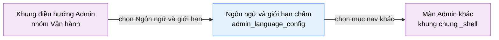

# Tài liệu thiết kế cơ bản (BD) — Ngôn ngữ và giới hạn chấm (`ADM0501`)

## Phương châm tài liệu [Nội bộ — không cần khách duyệt]

- Viết theo **mẫu 9 sheet**. Bộ thẻ đóng, quy ước ID, ký hiệu chuẩn, ranh giới với tài liệu khác và
  checklist kiểm toán nằm ở `02-bd/_rules/bd-template-9sheet.md` — file này không chép lại.
- Phần gắn nhãn `[Nội bộ]` phục vụ sinh mã và tự kiểm toán, không phải yêu cầu của khách hàng: mục 4.5, mục
  7.3 và các ghi chú quy ước.
- Mã màn `ADM0501` theo bảng mã ở `02-bd/_rules/bd-template-9sheet.md` mục 8; tên file mang tiền tố mã.
- Màn này **không có màn con và không có popup** trong prototype. Hộp xác nhận khi tắt một ngôn ngữ và khi
  rời màn lúc còn thay đổi chưa lưu là điểm mở, xem Câu hỏi mở Q5 và Q6.

> Đọc cùng `01-rd/screens/admin/ADM0501_language_config.md` (hành vi ở mức yêu cầu, không lặp lại ở đây), khung
> chung Admin ở `02-bd/screens/admin/_shell.md` (sidebar, toolbar, nền — không mô tả lại), và ba file BD
> module: `02-bd/database/judge-orchestration.md`, `02-bd/security/judge-orchestration.md`,
> `02-bd/architecture/harness.md`.
>
> **Không thiết kế** chức năng "Thêm ngôn ngữ": hệ thống khoá cứng đúng ba ngôn ngữ Java, C++, Python
> [Nguồn: 02-bd/architecture/harness.md:13-16].
> **Không thiết kế** liên kết "chấm lại" trong thẻ "Lưu ý khi đổi giới hạn" của prototype — tính năng chấm
> lại đã bị loại khỏi phạm vi theo `DEC-2026-0828-remove-rejudge-scope`
> [Nguồn: 01-rd/screens/admin/ADM0501_language_config.md:39-41].

---

## Sheet 1. Bìa

| Mục | Giá trị |
| :--- | :--- |
| Hệ thống | AlgoPrep |
| Phân hệ | `judge-orchestration` (F4) + `problem-bank` (F2) |
| Công đoạn | BD — Thiết kế cơ bản |
| Phân loại | Màn hình |
| Tên màn | Ngôn ngữ và giới hạn chấm |
| Mã màn hình | `ADM0501` |
| Tên vật lý (slug) | `admin_language_config` |
| Trục tài liệu | Màn hình (`02-bd/screens/`) |
| Actor | A3 (`ADMIN`) |
| Phiên bản | V0.3 |
| Người tạo | Nhóm phát triển AlgoPrep |
| Ngày tạo | 2026/09/15 |
| Người cập nhật | Nhóm phát triển AlgoPrep |
| Ngày cập nhật | 2026/10/03 |

---

## Sheet 2. Lịch sử sửa đổi

| Ver | Sheet bị sửa | Nội dung sửa | Ngày | Người sửa |
| :--- | :--- | :--- | :--- | :--- |
| V0.1 | Toàn bộ | Tạo mới theo cấu trúc 8 mục văn xuôi (bối cảnh, layout regions, component inventory, screen states, API tiêu thụ, navigation và access rights, câu hỏi mở, tham chiếu) | 2026/09/15 | Nhóm phát triển AlgoPrep |
| V0.2 | Toàn bộ | Chuyển sang mẫu 9 sheet. Chốt công thức của hai cột dẫn xuất "Giới hạn TG" và "Bộ nhớ", chốt nguồn của các nhãn tĩnh, hạ 4 giá trị "Giới hạn mặc định" về hiển thị chỉ đọc đọc từ `application.yml` ở đợt này, bổ sung Sheet 8 danh sách sự kiện và Sheet 9 đặc tả kiểm tra, giữ nguyên toàn bộ câu hỏi mở của V0.1 và phát sinh thêm câu hỏi về hệ số bộ nhớ | 2026/09/20 | Nhóm phát triển AlgoPrep |
| V0.3 | Sheet 8, 9 | Áp `DEC-2026-1003-toast-feedback-channel`: kết quả thao tác và lỗi nhập liệu ghi là toast dùng chung, ô sai chỉ đổi viền đỏ. | 2026/10/03 | AI |

---

## Sheet 3. Sơ đồ chuyển màn

> [Nội bộ] Quy ước vẽ: bố trí từ trái sang phải. Màn gọi tới tô tím, màn hiện tại tô xanh nhạt. Màn này
> không có popup nên không dùng màu vàng. Màu và `[Nguồn:]` dùng để truy vết, không phải yêu cầu của khách.

### 3.1 Danh sách chuyển màn

#### Khung điều hướng Admin → Ngôn ngữ và giới hạn chấm

[Điều kiện mở] Chọn mục con "Ngôn ngữ và giới hạn" trong nhóm "Vận hành" ở thanh điều hướng bên trái.

[Chế độ mở] Chế độ xem và sửa. Không có chế độ chỉ xem riêng — người dùng không có Function
`LANGUAGE_CONFIG` thì bị chặn ngay ở bước vào màn, xem Sheet 9 NO 1.

[Thông tin truyền] Không có.

[Giá trị trả về] Không có.

[Khi thành công] Tải cấu hình của đúng ba ngôn ngữ, bộ giới hạn mặc định và ba tham số sandbox, hiển thị ở
trạng thái chưa có thay đổi; nút "Lưu thay đổi" không kích hoạt.

[Khi huỷ] Không có.

#### Ngôn ngữ và giới hạn chấm → Màn Admin khác

[Điều kiện mở] Chọn một mục khác trên thanh điều hướng bên trái, hoặc bấm một liên kết ở chân trang của
khung chung Admin.

[Chế độ mở] Không có.

[Thông tin truyền] Không có.

[Giá trị trả về] Không có.

[Khi thành công] Rời màn hiện tại. Các thay đổi chưa lưu **không** được mang theo — có hỏi xác nhận trước
khi rời màn hay không là điểm mở, xem Câu hỏi mở Q6.

[Khi huỷ] Không có.

### 3.2 Sơ đồ

[Nguồn: 09-layoutBase/Admin - Ngôn ngữ và giới hạn.dc.html:310; 02-bd/screens/admin/_shell.md:19-21;
01-rd/screens/admin/ADM0501_language_config.md:12-13]

---

## Sheet 4. Bố cục màn hình

### 4.1 Tổng quan màn

[Mục đích màn] Cho quản trị viên cấu hình ba ngôn ngữ nộp bài đã khoá cứng — hệ số nhân thời gian theo ngôn
ngữ (F2-10), bật hoặc tắt từng ngôn ngữ, và ba tham số sandbox của go-judge (F4-11) — để hệ thống chấm đúng
năng lực hạ tầng thật [Nguồn: 01-rd/screens/admin/ADM0501_language_config.md:12-13].

[Luồng nghiệp vụ chính]

1. **Hiển thị ban đầu**: vào màn, hệ thống tải ba dòng cấu hình ngôn ngữ, bộ giới hạn mặc định và ba tham số
   sandbox. Trong lúc chờ, mỗi khối hiển thị khung chờ đúng số dòng dự kiến. Nút "Lưu thay đổi" không kích
   hoạt khi chưa có thay đổi nào.
2. **Sửa hệ số thời gian**: quản trị viên nhập hệ số mới cho một ngôn ngữ. Hai cột "Giới hạn TG" và "Bộ nhớ"
   tính lại ngay tại chỗ vì là giá trị dẫn xuất, không phải trường nhập riêng.
3. **Bật hoặc tắt một ngôn ngữ**: bấm công tắc trên dòng ngôn ngữ đó. Ngôn ngữ đã tắt không còn chọn được ở
   màn `problem_detail` cho lượt nộp mới; lượt nộp cũ giữ nguyên kết quả
   [Nguồn: 01-rd/screens/admin/ADM0501_language_config.md:44-46].
4. **Bật hoặc tắt tham số sandbox**: bấm công tắc trên một trong ba dòng sandbox.
5. **Lưu**: bấm "Lưu thay đổi", hệ thống ghi toàn bộ thay đổi trong một lần. Cấu hình mới **chỉ áp dụng cho
   lượt nộp từ thời điểm lưu trở đi**, không có luồng chấm lại để đồng bộ lượt nộp cũ
   [Nguồn: 01-rd/screens/admin/ADM0501_language_config.md:39-41].

[Người dùng] Quản trị viên đã đăng nhập, có Function `LANGUAGE_CONFIG`
[Nguồn: 02-bd/security/judge-orchestration.md:75-79].

[Tệp liên quan] Không có. Màn này không xuất hay nhập tệp.

[Phạm vi]
- **Đúng ba ngôn ngữ nộp bài: Java, C++, Python** — khoá ở `CLAUDE.md` mục "Locked stack". Màn này **không
  thêm và không xoá ngôn ngữ**, chỉ sửa giá trị của ba dòng đã seed sẵn
  [Nguồn: 02-bd/database/judge-orchestration.md:92-93]. Chức năng "Thêm ngôn ngữ" đã bị loại khỏi giao diện
  Admin từ 2026-08-24 [Nguồn: 02-bd/architecture/harness.md:13-16].
- **Phân biệt hai nơi đặt giới hạn thời gian và bộ nhớ**, tránh trùng với màn quản lý bài tập:
  - **Theo từng bài** (`problem-bank`, F2): `problems.time_limit_ms`, `problems.memory_limit_mb`,
    `problems.max_output_size_kb` — do A2 khai khi biên soạn bài, thuộc màn `SHR0202_problem_authoring`,
    **không sửa ở màn này** [Nguồn: 02-bd/database/problem-bank.md:21-23].
  - **Mặc định toàn hệ thống** (F4-11): dùng khi một bài toán không khai riêng, thuộc màn này
    [Nguồn: DEC-2026-0831-problem-authoring-round2 — `DEC-2026-0831-problem-authoring-round2`, Q7(e)].
    Ở đợt này 4 giá trị mặc định chỉ **hiển thị chỉ đọc** vì prototype không có control sửa và chưa có bảng
    lưu nào được chốt, xem Câu hỏi mở Q2.
  - **Theo từng ngôn ngữ** (F4-11): hệ số nhân `time_limit_multiplier` và `memory_limit_multiplier` áp lên
    giá trị của bài, thuộc màn này [Nguồn: 02-bd/database/judge-orchestration.md:98-99].
- Không sửa hệ số bộ nhớ `memory_limit_multiplier` qua giao diện ở đợt này — prototype không có cột tương
  ứng, xem Câu hỏi mở Q7.
- Không thiết kế lại sidebar, toolbar và chân trang — dùng lại khung chung
  [Nguồn: 02-bd/screens/admin/_shell.md:19-21].

[Quyền sử dụng]
- Xem: được, khi có Function `LANGUAGE_CONFIG`.
- Thêm: không. Ba dòng ngôn ngữ seed sẵn, không tạo dòng mới.
- Sửa: được.
- Xoá: không.

[Số bản ghi tối đa] Bảng ngôn ngữ: đúng 3 dòng. Giới hạn mặc định: 4 dòng. Sandbox: 3 dòng. Không phân trang.

[Nguồn: 01-rd/screens/admin/ADM0501_language_config.md:12-13,23-30,39-46;
02-bd/database/judge-orchestration.md:90-103; 02-bd/security/judge-orchestration.md:75-79]

### 4.2 DTO liên quan

- `LanguageConfigDto`
- `GradingDefaultsDto`
- `SandboxConfigDto`

`[Suy luận]` — tên DTO do BD này đề xuất, `03-dd/api/judge-orchestration.md` chốt lại.

### 4.3 Bảng dữ liệu liên quan (1)

| NO | Bảng | Ghi chú |
| --: | :--- | :--- |
| 1 | `judge.language_configs` | [Nguồn: 02-bd/database/judge-orchestration.md:90-103] |

Bốn giá trị "Giới hạn mặc định" **không dùng bảng PostgreSQL ở đợt này**: đọc từ `application.yml` phía
backend và hiển thị chỉ đọc, đúng nguyên tắc "trường chỉ-đọc lấy nguồn rẻ nhất, không thêm cột kèm
migration" [Nguồn: 02-bd/_rules/bd-template-9sheet.md:88-90]. Khi có yêu cầu sửa thật thì mới chốt nơi lưu,
xem Câu hỏi mở Q2.

### 4.4 Vùng bố cục

Đối chiếu `09-layoutBase/Admin - Ngôn ngữ và giới hạn.dc.html` — bằng chứng bố cục chỉ-đọc, **không phải**
design system cuối cùng.

| Vùng | Vị trí trong prototype | Nội dung |
| :--- | :--- | :--- |
| Thanh điều hướng bên trái (khung chung Admin) | `:68-144` | Nhóm "Vận hành" đang mở, mục con "Ngôn ngữ và giới hạn" đang chọn — dùng lại khung chung của mọi màn Admin |
| Thanh tiêu đề dính trên | `:148-159` | Tiêu đề "Ngôn ngữ và giới hạn chấm", mô tả phụ, công tắc theme (khung chung), nút "Lưu thay đổi" |
| Cột trái — "Ngôn ngữ được hỗ trợ" | `:163-203` | Bảng 6 cột, đúng 3 dòng ngôn ngữ, công tắc bật hoặc tắt ở cột cuối |
| Cột phải — "Giới hạn mặc định" | `:206-220` | 4 dòng nhãn kèm giá trị, áp dụng khi bài toán không khai riêng |
| Cột phải — "Sandbox" | `:222-237` | 3 công tắc tham số sandbox go-judge |
| Cột phải — "Lưu ý khi đổi giới hạn" | `:239-242` | Đoạn văn tĩnh, không có input |
| Chân trang (khung chung Admin) | `:246-259` | Phiên bản, trạng thái dịch vụ, liên kết phụ — dùng lại khung chung |

Bố cục hai cột `minmax(0, 1.65fr) minmax(290px, 1fr)` (`:161`): cột trái chứa bảng ngôn ngữ có
`min-width: 720px` và tràn ngang khi hẹp (`overflow-x: auto`, `:163,170`), cột phải chứa ba thẻ cấu hình
ngắn xếp dọc. Giữ nguyên cấu trúc này khi dựng Next.js; không quy định màu sắc, khoảng cách hay typography ở
BD. Ngưỡng breakpoint cụ thể chưa có nguồn, xem Câu hỏi mở Q8.

### 4.5 Cấu trúc slice FSD [Nội bộ]

| Khối | Slice dự kiến | Căn cứ |
| :--- | :--- | :--- |
| Trang | `views/admin/language-config` | Quy ước FSD của dự án |
| Khung Admin | Dùng lại `widgets/app-shell` | `02-bd/screens/admin/_shell.md:19-21` |
| Bảng ngôn ngữ | `views/admin/language-config` (UI ở `ui/`, dữ liệu ở `api/` + `model/` của view; chỉ tách widget khi màn thứ hai cần) | Prototype `:163-203` |
| Giới hạn mặc định | `widgets/grading-defaults-card` | Prototype `:206-220` |
| Sandbox | `features/sandbox-config` | Prototype `:222-237` |
| Lưu thay đổi | `features/language-config-save` | Prototype `:158` |

`[Suy luận]` — ánh xạ slice do BD đề xuất, DD màn hình chốt lại.

> [Nội bộ] Ảnh minh hoạ đặt ở `08-diagram/02-bd/screens/admin/`, chụp bằng Playwright trên ứng dụng Next.js
> thật khi đã có mã chạy được. Chưa có thì tham chiếu prototype, không vẽ tay.

---

## Sheet 5. Danh sách item màn hình

> Quy ước ID, bộ thẻ và giá trị chuẩn: `02-bd/_rules/bd-template-9sheet.md` mục 2, 3, 4.

### Khu vực A — Thanh tiêu đề

| Khu vực | NO | Tên item | ID item | Bảng DB | Cột DB | Loại UI | Kiểu | Độ dài | Bắt buộc | I/O | Giá trị mặc định | Định dạng | Ghi chú |
| :--- | --: | :--- | :--- | :--- | :--- | :--- | :--- | :--- | :-: | :-: | :--- | :--- | :--- |
| Thanh tiêu đề | | | | | | | | | | | | | |
| | 1 | Tiêu đề màn | `adminLanguageConfig.header.title` | - | - | Label | String | - | - | O | Ngôn ngữ và giới hạn chấm | - | Tên màn hiển thị cố định [Nguồn giá trị] Nhãn tĩnh i18n [EVT liên quan] - |
| | 2 | Mô tả phụ | `adminLanguageConfig.header.subtitle` | - | - | Label | String | - | - | O | Hệ số thời gian theo ngôn ngữ áp dụng cho mọi bài toán | - | Mô tả ngắn phạm vi màn [Nguồn giá trị] Nhãn tĩnh i18n [EVT liên quan] - |
| | 3 | Lưu thay đổi | `adminLanguageConfig.header.btnSave` | - | - | Button | - | - | - | I | - | - | Ghi toàn bộ thay đổi đang biên soạn xuống máy chủ [Nguồn giá trị] - [EVT liên quan] EVT-5 |

### Khu vực B — Ngôn ngữ được hỗ trợ

| Khu vực | NO | Tên item | ID item | Bảng DB | Cột DB | Loại UI | Kiểu | Độ dài | Bắt buộc | I/O | Giá trị mặc định | Định dạng | Ghi chú |
| :--- | --: | :--- | :--- | :--- | :--- | :--- | :--- | :--- | :-: | :-: | :--- | :--- | :--- |
| Ngôn ngữ được hỗ trợ | | | | | | | | | | | | | |
| | 1 | Danh sách ngôn ngữ | `adminLanguageConfig.language.list` | `judge.language_configs` | - | List | List | - | - | I/O | 3 dòng | - | Đúng 3 dòng cố định: Python 3, C++ 17, Java 21. Không thêm, không xoá dòng [Nguồn giá trị] Kết quả gọi `GetLanguageConfigs`, mỗi dòng một giá trị `language` [EVT liên quan] EVT-1 |
| | 2 | Tên ngôn ngữ | `adminLanguageConfig.language.col.name` | `judge.language_configs` | `language` | ListColumn | Enum | - | - | O | - | Nhãn tiếng Việt kèm chip 2 ký tự | Tên ngôn ngữ kèm chip viết tắt [Nguồn giá trị] `PYTHON` thành "Python 3" và chip "PY"; `CPP` thành "C++ 17" và chip "C+"; `JAVA` thành "Java 21" và chip "JV" — nhãn tĩnh i18n map từ enum `language` [EVT liên quan] - |
| | 3 | Mã môi trường chấm | `adminLanguageConfig.language.col.judgeEnvId` | - | - | ListColumn | String | 20 | - | O | - | `go-judge #{số}` | Mã định danh môi trường chấm của ngôn ngữ, hiển thị dưới tên [Nguồn giá trị] **Nhãn tĩnh i18n** map từ `language` ở đợt này — không có cột tương ứng trong `judge.language_configs`. Có phải mã ảnh sandbox thật hay không còn mở, xem Q3 [EVT liên quan] - |
| | 4 | Trình biên dịch | `adminLanguageConfig.language.col.compiler` | - | - | ListColumn | String | 50 | - | O | - | - | Tên và phiên bản trình biên dịch hoặc trình thông dịch [Nguồn giá trị] **`application.yml` phía backend**, hiển thị chỉ đọc. Prototype ghi CPython 3.11.6, GCC 13.2, OpenJDK 21.0.2. Không thêm cột DB [EVT liên quan] - |
| | 5 | Hệ số thời gian | `adminLanguageConfig.language.col.timeMultiplier` | `judge.language_configs` | `time_limit_multiplier` | NumberBox | Number | 4 | Có | I/O | Giá trị đang lưu | `x{số},{số}` | Hệ số nhân với `problems.time_limit_ms` của từng bài (F2-10) [Nguồn giá trị] Cột `time_limit_multiplier`, kiểu `DECIMAL(3,2)` [EVT liên quan] EVT-2 |
| | 6 | Giới hạn thời gian | `adminLanguageConfig.language.col.timeLimit` | - | - | ListColumn | Number | 8 | - | O | - | `{số} ms` | Giới hạn thời gian hiệu dụng của ngôn ngữ, chỉ đọc [Công thức] Giới hạn thời gian mặc định toàn hệ thống nhân `time_limit_multiplier`. Kiểm chứng trên prototype: 1.000 ms × 3,0 = 3.000 ms cho Python, × 1,0 = 1.000 ms cho C++, × 2,0 = 2.000 ms cho Java [EVT liên quan] EVT-2 |
| | 7 | Giới hạn bộ nhớ | `adminLanguageConfig.language.col.memoryLimit` | - | - | ListColumn | Number | 8 | - | O | - | `{số} MB` | Giới hạn bộ nhớ hiệu dụng của ngôn ngữ, chỉ đọc [Công thức] Giới hạn bộ nhớ mặc định toàn hệ thống nhân `memory_limit_multiplier`. Prototype hiển thị 256 MB cho Python và C++, 512 MB cho Java — ứng với hệ số 1,0 và 2,0, lệch với mặc định `1.00` cho cả ba ở BD database, xem Q7 [EVT liên quan] - |
| | 8 | Công tắc bật ngôn ngữ | `adminLanguageConfig.language.col.enabled` | - | - | Toggle | Boolean | - | - | I/O | Bật | Bật / Tắt | Ngôn ngữ có được chọn ở màn giải bài cho lượt nộp mới hay không [Nguồn giá trị] **Chưa có cột tương ứng** trong `judge.language_configs` — cần một cột `enabled`, xem Q1. Prototype mặc định bật cả ba [EVT liên quan] EVT-3 |

### Khu vực C — Giới hạn mặc định

| Khu vực | NO | Tên item | ID item | Bảng DB | Cột DB | Loại UI | Kiểu | Độ dài | Bắt buộc | I/O | Giá trị mặc định | Định dạng | Ghi chú |
| :--- | --: | :--- | :--- | :--- | :--- | :--- | :--- | :--- | :-: | :-: | :--- | :--- | :--- |
| Giới hạn mặc định | | | | | | | | | | | | | |
| | 1 | Danh sách giới hạn mặc định | `adminLanguageConfig.defaults.list` | - | - | List | List | - | - | O | 4 dòng | - | 4 giới hạn áp dụng khi bài toán không khai báo riêng: giới hạn thời gian, giới hạn bộ nhớ, kích thước output, thời gian biên dịch [Nguồn giá trị] `application.yml` phía backend, trả kèm trong phản hồi của `GetLanguageConfigs`. Hiển thị chỉ đọc ở đợt này, xem Q2 [EVT liên quan] EVT-1 |
| | 2 | Tên giới hạn | `adminLanguageConfig.defaults.col.label` | - | - | ListColumn | String | - | - | O | - | - | Tên giới hạn hiển thị cho người dùng [Nguồn giá trị] Nhãn tĩnh i18n map từ mã giới hạn [EVT liên quan] - |
| | 3 | Mô tả giới hạn | `adminLanguageConfig.defaults.col.meta` | - | - | ListColumn | String | - | - | O | - | - | Câu giải thích cách áp dụng giới hạn. Prototype ghi "Nhân với hệ số ngôn ngữ", "Áp dụng cho mọi ngôn ngữ", "Vượt quá sẽ báo Output limit", "Không tính vào giới hạn chạy" [Nguồn giá trị] Nhãn tĩnh i18n map từ mã giới hạn [EVT liên quan] - |
| | 4 | Giá trị giới hạn | `adminLanguageConfig.defaults.col.value` | - | - | Label | Number | 8 | - | O | - | Số nguyên kèm đơn vị | Giá trị mặc định toàn hệ thống. Prototype hiển thị 1.000 ms, 256 MB, 64 KB, 10 s [Nguồn giá trị] `application.yml` phía backend. **Chỉ đọc ở đợt này** — prototype không có control sửa, chưa có bảng lưu nào được chốt, xem Q2 [EVT liên quan] - |

### Khu vực D — Sandbox

| Khu vực | NO | Tên item | ID item | Bảng DB | Cột DB | Loại UI | Kiểu | Độ dài | Bắt buộc | I/O | Giá trị mặc định | Định dạng | Ghi chú |
| :--- | --: | :--- | :--- | :--- | :--- | :--- | :--- | :--- | :-: | :-: | :--- | :--- | :--- |
| Sandbox | | | | | | | | | | | | | |
| | 1 | Danh sách tham số sandbox | `adminLanguageConfig.sandbox.list` | `judge.language_configs` | - | List | List | - | - | I/O | 3 dòng | - | Đúng 3 tham số sandbox go-judge theo F4-11: truy cập mạng, giới hạn tiến trình con, trả stderr cho người học [Nguồn giá trị] Ba cột `network_access_enabled`, `max_child_processes`, `return_stderr_to_student`. Ba cột này là **per-language** trong schema nhưng prototype chỉ có một bộ chung cho cả ba ngôn ngữ, xem Q4 [EVT liên quan] EVT-1 |
| | 2 | Tên tham số | `adminLanguageConfig.sandbox.col.title` | - | - | ListColumn | String | - | - | O | - | - | Tên tham số hiển thị cho người dùng [Nguồn giá trị] Nhãn tĩnh i18n map từ mã tham số [EVT liên quan] - |
| | 3 | Mô tả tham số | `adminLanguageConfig.sandbox.col.meta` | - | - | ListColumn | String | - | - | O | - | - | Câu giải thích tác dụng của tham số. Prototype ghi "Luôn tắt trong sandbox chấm bài", "Tối đa 60 tiến trình", "Cắt còn 2 KB đầu" [Nguồn giá trị] Nhãn tĩnh i18n map từ mã tham số; ghi chú "Tắt trong mọi kỳ thi" của bản mẫu cũ đã bị bỏ vì không có khái niệm kỳ thi trong hệ thống [Nguồn: 01-rd/req/judge-orchestration.md:67-70] [EVT liên quan] - |
| | 4 | Công tắc tham số | `adminLanguageConfig.sandbox.col.toggle` | `judge.language_configs` | `network_access_enabled`, `return_stderr_to_student` | Toggle | Boolean | - | - | I/O | Tắt / Bật / Bật | Trạng thái áp dụng của tham số [Nguồn giá trị] Hai cột kiểu BOOLEAN nêu trên. Riêng "Giới hạn tiến trình con" ánh xạ cột `max_child_processes` kiểu INT nhưng prototype chỉ vẽ công tắc bật hoặc tắt, không có ô nhập số, xem Q4 [EVT liên quan] EVT-4 |

### Khu vực E — Lưu ý khi đổi giới hạn

| Khu vực | NO | Tên item | ID item | Bảng DB | Cột DB | Loại UI | Kiểu | Độ dài | Bắt buộc | I/O | Giá trị mặc định | Định dạng | Ghi chú |
| :--- | --: | :--- | :--- | :--- | :--- | :--- | :--- | :--- | :-: | :-: | :--- | :--- | :--- |
| Lưu ý khi đổi giới hạn | | | | | | | | | | | | | |
| | 1 | Nội dung lưu ý | `adminLanguageConfig.notice.body` | - | - | Label | String | - | - | O | Thay đổi hệ số hoặc giới hạn tài nguyên chỉ áp dụng cho các lượt nộp mới kể từ thời điểm lưu. Các lượt nộp trước đó giữ nguyên kết quả đã chấm. | - | Đoạn văn tĩnh, không có input. **Bỏ liên kết "chấm lại"** của prototype vì tính năng đã bị loại khỏi phạm vi (`DEC-2026-0828-remove-rejudge-scope`) [Nguồn giá trị] Nhãn tĩnh i18n [EVT liên quan] - |

[Nguồn: 09-layoutBase/Admin - Ngôn ngữ và giới hạn.dc.html:150-151,158,166-167,190-198,392-395,402-405,
416-421,424-428; 02-bd/database/judge-orchestration.md:95-103;
01-rd/screens/admin/ADM0501_language_config.md:23-30,39-41]

---

## Sheet 6. Đặc tả điều khiển item

> Ký hiệu cột `Hiển thị` và thứ tự thẻ: `02-bd/_rules/bd-template-9sheet.md` mục 2, 3. Dùng đúng NO, tên
> item và thứ tự của Sheet 5. Lỗi nhập liệu ghi ở Sheet 9, xử lý nghiệp vụ ghi ở Sheet 8.

### Khu vực A — Thanh tiêu đề

| Khu vực | NO | Tên item | Hiển thị | Ghi chú |
| :--- | --: | :--- | :-: | :--- |
| Thanh tiêu đề | | | | |
| | 1 | Tiêu đề màn | Có | - |
| | 2 | Mô tả phụ | Có | - |
| | 3 | Lưu thay đổi | Có | [Điều kiện kích hoạt] Kích hoạt khi có ít nhất một thay đổi chưa lưu **và** mọi ô hệ số thời gian đều hợp lệ theo Sheet 9. Các trường hợp khác không kích hoạt. |

### Khu vực B — Ngôn ngữ được hỗ trợ

| Khu vực | NO | Tên item | Hiển thị | Ghi chú |
| :--- | --: | :--- | :-: | :--- |
| Ngôn ngữ được hỗ trợ | | | | |
| | 1 | Danh sách ngôn ngữ | Có | [Điều kiện hiển thị] Trong lúc tải hiển thị khung chờ đúng 3 dòng. Danh sách luôn có đúng 3 dòng nên không có trạng thái rỗng. |
| | 2 | Tên ngôn ngữ | Có | - |
| | 3 | Mã môi trường chấm | Có | - |
| | 4 | Trình biên dịch | Có | - |
| | 5 | Hệ số thời gian | Có | [Điều kiện kích hoạt] Kích hoạt sau khi tải xong dữ liệu; không kích hoạt trong lúc đang lưu. [Tự động đặt] Sau khi sửa, dòng được đánh dấu là thay đổi chưa lưu và nút "Lưu thay đổi" kích hoạt. |
| | 6 | Giới hạn thời gian | Có | [Tự động đặt] Tính lại ngay sau mỗi lần hệ số thời gian của dòng đó thay đổi. |
| | 7 | Giới hạn bộ nhớ | Có | [Tự động đặt] Tính lại khi giới hạn bộ nhớ mặc định hoặc hệ số bộ nhớ thay đổi; ở đợt này cả hai đều chỉ đọc nên giá trị cố định trong một phiên. |
| | 8 | Công tắc bật ngôn ngữ | Có | [Điều kiện kích hoạt] Kích hoạt sau khi tải xong dữ liệu. Không kích hoạt ở trạng thái "Tắt" khi đây là ngôn ngữ duy nhất còn bật, theo kiểm nghiệp vụ Sheet 9 NO 6. [Tự động đặt] Sau khi đổi, dòng được đánh dấu là thay đổi chưa lưu và nút "Lưu thay đổi" kích hoạt. |

### Khu vực C — Giới hạn mặc định

| Khu vực | NO | Tên item | Hiển thị | Ghi chú |
| :--- | --: | :--- | :-: | :--- |
| Giới hạn mặc định | | | | |
| | 1 | Danh sách giới hạn mặc định | Có | [Điều kiện hiển thị] Trong lúc tải hiển thị khung chờ đúng 4 dòng. |
| | 2 | Tên giới hạn | Có | - |
| | 3 | Mô tả giới hạn | Có | - |
| | 4 | Giá trị giới hạn | Có | [Điều kiện kích hoạt] Không kích hoạt — chỉ đọc ở đợt này. Khi Q2 được chốt thành có sửa, mục này đổi sang `NumberBox` và áp kiểm Sheet 9 NO 4, NO 5. |

### Khu vực D — Sandbox

| Khu vực | NO | Tên item | Hiển thị | Ghi chú |
| :--- | --: | :--- | :-: | :--- |
| Sandbox | | | | |
| | 1 | Danh sách tham số sandbox | Có | [Điều kiện hiển thị] Trong lúc tải hiển thị khung chờ đúng 3 dòng. |
| | 2 | Tên tham số | Có | - |
| | 3 | Mô tả tham số | Có | - |
| | 4 | Công tắc tham số | Có | [Điều kiện kích hoạt] Kích hoạt sau khi tải xong dữ liệu; không kích hoạt trong lúc đang lưu. [Tự động đặt] Sau khi đổi, dòng được đánh dấu là thay đổi chưa lưu và nút "Lưu thay đổi" kích hoạt. |

### Khu vực E — Lưu ý khi đổi giới hạn

| Khu vực | NO | Tên item | Hiển thị | Ghi chú |
| :--- | --: | :--- | :-: | :--- |
| Lưu ý khi đổi giới hạn | | | | |
| | 1 | Nội dung lưu ý | Có | - |

[Nguồn: 09-layoutBase/Admin - Ngôn ngữ và giới hạn.dc.html:194-198,216,231-233,268-271;
01-rd/screens/admin/ADM0501_language_config.md:39-41]

---

## Sheet 7. Danh sách truyền dữ liệu

### 7.1 Trường DTO

| NO | DTO | Trường DTO | Kiểu | Bảng DB | Cột DB | Item màn | Hiển thị | Ghi chú |
| --: | :--- | :--- | :--- | :--- | :--- | :--- | :-: | :--- |
| 1 | `LanguageConfigDto` | `language` | Enum | `judge.language_configs` | `language` | Ngôn ngữ "Tên ngôn ngữ" | Có | [Nguồn] Phản hồi của `GetLanguageConfigs` [Đích] Khoá định danh dòng khi gọi `UpdateLanguageConfigs` [Chuyển đổi] `JAVA` / `CPP` / `PYTHON` đổi sang "Java 21" / "C++ 17" / "Python 3"; cũng là khoá tra chip viết tắt, mã môi trường chấm và tên trình biên dịch. |
| 2 | `LanguageConfigDto` | `timeLimitMultiplier` | Number | `judge.language_configs` | `time_limit_multiplier` | Ngôn ngữ "Hệ số thời gian" | Có | [Nguồn] Giá trị người dùng nhập [Đích] Tham số của `UpdateLanguageConfigs` [Chuyển đổi] Hiển thị dạng `x3,0` dùng dấu phẩy thập phân; gửi lên dạng số thập phân thuần, không kèm tiền tố `x`. |
| 3 | `LanguageConfigDto` | `memoryLimitMultiplier` | Number | `judge.language_configs` | `memory_limit_multiplier` | Ngôn ngữ "Giới hạn bộ nhớ" | Có | [Nguồn] Phản hồi của `GetLanguageConfigs` [Đích] Chỉ dùng để tính cột hiển thị, **không có đường ghi ngược** ở đợt này. Xem Q7. |
| 4 | `LanguageConfigDto` | `enabled` | Boolean | - | - | Ngôn ngữ "Công tắc bật ngôn ngữ" | Có | [Nguồn] Trạng thái công tắc người dùng đặt [Đích] Tham số của `UpdateLanguageConfigs`. Chưa có cột DB tương ứng, xem Q1. |
| 5 | `LanguageConfigDto` | `updatedAt` | Date | `judge.language_configs` | `updated_at` | - | Không | [Nguồn] Phản hồi của `GetLanguageConfigs` [Đích] Gửi lại khi lưu để máy chủ phát hiện xung đột phiên bản, xem Sheet 9 NO 7. |
| 6 | `GradingDefaultsDto` | `defaultTimeLimitMs` | Number | - | - | Giới hạn mặc định "Giá trị giới hạn" dòng 1 | Có | [Nguồn] `application.yml` phía backend, trả kèm trong phản hồi của `GetLanguageConfigs` [Đích] Chỉ hiển thị và làm thừa số cho cột "Giới hạn thời gian". |
| 7 | `GradingDefaultsDto` | `defaultMemoryLimitMb` | Number | - | - | Giới hạn mặc định "Giá trị giới hạn" dòng 2 | Có | [Nguồn] `application.yml` [Đích] Chỉ hiển thị và làm thừa số cho cột "Giới hạn bộ nhớ". |
| 8 | `GradingDefaultsDto` | `defaultMaxOutputSizeKb` | Number | - | - | Giới hạn mặc định "Giá trị giới hạn" dòng 3 | Có | [Nguồn] `application.yml` [Đích] Chỉ hiển thị. Khác `problems.max_output_size_kb` khai theo từng bài [Nguồn: 02-bd/database/problem-bank.md:23]. |
| 9 | `GradingDefaultsDto` | `compileTimeoutSeconds` | Number | - | - | Giới hạn mặc định "Giá trị giới hạn" dòng 4 | Có | [Nguồn] `application.yml` [Đích] Chỉ hiển thị. Không tính vào giới hạn chạy. |
| 10 | `SandboxConfigDto` | `networkAccessEnabled` | Boolean | `judge.language_configs` | `network_access_enabled` | Sandbox "Công tắc tham số" dòng 1 | Có | [Nguồn] Trạng thái công tắc người dùng đặt [Đích] Tham số của `UpdateLanguageConfigs`. Mặc định `false` ở tầng DB. |
| 11 | `SandboxConfigDto` | `maxChildProcesses` | Number | `judge.language_configs` | `max_child_processes` | Sandbox "Công tắc tham số" dòng 2 | Có | [Nguồn] Trạng thái công tắc người dùng đặt [Chuyển đổi] Công tắc bật thành một giá trị số hữu hạn, tắt thành không giới hạn — ánh xạ chính xác chưa chốt, xem Q4. |
| 12 | `SandboxConfigDto` | `returnStderrToStudent` | Boolean | `judge.language_configs` | `return_stderr_to_student` | Sandbox "Công tắc tham số" dòng 3 | Có | [Nguồn] Trạng thái công tắc người dùng đặt [Đích] Tham số của `UpdateLanguageConfigs`. Quyết định có ghi `submission_testcase_results.stderr_snippet` hay không [Nguồn: 02-bd/database/judge-orchestration.md:55]. |

### 7.2 Truy cập bảng dữ liệu (1)

| NO | Tên logic | Bảng | Repository | CRUD | Mục đích | Ghi chú |
| --: | :--- | :--- | :--- | :-: | :--- | :--- |
| 1 | Cấu hình ngôn ngữ chấm | `judge.language_configs` | `LanguageConfigRepository` | R, U | Đọc và cập nhật hệ số thời gian, trạng thái bật, ba tham số sandbox của ba ngôn ngữ | `GetLanguageConfigs`: R `UpdateLanguageConfigs`: U |

Không có thao tác thêm (`C`) và xoá (`D`) trên màn này: ba dòng ngôn ngữ seed sẵn, A3 chỉ sửa giá trị
[Nguồn: 02-bd/database/judge-orchestration.md:92-93]. Bốn giá trị "Giới hạn mặc định" đọc từ
`application.yml`, không qua repository JPA.

`[Suy luận]` — tên repository do BD này đề xuất, DD module `judge-orchestration` chốt lại.

### 7.3 Danh sách endpoint [Nội bộ]

> Chỉ tên nghiệp vụ và BC sở hữu. Hợp đồng chi tiết thuộc `03-dd/api/judge-orchestration.md`.

| NO | Endpoint (tên nghiệp vụ) | Mục đích | BC sở hữu |
| --: | :--- | :--- | :--- |
| 1 | `GetLanguageConfigs` | Tải cấu hình ba ngôn ngữ, bộ giới hạn mặc định và ba tham số sandbox | `judge-orchestration` |
| 2 | `UpdateLanguageConfigs` | Ghi toàn bộ thay đổi hệ số, trạng thái bật và tham số sandbox trong một lần | `judge-orchestration` |

Chưa có endpoint ghi cho bốn giá trị "Giới hạn mặc định" ở đợt này — chúng chỉ đọc, xem Câu hỏi mở Q2. Màn
này không gọi endpoint nào của `problem-bank`: giới hạn theo từng bài thuộc màn `SHR0202_problem_authoring`.

[Nguồn: 02-bd/database/judge-orchestration.md:90-103; 02-bd/security/judge-orchestration.md:75-79]

---

## Sheet 8. Danh sách sự kiện

> Bộ thẻ và quy ước cột `Chuyển màn`: `02-bd/_rules/bd-template-9sheet.md` mục 2, 3.

### Màn chính: Ngôn ngữ và giới hạn chấm

| NO | Loại | Sự kiện | Chi tiết | Chuyển màn | Gọi API | Tên xử lý | Ghi chú |
| --: | :--- | :--- | :--- | :-: | :-: | :--- | :--- |
| 1 | Màn hình | Khởi tạo màn | Vào màn thì tải toàn bộ cấu hình hiện hành. | Không | Có | `GetLanguageConfigs` | [Các bước] 1. Kiểm tra quyền `LANGUAGE_CONFIG`. 2. Hiển thị khung chờ cho bảng ngôn ngữ và ba thẻ cột phải. 3. Tải cấu hình ba ngôn ngữ, giới hạn mặc định và tham số sandbox trong một lần gọi. [Khi thành công] Hiển thị đủ 3 dòng ngôn ngữ, 4 dòng giới hạn mặc định, 3 dòng sandbox; nút "Lưu thay đổi" không kích hoạt vì chưa có thay đổi. [Khi lỗi] Hiển thị thông báo lỗi tại vùng nội dung chính, giữ nguyên khung chung Admin, không rời màn. |
| 2 | Nhập liệu | Đổi hệ số thời gian | Sửa giá trị ô "Hệ số thời gian" của một dòng ngôn ngữ. | Không | Không | - | [Các bước] 1. Ghi nhận giá trị mới vào trạng thái biên soạn. 2. Tính lại cột "Giới hạn thời gian" của dòng đó. [Khi thành công] Đánh dấu có thay đổi chưa lưu và kích hoạt nút "Lưu thay đổi". [Khi lỗi] Giá trị không hợp lệ theo Sheet 9 NO 2, NO 3 thì ô đó đổi viền đỏ (từ lần bấm "Lưu thay đổi" đầu tiên), hiện một toast lỗi và không lưu [Nguồn: 05-coding/frontend/src/views/admin/language-config/ui/admin-language-config-view.tsx:90-98,155]. |
| 3 | Công tắc | Bật hoặc tắt một ngôn ngữ | Bấm công tắc ở cột "Bật" của một dòng ngôn ngữ. | Không | Không | - | [Các bước] 1. Kiểm tra sau thao tác vẫn còn ít nhất một ngôn ngữ đang bật. 2. Đảo trạng thái công tắc trong trạng thái biên soạn. [Khi xác nhận] Tắt một ngôn ngữ ảnh hưởng mọi người học đang chọn ngôn ngữ đó ở `problem_detail`, nên có thể cần hộp xác nhận — chưa chốt, xem Q5. [Khi thành công] Đánh dấu có thay đổi chưa lưu và kích hoạt nút "Lưu thay đổi". Thay đổi **chưa** có hiệu lực cho tới khi lưu. [Khi lỗi] Đây là ngôn ngữ duy nhất còn bật thì chặn thao tác và hiện toast lỗi theo Sheet 9 NO 6. |
| 4 | Công tắc | Bật hoặc tắt một tham số sandbox | Bấm công tắc trên một trong ba dòng sandbox. | Không | Không | - | [Các bước] 1. Đảo trạng thái công tắc trong trạng thái biên soạn. [Khi thành công] Đánh dấu có thay đổi chưa lưu và kích hoạt nút "Lưu thay đổi". |
| 5 | Nút | Lưu thay đổi | Bấm "Lưu thay đổi" ở thanh tiêu đề. | Không | Có | `UpdateLanguageConfigs` | [Các bước] 1. Kiểm lại toàn bộ ô hệ số thời gian theo Sheet 9 NO 2, NO 3. 2. Kiểm còn ít nhất một ngôn ngữ đang bật theo Sheet 9 NO 6. 3. Gửi toàn bộ thay đổi lên máy chủ, khoá mọi input trong lúc gửi. 4. Tải lại cấu hình từ phản hồi. [Khi thành công] Trạng thái biên soạn được xoá, nút "Lưu thay đổi" trở về không kích hoạt, hai cột dẫn xuất hiển thị theo hệ số mới. Cấu hình mới chỉ áp dụng cho lượt nộp từ thời điểm này trở đi. [Khi lỗi] Giữ nguyên toàn bộ giá trị người dùng đã nhập, **không** hoàn tác ngầm, mở khoá input và hiện toast lỗi; ô gây lỗi đổi viền đỏ. [Thông báo hoàn tất] Toast "Đã lưu cấu hình ngôn ngữ và giới hạn chấm" [Nguồn: 05-coding/frontend/src/views/admin/language-config/ui/admin-language-config-view.tsx:105]. |
| 6 | Liên kết | Rời màn khi còn thay đổi chưa lưu | Chọn một mục khác trên thanh điều hướng bên trái, hoặc bấm một liên kết ở chân trang của khung chung Admin. | Có | Không | - | [Các bước] 1. Kiểm tra còn thay đổi chưa lưu hay không. 2. Điều hướng sang đích đã chọn. [Khi xác nhận] Còn thay đổi chưa lưu thì có hỏi xác nhận trước khi rời màn hay không là điểm mở, xem Q6. [Khi thành công] Mở màn đích. Mọi thay đổi chưa lưu bị bỏ, cấu hình trên máy chủ không đổi. |

[Nguồn: 09-layoutBase/Admin - Ngôn ngữ và giới hạn.dc.html:158,191,194-198,231-233,268-271,292-294;
01-rd/screens/admin/ADM0501_language_config.md:39-46; 02-bd/screens/admin/_shell.md:19-21]

---

## Sheet 9. Đặc tả kiểm tra

> Bộ thẻ và quy ước mã thông báo: `02-bd/_rules/bd-template-9sheet.md` mục 2, 4. Sheet này ghi **điều kiện
> kiểm và thông báo**; tiêu chí nghiệm thu `AC-nn` thuộc `04-tdd/admin_language_config.md`, không lặp lại ở
> đây.

| NO | Loại | Tóm tắt kiểm | Chi tiết | Mức | Mã thông báo | Ghi chú | EVT gọi | Thứ tự |
| --: | :--- | :--- | :--- | :--- | :--- | :--- | :--- | :-: |
| 1 | Kiểm quyền | Quyền truy cập màn | [Nội dung kiểm] Người dùng không có Function `LANGUAGE_CONFIG` thì không được vào màn và không được lưu. [Nơi thực thi] Chặn ở cả tầng định tuyến phía giao diện (`ROLE_BY_AREA` cho prefix `/admin/*`) và tầng phân quyền phía máy chủ, không chỉ ẩn giao diện. | Lỗi | Chưa có mã thông báo | Nội dung "Bạn không có quyền truy cập chức năng này." Chỉ vai trò `ADMIN` [Nguồn: 02-bd/security/judge-orchestration.md:75-79]. | EVT-1, EVT-5 | 1 |
| 2 | Kiểm nhập liệu | Hệ số thời gian là số dương | [Nội dung kiểm] Hệ số thời gian phải là số lớn hơn 0, tối đa 2 chữ số thập phân. Bỏ trống, chữ, số âm hoặc 0 đều không hợp lệ. [Nơi thực thi] Màn hình và máy chủ. [Tiêu điểm] Viền ô hệ số của dòng vi phạm + toast. | Lỗi | Chưa có mã thông báo | Nội dung "Hệ số thời gian phải là số lớn hơn 0, tối đa 2 chữ số thập phân." | EVT-2, EVT-5 | 1 |
| 3 | Kiểm nhập liệu | Khoảng giá trị hệ số thời gian | [Nội dung kiểm] Hệ số thời gian nằm ngoài khoảng 0,10 đến 9,99 thì không cho lưu. [Nơi thực thi] Màn hình và máy chủ. [Tiêu điểm] Viền ô hệ số của dòng vi phạm + toast. | Lỗi | Chưa có mã thông báo | Nội dung "Hệ số thời gian phải nằm trong khoảng 0,10 đến 9,99." Cận trên đến từ kiểu cột `DECIMAL(3,2)` [Nguồn: 02-bd/database/judge-orchestration.md:98]; cận dưới `[Suy luận]` — dưới 0,10 thì giới hạn hiệu dụng của mọi bài đều rơi xuống dưới 100 ms, không bài nào chấm nổi. | EVT-2, EVT-5 | 2 |
| 4 | Kiểm nhập liệu | Khoảng giới hạn thời gian hiệu dụng | [Nội dung kiểm] Giới hạn thời gian hiệu dụng (mặc định nhân hệ số) phải là số nguyên dương trong khoảng 100 đến 30.000 ms. [Nơi thực thi] Máy chủ khi lưu. [Tiêu điểm] Viền ô hệ số của dòng làm giá trị vượt khoảng + toast. | Lỗi | Chưa có mã thông báo | Nội dung "Giới hạn thời gian sau khi nhân hệ số phải nằm trong khoảng 100 đến 30.000 ms." Kiểm ở máy chủ vì giới hạn mặc định có thể đổi độc lập với hệ số. Khoảng cụ thể `[Suy luận]` — chưa có nguồn nào chốt trần thời gian chạy một testcase; DD `judge-orchestration` chốt lại. | EVT-5 | 3 |
| 5 | Kiểm nhập liệu | Khoảng giới hạn bộ nhớ hiệu dụng | [Nội dung kiểm] Giới hạn bộ nhớ hiệu dụng (mặc định nhân hệ số bộ nhớ) phải là số nguyên dương trong khoảng 64 đến 1.024 MB. [Nơi thực thi] Máy chủ khi lưu. [Tiêu điểm] Viền ô thẻ "Giới hạn mặc định" và cột "Bộ nhớ" của dòng vi phạm + toast. | Lỗi | Chưa có mã thông báo | Nội dung "Giới hạn bộ nhớ sau khi nhân hệ số phải nằm trong khoảng 64 đến 1.024 MB." Ở đợt này cả hai thừa số đều chỉ đọc nên kiểm này không thể kích hoạt từ giao diện; giữ lại vì máy chủ vẫn phải chặn khi Q2 hoặc Q7 mở đường ghi. Khoảng cụ thể `[Suy luận]`, đối chiếu giá trị prototype 256 MB và 512 MB. | EVT-5 | 4 |
| 6 | Kiểm nghiệp vụ | Còn ít nhất một ngôn ngữ đang bật | [Nội dung kiểm] Không cho tắt ngôn ngữ cuối cùng — tắt hết ba ngôn ngữ thì không ai nộp được bài nào. [Nơi thực thi] Màn hình và máy chủ. [Tiêu điểm] Công tắc của dòng vi phạm + toast. | Lỗi | Chưa có mã thông báo | Nội dung "Phải giữ ít nhất một ngôn ngữ đang bật." `[Suy luận]` — RD không nêu ràng buộc này, nhưng hệ quả đã ghi ở RD (ngôn ngữ tắt không còn chọn được ở `problem_detail`) áp cho cả ba thì màn giải bài không còn lựa chọn nào [Nguồn: 01-rd/screens/admin/ADM0501_language_config.md:44-46]. | EVT-3, EVT-5 | 1 |
| 7 | Kiểm nghiệp vụ | Xung đột phiên bản khi lưu | [Nội dung kiểm] `updated_at` của một dòng đã đổi kể từ lúc tải màn thì dừng lưu, không ghi đè. [Nơi thực thi] Máy chủ. | Lỗi | Mã lỗi trong phản hồi | Nội dung "Cấu hình đã được người khác cập nhật. Vui lòng tải lại màn hình." Cột `updated_at` / `updated_by` có sẵn trên bảng [Nguồn: 02-bd/database/judge-orchestration.md:103]. | EVT-5 | 5 |
| 8 | Kiểm nghiệp vụ | Lỗi hệ thống hoặc lỗi gọi máy chủ | [Nội dung kiểm] Gọi máy chủ thất bại hoặc trả lỗi nghiệp vụ thì dừng thao tác, giữ nguyên dữ liệu đang hiển thị và giá trị người dùng đã nhập. [Nơi thực thi] Màn hình. | Lỗi | Mã lỗi trong phản hồi | Phản hồi có mã lỗi đã đăng ký thì hiển thị nội dung tương ứng; chưa đăng ký thì hiển thị "Không kết nối được máy chủ." | EVT-1, EVT-5 | 6 |

Cột `Thứ tự` là thứ tự kiểm trong cùng một sự kiện.

[Nguồn: 02-bd/security/judge-orchestration.md:75-79; 02-bd/database/judge-orchestration.md:98,103;
01-rd/screens/admin/ADM0501_language_config.md:44-46]

---

## Câu hỏi mở

| # | Câu hỏi | Vì sao chưa trả lời được | Chủ sở hữu |
| :-: | :--- | :--- | :--- |
| Q1 | Công tắc "Bật" của mỗi ngôn ngữ lưu ở đâu? `judge.language_configs` hiện **không có cột nào** cho trạng thái bật hoặc tắt [Nguồn: 02-bd/database/judge-orchestration.md:95-103], trong khi RD đã có Given-When-Then cho hành vi tắt một ngôn ngữ [Nguồn: 01-rd/screens/admin/ADM0501_language_config.md:44-46]. Đề xuất thêm cột `enabled` BOOLEAN default `true`. | Đây là thay đổi schema đã chốt của `judge-orchestration`, cần một `DEC-` trước khi sửa `02-bd/database/judge-orchestration.md` mục 1.5 | Chủ dự án |
| Q2 | Bốn giá trị "Giới hạn mặc định" (thời gian, bộ nhớ, kích thước output, thời gian biên dịch) có cần sửa được qua giao diện không, và nếu có thì lưu ở bảng nào? `DEC-2026-0831-problem-authoring-round2` gọi chúng là "system-wide defaults configured in `admin_language_config`/F4-11" [Nguồn: DEC-2026-0831-problem-authoring-round2], nhưng prototype chỉ vẽ nhãn chỉ đọc, không có control sửa [Nguồn: 09-layoutBase/Admin - Ngôn ngữ và giới hạn.dc.html:216]. BD này tạm chốt **chỉ đọc, đọc từ `application.yml`** theo nguyên tắc nguồn rẻ nhất. Nếu cần sửa thì đề xuất một bảng đơn dòng, ví dụ `judge.grading_defaults`. | Chưa có bảng "giá trị mặc định toàn cục" nào được chốt ở BD `judge-orchestration` lẫn `problem-bank`; thêm bảng là thay đổi schema cần `DEC-` | Chủ dự án |
| Q3 | Cột "Mã môi trường chấm" hiển thị `go-judge #71` / `#54` / `#62` [Nguồn: 09-layoutBase/Admin - Ngôn ngữ và giới hạn.dc.html:403-405] — đây là ID ảnh sandbox thật theo ngôn ngữ hay chỉ chuỗi trang trí của bản mẫu? BD này tạm coi là nhãn tĩnh. Nếu là ID thật thì cần một cột kiểu `sandbox_image_ref` trên `language_configs`; nếu không, cân nhắc thay bằng `updated_at` để cột có ích hơn. | Không có cột tương ứng ở `judge.language_configs` và không có yêu cầu nào trong RD nhắc tới khái niệm này | Chủ dự án |
| Q4 | Ba tham số sandbox là **per-language** (đã chốt ở `02-bd/database/judge-orchestration.md:100-102`, ba cột nằm trên từng dòng `language_configs`) hay **toàn cục dùng chung** (bằng chứng UI: một bộ ba công tắc phẳng, không có bộ chọn ngôn ngữ, `state.sb` không khoá theo `language` [Nguồn: 09-layoutBase/Admin - Ngôn ngữ và giới hạn.dc.html:271])? Kèm theo: "Giới hạn tiến trình con" ánh xạ cột `max_child_processes` kiểu INT nhưng UI chỉ có công tắc bật hoặc tắt, không có ô nhập số. BD này giữ nguyên đề xuất của V0.1: nghiêng về **toàn cục**, vì cgroup và namespace mà go-sandbox dựng cho một lần gọi `JudgeExecutionPort.run()` không đọc `language` để quyết định chặn mạng hay giới hạn tiến trình con — ba tham số này là thuộc tính của **lệnh chạy**, không phải của **ngôn ngữ** `[Suy luận]`. | Hai nguồn SoT mâu thuẫn nhau: schema đã chốt so với bằng chứng UI của chính màn này. Sửa schema cần `DEC-` trước khi viết DD của cả `judge-orchestration` lẫn màn này | Chủ dự án |
| Q5 | Tắt một ngôn ngữ có cần hộp xác nhận không, hay chỉ đổi công tắc rồi chờ bấm "Lưu thay đổi"? | RD chỉ mô tả hệ quả (ngôn ngữ biến mất khỏi lựa chọn ở `problem_detail` cho lượt nộp mới), không mô tả UX xác nhận [Nguồn: 01-rd/screens/admin/ADM0501_language_config.md:44-46] | Chủ dự án |
| Q6 | Rời màn khi còn thay đổi chưa lưu (chọn mục nav khác, bấm liên kết chân trang) thì có hỏi xác nhận không? | RD không có yêu cầu nào về việc này; ảnh hưởng cả điều hướng bằng sidebar lẫn liên kết của khung chung, nên phải chốt chung cho khu Admin chứ không riêng màn này | Chủ dự án |
| Q7 | Hệ số bộ nhớ `memory_limit_multiplier` lấy số nào, và có cần ô sửa trên giao diện không? Prototype hiển thị Java 512 MB trên nền mặc định 256 MB, tức hệ số 2,0 [Nguồn: 09-layoutBase/Admin - Ngôn ngữ và giới hạn.dc.html:405,418], trong khi BD database đề xuất mặc định `1.00` cho cả ba ngôn ngữ [Nguồn: 02-bd/database/judge-orchestration.md:99]. Bảng trong prototype không có cột nào cho hệ số bộ nhớ. | Hai nguồn đưa ra hai con số khác nhau và không nguồn nào nói quản trị viên có được sửa hệ số bộ nhớ hay không | Chủ dự án |
| Q8 | Ngưỡng breakpoint cho bố cục hai cột — số cụ thể. | Prototype không định nghĩa breakpoint; khung chung Admin mới chỉ chốt mốc 1024px cho sidebar [Nguồn: 02-bd/screens/admin/_shell.md:64] | Chủ dự án khi chốt design system |
| Q9 | Giới hạn sandbox cho **script sinh dữ liệu testcase** (F2-14: thời gian chạy tối đa, kích thước output tối đa) có đặt ở màn này không? RD `problem-bank.md:88-91` nói đây là ràng buộc MỚI, không dùng chung với bài nộp học viên. Đề xuất: thêm một nhóm "Script sinh dữ liệu" cạnh các giới hạn chấm; số lần sinh mỗi bài thì thuộc `ADM0301` Khu vực H | Chủ dự án đồng ý hướng tách ngày 2026-10-03 (`ADM0301` Q13); màn này chưa có mục tương ứng | Chủ dự án + DD `judge-orchestration` |
