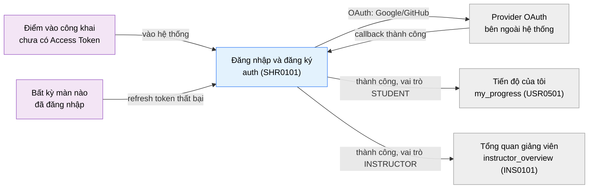

# Tài liệu thiết kế cơ bản (BD) — Đăng nhập và đăng ký (`SHR0101`)

## Phương châm tài liệu [Nội bộ — không cần khách duyệt]

- Viết theo **mẫu 9 sheet**. Bộ thẻ đóng, quy ước ID, ký hiệu chuẩn, ranh giới với tài liệu khác và
  checklist kiểm toán nằm ở `02-bd/_rules/bd-template-9sheet.md` — file này không chép lại.
- Phần gắn nhãn `[Nội bộ]` phục vụ sinh mã và tự kiểm toán, không phải yêu cầu của khách hàng: mục 4.5 và
  mục 7.3.
- Mã màn `SHR0101` theo bảng mã ở `02-bd/_rules/bd-template-9sheet.md` mục 8; tên file mang tiền tố mã.
- Màn này **không có popup** — mọi trạng thái phụ (`forgot_email`, `forgot_otp`, `forgot_reset`, banner
  khôi phục tài khoản) là biến thể hiển thị trong cùng một màn, không mở chồng lên màn hiện tại
  [SoT: 01-rd/screens/shared/SHR0101_auth.md:33-63].

> Đọc cùng `01-rd/screens/shared/SHR0101_auth.md` (hành vi ở mức yêu cầu, không lặp lại ở đây) và ba file BD
> module: `02-bd/architecture/identity.md`, `02-bd/database/identity.md`, `02-bd/security/identity.md`.
>
> **Divergence 2026-09-15 (`DEC-2026-0915-admin-separate-login-route`):** vai trò A3 (`ADMIN`) **không**
> đăng nhập qua màn này — có route/màn `/admin/login` riêng (`views/admin/auth`), cùng hợp đồng API đăng
> nhập nhưng khác route và giao diện, không có signup/OAuth. Màn `SHR0101` chỉ còn phục vụ A1 (`STUDENT`)
> và A2 (`INSTRUCTOR`) [Nguồn: 02-bd/screens/shared/SHR0101_auth.md cũ (đã xoá) mục 5, dòng ghi decision này].
> **Không thiết kế** màn `/admin/login` ở đây.

---

## Sheet 1. Bìa

| Mục | Giá trị |
| :--- | :--- |
| Hệ thống | AlgoPrep |
| Phân hệ | `identity` (F1) |
| Công đoạn | BD — Thiết kế cơ bản |
| Phân loại | Màn hình |
| Tên màn | Đăng nhập và đăng ký |
| Mã màn hình | `SHR0101` |
| Tên vật lý (slug) | `auth` |
| Trục tài liệu | Màn hình (`02-bd/screens/`) |
| Actor | A1 (`STUDENT`), A2 (`INSTRUCTOR`) — A3 (`ADMIN`) dùng route riêng `/admin/login`, ngoài phạm vi |
| Phiên bản | V0.3 |
| Người tạo | Nhóm phát triển AlgoPrep |
| Ngày tạo | 2026/08/25 |
| Người cập nhật | Nhóm phát triển AlgoPrep |
| Ngày cập nhật | 2026/10/03 |

---

## Sheet 2. Lịch sử sửa đổi

| Ver | Sheet bị sửa | Nội dung sửa | Ngày | Người sửa |
| :--- | :--- | :--- | :--- | :--- |
| V0.1 | Toàn bộ | Tạo mới theo cấu trúc 7 mục văn xuôi (layout regions, component inventory, screen states, APIs consumed, navigation, access rights, câu hỏi mở) tại `02-bd/screens/shared/SHR0101_auth.md` | 2026/08/25 | Nhóm phát triển AlgoPrep |
| V0.2 | Toàn bộ | Chuyển sang mẫu 9 sheet, đổi tên file thành `SHR0101_auth.md` theo mã màn. Giữ nguyên nội dung đã chốt (state machine, DTO, navigation theo vai trò, access rights); đối chiếu code frontend đã dựng (`features/auth-by-credentials`, `entities/auth`) để chốt tên field/DTO thay vì suy luận; bổ sung Sheet 5 danh sách item theo đúng bộ thẻ, Sheet 6 đặc tả điều khiển, Sheet 8 danh sách sự kiện `EVT-1` đến `EVT-10`, Sheet 9 đặc tả kiểm tra; đóng câu hỏi mở cũ Q1(BD) vì code đã dựng đúng đề xuất, phát sinh 2 câu hỏi mở mới (Q4, Q5) | 2026/09/20 | Nhóm phát triển AlgoPrep |
| V0.3 | Sheet 4, 5, 8, 9, Q1 | Đổi kênh phản hồi theo `DEC-2026-1003-toast-feedback-channel`: lỗi nhập và kết quả thao tác (gửi mã, gửi lại mã, đặt lại mật khẩu, huỷ xoá tài khoản) đi qua một toast; ô sai chỉ đổi viền đỏ + `aria-invalid`, bỏ chữ lỗi cạnh ô; đảo chốt cũ "lỗi hiện dưới field, không toast"; banner khôi phục tài khoản giữ lại vì là trạng thái trang có nút hành động | 2026/10/03 | Nhóm phát triển AlgoPrep |

---

## Sheet 3. Sơ đồ chuyển màn

> [Nội bộ] Quy ước vẽ: bố trí từ trái sang phải. Màn gọi tới tô tím, màn hiện tại tô xanh nhạt, đích bên
> ngoài hệ thống tô xám. Màu và `[Nguồn:]` dùng để truy vết, không phải yêu cầu của khách hàng.
>
> Các bước con `signup ↔ login ↔ forgot_email ↔ forgot_otp ↔ forgot_reset` **không** có slug riêng trong
> `01-rd/screens/` — đó là biến đổi trạng thái trong cùng một màn, không phải chuyển màn. Ghi ở Sheet 6/8,
> không lặp lại ở đây theo đúng định nghĩa "màn hình" và "popup" ở
> `02-bd/_rules/bd-template-9sheet.md` mục 3.

### 3.1 Danh sách chuyển màn

#### Điểm vào công khai → Đăng nhập và đăng ký

[Điều kiện mở] Người dùng chưa có Access Token hợp lệ, truy cập bất kỳ URL nào của hệ thống cần xác thực.

[Chế độ mở] Chế độ `signup` (mặc định).

[Thông tin truyền] Tham số `redirect`/`returnTo` nếu bị chuyển hướng từ một URL cụ thể cần đăng nhập
trước [Nguồn: 05-coding/frontend/src/features/auth-by-credentials/model/use-auth-flow.ts:86].

[Giá trị trả về] Không có.

[Khi thành công] Hiển thị form đăng ký ở cột trái, panel giới thiệu ở cột phải.

[Khi huỷ] Không có.

#### Đăng nhập và đăng ký → Tiến độ của tôi (`my_progress`)

[Điều kiện mở] Đăng nhập/đăng ký thành công (email-mật khẩu hoặc OAuth), vai trò `STUDENT`, tài khoản
không ở trạng thái `DEACTIVATED`, overlay loading đã hoàn tất 4 bước.

[Chế độ mở] Không có.

[Thông tin truyền] Access Token + Refresh Token (cookie HTTP-Only) đã cấp.

[Giá trị trả về] Không có.

[Khi thành công] Điều hướng tới `my_progress` (`USR0501`), hoặc tới URL đã lưu ở tham số `redirect`/
`returnTo` nếu tham số đó bắt đầu bằng `/` [Nguồn: 01-rd/screens/shared/SHR0101_auth.md:78-81;
05-coding/frontend/src/features/auth-by-credentials/model/use-auth-flow.ts:86-87].

[Khi huỷ] Không có.

#### Đăng nhập và đăng ký → Tổng quan giảng viên (`instructor_overview`)

[Điều kiện mở] Giống mục trên, vai trò `INSTRUCTOR`.

[Chế độ mở] Không có.

[Thông tin truyền] Access Token + Refresh Token (cookie HTTP-Only) đã cấp.

[Giá trị trả về] Không có.

[Khi thành công] Điều hướng tới `instructor_overview` (`INS0101`), ưu tiên URL `redirect`/`returnTo` nếu
có [Nguồn: 01-rd/screens/shared/SHR0101_auth.md:78-81].

[Khi huỷ] Không có.

#### Đăng nhập và đăng ký → Provider OAuth (bên ngoài hệ thống)

[Điều kiện mở] Bấm nút "Google" hoặc "GitHub" ở cột trái.

[Chế độ mở] Không có.

[Thông tin truyền] `state` parameter chống CSRF trong luồng OAuth [Nguồn: 02-bd/security/identity.md:19].

[Giá trị trả về] Provider chuyển hướng về callback kèm mã xác thực, hoặc người dùng huỷ ở màn provider.

[Khi thành công] Quay lại màn `auth`, chạy overlay loading như luồng email-mật khẩu, rồi điều hướng theo
vai trò. Route callback cụ thể chưa chốt — xem Câu hỏi mở Q2.

[Khi huỷ] Provider trả về lỗi hoặc người dùng huỷ ở màn provider → quay lại `auth` ở đúng chế độ trước khi
bấm OAuth, hiện toast lỗi "Đăng nhập bằng {provider} thất bại."

#### Bất kỳ màn nào (refresh token thất bại) → Đăng nhập và đăng ký

[Điều kiện mở] Access Token hết hạn **và** refresh cũng thất bại — toàn bộ token cùng `family_id` bị
revoke do phát hiện tái sử dụng refresh token [Nguồn: 02-bd/security/identity.md:13-15].

[Chế độ mở] Chế độ `login`.

[Thông tin truyền] Không có.

[Giá trị trả về] Không có.

[Khi thành công] Hiển thị lại form đăng nhập, buộc người dùng đăng nhập lại.

[Khi huỷ] Không có.

### 3.2 Sơ đồ

[Nguồn: 09-layoutBase/Đăng nhập & Đăng ký.dc.html:186, 216-279; 01-rd/screens/shared/SHR0101_auth.md:33-63,
78-81; 02-bd/security/identity.md:13-19]

---

## Sheet 4. Bố cục màn hình

### 4.1 Tổng quan màn

[Mục đích màn] Điểm vào duy nhất của hệ thống cho A1 (`STUDENT`) và A2 (`INSTRUCTOR`) — đăng ký tài khoản
mới hoặc đăng nhập vào tài khoản đã có, bằng email/mật khẩu hoặc qua OAuth (GitHub, Google), quên và đặt
lại mật khẩu bằng mã 6 chữ số qua email [Nguồn: 01-rd/screens/shared/SHR0101_auth.md:16-20; 01-rd/req/identity.md
— F1-01, F1-02, F1-15, F1-17].

[Luồng nghiệp vụ chính]

1. **Hiển thị ban đầu**: vào màn lần đầu → hiển thị chế độ `signup` mặc định, cột trái là form, cột phải
   là panel giới thiệu.
2. **Chuyển đổi chế độ**: bấm nút chuyển ở panel bên phải để đổi `signup` ↔ `login` tại chỗ, không tải lại
   trang.
3. **Submit hợp lệ**: hệ thống cấp Access Token + Refresh Token, chạy overlay loading 4 bước tuần tự rồi
   điều hướng theo vai trò (hoặc URL `redirect`/`returnTo` nếu có).
4. **Submit lỗi**: field sai đổi viền đỏ và gắn `aria-invalid`, **không** có chữ lỗi cạnh ô; **một** toast ở góc phải-trên mang lỗi đầu tiên [SoT: 05-coding/frontend/src/features/auth-by-credentials/model/use-auth-flow.ts:77-82; 05-coding/frontend/src/features/auth-by-credentials/ui/auth-form.tsx:54-66] (`DEC-2026-1003-toast-feedback-channel`).
5. **Đăng nhập đúng nhưng tài khoản `DEACTIVATED` còn ân hạn 30 ngày**: ở lại `login`, hiện banner khôi
   phục tài khoản kèm nút "Huỷ yêu cầu xoá tài khoản".
6. **Quên mật khẩu**: `login` → `forgot_email` (nhập email) → `forgot_otp` (nhập mã 6 số, có đếm ngược và
   nút gửi lại) → `forgot_reset` (đặt mật khẩu mới) → quay về `login`, không tự động đăng nhập.
7. **OAuth**: bấm Google/GitHub → redirect provider → callback → cùng luồng loading/điều hướng như bước 3.

[Người dùng] Bất kỳ ai chưa đăng nhập — không yêu cầu quyền hay `Function` nào
[Nguồn: 01-rd/screens/shared/SHR0101_auth.md:121-122].

[Tệp liên quan] Không có. Màn này không xuất hay nhập tệp.

[Phạm vi]
- Không thiết kế màn đăng nhập riêng của `ADMIN` (`/admin/login`) — `DEC-2026-0915-admin-separate-login-route`.
- Không cấu hình ma trận quyền — thuộc `admin_permission_matrix` (`ADM0202`).
- Không chốt route callback OAuth cụ thể (`/auth` hay `/auth/callback/{provider}`) — xem Câu hỏi mở Q2.
- Không kiểm tra "đã có Access Token hợp lệ mà quay lại `/auth`" ở đợt này — xem Câu hỏi mở Q3.
- Không chốt độ mạnh mật khẩu chính xác (số ký tự, có bắt buộc chữ và số hay không) — xem Câu hỏi mở Q5.

[Quyền sử dụng]
- Xem: mọi actor chưa đăng nhập, công khai, không cần `Function`.
- Thêm: tạo tài khoản mới qua `signup` hoặc lần đầu đăng nhập OAuth.
- Sửa: đặt lại mật khẩu qua `forgot_email`/`forgot_otp`/`forgot_reset`; khôi phục tài khoản `DEACTIVATED`.
- Xoá: không có ở màn này.

[Số bản ghi tối đa] Không áp dụng — màn không hiển thị danh sách hay bảng dữ liệu nào.

[Nguồn: 01-rd/screens/shared/SHR0101_auth.md:16-20, 33-81; 02-bd/database/identity.md mục 1.1, 1.6, 1.7;
02-bd/security/identity.md mục 1, 3, 4]

### 4.2 DTO liên quan

- `SignupInput` — `{ username, password, email, termsAccepted }`
- `LoginInput` — `{ identifier, password, rememberMe }`
- `ForgotEmailInput` — `{ email }`
- `ForgotOtpInput` — `{ otp }`
- `ForgotResetInput` — `{ newPassword, confirmPassword }`
- `AuthOutcome` — `{ ok: true, role, deactivated? } | { ok: false, fieldErrors }`

[Nguồn: 05-coding/frontend/src/entities/auth/model/schema.ts:18-62;
05-coding/frontend/src/entities/auth/model/types.ts:3-34] — đây là kiểu dữ liệu của lớp mock hiện có trong
code (`entities/auth/api/__mock__/fake-auth.ts`), **chưa phải hợp đồng API thật**. `03-dd/api/identity.md`
(chưa viết) chốt lại tên trường và kiểu chính xác khi có backend; đến lúc đó những field này giữ nguyên ý
nghĩa nghiệp vụ nhưng có thể đổi tên.

### 4.3 Bảng dữ liệu liên quan (3)

| NO | Bảng | Ghi chú |
| --: | :--- | :--- |
| 1 | `identity.users` | [Nguồn: 02-bd/database/identity.md mục 1.1] |
| 2 | `identity.refresh_tokens` | [Nguồn: 02-bd/database/identity.md mục 1.6] |
| 3 | `identity.oauth_identities` | [Nguồn: 02-bd/database/identity.md mục 1.5] |

Không dùng bảng PostgreSQL cho mã OTP quên mật khẩu — lưu ở **Redis**, TTL ngắn, không cần join quan hệ
[Nguồn: 02-bd/database/identity.md mục 1.7, mục 3].

### 4.4 Vùng bố cục

Đối chiếu `09-layoutBase/Đăng nhập & Đăng ký.dc.html` — bằng chứng bố cục chỉ-đọc, **không phải** design
system cuối cùng.

| Vùng | Vị trí trong prototype | Nội dung |
| :--- | :--- | :--- |
| Khung ngoài | `:48, 89` | Toàn màn hình căn giữa, thẻ bố cục 2 cột (`grid-template-columns: 1.06fr 1fr`), bo góc lớn, đổ bóng |
| Cột trái — form panel | `:91-146` | Logo + nhãn engine, tiêu đề chế độ, khối field động theo chế độ, khối phụ theo chế độ (điều khoản/ghi nhớ + quên mật khẩu), nút submit chính, khối OAuth (divider + 2 nút Google/GitHub) |
| Cột phải — aside panel | `:149-179` | Nền màu accent, 3 badge ngang (số bài, số chủ đề, số ngôn ngữ), tiêu đề + mô tả đổi theo chế độ, nút chuyển chế độ, khối minh hoạ code mẫu tĩnh, dải chấm điều hướng |
| Thanh góc phải trên | `:80-87` | Công tắc theme (Sáng/Tối) và ngôn ngữ (VI/EN), nổi cố định — dùng chung mọi màn, không phải component riêng của `auth` |
| Overlay loading | `:50-77` | Toàn màn hình, che khung chính khi đang xử lý submit: logo, tiêu đề, thanh tiến trình, danh sách 4 bước tuần tự có trạng thái |

Hai cột chỉ đổi **nội dung field/văn bản** theo `mode`, không đổi cấu trúc khung
[Nguồn: 01-rd/screens/shared/SHR0101_auth.md:43]. Ba trạng thái quên mật khẩu (`forgot_email`, `forgot_otp`,
`forgot_reset`) và banner khôi phục tài khoản **chưa có trong prototype** — chỉ có trong RD và code frontend
[Nguồn: 01-rd/screens/shared/SHR0101_auth.md:49-59, 74-77;
05-coding/frontend/src/features/auth-by-credentials/ui/otp-input-group.tsx].

### 4.5 Cấu trúc slice FSD [Nội bộ]

| Khối | Slice thực tế trong code | Căn cứ |
| :--- | :--- | :--- |
| Trang | `views/shared/auth` | `05-coding/frontend/src/views/shared/auth/ui/auth-aside-panel.tsx` |
| Form + luồng submit | `features/auth-by-credentials` (`ui/auth-form.tsx`, `ui/oauth-button-group.tsx`, `ui/otp-input-group.tsx`, `ui/auth-loading-overlay.tsx`, `model/use-auth-flow.ts`) | `05-coding/frontend/src/features/auth-by-credentials/**` |
| Kiểu dữ liệu, schema, mock API | `entities/auth` (`model/types.ts`, `model/schema.ts`, `api/__mock__/fake-auth.ts`) | `05-coding/frontend/src/entities/auth/**` |
| Công tắc theme/ngôn ngữ | Dùng lại `shared/ui/theme-lang-switcher` | `05-coding/frontend/src/shared/ui/layout/theme-lang-switcher.tsx` |

Khác với `ADM0301`, các slice ở đây **đã dựng thật** trong code (không phải đề xuất `[Suy luận]`) — mock
API (`entities/auth/api/__mock__/fake-auth.ts`) sẽ bị thay bằng client gọi `03-dd/api/identity.md` thật khi
có backend, phần `model`/`ui` giữ nguyên phần lớn.

> [Nội bộ] Ảnh minh hoạ đặt ở `08-diagram/02-bd/screens/shared/`, chụp bằng Playwright trên ứng dụng
> Next.js thật.

---

## Sheet 5. Danh sách item màn hình

> Quy ước ID, bộ thẻ và giá trị chuẩn: `02-bd/_rules/bd-template-9sheet.md` mục 2, 3, 4.

### Khu vực A — Form panel (cột trái)

| Khu vực | NO | Tên item | ID item | Bảng DB | Cột DB | Loại UI | Kiểu | Độ dài | Bắt buộc | I/O | Giá trị mặc định | Định dạng | Ghi chú |
| :--- | --: | :--- | :--- | :--- | :--- | :--- | :--- | :--- | :-: | :-: | :--- | :--- | :--- |
| Form panel | | | | | | | | | | | | | |
| | 1 | Logo + nhãn engine | `auth.form.brandLabel` | - | - | Label | String | - | - | O | AlgoPrep | - | Nhãn cố định, không đổi theo chế độ [Nguồn giá trị] Nhãn tĩnh i18n [EVT liên quan] - |
| | 2 | Tiêu đề chế độ | `auth.form.modeTitle` | - | - | Label | String | - | - | O | Tuỳ mode | - | Eyebrow + heading + subheading đổi theo `mode` [Nguồn giá trị] Nhãn tĩnh i18n theo `mode` [EVT liên quan] EVT-2 |
| | 3 | Tên đăng nhập | `auth.form.username` | `identity.users` | `display_name` (gián tiếp — xem Q5) | TextBox | String | 32 | Có | I | rỗng | tối thiểu 3 ký tự | Chỉ hiện ở chế độ `signup` [Nguồn giá trị] Người dùng nhập, field `username` [EVT liên quan] EVT-1 |
| | 4 | Mật khẩu (đăng ký) | `auth.form.signupPassword` | `identity.users` | `password_hash` (băm phía server) | TextBox | String | - | Có | I | rỗng | tối thiểu 8 ký tự, có nút hiện/ẩn | Chỉ hiện ở chế độ `signup` [Nguồn giá trị] Người dùng nhập, field `password`. Độ mạnh chính xác chưa chốt, xem Q5 [EVT liên quan] EVT-1 |
| | 5 | E-mail (đăng ký) | `auth.form.signupEmail` | `identity.users` | `email` | TextBox | String | - | Có | I | rỗng | định dạng email RFC | Chỉ hiện ở chế độ `signup` [Nguồn giá trị] Người dùng nhập, field `email` [EVT liên quan] EVT-1 |
| | 6 | Đồng ý điều khoản | `auth.form.termsAccepted` | - | - | Toggle | Boolean | - | Có | I | Tắt | - | Chỉ hiện ở chế độ `signup`. Chưa tick thì chặn submit [Nguồn giá trị] Người dùng đặt, field `termsAccepted` [EVT liên quan] EVT-1 |
| | 7 | E-mail/Tên đăng nhập (đăng nhập) | `auth.form.loginIdentifier` | `identity.users` | `email` | TextBox | String | - | Có | I | rỗng | - | Chỉ hiện ở chế độ `login`, field `identifier` [Nguồn giá trị] Người dùng nhập [EVT liên quan] EVT-1 |
| | 8 | Mật khẩu (đăng nhập) | `auth.form.loginPassword` | - | - | TextBox | String | - | Có | I | rỗng | có nút hiện/ẩn | Chỉ hiện ở chế độ `login`, field `password` [Nguồn giá trị] Người dùng nhập [EVT liên quan] EVT-1 |
| | 9 | Ghi nhớ đăng nhập | `auth.form.rememberMe` | - | - | Toggle | Boolean | - | - | I | Tắt | - | Chỉ hiện ở chế độ `login`, field `rememberMe` [Nguồn giá trị] Người dùng đặt [EVT liên quan] EVT-1 |
| | 10 | Quên mật khẩu? | `auth.form.linkForgotPassword` | - | - | Link | - | - | - | I | - | - | Chỉ hiện ở chế độ `login` [Nguồn giá trị] - [EVT liên quan] EVT-3 |
| | 11 | Nút submit chính | `auth.form.btnSubmit` | - | - | Button | - | - | - | I | - | "Đăng ký" hoặc "Đăng nhập" theo mode | Nhãn đổi theo `mode` [Nguồn giá trị] - [EVT liên quan] EVT-1 |
| | 12 | Nút Google | `auth.form.btnOauthGoogle` | - | - | Button | - | - | - | I | - | - | - [Nguồn giá trị] - [EVT liên quan] EVT-4 |
| | 13 | Nút GitHub | `auth.form.btnOauthGithub` | - | - | Button | - | - | - | I | - | - | - [Nguồn giá trị] - [EVT liên quan] EVT-4 |

### Khu vực B — Aside panel (cột phải)

| Khu vực | NO | Tên item | ID item | Bảng DB | Cột DB | Loại UI | Kiểu | Độ dài | Bắt buộc | I/O | Giá trị mặc định | Định dạng | Ghi chú |
| :--- | --: | :--- | :--- | :--- | :--- | :--- | :--- | :--- | :-: | :-: | :--- | :--- | :--- |
| Aside panel | | | | | | | | | | | | | |
| | 1 | Badge số bài | `auth.aside.badgeProblemCount` | - | - | Badge | Number | - | - | O | - | - | Nội dung marketing tĩnh, không truy vấn số thật ở đợt này [Nguồn giá trị] Nhãn tĩnh i18n [EVT liên quan] - |
| | 2 | Badge số chủ đề | `auth.aside.badgeTopicCount` | - | - | Badge | Number | - | - | O | - | - | Nội dung marketing tĩnh [Nguồn giá trị] Nhãn tĩnh i18n [EVT liên quan] - |
| | 3 | Badge số ngôn ngữ | `auth.aside.badgeLanguageCount` | - | - | Badge | Number | - | - | O | 3 | - | Số ngôn ngữ nộp bài được hỗ trợ [Nguồn giá trị] Hằng số 3 ngôn ngữ nộp bài (Java, C++, Python) [Nguồn: CLAUDE.md mục "Locked stack" — Submission languages] [EVT liên quan] - |
| | 4 | Tiêu đề + mô tả panel | `auth.aside.modeHeading` | - | - | Label | String | - | - | O | Tuỳ mode | - | Đổi theo `mode` [Nguồn giá trị] Nhãn tĩnh i18n theo `mode` [EVT liên quan] EVT-2 |
| | 5 | Nút chuyển chế độ | `auth.aside.btnSwitchMode` | - | - | Button | - | - | - | I | - | - | Chuyển `signup` ↔ `login` tại chỗ [Nguồn giá trị] - [EVT liên quan] EVT-2 |
| | 6 | Khối minh hoạ code mẫu | `auth.aside.codeSample` | - | - | Label | String | - | - | O | - | - | Nội dung tĩnh, không đổi theo dữ liệu thật [Nguồn giá trị] Nhãn tĩnh [EVT liên quan] - |
| | 7 | Dải chấm điều hướng | `auth.aside.dots` | - | - | Label | - | - | - | O | - | - | Trang trí, không mang state nghiệp vụ [Nguồn giá trị] - [EVT liên quan] - |

### Khu vực C — Thanh góc phải trên (dùng chung)

| Khu vực | NO | Tên item | ID item | Bảng DB | Cột DB | Loại UI | Kiểu | Độ dài | Bắt buộc | I/O | Giá trị mặc định | Định dạng | Ghi chú |
| :--- | --: | :--- | :--- | :--- | :--- | :--- | :--- | :--- | :-: | :-: | :--- | :--- | :--- |
| Thanh góc phải trên | | | | | | | | | | | | | |
| | 1 | Công tắc theme | `auth.topbar.themeToggle` | - | - | Toggle | Enum | - | - | I/O | `light` | `light` / `dark` | Dùng chung mọi màn (`shared/ui/theme-lang-switcher`), không thiết kế lại ở đây [Nguồn giá trị] `DEC-2026-0824-dark-light-theme` [EVT liên quan] - |
| | 2 | Công tắc ngôn ngữ | `auth.topbar.langToggle` | - | - | Toggle | Enum | - | - | I/O | `vi` | `vi` / `en` | Dùng chung mọi màn [Nguồn giá trị] `DEC-2026-0824-i18n-vi-en` [EVT liên quan] - |

### Khu vực D — Overlay loading

| Khu vực | NO | Tên item | ID item | Bảng DB | Cột DB | Loại UI | Kiểu | Độ dài | Bắt buộc | I/O | Giá trị mặc định | Định dạng | Ghi chú |
| :--- | --: | :--- | :--- | :--- | :--- | :--- | :--- | :--- | :-: | :-: | :--- | :--- | :--- |
| Overlay loading | | | | | | | | | | | | | |
| | 1 | Danh sách bước | `auth.loading.stepList` | - | - | List | List | - | - | O | 4 dòng | - | Đúng 4 bước tuần tự, không đổi số lượng [Nguồn giá trị] Hằng số `LOADING_STEP_COUNT = 4` [Nguồn: 05-coding/frontend/src/features/auth-by-credentials/model/use-auth-flow.ts:27] [EVT liên quan] EVT-1, EVT-4 |
| | 2 | Tên bước | `auth.loading.col.stepName` | - | - | ListColumn | String | - | - | O | - | Nhãn tiếng Việt | 4 tên cố định: "Xác thực thông tin", "Tải tiến độ luyện tập", "Kết nối go-judge", "Dựng bảng tổng quan" [Nguồn giá trị] Nhãn tĩnh i18n [Nguồn: 01-rd/screens/shared/SHR0101_auth.md:44-46] [EVT liên quan] - |
| | 3 | Trạng thái bước | `auth.loading.col.stepStatus` | - | - | ListColumn | Enum | - | - | O | chưa tới | `·` chưa tới / `→` đang chạy / dấu tick hoàn tất | [Công thức] So sánh thứ tự bước với `loadingStep` hiện tại [EVT liên quan] - |

### Khu vực E — Banner khôi phục tài khoản (`deactivated-recovery`)

| Khu vực | NO | Tên item | ID item | Bảng DB | Cột DB | Loại UI | Kiểu | Độ dài | Bắt buộc | I/O | Giá trị mặc định | Định dạng | Ghi chú |
| :--- | --: | :--- | :--- | :--- | :--- | :--- | :--- | :--- | :-: | :-: | :--- | :--- | :--- |
| Banner khôi phục tài khoản | | | | | | | | | | | | | |
| | 1 | Nội dung banner | `auth.deactivatedBanner.text` | `identity.users` | `status`, `deactivated_at` | Label | String | - | - | O | - | - | Chỉ hiện khi đăng nhập đúng thông tin vào tài khoản `status = DEACTIVATED` còn trong ân hạn 30 ngày [Nguồn giá trị] Nhãn tĩnh i18n, điều kiện lấy từ `status`/`deactivated_at` [Nguồn: 02-bd/security/identity.md mục 4] [EVT liên quan] EVT-1 |
| | 2 | Nút "Huỷ yêu cầu xoá tài khoản" | `auth.deactivatedBanner.btnCancel` | - | - | Button | - | - | - | I | - | - | - [Nguồn giá trị] - [EVT liên quan] EVT-8 |

### Khu vực F — Quên mật khẩu bước 1 (`forgot_email`)

| Khu vực | NO | Tên item | ID item | Bảng DB | Cột DB | Loại UI | Kiểu | Độ dài | Bắt buộc | I/O | Giá trị mặc định | Định dạng | Ghi chú |
| :--- | --: | :--- | :--- | :--- | :--- | :--- | :--- | :--- | :-: | :-: | :--- | :--- | :--- |
| Quên mật khẩu bước 1 | | | | | | | | | | | | | |
| | 1 | E-mail | `auth.forgotEmail.email` | `identity.users` | `email` | TextBox | String | - | Có | I | rỗng | định dạng email RFC | Field `email` của `forgotEmailSchema` [Nguồn giá trị] Người dùng nhập [EVT liên quan] EVT-5 |
| | 2 | Nút gửi | `auth.forgotEmail.btnSend` | - | - | Button | - | - | - | I | - | - | - [Nguồn giá trị] - [EVT liên quan] EVT-5 |

### Khu vực G — Quên mật khẩu bước 2 (`forgot_otp`)

| Khu vực | NO | Tên item | ID item | Bảng DB | Cột DB | Loại UI | Kiểu | Độ dài | Bắt buộc | I/O | Giá trị mặc định | Định dạng | Ghi chú |
| :--- | --: | :--- | :--- | :--- | :--- | :--- | :--- | :--- | :-: | :-: | :--- | :--- | :--- |
| Quên mật khẩu bước 2 | | | | | | | | | | | | | |
| | 1 | Ô nhập mã 6 số | `auth.forgotOtp.otp` | - | - | TextBox | String | 6 | Có | I | rỗng | đúng 6 chữ số | `OtpInputGroup`, field `otp`. Mã lưu ở Redis (`identity:pwreset:<userId>`), TTL 10 phút [Nguồn giá trị] Người dùng nhập [Nguồn: 02-bd/database/identity.md mục 3] [EVT liên quan] EVT-6 |
| | 2 | Đếm ngược gửi lại | `auth.forgotOtp.resendCountdown` | - | - | Label | Number | - | - | O | 60 giây | `mm:ss` | Cooldown gửi lại mã [Nguồn giá trị] Redis `identity:pwreset:resend:<userId>`, TTL 60 giây [Nguồn: 02-bd/database/identity.md mục 3] [EVT liên quan] EVT-7 |
| | 3 | Số lần thử còn lại | `auth.forgotOtp.attemptsLeft` | - | - | Label | Number | - | - | O | 5 | - | Số lần nhập sai còn được phép [Nguồn giá trị] Redis `identity:pwreset:<userId>`, đếm kèm mã OTP [Nguồn: 02-bd/security/identity.md mục 3] [EVT liên quan] EVT-6 |
| | 4 | Nút "Gửi lại mã" | `auth.forgotOtp.btnResend` | - | - | Button | - | - | - | I | - | - | - [Nguồn giá trị] - [EVT liên quan] EVT-7 |

### Khu vực H — Quên mật khẩu bước 3 (`forgot_reset`)

| Khu vực | NO | Tên item | ID item | Bảng DB | Cột DB | Loại UI | Kiểu | Độ dài | Bắt buộc | I/O | Giá trị mặc định | Định dạng | Ghi chú |
| :--- | --: | :--- | :--- | :--- | :--- | :--- | :--- | :--- | :-: | :-: | :--- | :--- | :--- |
| Quên mật khẩu bước 3 | | | | | | | | | | | | | |
| | 1 | Mật khẩu mới | `auth.forgotReset.newPassword` | `identity.users` | `password_hash` (băm phía server) | TextBox | String | - | Có | I | rỗng | tối thiểu 8 ký tự | Field `newPassword`. Độ mạnh chính xác chưa chốt, xem Q5 [Nguồn giá trị] Người dùng nhập [EVT liên quan] EVT-9 |
| | 2 | Xác nhận mật khẩu | `auth.forgotReset.confirmPassword` | - | - | TextBox | String | - | Có | I | rỗng | phải khớp mật khẩu mới | Field `confirmPassword` [Nguồn giá trị] Người dùng nhập [EVT liên quan] EVT-9 |
| | 3 | Nút đặt lại | `auth.forgotReset.btnSubmit` | - | - | Button | - | - | - | I | - | - | - [Nguồn giá trị] - [EVT liên quan] EVT-9 |

[Nguồn: 09-layoutBase/Đăng nhập & Đăng ký.dc.html:80-179; 01-rd/screens/shared/SHR0101_auth.md:38-59;
05-coding/frontend/src/entities/auth/model/{types,schema}.ts;
05-coding/frontend/src/features/auth-by-credentials/**]

---

## Sheet 6. Đặc tả điều khiển item

> Ký hiệu cột `Hiển thị` và thứ tự thẻ: `02-bd/_rules/bd-template-9sheet.md` mục 2, 3. Dùng đúng NO, tên
> item và thứ tự của Sheet 5. Lỗi nhập liệu ghi ở Sheet 9, xử lý nghiệp vụ ghi ở Sheet 8.

### Khu vực A — Form panel

| Khu vực | NO | Tên item | Hiển thị | Ghi chú |
| :--- | --: | :--- | :-: | :--- |
| Form panel | | | | |
| | 1 | Logo + nhãn engine | Có | - |
| | 2 | Tiêu đề chế độ | Có | - |
| | 3 | Tên đăng nhập | Điều kiện | [Điều kiện hiển thị] Chỉ hiện khi `mode = signup`. |
| | 4 | Mật khẩu (đăng ký) | Điều kiện | [Điều kiện hiển thị] Chỉ hiện khi `mode = signup`. |
| | 5 | E-mail (đăng ký) | Điều kiện | [Điều kiện hiển thị] Chỉ hiện khi `mode = signup`. |
| | 6 | Đồng ý điều khoản | Điều kiện | [Điều kiện hiển thị] Chỉ hiện khi `mode = signup`. |
| | 7 | E-mail/Tên đăng nhập (đăng nhập) | Điều kiện | [Điều kiện hiển thị] Chỉ hiện khi `mode = login`. |
| | 8 | Mật khẩu (đăng nhập) | Điều kiện | [Điều kiện hiển thị] Chỉ hiện khi `mode = login`. |
| | 9 | Ghi nhớ đăng nhập | Điều kiện | [Điều kiện hiển thị] Chỉ hiện khi `mode = login`. |
| | 10 | Quên mật khẩu? | Điều kiện | [Điều kiện hiển thị] Chỉ hiện khi `mode = login`. [Điều kiện kích hoạt] Luôn kích hoạt khi hiển thị. |
| | 11 | Nút submit chính | Có | [Điều kiện kích hoạt] Không kích hoạt khi đang xử lý submit (`isSubmitting = true`) hoặc `mode = signup` mà chưa tick "Đồng ý điều khoản". |
| | 12 | Nút Google | Điều kiện | [Điều kiện hiển thị] Hiện ở cả `signup` và `login`, ẩn ở `forgot_*`. [Điều kiện kích hoạt] Không kích hoạt khi đang xử lý submit. |
| | 13 | Nút GitHub | Điều kiện | Giống NO 12. |

### Khu vực B — Aside panel

| Khu vực | NO | Tên item | Hiển thị | Ghi chú |
| :--- | --: | :--- | :-: | :--- |
| Aside panel | | | | |
| | 1 | Badge số bài | Có | - |
| | 2 | Badge số chủ đề | Có | - |
| | 3 | Badge số ngôn ngữ | Có | - |
| | 4 | Tiêu đề + mô tả panel | Có | [Tự động đặt] Đổi văn bản ngay khi `mode` đổi. |
| | 5 | Nút chuyển chế độ | Điều kiện | [Điều kiện hiển thị] Ẩn ở các chế độ `forgot_*` — không có đường quay lại `signup` trực tiếp từ luồng quên mật khẩu. [Điều kiện kích hoạt] Luôn kích hoạt khi hiển thị. |
| | 6 | Khối minh hoạ code mẫu | Có | - |
| | 7 | Dải chấm điều hướng | Có | - |

### Khu vực C — Thanh góc phải trên

| Khu vực | NO | Tên item | Hiển thị | Ghi chú |
| :--- | --: | :--- | :-: | :--- |
| Thanh góc phải trên | | | | |
| | 1 | Công tắc theme | Có | Hành vi dùng chung, không thiết kế lại ở đây. |
| | 2 | Công tắc ngôn ngữ | Có | Hành vi dùng chung, không thiết kế lại ở đây. |

### Khu vực D — Overlay loading

| Khu vực | NO | Tên item | Hiển thị | Ghi chú |
| :--- | --: | :--- | :-: | :--- |
| Overlay loading | | | | |
| | 1 | Danh sách bước | Điều kiện | [Điều kiện hiển thị] Chỉ hiện khi đang chạy overlay (sau submit thành công, trước khi điều hướng). |
| | 2 | Tên bước | Có | - |
| | 3 | Trạng thái bước | Có | [Tự động đặt] Cập nhật mỗi 500ms cho tới khi cả 4 bước hoàn tất [Nguồn: 05-coding/frontend/src/features/auth-by-credentials/model/use-auth-flow.ts:28]. |

### Khu vực E — Banner khôi phục tài khoản

| Khu vực | NO | Tên item | Hiển thị | Ghi chú |
| :--- | --: | :--- | :-: | :--- |
| Banner khôi phục tài khoản | | | | |
| | 1 | Nội dung banner | Điều kiện | [Điều kiện hiển thị] Chỉ hiện sau khi đăng nhập đúng thông tin vào tài khoản `DEACTIVATED` còn ân hạn; ở lại `mode = login`. |
| | 2 | Nút "Huỷ yêu cầu xoá tài khoản" | Điều kiện | [Điều kiện hiển thị] Cùng điều kiện với banner. [Điều kiện kích hoạt] Không kích hoạt khi đang xử lý (`isSubmitting = true`). |

### Khu vực F — Quên mật khẩu bước 1

| Khu vực | NO | Tên item | Hiển thị | Ghi chú |
| :--- | --: | :--- | :-: | :--- |
| Quên mật khẩu bước 1 | | | | |
| | 1 | E-mail | Điều kiện | [Điều kiện hiển thị] Chỉ hiện khi `mode = forgot_email`. |
| | 2 | Nút gửi | Điều kiện | Cùng điều kiện hiển thị với NO 1. [Điều kiện kích hoạt] Không kích hoạt khi đang xử lý. |

### Khu vực G — Quên mật khẩu bước 2

| Khu vực | NO | Tên item | Hiển thị | Ghi chú |
| :--- | --: | :--- | :-: | :--- |
| Quên mật khẩu bước 2 | | | | |
| | 1 | Ô nhập mã 6 số | Điều kiện | [Điều kiện hiển thị] Chỉ hiện khi `mode = forgot_otp`. |
| | 2 | Đếm ngược gửi lại | Điều kiện | Cùng điều kiện hiển thị với NO 1. [Tự động đặt] Đếm lùi mỗi giây, về 0 thì nút "Gửi lại mã" kích hoạt. |
| | 3 | Số lần thử còn lại | Điều kiện | Cùng điều kiện hiển thị với NO 1. [Tự động đặt] Giảm 1 mỗi lần xác thực OTP sai; về 0 thì buộc bấm "Gửi lại mã". |
| | 4 | Nút "Gửi lại mã" | Điều kiện | Cùng điều kiện hiển thị với NO 1. [Điều kiện kích hoạt] Không kích hoạt trong lúc đếm ngược còn hiệu lực (60 giây kể từ lần gửi trước). |

### Khu vực H — Quên mật khẩu bước 3

| Khu vực | NO | Tên item | Hiển thị | Ghi chú |
| :--- | --: | :--- | :-: | :--- |
| Quên mật khẩu bước 3 | | | | |
| | 1 | Mật khẩu mới | Điều kiện | [Điều kiện hiển thị] Chỉ hiện khi `mode = forgot_reset`. |
| | 2 | Xác nhận mật khẩu | Điều kiện | Cùng điều kiện hiển thị với NO 1. |
| | 3 | Nút đặt lại | Điều kiện | Cùng điều kiện hiển thị với NO 1. [Điều kiện kích hoạt] Không kích hoạt khi đang xử lý, hoặc hai ô mật khẩu chưa khớp. |

---

## Sheet 7. Danh sách truyền dữ liệu

### 7.1 Trường DTO

| NO | DTO | Trường DTO | Kiểu | Bảng DB | Cột DB | Item màn | Hiển thị | Ghi chú |
| --: | :--- | :--- | :--- | :--- | :--- | :--- | :-: | :--- |
| 1 | `SignupInput` | `username` | String | `identity.users` | `display_name` (gián tiếp) | Form "Tên đăng nhập" | Có | [Nguồn] Người dùng nhập [Đích] Tham số của `SignUp`. |
| 2 | `SignupInput` | `password` | String | `identity.users` | `password_hash` | Form "Mật khẩu (đăng ký)" | Có | [Nguồn] Người dùng nhập [Đích] Tham số của `SignUp` [Chuyển đổi] Băm BCrypt phía backend, không gửi lại dạng rõ trong phản hồi [Nguồn: 02-bd/security/identity.md mục 1]. |
| 3 | `SignupInput` | `email` | String | `identity.users` | `email` | Form "E-mail (đăng ký)" | Có | [Nguồn] Người dùng nhập [Đích] Tham số của `SignUp`. |
| 4 | `SignupInput` | `termsAccepted` | Boolean | - | - | Form "Đồng ý điều khoản" | Có | [Nguồn] Người dùng đặt [Đích] Kiểm ở client trước khi gọi `SignUp`, không gửi lên backend (không có cột lưu). |
| 5 | `LoginInput` | `identifier` | String | `identity.users` | `email` | Form "E-mail/Tên đăng nhập" | Có | [Nguồn] Người dùng nhập [Đích] Tham số của `Login`. |
| 6 | `LoginInput` | `password` | String | - | - | Form "Mật khẩu (đăng nhập)" | Có | [Nguồn] Người dùng nhập [Đích] Tham số của `Login`, không lưu lại phía client sau khi gửi. |
| 7 | `LoginInput` | `rememberMe` | Boolean | - | - | Form "Ghi nhớ đăng nhập" | Có | [Nguồn] Người dùng đặt [Đích] Tham số của `Login` — ảnh hưởng TTL của Refresh Token, chi tiết chốt ở `03-dd/logic/identity.md` (chưa viết). |
| 8 | `AuthOutcome` | `role` | Enum | `identity.roles` | `base_category` | - | Không | [Nguồn] Phản hồi của `SignUp`/`Login`/`OAuthCallback` [Đích] Chọn đích điều hướng ở Sheet 3. |
| 9 | `AuthOutcome` | `deactivated` | Boolean | `identity.users` | `status` | Banner "Nội dung banner" | Có (gián tiếp) | [Nguồn] Phản hồi của `Login` [Chuyển đổi] `status = DEACTIVATED` và còn trong ân hạn → `true`, hiện banner khu E. |
| 10 | `AuthOutcome` | `fieldErrors` | `Record<string,string>` | - | - | Mọi field của form đang active | Có | [Nguồn] Phản hồi lỗi của `SignUp`/`Login` [Đích] Field tương ứng đổi viền đỏ và `aria-invalid`; toast mang lỗi đầu tiên (một toast mỗi lần gửi). |
| 11 | `ForgotEmailInput` | `email` | String | `identity.users` | `email` | Khu F "E-mail" | Có | [Nguồn] Người dùng nhập [Đích] Tham số của `RequestPasswordReset`. |
| 12 | `ForgotOtpInput` | `otp` | String | - | - | Khu G "Ô nhập mã 6 số" | Có | [Nguồn] Người dùng nhập [Đích] Tham số của `VerifyPasswordResetOtp`, đối chiếu Redis `identity:pwreset:<userId>` [Nguồn: 02-bd/database/identity.md mục 3]. |
| 13 | `ForgotResetInput` | `newPassword` | String | `identity.users` | `password_hash` | Khu H "Mật khẩu mới" | Có | [Nguồn] Người dùng nhập [Đích] Tham số của `ResetPassword` [Chuyển đổi] Băm BCrypt phía backend. |
| 14 | `ForgotResetInput` | `confirmPassword` | String | - | - | Khu H "Xác nhận mật khẩu" | Có | [Nguồn] Người dùng nhập [Đích] Chỉ kiểm khớp phía client, không gửi lên backend. |

### 7.2 Truy cập bảng dữ liệu (3)

| NO | Tên logic | Bảng | Repository | CRUD | Mục đích | Ghi chú |
| --: | :--- | :--- | :--- | :-: | :--- | :--- |
| 1 | Tài khoản người dùng | `identity.users` | `UserRepository` | C, R, U | Tạo tài khoản mới (`SignUp`, `OAuthCallback` lần đầu), tra cứu đăng nhập (`Login`), đặt lại mật khẩu (`ResetPassword`), khôi phục tài khoản (`RestoreDeactivatedAccount`) | `SignUp`: C `Login`: R `ResetPassword`: U `RestoreDeactivatedAccount`: U (`status`, `deactivated_at`) |
| 2 | Phiên đăng nhập | `identity.refresh_tokens` | `RefreshTokenRepository` | C, R, U | Cấp token khi đăng nhập/đăng ký thành công, rotate khi refresh, revoke khi đăng xuất hoặc phát hiện tái sử dụng | `SignUp`/`Login`/`OAuthCallback`: C `RefreshToken`: R, U (rotate) Phát hiện reuse: U (revoke cả `family_id`) |
| 3 | Liên kết OAuth | `identity.oauth_identities` | `OAuthIdentityRepository` | C, R | Tra cứu tài khoản đã liên kết theo `(provider, provider_user_id)`, tạo liên kết mới nếu email đã verify khớp tài khoản có sẵn hoặc tạo tài khoản mới | `OAuthCallback`: R, C |

Không có thao tác xoá (`D`) trên màn này: xoá tài khoản chuyển `status = DEACTIVATED` (ngoài phạm vi màn
`auth`), ẩn danh hoá chạy ở job định kỳ, không xoá vật lý [Nguồn: 02-bd/security/identity.md mục 4].
Mã OTP quên mật khẩu đọc/ghi trên Redis, không qua repository JPA.

### 7.3 Danh sách endpoint [Nội bộ]

> Chỉ tên nghiệp vụ và BC sở hữu. Hợp đồng chi tiết thuộc `03-dd/api/identity.md` (chưa viết).

| NO | Endpoint (tên nghiệp vụ) | Mục đích | BC sở hữu |
| --: | :--- | :--- | :--- |
| 1 | `SignUp` | Đăng ký tài khoản email/mật khẩu, vai trò mặc định `STUDENT` | `identity` |
| 2 | `Login` | Đăng nhập, cấp Access Token + Refresh Token (cookie HTTP-Only) | `identity` |
| 3 | `RefreshToken` | Làm mới Access Token bằng Refresh Token, rotate token | `identity` |
| 4 | `StartOAuth` | Khởi tạo redirect OAuth (Google/GitHub), sinh `state` chống CSRF | `identity` |
| 5 | `OAuthCallback` | Xử lý callback provider, tự liên kết theo email đã verify hoặc tạo tài khoản mới | `identity` |
| 6 | `RequestPasswordReset` | Gửi mã OTP hoặc email hướng dẫn provider, phản hồi luôn giống nhau bất kể email tồn tại | `identity` |
| 7 | `VerifyPasswordResetOtp` | Xác thực mã 6 số, tối đa 5 lần sai | `identity` |
| 8 | `ResetPassword` | Đặt mật khẩu mới sau khi mã OTP hợp lệ | `identity` |
| 9 | `RestoreDeactivatedAccount` | Khôi phục tài khoản `DEACTIVATED` còn trong ân hạn 30 ngày | `identity` |

[Nguồn: 02-bd/database/identity.md mục 1.1, 1.5, 1.6, 1.7, mục 3; 02-bd/security/identity.md mục 1, 3, 4]

---

## Sheet 8. Danh sách sự kiện

> Bộ thẻ và quy ước cột `Chuyển màn`: `02-bd/_rules/bd-template-9sheet.md` mục 2, 3.

### Màn chính: Đăng nhập và đăng ký

| NO | Loại | Sự kiện | Chi tiết | Chuyển màn | Gọi API | Tên xử lý | Ghi chú |
| --: | :--- | :--- | :--- | :-: | :-: | :--- | :--- |
| 1 | Nút | Submit đăng ký/đăng nhập | Bấm nút submit chính ở cột trái, hành vi tuỳ `mode`. | Có | Có | `SignUp` hoặc `Login` | [Các bước] 1. Validate phía client theo `signupSchema`/`loginSchema`. 2. Gọi `SignUp` hoặc `Login`. 3. Thành công và tài khoản không `DEACTIVATED` → chạy overlay loading 4 bước rồi điều hướng theo vai trò. 4. Thành công nhưng tài khoản `DEACTIVATED` còn ân hạn → ở lại `login`, hiện banner khu E. [Khi thành công] Điều hướng tới đích theo vai trò hoặc URL `redirect`/`returnTo` đã lưu. [Khi lỗi] Field tương ứng đổi viền đỏ, hiện **một** toast lỗi mang lỗi đầu tiên (email đã tồn tại, sai mật khẩu, mật khẩu yếu...), giữ nguyên giá trị đã nhập. |
| 2 | Nút | Chuyển chế độ đăng ký/đăng nhập | Bấm nút chuyển chế độ ở aside panel. | Không | Không | - | [Các bước] 1. Đổi `mode`. 2. Xoá toàn bộ field và lỗi đang có. 3. Đóng banner khôi phục tài khoản nếu đang mở. [Khi thành công] Hiển thị form và aside panel theo chế độ mới, giữ nguyên theme/ngôn ngữ đã chọn. |
| 3 | Liên kết | Mở quên mật khẩu | Bấm "Quên mật khẩu?" ở chế độ `login`. | Không | Không | - | [Các bước] 1. Đổi `mode` sang `forgot_email`. [Khi thành công] Hiển thị form một trường email. |
| 4 | Nút | Đăng nhập/đăng ký qua OAuth | Bấm nút Google hoặc GitHub. | Có | Có | `StartOAuth`, `OAuthCallback` | [Các bước] 1. Redirect sang provider kèm `state` chống CSRF. 2. Provider xác thực xong, callback về hệ thống, gọi `OAuthCallback`. 3. Thành công → chạy overlay loading như sự kiện 1. [Khi thành công] Điều hướng theo vai trò như sự kiện 1. [Khi lỗi] Quay lại `auth` ở đúng chế độ trước khi bấm OAuth, hiện toast lỗi chung cho OAuth (không lộ chi tiết provider trả về). |
| 5 | Nhập liệu | Gửi email quên mật khẩu | Bấm "Gửi" ở khu F. | Không | Có | `RequestPasswordReset` | [Các bước] 1. Validate định dạng email. 2. Gọi `RequestPasswordReset`. 3. Luôn coi là thành công dù email tồn tại hay không. [Khi thành công] Chuyển sang `forgot_otp`, đặt số lần thử còn lại về 5 và cooldown gửi lại 60 giây. [Thông báo hoàn tất] Toast thành công "Nếu email tồn tại, hướng dẫn đã được gửi." [Nguồn: 05-coding/frontend/src/features/auth-by-credentials/model/use-auth-flow.ts:245] |
| 6 | Nhập liệu | Xác thực mã OTP | Nhập đủ 6 số ở khu G rồi submit. | Không | Có | `VerifyPasswordResetOtp` | [Các bước] 1. Validate đúng 6 chữ số. 2. Gọi `VerifyPasswordResetOtp`. [Khi thành công] Chuyển sang `forgot_reset`. [Khi lỗi] Mã sai → giảm số lần thử còn lại, ô OTP đổi viền đỏ và hiện toast lỗi; hết hạn hoặc hết lượt → buộc bấm "Gửi lại mã", không cho nhập tiếp. |
| 7 | Nút | Gửi lại mã OTP | Bấm "Gửi lại mã" ở khu G. | Không | Có | `RequestPasswordReset` | [Các bước] 1. Kiểm cooldown còn hiệu lực thì không gửi. 2. Gọi lại `RequestPasswordReset`, đặt lại số lần thử còn 5 và cooldown 60 giây mới. [Khi thành công] Đếm ngược và số lần thử được đặt lại. [Thông báo hoàn tất] Toast thành công "đã gửi lại mã" [Nguồn: 05-coding/frontend/src/features/auth-by-credentials/model/use-auth-flow.ts:279]. |
| 8 | Nút | Huỷ yêu cầu xoá tài khoản | Bấm nút trong banner khôi phục ở khu E. | Không | Có | `RestoreDeactivatedAccount` | [Các bước] 1. Gọi `RestoreDeactivatedAccount`. 2. Đóng banner. [Khi thành công] `status` quay về `ACTIVE`; banner đóng; hiện toast thành công "đã huỷ yêu cầu xoá tài khoản" [Nguồn: 05-coding/frontend/src/features/auth-by-credentials/model/use-auth-flow.ts:225]; người dùng bấm lại nút submit đăng nhập để tiếp tục (hệ thống **không** tự động điều hướng tiếp — xem Câu hỏi mở Q4). [Khi lỗi] Giữ banner, báo lỗi bằng toast lỗi (code hiện chưa bắt lỗi nhánh này, chỉ có `finally` [Nguồn: 05-coding/frontend/src/features/auth-by-credentials/model/use-auth-flow.ts:221-229]). |
| 9 | Nhập liệu | Đặt lại mật khẩu | Nhập mật khẩu mới + xác nhận ở khu H rồi submit. | Không | Có | `ResetPassword` | [Các bước] 1. Validate độ dài mật khẩu và hai ô khớp nhau. 2. Gọi `ResetPassword`. 3. Không tự động đăng nhập. [Khi thành công] Chuyển về `login`. [Khi lỗi] Field vi phạm đổi viền đỏ và hiện một toast lỗi. [Thông báo hoàn tất] Toast thành công: "Đặt lại mật khẩu thành công. Vui lòng đăng nhập." |
| 10 | Hệ thống | Làm mới token ngầm | Một request bất kỳ (ở màn khác, đã đăng nhập) trả về `401`. | Có (chỉ khi refresh thất bại hẳn) | Có | `RefreshToken` | [Các bước] 1. Tự động gọi `RefreshToken`. 2. Thành công → gắn Access Token mới, thử lại request gốc, không rời màn hiện tại. 3. Thất bại (token đã revoke/reuse) → revoke cả `family_id`, buộc về `auth`. [Khi thành công] Không gián đoạn trải nghiệm, không phải là điều hướng tới `auth`. [Khi lỗi] Điều hướng cưỡng bức về `auth` chế độ `login`. |

[Nguồn: 09-layoutBase/Đăng nhập & Đăng ký.dc.html:107-146, 159, 191-197, 254-262; 01-rd/screens/shared/SHR0101_auth.md:33-81; 02-bd/security/identity.md mục 1, 3, 4;
05-coding/frontend/src/features/auth-by-credentials/model/use-auth-flow.ts]

---

## Sheet 9. Đặc tả kiểm tra

> Bộ thẻ và quy ước mã thông báo: `02-bd/_rules/bd-template-9sheet.md` mục 2, 4. Sheet này ghi **điều kiện
> kiểm và thông báo**; tiêu chí nghiệm thu `AC-nn` thuộc `04-tdd/auth.md` (chưa viết), không lặp lại ở đây.

| NO | Loại | Tóm tắt kiểm | Chi tiết | Mức | Mã thông báo | Ghi chú | EVT gọi | Thứ tự |
| --: | :--- | :--- | :--- | :--- | :--- | :--- | :--- | :-: |
| 1 | Kiểm nhập liệu | Tên đăng nhập bắt buộc | [Nội dung kiểm] `username` rỗng hoặc ngắn hơn 3 ký tự thì không cho submit. [Nơi thực thi] Màn hình. [Tiêu điểm] Viền ô + toast; ô "Tên đăng nhập". | Lỗi | Chưa có mã thông báo | Nội dung "Tên đăng nhập phải có ít nhất 3 ký tự." [Nguồn: 05-coding/frontend/src/entities/auth/model/schema.ts:14] | EVT-1 | 1 |
| 2 | Kiểm nhập liệu | Độ mạnh mật khẩu | [Nội dung kiểm] Mật khẩu ngắn hơn 8 ký tự thì không cho submit. [Nơi thực thi] Màn hình và máy chủ. [Tiêu điểm] Viền ô + toast; ô mật khẩu đang active. | Lỗi | Chưa có mã thông báo | Nội dung "Mật khẩu phải có ít nhất 8 ký tự." Yêu cầu bắt buộc có chữ và số chưa chốt, xem Câu hỏi mở Q5 [Nguồn: 02-bd/security/identity.md mục 3]. | EVT-1, EVT-9 | 2 |
| 3 | Kiểm nhập liệu | Định dạng email | [Nội dung kiểm] Email không đúng định dạng RFC thì không cho submit. [Nơi thực thi] Màn hình và máy chủ. [Tiêu điểm] Viền ô + toast; ô email đang active. | Lỗi | Chưa có mã thông báo | Nội dung "Địa chỉ email không hợp lệ." | EVT-1, EVT-5 | 1 |
| 4 | Kiểm nhập liệu | Đồng ý điều khoản bắt buộc | [Nội dung kiểm] Chưa tick "Đồng ý điều khoản" thì không cho submit `signup`. [Nơi thực thi] Màn hình. [Tiêu điểm] Viền ô + toast; ô "Đồng ý điều khoản". | Lỗi | Chưa có mã thông báo | Nội dung "Bạn cần đồng ý điều khoản sử dụng để tiếp tục." [Nguồn: 05-coding/frontend/src/entities/auth/model/schema.ts:29-32] | EVT-1 | 3 |
| 5 | Kiểm nghiệp vụ | Email đã tồn tại | [Nội dung kiểm] `SignUp` với email đã có tài khoản thì từ chối. [Nơi thực thi] Máy chủ. | Lỗi | Mã lỗi trong phản hồi | Nội dung "Email này đã được đăng ký." Hiển thị dưới ô email, không gộp chung một câu với lỗi khác [Nguồn: 01-rd/screens/shared/SHR0101_auth.md:87]. | EVT-1 | 4 |
| 6 | Kiểm nghiệp vụ | Sai thông tin đăng nhập | [Nội dung kiểm] `Login` với email/mật khẩu không khớp thì từ chối. [Nơi thực thi] Máy chủ. | Lỗi | Mã lỗi trong phản hồi | Nội dung "Email/tên đăng nhập hoặc mật khẩu không đúng." Không phân biệt "sai email" hay "sai mật khẩu" (chống dò tài khoản). | EVT-1 | 1 |
| 7 | Kiểm nghiệp vụ | Tài khoản `DEACTIVATED` | [Nội dung kiểm] `Login` đúng thông tin nhưng `status = DEACTIVATED` thì không cho vào thẳng, chuyển sang trạng thái khôi phục. [Nơi thực thi] Máy chủ. | Cảnh báo | Chưa có mã thông báo | Nội dung "Tài khoản của bạn đang chờ xoá. Bấm để huỷ yêu cầu và tiếp tục." [Nguồn: 02-bd/security/identity.md mục 4] | EVT-1 | 2 |
| 8 | Kiểm nghiệp vụ | Số lần sai OTP | [Nội dung kiểm] Sai OTP quá 5 lần thì khoá xác thực bằng mã hiện tại, buộc gửi lại mã mới. [Nơi thực thi] Máy chủ (đối chiếu Redis). | Lỗi | Chưa có mã thông báo | Nội dung "Bạn đã nhập sai quá số lần cho phép. Vui lòng gửi lại mã." [Nguồn: 02-bd/security/identity.md mục 3] | EVT-6 | 1 |
| 9 | Kiểm nghiệp vụ | Mã OTP hết hạn | [Nội dung kiểm] Mã OTP quá 10 phút thì không cho xác thực. [Nơi thực thi] Máy chủ (TTL Redis). | Lỗi | Chưa có mã thông báo | Nội dung "Mã xác thực đã hết hạn. Vui lòng gửi lại mã." [Nguồn: 02-bd/database/identity.md mục 3] | EVT-6 | 2 |
| 10 | Kiểm nghiệp vụ | Gửi lại mã quá nhanh | [Nội dung kiểm] Bấm "Gửi lại mã" trong vòng 60 giây kể từ lần gửi trước thì từ chối. [Nơi thực thi] Màn hình (khoá nút) và máy chủ (TTL Redis). | Cảnh báo | Chưa có mã thông báo | Nút bị vô hiệu hoá, không cần thông báo lỗi riêng — chỉ hiện đếm ngược [Nguồn: 02-bd/database/identity.md mục 3]. | EVT-7 | 1 |
| 11 | Kiểm nhập liệu | Mật khẩu mới trùng khớp | [Nội dung kiểm] `newPassword` khác `confirmPassword` thì không cho đặt lại. [Nơi thực thi] Màn hình. [Tiêu điểm] Viền ô + toast; ô "Xác nhận mật khẩu". | Lỗi | Chưa có mã thông báo | Nội dung "Mật khẩu xác nhận không khớp." [Nguồn: 05-coding/frontend/src/entities/auth/model/schema.ts:48-56] | EVT-9 | 1 |
| 12 | Kiểm nghiệp vụ | Tài khoản chỉ có OAuth | [Nội dung kiểm] Tài khoản chưa từng đặt mật khẩu (`password_hash IS NULL`) bấm quên mật khẩu thì từ chối tạo mật khẩu mới, chỉ gửi email hướng dẫn quay lại provider. [Nơi thực thi] Máy chủ. | Cảnh báo | Chưa có mã thông báo | Nội dung email khác nhau theo loại tài khoản, màn hình vẫn hiện cùng một thông báo chung ở bước gửi (chống dò) [Nguồn: 01-rd/screens/shared/SHR0101_auth.md:50-55; 02-bd/security/identity.md mục 3]. | EVT-5 | 2 |
| 13 | Kiểm nghiệp vụ | Reuse refresh token | [Nội dung kiểm] Refresh token đã bị revoke mà vẫn được gửi lên thì coi cả `family_id` là compromised, revoke toàn bộ. [Nơi thực thi] Máy chủ. | Lỗi | Mã lỗi trong phản hồi | Nội dung "Phiên đăng nhập không hợp lệ. Vui lòng đăng nhập lại." [Nguồn: 02-bd/security/identity.md mục 1] | EVT-10 | 1 |
| 14 | Kiểm nghiệp vụ | OAuth chỉ tự liên kết khi email đã verify | [Nội dung kiểm] Provider trả `email_verified = false` thì không tự liên kết vào tài khoản có sẵn. [Nơi thực thi] Máy chủ. | Lỗi | Chưa có mã thông báo | Nội dung "Không thể xác minh email từ nhà cung cấp. Vui lòng thử lại hoặc dùng email/mật khẩu." [Nguồn: 02-bd/security/identity.md mục 1] | EVT-4 | 1 |
| 15 | Kiểm nghiệp vụ | Lỗi hệ thống hoặc lỗi gọi máy chủ | [Nội dung kiểm] Gọi máy chủ thất bại thì dừng thao tác, giữ nguyên dữ liệu đang nhập. [Nơi thực thi] Màn hình. | Lỗi | Mã lỗi trong phản hồi | Phản hồi có mã lỗi đã đăng ký thì hiển thị nội dung tương ứng; chưa đăng ký thì hiển thị "Không kết nối được máy chủ." | EVT-1, EVT-4, EVT-5, EVT-6, EVT-7, EVT-8, EVT-9 | 1 |

Cột `Thứ tự` là thứ tự kiểm trong cùng một sự kiện.

[Nguồn: 02-bd/security/identity.md mục 1, 3, 4; 02-bd/database/identity.md mục 3]

---

## Câu hỏi mở

| # | Câu hỏi | Vì sao chưa trả lời được | Đề xuất | Chủ sở hữu |
| :-: | :--- | :--- | :--- | :--- |
| Q1 | ~~`TermsCheckbox` chưa tick có chặn submit `signup` không, và thông báo lỗi hiển thị thế nào?~~ **Đã đóng.** Code đã dựng đúng đề xuất trước đó: chặn submit bằng `signupSchema.refine`, ~~lỗi hiện dưới checkbox cùng cơ chế `InlineFieldError`~~ [Nguồn: 05-coding/frontend/src/entities/auth/model/schema.ts:29-32]. **SỬA 2026-10-03** (`DEC-2026-1003-toast-feedback-channel`): checkbox sai chỉ đổi viền đỏ + `aria-invalid`, lỗi do một toast mang; `InlineFieldError` đã bỏ. | — | — | Đã đóng |
| Q2 | Hai nút Google/GitHub khi build backend thật phải khởi tạo redirect OAuth riêng theo provider. Route callback OAuth có ở lại đúng URL `auth` hay là một URL riêng (`/auth/callback/{provider}`)? | Prototype và mock hiện tại không phân biệt hai nút (`entities/auth/api/__mock__/fake-auth.ts:59`), RD F1-15 chỉ mô tả hành vi nghiệp vụ, không mô tả URL màn. | Route callback riêng `/auth/callback/{provider}`, không tái dùng URL `/auth` chính, để tách lỗi callback khỏi lỗi form. | DD (`03-dd/api/identity.md`, `03-dd/screens/shared/SHR0101_auth.md`, cả hai chưa viết) |
| Q3 | Người dùng đã có Access Token hợp lệ mà quay lại `/auth` (ví dụ gõ URL trực tiếp) — có redirect thẳng về đích theo vai trò hay vẫn hiển thị lại form? | RD không đề cập; code hiện tại (`useAuthFlow`) không kiểm tra token hiện có trước khi hiển thị form. | Redirect thẳng về đích theo vai trò (Sheet 3), tránh đăng nhập lại không cần thiết. | Chủ dự án / DD |
| Q4 | Sau khi bấm "Huỷ yêu cầu xoá tài khoản" thành công, hệ thống có tự tiếp tục đăng nhập (chạy overlay loading, điều hướng luôn) hay bắt người dùng bấm "Đăng nhập" lại? | Code hiện tại (`submitCancelDeactivation`) chỉ đóng banner, không gọi `runLoadingOverlayThenNavigate` — chưa rõ đây là hành vi cố ý hay thiếu sót [Nguồn: 05-coding/frontend/src/features/auth-by-credentials/model/use-auth-flow.ts:163-171]. | Tự động tiếp tục luồng đăng nhập ngay sau khi khôi phục, vì người dùng đã nhập đúng mật khẩu/OAuth một lần rồi — bắt nhập lại là dư thừa. | Chủ dự án / DD |
| Q5 | Độ mạnh mật khẩu chính xác — chỉ cần tối thiểu 8 ký tự, hay bắt buộc có cả chữ và số như đề xuất ở `02-bd/security/identity.md` mục 3? | `schema.ts` hiện chỉ kiểm `min(8)`, đề xuất "có chữ và số" ở BD module đánh dấu `[Suy luận]`, hai nơi chưa đối chiếu. | Chốt theo đề xuất BD module (8 ký tự, có chữ và số) khi viết `03-dd/validation/identity.md`. | DD `identity` |
