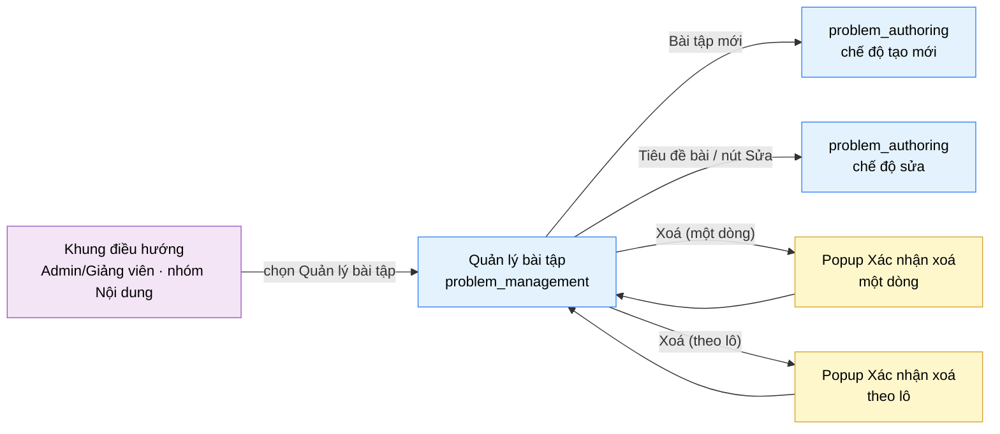

# Tài liệu thiết kế cơ bản (BD) — Quản lý bài tập (`SHR0201`)

## Phương châm tài liệu [Nội bộ — không cần khách duyệt]

- Viết theo **mẫu 9 sheet**. Bộ thẻ đóng, quy ước ID, ký hiệu chuẩn, ranh giới với tài liệu khác và
  checklist kiểm toán nằm ở `02-bd/_rules/bd-template-9sheet.md` — file này không chép lại.
- Phần gắn nhãn `[Nội bộ]` phục vụ sinh mã và tự kiểm toán, không phải yêu cầu của khách hàng: mục 4.5,
  mục 7.3 và các ghi chú quy ước.
- Mã màn `SHR0201` theo bảng mã ở `02-bd/_rules/bd-template-9sheet.md` mục 8; tên file mang tiền tố mã.
  Màn dùng chung nhiều vai trò (A2 + A3), mount ở cả `/instructor/problems` và `/admin/problems`, cùng
  một view/BD/DD [Nguồn: 01-rd/screens/shared/SHR0201_problem_management.md:4-9, `DEC-2026-0825-shared-content-authoring-screens`].
- Màn này không có màn con riêng của nó; nó là **màn cha điều phối** trỏ sang `problem_authoring`
  (`SHR0202`) cho việc soạn nội dung thật, và có 1 popup xác nhận: Xác nhận xoá (ẩn mềm).

> Đọc cùng `01-rd/screens/shared/SHR0201_problem_management.md` (hành vi ở mức yêu cầu, không lặp lại ở đây) và ba
> file BD module: `02-bd/architecture/problem-bank.md`, `02-bd/database/problem-bank.md`,
> `02-bd/security/problem-bank.md`. Khung điều hướng, thanh công cụ và chân trang khu Admin/Giảng viên
> dùng lại khung chung tương ứng của từng khu vực, không mô tả lại ở đây.
>
> **Phạm vi đã chốt trước khi viết BD** — theo RD mục 5 (Q1 → Q5, đã đóng), không mở lại:
> - Dùng chung một view cho A2 và A3; A2 chỉ thấy/sửa bài do chính mình soạn (quyền tác giả, không theo
>   lớp phụ trách), A3 thấy toàn bộ kho [Nguồn: 01-rd/screens/shared/SHR0201_problem_management.md:165 (Q1)].
>   **Xem Câu hỏi mở Q1 của file này** — schema `problem-bank` hiện chưa có cột lưu tác giả gốc.
> - Vòng đời bài toán đúng hai trạng thái `Chưa xuất bản`/`Đã xuất bản` (F2-15), không có `Đã ẩn`
>   [Nguồn: 01-rd/screens/shared/SHR0201_problem_management.md:166 (Q2); 02-bd/database/problem-bank.md:18].
> - Xoá là ẩn mềm: `problems.status` không đổi, chỉ bật `problems.deleted`
>   [Nguồn: 01-rd/screens/shared/SHR0201_problem_management.md:167 (Q3); 02-bd/database/problem-bank.md:19].
> - Giữ "Nhân bản" (F2-16) và "Xuất CSV" (F2-17); **cắt bỏ "Nhập CSV"** khỏi phạm vi
>   [Nguồn: 01-rd/screens/shared/SHR0201_problem_management.md:168 (Q4)].
> - 4 chỉ số tổng và khối "Bài cần chú ý" là chỉ số dẫn xuất, ngưỡng đã chốt: AC < 30%, chưa xuất bản > 7
>   ngày [Nguồn: 01-rd/screens/shared/SHR0201_problem_management.md:169 (Q5); 02-bd/database/problem-bank.md:167].
> - Không có "chấm lại hàng loạt" (rejudge) trên màn này — ngoài phạm vi toàn hệ thống
>   (`DEC-2026-0828-remove-rejudge-scope`).

---

## Sheet 1. Bìa

| Mục | Giá trị |
| :--- | :--- |
| Hệ thống | AlgoPrep |
| Phân hệ | `problem-bank` (F2) |
| Công đoạn | BD — Thiết kế cơ bản |
| Phân loại | Màn hình |
| Tên màn | Quản lý bài tập |
| Mã màn hình | `SHR0201` |
| Tên vật lý (slug) | `problem_management` |
| Trục tài liệu | Màn hình (`02-bd/screens/`) |
| Actor | A2 (`INSTRUCTOR`) / A3 (`ADMIN`) — dùng chung |
| Phiên bản | V1.0 |
| Người tạo | Nhóm phát triển AlgoPrep |
| Ngày tạo | 2026/09/20 |
| Người cập nhật | Nhóm phát triển AlgoPrep |
| Ngày cập nhật | 2026/09/20 |

---

## Sheet 2. Lịch sử sửa đổi

| Ver | Sheet bị sửa | Nội dung sửa | Ngày | Người sửa |
| :--- | :--- | :--- | :--- | :--- |
| V1.0 | Toàn bộ | Thay thế BD văn xuôi cũ (8 mục: layout, component inventory, screen states, API tiêu thụ, điều hướng, quyền, câu hỏi mở) bằng mẫu 9 sheet. Phát hiện lỗ hổng nguồn dữ liệu mới: schema `problem-bank` không có cột lưu tác giả gốc của bài toán, trong khi RD yêu cầu lọc theo quyền tác giả cho A2 — mở Q1. Ngưỡng "tỉ lệ AC trung bình 90 ngày" cũng không có nguồn cửa sổ thời gian trong read model `problem_stats` — mở Q2 | 2026/09/20 | Nhóm phát triển AlgoPrep |

---

## Sheet 3. Sơ đồ chuyển màn

> [Nội bộ] Quy ước vẽ: bố trí từ trái sang phải. Màn gọi tới tô tím, màn hiện tại tô xanh nhạt, popup tô
> vàng. Màu và `[Nguồn:]` dùng để truy vết, không phải yêu cầu của khách hàng.

### 3.1 Danh sách chuyển màn

#### Khung điều hướng (Admin hoặc Giảng viên) → Quản lý bài tập

[Điều kiện mở] Chọn mục con "Quản lý bài tập" trong nhóm "Nội dung" ở thanh điều hướng bên trái — route
`/admin/problems` (A3) hoặc `/instructor/problems` (A2), cùng một view
[Nguồn: 01-rd/screens/shared/SHR0201_problem_management.md:78-83; `DEC-2026-0825-shared-content-authoring-screens`].

[Chế độ mở] Chế độ danh sách, không lọc sẵn — tab độ khó và tab trạng thái đều ở "Tất cả".

[Thông tin truyền] Không có.

[Giá trị trả về] Không có.

[Khi thành công] Tải dải chỉ số tổng, trang đầu của bảng bài toán (phạm vi theo actor), khối "Phân bố theo
chủ đề" và khối "Bài cần chú ý".

[Khi huỷ] Không có.

#### Quản lý bài tập → `problem_authoring` (chế độ tạo mới)

[Điều kiện mở] Bấm nút "Bài tập mới" ở thanh tiêu đề
[Nguồn: 09-layoutBase/Admin - Quản lý bài tập.dc.html:159-160].

[Chế độ mở] Chế độ tạo mới, không có `problem_id`.

[Thông tin truyền] Không có.

[Giá trị trả về] Không có.

[Khi thành công] Mở màn `problem_authoring` (`SHR0202`) rỗng, chờ nhập nội dung mới.

[Khi huỷ] Không có.

#### Quản lý bài tập → `problem_authoring` (chế độ sửa)

[Điều kiện mở] Bấm tiêu đề bài toán trong bảng, hoặc bấm nút "Sửa" cuối dòng đó — cùng một đích, không
phải hai luồng khác nhau [Nguồn: 09-layoutBase/Admin - Quản lý bài tập.dc.html:219,227-228;
01-rd/screens/shared/SHR0201_problem_management.md:104-107,113-114].

[Chế độ mở] Chế độ sửa, kèm `problem_id` của dòng đó.

[Thông tin truyền] `problem_id` của dòng được chọn.

[Giá trị trả về] Không có.

[Khi thành công] Mở màn `problem_authoring` (`SHR0202`) đã nạp sẵn nội dung của bài toán đó.

[Khi huỷ] Không có.

#### Quản lý bài tập → Popup Xác nhận xoá (một dòng)

[Điều kiện mở] Bấm nút "Xoá" ở nhóm nút cuối một dòng trong bảng
[Nguồn: 09-layoutBase/Admin - Quản lý bài tập.dc.html:227-229].

[Chế độ mở] Chế độ xác nhận hành động phá huỷ (ẩn mềm).

[Thông tin truyền] `problem_id` của dòng đó, mã và tiêu đề bài toán, số lượt nộp bị ảnh hưởng.

[Giá trị trả về] Kết quả chọn "Xác nhận" hoặc "Huỷ".

[Khi thành công] Popup nêu rõ mã, tiêu đề, số lượt nộp bị ảnh hưởng và cảnh báo "Toàn bộ testcase và lượt
nộp liên quan sẽ bị ẩn khỏi trang người học. Hành động không thể hoàn tác."
[Nguồn: 09-layoutBase/Admin - Quản lý bài tập.dc.html:305-317; 01-rd/screens/shared/SHR0201_problem_management.md:154-156].

[Khi huỷ] Đóng popup, không đổi trạng thái bài toán nào.

#### Quản lý bài tập → Popup Xác nhận xoá (theo lô)

[Điều kiện mở] Đang chọn ít nhất một dòng và bấm "Xoá" trên thanh hành động theo lô
[Nguồn: 09-layoutBase/Admin - Quản lý bài tập.dc.html:196-206,591-592].

[Chế độ mở] Chế độ xác nhận hành động phá huỷ (ẩn mềm), áp dụng cho tập đã chọn tường minh.

[Thông tin truyền] Danh sách `problem_id` đang chọn, số lượng bài, tổng lượt nộp bị ảnh hưởng.

[Giá trị trả về] Kết quả chọn "Xác nhận" hoặc "Huỷ".

[Khi thành công] Popup liệt kê số bài chịu tác động (đúng tập đã tick, không áp lên toàn bộ kết quả lọc)
[Nguồn: 01-rd/screens/shared/SHR0201_problem_management.md:144-147] và cùng cảnh báo ẩn mềm như trên.

[Khi huỷ] Đóng popup, giữ nguyên danh sách đang chọn.

### 3.2 Sơ đồ

[Nguồn: 09-layoutBase/Admin - Quản lý bài tập.dc.html:159-160,196-206,219,227-229,305-317,591-592;
01-rd/screens/shared/SHR0201_problem_management.md:20-25,78-83]

---

## Sheet 4. Bố cục màn hình

### 4.1 Tổng quan màn

[Mục đích màn] Bảng quản trị nội dung ngân hàng bài toán: xem toàn bộ bài tập trong phạm vi được phép, tìm
và lọc theo độ khó/trạng thái, theo dõi sức khoẻ từng bài (lượt nộp, tỉ lệ AC, số testcase, lần sửa cuối),
xử lý theo lô, và mở luồng tạo/sửa đề bài
[Nguồn: 01-rd/screens/shared/SHR0201_problem_management.md:27-32].

[Luồng nghiệp vụ chính]

1. **Hiển thị ban đầu**: vào màn, hệ thống tải song song bốn nhóm dữ liệu — dải chỉ số tổng, trang đầu
   bảng bài toán (phạm vi theo actor), khối "Phân bố theo chủ đề" và khối "Bài cần chú ý". Trong lúc chờ,
   mỗi khối hiển thị khung chờ đúng số dòng dự kiến.
2. **Thu hẹp danh sách**: gõ từ khoá theo mã hoặc tiêu đề, chọn tab độ khó và tab trạng thái. Mỗi lần đổi
   điều kiện thì về trang 1 [Nguồn: 01-rd/screens/shared/SHR0201_problem_management.md:95-96].
3. **Chọn bài toán**: tích chọn từng dòng. Có ít nhất một dòng được chọn thì thanh hành động theo lô hiện
   ra, nhãn nêu rõ số đã chọn kể cả phần không nằm trong kết quả đang hiển thị
   [Nguồn: 01-rd/screens/shared/SHR0201_problem_management.md:148-153].
4. **Thực hiện hành động**: 5 hành động theo lô ("Xuất bản/ẩn", "Đổi độ khó", "Gán chủ đề", "Nhân bản",
   "Xuất CSV") thực thi trực tiếp không qua popup; riêng "Xoá" luôn qua popup xác nhận vì là hành động phá
   huỷ [Nguồn: 09-layoutBase/Admin - Quản lý bài tập.dc.html:196-206].
5. **Chặn xuất bản thiếu điều kiện**: bài chưa đạt checklist xuất bản (không đủ testcase Hidden/Sample,
   thiếu đặc tả) bị chặn cứng kèm lý do khi cố chuyển sang `Đã xuất bản`
   [Nguồn: 01-rd/screens/shared/SHR0201_problem_management.md:139-143; 02-bd/database/problem-bank.md:166].
6. **Làm mới**: sau khi một hành động ghi thành công, tải lại bảng, dải chỉ số tổng và hai khối phụ; bỏ
   danh sách đang chọn.

[Người dùng] A2 (`INSTRUCTOR`) hoặc A3 (`ADMIN`) đã đăng nhập, có Function `PROBLEM_AUTHORING`
[Nguồn: 02-bd/database/identity.md:47-49; 02-bd/security/problem-bank.md:5-10].

[Tệp liên quan] Xuất CSV (metadata bảng, không đề bài/testcase) — định dạng và trường cụ thể chốt ở DD
[Nguồn: 01-rd/screens/shared/SHR0201_problem_management.md:168 (Q4, F2-17)].

[Phạm vi]
- Không soạn/sửa nội dung bài toán thật (Markdown/LaTeX, chữ ký hàm, testcase) trên màn này — thuộc
  `problem_authoring` (`SHR0202`) [Nguồn: 01-rd/screens/shared/SHR0201_problem_management.md:34-38].
- Không có "Nhập CSV" — cắt khỏi phạm vi (Q4 RD đã đóng).
- Không có "chấm lại hàng loạt" — ngoài phạm vi toàn hệ thống (`DEC-2026-0828-remove-rejudge-scope`).
- Không hiển thị bookmark của học viên dưới bất kỳ hình thức nào, kể cả số tổng hợp ẩn danh
  [Nguồn: 02-bd/security/problem-bank.md:48-56].
- Phạm vi dữ liệu theo tác giả cho A2 **chưa có cột nguồn trong DB** — xem Câu hỏi mở Q1.

[Quyền sử dụng]
- Xem: được, khi có `PROBLEM_AUTHORING:READ`.
- Thêm (điều hướng sang tạo mới, và "Nhân bản"): được, khi có `PROBLEM_AUTHORING:CREATE`.
- Sửa (xuất bản/ẩn, đổi độ khó, gán chủ đề): được, khi có `PROBLEM_AUTHORING:UPDATE`.
- Xoá (ẩn mềm): được, khi có `PROBLEM_AUTHORING:DELETE`.
- Xuất CSV: được, khi có `PROBLEM_AUTHORING:READ` [Nguồn: 02-bd/security/problem-bank.md:5-18].

[Số bản ghi tối đa] Bảng bài toán phân trang phía máy chủ; prototype hiển thị 8 dòng một trang
[Nguồn: 09-layoutBase/Admin - Quản lý bài tập.dc.html:236-245] — kích thước trang thật chốt ở DD. Dải chỉ
số: đúng 4 thẻ. Khối "Bài cần chú ý": tối đa 4 dòng (một dòng mỗi quy tắc phát hiện).

[Nguồn: 01-rd/screens/shared/SHR0201_problem_management.md:27-159; 02-bd/database/problem-bank.md:8-29,166-170;
02-bd/security/problem-bank.md:1-56]

### 4.2 DTO liên quan

- `ProblemManagementListItemDto`
- `ProblemManagementStatsDto`
- `TopicDistributionItemDto`
- `AttentionItemDto`
- `TopicOptionDto`
- `BulkProblemActionResultDto`

`[Suy luận]` — tên DTO do BD này đề xuất, `03-dd/api/problem-bank.md` chốt lại.

### 4.3 Bảng dữ liệu liên quan (5)

| NO | Bảng | Ghi chú |
| --: | :--- | :--- |
| 1 | `problems` | [Nguồn: 02-bd/database/problem-bank.md:8-29] |
| 2 | `topics` | [Nguồn: 02-bd/database/problem-bank.md:37-38] |
| 3 | `problem_topics` | [Nguồn: 02-bd/database/problem-bank.md:37-39] |
| 4 | `testcases` | [Nguồn: 02-bd/database/problem-bank.md:83-99] |
| 5 | `problem_stats` (read model) | [Nguồn: 02-bd/database/problem-bank.md:138] |

Bảng `tags`/`problem_tags` không dùng ở màn này — cột "Chủ đề" và khối "Phân bố theo chủ đề" đọc `topics`
(danh mục cố định, F2-02), không phải `tags` (nhãn tự do, dùng để lọc chi tiết hơn ở `problem_list`)
[Nguồn: 02-bd/database/problem-bank.md:35-45]. Bảng `bookmarks` không xuất hiện — màn này không có quyền
đọc bookmark của học viên [Nguồn: 02-bd/security/problem-bank.md:48-56].

### 4.4 Vùng bố cục

Đối chiếu `09-layoutBase/Admin - Quản lý bài tập.dc.html` — bằng chứng bố cục chỉ-đọc, **không phải**
design system cuối cùng. Khu Giảng viên mount cùng view, chưa có prototype riêng
[Nguồn: 01-rd/screens/shared/SHR0201_problem_management.md:11-12; `06-plan/PROTOTYPE_DEBT.md` mục 7.3.a].

| Vùng | Vị trí trong prototype | Nội dung |
| :--- | :--- | :--- |
| Thanh điều hướng bên trái (khung chung) | `:343,348-352` | Nhóm "Nội dung" đang mở, mục con "Quản lý bài tập" đang chọn, badge `27` — dùng lại khung chung của khu Admin/Giảng viên |
| Thanh tiêu đề dính trên | `:150-160` | Tiêu đề, dòng phụ đếm tổng và số bài công khai, nút "Bài tập mới" |
| Dải chỉ số tổng | `:162-173`, dữ liệu `:477-482` | Lưới 4 thẻ số liệu: Tổng bài tập, Đã xuất bản, Chưa xuất bản, Tỉ lệ AC trung bình |
| Thanh lọc và tìm kiếm | `:177-193` | Ô tìm mã/tiêu đề, tab độ khó 4 mục, tab trạng thái 3 mục, bộ đếm kết quả |
| Thanh hành động theo lô | `:196-206,591` | Chỉ hiện khi `selectedCount > 0`; nhãn số đã chọn và 5 nút hành động + nút Xoá |
| Bảng bài toán | `:208-232`, sort `:518-528`, màu AC `:539` | Lưới 10 cột, 7 cột sắp xếp được |
| Phân trang | `:236-245,513-516,595` | Nhãn trang và hai nút "Trước" / "Sau", 8 dòng/trang |
| Khối "Phân bố theo chủ đề" | `:249-265`, dữ liệu `:566-572` | Thanh ngang tỉ lệ theo từng chủ đề |
| Khối "Bài cần chú ý" | `:267-283`, dữ liệu `:574-579` | 4 quy tắc tự phát hiện |
| Hộp thoại xác nhận xoá | `:304-317` | Dùng chung cho xoá một dòng và xoá theo lô |
| Chân trang (khung chung) | Ngoài phạm vi trích dẫn của RD | Dùng lại khung chung Admin/Giảng viên |

Hai khối phụ (Phân bố theo chủ đề, Bài cần chú ý) nằm cạnh nhau, xếp chồng trên màn hẹp — giữ nguyên cấu
trúc này khi dựng Next.js; không quy định màu sắc, khoảng cách hay typography ở BD.

**Cảnh báo dữ liệu mẫu tự mâu thuẫn của prototype** — dòng phụ khối "Phân bố theo chủ đề" ghi "486 bài
trên 12 chủ đề" trong khi toàn bộ phần còn lại của màn nói 27 bài và danh sách chủ đề chỉ có 8 chủ đề thật
[Nguồn: 01-rd/screens/shared/SHR0201_problem_management.md:114-118]. Đây là dữ liệu mẫu sai, không phải yêu cầu;
khi dựng UI thật, con số phải suy ra từ chính tập dữ liệu đang hiển thị (xem công thức Sheet 5, khu vực G).

### 4.5 Cấu trúc slice FSD [Nội bộ]

| Khối | Slice dự kiến | Căn cứ |
| :--- | :--- | :--- |
| Trang | `views/problem-management` | Quy ước FSD của dự án |
| Khung Admin/Giảng viên | Dùng lại khung chung của từng khu vực | Ngoài phạm vi file này |
| Dải chỉ số | `widgets/problem-stat-strip` | Prototype `:162-173` |
| Bảng bài toán | `widgets/problem-table` + `entities/problem` | Prototype `:177-245` |
| Bộ lọc | `features/problem-filter` | Prototype `:177-193` |
| Hành động theo lô | `features/problem-bulk-action` | Prototype `:196-206` |
| Hai khối phụ | `widgets/topic-distribution`, `widgets/problem-attention-list` | Prototype `:249-283` |
| Popup xác nhận xoá | `features/problem-delete-confirm` | Prototype `:304-317` |

`[Suy luận]` — ánh xạ slice do BD đề xuất, DD màn hình chốt lại.

> [Nội bộ] Ảnh minh hoạ đặt ở `08-diagram/02-bd/screens/shared/`, chụp bằng Playwright trên ứng dụng
> Next.js thật khi đã có mã chạy được. Chưa có thì tham chiếu prototype, không vẽ tay.

---

## Sheet 5. Danh sách item màn hình

> Quy ước ID, bộ thẻ và giá trị chuẩn: `02-bd/_rules/bd-template-9sheet.md` mục 2, 3, 4.

### Khu vực A — Thanh tiêu đề

| Khu vực | NO | Tên item | ID item | Bảng DB | Cột DB | Loại UI | Kiểu | Độ dài | Bắt buộc | I/O | Giá trị mặc định | Định dạng | Ghi chú |
| :--- | --: | :--- | :--- | :--- | :--- | :--- | :--- | :--- | :-: | :-: | :--- | :--- | :--- |
| Thanh tiêu đề | | | | | | | | | | | | | |
| | 1 | Tiêu đề màn | `problemManagement.header.title` | - | - | Label | String | - | - | O | Quản lý bài tập | - | Tên màn hiển thị cố định [Nguồn giá trị] Nhãn tĩnh i18n [EVT liên quan] - |
| | 2 | Mô tả phụ | `problemManagement.header.subtitle` | `problems` | `status`, `deleted` | Label | String | - | - | O | - | `{tổng} bài · {đã xuất bản} bài đang hiển thị ở Ngân hàng bài toán` | Đếm tổng số bài trong phạm vi actor và số bài `PUBLISHED` — phải bằng đúng số bài `problem_list` của người học thấy [Công thức] `{tổng}` = COUNT(`problems` WHERE `deleted = false`, phạm vi theo actor); `{đã xuất bản}` = COUNT(cùng tập, `status = 'PUBLISHED'`) [Nguồn: 01-rd/screens/shared/SHR0201_problem_management.md:132-135] [EVT liên quan] EVT-1 |
| | 3 | Bài tập mới | `problemManagement.header.btnCreate` | - | - | Button | - | - | - | I | - | - | Mở `problem_authoring` chế độ tạo mới [Nguồn giá trị] - [EVT liên quan] EVT-9 |

### Khu vực B — Dải chỉ số tổng

| Khu vực | NO | Tên item | ID item | Bảng DB | Cột DB | Loại UI | Kiểu | Độ dài | Bắt buộc | I/O | Giá trị mặc định | Định dạng | Ghi chú |
| :--- | --: | :--- | :--- | :--- | :--- | :--- | :--- | :--- | :-: | :-: | :--- | :--- | :--- |
| Dải chỉ số tổng | | | | | | | | | | | | | |
| | 1 | Tổng bài tập | `problemManagement.stat.total` | `problems` | `deleted` | Label | Number | 8 | - | O | 0 | Số nguyên | Tổng số bài trong phạm vi actor [Công thức] COUNT(`problems` WHERE `deleted = false`, phạm vi theo actor) [EVT liên quan] EVT-1 |
| | 2 | Đã xuất bản | `problemManagement.stat.published` | `problems` | `status` | Label | Number | 8 | - | O | 0 | Số nguyên | Số bài đang hiển thị ở `problem_list` [Công thức] COUNT(`status = 'PUBLISHED' AND deleted = false`, phạm vi theo actor) [Nguồn: 01-rd/screens/shared/SHR0201_problem_management.md:49] [EVT liên quan] EVT-1 |
| | 3 | Chưa xuất bản | `problemManagement.stat.unpublished` | `problems` | `status` | Label | Number | 8 | - | O | 0 | Số nguyên | Số bài chưa công khai [Công thức] COUNT(`status = 'UNPUBLISHED' AND deleted = false`, phạm vi theo actor) [EVT liên quan] EVT-1 |
| | 4 | Tỉ lệ AC trung bình | `problemManagement.stat.avgAcRate` | `problem_stats` | `ac_rate` | Label | Number | 5 | - | O | 0 | Phần trăm một chữ số thập phân | Tỉ lệ Accepted trung bình [Nguồn giá trị] **Chưa có nguồn đúng cửa sổ 90 ngày** — `problem_stats.ac_rate` là read model toàn thời gian, không có trường theo cửa sổ thời gian trượt, xem Q2 [EVT liên quan] EVT-1 |
| | 5 | Chú thích của thẻ "Đã xuất bản" | `problemManagement.stat.col.publishedMeta` | - | - | ListColumn | String | - | - | O | - | Đúng bằng số bài trang người học thấy | Nhãn tĩnh i18n [Nguồn giá trị] Nhãn tĩnh i18n [EVT liên quan] - |
| | 6 | Chú thích của thẻ "Chưa xuất bản" | `problemManagement.stat.col.unpublishedMeta` | `testcases`, `problems` | - | ListColumn | String | - | - | O | - | `{số} bài chưa có testcase` | Số bài chưa xuất bản và chưa có testcase nào [Công thức] COUNT(`problems` WHERE `status = 'UNPUBLISHED' AND deleted = false` AND không tồn tại dòng `testcases` khớp `problem_id`, phạm vi theo actor) [EVT liên quan] EVT-1 |

### Khu vực C — Bộ lọc và hành động theo lô

| Khu vực | NO | Tên item | ID item | Bảng DB | Cột DB | Loại UI | Kiểu | Độ dài | Bắt buộc | I/O | Giá trị mặc định | Định dạng | Ghi chú |
| :--- | --: | :--- | :--- | :--- | :--- | :--- | :--- | :--- | :-: | :-: | :--- | :--- | :--- |
| Bộ lọc và hành động theo lô | | | | | | | | | | | | | |
| | 1 | Ô tìm kiếm | `problemManagement.filter.query` | `problems` | `code`, `title` | TextBox | String | 100 | - | I | rỗng | - | Tìm theo mã hoặc tiêu đề [Nguồn: 09-layoutBase/Admin - Quản lý bài tập.dc.html:181] [Nguồn giá trị] Giá trị người dùng nhập [EVT liên quan] EVT-2 |
| | 2 | Tab độ khó | `problemManagement.filter.difficultyTabs` | `problems` | `difficulty` | Button | Enum | - | - | I | Tất cả | - | 4 tab: Tất cả, Easy, Medium, Hard [Nguồn: 01-rd/screens/shared/SHR0201_problem_management.md:93-94] [Nguồn giá trị] Nhãn tĩnh i18n map từ `difficulty` [EVT liên quan] EVT-3 |
| | 3 | Tab trạng thái | `problemManagement.filter.statusTabs` | `problems` | `status` | Button | Enum | - | - | I | Tất cả | - | 3 tab: Tất cả, Đã xuất bản, Chưa xuất bản — đúng hai trạng thái của F2-15, không có tab thứ tư [Nguồn: 01-rd/screens/shared/SHR0201_problem_management.md:97-99] [Nguồn giá trị] Nhãn tĩnh i18n map từ `status` [EVT liên quan] EVT-4 |
| | 4 | Số kết quả | `problemManagement.filter.resultCount` | - | - | Label | String | - | - | O | - | `{số} / {số} bài` | Số dòng khớp bộ lọc trên tổng số trong phạm vi actor [Công thức] Cả hai số lấy từ phản hồi của `ListProblemsAdmin` [EVT liên quan] EVT-2, EVT-3, EVT-4 |
| | 5 | Nhãn số đã chọn | `problemManagement.bulk.selectionLabel` | - | - | Label | String | - | - | O | - | `Đã chọn {số} bài` hoặc `Đã chọn {số} bài (trong đó {số} bài không nằm trong kết quả hiện tại)` | Số bài đang được tích chọn, kèm phần không hiển thị nếu có [Công thức] Đếm số `problem_id` đang tích chọn ở trạng thái màn hình; phần "không hiển thị" là số `problem_id` đã chọn nhưng không có trong trang kết quả hiện tại [Nguồn: 01-rd/screens/shared/SHR0201_problem_management.md:148-153] [EVT liên quan] EVT-5 |
| | 6 | Xuất bản / ẩn | `problemManagement.bulk.btnTogglePublish` | - | - | Button | - | - | - | I | - | - | Xuất bản hoặc rút xuống các bài đã chọn (F2-15 dạng thao tác lô) [Nguồn giá trị] - [EVT liên quan] EVT-11 |
| | 7 | Đổi độ khó | `problemManagement.bulk.btnChangeDifficulty` | - | - | Button | - | - | - | I | - | - | Đổi độ khó cho các bài đã chọn (F2-02 dạng thao tác lô) [Nguồn giá trị] - [EVT liên quan] EVT-12 |
| | 8 | Gán chủ đề | `problemManagement.bulk.btnAssignTopic` | - | - | Button | - | - | - | I | - | - | Gán một chủ đề cho các bài đã chọn (F2-02 dạng thao tác lô) [Nguồn giá trị] - [EVT liên quan] EVT-13 |
| | 9 | Nhân bản | `problemManagement.bulk.btnDuplicate` | - | - | Button | - | - | - | I | - | - | Tạo bản sao độc lập ở trạng thái `Chưa xuất bản` cho mỗi bài đã chọn (F2-16) [Nguồn giá trị] - [EVT liên quan] EVT-14 |
| | 10 | Xuất CSV | `problemManagement.bulk.btnExportCsv` | - | - | Button | - | - | - | I | - | - | Xuất CSV metadata cho các bài đã chọn (F2-17) [Nguồn giá trị] - [EVT liên quan] EVT-15 |
| | 11 | Xoá | `problemManagement.bulk.btnDelete` | - | - | Button | - | - | - | I | - | - | Mở popup xác nhận xoá theo lô (ẩn mềm, F2-15) [Nguồn giá trị] - [EVT liên quan] EVT-17 |

### Khu vực D — Bảng bài toán

| Khu vực | NO | Tên item | ID item | Bảng DB | Cột DB | Loại UI | Kiểu | Độ dài | Bắt buộc | I/O | Giá trị mặc định | Định dạng | Ghi chú |
| :--- | --: | :--- | :--- | :--- | :--- | :--- | :--- | :--- | :-: | :-: | :--- | :--- | :--- |
| Bảng bài toán | | | | | | | | | | | | | |
| | 1 | Danh sách bài toán | `problemManagement.list` | `problems` | - | List | List | - | - | O | rỗng | - | Mỗi dòng là một bài toán. Phân trang phía máy chủ [Nguồn giá trị] Kết quả gọi `ListProblemsAdmin` [EVT liên quan] EVT-1 |
| | 2 | Ô chọn dòng | `problemManagement.list.col.checkbox` | - | - | Button | Boolean | - | - | I | Không chọn | - | Tích chọn bài toán trên dòng đó để đưa vào hành động theo lô. Trạng thái tồn tại trên màn, giữ nguyên qua đổi trang/đổi lọc [Nguồn: 01-rd/screens/shared/SHR0201_problem_management.md:144-153] [Nguồn giá trị] Trạng thái chọn của màn hình [EVT liên quan] EVT-5 |
| | 3 | Mã | `problemManagement.list.col.code` | `problems` | `code` | ListColumn | String | - | - | O | - | - | Mã ngắn của bài toán, sắp xếp được [Nguồn giá trị] Cột `code` [EVT liên quan] EVT-6 |
| | 4 | Tiêu đề | `problemManagement.list.col.title` | `problems` | `title` | Link | String | - | - | O | - | - | Tiêu đề bài toán, bấm vào mở `problem_authoring` chế độ sửa, sắp xếp được [Nguồn giá trị] Cột `title` [EVT liên quan] EVT-6, EVT-10 |
| | 5 | Chủ đề | `problemManagement.list.col.topics` | `topics` | `name` | ListColumn | String | - | - | O | - | Danh sách phân cách bởi dấu phẩy | Các chủ đề đã gán cho bài, qua bảng nối [Nguồn giá trị] `topics.name` qua `problem_topics.problem_id` [Nguồn: 02-bd/database/problem-bank.md:37-39] [EVT liên quan] - |
| | 6 | Độ khó | `problemManagement.list.col.difficulty` | `problems` | `difficulty` | Badge | Enum | - | - | O | - | Nhãn tiếng Việt | Ba mức Easy/Medium/Hard, sắp xếp được [Nguồn giá trị] Cột `difficulty` [Nguồn: 02-bd/database/problem-bank.md:17] [EVT liên quan] EVT-6 |
| | 7 | Trạng thái | `problemManagement.list.col.status` | `problems` | `status` | Badge | Enum | - | - | O | - | Nhãn tiếng Việt kèm chấm màu | Hai giá trị `PUBLISHED`/`UNPUBLISHED`, sắp xếp được [Nguồn giá trị] `PUBLISHED` thành "Đã xuất bản", `UNPUBLISHED` thành "Chưa xuất bản" [Nguồn: 02-bd/database/problem-bank.md:18] [EVT liên quan] EVT-6 |
| | 8 | Lượt nộp | `problemManagement.list.col.submissionCount` | `problem_stats` | `submission_count` | ListColumn | Number | 8 | - | O | 0 | Số nguyên phân cách nghìn | Tổng số lượt nộp của bài, sắp xếp được [Nguồn giá trị] Read model tổng hợp từ domain event [Nguồn: 02-bd/database/problem-bank.md:138] [EVT liên quan] EVT-6 |
| | 9 | AC | `problemManagement.list.col.acRate` | `problem_stats` | `ac_rate` | ListColumn | Number | 5 | - | O | 0 | Phần trăm, đổi màu theo ngưỡng 60% và 35% | Tỉ lệ Accepted, sắp xếp được [Nguồn giá trị] Cột `ac_rate` [Nguồn: 02-bd/database/problem-bank.md:138] [Công thức] Màu xanh khi ≥ 60%, màu vàng khi 35–59%, màu đỏ khi < 35% [Nguồn: 01-rd/screens/shared/SHR0201_problem_management.md:107-108] [EVT liên quan] EVT-6 |
| | 10 | TC · Sửa cuối | `problemManagement.list.col.testcaseAndUpdated` | `testcases`, `problems` | -, `updated_at` | ListColumn | String | - | - | O | - | `{số testcase} TC · {mô tả tương đối}` | Số testcase hiện có và thời điểm sửa cuối, gộp một cột [Công thức] Số testcase = COUNT(`testcases` WHERE `problem_id` khớp dòng); mô tả tương đối tính từ `problems.updated_at` [Nguồn: 09-layoutBase/Admin - Quản lý bài tập.dc.html:210-211 (RD mục 3.6)] [EVT liên quan] - |
| | 11 | Sửa | `problemManagement.list.col.btnEdit` | - | - | Button | - | - | - | I | - | - | Mở `problem_authoring` chế độ sửa cho dòng đó — cùng đích với bấm tiêu đề [Nguồn giá trị] - [EVT liên quan] EVT-10 |
| | 12 | Xoá | `problemManagement.list.col.btnDelete` | - | - | Button | - | - | - | I | - | - | Mở popup xác nhận xoá cho một dòng (ẩn mềm) [Nguồn giá trị] - [EVT liên quan] EVT-16 |
| | 13 | Nhãn trang | `problemManagement.paging.label` | - | - | Label | String | - | - | O | - | `Trang {số} trong {số} · hiển thị {số} dòng` | Vị trí trang hiện tại và số dòng đang hiển thị [Công thức] Lấy từ phần phân trang trong phản hồi của `ListProblemsAdmin` [EVT liên quan] EVT-7, EVT-8 |
| | 14 | Trang trước | `problemManagement.paging.btnPrev` | - | - | Button | - | - | - | I | - | - | Lùi về trang liền trước [Nguồn giá trị] - [EVT liên quan] EVT-7 |
| | 15 | Trang sau | `problemManagement.paging.btnNext` | - | - | Button | - | - | - | I | - | - | Tiến tới trang liền sau [Nguồn giá trị] - [EVT liên quan] EVT-8 |

### Khu vực E — Phân bố theo chủ đề

| Khu vực | NO | Tên item | ID item | Bảng DB | Cột DB | Loại UI | Kiểu | Độ dài | Bắt buộc | I/O | Giá trị mặc định | Định dạng | Ghi chú |
| :--- | --: | :--- | :--- | :--- | :--- | :--- | :--- | :--- | :-: | :-: | :--- | :--- | :--- |
| Phân bố theo chủ đề | | | | | | | | | | | | | |
| | 1 | Tiêu đề khối | `problemManagement.topicDist.title` | - | - | Label | String | - | - | O | Phân bố theo chủ đề | - | Nhãn tĩnh i18n [Nguồn giá trị] Nhãn tĩnh i18n [EVT liên quan] - |
| | 2 | Chú thích tổng | `problemManagement.topicDist.subtitle` | `problems`, `topics` | - | Label | String | - | - | O | - | `Tổng {số} bài trên {số} chủ đề` | Tổng số bài có ít nhất một chủ đề và tổng số chủ đề khác nhau đang được dùng, tính trên phạm vi actor — **không dùng số mẫu tự mâu thuẫn của prototype** [Nguồn: 01-rd/screens/shared/SHR0201_problem_management.md:114-118] [Công thức] `{số bài}` = COUNT(`problems` phạm vi theo actor, `deleted = false`); `{số chủ đề}` = COUNT DISTINCT `topic_id` trong `problem_topics` của cùng tập [EVT liên quan] EVT-1 |
| | 3 | Danh sách chủ đề | `problemManagement.topicDist.list` | `topics` | - | List | List | - | - | O | rỗng | - | Mỗi dòng một chủ đề đang được dùng trong phạm vi actor [Nguồn giá trị] Kết quả gọi `GetTopicDistribution` [EVT liên quan] EVT-1 |
| | 4 | Tên chủ đề | `problemManagement.topicDist.col.name` | `topics` | `name` | ListColumn | String | - | - | O | - | - | Tên chủ đề hiển thị [Nguồn giá trị] Cột `name` [EVT liên quan] - |
| | 5 | Số lượng và tỉ lệ | `problemManagement.topicDist.col.value` | `problems`, `problem_topics` | - | ListColumn | String | - | - | O | - | `{số} · {số}%` | Số bài gán chủ đề đó và tỉ lệ trên tổng số bài có chủ đề [Công thức] Số bài = COUNT(`problem_topics` WHERE `topic_id` khớp, join `problems` phạm vi actor); tỉ lệ = số bài chia tổng số bài có ít nhất một chủ đề. Một bài có thể thuộc nhiều chủ đề nên tổng tỉ lệ không nhất thiết bằng 100% `[Suy luận]` — RD không nói rõ cách chuẩn hoá khi một bài đa chủ đề [EVT liên quan] - |
| | 6 | Thanh tỉ lệ | `problemManagement.topicDist.col.bar` | - | - | ProgressBar | Number | - | - | O | - | - | Biểu diễn trực quan tỉ lệ [Công thức] Chiều rộng bằng đúng tỉ lệ phần trăm của dòng [EVT liên quan] - |

### Khu vực F — Bài cần chú ý

| Khu vực | NO | Tên item | ID item | Bảng DB | Cột DB | Loại UI | Kiểu | Độ dài | Bắt buộc | I/O | Giá trị mặc định | Định dạng | Ghi chú |
| :--- | --: | :--- | :--- | :--- | :--- | :--- | :--- | :--- | :-: | :-: | :--- | :--- | :--- |
| Bài cần chú ý | | | | | | | | | | | | | |
| | 1 | Tiêu đề khối | `problemManagement.attention.title` | - | - | Label | String | - | - | O | Bài cần chú ý | - | Nhãn tĩnh i18n, kèm chú thích "Tự phát hiện" [Nguồn: 01-rd/screens/shared/SHR0201_problem_management.md:119] [Nguồn giá trị] Nhãn tĩnh i18n [EVT liên quan] - |
| | 2 | Danh sách quy tắc | `problemManagement.attention.list` | `problems`, `testcases`, `problem_stats` | - | List | List | - | - | O | tối đa 4 dòng | - | Đúng 4 quy tắc phát hiện (mục 3 chi tiết bên dưới) [Nguồn giá trị] Kết quả gọi `GetAttentionList` [EVT liên quan] EVT-1 |
| | 3 | Tên quy tắc | `problemManagement.attention.col.title` | - | - | ListColumn | String | - | - | O | - | - | Nhãn tĩnh i18n map từ mã quy tắc: "Chưa có testcase", "Tỉ lệ AC thấp", "Đang ẩn khỏi người học", "Bản nháp quá hạn" [Nguồn giá trị] Nhãn tĩnh i18n [EVT liên quan] - |
| | 4 | Chú thích quy tắc | `problemManagement.attention.col.meta` | - | - | ListColumn | String | - | - | O | - | - | Câu giải thích ngưỡng, ví dụ "Tỉ lệ AC dưới 30%" hoặc "Chưa xuất bản quá 7 ngày" [Nguồn giá trị] Nhãn tĩnh i18n map từ mã quy tắc [EVT liên quan] - |
| | 5 | Số lượng | `problemManagement.attention.col.count` | `problems`, `testcases`, `problem_stats` | - | ListColumn | Number | 6 | - | O | 0 | Số nguyên | Số bài khớp quy tắc, phạm vi theo actor [Công thức] Quy tắc "Chưa có testcase": COUNT(`problems` không có dòng `testcases` khớp). "Tỉ lệ AC thấp": COUNT(`problem_stats.ac_rate < 0.30`). "Đang ẩn khỏi người học": COUNT(`status = 'UNPUBLISHED' AND published_at IS NOT NULL`). "Bản nháp quá hạn": COUNT(`status = 'UNPUBLISHED' AND published_at IS NULL AND created_at < now() - interval '7 days'`) [Nguồn: 01-rd/screens/shared/SHR0201_problem_management.md:119-124; 02-bd/database/problem-bank.md:167] [EVT liên quan] - |

### Popup

| Khu vực | NO | Tên item | ID item | Bảng DB | Cột DB | Loại UI | Kiểu | Độ dài | Bắt buộc | I/O | Giá trị mặc định | Định dạng | Ghi chú |
| :--- | --: | :--- | :--- | :--- | :--- | :--- | :--- | :--- | :-: | :-: | :--- | :--- | :--- |
| Popup | | | | | | | | | | | | | |
| | 1 | Xác nhận xoá | `problemManagement.popup.deleteConfirm` | `problems`, `problem_stats` | `code`, `title`, `submission_count` | Popup | - | - | - | I | - | Xác nhận / Huỷ | Xác nhận trước khi ẩn mềm một bài hoặc nhiều bài đã chọn; liệt kê mã, tiêu đề và số lượt nộp bị ảnh hưởng [Nguồn: 01-rd/screens/shared/SHR0201_problem_management.md:154-156] [Nguồn giá trị] Bài toán đang thao tác hoặc danh sách đang chọn [EVT liên quan] EVT-16, EVT-17, EVT-18, EVT-19 |

[Nguồn: 09-layoutBase/Admin - Quản lý bài tập.dc.html:150-317,477-482,513-528,539,566-579,591-595;
02-bd/database/problem-bank.md:8-29,37-39,83-99,138,166-170; 01-rd/screens/shared/SHR0201_problem_management.md:27-159]

---

## Sheet 6. Đặc tả điều khiển item

> Ký hiệu cột `Hiển thị` và thứ tự thẻ: `02-bd/_rules/bd-template-9sheet.md` mục 2, 3. Dùng đúng NO, tên
> item và thứ tự của Sheet 5. Lỗi nhập liệu ghi ở Sheet 9, xử lý nghiệp vụ ghi ở Sheet 8.

### Khu vực A — Thanh tiêu đề

| Khu vực | NO | Tên item | Hiển thị | Ghi chú |
| :--- | --: | :--- | :-: | :--- |
| Thanh tiêu đề | | | | |
| | 1 | Tiêu đề màn | Có | - |
| | 2 | Mô tả phụ | Có | [Điều kiện hiển thị] Trong lúc tải hiển thị khung chờ dạng dòng chữ. |
| | 3 | Bài tập mới | Điều kiện | [Điều kiện hiển thị] Luôn hiển thị. [Điều kiện kích hoạt] Kích hoạt khi có quyền `PROBLEM_AUTHORING:CREATE`; không có quyền thì hiển thị nhưng không kích hoạt. |

### Khu vực B — Dải chỉ số tổng

| Khu vực | NO | Tên item | Hiển thị | Ghi chú |
| :--- | --: | :--- | :-: | :--- |
| Dải chỉ số tổng | | | | |
| | 1 | Tổng bài tập | Có | [Điều kiện hiển thị] Trong lúc tải hiển thị khung chờ đúng 4 thẻ. |
| | 2 | Đã xuất bản | Có | - |
| | 3 | Chưa xuất bản | Có | - |
| | 4 | Tỉ lệ AC trung bình | Điều kiện | [Điều kiện hiển thị] Chỉ hiển thị khi Q2 đã chốt nguồn cửa sổ 90 ngày; chưa chốt thì ẩn cả thẻ, không hiển thị số tính sai cửa sổ thời gian. |
| | 5 | Chú thích của thẻ "Đã xuất bản" | Có | - |
| | 6 | Chú thích của thẻ "Chưa xuất bản" | Có | [Tự động đặt] Cập nhật lại sau mỗi lần tải khối. |

### Khu vực C — Bộ lọc và hành động theo lô

| Khu vực | NO | Tên item | Hiển thị | Ghi chú |
| :--- | --: | :--- | :-: | :--- |
| Bộ lọc và hành động theo lô | | | | |
| | 1 | Ô tìm kiếm | Có | [Điều kiện kích hoạt] Không kích hoạt trong lúc đang tải trang đầu. [Tự động đặt] Gõ xong thì chờ một khoảng ngắn mới gọi máy chủ; mỗi lần gọi đưa về trang 1. |
| | 2 | Tab độ khó | Có | [Tự động đặt] Đổi tab thì đưa về trang 1. |
| | 3 | Tab trạng thái | Có | [Tự động đặt] Đổi tab thì đưa về trang 1. |
| | 4 | Số kết quả | Có | [Tự động đặt] Cập nhật lại sau mỗi lần tải danh sách. |
| | 5 | Nhãn số đã chọn | Điều kiện | [Điều kiện hiển thị] Cả thanh hành động theo lô chỉ hiển thị khi có ít nhất một dòng được chọn. |
| | 6 | Xuất bản / ẩn | Điều kiện | [Điều kiện hiển thị] Theo thanh hành động theo lô. [Điều kiện kích hoạt] Kích hoạt khi có quyền `PROBLEM_AUTHORING:UPDATE`. |
| | 7 | Đổi độ khó | Điều kiện | [Điều kiện hiển thị] Theo thanh hành động theo lô. [Điều kiện kích hoạt] Kích hoạt khi có quyền `PROBLEM_AUTHORING:UPDATE`. |
| | 8 | Gán chủ đề | Điều kiện | [Điều kiện hiển thị] Theo thanh hành động theo lô. [Điều kiện kích hoạt] Kích hoạt khi có quyền `PROBLEM_AUTHORING:UPDATE`. |
| | 9 | Nhân bản | Điều kiện | [Điều kiện hiển thị] Theo thanh hành động theo lô. [Điều kiện kích hoạt] Kích hoạt khi có quyền `PROBLEM_AUTHORING:CREATE`. |
| | 10 | Xuất CSV | Điều kiện | [Điều kiện hiển thị] Theo thanh hành động theo lô. [Điều kiện kích hoạt] Kích hoạt khi có quyền `PROBLEM_AUTHORING:READ`. |
| | 11 | Xoá | Điều kiện | [Điều kiện hiển thị] Theo thanh hành động theo lô. [Điều kiện kích hoạt] Kích hoạt khi có quyền `PROBLEM_AUTHORING:DELETE`. |

### Khu vực D — Bảng bài toán

| Khu vực | NO | Tên item | Hiển thị | Ghi chú |
| :--- | --: | :--- | :-: | :--- |
| Bảng bài toán | | | | |
| | 1 | Danh sách bài toán | Có | [Điều kiện hiển thị] Trong lúc tải hiển thị khung chờ đúng số dòng của một trang. Tải xong mà không có dòng nào thì hiển thị thông báo rỗng thay cho bảng — đây là kết quả lọc rỗng, **không phải** lỗi. |
| | 2 | Ô chọn dòng | Có | [Điều kiện kích hoạt] Không kích hoạt trong lúc một hành động theo lô đang chạy. [Tự động xoá] Không xoá khi đổi trang hoặc đổi bộ lọc — lựa chọn được giữ nguyên xuyên trang/lọc (khác `ADM0201`, theo GWT của RD). Chỉ xoá sau khi một hành động ghi kết thúc. |
| | 3 | Mã | Có | - |
| | 4 | Tiêu đề | Có | - |
| | 5 | Chủ đề | Có | - |
| | 6 | Độ khó | Có | - |
| | 7 | Trạng thái | Có | - |
| | 8 | Lượt nộp | Có | - |
| | 9 | AC | Có | - |
| | 10 | TC · Sửa cuối | Có | - |
| | 11 | Sửa | Điều kiện | [Điều kiện kích hoạt] Kích hoạt khi có quyền `PROBLEM_AUTHORING:UPDATE`; A2 chỉ kích hoạt trên dòng thuộc phạm vi tác giả của mình (xem Câu hỏi mở Q1). |
| | 12 | Xoá | Điều kiện | [Điều kiện kích hoạt] Kích hoạt khi có quyền `PROBLEM_AUTHORING:DELETE`; A2 chỉ kích hoạt trên dòng thuộc phạm vi tác giả của mình (xem Câu hỏi mở Q1). |
| | 13 | Nhãn trang | Có | [Tự động đặt] Cập nhật lại sau mỗi lần tải danh sách. |
| | 14 | Trang trước | Có | [Điều kiện kích hoạt] Không kích hoạt khi đang ở trang 1 hoặc đang tải. |
| | 15 | Trang sau | Có | [Điều kiện kích hoạt] Không kích hoạt khi đang ở trang cuối hoặc đang tải. |

### Khu vực E — Phân bố theo chủ đề

| Khu vực | NO | Tên item | Hiển thị | Ghi chú |
| :--- | --: | :--- | :-: | :--- |
| Phân bố theo chủ đề | | | | |
| | 1 | Tiêu đề khối | Có | - |
| | 2 | Chú thích tổng | Có | - |
| | 3 | Danh sách chủ đề | Có | [Điều kiện hiển thị] Trong lúc tải hiển thị khung chờ. Không có chủ đề nào trong phạm vi thì ẩn cả khối. |
| | 4 | Tên chủ đề | Có | - |
| | 5 | Số lượng và tỉ lệ | Có | [Tự động đặt] Tính lại sau mỗi lần tải khối; **không** tính lại theo bộ lọc của bảng — khối này luôn thống kê toàn phạm vi actor. |
| | 6 | Thanh tỉ lệ | Có | [Tự động đặt] Chiều rộng cập nhật cùng lúc với tỉ lệ của dòng. |

### Khu vực F — Bài cần chú ý

| Khu vực | NO | Tên item | Hiển thị | Ghi chú |
| :--- | --: | :--- | :-: | :--- |
| Bài cần chú ý | | | | |
| | 1 | Tiêu đề khối | Có | - |
| | 2 | Danh sách quy tắc | Điều kiện | [Điều kiện hiển thị] Chỉ hiển thị dòng của quy tắc có ít nhất một bài khớp; quy tắc không có bài nào khớp thì ẩn dòng đó, không hiển thị số 0. |
| | 3 | Tên quy tắc | Có | - |
| | 4 | Chú thích quy tắc | Có | - |
| | 5 | Số lượng | Có | - |

### Popup

| Khu vực | NO | Tên item | Hiển thị | Ghi chú |
| :--- | --: | :--- | :-: | :--- |
| Popup | | | | |
| | 1 | Xác nhận xoá | Điều kiện | [Điều kiện hiển thị] Chỉ hiển thị sau khi bấm "Xoá" ở một dòng hoặc trên thanh hành động theo lô. [Điều kiện kích hoạt] Nút "Xác nhận" luôn kích hoạt ngay khi popup mở — không cần nhập liệu thêm. |

[Nguồn: 01-rd/screens/shared/SHR0201_problem_management.md:144-153; 02-bd/security/problem-bank.md:5-18]

---

## Sheet 7. Danh sách truyền dữ liệu

### 7.1 Trường DTO

| NO | DTO | Trường DTO | Kiểu | Bảng DB | Cột DB | Item màn | Hiển thị | Ghi chú |
| --: | :--- | :--- | :--- | :--- | :--- | :--- | :-: | :--- |
| 1 | `ProblemManagementListItemDto` | `id` | UUID | `problems` | `id` | - | Không | [Nguồn] Phản hồi của `ListProblemsAdmin` [Đích] Tham số của `PublishProblem`, `UnpublishProblem`, `ChangeDifficulty`, `AssignTopic`, `DuplicateProblem`, `DeleteProblem`. Không hiển thị trên màn. |
| 2 | `ProblemManagementListItemDto` | `code` | String | `problems` | `code` | Bảng "Mã" | Có | [Nguồn] Phản hồi của `ListProblemsAdmin` |
| 3 | `ProblemManagementListItemDto` | `title` | String | `problems` | `title` | Bảng "Tiêu đề" | Có | [Đích] `problem_id` khi điều hướng sang `problem_authoring` là `id`, không phải `title`; `title` chỉ để hiển thị. |
| 4 | `ProblemManagementListItemDto` | `topicNames` | List\<String\> | `topics` | `name` | Bảng "Chủ đề" | Có | [Nguồn] `topics.name` qua `problem_topics.problem_id` [Chuyển đổi] Nối bằng dấu phẩy khi hiển thị. |
| 5 | `ProblemManagementListItemDto` | `difficulty` | Enum | `problems` | `difficulty` | Bảng "Độ khó" | Có | [Chuyển đổi] `EASY`/`MEDIUM`/`HARD` thành nhãn tiếng Việt tương ứng. |
| 6 | `ProblemManagementListItemDto` | `status` | Enum | `problems` | `status` | Bảng "Trạng thái", tab trạng thái | Có | [Chuyển đổi] `PUBLISHED` thành "Đã xuất bản", `UNPUBLISHED` thành "Chưa xuất bản". |
| 7 | `ProblemManagementListItemDto` | `submissionCount` | Number | `problem_stats` | `submission_count` | Bảng "Lượt nộp" | Có | [Nguồn] Read model [Nguồn: 02-bd/database/problem-bank.md:138] |
| 8 | `ProblemManagementListItemDto` | `acRate` | Number | `problem_stats` | `ac_rate` | Bảng "AC" | Có | [Chuyển đổi] Đổi màu theo ngưỡng 60%/35% ở tầng hiển thị, không phải trường riêng trong DTO. |
| 9 | `ProblemManagementListItemDto` | `testcaseCount`, `updatedAt` | Number, Date | `testcases`, `problems` | -, `updated_at` | Bảng "TC · Sửa cuối" | Có | [Nguồn] `testcaseCount` đếm ở tầng application; `updatedAt` đọc trực tiếp cột `problems.updated_at`. |
| 10 | `ProblemManagementStatsDto` | `total`, `published`, `unpublished` | Number | `problems` | `status`, `deleted` | Thẻ "Tổng bài tập", "Đã xuất bản", "Chưa xuất bản" | Có | [Nguồn] Phản hồi của `GetProblemManagementStats`, đã áp phạm vi theo actor. |
| 11 | `ProblemManagementStatsDto` | `unpublishedWithoutTestcaseCount` | Number | `testcases`, `problems` | - | Chú thích "Chưa xuất bản" | Có | [Nguồn] Cùng lời gọi `GetProblemManagementStats`. |
| 12 | `ProblemManagementStatsDto` | `avgAcRate` | Number | `problem_stats` | `ac_rate` | Thẻ "Tỉ lệ AC trung bình" | Điều kiện | [Nguồn] **Chưa chốt** — cần nguồn cửa sổ 90 ngày, xem Q2. |
| 13 | `TopicDistributionItemDto` | `topicId`, `topicName`, `count`, `percent` | UUID, String, Number, Number | `topics`, `problem_topics` | `id`, `name` | Khối "Phân bố theo chủ đề" | Có | [Nguồn] Phản hồi của `GetTopicDistribution`. |
| 14 | `AttentionItemDto` | `ruleCode`, `count` | String, Number | `problems`, `testcases`, `problem_stats` | - | Khối "Bài cần chú ý" | Có | [Nguồn] Phản hồi của `GetAttentionList` [Chuyển đổi] `ruleCode` là khoá tra nhãn tĩnh i18n cho tên và chú thích quy tắc. |
| 15 | `TopicOptionDto` | `id`, `name` | UUID, String | `topics` | `id`, `name` | Hành động "Gán chủ đề" | Có | [Nguồn] Phản hồi của `ListTopics` [Đích] `id` là tham số của `AssignTopic`. |
| 16 | `BulkProblemActionResultDto` | `succeededIds`, `failedItems` | List, List | - | - | Thông báo hoàn tất của EVT-11 → EVT-19 | Có | [Chuyển đổi] Một hành động theo lô phía màn là **N lệnh đơn** phía tầng ứng dụng (mỗi bài xử lý độc lập, ví dụ khi lô hỗn hợp xuất bản có bài đạt/chưa đạt checklist); `failedItems` mang `id` kèm mã lỗi của từng bài hỏng `[Suy luận]` — RD không nói rõ hành vi lô hỗn hợp, BD đề xuất xử lý độc lập từng bài để nhất quán với nguyên tắc "chặn cứng kèm lý do" đã chốt cho từng bài đơn lẻ. |

### 7.2 Truy cập bảng dữ liệu (5)

| NO | Tên logic | Bảng | Repository | CRUD | Mục đích | Ghi chú |
| --: | :--- | :--- | :--- | :-: | :--- | :--- |
| 1 | Bài toán | `problems` | `ProblemRepository` | R, U | Tìm kiếm, lọc, phân trang, phạm vi theo actor; đổi `status`, `difficulty`, `deleted`; tạo bản sao khi nhân bản | `ListProblemsAdmin`: R `GetProblemManagementStats`: R `PublishProblem`/`UnpublishProblem`: R, U `ChangeDifficulty`: R, U `DuplicateProblem`: R, C (bản sao) `DeleteProblem`: R, U (bật `deleted`) |
| 2 | Chủ đề | `topics`, `problem_topics` | `TopicRepository` | R, C | Đọc danh sách chủ đề để hiển thị và để chọn khi gán; ghi quan hệ khi gán chủ đề theo lô | `ListProblemsAdmin`: R `ListTopics`: R `GetTopicDistribution`: R `AssignTopic`: C |
| 3 | Testcase | `testcases` | `TestcaseRepository` | R | Đếm số testcase cho cột "TC · Sửa cuối", chú thích "Chưa xuất bản" và quy tắc "Chưa có testcase"; kiểm checklist khi xuất bản | `ListProblemsAdmin`: R `GetProblemManagementStats`: R `GetAttentionList`: R `PublishProblem`: R |
| 4 | Thống kê bài toán | `problem_stats` | `ProblemStatsRepository` | R | Đọc lượt nộp, tỉ lệ AC cho bảng, thẻ tổng và quy tắc "Tỉ lệ AC thấp" | `ListProblemsAdmin`: R `GetProblemManagementStats`: R `GetAttentionList`: R |
| 5 | Nhật ký hệ thống | `system_audit_logs` (schema `identity`) | `SystemAuditLogRepository` | C | Ghi một dòng cho mỗi bài toán chịu tác động của một hành động ghi (xoá, xuất bản/ẩn, đổi độ khó, gán chủ đề, nhân bản) — cùng nguyên tắc đã áp dụng ở `ADM0201` `[Suy luận]`, chốt số liệu cụ thể ở DD | `PublishProblem`/`UnpublishProblem`: C `ChangeDifficulty`: C `AssignTopic`: C `DuplicateProblem`: C `DeleteProblem`: C |

`[Suy luận]` — tên repository do BD này đề xuất, DD module `problem-bank` chốt lại. Bảng `bookmarks` không
xuất hiện — màn này không có quyền đọc [Nguồn: 02-bd/security/problem-bank.md:48-56].

### 7.3 Danh sách endpoint [Nội bộ]

> Chỉ tên nghiệp vụ và BC sở hữu. Hợp đồng chi tiết thuộc `03-dd/api/problem-bank.md`.

| NO | Endpoint (tên nghiệp vụ) | Mục đích | BC sở hữu |
| --: | :--- | :--- | :--- |
| 1 | `ListProblemsAdmin` | Tìm kiếm, lọc, sắp xếp và phân trang danh sách bài toán, phạm vi theo actor | `problem-bank` |
| 2 | `GetProblemManagementStats` | Tải dải chỉ số tổng | `problem-bank` |
| 3 | `GetTopicDistribution` | Tải số liệu phân bố theo chủ đề | `problem-bank` |
| 4 | `GetAttentionList` | Tải khối "Bài cần chú ý" | `problem-bank` |
| 5 | `ListTopics` | Tải danh sách chủ đề khả dụng cho hành động "Gán chủ đề" | `problem-bank` |
| 6 | `PublishProblem` | Xuất bản một hoặc nhiều bài toán | `problem-bank` |
| 7 | `UnpublishProblem` | Rút xuống một hoặc nhiều bài toán | `problem-bank` |
| 8 | `ChangeDifficulty` | Đổi độ khó theo lô | `problem-bank` |
| 9 | `AssignTopic` | Gán chủ đề theo lô | `problem-bank` |
| 10 | `DuplicateProblem` | Nhân bản một hoặc nhiều bài toán | `problem-bank` |
| 11 | `ExportProblemsCsv` | Xuất CSV metadata bài toán | `problem-bank` |
| 12 | `DeleteProblem` | Xoá (ẩn mềm) một hoặc nhiều bài toán | `problem-bank` |

Việc gộp "Xuất bản"/"Rút xuống" thành một endpoint hay tách hai, và việc gộp nhiều bài vào một lời gọi hay
gọi nhiều lần, là quyết định kỹ thuật của DD, không phải BD.

[Nguồn: 02-bd/database/problem-bank.md:8-29,37-39,83-99,138]

---

## Sheet 8. Danh sách sự kiện

> Bộ thẻ và quy ước cột `Chuyển màn`: `02-bd/_rules/bd-template-9sheet.md` mục 2, 3.

### Màn chính: Quản lý bài tập

| NO | Loại | Sự kiện | Chi tiết | Chuyển màn | Gọi API | Tên xử lý | Ghi chú |
| --: | :--- | :--- | :--- | :-: | :-: | :--- | :--- |
| 1 | Màn hình | Khởi tạo màn | Vào màn thì tải bốn nhóm dữ liệu. | Không | Có | `ListProblemsAdmin`, `GetProblemManagementStats`, `GetTopicDistribution`, `GetAttentionList`, `ListTopics` | [Các bước] 1. Kiểm tra quyền `PROBLEM_AUTHORING:READ`. 2. Xác định phạm vi dữ liệu theo actor (A2: quyền tác giả — xem Q1; A3: toàn bộ kho). 3. Hiển thị khung chờ cho dải chỉ số, bảng và hai khối phụ. 4. Tải song song năm nhóm dữ liệu; `ListTopics` tải sẵn để hành động "Gán chủ đề" không phải chờ. [Khi thành công] Bảng hiển thị trang 1 với bộ lọc "Tất cả", thanh hành động theo lô không hiển thị vì chưa chọn dòng nào. [Khi lỗi] Hiển thị thông báo lỗi kèm nút thử lại tại đúng khối tải thất bại; không hiển thị dữ liệu cũ của khối đó. |
| 2 | Nhập liệu | Tìm kiếm theo từ khoá | Gõ vào ô tìm kiếm. | Không | Có | `ListProblemsAdmin` | [Các bước] 1. Chờ một khoảng ngắn sau khi ngừng gõ. 2. Đưa về trang 1. 3. Gọi lại danh sách với từ khoá mới. [Khi thành công] Bảng và nhãn số kết quả cập nhật theo từ khoá. [Khi lỗi] Giữ nguyên từ khoá đã gõ, hiển thị lỗi ở vùng bảng. |
| 3 | Nút | Đổi tab độ khó | Bấm một tab trong nhóm độ khó. | Không | Có | `ListProblemsAdmin` | [Các bước] 1. Đặt tab đang chọn. 2. Đưa về trang 1. 3. Gọi lại danh sách. [Khi thành công] Bảng chỉ còn bài toán thuộc `difficulty` tương ứng; tab "Tất cả" bỏ điều kiện này. [Khi lỗi] Giữ nguyên tab vừa chọn, hiển thị lỗi ở vùng bảng. |
| 4 | Nút | Đổi tab trạng thái | Bấm một tab trong nhóm trạng thái. | Không | Có | `ListProblemsAdmin` | [Các bước] 1. Đặt tab đang chọn. 2. Đưa về trang 1. 3. Gọi lại danh sách. [Khi thành công] Bảng chỉ còn bài toán có `status` tương ứng. [Khi lỗi] Giữ nguyên tab vừa chọn, hiển thị lỗi ở vùng bảng. |
| 5 | Nút | Chọn hoặc bỏ chọn một dòng | Bấm ô chọn ở đầu dòng. | Không | Không | - | [Các bước] 1. Đảo trạng thái chọn của dòng đó trong tập chọn toàn cục. 2. Tính lại số bài đang chọn, gồm cả phần không nằm trong trang hiện tại. [Khi thành công] Có ít nhất một dòng được chọn thì thanh hành động theo lô hiện ra; bỏ chọn hết thì thanh ẩn đi. Lựa chọn **được giữ** khi đổi trang hoặc đổi bộ lọc [Nguồn: 01-rd/screens/shared/SHR0201_problem_management.md:148-153]. |
| 6 | Nút | Sắp xếp cột | Bấm tiêu đề một trong 7 cột sắp xếp được. | Không | Có | `ListProblemsAdmin` | [Các bước] 1. Đặt cột và chiều sắp xếp; bấm lại cùng cột thì đảo chiều [Nguồn: 09-layoutBase/Admin - Quản lý bài tập.dc.html:518-528]. 2. Giữ nguyên trang hiện tại, giữ nguyên bộ lọc. 3. Gọi lại danh sách. [Khi thành công] Bảng sắp xếp lại theo cột và chiều đã chọn. [Khi lỗi] Giữ nguyên thứ tự trước đó, hiển thị lỗi ở vùng bảng. |
| 7 | Nút | Trang trước | Bấm "Trước" ở vùng phân trang. | Không | Có | `ListProblemsAdmin` | [Các bước] 1. Giảm số trang một đơn vị. 2. Tải trang mới, giữ nguyên tập chọn. [Khi thành công] Bảng hiển thị trang liền trước, nhãn trang cập nhật. [Khi lỗi] Giữ nguyên trang hiện tại, hiển thị lỗi ở vùng bảng. |
| 8 | Nút | Trang sau | Bấm "Sau" ở vùng phân trang. | Không | Có | `ListProblemsAdmin` | [Các bước] 1. Tăng số trang một đơn vị. 2. Tải trang mới, giữ nguyên tập chọn. [Khi thành công] Bảng hiển thị trang liền sau, nhãn trang cập nhật. [Khi lỗi] Giữ nguyên trang hiện tại, hiển thị lỗi ở vùng bảng. |
| 9 | Nút | Mở `problem_authoring` chế độ tạo mới | Bấm "Bài tập mới" ở thanh tiêu đề. | Có | Không | - | [Các bước] 1. Điều hướng sang `problem_authoring` không kèm `problem_id`. [Khi thành công] Mở `problem_authoring` (`SHR0202`) rỗng. |
| 10 | Liên kết | Mở `problem_authoring` chế độ sửa | Bấm tiêu đề bài toán trong bảng, hoặc bấm nút "Sửa" cuối dòng. | Có | Không | - | [Các bước] 1. Điều hướng sang `problem_authoring` kèm `problem_id` của dòng đó. [Khi thành công] Mở `problem_authoring` (`SHR0202`) đã nạp sẵn nội dung bài toán đó. Màn `problem_management` không có thay đổi chưa lưu tại chỗ (mọi thao tác ghi ở đây hoàn tất ngay hoặc qua popup), nên không hỏi xác nhận rời màn. |
| 11 | Nút | Xuất bản / ẩn theo lô | Bấm "Xuất bản/ẩn" trên thanh hành động theo lô. | Không | Có | `PublishProblem`, `UnpublishProblem` | [Các bước] 1. Kiểm tra quyền `PROBLEM_AUTHORING:UPDATE`. 2. Với mỗi bài trong tập chọn, xác định hành động (bài `UNPUBLISHED` → xuất bản, bài `PUBLISHED` → rút xuống) và kiểm checklist xuất bản nếu là chiều xuất bản (Sheet 9). 3. Áp dụng độc lập cho **từng** bài, ghi một dòng `system_audit_logs` riêng. 4. Tải lại bảng, dải chỉ số và khối "Bài cần chú ý". [Khi thành công] Trạng thái các dòng liên quan cập nhật. [Khi lỗi] Bài không đạt checklist xuất bản bị từ chối riêng kèm lý do cụ thể, các bài còn lại trong lô vẫn được xử lý (S8 — chặn cứng theo từng bài, không chặn cả lô) `[Suy luận]` — xem Sheet 7.1 dòng `BulkProblemActionResultDto`. [Thông báo hoàn tất] "Đã cập nhật trạng thái xuất bản cho {số} bài." |
| 12 | Nút | Đổi độ khó theo lô | Bấm "Đổi độ khó" trên thanh hành động theo lô, chọn mức độ khó đích. | Không | Có | `ChangeDifficulty` | [Các bước] 1. Kiểm tra quyền `PROBLEM_AUTHORING:UPDATE`. 2. Áp dụng cho **từng** bài đã chọn, ghi một dòng `system_audit_logs` riêng. 3. Tải lại bảng. [Khi thành công] Cột "Độ khó" của các dòng liên quan cập nhật. [Khi lỗi] Thành công một phần thì báo rõ số bài thành công, số bài thất bại kèm lý do. [Thông báo hoàn tất] "Đã đổi độ khó cho {số} bài." |
| 13 | Nút | Gán chủ đề theo lô | Bấm "Gán chủ đề" trên thanh hành động theo lô, chọn một chủ đề đích. | Không | Có | `AssignTopic` | [Các bước] 1. Kiểm tra quyền `PROBLEM_AUTHORING:UPDATE`. 2. Ghi quan hệ `problem_topics` cho **từng** bài đã chọn, bỏ qua nếu quan hệ đã tồn tại. 3. Tải lại bảng và khối "Phân bố theo chủ đề". [Khi thành công] Cột "Chủ đề" của các dòng liên quan cập nhật. [Khi lỗi] Thành công một phần thì báo rõ số bài thành công, số bài thất bại kèm lý do. [Thông báo hoàn tất] "Đã gán chủ đề cho {số} bài." |
| 14 | Nút | Nhân bản theo lô | Bấm "Nhân bản" trên thanh hành động theo lô. | Không | Có | `DuplicateProblem` | [Các bước] 1. Kiểm tra quyền `PROBLEM_AUTHORING:CREATE`. 2. Tạo một bản sao độc lập ở trạng thái `Chưa xuất bản` cho **từng** bài đã chọn (F2-16), đặt `duplicated_from_problem_id`. 3. Tải lại bảng và dải chỉ số. [Khi thành công] Các bản sao mới xuất hiện ở trang phù hợp với bộ lọc/sắp xếp hiện tại. [Khi lỗi] Thành công một phần thì báo rõ số bài thành công, số bài thất bại kèm lý do. [Thông báo hoàn tất] "Đã tạo {số} bản sao." |
| 15 | Nút | Xuất CSV theo lô | Bấm "Xuất CSV" trên thanh hành động theo lô. | Không | Có | `ExportProblemsCsv` | [Các bước] 1. Kiểm tra quyền `PROBLEM_AUTHORING:READ`. 2. Xuất CSV chỉ chứa metadata bảng của các bài đã chọn (F2-17), không đề bài/đặc tả/testcase. [Khi thành công] Tải xuống tệp CSV. [Khi lỗi] Hiển thị lỗi, không tải tệp. |
| 16 | Nút | Mở popup xác nhận xoá (một dòng) | Bấm "Xoá" cuối một dòng. | Không | Không | - | [Các bước] 1. Lấy `problem_id`, mã, tiêu đề và số lượt nộp của dòng đó. 2. Mở popup xác nhận. [Khi thành công] Popup hiển thị đúng một bài kèm số lượt nộp bị ảnh hưởng. |
| 17 | Nút | Mở popup xác nhận xoá (theo lô) | Bấm "Xoá" trên thanh hành động theo lô. | Không | Không | - | [Các bước] 1. Tổng hợp danh sách bài đang chọn và tổng lượt nộp bị ảnh hưởng. 2. Mở popup xác nhận. [Khi thành công] Popup liệt kê đúng tập đã tick, không áp lên toàn bộ kết quả lọc [Nguồn: 01-rd/screens/shared/SHR0201_problem_management.md:144-147]. |
| 18 | Popup | Xác nhận xoá | Bấm "Xác nhận" trong popup xác nhận xoá. | Không | Có | `DeleteProblem` | [Các bước] 1. Kiểm tra quyền `PROBLEM_AUTHORING:DELETE`. 2. Với A2, kiểm phạm vi tác giả trước khi cho phép (xem Q1). 3. Bật `problems.deleted = true` cho **từng** bài trong tập, không đổi `status` [Nguồn: 02-bd/database/problem-bank.md:19]. 4. Ghi một dòng `system_audit_logs` riêng cho mỗi bài. 5. Đóng popup, bỏ lựa chọn, tải lại bảng, dải chỉ số và hai khối phụ. [Khi thành công] Bài bị xoá biến mất khỏi bảng ở mọi bộ lọc trạng thái, kể cả tab "Tất cả". [Khi lỗi] Thành công một phần thì vẫn đóng popup và báo rõ số bài thành công, số bài thất bại kèm lý do. [Thông báo hoàn tất] "Đã xoá {số} bài." |
| 19 | Nút | Huỷ trong popup xác nhận xoá | Bấm "Huỷ" hoặc đóng popup. | Không | Không | - | [Các bước] 1. Đóng popup. [Khi thành công] Không bài nào bị đổi, danh sách đang chọn giữ nguyên (trường hợp xoá theo lô). |

[Nguồn: 09-layoutBase/Admin - Quản lý bài tập.dc.html:151-317,518-528; 01-rd/screens/shared/SHR0201_problem_management.md:132-159;
02-bd/database/problem-bank.md:18-19,166]

---

## Sheet 9. Đặc tả kiểm tra

> Bộ thẻ và quy ước mã thông báo: `02-bd/_rules/bd-template-9sheet.md` mục 2, 4. Sheet này ghi **điều kiện
> kiểm và thông báo**; tiêu chí nghiệm thu `AC-nn` thuộc `04-tdd/problem_management.md`, không lặp lại ở
> đây.

| NO | Loại | Tóm tắt kiểm | Chi tiết | Mức | Mã thông báo | Ghi chú | EVT gọi | Thứ tự |
| --: | :--- | :--- | :--- | :--- | :--- | :--- | :--- | :-: |
| 1 | Kiểm quyền | Quyền xem màn | [Nội dung kiểm] Người dùng không có `PROBLEM_AUTHORING:READ` thì không được vào màn. [Nơi thực thi] Chặn ở cả tầng định tuyến phía giao diện và tầng phân quyền phía máy chủ [Nguồn: 02-bd/security/problem-bank.md:20-22]. | Lỗi | Chưa có mã thông báo | Nội dung "Bạn không có quyền truy cập chức năng này." | EVT-1 | 1 |
| 2 | Kiểm quyền | Quyền thực hiện hành động ghi | [Nội dung kiểm] Xuất bản/ẩn, đổi độ khó, gán chủ đề yêu cầu `PROBLEM_AUTHORING:UPDATE`; nhân bản yêu cầu `PROBLEM_AUTHORING:CREATE`; xoá yêu cầu `PROBLEM_AUTHORING:DELETE`. [Nơi thực thi] Máy chủ, kiểm lại từng lời gọi kể cả khi giao diện đã ẩn nút [Nguồn: 01-rd/screens/shared/SHR0201_problem_management.md:157-159]. [Tiêu điểm] Thanh hành động theo lô. | Lỗi | Chưa có mã thông báo | Nội dung "Bạn không có quyền thực hiện thao tác này." | EVT-11, EVT-12, EVT-13, EVT-14, EVT-18 | 1 |
| 3 | Kiểm quyền | Phạm vi dữ liệu theo tác giả (A2) | [Nội dung kiểm] A2 chỉ được sửa/xoá bài do chính mình soạn; thao tác trên bài không thuộc phạm vi tác giả bị từ chối dù có `PROBLEM_AUTHORING:UPDATE`/`DELETE`. [Nơi thực thi] Máy chủ. [Tiêu điểm] Dòng vi phạm trong bảng. | Lỗi | Chưa có mã thông báo | Nội dung "Bạn không có quyền chỉnh sửa bài toán này." Ràng buộc này **chưa thực thi được** vì thiếu cột nguồn tác giả trong `problems`, xem Q1. | EVT-11, EVT-12, EVT-13, EVT-18 | 2 |
| 4 | Kiểm nhập liệu | Độ dài từ khoá tìm kiếm | [Nội dung kiểm] Từ khoá dài quá 100 ký tự thì không gửi lên máy chủ. [Nơi thực thi] Màn hình. [Tiêu điểm] Ô tìm kiếm. | Lỗi | Chưa có mã thông báo | Nội dung "Từ khoá tìm kiếm tối đa 100 ký tự." Giới hạn 100 là `[Suy luận]` theo độ dài thực tế của mã và tiêu đề, DD chốt số chính xác. | EVT-2 | 1 |
| 5 | Kiểm nhập liệu | Tập bài toán không rỗng | [Nội dung kiểm] Danh sách `problem_id` gửi lên rỗng thì từ chối lời gọi. [Nơi thực thi] Máy chủ. | Lỗi | Chưa có mã thông báo | Nội dung "Chưa chọn bài toán nào." Thanh hành động theo lô chỉ hiện khi có lựa chọn, nên lỗi này chỉ xảy ra khi gọi thẳng máy chủ. | EVT-11, EVT-12, EVT-13, EVT-14, EVT-15, EVT-18 | 3 |
| 6 | Kiểm nghiệp vụ | Phải chọn giá trị đích | [Nội dung kiểm] "Đổi độ khó" chưa chọn mức đích, hoặc "Gán chủ đề" chưa chọn chủ đề đích, thì không cho xác nhận. [Nơi thực thi] Màn hình và máy chủ. [Tiêu điểm] Vùng chọn giá trị đích trong thao tác lô. | Lỗi | Chưa có mã thông báo | Nội dung "Hãy chọn giá trị muốn áp dụng." | EVT-12, EVT-13 | 1 |
| 7 | Kiểm nghiệp vụ | Chặn xuất bản thiếu điều kiện | [Nội dung kiểm] Bài chưa đạt checklist xuất bản (thiếu testcase Hidden/Sample theo ngưỡng đã chốt, thiếu đặc tả) thì từ chối chuyển sang `Đã xuất bản`. [Nơi thực thi] Máy chủ. [Tiêu điểm] Dòng vi phạm trong tập chọn. | Lỗi | Chưa có mã thông báo | Nội dung "Bài chưa đủ điều kiện xuất bản: {lý do cụ thể}." Chặn cứng, không phải cảnh báo (chốt 2026-08-30) [Nguồn: 01-rd/screens/shared/SHR0201_problem_management.md:139-143; 02-bd/database/problem-bank.md:166]. Các bài còn lại trong lô vẫn được xử lý. | EVT-11 | 2 |
| 8 | Kiểm nghiệp vụ | Xoá không xoá dữ liệu liên quan | [Nội dung kiểm] Xoá một bài chỉ bật `problems.deleted = true`, không xoá `testcases`, `problem_topics`, lượt nộp hay bookmark liên quan. [Nơi thực thi] Máy chủ. | Lỗi | Chưa có mã thông báo | Vi phạm nguyên tắc ẩn mềm [Nguồn: 02-bd/database/problem-bank.md:19] là lỗi triển khai, không phải điều kiện người dùng gặp trực tiếp — ghi lại để DD và review code không bỏ sót. | EVT-18 | 3 |
| 9 | Kiểm nghiệp vụ | Ghi nhật ký không ngoại lệ | [Nội dung kiểm] Mỗi bài toán chịu tác động của một hành động ghi phải ghi đúng một dòng `system_audit_logs`. [Nơi thực thi] Máy chủ, trong cùng giao dịch với thao tác ghi. | Lỗi | Chưa có mã thông báo | Ghi nhật ký thất bại thì thao tác trên bài đó coi như thất bại và không áp dụng — cùng nguyên tắc đã áp dụng ở `ADM0201` [Nguồn: 02-bd/security/identity.md:51-53]. | EVT-11, EVT-12, EVT-13, EVT-14, EVT-18 | 4 |
| 10 | Kiểm nghiệp vụ | Lỗi hệ thống hoặc lỗi gọi máy chủ | [Nội dung kiểm] Gọi máy chủ thất bại hoặc trả lỗi nghiệp vụ thì dừng thao tác, không hiển thị dữ liệu cũ của khối lỗi. [Nơi thực thi] Màn hình. | Lỗi | Mã lỗi trong phản hồi | Phản hồi có mã lỗi đã đăng ký thì hiển thị nội dung tương ứng; chưa đăng ký thì hiển thị "Không kết nối được máy chủ." kèm nút thử lại. | EVT-1, EVT-2, EVT-3, EVT-4, EVT-6, EVT-7, EVT-8, EVT-11, EVT-12, EVT-13, EVT-14, EVT-15, EVT-18 | 1 |

Cột `Thứ tự` là thứ tự kiểm trong cùng một sự kiện.

[Nguồn: 02-bd/security/problem-bank.md:5-22; 02-bd/database/problem-bank.md:18-19,166;
01-rd/screens/shared/SHR0201_problem_management.md:132-159]

---

## Câu hỏi mở

| # | Câu hỏi | Vì sao chưa trả lời được | Chủ sở hữu |
| :-: | :--- | :--- | :--- |
| Q1 | Cột nào lưu "tác giả gốc" của một bài toán để lọc phạm vi dữ liệu cho A2? RD đã chốt A2 chỉ thấy/sửa bài do chính mình soạn theo quyền tác giả [Nguồn: 01-rd/screens/shared/SHR0201_problem_management.md:6,165]. Nhưng bảng `problems` (`02-bd/database/problem-bank.md` mục 1.1) chỉ có `updated_by` (người sửa **gần nhất**, không phải người tạo) — **không có cột `author_id`/`created_by`**. | Đây là phát hiện mới của bản BD này: nếu dùng `updated_by` để lọc theo tác giả thì sai ngay khi A3 sửa hộ một bài của A2, hoặc khi A2 khác sửa lại bài đồng nghiệp — `updated_by` sẽ trỏ sang người sửa cuối chứ không phải người tạo ban đầu. Đề xuất: thêm cột `problems.author_id` (đặt một lần khi tạo, bất biến, tham chiếu `user_id` bên schema `identity` theo đúng nguyên tắc không FK vật lý xuyên schema đã áp dụng cho `updated_by` [Nguồn: 02-bd/database/problem-bank.md:31-33]). BD này **không tự thêm cột** — cần xác nhận ở `02-bd/database/problem-bank.md` trước khi DD viết `ListProblemsAdmin`. | BD `database/problem-bank.md` + Chủ dự án |
| Q2 | Chỉ số "Tỉ lệ AC trung bình (90 ngày gần nhất)" lấy nguồn ở đâu? Prototype và RD đều nêu cửa sổ 90 ngày [Nguồn: 01-rd/screens/shared/SHR0201_problem_management.md:89-90; 09-layoutBase/Admin - Quản lý bài tập.dc.html:478-483]. | Read model `problem_stats` (`02-bd/database/problem-bank.md` mục 1.9) chỉ có `submission_count`, `accepted_count`, `ac_rate` toàn thời gian — không có trường theo cửa sổ thời gian trượt. Tính đúng "90 ngày gần nhất" cần hoặc (a) đọc trực tiếp bảng lượt nộp gốc bên `judge-orchestration` theo mốc thời gian mỗi lần tải màn (tốn hơn, xuyên module), hoặc (b) mở rộng read model thêm cột `ac_rate_90d` cập nhật theo lịch (rẻ hơn khi đọc, cần thêm job tính lại định kỳ). BD không tự chọn phương án. | BD `database/problem-bank.md` + Chủ dự án |
| Q3 | Hành vi khi thao tác "Xuất bản/ẩn" theo lô trúng một tập hỗn hợp (một số bài đủ điều kiện, một số chưa) — kế thừa từ BD cũ (`BD-Q1`), chưa được owner xác nhận chính thức. Sheet 8 EVT-11 và Sheet 7.1 `BulkProblemActionResultDto` đã tạm dùng phương án "xử lý độc lập từng bài, báo lỗi riêng phần không đạt" làm mặc định thiết kế. | RD chỉ mô tả GWT cho một bài đơn lẻ (RD mục 4), không nói rõ hành vi khi trộn nhiều bài trong một lô. Phương án hiện dùng nhất quán với nguyên tắc "chặn cứng kèm lý do" đã chốt cho từng bài, nhưng chưa có xác nhận chính thức bằng văn bản. | Chốt ở DD (`03-dd/api/problem-bank.md`) hoặc xin owner xác nhận trước khi viết API. |
| Q4 | Số dòng/trang (8 theo prototype) có cấu hình được hay cố định? Kế thừa từ BD cũ (`BD-Q2`), chưa có câu trả lời chính thức. | RD không đề cập, chỉ mô tả đúng số của prototype [Nguồn: 09-layoutBase/Admin - Quản lý bài tập.dc.html:236-245]. | Chốt ở DD nếu phát sinh nhu cầu cấu hình. |
