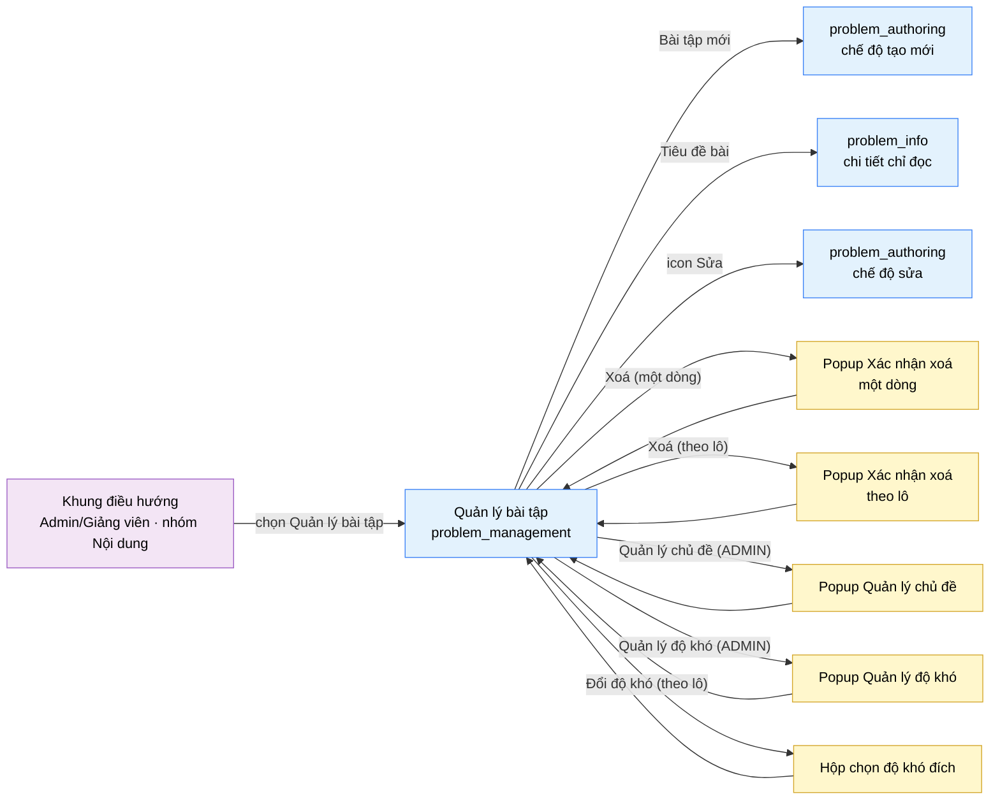

# Tài liệu thiết kế cơ bản (BD) — Quản lý bài tập (`SHR0201`)

## Phương châm tài liệu [Nội bộ — không cần khách duyệt]

- Viết theo **mẫu 9 sheet**. Bộ thẻ đóng, quy ước ID, ký hiệu chuẩn, ranh giới với tài liệu khác và
  checklist kiểm toán nằm ở `02-bd/_rules/bd-template-9sheet.md` — file này không chép lại.
- Phần gắn nhãn `[Nội bộ]` phục vụ sinh mã và tự kiểm toán, không phải yêu cầu của khách hàng: mục 4.5,
  mục 7.3 và các ghi chú quy ước.
- Mã màn `SHR0201` theo bảng mã ở `02-bd/_rules/bd-template-9sheet.md` mục 8; tên file mang tiền tố mã.
  Màn dùng chung nhiều vai trò (A2 + A3), mount ở cả `/instructor/problems` và `/admin/problems`, cùng
  một view/BD/DD [Nguồn: 01-rd/screens/shared/SHR0201_problem_management.md:4-9, `DEC-2026-0825-shared-content-authoring-screens`].
- Màn này không có màn con riêng của nó; nó là **màn cha điều phối** trỏ sang `problem_info`
  (`SHR0203`, xem chi tiết) và `problem_authoring` (`SHR0202`, soạn nội dung thật), và có 1 popup xác nhận: Xác nhận xoá (ẩn mềm).

> Đọc cùng `01-rd/screens/shared/SHR0201_problem_management.md` (hành vi ở mức yêu cầu, không lặp lại ở đây) và ba
> file BD module: `02-bd/architecture/problem-bank.md`, `02-bd/database/problem-bank.md`,
> `02-bd/security/problem-bank.md`. Khung điều hướng, thanh công cụ và chân trang khu Admin/Giảng viên
> dùng lại khung chung tương ứng của từng khu vực, không mô tả lại ở đây.
>
> **Phạm vi đã chốt trước khi viết BD** — theo RD mục 5 (Q1 → Q5, đã đóng), không mở lại:
> - Dùng chung một view cho A2 và A3; A2 chỉ thấy/sửa bài do chính mình soạn (quyền tác giả, không theo
>   lớp phụ trách), A3 thấy toàn bộ kho [Nguồn: 01-rd/screens/shared/SHR0201_problem_management.md:176 (Q1)].
>   **Xem Câu hỏi mở Q1 của file này** — đã chốt 2026-10-01 thêm cột `problems.author_id` bất biến; schema `problem-bank` chưa cập nhật (`02-bd/database/problem-bank.md`, ngoài phạm vi đợt này). A3 không bị lọc phạm vi.
> - Vòng đời bài toán đúng hai trạng thái `Chưa xuất bản`/`Đã xuất bản` (F2-15), không có `Đã ẩn`
>   [Nguồn: 01-rd/screens/shared/SHR0201_problem_management.md:177 (Q2); 02-bd/database/problem-bank.md:18].
> - Xoá là ẩn mềm: `problems.status` không đổi, chỉ bật `problems.deleted`
>   [Nguồn: 01-rd/screens/shared/SHR0201_problem_management.md:178 (Q3); 02-bd/database/problem-bank.md:19].
> - Giữ "Nhân bản" (F2-16) và "Xuất CSV" (F2-17); **cắt bỏ "Nhập CSV"** khỏi phạm vi
>   [Nguồn: 01-rd/screens/shared/SHR0201_problem_management.md:179 (Q4)].
> - Khối "Bài cần chú ý" là chỉ số dẫn xuất, ngưỡng đã chốt: AC < 30%, chưa xuất bản > 7 ngày
>   (dải 4 thẻ chỉ số tổng **đã bỏ khỏi UI từ 2026-10-01**: chỉ trang tổng quan mới hiển thị KPI, trang danh sách
>   chỉ có tiêu đề, bộ lọc, danh sách — xem `02-bd/screens/admin/_shell.md`) [Nguồn: 01-rd/screens/shared/SHR0201_problem_management.md:180 (Q5); 02-bd/database/problem-bank.md:181].
> - Không có "chấm lại hàng loạt" (rejudge) trên màn này — ngoài phạm vi toàn hệ thống
>   (`DEC-2026-0828-remove-rejudge-scope`).

---

## Sheet 1. Bìa

| Mục | Giá trị |
| :--- | :--- |
| Hệ thống | AlgoPrep |
| Phân hệ | `problem-bank` (F2) |
| Công đoạn | BD — Thiết kế cơ bản |
| Phân loại | Màn hình |
| Tên màn | Quản lý bài tập |
| Mã màn hình | `SHR0201` |
| Tên vật lý (slug) | `problem_management` |
| Trục tài liệu | Màn hình (`02-bd/screens/`) |
| Actor | A2 (`INSTRUCTOR`) / A3 (`ADMIN`) — dùng chung |
| Phiên bản | V1.17 |
| Người tạo | Nhóm phát triển AlgoPrep |
| Ngày tạo | 2026/09/20 |
| Người cập nhật | Nhóm phát triển AlgoPrep |
| Ngày cập nhật | 2026/10/05 |

---

## Sheet 2. Lịch sử sửa đổi

| Ver | Sheet bị sửa | Nội dung sửa | Ngày | Người sửa |
| :--- | :--- | :--- | :--- | :--- |
| V1.0 | Toàn bộ | Thay thế BD văn xuôi cũ (8 mục: layout, component inventory, screen states, API tiêu thụ, điều hướng, quyền, câu hỏi mở) bằng mẫu 9 sheet. Phát hiện lỗ hổng nguồn dữ liệu mới: schema `problem-bank` không có cột lưu tác giả gốc của bài toán, trong khi RD yêu cầu lọc theo quyền tác giả cho A2 — mở Q1. Ngưỡng "tỉ lệ AC trung bình 90 ngày" cũng không có nguồn cửa sổ thời gian trong read model `problem_stats` — mở Q2 | 2026/09/20 | Nhóm phát triển AlgoPrep |
| V1.1 | Sheet 3, 4, 5, 6, 7, 8; Câu hỏi mở | Bỏ dải 4 thẻ chỉ số tổng (Khu vực B còn ghi chú rỗng, giữ chữ cái C đến F), bỏ `ProblemManagementStatsDto` và endpoint `GetProblemManagementStats` (hai số tổng ở dòng phụ lấy từ `ListProblemsAdmin`), đánh số lại DTO và endpoint; nút Sửa/Xoá cuối dòng đổi thành icon kèm tooltip (`IconAction`); Q2 hết áp dụng. Theo quy ước "chỉ một trang tổng quan hiển thị KPI" | 2026/10/01 | Nhóm phát triển AlgoPrep |
| V1.2 | Sheet 4; Câu hỏi mở | Đồng bộ bản dựng ngày 2026-10-01: hai khối phụ Khu vực E (Phân bố theo chủ đề) và Khu vực F (Bài cần chú ý) **đã có trong mã** (`views/shared/problem-management/ui/problem-management-view.tsx`), dữ liệu giả suy ra từ chính các dòng của bảng (số bài và tỉ lệ theo chủ đề, bốn bộ đếm quy tắc); quy tắc "Đang ẩn khỏi người học" và "Bản nháp quá hạn" đang bằng 0 trong dữ liệu giả vì dòng không mang lịch sử xuất bản. Giữ nguyên quy tắc BD và DTO. Ghi một điểm lệch giữa mã và Sheet 6 Khu vực F (xem 4.5). Owner giữ hai khối phụ (`DEC-2026-1001-single-overview-page-kpi`: panel phụ không coi là KPI). Thêm đề xuất cho Q1, Q4 theo nguyên tắc admin (chờ owner xác nhận) | 2026/10/01 | AI |
| V1.3 | Sheet 4, 5, 6, 9, Câu hỏi mở | Đã chốt 2026-10-01 (owner uỷ quyền cân nhắc), xem `DEC-2026-1001-admin-configurable-settings`: (1) Q1: thêm `problems.author_id` bất biến; bộ lọc tác giả chỉ áp cho A2, A3 thấy, sửa, xuất bản mọi bài; schema `problem-bank` chưa được cập nhật ở đợt này; (2) Q4: số dòng mỗi trang do người dùng chọn (ví dụ 8, 20, 50), nhớ theo tài khoản, mặc định 8, không trần cho ADMIN — thêm item NO 16 bộ chọn ở Khu vực danh sách; sửa các câu "chưa có cột nguồn" và "kích thước trang chốt ở DD" | 2026/10/01 | AI |
| V1.4 | Sheet 3, 4, 5, 6, 7, 8, 9, Câu hỏi mở | Đã chốt 2026-10-01 (owner uỷ quyền), xem `DEC-2026-1001-admin-configurable-settings`: (1) **chủ đề bài toán (`topics`, F2-02) là dữ liệu do ADMIN quản lý**, cùng cách xử lý với chủ đề câu hỏi phỏng vấn ở `SHR0301`: thêm nút "Quản lý chủ đề" ở thanh tiêu đề (chỉ ADMIN thấy, Khu vực A NO 4) mở popup thêm, đổi tên, sắp xếp lại, xoá; xoá bị từ chối khi còn bài tham chiếu, popup hiện số bài; A2 chỉ chọn qua "Gán chủ đề"; không giới hạn số chủ đề; (2) thêm popup quản lý chủ đề (Popup NO 2-8, Sheet 5 và Sheet 6), 2 DTO và 4 endpoint ghi (`CreateProblemTopic`, `UpdateProblemTopic`, `ReorderProblemTopics`, `DeleteProblemTopic`), EVT-20 tới EVT-25, Sheet 9 NO 11-14; `ListTopics` đổi tên `ListProblemTopics`; (3) cột "Chủ đề", khối "Phân bố theo chủ đề" và danh sách "Gán chủ đề" đọc từ dữ liệu, số chủ đề không cố định; (4) `problems.author_id` đã có trong `02-bd/database/problem-bank.md` mục 1.1 (Q1 đóng hẳn) | 2026/10/01 | AI |
| V1.5 | Sheet 4, 5 | Đồng bộ với prototype dựng 2026-10-01 (vòng 5): bộ chọn số dòng 8/20/50 và popup quản lý chủ đề đã dựng, bỏ các câu "chưa dựng", "không có trong prototype"; ghi rõ prototype nhớ lựa chọn theo trình duyệt (localStorage) thay vì theo tài khoản, bộ chọn đứng trước các mũi tên trong thanh phân trang, popup chưa có nút lên/xuống | 2026/10/01 | AI |
| V1.6 | Sheet 3, 5, 8 | Đồng bộ `DEC-2026-1002-split-detail-and-edit-pages` (2026-10-02): bấm tiêu đề bài mở màn mới `problem_info` (`SHR0203`, chỉ đọc, `/admin/problems/[problemId]`), không còn mở thẳng form soạn; icon "Sửa" mở `problem_authoring` chế độ sửa ở `/admin/problems/[problemId]/edit`; "Bài tập mới" mở `/admin/problems/new`. Tách đích của tiêu đề và của icon "Sửa" (trước đây cùng một đích). Khu Giảng viên chưa tách, vẫn một đích | 2026/10/02 | AI |
| V1.7 | Sheet 3, 4, 5, 8; trích dẫn | Khu Giảng viên đã tách giống khu Admin (2026-10-03): `/instructor/problems`, `/instructor/problems/[problemId]` (chỉ đọc), `.../[problemId]/edit`, `.../new` (`app/(instructor)/instructor/problems/**`). View nhận prop bắt buộc `basePath` (gốc của khu) nên liên kết dòng, nút "Bài tập mới", nút Sửa không còn gắn cứng `/admin`; nút "Quản lý chủ đề" vẫn chỉ hiện khi `canManageTopics` (khu Admin truyền, khu Giảng viên không). Làm mới toàn bộ số dòng trích dẫn vào mã (`problem-management-view.tsx`), RD `SHR0201`, `02-bd/database/problem-bank.md`, `02-bd/security/problem-bank.md` đã lệch sau các đợt sửa; các câu RD không còn nêu (lựa chọn giữ xuyên trang, popup xoá đúng tập đã tick) chuyển sang `[SoT: Suy luận]`. Theo quy ước chủ dự án 2026-10-03: mockup `09-layoutBase` chỉ là tham chiếu, khi mã lệch mockup thì mã là hiện trạng | 2026/10/03 | AI |
| V1.8 | Sheet 8, 9 | Đồng bộ `DEC-2026-1003-toast-feedback-channel` (2026-10-03): kết quả thao tác (tìm kiếm bằng Enter, xoá, thao tác lô, thêm/đổi tên/xoá chủ đề) và lỗi nhập ghi là toast; ô sai đổi viền đỏ; `[Tiêu điểm]` ở Sheet 9 ghi "viền ô + toast". Giữ nguyên lỗi tải danh sách ở vùng bảng và thông báo rỗng (trạng thái thay chỗ nội dung) | 2026/10/03 | Nhóm phát triển AlgoPrep |
| V1.9 | Sheet 4 (hiện trạng bản dựng) | Ghi hiện trạng khu A2: danh sách chỉ gồm bài của chính giảng viên, khối phụ và tổng số tính trên tập đó; dữ liệu đi qua `queries.ts`. Không đổi hành vi BD | 2026/10/03 | AI |
| V1.10 | Sheet 4, 5 | Đồng bộ prototype 2026-10-03: nút lên/xuống của popup quản lý chủ đề bài toán **đã dựng** (prop `onMove` của `managed-list-dialog.tsx`, hàm `moveProblemTopic` ở `entities/problem/model/topic-store.ts`), thay câu "chưa có nút lên/xuống" ở Sheet 4 (mục hộp thoại quản lý chủ đề), Sheet 5 khu vực popup NO 2 và dòng V1.5 bên trên (V1.5 giữ nguyên làm lịch sử). Sửa số dòng trích dẫn của popup trong `problem-management-view.tsx` (`:496-518` thành `:552-582`). Không đổi NO, không đổi hành vi BD (NO 7 và EVT-23 vốn đã mô tả đổi thứ tự) | 2026/10/03 | AI |
| V1.11 | Sheet 3, 4, 5, 6, 7, 8, 9, Câu hỏi mở | Đã chốt 2026-10-03 (chủ dự án, `DEC-2026-1001-admin-configurable-settings` mục 7): **độ khó bài toán (F2-02) là danh mục do ADMIN quản lý, lưu ở bảng riêng `problem_levels`** (`02-bd/database/problem-bank.md` mục 1.2a), **không dùng chung** với độ khó câu hỏi phỏng vấn; `problems.difficulty` ENUM đổi thành `level_id` FK. Theo đúng khuôn `SHR0301` (nút + popup quản lý độ khó): (1) thêm nút "Quản lý độ khó" ở thanh tiêu đề (chỉ ADMIN, Khu vực A NO 5) mở popup thêm, đổi tên, sắp xếp lại, xoá (Popup NO 9-15); xoá bị từ chối khi còn bài tham chiếu (popup hiện "{n} bài") và khi là mức cuối cùng; không giới hạn số mức; (2) tab độ khó, cột "Độ khó" và sắp xếp theo độ khó đọc từ `problem_levels` (sắp xếp theo `sort_order`); (3) hành động theo lô "Đổi độ khó" mở **hộp chọn mức đích** lấy từ `problem_levels` (Popup NO 16), không còn "chọn giá trị đích" ở dạng tab cố định; (4) thêm 3 DTO, 5 endpoint (`ListProblemLevels`, `CreateProblemLevel`, `UpdateProblemLevel`, `ReorderProblemLevels`, `DeleteProblemLevel`), dòng truy cập bảng `problem_levels`, EVT-26 đến EVT-31, Sheet 9 NO 15-19; (5) ghi hiện trạng bản dựng (nút, popup và hộp chọn mức đích đã dựng ở prototype, kho cục bộ chưa gọi máy chủ); (6) thêm Câu hỏi mở Q5 (sinh slug `code`) | 2026/10/03 | AI |
| V1.12 | Sheet 3, 4, 5, 6, 7, 8, 9, Câu hỏi mở | Đồng bộ các chỉnh sửa prototype ngày 2026-10-05 (owner đã duyệt hướng đi trong cuộc trò chuyện; chi tiết giao diện ghi **chưa duyệt** đến khi owner xem): (1) **Xoá theo lô qua hộp xác nhận** (Sheet 3 mục Popup xác nhận xoá theo lô, Sheet 5 và 6 mục Popup NO 1, Sheet 8 EVT-17 và EVT-18): bản dựng nay khớp BD, bấm "Xoá" ở thanh hành động theo lô mở hộp xác nhận tiêu đề "Xoá {số} bài đã chọn?" thay vì xoá ngay; **mới, chưa duyệt:** khi tập đã chọn có bài mà bộ lọc hiện tại đang ẩn thì hộp thêm một dòng cảnh báo (thêm Sheet 9 NO 20); (2) **Phân trang kẹp trang** (Sheet 5 Khu vực D NO 13, Sheet 8 EVT-18): sau khi xoá mà trang hiện tại vượt trang cuối thì lùi về trang cuối, không hiện trang rỗng hay nhãn "Trang 3 / 2"; (3) **Ba hành động theo lô chưa có API** ("Xuất bản", "Nhân bản", "Xuất CSV") nay hiện toast thông tin "{hành động}: chưa nối API trong bản mẫu, chưa có thay đổi nào" thay cho toast thành công giả (Sheet 5 Khu vực C NO 6, 9, 10, Sheet 8 EVT-11, EVT-14, EVT-15; "Gán chủ đề" vốn đã là toast yêu cầu chọn); (4) **Thanh chọn theo lô là thành phần dùng chung `BulkActionBar`** (cũng dùng ở quản lý người dùng), có vùng `role="status"` luôn gắn sẵn đọc "Đã chọn n bài" (Sheet 4.4, Sheet 5 Khu vực C NO 5); (5) ~~bộ lọc độ khó thu thành ô chọn có nhãn khi quá 6 lựa chọn (prop `maxInline`)~~ **đã gỡ và thay ở V1.13** (không còn ngưỡng 6, xem hàng V1.13); (6) **bỏ yêu cầu đổi màu cột AC theo ngưỡng 60% và 35%** theo quyết định owner 2026-10-05 (đồng bộ RD): Sheet 5 Khu vực D NO 9 và Sheet 7.1 dòng `acRate` chỉ còn con số phần trăm; (7) nhãn trạng thái dùng token chữ đậm hơn (`--color-success-text`, `--color-admin-warn-text`) cho đủ tương phản AA, chấm giữ màu rực; chữ cột "TC · Sửa cuối" và tiêu đề cột đổi màu muted, thêm thuộc tính `title` ở liên kết tiêu đề (chỉ ghi ở hiện trạng bản dựng và nợ prototype, không đổi hành vi BD); (8) làm mới toàn bộ số dòng trích dẫn vào `problem-management-view.tsx` (mã đã dời), thêm Câu hỏi mở Q6 | 2026/10/05 | Nhóm phát triển AlgoPrep |
| V1.13 | Sheet 4, 5, 6, Câu hỏi mở | Bộ lọc của danh sách đổi giao diện (2026-10-05, owner chỉ đạo, chi tiết **chưa duyệt**): (1) **gỡ** ô chọn gốc và ngưỡng 6 lựa chọn của V1.12 (prop `maxInline` của `SegmentedTabs` đã xoá, `SegmentedTabs` trở lại dải nút bật và không còn dùng cho bộ lọc danh sách); (2) bộ lọc độ khó và bộ lọc trạng thái nay là thành phần dùng chung `FilterMenu` (`shared/ui/data/filter-menu.tsx`): một nút hiện "{nhãn}: {lựa chọn hiện tại}" kèm mũi tên, bấm mở pop-up kính nhỏ dạng danh sách lựa chọn, lựa chọn hiện tại có dấu tích, không giới hạn số lựa chọn (phủ cả danh mục độ khó ADMIN thêm không giới hạn); bàn phím: mũi tên lên/xuống, Home, End để di chuyển, Enter hoặc Space để chọn, Escape đóng và trả tiêu điểm về nút, Tab hoặc bấm ra ngoài thì đóng (Sheet 4.4, 4.5, Sheet 5 và 6 Khu vực C NO 2 và NO 3); (3) cửa sổ "Quản lý chủ đề" và "Quản lý độ khó": danh sách bắt đầu cuộn từ mục thứ 6 (hiện 5 dòng) với thanh cuộn mỏng trong suốt (Sheet 4.4, 4.5, Sheet 6 Popup NO 3 và NO 10); (4) làm mới số dòng trích dẫn vào `problem-management-view.tsx` và `managed-list-dialog.tsx` (mã đã dời); (5) Câu hỏi mở Q6 viết lại: bỏ câu ngưỡng 6, thêm câu hỏi về việc thay các dải nút còn lại | 2026/10/05 | Nhóm phát triển AlgoPrep |
| V1.14 | Sheet 4, 5, 6, Câu hỏi mở | Thanh chọn theo lô đổi cách hiển thị (2026-10-05, owner chỉ đạo, chi tiết **chưa duyệt**): `BulkActionBar` không còn là một thanh chèn phía trên bảng (làm bảng bị đẩy xuống mỗi lần tích dòng) mà là một pop-up kính nhỏ (`.glass-card--popover`) nổi cố định ở giữa mép trên màn hình khi có dòng được chọn; dựng qua portal ra gốc vỏ gần nhất (`.admin-shell` / `.instructor-shell`, dự phòng `body`) vì `.glass-card` có `backdrop-filter` nên tổ tiên có bộ lọc sẽ thành khối chứa của phần tử `fixed`; vùng `role="status"` luôn gắn sẵn vẫn đọc số lượng, phần nổi có `role="region"` với nhãn làm tên truy cập; **không có nút xoá chọn hay đóng**, pop-up tự biến mất khi không còn dòng nào được chọn (vị trí được sửa lại ở V1.15: mép trên, không phải mép dưới). Ảnh hưởng Sheet 4.1 bước 3, Sheet 4.4, Sheet 4.5, Sheet 5 Khu vực C NO 5, Sheet 6 Khu vực C NO 5. Không đổi hành vi nghiệp vụ, NO hay EVT. Thêm Câu hỏi mở Q6 mục (d). Các hàng cũ giữ nguyên | 2026/10/05 | Nhóm phát triển AlgoPrep |
| V1.15 | Sheet 4, 5, 6, 8, Câu hỏi mở | Chỉnh nhỏ ngày 2026-10-05 (chi tiết **chưa duyệt**): (1) pop-up thanh chọn theo lô nay nằm ở **giữa mép trên** màn hình (`fixed top-3`) thay vì mép dưới như V1.14, và **trượt vào** trong 180 ms (lớp `.bulk-pop-in` ở `05-coding/frontend/src/app/globals.css:674-695`, chuyển động `translateY` và độ mờ, tắt khi người dùng bật `prefers-reduced-motion`); sửa lại câu chữ "mép dưới" ở Sheet 4.1 bước 3, Sheet 4.4, 4.5, Sheet 5 và 6 Khu vực C NO 5 (hàng V1.14 cũng được sửa chữ cho khớp); (2) **xoá một dòng cũng bỏ dòng đó khỏi tập đang chọn**, số "Đã chọn n bài" không còn tính dòng đã xoá (Sheet 8 EVT-18, Sheet 4.5); (3) làm mới số dòng trích dẫn đã dời (xoá một dòng, `problem-management-view.tsx`); (4) Câu hỏi mở Q6 mục (d) viết lại: danh sách câu hỏi phỏng vấn nay đã có chọn dòng và thanh thao tác theo lô, câu hỏi chuyển thành bộ hai thao tác "Nhân bản" và "Xoá" có đúng không | 2026/10/05 | Nhóm phát triển AlgoPrep |
| V1.16 | Sheet 4, 5, 6, Câu hỏi mở | Bộ chọn số dòng mỗi trang đổi giao diện (2026-10-05, chi tiết **chưa duyệt**): không còn là ô chọn gốc (`<select>`) mà là thành phần dùng chung `FilterMenu` ở chế độ `compact` với `placement="top"` bên trong `Pagination` dùng chung, pop-up kính mở lên phía trên; lựa chọn vẫn 8 / 20 / 50, mặc định 8, nhớ localStorage, đổi thì về trang 1 (không đổi hành vi). Sửa Sheet 4.4 hàng Phân trang, Sheet 5 và 6 Khu vực D NO 16. Thêm Câu hỏi mở Q6 mục (e) về việc mở rộng bộ chọn sang các bảng khác | 2026/10/05 | Nhóm phát triển AlgoPrep |
| V1.17 | Sheet 4, Câu hỏi mở | Thanh công cụ phía trên danh sách nay là thành phần dùng chung `FilterBar` (`shared/ui/data/filter-bar.tsx`, chưa duyệt, **không đổi hành vi**): ô tìm kiếm chiếm phần rộng còn lại (tuỳ chọn Enter gọi `onSubmit`), các điều khiển lọc (`FilterMenu`) đứng sau, nhãn "n / tổng" đẩy sang mép phải; thay cho mã dựng tay giống hệt ở nhiều màn (Sheet 4.4 hàng Thanh lọc và tìm kiếm, Sheet 4.5). Bộ chọn số dòng mỗi trang nay bật ở thêm 3 bảng có phân trang thật (`my-submissions`, `problem-list`, `class-progress`); Câu hỏi mở Q6 mục (e) **đóng** (chưa duyệt). Làm mới số dòng trích dẫn vào `problem-management-view.tsx` | 2026/10/05 | Nhóm phát triển AlgoPrep |

---

## Sheet 3. Sơ đồ chuyển màn

> [Nội bộ] Quy ước vẽ: bố trí từ trái sang phải. Màn gọi tới tô tím, màn hiện tại tô xanh nhạt, popup tô
> vàng. Màu và `[Nguồn:]` dùng để truy vết, không phải yêu cầu của khách hàng.

### 3.1 Danh sách chuyển màn

#### Khung điều hướng (Admin hoặc Giảng viên) → Quản lý bài tập

[Điều kiện mở] Chọn mục con "Quản lý bài tập" trong nhóm "Nội dung" ở thanh điều hướng bên trái — route
`/admin/problems` (A3) hoặc `/instructor/problems` (A2), cùng một view
[Nguồn: 01-rd/screens/shared/SHR0201_problem_management.md:89-94; `DEC-2026-0825-shared-content-authoring-screens`].

[Chế độ mở] Chế độ danh sách, không lọc sẵn — tab độ khó và tab trạng thái đều ở "Tất cả".

[Thông tin truyền] Không có.

[Giá trị trả về] Không có.

[Khi thành công] Tải trang đầu của bảng bài toán (phạm vi theo actor), khối "Phân bố theo
chủ đề" và khối "Bài cần chú ý".

[Khi huỷ] Không có.

#### Quản lý bài tập → `problem_authoring` (chế độ tạo mới)

[Điều kiện mở] Bấm nút "Bài tập mới" ở thanh tiêu đề
[Nguồn: 09-layoutBase/Admin - Quản lý bài tập.dc.html:159-160].

[Chế độ mở] Chế độ tạo mới, không có `problem_id`.

[Thông tin truyền] Không có.

[Giá trị trả về] Không có.

[Khi thành công] Mở màn `problem_authoring` (`SHR0202`) rỗng, chờ nhập nội dung mới. Route: `{basePath}/new` — khu Admin `/admin/problems/new`, khu Giảng viên `/instructor/problems/new`
[Nguồn: 05-coding/frontend/src/views/shared/problem-management/ui/problem-management-view.tsx:408; 05-coding/frontend/src/app/(admin)/admin/problems/new/page.tsx:1-5; 05-coding/frontend/src/app/(instructor)/instructor/problems/new/page.tsx:1-5].

[Khi huỷ] Không có.

#### Quản lý bài tập → `problem_info` (chi tiết, chỉ đọc)

[Điều kiện mở] Bấm tiêu đề bài toán trong bảng
[Nguồn: 05-coding/frontend/src/views/shared/problem-management/ui/problem-management-view.tsx:265-272; 01-rd/screens/shared/SHR0203_problem_info.md:72;
`DEC-2026-1002-split-detail-and-edit-pages`].

[Chế độ mở] Chế độ chỉ đọc, route `{basePath}/[problemId]` — khu Admin `/admin/problems/[problemId]`, khu Giảng viên `/instructor/problems/[problemId]`.

[Thông tin truyền] `problem_id` của dòng được chọn (route dùng mã bài bỏ dấu `#`).

[Giá trị trả về] Không có.

[Khi thành công] Mở màn `problem_info` (`SHR0203`) hiển thị chi tiết bài toán đó, không có trường nhập.

[Khi huỷ] Không có.

#### Quản lý bài tập → `problem_authoring` (chế độ sửa)

[Điều kiện mở] Bấm icon "Sửa" cuối dòng. Từ 2026-10-02 **không còn chung đích với tiêu đề** (tiêu đề mở `problem_info`)
[Nguồn: 05-coding/frontend/src/views/shared/problem-management/ui/problem-management-view.tsx:357-362;
09-layoutBase/Admin - Quản lý bài tập.dc.html:227-228 (prototype tĩnh cũ, chưa phản ánh việc tách trang)].

[Chế độ mở] Chế độ sửa, route `{basePath}/[problemId]/edit` — khu Admin `/admin/problems/[problemId]/edit`, khu Giảng viên `/instructor/problems/[problemId]/edit`.

[Thông tin truyền] `problem_id` của dòng được chọn.

[Giá trị trả về] Không có.

[Khi thành công] Mở màn `problem_authoring` (`SHR0202`) đã nạp sẵn nội dung của bài toán đó.

[Khi huỷ] Không có.

#### Quản lý bài tập → Popup Xác nhận xoá (một dòng)

[Điều kiện mở] Bấm icon "Xoá" ở nhóm nút cuối một dòng trong bảng
[Nguồn: 09-layoutBase/Admin - Quản lý bài tập.dc.html:227-229].

[Chế độ mở] Chế độ xác nhận hành động phá huỷ (ẩn mềm).

[Thông tin truyền] `problem_id` của dòng đó, mã và tiêu đề bài toán, số lượt nộp bị ảnh hưởng.

[Giá trị trả về] Kết quả chọn "Xác nhận" hoặc "Huỷ".

[Khi thành công] Popup nêu rõ mã, tiêu đề, số lượt nộp bị ảnh hưởng và cảnh báo "Toàn bộ testcase và lượt
nộp liên quan sẽ bị ẩn khỏi trang người học. Hành động không thể hoàn tác."
[Nguồn: 09-layoutBase/Admin - Quản lý bài tập.dc.html:305-317; 01-rd/screens/shared/SHR0201_problem_management.md:144-147].

[Khi huỷ] Đóng popup, không đổi trạng thái bài toán nào.

#### Quản lý bài tập → Popup Xác nhận xoá (theo lô)

[Điều kiện mở] Đang chọn ít nhất một dòng và bấm "Xoá" trên thanh hành động theo lô
[Nguồn: 09-layoutBase/Admin - Quản lý bài tập.dc.html:196-206,591-592].

[Chế độ mở] Chế độ xác nhận hành động phá huỷ (ẩn mềm), áp dụng cho tập đã chọn tường minh.

[Thông tin truyền] Danh sách `problem_id` đang chọn, số lượng bài, tổng lượt nộp bị ảnh hưởng, và số bài trong tập chọn đang bị bộ lọc hiện tại ẩn khỏi bảng.

[Giá trị trả về] Kết quả chọn "Xác nhận" hoặc "Huỷ".

[Khi thành công] Popup có tiêu đề "Xoá {số} bài đã chọn?", liệt kê số bài chịu tác động (đúng tập đã tick, không áp lên toàn bộ kết quả lọc, `[SoT: Suy luận]`)
[Nguồn: 01-rd/screens/shared/SHR0201_problem_management.md:144-147 (nội dung nêu số bài đã chọn)] và cùng cảnh báo ẩn mềm như trên. **Mới, chưa duyệt (2026-10-05):** khi tập đã chọn có bài mà bộ lọc hiện tại đang ẩn (lựa chọn được giữ xuyên bộ lọc, nên xoá theo lô có thể chạm tới dòng không còn nhìn thấy) thì popup thêm một dòng cảnh báo "Cảnh báo: {số} bài trong số này đang không hiển thị do bộ lọc hiện tại." (khoá `confirmBulkDeleteHidden`); không có bài ẩn thì không hiện dòng này
[Nguồn: 05-coding/frontend/src/views/shared/problem-management/ui/problem-management-view.tsx:641-659 (hộp xác nhận), 234-238 (đếm bài ẩn); 05-coding/frontend/messages/vi.json:1049-1050]. Từ 2026-10-05 mã đã **khớp** BD này: trước đó bấm "Xoá" ở thanh theo lô xoá ngay, không qua hộp.

[Khi huỷ] Đóng popup, giữ nguyên danh sách đang chọn.

#### Quản lý bài tập → Popup Quản lý chủ đề (chỉ ADMIN)

[Điều kiện mở] ADMIN bấm nút "Quản lý chủ đề" ở thanh tiêu đề. A2 không thấy nút này.

[Chế độ mở] Chế độ quản trị danh mục chủ đề bài toán.

[Thông tin truyền] Không có (danh sách lấy qua `ListProblemTopics`, kèm số bài đang tham chiếu mỗi chủ đề).

[Giá trị trả về] Không có. Đóng popup thì danh sách chủ đề, cột "Chủ đề" và khối "Phân bố theo chủ đề" được tải lại.

[Khi thành công] Mỗi thao tác thêm, đổi tên, sắp xếp, xoá có hiệu lực ngay trên máy chủ; popup cập nhật dòng tương ứng. Xoá bị từ chối khi còn bài tham chiếu và hiện số bài (đã chốt 2026-10-01, `DEC-2026-1001-admin-configurable-settings`).

[Khi huỷ] Đóng popup, không đổi thêm gì.

#### Quản lý bài tập → Popup Quản lý độ khó (chỉ ADMIN)

[Điều kiện mở] ADMIN bấm nút "Quản lý độ khó" ở thanh tiêu đề, cạnh "Quản lý chủ đề". A2 không thấy nút này (cùng điều kiện `canManageTopics` của khu Admin ở bản dựng) [Nguồn: 05-coding/frontend/src/views/shared/problem-management/ui/problem-management-view.tsx:385-395, nút `manageLevels` hiện khi `canManageTopics`].

[Chế độ mở] Chế độ quản trị danh mục độ khó bài toán.

[Thông tin truyền] Không có (danh sách lấy qua `ListProblemLevels`, kèm số bài đang tham chiếu mỗi mức).

[Giá trị trả về] Không có. Đóng popup thì danh sách độ khó, tab độ khó, cột "Độ khó" của bảng được tải lại.

[Khi thành công] Mỗi thao tác thêm, đổi tên, sắp xếp, xoá có hiệu lực ngay trên máy chủ; popup cập nhật dòng tương ứng. Xoá bị từ chối khi còn bài tham chiếu (hiện số bài) hoặc khi là mức cuối cùng (đã chốt 2026-10-03, `DEC-2026-1001-admin-configurable-settings` mục 7). Khác popup chủ đề ở chỗ không có công tắc nào khác ngoài tên.

[Khi huỷ] Đóng popup, các thao tác đã hoàn tất vẫn giữ nguyên (mỗi thao tác là một lần ghi độc lập).

#### Quản lý bài tập → Hộp chọn độ khó đích (hành động theo lô "Đổi độ khó")

[Điều kiện mở] Đang chọn ít nhất một dòng và bấm "Đổi độ khó" trên thanh hành động theo lô (A2 và A3 đều dùng được; quyền `PROBLEM_AUTHORING:UPDATE`).

[Chế độ mở] Chế độ chọn một mức từ danh mục `problem_levels`.

[Thông tin truyền] Số bài đang chọn (hiện ở tiêu đề hộp) và danh sách mức qua `ListProblemLevels`.

[Giá trị trả về] Mức đã chọn (`levelId`) khi bấm "Áp dụng", hoặc không có gì khi huỷ.

[Khi thành công] Mức đích được áp cho từng bài đã chọn qua `ChangeDifficulty`; bảng tải lại cột "Độ khó". Đây cũng là cách ADMIN giải phóng một mức trước khi xoá nó (chuyển hết bài sang mức khác).

[Khi huỷ] Đóng hộp, không bài nào đổi.

### 3.2 Sơ đồ

[Nguồn: 09-layoutBase/Admin - Quản lý bài tập.dc.html:159-160,196-206,219,227-229,305-317,591-592;
01-rd/screens/shared/SHR0201_problem_management.md:18-22,89-94]

---

## Sheet 4. Bố cục màn hình

### 4.1 Tổng quan màn

[Mục đích màn] Bảng quản trị nội dung ngân hàng bài toán: xem toàn bộ bài tập trong phạm vi được phép, tìm
và lọc theo độ khó/trạng thái, theo dõi sức khoẻ từng bài (lượt nộp, tỉ lệ AC, số testcase, lần sửa cuối),
xử lý theo lô, và mở luồng tạo/sửa đề bài
[Nguồn: 01-rd/screens/shared/SHR0201_problem_management.md:13-16].

[Luồng nghiệp vụ chính]

1. **Hiển thị ban đầu**: vào màn, hệ thống tải song song ba nhóm dữ liệu — trang đầu bảng bài toán
   (phạm vi theo actor, kèm hai số tổng cho dòng phụ tiêu đề), khối "Phân bố theo chủ đề" và khối "Bài cần
   chú ý". Trong lúc chờ, mỗi khối hiển thị khung chờ đúng số dòng dự kiến.
2. **Thu hẹp danh sách**: gõ từ khoá theo mã hoặc tiêu đề, chọn tab độ khó và tab trạng thái. Mỗi lần đổi
   điều kiện thì về trang 1 [Nguồn: 01-rd/screens/shared/SHR0201_problem_management.md:111-112].
3. **Chọn bài toán**: tích chọn từng dòng. Có ít nhất một dòng được chọn thì thanh hành động theo lô (từ 2026-10-05 là pop-up nổi ở giữa mép trên màn hình, không còn chèn phía trên bảng, chưa duyệt) hiện
   ra, nhãn nêu rõ số đã chọn kể cả phần không nằm trong kết quả đang hiển thị
   [Nguồn: 01-rd/screens/shared/SHR0201_problem_management.md:116-119 (thanh hành động chỉ hiện khi đã chọn ít nhất một dòng); phần "kể cả không nằm trong kết quả đang hiển thị" là `[SoT: Suy luận]` — RD hiện không nêu].
4. **Thực hiện hành động**: 4 hành động theo lô ("Xuất bản/ẩn", "Gán chủ đề", "Nhân bản",
   "Xuất CSV") thực thi trực tiếp không qua popup (ở bản dựng prototype, "Xuất bản", "Nhân bản" và "Xuất CSV" **chưa có API** nên chỉ hiện toast thông tin "chưa nối API trong bản mẫu, chưa có thay đổi nào", không báo thành công giả); "Đổi độ khó" mở hộp chọn mức đích lấy từ danh mục `problem_levels`
   rồi mới áp dụng; riêng "Xoá" luôn qua popup xác nhận vì là hành động phá
   huỷ [Nguồn: 09-layoutBase/Admin - Quản lý bài tập.dc.html:196-206].
5. **Chặn xuất bản thiếu điều kiện**: bài chưa đạt checklist xuất bản (không đủ testcase Hidden/Sample,
   thiếu đặc tả) bị chặn cứng kèm lý do khi cố chuyển sang `Đã xuất bản`
   [Nguồn: 01-rd/screens/shared/SHR0201_problem_management.md:177 (Q2); 02-bd/database/problem-bank.md:180].
6. **Làm mới**: sau khi một hành động ghi thành công, tải lại bảng và hai khối phụ; bỏ
   danh sách đang chọn. Nếu số trang sau khi xoá ít hơn trang hiện tại thì lùi về trang cuối (không hiện trang rỗng).

[Người dùng] A2 (`INSTRUCTOR`) hoặc A3 (`ADMIN`) đã đăng nhập, có Function `PROBLEM_AUTHORING`
[Nguồn: 02-bd/database/identity.md:48; 02-bd/security/problem-bank.md:5-10].

[Tệp liên quan] Xuất CSV (metadata bảng, không đề bài/testcase) — định dạng và trường cụ thể chốt ở DD
[Nguồn: 01-rd/screens/shared/SHR0201_problem_management.md:179 (Q4, F2-17)].

[Phạm vi]
- Không soạn/sửa nội dung bài toán thật (Markdown/LaTeX, chữ ký hàm, testcase) trên màn này — thuộc
  `problem_authoring` (`SHR0202`) [Nguồn: 01-rd/screens/shared/SHR0201_problem_management.md:45-49].
- Không có "Nhập CSV" — cắt khỏi phạm vi (Q4 RD đã đóng).
- Không có "chấm lại hàng loạt" — ngoài phạm vi toàn hệ thống (`DEC-2026-0828-remove-rejudge-scope`).
- Độ khó là danh mục **do ADMIN quản lý** (đã chốt 2026-10-03), không phải bộ ba cố định; ba mức Dễ/Trung bình/Khó chỉ là dữ liệu khởi tạo. Độ khó **không mang logic** (không ảnh hưởng điểm, giới hạn, chấm bài), chỉ phân loại. Màn này không quản lý độ khó câu hỏi phỏng vấn (`SHR0301`), hai danh mục tách bảng.
- Không hiển thị bookmark của học viên dưới bất kỳ hình thức nào, kể cả số tổng hợp ẩn danh
  [Nguồn: 02-bd/security/problem-bank.md:56-64].
- Phạm vi dữ liệu theo tác giả cho A2 dựa trên cột `problems.author_id` bất biến (đã chốt 2026-10-01, xem Câu hỏi mở Q1); cột này đã có trong `02-bd/database/problem-bank.md` mục 1.1 (bổ sung 2026-10-01). A3 thấy, sửa, xuất bản mọi bài, không bị lọc.

[Quyền sử dụng]
- Xem: được, khi có `PROBLEM_AUTHORING:READ`.
- Thêm (điều hướng sang tạo mới, và "Nhân bản"): được, khi có `PROBLEM_AUTHORING:CREATE`.
- Sửa (xuất bản/ẩn, đổi độ khó, gán chủ đề): được, khi có `PROBLEM_AUTHORING:UPDATE`.
- Xoá (ẩn mềm): được, khi có `PROBLEM_AUTHORING:DELETE`.
- Xuất CSV: được, khi có `PROBLEM_AUTHORING:READ` [Nguồn: 02-bd/security/problem-bank.md:5-26].
- Quản lý độ khó (thêm, đổi tên, sắp xếp, xoá): chỉ vai trò `ADMIN` có `PROBLEM_AUTHORING` (`CREATE`/`UPDATE`/`DELETE` tương ứng thao tác); dùng lại Function sẵn có, không Function mới (`02-bd/security/problem-bank.md` Bảng 1.1). A2 chỉ chọn mức có sẵn khi đổi độ khó theo lô hoặc ở `SHR0202` (đã chốt 2026-10-03, `DEC-2026-1001-admin-configurable-settings` mục 7).
- Quản lý chủ đề (thêm, đổi tên, sắp xếp, xoá): chỉ vai trò `ADMIN` có `PROBLEM_AUTHORING` (`CREATE`/`UPDATE`/`DELETE` tương ứng thao tác); dùng lại Function sẵn có, không Function mới. A2 chỉ chọn chủ đề có sẵn qua "Gán chủ đề" hoặc ở `SHR0202` (đã chốt 2026-10-01, `DEC-2026-1001-admin-configurable-settings`).

[Số bản ghi tối đa] Bảng bài toán phân trang phía máy chủ; prototype hiển thị 8 dòng một trang
[Nguồn: 09-layoutBase/Admin - Quản lý bài tập.dc.html:236-245]. Đã chốt 2026-10-01 (Q4): người dùng tự chọn số dòng mỗi trang (ví dụ 8, 20, 50), nhớ theo tài khoản, mặc định 8, không trần riêng cho ADMIN. Khối "Bài
cần chú ý": tối đa 4 dòng (một dòng mỗi quy tắc phát hiện).

[Nguồn: 01-rd/screens/shared/SHR0201_problem_management.md:11-170; 02-bd/database/problem-bank.md:8-30,180-181;
02-bd/security/problem-bank.md:1-64]

### 4.2 DTO liên quan

- `ProblemManagementListItemDto`
- `TopicDistributionItemDto`
- `AttentionItemDto`
- `TopicOptionDto`
- `ProblemTopicManageResultDto`
- `ProblemTopicDeleteRefusedDto`
- `ProblemLevelOptionDto`
- `ProblemLevelManageResultDto`
- `ProblemLevelDeleteRefusedDto`
- `BulkProblemActionResultDto`

`[Suy luận]` — tên DTO do BD này đề xuất, `03-dd/api/problem-bank.md` chốt lại.

### 4.3 Bảng dữ liệu liên quan (6)

| NO | Bảng | Ghi chú |
| --: | :--- | :--- |
| 1 | `problems` | [Nguồn: 02-bd/database/problem-bank.md:8-30] |
| 2 | `topics` | [Nguồn: 02-bd/database/problem-bank.md:42-43] |
| 3 | `problem_topics` | [Nguồn: 02-bd/database/problem-bank.md:44-45] |
| 4 | `testcases` | [Nguồn: 02-bd/database/problem-bank.md:97-113] |
| 5 | `problem_stats` (read model) | [Nguồn: 02-bd/database/problem-bank.md:152] |
| 6 | `problem_levels` | Danh mục độ khó do ADMIN quản lý [Nguồn: 02-bd/database/problem-bank.md mục 1.2a; `DEC-2026-1001-admin-configurable-settings` mục 7] |

Bảng `tags`/`problem_tags` không dùng ở màn này — cột "Chủ đề" và khối "Phân bố theo chủ đề" đọc `topics`
(danh mục do ADMIN quản lý, F2-02, đã chốt 2026-10-01), không phải `tags` (nhãn tự do, dùng để lọc chi tiết hơn ở `problem_list`)
[Nguồn: 02-bd/database/problem-bank.md:36-59]. Bảng `bookmarks` không xuất hiện — màn này không có quyền
đọc bookmark của học viên [Nguồn: 02-bd/security/problem-bank.md:56-64].

### 4.4 Vùng bố cục

Đối chiếu `09-layoutBase/Admin - Quản lý bài tập.dc.html` — bằng chứng bố cục chỉ-đọc, **không phải**
design system cuối cùng. Khu Giảng viên không có mockup riêng trong `09-layoutBase/`; từ 2026-10-03 đã dựng bằng mã, mount cùng view qua prop `basePath`
[Nguồn: 01-rd/screens/shared/SHR0201_problem_management.md:24-32; 05-coding/frontend/src/views/shared/problem-management/ui/problem-management-view.tsx:81-86; 05-coding/frontend/src/app/(instructor)/instructor/problems/page.tsx:1-6]. Khi mã khác mockup thì **mã là hiện trạng**; các cột "Vị trí trong prototype" bên dưới ghi lịch sử bố cục, không phải hành vi hiện tại.

| Vùng | Vị trí trong prototype | Nội dung |
| :--- | :--- | :--- |
| Thanh điều hướng bên trái (khung chung) | `:343,348-352` | Nhóm "Nội dung" đang mở, mục con "Quản lý bài tập" đang chọn, badge `27` — dùng lại khung chung của khu Admin/Giảng viên |
| Thanh tiêu đề dính trên | `:150-160` | Tiêu đề, dòng phụ đếm tổng và số bài công khai, nút "Bài tập mới"; thêm nút "Quản lý chủ đề" và nút "Quản lý độ khó" (chỉ ADMIN) |
| Dải chỉ số tổng | `:162-173`, dữ liệu `:477-482` | **Không dựng trên UI Next.js (2026-10-01)** — trang danh sách không hiển thị KPI; hai số tổng và đã xuất bản nằm ở dòng phụ thanh tiêu đề |
| Thanh lọc và tìm kiếm | `:177-193` | Ô tìm mã/tiêu đề, bộ lọc độ khó ("Tất cả" cộng một mục mỗi mức đọc từ `problem_levels`, số mục không cố định) và bộ lọc trạng thái 3 mục; **từ 2026-10-05** mỗi bộ lọc là một nút `FilterMenu` hiện "{nhãn}: {lựa chọn hiện tại}" kèm mũi tên, bấm mở pop-up kính nhỏ liệt kê lựa chọn (chưa duyệt), bộ đếm kết quả; cả thanh này là `FilterBar` dùng chung (V1.17, chưa duyệt), không đổi hành vi |
| Thanh hành động theo lô | `:196-206,591` | Chỉ hiện khi `selectedCount > 0`; nhãn số đã chọn và 5 nút hành động + nút Xoá. **Từ 2026-10-05** là thành phần dùng chung `BulkActionBar` (`shared/ui/data/bulk-action-bar.tsx`, cũng dùng ở quản lý người dùng): thanh tự gắn/gỡ theo `count`, kèm một vùng `role="status"` luôn gắn sẵn, ẩn thị giác, đọc "Đã chọn n bài" cho trình đọc màn hình. **Từ 2026-10-05 (chưa duyệt, V1.14)** phần hiển thị là pop-up kính nhỏ nổi cố định ở giữa mép trên màn hình, trượt vào 180 ms (`.bulk-pop-in`, tắt khi `prefers-reduced-motion`), không chèn phía trên bảng nên bảng không bị đẩy xuống, không có nút đóng, tự ẩn khi không còn dòng nào được chọn [Nguồn: 05-coding/frontend/src/shared/ui/data/bulk-action-bar.tsx:3-15, 42-54] |
| Bảng bài toán | `:208-232`, sort `:518-528` | Lưới 10 cột, 7 cột sắp xếp được. Cột AC chỉ in con số phần trăm, **không đổi màu theo ngưỡng** (owner bỏ yêu cầu 2026-10-05; prototype tĩnh `:539` còn màu ngưỡng chỉ là lịch sử) |
| Phân trang | `:236-245,513-516,595` | Nhãn trang, hai nút "Trước" / "Sau", 8 dòng/trang mặc định; bộ chọn số dòng mỗi trang (8, 20, 50) đã chốt 2026-10-01 và prototype đã dựng: nút chọn đứng trong thanh phân trang, trước các mũi tên; từ 2026-10-05 là `FilterMenu` chế độ `compact` mở pop-up kính lên phía trên, không còn ô chọn gốc (`shared/ui/data/pagination.tsx:71-82`, chưa duyệt). Trang hiện tại được kẹp vào trang cuối sau khi xoá (2026-10-05, xem Sheet 5 Khu vực D NO 13) |
| Khối "Phân bố theo chủ đề" | `:249-265`, dữ liệu `:566-572` | Thanh ngang tỉ lệ theo từng chủ đề |
| Khối "Bài cần chú ý" | `:267-283`, dữ liệu `:574-579` | 4 quy tắc tự phát hiện |
| Hộp thoại xác nhận xoá | `:304-317` | Dùng chung cho xoá một dòng và xoá theo lô; xoá theo lô có tiêu đề "Xoá {số} bài đã chọn?" và, khi tập chọn có bài bị bộ lọc ẩn, thêm dòng cảnh báo (mới, chưa duyệt, 2026-10-05) |
| Hộp thoại quản lý chủ đề | Không có trong `09-layoutBase`; prototype mã đã dựng (`05-coding/frontend/src/views/shared/problem-management/ui/problem-management-view.tsx:596-626`, dialog dùng chung `05-coding/frontend/src/shared/ui/overlay/managed-list-dialog.tsx`) | Popup (chỉ ADMIN, nút ở thanh tiêu đề chỉ hiện khi `canManageTopics`): danh sách dòng chủ đề (tên, số bài, đổi tên, xoá bị khoá khi còn bài tham chiếu), ô nhập tên chủ đề mới và nút Thêm; **từ 2026-10-05 (chưa duyệt)** danh sách cuộn từ mục thứ 6, hiện 5 dòng cùng thanh cuộn mỏng trong suốt (`.scrollbar-glass`) [Nguồn: 05-coding/frontend/src/shared/ui/overlay/managed-list-dialog.tsx:20-23, 120-126]. nút lên/xuống (NO 7) **đã dựng**: prop `onMove` của dialog dùng chung (`managed-list-dialog.tsx:57-58, 147-162`) nối với `moveProblemTopic` (`05-coding/frontend/src/entities/problem/model/topic-store.ts:31`, `problem-management-view.tsx:604`), nhãn `moveUp`/`moveDown` ở `problem-management-view.tsx:617-618`; dòng đầu khoá nút lên, dòng cuối khoá nút xuống; đổi chỗ trong kho chủ đề cục bộ, chưa gọi `ReorderProblemTopics` thật |
| Hộp thoại quản lý độ khó | Không có trong `09-layoutBase`; prototype mã đã dựng (`05-coding/frontend/src/views/shared/problem-management/ui/level-manager-dialog.tsx`, component `LevelManagerDialog`, mở từ nút `manageLevels` trong `problem-management-view.tsx`) | Popup (chỉ ADMIN): bọc `ManagedListDialog` dùng chung với `onMove`, `keepAtLeast={1}`, nhãn số bài "{n} bài", `deleteBlocked`, `deleteLast`; mỗi dòng có ô tên, nút lên/xuống, nút lưu tên, nút xoá bị khoá khi còn bài tham chiếu hoặc khi chỉ còn một mức; ô nhập tên mức mới kèm nút Thêm. Không có công tắc nào khác. **Từ 2026-10-05 (chưa duyệt)** danh sách cuộn từ mục thứ 6, hiện 5 dòng cùng thanh cuộn mỏng, vì dùng chung `ManagedListDialog` [Nguồn: 05-coding/frontend/src/shared/ui/overlay/managed-list-dialog.tsx:20-23, 120-126] |
| Hộp chọn độ khó đích | `05-coding/frontend/src/views/shared/problem-management/ui/bulk-level-dialog.tsx`, component `BulkLevelDialog` | Modal một ô chọn (`SelectField`) liệt kê các mức theo `sort_order`, tiêu đề nêu số bài đã chọn, nút "Áp dụng" và "Huỷ"; mặc định chọn sẵn mức đầu tiên |
| Chân trang (khung chung) | Ngoài phạm vi trích dẫn của RD | Dùng lại khung chung Admin/Giảng viên |

Hai khối phụ (Phân bố theo chủ đề, Bài cần chú ý) nằm cạnh nhau, xếp chồng trên màn hẹp — giữ nguyên cấu
trúc này khi dựng Next.js; không quy định màu sắc, khoảng cách hay typography ở BD.

**Cảnh báo dữ liệu mẫu tự mâu thuẫn của prototype** — dòng phụ khối "Phân bố theo chủ đề" ghi "486 bài
trên 12 chủ đề" trong khi toàn bộ phần còn lại của màn nói 27 bài và danh sách chủ đề chỉ có 8 chủ đề thật
[Nguồn: 01-rd/screens/shared/SHR0201_problem_management.md:133-137]. Đây là dữ liệu mẫu sai, không phải yêu cầu;
khi dựng UI thật, con số phải suy ra từ chính tập dữ liệu đang hiển thị (xem công thức Sheet 5, khu vực G).

### 4.5 Cấu trúc slice FSD [Nội bộ]

| Khối | Slice dự kiến | Căn cứ |
| :--- | :--- | :--- |
| Trang | `views/shared/problem-management` | Quy ước FSD của dự án |
| Khung Admin/Giảng viên | Dùng lại khung chung của từng khu vực | Ngoài phạm vi file này |
| Bảng bài toán | `widgets/problem-table` + `entities/problem` | Prototype `:177-245` |
| Bộ lọc | `features/problem-filter` | Prototype `:177-193` |
| Hành động theo lô | `features/problem-bulk-action` | Prototype `:196-206` |
| Hai khối phụ | `widgets/topic-distribution`, `widgets/problem-attention-list` | Prototype `:249-283` |
| Popup xác nhận xoá | `features/problem-delete-confirm` | Prototype `:304-317` |
| Mount theo khu | `app/(admin)/admin/problems/**` truyền `basePath="/admin/problems"` và `canManageTopics`; `app/(instructor)/instructor/problems/**` truyền `basePath="/instructor/problems"`, không truyền `canManageTopics` (2026-10-03) | 05-coding/frontend/src/views/shared/problem-management/ui/problem-management-view.tsx:81-86; `app/(admin)/admin/problems/page.tsx:6`; `app/(instructor)/instructor/problems/page.tsx:5` |

`[Suy luận]` — ánh xạ slice do BD đề xuất, DD màn hình chốt lại.

**Hiện trạng bản dựng độ khó (2026-10-03, kiểm lúc viết, mã đang đổi nên trích theo tên tệp và ký hiệu):** (1) kho mức độ khó `entities/problem/model/level-store.ts` (dựng bằng khuôn `shared/lib/level-list-store.ts`, `createLevelListStore`) xuất `useProblemLevels`, `addProblemLevel`, `renameProblemLevel`, `moveProblemLevel`, `removeProblemLevel`, `problemLevelLabel`, `problemLevelTone`, `problemLevelRank`; ba mức seed có khoá `EASY`/`MEDIUM`/`HARD` kèm tông `success`/`warn`/`negative`, mức mới tông `neutral` [Nguồn: 05-coding/frontend/src/entities/problem/model/level-store.ts:18-34]; kho nằm trong bộ nhớ, mất khi tải lại trang, chưa gọi `ListProblemLevels` và các endpoint ghi; (2) `problem-management-view.tsx` đã đọc `useProblemLevels()` cho tab độ khó (một mục mỗi mức), cột "Độ khó" (`problemLevelLabel`, `problemLevelTone`) và sắp xếp (`problemLevelRank`, tức theo thứ tự danh sách, không theo thứ tự cố định dễ < vừa < khó); nút `manageLevels` chỉ hiện khi `canManageTopics`; `LevelManagerDialog` nhận `usage` là số bài mỗi mức tính trên các dòng đang hiển thị; (3) `runBulk("changeDifficulty")` mở `BulkLevelDialog`, bấm "Áp dụng" gọi `applyLevel` (ghi vào `levelOverrides` cục bộ vì dòng mock chỉ đọc) rồi hiện toast thành công; (4) chưa dựng: lọc theo `levelId` phía máy chủ, lỗi "mức không còn tồn tại" khi một mức bị xoá trong lúc hộp chọn đang mở (hộp tự rơi về mức đầu danh sách). Dữ liệu dòng vẫn mang `difficulty` kiểu khoá chuỗi (khoá mức) thay cho `level_id` UUID của máy chủ thật `[SoT: Suy luận]` — DTO thật trả `levelId`.

**Hiện trạng bản dựng khu A2 (2026-10-03):** danh sách của giảng viên chỉ gồm các bài do chính họ soạn (`SHR0201` Q1); hai khối phụ và tổng số được tính lại trên tập đó, không gồm bài của người khác. View không truyền tác giả: máy chủ thật suy ra từ token, prototype suy ra từ khu vực của địa chỉ trong mock (`entities/problem/model/mock-ownership.ts`). Dữ liệu đi qua `views/shared/problem-management/api/queries.ts` (`useAdminProblemPage`, `withMockData`) nên màn có trạng thái đang tải và lỗi tải. Thao tác sửa, xoá, nhân bản trên dòng của A2 luôn khả dụng vì mọi dòng hiển thị đều thuộc phạm vi tác giả của họ.

**Hiện trạng bản dựng (2026-10-01):** hai khối phụ đã được dựng trong `problem-management-view.tsx` với dữ liệu giả ở `api/__mock__/admin-problem-mocks.ts`. Dòng phụ khối "Phân bố theo chủ đề" lấy số bài và số chủ đề từ chính tập dòng đang hiển thị, đúng yêu cầu ở cảnh báo dữ liệu mẫu của mục 4.4 (không dùng số "486 bài trên 12 chủ đề" của prototype). Hai điểm cần biết khi nối API thật: (1) quy tắc "Đang ẩn khỏi người học" và "Bản nháp quá hạn" trả 0 trong dữ liệu giả vì dòng giả không có lịch sử xuất bản — chỉ `GetAttentionList` thật mới đếm được; (2) **Cập nhật 2026-10-03:** điểm lệch ghi ở V1.2 đã hết — bản dựng nay lọc bỏ quy tắc có số 0 (`.filter((item) => item.count > 0)`), khớp Sheet 6 Khu vực F NO 2 [Nguồn: 05-coding/frontend/src/views/shared/problem-management/ui/problem-management-view.tsx:562-564].

**Hiện trạng bản dựng (2026-10-05, kiểm lúc viết, số dòng theo mã hiện tại):** các chỉnh sửa nhỏ sau đã dựng ở prototype, `pnpm check` đạt. Mục đánh dấu **chưa duyệt** là chi tiết giao diện owner chưa xem.

| Thành phần | Vị trí trong mã | Hiện trạng |
| :--- | :--- | :--- |
| Thanh chọn theo lô dùng chung | `shared/ui/data/bulk-action-bar.tsx:30-56`; dùng ở `05-coding/frontend/src/views/shared/problem-management/ui/problem-management-view.tsx:455-478` và `views/admin/user-management/ui/admin-user-management-view.tsx:247-272` | `BulkActionBar` nhận `count`, `label` và các nút làm `children`; luôn gắn một vùng `role="status"` ẩn thị giác chứa nhãn (rỗng khi `count = 0`), vì trình đọc màn hình không đọc nút vừa chèn vào DOM. **Từ 2026-10-05 (V1.14, chưa duyệt)** phần hiển thị là pop-up nổi (`role="region"`, `aria-label` là nhãn, lớp `glass-card glass-card--popover`, `fixed top-3 left-1/2 -translate-x-1/2`, rộng tối đa chiều rộng màn hình trừ 2rem, xuống dòng khi hẹp), chỉ gắn khi `count > 0`; dựng bằng `createPortal` ra phần tử `.admin-shell` hoặc `.instructor-shell` gần nhất (tìm bằng `closest` từ vùng `status`), không thấy thì ra `body`, để giữ token kính của vỏ và tránh khối chứa sai do `backdrop-filter`. Không có nút xoá chọn hay đóng. Màn sở hữu việc chọn dòng [Nguồn: 05-coding/frontend/src/shared/ui/data/bulk-action-bar.tsx:3-15, 30-56]. Quản lý người dùng cũng dùng cùng thành phần nên cũng đổi theo (BD của màn đó chưa sửa) |
| Thanh công cụ danh sách (`FilterBar`) | `05-coding/frontend/src/shared/ui/data/filter-bar.tsx:3-7, 14-28, 30-57`; dùng ở `05-coding/frontend/src/views/shared/problem-management/ui/problem-management-view.tsx:415-453` | Mới 2026-10-05, **chưa duyệt**, không đổi hành vi. `FilterBar` nhận `search` (nhãn truy cập, placeholder, giá trị, `onChange`, `onSubmit` tuỳ chọn gọi khi bấm Enter), `children` là các `FilterMenu`, và `resultCount` hiện ở mép phải (`ml-auto`). Màn này truyền `onSubmit: announceSearch` nên Enter vẫn báo số kết quả bằng toast, gõ trực tiếp vẫn không toast. Dùng chung với 6 màn danh sách khác; một số thanh khác (chấm điểm, giám sát hàng đợi, ngân hàng câu hỏi người học, tab lớp) chưa chuyển do bố cục khác |
| Bộ lọc dạng nút mở pop-up (`FilterMenu`) | `05-coding/frontend/src/shared/ui/data/filter-menu.tsx:3-14, 21-28, 44-55, 63-80, 82-108, 110-143`; `05-coding/frontend/src/app/globals.css:628-653, 654-672`; dùng ở `05-coding/frontend/src/views/shared/problem-management/ui/problem-management-view.tsx:415-453` | Mới 2026-10-05, **chưa duyệt**. Thay `SegmentedTabs` cho bộ lọc danh sách (prop `maxInline` đã xoá). Nút kích hoạt có `aria-haspopup="listbox"` và `aria-expanded`, hiện "{nhãn}: {lựa chọn hiện tại}" kèm mũi tên; pop-up là `role="listbox"` gồm các `role="option"` (`aria-selected`, dấu tích ở lựa chọn hiện tại), cuộn khi quá cao (`max-h-72`), không giới hạn số lựa chọn. Mở ra thì tiêu điểm vào lựa chọn hiện tại; ArrowUp/ArrowDown/Home/End di chuyển, Enter hoặc Space chọn, Escape đóng và trả tiêu điểm về nút, Tab hoặc bấm ra ngoài thì đóng. Dựng tại chỗ (không portal) để token kính của vỏ Admin và Giảng viên có hiệu lực; kiểu kính là lớp `.glass-card--popover` (dày hơn kính hộp thoại vì pop-up nằm thẳng trên chữ của bảng, không có lớp phủ mờ) và thanh cuộn mỏng `.scrollbar-glass`. Màn truyền hai `FilterMenu` (độ khó, trạng thái) |
| Hành động theo lô chưa có API | `05-coding/frontend/src/views/shared/problem-management/ui/problem-management-view.tsx:201-214` | `runBulk`: "Đổi độ khó" mở hộp chọn mức; "Gán chủ đề" bắn toast thông tin yêu cầu chọn; "Xuất bản", "Nhân bản", "Xuất CSV" bắn `toast.info` khoá `toast.notWired` ("{hành động}: chưa nối API trong bản mẫu, chưa có thay đổi nào", `messages/vi.json:1053`), **không** còn toast thành công giả |
| Xoá theo lô qua hộp xác nhận | `05-coding/frontend/src/views/shared/problem-management/ui/problem-management-view.tsx:130, 225-236, 474, 641-659` | Nút "Xoá" ở thanh theo lô đặt `confirmingBulkDelete`; "Xác nhận" gọi `deleteSelected` (đánh dấu xoá trong dữ liệu giả, bỏ chọn, toast thành công). `hiddenSelectedCount` đếm bài đã chọn không còn trong `filtered`; xoá một dòng (`ConfirmDialog` thứ hai) cũng gỡ dòng khỏi `selected` (V1.15); lớn hơn 0 thì thêm dòng cảnh báo màu `--color-admin-warn-text` (mới, **chưa duyệt**) |
| Kẹp trang | `05-coding/frontend/src/views/shared/problem-management/ui/problem-management-view.tsx:238-241` | `safePage = Math.min(currentPage, totalPages)` nên sau khi xoá không còn trang rỗng hay nhãn "Trang 3 / 2" |
| Màu nhãn trạng thái | `05-coding/frontend/src/views/shared/problem-management/ui/problem-management-view.tsx:63-71, 302-314`; `app/globals.css:46, 57, 103, 109, 292, 493, 506` | Chữ nhãn dùng `--color-success-text` / `--color-admin-warn-text` (đậm hơn, đạt tương phản AA), chấm giữ `--color-success` / `--color-admin-warn`. Token `--color-success-text` đã đổi ở giao diện sáng của khu Admin (`:292`) và khu Giảng viên (`:493`), nên cũng đổi màu `Badge`, toast và `NoticeTile` (đổi xuyên màn, **chưa duyệt**, ghi ở `06-plan/PROTOTYPE_DEBT.md` mục 25) |
| Cửa sổ quản lý có danh sách cuộn | `05-coding/frontend/src/shared/ui/overlay/managed-list-dialog.tsx:20-23, 120-126`; `05-coding/frontend/src/app/globals.css:628-653` | `ManagedListDialog` đặt `SCROLL_FROM = 6`: từ 6 mục trở lên thì danh sách có `max-height` đúng 5 dòng (mỗi dòng 36px, cách nhau 10px, cộng 12px đệm để vòng tiêu điểm không bị cắt) và cuộn dọc với lớp `.scrollbar-glass`; dưới 6 mục thì dãn tự nhiên. Áp cho "Quản lý chủ đề" và "Quản lý độ khó" của màn này (chưa duyệt) |
| Chữ cột và tiêu đề cột | `05-coding/frontend/src/views/shared/problem-management/ui/problem-management-view.tsx:266-272, 339-349`; `shared/ui/data/data-table.tsx:145` | Liên kết tiêu đề có thuộc tính `title`; chữ cột "TC · Sửa cuối" màu `--color-text-muted`; tiêu đề mọi cột của `DataTable` màu `--color-text-muted` (đổi xuyên màn, **chưa duyệt**) |

> [Nội bộ] Ảnh minh hoạ đặt ở `08-diagram/02-bd/screens/shared/`, chụp bằng Playwright trên ứng dụng
> Next.js thật khi đã có mã chạy được. Chưa có thì tham chiếu prototype, không vẽ tay.

---

## Sheet 5. Danh sách item màn hình

> Quy ước ID, bộ thẻ và giá trị chuẩn: `02-bd/_rules/bd-template-9sheet.md` mục 2, 3, 4.

### Khu vực A — Thanh tiêu đề

| Khu vực | NO | Tên item | ID item | Bảng DB | Cột DB | Loại UI | Kiểu | Độ dài | Bắt buộc | I/O | Giá trị mặc định | Định dạng | Ghi chú |
| :--- | --: | :--- | :--- | :--- | :--- | :--- | :--- | :--- | :-: | :-: | :--- | :--- | :--- |
| Thanh tiêu đề | | | | | | | | | | | | | |
| | 1 | Tiêu đề màn | `problemManagement.header.title` | - | - | Label | String | - | - | O | Quản lý bài tập | - | Tên màn hiển thị cố định [Nguồn giá trị] Nhãn tĩnh i18n [EVT liên quan] - |
| | 2 | Mô tả phụ | `problemManagement.header.subtitle` | `problems` | `status`, `deleted` | Label | String | - | - | O | - | `{tổng} bài · {đã xuất bản} bài đang hiển thị ở Ngân hàng bài toán` | Đếm tổng số bài trong phạm vi actor và số bài `PUBLISHED` — phải bằng đúng số bài `problem_list` của người học thấy; hai số lấy từ phản hồi `ListProblemsAdmin` (tổng và số đã xuất bản), không có lời gọi thống kê riêng [Công thức] `{tổng}` = COUNT(`problems` WHERE `deleted = false`, phạm vi theo actor); `{đã xuất bản}` = COUNT(cùng tập, `status = 'PUBLISHED'`) [Nguồn: 01-rd/screens/shared/SHR0201_problem_management.md:95-97, 103-107] [EVT liên quan] EVT-1 |
| | 3 | Bài tập mới | `problemManagement.header.btnCreate` | - | - | Button | - | - | - | I | - | - | Mở `problem_authoring` chế độ tạo mới (`{basePath}/new`, `basePath` là `/admin/problems` hoặc `/instructor/problems` tuỳ khu) [Nguồn giá trị] - [EVT liên quan] EVT-9 |
| | 4 | Quản lý chủ đề | `problemManagement.header.btnManageTopics` | `topics` | - | Button | - | - | - | I | - | - | Mở popup quản lý chủ đề; chỉ ADMIN thấy (đã chốt 2026-10-01, `DEC-2026-1001-admin-configurable-settings`) [Nguồn giá trị] - [EVT liên quan] EVT-20 |
| | 5 | Quản lý độ khó | `problemManagement.header.btnManageLevels` | `problem_levels` | - | Button | - | - | - | I | - | - | Mở popup quản lý độ khó bài toán; chỉ ADMIN thấy, đứng cạnh "Quản lý chủ đề" (đã chốt 2026-10-03, `DEC-2026-1001-admin-configurable-settings` mục 7) [Nguồn giá trị] - [EVT liên quan] EVT-26 |

### Khu vực B — Dải chỉ số tổng (đã bỏ)

Khu vực này **không còn item nào** kể từ 2026-10-01: dải 4 thẻ (Tổng bài tập, Đã xuất bản, Chưa xuất bản, Tỉ lệ
AC trung bình) và hai chú thích đi kèm đã bị xoá khỏi UI theo quy ước "chỉ một trang tổng quan hiển thị KPI"
(`02-bd/screens/admin/_shell.md`). Giữ nguyên chữ cái khu vực C đến F để các tham chiếu hiện có không phải đánh
số lại. Hai số tổng còn lại dùng ở dòng phụ tiêu đề (Khu vực A, NO 2).

### Khu vực C — Bộ lọc và hành động theo lô

| Khu vực | NO | Tên item | ID item | Bảng DB | Cột DB | Loại UI | Kiểu | Độ dài | Bắt buộc | I/O | Giá trị mặc định | Định dạng | Ghi chú |
| :--- | --: | :--- | :--- | :--- | :--- | :--- | :--- | :--- | :-: | :-: | :--- | :--- | :--- |
| Bộ lọc và hành động theo lô | | | | | | | | | | | | | |
| | 1 | Ô tìm kiếm | `problemManagement.filter.query` | `problems` | `code`, `title` | TextBox | String | 100 | - | I | rỗng | - | Tìm theo mã hoặc tiêu đề [Nguồn: 09-layoutBase/Admin - Quản lý bài tập.dc.html:181] [Nguồn giá trị] Giá trị người dùng nhập [EVT liên quan] EVT-2 |
| | 2 | Tab độ khó | `problemManagement.filter.difficultyTabs` | `problem_levels`, `problems` | `display_name`, `sort_order`; `level_id` | Button | List | - | - | I | Tất cả | - | Lựa chọn "Tất cả" cộng một lựa chọn mỗi mức, theo `sort_order`; số lựa chọn đọc từ dữ liệu, không cố định. **Cập nhật 2026-10-05 (chưa duyệt):** bộ lọc là nút `FilterMenu` "Lọc theo độ khó: {lựa chọn hiện tại}" mở pop-up kính liệt kê lựa chọn, không giới hạn số lựa chọn (thay cho dải nút bật và cho ô chọn gốc của V1.12); đổi lựa chọn thì đóng pop-up, trả tiêu điểm về nút và về trang 1 [Nguồn: 05-coding/frontend/src/shared/ui/data/filter-menu.tsx:21-28, 57-61, 82-143; 05-coding/frontend/src/views/shared/problem-management/ui/problem-management-view.tsx:428-439] [Nguồn: 01-rd/screens/shared/SHR0201_problem_management.md:108-110 (RD nêu ba mức, đã sửa theo `DEC-2026-1001-admin-configurable-settings` mục 7)] [Nguồn giá trị] `ListProblemLevels`; lọc bằng tham số `levelId` của `ListProblemsAdmin`. Mức vừa bị xoá mà tab đang chọn thì quay về "Tất cả" [EVT liên quan] EVT-3 |
| | 3 | Tab trạng thái | `problemManagement.filter.statusTabs` | `problems` | `status` | Button | Enum | - | - | I | Tất cả | - | 3 lựa chọn (từ 2026-10-05 là nút `FilterMenu` mở pop-up, chưa duyệt): Tất cả, Đã xuất bản, Chưa xuất bản — đúng hai trạng thái của F2-15, không có tab thứ tư [Nguồn: 01-rd/screens/shared/SHR0201_problem_management.md:109-115] [Nguồn giá trị] Nhãn tĩnh i18n map từ `status` [EVT liên quan] EVT-4 |
| | 4 | Số kết quả | `problemManagement.filter.resultCount` | - | - | Label | String | - | - | O | - | `{số} / {số} bài` | Số dòng khớp bộ lọc trên tổng số trong phạm vi actor [Công thức] Cả hai số lấy từ phản hồi của `ListProblemsAdmin` [EVT liên quan] EVT-2, EVT-3, EVT-4 |
| | 5 | Nhãn số đã chọn | `problemManagement.bulk.selectionLabel` | - | - | Label | String | - | - | O | - | `Đã chọn {số} bài` hoặc `Đã chọn {số} bài (trong đó {số} bài không nằm trong kết quả hiện tại)` | Số bài đang được tích chọn, kèm phần không hiển thị nếu có. Nhãn nằm trong thành phần dùng chung `BulkActionBar`, có vùng `role="status"` luôn gắn sẵn đọc "Đã chọn n bài" cho trình đọc màn hình, phần hiển thị chỉ gắn khi có dòng được chọn; từ 2026-10-05 là pop-up kính nổi cố định ở giữa mép trên màn hình, dựng qua portal, không còn là thanh chèn phía trên bảng (chưa duyệt) [Nguồn: 05-coding/frontend/src/shared/ui/data/bulk-action-bar.tsx:3-15, 30-56] [Công thức] Đếm số `problem_id` đang tích chọn ở trạng thái màn hình; phần "không hiển thị" là số `problem_id` đã chọn nhưng không có trong trang kết quả hiện tại [SoT: Suy luận — RD:116-119 chỉ nêu thanh hiện khi có dòng được chọn] [EVT liên quan] EVT-5 |
| | 6 | Xuất bản / ẩn | `problemManagement.bulk.btnTogglePublish` | - | - | Button | - | - | - | I | - | - | Xuất bản hoặc rút xuống các bài đã chọn (F2-15 dạng thao tác lô). Bản dựng prototype chưa có API: bấm chỉ hiện toast thông tin "chưa nối API" (xem EVT-11) [Nguồn giá trị] - [EVT liên quan] EVT-11 |
| | 7 | Đổi độ khó | `problemManagement.bulk.btnChangeDifficulty` | - | - | Button | - | - | - | I | - | - | Đổi độ khó cho các bài đã chọn (F2-02 dạng thao tác lô); mở hộp chọn mức đích (Popup NO 16) [Nguồn giá trị] - [EVT liên quan] EVT-12 |
| | 8 | Gán chủ đề | `problemManagement.bulk.btnAssignTopic` | - | - | Button | - | - | - | I | - | - | Gán một chủ đề cho các bài đã chọn (F2-02 dạng thao tác lô) [Nguồn giá trị] - [EVT liên quan] EVT-13 |
| | 9 | Nhân bản | `problemManagement.bulk.btnDuplicate` | - | - | Button | - | - | - | I | - | - | Tạo bản sao độc lập ở trạng thái `Chưa xuất bản` cho mỗi bài đã chọn (F2-16). Bản dựng prototype chưa có API: bấm chỉ hiện toast thông tin "chưa nối API" (xem EVT-14) [Nguồn giá trị] - [EVT liên quan] EVT-14 |
| | 10 | Xuất CSV | `problemManagement.bulk.btnExportCsv` | - | - | Button | - | - | - | I | - | - | Xuất CSV metadata cho các bài đã chọn (F2-17). Bản dựng prototype chưa có API: bấm chỉ hiện toast thông tin "chưa nối API" (xem EVT-15) [Nguồn giá trị] - [EVT liên quan] EVT-15 |
| | 11 | Xoá | `problemManagement.bulk.btnDelete` | - | - | Button | - | - | - | I | - | - | Mở popup xác nhận xoá theo lô (ẩn mềm, F2-15); **không** xoá ngay (xem Popup NO 1 và EVT-17) [Nguồn giá trị] - [EVT liên quan] EVT-17 |

### Khu vực D — Bảng bài toán

| Khu vực | NO | Tên item | ID item | Bảng DB | Cột DB | Loại UI | Kiểu | Độ dài | Bắt buộc | I/O | Giá trị mặc định | Định dạng | Ghi chú |
| :--- | --: | :--- | :--- | :--- | :--- | :--- | :--- | :--- | :-: | :-: | :--- | :--- | :--- |
| Bảng bài toán | | | | | | | | | | | | | |
| | 1 | Danh sách bài toán | `problemManagement.list` | `problems` | - | List | List | - | - | O | rỗng | - | Mỗi dòng là một bài toán. Phân trang phía máy chủ [Nguồn giá trị] Kết quả gọi `ListProblemsAdmin` [EVT liên quan] EVT-1 |
| | 2 | Ô chọn dòng | `problemManagement.list.col.checkbox` | - | - | Button | Boolean | - | - | I | Không chọn | - | Tích chọn bài toán trên dòng đó để đưa vào hành động theo lô. Trạng thái tồn tại trên màn, giữ nguyên qua đổi trang/đổi lọc [SoT: Suy luận — RD:116-119 chỉ nêu điều kiện hiện thanh hành động; việc giữ lựa chọn xuyên trang/lọc là quyết định BD] [Nguồn giá trị] Trạng thái chọn của màn hình [EVT liên quan] EVT-5 |
| | 3 | Mã | `problemManagement.list.col.code` | `problems` | `code` | ListColumn | String | - | - | O | - | - | Mã ngắn của bài toán, sắp xếp được [Nguồn giá trị] Cột `code` [EVT liên quan] EVT-6 |
| | 4 | Tiêu đề | `problemManagement.list.col.title` | `problems` | `title` | Link | String | - | - | O | - | - | Tiêu đề bài toán, bấm vào mở `problem_info` (chi tiết chỉ đọc, `SHR0203`), sắp xếp được [Nguồn giá trị] Cột `title` [EVT liên quan] EVT-6, EVT-10 |
| | 5 | Chủ đề | `problemManagement.list.col.topics` | `topics` | `name` | ListColumn | String | - | - | O | - | Danh sách phân cách bởi dấu phẩy | Các chủ đề đã gán cho bài, qua bảng nối; danh mục đọc từ dữ liệu `topics`, không phải danh sách cố định [Nguồn giá trị] `topics.name` qua `problem_topics.problem_id` [Nguồn: 02-bd/database/problem-bank.md:42-45] [EVT liên quan] - |
| | 6 | Độ khó | `problemManagement.list.col.difficulty` | `problems`, `problem_levels` | `level_id`; `display_name`, `sort_order` | Badge | String | - | - | O | - | Nhãn tiếng Việt theo `display_name` | Mức độ khó của bài, đọc từ danh mục `problem_levels` (không còn ba mức cố định); sắp xếp được, **thứ tự sắp theo `sort_order`** chứ không theo tên. Ba mức seed giữ màu cũ, mức mới màu trung tính [Nguồn giá trị] `problems.level_id` nối `problem_levels` [Nguồn: 02-bd/database/problem-bank.md mục 1.1, 1.2a] [EVT liên quan] EVT-6 |
| | 7 | Trạng thái | `problemManagement.list.col.status` | `problems` | `status` | Badge | Enum | - | - | O | - | Nhãn tiếng Việt kèm chấm màu | Hai giá trị `PUBLISHED`/`UNPUBLISHED`, sắp xếp được [Nguồn giá trị] `PUBLISHED` thành "Đã xuất bản", `UNPUBLISHED` thành "Chưa xuất bản" [Nguồn: 02-bd/database/problem-bank.md:18] [EVT liên quan] EVT-6 |
| | 8 | Lượt nộp | `problemManagement.list.col.submissionCount` | `problem_stats` | `submission_count` | ListColumn | Number | 8 | - | O | 0 | Số nguyên phân cách nghìn | Tổng số lượt nộp của bài, sắp xếp được [Nguồn giá trị] Read model tổng hợp từ domain event [Nguồn: 02-bd/database/problem-bank.md:152] [EVT liên quan] EVT-6 |
| | 9 | AC | `problemManagement.list.col.acRate` | `problem_stats` | `ac_rate` | ListColumn | Number | 5 | - | O | 0 | Phần trăm | Tỉ lệ Accepted, sắp xếp được [Nguồn giá trị] Cột `ac_rate` [Nguồn: 02-bd/database/problem-bank.md:152] [Công thức] ~~Màu xanh khi ≥ 60%, màu vàng khi 35–59%, màu đỏ khi < 35%~~ **Đã bỏ 2026-10-05** theo quyết định của owner (RD bỏ yêu cầu đổi màu theo ngưỡng): chỉ hiển thị con số phần trăm [Nguồn: 01-rd/screens/shared/SHR0201_problem_management.md:126-130; 05-coding/frontend/src/views/shared/problem-management/ui/problem-management-view.tsx:329-337] [EVT liên quan] EVT-6 |
| | 10 | TC · Sửa cuối | `problemManagement.list.col.testcaseAndUpdated` | `testcases`, `problems` | -, `updated_at` | ListColumn | String | - | - | O | - | `{số testcase} TC · {mô tả tương đối}` | Số testcase hiện có và thời điểm sửa cuối, gộp một cột [Công thức] Số testcase = COUNT(`testcases` WHERE `problem_id` khớp dòng); mô tả tương đối tính từ `problems.updated_at` [Nguồn: 09-layoutBase/Admin - Quản lý bài tập.dc.html:210-211 (RD mục 3.6)] [EVT liên quan] - |
| | 11 | Sửa | `problemManagement.list.col.btnEdit` | - | - | Button | - | - | - | I | - | - | Mở `problem_authoring` chế độ sửa cho dòng đó (`{basePath}/[problemId]/edit`) — **khác đích với bấm tiêu đề** từ 2026-10-02. Hiển thị là nút vuông chỉ có icon bút chì (`IconAction`), tên "Sửa" nằm ở tooltip bên dưới (hiện khi rê chuột hoặc focus bàn phím) và ở `aria-label` — xem `02-bd/screens/admin/_shell.md`, mục "Quy ước icon thao tác + tooltip" [Nguồn giá trị] - [EVT liên quan] EVT-10 |
| | 12 | Xoá | `problemManagement.list.col.btnDelete` | - | - | Button | - | - | - | I | - | - | Mở popup xác nhận xoá cho một dòng (ẩn mềm). Hiển thị là nút vuông chỉ có icon thùng rác, tông cảnh báo (`tone="danger"`), tên "Xoá" ở tooltip và `aria-label` [Nguồn giá trị] - [EVT liên quan] EVT-16 |
| | 13 | Nhãn trang | `problemManagement.paging.label` | - | - | Label | String | - | - | O | - | `Trang {số} trong {số} · hiển thị {số} dòng` | Vị trí trang hiện tại và số dòng đang hiển thị [Công thức] Lấy từ phần phân trang trong phản hồi của `ListProblemsAdmin`. **Kẹp trang (2026-10-05):** nếu sau khi xoá, số trang tổng nhỏ hơn trang hiện tại thì hiển thị trang cuối (số trang hiện tại = nhỏ hơn của trang đang lưu và tổng số trang, tổng số trang tối thiểu là 1), không hiện trang rỗng và không hiện nhãn dạng "Trang 3 / 2" [Nguồn: 05-coding/frontend/src/views/shared/problem-management/ui/problem-management-view.tsx:238-241] [EVT liên quan] EVT-7, EVT-8 |
| | 14 | Trang trước | `problemManagement.paging.btnPrev` | - | - | Button | - | - | - | I | - | - | Lùi về trang liền trước [Nguồn giá trị] - [EVT liên quan] EVT-7 |
| | 15 | Trang sau | `problemManagement.paging.btnNext` | - | - | Button | - | - | - | I | - | - | Tiến tới trang liền sau [Nguồn giá trị] - [EVT liên quan] EVT-8 |
| | 16 | Chọn số dòng mỗi trang | `problemManagement.paging.pageSize` | - | - | List | Number | 3 | - | I/O | 8 | 8 / 20 / 50 | Người dùng tự chọn số dòng mỗi trang, nhớ theo tài khoản; không trần riêng cho ADMIN. **Đã chốt 2026-10-01** (Q4, `DEC-2026-1001-admin-configurable-settings`); prototype đã dựng ngày 2026-10-01 với đúng ba lựa chọn 8/20/50, mặc định 8, nút chọn đứng trước các mũi tên Trước/Sau; **từ 2026-10-05 (V1.16, chưa duyệt) bộ chọn số dòng mỗi trang là `FilterMenu` ở chế độ `compact` (nút chỉ hiện giá trị kèm mũi tên, nhãn "Số dòng mỗi trang" giữ làm tên truy cập), `placement="top"` nên pop-up kính mở **lên phía trên** vì thanh phân trang nằm ở chân thẻ; lựa chọn 8 / 20 / 50, lựa chọn hiện tại có dấu tích (chưa duyệt hình) [Nguồn: 05-coding/frontend/src/shared/ui/data/pagination.tsx:71-82; 05-coding/frontend/src/shared/ui/data/filter-menu.tsx:28-30, 39-40, 105-109, 126]**; prototype **nhớ theo trình duyệt (localStorage, khoá `algoprep-problems-page-size`)** vì chưa có kho theo tài khoản `[SoT: Suy luận]` do prototype tự chọn (`shared/lib/use-persisted-page-size.ts`), đổi lựa chọn thì về trang 1. Danh sách lựa chọn 8/20/50 nay trùng prototype, DD xác nhận lại [Nguồn giá trị] Tham số `pageSize` của `ListProblemsAdmin`, lưu lựa chọn theo tài khoản (nơi lưu thuộc DD, `[SoT: Suy luận]`) [EVT liên quan] EVT-7, EVT-8 |

### Khu vực E — Phân bố theo chủ đề

| Khu vực | NO | Tên item | ID item | Bảng DB | Cột DB | Loại UI | Kiểu | Độ dài | Bắt buộc | I/O | Giá trị mặc định | Định dạng | Ghi chú |
| :--- | --: | :--- | :--- | :--- | :--- | :--- | :--- | :--- | :-: | :-: | :--- | :--- | :--- |
| Phân bố theo chủ đề | | | | | | | | | | | | | |
| | 1 | Tiêu đề khối | `problemManagement.topicDist.title` | - | - | Label | String | - | - | O | Phân bố theo chủ đề | - | Nhãn tĩnh i18n [Nguồn giá trị] Nhãn tĩnh i18n [EVT liên quan] - |
| | 2 | Chú thích tổng | `problemManagement.topicDist.subtitle` | `problems`, `topics` | - | Label | String | - | - | O | - | `Tổng {số} bài trên {số} chủ đề` | Tổng số bài có ít nhất một chủ đề và tổng số chủ đề khác nhau đang được dùng, tính trên phạm vi actor — **không dùng số mẫu tự mâu thuẫn của prototype** [Nguồn: 01-rd/screens/shared/SHR0201_problem_management.md:133-137] [Công thức] `{số bài}` = COUNT(`problems` phạm vi theo actor, `deleted = false`); `{số chủ đề}` = COUNT DISTINCT `topic_id` trong `problem_topics` của cùng tập [EVT liên quan] EVT-1 |
| | 3 | Danh sách chủ đề | `problemManagement.topicDist.list` | `topics` | - | List | List | - | - | O | rỗng | - | Mỗi dòng một chủ đề đang được dùng trong phạm vi actor; số dòng đọc từ dữ liệu, không cố định [Nguồn giá trị] Kết quả gọi `GetTopicDistribution` [EVT liên quan] EVT-1 |
| | 4 | Tên chủ đề | `problemManagement.topicDist.col.name` | `topics` | `name` | ListColumn | String | - | - | O | - | - | Tên chủ đề hiển thị [Nguồn giá trị] Cột `name` [EVT liên quan] - |
| | 5 | Số lượng và tỉ lệ | `problemManagement.topicDist.col.value` | `problems`, `problem_topics` | - | ListColumn | String | - | - | O | - | `{số} · {số}%` | Số bài gán chủ đề đó và tỉ lệ trên tổng số bài có chủ đề [Công thức] Số bài = COUNT(`problem_topics` WHERE `topic_id` khớp, join `problems` phạm vi actor); tỉ lệ = số bài chia tổng số bài có ít nhất một chủ đề. Một bài có thể thuộc nhiều chủ đề nên tổng tỉ lệ không nhất thiết bằng 100% `[Suy luận]` — RD không nói rõ cách chuẩn hoá khi một bài đa chủ đề [EVT liên quan] - |
| | 6 | Thanh tỉ lệ | `problemManagement.topicDist.col.bar` | - | - | ProgressBar | Number | - | - | O | - | - | Biểu diễn trực quan tỉ lệ [Công thức] Chiều rộng bằng đúng tỉ lệ phần trăm của dòng [EVT liên quan] - |

### Khu vực F — Bài cần chú ý

| Khu vực | NO | Tên item | ID item | Bảng DB | Cột DB | Loại UI | Kiểu | Độ dài | Bắt buộc | I/O | Giá trị mặc định | Định dạng | Ghi chú |
| :--- | --: | :--- | :--- | :--- | :--- | :--- | :--- | :--- | :-: | :-: | :--- | :--- | :--- |
| Bài cần chú ý | | | | | | | | | | | | | |
| | 1 | Tiêu đề khối | `problemManagement.attention.title` | - | - | Label | String | - | - | O | Bài cần chú ý | - | Nhãn tĩnh i18n, kèm chú thích "Tự phát hiện" [Nguồn: 01-rd/screens/shared/SHR0201_problem_management.md:138] [Nguồn giá trị] Nhãn tĩnh i18n [EVT liên quan] - |
| | 2 | Danh sách quy tắc | `problemManagement.attention.list` | `problems`, `testcases`, `problem_stats` | - | List | List | - | - | O | tối đa 4 dòng | - | Đúng 4 quy tắc phát hiện (mục 3 chi tiết bên dưới) [Nguồn giá trị] Kết quả gọi `GetAttentionList` [EVT liên quan] EVT-1 |
| | 3 | Tên quy tắc | `problemManagement.attention.col.title` | - | - | ListColumn | String | - | - | O | - | - | Nhãn tĩnh i18n map từ mã quy tắc: "Chưa có testcase", "Tỉ lệ AC thấp", "Đang ẩn khỏi người học", "Bản nháp quá hạn" [Nguồn giá trị] Nhãn tĩnh i18n [EVT liên quan] - |
| | 4 | Chú thích quy tắc | `problemManagement.attention.col.meta` | - | - | ListColumn | String | - | - | O | - | - | Câu giải thích ngưỡng, ví dụ "Tỉ lệ AC dưới 30%" hoặc "Chưa xuất bản quá 7 ngày" [Nguồn giá trị] Nhãn tĩnh i18n map từ mã quy tắc [EVT liên quan] - |
| | 5 | Số lượng | `problemManagement.attention.col.count` | `problems`, `testcases`, `problem_stats` | - | ListColumn | Number | 6 | - | O | 0 | Số nguyên | Số bài khớp quy tắc, phạm vi theo actor [Công thức] Quy tắc "Chưa có testcase": COUNT(`problems` không có dòng `testcases` khớp). "Tỉ lệ AC thấp": COUNT(`problem_stats.ac_rate < 0.30`). "Đang ẩn khỏi người học": COUNT(`status = 'UNPUBLISHED' AND published_at IS NOT NULL`). "Bản nháp quá hạn": COUNT(`status = 'UNPUBLISHED' AND published_at IS NULL AND created_at < now() - interval '7 days'`) [Nguồn: 01-rd/screens/shared/SHR0201_problem_management.md:138-143; 02-bd/database/problem-bank.md:181] [EVT liên quan] - |

### Popup

| Khu vực | NO | Tên item | ID item | Bảng DB | Cột DB | Loại UI | Kiểu | Độ dài | Bắt buộc | I/O | Giá trị mặc định | Định dạng | Ghi chú |
| :--- | --: | :--- | :--- | :--- | :--- | :--- | :--- | :--- | :-: | :-: | :--- | :--- | :--- |
| Popup | | | | | | | | | | | | | |
| | 1 | Xác nhận xoá | `problemManagement.popup.deleteConfirm` | `problems`, `problem_stats` | `code`, `title`, `submission_count` | Popup | - | - | - | I | - | Xác nhận / Huỷ | Xác nhận trước khi ẩn mềm một bài hoặc nhiều bài đã chọn; liệt kê mã, tiêu đề và số lượt nộp bị ảnh hưởng [Nguồn: 01-rd/screens/shared/SHR0201_problem_management.md:144-147]. Xoá theo lô: tiêu đề "Xoá {số} bài đã chọn?"; khi tập chọn có bài đang bị bộ lọc hiện tại ẩn thì thêm một dòng cảnh báo "Cảnh báo: {số} bài trong số này đang không hiển thị do bộ lọc hiện tại." (mới, chưa duyệt, 2026-10-05) [Nguồn: 05-coding/frontend/src/views/shared/problem-management/ui/problem-management-view.tsx:641-659] [Nguồn giá trị] Bài toán đang thao tác hoặc danh sách đang chọn [EVT liên quan] EVT-16, EVT-17, EVT-18, EVT-19 |
| | 2 | Popup quản lý chủ đề | `problemManagement.popup.topics` | `topics` | - | Popup | - | - | - | I | - | Đóng | Khung popup, tiêu đề "Quản lý chủ đề"; chỉ ADMIN mở được. Prototype đã dựng (bản dựng đã có nút lên/xuống NO 7 qua `onMove`, xem Sheet 4 mục hộp thoại quản lý chủ đề; số bài tham chiếu tính từ các dòng đang hiển thị, nút xoá khoá khi số bài lớn hơn 0) [Nguồn giá trị] Phản hồi `ListProblemTopics` [EVT liên quan] EVT-20, EVT-25 |
| | 3 | Danh sách chủ đề | `problemManagement.popup.topics.list` | `topics` | `name`, `sort_order` | List | List | - | - | O | rỗng | - | Mỗi dòng: tên chủ đề, số bài đang tham chiếu (mọi trạng thái, kể cả bài đã ẩn mềm), nút lên/xuống, nút đổi tên, nút xoá. Không giới hạn số dòng [Công thức] `COUNT(problem_topics WHERE topic_id = t.id)` [EVT liên quan] EVT-20 |
| | 4 | Ô tên chủ đề mới | `problemManagement.popup.topics.newName` | `topics` | `name` | TextBox | String | 60 | - | I | rỗng | - | Tên hiển thị; không trùng tên chủ đề có sẵn (không phân biệt hoa thường). Giới hạn 60 là `[Suy luận]` (theo `SHR0301`), DD chốt [Nguồn giá trị] Giá trị người dùng nhập [EVT liên quan] EVT-21 |
| | 5 | Nút Thêm chủ đề | `problemManagement.popup.topics.btnAdd` | `topics` | - | Button | - | - | - | I | - | - | Gọi `CreateProblemTopic`; chủ đề mới xếp cuối danh sách [Nguồn giá trị] - [EVT liên quan] EVT-21 |
| | 6 | Nút Đổi tên | `problemManagement.popup.topics.btnRename` | `topics` | `name` | Button | - | - | - | I | - | - | Sửa tên tại dòng, lưu bằng `UpdateProblemTopic`. Mã `code` không đổi [Nguồn giá trị] - [EVT liên quan] EVT-22 |
| | 7 | Nút Lên/Xuống | `problemManagement.popup.topics.btnReorder` | `topics` | `sort_order` | Button | - | - | - | I | - | - | Đổi chỗ dòng với dòng liền kề, gọi `ReorderProblemTopics` với toàn bộ thứ tự mới [Nguồn giá trị] - [EVT liên quan] EVT-23 |
| | 8 | Nút Xoá chủ đề | `problemManagement.popup.topics.btnDelete` | `topics` | - | Button | - | - | - | I | - | - | Gọi `DeleteProblemTopic`. Bị từ chối nếu còn bài tham chiếu: popup hiện số bài và yêu cầu chuyển hoặc bỏ gán các bài đó trước [Nguồn giá trị] - [EVT liên quan] EVT-24 |
| | 9 | Popup quản lý độ khó | `problemManagement.popup.levels` | `problem_levels` | - | Popup | - | - | - | I | - | Đóng | Khung popup, tiêu đề "Quản lý độ khó"; chỉ ADMIN mở được; cùng dạng popup chủ đề nhưng chỉ có tên, không có công tắc nào khác. Prototype đã dựng (xem Sheet 4 mục 4.5) [Nguồn giá trị] Phản hồi `ListProblemLevels` [EVT liên quan] EVT-26, EVT-31 |
| | 10 | Danh sách độ khó | `problemManagement.popup.levels.list` | `problem_levels`, `problems` | `display_name`, `sort_order` | List | List | - | - | O | rỗng | - | Mỗi dòng: ô tên mức, số bài đang dùng dạng "{n} bài" (mọi trạng thái, kể cả bài đã ẩn mềm), nút lên/xuống, nút lưu tên, nút xoá. Không giới hạn số dòng [Công thức] `COUNT(problems WHERE level_id = pl.id)` [EVT liên quan] EVT-26 |
| | 11 | Ô tên độ khó mới | `problemManagement.popup.levels.newName` | `problem_levels` | `display_name` | TextBox | String | 60 | - | I | rỗng | - | Tên hiển thị; không rỗng, không trùng mức có sẵn (không phân biệt hoa thường). Giới hạn 60 là `[Suy luận]` theo ô tên chủ đề, DD chốt [Nguồn giá trị] Giá trị người dùng nhập [EVT liên quan] EVT-27 |
| | 12 | Nút Thêm độ khó | `problemManagement.popup.levels.btnAdd` | `problem_levels` | - | Button | - | - | - | I | - | - | Gọi `CreateProblemLevel`; mức mới xếp cuối danh sách, màu trung tính [Nguồn giá trị] - [EVT liên quan] EVT-27 |
| | 13 | Nút Lưu tên | `problemManagement.popup.levels.btnSaveName` | `problem_levels` | `display_name` | Button | - | - | - | I | - | - | Lưu tên sửa tại dòng bằng `UpdateProblemLevel`; `code` không đổi [Nguồn giá trị] - [EVT liên quan] EVT-28 |
| | 14 | Nút Lên/Xuống | `problemManagement.popup.levels.btnReorder` | `problem_levels` | `sort_order` | Button | - | - | - | I | - | - | Đổi chỗ dòng với dòng liền kề, gọi `ReorderProblemLevels` với toàn bộ thứ tự mới; thứ tự này quyết định tab độ khó, ô chọn ở `SHR0202` và thứ tự sắp theo cột "Độ khó" [Nguồn giá trị] - [EVT liên quan] EVT-29 |
| | 15 | Nút Xoá độ khó | `problemManagement.popup.levels.btnDelete` | `problem_levels` | - | Button | - | - | - | I | - | - | Gọi `DeleteProblemLevel`. Bị từ chối khi còn bài tham chiếu (hiện số bài, yêu cầu chuyển các bài sang mức khác trước, ví dụ bằng "Đổi độ khó" theo lô) hoặc khi chỉ còn một mức [Nguồn giá trị] - [EVT liên quan] EVT-30 |
| | 16 | Hộp chọn độ khó đích | `problemManagement.popup.bulkLevel` | `problem_levels` | `display_name` | Popup | - | - | Có | I | Mức đầu tiên theo `sort_order` | Áp dụng / Huỷ | Hộp của hành động theo lô "Đổi độ khó": một ô chọn liệt kê các mức theo `sort_order`, tiêu đề nêu số bài đã chọn. A2 và A3 đều dùng được [Nguồn giá trị] Phản hồi `ListProblemLevels` [EVT liên quan] EVT-12 |

[Nguồn: 09-layoutBase/Admin - Quản lý bài tập.dc.html:150-317,477-482,513-528,539,566-579,591-595;
02-bd/database/problem-bank.md:8-30,42-45,97-113,152,180-181; 01-rd/screens/shared/SHR0201_problem_management.md:11-170]

---

## Sheet 6. Đặc tả điều khiển item

> Ký hiệu cột `Hiển thị` và thứ tự thẻ: `02-bd/_rules/bd-template-9sheet.md` mục 2, 3. Dùng đúng NO, tên
> item và thứ tự của Sheet 5. Lỗi nhập liệu ghi ở Sheet 9, xử lý nghiệp vụ ghi ở Sheet 8.

### Khu vực A — Thanh tiêu đề

| Khu vực | NO | Tên item | Hiển thị | Ghi chú |
| :--- | --: | :--- | :-: | :--- |
| Thanh tiêu đề | | | | |
| | 1 | Tiêu đề màn | Có | - |
| | 2 | Mô tả phụ | Có | [Điều kiện hiển thị] Trong lúc tải hiển thị khung chờ dạng dòng chữ. |
| | 3 | Bài tập mới | Điều kiện | [Điều kiện hiển thị] Luôn hiển thị. [Điều kiện kích hoạt] Kích hoạt khi có quyền `PROBLEM_AUTHORING:CREATE`; không có quyền thì hiển thị nhưng không kích hoạt. |
| | 4 | Quản lý chủ đề | Điều kiện | [Điều kiện hiển thị] Chỉ hiển thị với vai trò `ADMIN`. |
| | 5 | Quản lý độ khó | Điều kiện | [Điều kiện hiển thị] Cùng điều kiện với "Quản lý chủ đề": chỉ vai trò `ADMIN` có `PROBLEM_AUTHORING`; A2 không thấy. |

### Khu vực B — Dải chỉ số tổng (đã bỏ)

Không còn item nào — xem Sheet 5, Khu vực B.

### Khu vực C — Bộ lọc và hành động theo lô

| Khu vực | NO | Tên item | Hiển thị | Ghi chú |
| :--- | --: | :--- | :-: | :--- |
| Bộ lọc và hành động theo lô | | | | |
| | 1 | Ô tìm kiếm | Có | [Điều kiện kích hoạt] Không kích hoạt trong lúc đang tải trang đầu. [Tự động đặt] Gõ xong thì chờ một khoảng ngắn mới gọi máy chủ; mỗi lần gọi đưa về trang 1. |
| | 2 | Tab độ khó | Có | [Tự động đặt] Đổi tab thì đưa về trang 1. [Điều kiện hiển thị] Luôn hiển thị là nút `FilterMenu` (pop-up đóng sẵn), mọi số lượng lựa chọn (chưa duyệt, 2026-10-05). [Điều kiện hiển thị] Một lựa chọn mỗi mức đọc từ dữ liệu; danh sách mức đổi (ADMIN thêm, đổi tên, xoá) thì tab cập nhật, tab đang chọn bị xoá thì quay về "Tất cả". |
| | 3 | Tab trạng thái | Có | [Tự động đặt] Đổi lựa chọn thì đưa về trang 1. [Điều kiện hiển thị] Là nút `FilterMenu` như Tab độ khó (chưa duyệt, 2026-10-05). |
| | 4 | Số kết quả | Có | [Tự động đặt] Cập nhật lại sau mỗi lần tải danh sách. |
| | 5 | Nhãn số đã chọn | Điều kiện | [Điều kiện hiển thị] Cả thanh hành động theo lô chỉ hiển thị khi có ít nhất một dòng được chọn. Từ 2026-10-05 thanh là pop-up nổi ở giữa mép trên màn hình, không chiếm chỗ trong luồng trang, không có nút đóng; vùng `role="status"` ẩn thị giác vẫn đọc số lượng (chưa duyệt, V1.14). |
| | 6 | Xuất bản / ẩn | Điều kiện | [Điều kiện hiển thị] Theo thanh hành động theo lô. [Điều kiện kích hoạt] Kích hoạt khi có quyền `PROBLEM_AUTHORING:UPDATE`. |
| | 7 | Đổi độ khó | Điều kiện | [Điều kiện hiển thị] Theo thanh hành động theo lô. [Điều kiện kích hoạt] Kích hoạt khi có quyền `PROBLEM_AUTHORING:UPDATE`. Bấm thì mở hộp chọn mức đích (Popup NO 16), chưa áp dụng ngay. |
| | 8 | Gán chủ đề | Điều kiện | [Điều kiện hiển thị] Theo thanh hành động theo lô. [Điều kiện kích hoạt] Kích hoạt khi có quyền `PROBLEM_AUTHORING:UPDATE`. |
| | 9 | Nhân bản | Điều kiện | [Điều kiện hiển thị] Theo thanh hành động theo lô. [Điều kiện kích hoạt] Kích hoạt khi có quyền `PROBLEM_AUTHORING:CREATE`. |
| | 10 | Xuất CSV | Điều kiện | [Điều kiện hiển thị] Theo thanh hành động theo lô. [Điều kiện kích hoạt] Kích hoạt khi có quyền `PROBLEM_AUTHORING:READ`. |
| | 11 | Xoá | Điều kiện | [Điều kiện hiển thị] Theo thanh hành động theo lô. [Điều kiện kích hoạt] Kích hoạt khi có quyền `PROBLEM_AUTHORING:DELETE`. Bấm thì mở popup xác nhận (Popup NO 1), chưa xoá ngay. |

### Khu vực D — Bảng bài toán

| Khu vực | NO | Tên item | Hiển thị | Ghi chú |
| :--- | --: | :--- | :-: | :--- |
| Bảng bài toán | | | | |
| | 1 | Danh sách bài toán | Có | [Điều kiện hiển thị] Trong lúc tải hiển thị khung chờ đúng số dòng của một trang. Tải xong mà không có dòng nào thì hiển thị thông báo rỗng thay cho bảng — đây là kết quả lọc rỗng, **không phải** lỗi. |
| | 2 | Ô chọn dòng | Có | [Điều kiện kích hoạt] Không kích hoạt trong lúc một hành động theo lô đang chạy. [Tự động xoá] Không xoá khi đổi trang hoặc đổi bộ lọc — lựa chọn được giữ nguyên xuyên trang/lọc (khác `ADM0201`; RD không nêu, `[SoT: Suy luận]`). Chỉ xoá sau khi một hành động ghi kết thúc. |
| | 3 | Mã | Có | - |
| | 4 | Tiêu đề | Có | - |
| | 5 | Chủ đề | Có | - |
| | 6 | Độ khó | Có | - |
| | 7 | Trạng thái | Có | - |
| | 8 | Lượt nộp | Có | - |
| | 9 | AC | Có | - |
| | 10 | TC · Sửa cuối | Có | - |
| | 11 | Sửa | Điều kiện | [Điều kiện kích hoạt] Kích hoạt khi có quyền `PROBLEM_AUTHORING:UPDATE`; A2 chỉ kích hoạt trên dòng thuộc phạm vi tác giả của mình (xem Câu hỏi mở Q1). |
| | 12 | Xoá | Điều kiện | [Điều kiện kích hoạt] Kích hoạt khi có quyền `PROBLEM_AUTHORING:DELETE`; A2 chỉ kích hoạt trên dòng thuộc phạm vi tác giả của mình (xem Câu hỏi mở Q1). |
| | 13 | Nhãn trang | Có | [Tự động đặt] Cập nhật lại sau mỗi lần tải danh sách. |
| | 14 | Trang trước | Có | [Điều kiện kích hoạt] Không kích hoạt khi đang ở trang 1 hoặc đang tải. |
| | 15 | Trang sau | Có | [Điều kiện kích hoạt] Không kích hoạt khi đang ở trang cuối hoặc đang tải. |
| | 16 | Chọn số dòng mỗi trang | Có | [Tự động đặt] Đổi lựa chọn thì đưa về trang 1, gọi lại `ListProblemsAdmin` với `pageSize` mới. Hiển thị là nút `FilterMenu` `compact` mở pop-up lên phía trên (chưa duyệt, V1.16). |

### Khu vực E — Phân bố theo chủ đề

| Khu vực | NO | Tên item | Hiển thị | Ghi chú |
| :--- | --: | :--- | :-: | :--- |
| Phân bố theo chủ đề | | | | |
| | 1 | Tiêu đề khối | Có | - |
| | 2 | Chú thích tổng | Có | - |
| | 3 | Danh sách chủ đề | Có | [Điều kiện hiển thị] Trong lúc tải hiển thị khung chờ. Không có chủ đề nào trong phạm vi thì ẩn cả khối. |
| | 4 | Tên chủ đề | Có | - |
| | 5 | Số lượng và tỉ lệ | Có | [Tự động đặt] Tính lại sau mỗi lần tải khối; **không** tính lại theo bộ lọc của bảng — khối này luôn thống kê toàn phạm vi actor. |
| | 6 | Thanh tỉ lệ | Có | [Tự động đặt] Chiều rộng cập nhật cùng lúc với tỉ lệ của dòng. |

### Khu vực F — Bài cần chú ý

| Khu vực | NO | Tên item | Hiển thị | Ghi chú |
| :--- | --: | :--- | :-: | :--- |
| Bài cần chú ý | | | | |
| | 1 | Tiêu đề khối | Có | - |
| | 2 | Danh sách quy tắc | Điều kiện | [Điều kiện hiển thị] Chỉ hiển thị dòng của quy tắc có ít nhất một bài khớp; quy tắc không có bài nào khớp thì ẩn dòng đó, không hiển thị số 0. |
| | 3 | Tên quy tắc | Có | - |
| | 4 | Chú thích quy tắc | Có | - |
| | 5 | Số lượng | Có | - |

### Popup

| Khu vực | NO | Tên item | Hiển thị | Ghi chú |
| :--- | --: | :--- | :-: | :--- |
| Popup | | | | |
| | 1 | Xác nhận xoá | Điều kiện | [Điều kiện hiển thị] Chỉ hiển thị sau khi bấm "Xoá" ở một dòng hoặc trên thanh hành động theo lô. [Điều kiện kích hoạt] Nút "Xác nhận" luôn kích hoạt ngay khi popup mở — không cần nhập liệu thêm. [Điều kiện hiển thị] Dòng cảnh báo "{số} bài trong số này đang không hiển thị do bộ lọc hiện tại" chỉ hiện ở popup xoá theo lô và chỉ khi số bài đã chọn bị bộ lọc ẩn lớn hơn 0 (mới, chưa duyệt, 2026-10-05). |
| | 2 | Popup quản lý chủ đề | Điều kiện | [Điều kiện hiển thị] Chỉ hiển thị sau khi ADMIN bấm "Quản lý chủ đề". |
| | 3 | Danh sách chủ đề | Có | [Điều kiện hiển thị] Từ 6 chủ đề trở lên thì danh sách cuộn trong khung cao 5 dòng (chưa duyệt, 2026-10-05). Trong lúc tải hiển thị khung chờ. Danh sách rỗng thì hiển thị thông báo rỗng kèm ô thêm chủ đề. |
| | 4 | Ô tên chủ đề mới | Có | - |
| | 5 | Nút Thêm chủ đề | Có | [Điều kiện kích hoạt] Chỉ kích hoạt khi ô tên có nội dung hợp lệ. |
| | 6 | Nút Đổi tên | Có | - |
| | 7 | Nút Lên/Xuống | Có | [Điều kiện kích hoạt] Nút "Lên" không kích hoạt ở dòng đầu, nút "Xuống" không kích hoạt ở dòng cuối. |
| | 8 | Nút Xoá chủ đề | Có | [Điều kiện kích hoạt] Luôn kích hoạt; việc từ chối khi còn bài tham chiếu do máy chủ quyết, giao diện hiển thị số đếm đã có để báo trước. |
| | 9 | Popup quản lý độ khó | Điều kiện | [Điều kiện hiển thị] Chỉ hiển thị sau khi ADMIN bấm "Quản lý độ khó". |
| | 10 | Danh sách độ khó | Có | [Điều kiện hiển thị] Từ 6 mức trở lên thì danh sách cuộn trong khung cao 5 dòng (chưa duyệt, 2026-10-05). Trong lúc tải hiển thị khung chờ. Luôn có ít nhất một dòng (bất biến "luôn còn một mức"). |
| | 11 | Ô tên độ khó mới | Có | - |
| | 12 | Nút Thêm độ khó | Có | [Điều kiện kích hoạt] Chỉ kích hoạt khi ô tên có nội dung hợp lệ. |
| | 13 | Nút Lưu tên | Có | [Điều kiện kích hoạt] Chỉ kích hoạt khi tên ở dòng đã đổi và hợp lệ; gõ Enter trong ô tên cũng lưu. |
| | 14 | Nút Lên/Xuống | Có | [Điều kiện kích hoạt] Nút "Lên" không kích hoạt ở dòng đầu, nút "Xuống" không kích hoạt ở dòng cuối. |
| | 15 | Nút Xoá độ khó | Có | [Điều kiện kích hoạt] **Khoá khi** mức còn bài tham chiếu (tooltip nêu số bài) **hoặc** chỉ còn một mức (tooltip "phải còn ít nhất một mức"); việc từ chối do máy chủ quyết, giao diện chỉ báo trước. |
| | 16 | Hộp chọn độ khó đích | Điều kiện | [Điều kiện hiển thị] Chỉ hiển thị sau khi bấm "Đổi độ khó" ở thanh hành động theo lô. [Điều kiện kích hoạt] Nút "Áp dụng" kích hoạt khi đã có mức được chọn (mặc định chọn sẵn mức đầu tiên). |

[Nguồn: 01-rd/screens/shared/SHR0201_problem_management.md:116-119, 144-147; 02-bd/security/problem-bank.md:5-26]

---

## Sheet 7. Danh sách truyền dữ liệu

### 7.1 Trường DTO

| NO | DTO | Trường DTO | Kiểu | Bảng DB | Cột DB | Item màn | Hiển thị | Ghi chú |
| --: | :--- | :--- | :--- | :--- | :--- | :--- | :-: | :--- |
| 1 | `ProblemManagementListItemDto` | `id` | UUID | `problems` | `id` | - | Không | [Nguồn] Phản hồi của `ListProblemsAdmin` [Đích] Tham số của `PublishProblem`, `UnpublishProblem`, `ChangeDifficulty`, `AssignTopic`, `DuplicateProblem`, `DeleteProblem`. Không hiển thị trên màn. |
| 2 | `ProblemManagementListItemDto` | `code` | String | `problems` | `code` | Bảng "Mã" | Có | [Nguồn] Phản hồi của `ListProblemsAdmin` |
| 3 | `ProblemManagementListItemDto` | `title` | String | `problems` | `title` | Bảng "Tiêu đề" | Có | [Đích] `problem_id` khi điều hướng sang `problem_info` hoặc `problem_authoring` là `id`, không phải `title`; `title` chỉ để hiển thị. |
| 4 | `ProblemManagementListItemDto` | `topicNames` | List\<String\> | `topics` | `name` | Bảng "Chủ đề" | Có | [Nguồn] `topics.name` qua `problem_topics.problem_id` [Chuyển đổi] Nối bằng dấu phẩy khi hiển thị. |
| 5 | `ProblemManagementListItemDto` | `levelId`, `levelCode`, `levelName` | UUID, String, String | `problems`, `problem_levels` | `level_id`; `code`, `display_name` | Bảng "Độ khó", tab độ khó | Có | [Nguồn] Phản hồi của `ListProblemsAdmin`, nối `problem_levels` [Chuyển đổi] Hiển thị `levelName`; màu badge do giao diện suy ra từ `levelCode` (ba mã seed `EASY`/`MEDIUM`/`HARD` giữ màu cũ, mã khác trung tính). `levelId` là tham số lọc và tham số đích của `ChangeDifficulty`. Thay cho trường ENUM `difficulty` cũ (đã chốt 2026-10-03). |
| 6 | `ProblemManagementListItemDto` | `status` | Enum | `problems` | `status` | Bảng "Trạng thái", tab trạng thái | Có | [Chuyển đổi] `PUBLISHED` thành "Đã xuất bản", `UNPUBLISHED` thành "Chưa xuất bản". |
| 7 | `ProblemManagementListItemDto` | `submissionCount` | Number | `problem_stats` | `submission_count` | Bảng "Lượt nộp" | Có | [Nguồn] Read model [Nguồn: 02-bd/database/problem-bank.md:152] |
| 8 | `ProblemManagementListItemDto` | `acRate` | Number | `problem_stats` | `ac_rate` | Bảng "AC" | Có | [Chuyển đổi] Chỉ hiển thị con số phần trăm; yêu cầu đổi màu theo ngưỡng 60%/35% đã bỏ ngày 2026-10-05. |
| 9 | `ProblemManagementListItemDto` | `testcaseCount`, `updatedAt` | Number, Date | `testcases`, `problems` | -, `updated_at` | Bảng "TC · Sửa cuối" | Có | [Nguồn] `testcaseCount` đếm ở tầng application; `updatedAt` đọc trực tiếp cột `problems.updated_at`. |
| 10 | `TopicDistributionItemDto` | `topicId`, `topicName`, `count`, `percent` | UUID, String, Number, Number | `topics`, `problem_topics` | `id`, `name` | Khối "Phân bố theo chủ đề" | Có | [Nguồn] Phản hồi của `GetTopicDistribution`. |
| 11 | `AttentionItemDto` | `ruleCode`, `count` | String, Number | `problems`, `testcases`, `problem_stats` | - | Khối "Bài cần chú ý" | Có | [Nguồn] Phản hồi của `GetAttentionList` [Chuyển đổi] `ruleCode` là khoá tra nhãn tĩnh i18n cho tên và chú thích quy tắc. |
| 12 | `TopicOptionDto` | `id`, `code`, `name`, `sortOrder`, `problemCount` | UUID, String, String, Number, Number | `topics` | `id`, `code`, `name`, `sort_order` | Hành động "Gán chủ đề"; popup "Quản lý chủ đề" | Có | [Nguồn] Phản hồi của `ListProblemTopics`, đọc từ dữ liệu, không còn danh sách cố định; `problemCount` chỉ cần cho popup (ADMIN) [Đích] `id` là tham số của `AssignTopic`. |
| 13 | `BulkProblemActionResultDto` | `succeededIds`, `failedItems` | List, List | - | - | Thông báo hoàn tất của EVT-11 → EVT-19 | Có | [Chuyển đổi] Một hành động theo lô phía màn là **N lệnh đơn** phía tầng ứng dụng (mỗi bài xử lý độc lập, ví dụ khi lô hỗn hợp xuất bản có bài đạt/chưa đạt checklist); `failedItems` mang `id` kèm mã lỗi của từng bài hỏng `[Suy luận]` — RD không nói rõ hành vi lô hỗn hợp, BD đề xuất xử lý độc lập từng bài để nhất quán với nguyên tắc "chặn cứng kèm lý do" đã chốt cho từng bài đơn lẻ. |
| 14 | `ProblemTopicManageResultDto` | `topicId`, `code`, `name`, `sortOrder` | UUID, String, String, Number | `topics` | `id`, `code`, `name`, `sort_order` | Popup "Quản lý chủ đề" | Có | [Nguồn] Phản hồi của `CreateProblemTopic`, `UpdateProblemTopic`; `ReorderProblemTopics` trả lại toàn bộ danh sách thứ tự mới |
| 15 | `ProblemTopicDeleteRefusedDto` | `topicId`, `referencingProblemCount` | UUID, Number | `problem_topics` | `topic_id` | Popup "Quản lý chủ đề" | Có | [Nguồn] Phản hồi lỗi của `DeleteProblemTopic` khi còn tham chiếu; `referencingProblemCount` hiển thị cho ADMIN |
| 16 | `ProblemLevelOptionDto` | `id`, `code`, `displayName`, `sortOrder`, `problemCount` | UUID, String, String, Number, Number | `problem_levels` | `id`, `code`, `display_name`, `sort_order` | Tab độ khó; hộp chọn mức đích; popup "Quản lý độ khó" | Có | [Nguồn] Phản hồi của `ListProblemLevels`. `problemCount` chỉ cần cho popup (ADMIN), tính cả bài chưa xuất bản và đã ẩn mềm; `code` là slug, không phải enum. Không có trường màu [Đích] `id` là tham số của `ChangeDifficulty` và của bộ lọc |
| 17 | `ProblemLevelManageResultDto` | `levelId`, `code`, `displayName`, `sortOrder` | UUID, String, String, Number | `problem_levels` | `id`, `code`, `display_name`, `sort_order` | Popup "Quản lý độ khó" | Có | [Nguồn] Phản hồi của `CreateProblemLevel`, `UpdateProblemLevel`; `ReorderProblemLevels` trả lại toàn bộ danh sách thứ tự mới |
| 18 | `ProblemLevelDeleteRefusedDto` | `levelId`, `reason`, `referencingProblemCount` | UUID, String, Number | `problems` | `level_id` | Popup "Quản lý độ khó" | Có | [Nguồn] Phản hồi lỗi của `DeleteProblemLevel`; `reason` là `IN_USE` (kèm `referencingProblemCount`) hoặc `LAST_LEVEL`. Tên giá trị `reason` là `[Suy luận]` theo `SHR0301` (`QuestionLevelDeleteRefusedDto`), DD chốt |

### 7.2 Truy cập bảng dữ liệu (6)

| NO | Tên logic | Bảng | Repository | CRUD | Mục đích | Ghi chú |
| --: | :--- | :--- | :--- | :-: | :--- | :--- |
| 1 | Bài toán | `problems` | `ProblemRepository` | R, U | Tìm kiếm, lọc, phân trang, phạm vi theo actor; đổi `status`, `level_id`, `deleted`; tạo bản sao khi nhân bản | `ListProblemsAdmin`: R `PublishProblem`/`UnpublishProblem`: R, U `ChangeDifficulty`: R, U `DuplicateProblem`: R, C (bản sao) `DeleteProblem`: R, U (bật `deleted`) |
| 2 | Chủ đề | `topics`, `problem_topics` | `TopicRepository` | R, C, U, D | Đọc danh sách chủ đề để hiển thị và để chọn khi gán; ghi quan hệ khi gán chủ đề theo lô; ADMIN thêm, đổi tên, sắp xếp lại, xoá chủ đề | `ListProblemsAdmin`: R `ListProblemTopics`: R `GetTopicDistribution`: R `AssignTopic`: C `CreateProblemTopic`: C `UpdateProblemTopic`: U `ReorderProblemTopics`: U `DeleteProblemTopic`: R (đếm tham chiếu), D |
| 6 | Độ khó bài toán | `problem_levels` | `ProblemLevelRepository` | R, C, U, D | Đọc tên mức để hiển thị, lọc, sắp xếp; ADMIN thêm, đổi tên, sắp xếp lại, xoá | `ListProblemsAdmin`: R `ListProblemLevels`: R `ChangeDifficulty`: R (kiểm mức đích tồn tại) `CreateProblemLevel`: C `UpdateProblemLevel`: U `ReorderProblemLevels`: U `DeleteProblemLevel`: R (đếm bài tham chiếu `problems.level_id`, đếm số mức còn lại), D |
| 3 | Testcase | `testcases` | `TestcaseRepository` | R | Đếm số testcase cho cột "TC · Sửa cuối" và quy tắc "Chưa có testcase"; kiểm checklist khi xuất bản | `ListProblemsAdmin`: R `GetAttentionList`: R `PublishProblem`: R |
| 4 | Thống kê bài toán | `problem_stats` | `ProblemStatsRepository` | R | Đọc lượt nộp, tỉ lệ AC cho bảng và quy tắc "Tỉ lệ AC thấp" | `ListProblemsAdmin`: R `GetAttentionList`: R |
| 5 | Nhật ký hệ thống | `system_audit_logs` (schema `identity`) | `SystemAuditLogRepository` | C | Ghi một dòng cho mỗi bài toán chịu tác động của một hành động ghi (xoá, xuất bản/ẩn, đổi độ khó, gán chủ đề, nhân bản) — cùng nguyên tắc đã áp dụng ở `ADM0201` `[Suy luận]`, chốt số liệu cụ thể ở DD | `PublishProblem`/`UnpublishProblem`: C `ChangeDifficulty`: C `AssignTopic`: C `DuplicateProblem`: C `DeleteProblem`: C `CreateProblemTopic`, `UpdateProblemTopic`, `ReorderProblemTopics`, `DeleteProblemTopic`: C (một dòng mỗi thao tác chủ đề) `CreateProblemLevel`, `UpdateProblemLevel`, `ReorderProblemLevels`, `DeleteProblemLevel`: C (một dòng mỗi thao tác độ khó) |

`[Suy luận]` — tên repository do BD này đề xuất, DD module `problem-bank` chốt lại. Bảng `bookmarks` không
xuất hiện — màn này không có quyền đọc [Nguồn: 02-bd/security/problem-bank.md:56-64].

### 7.3 Danh sách endpoint [Nội bộ]

> Chỉ tên nghiệp vụ và BC sở hữu. Hợp đồng chi tiết thuộc `03-dd/api/problem-bank.md`.

| NO | Endpoint (tên nghiệp vụ) | Mục đích | BC sở hữu |
| --: | :--- | :--- | :--- |
| 1 | `ListProblemsAdmin` | Tìm kiếm, lọc, sắp xếp và phân trang danh sách bài toán, phạm vi theo actor; kèm hai số tổng (tổng, đã xuất bản) cho dòng phụ tiêu đề | `problem-bank` |
| 2 | `GetTopicDistribution` | Tải số liệu phân bố theo chủ đề | `problem-bank` |
| 3 | `GetAttentionList` | Tải khối "Bài cần chú ý" | `problem-bank` |
| 4 | `ListProblemTopics` | Tải danh mục chủ đề (đọc từ dữ liệu) cho hành động "Gán chủ đề" và popup quản lý; mọi người dùng đã xác thực gọi được. Đổi tên từ `ListTopics` ngày 2026-10-01 | `problem-bank` |
| 5 | `PublishProblem` | Xuất bản một hoặc nhiều bài toán | `problem-bank` |
| 6 | `UnpublishProblem` | Rút xuống một hoặc nhiều bài toán | `problem-bank` |
| 7 | `ChangeDifficulty` | Đổi độ khó theo lô: nhận danh sách `problem_id` và `levelId` đích (một mức có trong `problem_levels`) | `problem-bank` |
| 8 | `AssignTopic` | Gán chủ đề theo lô | `problem-bank` |
| 9 | `DuplicateProblem` | Nhân bản một hoặc nhiều bài toán | `problem-bank` |
| 10 | `ExportProblemsCsv` | Xuất CSV metadata bài toán | `problem-bank` |
| 11 | `DeleteProblem` | Xoá (ẩn mềm) một hoặc nhiều bài toán | `problem-bank` |
| 12 | `CreateProblemTopic` | Thêm chủ đề mới (chỉ ADMIN); sinh `code` slug duy nhất, xếp cuối `sort_order` | `problem-bank` |
| 13 | `UpdateProblemTopic` | Đổi `name` (chỉ ADMIN); `code` giữ nguyên | `problem-bank` |
| 14 | `ReorderProblemTopics` | Ghi lại `sort_order` theo danh sách thứ tự mới (chỉ ADMIN) | `problem-bank` |
| 15 | `DeleteProblemTopic` | Xoá chủ đề (chỉ ADMIN); từ chối khi còn bài tham chiếu, trả `referencingProblemCount` | `problem-bank` |
| 16 | `ListProblemLevels` | Tải danh mục độ khó (đọc từ dữ liệu) cho tab độ khó, cột "Độ khó", hộp chọn mức đích và popup quản lý; mọi người dùng đã xác thực gọi được [Nguồn: 02-bd/security/problem-bank.md Bảng 1.1] | `problem-bank` |
| 17 | `CreateProblemLevel` | Thêm mức độ khó mới (chỉ ADMIN); sinh `code` slug duy nhất, xếp cuối `sort_order`, không giới hạn số mức | `problem-bank` |
| 18 | `UpdateProblemLevel` | Đổi `display_name` (chỉ ADMIN); `code` giữ nguyên | `problem-bank` |
| 19 | `ReorderProblemLevels` | Ghi lại `sort_order` theo danh sách thứ tự mới (chỉ ADMIN) | `problem-bank` |
| 20 | `DeleteProblemLevel` | Xoá mức độ khó (chỉ ADMIN); từ chối khi còn bài tham chiếu (trả `referencingProblemCount`) hoặc khi là mức cuối cùng [Nguồn: 02-bd/security/problem-bank.md Bảng 1.1] | `problem-bank` |

Việc gộp "Xuất bản"/"Rút xuống" thành một endpoint hay tách hai, và việc gộp nhiều bài vào một lời gọi hay
gọi nhiều lần, là quyết định kỹ thuật của DD, không phải BD.

[Nguồn: 02-bd/database/problem-bank.md:8-30,42-45,97-113,152]

---

## Sheet 8. Danh sách sự kiện

> Bộ thẻ và quy ước cột `Chuyển màn`: `02-bd/_rules/bd-template-9sheet.md` mục 2, 3.

### Màn chính: Quản lý bài tập

| NO | Loại | Sự kiện | Chi tiết | Chuyển màn | Gọi API | Tên xử lý | Ghi chú |
| --: | :--- | :--- | :--- | :-: | :-: | :--- | :--- |
| 1 | Màn hình | Khởi tạo màn | Vào màn thì tải ba nhóm dữ liệu cùng danh sách chủ đề. | Không | Có | `ListProblemsAdmin`, `GetTopicDistribution`, `GetAttentionList`, `ListProblemTopics` | [Các bước] 1. Kiểm tra quyền `PROBLEM_AUTHORING:READ`. 2. Xác định phạm vi dữ liệu theo actor (A2: quyền tác giả — xem Q1; A3: toàn bộ kho). 3. Hiển thị khung chờ cho bảng và hai khối phụ. 4. Tải song song bốn lời gọi; `ListProblemTopics` tải sẵn để hành động "Gán chủ đề" không phải chờ. [Khi thành công] Bảng hiển thị trang 1 với bộ lọc "Tất cả", thanh hành động theo lô không hiển thị vì chưa chọn dòng nào. [Khi lỗi] Hiển thị thông báo lỗi kèm nút thử lại tại đúng khối tải thất bại; không hiển thị dữ liệu cũ của khối đó. |
| 2 | Nhập liệu | Tìm kiếm theo từ khoá | Gõ vào ô tìm kiếm. | Không | Có | `ListProblemsAdmin` | [Các bước] 1. Chờ một khoảng ngắn sau khi ngừng gõ. 2. Đưa về trang 1. 3. Gọi lại danh sách với từ khoá mới. [Khi thành công] Bảng và nhãn số kết quả cập nhật theo từ khoá. [Khi lỗi] Giữ nguyên từ khoá đã gõ, hiển thị lỗi ở vùng bảng (trạng thái thay chỗ nội dung, giữ nguyên). [Thông báo hoàn tất] Chỉ khi gửi tường minh bằng Enter thì hiện toast thông tin nêu số kết quả, hoặc "không có kết quả" khi rỗng; gõ trực tiếp để lọc **không** hiện toast [Nguồn: 05-coding/frontend/src/views/shared/problem-management/ui/problem-management-view.tsx:193-199, 424]. |
| 3 | Nút | Đổi tab độ khó | Bấm một tab trong nhóm độ khó. | Không | Có | `ListProblemsAdmin` | [Các bước] 1. Đặt tab đang chọn. 2. Đưa về trang 1. 3. Gọi lại danh sách. [Khi thành công] Bảng chỉ còn bài toán có `level_id` tương ứng với tab (tab đọc từ `ListProblemLevels`); tab "Tất cả" bỏ điều kiện này. [Khi lỗi] Giữ nguyên tab vừa chọn, hiển thị lỗi ở vùng bảng. |
| 4 | Nút | Đổi tab trạng thái | Bấm một tab trong nhóm trạng thái. | Không | Có | `ListProblemsAdmin` | [Các bước] 1. Đặt tab đang chọn. 2. Đưa về trang 1. 3. Gọi lại danh sách. [Khi thành công] Bảng chỉ còn bài toán có `status` tương ứng. [Khi lỗi] Giữ nguyên tab vừa chọn, hiển thị lỗi ở vùng bảng. |
| 5 | Nút | Chọn hoặc bỏ chọn một dòng | Bấm ô chọn ở đầu dòng. | Không | Không | - | [Các bước] 1. Đảo trạng thái chọn của dòng đó trong tập chọn toàn cục. 2. Tính lại số bài đang chọn, gồm cả phần không nằm trong trang hiện tại. [Khi thành công] Có ít nhất một dòng được chọn thì thanh hành động theo lô hiện ra; bỏ chọn hết thì thanh ẩn đi. Lựa chọn **được giữ** khi đổi trang hoặc đổi bộ lọc [SoT: Suy luận — RD không nêu, xem Sheet 5 Khu vực D NO 2]. |
| 6 | Nút | Sắp xếp cột | Bấm tiêu đề một trong 7 cột sắp xếp được. | Không | Có | `ListProblemsAdmin` | [Các bước] 1. Đặt cột và chiều sắp xếp; bấm lại cùng cột thì đảo chiều (cột "Độ khó" sắp theo `problem_levels.sort_order`, không theo tên hay mã) [Nguồn: 09-layoutBase/Admin - Quản lý bài tập.dc.html:518-528]. 2. Giữ nguyên trang hiện tại, giữ nguyên bộ lọc. 3. Gọi lại danh sách. [Khi thành công] Bảng sắp xếp lại theo cột và chiều đã chọn. [Khi lỗi] Giữ nguyên thứ tự trước đó, hiển thị lỗi ở vùng bảng. |
| 7 | Nút | Trang trước | Bấm "Trước" ở vùng phân trang. | Không | Có | `ListProblemsAdmin` | [Các bước] 1. Giảm số trang một đơn vị. 2. Tải trang mới, giữ nguyên tập chọn. [Khi thành công] Bảng hiển thị trang liền trước, nhãn trang cập nhật. [Khi lỗi] Giữ nguyên trang hiện tại, hiển thị lỗi ở vùng bảng. |
| 8 | Nút | Trang sau | Bấm "Sau" ở vùng phân trang. | Không | Có | `ListProblemsAdmin` | [Các bước] 1. Tăng số trang một đơn vị. 2. Tải trang mới, giữ nguyên tập chọn. [Khi thành công] Bảng hiển thị trang liền sau, nhãn trang cập nhật. [Khi lỗi] Giữ nguyên trang hiện tại, hiển thị lỗi ở vùng bảng. |
| 9 | Nút | Mở `problem_authoring` chế độ tạo mới | Bấm "Bài tập mới" ở thanh tiêu đề. | Có | Không | - | [Các bước] 1. Điều hướng sang `problem_authoring` không kèm `problem_id`. [Khi thành công] Mở `problem_authoring` (`SHR0202`) rỗng. |
| 10 | Liên kết | Mở chi tiết hoặc form sửa | Bấm tiêu đề bài toán trong bảng (mở `problem_info`), hoặc bấm icon "Sửa" cuối dòng (mở `problem_authoring` chế độ sửa). | Có | Không | - | [Các bước] 1. Tiêu đề: điều hướng sang `problem_info` (`{basePath}/[problemId]`). Icon "Sửa": điều hướng sang `problem_authoring` (`{basePath}/[problemId]/edit`), cùng `problem_id` của dòng. [Khi thành công] Mở `problem_info` (`SHR0203`) hoặc `problem_authoring` (`SHR0202`) đã nạp sẵn nội dung bài toán đó. Màn `problem_management` không có thay đổi chưa lưu tại chỗ (mọi thao tác ghi ở đây hoàn tất ngay hoặc qua popup), nên không hỏi xác nhận rời màn. |
| 11 | Nút | Xuất bản / ẩn theo lô | Bấm "Xuất bản/ẩn" trên thanh hành động theo lô. | Không | Có | `PublishProblem`, `UnpublishProblem` | [Các bước] 1. Kiểm tra quyền `PROBLEM_AUTHORING:UPDATE`. 2. Với mỗi bài trong tập chọn, xác định hành động (bài `UNPUBLISHED` → xuất bản, bài `PUBLISHED` → rút xuống) và kiểm checklist xuất bản nếu là chiều xuất bản (Sheet 9). 3. Áp dụng độc lập cho **từng** bài, ghi một dòng `system_audit_logs` riêng. 4. Tải lại bảng và khối "Bài cần chú ý". [Khi thành công] Trạng thái các dòng liên quan cập nhật. [Khi lỗi] Bài không đạt checklist xuất bản bị từ chối riêng, lý do cụ thể nêu trong toast lỗi, các bài còn lại trong lô vẫn được xử lý (S8 — chặn cứng theo từng bài, không chặn cả lô) `[Suy luận]` — xem Sheet 7.1 dòng `BulkProblemActionResultDto`. [Thông báo hoàn tất] "Đã cập nhật trạng thái xuất bản cho {số} bài." [Hiện trạng bản dựng, 2026-10-05] Chưa gọi `PublishProblem`/`UnpublishProblem`: bấm chỉ hiện toast thông tin "Xuất bản: chưa nối API trong bản mẫu, chưa có thay đổi nào", không báo thành công giả [Nguồn: 05-coding/frontend/src/views/shared/problem-management/ui/problem-management-view.tsx:212-213] |
| 12 | Nút | Đổi độ khó theo lô | Bấm "Đổi độ khó" trên thanh hành động theo lô, chọn mức độ khó đích trong hộp chọn (Popup NO 16) rồi bấm "Áp dụng". | Không | Có | `ListProblemLevels`, `ChangeDifficulty` | [Các bước] 1. Kiểm tra quyền `PROBLEM_AUTHORING:UPDATE`. Mở hộp chọn, tải danh sách mức. 2. Kiểm mức đích còn tồn tại (Sheet 9 NO 19). 3. Áp dụng `level_id` cho **từng** bài đã chọn, ghi một dòng `system_audit_logs` riêng. 4. Tải lại bảng. [Khi thành công] Cột "Độ khó" của các dòng liên quan cập nhật. [Khi lỗi] Thành công một phần thì toast nêu rõ số bài thành công, số bài thất bại kèm lý do. [Thông báo hoàn tất] Toast thành công "Đã đổi độ khó cho {số} bài." [Hiện trạng bản dựng] Hộp chọn mức đích **đã dựng** (`BulkLevelDialog`, `bulk-level-dialog.tsx`): `runBulk("changeDifficulty")` mở hộp, "Áp dụng" gọi `applyLevel` ghi mức vào trạng thái cục bộ rồi hiện toast thành công; chưa gọi `ChangeDifficulty` thật, chưa kiểm "mức không còn tồn tại" (hộp tự rơi về mức đầu danh sách khi mức đang chọn biến mất) [Nguồn: 05-coding/frontend/src/views/shared/problem-management/ui/problem-management-view.tsx, hàm `runBulk` và `applyLevel`; 05-coding/frontend/src/views/shared/problem-management/ui/bulk-level-dialog.tsx] |
| 13 | Nút | Gán chủ đề theo lô | Bấm "Gán chủ đề" trên thanh hành động theo lô, chọn một chủ đề đích. | Không | Có | `AssignTopic` | [Các bước] 1. Kiểm tra quyền `PROBLEM_AUTHORING:UPDATE`. 2. Ghi quan hệ `problem_topics` cho **từng** bài đã chọn, bỏ qua nếu quan hệ đã tồn tại. 3. Tải lại bảng và khối "Phân bố theo chủ đề". [Khi thành công] Cột "Chủ đề" của các dòng liên quan cập nhật. [Khi lỗi] Thành công một phần thì toast nêu rõ số bài thành công, số bài thất bại kèm lý do. [Thông báo hoàn tất] Toast thành công "Đã gán chủ đề cho {số} bài." [Hiện trạng bản dựng, 2026-10-05] Chưa có hộp chọn chủ đề đích và chưa gọi `AssignTopic`: bấm chỉ hiện toast thông tin yêu cầu chọn giá trị (khoá `toast.bulkNeedsChoice`), không đổi dữ liệu [Nguồn: 05-coding/frontend/src/views/shared/problem-management/ui/problem-management-view.tsx:207-211] (khác EVT-12, vốn đã có hộp chọn mức đích) |
| 14 | Nút | Nhân bản theo lô | Bấm "Nhân bản" trên thanh hành động theo lô. | Không | Có | `DuplicateProblem` | [Các bước] 1. Kiểm tra quyền `PROBLEM_AUTHORING:CREATE`. 2. Tạo một bản sao độc lập ở trạng thái `Chưa xuất bản` cho **từng** bài đã chọn (F2-16), đặt `duplicated_from_problem_id`. 3. Tải lại bảng. [Khi thành công] Các bản sao mới xuất hiện ở trang phù hợp với bộ lọc/sắp xếp hiện tại. [Khi lỗi] Thành công một phần thì toast nêu rõ số bài thành công, số bài thất bại kèm lý do. [Thông báo hoàn tất] Toast thành công "Đã tạo {số} bản sao." [Hiện trạng bản dựng, 2026-10-05] Chưa gọi `DuplicateProblem`: bấm chỉ hiện toast thông tin "Nhân bản: chưa nối API trong bản mẫu, chưa có thay đổi nào" [Nguồn: 05-coding/frontend/src/views/shared/problem-management/ui/problem-management-view.tsx:212-213] |
| 15 | Nút | Xuất CSV theo lô | Bấm "Xuất CSV" trên thanh hành động theo lô. | Không | Có | `ExportProblemsCsv` | [Các bước] 1. Kiểm tra quyền `PROBLEM_AUTHORING:READ`. 2. Xuất CSV chỉ chứa metadata bảng của các bài đã chọn (F2-17), không đề bài/đặc tả/testcase. [Khi thành công] Tải xuống tệp CSV. [Khi lỗi] Toast lỗi, không tải tệp. [Thông báo hoàn tất] Toast thành công theo số bài đã chọn. [Hiện trạng bản dựng, 2026-10-05] Chưa gọi `ExportProblemsCsv`, không tạo tệp: bấm chỉ hiện toast thông tin "Xuất CSV: chưa nối API trong bản mẫu, chưa có thay đổi nào" [Nguồn: 05-coding/frontend/src/views/shared/problem-management/ui/problem-management-view.tsx:212-213; 05-coding/frontend/messages/vi.json:1053]. |
| 16 | Nút | Mở popup xác nhận xoá (một dòng) | Bấm icon "Xoá" cuối một dòng. | Không | Không | - | [Các bước] 1. Lấy `problem_id`, mã, tiêu đề và số lượt nộp của dòng đó. 2. Mở popup xác nhận. [Khi thành công] Popup hiển thị đúng một bài kèm số lượt nộp bị ảnh hưởng. |
| 17 | Nút | Mở popup xác nhận xoá (theo lô) | Bấm "Xoá" trên thanh hành động theo lô. | Không | Không | - | [Các bước] 1. Tổng hợp danh sách bài đang chọn và tổng lượt nộp bị ảnh hưởng. 2. Mở popup xác nhận. [Khi thành công] Popup có tiêu đề "Xoá {số} bài đã chọn?" và liệt kê đúng tập đã tick, không áp lên toàn bộ kết quả lọc `[SoT: Suy luận]` [Nguồn: 01-rd/screens/shared/SHR0201_problem_management.md:144-147 (nội dung nêu số bài đã chọn)]. [Cảnh báo bài bị lọc ẩn — mới, chưa duyệt, 2026-10-05] Lựa chọn được giữ khi đổi bộ lọc (Sheet 5 Khu vực D NO 2), nên nếu trong tập đã chọn có bài mà bộ lọc hiện tại đang ẩn thì popup thêm dòng "Cảnh báo: {số} bài trong số này đang không hiển thị do bộ lọc hiện tại."; số này là số `problem_id` đã chọn không có trong kết quả đã lọc (không chỉ trang hiện tại). Không có bài ẩn thì không hiện dòng; cảnh báo không chặn xác nhận. [Hiện trạng bản dựng] Nút "Xoá" của `BulkActionBar` mở hộp này (trước 2026-10-05 mã xoá ngay, lệch BD, nay đã khớp) [Nguồn: 05-coding/frontend/src/views/shared/problem-management/ui/problem-management-view.tsx:232-236, 474, 641-659]. |
| 18 | Popup | Xác nhận xoá | Bấm "Xác nhận" trong popup xác nhận xoá. | Không | Có | `DeleteProblem` | [Các bước] 1. Kiểm tra quyền `PROBLEM_AUTHORING:DELETE`. 2. Với A2, kiểm phạm vi tác giả trước khi cho phép (xem Q1). 3. Bật `problems.deleted = true` cho **từng** bài trong tập, không đổi `status` [Nguồn: 02-bd/database/problem-bank.md:19]. 4. Ghi một dòng `system_audit_logs` riêng cho mỗi bài. 5. Đóng popup, bỏ lựa chọn, tải lại bảng và hai khối phụ; nếu trang hiện tại vượt trang cuối mới thì lùi về trang cuối (kẹp trang, 2026-10-05, [Nguồn: 05-coding/frontend/src/views/shared/problem-management/ui/problem-management-view.tsx:238-241]). [Khi thành công] Bài bị xoá biến mất khỏi bảng ở mọi bộ lọc trạng thái, kể cả tab "Tất cả". [Khi lỗi] Thành công một phần thì vẫn đóng popup và toast nêu rõ số bài thành công, số bài thất bại kèm lý do. [Thông báo hoàn tất] Toast thành công "Đã xoá {số} bài." (xoá một dòng: toast nêu tiêu đề bài, **đồng thời bỏ dòng đó khỏi tập đang chọn** để số "Đã chọn n bài" không còn tính dòng đã xoá (chưa duyệt, V1.15) [Nguồn: 05-coding/frontend/src/views/shared/problem-management/ui/problem-management-view.tsx:665-673]; xoá theo lô [Nguồn: 05-coding/frontend/src/views/shared/problem-management/ui/problem-management-view.tsx:225-230]). |
| 19 | Nút | Huỷ trong popup xác nhận xoá | Bấm "Huỷ" hoặc đóng popup. | Không | Không | - | [Các bước] 1. Đóng popup. [Khi thành công] Không bài nào bị đổi, danh sách đang chọn giữ nguyên (trường hợp xoá theo lô). |
| 20 | Nút | Mở popup quản lý chủ đề | Bấm "Quản lý chủ đề" ở thanh tiêu đề. | Không | Có | `ListProblemTopics` | [Các bước] 1. Kiểm tra vai trò `ADMIN`. 2. Mở popup, tải danh sách chủ đề kèm `problemCount`. [Khi thành công] Popup hiển thị các dòng chủ đề theo `sort_order`. [Khi lỗi] Hiển thị lỗi trong popup kèm nút thử lại (trạng thái thay chỗ nội dung danh sách, giữ nguyên). |
| 21 | Nút | Thêm chủ đề | Nhập tên và bấm "Thêm". | Không | Có | `CreateProblemTopic` | [Các bước] 1. Kiểm tra tên hợp lệ và không trùng. 2. Gọi máy chủ tạo chủ đề, sinh `code`, xếp cuối danh sách. 3. Ghi một dòng `system_audit_logs`. [Khi thành công] Dòng mới xuất hiện cuối danh sách, ô nhập được xoá. [Khi lỗi] Giữ nguyên nội dung ô nhập, ô nhập đổi viền đỏ và hiện toast lỗi. [Thông báo hoàn tất] Toast thành công [Nguồn: 05-coding/frontend/src/shared/ui/overlay/managed-list-dialog.tsx:83-92]. |
| 22 | Nút | Đổi tên chủ đề | Sửa tên tại dòng và xác nhận. | Không | Có | `UpdateProblemTopic` | [Các bước] 1. Kiểm tra tên hợp lệ và không trùng. 2. Gọi máy chủ cập nhật `name`. 3. Ghi một dòng `system_audit_logs`. [Khi thành công] Dòng hiển thị tên mới. [Khi lỗi] Giữ tên cũ, ô tên của dòng đổi viền đỏ và hiện toast lỗi. [Thông báo hoàn tất] Toast thành công [Nguồn: 05-coding/frontend/src/shared/ui/overlay/managed-list-dialog.tsx:94-100]. |
| 23 | Nút | Đổi thứ tự chủ đề | Bấm "Lên" hoặc "Xuống" ở một dòng. | Không | Có | `ReorderProblemTopics` | [Các bước] 1. Đổi chỗ hai dòng trên giao diện. 2. Gửi toàn bộ thứ tự mới lên máy chủ. 3. Ghi một dòng `system_audit_logs`. [Khi thành công] Thứ tự mới giữ nguyên. [Khi lỗi] Trả lại thứ tự cũ, hiện toast lỗi. |
| 24 | Nút | Xoá chủ đề | Bấm "Xoá" ở một dòng chủ đề. | Không | Có | `DeleteProblemTopic` | [Các bước] 1. Gọi máy chủ xoá chủ đề. 2. Máy chủ đếm bài tham chiếu; còn bất kỳ bài nào thì từ chối. 3. Nếu được phép xoá thì ghi một dòng `system_audit_logs`. [Khi thành công] Dòng biến mất khỏi popup, hiện toast thành công [Nguồn: 05-coding/frontend/src/shared/ui/overlay/managed-list-dialog.tsx:186]. [Khi lỗi] Khi bị từ chối, hiện toast lỗi "Còn {số} bài toán thuộc chủ đề này. Hãy chuyển hoặc bỏ gán các bài đó trước." và giữ nguyên dòng. |
| 25 | Popup | Đóng popup quản lý chủ đề | Bấm "Đóng" hoặc ra ngoài popup. | Không | Có | `ListProblemTopics`, `ListProblemsAdmin`, `GetTopicDistribution` | [Các bước] 1. Đóng popup. 2. Tải lại danh sách chủ đề, bảng bài toán và khối "Phân bố theo chủ đề" để cột "Chủ đề" khớp dữ liệu mới. [Khi thành công] Cột "Chủ đề" và khối phân bố phản ánh thay đổi. |
| 26 | Nút | Mở popup quản lý độ khó | Bấm "Quản lý độ khó" ở thanh tiêu đề. | Không | Có | `ListProblemLevels` | [Các bước] 1. Kiểm tra vai trò `ADMIN`. 2. Mở popup, tải danh sách độ khó kèm `problemCount`. [Khi thành công] Popup hiển thị các dòng độ khó theo `sort_order`. [Khi lỗi] Hiển thị lỗi trong popup kèm nút thử lại (trạng thái thay chỗ nội dung danh sách, giữ nguyên). [Hiện trạng bản dựng] Đã dựng: nút `manageLevels` (chỉ hiện khi `canManageTopics`) đặt `managingLevels`, mở `LevelManagerDialog`; danh sách đọc từ kho cục bộ, chưa gọi máy chủ. |
| 27 | Nút | Thêm độ khó | Nhập tên và bấm "Thêm". | Không | Có | `CreateProblemLevel` | [Các bước] 1. Kiểm tra tên hợp lệ và không trùng. 2. Gọi máy chủ tạo mức, sinh `code`, xếp cuối danh sách, không giới hạn số mức. 3. Ghi một dòng `system_audit_logs`. [Khi thành công] Dòng mới xuất hiện cuối danh sách (màu trung tính), ô nhập được xoá. [Khi lỗi] Giữ nguyên nội dung ô nhập, ô nhập đổi viền đỏ và hiện toast lỗi. [Thông báo hoàn tất] Toast thành công (`levelManager.done.add`). |
| 28 | Nút | Đổi tên độ khó | Sửa tên tại dòng và bấm lưu (hoặc Enter). | Không | Có | `UpdateProblemLevel` | [Các bước] 1. Kiểm tra tên không rỗng và không trùng. 2. Gọi máy chủ cập nhật `display_name`. 3. Ghi một dòng `system_audit_logs`. [Khi thành công] Dòng hiển thị tên mới; tab độ khó và cột "Độ khó" cập nhật khi đóng popup. [Khi lỗi] Giữ tên cũ, ô tên của dòng đổi viền đỏ và hiện toast lỗi. [Thông báo hoàn tất] Toast thành công (`levelManager.done.rename`). |
| 29 | Nút | Đổi thứ tự độ khó | Bấm "Lên" hoặc "Xuống" ở một dòng. | Không | Có | `ReorderProblemLevels` | [Các bước] 1. Đổi chỗ hai dòng trên giao diện. 2. Gửi toàn bộ thứ tự mới lên máy chủ. 3. Ghi một dòng `system_audit_logs`. [Khi thành công] Thứ tự mới giữ nguyên; tab độ khó, hộp chọn mức đích, ô chọn ở `SHR0202` và thứ tự sắp theo cột "Độ khó" theo thứ tự này. [Khi lỗi] Trả lại thứ tự cũ, hiện toast lỗi. [Hiện trạng bản dựng] Đã dựng: nút Lên/Xuống nối `moveProblemLevel` qua prop `onMove`; đổi chỗ trong kho cục bộ, chưa gọi `ReorderProblemLevels` thật. |
| 30 | Nút | Xoá độ khó | Bấm "Xoá" ở một dòng độ khó. | Không | Có | `DeleteProblemLevel` | [Các bước] 1. Nút đã vô hiệu hoá ở giao diện khi mức còn bài dùng hoặc là mức cuối cùng; nếu vẫn gọi tới máy chủ (dữ liệu giao diện cũ): 2. Máy chủ đếm bài tham chiếu `level_id` (mọi trạng thái, kể cả `deleted = true`); còn bất kỳ bài nào thì từ chối. 3. Máy chủ đếm số mức hiện có; chỉ còn một thì từ chối. 4. Nếu được phép xoá thì ghi một dòng `system_audit_logs`. [Khi thành công] Dòng biến mất khỏi popup. [Khi lỗi] Khi bị từ chối vì còn bài, hiển thị số bài đang dùng và yêu cầu chuyển các bài đó sang mức khác trước (ví dụ dùng "Đổi độ khó" theo lô); khi bị từ chối vì là mức cuối cùng, hiển thị "phải còn ít nhất một mức". [Thông báo hoàn tất] Toast thành công (`levelManager.done.remove`). Khoá nút theo `keepAtLeast={1}` và `atFloor` của dialog dùng chung [Nguồn: 05-coding/frontend/src/shared/ui/overlay/managed-list-dialog.tsx:59-60, 130]. |
| 31 | Popup | Đóng popup quản lý độ khó | Bấm "Đóng" hoặc ra ngoài popup. | Không | Có | `ListProblemLevels`, `ListProblemsAdmin` | [Các bước] 1. Đóng popup. 2. Tải lại danh sách độ khó và bảng bài toán để tab độ khó và cột "Độ khó" khớp dữ liệu mới. [Khi thành công] Tab độ khó phản ánh thay đổi; nếu tab đang chọn vừa bị xoá thì quay về "Tất cả". |

[Nguồn: 09-layoutBase/Admin - Quản lý bài tập.dc.html:151-317,518-528; 01-rd/screens/shared/SHR0201_problem_management.md:95-170;
02-bd/database/problem-bank.md:18-19,180-181]

---

## Sheet 9. Đặc tả kiểm tra

> Bộ thẻ và quy ước mã thông báo: `02-bd/_rules/bd-template-9sheet.md` mục 2, 4. Sheet này ghi **điều kiện
> kiểm và thông báo**; tiêu chí nghiệm thu `AC-nn` thuộc `04-tdd/problem_management.md`, không lặp lại ở
> đây.

| NO | Loại | Tóm tắt kiểm | Chi tiết | Mức | Mã thông báo | Ghi chú | EVT gọi | Thứ tự |
| --: | :--- | :--- | :--- | :--- | :--- | :--- | :--- | :-: |
| 1 | Kiểm quyền | Quyền xem màn | [Nội dung kiểm] Người dùng không có `PROBLEM_AUTHORING:READ` thì không được vào màn. [Nơi thực thi] Chặn ở cả tầng định tuyến phía giao diện và tầng phân quyền phía máy chủ [Nguồn: 02-bd/security/problem-bank.md:28-30]. | Lỗi | Chưa có mã thông báo | Nội dung "Bạn không có quyền truy cập chức năng này." | EVT-1 | 1 |
| 2 | Kiểm quyền | Quyền thực hiện hành động ghi | [Nội dung kiểm] Xuất bản/ẩn, đổi độ khó, gán chủ đề yêu cầu `PROBLEM_AUTHORING:UPDATE`; nhân bản yêu cầu `PROBLEM_AUTHORING:CREATE`; xoá yêu cầu `PROBLEM_AUTHORING:DELETE`. [Nơi thực thi] Máy chủ, kiểm lại từng lời gọi kể cả khi giao diện đã ẩn nút [Nguồn: 02-bd/security/problem-bank.md:28-30; 01-rd/screens/shared/SHR0201_problem_management.md:80]. [Tiêu điểm] Toast; thanh hành động theo lô. | Lỗi | Chưa có mã thông báo | Nội dung "Bạn không có quyền thực hiện thao tác này." | EVT-11, EVT-12, EVT-13, EVT-14, EVT-18 | 1 |
| 3 | Kiểm quyền | Phạm vi dữ liệu theo tác giả (A2) | [Nội dung kiểm] A2 chỉ được sửa/xoá bài do chính mình soạn; thao tác trên bài không thuộc phạm vi tác giả bị từ chối dù có `PROBLEM_AUTHORING:UPDATE`/`DELETE`. [Nơi thực thi] Máy chủ. [Tiêu điểm] Toast; dòng vi phạm trong bảng. | Lỗi | Chưa có mã thông báo | Nội dung "Bạn không có quyền chỉnh sửa bài toán này." Ràng buộc này dựa trên cột `problems.author_id` đã chốt 2026-10-01 (Q1); cột đã có trong schema `problem-bank` (`database/problem-bank.md` mục 1.1). A3 không bị ràng buộc này. | EVT-11, EVT-12, EVT-13, EVT-18 | 2 |
| 4 | Kiểm nhập liệu | Độ dài từ khoá tìm kiếm | [Nội dung kiểm] Từ khoá dài quá 100 ký tự thì không gửi lên máy chủ. [Nơi thực thi] Màn hình. [Tiêu điểm] Viền ô + toast; ô tìm kiếm. | Lỗi | Chưa có mã thông báo | Nội dung "Từ khoá tìm kiếm tối đa 100 ký tự." Giới hạn 100 là `[Suy luận]` theo độ dài thực tế của mã và tiêu đề, DD chốt số chính xác. | EVT-2 | 1 |
| 5 | Kiểm nhập liệu | Tập bài toán không rỗng | [Nội dung kiểm] Danh sách `problem_id` gửi lên rỗng thì từ chối lời gọi. [Nơi thực thi] Máy chủ. | Lỗi | Chưa có mã thông báo | Nội dung "Chưa chọn bài toán nào." Thanh hành động theo lô chỉ hiện khi có lựa chọn, nên lỗi này chỉ xảy ra khi gọi thẳng máy chủ. | EVT-11, EVT-12, EVT-13, EVT-14, EVT-15, EVT-18 | 3 |
| 6 | Kiểm nghiệp vụ | Phải chọn giá trị đích | [Nội dung kiểm] "Gán chủ đề" chưa chọn chủ đề đích thì không cho xác nhận. "Đổi độ khó": hộp chọn luôn có sẵn một mức (mặc định mức đầu theo `sort_order`) nên trường hợp "chưa chọn" chỉ còn khi gọi thẳng máy chủ không kèm `levelId`. [Nơi thực thi] Màn hình và máy chủ. [Tiêu điểm] Viền ô + toast; vùng chọn giá trị đích trong thao tác lô. | Lỗi | Chưa có mã thông báo | Nội dung "Hãy chọn giá trị muốn áp dụng." | EVT-12, EVT-13 | 1 |
| 7 | Kiểm nghiệp vụ | Chặn xuất bản thiếu điều kiện | [Nội dung kiểm] Bài chưa đạt checklist xuất bản (thiếu testcase Hidden/Sample theo ngưỡng đã chốt, thiếu đặc tả) thì từ chối chuyển sang `Đã xuất bản`. [Nơi thực thi] Máy chủ. [Tiêu điểm] Toast; dòng vi phạm trong tập chọn. | Lỗi | Chưa có mã thông báo | Nội dung "Bài chưa đủ điều kiện xuất bản: {lý do cụ thể}." Chặn cứng, không phải cảnh báo (chốt 2026-08-30) [Nguồn: 01-rd/screens/shared/SHR0201_problem_management.md:177 (Q2); 02-bd/database/problem-bank.md:180]. Các bài còn lại trong lô vẫn được xử lý. | EVT-11 | 2 |
| 8 | Kiểm nghiệp vụ | Xoá không xoá dữ liệu liên quan | [Nội dung kiểm] Xoá một bài chỉ bật `problems.deleted = true`, không xoá `testcases`, `problem_topics`, lượt nộp hay bookmark liên quan. [Nơi thực thi] Máy chủ. | Lỗi | Chưa có mã thông báo | Vi phạm nguyên tắc ẩn mềm [Nguồn: 02-bd/database/problem-bank.md:19] là lỗi triển khai, không phải điều kiện người dùng gặp trực tiếp — ghi lại để DD và review code không bỏ sót. | EVT-18 | 3 |
| 9 | Kiểm nghiệp vụ | Ghi nhật ký không ngoại lệ | [Nội dung kiểm] Mỗi bài toán chịu tác động của một hành động ghi phải ghi đúng một dòng `system_audit_logs`. [Nơi thực thi] Máy chủ, trong cùng giao dịch với thao tác ghi. | Lỗi | Chưa có mã thông báo | Ghi nhật ký thất bại thì thao tác trên bài đó coi như thất bại và không áp dụng — cùng nguyên tắc đã áp dụng ở `ADM0201` [Nguồn: 02-bd/security/identity.md:55-57]. | EVT-11, EVT-12, EVT-13, EVT-14, EVT-18 | 4 |
| 10 | Kiểm nghiệp vụ | Lỗi hệ thống hoặc lỗi gọi máy chủ | [Nội dung kiểm] Gọi máy chủ thất bại hoặc trả lỗi nghiệp vụ thì dừng thao tác, không hiển thị dữ liệu cũ của khối lỗi. [Nơi thực thi] Màn hình. | Lỗi | Mã lỗi trong phản hồi | Phản hồi có mã lỗi đã đăng ký thì nêu nội dung tương ứng; chưa đăng ký thì nêu "Không kết nối được máy chủ." — với thao tác ghi thì nội dung đi qua toast lỗi, với lỗi tải một khối dữ liệu thì hiển thị ở khối đó kèm nút thử lại. | EVT-1, EVT-2, EVT-3, EVT-4, EVT-6, EVT-7, EVT-8, EVT-11, EVT-12, EVT-13, EVT-14, EVT-15, EVT-18, EVT-20, EVT-21, EVT-22, EVT-23, EVT-24, EVT-25, EVT-26, EVT-27, EVT-28, EVT-29, EVT-30, EVT-31 | 1 |
| 11 | Kiểm quyền | Quyền quản lý chủ đề | [Nội dung kiểm] Thêm, đổi tên, sắp xếp, xoá chủ đề chỉ cho vai trò `ADMIN` có `PROBLEM_AUTHORING`; A2 bị từ chối kể cả khi gọi thẳng API. [Nơi thực thi] Máy chủ. | Lỗi | Chưa có mã thông báo | Nội dung "Bạn không có quyền thực hiện thao tác này." | EVT-20, EVT-21, EVT-22, EVT-23, EVT-24 | 1 |
| 12 | Kiểm nhập liệu | Tên chủ đề | [Nội dung kiểm] Tên không rỗng sau khi cắt khoảng trắng, tối đa 60 ký tự, không trùng tên chủ đề khác (không phân biệt hoa thường). [Nơi thực thi] Màn hình và máy chủ. | Lỗi | Chưa có mã thông báo | Nội dung "Tên chủ đề không hợp lệ hoặc đã tồn tại." Giới hạn 60 là `[Suy luận]`, DD chốt. | EVT-21, EVT-22 | 2 |
| 13 | Kiểm nghiệp vụ | Xoá chủ đề còn được tham chiếu | [Nội dung kiểm] Từ chối xoá khi tồn tại `problem_topics.topic_id` trỏ tới chủ đề, tính cả bài chưa xuất bản và bài đã ẩn mềm; phản hồi kèm `referencingProblemCount`. [Nơi thực thi] Máy chủ; khoá ngoại không `ON DELETE CASCADE` là lưới an toàn thứ hai. | Lỗi | Chưa có mã thông báo | Nội dung "Còn {số} bài toán thuộc chủ đề này. Hãy chuyển hoặc bỏ gán các bài đó trước." | EVT-24 | 2 |
| 14 | Kiểm nghiệp vụ | Ghi nhật ký thay đổi chủ đề | [Nội dung kiểm] Mỗi lần thêm, đổi tên, sắp xếp, xoá chủ đề thành công ghi đúng một dòng `system_audit_logs`, cùng giao dịch. [Nơi thực thi] Máy chủ. | Lỗi | Chưa có mã thông báo | Ghi nhật ký thất bại thì thao tác coi như thất bại, theo F1-14. | EVT-21, EVT-22, EVT-23, EVT-24 | 4 |
| 15 | Kiểm quyền | Quyền quản lý độ khó | [Nội dung kiểm] Thêm, đổi tên, sắp xếp, xoá độ khó chỉ cho vai trò `ADMIN` có `PROBLEM_AUTHORING`; A2 bị từ chối kể cả khi gọi thẳng API (`403 FORBIDDEN`). [Nơi thực thi] Máy chủ [Nguồn: 02-bd/security/problem-bank.md Bảng 1.1]. | Lỗi | Chưa có mã thông báo | Nội dung "Bạn không có quyền thực hiện thao tác này." | EVT-26, EVT-27, EVT-28, EVT-29, EVT-30 | 1 |
| 16 | Kiểm nhập liệu | Tên độ khó | [Nội dung kiểm] Tên không rỗng sau khi cắt khoảng trắng, tối đa 60 ký tự, không trùng mức khác (không phân biệt hoa thường). [Nơi thực thi] Màn hình và máy chủ. | Lỗi | Chưa có mã thông báo | Nội dung "Tên độ khó không hợp lệ hoặc đã tồn tại." Giới hạn 60 là `[Suy luận]`, DD chốt. | EVT-27, EVT-28 | 2 |
| 17 | Kiểm nghiệp vụ | Xoá độ khó còn được tham chiếu hoặc là mức cuối | [Nội dung kiểm] Từ chối xoá khi tồn tại `problems.level_id` trỏ tới mức, tính cả bài chưa xuất bản và bài đã ẩn mềm (phản hồi kèm `referencingProblemCount`, `reason = IN_USE`); từ chối xoá khi đây là mức cuối cùng (`reason = LAST_LEVEL`). [Nơi thực thi] Máy chủ; khoá ngoại không `ON DELETE CASCADE` là lưới an toàn thứ hai cho trường hợp tham chiếu. | Lỗi | Chưa có mã thông báo | Nội dung "Còn {số} bài toán dùng độ khó này. Hãy chuyển các bài đó sang mức khác trước." hoặc "Phải còn ít nhất một mức độ khó." | EVT-30 | 2 |
| 18 | Kiểm nghiệp vụ | Ghi nhật ký thay đổi độ khó | [Nội dung kiểm] Mỗi lần thêm, đổi tên, sắp xếp, xoá độ khó thành công ghi đúng một dòng `system_audit_logs`, cùng giao dịch. [Nơi thực thi] Máy chủ. | Lỗi | Chưa có mã thông báo | Ghi nhật ký thất bại thì thao tác coi như thất bại, theo F1-14. | EVT-27, EVT-28, EVT-29, EVT-30 | 4 |
| 19 | Kiểm nghiệp vụ | Mức đích của "Đổi độ khó" còn tồn tại | [Nội dung kiểm] `levelId` gửi lên phải là một dòng hiện có của `problem_levels`; mức đã bị ADMIN xoá trong lúc hộp chọn đang mở thì từ chối cả lô. [Nơi thực thi] Máy chủ. [Tiêu điểm] Toast; hộp chọn mức đích. | Lỗi | Chưa có mã thông báo | Nội dung "Mức độ khó này không còn tồn tại. Hãy chọn lại." | EVT-12 | 2 |
| 20 | Kiểm nghiệp vụ | Cảnh báo xoá theo lô trúng bài đang bị bộ lọc ẩn (mới, chưa duyệt) | [Nội dung kiểm] Khi mở popup xoá theo lô, đếm số `problem_id` đã chọn không có trong kết quả đã lọc; lớn hơn 0 thì hiện dòng cảnh báo trong popup. [Nơi thực thi] Màn hình. [Tiêu điểm] Popup xác nhận xoá, dưới nội dung cảnh báo ẩn mềm. | Cảnh báo | Chưa có mã thông báo | Nội dung "Cảnh báo: {số} bài trong số này đang không hiển thị do bộ lọc hiện tại." Chỉ báo trước, **không chặn** nút "Xác nhận" (hành vi mới của prototype ngày 2026-10-05, owner chưa duyệt; nếu owner muốn chặn cứng hoặc bỏ lựa chọn khi đổi bộ lọc thì đổi ở đây và ở Sheet 5 Khu vực D NO 2). | EVT-17 | 1 |

Cột `Thứ tự` là thứ tự kiểm trong cùng một sự kiện.

[Nguồn: 02-bd/security/problem-bank.md:5-30; 02-bd/database/problem-bank.md:18-19,180-181;
01-rd/screens/shared/SHR0201_problem_management.md:95-170]

---

## Câu hỏi mở

| # | Câu hỏi | Vì sao chưa trả lời được | Chủ sở hữu |
| :-: | :--- | :--- | :--- |
| Q1 | ~~Cột nào lưu "tác giả gốc" của một bài toán để lọc phạm vi dữ liệu cho A2?~~ RD đã chốt A2 chỉ thấy/sửa bài do chính mình soạn theo quyền tác giả [Nguồn: 01-rd/screens/shared/SHR0201_problem_management.md:6,176]. Bảng `problems` (`02-bd/database/problem-bank.md` mục 1.1) chỉ có `updated_by` (người sửa **gần nhất**, không phải người tạo) — **không có cột `author_id`/`created_by`**. **ĐÃ CHỐT 2026-10-01 (owner uỷ quyền cân nhắc), xem `DEC-2026-1001-admin-configurable-settings`:** thêm cột `problems.author_id` (đặt một lần khi tạo, bất biến, tham chiếu `user_id` bên schema `identity` theo nguyên tắc không FK vật lý xuyên schema đã áp dụng cho `updated_by` [Nguồn: 02-bd/database/problem-bank.md:32-34]); bộ lọc theo tác giả chỉ áp cho A2, còn A3 (`ADMIN`) thấy, sửa và xuất bản mọi bài, không bị lọc phạm vi, kể cả bài của A2. **Đã thêm cột** vào `02-bd/database/problem-bank.md` mục 1.1 (2026-10-01, vòng 4). | Đã đóng | Đã đóng |
| Q2 | **Không còn áp dụng từ 2026-10-01** (thẻ "Tỉ lệ AC trung bình" đã bỏ khỏi UI cùng dải chỉ số; câu hỏi chỉ sống lại nếu trang tổng quan cần chỉ số này). Chỉ số "Tỉ lệ AC trung bình (90 ngày gần nhất)" lấy nguồn ở đâu? Prototype và RD đều nêu cửa sổ 90 ngày [Nguồn: 01-rd/screens/shared/SHR0201_problem_management.md:98-101; 09-layoutBase/Admin - Quản lý bài tập.dc.html:478-483]. | Read model `problem_stats` (`02-bd/database/problem-bank.md` mục 1.9) chỉ có `submission_count`, `accepted_count`, `ac_rate` toàn thời gian — không có trường theo cửa sổ thời gian trượt. Tính đúng "90 ngày gần nhất" cần hoặc (a) đọc trực tiếp bảng lượt nộp gốc bên `judge-orchestration` theo mốc thời gian mỗi lần tải màn (tốn hơn, xuyên module), hoặc (b) mở rộng read model thêm cột `ac_rate_90d` cập nhật theo lịch (rẻ hơn khi đọc, cần thêm job tính lại định kỳ). BD không tự chọn phương án. | BD `database/problem-bank.md` + Chủ dự án |
| Q3 | Hành vi khi thao tác "Xuất bản/ẩn" theo lô trúng một tập hỗn hợp (một số bài đủ điều kiện, một số chưa) — kế thừa từ BD cũ (`BD-Q1`), chưa được owner xác nhận chính thức. Sheet 8 EVT-11 và Sheet 7.1 `BulkProblemActionResultDto` đã tạm dùng phương án "xử lý độc lập từng bài, báo lỗi riêng phần không đạt" làm mặc định thiết kế. | RD chỉ mô tả GWT cho một bài đơn lẻ (RD mục 4), không nói rõ hành vi khi trộn nhiều bài trong một lô. Phương án hiện dùng nhất quán với nguyên tắc "chặn cứng kèm lý do" đã chốt cho từng bài, nhưng chưa có xác nhận chính thức bằng văn bản. | Chốt ở DD (`03-dd/api/problem-bank.md`) hoặc xin owner xác nhận trước khi viết API. |
| Q4 | ~~Số dòng/trang (8 theo prototype) có cấu hình được hay cố định?~~ Kế thừa từ BD cũ (`BD-Q2`). **ĐÃ CHỐT 2026-10-01 (owner uỷ quyền cân nhắc), xem `DEC-2026-1001-admin-configurable-settings`:** số dòng/trang là lựa chọn của người dùng trên màn (ví dụ 8, 20, 50), nhớ theo từng tài khoản, mặc định 8 theo prototype; không đặt trần cứng riêng cho ADMIN. Bộ chọn chưa dựng (nợ prototype). | RD không đề cập, chỉ mô tả đúng số của prototype [Nguồn: 09-layoutBase/Admin - Quản lý bài tập.dc.html:236-245]. | Đã đóng |
| Q5 | Slug `code` của mức độ khó mới sinh ra sao (bỏ dấu, chữ hoa, đánh số khi trùng như mã chủ đề)? Quyết định chỉ nói "giống chủ đề". Màu badge không cấu hình là đã chốt; chỉ mở lại nếu chủ dự án muốn ADMIN chọn màu (khi đó thêm `color_token`). | `DEC-2026-1001-admin-configurable-settings` mục 7 không nêu quy tắc sinh slug; cùng câu hỏi với `topics.code` (`02-bd/database/problem-bank.md` mục 1.2a). | Chốt ở DD (`03-dd/api/problem-bank.md`) |
| Q6 | **Các chi tiết prototype 2026-10-05 chưa được owner xem, cần xác nhận:** (a) dòng cảnh báo khi xoá theo lô trúng bài đang bị bộ lọc ẩn (Sheet 9 NO 20): chỉ cảnh báo, hay chặn cứng, hay bỏ lựa chọn mỗi khi đổi bộ lọc (khi đó không cần cảnh báo); (b) đổi `--color-success-text` ở giao diện sáng khu Admin và khu Giảng viên kéo theo `Badge`, toast, `NoticeTile` đổi màu, cùng việc tiêu đề mọi `DataTable` đổi sang màu muted, có chấp nhận không; (c) `FilterMenu` có nên thay luôn các dải nút còn giữ có chủ ý ở màn khác (tab thật, công tắc chế độ, lựa chọn trong form, bộ chuyển vai ở ma trận quyền, khoảng thời gian ở tổng quan và ai-usage, tab lớp ở giao bài và tiến độ lớp, tab ở soạn bài và chi tiết bài) không; chưa có trả lời. (d) Danh sách câu hỏi phỏng vấn (`SHR0301`) nay đã có chọn nhiều dòng kèm thanh thao tác theo lô (do owner yêu cầu cho đồng bộ với danh sách bài tập), nhưng hai thao tác "Nhân bản" và "Xoá" do bên phát triển chọn từ các thao tác theo dòng, RD F6-13 chưa định nghĩa chúng ở dạng theo lô: bộ hai thao tác này có đúng không, và "Nhân bản" theo lô nên làm thật hay giữ là bản mẫu chưa nối API; chưa có trả lời. (e) ~~Có nên bật bộ chọn số dòng mỗi trang cho các bảng còn lại không~~ **đã chốt (chưa duyệt) 2026-10-05:** bật cho 3 bảng có phân trang thật (`my-submissions`, `problem-list`, `class-progress`); `admin-user-management` chưa bật cho đến khi phân trang của nó là thật (hiện cố định trang 1, hiển thị toàn bộ). (Câu hỏi về ngưỡng 6 lựa chọn đã bỏ vì không còn ngưỡng.) | Prototype là bản mẫu một phía, chưa qua duyệt giao diện; các điểm này đổi theo ý owner mà không ảnh hưởng schema hay API. | Chủ dự án |
