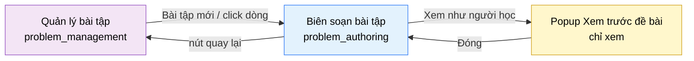

# Tài liệu thiết kế cơ bản (BD) — Biên soạn bài tập (`SHR0202`)

## Phương châm tài liệu [Nội bộ — không cần khách duyệt]

- Viết theo **mẫu 9 sheet**. Bộ thẻ đóng, quy ước ID, ký hiệu chuẩn, ranh giới với tài liệu khác và
  checklist kiểm toán nằm ở `02-bd/_rules/bd-template-9sheet.md` — file này không chép lại.
- Phần gắn nhãn `[Nội bộ]` phục vụ sinh mã và tự kiểm toán, không phải yêu cầu của khách hàng: mục 4.5,
  mục 7.3 và các ghi chú quy ước.
- Mã màn `SHR0202` theo bảng mã ở `02-bd/_rules/bd-template-9sheet.md` mục 8; tên file mang tiền tố mã.
  Actor dùng chung A2/A3 (một view, mount ở hai tiền tố route) nên nhóm `SHR`, không phải `INS`/`ADM`
  [Nguồn: 01-rd/screens/shared/SHR0202_problem_authoring.md:4-9, `DEC-2026-0825-shared-content-authoring-screens`].
- Màn này là **màn con của `SHR0201` (`problem_management`)**, không phải màn gốc; có 1 popup: Xem trước
  đề bài [Nguồn: 01-rd/screens/shared/SHR0202_problem_authoring.md:22-25].
- Hai Bounded Context sở hữu: **`problem-bank`** (nội dung đề, testcase, F2) và **`harness`** (lược đồ
  kiểu dữ liệu đọc bởi tab "Đặc tả", chỉ góp lược đồ qua shared kernel `algoprep-common`, không có API
  riêng mà màn này gọi trực tiếp) [Nguồn: 02-bd/architecture/harness.md mục 4.1].

> Đọc cùng `01-rd/screens/shared/SHR0202_problem_authoring.md` (hành vi ở mức yêu cầu, không lặp lại ở đây) và các
> file BD module: `02-bd/architecture/problem-bank.md`, `02-bd/database/problem-bank.md`,
> `02-bd/storage/problem-bank.md`, `02-bd/architecture/harness.md`.
>
> **Không thiết kế** khối "Gợi ý theo cấp độ" kèm trừ điểm (tab Gợi ý AI) — đã cắt khỏi phạm vi
> `DEC-2026-0831-problem-authoring-round2` [Nguồn: 01-rd/screens/shared/SHR0202_problem_authoring.md:190].
> **Không thiết kế** cột "Điểm" / khối "Chấm điểm từng phần theo trọng số" ở bảng testcase — đã xoá
> `DEC-2026-0831-partial-score-testcase-ratio` [Nguồn: 01-rd/screens/shared/SHR0202_problem_authoring.md:188].
> **Không thiết kế** lựa chọn Trạng thái "Ẩn" — chỉ còn `UNPUBLISHED`/`PUBLISHED`
> `DEC-2026-0830-problem-lifecycle-two-states` [Nguồn: 01-rd/screens/shared/SHR0202_problem_authoring.md:146-148].

---

## Sheet 1. Bìa

| Mục | Giá trị |
| :--- | :--- |
| Hệ thống | AlgoPrep |
| Phân hệ | `problem-bank` (F2) + `harness` (F3, chỉ góp lược đồ kiểu) |
| Công đoạn | BD — Thiết kế cơ bản |
| Phân loại | Màn hình |
| Tên màn | Biên soạn bài tập |
| Mã màn hình | `SHR0202` |
| Tên vật lý (slug) | `problem_authoring` |
| Trục tài liệu | Màn hình (`02-bd/screens/`) |
| Actor | A2 (`INSTRUCTOR`) và A3 (`ADMIN`) — dùng chung một view |
| Phiên bản | V1.0 |
| Người tạo | Nhóm phát triển AlgoPrep |
| Ngày tạo | 2026/09/20 |
| Người cập nhật | Nhóm phát triển AlgoPrep |
| Ngày cập nhật | 2026/09/20 |

---

## Sheet 2. Lịch sử sửa đổi

| Ver | Sheet bị sửa | Nội dung sửa | Ngày | Người sửa |
| :--- | :--- | :--- | :--- | :--- |
| V0.1 | Toàn bộ | Tạo mới theo cấu trúc 10 mục văn xuôi (layout regions, component inventory, screen states, API tiêu thụ, navigation, access rights, câu hỏi mở) tại `02-bd/screens/shared/SHR0202_problem_authoring.md` | 2026/09/13 | Nhóm phát triển AlgoPrep |
| V1.0 | Toàn bộ | Chuyển sang mẫu 9 sheet, đổi tên file thành `SHR0202_problem_authoring.md`. Phát hiện 4 khoảng trống schema chưa từng ghi nhận (Ràng buộc dữ liệu, Đáp án mẫu, Giải thích ví dụ mẫu, Chỉ dẫn AI theo bài — không có cột/bảng DB tương ứng trong `02-bd/database/problem-bank.md`), ghi thành câu hỏi mở thay vì mặc định có cột | 2026/09/20 | Nhóm phát triển AlgoPrep |

---

## Sheet 3. Sơ đồ chuyển màn

> [Nội bộ] Quy ước vẽ: bố trí từ trái sang phải. Màn gọi tới tô tím, màn hiện tại tô xanh nhạt, popup tô
> vàng.

### 3.1 Danh sách chuyển màn

#### Quản lý bài tập → Biên soạn bài tập

[Điều kiện mở] Bấm nút "Bài tập mới", hoặc click một dòng bài toán trong bảng danh sách ở màn
`problem_management`.

[Chế độ mở] Route có `id` (đường dẫn `/instructor/problems/[id]` hoặc `/admin/problems/[id]`) mở chế độ
sửa; route không có `id` hợp lệ mở chế độ soạn mới.

[Thông tin truyền] `problem_id` (khi sửa) hoặc không có tham số (khi soạn mới).

[Giá trị trả về] Không có.

[Khi thành công] Tải toàn bộ chi tiết bài toán (chế độ sửa) hoặc khởi tạo form rỗng (chế độ mới), hiển thị
5 tab nội dung và cột thuộc tính bên phải.

[Khi huỷ] Không có.

#### Biên soạn bài tập → Quản lý bài tập

[Điều kiện mở] Bấm nút quay lại (`‹`) ở đầu trang.

[Chế độ mở] Không có.

[Thông tin truyền] Không có.

[Giá trị trả về] Không có.

[Khi thành công] Điều hướng về `problem_management`, giữ nguyên bộ lọc/trang trước đó của màn cha.

[Khi huỷ] Còn thay đổi chưa lưu thì hỏi xác nhận trước khi rời màn — điểm mở, xem Câu hỏi mở Q12.

#### Biên soạn bài tập → Popup Xem trước đề bài

[Điều kiện mở] Bấm nút "Xem như người học" ở đầu trang.

[Chế độ mở] Chế độ chỉ xem, hiển thị đề bài đúng như A1 (Student) thấy.

[Thông tin truyền] Nội dung đề đang biên soạn hiện tại trong bộ nhớ (kể cả thay đổi chưa lưu) — chưa chốt
có gửi lên máy chủ để render hay render hoàn toàn phía client, xem Câu hỏi mở Q6.

[Giá trị trả về] Không có.

[Khi thành công] Hiển thị đề bài dạng đọc (Markdown đã render, ví dụ mẫu, ràng buộc) trong popup hoặc tab
mới — đích cụ thể chưa chốt, xem Câu hỏi mở Q6.

[Khi huỷ] Không có.

#### Popup Xem trước đề bài → Biên soạn bài tập

[Điều kiện mở] Bấm "Đóng" hoặc đóng tab/popup xem trước.

[Chế độ mở] Không có.

[Thông tin truyền] Không có.

[Giá trị trả về] Không có.

[Khi thành công] Đóng popup, màn chính giữ nguyên trạng thái biên soạn trước đó.

[Khi huỷ] Không có.

### 3.2 Sơ đồ

[Nguồn: 09-layoutBase/Admin - Soạn đề bài.dc.html:142,155-156; 01-rd/screens/shared/SHR0202_problem_authoring.md:22-25,61-69]

---

## Sheet 4. Bố cục màn hình

### 4.1 Tổng quan màn

[Mục đích màn] Cho A2/A3 tạo và sửa trọn vẹn một bài toán trong một màn: đề Markdown+LaTeX, phân loại,
ràng buộc/giới hạn, ví dụ mẫu, đặc tả song song hai mô hình nộp bài, đáp án mẫu, testcase, gợi ý AI theo
bài — rồi xuất bản [Nguồn: 01-rd/screens/shared/SHR0202_problem_authoring.md:30-35].

[Luồng nghiệp vụ chính]

1. **Mở màn**: từ `problem_management`, có `id` thì tải chi tiết bài toán, không có `id` thì khởi tạo form
   rỗng ở trạng thái `UNPUBLISHED`.
2. **Soạn nội dung đề (Tab 1)**: nhập tiêu đề, nội dung Markdown, ràng buộc/giới hạn, ràng buộc dữ liệu,
   đáp án mẫu theo ngôn ngữ. Mỗi trường tự lưu nháp (auto-save) — cơ chế cụ thể chưa có mã RD, xem Câu hỏi
   mở Q7.
3. **Soạn ví dụ mẫu (Tab 2)**: thêm/sửa/xoá các ví dụ minh hoạ trong đề (khác testcase Sample).
4. **Soạn testcase (Tab 3)**: tải lên hàng loạt, sinh tự động bằng AI (chỉ sinh input, output chạy thật
   qua Đáp án mẫu), chạy thử với Đáp án mẫu trên toàn bộ testcase, CRUD từng testcase, sắp lại thứ tự.
5. **Soạn đặc tả (Tab 4)**: chữ ký hàm theo Java/C++/Python, định dạng `stdin`/`stdout` cho Standard I/O,
   chiến lược so khớp kết quả.
6. **Soạn gợi ý AI theo bài (Tab 5)**: "Chỉ dẫn cho trợ lý AI" (chỉ thị bậc hai, nối vào prompt hệ thống)
   và 3 cờ hành vi.
7. **Đặt thuộc tính (cột phải)**: chủ đề, độ khó, trạng thái, thẻ; theo dõi checklist "Sẵn sàng xuất bản"
   và số liệu bài.
8. **Xuất bản**: bấm "Lưu và xuất bản" — chỉ chuyển `status` sang `PUBLISHED` khi đủ checklist.

[Người dùng] A2 (Instructor) đã đăng nhập có Function `PROBLEM_AUTHORING`/`TESTCASE_MANAGEMENT` — chỉ
thao tác trên bài của chính mình; A3 (Admin) có cùng hai Function, thao tác trên toàn bộ kho
[Nguồn: 01-rd/req/identity.md — F1-10 tới F1-12].

[Tệp liên quan] Bộ testcase tải lên hàng loạt (F2-07) — file input/expected-output theo lô, đi qua
presigned URL lên MinIO, không qua form multipart thẳng tới backend
[Nguồn: 02-bd/storage/problem-bank.md mục 3].

[Phạm vi]
- Không thiết kế bảng danh sách/tìm kiếm/phân trang bài toán — thuộc màn cha `problem_management`.
- Không thiết kế ma trận phân quyền — thuộc `admin_permission_matrix`.
- Không thiết kế hệ số nhân giới hạn theo ngôn ngữ (F2-10 phần hệ số) — thuộc `admin_language_config`.
- Không thiết kế hợp đồng API, lược đồ kiểu dữ liệu chi tiết, thuật toán sinh mã khung — thuộc DD và
  `02-bd/architecture/harness.md`.
- Không có tính năng "Chấm điểm từng phần theo trọng số" — đã xoá (Q3 RD đã đóng,
  `DEC-2026-0831-partial-score-testcase-ratio`).
- Không có khối "Gợi ý theo cấp độ" trừ điểm — đã cắt (`DEC-2026-0831-problem-authoring-round2`).

[Quyền sử dụng]
- Xem: được, khi có Function `PROBLEM_AUTHORING` (A3: toàn bộ kho; A2: chỉ bài của mình).
- Thêm: được (tạo bài mới, thêm ví dụ mẫu, thêm testcase).
- Sửa: được (mọi nội dung đề, đặc tả, testcase, thuộc tính, chỉ dẫn AI).
- Xoá: được đối với ví dụ mẫu và testcase (xoá vật lý dòng con); **không xoá bài toán ở màn này** — xoá
  bài toán (ẩn mềm) thuộc màn cha `problem_management`.

[Số bản ghi tối đa] Testcase: không giới hạn, không phân trang (kéo-thả toàn bộ danh sách). Ví dụ mẫu:
không giới hạn. Chữ ký hàm: đúng 3 dòng (một mỗi ngôn ngữ khoá cứng Java/C++/Python). Cờ hành vi AI: đúng
3 dòng. Checklist xuất bản: đúng 4 điều kiện.

[Nguồn: 01-rd/screens/shared/SHR0202_problem_authoring.md:32-35,53-156; 02-bd/database/problem-bank.md mục 1;
01-rd/req/identity.md — F1-10 tới F1-12]

### 4.2 DTO liên quan

- `ProblemAuthoringDetailDto`
- `ProblemSpecDto`
- `FunctionSignatureDto`
- `WorkedExampleDto`
- `TestcaseDto`
- `AiAuthoringContextDto`
- `PublishChecklistDto`
- `ProblemStatsDto`

`[Suy luận]` — tên DTO do BD này đề xuất, `03-dd/api/problem-bank.md` chốt lại.

### 4.3 Bảng dữ liệu liên quan (7)

| NO | Bảng | Ghi chú |
| --: | :--- | :--- |
| 1 | `problem.problems` | [Nguồn: 02-bd/database/problem-bank.md mục 1.1] |
| 2 | `problem.problem_specs` | [Nguồn: 02-bd/database/problem-bank.md mục 1.4] |
| 3 | `problem.function_signatures` | [Nguồn: 02-bd/database/problem-bank.md mục 1.5] |
| 4 | `problem.testcases` | [Nguồn: 02-bd/database/problem-bank.md mục 1.6] |
| 5 | `problem.topics` / `problem.problem_topics` | [Nguồn: 02-bd/database/problem-bank.md mục 1.2] |
| 6 | `problem.tags` / `problem.problem_tags` | [Nguồn: 02-bd/database/problem-bank.md mục 1.3] |
| 7 | `problem.problem_stats` (read model) | [Nguồn: 02-bd/database/problem-bank.md mục 1.9] |

Không có bảng riêng cho: Ràng buộc dữ liệu (constraints), Đáp án mẫu (sample solution), Giải thích ví dụ
mẫu, và Chỉ dẫn AI theo bài — bốn khoảng trống schema, xem Câu hỏi mở Q1-Q4.

### 4.4 Vùng bố cục

Đối chiếu `09-layoutBase/Admin - Soạn đề bài.dc.html` (736 dòng) — bằng chứng bố cục chỉ-đọc, **không
phải** design system cuối cùng. Cấu trúc: thanh đầu trang sticky + vùng nội dung 5 tab bên trái + cột
thuộc tính sticky bên phải, lưới 2 cột `minmax(0,1fr) 300px`
[Nguồn: 09-layoutBase/Admin - Soạn đề bài.dc.html:141-159, 344].

| Vùng | Vị trí trong prototype | Nội dung |
| :--- | :--- | :--- |
| Thanh đầu trang (sticky) | `:141-157` | Nút quay lại, mã+tiêu đề bài, trạng thái lưu, "Xem như người học", "Lưu và xuất bản" |
| Thanh tab | `:163-165` | 5 tab kèm số đếm: Nội dung đề · Ví dụ mẫu (N) · Testcase (N) · Đặc tả · Gợi ý AI. Tab "Đặc tả" không có trong prototype gốc — bổ sung theo `DEC-2026-0831-problem-authoring-spec-tab` |
| Tab 1 — Nội dung đề | `:168-213` | Tiêu đề, Nội dung đề Markdown, Ràng buộc và giới hạn (4 trường), Ràng buộc dữ liệu, Đáp án mẫu theo ngôn ngữ |
| Tab 2 — Ví dụ mẫu | `:215-249` | Danh sách ví dụ (Đầu vào/Kết quả/Giải thích), thêm/xoá |
| Tab 3 — Testcase | `:251-305` | Thanh hành động, băng kết quả chạy, bảng testcase kéo-thả, panel phiên bản bộ testcase (bổ sung theo `DEC-2026-0831-problem-authoring-spec-tab`) |
| Tab 4 — Đặc tả (mới) | không có trong prototype | Chữ ký hàm Java/C++/Python, định dạng stdin/stdout, chiến lược so khớp — dựng theo `DEC-2026-0831-problem-authoring-spec-tab` |
| Tab 5 — Gợi ý AI | `:307-341` | Chỉ dẫn cho trợ lý AI + 3 cờ hành vi (khối "Gợi ý theo cấp độ" đã cắt) |
| Cột thuộc tính (sticky) | `:344-403` | Thuộc tính (Chủ đề, Độ khó, Trạng thái, Thẻ), Sẵn sàng xuất bản (checklist), Số liệu bài |

Sidebar/topbar Admin/Instructor dùng chung khung điều hướng toàn hệ thống — không mô tả lại ở đây.

### 4.5 Cấu trúc slice FSD [Nội bộ]

| Khối | Slice dự kiến | Căn cứ |
| :--- | :--- | :--- |
| Trang | `views/shared/problem-authoring` | Quy ước FSD của dự án |
| Khung Admin/Instructor | Dùng lại `widgets/admin-shell` / `widgets/instructor-shell` theo tiền tố route | `DEC-2026-0825-frontend-base-architecture` |
| Đầu trang | `widgets/authoring-header` + `entities/problem` | Prototype `:141-157` |
| Tab 1 | `widgets/problem-content-form` + `entities/problem` | Prototype `:168-213` |
| Tab 2 | `widgets/worked-example-list` + `entities/worked-example` | Prototype `:215-249` |
| Tab 3 | `widgets/testcase-editor` + `entities/testcase` + `features/testcase-bulk-upload`, `features/testcase-ai-generate`, `features/run-sample-solution` | Prototype `:251-305` |
| Tab 4 | `widgets/problem-spec-editor` + `entities/function-signature` | Tab mới, chưa có prototype |
| Tab 5 | `widgets/ai-authoring-context` | Prototype `:307-341` |
| Cột phải | `widgets/problem-properties-panel` + `widgets/publish-checklist` + `widgets/problem-metrics-panel` | Prototype `:344-403` |
| Popup | `features/problem-preview` | Prototype `:155-156` |

`[Suy luận]` — ánh xạ slice do BD đề xuất, DD màn hình chốt lại.

> [Nội bộ] Ảnh minh hoạ đặt ở `08-diagram/02-bd/screens/shared/`, chụp bằng Playwright trên ứng dụng
> Next.js thật khi đã có mã chạy được. Chưa có thì tham chiếu prototype, không vẽ tay.

---

## Sheet 5. Danh sách item màn hình

> Quy ước ID, bộ thẻ và giá trị chuẩn: `02-bd/_rules/bd-template-9sheet.md` mục 2, 3, 4.

### Khu vực A — Thanh đầu trang

| Khu vực | NO | Tên item | ID item | Bảng DB | Cột DB | Loại UI | Kiểu | Độ dài | Bắt buộc | I/O | Giá trị mặc định | Định dạng | Ghi chú |
| :--- | --: | :--- | :--- | :--- | :--- | :--- | :--- | :--- | :-: | :-: | :--- | :--- | :--- |
| Thanh đầu trang | | | | | | | | | | | | | |
| | 1 | Nút quay lại | `problemAuthoring.header.btnBack` | - | - | Button | - | - | - | I | - | `‹` | Về màn `problem_management` [Nguồn giá trị] - [EVT liên quan] EVT-3 |
| | 2 | Mã và tiêu đề bài | `problemAuthoring.header.codeTitle` | `problems` | `code`, `title` | Label | String | - | - | O | - | `#{code} · {title}` | Chỉ hiển thị khi chế độ sửa (có `id`); soạn mới hiện "Bài toán mới" [Nguồn giá trị] Cột `code`, `title` [EVT liên quan] - |
| | 3 | Trạng thái lưu | `problemAuthoring.header.saveHint` | `problems` | `status`, `updated_at` | Label | String | - | - | O | - | Xem Sheet 6 | Cơ chế auto-save chưa có mã RD [Công thức] `status = PUBLISHED` → "Đang hiển thị cho người học · lưu nháp tự động {X} trước"; `status = UNPUBLISHED` → "Bản nháp · chưa hiển thị cho người học" [EVT liên quan] EVT-7 đến EVT-11 |
| | 4 | Xem như người học | `problemAuthoring.header.btnPreview` | - | - | Button | - | - | - | I | - | - | Mở popup xem trước đề bài [Nguồn giá trị] - [EVT liên quan] EVT-4 |
| | 5 | Lưu và xuất bản | `problemAuthoring.header.btnPublish` | - | - | Button | - | - | - | I | - | - | Chuyển `problems.status` sang `PUBLISHED` [Nguồn giá trị] - [EVT liên quan] EVT-33 |

### Khu vực B — Thanh tab

| Khu vực | NO | Tên item | ID item | Bảng DB | Cột DB | Loại UI | Kiểu | Độ dài | Bắt buộc | I/O | Giá trị mặc định | Định dạng | Ghi chú |
| :--- | --: | :--- | :--- | :--- | :--- | :--- | :--- | :--- | :-: | :-: | :--- | :--- | :--- |
| Thanh tab | | | | | | | | | | | | | |
| | 1 | Tab Nội dung đề | `problemAuthoring.tabs.content` | - | - | Button | - | - | - | I | Đang chọn (mặc định) | - | [Nguồn giá trị] Nhãn tĩnh i18n [EVT liên quan] EVT-6 |
| | 2 | Tab Ví dụ mẫu | `problemAuthoring.tabs.examples` | - | - | Button | - | - | - | I | - | `Ví dụ mẫu ({N})` | [Công thức] `N` = số dòng `WorkedExampleDto` hiện có [EVT liên quan] EVT-6 |
| | 3 | Tab Testcase | `problemAuthoring.tabs.testcases` | - | - | Button | - | - | - | I | - | `Testcase ({N})` | [Công thức] `N` = số dòng `testcases` của bài [EVT liên quan] EVT-6 |
| | 4 | Tab Đặc tả | `problemAuthoring.tabs.spec` | - | - | Button | - | - | - | I | - | - | Tab mới, chưa có trong prototype gốc [Nguồn giá trị] Nhãn tĩnh i18n [EVT liên quan] EVT-6 |
| | 5 | Tab Gợi ý AI | `problemAuthoring.tabs.aiHints` | - | - | Button | - | - | - | I | - | - | [Nguồn giá trị] Nhãn tĩnh i18n [EVT liên quan] EVT-6 |

### Khu vực C — Tab 1: Nội dung đề

| Khu vực | NO | Tên item | ID item | Bảng DB | Cột DB | Loại UI | Kiểu | Độ dài | Bắt buộc | I/O | Giá trị mặc định | Định dạng | Ghi chú |
| :--- | --: | :--- | :--- | :--- | :--- | :--- | :--- | :--- | :-: | :-: | :--- | :--- | :--- |
| Tab 1 — Nội dung đề | | | | | | | | | | | | | |
| | 1 | Tiêu đề | `problemAuthoring.content.title` | `problems` | `title` | TextBox | String | 255 | Có | I/O | rỗng | - | [Nguồn giá trị] Cột `title` [EVT liên quan] EVT-7 |
| | 2 | Nội dung đề (Markdown) | `problemAuthoring.content.statementMd` | `problems` | `statement_md` | TextArea | String | - | Có | I/O | rỗng | Markdown + LaTeX (F2-01) | Prototype chỉ có textarea thuần, chưa có preview render — khoảng trống dựng UI, không phải khoảng trống dữ liệu [Nguồn giá trị] Cột `statement_md` [EVT liên quan] EVT-8 |
| | 3 | Bộ đếm ký tự | `problemAuthoring.content.charCount` | - | - | Label | Number | - | - | O | 0 | `{n} ký tự` | [Công thức] Độ dài chuỗi `statement_md` hiện tại trong ô soạn [EVT liên quan] EVT-8 |
| | 4 | Giới hạn thời gian | `problemAuthoring.content.timeLimit` | `problems` | `time_limit_ms` | NumberBox | Number | - | Có | I/O | - | Giây (hiển thị), lưu mili-giây | Mốc cơ sở trước khi nhân hệ số ngôn ngữ ở `admin_language_config` [Nguồn giá trị] Cột `time_limit_ms` [EVT liên quan] EVT-9 |
| | 5 | Giới hạn bộ nhớ | `problemAuthoring.content.memoryLimit` | `problems` | `memory_limit_mb` | NumberBox | Number | - | Có | I/O | - | MB | [Nguồn giá trị] Cột `memory_limit_mb` [EVT liên quan] EVT-9 |
| | 6 | Kích thước đầu ra | `problemAuthoring.content.maxOutputSize` | `problems` | `max_output_size_kb` | NumberBox | Number | - | Có | I/O | - | KB | Amendment F2-10, per-problem [Nguồn giá trị] Cột `max_output_size_kb` [EVT liên quan] EVT-9 |
| | 7 | Số lần nộp / giờ | `problemAuthoring.content.maxSubmissionsPerHour` | `problems` | `max_submissions_per_hour` | NumberBox | Number | - | Không | I/O | rỗng (dùng mặc định hệ thống) | Số nguyên | NULL = dùng mặc định hệ thống (đề xuất BD 60 lần/giờ, `02-bd/database/problem-bank.md` mục 5) [Nguồn giá trị] Cột `max_submissions_per_hour` [EVT liên quan] EVT-9 |
| | 8 | Ràng buộc dữ liệu | `problemAuthoring.content.constraintsText` | - | - | TextArea | String | - | Không | I/O | rỗng | Văn bản tự do (ví dụ `1 <= s.length <= 10^5`) | **Không có cột DB tương ứng** trong `problem_specs`/`problems` — đầu vào bắt buộc của F2-14 (AI sinh input) nhưng chưa xác định nơi lưu, xem Câu hỏi mở Q1 [Nguồn giá trị] Chưa xác định — xem Q1 [EVT liên quan] EVT-10 |
| | 9 | Ngôn ngữ đáp án mẫu | `problemAuthoring.content.sampleSolutionLanguage` | - | - | Enum | Enum | - | Có (khi có mã) | I/O | `PYTHON` | `JAVA`/`CPP`/`PYTHON` | **Không có bảng DB lưu đáp án mẫu** — xem Câu hỏi mở Q2 [Nguồn giá trị] Chưa xác định — xem Q2 [EVT liên quan] EVT-11 |
| | 10 | Mã đáp án mẫu | `problemAuthoring.content.sampleSolutionCode` | - | - | TextArea | String | - | Có (để "Sinh tự động"/"Chạy với đáp án mẫu" hoạt động) | I/O | rỗng | - | Dùng để sinh output thật cho testcase (F2-14) — cơ chế an toàn cốt lõi, AI không tự sinh output. **Không có bảng DB lưu** — xem Câu hỏi mở Q2 [Nguồn giá trị] Chưa xác định — xem Q2 [EVT liên quan] EVT-11 |

### Khu vực D — Tab 2: Ví dụ mẫu

| Khu vực | NO | Tên item | ID item | Bảng DB | Cột DB | Loại UI | Kiểu | Độ dài | Bắt buộc | I/O | Giá trị mặc định | Định dạng | Ghi chú |
| :--- | --: | :--- | :--- | :--- | :--- | :--- | :--- | :--- | :-: | :-: | :--- | :--- | :--- |
| Tab 2 — Ví dụ mẫu | | | | | | | | | | | | | |
| | 1 | Danh sách ví dụ | `problemAuthoring.examples.list` | `testcases` | `is_worked_example` | List | List | - | - | I/O | rỗng | - | Khác testcase Sample — ví dụ là văn bản minh hoạ trong đề, không phải dữ liệu chạy máy. Ánh xạ vào `testcases` qua cờ `is_worked_example` là đề xuất kế thừa từ BD trước, RD lại mô tả đây là khái niệm tách biệt — mâu thuẫn chưa giải quyết, xem Câu hỏi mở Q3 [Nguồn giá trị] `testcases WHERE is_worked_example = true` (tạm thời) — xem Q3 [EVT liên quan] EVT-1 |
| | 2 | Đầu vào | `problemAuthoring.examples.col.input` | `testcases` | `input_inline` | TextBox | String | - | Có | I/O | - | - | [Nguồn giá trị] Cột `input_inline` (giả định luôn `INLINE` cho ví dụ, không phải bộ lớn) [EVT liên quan] EVT-13 |
| | 3 | Kết quả | `problemAuthoring.examples.col.output` | `testcases` | `expected_output_inline` | TextBox | String | - | Có | I/O | - | - | [Nguồn giá trị] Cột `expected_output_inline` [EVT liên quan] EVT-13 |
| | 4 | Giải thích | `problemAuthoring.examples.col.explanation` | - | - | TextArea | String | - | Không | I/O | rỗng | - | **Không có cột DB tương ứng** trên `testcases` — xem Câu hỏi mở Q3 [Nguồn giá trị] Chưa xác định — xem Q3 [EVT liên quan] EVT-13 |
| | 5 | Thêm ví dụ | `problemAuthoring.examples.btnAdd` | - | - | Button | - | - | - | I | - | - | Thêm dòng trống vào danh sách [Nguồn giá trị] - [EVT liên quan] EVT-12 |
| | 6 | Xoá ví dụ | `problemAuthoring.examples.btnRemove` | - | - | Button | - | - | - | I | - | - | Xoá một dòng ví dụ [Nguồn giá trị] - [EVT liên quan] EVT-14 |

### Khu vực E — Tab 3: Testcase

| Khu vực | NO | Tên item | ID item | Bảng DB | Cột DB | Loại UI | Kiểu | Độ dài | Bắt buộc | I/O | Giá trị mặc định | Định dạng | Ghi chú |
| :--- | --: | :--- | :--- | :--- | :--- | :--- | :--- | :--- | :-: | :-: | :--- | :--- | :--- |
| Tab 3 — Testcase | | | | | | | | | | | | | |
| | 1 | Tóm tắt testcase | `problemAuthoring.testcase.summary` | `testcases` | `visibility` | Label | String | - | - | O | - | `{N} testcase · {M} công khai` | [Công thức] `N` = tổng dòng `testcases`; `M` = số dòng `visibility = SAMPLE` [EVT liên quan] EVT-1 |
| | 2 | Phiên bản bộ testcase | `problemAuthoring.testcase.versionBadge` | `problems` | `current_testcase_set_version` | Badge | Number | - | - | O | `1` | `v{n}` | Panel bổ sung theo `DEC-2026-0831-problem-authoring-spec-tab`, không có trong prototype gốc [Nguồn giá trị] Cột `current_testcase_set_version` [EVT liên quan] EVT-1 |
| | 3 | Tải lên hàng loạt | `problemAuthoring.testcase.btnBulkUpload` | - | - | Button | - | - | - | I | - | - | Mở luồng presigned URL lên MinIO (F2-07) [Nguồn giá trị] - [EVT liên quan] EVT-15 |
| | 4 | Sinh tự động | `problemAuthoring.testcase.btnAutoGenerate` | - | - | Button | - | - | - | I | - | - | AI chỉ sinh input; output chạy thật qua Đáp án mẫu (F2-14) [Nguồn giá trị] - [EVT liên quan] EVT-16 |
| | 5 | Chạy với đáp án mẫu | `problemAuthoring.testcase.btnRunSample` | - | - | Button | - | - | - | I | - | - | Chạy toàn bộ testcase hiện có qua Đáp án mẫu (outbound port tới go-judge) [Nguồn giá trị] - [EVT liên quan] EVT-18 |
| | 6 | Băng kết quả chạy | `problemAuthoring.testcase.runResultBanner` | - | - | Label | String | - | - | O | ẩn | "Đúng {n}/{n} testcase" hoặc "Thất bại ở testcase #{k}" | Dữ liệu chạy thử, không lưu DB (ephemeral, chỉ tồn tại trong phiên biên soạn) [Nguồn giá trị] Kết quả gọi `RunSampleSolutionAgainstTestcases` [EVT liên quan] EVT-18 |
| | 7 | Danh sách testcase | `problemAuthoring.testcase.list` | `testcases` | - | List | List | - | - | I/O | rỗng | - | [Nguồn giá trị] `testcases WHERE problem_id = :id`, sắp theo thứ tự hiển thị [EVT liên quan] EVT-1 |
| | 8 | STT | `problemAuthoring.testcase.col.index` | - | - | ListColumn | Number | - | - | O | - | Số thứ tự hiển thị | [Công thức] Vị trí trong danh sách sau khi sắp xếp [EVT liên quan] EVT-23 |
| | 9 | Đầu vào | `problemAuthoring.testcase.col.input` | `testcases` | `input_inline` / `input_object_key` | TextBox | String | - | Có | I/O | - | - | [Công thức] `input_storage = INLINE` hiển thị `input_inline`; `= MINIO` hiển thị nội dung tải từ presigned URL (`02-bd/storage/problem-bank.md` mục 3) [EVT liên quan] EVT-20 |
| | 10 | Kết quả mong đợi | `problemAuthoring.testcase.col.expectedOutput` | `testcases` | `expected_output_inline` / `expected_output_object_key` | TextBox | String | - | Có | I/O | - | - | [Công thức] Tương tự cột Đầu vào, theo `expected_output_storage` [EVT liên quan] EVT-20 |
| | 11 | Hiển thị | `problemAuthoring.testcase.col.visibility` | `testcases` | `visibility` | Toggle | Enum | - | Có | I/O | `HIDDEN` | Nhãn "Công khai"/"Ẩn", giá trị `SAMPLE`/`HIDDEN` | Nhãn tiếng Việt, giá trị dữ liệu `SAMPLE`/`HIDDEN` — không sinh thuật ngữ thứ hai [Nguồn giá trị] Cột `visibility` [EVT liên quan] EVT-21 |
| | 12 | Nhãn testcase AI nháp | `problemAuthoring.testcase.col.aiDraftBadge` | `testcases` | `is_ai_generated_draft` | Badge | Boolean | - | - | O | `false` | "Nháp AI" | Chỉ hiện khi `true`; chưa gộp vào Hidden khi xuất bản cho tới khi A2/A3 xác nhận [Nguồn giá trị] Cột `is_ai_generated_draft` [EVT liên quan] EVT-17 |
| | 13 | Chạy thử | `problemAuthoring.testcase.col.btnRunSingle` | - | - | Button | - | - | - | I | - | - | Chạy Đáp án mẫu với đúng một testcase này [Nguồn giá trị] - [EVT liên quan] EVT-22 |
| | 14 | Xoá | `problemAuthoring.testcase.col.btnDelete` | - | - | Button | - | - | - | I | - | - | Xoá một dòng testcase [Nguồn giá trị] - [EVT liên quan] EVT-23 |
| | 15 | Kéo-thả sắp thứ tự | `problemAuthoring.testcase.dragHandle` | - | - | Button | - | - | - | I | - | - | Không còn ảnh hưởng kết quả chấm (F4 chạy hết mọi testcase), chỉ ảnh hưởng cách trình bày [Nguồn giá trị] - [EVT liên quan] EVT-24 |
| | 16 | Thêm testcase | `problemAuthoring.testcase.btnAdd` | - | - | Button | - | - | - | I | - | - | Thêm dòng trống, mặc định `Ẩn` [Nguồn giá trị] - [EVT liên quan] EVT-19 |

### Khu vực F — Tab 4: Đặc tả

| Khu vực | NO | Tên item | ID item | Bảng DB | Cột DB | Loại UI | Kiểu | Độ dài | Bắt buộc | I/O | Giá trị mặc định | Định dạng | Ghi chú |
| :--- | --: | :--- | :--- | :--- | :--- | :--- | :--- | :--- | :-: | :-: | :--- | :--- | :--- |
| Tab 4 — Đặc tả | | | | | | | | | | | | | |
| | 1 | Cảnh báo vượt lược đồ | `problemAuthoring.spec.wrapperUnsupportedWarning` | `problems` | `function_wrapper_supported` | Label | Boolean | - | - | O | `true` | "Kiểu dữ liệu này chỉ hỗ trợ Standard I/O..." khi `false` | Tự động đặt khi lưu chữ ký hàm vượt lược đồ `TypeKind` (F3-13) [Nguồn giá trị] Cột `function_wrapper_supported` [EVT liên quan] EVT-25 |
| | 2 | Nhóm chữ ký hàm theo ngôn ngữ | `problemAuthoring.spec.functionSignature.list` | `function_signatures` | - | List | List | - | - | I/O | 3 dòng rỗng | - | Đúng 3 dòng cố định (Java/C++/Python), không thêm/bớt [Nguồn giá trị] `function_signatures WHERE problem_spec_id = :id` [EVT liên quan] EVT-25 |
| | 3 | Tên hàm | `problemAuthoring.spec.functionSignature.col.functionName` | `function_signatures` | `function_name` | TextBox | String | - | Có | I/O | - | - | [Nguồn giá trị] Cột `function_name` [EVT liên quan] EVT-25 |
| | 4 | Kiểu trả về | `problemAuthoring.spec.functionSignature.col.returnType` | `function_signatures` | `return_type` | TextBox | String | - | Có | I/O | - | JSON theo `TypeKind` (`02-bd/architecture/harness.md` mục 4.2) | Nhập qua picker cấu trúc (chọn `kind`, lồng `of`), không phải textarea JSON thô — đề xuất BD, chưa có UI cụ thể, xem Câu hỏi mở Q10 [Nguồn giá trị] Cột `return_type` [EVT liên quan] EVT-25 |
| | 5 | Danh sách tham số | `problemAuthoring.spec.functionSignature.col.parameters` | `function_signatures` | `parameters` | List | List | - | Có | I/O | rỗng | JSON mảng theo `TypeKind` | Thứ tự tham số có ý nghĩa [Nguồn giá trị] Cột `parameters` [EVT liên quan] EVT-25 |
| | 6 | Định dạng đọc stdin | `problemAuthoring.spec.stdinFormat` | `problem_specs` | `stdin_format_md` | TextArea | String | - | Có | I/O | rỗng | Markdown tự do, dùng ký hiệu đã chốt (`#`, `true`/`false`, mỗi chiều một dòng) | [Nguồn giá trị] Cột `stdin_format_md` [EVT liên quan] EVT-26 |
| | 7 | Định dạng in stdout | `problemAuthoring.spec.stdoutFormat` | `problem_specs` | `stdout_format_md` | TextArea | String | - | Có | I/O | rỗng | Markdown tự do | [Nguồn giá trị] Cột `stdout_format_md` [EVT liên quan] EVT-26 |
| | 8 | Chiến lược so khớp | `problemAuthoring.spec.matchingStrategy` | `problem_specs` | `matching_strategy` | Enum | Enum | - | Có | I/O | `EXACT` | `EXACT`/`TRIMMED`/`EPSILON`/`UNORDERED_SET` | Không hợp lệ khi `UNORDERED_SET` + kiểu trả về `BINARY_TREE`/`LINKED_LIST` (Sheet 9) [Nguồn giá trị] Cột `matching_strategy` [EVT liên quan] EVT-27 |
| | 9 | Giá trị epsilon | `problemAuthoring.spec.epsilonValue` | `problem_specs` | `epsilon_value` | NumberBox | Number | - | Điều kiện | I/O | rỗng | Số thập phân | [Điều kiện hiển thị] Chỉ hiện khi `matching_strategy = EPSILON` [Nguồn giá trị] Cột `epsilon_value` [EVT liên quan] EVT-27 |

### Khu vực G — Tab 5: Gợi ý AI

| Khu vực | NO | Tên item | ID item | Bảng DB | Cột DB | Loại UI | Kiểu | Độ dài | Bắt buộc | I/O | Giá trị mặc định | Định dạng | Ghi chú |
| :--- | --: | :--- | :--- | :--- | :--- | :--- | :--- | :--- | :-: | :-: | :--- | :--- | :--- |
| Tab 5 — Gợi ý AI | | | | | | | | | | | | | |
| | 1 | Nhờ AI soạn nháp | `problemAuthoring.aiHints.btnDraftAi` | - | - | Button | - | - | - | I | - | - | Không có mã RD nào phủ tính năng này — F2-14 chỉ phủ sinh testcase, không phủ soạn đề/gợi ý. Giữ/cắt chưa chốt, xem Câu hỏi mở Q9 [Nguồn giá trị] - [EVT liên quan] EVT-30 |
| | 2 | Chỉ dẫn cho trợ lý AI | `problemAuthoring.aiHints.briefText` | - | - | TextArea | String | - | Không | I/O | rỗng | - | Chỉ thị bậc hai, nối vào prompt hệ thống trong khối riêng, không ghi đè F5-17/F5-18. **Không có bảng DB lưu** — xem Câu hỏi mở Q4 [Nguồn giá trị] Chưa xác định — xem Q4 [EVT liên quan] EVT-28 |
| | 3 | Cờ: Không đưa mã hoàn chỉnh | `problemAuthoring.aiHints.flag.noFullCode` | - | - | Toggle | Boolean | - | - | I/O | Bật | Bật/Tắt | Không có bảng DB lưu, xem Câu hỏi mở Q4 [Nguồn giá trị] Chưa xác định — xem Q4 [EVT liên quan] EVT-29 |
| | 4 | Cờ: Chỉ hỏi ngược, không giải hộ | `problemAuthoring.aiHints.flag.questionOnly` | - | - | Toggle | Boolean | - | - | I/O | Bật | Bật/Tắt | Không có bảng DB lưu, xem Câu hỏi mở Q4 [Nguồn giá trị] Chưa xác định — xem Q4 [EVT liên quan] EVT-29 |
| | 5 | Cờ: Cho phép AI mở gợi ý ẩn | `problemAuthoring.aiHints.flag.allowHiddenHint` | - | - | Toggle | Boolean | - | - | I/O | Tắt | Bật/Tắt | Không có bảng DB lưu, xem Câu hỏi mở Q4 [Nguồn giá trị] Chưa xác định — xem Q4 [EVT liên quan] EVT-29 |

### Khu vực H — Cột thuộc tính

| Khu vực | NO | Tên item | ID item | Bảng DB | Cột DB | Loại UI | Kiểu | Độ dài | Bắt buộc | I/O | Giá trị mặc định | Định dạng | Ghi chú |
| :--- | --: | :--- | :--- | :--- | :--- | :--- | :--- | :--- | :-: | :-: | :--- | :--- | :--- |
| Cột thuộc tính | | | | | | | | | | | | | |
| | 1 | Chủ đề | `problemAuthoring.props.topic` | `problem_topics` | `topic_id` | List | List | - | Không | I/O | rỗng | Danh mục cố định `topics` | [Nguồn giá trị] `problem_topics WHERE problem_id = :id`, danh mục chọn từ bảng `topics` [EVT liên quan] EVT-31 |
| | 2 | Độ khó | `problemAuthoring.props.difficulty` | `problems` | `difficulty` | List | Enum | - | Có | I/O | `EASY` | `EASY`/`MEDIUM`/`HARD` | [Nguồn giá trị] Cột `difficulty` [EVT liên quan] EVT-31 |
| | 3 | Trạng thái | `problemAuthoring.props.status` | `problems` | `status` | List | Enum | - | Có | I/O | `UNPUBLISHED` | `Chưa xuất bản`/`Đã xuất bản` | Đúng 2 lựa chọn (F2-15). Prototype còn vẽ "Ẩn" — **không dựng khi build UI thật** [Nguồn giá trị] Cột `status` [EVT liên quan] EVT-32 |
| | 4 | Thẻ | `problemAuthoring.props.tags` | `problem_tags` | `tag_id` | List | List | - | Không | I/O | rỗng | Tự do, tạo mới khi gõ chưa tồn tại | [Nguồn giá trị] `problem_tags WHERE problem_id = :id`, giá trị mới tạo vào `tags` [EVT liên quan] EVT-31 |
| | 5 | Checklist sẵn sàng xuất bản | `problemAuthoring.props.checklist.list` | - | - | List | List | - | - | O | 4 dòng chưa đạt | - | 4 điều kiện: ≥8 testcase, ≥2 Sample, đáp án mẫu chạy đúng mọi testcase, ≥2 ví dụ mẫu (đã bỏ "tổng trọng số 100") [Công thức] Tính từ `testcases`, kết quả `RunSampleSolutionAgainstTestcases`, `WorkedExampleDto` [EVT liên quan] EVT-33 |
| | 6 | Lượt nộp | `problemAuthoring.props.metrics.submissionCount` | `problem_stats` | `submission_count` | Label | Number | - | - | O | 0 | Số nguyên | [Nguồn giá trị] Cột `submission_count` [EVT liên quan] EVT-1 |
| | 7 | Tỉ lệ AC | `problemAuthoring.props.metrics.acRate` | `problem_stats` | `ac_rate` | Label | Number | - | - | O | 0 | `{số}%` | [Nguồn giá trị] Cột `ac_rate` [EVT liên quan] EVT-1 |
| | 8 | Thời gian giải trung bình | `problemAuthoring.props.metrics.avgSolveTime` | - | - | Label | Number | - | - | O | - | - | **Không có cột DB** trong `problem_stats` (chỉ có `submission_count`, `accepted_count`, `ac_rate`, `updated_at`) — xem Câu hỏi mở Q5 [Nguồn giá trị] Chưa xác định — xem Q5 [EVT liên quan] - |
| | 9 | Lượt xin gợi ý | `problemAuthoring.props.metrics.hintRequests` | - | - | Label | Number | - | - | O | - | - | **Không có cột DB** — phụ thuộc tính năng "Gợi ý theo cấp độ" đã cắt phạm vi, xem Câu hỏi mở Q5 [Nguồn giá trị] Chưa xác định — xem Q5 [EVT liên quan] - |
| | 10 | Sửa lần cuối | `problemAuthoring.props.metrics.lastEditedBy` | `problems` | `updated_by`, `updated_at` | Label | String | - | - | O | - | `Sửa lần cuối {X} giờ trước bởi {tên}` | `updated_by` là id tham chiếu `identity`, không FK vật lý — tên hiển thị cần tra cứu chéo module [Nguồn giá trị] Cột `updated_by`/`updated_at`, tên tra qua `identity` [EVT liên quan] - |

### Popup

| Khu vực | NO | Tên item | ID item | Bảng DB | Cột DB | Loại UI | Kiểu | Độ dài | Bắt buộc | I/O | Giá trị mặc định | Định dạng | Ghi chú |
| :--- | --: | :--- | :--- | :--- | :--- | :--- | :--- | :--- | :-: | :-: | :--- | :--- | :--- |
| Popup | | | | | | | | | | | | | |
| | 1 | Xem trước đề bài | `problemAuthoring.popup.preview` | - | - | Popup | - | - | - | O | - | - | Render đề bài đúng như A1 thấy, đích cụ thể (modal/tab mới) chưa chốt [Nguồn giá trị] Nội dung đang biên soạn trong bộ nhớ [EVT liên quan] EVT-4, EVT-5 |

[Nguồn: 09-layoutBase/Admin - Soạn đề bài.dc.html:141-403; 02-bd/database/problem-bank.md mục 1;
01-rd/screens/shared/SHR0202_problem_authoring.md:59-156]

---

## Sheet 6. Đặc tả điều khiển item

> Ký hiệu cột `Hiển thị` và thứ tự thẻ: `02-bd/_rules/bd-template-9sheet.md` mục 2, 3. Dùng đúng NO, tên
> item và thứ tự của Sheet 5.

### Khu vực A — Thanh đầu trang

| Khu vực | NO | Tên item | Hiển thị | Ghi chú |
| :--- | --: | :--- | :-: | :--- |
| Thanh đầu trang | | | | |
| | 1 | Nút quay lại | Có | [Điều kiện kích hoạt] Luôn kích hoạt. Còn thay đổi chưa lưu thì hỏi xác nhận trước khi rời — xem Câu hỏi mở Q12. |
| | 2 | Mã và tiêu đề bài | Điều kiện | [Điều kiện hiển thị] Chỉ hiện khi đang ở chế độ sửa (có `id`); chế độ soạn mới hiện "Bài toán mới". |
| | 3 | Trạng thái lưu | Có | [Tự động đặt] Cập nhật ngay sau mỗi lần auto-save thành công. |
| | 4 | Xem như người học | Có | [Điều kiện kích hoạt] Kích hoạt sau khi tải xong dữ liệu ban đầu. |
| | 5 | Lưu và xuất bản | Có | [Điều kiện kích hoạt] Luôn hiển thị; hành vi khi checklist chưa đủ 4 điều kiện chưa chốt (chặn cứng hay lưu về nháp kèm banner) — xem Câu hỏi mở Q8. |

### Khu vực B — Thanh tab

| Khu vực | NO | Tên item | Hiển thị | Ghi chú |
| :--- | --: | :--- | :-: | :--- |
| Thanh tab | | | | |
| | 1 | Tab Nội dung đề | Có | - |
| | 2 | Tab Ví dụ mẫu | Có | - |
| | 3 | Tab Testcase | Có | - |
| | 4 | Tab Đặc tả | Có | [Điều kiện kích hoạt] Không xuất bản được nếu tab này còn trống (checklist bổ sung, `DEC-2026-0831-problem-authoring-spec-tab`). |
| | 5 | Tab Gợi ý AI | Có | - |

### Khu vực C — Tab 1: Nội dung đề

| Khu vực | NO | Tên item | Hiển thị | Ghi chú |
| :--- | --: | :--- | :-: | :--- |
| Tab 1 — Nội dung đề | | | | |
| | 1 | Tiêu đề | Có | [Điều kiện kích hoạt] Chỉ kích hoạt khi Tab Nội dung đề đang chọn. |
| | 2 | Nội dung đề (Markdown) | Có | - |
| | 3 | Bộ đếm ký tự | Có | [Tự động đặt] Cập nhật theo từng ký tự gõ vào ô Nội dung đề. |
| | 4 | Giới hạn thời gian | Có | - |
| | 5 | Giới hạn bộ nhớ | Có | - |
| | 6 | Kích thước đầu ra | Có | - |
| | 7 | Số lần nộp / giờ | Có | - |
| | 8 | Ràng buộc dữ liệu | Có | - |
| | 9 | Ngôn ngữ đáp án mẫu | Có | - |
| | 10 | Mã đáp án mẫu | Có | [Điều kiện kích hoạt] Đáp án mẫu chưa chạy Pass toàn bộ testcase thì nút "Sinh tự động" ở Tab 3 vô hiệu — xem Khu vực E mục 4. |

### Khu vực D — Tab 2: Ví dụ mẫu

| Khu vực | NO | Tên item | Hiển thị | Ghi chú |
| :--- | --: | :--- | :-: | :--- |
| Tab 2 — Ví dụ mẫu | | | | |
| | 1 | Danh sách ví dụ | Có | [Điều kiện hiển thị] Chưa có ví dụ nào hiện "Chưa có ví dụ — Thêm ví dụ" thay cho danh sách rỗng. |
| | 2 | Đầu vào | Có | - |
| | 3 | Kết quả | Có | - |
| | 4 | Giải thích | Có | - |
| | 5 | Thêm ví dụ | Có | - |
| | 6 | Xoá ví dụ | Có | [Điều kiện kích hoạt] Không kích hoạt khi chỉ còn đúng 1 ví dụ và bài đã `PUBLISHED` — cần giữ tối thiểu 2 ví dụ theo checklist xuất bản, xem Sheet 9. |

### Khu vực E — Tab 3: Testcase

| Khu vực | NO | Tên item | Hiển thị | Ghi chú |
| :--- | --: | :--- | :-: | :--- |
| Tab 3 — Testcase | | | | |
| | 1 | Tóm tắt testcase | Có | [Tự động đặt] Tính lại ngay sau mỗi lần thêm/xoá/đổi Hiển thị testcase. |
| | 2 | Phiên bản bộ testcase | Có | [Tự động đặt] Tăng khi lưu thay đổi testcase Hidden của bài đã `PUBLISHED` và đã có submission. |
| | 3 | Tải lên hàng loạt | Có | - |
| | 4 | Sinh tự động | Có | [Điều kiện kích hoạt] **Vô hiệu kèm lý do ngay tại chỗ** khi chưa có Đáp án mẫu chạy Pass toàn bộ testcase hiện có — chặn sớm ở giao diện, không chờ bấm mới báo lỗi. |
| | 5 | Chạy với đáp án mẫu | Có | [Điều kiện kích hoạt] Không kích hoạt khi ô Mã đáp án mẫu rỗng. |
| | 6 | Băng kết quả chạy | Điều kiện | [Điều kiện hiển thị] Chỉ hiện sau khi có ít nhất một lần chạy trong phiên biên soạn hiện tại. |
| | 7 | Danh sách testcase | Có | [Điều kiện hiển thị] Chưa có testcase nào hiện "Chưa có testcase — Thêm hoặc Tải lên hàng loạt". |
| | 8 | STT | Có | - |
| | 9 | Đầu vào | Có | - |
| | 10 | Kết quả mong đợi | Có | - |
| | 11 | Hiển thị | Có | - |
| | 12 | Nhãn testcase AI nháp | Điều kiện | [Điều kiện hiển thị] Chỉ hiện khi `is_ai_generated_draft = true`. |
| | 13 | Chạy thử | Có | - |
| | 14 | Xoá | Có | - |
| | 15 | Kéo-thả sắp thứ tự | Có | - |
| | 16 | Thêm testcase | Có | - |

### Khu vực F — Tab 4: Đặc tả

| Khu vực | NO | Tên item | Hiển thị | Ghi chú |
| :--- | --: | :--- | :-: | :--- |
| Tab 4 — Đặc tả | | | | |
| | 1 | Cảnh báo vượt lược đồ | Điều kiện | [Điều kiện hiển thị] Chỉ hiện khi `function_wrapper_supported = false`. |
| | 2 | Nhóm chữ ký hàm theo ngôn ngữ | Có | - |
| | 3 | Tên hàm | Có | - |
| | 4 | Kiểu trả về | Có | - |
| | 5 | Danh sách tham số | Có | - |
| | 6 | Định dạng đọc stdin | Có | - |
| | 7 | Định dạng in stdout | Có | - |
| | 8 | Chiến lược so khớp | Có | [Điều kiện kích hoạt] Không cho chọn `UNORDERED_SET` khi kiểu trả về là `BINARY_TREE`/`LINKED_LIST` — chặn ngay ở giao diện, xem Sheet 9. |
| | 9 | Giá trị epsilon | Điều kiện | [Điều kiện hiển thị] Chỉ hiện khi Chiến lược so khớp = `EPSILON`. |

### Khu vực G — Tab 5: Gợi ý AI

| Khu vực | NO | Tên item | Hiển thị | Ghi chú |
| :--- | --: | :--- | :-: | :--- |
| Tab 5 — Gợi ý AI | | | | |
| | 1 | Nhờ AI soạn nháp | Có | Tính năng còn treo, chưa chốt giữ/cắt — xem Câu hỏi mở Q9. |
| | 2 | Chỉ dẫn cho trợ lý AI | Có | [Điều kiện kích hoạt] Chỉ vai trò có `PROBLEM_AUTHORING:UPDATE` mới sửa được (`DEC-2026-0831-ai-instruction-injection-guard`). |
| | 3 | Cờ: Không đưa mã hoàn chỉnh | Có | - |
| | 4 | Cờ: Chỉ hỏi ngược, không giải hộ | Có | - |
| | 5 | Cờ: Cho phép AI mở gợi ý ẩn | Có | - |

### Khu vực H — Cột thuộc tính

| Khu vực | NO | Tên item | Hiển thị | Ghi chú |
| :--- | --: | :--- | :-: | :--- |
| Cột thuộc tính | | | | |
| | 1 | Chủ đề | Có | - |
| | 2 | Độ khó | Có | - |
| | 3 | Trạng thái | Có | [Điều kiện kích hoạt] Chuyển sang `PUBLISHED` chỉ khi đủ checklist "Sẵn sàng xuất bản". |
| | 4 | Thẻ | Có | - |
| | 5 | Checklist sẵn sàng xuất bản | Có | [Tự động đặt] Từng dòng tự đổi trạng thái đạt/chưa đạt ngay khi dữ liệu liên quan thay đổi (thêm testcase, chạy đáp án mẫu, thêm ví dụ). |
| | 6 | Lượt nộp | Có | - |
| | 7 | Tỉ lệ AC | Có | - |
| | 8 | Thời gian giải trung bình | Có | Nguồn dữ liệu chưa xác định — xem Câu hỏi mở Q5. |
| | 9 | Lượt xin gợi ý | Có | Nguồn dữ liệu chưa xác định — xem Câu hỏi mở Q5. |
| | 10 | Sửa lần cuối | Có | - |

### Popup

| Khu vực | NO | Tên item | Hiển thị | Ghi chú |
| :--- | --: | :--- | :-: | :--- |
| Popup | | | | |
| | 1 | Xem trước đề bài | Điều kiện | [Điều kiện hiển thị] Chỉ hiện sau khi bấm "Xem như người học". |

---

## Sheet 7. Danh sách truyền dữ liệu

### 7.1 Trường DTO

| NO | DTO | Trường DTO | Kiểu | Bảng DB | Cột DB | Item màn | Hiển thị | Ghi chú |
| --: | :--- | :--- | :--- | :--- | :--- | :--- | :-: | :--- |
| 1 | `ProblemAuthoringDetailDto` | `id` | UUID | `problems` | `id` | - | Không | [Nguồn] Phản hồi `GetProblemForAuthoring` [Đích] Tham số của mọi endpoint ghi trên màn |
| 2 | `ProblemAuthoringDetailDto` | `code`, `title` | String | `problems` | `code`, `title` | Đầu trang "Mã và tiêu đề bài", Tab 1 "Tiêu đề" | Có | [Nguồn] Phản hồi `GetProblemForAuthoring` |
| 3 | `ProblemAuthoringDetailDto` | `statementMd` | String | `problems` | `statement_md` | Tab 1 "Nội dung đề" | Có | [Đích] Tham số của `SaveProblemContent` |
| 4 | `ProblemAuthoringDetailDto` | `difficulty` | Enum | `problems` | `difficulty` | Cột phải "Độ khó" | Có | [Nguồn] Phản hồi `GetProblemForAuthoring` [Đích] `SaveProblemContent` |
| 5 | `ProblemAuthoringDetailDto` | `status` | Enum | `problems` | `status` | Cột phải "Trạng thái", đầu trang "Trạng thái lưu" | Có | [Chuyển đổi] `UNPUBLISHED`/`PUBLISHED` đổi sang "Bản nháp"/"Đang hiển thị cho người học" |
| 6 | `ProblemAuthoringDetailDto` | `timeLimitMs`, `memoryLimitMb`, `maxOutputSizeKb`, `maxSubmissionsPerHour` | Number | `problems` | `time_limit_ms`, `memory_limit_mb`, `max_output_size_kb`, `max_submissions_per_hour` | Tab 1 "Ràng buộc và giới hạn" | Có | [Chuyển đổi] `timeLimitMs` hiển thị dạng giây, gửi lên dạng mili-giây |
| 7 | `ProblemAuthoringDetailDto` | `constraintsText` | String | - | - | Tab 1 "Ràng buộc dữ liệu" | Có | Nguồn lưu chưa xác định — xem Câu hỏi mở Q1 |
| 8 | `ProblemAuthoringDetailDto` | `sampleSolutionLanguage`, `sampleSolutionCode` | Enum, String | - | - | Tab 1 "Đáp án mẫu" | Có | Nguồn lưu chưa xác định — xem Câu hỏi mở Q2 |
| 9 | `ProblemAuthoringDetailDto` | `currentTestcaseSetVersion` | Number | `problems` | `current_testcase_set_version` | Tab 3 "Phiên bản bộ testcase" | Có | [Nguồn] Phản hồi `GetProblemForAuthoring` |
| 10 | `ProblemAuthoringDetailDto` | `functionWrapperSupported` | Boolean | `problems` | `function_wrapper_supported` | Tab 4 "Cảnh báo vượt lược đồ" | Có | [Nguồn] Tự tính khi lưu `ProblemSpecDto` |
| 11 | `ProblemAuthoringDetailDto` | `topicIds`, `tagIds` | List | `problem_topics`, `problem_tags` | `topic_id`, `tag_id` | Cột phải "Chủ đề", "Thẻ" | Có | [Đích] `SaveProblemContent` ghi lại bảng liên kết many-to-many |
| 12 | `WorkedExampleDto` | `id`, `input`, `output`, `explanation` | UUID, String, String, String | `testcases` | `id`, `input_inline`, `expected_output_inline`, - | Tab 2 toàn bộ cột | Có | `explanation` chưa có cột DB — xem Câu hỏi mở Q3 |
| 13 | `TestcaseDto` | `id`, `visibility`, `input`, `expectedOutput`, `isAiGeneratedDraft` | UUID, Enum, String, String, Boolean | `testcases` | `id`, `visibility`, `input_inline`/`input_object_key`, `expected_output_inline`/`expected_output_object_key`, `is_ai_generated_draft` | Tab 3 toàn bộ cột | Có | [Chuyển đổi] Nội dung MinIO tải qua presigned URL khi hiển thị lại (`02-bd/storage/problem-bank.md` mục 3) |
| 14 | `ProblemSpecDto` | `matchingStrategy`, `epsilonValue`, `stdinFormatMd`, `stdoutFormatMd` | Enum, Number, String, String | `problem_specs` | `matching_strategy`, `epsilon_value`, `stdin_format_md`, `stdout_format_md` | Tab 4 các trường tương ứng | Có | [Đích] `SaveProblemSpec` |
| 15 | `FunctionSignatureDto` | `language`, `functionName`, `returnType`, `parameters` | Enum, String, JSON, JSON | `function_signatures` | `language`, `function_name`, `return_type`, `parameters` | Tab 4 "Nhóm chữ ký hàm theo ngôn ngữ" | Có | [Chuyển đổi] `returnType`/`parameters` theo lược đồ `TypeKind` (`02-bd/architecture/harness.md` mục 4.2), validate structural khi lưu |
| 16 | `AiAuthoringContextDto` | `briefText`, `noFullCode`, `questionOnly`, `allowHiddenHint` | String, Boolean, Boolean, Boolean | - | - | Tab 5 toàn bộ | Có | Nguồn lưu chưa xác định — xem Câu hỏi mở Q4. Không ghép chuỗi ở phía client — nội dung nhập là **dữ liệu**, khối nhãn riêng do backend thêm khi build prompt (`DEC-2026-0831-ai-instruction-injection-guard`) |
| 17 | `PublishChecklistDto` | `testcaseCount`, `sampleTestcaseCount`, `sampleSolutionAllPass`, `workedExampleCount` | Number, Number, Boolean, Number | - | - | Cột phải "Checklist sẵn sàng xuất bản" | Có | [Nguồn] Tính phía backend khi tải `GetProblemForAuthoring`, không tính lại phía client để tránh lệch ngưỡng |
| 18 | `ProblemStatsDto` | `submissionCount`, `acRate` | Number, Number | `problem_stats` | `submission_count`, `ac_rate` | Cột phải "Số liệu bài" | Có | [Nguồn] `GetProblemStats` |

### 7.2 Truy cập bảng dữ liệu (7)

| NO | Tên logic | Bảng | Repository | CRUD | Mục đích | Ghi chú |
| --: | :--- | :--- | :--- | :-: | :--- | :--- |
| 1 | Bài toán | `problems` | `ProblemRepository` | C, R, U | Đọc/ghi nội dung đề, giới hạn, thuộc tính, trạng thái, phiên bản testcase | `GetProblemForAuthoring`: R `SaveProblemContent`: C, U `UpdateProblemPublishStatus`: U |
| 2 | Đặc tả bài toán | `problem_specs` | `ProblemSpecRepository` | C, R, U | Đọc/ghi chiến lược so khớp, định dạng stdin/stdout | `SaveProblemSpec`: C, U |
| 3 | Chữ ký hàm | `function_signatures` | `FunctionSignatureRepository` | C, R, U | Đọc/ghi chữ ký hàm theo 3 ngôn ngữ | `SaveProblemSpec`: C, U |
| 4 | Testcase | `testcases` | `TestcaseRepository` | C, R, U, D | CRUD testcase, sắp thứ tự, đổi Hiển thị, đánh dấu ví dụ mẫu | `CreateTestcase`: C `UpdateTestcase`: U `DeleteTestcase`: D `ReorderTestcases`: U |
| 5 | Chủ đề | `topics`, `problem_topics` | `TopicRepository`, `ProblemTopicRepository` | R, U | Đọc danh mục chủ đề, ghi liên kết bài-chủ đề | `ListTopics`: R `SaveProblemContent`: U (bảng liên kết) |
| 6 | Thẻ | `tags`, `problem_tags` | `TagRepository`, `ProblemTagRepository` | C, R, U | Tạo thẻ mới khi gõ chưa tồn tại, ghi liên kết bài-thẻ | `SaveProblemContent`: C, U |
| 7 | Số liệu bài | `problem_stats` | `ProblemStatsRepository` | R | Đọc read model tổng hợp | `GetProblemStats`: R |

Không có thao tác xoá (`D`) trên `problems` ở màn này — xoá bài toán (ẩn mềm) thuộc màn cha
`problem_management`.

`[Suy luận]` — tên repository do BD này đề xuất, DD module `problem-bank` chốt lại.

### 7.3 Danh sách endpoint [Nội bộ]

> Chỉ tên nghiệp vụ và BC sở hữu. Hợp đồng chi tiết thuộc `03-dd/api/problem-bank.md`,
> `03-dd/api/harness.md`.

| NO | Endpoint (tên nghiệp vụ) | Mục đích | BC sở hữu |
| --: | :--- | :--- | :--- |
| 1 | `GetProblemForAuthoring` | Tải toàn bộ chi tiết bài toán để soạn/sửa (đề, ràng buộc, đặc tả, testcase, thuộc tính, checklist) | `problem-bank` |
| 2 | `SaveProblemContent` | Lưu nội dung đề, ràng buộc/giới hạn, ví dụ mẫu, thuộc tính (chủ đề/độ khó/thẻ) | `problem-bank` |
| 3 | `UpdateProblemPublishStatus` | Đổi `status` giữa `UNPUBLISHED`/`PUBLISHED`, kiểm checklist trước khi cho phép `PUBLISHED` | `problem-bank` |
| 4 | `CreateTestcase` | Thêm một testcase mới | `problem-bank` |
| 5 | `UpdateTestcase` | Sửa nội dung/Hiển thị testcase, hoặc xác nhận testcase AI sinh (đặt `is_ai_generated_draft = false`) | `problem-bank` |
| 6 | `DeleteTestcase` | Xoá một testcase | `problem-bank` |
| 7 | `ReorderTestcases` | Ghi lại thứ tự trình bày testcase | `problem-bank` |
| 8 | `RequestTestcaseBulkUploadUrl` | Cấp presigned URL để tải lên hàng loạt testcase (F2-07) | `problem-bank` |
| 9 | `ConfirmTestcaseBulkUpload` | Xác nhận tải lên MinIO hoàn tất, ghi nhận các testcase mới | `problem-bank` |
| 10 | `RunSampleSolutionAgainstTestcases` | Chạy Đáp án mẫu qua toàn bộ hoặc một testcase (outbound port `SampleSolutionRunnerPort` tới go-judge) | `problem-bank` |
| 11 | `GenerateTestcasesWithAi` | Sinh input testcase bằng AI (F2-14) — output vẫn chạy qua Đáp án mẫu, không lấy output từ AI | `problem-bank` |
| 12 | `SaveProblemSpec` | Lưu chữ ký hàm, định dạng stdin/stdout, chiến lược so khớp; validate cấu trúc theo lược đồ kiểu của `harness` | `problem-bank` (lưu trữ) + `harness` (nguồn lược đồ kiểu qua shared kernel `algoprep-common`, không phải một API riêng) |
| 13 | `GetProblemStats` | Đọc số liệu bài (lượt nộp, tỉ lệ AC) | `problem-bank` |
| 14 | `ListTopics` | Đọc danh mục chủ đề để chọn ở "Thuộc tính" | `problem-bank` |

Không có endpoint cho "Chỉ dẫn cho trợ lý AI"/3 cờ hành vi và cho "Ràng buộc dữ liệu"/"Đáp án mẫu" ở đợt
này — nơi lưu chưa chốt, xem Câu hỏi mở Q1, Q2, Q4. Không có API nào của `judge-orchestration` hay
`identity` được màn này gọi trực tiếp cho luồng nghiệp vụ chính — "Chạy với đáp án mẫu" đi qua outbound
port riêng của `problem-bank`, không qua hàng đợi của `judge-orchestration`
[Nguồn: 02-bd/architecture/problem-bank.md mục 3.2]. `identity` chỉ tham gia gián tiếp qua kiểm tra quyền
ở tầng gateway/middleware.

[Nguồn: 02-bd/database/problem-bank.md mục 1; 02-bd/storage/problem-bank.md mục 3;
02-bd/architecture/harness.md mục 4.1]

---

## Sheet 8. Danh sách sự kiện

> Bộ thẻ và quy ước cột `Chuyển màn`: `02-bd/_rules/bd-template-9sheet.md` mục 2, 3.

### Màn chính: Biên soạn bài tập

| NO | Loại | Sự kiện | Chi tiết | Chuyển màn | Gọi API | Tên xử lý | Ghi chú |
| --: | :--- | :--- | :--- | :-: | :-: | :--- | :--- |
| 1 | Màn hình | Khởi tạo màn — chế độ sửa | Vào màn với `id` hợp lệ. | Không | Có | `GetProblemForAuthoring`, `GetProblemStats`, `ListTopics` | [Các bước] 1. Kiểm tra quyền `PROBLEM_AUTHORING`/`TESTCASE_MANAGEMENT` và quyền sở hữu (A2 chỉ bài của mình). 2. Hiển thị khung chờ toàn bộ 3 vùng chính. 3. Tải song song dữ liệu. [Khi thành công] Hiển thị đầy đủ 5 tab và cột thuộc tính, mặc định mở Tab "Nội dung đề". [Khi lỗi] Thông báo lỗi toàn màn kèm nút thử lại/quay về `problem_management`, không hiển thị dữ liệu cũ giả định. |
| 2 | Màn hình | Khởi tạo màn — soạn mới | Vào màn không có `id` hợp lệ, hoặc từ nút "Bài tập mới" ở `problem_management`. | Không | Không | - | [Các bước] 1. Khởi tạo form rỗng, `status = UNPUBLISHED`. [Khi thành công] Toàn bộ trường rỗng, checklist hiện đủ 4 mục ở trạng thái chưa đạt. |
| 3 | Liên kết | Quay lại danh sách bài tập | Bấm nút quay lại. | Có | Không | - | [Các bước] 1. Điều hướng về `problem_management`. [Khi xác nhận] Còn thay đổi chưa lưu thì hỏi xác nhận — xem Câu hỏi mở Q12. [Khi thành công] Mở `problem_management`, giữ nguyên bộ lọc/trang trước đó. |
| 4 | Nút | Mở xem trước đề bài | Bấm "Xem như người học". | Không | Không | - | [Các bước] 1. Mở popup/tab xem trước. [Khi thành công] Hiển thị đề bài dạng đọc đúng như A1 thấy. Đích cụ thể chưa chốt, xem Câu hỏi mở Q6. |
| 5 | Nút | Đóng xem trước đề bài | Bấm "Đóng" trong popup xem trước. | Không | Không | - | [Các bước] 1. Đóng popup. [Khi thành công] Màn chính giữ nguyên trạng thái biên soạn trước đó. |
| 6 | Tab | Đổi tab nội dung | Bấm một trong 5 tab. | Không | Không | - | [Các bước] 1. Ẩn khối nội dung tab hiện tại, hiện khối nội dung tab được chọn. [Khi thành công] Không mất dữ liệu đã nhập ở tab khác — mọi tab dùng chung một trạng thái biên soạn trong bộ nhớ. |
| 7 | Nhập liệu | Sửa Tiêu đề | Gõ vào ô "Tiêu đề". | Không | Có | `SaveProblemContent` | [Các bước] 1. Debounce theo thời gian, gửi auto-save. [Khi thành công] `saveHint` cập nhật. [Khi lỗi] Hiển thị lỗi tại ô, giữ nguyên nội dung đã gõ. Cơ chế debounce cụ thể chưa chốt, xem Câu hỏi mở Q7. |
| 8 | Nhập liệu | Sửa Nội dung đề (Markdown) | Gõ vào ô "Nội dung đề". | Không | Có | `SaveProblemContent` | [Các bước] 1. Cập nhật bộ đếm ký tự theo thời gian thực. 2. Debounce, gửi auto-save. [Khi thành công] `saveHint` cập nhật. [Khi lỗi] Hiển thị lỗi tại ô, giữ nguyên nội dung đã gõ. |
| 9 | Nhập liệu | Sửa Ràng buộc và giới hạn | Sửa một trong 4 trường số (thời gian/bộ nhớ/kích thước đầu ra/số lần nộp). | Không | Có | `SaveProblemContent` | [Các bước] 1. Kiểm giá trị số dương. 2. Debounce, gửi auto-save. [Khi lỗi] Giá trị không hợp lệ thì báo lỗi ngay tại ô, không gửi auto-save. |
| 10 | Nhập liệu | Sửa Ràng buộc dữ liệu | Gõ vào ô "Ràng buộc dữ liệu". | Không | Có | `SaveProblemContent` | [Các bước] 1. Debounce, gửi auto-save. [Khi thành công] Dữ liệu sẵn sàng làm đầu vào cho "Sinh tự động" (F2-14). Nơi lưu chưa chốt, xem Câu hỏi mở Q1. |
| 11 | Nhập liệu | Sửa Đáp án mẫu | Đổi ngôn ngữ hoặc sửa mã đáp án mẫu. | Không | Có | `SaveProblemContent` | [Các bước] 1. Debounce, gửi auto-save. [Khi thành công] Ô "Sinh tự động" và "Chạy với đáp án mẫu" chuyển trạng thái kích hoạt nếu mã không rỗng. Nơi lưu chưa chốt, xem Câu hỏi mở Q2. |
| 12 | Nút | Thêm ví dụ mẫu | Bấm "Thêm ví dụ". | Không | Không | - | [Các bước] 1. Thêm dòng trống vào danh sách ví dụ. [Khi thành công] Dòng mới ở trạng thái chỉnh sửa ngay. |
| 13 | Nhập liệu | Sửa một ví dụ mẫu | Sửa Đầu vào/Kết quả/Giải thích của một dòng. | Không | Có | `SaveProblemContent` | [Các bước] 1. Debounce, gửi auto-save. [Khi lỗi] Giữ nguyên nội dung đã gõ, báo lỗi tại dòng. Trường "Giải thích" chưa có nơi lưu xác định, xem Câu hỏi mở Q3. |
| 14 | Nút | Xoá một ví dụ mẫu | Bấm nút xoá trên một dòng ví dụ. | Không | Có | `SaveProblemContent` | [Các bước] 1. Xoá dòng khỏi danh sách. [Khi xác nhận] Hỏi xác nhận trước khi xoá. [Khi thành công] Cập nhật lại số đếm "Ví dụ mẫu (N)" ở thanh tab. |
| 15 | Nút | Tải lên hàng loạt testcase | Bấm "Tải lên hàng loạt". | Không | Có | `RequestTestcaseBulkUploadUrl`, `ConfirmTestcaseBulkUpload` | [Các bước] 1. Chọn file theo lô ở máy người dùng. 2. Lấy presigned URL, tải thẳng lên MinIO. 3. Xác nhận hoàn tất với backend. [Khi thành công] Các testcase mới xuất hiện trong bảng, cập nhật tóm tắt testcase. [Khi lỗi] Hiển thị lỗi file cụ thể (định dạng sai, quá kích thước), không thêm testcase một phần. |
| 16 | Nút | Sinh tự động testcase (AI) | Bấm "Sinh tự động". | Không | Có | `GenerateTestcasesWithAi` | [Các bước] 1. Kiểm Đáp án mẫu đã chạy Pass toàn bộ testcase hiện có (đã chặn sớm ở Sheet 6, đây là kiểm lại phía máy chủ). 2. AI sinh input dựa trên đề bài + Ràng buộc dữ liệu. 3. Chạy input qua Đáp án mẫu để lấy output thật. [Khi thành công] Testcase mới thêm vào bảng ở trạng thái "Nháp AI" (`is_ai_generated_draft = true`). [Khi lỗi] Hiển thị lỗi, không thêm testcase nào. |
| 17 | Nút | Xác nhận testcase AI sinh | Bấm xác nhận trên một testcase có nhãn "Nháp AI". | Không | Có | `UpdateTestcase` | [Các bước] 1. Đặt `is_ai_generated_draft = false`. [Khi thành công] Nhãn "Nháp AI" biến mất, testcase được tính vào Hidden khi xuất bản. |
| 18 | Nút | Chạy với đáp án mẫu | Bấm "Chạy với đáp án mẫu". | Không | Có | `RunSampleSolutionAgainstTestcases` | [Các bước] 1. Gửi mã Đáp án mẫu và toàn bộ testcase tới outbound port go-judge. 2. Hiển thị nút "Đang chạy…", disabled. 3. Nhận kết quả từng testcase. [Khi thành công] `RunResultBanner` hiện "Đúng N/N testcase" hoặc "Thất bại ở testcase #k" kèm nguyên nhân đầu tiên; checklist "Đáp án mẫu chạy đúng mọi testcase" cập nhật. [Khi lỗi] Hiển thị lỗi hệ thống, giữ nguyên bảng testcase. |
| 19 | Nút | Thêm testcase thủ công | Bấm "+ Thêm testcase". | Không | Có | `CreateTestcase` | [Các bước] 1. Thêm dòng trống, mặc định `Ẩn`. [Khi thành công] Dòng mới xuất hiện cuối bảng, cập nhật tóm tắt testcase. |
| 20 | Nhập liệu | Sửa một testcase | Sửa Đầu vào/Kết quả mong đợi của một dòng. | Không | Có | `UpdateTestcase` | [Các bước] 1. Debounce, gửi auto-save. [Khi lỗi] Giữ nguyên nội dung đã gõ, báo lỗi tại dòng. |
| 21 | Toggle | Đổi Hiển thị testcase | Bấm toggle "Công khai"/"Ẩn" trên một dòng. | Không | Có | `UpdateTestcase` | [Các bước] 1. Đảo giá trị `visibility`. [Khi thành công] Cập nhật tóm tắt "N testcase · M công khai" và checklist "≥2 testcase công khai". |
| 22 | Nút | Chạy thử một testcase | Bấm "Chạy thử" trên một dòng. | Không | Có | `RunSampleSolutionAgainstTestcases` | [Các bước] 1. Chạy Đáp án mẫu chỉ với testcase này. [Khi thành công] Đánh dấu kết quả tại dòng (đạt/không đạt, thời gian chạy). [Khi lỗi] Hiển thị lỗi tại dòng, không ảnh hưởng các dòng khác. |
| 23 | Nút | Xoá một testcase | Bấm nút xoá trên một dòng. | Không | Có | `DeleteTestcase` | [Các bước] 1. Xoá dòng. [Khi xác nhận] Hỏi xác nhận trước khi xoá. [Khi thành công] Cập nhật lại tóm tắt testcase và checklist. |
| 24 | Kéo-thả | Sắp lại thứ tự testcase | Kéo-thả một dòng trong bảng. | Không | Có | `ReorderTestcases` | [Các bước] 1. Ghi lại thứ tự trình bày mới. [Khi thành công] Bảng hiển thị theo thứ tự mới; không ảnh hưởng kết quả chấm (F4 chạy hết mọi testcase). |
| 25 | Nhập liệu | Sửa chữ ký hàm | Sửa Tên hàm/Kiểu trả về/Tham số của một ngôn ngữ. | Không | Có | `SaveProblemSpec` | [Các bước] 1. Validate cấu trúc JSONB theo lược đồ `TypeKind` (mục 4.2 `harness`). 2. Debounce, gửi auto-save. [Khi thành công] Cấu trúc hợp lệ thì lưu bình thường; cấu trúc vượt lược đồ thì đặt `function_wrapper_supported = false` và hiện cảnh báo tại tab — **không chặn cứng việc lưu**. [Khi lỗi] Lỗi cấu trúc dữ liệu (thiếu `of` bắt buộc, `kind` không hợp lệ) hiển thị tại đúng trường vi phạm. |
| 26 | Nhập liệu | Sửa định dạng Standard I/O | Sửa "Định dạng đọc stdin"/"Định dạng in stdout". | Không | Có | `SaveProblemSpec` | [Các bước] 1. Debounce, gửi auto-save. [Khi thành công] `saveHint` cập nhật. |
| 27 | Nhập liệu | Chọn chiến lược so khớp | Chọn giá trị ở "Chiến lược so khớp", nhập "Giá trị epsilon" nếu chọn `EPSILON`. | Không | Có | `SaveProblemSpec` | [Các bước] 1. Kiểm tổ hợp không hợp lệ `UNORDERED_SET` + kiểu trả về `BINARY_TREE`/`LINKED_LIST` (chặn ở tầng giao diện, xem Sheet 9). 2. Debounce, gửi auto-save. [Khi lỗi] Tổ hợp không hợp lệ thì báo lỗi ngay tại `MatchingStrategySelector`, không gửi auto-save. |
| 28 | Nhập liệu | Sửa Chỉ dẫn cho trợ lý AI | Gõ vào ô "Chỉ dẫn cho trợ lý AI". | Không | Có | `SaveAiAuthoringContext` | [Các bước] 1. Nội dung gửi lên **như dữ liệu**, không ghép chuỗi phía client. 2. Debounce, gửi auto-save. [Khi thành công] `saveHint` cập nhật. Nơi lưu chưa chốt, xem Câu hỏi mở Q4. |
| 29 | Toggle | Bật/tắt cờ hành vi AI | Bấm một trong 3 cờ ở Tab "Gợi ý AI". | Không | Có | `SaveAiAuthoringContext` | [Các bước] 1. Đảo trạng thái cờ. [Khi thành công] `saveHint` cập nhật. Nơi lưu chưa chốt, xem Câu hỏi mở Q4. |
| 30 | Nút | Bấm "Nhờ AI soạn nháp" | Bấm nút "Nhờ AI soạn nháp". | Không | Không | - | [Các bước] 1. Chưa có hành vi backend nào được chốt. [Khi thành công] Không có — tính năng còn treo, giữ/cắt chưa quyết định, xem Câu hỏi mở Q9. |
| 31 | Nhập liệu | Sửa Thuộc tính | Đổi Chủ đề/Thẻ ở cột phải. | Không | Có | `SaveProblemContent` | [Các bước] 1. Debounce, gửi auto-save. [Khi thành công] `saveHint` cập nhật. |
| 32 | Nhập liệu | Đổi Trạng thái (cột phải) | Chọn lại giá trị ở "Trạng thái". | Không | Có | `UpdateProblemPublishStatus` | [Các bước] 1. Chọn `Đã xuất bản` thì kiểm checklist đủ 4 điều kiện trước khi gửi. 2. Chọn `Chưa xuất bản` thì gửi ngay, không cần điều kiện. [Khi thành công] Bài `Đã xuất bản` → `Chưa xuất bản`: ẩn khỏi người học, lượt nộp cũ không bị xoá. Bài `Chưa xuất bản` → `Đã xuất bản`: hành vi giống EVT-33. [Khi lỗi] Checklist chưa đủ thì báo lỗi, không đổi trạng thái. |
| 33 | Nút | Lưu và xuất bản | Bấm "Lưu và xuất bản" ở đầu trang. | Không | Có | `UpdateProblemPublishStatus` | [Các bước] 1. Kiểm đủ 4 điều kiện checklist. 2. Gửi yêu cầu chuyển `status = PUBLISHED`. [Khi thành công] `saveHint` chuyển "Đang hiển thị cho người học...". Sửa testcase Hidden của bài đã có submission thì tăng `current_testcase_set_version` và báo số hiệu mới. [Khi lỗi] Checklist chưa đủ — hành vi cụ thể (chặn cứng hay lưu nháp kèm banner) chưa chốt, xem Câu hỏi mở Q8. [Thông báo hoàn tất] "Đã xuất bản bài toán." |
| 34 | Màn hình | Rời màn khi có thay đổi chưa lưu | Rời khỏi màn qua nút quay lại, đổi mục điều hướng, hoặc đóng tab trình duyệt. | Không | Không | - | [Các bước] 1. Kiểm còn thay đổi chưa auto-save xong hay không. [Khi xác nhận] Có cảnh báo trước khi rời màn hay không — chưa chốt, xem Câu hỏi mở Q12. [Khi thành công] Rời màn bình thường nếu không còn thay đổi treo. |

[Nguồn: 09-layoutBase/Admin - Soạn đề bài.dc.html:141-403; 01-rd/screens/shared/SHR0202_problem_authoring.md:59-180;
02-bd/database/problem-bank.md mục 1; 02-bd/architecture/harness.md mục 4, 6]

---

## Sheet 9. Đặc tả kiểm tra

> Bộ thẻ và quy ước mã thông báo: `02-bd/_rules/bd-template-9sheet.md` mục 2, 4. Sheet này ghi **điều kiện
> kiểm và thông báo**; tiêu chí nghiệm thu `AC-nn` thuộc `04-tdd/problem_authoring.md`, không lặp lại ở đây.

| NO | Loại | Tóm tắt kiểm | Chi tiết | Mức | Mã thông báo | Ghi chú | EVT gọi | Thứ tự |
| --: | :--- | :--- | :--- | :--- | :--- | :--- | :--- | :-: |
| 1 | Kiểm quyền | Quyền truy cập màn | [Nội dung kiểm] Không có Function `PROBLEM_AUTHORING`/`TESTCASE_MANAGEMENT` thì không được vào màn. [Nơi thực thi] Chặn ở cả tầng định tuyến phía giao diện và tầng phân quyền phía máy chủ. [Tiêu điểm] Toàn màn. | Lỗi | Chưa có mã thông báo | Nội dung "Bạn không có quyền truy cập chức năng này." | EVT-1 | 1 |
| 2 | Kiểm quyền | Quyền sở hữu bài toán (A2) | [Nội dung kiểm] A2 mở bài toán không do chính mình tạo thì bị chặn, dù có Function `PROBLEM_AUTHORING`. [Nơi thực thi] Tầng application phía máy chủ — không chỉ ẩn UI. [Tiêu điểm] Toàn màn. | Lỗi | Chưa có mã thông báo | Nội dung "Bạn không có quyền chỉnh sửa bài toán này." A3 không bị ràng buộc này. | EVT-1 | 2 |
| 3 | Kiểm nhập liệu | Trường bắt buộc Tab 1 | [Nội dung kiểm] Tiêu đề, Nội dung đề, Giới hạn thời gian, Giới hạn bộ nhớ, Kích thước đầu ra rỗng thì không cho auto-save. [Nơi thực thi] Màn hình và máy chủ. [Tiêu điểm] Ô vi phạm. | Lỗi | Chưa có mã thông báo | Nội dung "Trường này không được để trống." | EVT-7, EVT-8, EVT-9 | 1 |
| 4 | Kiểm nhập liệu | Giá trị số dương | [Nội dung kiểm] Giới hạn thời gian, bộ nhớ, kích thước đầu ra, số lần nộp/giờ (nếu có) phải là số nguyên dương. [Nơi thực thi] Màn hình và máy chủ. [Tiêu điểm] Ô vi phạm. | Lỗi | Chưa có mã thông báo | Nội dung "Giá trị phải là số nguyên lớn hơn 0." | EVT-9 | 1 |
| 5 | Kiểm nghiệp vụ | Chữ ký hàm vượt lược đồ kiểu (F3-13) | [Nội dung kiểm] Cấu trúc JSONB của `return_type`/`parameters` có `kind` không hợp lệ hoặc thiếu `of` bắt buộc. [Nơi thực thi] Máy chủ (`problem-bank`, đọc lược đồ từ shared kernel `algoprep-common`), có lớp kiểm lại độc lập ở `harness` (phòng thủ theo chiều sâu). [Tiêu điểm] Trường Kiểu trả về/Tham số vi phạm ở Tab 4. | Cảnh báo | Chưa có mã thông báo | Nội dung "Kiểu dữ liệu này chỉ hỗ trợ Standard I/O, bài sẽ không hiện tuỳ chọn Bọc hàm cho người học." **Không chặn cứng lưu** — tự đặt `function_wrapper_supported = false` [Nguồn: 02-bd/architecture/harness.md mục 4.5]. | EVT-25 | 1 |
| 6 | Kiểm nghiệp vụ | Tổ hợp so khớp không hợp lệ | [Nội dung kiểm] `matching_strategy = UNORDERED_SET` không hợp lệ khi kiểu trả về là `BINARY_TREE`/`LINKED_LIST`. [Nơi thực thi] Màn hình (chặn chọn) và máy chủ (kiểm lại khi lưu). [Tiêu điểm] `MatchingStrategySelector`. | Lỗi | Chưa có mã thông báo | Nội dung cụ thể chưa chốt câu chữ — xem Câu hỏi mở Q11 [Nguồn: 02-bd/architecture/harness.md mục 6]. | EVT-27 | 1 |
| 7 | Kiểm nghiệp vụ | `epsilon_value` bắt buộc | [Nội dung kiểm] `matching_strategy = EPSILON` mà `epsilon_value` rỗng thì không cho lưu. [Nơi thực thi] Màn hình và máy chủ. [Tiêu điểm] Ô "Giá trị epsilon". | Lỗi | Chưa có mã thông báo | Nội dung "Vui lòng nhập giá trị epsilon." | EVT-27 | 2 |
| 8 | Kiểm nghiệp vụ | Điều kiện "Sinh tự động" | [Nội dung kiểm] Chưa có Đáp án mẫu chạy Pass toàn bộ testcase hiện có thì không cho sinh tự động. [Nơi thực thi] Chặn sớm ở giao diện (nút vô hiệu kèm lý do), kiểm lại ở máy chủ. [Tiêu điểm] Nút "Sinh tự động". | Lỗi | Chưa có mã thông báo | Nội dung "Cần chạy Đáp án mẫu Pass toàn bộ testcase trước khi sinh tự động." | EVT-16 | 1 |
| 9 | Kiểm nghiệp vụ | Checklist sẵn sàng xuất bản | [Nội dung kiểm] Chuyển `status` sang `PUBLISHED` chỉ khi đủ 4 điều kiện: ≥8 testcase, ≥2 testcase công khai, đáp án mẫu chạy đúng mọi testcase, ≥2 ví dụ mẫu. [Nơi thực thi] Máy chủ — nguồn thẩm quyền duy nhất, giao diện chỉ hiển thị lại kết quả tính từ backend. [Tiêu điểm] Checklist ở cột phải. | Lỗi | Chưa có mã thông báo | Nội dung liệt kê từng điều kiện chưa đạt. Hành vi cụ thể của nút "Lưu và xuất bản" khi chưa đủ — xem Câu hỏi mở Q8 [Nguồn: 02-bd/database/problem-bank.md mục 5]. | EVT-32, EVT-33 | 1 |
| 10 | Kiểm nghiệp vụ | Xung đột phiên bản khi lưu | [Nội dung kiểm] Nội dung bài toán đã bị người khác sửa kể từ lúc tải màn thì dừng lưu. [Nơi thực thi] Máy chủ. | Lỗi | Mã lỗi trong phản hồi | Nội dung "Bài toán đã được người khác cập nhật. Vui lòng tải lại." | EVT-7 đến EVT-33 (mọi thao tác ghi) | 2 |
| 11 | Kiểm nghiệp vụ | Lỗi hệ thống hoặc lỗi gọi máy chủ | [Nội dung kiểm] Gọi máy chủ thất bại hoặc trả lỗi nghiệp vụ thì dừng thao tác, giữ nguyên dữ liệu đang hiển thị. [Nơi thực thi] Màn hình. | Lỗi | Mã lỗi trong phản hồi | Phản hồi có mã lỗi đã đăng ký thì hiển thị nội dung tương ứng; chưa đăng ký thì hiển thị "Không kết nối được máy chủ." | Toàn bộ EVT có "Gọi API = Có" | 1 |

Cột `Thứ tự` là thứ tự kiểm trong cùng một sự kiện.

[Nguồn: 02-bd/architecture/harness.md mục 4.5, 6; 02-bd/database/problem-bank.md mục 5;
01-rd/req/identity.md — F1-10 tới F1-12]

---

## Câu hỏi mở

| # | Câu hỏi | Vì sao chưa trả lời được | Chủ sở hữu |
| :-: | :--- | :--- | :--- |
| Q1 | Trường "Ràng buộc dữ liệu" (Tab 1) không có cột DB trong `problems`/`problem_specs`, dù RD xác nhận đây là đầu vào bắt buộc cho F2-14 (AI sinh input). Lưu ở đâu — thêm cột `problems.constraints_md`, hay ghép vào `problem_specs`? | Phát hiện lần rà soát này, chưa có ai chốt nơi lưu | DD `problem-bank` |
| Q2 | "Đáp án mẫu" (ngôn ngữ + mã nguồn) không có bảng DB nào lưu, dù đây là cơ chế an toàn cốt lõi của F2-14 (AI không tự sinh output) và điều kiện tiên quyết của checklist xuất bản. Cần một bảng mới (ví dụ `problem_reference_solutions(problem_id, language, source_code)`) hay ghép vào `problem_specs`? | Khoảng trống schema chưa từng ghi nhận ở `02-bd/database/problem-bank.md` | DD `problem-bank` |
| Q3 | "Ví dụ mẫu" (Tab 2) — RD khẳng định đây là khái niệm tách biệt với testcase Sample ("không phải dữ liệu chạy máy"), nhưng thiết kế trước đó ánh xạ vào cờ `testcases.is_worked_example`, và cột "Giải thích" không có nơi lưu nào cả. Giữ nguyên cách ánh xạ vào `testcases` (cần thêm cột `explanation`), hay tách hẳn một bảng `worked_examples` riêng đúng tinh thần RD? | Mâu thuẫn giữa mô tả RD và thiết kế DB hiện tại, chưa có đối chiếu chính thức | DD `problem-bank` |
| Q4 | "Chỉ dẫn cho trợ lý AI" + 3 cờ hành vi theo bài (Tab 5, `DEC-2026-0831-ai-instruction-injection-guard`) không có bảng DB nào lưu. Thêm bảng `problem_ai_authoring_context(problem_id, brief_text, no_full_code, question_only, allow_hidden_hint)` hay ghép vào `problems`? | Quyết định đã chốt phần an toàn (khối chỉ thị bậc hai), chưa chốt nơi lưu | DD `problem-bank` |
| Q5 | "Thời gian giải trung bình" và "Lượt xin gợi ý" ở panel "Số liệu bài" không có cột tương ứng trong `problem_stats` (chỉ có `submission_count`, `accepted_count`, `ac_rate`, `updated_at`). Bổ sung cột vào read model, hay bỏ hai chỉ số này khỏi UI thật vì phụ thuộc tính năng "Gợi ý theo cấp độ" đã cắt? | Read model chưa mở rộng theo hai chỉ số này | DD `problem-bank` |
| Q6 | Nút "Xem như người học" — đích đến cụ thể (modal/tab mới) và có render đúng `problem_detail` thật không? Nội dung xem trước lấy từ dữ liệu đã lưu hay cả thay đổi chưa lưu trong bộ nhớ? | Chưa có mã RD, chưa có prototype cho popup này | DD |
| Q7 | Auto-save — debounce theo bao nhiêu giây/trường, có khoá trường khi đang lưu hay không; không có mã `Fx-nn` nào phủ | RD chỉ ngụ ý qua chuỗi `saveHint`, không định nghĩa cơ chế | DD |
| Q8 | Hành vi nút "Lưu và xuất bản" khi checklist chưa đủ 4 điều kiện — chặn cứng hay lưu nội dung về nháp kèm banner liệt kê điều kiện thiếu? | Chưa có mã RD nào định nghĩa hành vi cụ thể | DD |
| Q9 | Nút "Nhờ AI soạn nháp" (Tab 1 cũ) — giữ tính năng (cần thêm mã RD mới) hay cắt khỏi phạm vi cùng đợt với "Gợi ý theo cấp độ"? | RD ghi nhận đây là mục còn treo, tách riêng khỏi quyết định đã chốt của Q6/Q5 gốc | Chủ dự án |
| Q10 | `FunctionSignatureEditor` (Tab 4) — picker cấu trúc kiểu (chọn `kind`, lồng `of`) là đề xuất BD, chưa có UI cụ thể nào trong prototype vì tab "Đặc tả" hoàn toàn mới | Tab mới bổ sung sau prototype gốc theo `DEC-2026-0831-problem-authoring-spec-tab` | DD + prototype bổ sung |
| Q11 | Câu chữ thông báo lỗi cụ thể cho tổ hợp không hợp lệ `UNORDERED_SET` + `BINARY_TREE`/`LINKED_LIST` chưa chốt | `02-bd/architecture/harness.md` mục 6 chỉ khoá nguyên tắc, chưa khoá câu chữ | DD |
| Q12 | Rời màn khi còn thay đổi chưa lưu (bấm nút quay lại, đổi mục điều hướng, đóng tab) — có hỏi xác nhận không? | RD không có yêu cầu nào về việc này | Chủ dự án |

**Status:** DONE_WITH_CONCERNS
