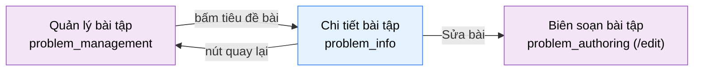

# Tài liệu thiết kế cơ bản (BD) — Chi tiết bài tập, chỉ đọc (`SHR0203`)

## Phương châm tài liệu [Nội bộ — không cần khách duyệt]

- Viết theo **mẫu 9 sheet**. Bộ thẻ đóng, quy ước ID, ký hiệu chuẩn, ranh giới với tài liệu khác và checklist kiểm toán
  nằm ở `02-bd/_rules/bd-template-9sheet.md` — file này không chép lại.
- Mã màn `SHR0203` là mã kế tiếp trong nhóm `SHR02` (Nội dung bài tập) [Nguồn: 02-bd/_rules/bd-template-9sheet.md:167-169].
  Bảng mã ở mục 8 của file quy ước và slug `problem_info` ở `01-rd/overview/system_survey.md` mục 7.0 **đã có**
  (`01-rd/overview/system_survey.md:540`); lúc tạo file chưa có, xem Câu hỏi mở Q1 (đã đóng); RD ghi nhận slug mới ở
  [Nguồn: 01-rd/screens/shared/SHR0203_problem_info.md:4].
- Màn **chỉ đọc**, **màn con của `SHR0201`** và là **màn anh em của `SHR0202`**: cùng một bản ghi, khác ở chỗ không có trường nhập
  nào [Nguồn: 01-rd/screens/shared/SHR0203_problem_info.md:13-19]. Không có popup, không có sự kiện nào ngoài điều hướng, không
  có kiểm nhập liệu, **không có endpoint riêng** — dùng lại DTO và cổng đọc của `SHR0202`
  [Nguồn: 01-rd/screens/shared/SHR0203_problem_info.md:59-60].
- Bounded Context sở hữu: **`problem-bank`** (F2) [Nguồn: 01-rd/screens/shared/SHR0203_problem_info.md:5].
- Bản dựng prototype: `05-coding/frontend/src/views/shared/problem-info/ui/problem-info-view.tsx`; route khu Admin
  `05-coding/frontend/src/app/(admin)/admin/problems/[problemId]/page.tsx:1-7`, khu Giảng viên (dựng 2026-10-03)
  `05-coding/frontend/src/app/(instructor)/instructor/problems/[problemId]/page.tsx:1-7`; cả hai truyền `problemId` và `basePath` vào view. Prototype là mock, **không có API thật**
  (`problem-info-view.tsx:10-13` — `useProblemDraft(id)` đọc bản lưu lần cuối, id chưa lưu hiện bài mẫu; nợ ghi ở
  `06-plan/PROTOTYPE_DEBT.md` mục 17.1). Endpoint chỉ mô tả bằng tên nghiệp vụ; hợp đồng thuộc `03-dd/api/problem-bank.md`.

> Đọc cùng `01-rd/screens/shared/SHR0203_problem_info.md` (hành vi ở mức yêu cầu, không lặp lại ở đây), `02-bd/screens/shared/SHR0202_problem_authoring.md`
> (nơi định nghĩa DTO), `02-bd/architecture/problem-bank.md`, `02-bd/database/problem-bank.md`.
>
> **Không thiết kế** (ngoài phạm vi, chưa có trong `ProblemDraft`, không bịa số): tỷ lệ AC, số lượt nộp, người soạn, ngày cập nhật
> gần nhất — [Nguồn: 01-rd/screens/shared/SHR0203_problem_info.md:48; 06-plan/PROTOTYPE_DEBT.md mục 17.1].
> **Không thiết kế** lịch sử phiên bản bộ testcase (F2-09) — [Nguồn: 01-rd/screens/shared/SHR0203_problem_info.md:49].
> **Có thiết kế (cập nhật 2026-10-03)**: đề bài hiển thị Markdown + LaTeX đã render (REQ-6) qua thành phần dùng chung `MarkdownPreview` [Nguồn: 01-rd/screens/shared/SHR0203_problem_info.md:31,74; 05-coding/frontend/src/shared/ui/data/markdown-preview.tsx:20-41; 05-coding/frontend/src/views/shared/problem-info/ui/problem-info-view.tsx:99]. Mục "không thiết kế render Markdown/LaTeX" của bản V1.0 bị đảo.

---

## Sheet 1. Bìa

| Mục | Giá trị |
| :--- | :--- |
| Hệ thống | AlgoPrep |
| Phân hệ | `problem-bank` (F2) |
| Công đoạn | BD — Thiết kế cơ bản |
| Phân loại | Màn hình |
| Tên màn | Chi tiết bài tập (chỉ đọc) |
| Mã màn hình | `SHR0203` |
| Tên vật lý (slug) | `problem_info` |
| Trục tài liệu | Màn hình (`02-bd/screens/`) |
| Actor | A2 (`INSTRUCTOR`) và A3 (`ADMIN`) — dùng chung một view; dựng cho cả hai khu (khu A2 từ 2026-10-03) |
| Phiên bản | V1.3 |
| Người tạo | Nhóm phát triển AlgoPrep |
| Ngày tạo | 2026/10/02 |
| Người cập nhật | Nhóm phát triển AlgoPrep |
| Ngày cập nhật | 2026/10/03 |

---

## Sheet 2. Lịch sử sửa đổi

| Ver | Sheet bị sửa | Nội dung sửa | Ngày | Người sửa |
| :--- | :--- | :--- | :--- | :--- |
| V1.0 | Toàn bộ | Tạo mới theo mẫu 9 sheet, ghi lại bản dựng prototype 2026-10-02 theo `DEC-2026-1002-split-detail-and-edit-pages` (tách trang admin thành chi tiết chỉ đọc và form sửa). Phát hiện 4 khoảng trống nguồn dữ liệu so với `SHR0202` (kết quả chạy đáp án mẫu không lưu DB, ma trận độ phủ theo loại ca, giới hạn stack, số cờ AI), ghi thành câu hỏi mở Q2-Q5 thay vì mặc định có cột | 2026/10/02 | AI |
| V1.1 | Sheet 3, 4, 5; Câu hỏi mở; trích dẫn | (1) Khu A2 đã dựng (2026-10-03): `/instructor/problems/[problemId]` là `problem_info`, cùng view qua prop bắt buộc `basePath` [Nguồn: 05-coding/frontend/src/views/shared/problem-info/ui/problem-info-view.tsx:41-46, 65, 77]; bỏ các câu "khu A2 chưa tách". (2) Đề bài (`statement_md`) hiển thị Markdown + LaTeX đã render qua `MarkdownPreview` (react-markdown, remark-gfm, remark-math, rehype-katex; không phân tích HTML thô) thay cho văn bản thô; đổi Sheet 5 Khu vực C NO 1, thêm REQ-6 của RD. (3) Làm mới số dòng trích dẫn vào mã, RD `SHR0203`, BD `SHR0201`/`SHR0202`, `bd-template-9sheet.md`. (4) Theo quy ước chủ dự án 2026-10-03: mockup `09-layoutBase` chỉ tham chiếu, mã là hiện trạng | 2026/10/03 | AI |
| V1.2 | Sheet 4 (4.4, 4.5), Sheet 5 khu vực B | Chủ dự án yêu cầu 2026-10-03 (chưa duyệt hình): bỏ hàng 4 thẻ số liệu phía trên, chuyển các số liệu vào thẻ Thuộc tính ở cột phải để đề bài nằm đầu khung nhìn; header và các thẻ còn lại giữ như V1.1. Hành vi và dữ liệu không đổi. Làm mới số dòng trích dẫn ở mục 4.4 | 2026/10/03 | AI |
| V1.3 | Sheet 4 (4.5) | Đọc dữ liệu đi qua `useProblemDraft` (khuôn `queries.ts`); trang có trạng thái đang tải và lỗi tải | 2026/10/03 | AI |

---

## Sheet 3. Sơ đồ chuyển màn

> [Nội bộ] Quy ước vẽ: bố trí từ trái sang phải. Màn gọi tới tô tím, màn hiện tại tô xanh nhạt.

### 3.1 Danh sách chuyển màn

#### Quản lý bài tập → Chi tiết bài tập

[Điều kiện mở] Bấm tiêu đề bài toán trong bảng danh sách ở `problem_management`
[Nguồn: 05-coding/frontend/src/views/shared/problem-management/ui/problem-management-view.tsx:167-169; 01-rd/screens/shared/SHR0203_problem_info.md:72].

[Chế độ mở] Chế độ chỉ đọc. Route `{basePath}/[problemId]`: khu A3 `/admin/problems/[problemId]`, khu A2 `/instructor/problems/[problemId]` (dựng 2026-10-03)
[Nguồn: 01-rd/screens/shared/SHR0203_problem_info.md:55-58; 05-coding/frontend/src/app/(instructor)/instructor/problems/[problemId]/page.tsx:4-6].

[Thông tin truyền] `problemId` — mã bài bỏ dấu `#` (ví dụ `121`)
[Nguồn: 05-coding/frontend/src/app/(admin)/admin/problems/[problemId]/page.tsx:4-6; problem-info-view.tsx:42-43].

[Giá trị trả về] Không có.

[Khi thành công] Tải chi tiết bài toán, hiển thị thanh đầu trang, hàng số liệu, cột nội dung và cột thuộc tính.

[Khi huỷ] Không có.

#### Chi tiết bài tập → Quản lý bài tập

[Điều kiện mở] Bấm nút quay lại ở đầu trang [Nguồn: problem-info-view.tsx:65].

[Chế độ mở] Không có.

[Thông tin truyền] Không có.

[Giá trị trả về] Không có.

[Khi thành công] Điều hướng về `problem_management` (`href={basePath}`, tức `/admin/problems` ở khu A3 hoặc `/instructor/problems` ở khu A2) [Nguồn: problem-info-view.tsx:65]. Màn này không có thay đổi chưa lưu nên không hỏi xác nhận.

[Khi huỷ] Không có.

#### Chi tiết bài tập → Biên soạn bài tập (chế độ sửa)

[Điều kiện mở] Bấm nút "Sửa bài" ở thanh đầu trang [Nguồn: problem-info-view.tsx:76-78; 01-rd/screens/shared/SHR0203_problem_info.md:71].

[Chế độ mở] Chế độ sửa, route `{basePath}/[problemId]/edit` (khu A3 `/admin/problems/[problemId]/edit`, khu A2 `/instructor/problems/[problemId]/edit`)
[Nguồn: 05-coding/frontend/src/app/(admin)/admin/problems/[problemId]/edit/page.tsx:1-5; 05-coding/frontend/src/app/(instructor)/instructor/problems/[problemId]/edit/page.tsx:1-5; problem-info-view.tsx:77].

[Thông tin truyền] `problemId` của bài đang xem.

[Giá trị trả về] Không có.

[Khi thành công] Mở `problem_authoring` (`SHR0202`) đã nạp sẵn nội dung bài toán đó.

[Khi huỷ] Không có.

### 3.2 Sơ đồ

[Nguồn: problem-info-view.tsx:65,76-78; 01-rd/screens/shared/SHR0203_problem_info.md:18-19]

Nút "Xem như người học" có hiện trên màn nhưng **chưa gắn hành động** (prototype `problem-info-view.tsx:73-75`; nợ
`06-plan/PROTOTYPE_DEBT.md` mục 17.1) nên không vẽ thành chuyển màn; xem Câu hỏi mở Q6.

---

## Sheet 4. Bố cục màn hình

### 4.1 Tổng quan màn

[Mục đích màn] Cho A2/A3 xem trọn một bài toán đã soạn (đề, giới hạn, ví dụ, tóm tắt testcase, kết quả chạy đáp án mẫu, thuộc tính,
cấu hình AI) mà không có nguy cơ sửa nhầm; mọi thao tác sửa đi qua nút "Sửa bài" sang `problem_authoring`
[Nguồn: 01-rd/screens/shared/SHR0203_problem_info.md:13-19].

[Luồng nghiệp vụ chính]

1. **Mở màn**: từ `problem_management` bấm tiêu đề bài; kiểm quyền, tải chi tiết bài toán.
2. **Đọc**: xem hàng số liệu (testcase đã duyệt, công khai, kết quả đáp án mẫu, giới hạn thời gian), cột nội dung (đề, ràng buộc,
   ví dụ, độ phủ, đáp án mẫu thu gọn), cột thuộc tính (độ khó, trạng thái, giới hạn, cấu hình AI).
3. **Rời màn**: quay lại danh sách, hoặc bấm "Sửa bài" sang `problem_authoring`.

[Người dùng] A2 (`INSTRUCTOR`, chỉ bài của mình) và A3 (`ADMIN`, toàn kho), có Function `PROBLEM_AUTHORING`
[Nguồn: 01-rd/screens/shared/SHR0203_problem_info.md:37; 02-bd/security/problem-bank.md:5-10].

[Tệp liên quan] Không có.

[Phạm vi]
- Không có trường nhập, không có thao tác ghi dữ liệu nào [Nguồn: 01-rd/screens/shared/SHR0203_problem_info.md:18].
- Không thiết kế tỷ lệ AC, số lượt nộp, người soạn, ngày cập nhật — xem đầu file, `06-plan/PROTOTYPE_DEBT.md` mục 17.
- Mã đáp án mẫu chỉ A2/A3 thấy, mặc định thu gọn, không bao giờ đưa vào prompt AI hay trả cho học viên (F2-18)
  [Nguồn: 01-rd/screens/shared/SHR0203_problem_info.md:39,73].

[Quyền sử dụng]
- Xem: được, khi có `PROBLEM_AUTHORING:READ` (A2: chỉ bài do mình tạo, dựa trên `problems.author_id`; A3: toàn bộ)
  [Nguồn: 02-bd/screens/shared/SHR0201_problem_management.md:267 (Xem), 263 (phạm vi tác giả cho A2)].
- Thêm, Sửa, Xoá: không có trên màn này.

[Số bản ghi tối đa] Một bài toán mỗi lần mở. Ví dụ mẫu: không giới hạn; ma trận độ phủ: một ô cho mỗi loại ca trong danh mục
`TESTCASE_CATEGORIES` (prototype dùng hằng số này, `problem-info-view.tsx:57-60`); công tắc AI: 2 dòng trong prototype
(`AI_GUARD_KEYS`, `problem-info-view.tsx:185`).

[Nguồn: 01-rd/screens/shared/SHR0203_problem_info.md:26-39]

### 4.2 DTO liên quan

Dùng lại, **không định nghĩa lại**, từ `02-bd/screens/shared/SHR0202_problem_authoring.md` mục 4.2 và Sheet 7.1:

- `ProblemAuthoringDetailDto`
- `WorkedExampleDto`
- `TestcaseDto`
- `AiAuthoringContextDto`

`[SoT: Suy luận]` — `GetProblemForAuthoring` là cổng đọc chi tiết duy nhất của `problem-bank` nên màn đọc dùng chung; RD cũng nêu "cùng cổng
đọc chi tiết bài" nhưng ghi đây là suy luận thuộc DD [Nguồn: 01-rd/screens/shared/SHR0203_problem_info.md:59-60]. Nếu DD tách DTO đọc riêng
thì cập nhật mục này, không phải thêm trường ở đây.

### 4.3 Bảng dữ liệu liên quan (5)

| NO | Bảng | Ghi chú |
| --: | :--- | :--- |
| 1 | `problems` | [Nguồn: 02-bd/database/problem-bank.md mục 1.1] |
| 2 | `problem_topics` / `topics` | [Nguồn: 02-bd/database/problem-bank.md mục 1.2] — dòng phụ tiêu đề hiện tên chủ đề (`problemInfo.subtitle`) |
| 3 | `testcases` | [Nguồn: 02-bd/database/problem-bank.md mục 1.6] |
| 4 | `problem_ai_authoring_context` hoặc cột trong `problems` | **Chưa tồn tại** — xem Câu hỏi mở Q5 (kế thừa `SHR0202` Q4) |
| 5 | Bảng đáp án mẫu | **Chưa tồn tại** — xem Câu hỏi mở Q2 (kế thừa `SHR0202` Q2) |

Hai dòng cuối là khoảng trống schema đã ghi nhận ở `SHR0202`, màn này chỉ đọc tiếp nên không tự quyết nơi lưu. Không dùng `tags`/`problem_tags`,
`problem_stats`, `problem_specs`, `function_signatures` — màn này không hiển thị thẻ, số liệu bài hay đặc tả hàm
(đối chiếu `problem-info-view.tsx:98-197`, không có khối nào đọc các thứ này).

### 4.4 Vùng bố cục

**Chưa có prototype tĩnh trong `09-layoutBase/`** (`[Đợi nextjs]`): bố cục do bản dựng 2026-10-02 chọn, theo khuôn màn soạn
[Nguồn: 01-rd/screens/shared/SHR0203_problem_info.md:21-22; problem-info-view.tsx:3-6]. Chủ dự án chưa duyệt hình ảnh. Bảng dưới bám dòng của file mã.

| Vùng | Vị trí trong mã | Nội dung |
| :--- | :--- | :--- |
| Thanh đầu trang | `problem-info-view.tsx:66-83` | Nút quay lại, tiêu đề bài, dòng phụ "Mã #{code} · chủ đề {topic}", nút "Xem như người học", nút "Sửa bài" |
| Cột nội dung (rộng) | `:86-142` | 4 thẻ: Đề bài + ràng buộc, Ví dụ mẫu, Ma trận độ phủ, Đáp án mẫu (thu gọn); Đề bài nằm ngay dưới thanh đầu trang |
| Cột thuộc tính (hẹp, dính) | `:144-207` | Thẻ Thuộc tính gồm độ khó, trạng thái, **các số liệu của khu vực B** (Testcase đã duyệt kèm số chờ duyệt, Testcase công khai, Đáp án mẫu đạt/tổng) và 4 giới hạn; thẻ Chỉ dẫn cho trợ lý AI (công tắc + ngữ cảnh) |

Từ V1.2 không còn hàng 4 thẻ số liệu phía trên cột nội dung: các số liệu chuyển vào thẻ Thuộc tính để đề bài nằm đầu khung nhìn (chủ dự án yêu cầu 2026-10-03, chưa duyệt hình). Giới hạn thời gian không còn thẻ riêng vì đã nằm trong 4 giới hạn. Các khu vực Sheet 5 vẫn chia theo nhóm dữ liệu, không đổi.

Lưới 2 cột `minmax(0,1fr) 300px` từ breakpoint `xl`, xếp chồng trên màn hẹp (`:96`). Khung điều hướng Admin dùng chung, không mô tả lại.

### 4.5 Cấu trúc slice FSD [Nội bộ]

| Khối | Slice | Căn cứ |
| :--- | :--- | :--- |
| Trang | `views/shared/problem-info` (`index.ts` xuất `ProblemInfoView`; `ui/problem-info-view.tsx`) | Có trong mã, 05-coding/frontend/src/views/shared/problem-info/index.ts:1 |
| Route | `app/(admin)/admin/problems/[problemId]/page.tsx`, truyền `problemId` và `basePath="/admin/problems"` | Có trong mã |
| Dữ liệu | `entities/problem` (`useProblemDraft`, `useProblemTopics`, `problemTopicLabel`, `AI_GUARD_KEYS`, `TESTCASE_CATEGORIES`) | `problem-info-view.tsx:19-28` |
| Khối giao diện | `shared/ui` (`PageHeader`, `Card`, `Badge`, `Button`, `IconAction`, `MarkdownPreview`) — không tạo widget riêng; `StatCard` không còn dùng ở màn này | `problem-info-view.tsx:31` |
| Khu A2 | Cùng view, mount ở `app/(instructor)/instructor/problems/[problemId]/page.tsx` truyền `basePath="/instructor/problems"` (dựng 2026-10-03) | `05-coding/frontend/src/app/(instructor)/instructor/problems/[problemId]/page.tsx:6` |
| Render đề bài | `shared/ui/data/markdown-preview.tsx` (`MarkdownPreview`): react-markdown + remark-gfm + remark-math + rehype-katex; không bật `rehype-raw` nên HTML thô hiển thị như văn bản | 05-coding/frontend/src/shared/ui/data/markdown-preview.tsx:1-41 |

Slug `problem_info` ↔ slice `views/shared/problem-info` ↔ `01-rd/screens/shared/SHR0203_problem_info.md`: thống nhất.

---

## Sheet 5. Danh sách item màn hình

> Quy ước ID, bộ thẻ và giá trị chuẩn: `02-bd/_rules/bd-template-9sheet.md` mục 2, 3, 4. Mọi item `I/O = O` trừ nút và liên kết.
> Nhãn lấy từ `messages/vi.json` khoá `problemInfo` (dòng 1175-1189) và khoá `problemAuthoring` dùng chung.

### Khu vực A — Thanh đầu trang

| Khu vực | NO | Tên item | ID item | Bảng DB | Cột DB | Loại UI | Kiểu | Độ dài | Bắt buộc | I/O | Giá trị mặc định | Định dạng | Ghi chú |
| :--- | --: | :--- | :--- | :--- | :--- | :--- | :--- | :--- | :-: | :-: | :--- | :--- | :--- |
| Thanh đầu trang | | | | | | | | | | | | | |
| | 1 | Nút quay lại | `problemInfo.header.btnBack` | - | - | Link | - | - | - | I | - | Icon mũi tên, tooltip "Quay lại danh sách" | Về `problem_management` [Nguồn giá trị] Nhãn tĩnh i18n `problemInfo.back` (`problem-info-view.tsx:65`) [EVT liên quan] EVT-1 |
| | 2 | Tiêu đề bài | `problemInfo.header.title` | `problems` | `title` | Label | String | 255 | - | O | - | - | [Nguồn giá trị] Cột `title`, DTO `ProblemAuthoringDetailDto.title` (`problem-info-view.tsx:66`) [EVT liên quan] - |
| | 3 | Mã và chủ đề | `problemInfo.header.subtitle` | `problems`, `topics` | `code`, `topics.name` | Label | String | - | - | O | - | `Mã #{code} · chủ đề {topic}` | [Công thức] `code` = tham số route `problemId` (prototype lấy từ route, không từ dữ liệu, `:67-70`); `topic` = tên chủ đề của bài (`problemTopicLabel`) [EVT liên quan] - |
| | 4 | Xem như người học | `problemInfo.header.btnPreview` | - | - | Button | - | - | - | I | - | - | Hiện nhưng **chưa gắn hành động** (xem Q6) [Nguồn giá trị] Nhãn tĩnh i18n `problemAuthoring.previewAsLearner` (`:73-75`) [EVT liên quan] EVT-3 |
| | 5 | Sửa bài | `problemInfo.header.btnEdit` | - | - | Button | - | - | - | I | - | - | Điều hướng sang `/edit` của đúng bài [Nguồn giá trị] Nhãn tĩnh i18n `problemInfo.edit` (`:76-78`) [EVT liên quan] EVT-2 |

### Khu vực B — Hàng số liệu

> Từ V1.2 các số liệu này hiển thị trong thẻ Thuộc tính ở cột phải, không còn là hàng thẻ riêng (xem 4.4). Danh sách item dưới đây giữ nguyên.

| Khu vực | NO | Tên item | ID item | Bảng DB | Cột DB | Loại UI | Kiểu | Độ dài | Bắt buộc | I/O | Giá trị mặc định | Định dạng | Ghi chú |
| :--- | --: | :--- | :--- | :--- | :--- | :--- | :--- | :--- | :-: | :-: | :--- | :--- | :--- |
| Hàng số liệu | | | | | | | | | | | | | |
| | 1 | Testcase đã duyệt | `problemInfo.stats.approved` | `testcases` | `is_ai_generated_draft` | Label | Number | - | - | O | 0 | Số nguyên; dòng phụ `{n} testcase chờ duyệt` | [Công thức] Đã duyệt = số dòng testcase **không** là nháp AI chưa duyệt; chờ duyệt = tổng trừ đã duyệt (`:54-55`). Ánh xạ "approved" sang `is_ai_generated_draft = false` là `[SoT: Suy luận]`, xem Q3 [EVT liên quan] - |
| | 2 | Testcase công khai | `problemInfo.stats.public` | `testcases` | `visibility` | Label | Number | - | - | O | 0 | Số nguyên | [Công thức] Số testcase đã duyệt có `visibility = SAMPLE` (`:56`) [EVT liên quan] - |
| | 3 | Đáp án mẫu | `problemInfo.stats.solution` | - | - | Label | String | - | - | O | `-` | `{passed}/{total}`; dòng phụ = ngôn ngữ đáp án | **Không có cột DB lưu kết quả chạy**: `SHR0202` ghi kết quả chạy là dữ liệu tạm, không lưu DB — xem Q2 [Công thức] Nếu đã có lần chạy thì `{passed}/{total}`, chưa chạy thì `-` (`:86-92`) [EVT liên quan] - |
| | 4 | Giới hạn thời gian | `problemInfo.stats.timeLimit` | `problems` | `time_limit_ms` | Label | Number | - | - | O | - | `{n} ms` | [Nguồn giá trị] Cột `time_limit_ms` (`:93`) [EVT liên quan] - |

### Khu vực C — Cột nội dung

| Khu vực | NO | Tên item | ID item | Bảng DB | Cột DB | Loại UI | Kiểu | Độ dài | Bắt buộc | I/O | Giá trị mặc định | Định dạng | Ghi chú |
| :--- | --: | :--- | :--- | :--- | :--- | :--- | :--- | :--- | :-: | :-: | :--- | :--- | :--- |
| Cột nội dung | | | | | | | | | | | | | |
| | 1 | Đề bài | `problemInfo.content.statement` | `problems` | `statement_md` | Label | String | - | - | O | - | Markdown + LaTeX đã render (GFM, công thức inline và khối); HTML thô không được phân tích | Hiển thị bằng `MarkdownPreview` (cập nhật 2026-10-03, REQ-6); văn bản Markdown gốc chỉ có trong ô nhập của `SHR0202` [Nguồn giá trị] Cột `statement_md`, DTO `statementMd` (`:98-99`); thành phần render `05-coding/frontend/src/shared/ui/data/markdown-preview.tsx:20-41` [EVT liên quan] - |
| | 2 | Ràng buộc dữ liệu | `problemInfo.content.constraints` | - | - | Label | String | - | - | O | - | Chữ đơn cách | **Không có cột DB** — kế thừa `SHR0202` Q1 [Nguồn giá trị] DTO `constraintsText` (nguồn lưu chưa xác định) (`:100-103`) [EVT liên quan] - |
| | 3 | Danh sách ví dụ mẫu | `problemInfo.examples.list` | `testcases` | `is_worked_example` | List | List | - | - | O | rỗng | Mỗi ví dụ một khối "Ví dụ {n}" | [Nguồn giá trị] `WorkedExampleDto[]` (`:106-135`); nơi lưu theo `SHR0202` Q3 (chưa chốt) [EVT liên quan] - |
| | 4 | Đầu vào | `problemInfo.examples.col.input` | `testcases` | `input_inline` | ListColumn | String | - | - | O | - | Chữ đơn cách | [Nguồn giá trị] `WorkedExampleDto.input` (`:118-119`) [EVT liên quan] - |
| | 5 | Đầu ra | `problemInfo.examples.col.output` | `testcases` | `expected_output_inline` | ListColumn | String | - | - | O | - | Chữ đơn cách | [Nguồn giá trị] `WorkedExampleDto.output` (`:122-123`) [EVT liên quan] - |
| | 6 | Giải thích | `problemInfo.examples.col.explanation` | - | - | ListColumn | String | - | - | O | - | - | **Không có cột DB** — `SHR0202` Q3 [Nguồn giá trị] `WorkedExampleDto.explanation` (`:126-129`) [EVT liên quan] - |
| | 7 | Ma trận độ phủ | `problemInfo.coverage.badges` | `testcases` | - | List | List | - | - | O | - | `{loại ca}: {n}` | **Không có cột loại ca trong `testcases`** — xem Q4 [Công thức] Với mỗi loại ca trong `TESTCASE_CATEGORIES`, đếm testcase đã duyệt thuộc loại đó; ô > 0 tô trạng thái thành công, ô = 0 tô trung tính (`:57-60,137-145`) [EVT liên quan] - |
| | 8 | Mã đáp án mẫu | `problemInfo.solution.code` | - | - | Label | String | - | - | O | Thu gọn | Chữ đơn cách; mở bằng `
` | **Không có bảng DB** — `SHR0202` Q2. Chỉ A2/A3 thấy (F2-18) [Nguồn giá trị] DTO `sampleSolutionCode`, `sampleSolutionLanguage` (`:147-152`) [EVT liên quan] - |

### Khu vực D — Cột thuộc tính

| Khu vực | NO | Tên item | ID item | Bảng DB | Cột DB | Loại UI | Kiểu | Độ dài | Bắt buộc | I/O | Giá trị mặc định | Định dạng | Ghi chú |
| :--- | --: | :--- | :--- | :--- | :--- | :--- | :--- | :--- | :-: | :-: | :--- | :--- | :--- |
| Cột thuộc tính | | | | | | | | | | | | | |
| | 1 | Độ khó | `problemInfo.properties.difficulty` | `problems` | `difficulty` | Badge | Enum | - | - | O | - | `EASY`/`MEDIUM`/`HARD` hiển thị theo nhãn i18n | [Nguồn giá trị] Cột `difficulty` (`:158-165`) [EVT liên quan] - |
| | 2 | Trạng thái | `problemInfo.properties.status` | `problems` | `status` | Badge | Enum | - | - | O | - | `UNPUBLISHED`/`PUBLISHED` hiển thị "Chưa xuất bản"/"Đã xuất bản" | [Nguồn giá trị] Cột `status` (`:166-173`) [EVT liên quan] - |
| | 3 | Giới hạn thời gian (ms) | `problemInfo.properties.limit.timeLimitMs` | `problems` | `time_limit_ms` | Label | Number | - | - | O | - | Số nguyên | [Nguồn giá trị] Cột `time_limit_ms` (`:32-37,174-179`) [EVT liên quan] - |
| | 4 | Bộ nhớ (MB) | `problemInfo.properties.limit.memoryLimitMb` | `problems` | `memory_limit_mb` | Label | Number | - | - | O | - | Số nguyên | [Nguồn giá trị] Cột `memory_limit_mb` [EVT liên quan] - |
| | 5 | Output (KB) | `problemInfo.properties.limit.outputLimitKb` | `problems` | `max_output_size_kb` | Label | Number | - | - | O | - | Số nguyên | [Nguồn giá trị] Cột `max_output_size_kb` [EVT liên quan] - |
| | 6 | Stack (MB) | `problemInfo.properties.limit.stackLimitMb` | - | - | Label | Number | - | - | O | - | Số nguyên | **Không có cột `stack` trong `problems`** (`02-bd/database/problem-bank.md` mục 1.1 chỉ có thời gian, bộ nhớ, output, số lần nộp/giờ) — xem Q4 [Nguồn giá trị] `ProblemLimits.stackLimitMb` của mock (`draft-types.ts:55-60`) [EVT liên quan] - |
| | 7 | Công tắc AI | `problemInfo.ai.guards` | - | - | List | List | - | - | O | - | Mỗi dòng: nhãn + Badge `Bật`/`Tắt` | **Không có bảng DB** — `SHR0202` Q4; prototype có **2** công tắc (`noFullCode`, `socraticOnly`), DTO của `SHR0202` có 3 cờ — xem Q5 [Nguồn giá trị] `AiAuthoringContextDto.noFullCode`, `questionOnly` (`:184-193`) [EVT liên quan] - |
| | 8 | Ngữ cảnh AI riêng của bài | `problemInfo.ai.brief` | - | - | Label | String | - | - | O | "Chưa có ngữ cảnh riêng cho bài này." | Văn bản | [Nguồn giá trị] `AiAuthoringContextDto.briefText`; rỗng thì hiện nhãn tĩnh `problemInfo.aiBriefEmpty` (`:194-196`) [EVT liên quan] - |

---

## Sheet 6. Đặc tả điều khiển item

> Dùng đúng NO, tên item và thứ tự của Sheet 5. **Không có kiểm nhập liệu** (màn chỉ đọc). Item nhãn chỉ-đọc không có điều kiện kích hoạt nên ghi `-`.

### Khu vực A — Thanh đầu trang

| Khu vực | NO | Tên item | Hiển thị | Ghi chú |
| :--- | --: | :--- | :-: | :--- |
| Thanh đầu trang | | | | |
| | 1 | Nút quay lại | Có | [Điều kiện kích hoạt] Luôn kích hoạt, không có thay đổi chưa lưu để hỏi xác nhận. |
| | 2 | Tiêu đề bài | Có | [Điều kiện kích hoạt] - |
| | 3 | Mã và chủ đề | Có | [Điều kiện kích hoạt] - |
| | 4 | Xem như người học | Có | [Điều kiện kích hoạt] Hiện nhưng chưa có hành động, xem Q6. |
| | 5 | Sửa bài | Có | [Điều kiện kích hoạt] Luôn kích hoạt khi người dùng có `PROBLEM_AUTHORING:UPDATE` `[SoT: Suy luận — prototype hiện nút vô điều kiện (problem-info-view.tsx:76-78), chưa có phân quyền thật; quyền sửa theo 02-bd/screens/shared/SHR0201_problem_management.md:269]`. |

### Khu vực B — Hàng số liệu

| Khu vực | NO | Tên item | Hiển thị | Ghi chú |
| :--- | --: | :--- | :-: | :--- |
| Hàng số liệu | | | | |
| | 1 | Testcase đã duyệt | Có | [Điều kiện kích hoạt] - |
| | 2 | Testcase công khai | Có | [Điều kiện kích hoạt] - |
| | 3 | Đáp án mẫu | Có | [Điều kiện kích hoạt] - [Tự động đặt] Chưa có lần chạy nào thì giá trị là `-`. |
| | 4 | Giới hạn thời gian | Có | [Điều kiện kích hoạt] - |

### Khu vực C — Cột nội dung

| Khu vực | NO | Tên item | Hiển thị | Ghi chú |
| :--- | --: | :--- | :-: | :--- |
| Cột nội dung | | | | |
| | 1 | Đề bài | Có | [Điều kiện kích hoạt] - |
| | 2 | Ràng buộc dữ liệu | Có | [Điều kiện kích hoạt] - |
| | 3 | Danh sách ví dụ mẫu | Có | [Điều kiện kích hoạt] - |
| | 4 | Đầu vào | Điều kiện | [Điều kiện hiển thị] Có ít nhất một ví dụ mẫu. [Điều kiện kích hoạt] - |
| | 5 | Đầu ra | Điều kiện | [Điều kiện hiển thị] Có ít nhất một ví dụ mẫu. [Điều kiện kích hoạt] - |
| | 6 | Giải thích | Điều kiện | [Điều kiện hiển thị] Có ít nhất một ví dụ mẫu. [Điều kiện kích hoạt] - |
| | 7 | Ma trận độ phủ | Có | [Điều kiện kích hoạt] - [Tự động đặt] Ô có `n > 0` tô thành công, `n = 0` tô trung tính (loại ca còn thiếu). |
| | 8 | Mã đáp án mẫu | Điều kiện | [Điều kiện hiển thị] Người xem có `PROBLEM_AUTHORING` (REQ-5, F2-18) — **kiểm quyền ở máy chủ, không chỉ ẩn UI**; prototype hiện vô điều kiện vì chưa có phân quyền. [Điều kiện kích hoạt] Bấm tiêu đề "Xem mã đáp án mẫu" để mở/thu gọn. [Tự động đặt] Mặc định thu gọn mỗi lần vào màn. |

### Khu vực D — Cột thuộc tính

| Khu vực | NO | Tên item | Hiển thị | Ghi chú |
| :--- | --: | :--- | :-: | :--- |
| Cột thuộc tính | | | | |
| | 1 | Độ khó | Có | [Điều kiện kích hoạt] - |
| | 2 | Trạng thái | Có | [Điều kiện kích hoạt] - [Tự động đặt] `PUBLISHED` tô thành công, `UNPUBLISHED` tô trung tính. |
| | 3 | Giới hạn thời gian (ms) | Có | [Điều kiện kích hoạt] - |
| | 4 | Bộ nhớ (MB) | Có | [Điều kiện kích hoạt] - |
| | 5 | Output (KB) | Có | [Điều kiện kích hoạt] - |
| | 6 | Stack (MB) | Có | [Điều kiện kích hoạt] - |
| | 7 | Công tắc AI | Có | [Điều kiện kích hoạt] - [Tự động đặt] Cờ bật tô thành công, tắt tô trung tính. |
| | 8 | Ngữ cảnh AI riêng của bài | Có | [Điều kiện kích hoạt] - [Tự động đặt] Rỗng thì hiện nhãn "Chưa có ngữ cảnh riêng cho bài này.". |

---

## Sheet 7. Danh sách truyền dữ liệu

### 7.1 Trường DTO

Màn này **không định nghĩa DTO mới**. Toàn bộ trường lấy từ các DTO ở `02-bd/screens/shared/SHR0202_problem_authoring.md` Sheet 7.1
(dòng 560-579 của file đó); bảng dưới chỉ ánh xạ item của màn này sang trường đã có, hướng truyền duy nhất là Nguồn → màn (chỉ đọc).

| NO | DTO (định nghĩa ở `SHR0202`) | Trường DTO | Item màn | Ghi chú |
| --: | :--- | :--- | :--- | :--- |
| 1 | `ProblemAuthoringDetailDto` | `code`, `title` | Khu A NO 2-3 | [Nguồn] Phản hồi `GetProblemForAuthoring` |
| 2 | `ProblemAuthoringDetailDto` | `statementMd` | Khu C NO 1 | [Nguồn] như trên |
| 3 | `ProblemAuthoringDetailDto` | `constraintsText` | Khu C NO 2 | Nguồn lưu chưa xác định (`SHR0202` Q1) |
| 4 | `ProblemAuthoringDetailDto` | `difficulty`, `status` | Khu D NO 1-2 | [Chuyển đổi] `UNPUBLISHED`/`PUBLISHED` đổi sang "Chưa xuất bản"/"Đã xuất bản" |
| 5 | `ProblemAuthoringDetailDto` | `timeLimitMs`, `memoryLimitMb`, `maxOutputSizeKb` | Khu B NO 4, Khu D NO 3-5 | [Chuyển đổi] Hiển thị nguyên giá trị mili-giây, khác `SHR0202` hiển thị giây |
| 6 | `ProblemAuthoringDetailDto` | `topicIds` | Khu A NO 3 | [Chuyển đổi] Id chủ đề đổi sang tên qua `ListProblemTopics` |
| 7 | `ProblemAuthoringDetailDto` | `sampleSolutionLanguage`, `sampleSolutionCode` | Khu B NO 3 (dòng phụ), Khu C NO 8 | Nguồn lưu chưa xác định (`SHR0202` Q2) |
| 8 | `WorkedExampleDto` | `input`, `output`, `explanation` | Khu C NO 3-6 | `explanation` chưa có cột (`SHR0202` Q3) |
| 9 | `TestcaseDto` | `visibility`, `isAiGeneratedDraft` | Khu B NO 1-2, Khu C NO 7 | [Chuyển đổi] Đếm phía client trên danh sách trả về (prototype `:54-60`); DD cân nhắc trả số đếm có sẵn từ backend |
| 10 | `AiAuthoringContextDto` | `briefText`, `noFullCode`, `questionOnly` | Khu D NO 7-8 | `allowHiddenHint` không hiển thị (prototype bỏ cờ này, `draft-types.ts:62-69`); xem Q5 |
| 11 | - (chưa có DTO) | `solutionCheck {ran, passed, total}`, loại ca testcase, `stackLimitMb` | Khu B NO 3, Khu C NO 7, Khu D NO 6 | **Không có trường DTO tương ứng ở `SHR0202`** — xem Q2, Q4 |

`[SoT: Suy luận]` — ánh xạ do BD đề xuất; `03-dd/api/problem-bank.md` chốt lại.

### 7.2 Truy cập bảng dữ liệu (3)

| NO | Tên logic | Bảng | Repository | CRUD | Mục đích | Ghi chú |
| --: | :--- | :--- | :--- | :-: | :--- | :--- |
| 1 | Bài toán | `problems` | `ProblemRepository` | R | Đọc đề, giới hạn, độ khó, trạng thái | `GetProblemForAuthoring`: R |
| 2 | Chủ đề | `topics`, `problem_topics` | `TopicRepository`, `ProblemTopicRepository` | R | Đọc tên chủ đề để hiện ở dòng phụ tiêu đề | `GetProblemForAuthoring`: R; `ListProblemTopics`: R |
| 3 | Testcase | `testcases` | `TestcaseRepository` | R | Đọc để đếm đã duyệt, công khai, ví dụ mẫu | `GetProblemForAuthoring`: R |

Không có thao tác `C`, `U`, `D` nào — màn chỉ đọc. Tên repository kế thừa `SHR0202` Sheet 7.2 (`[Suy luận]`, DD chốt lại).

### 7.3 Danh sách endpoint [Nội bộ]

> Chỉ tên nghiệp vụ và BC sở hữu. **Màn này không có endpoint của riêng nó**; hợp đồng chi tiết thuộc `03-dd/api/problem-bank.md` (chưa viết).

| NO | Endpoint (tên nghiệp vụ) | Mục đích | BC sở hữu |
| --: | :--- | :--- | :--- |
| 1 | `GetProblemForAuthoring` (dùng chung với `SHR0202`) | Tải chi tiết bài toán để hiển thị chỉ đọc | `problem-bank` |
| 2 | `ListProblemTopics` (dùng chung với `SHR0202`) | Đổi id chủ đề sang tên | `problem-bank` |

[Nguồn: 02-bd/screens/shared/SHR0202_problem_authoring.md:600-632 (mục 7.3 của file đó)]

---

## Sheet 8. Danh sách sự kiện

> Màn chỉ đọc: chỉ có sự kiện điều hướng. Bộ thẻ và quy ước cột: `02-bd/_rules/bd-template-9sheet.md` mục 2, 3.

### Màn chính: Chi tiết bài tập

| NO | Loại | Sự kiện | Chi tiết | Chuyển màn | Gọi API | Tên xử lý | Ghi chú |
| --: | :--- | :--- | :--- | :-: | :-: | :--- | :--- |
| 1 | Liên kết | Quay lại danh sách bài tập | Bấm nút quay lại ở đầu trang. | Có | Không | - | [Các bước] 1. Điều hướng về `problem_management` (`basePath`). [Khi thành công] Mở `problem_management`. |
| 2 | Nút | Mở form sửa bài | Bấm "Sửa bài". | Có | Không | - | [Các bước] 1. Điều hướng sang `{basePath}/{problemId}/edit`. [Khi thành công] Mở `problem_authoring` (`SHR0202`) đã nạp nội dung bài đó. |
| 3 | Nút | Xem như người học | Bấm "Xem như người học". | Không | Không | - | Chưa gắn hành động trong prototype; đích chưa chốt, xem Q6. |

Tải dữ liệu khi vào màn không phải sự kiện người dùng; nó là bước khởi tạo của view, gọi `GetProblemForAuthoring` và `ListProblemTopics` (Sheet 7.3).
Khi mã bài không tồn tại, RD yêu cầu hiện trạng thái không tìm thấy kèm nút quay lại danh sách
[Nguồn: 01-rd/screens/shared/SHR0203_problem_info.md:61], nhưng prototype **chưa dựng** trạng thái này (`problem-info-view.tsx` không có nhánh nào) — xem Q7.

---

## Sheet 9. Đặc tả kiểm tra

> Không có kiểm nhập liệu (màn chỉ đọc). Chỉ có kiểm quyền. Tiêu chí nghiệm thu `AC-nn` thuộc `04-tdd/problem_info.md`, không lặp lại ở đây.

| NO | Loại | Tóm tắt kiểm | Chi tiết | Mức | Mã thông báo | Ghi chú | EVT gọi | Thứ tự |
| --: | :--- | :--- | :--- | :--- | :--- | :--- | :--- | :-: |
| 1 | Kiểm quyền | Quyền truy cập màn | [Nội dung kiểm] Không có Function `PROBLEM_AUTHORING` thì không được vào màn. [Nơi thực thi] Cả tầng định tuyến phía giao diện và tầng phân quyền phía máy chủ. [Tiêu điểm] Toàn màn. | Lỗi | Chưa có mã thông báo | Nội dung "Bạn không có quyền truy cập màn này." (theo mẫu `SHR0202` Sheet 9 NO 1) | - | 1 |
| 2 | Kiểm quyền | Quyền sở hữu bài (A2) | [Nội dung kiểm] A2 mở bài không do mình tạo thì bị chặn, dù có `PROBLEM_AUTHORING`. [Nơi thực thi] Tầng application phía máy chủ, không chỉ ẩn UI. [Tiêu điểm] Toàn màn. | Lỗi | Chưa có mã thông báo | Nội dung "Bạn không có quyền xem bài toán này." `[SoT: Suy luận — theo SHR0202 Sheet 9 NO 2]` | - | 2 |
| 3 | Kiểm quyền | Hiển thị mã đáp án mẫu | [Nội dung kiểm] Mã đáp án mẫu chỉ có trong phản hồi khi người gọi có `PROBLEM_AUTHORING`; học viên không bao giờ nhận. [Nơi thực thi] Phía máy chủ khi dựng phản hồi (F2-18). [Tiêu điểm] Khu vực C NO 8. | Lỗi | Chưa có mã thông báo | Không thông báo riêng — trường vắng khỏi phản hồi, mục ẩn khỏi màn | - | 3 |

Hàng "kiểm quyền" 1-2 giống `SHR0202`; không viết lại nội dung vượt quá những gì đã có ở file đó.
[Nguồn: 02-bd/screens/shared/SHR0202_problem_authoring.md:689-690 (Sheet 9 NO 1-2)]

---

## Câu hỏi mở

| # | Câu hỏi | Vì sao chưa trả lời được | Chủ sở hữu |
| :-: | :--- | :--- | :--- |
| Q1 | ~~Bảng mã ở `02-bd/_rules/bd-template-9sheet.md` mục 8 chưa có `SHR0203`/`SHR0303`, `system_survey.md` mục 7.0 chưa có slug `problem_info`.~~ **ĐÃ XỬ LÝ 2026-10-02:** đã thêm hai dòng vào bảng mã và hai slug vào `system_survey.md` mục 7.0. | — | Đã đóng |
| Q2 | Kết quả "chạy với đáp án mẫu" (`{passed}/{total}`) và mã đáp án mẫu: lưu ở đâu? `SHR0202` ghi kết quả chạy là dữ liệu tạm không lưu DB, nhưng màn chi tiết cần xem lại **lần chạy gần nhất** sau khi rời form sửa | Chưa có bảng đáp án mẫu (`SHR0202` Q2); thêm cột lưu kết quả chạy cần quyết định kiến trúc, không phải việc của BD màn | DD `problem-bank` + chủ dự án |
| Q3 | "Testcase đã duyệt" ánh xạ vào cột nào? Prototype có cờ `approved` riêng, DB chỉ có `is_ai_generated_draft`; hai khái niệm trùng nhau hay khác nhau (testcase tác giả viết tay có mặc định "đã duyệt" không)? | RD sửa quy tắc 2026-09-28 chỉ đếm testcase đã duyệt (`01-rd/screens/shared/SHR0203_problem_info.md:70`) nhưng chưa nói cột nguồn `[SoT: Suy luận]` | DD `problem-bank` |
| Q4 | "Loại ca" của testcase (cho ma trận độ phủ) và "Stack (MB)" không có cột trong `testcases`/`problems`. Thêm cột (`testcases.category`, `problems.stack_limit_mb`) hay bỏ khỏi UI? | Schema `02-bd/database/problem-bank.md` mục 1.1, 1.6 không có hai cột này; mock có (`draft-types.ts:44-45,55-60`); thêm cột kéo theo migration, thuộc BD module | BD `database/problem-bank.md` + chủ dự án |
| Q5 | Số cờ hành vi AI: prototype chỉ có 2 (`noFullCode`, `socraticOnly`) vì cờ thứ 3 thuộc tính năng gợi ý theo cấp độ đã cắt (`draft-types.ts:62-69`, `DEC-2026-0831-remove-tiered-hints-ai-config`), trong khi `AiAuthoringContextDto` của `SHR0202` Sheet 7.1 NO 16 vẫn có `allowHiddenHint`. Bỏ trường đó khỏi DTO của `SHR0202`? Nơi lưu cả khối vẫn chưa chốt (`SHR0202` Q4) | `SHR0202` ghi nhận "Gợi ý theo cấp độ" đã cắt nhưng chưa dọn DTO; sửa DTO nằm ngoài phạm vi đợt này (chỉ thêm một dòng chuyển màn vào `SHR0202`) | BD `SHR0202` + DD |
| Q6 | Nút "Xem như người học": mở route học viên hay popup xem trước? Dùng chung quyết định với `SHR0202` Q6 | Chưa có mã RD, `06-plan/PROTOTYPE_DEBT.md` mục 17.1 | Chủ dự án |
| Q7 | Trạng thái "không tìm thấy" khi mã bài sai: RD yêu cầu `[SoT: Suy luận]`, prototype chưa dựng; lỗi tải khác (mạng, 403) hiển thị thế nào? | Prototype dùng mock đồng bộ không có nhánh lỗi; hợp đồng lỗi thuộc `03-dd/api/problem-bank.md` | DD |
| Q8 | Khu A2 đã tách (2026-10-03, `/instructor/problems/[problemId]` là `problem_info`). A2 chỉ xem bài của mình — chốt cách xử lý khi A2 mở bài của người khác (404 hay 403)? | Bản dựng là mock không phân biệt id (`problem-info-view.tsx:8-11`) nên chưa có nhánh này `[SoT: Suy luận]`; hợp đồng lỗi thuộc DD | DD `identity` + `problem-bank` |

**Hết tài liệu.** Mọi `[Nguồn: problem-info-view.tsx:n]` trỏ `05-coding/frontend/src/views/shared/problem-info/ui/problem-info-view.tsx`; `[Nguồn: ...problem-management-view.tsx:n]` trỏ `05-coding/frontend/src/views/shared/problem-management/ui/problem-management-view.tsx`.
