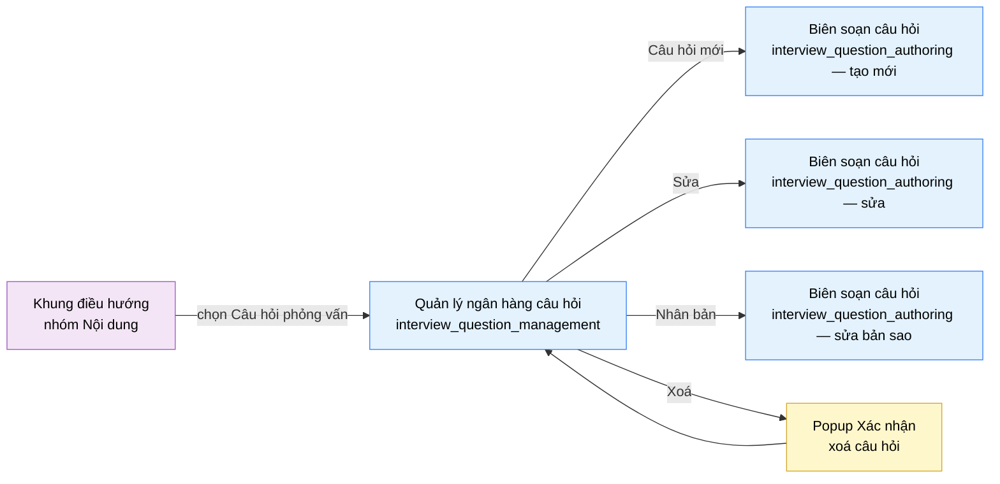

# Tài liệu thiết kế cơ bản (BD) — Quản lý ngân hàng câu hỏi phỏng vấn (`SHR0301`)

## Phương châm tài liệu [Nội bộ — không cần khách duyệt]

- Viết theo **mẫu 9 sheet**. Bộ thẻ đóng, quy ước ID, ký hiệu chuẩn, ranh giới với tài liệu khác và
  checklist kiểm toán nằm ở `02-bd/_rules/bd-template-9sheet.md` — file này không chép lại.
- Phần gắn nhãn `[Nội bộ]` phục vụ sinh mã và tự kiểm toán, không phải yêu cầu của khách hàng: mục 4.5,
  mục 7.3 và các ghi chú quy ước.
- Mã màn `SHR0301` theo bảng mã ở `02-bd/_rules/bd-template-9sheet.md` mục 8; tên file mang tiền tố mã.
  Slug chính tắc `interview_question_management` không đổi.
- Màn dùng chung A2 (giảng viên) và A3 (quản trị viên), mount ở cả `/instructor/interview-questions` và
  `/admin/interview-questions`, cùng một view/BD/DD, phạm vi dữ liệu do quyền
  `INTERVIEW_BANK_MANAGEMENT` quyết định — **không** chia theo lớp phụ trách
  [Nguồn: 01-rd/screens/shared/SHR0301_interview_question_management.md:5-9, 110-112;
  `DEC-2026-0825-shared-content-authoring-screens`].
- Bounded Context sở hữu toàn bộ dữ liệu và logic của màn này: `interview-bank` (F6) — một màn, một
  module. Không có màn con; chỉ có một popup xác nhận xoá.
- File thay thế bản BD cũ (7 mục văn xuôi) tại cùng đường dẫn cũ
  `02-bd/screens/shared/SHR0301_interview_question_management.md`, đã xoá sau khi chuyển sang mẫu 9 sheet.

> Đọc cùng `01-rd/screens/shared/SHR0301_interview_question_management.md` (hành vi ở mức yêu cầu, không lặp lại
> ở đây) và ba file BD module: `02-bd/architecture/interview-bank.md`,
> `02-bd/database/interview-bank.md`, `02-bd/security/interview-bank.md`. Khung điều hướng và chân trang
> khu Admin dùng lại `02-bd/screens/admin/_shell.md`; khu Giảng viên chưa có prototype riêng, dùng lại
> đúng cấu trúc đó **[Đợi nextjs]**.
>
> **Phạm vi đã chốt trước khi viết BD** — kế thừa nguyên văn từ RD mục 2, 3, 5, không mở lại:
> - **Không có** khái niệm `question_sets`/"bộ câu hỏi theo lớp" — đã loại khỏi phạm vi
>   (`DEC-2026-0828-remove-per-class-interview-set`) [Nguồn: 02-bd/database/interview-bank.md:149-155].
> - **"Nhập CSV" ngoài phạm vi bản đầu** — không cấp mã nghiệp vụ
>   [Nguồn: 01-rd/screens/shared/SHR0301_interview_question_management.md:65-67].
> - **A2 và A3 cùng phạm vi dữ liệu**, không lọc theo `created_by`
>   [Nguồn: 02-bd/security/interview-bank.md:34-43].
> - **Xoá là xoá mềm** (`status = RETIRED`), không cascade xoá `answer_rubrics`/`user_answers` đã dùng
>   câu hỏi đó [Nguồn: 02-bd/database/interview-bank.md:35, 64-66].

---

## Sheet 1. Bìa

| Mục | Giá trị |
| :--- | :--- |
| Hệ thống | AlgoPrep |
| Phân hệ | `interview-bank` (F6) |
| Công đoạn | BD — Thiết kế cơ bản |
| Phân loại | Màn hình |
| Tên màn | Quản lý ngân hàng câu hỏi phỏng vấn |
| Mã màn hình | `SHR0301` |
| Tên vật lý (slug) | `interview_question_management` |
| Trục tài liệu | Màn hình (`02-bd/screens/`) |
| Actor | A2 (`INSTRUCTOR`) và A3 (`ADMIN`) — dùng chung |
| Phiên bản | V1.0 |
| Người tạo | Nhóm phát triển AlgoPrep |
| Ngày tạo | 2026/09/20 |
| Người cập nhật | Nhóm phát triển AlgoPrep |
| Ngày cập nhật | 2026/09/20 |

---

## Sheet 2. Lịch sử sửa đổi

| Ver | Sheet bị sửa | Nội dung sửa | Ngày | Người sửa |
| :--- | :--- | :--- | :--- | :--- |
| V1.0 | Toàn bộ | Viết mới theo mẫu 9 sheet, thay thế bản BD cũ dạng 7 mục văn xuôi (`Layout regions` / `Component inventory` / `Screen states` / `APIs consumed` / `Navigation` / `Access rights` / `Câu hỏi mở`). Phát hiện hai khoảng trống nguồn dữ liệu mới so với bản cũ: (1) không có cột định danh dạng `IQ-014` trong schema, chỉ có `id` UUID; (2) `feedback_result_json` là phản hồi định tính, không có trường điểm số 1-5 rời rạc để tính "điểm trung bình" — mở Q1, Q2 | 2026/09/20 | Nhóm phát triển AlgoPrep |

---

## Sheet 3. Sơ đồ chuyển màn

> [Nội bộ] Quy ước vẽ: bố trí từ trái sang phải. Màn gọi tới tô tím, màn hiện tại tô xanh nhạt, popup tô
> vàng. Màu và `[Nguồn:]` dùng để truy vết, không phải yêu cầu của khách hàng.

### 3.1 Danh sách chuyển màn

#### Khung điều hướng (Admin hoặc Giảng viên) → Quản lý ngân hàng câu hỏi

[Điều kiện mở] Chọn mục con "Câu hỏi phỏng vấn" trong nhóm "Nội dung" ở thanh điều hướng bên trái.

[Chế độ mở] Chế độ danh sách, không lọc sẵn — tab chủ đề và tab cấp độ đều ở "Tất cả".

[Thông tin truyền] Không có.

[Giá trị trả về] Không có.

[Khi thành công] Tải bốn thẻ chỉ số, trang đầu của lưới thẻ câu hỏi và danh mục chủ đề.

[Khi huỷ] Không có.

#### Quản lý ngân hàng câu hỏi → Màn Biên soạn câu hỏi (tạo mới)

[Điều kiện mở] Bấm nút "Câu hỏi mới" ở thanh tiêu đề.

[Chế độ mở] Chế độ tạo mới, chưa có dữ liệu điền sẵn.

[Thông tin truyền] Không có.

[Giá trị trả về] Không có — màn đích tự điều hướng ngược lại danh sách sau khi lưu hoặc huỷ.

[Khi thành công] Mở màn `interview_question_authoring` (`SHR0302`) ở chế độ tạo mới.

[Khi huỷ] Không có.

#### Quản lý ngân hàng câu hỏi → Màn Biên soạn câu hỏi (sửa)

[Điều kiện mở] Bấm "Sửa" trên chân một thẻ câu hỏi.

[Chế độ mở] Chế độ sửa, mang theo mã câu hỏi đang chọn.

[Thông tin truyền] `id` của câu hỏi đang sửa.

[Giá trị trả về] Không có.

[Khi thành công] Mở màn `interview_question_authoring` (`SHR0302`) ở chế độ sửa, nạp sẵn dữ liệu của
câu hỏi đó.

[Khi huỷ] Không có.

#### Quản lý ngân hàng câu hỏi → Màn Biên soạn câu hỏi (nhân bản)

[Điều kiện mở] Bấm "Nhân bản" trên chân một thẻ câu hỏi.

[Chế độ mở] Chế độ sửa một bản ghi vừa được tạo sẵn ở máy chủ (xem Sheet 8, EVT-10; hành vi chính xác
là một đề xuất chưa chốt, xem Câu hỏi mở Q4).

[Thông tin truyền] `id` của câu hỏi vừa nhân bản (do `DuplicateInterviewQuestion` trả về).

[Giá trị trả về] Không có.

[Khi thành công] Mở màn `interview_question_authoring` (`SHR0302`) ở chế độ sửa bản ghi mới, đã điền
sẵn toàn bộ nội dung, câu hỏi đào sâu và tiêu chí đánh giá sao chép từ bản gốc.

[Khi huỷ] Không có — nếu `DuplicateInterviewQuestion` lỗi thì không điều hướng, xem Sheet 8 EVT-10.

#### Quản lý ngân hàng câu hỏi → Popup Xác nhận xoá câu hỏi

[Điều kiện mở] Bấm nút xoá ở chân một thẻ câu hỏi.

[Chế độ mở] Chế độ xác nhận, không nhập liệu.

[Thông tin truyền] `id` và nội dung rút gọn (mã + 60 ký tự đầu) của câu hỏi đang chọn
[Nguồn: 09-layoutBase/Admin - Câu hỏi phỏng vấn.dc.html:460].

[Giá trị trả về] Kết quả chọn "Xoá câu hỏi" hoặc "Huỷ".

[Khi thành công] Popup nêu rõ các phiên phỏng vấn đã dùng câu hỏi này vẫn giữ bản ghi cũ và hành động
không thể hoàn tác [Nguồn: 09-layoutBase/Admin - Câu hỏi phỏng vấn.dc.html:264].

[Khi huỷ] Đóng popup, không câu hỏi nào bị đổi trạng thái.

### 3.2 Sơ đồ

[Nguồn: 09-layoutBase/Admin - Câu hỏi phỏng vấn.dc.html:148-149, 226-228, 259-271, 297, 303-306;
01-rd/screens/shared/SHR0301_interview_question_management.md:65-67, 125-129]

---

## Sheet 4. Bố cục màn hình

### 4.1 Tổng quan màn

[Mục đích màn] Cho giảng viên và quản trị viên xem toàn bộ ngân hàng câu hỏi phỏng vấn lý thuyết kèm chủ
đề, cấp độ, câu hỏi đào sâu và tiêu chí đánh giá; lọc/tìm; nhân bản và xoá mềm câu hỏi — là nơi **tạo và
bảo trì nội dung** mà hai màn phía học viên (`interview_bank_list`, `interview_question_detail`) đọc
[Nguồn: 01-rd/screens/shared/SHR0301_interview_question_management.md:25-27, 33-35].

[Luồng nghiệp vụ chính]

1. **Hiển thị ban đầu**: vào màn, hệ thống tải song song ba nhóm dữ liệu — bốn thẻ chỉ số, trang đầu của
   lưới thẻ câu hỏi và danh mục 5 chủ đề. Trong lúc chờ, mỗi khối hiển thị khung chờ đúng số phần tử dự
   kiến.
2. **Thu hẹp danh sách**: người dùng gõ từ khoá theo nội dung câu hỏi hoặc mã, chọn tab chủ đề và tab cấp
   độ. Mỗi lần đổi điều kiện thì về trang 1.
3. **Thao tác trên một thẻ**: "Sửa" và "Nhân bản" điều hướng sang màn `interview_question_authoring`
   (`SHR0302`); nút xoá mở popup xác nhận.
4. **Xoá mềm**: xác nhận trong popup thì đặt `status = RETIRED`, không xoá dòng, không cascade xoá
   `answer_rubrics`/`user_answers` đã dùng câu hỏi đó [Nguồn: 02-bd/database/interview-bank.md:35, 64-66].
5. **Ghi nhật ký**: nhân bản và xoá đều ghi vào `system_audit_logs`, theo F1-14
   [Nguồn: 01-rd/screens/shared/SHR0301_interview_question_management.md:121-124].
6. **Làm mới**: sau khi nhân bản hoặc xoá thành công, lưới thẻ và bốn thẻ chỉ số tải lại.

[Người dùng] Giảng viên hoặc quản trị viên đã đăng nhập, có Function `INTERVIEW_BANK_MANAGEMENT`
[Nguồn: 01-rd/req/identity.md:60; 02-bd/security/interview-bank.md:34-43].

[Tệp liên quan] Không có — "Nhập CSV" ngoài phạm vi bản đầu, không có luồng nhập tệp nào được thiết kế
ở màn này [Nguồn: 01-rd/screens/shared/SHR0301_interview_question_management.md:65-67].

[Phạm vi]
- Không có bộ chọn lớp, khái niệm nhóm câu hỏi hay hành động gán theo lớp — `question_sets` đã loại khỏi
  phạm vi [Nguồn: 02-bd/database/interview-bank.md:149-155].
- Không có form tạo/sửa câu hỏi trên chính màn này — thuộc màn riêng `interview_question_authoring`
  (`SHR0302`), chỉ liên kết tới, không lặp lại đặc tả.
- Không hiển thị dữ liệu cá nhân của học viên (`user_answers`, `recall_ratings`)
  [Nguồn: 02-bd/security/interview-bank.md:149].
- "Nhập CSV" **chưa chốt cách hiển thị** (ẩn hẳn hay hiện dạng vô hiệu hoá) — xem Câu hỏi mở Q3.
- Trọng số hiển thị đủ nhóm nhưng nội dung tiêu chí (`criterion_code`/`description`) do màn
  `interview_question_authoring` soạn, màn này chỉ đọc.

[Quyền sử dụng]
- Xem: được, khi có `INTERVIEW_BANK_MANAGEMENT:READ`.
- Thêm: không có ở màn này — điều hướng sang `interview_question_authoring`.
- Sửa: không có form sửa tại chỗ — "Sửa" điều hướng sang `interview_question_authoring`; "Nhân bản" gọi
  `DuplicateInterviewQuestion` khi có `INTERVIEW_BANK_MANAGEMENT:CREATE`.
- Xoá: được, khi có `INTERVIEW_BANK_MANAGEMENT:DELETE` — xoá mềm, đặt `status = RETIRED`, không xoá dòng
  [Nguồn: 02-bd/database/interview-bank.md:35].

[Số bản ghi tối đa] Lưới thẻ phân trang phía máy chủ, 6 thẻ một trang
[Nguồn: 09-layoutBase/Admin - Câu hỏi phỏng vấn.dc.html:450]. Dải chỉ số: đúng 4 thẻ
[Nguồn: 09-layoutBase/Admin - Câu hỏi phỏng vấn.dc.html:428-433]. Mỗi thẻ câu hỏi: 0..n câu hỏi đào sâu,
1..n dòng tiêu chí đánh giá (0 dòng khi câu hỏi thiếu rubric).

[Nguồn: 01-rd/screens/shared/SHR0301_interview_question_management.md:23-27, 56-104; 02-bd/database/interview-bank.md:22-66;
02-bd/security/interview-bank.md:22-47]

### 4.2 DTO liên quan

- `InterviewQuestionManagementStatsDto`
- `InterviewQuestionListItemDto` (chứa danh sách lồng `followUps: string[]` và `rubric: RubricItemDto[]`)
- `RubricItemDto`
- `QuestionTopicOptionDto`
- `DuplicateQuestionResultDto`

`[Suy luận]` — tên DTO do BD này đề xuất, `03-dd/api/interview-bank.md` chốt lại.

### 4.3 Bảng dữ liệu liên quan (5)

| NO | Bảng | Ghi chú |
| --: | :--- | :--- |
| 1 | `interview_questions` | [Nguồn: 02-bd/database/interview-bank.md:22-46] |
| 2 | `question_topics` | [Nguồn: 02-bd/database/interview-bank.md:8-21] |
| 3 | `answer_rubrics` | [Nguồn: 02-bd/database/interview-bank.md:48-66] |
| 4 | `user_answers` | [Nguồn: 02-bd/database/interview-bank.md:80-102] — chỉ đọc để đếm lượt dùng, màn này không ghi bảng này |
| 5 | `system_audit_logs` | [Nguồn: 01-rd/screens/shared/SHR0301_interview_question_management.md:121-124; 02-bd/database/identity.md:103-107] — thuộc schema `identity`, ghi từ mọi hành động của `interview-bank` theo F1-14 |

### 4.4 Vùng bố cục

Đối chiếu `09-layoutBase/Admin - Câu hỏi phỏng vấn.dc.html` (504 dòng) — bằng chứng bố cục chỉ-đọc,
**không phải** design system cuối cùng. Khu Giảng viên chưa có prototype riêng, dùng lại đúng cấu trúc
này **[Đợi nextjs]**.

| Vùng | Vị trí trong prototype | Nội dung |
| :--- | :--- | :--- |
| Thanh điều hướng bên trái (khung chung) | `:68-133`, dữ liệu nhóm `:301-321` | Nhóm "Nội dung" đang mở, mục con "Câu hỏi phỏng vấn" đang chọn (`activeKey = 'iquestions'`, `:297`), badge đếm tổng số câu (`148`, `:305`) |
| Thanh tiêu đề dính trên | `:138-150` | Tiêu đề, phụ đề động "N câu · chủ đề, cấp độ, câu hỏi đào sâu và tiêu chí đánh giá", công tắc theme, nút "Nhập CSV", nút "Câu hỏi mới" |
| Dải chỉ số | `:152-163`, dữ liệu `:428-433` | Lưới co giãn 4 thẻ số liệu, mỗi thẻ có nhãn, giá trị, biến động và dòng chú thích |
| Thanh lọc | `:165-181`, dữ liệu tab `:474-475`, kết quả `:478` | Ô tìm kiếm, dải tab chủ đề (6 mục), dải tab cấp độ (4 mục), nhãn số kết quả |
| Lưới thẻ câu hỏi | `:183-233`, dữ liệu mẫu `:382-410`, 6 thẻ/trang `:450` | Mỗi thẻ: mã + nhãn cấp độ + chủ đề (`:186-190`), nội dung câu hỏi (`:192`), khối "Đào sâu" (`:194-204`), khối "Tiêu chí đánh giá" dạng thanh trọng số (`:206-221`), chân thẻ gồm thống kê sử dụng và ba nút Sửa/Nhân bản/Xoá (`:223-230`) |
| Phân trang | `:235-244`, nhãn `:479` | Nút "Trước" / "Sau" và các nút số trang |
| Hộp thoại xác nhận xoá (`confirmOpen`) | `:259-271` | Tiêu đề "Xoá câu hỏi?", nội dung nêu mã và trích 60 ký tự đầu câu hỏi (`:460`), ghi chú giữ lịch sử phiên cũ và không hoàn tác (`:264`), nút Huỷ/Xoá câu hỏi |
| Chân trang (khung chung) | `:246-254` | Phiên bản, trạng thái dịch vụ |

Lưới thẻ dùng `grid-template-columns: repeat(auto-fill, minmax(340px, 1fr))` (`:183`) — trên màn rộng
nhiều cột, trên màn hẹp giảm dần về một cột. Giữ nguyên cấu trúc này khi dựng Next.js; không quy định
màu sắc, khoảng cách hay typography ở BD.

### 4.5 Cấu trúc slice FSD [Nội bộ]

| Khối | Slice dự kiến | Căn cứ |
| :--- | :--- | :--- |
| Trang | `views/shared/interview-question-management` | Quy ước FSD của dự án |
| Khung Admin/Giảng viên | Dùng lại `widgets/admin-shell` cho `/admin/...`; khung Giảng viên tương đương **[Đợi nextjs]** | `02-bd/screens/admin/_shell.md` |
| Dải chỉ số | `widgets/interview-question-stat-strip` | Prototype `:152-163` |
| Bộ lọc | `features/interview-question-filter` | Prototype `:165-181` |
| Lưới thẻ câu hỏi | `widgets/interview-question-grid` + `entities/interview-question` | Prototype `:183-233` |
| Nhân bản / Xoá | `features/interview-question-duplicate`, `features/interview-question-delete` | Prototype `:226-228, 259-271` |
| Phân trang | Dùng lại component phân trang chung nếu đã có ở `shared/` | Prototype `:235-244` |

`[Suy luận]` — ánh xạ slice do BD đề xuất, DD màn hình chốt lại.

> [Nội bộ] Ảnh minh hoạ đặt ở `08-diagram/02-bd/screens/shared/`, chụp bằng Playwright trên ứng dụng
> Next.js thật khi đã có mã chạy được. Chưa có thì tham chiếu prototype, không vẽ tay.

---

## Sheet 5. Danh sách item màn hình

> Quy ước ID, bộ thẻ và giá trị chuẩn: `02-bd/_rules/bd-template-9sheet.md` mục 2, 3, 4.

### Khu vực A — Thanh tiêu đề

| Khu vực | NO | Tên item | ID item | Bảng DB | Cột DB | Loại UI | Kiểu | Độ dài | Bắt buộc | I/O | Giá trị mặc định | Định dạng | Ghi chú |
| :--- | --: | :--- | :--- | :--- | :--- | :--- | :--- | :--- | :-: | :-: | :--- | :--- | :--- |
| Thanh tiêu đề | | | | | | | | | | | | | |
| | 1 | Tiêu đề màn | `interviewQuestionManagement.header.title` | - | - | Label | String | - | - | O | Ngân hàng câu hỏi phỏng vấn | - | Tên màn hiển thị cố định [Nguồn giá trị] Nhãn tĩnh i18n [EVT liên quan] - |
| | 2 | Mô tả phụ | `interviewQuestionManagement.header.subtitle` | `interview_questions` | `status` | Label | String | - | - | O | - | `{số} câu · chủ đề, cấp độ, câu hỏi đào sâu và tiêu chí đánh giá` | Số câu là tổng số câu hỏi `ACTIVE`, phần chữ còn lại là nhãn tĩnh i18n [Công thức] `COUNT(interview_questions WHERE status = 'ACTIVE')` [Nguồn: 02-bd/database/interview-bank.md:35] [EVT liên quan] EVT-1 |
| | 3 | Nhập CSV | `interviewQuestionManagement.header.btnImportCsv` | - | - | Button | - | - | - | I | - | - | Ngoài phạm vi bản đầu, không cấp mã nghiệp vụ [Nguồn: 01-rd/screens/shared/SHR0301_interview_question_management.md:65-67]. **Chưa chốt cách hiển thị** (ẩn hẳn hay vô hiệu hoá kèm tooltip), xem Q3 [Nguồn giá trị] - [EVT liên quan] EVT-8 |
| | 4 | Câu hỏi mới | `interviewQuestionManagement.header.btnNewQuestion` | - | - | Button | - | - | - | I | - | - | Điều hướng sang `interview_question_authoring` ở chế độ tạo mới [Nguồn giá trị] - [EVT liên quan] EVT-7 |

### Khu vực B — Dải chỉ số

| Khu vực | NO | Tên item | ID item | Bảng DB | Cột DB | Loại UI | Kiểu | Độ dài | Bắt buộc | I/O | Giá trị mặc định | Định dạng | Ghi chú |
| :--- | --: | :--- | :--- | :--- | :--- | :--- | :--- | :--- | :-: | :-: | :--- | :--- | :--- |
| Dải chỉ số | | | | | | | | | | | | | |
| | 1 | Tổng câu hỏi | `interviewQuestionManagement.stat.totalQuestions` | `interview_questions` | `status` | Label | Number | 8 | - | O | 0 | Số nguyên | Tổng số câu hỏi đang hoạt động [Công thức] `COUNT(interview_questions WHERE status = 'ACTIVE')` [Nguồn: 02-bd/database/interview-bank.md:35] [EVT liên quan] EVT-1 |
| | 2 | Có tiêu chí đầy đủ | `interviewQuestionManagement.stat.rubricComplete` | `interview_questions`, `answer_rubrics` | `id`, `question_id` | Label | Number | 8 | - | O | 0 | `{số} · {phần trăm}%` | Số câu hỏi `ACTIVE` có ít nhất một dòng `answer_rubrics`, trên tổng số [Công thức] `COUNT(iq WHERE status='ACTIVE' AND EXISTS (SELECT 1 FROM answer_rubrics WHERE question_id = iq.id))` chia cho tổng câu hỏi `ACTIVE` [Nguồn: 02-bd/database/interview-bank.md:43-46, 48-66] [EVT liên quan] EVT-1 |
| | 3 | Điểm trung bình | `interviewQuestionManagement.stat.avgScore` | - | - | Label | Number | 4 | - | O | 0 | `{số}/5` | Điểm trung bình các lượt luyện tập, tính trong 30 ngày gần nhất [Nguồn giá trị] **Chưa có nguồn** — `user_answers.feedback_result_json` là phản hồi định tính (điểm đã đạt/còn thiếu), schema không có trường điểm số 1-5 rời rạc [Nguồn: 02-bd/database/interview-bank.md:94, 123-127], xem Q2 [EVT liên quan] EVT-1 |
| | 4 | Chưa dùng lần nào | `interviewQuestionManagement.stat.neverUsed` | `interview_questions`, `user_answers` | `id`, `question_id` | Label | Number | 8 | - | O | 0 | Số nguyên | Số câu hỏi `ACTIVE` chưa từng có lượt nộp nào [Công thức] `COUNT(iq WHERE status='ACTIVE' AND NOT EXISTS (SELECT 1 FROM user_answers WHERE question_id = iq.id))` [Nguồn: 02-bd/database/interview-bank.md:80-99] [EVT liên quan] EVT-1 |
| | 5 | Biến động của thẻ | `interviewQuestionManagement.stat.col.delta` | - | - | ListColumn | String | 8 | - | O | - | `+{số}` hoặc `−{số}` hoặc phần trăm | Con số biến động kèm màu, hiển thị cạnh giá trị chính [Nguồn giá trị] **Chưa có nguồn** — prototype ghi số minh hoạ, chưa có mốc so sánh thời gian [Nguồn: 09-layoutBase/Admin - Câu hỏi phỏng vấn.dc.html:428-433], xem Q1 [EVT liên quan] EVT-1 |
| | 6 | Chú thích của thẻ | `interviewQuestionManagement.stat.col.meta` | - | - | ListColumn | String | - | - | O | - | - | Dòng chú thích dưới giá trị chính, ví dụ "17 câu thiếu rubric" [Công thức] Với thẻ "Có tiêu chí đầy đủ": `tổng - rubricComplete`. Với thẻ "Điểm trung bình" và "Tổng câu hỏi": phần chữ là nhãn tĩnh i18n [EVT liên quan] EVT-1 |

### Khu vực C — Bộ lọc

| Khu vực | NO | Tên item | ID item | Bảng DB | Cột DB | Loại UI | Kiểu | Độ dài | Bắt buộc | I/O | Giá trị mặc định | Định dạng | Ghi chú |
| :--- | --: | :--- | :--- | :--- | :--- | :--- | :--- | :--- | :-: | :-: | :--- | :--- | :--- |
| Bộ lọc | | | | | | | | | | | | | |
| | 1 | Ô tìm kiếm | `interviewQuestionManagement.filter.query` | `interview_questions` | `title`, `content_markdown` | TextBox | String | 200 | - | I | rỗng | - | Tìm theo nội dung câu hỏi hoặc mã câu hỏi [Nguồn: 09-layoutBase/Admin - Câu hỏi phỏng vấn.dc.html:168] [Nguồn giá trị] Giá trị người dùng nhập; khớp qua full-text search trên `title` + `content_markdown` [Nguồn: 02-bd/database/interview-bank.md:39-41] [EVT liên quan] EVT-2 |
| | 2 | Tab chủ đề | `interviewQuestionManagement.filter.topicTabs` | `question_topics` | `code`, `display_name` | Button | Enum | - | - | I | Tất cả | - | 6 tab: Tất cả + 5 chủ đề cố định (Lý thuyết CS, System design, Database, Ngôn ngữ, Hành vi) [Nguồn: 02-bd/database/interview-bank.md:8-21] [Nguồn giá trị] `question_topics.display_name`, lọc theo `interview_questions.topic_id` [EVT liên quan] EVT-3 |
| | 3 | Tab cấp độ | `interviewQuestionManagement.filter.levelTabs` | `interview_questions` | `difficulty` | Button | Enum | - | - | I | Tất cả | - | 4 tab: Tất cả, Dễ, Trung bình, Khó [Nguồn giá trị] Nhãn tĩnh i18n map từ `difficulty` (`EASY`/`MEDIUM`/`HARD`) [Nguồn: 02-bd/database/interview-bank.md:28] [EVT liên quan] EVT-4 |
| | 4 | Số kết quả | `interviewQuestionManagement.filter.resultCount` | - | - | Label | String | - | - | O | - | `{số} / {số} câu` | Số câu khớp bộ lọc trên tổng số [Công thức] Số bản ghi khớp điều kiện lọc, chia cho tổng số câu hỏi `ACTIVE` — cả hai lấy từ phản hồi của `ListInterviewQuestions` [EVT liên quan] EVT-2, EVT-3, EVT-4 |

### Khu vực D — Lưới thẻ câu hỏi

| Khu vực | NO | Tên item | ID item | Bảng DB | Cột DB | Loại UI | Kiểu | Độ dài | Bắt buộc | I/O | Giá trị mặc định | Định dạng | Ghi chú |
| :--- | --: | :--- | :--- | :--- | :--- | :--- | :--- | :--- | :-: | :-: | :--- | :--- | :--- |
| Lưới thẻ câu hỏi | | | | | | | | | | | | | |
| | 1 | Danh sách thẻ câu hỏi | `interviewQuestionManagement.list` | `interview_questions` | - | List | List | - | - | O | rỗng | - | 6 thẻ mỗi trang, phân trang phía máy chủ [Nguồn: 09-layoutBase/Admin - Câu hỏi phỏng vấn.dc.html:450] [Nguồn giá trị] Kết quả gọi `ListInterviewQuestions` [EVT liên quan] EVT-1 |
| | 2 | Mã câu hỏi | `interviewQuestionManagement.list.col.code` | `interview_questions` | `id` | ListColumn | String | - | - | O | - | `IQ-{số}` (minh hoạ) | Prototype hiển thị mã dạng `IQ-014` [Nguồn: 09-layoutBase/Admin - Câu hỏi phỏng vấn.dc.html:383] nhưng schema chỉ có `id` UUID, không có cột định danh dễ đọc riêng [Nguồn: 02-bd/database/interview-bank.md:26]. **Chưa có nguồn cho định dạng đúng như prototype**, xem Q1 (đánh số Q1 trong Câu hỏi mở của Sheet này — không trùng ID với Q1 ở BD `admin_user_management`) [EVT liên quan] - |
| | 3 | Nhãn cấp độ | `interviewQuestionManagement.list.col.level` | `interview_questions` | `difficulty` | Badge | Enum | - | - | O | - | Nhãn tiếng Việt kèm màu | Dễ/Trung bình/Khó, màu theo cấp độ [Nguồn: 09-layoutBase/Admin - Câu hỏi phỏng vấn.dc.html:188] [Nguồn giá trị] Cột `difficulty` [EVT liên quan] - |
| | 4 | Chủ đề | `interviewQuestionManagement.list.col.topic` | `question_topics` | `display_name` | Label | String | - | - | O | - | - | Tên chủ đề của câu hỏi [Nguồn giá trị] `question_topics.display_name` qua `interview_questions.topic_id` [EVT liên quan] - |
| | 5 | Nội dung câu hỏi | `interviewQuestionManagement.list.col.content` | `interview_questions` | `title` | TextArea | String | - | - | O | - | - | Câu hỏi chính hiển thị trên thẻ [Nguồn: 09-layoutBase/Admin - Câu hỏi phỏng vấn.dc.html:192] [Nguồn giá trị] Cột `title` — độ dài ngắn phù hợp hiển thị nguyên văn trên thẻ, khác `content_markdown` (nội dung Markdown đầy đủ, dùng ở màn `interview_question_authoring`) `[Suy luận]` [EVT liên quan] - |
| | 6 | Danh sách câu hỏi đào sâu | `interviewQuestionManagement.list.col.followUps` | `interview_questions` | `follow_up_questions` | List | List | - | - | O | rỗng | - | 0..n dòng câu hỏi truy vấn tiếp theo cùng câu hỏi gốc [Nguồn: 09-layoutBase/Admin - Câu hỏi phỏng vấn.dc.html:194-204] [Nguồn giá trị] Cột `follow_up_questions` (JSONB mảng chuỗi) [Nguồn: 02-bd/database/interview-bank.md:34] [EVT liên quan] - |
| | 7 | Tên tiêu chí | `interviewQuestionManagement.list.col.rubricLabel` | `answer_rubrics` | `description` | Label | String | - | - | O | - | - | Tên tiêu chí đánh giá, ví dụ "Định nghĩa collision" [Nguồn: 09-layoutBase/Admin - Câu hỏi phỏng vấn.dc.html:385] [Nguồn giá trị] Cột `description` — gần đúng nhất với nhãn ngắn hiển thị trên thẻ; `criterion_code` (ví dụ `CORRECTNESS`) là mã kỹ thuật, không phải nhãn hiển thị `[Suy luận]` [Nguồn: 02-bd/database/interview-bank.md:59-60] [EVT liên quan] - |
| | 8 | Trọng số tiêu chí | `interviewQuestionManagement.list.col.rubricWeight` | `answer_rubrics` | `weight_percent` | Label | Number | 5 | - | O | 0 | `{số}%` | Trọng số phần trăm của tiêu chí, tổng các dòng cùng câu hỏi bằng 100 [Nguồn: 02-bd/database/interview-bank.md:61] [Nguồn giá trị] Cột `weight_percent` [EVT liên quan] - |
| | 9 | Thanh trọng số | `interviewQuestionManagement.list.col.rubricBar` | `answer_rubrics` | `weight_percent` | ProgressBar | Number | - | - | O | - | - | Biểu diễn trực quan trọng số [Nguồn: 09-layoutBase/Admin - Câu hỏi phỏng vấn.dc.html:215-217] [Công thức] Chiều rộng bằng đúng `weight_percent`. Câu hỏi thiếu rubric hiển thị khối này rỗng, không ẩn cả khối [EVT liên quan] - |
| | 10 | Thống kê sử dụng | `interviewQuestionManagement.list.col.usage` | `user_answers` | `question_id` | Label | String | - | - | O | - | `Dùng {số} lần · điểm TB {số}/5` | Số lượt nộp và điểm trung bình của câu hỏi [Nguồn: 09-layoutBase/Admin - Câu hỏi phỏng vấn.dc.html:224] [Công thức] "Dùng {số} lần": `COUNT(user_answers WHERE question_id = iq.id)` [Nguồn: 02-bd/database/interview-bank.md:80-99]. "điểm TB {số}/5": **chưa có nguồn**, cùng vấn đề với thẻ "Điểm trung bình" ở Khu vực B, xem Q2 [EVT liên quan] - |
| | 11 | Sửa | `interviewQuestionManagement.list.col.btnEdit` | - | - | Button | - | - | - | I | - | - | Điều hướng sang `interview_question_authoring` ở chế độ sửa, mang theo `id` [Nguồn: 09-layoutBase/Admin - Câu hỏi phỏng vấn.dc.html:226] [Nguồn giá trị] - [EVT liên quan] EVT-9 |
| | 12 | Nhân bản | `interviewQuestionManagement.list.col.btnDuplicate` | - | - | Button | - | - | - | I | - | - | Tạo bản sao câu hỏi rồi điều hướng sang `interview_question_authoring` ở chế độ sửa bản sao [Nguồn: 09-layoutBase/Admin - Câu hỏi phỏng vấn.dc.html:227]. Hành vi chính xác chưa chốt, xem Q4 [Nguồn giá trị] - [EVT liên quan] EVT-10 |
| | 13 | Xoá | `interviewQuestionManagement.list.col.btnDelete` | - | - | Button | - | - | - | I | - | - | Mở popup xác nhận xoá mềm [Nguồn: 09-layoutBase/Admin - Câu hỏi phỏng vấn.dc.html:228] [Nguồn giá trị] - [EVT liên quan] EVT-11 |

### Khu vực E — Phân trang

| Khu vực | NO | Tên item | ID item | Bảng DB | Cột DB | Loại UI | Kiểu | Độ dài | Bắt buộc | I/O | Giá trị mặc định | Định dạng | Ghi chú |
| :--- | --: | :--- | :--- | :--- | :--- | :--- | :--- | :--- | :-: | :-: | :--- | :--- | :--- |
| Phân trang | | | | | | | | | | | | | |
| | 1 | Nhãn trang | `interviewQuestionManagement.paging.label` | - | - | Label | String | - | - | O | - | `Trang {số} / {số} · hiển thị {số} câu` | Vị trí trang hiện tại và số thẻ đang hiển thị [Nguồn: 09-layoutBase/Admin - Câu hỏi phỏng vấn.dc.html:479] [Công thức] Số trang hiện tại và tổng số trang lấy từ phần phân trang trong phản hồi của `ListInterviewQuestions` [EVT liên quan] EVT-5, EVT-6 |
| | 2 | Trang trước | `interviewQuestionManagement.paging.btnPrev` | - | - | Button | - | - | - | I | - | - | Lùi về trang liền trước của kết quả lọc [Nguồn giá trị] - [EVT liên quan] EVT-5 |
| | 3 | Trang sau | `interviewQuestionManagement.paging.btnNext` | - | - | Button | - | - | - | I | - | - | Tiến tới trang liền sau của kết quả lọc [Nguồn giá trị] - [EVT liên quan] EVT-6 |

### Popup

| Khu vực | NO | Tên item | ID item | Bảng DB | Cột DB | Loại UI | Kiểu | Độ dài | Bắt buộc | I/O | Giá trị mặc định | Định dạng | Ghi chú |
| :--- | --: | :--- | :--- | :--- | :--- | :--- | :--- | :--- | :-: | :-: | :--- | :--- | :--- |
| Popup | | | | | | | | | | | | | |
| | 1 | Xác nhận xoá câu hỏi | `interviewQuestionManagement.popup.deleteConfirm` | `interview_questions` | `id`, `title` | Popup | - | - | - | I | - | Xoá câu hỏi / Huỷ | Xác nhận trước khi đặt `status = RETIRED`, nêu mã + 60 ký tự đầu câu hỏi, ghi chú giữ lịch sử phiên cũ và không hoàn tác [Nguồn: 09-layoutBase/Admin - Câu hỏi phỏng vấn.dc.html:262-267] [Nguồn giá trị] Câu hỏi đang chọn để xoá [EVT liên quan] EVT-11, EVT-12, EVT-13 |

[Nguồn: 09-layoutBase/Admin - Câu hỏi phỏng vấn.dc.html:138-233, 259-271, 382-410, 428-433, 450, 474-479;
02-bd/database/interview-bank.md:8-99]

---

## Sheet 6. Đặc tả điều khiển item

> Ký hiệu cột `Hiển thị` và thứ tự thẻ: `02-bd/_rules/bd-template-9sheet.md` mục 2, 3. Dùng đúng NO, tên
> item và thứ tự của Sheet 5. Lỗi nhập liệu ghi ở Sheet 9, xử lý nghiệp vụ ghi ở Sheet 8.

### Khu vực A — Thanh tiêu đề

| Khu vực | NO | Tên item | Hiển thị | Ghi chú |
| :--- | --: | :--- | :-: | :--- |
| Thanh tiêu đề | | | | |
| | 1 | Tiêu đề màn | Có | - |
| | 2 | Mô tả phụ | Có | [Điều kiện hiển thị] Trong lúc tải hiển thị khung chờ thay cho số câu. |
| | 3 | Nhập CSV | Điều kiện | [Điều kiện hiển thị] Luôn hiển thị nhưng ở dạng chưa chốt — xem Q3. Đề xuất tạm thời: hiển thị, `disabled`, kèm tooltip "Sắp ra mắt". [Điều kiện kích hoạt] Không kích hoạt cho tới khi tính năng nhập CSV được cấp mã nghiệp vụ. |
| | 4 | Câu hỏi mới | Có | [Điều kiện kích hoạt] Kích hoạt khi có quyền `INTERVIEW_BANK_MANAGEMENT:CREATE`. |

### Khu vực B — Dải chỉ số

| Khu vực | NO | Tên item | Hiển thị | Ghi chú |
| :--- | --: | :--- | :-: | :--- |
| Dải chỉ số | | | | |
| | 1 | Tổng câu hỏi | Có | [Điều kiện hiển thị] Trong lúc tải hiển thị khung chờ đúng 4 thẻ. |
| | 2 | Có tiêu chí đầy đủ | Có | - |
| | 3 | Điểm trung bình | Điều kiện | [Điều kiện hiển thị] Chỉ hiển thị khi Q2 đã chốt nguồn dữ liệu điểm số; chưa chốt thì ẩn cả thẻ, không hiển thị số 0 gây hiểu nhầm. |
| | 4 | Chưa dùng lần nào | Có | - |
| | 5 | Biến động của thẻ | Điều kiện | [Điều kiện hiển thị] Chỉ hiển thị khi Q1 đã chốt mốc so sánh; chưa chốt thì ẩn phần biến động, giữ nguyên giá trị chính. |
| | 6 | Chú thích của thẻ | Có | [Điều kiện hiển thị] Chú thích của thẻ "Điểm trung bình" chỉ hiển thị cùng điều kiện với mục 3. |

### Khu vực C — Bộ lọc

| Khu vực | NO | Tên item | Hiển thị | Ghi chú |
| :--- | --: | :--- | :-: | :--- |
| Bộ lọc | | | | |
| | 1 | Ô tìm kiếm | Có | [Điều kiện kích hoạt] Không kích hoạt trong lúc đang tải trang đầu. [Tự động đặt] Gõ xong thì chờ một khoảng ngắn mới gọi máy chủ; mỗi lần gọi đưa về trang 1. |
| | 2 | Tab chủ đề | Có | [Tự động đặt] Đổi tab thì đưa về trang 1. |
| | 3 | Tab cấp độ | Có | [Tự động đặt] Đổi tab thì đưa về trang 1. |
| | 4 | Số kết quả | Có | [Tự động đặt] Cập nhật lại sau mỗi lần tải danh sách. |

### Khu vực D — Lưới thẻ câu hỏi

| Khu vực | NO | Tên item | Hiển thị | Ghi chú |
| :--- | --: | :--- | :-: | :--- |
| Lưới thẻ câu hỏi | | | | |
| | 1 | Danh sách thẻ câu hỏi | Có | [Điều kiện hiển thị] Trong lúc tải hiển thị khung chờ đúng 6 thẻ. Tải xong mà không có thẻ nào thì hiển thị thông báo rỗng thay cho lưới — đây là kết quả lọc rỗng, **không phải** lỗi. |
| | 2 | Mã câu hỏi | Có | - |
| | 3 | Nhãn cấp độ | Có | - |
| | 4 | Chủ đề | Có | - |
| | 5 | Nội dung câu hỏi | Có | - |
| | 6 | Danh sách câu hỏi đào sâu | Có | [Điều kiện hiển thị] Câu hỏi không có dòng đào sâu nào thì khối "Đào sâu" hiển thị rỗng, không ẩn cả khối. |
| | 7 | Tên tiêu chí | Có | [Điều kiện hiển thị] Câu hỏi thiếu rubric thì khối "Tiêu chí đánh giá" hiển thị rỗng, không ẩn cả khối — khớp nguyên tắc đã áp dụng cho Chế độ học của F6-13 [Nguồn: 01-rd/screens/shared/SHR0301_interview_question_management.md:113-116]. |
| | 8 | Trọng số tiêu chí | Có | Theo điều kiện của mục 7. |
| | 9 | Thanh trọng số | Có | Theo điều kiện của mục 7. |
| | 10 | Thống kê sử dụng | Điều kiện | [Điều kiện hiển thị] Phần "Dùng {số} lần" luôn hiển thị; phần "điểm TB {số}/5" chỉ hiển thị khi Q2 đã chốt nguồn dữ liệu điểm số. |
| | 11 | Sửa | Có | [Điều kiện kích hoạt] Kích hoạt khi có quyền `INTERVIEW_BANK_MANAGEMENT:UPDATE`. |
| | 12 | Nhân bản | Có | [Điều kiện kích hoạt] Kích hoạt khi có quyền `INTERVIEW_BANK_MANAGEMENT:CREATE`. |
| | 13 | Xoá | Có | [Điều kiện kích hoạt] Kích hoạt khi có quyền `INTERVIEW_BANK_MANAGEMENT:DELETE`. |

### Khu vực E — Phân trang

| Khu vực | NO | Tên item | Hiển thị | Ghi chú |
| :--- | --: | :--- | :-: | :--- |
| Phân trang | | | | |
| | 1 | Nhãn trang | Có | [Tự động đặt] Cập nhật lại sau mỗi lần tải danh sách. |
| | 2 | Trang trước | Có | [Điều kiện kích hoạt] Không kích hoạt khi đang ở trang 1 hoặc đang tải. |
| | 3 | Trang sau | Có | [Điều kiện kích hoạt] Không kích hoạt khi đang ở trang cuối hoặc đang tải. |

### Popup

| Khu vực | NO | Tên item | Hiển thị | Ghi chú |
| :--- | --: | :--- | :-: | :--- |
| Popup | | | | |
| | 1 | Xác nhận xoá câu hỏi | Điều kiện | [Điều kiện hiển thị] Chỉ hiển thị sau khi bấm nút xoá trên một thẻ. |

[Nguồn: 09-layoutBase/Admin - Câu hỏi phỏng vấn.dc.html:259, 450; 01-rd/screens/shared/SHR0301_interview_question_management.md:113-116]

---

## Sheet 7. Danh sách truyền dữ liệu

### 7.1 Trường DTO

| NO | DTO | Trường DTO | Kiểu | Bảng DB | Cột DB | Item màn | Hiển thị | Ghi chú |
| --: | :--- | :--- | :--- | :--- | :--- | :--- | :-: | :--- |
| 1 | `InterviewQuestionListItemDto` | `id` | UUID | `interview_questions` | `id` | Lưới "Mã câu hỏi" | Có | [Chuyển đổi] Hiển thị theo định dạng minh hoạ `IQ-xxx` cho tới khi Q1 chốt nguồn định danh dễ đọc [Đích] Tham số của `DuplicateInterviewQuestion`, `DeleteInterviewQuestion` |
| 2 | `InterviewQuestionListItemDto` | `difficulty` | Enum | `interview_questions` | `difficulty` | Lưới "Nhãn cấp độ" | Có | [Chuyển đổi] `EASY`/`MEDIUM`/`HARD` thành Dễ/Trung bình/Khó |
| 3 | `InterviewQuestionListItemDto` | `topicCode`, `topicName` | Enum, String | `question_topics` | `code`, `display_name` | Lưới "Chủ đề" | Có | [Nguồn] Phản hồi của `ListInterviewQuestions`, join `interview_questions.topic_id` |
| 4 | `InterviewQuestionListItemDto` | `title` | String | `interview_questions` | `title` | Lưới "Nội dung câu hỏi" | Có | [Nguồn] Cột `title` |
| 5 | `InterviewQuestionListItemDto` | `followUps` | List\<String\> | `interview_questions` | `follow_up_questions` | Lưới "Danh sách câu hỏi đào sâu" | Có | [Chuyển đổi] JSONB mảng chuỗi map thẳng sang danh sách hiển thị |
| 6 | `InterviewQuestionListItemDto` | `rubric` | List\<`RubricItemDto`\> | `answer_rubrics` | `description`, `weight_percent` | Lưới "Tên tiêu chí", "Trọng số tiêu chí", "Thanh trọng số" | Có | [Nguồn] Phản hồi của `ListInterviewQuestions`, join `answer_rubrics.question_id`; rỗng khi câu hỏi thiếu rubric |
| 7 | `InterviewQuestionListItemDto` | `usageCount` | Number | `user_answers` | `question_id` | Lưới "Thống kê sử dụng" | Có | [Nguồn] Read model đếm `user_answers` theo `question_id` |
| 8 | `InterviewQuestionListItemDto` | `avgScore` | Number | - | - | Lưới "Thống kê sử dụng" | Điều kiện | [Nguồn] **Chưa chốt** — không có trường điểm số rời rạc trong `user_answers.feedback_result_json`, xem Q2 |
| 9 | `InterviewQuestionManagementStatsDto` | `totalQuestions`, `neverUsedCount` | Number | `interview_questions`, `user_answers` | `status`, `question_id` | Thẻ "Tổng câu hỏi", "Chưa dùng lần nào" | Có | [Nguồn] Phản hồi của `GetInterviewQuestionBankStats` |
| 10 | `InterviewQuestionManagementStatsDto` | `rubricCompleteCount`, `rubricCompletePercent` | Number, Number | `interview_questions`, `answer_rubrics` | `id`, `question_id` | Thẻ "Có tiêu chí đầy đủ" | Có | [Nguồn] Phản hồi của `GetInterviewQuestionBankStats` |
| 11 | `InterviewQuestionManagementStatsDto` | `avgScore` | Number | - | - | Thẻ "Điểm trung bình" | Điều kiện | [Nguồn] **Chưa chốt**, cùng vấn đề với NO 8, xem Q2 |
| 12 | `QuestionTopicOptionDto` | `code`, `displayName` | Enum, String | `question_topics` | `code`, `display_name` | Bộ lọc "Tab chủ đề" | Có | [Nguồn] Phản hồi của `ListQuestionTopics`, seed 5 dòng cố định |
| 13 | `DuplicateQuestionResultDto` | `newQuestionId` | UUID | `interview_questions` | `id` | Không hiển thị trên màn | Không | [Nguồn] Phản hồi của `DuplicateInterviewQuestion` [Đích] Tham số điều hướng sang `interview_question_authoring` ở chế độ sửa |

### 7.2 Truy cập bảng dữ liệu (5)

| NO | Tên logic | Bảng | Repository | CRUD | Mục đích | Ghi chú |
| --: | :--- | :--- | :--- | :-: | :--- | :--- |
| 1 | Câu hỏi phỏng vấn | `interview_questions` | `InterviewQuestionRepository` | R, C, U | Tìm kiếm, lọc, phân trang; tạo bản sao khi nhân bản; đặt `status = 'RETIRED'` khi xoá mềm | `ListInterviewQuestions`: R `GetInterviewQuestionBankStats`: R `DuplicateInterviewQuestion`: R, C `DeleteInterviewQuestion`: R, U |
| 2 | Chủ đề câu hỏi | `question_topics` | `QuestionTopicRepository` | R | Đọc tên chủ đề để hiển thị và lọc | `ListInterviewQuestions`: R `ListQuestionTopics`: R |
| 3 | Tiêu chí đánh giá | `answer_rubrics` | `AnswerRubricRepository` | R, C | Đọc tiêu chí để hiển thị trên thẻ và tính chỉ số "Có tiêu chí đầy đủ"; sao chép khi nhân bản | `ListInterviewQuestions`: R `GetInterviewQuestionBankStats`: R `DuplicateInterviewQuestion`: R, C |
| 4 | Lượt luyện tập | `user_answers` | `UserAnswerRepository` | R | Đếm lượt dùng cho cột "Thống kê sử dụng" và chỉ số "Chưa dùng lần nào" | `ListInterviewQuestions`: R `GetInterviewQuestionBankStats`: R |
| 5 | Nhật ký hệ thống | `system_audit_logs` | `SystemAuditLogRepository` | C | Ghi một dòng cho mỗi lần nhân bản hoặc xoá | `DuplicateInterviewQuestion`: C `DeleteInterviewQuestion`: C |

Không có thao tác xoá cứng (`D`) trên màn này: xoá là đặt `interview_questions.status = 'RETIRED'`, không
xoá dòng, không cascade xoá `answer_rubrics`/`user_answers` liên quan
[Nguồn: 02-bd/database/interview-bank.md:35, 64-66].

`[Suy luận]` — tên repository do BD này đề xuất, DD module `interview-bank` chốt lại.

### 7.3 Danh sách endpoint [Nội bộ]

> Chỉ tên nghiệp vụ và BC sở hữu. Hợp đồng chi tiết thuộc `03-dd/api/interview-bank.md`.

| NO | Endpoint (tên nghiệp vụ) | Mục đích | BC sở hữu |
| --: | :--- | :--- | :--- |
| 1 | `ListInterviewQuestions` | Tìm kiếm, lọc và phân trang danh sách câu hỏi | `interview-bank` |
| 2 | `GetInterviewQuestionBankStats` | Tải bốn thẻ chỉ số tổng hợp | `interview-bank` |
| 3 | `ListQuestionTopics` | Tải danh mục 5 chủ đề cố định cho bộ lọc | `interview-bank` |
| 4 | `DuplicateInterviewQuestion` | Tạo bản sao một câu hỏi kèm đào sâu và rubric | `interview-bank` |
| 5 | `DeleteInterviewQuestion` | Xoá mềm một câu hỏi (đặt `status = 'RETIRED'`) | `interview-bank` |

Tạo/sửa nội dung câu hỏi (4 nhóm trường + rubric) thuộc endpoint của màn `interview_question_authoring`
(`SHR0302`), không liệt kê lại ở đây.

[Nguồn: 02-bd/database/interview-bank.md:8-99]

---

## Sheet 8. Danh sách sự kiện

> Bộ thẻ và quy ước cột `Chuyển màn`: `02-bd/_rules/bd-template-9sheet.md` mục 2, 3.

### Màn chính: Quản lý ngân hàng câu hỏi

| NO | Loại | Sự kiện | Chi tiết | Chuyển màn | Gọi API | Tên xử lý | Ghi chú |
| --: | :--- | :--- | :--- | :-: | :-: | :--- | :--- |
| 1 | Màn hình | Khởi tạo màn | Vào màn thì tải ba nhóm dữ liệu. | Không | Có | `ListInterviewQuestions`, `GetInterviewQuestionBankStats`, `ListQuestionTopics` | [Các bước] 1. Kiểm tra quyền `INTERVIEW_BANK_MANAGEMENT:READ`. 2. Hiển thị khung chờ cho dải chỉ số và lưới thẻ. 3. Tải song song ba nhóm dữ liệu. [Khi thành công] Lưới thẻ hiển thị trang 1 với bộ lọc "Tất cả". [Khi lỗi] Hiển thị thông báo lỗi kèm nút thử lại tại đúng khối tải thất bại; **không** hiển thị dữ liệu cũ của khối đó. |
| 2 | Nhập liệu | Tìm kiếm theo từ khoá | Gõ vào ô tìm kiếm. | Không | Có | `ListInterviewQuestions` | [Các bước] 1. Chờ một khoảng ngắn sau khi ngừng gõ. 2. Đưa về trang 1. 3. Gọi lại danh sách với từ khoá mới. [Khi thành công] Lưới thẻ và nhãn số kết quả cập nhật theo từ khoá. [Khi lỗi] Giữ nguyên từ khoá đã gõ, hiển thị lỗi ở vùng lưới thẻ. |
| 3 | Nút | Đổi tab chủ đề | Bấm một tab trong nhóm chủ đề. | Không | Có | `ListInterviewQuestions` | [Các bước] 1. Đặt tab đang chọn. 2. Đưa về trang 1. 3. Gọi lại danh sách. [Khi thành công] Lưới thẻ chỉ còn câu hỏi thuộc `topic_id` tương ứng; tab "Tất cả" bỏ điều kiện này. [Khi lỗi] Giữ nguyên tab vừa chọn, hiển thị lỗi ở vùng lưới thẻ. |
| 4 | Nút | Đổi tab cấp độ | Bấm một tab trong nhóm cấp độ. | Không | Có | `ListInterviewQuestions` | [Các bước] 1. Đặt tab đang chọn. 2. Đưa về trang 1. 3. Gọi lại danh sách. [Khi thành công] Lưới thẻ chỉ còn câu hỏi có `difficulty` tương ứng. [Khi lỗi] Giữ nguyên tab vừa chọn, hiển thị lỗi ở vùng lưới thẻ. |
| 5 | Nút | Trang trước | Bấm "Trước" ở vùng phân trang. | Không | Có | `ListInterviewQuestions` | [Các bước] 1. Giảm số trang một đơn vị. 2. Tải trang mới. [Khi thành công] Lưới thẻ hiển thị trang liền trước, nhãn trang cập nhật. [Khi lỗi] Giữ nguyên trang hiện tại, hiển thị lỗi ở vùng lưới thẻ. |
| 6 | Nút | Trang sau | Bấm "Sau" ở vùng phân trang. | Không | Có | `ListInterviewQuestions` | [Các bước] 1. Tăng số trang một đơn vị. 2. Tải trang mới. [Khi thành công] Lưới thẻ hiển thị trang liền sau, nhãn trang cập nhật. [Khi lỗi] Giữ nguyên trang hiện tại, hiển thị lỗi ở vùng lưới thẻ. |
| 7 | Nút | Mở màn tạo câu hỏi mới | Bấm "Câu hỏi mới" ở thanh tiêu đề. | Có | Không | - | [Các bước] 1. Điều hướng sang màn `interview_question_authoring` ở chế độ tạo mới. [Khi thành công] Mở màn `interview_question_authoring`. |
| 8 | Nút | Bấm "Nhập CSV" | Bấm nút "Nhập CSV" ở thanh tiêu đề. | Không | Không | - | [Các bước] 1. Chưa xác định hành vi chính xác — xem Q3. [Khi thành công] Đề xuất tạm thời: hiển thị thông báo "Sắp ra mắt", không có hành động nào khác vì tính năng ngoài phạm vi bản đầu [Nguồn: 01-rd/screens/shared/SHR0301_interview_question_management.md:65-67]. |
| 9 | Nút | Mở màn sửa câu hỏi | Bấm "Sửa" trên chân một thẻ. | Có | Không | - | [Các bước] 1. Điều hướng sang màn `interview_question_authoring` ở chế độ sửa, mang theo `id` của câu hỏi. [Khi thành công] Mở màn `interview_question_authoring`, nạp sẵn dữ liệu câu hỏi đó. |
| 10 | Nút | Nhân bản câu hỏi | Bấm "Nhân bản" trên chân một thẻ. | Có | Có | `DuplicateInterviewQuestion` | [Các bước] 1. Kiểm tra quyền `INTERVIEW_BANK_MANAGEMENT:CREATE`. 2. Gọi máy chủ tạo bản sao — sao chép nội dung, câu hỏi đào sâu và toàn bộ `answer_rubrics` của bản gốc, gán `status = 'ACTIVE'`. 3. Ghi một dòng `system_audit_logs`. 4. Điều hướng sang `interview_question_authoring` ở chế độ sửa bản sao vừa tạo. [Khi thành công] Lưới thẻ ở màn danh sách được tải lại **sau khi** người dùng quay lại (không tải lại ngay vì đã rời màn). [Khi lỗi] Không điều hướng, hiển thị lỗi tại thẻ vừa bấm nhân bản. |
| 11 | Nút | Mở popup xác nhận xoá | Bấm nút xoá trên chân một thẻ. | Không | Không | - | [Các bước] 1. Lấy `id` và trích nội dung câu hỏi đang chọn. 2. Mở popup xác nhận. [Khi thành công] Popup nêu rõ mã và trích 60 ký tự đầu câu hỏi, kèm ghi chú giữ lịch sử phiên cũ và không hoàn tác. |
| 12 | Popup | Xác nhận xoá | Bấm "Xoá câu hỏi" trong popup. | Không | Có | `DeleteInterviewQuestion` | [Các bước] 1. Kiểm tra quyền `INTERVIEW_BANK_MANAGEMENT:DELETE`. 2. Đặt `status = 'RETIRED'` cho câu hỏi, không xoá dòng, không cascade xoá `answer_rubrics`/`user_answers`. 3. Ghi một dòng `system_audit_logs`. 4. Đóng popup, tải lại lưới thẻ và dải chỉ số. [Khi thành công] Thẻ biến mất khỏi lưới ngay. [Khi lỗi] Đóng popup, báo lỗi, giữ nguyên lưới thẻ hiện có. [Thông báo hoàn tất] "Đã xoá câu hỏi." |
| 13 | Nút | Huỷ trong popup xác nhận xoá | Bấm "Huỷ" hoặc đóng popup. | Không | Không | - | [Các bước] 1. Đóng popup. [Khi thành công] Không câu hỏi nào bị đổi trạng thái. |

[Nguồn: 09-layoutBase/Admin - Câu hỏi phỏng vấn.dc.html:148-149, 165-181, 226-230, 259-271;
01-rd/screens/shared/SHR0301_interview_question_management.md:65-67, 121-124]

---

## Sheet 9. Đặc tả kiểm tra

> Bộ thẻ và quy ước mã thông báo: `02-bd/_rules/bd-template-9sheet.md` mục 2, 4. Sheet này ghi **điều
> kiện kiểm và thông báo**; tiêu chí nghiệm thu `AC-nn` thuộc `04-tdd/interview_question_management.md`,
> không lặp lại ở đây.

| NO | Loại | Tóm tắt kiểm | Chi tiết | Mức | Mã thông báo | Ghi chú | EVT gọi | Thứ tự |
| --: | :--- | :--- | :--- | :--- | :--- | :--- | :--- | :-: |
| 1 | Kiểm quyền | Quyền xem màn | [Nội dung kiểm] Người dùng không có `INTERVIEW_BANK_MANAGEMENT:READ` thì không được vào màn. [Nơi thực thi] Chặn ở cả tầng định tuyến phía giao diện và tầng phân quyền phía máy chủ [Nguồn: 01-rd/req/identity.md:60]. | Lỗi | Chưa có mã thông báo | Nội dung "Bạn không có quyền truy cập chức năng này." | EVT-1 | 1 |
| 2 | Kiểm quyền | Quyền nhân bản | [Nội dung kiểm] Nhân bản câu hỏi yêu cầu `INTERVIEW_BANK_MANAGEMENT:CREATE`. [Nơi thực thi] Máy chủ, kiểm lại kể cả khi giao diện đã ẩn nút. [Tiêu điểm] Nút "Nhân bản". | Lỗi | Chưa có mã thông báo | Nội dung "Bạn không có quyền thực hiện thao tác này." | EVT-10 | 1 |
| 3 | Kiểm quyền | Quyền xoá | [Nội dung kiểm] Xoá câu hỏi yêu cầu `INTERVIEW_BANK_MANAGEMENT:DELETE`. [Nơi thực thi] Máy chủ. [Tiêu điểm] Popup xác nhận xoá. | Lỗi | Chưa có mã thông báo | Nội dung "Bạn không có quyền thực hiện thao tác này." | EVT-12 | 1 |
| 4 | Kiểm nhập liệu | Độ dài từ khoá tìm kiếm | [Nội dung kiểm] Từ khoá dài quá 200 ký tự thì không gửi lên máy chủ. [Nơi thực thi] Màn hình. [Tiêu điểm] Ô tìm kiếm. | Lỗi | Chưa có mã thông báo | Nội dung "Từ khoá tìm kiếm tối đa 200 ký tự." Giới hạn 200 là `[Suy luận]` — nội dung câu hỏi dài hơn tên/email nên nới hơn giới hạn 100 ký tự đã dùng ở `admin_user_management`; DD chốt số chính xác. | EVT-2 | 1 |
| 5 | Kiểm nghiệp vụ | Tồn tại câu hỏi trước khi thao tác | [Nội dung kiểm] `id` gửi lên không khớp câu hỏi đang tồn tại hoặc đã `RETIRED` thì từ chối nhân bản/xoá. [Nơi thực thi] Máy chủ. | Lỗi | Chưa có mã thông báo | Nội dung "Không tìm thấy câu hỏi hoặc câu hỏi đã bị xoá." | EVT-10, EVT-12 | 2 |
| 6 | Kiểm nghiệp vụ | Nhân bản sao chép trọn vẹn | [Nội dung kiểm] Bản sao phải giữ nguyên `topic_id`, `difficulty`, `title`, `content_markdown`, `follow_up_questions` và toàn bộ dòng `answer_rubrics` của bản gốc, gán `status = 'ACTIVE'` và `id` mới. [Nơi thực thi] Máy chủ, trong cùng giao dịch. | Lỗi | Chưa có mã thông báo | Ghi thất bại một phần (ví dụ sao `answer_rubrics` lỗi giữa chừng) thì huỷ toàn bộ giao dịch, không tạo bản sao thiếu tiêu chí. Hành vi chi tiết của "nhân bản" là một đề xuất chưa chốt, xem Q4. | EVT-10 | 3 |
| 7 | Kiểm nghiệp vụ | Xoá mềm không cascade | [Nội dung kiểm] Xoá chỉ đặt `status = 'RETIRED'`, không xoá `answer_rubrics`/`user_answers` liên quan, không xoá dòng `interview_questions`. [Nơi thực thi] Máy chủ. | Lỗi | Chưa có mã thông báo | Vi phạm nguyên tắc xoá mềm đã chốt [Nguồn: 02-bd/database/interview-bank.md:35, 64-66] là lỗi thiết kế, chặn ở code review, không chỉ ở tài liệu. | EVT-12 | 2 |
| 8 | Kiểm nghiệp vụ | Ghi nhật ký không ngoại lệ | [Nội dung kiểm] Mỗi lần nhân bản hoặc xoá phải ghi đúng một dòng `system_audit_logs`. [Nơi thực thi] Máy chủ, trong cùng giao dịch với thao tác ghi. | Lỗi | Chưa có mã thông báo | Ghi nhật ký thất bại thì thao tác coi như thất bại, không áp dụng — theo F1-14 [Nguồn: 01-rd/screens/shared/SHR0301_interview_question_management.md:121-124]. | EVT-10, EVT-12 | 4 |
| 9 | Kiểm nghiệp vụ | Lỗi hệ thống hoặc lỗi gọi máy chủ | [Nội dung kiểm] Gọi máy chủ thất bại hoặc trả lỗi nghiệp vụ thì dừng thao tác, không hiển thị dữ liệu cũ của khối lỗi. [Nơi thực thi] Màn hình. | Lỗi | Mã lỗi trong phản hồi | Phản hồi có mã lỗi đã đăng ký thì hiển thị nội dung tương ứng; chưa đăng ký thì hiển thị "Không kết nối được máy chủ." kèm nút thử lại. | EVT-1, EVT-2, EVT-3, EVT-4, EVT-5, EVT-6, EVT-10, EVT-12 | 1 |

Cột `Thứ tự` là thứ tự kiểm trong cùng một sự kiện.

[Nguồn: 02-bd/database/interview-bank.md:35, 64-66; 01-rd/req/identity.md:60;
01-rd/screens/shared/SHR0301_interview_question_management.md:121-124]

---

## Câu hỏi mở

| # | Câu hỏi | Vì sao chưa trả lời được | Chủ sở hữu |
| :-: | :--- | :--- | :--- |
| Q1 | Con số biến động của các thẻ chỉ số ("+9", "−0,2") tính theo mốc so sánh nào — so với hôm qua, tuần trước, hay đầu tháng? | Prototype ghi số minh hoạ cứng [Nguồn: 09-layoutBase/Admin - Câu hỏi phỏng vấn.dc.html:428-433], RD không nêu yêu cầu nào về biến động. Cùng dạng phát hiện đã có ở `02-bd/screens/admin/ADM0201_user_management.md` Q5. | Chủ dự án |
| Q2 | "Điểm trung bình" (thẻ chỉ số và chân mỗi thẻ câu hỏi) lấy từ đâu? Schema `interview-bank` chỉ có `user_answers.feedback_result_json` — phản hồi định tính (điểm đã đạt/còn thiếu), **không có** trường điểm số 1-5 rời rạc [Nguồn: 02-bd/database/interview-bank.md:94, 123-127]. | Đây là phát hiện mới của V1.0, không có trong bản BD cũ (bản cũ không đặc tả tới mức trường dữ liệu). Ba hướng khả dĩ: (1) thêm một trường điểm số rời rạc vào `feedback_result_json` do AI tự chấm kèm phản hồi định tính, (2) suy ra điểm số từ tỉ lệ tiêu chí đạt trong `feedback_result_json` bằng công thức tầng ứng dụng, (3) bỏ hẳn hai chỉ số này khỏi phạm vi bản đầu. Ba phương án khác nhau về chi phí migration và độ chính xác, BD này **không tự chọn**. | BD `database/interview-bank.md` + Chủ dự án |
| Q3 | Nút "Nhập CSV" hiển thị dạng vô hiệu hoá (disabled + tooltip) hay ẩn hẳn khỏi màn cho tới khi triển khai? | RD đã chốt tính năng ngoài phạm vi bản đầu [Nguồn: 01-rd/screens/shared/SHR0301_interview_question_management.md:65-67] nhưng chưa nói cách hiển thị nút. Kế thừa đề xuất của bản BD cũ: giữ hiển thị, `disabled`, tooltip "Sắp ra mắt" — nhất quán với việc prototype đã dựng nút này; chốt ở DD. | Chủ dự án |
| Q4 | "Nhân bản" tạo bản ghi ngay ở máy chủ hay chỉ điền sẵn form tạo mới chưa lưu? | Prototype chỉ có nút, không có luồng chi tiết [Nguồn: 09-layoutBase/Admin - Câu hỏi phỏng vấn.dc.html:227]. `[SoT: Suy luận]` — BD này đề xuất tạo bản ghi mới ngay ở máy chủ (`id` mới, `status = ACTIVE`, sao chép toàn bộ đào sâu + rubric) rồi mở `interview_question_authoring` ở chế độ sửa bản ghi vừa tạo — tránh trạng thái "nháp chưa lưu" phức tạp thêm cho form vốn đã nặng (4 nhóm trường), kế thừa đúng đề xuất của bản BD cũ. Cần chốt ở DD trước khi viết `03-dd/api/interview-bank.md`. | Chủ dự án + DD `interview-bank` |
| Q5 | Mã câu hỏi hiển thị dạng `IQ-014` — schema chỉ có `id` UUID, không có cột định danh dễ đọc riêng [Nguồn: 02-bd/database/interview-bank.md:26]. Sinh mã hiển thị từ đâu? | Prototype dùng dữ liệu mẫu cứng dạng chuỗi, không phải giá trị tính từ `id` [Nguồn: 09-layoutBase/Admin - Câu hỏi phỏng vấn.dc.html:383-409]. Hai hướng: (1) thêm cột `display_code` tự tăng kèm migration và backfill dữ liệu cũ, (2) suy ra một mã ngắn từ `id` (ví dụ 6 ký tự đầu của UUID viết hoa) mà không cần migration nhưng không liên tục/không dễ nhớ như prototype gợi ý. Chi phí và trải nghiệm khác nhau rõ rệt, BD **không tự chọn**. | BD `database/interview-bank.md` + Chủ dự án |
| Q6 | Nội dung thông báo lỗi/trống cụ thể (kết quả lọc rỗng, lỗi tải danh sách) — RD/prototype không đặc tả câu chữ. | Để DD chốt theo chuẩn thông báo chung của hệ thống, cùng cách xử lý đã áp dụng ở các BD màn khác (ví dụ `ADM0201_user_management.md` Sheet 9 NO 12). | DD `interview-bank` |

---

## Tham chiếu

- `01-rd/screens/shared/SHR0301_interview_question_management.md` — RD màn hình.
- `09-layoutBase/Admin - Câu hỏi phỏng vấn.dc.html` — bằng chứng layout (504 dòng).
- `02-bd/architecture/interview-bank.md`, `02-bd/database/interview-bank.md`,
  `02-bd/security/interview-bank.md` — BD module `interview-bank`.
- `02-bd/screens/admin/ADM0201_user_management.md` — mẫu cấu trúc BD 9 sheet đã dùng trước đó, cùng dạng
  màn danh sách/quản lý.
- `02-bd/_rules/bd-template-9sheet.md` — quy ước 9 sheet, bộ thẻ đóng, quy ước ID, checklist kiểm toán.
- `.nexa/control/decision-registry.md` — `DEC-2026-0825-shared-content-authoring-screens`,
  `DEC-2026-0828-remove-per-class-interview-set`, `DEC-2026-0830-interview-bank-crud`,
  `DEC-2026-0831-outside-screens-closures`.
- `01-rd/screens/shared/SHR0302_interview_question_authoring.md` — màn soạn/sửa câu hỏi (`SHR0302`), liên kết từ
  đây, không lặp lại đặc tả.
