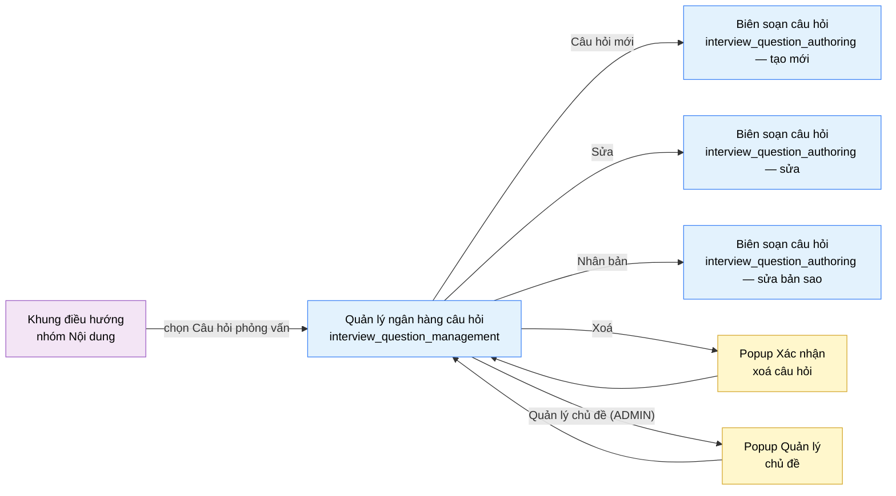

# Tài liệu thiết kế cơ bản (BD) — Quản lý ngân hàng câu hỏi phỏng vấn (`SHR0301`)

## Phương châm tài liệu [Nội bộ — không cần khách duyệt]

- Viết theo **mẫu 9 sheet**. Bộ thẻ đóng, quy ước ID, ký hiệu chuẩn, ranh giới với tài liệu khác và
  checklist kiểm toán nằm ở `02-bd/_rules/bd-template-9sheet.md` — file này không chép lại.
- Phần gắn nhãn `[Nội bộ]` phục vụ sinh mã và tự kiểm toán, không phải yêu cầu của khách hàng: mục 4.5,
  mục 7.3 và các ghi chú quy ước.
- Mã màn `SHR0301` theo bảng mã ở `02-bd/_rules/bd-template-9sheet.md` mục 8; tên file mang tiền tố mã.
  Slug chính tắc `interview_question_management` không đổi.
- Màn dùng chung A2 (giảng viên) và A3 (quản trị viên), mount ở cả `/instructor/interview-questions` và
  `/admin/interview-questions`, cùng một view/BD/DD, phạm vi dữ liệu do quyền
  `INTERVIEW_BANK_MANAGEMENT` quyết định — **không** chia theo lớp phụ trách
  [Nguồn: 01-rd/screens/shared/SHR0301_interview_question_management.md:5-9, 110-112;
  `DEC-2026-0825-shared-content-authoring-screens`].
- Bounded Context sở hữu toàn bộ dữ liệu và logic của màn này: `interview-bank` (F6) — một màn, một
  module. Không có màn con; chỉ có một popup xác nhận xoá.
- File thay thế bản BD cũ (7 mục văn xuôi) tại cùng đường dẫn cũ
  `02-bd/screens/shared/SHR0301_interview_question_management.md`, đã xoá sau khi chuyển sang mẫu 9 sheet.

> Đọc cùng `01-rd/screens/shared/SHR0301_interview_question_management.md` (hành vi ở mức yêu cầu, không lặp lại
> ở đây) và ba file BD module: `02-bd/architecture/interview-bank.md`,
> `02-bd/database/interview-bank.md`, `02-bd/security/interview-bank.md`. Khung điều hướng và chân trang
> khu Admin dùng lại `02-bd/screens/admin/_shell.md`; khu Giảng viên chưa có prototype riêng, dùng lại
> đúng cấu trúc đó **[Đợi nextjs]**.
>
> **Phạm vi đã chốt trước khi viết BD** — kế thừa nguyên văn từ RD mục 2, 3, 5, không mở lại:
> - **Không có** khái niệm `question_sets`/"bộ câu hỏi theo lớp" — đã loại khỏi phạm vi
>   (`DEC-2026-0828-remove-per-class-interview-set`) [Nguồn: 02-bd/database/interview-bank.md:149-155].
> - **"Nhập CSV" ngoài phạm vi bản đầu** — không cấp mã nghiệp vụ
>   [Nguồn: 01-rd/screens/shared/SHR0301_interview_question_management.md:65-67]. Nút trên màn **vẫn hiển thị và
>   kích hoạt** (owner chốt 2026-10-01); bấm nút chưa có hành vi, là stub của bản dựng.
> - **A2 và A3 cùng phạm vi dữ liệu**, không lọc theo `created_by`
>   [Nguồn: 02-bd/security/interview-bank.md:34-43].
> - **Xoá là xoá mềm** (`status = RETIRED`), không cascade xoá `answer_rubrics`/`user_answers` đã dùng
>   câu hỏi đó [Nguồn: 02-bd/database/interview-bank.md:35, 64-66].

---

## Sheet 1. Bìa

| Mục | Giá trị |
| :--- | :--- |
| Hệ thống | AlgoPrep |
| Phân hệ | `interview-bank` (F6) |
| Công đoạn | BD — Thiết kế cơ bản |
| Phân loại | Màn hình |
| Tên màn | Quản lý ngân hàng câu hỏi phỏng vấn |
| Mã màn hình | `SHR0301` |
| Tên vật lý (slug) | `interview_question_management` |
| Trục tài liệu | Màn hình (`02-bd/screens/`) |
| Actor | A2 (`INSTRUCTOR`) và A3 (`ADMIN`) — dùng chung |
| Phiên bản | V1.4 |
| Người tạo | Nhóm phát triển AlgoPrep |
| Ngày tạo | 2026/09/20 |
| Người cập nhật | Nhóm phát triển AlgoPrep |
| Ngày cập nhật | 2026/10/01 |

---

## Sheet 2. Lịch sử sửa đổi

| Ver | Sheet bị sửa | Nội dung sửa | Ngày | Người sửa |
| :--- | :--- | :--- | :--- | :--- |
| V1.0 | Toàn bộ | Viết mới theo mẫu 9 sheet, thay thế bản BD cũ dạng 7 mục văn xuôi (`Layout regions` / `Component inventory` / `Screen states` / `APIs consumed` / `Navigation` / `Access rights` / `Câu hỏi mở`). Phát hiện hai khoảng trống nguồn dữ liệu mới so với bản cũ: (1) không có cột định danh dạng `IQ-014` trong schema, chỉ có `id` UUID; (2) `feedback_result_json` là phản hồi định tính, không có trường điểm số 1-5 rời rạc để tính "điểm trung bình" — mở Q1, Q2 | 2026/09/20 | Nhóm phát triển AlgoPrep |
| V1.1 | Sheet 3, 4, 5, 6, 7, 8, Câu hỏi mở | Đồng bộ với bản dựng UI ngày 2026-10-01: (1) màn là **danh sách dạng bảng** (`DataTable` trong một `Card`, 8 dòng/trang) thay cho lưới thẻ; cột Mã, Câu hỏi, Chủ đề, Mức độ, Đào sâu (số lượng), Tiêu chí (số lượng), Lượt dùng, Điểm TB, Thao tác; (2) **bỏ dải bốn thẻ chỉ số** (Khu vực B cũ, `GetInterviewQuestionBankStats`, `InterviewQuestionManagementStatsDto`) — chỉ còn một trang tổng quan Admin/Giảng viên, trang danh sách chỉ có bộ lọc và danh sách; Khu vực C, D, E cũ đổi thành B, C, D; (3) thao tác trên dòng là ba nút chỉ có biểu tượng (Sửa, Nhân bản, Xoá) qua `IconAction`, tooltip nhỏ bên dưới khi rê chuột hoặc focus; (4) khối câu hỏi đào sâu và thanh trọng số tiêu chí không còn hiển thị trên danh sách, chỉ còn số lượng — nội dung xem ở màn `SHR0302`; (5) Q1 (mốc biến động) đóng vì thẻ chỉ số đã bỏ, Q2 chỉ còn áp dụng cho cột Điểm TB | 2026/10/01 | Nhóm phát triển AlgoPrep |
| V1.2 | Sheet 4, 5, 6, 7, 8, Câu hỏi mở | Owner chốt ngày 2026-10-01: (1) nút "Nhập CSV" **giữ kích hoạt**, không vô hiệu hoá kèm tooltip "Sắp ra mắt" như đề xuất của V1.1 — bỏ đề xuất đó; bấm nút hiện **chưa làm gì** (stub của bản dựng, ghi vào `06-plan/PROTOTYPE_DEBT.md` mục 16); Q3 đóng; (2) `InterviewQuestionListItemDto` dùng hai số đếm `followUpCount` và `rubricCount` thay cho danh sách lồng — bỏ dấu `[Suy luận]`, ghi "owner xác nhận 2026-10-01" | 2026/10/01 | AI |
| V1.3 | Sheet 3, 4, 5, 6, 7, 8, 9, Câu hỏi mở | Đã chốt 2026-10-01 (owner uỷ quyền cân nhắc), xem `DEC-2026-1001-admin-configurable-settings`: **chủ đề câu hỏi là dữ liệu do ADMIN quản lý**, không còn 5 chủ đề cố định. (1) Thêm nút "Quản lý chủ đề" ở thanh tiêu đề (chỉ ADMIN thấy) mở popup quản lý chủ đề: thêm, đổi tên, sắp xếp lại, xoá; xoá bị từ chối khi còn câu hỏi tham chiếu, popup hiện số câu hỏi; (2) tab chủ đề của bộ lọc đọc từ dữ liệu `ListQuestionTopics`, số tab không cố định; (3) thêm bốn endpoint chỉ ADMIN `CreateQuestionTopic`, `RenameQuestionTopic`, `ReorderQuestionTopics`, `DeleteQuestionTopic`; `ListQuestionTopics` mở cho mọi người dùng đã xác thực; (4) Sheet 9 thêm các kiểm tra; (5) thay thế tiểu quyết định 4 (Q6, 5 chủ đề cố định) của `DEC-2026-0830-interview-bank-crud`. Q7 mới | 2026/10/01 | AI |
| V1.4 | Sheet 4, 5, 6, 7, 8, 9, Câu hỏi mở | Đã chốt 2026-10-01 (owner uỷ quyền), xem `DEC-2026-1001-admin-configurable-settings`: (1) khung trả lời chuẩn STAR không còn gắn mã chủ đề `BEHAVIORAL` mà gắn cờ `question_topics.uses_star_framework`; popup quản lý chủ đề thêm công tắc "Dùng khung STAR" trên mỗi dòng (Khu vực popup NO 9, EVT-20, trường `usesStarFramework` trong `QuestionTopicOptionDto` và `QuestionTopicManageResultDto`); (2) `RenameQuestionTopic` đổi thành `UpdateQuestionTopic` (đổi tên và bật/tắt cờ STAR); (3) Q7 đóng: dùng lại `INTERVIEW_BANK_MANAGEMENT` cộng kiểm vai trò `ADMIN`, không Function mới | 2026/10/01 | AI |

---

## Sheet 3. Sơ đồ chuyển màn

> [Nội bộ] Quy ước vẽ: bố trí từ trái sang phải. Màn gọi tới tô tím, màn hiện tại tô xanh nhạt, popup tô
> vàng. Màu và `[Nguồn:]` dùng để truy vết, không phải yêu cầu của khách hàng.

### 3.1 Danh sách chuyển màn

#### Khung điều hướng (Admin hoặc Giảng viên) → Quản lý ngân hàng câu hỏi

[Điều kiện mở] Chọn mục con "Câu hỏi phỏng vấn" trong nhóm "Nội dung" ở thanh điều hướng bên trái.

[Chế độ mở] Chế độ danh sách, không lọc sẵn — tab chủ đề và tab cấp độ đều ở "Tất cả".

[Thông tin truyền] Không có.

[Giá trị trả về] Không có.

[Khi thành công] Tải trang đầu của danh sách câu hỏi và danh mục chủ đề.

[Khi huỷ] Không có.

#### Quản lý ngân hàng câu hỏi → Màn Biên soạn câu hỏi (tạo mới)

[Điều kiện mở] Bấm nút "Câu hỏi mới" ở thanh tiêu đề.

[Chế độ mở] Chế độ tạo mới, chưa có dữ liệu điền sẵn.

[Thông tin truyền] Không có.

[Giá trị trả về] Không có — màn đích tự điều hướng ngược lại danh sách sau khi lưu hoặc huỷ.

[Khi thành công] Mở màn `interview_question_authoring` (`SHR0302`) ở chế độ tạo mới.

[Khi huỷ] Không có.

#### Quản lý ngân hàng câu hỏi → Màn Biên soạn câu hỏi (sửa)

[Điều kiện mở] Bấm nút biểu tượng "Sửa" (bút chì) ở cột Thao tác của một dòng, hoặc bấm vào nội dung câu hỏi ở cột "Câu hỏi" của dòng đó.

[Chế độ mở] Chế độ sửa, mang theo mã câu hỏi đang chọn.

[Thông tin truyền] `id` của câu hỏi đang sửa.

[Giá trị trả về] Không có.

[Khi thành công] Mở màn `interview_question_authoring` (`SHR0302`) ở chế độ sửa, nạp sẵn dữ liệu của
câu hỏi đó.

[Khi huỷ] Không có.

#### Quản lý ngân hàng câu hỏi → Màn Biên soạn câu hỏi (nhân bản)

[Điều kiện mở] Bấm nút biểu tượng "Nhân bản" (hai tờ chồng nhau) ở cột Thao tác của một dòng — nhân bản theo từng dòng.

[Chế độ mở] Chế độ sửa một bản ghi vừa được tạo sẵn ở máy chủ (xem Sheet 8, EVT-10; hành vi chính xác
là một đề xuất chưa chốt, xem Câu hỏi mở Q4).

[Thông tin truyền] `id` của câu hỏi vừa nhân bản (do `DuplicateInterviewQuestion` trả về).

[Giá trị trả về] Không có.

[Khi thành công] Mở màn `interview_question_authoring` (`SHR0302`) ở chế độ sửa bản ghi mới, đã điền
sẵn toàn bộ nội dung, câu hỏi đào sâu và tiêu chí đánh giá sao chép từ bản gốc.

[Khi huỷ] Không có — nếu `DuplicateInterviewQuestion` lỗi thì không điều hướng, xem Sheet 8 EVT-10.

#### Quản lý ngân hàng câu hỏi → Popup Xác nhận xoá câu hỏi

[Điều kiện mở] Bấm nút biểu tượng "Xoá" (thùng rác) ở cột Thao tác của một dòng.

[Chế độ mở] Chế độ xác nhận, không nhập liệu.

[Thông tin truyền] `id` và nội dung rút gọn (mã + 60 ký tự đầu) của câu hỏi đang chọn
[Nguồn: 09-layoutBase/Admin - Câu hỏi phỏng vấn.dc.html:460].

[Giá trị trả về] Kết quả chọn "Xoá câu hỏi" hoặc "Huỷ".

[Khi thành công] Popup nêu rõ các phiên phỏng vấn đã dùng câu hỏi này vẫn giữ bản ghi cũ và hành động
không thể hoàn tác [Nguồn: 09-layoutBase/Admin - Câu hỏi phỏng vấn.dc.html:264].

[Khi huỷ] Đóng popup, không câu hỏi nào bị đổi trạng thái.

#### Quản lý ngân hàng câu hỏi → Popup Quản lý chủ đề

[Điều kiện mở] Bấm nút "Quản lý chủ đề" ở thanh tiêu đề. Nút chỉ hiển thị với A3 (`ADMIN`); A2 không thấy.

[Chế độ mở] Chế độ quản lý, nạp sẵn danh sách chủ đề hiện có kèm số câu hỏi đang tham chiếu mỗi chủ đề.

[Thông tin truyền] Không có (danh sách lấy qua `ListQuestionTopics`).

[Giá trị trả về] Không có. Đóng popup thì danh sách chủ đề và tab chủ đề của màn được tải lại.

[Khi thành công] Mỗi thao tác thêm, đổi tên, bật/tắt khung STAR, sắp xếp, xoá có hiệu lực ngay trên máy chủ; popup cập nhật dòng tương ứng.

[Khi huỷ] Đóng popup, các thao tác đã hoàn tất vẫn giữ nguyên (mỗi thao tác là một lần ghi độc lập, không có nút "Lưu tất cả").

### 3.2 Sơ đồ

[Nguồn: 09-layoutBase/Admin - Câu hỏi phỏng vấn.dc.html:148-149, 226-228, 259-271, 297, 303-306;
01-rd/screens/shared/SHR0301_interview_question_management.md:65-67, 125-129]

---

## Sheet 4. Bố cục màn hình

### 4.1 Tổng quan màn

[Mục đích màn] Cho giảng viên và quản trị viên xem toàn bộ ngân hàng câu hỏi phỏng vấn lý thuyết kèm chủ
đề, cấp độ, số câu hỏi đào sâu và số tiêu chí đánh giá; lọc/tìm; nhân bản và xoá mềm câu hỏi — là nơi **tạo và
bảo trì nội dung** mà hai màn phía học viên (`interview_bank_list`, `interview_question_detail`) đọc
[Nguồn: 01-rd/screens/shared/SHR0301_interview_question_management.md:25-27, 33-35].

[Luồng nghiệp vụ chính]

1. **Hiển thị ban đầu**: vào màn, hệ thống tải song song hai nhóm dữ liệu — trang đầu của danh sách câu
   hỏi và danh mục chủ đề (đọc từ dữ liệu, do ADMIN quản lý). Màn **không có dải thẻ chỉ số**: chỉ có một trang tổng quan Admin/Giảng viên,
   trang danh sách chỉ gồm bộ lọc và danh sách. Trong lúc chờ, danh sách hiển thị khung chờ đúng số dòng
   dự kiến.
2. **Thu hẹp danh sách**: người dùng gõ từ khoá theo nội dung câu hỏi hoặc mã, chọn tab chủ đề và tab cấp
   độ. Mỗi lần đổi điều kiện thì về trang 1.
3. **Thao tác trên một dòng**: ba nút chỉ có biểu tượng ở cột Thao tác — "Sửa" và "Nhân bản" điều hướng
   sang màn `interview_question_authoring` (`SHR0302`); "Xoá" mở popup xác nhận. Tên thao tác hiện ở
   tooltip nhỏ bên dưới nút khi rê chuột hoặc focus bàn phím.
4. **Xoá mềm**: xác nhận trong popup thì đặt `status = RETIRED`, không xoá dòng, không cascade xoá
   `answer_rubrics`/`user_answers` đã dùng câu hỏi đó [Nguồn: 02-bd/database/interview-bank.md:35, 64-66].
5. **Ghi nhật ký**: nhân bản và xoá đều ghi vào `system_audit_logs`, theo F1-14
   [Nguồn: 01-rd/screens/shared/SHR0301_interview_question_management.md:121-124].
6. **Làm mới**: sau khi nhân bản hoặc xoá thành công, danh sách tải lại.
7. **Quản lý chủ đề (chỉ ADMIN)**: nút "Quản lý chủ đề" ở thanh tiêu đề mở popup liệt kê toàn bộ chủ đề
   kèm số câu hỏi đang dùng; ADMIN thêm chủ đề mới, đổi tên, bật/tắt công tắc "Dùng khung STAR" (cờ `uses_star_framework`, quyết định câu hỏi của chủ đề đó kết xuất khung trả lời chuẩn theo 4 mục STAR), đổi thứ tự, xoá. Chủ đề `BEHAVIORAL` seed bật sẵn cờ nhưng xoá/đổi tên được như mọi chủ đề. Xoá bị từ chối khi chủ đề còn
   câu hỏi tham chiếu — popup hiện số câu hỏi và yêu cầu chuyển hoặc xoá các câu đó trước. Không giới hạn số
   chủ đề. A2 không thấy nút này, chỉ chọn chủ đề có sẵn khi soạn câu hỏi ở `SHR0302`. Đóng popup thì tab
   chủ đề tải lại. Mọi thay đổi ghi `system_audit_logs` theo F1-14
   (`DEC-2026-1001-admin-configurable-settings`).

[Người dùng] Giảng viên hoặc quản trị viên đã đăng nhập, có Function `INTERVIEW_BANK_MANAGEMENT`
[Nguồn: 01-rd/req/identity.md:60; 02-bd/security/interview-bank.md:34-43].

[Tệp liên quan] Không có — "Nhập CSV" ngoài phạm vi bản đầu, không có luồng nhập tệp nào được thiết kế
ở màn này [Nguồn: 01-rd/screens/shared/SHR0301_interview_question_management.md:65-67].

[Phạm vi]
- Không có bộ chọn lớp, khái niệm nhóm câu hỏi hay hành động gán theo lớp — `question_sets` đã loại khỏi
  phạm vi [Nguồn: 02-bd/database/interview-bank.md:149-155].
- Không có form tạo/sửa câu hỏi trên chính màn này — thuộc màn riêng `interview_question_authoring`
  (`SHR0302`), chỉ liên kết tới, không lặp lại đặc tả.
- Không hiển thị dữ liệu cá nhân của học viên (`user_answers`, `recall_ratings`)
  [Nguồn: 02-bd/security/interview-bank.md:149].
- "Nhập CSV": nút **giữ kích hoạt** (owner chốt 2026-10-01), nhưng chưa có luồng nhập nào đứng sau; bấm nút là stub của bản dựng — xem EVT-8 và nợ prototype ở `06-plan/PROTOTYPE_DEBT.md` mục 16.
- Danh sách chỉ hiện **số lượng** câu hỏi đào sâu và số lượng tiêu chí; nội dung, trọng số tiêu chí
  (`criterion_code`/`description`/`weight_percent`) do màn `interview_question_authoring` soạn và hiển
  thị, màn này không đọc.
- Không có dải thẻ chỉ số tổng hợp (tổng câu hỏi, có tiêu chí đầy đủ, điểm trung bình, chưa dùng lần nào)
  — bỏ ngày 2026-10-01, chỉ giữ một trang tổng quan Admin/Giảng viên.

[Quyền sử dụng]
- Xem: được, khi có `INTERVIEW_BANK_MANAGEMENT:READ`.
- Thêm: không có form thêm câu hỏi ở màn này — điều hướng sang `interview_question_authoring`. Riêng chủ đề: thêm/đổi tên/sắp xếp/xoá chủ đề trong popup "Quản lý chủ đề" yêu cầu **vai trò `ADMIN`** cùng Function `INTERVIEW_BANK_MANAGEMENT` (`CREATE`/`UPDATE`/`DELETE` tương ứng thao tác) — dùng lại Function sẵn có, không tạo Function mới; ràng buộc "chỉ ADMIN" là kiểm vai trò bổ sung, không phải một quyền riêng `[SoT: Suy luận]` (xem Q7).
- Sửa: không có form sửa tại chỗ — "Sửa" điều hướng sang `interview_question_authoring`; "Nhân bản" gọi
  `DuplicateInterviewQuestion` khi có `INTERVIEW_BANK_MANAGEMENT:CREATE`.
- Xoá: được, khi có `INTERVIEW_BANK_MANAGEMENT:DELETE` — xoá mềm, đặt `status = RETIRED`, không xoá dòng
  [Nguồn: 02-bd/database/interview-bank.md:35].

[Số bản ghi tối đa] Danh sách phân trang phía máy chủ, 8 dòng một trang
[Nguồn: 05-coding/frontend/src/views/shared/interview-question-management/ui/interview-question-management-view.tsx:49]
(prototype HTML cũ dùng 6 thẻ một trang, `09-layoutBase/Admin - Câu hỏi phỏng vấn.dc.html:450`, đã thay
bằng danh sách dạng bảng). Mỗi dòng câu hỏi: 0..n câu hỏi đào sâu, 0..n dòng tiêu chí đánh giá — chỉ hiện
số lượng.

[Nguồn: 01-rd/screens/shared/SHR0301_interview_question_management.md:23-27, 56-104; 02-bd/database/interview-bank.md:22-66;
02-bd/security/interview-bank.md:22-47]

### 4.2 DTO liên quan

- `InterviewQuestionListItemDto` (chứa hai số đếm `followUpCount` và `rubricCount`, không còn danh sách lồng — owner xác nhận 2026-10-01)
- `QuestionTopicOptionDto` (thêm `questionCount`, `sortOrder` cho popup quản lý chủ đề)
- `QuestionTopicManageResultDto`
- `QuestionTopicDeleteRefusedDto`
- `DuplicateQuestionResultDto`

`[Suy luận]` — tên DTO do BD này đề xuất, `03-dd/api/interview-bank.md` chốt lại.

### 4.3 Bảng dữ liệu liên quan (5)

| NO | Bảng | Ghi chú |
| --: | :--- | :--- |
| 1 | `interview_questions` | [Nguồn: 02-bd/database/interview-bank.md:22-46] |
| 2 | `question_topics` | [Nguồn: 02-bd/database/interview-bank.md:8-35] — đọc cho bộ lọc; ghi (thêm, đổi tên, sắp xếp, xoá) trong popup quản lý chủ đề, chỉ ADMIN |
| 3 | `answer_rubrics` | [Nguồn: 02-bd/database/interview-bank.md:48-66] |
| 4 | `user_answers` | [Nguồn: 02-bd/database/interview-bank.md:80-102] — chỉ đọc để đếm lượt dùng, màn này không ghi bảng này |
| 5 | `system_audit_logs` | [Nguồn: 01-rd/screens/shared/SHR0301_interview_question_management.md:121-124; 02-bd/database/identity.md:103-107] — thuộc schema `identity`, ghi từ mọi hành động của `interview-bank` theo F1-14 |

### 4.4 Vùng bố cục

Đối chiếu `09-layoutBase/Admin - Câu hỏi phỏng vấn.dc.html` (504 dòng) — bằng chứng bố cục chỉ-đọc,
**không phải** design system cuối cùng. Khu Giảng viên chưa có prototype riêng, dùng lại đúng cấu trúc
này **[Đợi nextjs]**.

| Vùng | Vị trí trong prototype | Nội dung |
| :--- | :--- | :--- |
| Thanh điều hướng bên trái (khung chung) | `:68-133`, dữ liệu nhóm `:301-321` | Nhóm "Nội dung" đang mở, mục con "Câu hỏi phỏng vấn" đang chọn (`activeKey = 'iquestions'`, `:297`), badge đếm tổng số câu (`148`, `:305`) |
| Thanh tiêu đề dính trên | `:138-150` | Tiêu đề, phụ đề động "N câu · ...", công tắc theme, nút "Nhập CSV", nút "Câu hỏi mới"; thêm nút "Quản lý chủ đề" (chỉ ADMIN) — **không có trong prototype**, bổ sung theo quyết định 2026-10-01 |
| Thanh lọc (trong `Card` duy nhất của danh sách) | `:165-181`, dữ liệu tab `:474-475`, kết quả `:478` | Ô tìm kiếm, dải tab chủ đề (Tất cả + số chủ đề đọc từ dữ liệu; prototype vẽ 5 chủ đề), dải tab cấp độ (4 mục), nhãn số kết quả — cùng nằm trong một `Card` với danh sách bên dưới |
| Danh sách câu hỏi (`DataTable`) | Bản dựng: `interview-question-management-view.tsx:237-244` (bố cục thẻ của prototype `:183-233` đã bỏ) | Bảng 9 cột: Mã, Câu hỏi (liên kết sang màn sửa), Chủ đề, Mức độ (badge), Đào sâu (số lượng), Tiêu chí (số lượng), Lượt dùng, Điểm TB, Thao tác (ba nút biểu tượng Sửa/Nhân bản/Xoá, mỗi nút có tooltip nhỏ bên dưới) |
| Phân trang | `:235-244` (prototype), bản dựng `:246-260` | Nút "Trước" / "Sau", các nút số trang và nhãn "Trang x / y · hiển thị n câu", 8 dòng/trang |
| Hộp thoại xác nhận xoá (`confirmOpen`) | `:259-271` | Tiêu đề "Xoá câu hỏi?", nội dung nêu mã và trích 60 ký tự đầu câu hỏi (`:460`), ghi chú giữ lịch sử phiên cũ và không hoàn tác (`:264`), nút Huỷ/Xoá câu hỏi |
| Hộp thoại quản lý chủ đề | Không có trong prototype | Popup (chỉ ADMIN): danh sách dòng chủ đề (tên, số câu hỏi, nút lên/xuống, đổi tên, xoá), ô nhập tên chủ đề mới và nút Thêm **[Đợi nextjs]** |
| Chân trang (khung chung) | `:246-254` | Phiên bản, trạng thái dịch vụ |

Danh sách là bảng (`DataTable`) có độ rộng tối thiểu 1000px, cuộn ngang khi màn hẹp
[Nguồn: 05-coding/frontend/src/views/shared/interview-question-management/ui/interview-question-management-view.tsx:243].
Chủ trương 2026-10-01 (owner): hai màn quản trị ngân hàng — bài toán và câu hỏi phỏng vấn — dùng cùng bố
cục danh sách để đọc giống nhau; dải thẻ chỉ số bị bỏ, chỉ giữ một trang tổng quan. Nút thao tác chỉ có
biểu tượng qua thành phần dùng chung `IconAction`; tooltip nhỏ hiện bên dưới nút khi rê chuột hoặc focus,
dựng trên `body` bằng portal để không bị cắt bởi vùng cuộn ngang của bảng
[Nguồn: 05-coding/frontend/src/shared/ui/icon-action.tsx:21-26, 72-83]. Không quy định màu sắc, khoảng
cách hay typography ở BD.

### 4.5 Cấu trúc slice FSD [Nội bộ]

| Khối | Slice dự kiến | Căn cứ |
| :--- | :--- | :--- |
| Trang | `views/shared/interview-question-management` | Quy ước FSD của dự án |
| Khung Admin/Giảng viên | Dùng lại `widgets/admin-shell` cho `/admin/...`; khung Giảng viên tương đương **[Đợi nextjs]** | `02-bd/screens/admin/_shell.md` |
| Bộ lọc | `features/interview-question-filter` | Prototype `:165-181` |
| Danh sách câu hỏi | `shared/ui/DataTable` + `entities/interview-question` (thẻ `InterviewQuestionCard` giữ lại cho màn học viên, không dùng ở màn này) | Bản dựng `interview-question-management-view.tsx:7-10, 237-244` |
| Nút thao tác trên dòng | `shared/ui/IconAction` | `05-coding/frontend/src/shared/ui/icon-action.tsx` |
| Nhân bản / Xoá | `features/interview-question-duplicate`, `features/interview-question-delete` | Prototype `:226-228, 259-271` |
| Phân trang | Dùng lại component phân trang chung nếu đã có ở `shared/` | Prototype `:235-244` |

`[Suy luận]` — ánh xạ slice do BD đề xuất, DD màn hình chốt lại.

> [Nội bộ] Ảnh minh hoạ đặt ở `08-diagram/02-bd/screens/shared/`, chụp bằng Playwright trên ứng dụng
> Next.js thật khi đã có mã chạy được. Chưa có thì tham chiếu prototype, không vẽ tay.

---

## Sheet 5. Danh sách item màn hình

> Quy ước ID, bộ thẻ và giá trị chuẩn: `02-bd/_rules/bd-template-9sheet.md` mục 2, 3, 4.

### Khu vực A — Thanh tiêu đề

| Khu vực | NO | Tên item | ID item | Bảng DB | Cột DB | Loại UI | Kiểu | Độ dài | Bắt buộc | I/O | Giá trị mặc định | Định dạng | Ghi chú |
| :--- | --: | :--- | :--- | :--- | :--- | :--- | :--- | :--- | :-: | :-: | :--- | :--- | :--- |
| Thanh tiêu đề | | | | | | | | | | | | | |
| | 1 | Tiêu đề màn | `interviewQuestionManagement.header.title` | - | - | Label | String | - | - | O | Ngân hàng câu hỏi phỏng vấn | - | Tên màn hiển thị cố định [Nguồn giá trị] Nhãn tĩnh i18n [EVT liên quan] - |
| | 2 | Mô tả phụ | `interviewQuestionManagement.header.subtitle` | `interview_questions` | `status` | Label | String | - | - | O | - | `{số} câu · chủ đề, cấp độ, câu hỏi đào sâu và tiêu chí đánh giá` | Số câu là tổng số câu hỏi `ACTIVE`, phần chữ còn lại là nhãn tĩnh i18n [Công thức] `COUNT(interview_questions WHERE status = 'ACTIVE')` [Nguồn: 02-bd/database/interview-bank.md:35] [EVT liên quan] EVT-1 |
| | 3 | Nhập CSV | `interviewQuestionManagement.header.btnImportCsv` | - | - | Button | - | - | - | I | - | - | Ngoài phạm vi bản đầu, không cấp mã nghiệp vụ [Nguồn: 01-rd/screens/shared/SHR0301_interview_question_management.md:65-67]. Nút **kích hoạt**, không vô hiệu hoá, không tooltip "Sắp ra mắt" (owner chốt 2026-10-01); bấm nút hiện chưa làm gì, xem EVT-8 [Nguồn giá trị] - [EVT liên quan] EVT-8 |
| | 4 | Câu hỏi mới | `interviewQuestionManagement.header.btnNewQuestion` | - | - | Button | - | - | - | I | - | - | Điều hướng sang `interview_question_authoring` ở chế độ tạo mới [Nguồn giá trị] - [EVT liên quan] EVT-7 |
| | 5 | Quản lý chủ đề | `interviewQuestionManagement.header.btnManageTopics` | `question_topics` | - | Button | - | - | - | I | - | - | Mở popup quản lý chủ đề; chỉ ADMIN thấy (đã chốt 2026-10-01, `DEC-2026-1001-admin-configurable-settings`) [Nguồn giá trị] - [EVT liên quan] EVT-14 |

### Khu vực B — Bộ lọc

| Khu vực | NO | Tên item | ID item | Bảng DB | Cột DB | Loại UI | Kiểu | Độ dài | Bắt buộc | I/O | Giá trị mặc định | Định dạng | Ghi chú |
| :--- | --: | :--- | :--- | :--- | :--- | :--- | :--- | :--- | :-: | :-: | :--- | :--- | :--- |
| Bộ lọc | | | | | | | | | | | | | |
| | 1 | Ô tìm kiếm | `interviewQuestionManagement.filter.query` | `interview_questions` | `title`, `content_markdown` | TextBox | String | 200 | - | I | rỗng | - | Tìm theo nội dung câu hỏi hoặc mã câu hỏi [Nguồn: 09-layoutBase/Admin - Câu hỏi phỏng vấn.dc.html:168] [Nguồn giá trị] Giá trị người dùng nhập; khớp qua full-text search trên `title` + `content_markdown` [Nguồn: 02-bd/database/interview-bank.md:39-41] [EVT liên quan] EVT-2 |
| | 2 | Tab chủ đề | `interviewQuestionManagement.filter.topicTabs` | `question_topics` | `code`, `display_name` | Button | String | - | - | I | Tất cả | - | Tab "Tất cả" + một tab cho mỗi chủ đề trong `question_topics`, sắp theo `sort_order`; số tab không cố định vì ADMIN thêm/xoá chủ đề được (5 chủ đề khởi tạo: Lý thuyết CS, System design, Database, Ngôn ngữ, Hành vi) [Nguồn: 02-bd/database/interview-bank.md:8-35] [Nguồn giá trị] `question_topics.display_name`, lọc theo `interview_questions.topic_id` [EVT liên quan] EVT-3 |
| | 3 | Tab cấp độ | `interviewQuestionManagement.filter.levelTabs` | `interview_questions` | `difficulty` | Button | Enum | - | - | I | Tất cả | - | 4 tab: Tất cả, Dễ, Trung bình, Khó [Nguồn giá trị] Nhãn tĩnh i18n map từ `difficulty` (`EASY`/`MEDIUM`/`HARD`) [Nguồn: 02-bd/database/interview-bank.md:28] [EVT liên quan] EVT-4 |
| | 4 | Số kết quả | `interviewQuestionManagement.filter.resultCount` | - | - | Label | String | - | - | O | - | `{số} / {số} câu` | Số câu khớp bộ lọc trên tổng số [Công thức] Số bản ghi khớp điều kiện lọc, chia cho tổng số câu hỏi `ACTIVE` — cả hai lấy từ phản hồi của `ListInterviewQuestions` [EVT liên quan] EVT-2, EVT-3, EVT-4 |

### Khu vực C — Danh sách câu hỏi

| Khu vực | NO | Tên item | ID item | Bảng DB | Cột DB | Loại UI | Kiểu | Độ dài | Bắt buộc | I/O | Giá trị mặc định | Định dạng | Ghi chú |
| :--- | --: | :--- | :--- | :--- | :--- | :--- | :--- | :--- | :-: | :-: | :--- | :--- | :--- |
| Danh sách câu hỏi | | | | | | | | | | | | | |
| | 1 | Danh sách câu hỏi (bảng) | `interviewQuestionManagement.list` | `interview_questions` | - | List | List | - | - | O | rỗng | - | Bảng `DataTable` trong một `Card` cùng thanh lọc, 8 dòng mỗi trang, phân trang phía máy chủ [Nguồn: 05-coding/frontend/src/views/shared/interview-question-management/ui/interview-question-management-view.tsx:49, 237-244] [Nguồn giá trị] Kết quả gọi `ListInterviewQuestions` [EVT liên quan] EVT-1 |
| | 2 | Mã câu hỏi | `interviewQuestionManagement.list.col.code` | `interview_questions` | `id` | ListColumn | String | - | - | O | - | `IQ-{số}` (minh hoạ) | Cột "Mã", chữ đơn cách đều. Prototype hiển thị mã dạng `IQ-014` [Nguồn: 09-layoutBase/Admin - Câu hỏi phỏng vấn.dc.html:383] nhưng schema chỉ có `id` UUID, không có cột định danh dễ đọc riêng [Nguồn: 02-bd/database/interview-bank.md:26]. **Chưa có nguồn cho định dạng đúng như prototype**, xem Q5 [EVT liên quan] - |
| | 3 | Nội dung câu hỏi | `interviewQuestionManagement.list.col.content` | `interview_questions` | `title` | Link | String | - | - | O | - | - | Cột "Câu hỏi": một dòng, cắt bớt khi dài, là liên kết sang màn sửa của câu hỏi đó [Nguồn: 05-coding/frontend/src/views/shared/interview-question-management/ui/interview-question-management-view.tsx:95-106] [Nguồn giá trị] Cột `title` — độ dài ngắn phù hợp hiển thị nguyên văn trong một dòng bảng, khác `content_markdown` (nội dung Markdown đầy đủ, dùng ở màn `interview_question_authoring`) `[Suy luận]` [EVT liên quan] EVT-9 |
| | 4 | Chủ đề | `interviewQuestionManagement.list.col.topic` | `question_topics` | `display_name` | Label | String | - | - | O | - | - | Cột "Chủ đề", tên chủ đề của câu hỏi [Nguồn: 05-coding/frontend/src/views/shared/interview-question-management/ui/interview-question-management-view.tsx:107-116] [Nguồn giá trị] `question_topics.display_name` qua `interview_questions.topic_id` [EVT liên quan] - |
| | 5 | Nhãn cấp độ | `interviewQuestionManagement.list.col.level` | `interview_questions` | `difficulty` | Badge | Enum | - | - | O | - | Nhãn tiếng Việt kèm màu | Cột "Mức độ": Dễ/Trung bình/Khó, màu theo cấp độ [Nguồn: 05-coding/frontend/src/views/shared/interview-question-management/ui/interview-question-management-view.tsx:43-47, 117-124] [Nguồn giá trị] Cột `difficulty` [EVT liên quan] - |
| | 6 | Số câu hỏi đào sâu | `interviewQuestionManagement.list.col.followUps` | `interview_questions` | `follow_up_questions` | ListColumn | Number | 3 | - | O | 0 | Số nguyên | Cột "Đào sâu": chỉ hiện **số lượng** phần tử, không liệt kê nội dung — nội dung xem ở màn `interview_question_authoring` [Nguồn: 05-coding/frontend/src/views/shared/interview-question-management/ui/interview-question-management-view.tsx:7-9, 125-131] [Công thức] Số phần tử mảng `follow_up_questions` [Nguồn: 02-bd/database/interview-bank.md:34] [EVT liên quan] - |
| | 7 | Số tiêu chí đánh giá | `interviewQuestionManagement.list.col.rubricCount` | `answer_rubrics` | `question_id` | ListColumn | Number | 3 | - | O | 0 | Số nguyên | Cột "Tiêu chí": chỉ hiện **số dòng** `answer_rubrics`, không hiện tên, trọng số hay thanh trọng số; 0 khi câu hỏi thiếu rubric [Nguồn: 05-coding/frontend/src/views/shared/interview-question-management/ui/interview-question-management-view.tsx:132-138] [Công thức] `COUNT(answer_rubrics WHERE question_id = iq.id)` [Nguồn: 02-bd/database/interview-bank.md:48-66] [EVT liên quan] - |
| | 8 | Lượt dùng | `interviewQuestionManagement.list.col.usage` | `user_answers` | `question_id` | ListColumn | Number | - | - | O | 0 | Số nguyên, phân tách nghìn theo `vi-VN` | Cột "Lượt dùng" [Nguồn: 05-coding/frontend/src/views/shared/interview-question-management/ui/interview-question-management-view.tsx:139-149] [Công thức] `COUNT(user_answers WHERE question_id = iq.id)` [Nguồn: 02-bd/database/interview-bank.md:80-99] [EVT liên quan] - |
| | 9 | Điểm trung bình | `interviewQuestionManagement.list.col.avgScore` | - | - | ListColumn | Number | 3 | - | O | - | `{số}` một chữ số thập phân (thang 5) | Cột "Điểm TB" [Nguồn: 05-coding/frontend/src/views/shared/interview-question-management/ui/interview-question-management-view.tsx:150-158] [Nguồn giá trị] **Chưa có nguồn** — `user_answers.feedback_result_json` là phản hồi định tính, schema không có trường điểm số 1-5 rời rạc [Nguồn: 02-bd/database/interview-bank.md:94, 123-127], xem Q2 [EVT liên quan] - |
| | 10 | Sửa | `interviewQuestionManagement.list.col.btnEdit` | - | - | Button | - | - | - | I | - | Chỉ biểu tượng bút chì | Nút vuông chỉ có biểu tượng (`IconAction`, liên kết), tooltip "Sửa" nhỏ bên dưới khi rê chuột hoặc focus. Điều hướng sang `interview_question_authoring` ở chế độ sửa, mang theo `id` [Nguồn: 05-coding/frontend/src/views/shared/interview-question-management/ui/interview-question-management-view.tsx:166-170; 05-coding/frontend/src/shared/ui/icon-action.tsx:10-19, 72-83] [Nguồn giá trị] - [EVT liên quan] EVT-9 |
| | 11 | Nhân bản | `interviewQuestionManagement.list.col.btnDuplicate` | - | - | Button | - | - | - | I | - | Chỉ biểu tượng hai tờ chồng | Nút biểu tượng, tooltip "Nhân bản". Nhân bản theo từng dòng: tạo bản sao câu hỏi rồi điều hướng sang `interview_question_authoring` ở chế độ sửa bản sao [Nguồn: 05-coding/frontend/src/views/shared/interview-question-management/ui/interview-question-management-view.tsx:171]. Hành vi chính xác chưa chốt, xem Q4 [Nguồn giá trị] - [EVT liên quan] EVT-10 |
| | 12 | Xoá | `interviewQuestionManagement.list.col.btnDelete` | - | - | Button | - | - | - | I | - | Chỉ biểu tượng thùng rác, tông cảnh báo | Nút biểu tượng, tooltip "Xoá". Mở popup xác nhận xoá mềm [Nguồn: 05-coding/frontend/src/views/shared/interview-question-management/ui/interview-question-management-view.tsx:172-177] [Nguồn giá trị] - [EVT liên quan] EVT-11 |

### Khu vực D — Phân trang

| Khu vực | NO | Tên item | ID item | Bảng DB | Cột DB | Loại UI | Kiểu | Độ dài | Bắt buộc | I/O | Giá trị mặc định | Định dạng | Ghi chú |
| :--- | --: | :--- | :--- | :--- | :--- | :--- | :--- | :--- | :-: | :-: | :--- | :--- | :--- |
| Phân trang | | | | | | | | | | | | | |
| | 1 | Nhãn trang | `interviewQuestionManagement.paging.label` | - | - | Label | String | - | - | O | - | `Trang {số} / {số} · hiển thị {số} câu` | Vị trí trang hiện tại và số dòng đang hiển thị [Nguồn: 09-layoutBase/Admin - Câu hỏi phỏng vấn.dc.html:479] [Công thức] Số trang hiện tại và tổng số trang lấy từ phần phân trang trong phản hồi của `ListInterviewQuestions` [EVT liên quan] EVT-5, EVT-6 |
| | 2 | Trang trước | `interviewQuestionManagement.paging.btnPrev` | - | - | Button | - | - | - | I | - | - | Lùi về trang liền trước của kết quả lọc [Nguồn giá trị] - [EVT liên quan] EVT-5 |
| | 3 | Trang sau | `interviewQuestionManagement.paging.btnNext` | - | - | Button | - | - | - | I | - | - | Tiến tới trang liền sau của kết quả lọc [Nguồn giá trị] - [EVT liên quan] EVT-6 |

### Popup

| Khu vực | NO | Tên item | ID item | Bảng DB | Cột DB | Loại UI | Kiểu | Độ dài | Bắt buộc | I/O | Giá trị mặc định | Định dạng | Ghi chú |
| :--- | --: | :--- | :--- | :--- | :--- | :--- | :--- | :--- | :-: | :-: | :--- | :--- | :--- |
| Popup | | | | | | | | | | | | | |
| | 1 | Xác nhận xoá câu hỏi | `interviewQuestionManagement.popup.deleteConfirm` | `interview_questions` | `id`, `title` | Popup | - | - | - | I | - | Xoá câu hỏi / Huỷ | Xác nhận trước khi đặt `status = RETIRED`, nêu mã + 60 ký tự đầu câu hỏi, ghi chú giữ lịch sử phiên cũ và không hoàn tác [Nguồn: 09-layoutBase/Admin - Câu hỏi phỏng vấn.dc.html:262-267] [Nguồn giá trị] Câu hỏi đang chọn để xoá [EVT liên quan] EVT-11, EVT-12, EVT-13 |
| | 2 | Popup quản lý chủ đề | `interviewQuestionManagement.popup.topics` | `question_topics` | - | Popup | - | - | - | I | - | Đóng | Khung popup, tiêu đề "Quản lý chủ đề"; chỉ ADMIN mở được. Không có trong prototype [Nguồn giá trị] Phản hồi `ListQuestionTopics` [EVT liên quan] EVT-14, EVT-19 |
| | 3 | Danh sách chủ đề | `interviewQuestionManagement.popup.topics.list` | `question_topics` | `display_name`, `sort_order` | List | List | - | - | O | rỗng | - | Mỗi dòng: tên chủ đề, số câu hỏi đang tham chiếu (cả `ACTIVE` và `RETIRED`), nút lên/xuống, nút đổi tên, nút xoá. Không giới hạn số dòng [Công thức] `COUNT(interview_questions WHERE topic_id = qt.id)` [EVT liên quan] EVT-14 |
| | 4 | Ô tên chủ đề mới | `interviewQuestionManagement.popup.topics.newName` | `question_topics` | `display_name` | TextBox | String | 60 | - | I | rỗng | - | Tên hiển thị; không trùng tên chủ đề có sẵn (không phân biệt hoa thường). Giới hạn 60 là `[Suy luận]`, DD chốt [Nguồn giá trị] Giá trị người dùng nhập [EVT liên quan] EVT-15 |
| | 5 | Nút Thêm chủ đề | `interviewQuestionManagement.popup.topics.btnAdd` | `question_topics` | - | Button | - | - | - | I | - | - | Gọi `CreateQuestionTopic`; chủ đề mới xếp cuối danh sách [Nguồn giá trị] - [EVT liên quan] EVT-15 |
| | 6 | Nút Đổi tên | `interviewQuestionManagement.popup.topics.btnRename` | `question_topics` | `display_name` | Button | - | - | - | I | - | - | Sửa tên tại dòng, lưu bằng `UpdateQuestionTopic`. Mã `code` không đổi [Nguồn giá trị] - [EVT liên quan] EVT-16 |
| | 7 | Nút Lên/Xuống | `interviewQuestionManagement.popup.topics.btnReorder` | `question_topics` | `sort_order` | Button | - | - | - | I | - | - | Đổi chỗ dòng với dòng liền kề, gọi `ReorderQuestionTopics` với toàn bộ thứ tự mới [Nguồn giá trị] - [EVT liên quan] EVT-17 |
| | 8 | Nút Xoá chủ đề | `interviewQuestionManagement.popup.topics.btnDelete` | `question_topics` | - | Button | - | - | - | I | - | - | Gọi `DeleteQuestionTopic`. Bị từ chối nếu còn câu hỏi tham chiếu: popup hiện số câu hỏi và yêu cầu chuyển hoặc xoá các câu đó trước [Nguồn giá trị] - [EVT liên quan] EVT-18 |
| | 9 | Công tắc Dùng khung STAR | `interviewQuestionManagement.popup.topics.toggleStar` | `question_topics` | `uses_star_framework` | Toggle | Boolean | - | - | I | tắt | - | Bật/tắt cờ STAR của chủ đề tại dòng, lưu bằng `UpdateQuestionTopic`. Chủ đề bật cờ thì câu hỏi thuộc nó kết xuất khung trả lời chuẩn theo 4 mục STAR ở `USR0402`. Dòng `BEHAVIORAL` seed bật sẵn. Không có trong prototype **[Đợi nextjs]** (đã chốt 2026-10-01, `DEC-2026-1001-admin-configurable-settings`) [Nguồn giá trị] `question_topics.uses_star_framework` [EVT liên quan] EVT-20 |

[Nguồn: 09-layoutBase/Admin - Câu hỏi phỏng vấn.dc.html:138-233, 259-271, 382-410, 428-433, 450, 474-479;
02-bd/database/interview-bank.md:8-99]

---

## Sheet 6. Đặc tả điều khiển item

> Ký hiệu cột `Hiển thị` và thứ tự thẻ: `02-bd/_rules/bd-template-9sheet.md` mục 2, 3. Dùng đúng NO, tên
> item và thứ tự của Sheet 5. Lỗi nhập liệu ghi ở Sheet 9, xử lý nghiệp vụ ghi ở Sheet 8.

### Khu vực A — Thanh tiêu đề

| Khu vực | NO | Tên item | Hiển thị | Ghi chú |
| :--- | --: | :--- | :-: | :--- |
| Thanh tiêu đề | | | | |
| | 1 | Tiêu đề màn | Có | - |
| | 2 | Mô tả phụ | Có | [Điều kiện hiển thị] Trong lúc tải hiển thị khung chờ thay cho số câu. |
| | 3 | Nhập CSV | Có | [Điều kiện kích hoạt] Luôn kích hoạt, không phụ thuộc quyền hay dữ liệu (owner chốt 2026-10-01, thay cho đề xuất vô hiệu hoá của V1.1). Hành vi khi bấm chưa có, xem EVT-8. |
| | 4 | Câu hỏi mới | Có | [Điều kiện kích hoạt] Kích hoạt khi có quyền `INTERVIEW_BANK_MANAGEMENT:CREATE`. |
| | 5 | Quản lý chủ đề | Điều kiện | [Điều kiện hiển thị] Chỉ hiển thị khi vai trò là `ADMIN` và có `INTERVIEW_BANK_MANAGEMENT`; A2 không thấy. [Điều kiện kích hoạt] Không kích hoạt trong lúc đang tải trang đầu. |

### Khu vực B — Bộ lọc

| Khu vực | NO | Tên item | Hiển thị | Ghi chú |
| :--- | --: | :--- | :-: | :--- |
| Bộ lọc | | | | |
| | 1 | Ô tìm kiếm | Có | [Điều kiện kích hoạt] Không kích hoạt trong lúc đang tải trang đầu. [Tự động đặt] Gõ xong thì chờ một khoảng ngắn mới gọi máy chủ; mỗi lần gọi đưa về trang 1. |
| | 2 | Tab chủ đề | Có | [Tự động đặt] Đổi tab thì đưa về trang 1. |
| | 3 | Tab cấp độ | Có | [Tự động đặt] Đổi tab thì đưa về trang 1. |
| | 4 | Số kết quả | Có | [Tự động đặt] Cập nhật lại sau mỗi lần tải danh sách. |

### Khu vực C — Danh sách câu hỏi

| Khu vực | NO | Tên item | Hiển thị | Ghi chú |
| :--- | --: | :--- | :-: | :--- |
| Danh sách câu hỏi | | | |
| | 1 | Danh sách câu hỏi (bảng) | Có | [Điều kiện hiển thị] Trong lúc tải hiển thị khung chờ đúng 8 dòng. Tải xong mà không có dòng nào thì hiển thị thông báo rỗng thay cho bảng — đây là kết quả lọc rỗng, **không phải** lỗi. |
| | 2 | Mã câu hỏi | Có | - |
| | 3 | Nội dung câu hỏi | Có | - |
| | 4 | Chủ đề | Có | - |
| | 5 | Nhãn cấp độ | Có | - |
| | 6 | Số câu hỏi đào sâu | Có | [Điều kiện hiển thị] Câu hỏi không có dòng đào sâu nào thì hiển thị `0`, không ẩn cột. |
| | 7 | Số tiêu chí đánh giá | Có | [Điều kiện hiển thị] Câu hỏi thiếu rubric thì hiển thị `0`, không ẩn cột — khớp nguyên tắc đã áp dụng cho Chế độ học của F6-13 [Nguồn: 01-rd/screens/shared/SHR0301_interview_question_management.md:113-116]. |
| | 8 | Lượt dùng | Có | - |
| | 9 | Điểm trung bình | Điều kiện | [Điều kiện hiển thị] Chỉ hiển thị số khi Q2 đã chốt nguồn dữ liệu điểm số; chưa chốt thì để ô trống, không hiển thị số 0 gây hiểu nhầm. |
| | 10 | Sửa | Có | [Điều kiện kích hoạt] Kích hoạt khi có quyền `INTERVIEW_BANK_MANAGEMENT:UPDATE`. [Tự động đặt] Tooltip "Sửa" hiện bên dưới nút khi rê chuột hoặc focus bàn phím, ẩn khi rời nút. |
| | 11 | Nhân bản | Có | [Điều kiện kích hoạt] Kích hoạt khi có quyền `INTERVIEW_BANK_MANAGEMENT:CREATE`. [Tự động đặt] Tooltip "Nhân bản" như trên. |
| | 12 | Xoá | Có | [Điều kiện kích hoạt] Kích hoạt khi có quyền `INTERVIEW_BANK_MANAGEMENT:DELETE`. [Tự động đặt] Tooltip "Xoá" như trên. |

### Khu vực D — Phân trang

| Khu vực | NO | Tên item | Hiển thị | Ghi chú |
| :--- | --: | :--- | :-: | :--- |
| Phân trang | | | | |
| | 1 | Nhãn trang | Có | [Tự động đặt] Cập nhật lại sau mỗi lần tải danh sách. |
| | 2 | Trang trước | Có | [Điều kiện kích hoạt] Không kích hoạt khi đang ở trang 1 hoặc đang tải. |
| | 3 | Trang sau | Có | [Điều kiện kích hoạt] Không kích hoạt khi đang ở trang cuối hoặc đang tải. |

### Popup

| Khu vực | NO | Tên item | Hiển thị | Ghi chú |
| :--- | --: | :--- | :-: | :--- |
| Popup | | | | |
| | 1 | Xác nhận xoá câu hỏi | Điều kiện | [Điều kiện hiển thị] Chỉ hiển thị sau khi bấm nút Xoá trên một dòng. |
| | 2 | Popup quản lý chủ đề | Điều kiện | [Điều kiện hiển thị] Chỉ hiển thị sau khi ADMIN bấm "Quản lý chủ đề". |
| | 3 | Danh sách chủ đề | Có | [Điều kiện hiển thị] Trong lúc tải hiển thị khung chờ. Danh sách rỗng (ADMIN đã xoá hết) thì hiển thị thông báo rỗng kèm ô thêm chủ đề; khi đó tab chủ đề của màn chỉ còn "Tất cả". |
| | 4 | Ô tên chủ đề mới | Có | - |
| | 5 | Nút Thêm chủ đề | Có | [Điều kiện kích hoạt] Chỉ kích hoạt khi ô tên có nội dung hợp lệ. |
| | 6 | Nút Đổi tên | Có | - |
| | 7 | Nút Lên/Xuống | Có | [Điều kiện kích hoạt] Nút "Lên" không kích hoạt ở dòng đầu, nút "Xuống" không kích hoạt ở dòng cuối. |
| | 8 | Nút Xoá chủ đề | Có | [Điều kiện kích hoạt] Luôn kích hoạt; việc từ chối khi còn câu hỏi tham chiếu do máy chủ quyết, giao diện hiển thị số đếm đã có để báo trước. |
| | 9 | Công tắc Dùng khung STAR | Có | - |

[Nguồn: 09-layoutBase/Admin - Câu hỏi phỏng vấn.dc.html:259, 450; 01-rd/screens/shared/SHR0301_interview_question_management.md:113-116]

---

## Sheet 7. Danh sách truyền dữ liệu

### 7.1 Trường DTO

| NO | DTO | Trường DTO | Kiểu | Bảng DB | Cột DB | Item màn | Hiển thị | Ghi chú |
| --: | :--- | :--- | :--- | :--- | :--- | :--- | :-: | :--- |
| 1 | `InterviewQuestionListItemDto` | `id` | UUID | `interview_questions` | `id` | Danh sách "Mã câu hỏi" | Có | [Chuyển đổi] Hiển thị theo định dạng minh hoạ `IQ-xxx` cho tới khi Q5 chốt nguồn định danh dễ đọc [Đích] Tham số của `DuplicateInterviewQuestion`, `DeleteInterviewQuestion`, và tham số route sang màn sửa |
| 2 | `InterviewQuestionListItemDto` | `difficulty` | Enum | `interview_questions` | `difficulty` | Danh sách "Nhãn cấp độ" | Có | [Chuyển đổi] `EASY`/`MEDIUM`/`HARD` thành Dễ/Trung bình/Khó |
| 3 | `InterviewQuestionListItemDto` | `topicCode`, `topicName` | String, String | `question_topics` | `code`, `display_name` | Danh sách "Chủ đề" | Có | [Nguồn] Phản hồi của `ListInterviewQuestions`, join `interview_questions.topic_id` |
| 4 | `InterviewQuestionListItemDto` | `title` | String | `interview_questions` | `title` | Danh sách "Nội dung câu hỏi" | Có | [Nguồn] Cột `title` |
| 5 | `InterviewQuestionListItemDto` | `followUpCount` | Number | `interview_questions` | `follow_up_questions` | Danh sách "Số câu hỏi đào sâu" | Có | [Chuyển đổi] Số phần tử của mảng JSONB `follow_up_questions`; danh sách không cần nội dung từng dòng nên không trả mảng. Owner xác nhận 2026-10-01 |
| 6 | `InterviewQuestionListItemDto` | `rubricCount` | Number | `answer_rubrics` | `question_id` | Danh sách "Số tiêu chí đánh giá" | Có | [Nguồn] Phản hồi của `ListInterviewQuestions`, đếm `answer_rubrics.question_id`; `0` khi câu hỏi thiếu rubric. Owner xác nhận 2026-10-01 |
| 7 | `InterviewQuestionListItemDto` | `usageCount` | Number | `user_answers` | `question_id` | Danh sách "Lượt dùng" | Có | [Nguồn] Read model đếm `user_answers` theo `question_id` |
| 8 | `InterviewQuestionListItemDto` | `avgScore` | Number | - | - | Danh sách "Điểm trung bình" | Điều kiện | [Nguồn] **Chưa chốt** — không có trường điểm số rời rạc trong `user_answers.feedback_result_json`, xem Q2 |
| 9 | `QuestionTopicOptionDto` | `code`, `displayName`, `sortOrder`, `questionCount`, `usesStarFramework` | String, String, Number, Number, Boolean | `question_topics` | `code`, `display_name`, `sort_order`, `uses_star_framework` | Bộ lọc "Tab chủ đề"; popup "Danh sách chủ đề" | Có | [Nguồn] Phản hồi của `ListQuestionTopics`, đọc từ dữ liệu, không còn 5 dòng cố định. `questionCount` chỉ cần cho popup quản lý (ADMIN); `code` là slug, không còn enum |
| 10 | `DuplicateQuestionResultDto` | `newQuestionId` | UUID | `interview_questions` | `id` | Không hiển thị trên màn | Không | [Nguồn] Phản hồi của `DuplicateInterviewQuestion` [Đích] Tham số điều hướng sang `interview_question_authoring` ở chế độ sửa |
| 11 | `QuestionTopicManageResultDto` | `topicId`, `code`, `displayName`, `sortOrder`, `usesStarFramework` | UUID, String, String, Number, Boolean | `question_topics` | `id`, `code`, `display_name`, `sort_order`, `uses_star_framework` | Popup "Danh sách chủ đề" | Có | [Nguồn] Phản hồi của `CreateQuestionTopic`, `UpdateQuestionTopic`; `ReorderQuestionTopics` trả lại toàn bộ danh sách thứ tự mới |
| 12 | `QuestionTopicDeleteRefusedDto` | `topicId`, `referencingQuestionCount` | UUID, Number | `interview_questions` | `topic_id` | Popup "Danh sách chủ đề" | Có | [Nguồn] Phản hồi lỗi của `DeleteQuestionTopic` khi còn tham chiếu; `referencingQuestionCount` hiển thị cho ADMIN |

### 7.2 Truy cập bảng dữ liệu (5)

| NO | Tên logic | Bảng | Repository | CRUD | Mục đích | Ghi chú |
| --: | :--- | :--- | :--- | :-: | :--- | :--- |
| 1 | Câu hỏi phỏng vấn | `interview_questions` | `InterviewQuestionRepository` | R, C, U | Tìm kiếm, lọc, phân trang; tạo bản sao khi nhân bản; đặt `status = 'RETIRED'` khi xoá mềm | `ListInterviewQuestions`: R `DuplicateInterviewQuestion`: R, C `DeleteInterviewQuestion`: R, U |
| 2 | Chủ đề câu hỏi | `question_topics` | `QuestionTopicRepository` | R, C, U, D | Đọc tên chủ đề để hiển thị và lọc; ADMIN thêm, đổi tên, sắp xếp lại, xoá | `ListInterviewQuestions`: R `ListQuestionTopics`: R `CreateQuestionTopic`: C `UpdateQuestionTopic`: U `ReorderQuestionTopics`: U `DeleteQuestionTopic`: R (đếm tham chiếu), D |
| 3 | Tiêu chí đánh giá | `answer_rubrics` | `AnswerRubricRepository` | R, C | Đếm số tiêu chí cho cột "Tiêu chí" của danh sách; sao chép khi nhân bản | `ListInterviewQuestions`: R `DuplicateInterviewQuestion`: R, C |
| 4 | Lượt luyện tập | `user_answers` | `UserAnswerRepository` | R | Đếm lượt dùng cho cột "Lượt dùng" của danh sách | `ListInterviewQuestions`: R |
| 5 | Nhật ký hệ thống | `system_audit_logs` | `SystemAuditLogRepository` | C | Ghi một dòng cho mỗi lần nhân bản, xoá câu hỏi hoặc thay đổi chủ đề | `DuplicateInterviewQuestion`: C `DeleteInterviewQuestion`: C `CreateQuestionTopic`, `UpdateQuestionTopic`, `ReorderQuestionTopics`, `DeleteQuestionTopic`: C |

Không có thao tác xoá cứng trên `interview_questions` ở màn này: xoá là đặt `interview_questions.status =
'RETIRED'`, không xoá dòng, không cascade xoá `answer_rubrics`/`user_answers` liên quan
[Nguồn: 02-bd/database/interview-bank.md:35, 64-66]. Ngoại lệ duy nhất là `question_topics`: ADMIN xoá cứng một
dòng chủ đề, chỉ khi không còn `interview_questions.topic_id` nào trỏ tới (kể cả câu `RETIRED`).

`[Suy luận]` — tên repository do BD này đề xuất, DD module `interview-bank` chốt lại.

### 7.3 Danh sách endpoint [Nội bộ]

> Chỉ tên nghiệp vụ và BC sở hữu. Hợp đồng chi tiết thuộc `03-dd/api/interview-bank.md`.

| NO | Endpoint (tên nghiệp vụ) | Mục đích | BC sở hữu |
| --: | :--- | :--- | :--- |
| 1 | `ListInterviewQuestions` | Tìm kiếm, lọc và phân trang danh sách câu hỏi | `interview-bank` |
| 2 | `ListQuestionTopics` | Tải danh mục chủ đề (đọc từ dữ liệu) cho bộ lọc và popup quản lý; mọi người dùng đã xác thực gọi được | `interview-bank` |
| 3 | `DuplicateInterviewQuestion` | Tạo bản sao một câu hỏi kèm đào sâu và rubric | `interview-bank` |
| 4 | `DeleteInterviewQuestion` | Xoá mềm một câu hỏi (đặt `status = 'RETIRED'`) | `interview-bank` |
| 5 | `CreateQuestionTopic` | Thêm chủ đề mới (chỉ ADMIN); sinh `code` slug duy nhất, xếp cuối `sort_order` | `interview-bank` |
| 6 | `UpdateQuestionTopic` | Đổi `display_name` và/hoặc bật/tắt `uses_star_framework` (chỉ ADMIN); `code` giữ nguyên. Đổi tên từ `RenameQuestionTopic` ngày 2026-10-01 | `interview-bank` |
| 7 | `ReorderQuestionTopics` | Ghi lại `sort_order` theo danh sách thứ tự mới (chỉ ADMIN) | `interview-bank` |
| 8 | `DeleteQuestionTopic` | Xoá chủ đề (chỉ ADMIN); từ chối khi còn câu hỏi tham chiếu, trả `referencingQuestionCount` | `interview-bank` |

Tạo/sửa nội dung câu hỏi (4 nhóm trường + rubric) thuộc endpoint của màn `interview_question_authoring`
(`SHR0302`), không liệt kê lại ở đây. Endpoint `GetInterviewQuestionBankStats` (bốn thẻ chỉ số) đã bỏ cùng dải
thẻ chỉ số ngày 2026-10-01; nếu sau này trang tổng quan Admin/Giảng viên cần các số liệu đó thì khai báo ở BD
của trang tổng quan, không thêm lại vào màn danh sách này.

[Nguồn: 02-bd/database/interview-bank.md:8-99]

---

## Sheet 8. Danh sách sự kiện

> Bộ thẻ và quy ước cột `Chuyển màn`: `02-bd/_rules/bd-template-9sheet.md` mục 2, 3.

### Màn chính: Quản lý ngân hàng câu hỏi

| NO | Loại | Sự kiện | Chi tiết | Chuyển màn | Gọi API | Tên xử lý | Ghi chú |
| --: | :--- | :--- | :--- | :-: | :-: | :--- | :--- |
| 1 | Màn hình | Khởi tạo màn | Vào màn thì tải hai nhóm dữ liệu. | Không | Có | `ListInterviewQuestions`, `ListQuestionTopics` | [Các bước] 1. Kiểm tra quyền `INTERVIEW_BANK_MANAGEMENT:READ`. 2. Hiển thị khung chờ cho danh sách. 3. Tải song song hai nhóm dữ liệu. [Khi thành công] Danh sách hiển thị trang 1 với bộ lọc "Tất cả". [Khi lỗi] Hiển thị thông báo lỗi kèm nút thử lại tại đúng khối tải thất bại; **không** hiển thị dữ liệu cũ của khối đó. |
| 2 | Nhập liệu | Tìm kiếm theo từ khoá | Gõ vào ô tìm kiếm. | Không | Có | `ListInterviewQuestions` | [Các bước] 1. Chờ một khoảng ngắn sau khi ngừng gõ. 2. Đưa về trang 1. 3. Gọi lại danh sách với từ khoá mới. [Khi thành công] Danh sách và nhãn số kết quả cập nhật theo từ khoá. [Khi lỗi] Giữ nguyên từ khoá đã gõ, hiển thị lỗi ở vùng danh sách. |
| 3 | Nút | Đổi tab chủ đề | Bấm một tab trong nhóm chủ đề. | Không | Có | `ListInterviewQuestions` | [Các bước] 1. Đặt tab đang chọn. 2. Đưa về trang 1. 3. Gọi lại danh sách. [Khi thành công] Danh sách chỉ còn câu hỏi thuộc `topic_id` tương ứng; tab "Tất cả" bỏ điều kiện này. [Khi lỗi] Giữ nguyên tab vừa chọn, hiển thị lỗi ở vùng danh sách. |
| 4 | Nút | Đổi tab cấp độ | Bấm một tab trong nhóm cấp độ. | Không | Có | `ListInterviewQuestions` | [Các bước] 1. Đặt tab đang chọn. 2. Đưa về trang 1. 3. Gọi lại danh sách. [Khi thành công] Danh sách chỉ còn câu hỏi có `difficulty` tương ứng. [Khi lỗi] Giữ nguyên tab vừa chọn, hiển thị lỗi ở vùng danh sách. |
| 5 | Nút | Trang trước | Bấm "Trước" ở vùng phân trang. | Không | Có | `ListInterviewQuestions` | [Các bước] 1. Giảm số trang một đơn vị. 2. Tải trang mới. [Khi thành công] Danh sách hiển thị trang liền trước, nhãn trang cập nhật. [Khi lỗi] Giữ nguyên trang hiện tại, hiển thị lỗi ở vùng danh sách. |
| 6 | Nút | Trang sau | Bấm "Sau" ở vùng phân trang. | Không | Có | `ListInterviewQuestions` | [Các bước] 1. Tăng số trang một đơn vị. 2. Tải trang mới. [Khi thành công] Danh sách hiển thị trang liền sau, nhãn trang cập nhật. [Khi lỗi] Giữ nguyên trang hiện tại, hiển thị lỗi ở vùng danh sách. |
| 7 | Nút | Mở màn tạo câu hỏi mới | Bấm "Câu hỏi mới" ở thanh tiêu đề. | Có | Không | - | [Các bước] 1. Điều hướng sang màn `interview_question_authoring` ở chế độ tạo mới. [Khi thành công] Mở màn `interview_question_authoring`. |
| 8 | Nút | Bấm "Nhập CSV" | Bấm nút "Nhập CSV" ở thanh tiêu đề. | Không | Không | - | [Các bước] 1. Hiện tại **không có bước nào**: nút kích hoạt nhưng bản dựng chưa gắn xử lý (stub, ghi ở `06-plan/PROTOTYPE_DEBT.md` mục 16). [Khi thành công] Không đổi dữ liệu, không rời màn. Luồng nhập CSV thật chưa được thiết kế vì tính năng ngoài phạm vi bản đầu [Nguồn: 01-rd/screens/shared/SHR0301_interview_question_management.md:65-67]. |
| 9 | Nút | Mở màn sửa câu hỏi | Bấm nút biểu tượng "Sửa" ở cột Thao tác của một dòng (hoặc bấm vào nội dung câu hỏi ở cột "Câu hỏi"). | Có | Không | - | [Các bước] 1. Điều hướng sang màn `interview_question_authoring` ở chế độ sửa, mang theo `id` của câu hỏi. [Khi thành công] Mở màn `interview_question_authoring`, nạp sẵn dữ liệu câu hỏi đó. |
| 10 | Nút | Nhân bản câu hỏi | Bấm nút biểu tượng "Nhân bản" ở cột Thao tác của một dòng. | Có | Có | `DuplicateInterviewQuestion` | [Các bước] 1. Kiểm tra quyền `INTERVIEW_BANK_MANAGEMENT:CREATE`. 2. Gọi máy chủ tạo bản sao — sao chép nội dung, câu hỏi đào sâu và toàn bộ `answer_rubrics` của bản gốc, gán `status = 'ACTIVE'`. 3. Ghi một dòng `system_audit_logs`. 4. Điều hướng sang `interview_question_authoring` ở chế độ sửa bản sao vừa tạo. [Khi thành công] Danh sách ở màn danh sách được tải lại **sau khi** người dùng quay lại (không tải lại ngay vì đã rời màn). [Khi lỗi] Không điều hướng, hiển thị lỗi tại dòng vừa bấm nhân bản. |
| 11 | Nút | Mở popup xác nhận xoá | Bấm nút biểu tượng "Xoá" ở cột Thao tác của một dòng. | Không | Không | - | [Các bước] 1. Lấy `id` và trích nội dung câu hỏi đang chọn. 2. Mở popup xác nhận. [Khi thành công] Popup nêu rõ mã và trích 60 ký tự đầu câu hỏi, kèm ghi chú giữ lịch sử phiên cũ và không hoàn tác. |
| 12 | Popup | Xác nhận xoá | Bấm "Xoá câu hỏi" trong popup. | Không | Có | `DeleteInterviewQuestion` | [Các bước] 1. Kiểm tra quyền `INTERVIEW_BANK_MANAGEMENT:DELETE`. 2. Đặt `status = 'RETIRED'` cho câu hỏi, không xoá dòng, không cascade xoá `answer_rubrics`/`user_answers`. 3. Ghi một dòng `system_audit_logs`. 4. Đóng popup, tải lại danh sách. [Khi thành công] Dòng biến mất khỏi danh sách ngay. [Khi lỗi] Đóng popup, báo lỗi, giữ nguyên danh sách hiện có. [Thông báo hoàn tất] "Đã xoá câu hỏi." |
| 13 | Nút | Huỷ trong popup xác nhận xoá | Bấm "Huỷ" hoặc đóng popup. | Không | Không | - | [Các bước] 1. Đóng popup. [Khi thành công] Không câu hỏi nào bị đổi trạng thái. |
| 14 | Nút | Mở popup quản lý chủ đề | Bấm "Quản lý chủ đề" ở thanh tiêu đề. | Không | Có | `ListQuestionTopics` | [Các bước] 1. Kiểm tra vai trò `ADMIN`. 2. Mở popup, tải danh sách chủ đề kèm `questionCount`. [Khi thành công] Popup hiển thị các dòng chủ đề theo `sort_order`. [Khi lỗi] Hiển thị lỗi trong popup kèm nút thử lại. |
| 15 | Nút | Thêm chủ đề | Nhập tên và bấm "Thêm". | Không | Có | `CreateQuestionTopic` | [Các bước] 1. Kiểm tra tên hợp lệ và không trùng. 2. Gọi máy chủ tạo chủ đề, sinh `code`, xếp cuối danh sách. 3. Ghi một dòng `system_audit_logs`. [Khi thành công] Dòng mới xuất hiện cuối danh sách, ô nhập được xoá. [Khi lỗi] Giữ nguyên nội dung ô nhập, hiển thị lỗi tại ô. |
| 16 | Nút | Đổi tên chủ đề | Sửa tên tại dòng và xác nhận. | Không | Có | `UpdateQuestionTopic` | [Các bước] 1. Kiểm tra tên hợp lệ và không trùng. 2. Gọi máy chủ cập nhật `display_name`. 3. Ghi một dòng `system_audit_logs`. [Khi thành công] Dòng hiển thị tên mới; tab chủ đề cập nhật khi đóng popup. [Khi lỗi] Giữ tên cũ, hiển thị lỗi tại dòng. |
| 17 | Nút | Đổi thứ tự chủ đề | Bấm "Lên" hoặc "Xuống" ở một dòng. | Không | Có | `ReorderQuestionTopics` | [Các bước] 1. Đổi chỗ hai dòng trên giao diện. 2. Gửi toàn bộ thứ tự mới lên máy chủ. 3. Ghi một dòng `system_audit_logs`. [Khi thành công] Thứ tự mới giữ nguyên. [Khi lỗi] Trả lại thứ tự cũ, hiển thị lỗi. |
| 18 | Nút | Xoá chủ đề | Bấm "Xoá" ở một dòng chủ đề. | Không | Có | `DeleteQuestionTopic` | [Các bước] 1. Gọi máy chủ xoá chủ đề. 2. Máy chủ đếm câu hỏi tham chiếu; còn bất kỳ câu nào thì từ chối. 3. Nếu được phép xoá thì ghi một dòng `system_audit_logs`. [Khi thành công] Dòng biến mất khỏi popup. [Khi lỗi] Khi bị từ chối, hiển thị "Còn {số} câu hỏi thuộc chủ đề này. Hãy chuyển hoặc xoá các câu đó trước." và giữ nguyên dòng. |
| 19 | Popup | Đóng popup quản lý chủ đề | Bấm "Đóng" hoặc ra ngoài popup. | Không | Có | `ListQuestionTopics`, `ListInterviewQuestions` | [Các bước] 1. Đóng popup. 2. Tải lại danh sách chủ đề và danh sách câu hỏi để tab chủ đề và cột "Chủ đề" khớp dữ liệu mới. [Khi thành công] Tab chủ đề phản ánh thay đổi; nếu tab đang chọn vừa bị xoá thì quay về "Tất cả". |
| 20 | Công tắc | Bật/tắt khung STAR của chủ đề | Bật hoặc tắt công tắc "Dùng khung STAR" ở một dòng chủ đề. | Không | Có | `UpdateQuestionTopic` | [Các bước] 1. Gọi máy chủ cập nhật `uses_star_framework`. 2. Ghi một dòng `system_audit_logs`. [Khi thành công] Công tắc giữ trạng thái mới; câu hỏi thuộc chủ đề đó kết xuất khung STAR (hoặc khung tự do) ở `USR0402` từ lần tải sau. [Khi lỗi] Trả công tắc về trạng thái cũ, hiển thị lỗi tại dòng. |

[Nguồn: 09-layoutBase/Admin - Câu hỏi phỏng vấn.dc.html:148-149, 165-181, 226-230, 259-271;
01-rd/screens/shared/SHR0301_interview_question_management.md:65-67, 121-124]

---

## Sheet 9. Đặc tả kiểm tra

> Bộ thẻ và quy ước mã thông báo: `02-bd/_rules/bd-template-9sheet.md` mục 2, 4. Sheet này ghi **điều
> kiện kiểm và thông báo**; tiêu chí nghiệm thu `AC-nn` thuộc `04-tdd/interview_question_management.md`,
> không lặp lại ở đây.

| NO | Loại | Tóm tắt kiểm | Chi tiết | Mức | Mã thông báo | Ghi chú | EVT gọi | Thứ tự |
| --: | :--- | :--- | :--- | :--- | :--- | :--- | :--- | :-: |
| 1 | Kiểm quyền | Quyền xem màn | [Nội dung kiểm] Người dùng không có `INTERVIEW_BANK_MANAGEMENT:READ` thì không được vào màn. [Nơi thực thi] Chặn ở cả tầng định tuyến phía giao diện và tầng phân quyền phía máy chủ [Nguồn: 01-rd/req/identity.md:60]. | Lỗi | Chưa có mã thông báo | Nội dung "Bạn không có quyền truy cập chức năng này." | EVT-1 | 1 |
| 2 | Kiểm quyền | Quyền nhân bản | [Nội dung kiểm] Nhân bản câu hỏi yêu cầu `INTERVIEW_BANK_MANAGEMENT:CREATE`. [Nơi thực thi] Máy chủ, kiểm lại kể cả khi giao diện đã ẩn nút. [Tiêu điểm] Nút "Nhân bản". | Lỗi | Chưa có mã thông báo | Nội dung "Bạn không có quyền thực hiện thao tác này." | EVT-10 | 1 |
| 3 | Kiểm quyền | Quyền xoá | [Nội dung kiểm] Xoá câu hỏi yêu cầu `INTERVIEW_BANK_MANAGEMENT:DELETE`. [Nơi thực thi] Máy chủ. [Tiêu điểm] Popup xác nhận xoá. | Lỗi | Chưa có mã thông báo | Nội dung "Bạn không có quyền thực hiện thao tác này." | EVT-12 | 1 |
| 4 | Kiểm nhập liệu | Độ dài từ khoá tìm kiếm | [Nội dung kiểm] Từ khoá dài quá 200 ký tự thì không gửi lên máy chủ. [Nơi thực thi] Màn hình. [Tiêu điểm] Ô tìm kiếm. | Lỗi | Chưa có mã thông báo | Nội dung "Từ khoá tìm kiếm tối đa 200 ký tự." Giới hạn 200 là `[Suy luận]` — nội dung câu hỏi dài hơn tên/email nên nới hơn giới hạn 100 ký tự đã dùng ở `admin_user_management`; DD chốt số chính xác. | EVT-2 | 1 |
| 5 | Kiểm nghiệp vụ | Tồn tại câu hỏi trước khi thao tác | [Nội dung kiểm] `id` gửi lên không khớp câu hỏi đang tồn tại hoặc đã `RETIRED` thì từ chối nhân bản/xoá. [Nơi thực thi] Máy chủ. | Lỗi | Chưa có mã thông báo | Nội dung "Không tìm thấy câu hỏi hoặc câu hỏi đã bị xoá." | EVT-10, EVT-12 | 2 |
| 6 | Kiểm nghiệp vụ | Nhân bản sao chép trọn vẹn | [Nội dung kiểm] Bản sao phải giữ nguyên `topic_id`, `difficulty`, `title`, `content_markdown`, `follow_up_questions` và toàn bộ dòng `answer_rubrics` của bản gốc, gán `status = 'ACTIVE'` và `id` mới. [Nơi thực thi] Máy chủ, trong cùng giao dịch. | Lỗi | Chưa có mã thông báo | Ghi thất bại một phần (ví dụ sao `answer_rubrics` lỗi giữa chừng) thì huỷ toàn bộ giao dịch, không tạo bản sao thiếu tiêu chí. Hành vi chi tiết của "nhân bản" là một đề xuất chưa chốt, xem Q4. | EVT-10 | 3 |
| 7 | Kiểm nghiệp vụ | Xoá mềm không cascade | [Nội dung kiểm] Xoá chỉ đặt `status = 'RETIRED'`, không xoá `answer_rubrics`/`user_answers` liên quan, không xoá dòng `interview_questions`. [Nơi thực thi] Máy chủ. | Lỗi | Chưa có mã thông báo | Vi phạm nguyên tắc xoá mềm đã chốt [Nguồn: 02-bd/database/interview-bank.md:35, 64-66] là lỗi thiết kế, chặn ở code review, không chỉ ở tài liệu. | EVT-12 | 2 |
| 8 | Kiểm nghiệp vụ | Ghi nhật ký không ngoại lệ | [Nội dung kiểm] Mỗi lần nhân bản hoặc xoá phải ghi đúng một dòng `system_audit_logs`. [Nơi thực thi] Máy chủ, trong cùng giao dịch với thao tác ghi. | Lỗi | Chưa có mã thông báo | Ghi nhật ký thất bại thì thao tác coi như thất bại, không áp dụng — theo F1-14 [Nguồn: 01-rd/screens/shared/SHR0301_interview_question_management.md:121-124]. | EVT-10, EVT-12 | 4 |
| 9 | Kiểm nghiệp vụ | Lỗi hệ thống hoặc lỗi gọi máy chủ | [Nội dung kiểm] Gọi máy chủ thất bại hoặc trả lỗi nghiệp vụ thì dừng thao tác, không hiển thị dữ liệu cũ của khối lỗi. [Nơi thực thi] Màn hình. | Lỗi | Mã lỗi trong phản hồi | Phản hồi có mã lỗi đã đăng ký thì hiển thị nội dung tương ứng; chưa đăng ký thì hiển thị "Không kết nối được máy chủ." kèm nút thử lại. | EVT-1, EVT-2, EVT-3, EVT-4, EVT-5, EVT-6, EVT-10, EVT-12, EVT-14, EVT-15, EVT-16, EVT-17, EVT-18, EVT-19, EVT-20 | 1 |
| 10 | Kiểm quyền | Quyền quản lý chủ đề | [Nội dung kiểm] Thêm, đổi tên, sắp xếp, xoá chủ đề chỉ cho vai trò `ADMIN` có `INTERVIEW_BANK_MANAGEMENT`; A2 bị từ chối kể cả khi gọi thẳng API. [Nơi thực thi] Máy chủ. | Lỗi | Chưa có mã thông báo | Nội dung "Bạn không có quyền thực hiện thao tác này." | EVT-14, EVT-15, EVT-16, EVT-17, EVT-18, EVT-20 | 1 |
| 11 | Kiểm nhập liệu | Tên chủ đề | [Nội dung kiểm] Tên không rỗng sau khi cắt khoảng trắng, tối đa 60 ký tự, không trùng tên chủ đề khác (không phân biệt hoa thường). [Nơi thực thi] Màn hình và máy chủ. | Lỗi | Chưa có mã thông báo | Nội dung "Tên chủ đề không hợp lệ hoặc đã tồn tại." Giới hạn 60 là `[Suy luận]`, DD chốt. | EVT-15, EVT-16 | 2 |
| 12 | Kiểm nghiệp vụ | Xoá chủ đề còn được tham chiếu | [Nội dung kiểm] Từ chối xoá khi tồn tại `interview_questions.topic_id` trỏ tới chủ đề, tính cả câu `RETIRED`; phản hồi kèm `referencingQuestionCount`. [Nơi thực thi] Máy chủ; khoá ngoại không `ON DELETE CASCADE` là lưới an toàn thứ hai. | Lỗi | Chưa có mã thông báo | Nội dung "Còn {số} câu hỏi thuộc chủ đề này. Hãy chuyển hoặc xoá các câu đó trước." | EVT-18 | 2 |
| 13 | Kiểm nghiệp vụ | Ghi nhật ký thay đổi chủ đề | [Nội dung kiểm] Mỗi lần thêm, đổi tên, bật/tắt khung STAR, sắp xếp, xoá chủ đề thành công ghi đúng một dòng `system_audit_logs`, cùng giao dịch. [Nơi thực thi] Máy chủ. | Lỗi | Chưa có mã thông báo | Ghi nhật ký thất bại thì thao tác coi như thất bại, theo F1-14. | EVT-15, EVT-16, EVT-17, EVT-18, EVT-20 | 4 |

Cột `Thứ tự` là thứ tự kiểm trong cùng một sự kiện.

[Nguồn: 02-bd/database/interview-bank.md:35, 64-66; 01-rd/req/identity.md:60;
01-rd/screens/shared/SHR0301_interview_question_management.md:121-124]

---

## Câu hỏi mở

| # | Câu hỏi | Vì sao chưa trả lời được | Chủ sở hữu |
| :-: | :--- | :--- | :--- |
| Q1 | ~~Con số biến động của các thẻ chỉ số ("+9", "−0,2") tính theo mốc so sánh nào?~~ **ĐÃ ĐÓNG 2026-10-01:** dải bốn thẻ chỉ số đã bỏ khỏi màn danh sách (chỉ giữ một trang tổng quan Admin/Giảng viên), không còn con số biến động nào để định nghĩa mốc. Nếu trang tổng quan cần lại thì mở câu hỏi ở BD của trang đó. | Đã đóng. | Đã đóng |
| Q2 | "Điểm trung bình" (cột "Điểm TB" của danh sách; thẻ chỉ số cùng tên đã bỏ 2026-10-01) lấy từ đâu? Schema `interview-bank` chỉ có `user_answers.feedback_result_json` — phản hồi định tính (điểm đã đạt/còn thiếu), **không có** trường điểm số 1-5 rời rạc [Nguồn: 02-bd/database/interview-bank.md:94, 123-127]. | Đây là phát hiện mới của V1.0, không có trong bản BD cũ (bản cũ không đặc tả tới mức trường dữ liệu). Ba hướng khả dĩ: (1) thêm một trường điểm số rời rạc vào `feedback_result_json` do AI tự chấm kèm phản hồi định tính, (2) suy ra điểm số từ tỉ lệ tiêu chí đạt trong `feedback_result_json` bằng công thức tầng ứng dụng, (3) bỏ hẳn hai chỉ số này khỏi phạm vi bản đầu. Ba phương án khác nhau về chi phí migration và độ chính xác, BD này **không tự chọn**. | BD `database/interview-bank.md` + Chủ dự án |
| Q3 | ~~Nút "Nhập CSV" hiển thị dạng vô hiệu hoá (disabled + tooltip) hay ẩn hẳn khỏi màn cho tới khi triển khai?~~ **ĐÃ ĐÓNG 2026-10-01 (owner):** nút giữ kích hoạt; bấm nút chưa làm gì (stub). Đề xuất vô hiệu hoá kèm tooltip "Sắp ra mắt" của V1.1 bị bỏ. | Đã đóng. | Đã đóng |
| Q4 | "Nhân bản" tạo bản ghi ngay ở máy chủ hay chỉ điền sẵn form tạo mới chưa lưu? | Prototype chỉ có nút, không có luồng chi tiết [Nguồn: 09-layoutBase/Admin - Câu hỏi phỏng vấn.dc.html:227]. `[SoT: Suy luận]` — BD này đề xuất tạo bản ghi mới ngay ở máy chủ (`id` mới, `status = ACTIVE`, sao chép toàn bộ đào sâu + rubric) rồi mở `interview_question_authoring` ở chế độ sửa bản ghi vừa tạo — tránh trạng thái "nháp chưa lưu" phức tạp thêm cho form vốn đã nặng (4 nhóm trường), kế thừa đúng đề xuất của bản BD cũ. Cần chốt ở DD trước khi viết `03-dd/api/interview-bank.md`. | Chủ dự án + DD `interview-bank` |
| Q5 | Mã câu hỏi hiển thị dạng `IQ-014` — schema chỉ có `id` UUID, không có cột định danh dễ đọc riêng [Nguồn: 02-bd/database/interview-bank.md:26]. Sinh mã hiển thị từ đâu? | Prototype dùng dữ liệu mẫu cứng dạng chuỗi, không phải giá trị tính từ `id` [Nguồn: 09-layoutBase/Admin - Câu hỏi phỏng vấn.dc.html:383-409]. Hai hướng: (1) thêm cột `display_code` tự tăng kèm migration và backfill dữ liệu cũ, (2) suy ra một mã ngắn từ `id` (ví dụ 6 ký tự đầu của UUID viết hoa) mà không cần migration nhưng không liên tục/không dễ nhớ như prototype gợi ý. Chi phí và trải nghiệm khác nhau rõ rệt, BD **không tự chọn**. | BD `database/interview-bank.md` + Chủ dự án |
| Q6 | Nội dung thông báo lỗi/trống cụ thể (kết quả lọc rỗng, lỗi tải danh sách) — RD/prototype không đặc tả câu chữ. | Để DD chốt theo chuẩn thông báo chung của hệ thống, cùng cách xử lý đã áp dụng ở các BD màn khác (ví dụ `ADM0201_user_management.md` Sheet 9 NO 12). | DD `interview-bank` |
| Q7 | ~~Quyền quản lý chủ đề: dùng Function `INTERVIEW_BANK_MANAGEMENT` kết hợp kiểm vai trò `ADMIN` (đề xuất của BD) hay tách một Function riêng?~~ **ĐÃ ĐÓNG 2026-10-01 (owner uỷ quyền), xem `DEC-2026-1001-admin-configurable-settings`:** dùng lại `INTERVIEW_BANK_MANAGEMENT` cộng kiểm vai trò `ADMIN`, không Function mới. Dấu `[SoT: Suy luận]` giữ nguyên vì chưa dẫn được ma trận quyền thực tế. | Quyết định 2026-10-01 chỉ nói "dùng lại quyền quản lý ngân hàng câu hỏi cho A3". `01-rd/req/identity.md:60` chỉ liệt kê `INTERVIEW_BANK_MANAGEMENT`, không có Function riêng cho chủ đề. `[SoT: Suy luận]` — kiểm vai trò thêm vào Function sẵn có tránh phải sửa ma trận F1-12; nếu muốn ADMIN gán quyền chủ đề cho từng tài khoản thì mới cần Function mới. | Chủ dự án + BD `security/interview-bank.md` |

---

## Tham chiếu

- `01-rd/screens/shared/SHR0301_interview_question_management.md` — RD màn hình.
- `09-layoutBase/Admin - Câu hỏi phỏng vấn.dc.html` — bằng chứng layout (504 dòng).
- `02-bd/architecture/interview-bank.md`, `02-bd/database/interview-bank.md`,
  `02-bd/security/interview-bank.md` — BD module `interview-bank`.
- `02-bd/screens/admin/ADM0201_user_management.md` — mẫu cấu trúc BD 9 sheet đã dùng trước đó, cùng dạng
  màn danh sách/quản lý.
- `02-bd/_rules/bd-template-9sheet.md` — quy ước 9 sheet, bộ thẻ đóng, quy ước ID, checklist kiểm toán.
- `.nexa/control/decision-registry.md` — `DEC-2026-0825-shared-content-authoring-screens`,
  `DEC-2026-0828-remove-per-class-interview-set`, `DEC-2026-0830-interview-bank-crud`,
  `DEC-2026-0831-outside-screens-closures`.
- `01-rd/screens/shared/SHR0302_interview_question_authoring.md` — màn soạn/sửa câu hỏi (`SHR0302`), liên kết từ
  đây, không lặp lại đặc tả.
