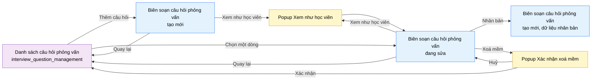

# Tài liệu thiết kế cơ bản (BD) — Biên soạn câu hỏi phỏng vấn (`SHR0302`)

## Phương châm tài liệu [Nội bộ — không cần khách duyệt]

- Viết theo **mẫu 9 sheet**. Bộ thẻ đóng, quy ước ID, ký hiệu chuẩn, ranh giới với tài liệu khác và
  checklist kiểm toán nằm ở `02-bd/_rules/bd-template-9sheet.md` — file này không chép lại.
- Phần gắn nhãn `[Nội bộ]` phục vụ sinh mã và tự kiểm toán, không phải yêu cầu của khách hàng: mục 4.5,
  mục 7.3 và các ghi chú quy ước.
- Mã màn `SHR0302` theo bảng mã ở `02-bd/_rules/bd-template-9sheet.md` mục 8; tên file mang tiền tố mã.
  Màn dùng chung A2 (`INSTRUCTOR`) / A3 (`ADMIN`), không có phạm vi riêng theo lớp
  [Nguồn: 01-rd/screens/shared/SHR0302_interview_question_authoring.md:6-10].
- Màn này **chưa có prototype** ở `09-layoutBase/` (`[Đợi nextjs]`), route chưa dựng mockup trung gian
  [Nguồn: 01-rd/screens/shared/SHR0302_interview_question_authoring.md:12]. Đã có một bản dựng UI thật ở
  `05-coding/frontend/src/views/shared/interview-question-authoring/`, tự nhận là "PROTOTYPE — no DD yet"
  [Nguồn: 05-coding/frontend/src/views/shared/interview-question-authoring/ui/interview-question-authoring-view.tsx:1].
  BD này dùng bản dựng đó làm bằng chứng cấu trúc bổ sung khi RD không đủ chi tiết, ghi rõ từng chỗ dùng.
- Màn này không có màn con, chỉ có 2 popup: Xem như học viên, Xác nhận xoá mềm.

> Đọc cùng `01-rd/screens/shared/SHR0302_interview_question_authoring.md` (hành vi ở mức yêu cầu, không lặp lại ở
> đây), `01-rd/screens/shared/SHR0301_interview_question_management.md` (màn cha), và ba file BD module:
> `02-bd/architecture/interview-bank.md`, `02-bd/database/interview-bank.md`, `02-bd/security/interview-bank.md`.
>
> **Không thiết kế** vòng đời nháp/xuất bản riêng như `problem_authoring` — câu hỏi hiện ngay cho học viên
> khi lưu, trừ khi bị ẩn khỏi Chế độ luyện do thiếu tiêu chí
> [Nguồn: 01-rd/screens/shared/SHR0302_interview_question_authoring.md:94].
> **Không thiết kế** khái niệm "bộ câu hỏi" (`question_sets`) — đã đóng, bỏ hẳn 2026-09-13
> [Nguồn: 02-bd/database/interview-bank.md:149-155].

---

## Sheet 1. Bìa

| Mục | Giá trị |
| :--- | :--- |
| Hệ thống | AlgoPrep |
| Phân hệ | `interview-bank` (F6) |
| Công đoạn | BD — Thiết kế cơ bản |
| Phân loại | Màn hình |
| Tên màn | Biên soạn câu hỏi phỏng vấn |
| Mã màn hình | `SHR0302` |
| Tên vật lý (slug) | `interview_question_authoring` |
| Trục tài liệu | Màn hình (`02-bd/screens/`) |
| Actor | A2 (`INSTRUCTOR`) / A3 (`ADMIN`) |
| Phiên bản | V0.1 |
| Người tạo | Nhóm phát triển AlgoPrep |
| Ngày tạo | 2026/09/20 |
| Người cập nhật | Nhóm phát triển AlgoPrep |
| Ngày cập nhật | 2026/09/20 |

---

## Sheet 2. Lịch sử sửa đổi

| Ver | Sheet bị sửa | Nội dung sửa | Ngày | Người sửa |
| :--- | :--- | :--- | :--- | :--- |
| V0.1 | Toàn bộ | Tạo mới theo mẫu 9 sheet, thay thế bản BD văn xuôi 7 mục cũ (layout regions, component inventory, screen states, API tiêu thụ, navigation, access rights, câu hỏi mở). Đối chiếu bản dựng UI thật ở `05-coding/frontend` để chốt vị trí khối Nhân bản/Xoá mềm và bước nhảy trọng số rubric; phát sinh câu hỏi mở mới về ba trường F6-04/05/06 chưa có nhóm biên soạn nào phụ trách | 2026/09/20 | Nhóm phát triển AlgoPrep |

---

## Sheet 3. Sơ đồ chuyển màn

> [Nội bộ] Quy ước vẽ: bố trí từ trái sang phải. Màn gọi tới tô tím, màn hiện tại tô xanh nhạt, popup tô
> vàng. Màu và `[Nguồn:]` dùng để truy vết, không phải yêu cầu của khách hàng.

### 3.1 Danh sách chuyển màn

#### Danh sách câu hỏi phỏng vấn → Biên soạn câu hỏi phỏng vấn (tạo mới)

[Điều kiện mở] Bấm nút "Thêm câu hỏi" ở màn `interview_question_management`.

[Chế độ mở] Chế độ tạo mới. Route không có `id` hợp lệ.

[Thông tin truyền] Không có.

[Giá trị trả về] Không có.

[Khi thành công] Hiển thị 4 nhóm trường rỗng, sẵn sàng nhập.

[Khi huỷ] Không có.

[Nguồn: 01-rd/screens/shared/SHR0302_interview_question_authoring.md:77-78]

#### Danh sách câu hỏi phỏng vấn → Biên soạn câu hỏi phỏng vấn (đang sửa)

[Điều kiện mở] Bấm vào một dòng câu hỏi trong danh sách ở màn `interview_question_management`.

[Chế độ mở] Chế độ sửa. Route có `id` hợp lệ.

[Thông tin truyền] `id` của câu hỏi được chọn.

[Giá trị trả về] Không có.

[Khi thành công] Tải dữ liệu hiện có vào 4 nhóm trường.

[Khi huỷ] Không có.

[Nguồn: 01-rd/screens/shared/SHR0302_interview_question_authoring.md:97-98 (suy diễn từ RD, chưa có prototype đối chiếu)]

#### Biên soạn câu hỏi phỏng vấn → Danh sách câu hỏi phỏng vấn

[Điều kiện mở] Bấm nút "Quay lại" ở thanh đầu trang.

[Chế độ mở] Không có.

[Thông tin truyền] Không có.

[Giá trị trả về] Không có.

[Khi thành công] Điều hướng về `interview_question_management`, không lưu thay đổi dở dang.

[Khi huỷ] Không có.

[Nguồn: 01-rd/screens/shared/SHR0302_interview_question_authoring.md:52; 05-coding/frontend/src/views/shared/interview-question-authoring/ui/interview-question-authoring-view.tsx:100-102]

#### Biên soạn câu hỏi phỏng vấn (đang sửa) → Biên soạn câu hỏi phỏng vấn (tạo mới, dữ liệu nhân bản)

[Điều kiện mở] Bấm nút "Nhân bản" trong khối "Hành động quản trị".

[Chế độ mở] Chế độ tạo mới, dữ liệu 4 nhóm được điền sẵn từ bản ghi gốc, chưa có `id`, chưa lưu.

[Thông tin truyền] `id` của câu hỏi gốc.

[Giá trị trả về] Không có.

[Khi thành công] Điều hướng sang một bản ghi mới (cùng slug, route không có `id`), 4 nhóm hiển thị dữ liệu
sao chép toàn bộ.

[Khi huỷ] Không có.

[Nguồn: 01-rd/screens/shared/SHR0302_interview_question_authoring.md:66-67, 93]

#### Biên soạn câu hỏi phỏng vấn → Popup Xác nhận xoá mềm

[Điều kiện mở] Bấm nút "Xoá mềm" trong khối "Hành động quản trị".

[Chế độ mở] Không có.

[Thông tin truyền] `id` của câu hỏi đang mở.

[Giá trị trả về] Kết quả chọn "Xác nhận" hoặc "Huỷ".

[Khi thành công] Hiển thị nội dung cảnh báo không cascade xoá phiên phỏng vấn cũ.

[Khi huỷ] Không có.

[Nguồn: 01-rd/screens/shared/SHR0302_interview_question_authoring.md:66-67, 82-84; 05-coding/frontend/src/views/shared/interview-question-authoring/ui/interview-question-authoring-view.tsx:277-287]

#### Popup Xác nhận xoá mềm → Danh sách câu hỏi phỏng vấn

[Điều kiện mở] Bấm "Xác nhận" trong popup.

[Chế độ mở] Không có.

[Thông tin truyền] Không có.

[Giá trị trả về] Kết quả xoá mềm.

[Khi thành công] Đóng popup, điều hướng về `interview_question_management`, câu hỏi chuyển trạng thái
`RETIRED`.

[Khi huỷ] Đóng popup, giữ nguyên màn biên soạn.

[Nguồn: 01-rd/screens/shared/SHR0302_interview_question_authoring.md:82-84; 02-bd/database/interview-bank.md:35]

#### Biên soạn câu hỏi phỏng vấn → Popup Xem như học viên

[Điều kiện mở] Bấm nút "Xem như học viên" ở thanh đầu trang.

[Chế độ mở] Chế độ chỉ xem.

[Thông tin truyền] Dữ liệu 4 nhóm đang có trong form (kể cả chưa lưu) — xem Câu hỏi mở Q3.

[Giá trị trả về] Không có.

[Khi thành công] Hiển thị câu hỏi như học viên sẽ thấy ở Chế độ học và Chế độ luyện.

[Khi huỷ] Không có.

[Nguồn: 01-rd/screens/shared/SHR0302_interview_question_authoring.md:53, mục 5 Q2; 05-coding/frontend/src/views/shared/interview-question-authoring/ui/interview-question-authoring-view.tsx:109-111 (nút đã dựng, chưa gắn hành vi mở popup)]

### 3.2 Sơ đồ

[Nguồn: 01-rd/screens/shared/SHR0302_interview_question_authoring.md:48-71, 77-84, 93]

---

## Sheet 4. Bố cục màn hình

### 4.1 Tổng quan màn

[Mục đích màn] Cho A2/A3 tạo mới hoặc sửa một câu hỏi phỏng vấn trong ngân hàng dùng chung: nội dung +
phân loại, danh sách câu hỏi đào sâu, và bộ tiêu chí đánh giá có trọng số, để câu hỏi sẵn sàng dùng ở Chế
độ học/Chế độ luyện phía học viên [Nguồn: 01-rd/screens/shared/SHR0302_interview_question_authoring.md:27-31,
F6-13].

[Luồng nghiệp vụ chính]

1. **Hiển thị ban đầu**: tạo mới thì 4 nhóm trống; sửa thì tải dữ liệu hiện có (nội dung, chủ đề, độ khó,
   câu hỏi đào sâu, bộ tiêu chí) vào 4 nhóm.
2. **Sửa Nhóm 1 — Nội dung và phân loại**: nhập nội dung câu hỏi (Markdown), chọn 1 trong 5 chủ đề cố
   định, chọn độ khó.
3. **Sửa Nhóm 2 — Câu hỏi đào sâu**: thêm hoặc xoá từng dòng văn bản tự do, không giới hạn số lượng.
4. **Sửa Nhóm 3 — Bộ tiêu chí đánh giá**: thêm hoặc xoá từng tiêu chí, chỉnh trọng số bằng nút giảm/tăng
   hoặc nhập trực tiếp; tổng trọng số hiển thị liên tục, đổi màu cảnh báo khi khác 100.
5. **Xem trước**: bấm "Xem như học viên" để xem câu hỏi như học viên sẽ thấy ở Chế độ học và Chế độ luyện.
6. **Hành động quản trị (Nhóm 4)**: "Nhân bản" tạo một bản ghi mới đã điền sẵn dữ liệu; "Xoá mềm" chuyển
   câu hỏi sang trạng thái `RETIRED` sau khi xác nhận.
7. **Lưu**: bấm "Lưu" — không có khái niệm "xuất bản" riêng, câu hỏi hiện ngay cho học viên khi lưu, trừ
   khi thiếu tiêu chí (bị ẩn khỏi Chế độ luyện, vẫn hiện ở Chế độ học).

[Người dùng] A2 (Giảng viên) hoặc A3 (Quản trị viên) đã đăng nhập, có Function `INTERVIEW_BANK_MANAGEMENT`
[Nguồn: 01-rd/req/identity.md:60, F1-12].

[Tệp liên quan] Không có. Màn này không xuất hay nhập tệp.

[Phạm vi]
- Không có phạm vi riêng theo lớp — A2 sửa được toàn bộ ngân hàng câu hỏi hệ thống, không giới hạn theo
  lớp phụ trách [Nguồn: 01-rd/screens/shared/SHR0302_interview_question_authoring.md:6-10,
  DEC-2026-0825-shared-content-authoring-screens].
- Không có vòng đời nháp/xuất bản như `problem_authoring` — chốt 2026-09-01
  [Nguồn: 01-rd/screens/shared/SHR0302_interview_question_authoring.md:94].
- 4 nhóm trường trình bày tuần tự theo chiều dọc, không dùng tab — khớp bản dựng UI hiện tại (4 `Card` xếp
  dọc, không có điều khiển tab) [Nguồn: 05-coding/frontend/src/views/shared/interview-question-authoring/ui/interview-question-authoring-view.tsx:119-274].
- Khối "Hành động quản trị" (Nhóm 4, Nhân bản/Xoá mềm) đặt thành một khối riêng ở cuối trang, không phải
  menu ngữ cảnh ở thanh đầu trang [Nguồn: 05-coding/frontend/src/views/shared/interview-question-authoring/ui/interview-question-authoring-view.tsx:260-274].
- Không thiết kế bảng "bộ câu hỏi" (`question_sets`) — đã loại khỏi phạm vi 2026-09-13
  [Nguồn: 02-bd/database/interview-bank.md:149-155].
- Ba trường `suggested_approach`/`sample_answer_framework`/`core_keywords` (F6-04/05/06) tồn tại trong
  bảng `interview_questions` nhưng **không có nhóm trường nào ở màn này biên soạn chúng** — RD chỉ chốt
  4 nhóm và bản dựng UI hiện tại cũng không có control cho ba trường này. Đây là một phát hiện, không phải
  suy đoán "chắc có cột" — ghi thành Câu hỏi mở Q5
  [Nguồn: 01-rd/screens/shared/SHR0302_interview_question_authoring.md:48-67; 02-bd/database/interview-bank.md:31-33].

[Quyền sử dụng]
- Xem: được, khi có Function `INTERVIEW_BANK_MANAGEMENT`.
- Thêm: được (tạo câu hỏi mới, kể cả qua Nhân bản).
- Sửa: được, toàn bộ ngân hàng, không giới hạn theo `created_by`.
- Xoá: không xoá vật lý. Chuyển trạng thái `RETIRED`, không cascade xoá `user_answers`/`recall_ratings` đã
  có [Nguồn: 02-bd/database/interview-bank.md:35, 64-66].

[Số bản ghi tối đa] Nhóm 2 (câu hỏi đào sâu): không giới hạn số dòng, RD chỉ chốt "không giới hạn số
lượng" [Nguồn: 01-rd/screens/shared/SHR0302_interview_question_authoring.md:59-62]. Nhóm 3 (tiêu chí đánh giá):
không giới hạn số dòng, RD không nêu trần. Không phân trang — màn chỉ sửa một bản ghi tại một thời điểm.

[Nguồn: 01-rd/screens/shared/SHR0302_interview_question_authoring.md:25-73; 02-bd/database/interview-bank.md:22-66;
01-rd/req/identity.md:55-60]

### 4.2 DTO liên quan

- `InterviewQuestionDto`
- `AnswerRubricDto`
- `QuestionTopicDto`

`[Suy luận]` — tên DTO do BD này đề xuất, `03-dd/api/interview-bank.md` chốt lại.

### 4.3 Bảng dữ liệu liên quan (3)

| NO | Bảng | Ghi chú |
| --: | :--- | :--- |
| 1 | `interview_bank.interview_questions` | [Nguồn: 02-bd/database/interview-bank.md:22-46] |
| 2 | `interview_bank.answer_rubrics` | [Nguồn: 02-bd/database/interview-bank.md:48-66] |
| 3 | `interview_bank.question_topics` | Danh mục chỉ đọc, 5 dòng seed cố định [Nguồn: 02-bd/database/interview-bank.md:8-20] |

"Câu hỏi đào sâu" (Nhóm 2) là cột `follow_up_questions` (JSONB mảng chuỗi) bên trong `interview_questions`,
**không phải một bảng riêng** [Nguồn: 02-bd/database/interview-bank.md:34].

### 4.4 Vùng bố cục

Màn này **chưa có mockup** ở `09-layoutBase/` [Nguồn: 01-rd/screens/shared/SHR0302_interview_question_authoring.md:12].
Bảng dưới đối chiếu bản dựng UI thật hiện có (tự nhận là "PROTOTYPE — no DD yet", không phải nguồn hành vi
chính thức, chỉ dùng để mô tả cấu trúc đã dựng) — khác `09-layoutBase`, đây không phải bằng chứng chỉ-đọc
cố định, có thể đổi khi có DD/prototype chính thức.

| Vùng | Vị trí trong bản dựng UI | Nội dung |
| :--- | :--- | :--- |
| Thanh đầu trang | `interview-question-authoring-view.tsx:95-117` | Nút quay lại, tiêu đề, trạng thái lưu, nút "Xem như học viên", nút "Lưu" |
| Khối 1 — Nội dung và phân loại | `:120-146` | Nội dung câu hỏi (textarea), chọn chủ đề, chọn độ khó |
| Khối 2 — Câu hỏi đào sâu | `:148-183` | Danh sách dòng văn bản tự do, nút thêm dòng, nút xoá từng dòng |
| Khối 3 — Bộ tiêu chí đánh giá | `:185-258` | Tổng trọng số, danh sách tiêu chí (tên, trọng số dạng stepper), nút thêm/xoá tiêu chí |
| Khối 4 — Hành động quản trị | `:260-274` | Nút "Nhân bản", nút "Xoá mềm" |
| Popup Xác nhận xoá mềm | `:277-287` | Nội dung cảnh báo, nút Xác nhận/Huỷ |

Bố cục một cột dọc, độ rộng tối đa `860px` (`:119`), không chia layout hai cột như `admin_ai_config` — khối
lượng trường của một câu hỏi phỏng vấn nhỏ hơn một bài toán, không cần cột phụ. Giữ nguyên cấu trúc này khi
hoàn thiện Next.js theo DD; không quy định màu sắc, khoảng cách hay typography ở BD.

### 4.5 Cấu trúc slice FSD [Nội bộ]

| Khối | Slice dự kiến | Căn cứ |
| :--- | :--- | :--- |
| Trang | `views/shared/interview-question-authoring` | Đã dựng: `05-coding/frontend/src/views/shared/interview-question-authoring/` |
| Dữ liệu miền | `entities/interview-question` | Đã dựng: cung cấp `QUESTION_TOPICS`, `QUESTION_LEVELS`, `RubricCriterion` |
| Khối tiêu chí đánh giá | Dùng lại `shared/ui/NumberStepper` cho ô trọng số | Đã dựng: `05-coding/frontend/src/shared/ui/number-stepper.tsx`, cùng component họ `admin_ai_config` dùng cho rubric Solution Review |
| Popup | `features/interview-question-preview`, `features/interview-question-soft-delete` | Xác nhận xoá mềm đã dựng bằng `shared/ui/ConfirmDialog`; popup xem trước chưa gắn hành vi |

`[Suy luận]` — ánh xạ slice tham chiếu code đã dựng, DD màn hình chốt lại khi viết hợp đồng API.

> [Nội bộ] Ảnh minh hoạ đặt ở `08-diagram/02-bd/screens/shared/`, chụp bằng Playwright trên ứng dụng
> Next.js thật khi màn có DD và API thật. Bản dựng hiện tại chưa gọi backend nên chưa chụp.

---

## Sheet 5. Danh sách item màn hình

> Quy ước ID, bộ thẻ và giá trị chuẩn: `02-bd/_rules/bd-template-9sheet.md` mục 2, 3, 4.

### Khu vực A — Thanh đầu trang

| Khu vực | NO | Tên item | ID item | Bảng DB | Cột DB | Loại UI | Kiểu | Độ dài | Bắt buộc | I/O | Giá trị mặc định | Định dạng | Ghi chú |
| :--- | --: | :--- | :--- | :--- | :--- | :--- | :--- | :--- | :-: | :-: | :--- | :--- | :--- |
| Thanh đầu trang | | | | | | | | | | | | | |
| | 1 | Nút quay lại | `interviewQuestionAuthoring.header.btnBack` | - | - | Button | - | - | - | I | - | - | Điều hướng về `interview_question_management` [Nguồn giá trị] - [EVT liên quan] EVT-3 |
| | 2 | Định danh câu hỏi | `interviewQuestionAuthoring.header.title` | `interview_questions` | `title` | Label | String | - | - | O | "Câu hỏi mới" | - | Rỗng/"Câu hỏi mới" khi tạo mới, hiển thị `title` khi đang sửa [Nguồn giá trị] Cột `title` khi đang sửa; nhãn tĩnh i18n khi tạo mới [EVT liên quan] EVT-2 |
| | 3 | Trạng thái lưu | `interviewQuestionAuthoring.header.saveStatus` | - | - | Label | Enum | - | - | O | "Chưa lưu" | - | "Đang lưu" / "Đã lưu lúc {giờ}" / "Chưa lưu" — trạng thái phía client, không phải cột DB [Nguồn giá trị] Trạng thái client sau mỗi lần gọi Lưu [EVT liên quan] EVT-10, EVT-11 |
| | 4 | Xem như học viên | `interviewQuestionAuthoring.header.btnPreview` | - | - | Button | - | - | - | I | - | - | Mở popup xem trước theo dữ liệu form hiện tại [Nguồn giá trị] - [EVT liên quan] EVT-16 |
| | 5 | Lưu | `interviewQuestionAuthoring.header.btnSave` | - | - | Button | - | - | - | I | - | - | Tạo mới hoặc cập nhật câu hỏi [Nguồn giá trị] - [EVT liên quan] EVT-10, EVT-11 |

### Khu vực B — Nhóm 1: Nội dung và phân loại

| Khu vực | NO | Tên item | ID item | Bảng DB | Cột DB | Loại UI | Kiểu | Độ dài | Bắt buộc | I/O | Giá trị mặc định | Định dạng | Ghi chú |
| :--- | --: | :--- | :--- | :--- | :--- | :--- | :--- | :--- | :-: | :-: | :--- | :--- | :--- |
| Nhóm 1 — Nội dung và phân loại | | | | | | | | | | | | | |
| | 1 | Nội dung câu hỏi | `interviewQuestionAuthoring.content.contentMarkdown` | `interview_questions` | `content_markdown` | TextArea | String | - | Có | I/O | rỗng | Markdown | Nội dung câu hỏi phỏng vấn [Nguồn giá trị] Cột `content_markdown` [EVT liên quan] EVT-4 |
| | 2 | Chủ đề | `interviewQuestionAuthoring.content.topic` | `interview_questions` | `topic_id` | List | Enum | - | Có | I/O | `CS_THEORY` | Nhãn tiếng Việt | Chọn 1 trong 5 chủ đề cố định [Nguồn giá trị] Danh mục `question_topics` (5 dòng seed): `CS_THEORY`, `SYSTEM_DESIGN`, `DATABASE`, `LANGUAGE`, `BEHAVIORAL` [EVT liên quan] EVT-4 |
| | 3 | Độ khó | `interviewQuestionAuthoring.content.difficulty` | `interview_questions` | `difficulty` | List | Enum | - | Có | I/O | `MEDIUM` | Nhãn tiếng Việt | `EASY`/`MEDIUM`/`HARD` [Nguồn giá trị] Cột `difficulty` [EVT liên quan] EVT-4 |

### Khu vực C — Nhóm 2: Câu hỏi đào sâu

| Khu vực | NO | Tên item | ID item | Bảng DB | Cột DB | Loại UI | Kiểu | Độ dài | Bắt buộc | I/O | Giá trị mặc định | Định dạng | Ghi chú |
| :--- | --: | :--- | :--- | :--- | :--- | :--- | :--- | :--- | :-: | :-: | :--- | :--- | :--- |
| Nhóm 2 — Câu hỏi đào sâu | | | | | | | | | | | | | |
| | 1 | Danh sách câu hỏi đào sâu | `interviewQuestionAuthoring.followUp.list` | `interview_questions` | `follow_up_questions` | List | List | - | - | I/O | 1 dòng rỗng | - | Mỗi dòng là một câu hỏi đào sâu tự do, dùng ở giai đoạn Phản biện của Phỏng vấn giả lập (F5-11) [Nguồn giá trị] Cột `follow_up_questions` (JSONB mảng chuỗi) [EVT liên quan] EVT-5, EVT-6 |
| | 2 | Ô nhập câu hỏi đào sâu | `interviewQuestionAuthoring.followUp.item` | `interview_questions` | `follow_up_questions` | TextArea | String | - | Không | I/O | rỗng | - | Một phần tử của mảng `follow_up_questions`; ngưỡng độ dài chưa chốt, xem Q4 [Nguồn giá trị] Phần tử mảng tương ứng [EVT liên quan] EVT-4 |
| | 3 | Thêm dòng | `interviewQuestionAuthoring.followUp.btnAdd` | - | - | Button | - | - | - | I | - | - | Thêm một dòng trống vào cuối danh sách [Nguồn giá trị] - [EVT liên quan] EVT-5 |
| | 4 | Xoá dòng | `interviewQuestionAuthoring.followUp.btnRemove` | - | - | Button | - | - | - | I | - | - | Xoá dòng tương ứng khỏi danh sách [Nguồn giá trị] - [EVT liên quan] EVT-6 |

### Khu vực D — Nhóm 3: Bộ tiêu chí đánh giá có trọng số

| Khu vực | NO | Tên item | ID item | Bảng DB | Cột DB | Loại UI | Kiểu | Độ dài | Bắt buộc | I/O | Giá trị mặc định | Định dạng | Ghi chú |
| :--- | --: | :--- | :--- | :--- | :--- | :--- | :--- | :--- | :-: | :-: | :--- | :--- | :--- |
| Nhóm 3 — Bộ tiêu chí đánh giá | | | | | | | | | | | | | |
| | 1 | Tổng trọng số | `interviewQuestionAuthoring.rubric.totalBadge` | - | - | Badge | Number | 3 | - | O | - | `Tổng {số}%` | Chỉ hiển thị khi có ít nhất một tiêu chí [Công thức] Cộng `weight_percent` của mọi dòng đang hiển thị [EVT liên quan] EVT-9 |
| | 2 | Danh sách tiêu chí | `interviewQuestionAuthoring.rubric.list` | `answer_rubrics` | - | List | List | - | - | I/O | 0 dòng | - | Câu hỏi thiếu tiêu chí vẫn lưu được hợp lệ, chỉ bị ẩn khỏi Chế độ luyện [Nguồn giá trị] Các dòng `answer_rubrics` theo `question_id` [EVT liên quan] EVT-7, EVT-8, EVT-9 |
| | 3 | Tên/mã tiêu chí | `interviewQuestionAuthoring.rubric.col.criterionCode` | `answer_rubrics` | `criterion_code` | TextBox | String | - | Có | I/O | rỗng | - | A2/A3 tự đặt tên tiêu chí, không có danh mục gợi ý sẵn — xem Q8 [Nguồn giá trị] Cột `criterion_code`, người dùng nhập [EVT liên quan] EVT-4 |
| | 4 | Trọng số | `interviewQuestionAuthoring.rubric.col.weightPercent` | `answer_rubrics` | `weight_percent` | NumberBox | Number | 5 | Có | I/O | 0 | `{số}%`, bước nhảy 5 | Stepper dùng chung `shared/ui/NumberStepper`, khoảng 0-100, bước nhảy mặc định 5 [Nguồn giá trị] Cột `weight_percent` [EVT liên quan] EVT-9 |
| | 5 | Thêm tiêu chí | `interviewQuestionAuthoring.rubric.btnAdd` | - | - | Button | - | - | - | I | - | - | Thêm một dòng tiêu chí trống (trọng số mặc định 0) [Nguồn giá trị] - [EVT liên quan] EVT-7 |
| | 6 | Xoá tiêu chí | `interviewQuestionAuthoring.rubric.btnRemove` | - | - | Button | - | - | - | I | - | - | Xoá dòng tiêu chí tương ứng [Nguồn giá trị] - [EVT liên quan] EVT-8 |

### Khu vực E — Nhóm 4: Hành động quản trị

| Khu vực | NO | Tên item | ID item | Bảng DB | Cột DB | Loại UI | Kiểu | Độ dài | Bắt buộc | I/O | Giá trị mặc định | Định dạng | Ghi chú |
| :--- | --: | :--- | :--- | :--- | :--- | :--- | :--- | :--- | :-: | :-: | :--- | :--- | :--- |
| Nhóm 4 — Hành động quản trị | | | | | | | | | | | | | |
| | 1 | Nhân bản | `interviewQuestionAuthoring.admin.btnDuplicate` | - | - | Button | - | - | - | I | - | - | Sao chép toàn bộ 4 nhóm sang một bản ghi mới, chưa lưu [Nguồn giá trị] - [EVT liên quan] EVT-12 |
| | 2 | Xoá mềm | `interviewQuestionAuthoring.admin.btnSoftDelete` | `interview_questions` | `status` | Button | - | - | - | I | - | - | Mở popup xác nhận, chuyển `status` sang `RETIRED` khi xác nhận [Nguồn giá trị] - [EVT liên quan] EVT-13 |

### Popup Xem như học viên

| Khu vực | NO | Tên item | ID item | Bảng DB | Cột DB | Loại UI | Kiểu | Độ dài | Bắt buộc | I/O | Giá trị mặc định | Định dạng | Ghi chú |
| :--- | --: | :--- | :--- | :--- | :--- | :--- | :--- | :--- | :-: | :-: | :--- | :--- | :--- |
| Popup Xem như học viên | | | | | | | | | | | | | |
| | 1 | Xem trước Chế độ học | `interviewQuestionAuthoring.popup.previewStudy` | - | - | Popup | - | - | - | O | - | - | Hiển thị nội dung, câu hỏi đào sâu như học viên thấy ở Chế độ học; nguồn dữ liệu là form hiện tại, chưa chốt — xem Q3 [Nguồn giá trị] Dữ liệu form đang biên soạn [EVT liên quan] EVT-16, EVT-17 |
| | 2 | Xem trước Chế độ luyện | `interviewQuestionAuthoring.popup.previewPractice` | - | - | Popup | - | - | - | O | - | - | Hiển thị câu hỏi và cảnh báo "sẽ ẩn khỏi Chế độ luyện" nếu Nhóm 3 đang trống [Nguồn giá trị] Dữ liệu form đang biên soạn [EVT liên quan] EVT-16, EVT-17 |
| | 3 | Đóng | `interviewQuestionAuthoring.popup.previewClose` | - | - | Button | - | - | - | I | - | - | Đóng popup, quay lại màn soạn [Nguồn giá trị] - [EVT liên quan] EVT-17 |

### Popup Xác nhận xoá mềm

| Khu vực | NO | Tên item | ID item | Bảng DB | Cột DB | Loại UI | Kiểu | Độ dài | Bắt buộc | I/O | Giá trị mặc định | Định dạng | Ghi chú |
| :--- | --: | :--- | :--- | :--- | :--- | :--- | :--- | :--- | :-: | :-: | :--- | :--- | :--- |
| Popup Xác nhận xoá mềm | | | | | | | | | | | | | |
| | 1 | Nội dung cảnh báo | `interviewQuestionAuthoring.popup.softDeleteBody` | - | - | Label | String | - | - | O | - | - | Cảnh báo không cascade xoá phiên phỏng vấn cũ [Nguồn giá trị] Nhãn tĩnh i18n [EVT liên quan] - |
| | 2 | Xác nhận | `interviewQuestionAuthoring.popup.softDeleteConfirm` | - | - | Button | - | - | - | I | - | - | Xác nhận xoá mềm [Nguồn giá trị] - [EVT liên quan] EVT-14 |
| | 3 | Huỷ | `interviewQuestionAuthoring.popup.softDeleteCancel` | - | - | Button | - | - | - | I | - | - | Đóng popup, giữ nguyên câu hỏi [Nguồn giá trị] - [EVT liên quan] EVT-15 |

[Nguồn: 01-rd/screens/shared/SHR0302_interview_question_authoring.md:52-67; 02-bd/database/interview-bank.md:8-66;
05-coding/frontend/src/views/shared/interview-question-authoring/ui/interview-question-authoring-view.tsx:95-287]

---

## Sheet 6. Đặc tả điều khiển item

> Ký hiệu cột `Hiển thị` và thứ tự thẻ: `02-bd/_rules/bd-template-9sheet.md` mục 2, 3. Dùng đúng NO, tên
> item và thứ tự của Sheet 5. Lỗi nhập liệu ghi ở Sheet 9, xử lý nghiệp vụ ghi ở Sheet 8.

### Khu vực A — Thanh đầu trang

| Khu vực | NO | Tên item | Hiển thị | Ghi chú |
| :--- | --: | :--- | :-: | :--- |
| Thanh đầu trang | | | | |
| | 1 | Nút quay lại | Có | - |
| | 2 | Định danh câu hỏi | Có | - |
| | 3 | Trạng thái lưu | Có | [Tự động đặt] Đổi sang "Đang lưu" ngay khi bấm Lưu, đổi sang "Đã lưu lúc {giờ}" khi có phản hồi thành công, quay về "Chưa lưu" khi có bất kỳ thay đổi nào sau lần lưu gần nhất. |
| | 4 | Xem như học viên | Có | [Điều kiện kích hoạt] Luôn kích hoạt, kể cả khi đang tạo mới và chưa nhập gì. |
| | 5 | Lưu | Có | [Điều kiện kích hoạt] Kích hoạt khi nội dung câu hỏi không rỗng **và** (Nhóm 3 trống hoặc tổng trọng số bằng 100) **và** không đang trong trạng thái đang lưu. |

### Khu vực B — Nhóm 1: Nội dung và phân loại

| Khu vực | NO | Tên item | Hiển thị | Ghi chú |
| :--- | --: | :--- | :-: | :--- |
| Nhóm 1 — Nội dung và phân loại | | | | |
| | 1 | Nội dung câu hỏi | Có | - |
| | 2 | Chủ đề | Có | - |
| | 3 | Độ khó | Có | - |

### Khu vực C — Nhóm 2: Câu hỏi đào sâu

| Khu vực | NO | Tên item | Hiển thị | Ghi chú |
| :--- | --: | :--- | :-: | :--- |
| Nhóm 2 — Câu hỏi đào sâu | | | | |
| | 1 | Danh sách câu hỏi đào sâu | Có | [Điều kiện hiển thị] Luôn có ít nhất một dòng — không cho xoá dòng cuối cùng còn lại. |
| | 2 | Ô nhập câu hỏi đào sâu | Có | - |
| | 3 | Thêm dòng | Có | - |
| | 4 | Xoá dòng | Có | [Điều kiện kích hoạt] Không kích hoạt khi danh sách chỉ còn đúng một dòng. |

### Khu vực D — Nhóm 3: Bộ tiêu chí đánh giá có trọng số

| Khu vực | NO | Tên item | Hiển thị | Ghi chú |
| :--- | --: | :--- | :-: | :--- |
| Nhóm 3 — Bộ tiêu chí đánh giá | | | | |
| | 1 | Tổng trọng số | Điều kiện | [Điều kiện hiển thị] Chỉ hiển thị khi danh sách tiêu chí có ít nhất một dòng. |
| | 2 | Danh sách tiêu chí | Có | [Điều kiện hiển thị] Trống thì hiển thị ghi chú "Chưa có tiêu chí — câu hỏi vẫn lưu được nhưng sẽ ẩn khỏi Chế độ luyện" thay cho danh sách. |
| | 3 | Tên/mã tiêu chí | Có | - |
| | 4 | Trọng số | Có | [Tự động đặt] Giá trị cập nhật ngay khi bấm nút giảm/tăng hoặc nhập trực tiếp; kéo theo tính lại Tổng trọng số. |
| | 5 | Thêm tiêu chí | Có | - |
| | 6 | Xoá tiêu chí | Có | - |

### Khu vực E — Nhóm 4: Hành động quản trị

| Khu vực | NO | Tên item | Hiển thị | Ghi chú |
| :--- | --: | :--- | :-: | :--- |
| Nhóm 4 — Hành động quản trị | | | | |
| | 1 | Nhân bản | Điều kiện | [Điều kiện hiển thị] Chỉ hiển thị ở chế độ đang sửa (đã có `id`) — không có gì để nhân bản khi đang tạo mới. |
| | 2 | Xoá mềm | Điều kiện | [Điều kiện hiển thị] Chỉ hiển thị ở chế độ đang sửa. |

### Popup Xem như học viên

| Khu vực | NO | Tên item | Hiển thị | Ghi chú |
| :--- | --: | :--- | :-: | :--- |
| Popup Xem như học viên | | | | |
| | 1 | Xem trước Chế độ học | Điều kiện | [Điều kiện hiển thị] Chỉ hiển thị sau khi bấm "Xem như học viên". |
| | 2 | Xem trước Chế độ luyện | Điều kiện | [Điều kiện hiển thị] Chỉ hiển thị sau khi bấm "Xem như học viên"; kèm cảnh báo ẩn khỏi Chế độ luyện nếu Nhóm 3 đang trống. |
| | 3 | Đóng | Điều kiện | [Điều kiện hiển thị] Chỉ hiển thị khi popup đang mở. |

### Popup Xác nhận xoá mềm

| Khu vực | NO | Tên item | Hiển thị | Ghi chú |
| :--- | --: | :--- | :-: | :--- |
| Popup Xác nhận xoá mềm | | | | |
| | 1 | Nội dung cảnh báo | Điều kiện | [Điều kiện hiển thị] Chỉ hiển thị sau khi bấm "Xoá mềm". |
| | 2 | Xác nhận | Điều kiện | [Điều kiện hiển thị] Chỉ hiển thị khi popup đang mở. |
| | 3 | Huỷ | Điều kiện | [Điều kiện hiển thị] Chỉ hiển thị khi popup đang mở. |

---

## Sheet 7. Danh sách truyền dữ liệu

### 7.1 Trường DTO

| NO | DTO | Trường DTO | Kiểu | Bảng DB | Cột DB | Item màn | Hiển thị | Ghi chú |
| --: | :--- | :--- | :--- | :--- | :--- | :--- | :-: | :--- |
| 1 | `InterviewQuestionDto` | `id` | UUID | `interview_questions` | `id` | - | Không | [Nguồn] Phản hồi của `GetInterviewQuestionDetail` [Đích] Tham số của `UpdateInterviewQuestion`, `DuplicateInterviewQuestion`, `RetireInterviewQuestion`. Không hiển thị trên màn. |
| 2 | `InterviewQuestionDto` | `topicId` | UUID | `interview_questions` | `topic_id` | Nhóm 1 "Chủ đề" | Có | [Nguồn] Phản hồi của `GetInterviewQuestionDetail` hoặc `ListQuestionTopics` [Chuyển đổi] Khoá tra `QuestionTopicDto.displayName` khi hiển thị. |
| 3 | `InterviewQuestionDto` | `difficulty` | Enum | `interview_questions` | `difficulty` | Nhóm 1 "Độ khó" | Có | [Chuyển đổi] `EASY`/`MEDIUM`/`HARD` đổi sang nhãn tiếng Việt. |
| 4 | `InterviewQuestionDto` | `title` | String | `interview_questions` | `title` | Thanh đầu trang "Định danh câu hỏi" | Có | [Nguồn] Người dùng nhập cùng nội dung câu hỏi, hoặc suy ra từ `content_markdown` — cách xác định `title` cụ thể để DD chốt. |
| 5 | `InterviewQuestionDto` | `contentMarkdown` | String | `interview_questions` | `content_markdown` | Nhóm 1 "Nội dung câu hỏi" | Có | [Nguồn] Giá trị người dùng nhập [Đích] Tham số của `CreateInterviewQuestion`/`UpdateInterviewQuestion` [Chuyển đổi] Nội dung người dùng nhập là **dữ liệu**, không ghép chuỗi thành chỉ thị AI — cùng nguyên tắc chống prompt-injection của `02-bd/architecture/interview-bank.md` mục 5. |
| 6 | `InterviewQuestionDto` | `followUpQuestions` | `String[]` | `interview_questions` | `follow_up_questions` | Nhóm 2 "Danh sách câu hỏi đào sâu" | Có | [Nguồn] Giá trị người dùng nhập, mỗi phần tử một dòng [Đích] Tham số của `CreateInterviewQuestion`/`UpdateInterviewQuestion`. |
| 7 | `InterviewQuestionDto` | `status` | Enum | `interview_questions` | `status` | Nhóm 4 "Xoá mềm" | Không | [Nguồn] Phản hồi của `GetInterviewQuestionDetail` [Đích] Tham số của `RetireInterviewQuestion` đổi sang `RETIRED`. Không hiển thị trực tiếp, chỉ quyết định hiển thị Nhóm 4. |
| 8 | `AnswerRubricDto` | `questionId` | UUID | `answer_rubrics` | `question_id` | - | Không | [Nguồn] `id` của câu hỏi đang biên soạn [Đích] Tham số của `CreateInterviewQuestion`/`UpdateInterviewQuestion` (gửi kèm danh sách tiêu chí). |
| 9 | `AnswerRubricDto` | `criterionCode` | String | `answer_rubrics` | `criterion_code` | Nhóm 3 "Tên/mã tiêu chí" | Có | [Nguồn] Người dùng tự đặt, không có danh mục gợi ý — xem Q8. |
| 10 | `AnswerRubricDto` | `description` | String | `answer_rubrics` | `description` | - | Không | [Nguồn] Cột `description` — RD và bản dựng UI hiện tại chưa có ô nhập riêng cho trường này ở màn, xem Q8. |
| 11 | `AnswerRubricDto` | `weightPercent` | Number | `answer_rubrics` | `weight_percent` | Nhóm 3 "Trọng số" | Có | [Nguồn] Giá trị người dùng chỉnh bằng stepper hoặc nhập trực tiếp [Đích] Tham số của `CreateInterviewQuestion`/`UpdateInterviewQuestion` [Chuyển đổi] Gửi lên dạng số, không kèm ký hiệu phần trăm. |
| 12 | `QuestionTopicDto` | `id`, `code`, `displayName` | UUID, Enum, String | `question_topics` | `id`, `code`, `display_name` | Nhóm 1 "Chủ đề" (danh sách chọn) | Có | [Nguồn] Phản hồi của `ListQuestionTopics`, danh mục chỉ đọc, 5 dòng cố định. |

### 7.2 Truy cập bảng dữ liệu (3)

| NO | Tên logic | Bảng | Repository | CRUD | Mục đích | Ghi chú |
| --: | :--- | :--- | :--- | :-: | :--- | :--- |
| 1 | Câu hỏi phỏng vấn | `interview_bank.interview_questions` | `InterviewQuestionRepository` | C, R, U | Tạo mới, đọc chi tiết để sửa, cập nhật nội dung/phân loại/câu hỏi đào sâu, chuyển `status` khi xoá mềm | `GetInterviewQuestionDetail`: R `CreateInterviewQuestion`: C `UpdateInterviewQuestion`: U `DuplicateInterviewQuestion`: C `RetireInterviewQuestion`: U |
| 2 | Bộ tiêu chí đánh giá | `interview_bank.answer_rubrics` | `AnswerRubricRepository` | C, R, U, D | Đọc, tạo, sửa, xoá từng dòng tiêu chí gắn với một câu hỏi | `GetInterviewQuestionDetail`: R `CreateInterviewQuestion`/`UpdateInterviewQuestion`: C, U, D (đồng bộ toàn bộ danh sách theo trạng thái form) |
| 3 | Danh mục chủ đề | `interview_bank.question_topics` | `QuestionTopicRepository` | R | Đọc danh mục 5 chủ đề cố định, không có thao tác ghi từ màn này | `ListQuestionTopics`: R |

Không có thao tác xoá vật lý (`D`) trên `interview_questions`: chuyển `status` sang `RETIRED`, không cascade
xoá `answer_rubrics`, `user_answers`, `recall_ratings` đã có [Nguồn: 02-bd/database/interview-bank.md:64-66].

`[Suy luận]` — tên repository do BD này đề xuất, DD module `interview-bank` chốt lại.

### 7.3 Danh sách endpoint [Nội bộ]

> Chỉ tên nghiệp vụ và BC sở hữu. Hợp đồng chi tiết thuộc `03-dd/api/interview-bank.md`.

| NO | Endpoint (tên nghiệp vụ) | Mục đích | BC sở hữu |
| --: | :--- | :--- | :--- |
| 1 | `ListQuestionTopics` | Tải danh mục 5 chủ đề cố định | `interview-bank` |
| 2 | `GetInterviewQuestionDetail` | Tải chi tiết một câu hỏi (kèm `answer_rubrics`, `follow_up_questions`) để sửa | `interview-bank` |
| 3 | `CreateInterviewQuestion` | Tạo câu hỏi mới, kèm danh sách tiêu chí đánh giá | `interview-bank` |
| 4 | `UpdateInterviewQuestion` | Cập nhật câu hỏi theo `id`, backend kiểm tổng trọng số bằng 100 nếu có tiêu chí | `interview-bank` |
| 5 | `DuplicateInterviewQuestion` | Nhân bản một câu hỏi, sao chép toàn bộ 4 nhóm sang bản ghi mới | `interview-bank` |
| 6 | `RetireInterviewQuestion` | Chuyển câu hỏi sang trạng thái `RETIRED`, không cascade xoá | `interview-bank` |

Không có endpoint riêng cho popup "Xem như học viên" ở đợt này — xem trước dùng dữ liệu form hiện tại,
không gọi máy chủ (đề xuất, chưa chốt — xem Q3).

[Nguồn: 02-bd/database/interview-bank.md:22-66]

---

## Sheet 8. Danh sách sự kiện

> Bộ thẻ và quy ước cột `Chuyển màn`: `02-bd/_rules/bd-template-9sheet.md` mục 2, 3.

### Màn chính: Biên soạn câu hỏi phỏng vấn

| NO | Loại | Sự kiện | Chi tiết | Chuyển màn | Gọi API | Tên xử lý | Ghi chú |
| --: | :--- | :--- | :--- | :-: | :-: | :--- | :--- |
| 1 | Màn hình | Khởi tạo màn — Tạo mới | Vào màn từ nút "Thêm câu hỏi", route không có `id`. | Không | Có | `ListQuestionTopics` | [Các bước] 1. Kiểm tra quyền `INTERVIEW_BANK_MANAGEMENT`. 2. Tải danh mục 5 chủ đề. 3. Hiển thị 4 nhóm trống. [Khi thành công] Hiển thị form trống, nút Lưu chưa kích hoạt vì nội dung câu hỏi còn rỗng. [Khi lỗi] Hiển thị thông báo lỗi, không rời màn. |
| 2 | Màn hình | Khởi tạo màn — Đang sửa | Vào màn từ một dòng trong danh sách, route có `id`. | Không | Có | `ListQuestionTopics`, `GetInterviewQuestionDetail` | [Các bước] 1. Kiểm tra quyền `INTERVIEW_BANK_MANAGEMENT`. 2. Tải song song danh mục chủ đề và chi tiết câu hỏi. 3. Điền dữ liệu vào 4 nhóm. [Khi thành công] Hiển thị đầy đủ dữ liệu hiện có. [Khi lỗi] Không tìm thấy câu hỏi hoặc lỗi tải: hiển thị thông báo lỗi kèm nút quay lại `interview_question_management`. |
| 3 | Nút | Quay lại | Bấm nút "Quay lại" ở thanh đầu trang. | Có | Không | - | [Các bước] 1. Điều hướng về `interview_question_management`. [Khi thành công] Rời màn, không lưu thay đổi dở dang. |
| 4 | Nhập liệu | Sửa Nhóm 1, 2 hoặc tên/trọng số tiêu chí | Gõ nội dung, đổi chủ đề/độ khó, sửa dòng câu hỏi đào sâu, sửa tên tiêu chí. | Không | Không | - | [Các bước] 1. Ghi nhận giá trị mới vào trạng thái biên soạn. 2. Đặt trạng thái lưu về "Chưa lưu". [Khi thành công] Nút Lưu kích hoạt lại khi điều kiện Sheet 6 khu vực A dòng 5 thoả. |
| 5 | Nút | Thêm dòng câu hỏi đào sâu | Bấm "Thêm dòng" ở Nhóm 2. | Không | Không | - | [Các bước] 1. Thêm một phần tử rỗng vào cuối `followUpQuestions`. [Khi thành công] Hiển thị thêm một ô nhập trống. |
| 6 | Nút | Xoá dòng câu hỏi đào sâu | Bấm "Xoá" trên một dòng ở Nhóm 2. | Không | Không | - | [Các bước] 1. Xoá phần tử tương ứng khỏi `followUpQuestions`. [Khi thành công] Danh sách còn lại đúng số dòng, không xoá được nếu chỉ còn một dòng (Sheet 6). |
| 7 | Nút | Thêm tiêu chí | Bấm "Thêm tiêu chí" ở Nhóm 3. | Không | Không | - | [Các bước] 1. Thêm một dòng tiêu chí mới, `weightPercent = 0`. [Khi thành công] Tổng trọng số tính lại, hiển thị dòng mới trống. |
| 8 | Nút | Xoá tiêu chí | Bấm "Xoá" trên một dòng tiêu chí. | Không | Không | - | [Các bước] 1. Xoá dòng tiêu chí tương ứng. 2. Tính lại tổng trọng số. [Khi thành công] Danh sách còn lại đúng số dòng; hết dòng thì hiển thị lại ghi chú "Chưa có tiêu chí". |
| 9 | Nút/Nhập liệu | Đổi trọng số tiêu chí | Bấm nút giảm/tăng của stepper, hoặc nhập trực tiếp giá trị. | Không | Không | - | [Các bước] 1. Cập nhật `weightPercent` của dòng đó, giới hạn 0-100. 2. Tính lại Tổng trọng số. [Khi thành công] Tổng bằng 100 thì hiển thị màu trung tính và cho phép kích hoạt Lưu (cùng điều kiện Nội dung câu hỏi không rỗng). Tổng khác 100 (khi có ít nhất một dòng) thì hiển thị màu cảnh báo và chặn Lưu. |
| 10 | Nút | Lưu — Tạo mới | Bấm "Lưu" khi đang ở chế độ tạo mới. | Không | Có | `CreateInterviewQuestion` | [Các bước] 1. Kiểm nội dung câu hỏi không rỗng. 2. Kiểm tổng trọng số bằng 100 nếu Nhóm 3 không trống. 3. Gửi dữ liệu 4 nhóm lên máy chủ. 4. Nhận `id` mới, chuyển màn sang chế độ đang sửa (giữ nguyên route/URL theo `id` mới). [Khi thành công] Trạng thái lưu đổi thành "Đã lưu lúc {giờ}"; Nhóm 4 (Nhân bản/Xoá mềm) xuất hiện. [Khi lỗi] Giữ nguyên dữ liệu đã nhập, hiển thị lỗi tại khối gây lỗi. [Thông báo hoàn tất] "Đã lưu câu hỏi." |
| 11 | Nút | Lưu — Cập nhật | Bấm "Lưu" khi đang ở chế độ đang sửa. | Không | Có | `UpdateInterviewQuestion` | [Các bước] 1. Kiểm nội dung câu hỏi không rỗng. 2. Kiểm tổng trọng số bằng 100 nếu Nhóm 3 không trống. 3. Gửi dữ liệu 4 nhóm lên máy chủ. [Khi thành công] Trạng thái lưu đổi thành "Đã lưu lúc {giờ}". Nhóm 3 trống thì hiển thị cảnh báo không chặn: câu hỏi sẽ ẩn khỏi Chế độ luyện, vẫn hiện ở Chế độ học. [Khi lỗi] Giữ nguyên dữ liệu đã nhập, hiển thị lỗi tại khối gây lỗi. [Thông báo hoàn tất] "Đã lưu câu hỏi." |
| 12 | Nút | Nhân bản | Bấm "Nhân bản" ở Nhóm 4. | Có | Có | `DuplicateInterviewQuestion` | [Các bước] 1. Sao chép dữ liệu 4 nhóm sang một bản ghi mới trên máy chủ. 2. Điều hướng sang route không có `id` gốc, hiển thị dữ liệu đã sao chép, chưa lưu tiếp. [Khi thành công] Màn ở chế độ tạo mới với dữ liệu đã điền sẵn, trạng thái lưu "Chưa lưu". [Khi lỗi] Ở lại màn hiện tại, hiển thị lỗi. |
| 13 | Nút | Mở xác nhận xoá mềm | Bấm "Xoá mềm" ở Nhóm 4. | Không | Không | - | [Các bước] 1. Mở popup xác nhận. [Khi thành công] Popup hiển thị nội dung cảnh báo không cascade. |
| 14 | Popup | Xác nhận xoá mềm — "Xác nhận" | Bấm "Xác nhận" trong popup. | Có | Có | `RetireInterviewQuestion` | [Các bước] 1. Gửi yêu cầu chuyển `status` sang `RETIRED`. 2. Đóng popup. 3. Điều hướng về `interview_question_management`. [Khi thành công] Câu hỏi biến mất khỏi danh sách phía học viên, vẫn còn trong dữ liệu lịch sử. [Khi lỗi] Giữ popup mở, hiển thị lỗi, không rời màn. [Thông báo hoàn tất] "Đã chuyển câu hỏi sang ngừng dùng." |
| 15 | Popup | Xác nhận xoá mềm — "Huỷ" | Bấm "Huỷ" trong popup. | Không | Không | - | [Các bước] 1. Đóng popup. [Khi thành công] Câu hỏi giữ nguyên trạng thái. |
| 16 | Nút | Mở xem như học viên | Bấm "Xem như học viên" ở thanh đầu trang. | Không | Không | - | [Các bước] 1. Mở popup với dữ liệu form hiện tại (kể cả chưa lưu). [Khi thành công] Popup hiển thị nội dung như Chế độ học và Chế độ luyện; Nhóm 3 trống thì hiển thị kèm cảnh báo ẩn khỏi Chế độ luyện. |
| 17 | Popup | Đóng xem như học viên | Bấm "Đóng" trong popup xem trước. | Không | Không | - | [Các bước] 1. Đóng popup. [Khi thành công] Quay lại màn soạn, dữ liệu form giữ nguyên. |

[Nguồn: 01-rd/screens/shared/SHR0302_interview_question_authoring.md:52-84, 93-94;
02-bd/database/interview-bank.md:22-66;
05-coding/frontend/src/views/shared/interview-question-authoring/ui/interview-question-authoring-view.tsx:58-91]

---

## Sheet 9. Đặc tả kiểm tra

> Bộ thẻ và quy ước mã thông báo: `02-bd/_rules/bd-template-9sheet.md` mục 2, 4. Sheet này ghi **điều kiện
> kiểm và thông báo**; tiêu chí nghiệm thu `AC-nn` thuộc `04-tdd/interview_question_authoring.md`, không
> lặp lại ở đây.

| NO | Loại | Tóm tắt kiểm | Chi tiết | Mức | Mã thông báo | Ghi chú | EVT gọi | Thứ tự |
| --: | :--- | :--- | :--- | :--- | :--- | :--- | :--- | :-: |
| 1 | Kiểm quyền | Quyền truy cập màn | [Nội dung kiểm] Người dùng không có Function `INTERVIEW_BANK_MANAGEMENT` thì không được vào màn. [Nơi thực thi] Chặn ở cả tầng định tuyến phía giao diện và tầng phân quyền phía máy chủ. | Lỗi | Chưa có mã thông báo | Nội dung "Bạn không có quyền truy cập chức năng này." | EVT-1, EVT-2 | 1 |
| 2 | Kiểm nhập liệu | Nội dung câu hỏi bắt buộc | [Nội dung kiểm] Nội dung câu hỏi rỗng thì không cho lưu. [Nơi thực thi] Màn hình và máy chủ. [Tiêu điểm] Ô nội dung câu hỏi. | Lỗi | Chưa có mã thông báo | Nội dung "Nội dung câu hỏi không được để trống." | EVT-10, EVT-11 | 1 |
| 3 | Kiểm nhập liệu | Tổng trọng số bộ tiêu chí | [Nội dung kiểm] Có ít nhất một dòng tiêu chí mà tổng trọng số khác 100 thì không cho lưu; Nhóm 3 trống thì không kiểm mục này. [Nơi thực thi] Kiểm ở màn hình khi đổi trọng số, kiểm lại ở máy chủ khi lưu. [Tiêu điểm] Nhãn Tổng trọng số. | Lỗi | Chưa có mã thông báo | Nội dung "Tổng trọng số phải bằng 100%." Máy chủ kiểm lại vì bất biến "tổng bằng 100" thuộc tầng ứng dụng [Nguồn: 02-bd/database/interview-bank.md:61]. | EVT-9, EVT-10, EVT-11 | 2 |
| 4 | Kiểm nhập liệu | Khoảng giá trị trọng số | [Nội dung kiểm] Trọng số của một tiêu chí nằm ngoài khoảng 0 đến 100 thì không cho đặt. [Nơi thực thi] Màn hình. [Tiêu điểm] Ô trọng số của dòng vi phạm. | Lỗi | Chưa có mã thông báo | Nội dung "Trọng số phải nằm trong khoảng 0 đến 100." Stepper đã chặn sẵn theo `min`/`max` của component; kiểm này phòng trường hợp nhập trực tiếp [Nguồn: 05-coding/frontend/src/shared/ui/number-stepper.tsx:17-19]. | EVT-9 | 1 |
| 5 | Kiểm nhập liệu | Tên/mã tiêu chí trùng | [Nội dung kiểm] Hai dòng tiêu chí cùng `criterion_code` trong cùng câu hỏi thì không cho lưu. [Nơi thực thi] Máy chủ. [Tiêu điểm] Dòng tiêu chí vi phạm. | Lỗi | Chưa có mã thông báo | Nội dung "Tên tiêu chí bị trùng." Ràng buộc unique `(question_id, criterion_code)` [Nguồn: 02-bd/database/interview-bank.md:63]. | EVT-10, EVT-11 | 3 |
| 6 | Kiểm nghiệp vụ | Xoá mềm không cascade | [Nội dung kiểm] Xoá mềm chỉ chuyển `status` sang `RETIRED`, không xoá `answer_rubrics`/`user_answers`/`recall_ratings` đã có. [Nơi thực thi] Máy chủ. | Thông tin | Chưa có mã thông báo | Không phải lỗi — là bất biến nghiệp vụ, ghi lại để không nhầm sang xoá vật lý [Nguồn: 02-bd/database/interview-bank.md:64-66]. | EVT-14 | 1 |
| 7 | Kiểm nghiệp vụ | Lỗi hệ thống hoặc lỗi gọi máy chủ | [Nội dung kiểm] Gọi máy chủ thất bại hoặc trả lỗi nghiệp vụ thì dừng thao tác, giữ nguyên dữ liệu đang hiển thị. [Nơi thực thi] Màn hình. | Lỗi | Mã lỗi trong phản hồi | Phản hồi có mã lỗi đã đăng ký thì hiển thị nội dung tương ứng; chưa đăng ký thì hiển thị "Không kết nối được máy chủ." | EVT-1, EVT-2, EVT-10, EVT-11, EVT-12, EVT-14 | 1 |

Cột `Thứ tự` là thứ tự kiểm trong cùng một sự kiện.

[Nguồn: 02-bd/database/interview-bank.md:61-66; 01-rd/req/identity.md:55-60]

---

## Câu hỏi mở

| # | Câu hỏi | Vì sao chưa trả lời được | Chủ sở hữu |
| :-: | :--- | :--- | :--- |
| Q1 | Ngưỡng độ dài tối đa cho mỗi dòng "câu hỏi đào sâu" (Nhóm 2) — RD chỉ chốt "không giới hạn số lượng", không chốt giới hạn ký tự mỗi dòng. | RD không nêu con số, bản dựng UI hiện tại cũng không đặt `maxLength` [Nguồn: 05-coding/frontend/src/views/shared/interview-question-authoring/ui/interview-question-authoring-view.tsx:152-159]. | DD `interview-bank` |
| Q2 | Popup "Xem như học viên" hiển thị dữ liệu form hiện tại (chưa lưu) hay bắt buộc lưu trước? Có gọi `GetInterviewQuestionDetail` hay hoàn toàn dựng phía client từ state đang có? | RD chỉ nói có nút preview, không nói rõ nguồn dữ liệu; bản dựng UI hiện tại có nút nhưng chưa gắn hành vi [Nguồn: 01-rd/screens/shared/SHR0302_interview_question_authoring.md:53; 05-coding/frontend/src/views/shared/interview-question-authoring/ui/interview-question-authoring-view.tsx:109-111]. | DD `interview-bank` + DD màn hình |
| Q3 | Ba trường `suggested_approach` (F6-04), `sample_answer_framework` (F6-05), `core_keywords` (F6-06) tồn tại trong `interview_questions` nhưng không có nhóm trường nào ở màn này (RD chỉ chốt 4 nhóm) hay ở bản dựng UI hiện tại biên soạn chúng. Ai/màn nào tạo dữ liệu cho ba trường này — seed thủ công, một nhóm thứ 5 còn thiếu trong RD, hay một cơ chế khác (ví dụ AI sinh tự động)? | Đây là khoảng trống thật giữa schema DB (F6-04/05/06 đã có cột) và phạm vi màn soạn nội dung duy nhất của Bounded Context này (F6-13) — không suy đoán "chắc có nhóm ẩn nào đó" [Nguồn: 01-rd/screens/shared/SHR0302_interview_question_authoring.md:48-67; 02-bd/database/interview-bank.md:31-33]. | Chủ dự án (có thể cần một DEC nếu quyết định thêm Nhóm 5) |
| Q4 | Có ngưỡng số dòng tối đa cho bộ tiêu chí đánh giá (Nhóm 3) không, hay hoàn toàn không giới hạn như Nhóm 2? | RD không nêu trần cho Nhóm 3, chỉ nêu rõ cho Nhóm 2 | DD `interview-bank` |
| Q5 | `title` của câu hỏi lấy từ đâu — người dùng nhập riêng, hay hệ thống tự sinh từ vài từ đầu của `content_markdown`? Bản dựng UI hiện tại không có ô nhập tiêu đề riêng, chỉ có ô nội dung câu hỏi. | RD nói "mã/tiêu đề câu hỏi đang sửa" ở thanh đầu trang nhưng không mô tả cách nhập; DB có cột `title` độc lập với `content_markdown` [Nguồn: 01-rd/screens/shared/SHR0302_interview_question_authoring.md:52; 02-bd/database/interview-bank.md:29-30; 05-coding/frontend/src/views/shared/interview-question-authoring/ui/interview-question-authoring-view.tsx:120-146]. | DD `interview-bank` + DD màn hình |
| Q6 | Danh sách `criterion_code` gợi ý mặc định cho A2/A3 khi soạn tiêu chí mới — có seed sẵn vài tiêu chí phổ biến (ví dụ "Tính đúng đắn", "Độ đầy đủ", "Rõ ràng") hay để trống hoàn toàn tự đặt như bản dựng UI hiện tại? | `02-bd/database/interview-bank.md` mục 7 đã nêu câu hỏi này ở tầng schema, chưa có câu trả lời | DD `interview-bank` |
| Q7 | Trường `description` của `answer_rubrics` (mô tả tiêu chí) không có ô nhập ở màn này theo cả RD lẫn bản dựng UI hiện tại — có bổ sung ô nhập không, hay để trống vĩnh viễn (NULL) và trường này chỉ phục vụ mục đích khác? | RD (mục 63-65) chỉ nói "mỗi tiêu chí có trọng số phần trăm", không nhắc tới mô tả; DB có cột `description` [Nguồn: 02-bd/database/interview-bank.md:60]. | DD `interview-bank` |

**Nợ prototype**: đã có mục ghi nhận cho slug `interview_question_authoring` ở `06-plan/PROTOTYPE_DEBT.md`
[Nguồn: 06-plan/PROTOTYPE_DEBT.md:856].
