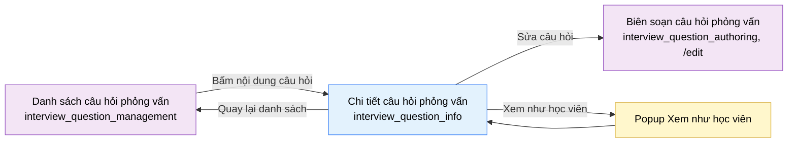

# Tài liệu thiết kế cơ bản (BD) — Chi tiết câu hỏi phỏng vấn, chỉ đọc (`SHR0303`)

## Phương châm tài liệu [Nội bộ — không cần khách duyệt]

- Viết theo **mẫu 9 sheet**. Bộ thẻ đóng, quy ước ID, ký hiệu chuẩn, ranh giới với tài liệu khác và
  checklist kiểm toán nằm ở `02-bd/_rules/bd-template-9sheet.md` — file này không chép lại.
- Phần gắn nhãn `[Nội bộ]` phục vụ sinh mã và tự kiểm toán, không phải yêu cầu của khách hàng: mục 4.5,
  mục 7.3 và các ghi chú quy ước.
- Mã màn `SHR0303`, slug `interview_question_info`, tách ra từ `SHR0302` ngày 2026-10-02
  (`DEC-2026-1002-split-detail-and-edit-pages`) [Nguồn: 01-rd/screens/shared/SHR0303_interview_question_info.md:3-6].
  Bảng mã ở `02-bd/_rules/bd-template-9sheet.md` mục 8 đã có dòng `SHR0303` (thêm 2026-10-02).
- Màn **chỉ đọc**, không có nhập liệu, không có popup riêng. Mọi sự kiện ngoài khởi tạo đều là điều hướng.
  Dữ liệu dùng lại DTO `GetInterviewQuestionDetail` của `SHR0302`, **không định nghĩa lại**
  [Nguồn: 02-bd/screens/shared/SHR0302_interview_question_authoring.md:520-535, 557; 01-rd/screens/shared/SHR0303_interview_question_info.md:74-75].
- Màn **chưa có mockup** ở `09-layoutBase/` (`[Đợi nextjs]`). Đã có bản dựng UI thật ở
  `05-coding/frontend/src/views/shared/interview-question-info/`, tự nhận "PROTOTYPE — no DD yet"
  [Nguồn: 05-coding/frontend/src/views/shared/interview-question-info/ui/interview-question-info-view.tsx:1]. BD này mô tả đúng cái đã dựng; dữ liệu là mock, không có API thật, nên endpoint chỉ ghi tên nghiệp vụ và trỏ tới `03-dd/api/interview-bank.md` là nơi sẽ giữ hợp đồng.
- Dựng cho cả hai khu: khu Admin (`/admin/interview-questions/[questionId]`) từ 2026-10-02, khu Giảng viên (`/instructor/interview-questions/[questionId]`) từ 2026-10-03, cùng một view; khác nhau ở prop bắt buộc `basePath` (đường dẫn gốc của khu đang mount) nên liên kết quay lại và liên kết `/edit` không cố định `/admin`
  [Nguồn: 01-rd/screens/shared/SHR0303_interview_question_info.md:52-54;
  05-coding/frontend/src/views/shared/interview-question-info/ui/interview-question-info-view.tsx:31-36;
  05-coding/frontend/src/app/(admin)/admin/interview-questions/[questionId]/page.tsx:1-10;
  05-coding/frontend/src/app/(instructor)/instructor/interview-questions/[questionId]/page.tsx:1-12].
- Nội dung câu hỏi hiển thị dưới dạng Markdown và công thức LaTeX đã dựng qua thành phần dùng chung `shared/ui/markdown-preview` (cập nhật 2026-10-03); văn bản gốc chỉ có ở form soạn `SHR0302`
  [Nguồn: 01-rd/screens/shared/SHR0303_interview_question_info.md:68; 05-coding/frontend/src/shared/ui/data/markdown-preview.tsx:1-6, 20-40].

> Đọc cùng `01-rd/screens/shared/SHR0303_interview_question_info.md` (hành vi ở mức yêu cầu), màn anh em
> `02-bd/screens/shared/SHR0302_interview_question_authoring.md`, màn cha
> `02-bd/screens/shared/SHR0301_interview_question_management.md`, và ba file BD module:
> `02-bd/architecture/interview-bank.md`, `02-bd/database/interview-bank.md`, `02-bd/security/interview-bank.md`.

---

## Sheet 1. Bìa

| Mục | Giá trị |
| :--- | :--- |
| Hệ thống | AlgoPrep |
| Phân hệ | `interview-bank` (F6) |
| Công đoạn | BD — Thiết kế cơ bản |
| Phân loại | Màn hình |
| Tên màn | Chi tiết câu hỏi phỏng vấn (chỉ đọc) |
| Mã màn hình | `SHR0303` |
| Tên vật lý (slug) | `interview_question_info` |
| Trục tài liệu | Màn hình (`02-bd/screens/`) |
| Actor | A2 (`INSTRUCTOR`) / A3 (`ADMIN`) — dùng chung; dựng cho cả hai khu |
| Phiên bản | V0.2 |
| Người tạo | Nhóm phát triển AlgoPrep |
| Ngày tạo | 2026/10/02 |
| Người cập nhật | Nhóm phát triển AlgoPrep |
| Ngày cập nhật | 2026/10/03 |

---

## Sheet 2. Lịch sử sửa đổi

| Ver | Sheet bị sửa | Nội dung sửa | Ngày | Người sửa |
| :--- | :--- | :--- | :--- | :--- |
| V0.1 | Toàn bộ | Tạo mới theo mẫu 9 sheet, theo `DEC-2026-1002-split-detail-and-edit-pages`: trang chỉ đọc tách khỏi form soạn `SHR0302`. Đối chiếu bản dựng UI `interview-question-info-view.tsx`. Phát sinh Q2, Q3 (nguồn hai chỉ số sử dụng); Q1 của RD (mã đã xoá mềm) giữ mở | 2026/10/02 | AI |
| V0.2 | Sheet 3, 4, 5, 7, 8 | Đồng bộ với bản dựng ngày 2026-10-03: (1) **nội dung câu hỏi hiển thị dưới dạng Markdown và công thức LaTeX đã dựng** (`MarkdownPreview`: GFM, `$...$`, `$$...$$`; HTML thô gõ trong nội dung hiện như văn bản, không dựng thành phần tử) — thay cho "hiển thị thô, chưa kết xuất Markdown" của V0.1, đóng phần "DD chốt có kết xuất hay không" ở Sheet 5 Khu vực B NO 1; (2) khu Giảng viên đã dựng cùng cấu trúc khu Admin; view nhận prop bắt buộc `basePath`, liên kết quay lại và liên kết `/edit` dựng từ `basePath` thay vì cố định `/admin`; (3) làm mới dẫn chiếu dòng tới bản dựng, RD (thêm REQ-5), `02-bd/database/interview-bank.md` (bảng `question_topics` thêm lên đầu nên các dòng cũ lệch) và các BD anh em. Không đổi DTO | 2026/10/03 | AI |

---

## Sheet 3. Sơ đồ chuyển màn

> [Nội bộ] Quy ước vẽ: bố trí từ trái sang phải. Màn gọi tới tô tím, màn hiện tại tô xanh nhạt, popup tô
> vàng. Màu và `[Nguồn:]` dùng để truy vết, không phải yêu cầu của khách hàng.

### 3.1 Danh sách chuyển màn

#### Danh sách câu hỏi phỏng vấn → Chi tiết câu hỏi phỏng vấn

[Điều kiện mở] Bấm vào nội dung câu hỏi ở cột "Câu hỏi" của một dòng trong `interview_question_management` (khu Admin hoặc khu Giảng viên).

[Chế độ mở] Chỉ đọc. Tham số route `questionId` là mã câu hỏi (ví dụ `IQ-014`).

[Thông tin truyền] Mã câu hỏi của dòng được chọn.

[Giá trị trả về] Không có.

[Khi thành công] Tiêu đề "Câu hỏi {mã}", phụ đề là tên chủ đề; hiển thị nội dung, câu hỏi đào sâu, bộ tiêu chí, phân loại và sử dụng. Mã không tồn tại thì hiện trạng thái "Không tìm thấy câu hỏi" kèm nút quay lại.

[Khi huỷ] Không có.

[Nguồn: 01-rd/screens/shared/SHR0303_interview_question_info.md:66-67; 05-coding/frontend/src/views/shared/interview-question-management/ui/interview-question-management-view.tsx:120-125; 05-coding/frontend/src/views/shared/interview-question-info/ui/interview-question-info-view.tsx:31-36, 42-56]

#### Chi tiết câu hỏi phỏng vấn → Danh sách câu hỏi phỏng vấn

[Điều kiện mở] Bấm nút biểu tượng mũi tên "Quay lại danh sách" ở bên trái tiêu đề (cũng có ở trạng thái không tìm thấy).

[Chế độ mở] Không có.

[Thông tin truyền] Không có.

[Giá trị trả về] Không có.

[Khi thành công] Điều hướng về `basePath` của khu đang mount (`/admin/interview-questions` hoặc `/instructor/interview-questions`).

[Khi huỷ] Không có.

[Nguồn: 01-rd/screens/shared/SHR0303_interview_question_info.md:19-20, 55; 05-coding/frontend/src/views/shared/interview-question-info/ui/interview-question-info-view.tsx:48, 63]

#### Chi tiết câu hỏi phỏng vấn → Biên soạn câu hỏi phỏng vấn (đang sửa)

[Điều kiện mở] Bấm nút "Sửa câu hỏi" ở bên phải thanh đầu trang.

[Chế độ mở] Chế độ sửa của `interview_question_authoring`, route `{basePath}/[questionId]/edit` (`/admin/interview-questions/[questionId]/edit` hoặc `/instructor/interview-questions/[questionId]/edit`).

[Thông tin truyền] Mã câu hỏi đang xem.

[Giá trị trả về] Không có.

[Khi thành công] Mở form soạn nạp sẵn dữ liệu câu hỏi đó (`SHR0302`, EVT-2).

[Khi huỷ] Không có.

[Nguồn: 01-rd/screens/shared/SHR0303_interview_question_info.md:66; 05-coding/frontend/src/views/shared/interview-question-info/ui/interview-question-info-view.tsx:71-73; 05-coding/frontend/src/app/(admin)/admin/interview-questions/[questionId]/edit/page.tsx:3-11; 05-coding/frontend/src/app/(instructor)/instructor/interview-questions/[questionId]/edit/page.tsx:3-11]

#### Chi tiết câu hỏi phỏng vấn → Popup Xem như học viên

[Điều kiện mở] Bấm nút "Xem như học viên" ở bên phải thanh đầu trang.

[Chế độ mở] Chế độ chỉ xem.

[Thông tin truyền] Dữ liệu câu hỏi đang hiển thị.

[Giá trị trả về] Không có.

[Khi thành công] **Bản dựng chưa gắn hành vi** (nút không có xử lý bấm). Thiết kế: dùng lại popup đã đặc tả ở `SHR0302` Sheet 5 mục "Popup Xem như học viên"; nguồn dữ liệu là bản ghi đã lưu, không phải form nháp `[SoT: Suy luận]` — màn này không có form để có dữ liệu chưa lưu.

[Khi huỷ] Không có.

[Nguồn: 01-rd/screens/shared/SHR0303_interview_question_info.md:35; 05-coding/frontend/src/views/shared/interview-question-info/ui/interview-question-info-view.tsx:68-70]

### 3.2 Sơ đồ

[Nguồn: 01-rd/screens/shared/SHR0303_interview_question_info.md:19-20, 64-67]

---

## Sheet 4. Bố cục màn hình

### 4.1 Tổng quan màn

[Mục đích màn] Cho A3 và A2 xem một câu hỏi trong ngân hàng mà không có nguy cơ sửa nhầm: nội
dung, câu hỏi đào sâu, bộ tiêu chí có trọng số, phân loại và số liệu sử dụng
[Nguồn: 01-rd/screens/shared/SHR0303_interview_question_info.md:13-17].

[Luồng nghiệp vụ chính]

1. **Hiển thị ban đầu**: nạp câu hỏi theo mã trên route và danh mục chủ đề; hiển thị chỉ đọc 6 khối: nội dung,
   câu hỏi đào sâu, bộ tiêu chí (kèm tổng trọng số), phân loại (chủ đề, độ khó), sử dụng (số lần dùng, điểm
   trung bình, trạng thái Chế độ luyện). Mã không tồn tại thì hiện "Không tìm thấy câu hỏi" kèm nút quay lại.
2. **Bộ trống**: không có câu hỏi đào sâu thì hiện dòng "Chưa có câu hỏi đào sâu."; không có tiêu chí thì hiện
   ghi chú "Chưa có tiêu chí đánh giá" và trạng thái Chế độ luyện là "Chưa mở, thiếu rubric".
3. **Điều hướng**: "Quay lại danh sách", "Sửa câu hỏi" (sang `SHR0302` tại `/edit`), "Xem như học viên".

[Người dùng] A2 hoặc A3 đã đăng nhập, có Function `INTERVIEW_BANK_MANAGEMENT`; ngân hàng dùng chung nên thấy toàn
bộ câu hỏi [Nguồn: 01-rd/screens/shared/SHR0303_interview_question_info.md:36; 02-bd/security/interview-bank.md:34-43].

[Tệp liên quan] Không có.

[Phạm vi]
- Không có sửa, nhân bản, xoá mềm — thuộc `SHR0302` và `SHR0301`
  [Nguồn: 01-rd/screens/shared/SHR0303_interview_question_info.md:44].
- Không hiển thị ý cần nói, từ khoá cốt lõi, khung trả lời chuẩn, lịch sử luyện — thuộc `USR0402`
  [Nguồn: 01-rd/screens/shared/SHR0303_interview_question_info.md:45]. Bản dựng có sẵn các trường đó trong mock nhưng màn không đọc.
- Không có quản lý chủ đề — popup của `SHR0301`, chỉ ADMIN.
- Q1 của RD (mã câu hỏi đã xoá mềm: không tìm thấy hay chỉ đọc kèm nhãn "đã ngừng dùng") **còn mở**, BD không chốt;
  bản dựng hiện chỉ có nhánh "không tìm thấy" cho mã không có trong mock
  [Nguồn: 01-rd/screens/shared/SHR0303_interview_question_info.md:96; 05-coding/frontend/src/views/shared/interview-question-info/ui/interview-question-info-view.tsx:42-56].

[Quyền sử dụng]
- Xem: được, khi có `INTERVIEW_BANK_MANAGEMENT:READ`.
- Thêm, sửa, xoá: không có thao tác ghi nào ở màn này.

[Số bản ghi tối đa] Một câu hỏi tại một thời điểm. Câu hỏi đào sâu và tiêu chí không giới hạn số dòng, hiển thị hết,
không phân trang (cùng quy tắc `SHR0302` Q1, Q4 đã chốt 2026-10-01).

[Nguồn: 01-rd/screens/shared/SHR0303_interview_question_info.md:11-36; 02-bd/database/interview-bank.md:30-74]

### 4.2 DTO liên quan

- `InterviewQuestionDto`, `AnswerRubricDto`, `QuestionTopicDto` — **dùng lại nguyên** của `SHR0302`
  (`02-bd/screens/shared/SHR0302_interview_question_authoring.md` Sheet 7.1), không định nghĩa lại.
- Hai chỉ số đọc `usageCount`, `avgScore` — tên lấy từ `InterviewQuestionListItemDto` của `SHR0301`
  [Nguồn: 02-bd/screens/shared/SHR0301_interview_question_management.md:505-506]; kênh trả về xem Q3.

`[Suy luận]` — tên DTO do BD đề xuất, `03-dd/api/interview-bank.md` chốt lại.

### 4.3 Bảng dữ liệu liên quan (4)

| NO | Bảng | Ghi chú |
| --: | :--- | :--- |
| 1 | `interview_bank.interview_questions` | [Nguồn: 02-bd/database/interview-bank.md:30-54] |
| 2 | `interview_bank.answer_rubrics` | [Nguồn: 02-bd/database/interview-bank.md:56-74] |
| 3 | `interview_bank.question_topics` | Chỉ đọc, để tra nhãn chủ đề [Nguồn: 02-bd/database/interview-bank.md:8-28] |
| 4 | `interview_bank.user_answers` | Chỉ đọc, để đếm lượt dùng [Nguồn: 02-bd/database/interview-bank.md:88-110] |

### 4.4 Vùng bố cục

Màn **chưa có mockup** ở `09-layoutBase/`. Bảng dưới đối chiếu bản dựng UI thật (tự nhận "PROTOTYPE — no DD yet"),
không phải nguồn hành vi chính thức.

| Vùng | Vị trí trong bản dựng UI | Nội dung |
| :--- | :--- | :--- |
| Thanh đầu trang | `interview-question-info-view.tsx:62-76` | Nút quay lại (biểu tượng mũi tên, bên trái); tiêu đề "Câu hỏi {mã}"; phụ đề tên chủ đề; bên phải: nút "Xem như học viên", nút "Sửa câu hỏi" |
| Cột rộng — Nội dung câu hỏi | `:80-82` | Nội dung dựng dạng Markdown kèm công thức LaTeX (`MarkdownPreview`, `:81`); HTML thô hiện như văn bản |
| Cột rộng — Câu hỏi đào sâu | `:84-94` | Danh sách đánh số; trống thì một dòng thông báo |
| Cột rộng — Bộ tiêu chí đánh giá | `:96-123` | Tổng trọng số ở góc thẻ, danh sách tiêu chí (tên, trọng số); trống thì ghi chú |
| Cột hẹp — Phân loại | `:127-140` | Chủ đề, độ khó (badge) |
| Cột hẹp — Sử dụng | `:142-161` | Số lần dùng, điểm trung bình trên thang 5, trạng thái Chế độ luyện (badge) |
| Trạng thái không tìm thấy | `:44-56` | Nút quay lại, tiêu đề và nội dung "không tìm thấy" |

Lưới hai cột `lg:grid-cols-[minmax(0,1fr)_320px]`, cột hẹp dính dưới thanh đầu trang khi cuộn
[Nguồn: 05-coding/frontend/src/views/shared/interview-question-info/ui/interview-question-info-view.tsx:78, 126];
cùng khuôn với `SHR0302`. Không quy định màu sắc, khoảng cách hay typography ở BD.

### 4.5 Cấu trúc slice FSD [Nội bộ]

| Khối | Slice | Căn cứ |
| :--- | :--- | :--- |
| Trang | `views/shared/interview-question-info` | Đã dựng; slug khớp `interview_question_info` |
| Route (hai khu) | `app/(admin)/admin/interview-questions/[questionId]/page.tsx` và `app/(instructor)/instructor/interview-questions/[questionId]/page.tsx` | Đã dựng, truyền `basePath="/admin/interview-questions"` hoặc `basePath="/instructor/interview-questions"` |
| Hiển thị Markdown | `shared/ui/markdown-preview` | Đã dựng (2026-10-03): `react-markdown` + `remark-gfm` + `remark-math` + `rehype-katex`, không có `rehype-raw` nên HTML thô không được dựng [Nguồn: 05-coding/frontend/src/shared/ui/data/markdown-preview.tsx:5-6, 36-38] |
| Dữ liệu miền | `entities/interview-question` | Đã dựng: `findInterviewQuestionByCode`, `topicLabel`, `useInterviewTopics` (:12-16) |
| Popup xem như học viên | `features/interview-question-preview` (dùng chung với `SHR0302`) | Chưa gắn hành vi |

`[Suy luận]` — DD màn hình chốt lại khi viết hợp đồng API.

---

## Sheet 5. Danh sách item màn hình

> Quy ước ID, bộ thẻ và giá trị chuẩn: `02-bd/_rules/bd-template-9sheet.md` mục 2, 3, 4. Mọi item là `O` hoặc nút điều hướng; không có `I`/`I/O` nhập liệu.

### Khu vực A — Thanh đầu trang

| Khu vực | NO | Tên item | ID item | Bảng DB | Cột DB | Loại UI | Kiểu | Độ dài | Bắt buộc | I/O | Giá trị mặc định | Định dạng | Ghi chú |
| :--- | --: | :--- | :--- | :--- | :--- | :--- | :--- | :--- | :-: | :-: | :--- | :--- | :--- |
| Thanh đầu trang | | | | | | | | | | | | | |
| | 1 | Nút quay lại | `interviewQuestionInfo.header.btnBack` | - | - | Button | - | - | - | I | - | Chỉ biểu tượng mũi tên | Tooltip "Quay lại danh sách", điều hướng về `interview_question_management` [Nguồn: 05-coding/frontend/src/views/shared/interview-question-info/ui/interview-question-info-view.tsx:63]. Đích là `basePath` của khu đang mount [Nguồn giá trị] Nhãn tĩnh i18n `interviewQuestionInfo.back` [EVT liên quan] EVT-2 |
| | 2 | Tiêu đề màn | `interviewQuestionInfo.header.title` | `interview_questions` | `id` | Label | String | - | - | O | - | `Câu hỏi {mã}` | Mã lấy từ bản ghi đã nạp (mock: `question.code`, `:64`) [Nguồn giá trị] Nhãn tĩnh `interviewQuestionInfo.title`; mã hiển thị `IQ-nnn` **chưa có cột DB** — `02-bd/database/interview-bank.md:34` chỉ có `id` UUID, xem `SHR0301` Q1 đã nêu khoảng trống cùng loại [EVT liên quan] EVT-1 |
| | 3 | Phụ đề (tên chủ đề) | `interviewQuestionInfo.header.topic` | `question_topics` | `display_name` | Label | String | - | - | O | - | - | `topicLabel(topicList, question.topic)` (`:65`) [Nguồn giá trị] `InterviewQuestionDto.topicId` tra `QuestionTopicDto.displayName` [EVT liên quan] EVT-1 |
| | 4 | Xem như học viên | `interviewQuestionInfo.header.btnPreview` | - | - | Button | - | - | - | I | - | - | Nút chữ, nhãn `interviewQuestionAuthoring.previewAsLearner` (`:68-70`). **Chưa gắn hành vi** trong bản dựng [Nguồn giá trị] Nhãn tĩnh i18n [EVT liên quan] EVT-4 |
| | 5 | Sửa câu hỏi | `interviewQuestionInfo.header.btnEdit` | - | - | Button | - | - | - | I | - | - | Nút hành động chính (`variant="cta"`), liên kết tới `{basePath}/{mã}/edit` (`:71-73`) [Nguồn giá trị] Nhãn tĩnh `interviewQuestionInfo.edit` [EVT liên quan] EVT-3 |

### Khu vực B — Cột rộng (nội dung)

| Khu vực | NO | Tên item | ID item | Bảng DB | Cột DB | Loại UI | Kiểu | Độ dài | Bắt buộc | I/O | Giá trị mặc định | Định dạng | Ghi chú |
| :--- | --: | :--- | :--- | :--- | :--- | :--- | :--- | :--- | :-: | :-: | :--- | :--- | :--- |
| Cột rộng — nội dung | | | | | | | | | | | | | |
| | 1 | Nội dung câu hỏi | `interviewQuestionInfo.content.contentMarkdown` | `interview_questions` | `content_markdown` | Label | String | - | - | O | - | Markdown và LaTeX đã dựng (GFM, `$...$`, `$$...$$`) | Hiển thị qua `MarkdownPreview` (`:81`), **không phải văn bản thô**; HTML thô trong nội dung hiện như văn bản, không dựng thành phần tử; văn bản gốc chỉ có ở form soạn `SHR0302` (cập nhật 2026-10-03) [Nguồn: 05-coding/frontend/src/views/shared/interview-question-info/ui/interview-question-info-view.tsx:80-82; 05-coding/frontend/src/shared/ui/data/markdown-preview.tsx:5-6, 36-38] [Nguồn giá trị] `InterviewQuestionDto.contentMarkdown` (mock: `question.question`) [EVT liên quan] EVT-1 |
| | 2 | Danh sách câu hỏi đào sâu | `interviewQuestionInfo.followUp.list` | `interview_questions` | `follow_up_questions` | List | List | - | - | O | - | Danh sách đánh số | Mỗi phần tử một dòng (`:88-92`) [Nguồn giá trị] `InterviewQuestionDto.followUpQuestions` [EVT liên quan] EVT-1 |
| | 3 | Thông báo chưa có câu hỏi đào sâu | `interviewQuestionInfo.followUp.empty` | - | - | Label | String | - | - | O | "Chưa có câu hỏi đào sâu." | - | Thay cho danh sách khi mảng rỗng (`:86`) [Nguồn giá trị] Nhãn tĩnh `interviewQuestionInfo.followUpsEmpty` [EVT liên quan] - |
| | 4 | Tổng trọng số | `interviewQuestionInfo.rubric.totalLabel` | - | - | Label | Number | 3 | - | O | - | `Tổng {số}%` | Góc phải thẻ Bộ tiêu chí (`:99-104`) [Công thức] Cộng `weightPercent` của mọi tiêu chí (`:58`) [EVT liên quan] EVT-1 |
| | 5 | Danh sách tiêu chí | `interviewQuestionInfo.rubric.list` | `answer_rubrics` | - | List | List | - | - | O | - | - | Mỗi dòng một tiêu chí (`:111-121`) [Nguồn giá trị] Các dòng `AnswerRubricDto` theo `question_id` [EVT liên quan] EVT-1 |
| | 6 | Tên tiêu chí | `interviewQuestionInfo.rubric.col.criterionCode` | `answer_rubrics` | `criterion_code` | ListColumn | String | - | - | O | - | - | Mock: `criterion.label` (`:117`) [Nguồn giá trị] `AnswerRubricDto.criterionCode` [EVT liên quan] EVT-1 |
| | 7 | Trọng số tiêu chí | `interviewQuestionInfo.rubric.col.weightPercent` | `answer_rubrics` | `weight_percent` | ListColumn | Number | 5 | - | O | - | `{số}%` | Mock: `criterion.weight` (`:118`) [Nguồn giá trị] `AnswerRubricDto.weightPercent` [EVT liên quan] EVT-1 |
| | 8 | Thông báo chưa có tiêu chí | `interviewQuestionInfo.rubric.empty` | - | - | Label | String | - | - | O | "Chưa có tiêu chí đánh giá" | - | Ghi chú nói câu hỏi vẫn dùng được ở Chế độ học, không xuất hiện ở Chế độ luyện cho tới khi có rubric (`:106-109`) [Nguồn giá trị] Nhãn tĩnh `interviewQuestionAuthoring.rubricEmptyTitle`, `rubricEmptyBody` [EVT liên quan] - |

### Khu vực C — Cột hẹp (phân loại và sử dụng)

| Khu vực | NO | Tên item | ID item | Bảng DB | Cột DB | Loại UI | Kiểu | Độ dài | Bắt buộc | I/O | Giá trị mặc định | Định dạng | Ghi chú |
| :--- | --: | :--- | :--- | :--- | :--- | :--- | :--- | :--- | :-: | :-: | :--- | :--- | :--- |
| Cột hẹp — phân loại và sử dụng | | | | | | | | | | | | | |
| | 1 | Chủ đề | `interviewQuestionInfo.classify.topic` | `question_topics` | `display_name` | Label | String | - | - | O | - | - | Cùng nguồn Phụ đề (`:131`) [Nguồn giá trị] `InterviewQuestionDto.topicId` tra `QuestionTopicDto.displayName` [EVT liên quan] EVT-1 |
| | 2 | Độ khó | `interviewQuestionInfo.classify.difficulty` | `interview_questions` | `difficulty` | Badge | Enum | - | - | O | - | Nhãn tiếng Việt | `EASY`/`MEDIUM`/`HARD` tô thành công/cảnh báo/âm (`:29, 136`) [Nguồn giá trị] `InterviewQuestionDto.difficulty` [EVT liên quan] EVT-1 |
| | 3 | Số lần dùng trong phiên | `interviewQuestionInfo.usage.count` | `user_answers` | `question_id` | Label | Number | - | - | O | 0 | Số nguyên | Mock: `question.usageCount` (`:146`) [Công thức] Số dòng `user_answers` theo `question_id`, cùng công thức cột "Lượt dùng" của `SHR0301` [Nguồn: 02-bd/screens/shared/SHR0301_interview_question_management.md:386, 505]; kênh trả về xem Q3 [EVT liên quan] EVT-1 |
| | 4 | Điểm trung bình | `interviewQuestionInfo.usage.averageScore` | - | - | Label | Number | 3 | - | O | - | `{số} / 5`, một chữ số thập phân | Mock: `question.averageScore.toFixed(1)` (`:150`) [Nguồn giá trị] **Chưa chốt** — schema không có điểm số rời rạc (kế thừa `SHR0301` Q2), xem Q2 [EVT liên quan] EVT-1 |
| | 5 | Chế độ luyện | `interviewQuestionInfo.usage.practiceMode` | `answer_rubrics` | `question_id` | Badge | Boolean | - | - | O | - | "Mở" / "Chưa mở, thiếu rubric" | Mock: `question.hasRubric` (`:155-157`) [Công thức] Mở khi câu hỏi có ít nhất một dòng `answer_rubrics`; trùng điều kiện ẩn khỏi Chế độ luyện [Nguồn: 02-bd/database/interview-bank.md:51-54; 01-rd/screens/shared/SHR0303_interview_question_info.md:34] [EVT liên quan] EVT-1 |

### Trạng thái không tìm thấy

| Khu vực | NO | Tên item | ID item | Bảng DB | Cột DB | Loại UI | Kiểu | Độ dài | Bắt buộc | I/O | Giá trị mặc định | Định dạng | Ghi chú |
| :--- | --: | :--- | :--- | :--- | :--- | :--- | :--- | :--- | :-: | :-: | :--- | :--- | :--- |
| Trạng thái không tìm thấy | | | | | | | | | | | | | |
| | 1 | Nút quay lại (không tìm thấy) | `interviewQuestionInfo.notFound.btnBack` | - | - | Button | - | - | - | I | - | Chỉ biểu tượng mũi tên | Cùng hành vi nút quay lại ở Khu vực A (`:48`) [Nguồn giá trị] Nhãn tĩnh `interviewQuestionInfo.back` [EVT liên quan] EVT-2 |
| | 2 | Tiêu đề không tìm thấy | `interviewQuestionInfo.notFound.title` | - | - | Label | String | - | - | O | "Không tìm thấy câu hỏi" | - | Dùng chung chuỗi của `SHR0302` (`:49`) [Nguồn giá trị] Nhãn tĩnh `interviewQuestionAuthoring.notFoundTitle` [EVT liên quan] EVT-1 |
| | 3 | Nội dung không tìm thấy | `interviewQuestionInfo.notFound.body` | - | - | Label | String | - | - | O | - | "Không có câu hỏi nào mang mã {mã}..." | `:52` [Nguồn giá trị] Nhãn tĩnh `interviewQuestionAuthoring.notFoundBody` [EVT liên quan] EVT-1 |

[Nguồn: 01-rd/screens/shared/SHR0303_interview_question_info.md:29-36, 55; 02-bd/database/interview-bank.md:8-110;
05-coding/frontend/src/views/shared/interview-question-info/ui/interview-question-info-view.tsx:42-161;
05-coding/frontend/messages/vi.json:1216-1227]

---

## Sheet 6. Đặc tả điều khiển item

> Ký hiệu cột `Hiển thị` và thứ tự thẻ: `02-bd/_rules/bd-template-9sheet.md` mục 2, 3. **Màn chỉ đọc, không có kiểm tra nhập liệu.** Dùng đúng NO, tên item và thứ tự của Sheet 5.

### Khu vực A — Thanh đầu trang

| Khu vực | NO | Tên item | Hiển thị | Ghi chú |
| :--- | --: | :--- | :-: | :--- |
| Thanh đầu trang | | | | |
| | 1 | Nút quay lại | Có | [Điều kiện hiển thị] Hiển thị cả khi câu hỏi không tìm thấy. |
| | 2 | Tiêu đề màn | Có | - |
| | 3 | Phụ đề (tên chủ đề) | Có | - |
| | 4 | Xem như học viên | Có | [Điều kiện kích hoạt] Luôn kích hoạt. Bản dựng chưa có hành vi (Q4). |
| | 5 | Sửa câu hỏi | Có | [Điều kiện kích hoạt] Luôn kích hoạt khi câu hỏi tồn tại. |

### Khu vực B — Cột rộng (nội dung)

| Khu vực | NO | Tên item | Hiển thị | Ghi chú |
| :--- | --: | :--- | :-: | :--- |
| Cột rộng — nội dung | | | | |
| | 1 | Nội dung câu hỏi | Có | - |
| | 2 | Danh sách câu hỏi đào sâu | Điều kiện | [Điều kiện hiển thị] Chỉ khi có ít nhất một câu hỏi đào sâu. |
| | 3 | Thông báo chưa có câu hỏi đào sâu | Điều kiện | [Điều kiện hiển thị] Chỉ khi mảng `followUpQuestions` rỗng. |
| | 4 | Tổng trọng số | Điều kiện | [Điều kiện hiển thị] Chỉ khi có ít nhất một tiêu chí. |
| | 5 | Danh sách tiêu chí | Điều kiện | [Điều kiện hiển thị] Chỉ khi có ít nhất một tiêu chí. |
| | 6 | Tên tiêu chí | Điều kiện | [Điều kiện hiển thị] Theo từng dòng của Danh sách tiêu chí. |
| | 7 | Trọng số tiêu chí | Điều kiện | [Điều kiện hiển thị] Theo từng dòng của Danh sách tiêu chí. |
| | 8 | Thông báo chưa có tiêu chí | Điều kiện | [Điều kiện hiển thị] Chỉ khi bộ tiêu chí rỗng. |

### Khu vực C — Cột hẹp (phân loại và sử dụng)

| Khu vực | NO | Tên item | Hiển thị | Ghi chú |
| :--- | --: | :--- | :-: | :--- |
| Cột hẹp — phân loại và sử dụng | | | | |
| | 1 | Chủ đề | Có | - |
| | 2 | Độ khó | Có | - |
| | 3 | Số lần dùng trong phiên | Có | - |
| | 4 | Điểm trung bình | Có | [Điều kiện hiển thị] Bản dựng luôn hiển thị số. Khi Q2 chưa chốt nguồn dữ liệu, dùng cách xử lý của `SHR0301` (để trống, không hiển thị số 0 gây hiểu nhầm) `[SoT: Suy luận]`. |
| | 5 | Chế độ luyện | Có | [Tự động đặt] Nhãn "Mở" khi có ít nhất một tiêu chí, "Chưa mở, thiếu rubric" khi bộ tiêu chí rỗng. |

### Trạng thái không tìm thấy

| Khu vực | NO | Tên item | Hiển thị | Ghi chú |
| :--- | --: | :--- | :-: | :--- |
| Trạng thái không tìm thấy | | | | |
| | 1 | Nút quay lại (không tìm thấy) | Điều kiện | [Điều kiện hiển thị] Chỉ khi mã trên route không có câu hỏi. Thay thế toàn bộ Khu vực A đến C. |
| | 2 | Tiêu đề không tìm thấy | Điều kiện | [Điều kiện hiển thị] Như trên. |
| | 3 | Nội dung không tìm thấy | Điều kiện | [Điều kiện hiển thị] Như trên. |

---

## Sheet 7. Danh sách truyền dữ liệu

### 7.1 Trường DTO

Dùng lại nguyên `GetInterviewQuestionDetail` và các DTO của `SHR0302` Sheet 7.1
(`02-bd/screens/shared/SHR0302_interview_question_authoring.md:520-535`) — **không định nghĩa lại**. Bảng dưới chỉ ánh xạ trường tới item của màn này.

| NO | DTO | Trường DTO | Kiểu | Bảng DB | Cột DB | Item màn | Hiển thị | Ghi chú |
| --: | :--- | :--- | :--- | :--- | :--- | :--- | :-: | :--- |
| 1 | `InterviewQuestionDto` | `topicId` | UUID | `interview_questions` | `topic_id` | Phụ đề, Chủ đề | Có | [Chuyển đổi] Tra `QuestionTopicDto.displayName` |
| 2 | `InterviewQuestionDto` | `difficulty` | Enum | `interview_questions` | `difficulty` | Độ khó | Có | [Chuyển đổi] Đổi sang nhãn tiếng Việt |
| 3 | `InterviewQuestionDto` | `contentMarkdown` | String | `interview_questions` | `content_markdown` | Nội dung câu hỏi | Có | - |
| 4 | `InterviewQuestionDto` | `followUpQuestions` | `String[]` | `interview_questions` | `follow_up_questions` | Danh sách câu hỏi đào sâu | Có | - |
| 5 | `AnswerRubricDto` | `criterionCode`, `weightPercent` | String, Number | `answer_rubrics` | `criterion_code`, `weight_percent` | Tên tiêu chí, Trọng số tiêu chí | Có | [Chuyển đổi] Tổng trọng số và trạng thái Chế độ luyện tính phía giao diện từ danh sách tiêu chí |
| 6 | `QuestionTopicDto` | `id`, `displayName` | UUID, String | `question_topics` | `id`, `display_name` | Chủ đề (tra nhãn) | Có | [Nguồn] Phản hồi của `ListQuestionTopics` |
| 7 | Chỉ số sử dụng (chưa đặt tên DTO — Q3) | `usageCount` | Number | `user_answers` | `question_id` | Số lần dùng trong phiên | Có | [Nguồn] Cùng read model đếm `user_answers` như `InterviewQuestionListItemDto.usageCount` của `SHR0301` |
| 8 | Chỉ số sử dụng (chưa đặt tên DTO — Q3) | `avgScore` | Number | - | - | Điểm trung bình | Có | [Nguồn] **Chưa chốt** (Q2) |
| 9 | `InterviewQuestionDto` | `id`, `status` | UUID, Enum | `interview_questions` | `id`, `status` | - | Không | Không hiển thị. `id` dùng dựng đường dẫn `/edit`; `status` liên quan Q1 |

### 7.2 Truy cập bảng dữ liệu (4)

| NO | Tên logic | Bảng | Repository | CRUD | Mục đích | Ghi chú |
| --: | :--- | :--- | :--- | :-: | :--- | :--- |
| 1 | Câu hỏi phỏng vấn | `interview_bank.interview_questions` | `InterviewQuestionRepository` | R | Đọc nội dung, độ khó, câu hỏi đào sâu | `GetInterviewQuestionDetail`: R |
| 2 | Bộ tiêu chí đánh giá | `interview_bank.answer_rubrics` | `AnswerRubricRepository` | R | Đọc tiêu chí và trọng số | `GetInterviewQuestionDetail`: R |
| 3 | Danh mục chủ đề | `interview_bank.question_topics` | `QuestionTopicRepository` | R | Tra nhãn chủ đề | `ListQuestionTopics`: R |
| 4 | Lượt luyện tập | `interview_bank.user_answers` | `UserAnswerRepository` | R | Đếm lượt dùng | Kênh trả về xem Q3 |

Không có thao tác C, U, D ở màn này. Màn không ghi `system_audit_logs`.
`[Suy luận]` — tên repository theo `SHR0302` Sheet 7.2, DD chốt lại.

### 7.3 Danh sách endpoint [Nội bộ]

> Chỉ tên nghiệp vụ và BC sở hữu. Hợp đồng thuộc `03-dd/api/interview-bank.md` (chưa viết cho màn này; bản dựng dùng dữ liệu mock, không có API thật).

| NO | Endpoint (tên nghiệp vụ) | Mục đích | BC sở hữu |
| --: | :--- | :--- | :--- |
| 1 | `ListQuestionTopics` | Tải danh mục chủ đề để tra nhãn | `interview-bank` |
| 2 | `GetInterviewQuestionDetail` | Tải chi tiết một câu hỏi kèm tiêu chí, câu hỏi đào sâu; dùng lại của `SHR0302` | `interview-bank` |

Không có endpoint riêng cho màn này. Hai chỉ số sử dụng đi kèm `GetInterviewQuestionDetail` hay một lời gọi riêng: Q3.

[Nguồn: 02-bd/screens/shared/SHR0302_interview_question_authoring.md:554-557]

---

## Sheet 8. Danh sách sự kiện

> Bộ thẻ và quy ước cột `Chuyển màn`: `02-bd/_rules/bd-template-9sheet.md` mục 2, 3.

### Màn chính: Chi tiết câu hỏi phỏng vấn

| NO | Loại | Sự kiện | Chi tiết | Chuyển màn | Gọi API | Tên xử lý | Ghi chú |
| --: | :--- | :--- | :--- | :-: | :-: | :--- | :--- |
| 1 | Màn hình | Khởi tạo màn | Vào màn từ liên kết nội dung câu hỏi ở danh sách, tham số route là mã câu hỏi. | Không | Có | `ListQuestionTopics`, `GetInterviewQuestionDetail` | [Các bước] 1. Kiểm tra quyền `INTERVIEW_BANK_MANAGEMENT`. 2. Tải song song danh mục chủ đề và chi tiết câu hỏi. 3. Hiển thị các khối chỉ đọc. [Khi thành công] Hiển thị đầy đủ dữ liệu. [Khi lỗi] Không tìm thấy câu hỏi hoặc lỗi tải: hiển thị trạng thái không tìm thấy kèm nút quay lại; xử lý mã đã xoá mềm chờ Q1. |
| 2 | Nút | Quay lại danh sách | Bấm nút mũi tên "Quay lại danh sách" ở bên trái tiêu đề (kể cả ở trạng thái không tìm thấy). | Có | Không | - | [Các bước] 1. Điều hướng về `interview_question_management` (`/admin/interview-questions`). [Khi thành công] Rời màn. |
| 3 | Nút | Sửa câu hỏi | Bấm "Sửa câu hỏi" ở bên phải thanh đầu trang. | Có | Không | - | [Các bước] 1. Điều hướng sang `interview_question_authoring` ở chế độ sửa, route `/edit`, mang theo mã câu hỏi. [Khi thành công] Mở form soạn nạp sẵn dữ liệu. |
| 4 | Nút | Mở xem như học viên | Bấm "Xem như học viên" ở bên phải thanh đầu trang. | Không | Không | - | [Các bước] 1. Mở popup xem trước theo bản ghi đã lưu (đề xuất, chưa chốt). [Khi thành công] Bản dựng chưa làm gì khi bấm (stub); popup do `SHR0302` đặc tả. |

[Nguồn: 01-rd/screens/shared/SHR0303_interview_question_info.md:19-20, 64-67;
05-coding/frontend/src/views/shared/interview-question-info/ui/interview-question-info-view.tsx:31-76]

---

## Sheet 9. Đặc tả kiểm tra

> Bộ thẻ và quy ước mã thông báo: `02-bd/_rules/bd-template-9sheet.md` mục 2, 4. Màn chỉ đọc nên **không có kiểm nhập liệu**. Tiêu chí nghiệm thu `AC-nn` thuộc `04-tdd/interview_question_info.md`.

| NO | Loại | Tóm tắt kiểm | Chi tiết | Mức | Mã thông báo | Ghi chú | EVT gọi | Thứ tự |
| --: | :--- | :--- | :--- | :--- | :--- | :--- | :--- | :-: |
| 1 | Kiểm quyền | Quyền truy cập màn | [Nội dung kiểm] Người dùng không có Function `INTERVIEW_BANK_MANAGEMENT` thì không được vào màn. [Nơi thực thi] Chặn ở cả tầng định tuyến phía giao diện và tầng phân quyền phía máy chủ. | Lỗi | Chưa có mã thông báo | Nội dung "Bạn không có quyền truy cập chức năng này." (cùng nội dung `SHR0302`). | EVT-1 | 1 |
| 2 | Kiểm nghiệp vụ | Câu hỏi không tồn tại | [Nội dung kiểm] Mã trên route không có câu hỏi thì hiển thị trạng thái không tìm thấy thay cho nội dung. [Nơi thực thi] Màn hình theo phản hồi máy chủ. | Lỗi | Chưa có mã thông báo | Nội dung "Không có câu hỏi nào mang mã {mã}. Có thể nó đã bị gỡ khỏi ngân hàng." Câu hỏi đã xoá mềm (`RETIRED`) thuộc trường hợp này hay không: Q1 của RD, **chưa chốt**. | EVT-1 | 2 |
| 3 | Kiểm nghiệp vụ | Lỗi hệ thống hoặc lỗi gọi máy chủ | [Nội dung kiểm] Gọi máy chủ thất bại thì dừng hiển thị, giữ trạng thái lỗi. [Nơi thực thi] Màn hình. | Lỗi | Mã lỗi trong phản hồi | Phản hồi có mã lỗi đã đăng ký thì hiển thị nội dung tương ứng; chưa đăng ký thì hiển thị "Không kết nối được máy chủ." | EVT-1 | 3 |

Cột `Thứ tự` là thứ tự kiểm trong cùng một sự kiện.

[Nguồn: 01-rd/screens/shared/SHR0303_interview_question_info.md:36, 55-56; 02-bd/security/interview-bank.md:34-43]

---

## Câu hỏi mở

| # | Câu hỏi | Vì sao chưa trả lời được | Chủ sở hữu |
| :-: | :--- | :--- | :--- |
| Q1 | (Kế thừa Q1 của RD) Mở trang bằng mã của câu hỏi đã xoá mềm thì hiện "không tìm thấy", hay hiện chỉ đọc kèm nhãn "đã ngừng dùng"? **BD không quyết, giữ mở.** | RD để mở [Nguồn: 01-rd/screens/shared/SHR0303_interview_question_info.md:96]. Bản dựng chỉ có nhánh "không tìm thấy" cho mã không có trong mock, chưa mô phỏng `RETIRED`. Nếu chọn phương án hiện chỉ đọc kèm nhãn thì Sheet 5, 6, 8, 9 cần thêm một item nhãn trạng thái và `status` thành trường hiển thị. | Chủ dự án |
| Q2 | "Điểm trung bình" lấy từ đâu? Kế thừa `SHR0301` Q2: `user_answers.feedback_result_json` không có điểm số rời rạc 1-5. | [Nguồn: 02-bd/screens/shared/SHR0301_interview_question_management.md:622]. Màn này hiển thị số mock `3.8 / 5` mà chưa có công thức. Chốt một lần cho cả hai màn, không chốt riêng ở đây. | DD `interview-bank` |
| Q3 | Hai chỉ số sử dụng (`usageCount`, `avgScore`) đi kèm phản hồi `GetInterviewQuestionDetail` (mở rộng DTO của `SHR0302`) hay lấy qua lời gọi riêng? | BD này không thêm endpoint. Mở rộng `GetInterviewQuestionDetail` sẽ đổi DTO mà `SHR0302` đang dùng để sửa (form soạn không cần hai chỉ số); tách riêng thêm một lời gọi. Hai phương án đều hợp lệ về kiến trúc `[SoT: Suy luận]`, DD chốt. | DD `interview-bank` |
| Q4 | Nút "Xem như học viên" ở màn chỉ đọc mở popup nào, dữ liệu từ bản ghi đã lưu? Hiện bản dựng là stub. | Kế thừa `SHR0302` Q2 (nguồn dữ liệu popup xem trước chưa chốt) [Nguồn: 02-bd/screens/shared/SHR0302_interview_question_authoring.md:629; 05-coding/frontend/src/views/shared/interview-question-info/ui/interview-question-info-view.tsx:68-70]. | DD màn hình |
| Q5 | Mã hiển thị `IQ-nnn` ở tiêu đề lấy từ cột nào? | Schema chỉ có `id` UUID, không có cột mã dạng `IQ-014` [Nguồn: 02-bd/database/interview-bank.md:34]; cùng khoảng trống với `SHR0301`/`SHR0302`. | DD `interview-bank` |

**Nợ prototype**: bản dựng tự trỏ tới `06-plan/PROTOTYPE_DEBT.md` mục 9
[Nguồn: 05-coding/frontend/src/views/shared/interview-question-info/ui/interview-question-info-view.tsx:1]; chưa kiểm tra mục đó đã có dòng riêng cho slug `interview_question_info` hay chưa (file nằm ngoài phạm vi đợt sửa này).
