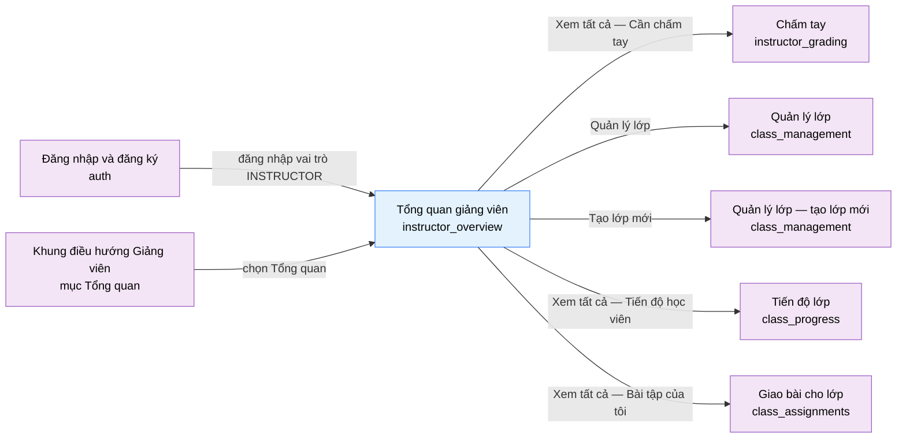

# Tài liệu thiết kế cơ bản (BD) — Tổng quan giảng viên (`INS0101`)

## Phương châm tài liệu [Nội bộ — không cần khách duyệt]

- Viết theo **mẫu 9 sheet**. Bộ thẻ đóng, quy ước ID, ký hiệu chuẩn, ranh giới với tài liệu khác và
  checklist kiểm toán nằm ở `02-bd/_rules/bd-template-9sheet.md` — file này không chép lại.
- Phần gắn nhãn `[Nội bộ]` phục vụ sinh mã và tự kiểm toán, không phải yêu cầu của khách hàng: mục 4.5,
  mục 7.3 và các ghi chú quy ước.
- Mã màn `INS0101` theo bảng mã ở `02-bd/_rules/bd-template-9sheet.md` mục 8; tên file mang tiền tố mã.
- Màn này **không có popup nào** và không có màn con của riêng nó — mọi tương tác đi tiếp đều là chuyển
  sang một màn khác của khu Giảng viên.

> Đọc cùng `01-rd/screens/teacher/INS0101_instructor_overview.md` (hành vi ở mức yêu cầu, không lặp lại ở
> đây), `02-bd/screens/teacher/_shell.md` (khung điều hướng dùng chung khu Giảng viên) và ba file BD module:
> `02-bd/database/identity.md`, `02-bd/database/problem-bank.md`, `02-bd/database/ai-review.md`.
>
> **Không mô tả lại sidebar, nút thu gọn, công tắc theme và khối danh tính ở đáy sidebar** — thuộc
> `02-bd/screens/teacher/_shell.md` mục 3. Ngược lại, **hàng công cụ đầu màn (ô tìm kiếm + nút "Tạo lớp
> mới" + avatar) là item của chính màn này**, vì khu Giảng viên không có toolbar dùng chung
> [Nguồn: 02-bd/screens/teacher/_shell.md:113-114].
>
> **Không thiết kế** bất cứ đường dẫn nào liên quan tới "học viên yêu cầu review" — đã loại khỏi phạm vi
> theo `DEC-2026-0830-remove-student-review-request`, dù prototype còn chữ này ở ba chỗ
> [Nguồn: 09-layoutBase/Giáo viên - Tổng quan.dc.html:146,317,325]. Xem Câu hỏi mở Q1.
>
> **Không thiết kế** bất cứ hành động chấm lại nào — `DEC-2026-0828-remove-rejudge-scope`.

---

## Sheet 1. Bìa

| Mục | Giá trị |
| :--- | :--- |
| Hệ thống | AlgoPrep |
| Phân hệ | `identity` (F1) — màn tổng hợp, đọc thêm số liệu của `problem-bank` (F2), `judge-orchestration` (F4), `ai-review` (F5) |
| Công đoạn | BD — Thiết kế cơ bản |
| Phân loại | Màn hình |
| Tên màn | Tổng quan giảng viên |
| Mã màn hình | `INS0101` |
| Tên vật lý (slug) | `instructor_overview` |
| Trục tài liệu | Màn hình (`02-bd/screens/`) |
| Actor | A2 (`INSTRUCTOR`) |
| Phiên bản | V0.2 |
| Người tạo | Nhóm phát triển AlgoPrep |
| Ngày tạo | 2026/09/21 |
| Người cập nhật | Nhóm phát triển AlgoPrep |
| Ngày cập nhật | 2026/10/03 |

---

## Sheet 2. Lịch sử sửa đổi

| Ver | Sheet bị sửa | Nội dung sửa | Ngày | Người sửa |
| :--- | :--- | :--- | :--- | :--- |
| V0.1 | Toàn bộ | Tạo mới theo mẫu 9 sheet. Màn BD đầu tiên của khu Giảng viên. Chốt nguồn dữ liệu cho mọi trường hiển thị của 6 khối dashboard, phát hiện 3 khoảng trống nguồn dữ liệu thật (phạm vi feed hoạt động, chỉ số "Hoàn thành TB" theo lớp, "lượt dùng" của bài tập) và 4 điểm prototype lạc hậu so với quyết định ACTIVE | 2026/09/21 | Nhóm phát triển AlgoPrep |
| V0.2 | Sheet 4, 5, 7 | Đồng bộ `DEC-2026-1001-admin-configurable-settings` mục (7): độ khó bài tập là danh mục do ADMIN quản lý (bảng riêng `problem_levels`), không còn enum cố định. Dòng meta khối "Bài tập của tôi" đọc `display_name` của mức qua `problems.level_id`; `AssignedProblemSummaryDto.difficulty` thành `levelCode`/`levelDisplayName`; thêm `problem.problem_levels` vào bảng liên quan và Truy cập bảng. Màn chỉ hiển thị nhãn, không lọc và không gọi `ListProblemLevels` (nhãn nằm sẵn trong phản hồi); độ khó không gắn logic nào | 2026/10/03 | AI |

---

## Sheet 3. Sơ đồ chuyển màn

> [Nội bộ] Quy ước vẽ: bố trí từ trái sang phải. Màn gọi tới tô tím, màn hiện tại tô xanh nhạt, màn đi tiếp
> tô tím. Màu và `[Nguồn:]` dùng để truy vết, không phải yêu cầu của khách hàng. Màn này không có popup.

### 3.1 Danh sách chuyển màn

#### Đăng nhập và đăng ký → Tổng quan giảng viên

[Điều kiện mở] Đăng nhập thành công với tài khoản có vai trò `INSTRUCTOR`. Đây là trang đích mặc định của
vai trò này [Nguồn: 01-rd/screens/shared/SHR0101_auth.md:94]. Lưu ý: RD của màn trích dòng 90 cho cùng ý
này [Nguồn: 01-rd/screens/teacher/INS0101_instructor_overview.md:17-18], nhưng dòng 90 là Q1 (lỗi đăng nhập
inline) — nội dung điều hướng theo vai trò nằm ở dòng 94. Xem Câu hỏi mở Q13.

[Chế độ mở] Không có.

[Thông tin truyền] Không có. Danh tính lấy từ phiên đăng nhập, **không nhận `instructor_id` từ phía giao
diện** (xem Sheet 9 NO 2).

[Giá trị trả về] Không có.

[Khi thành công] Hiển thị 6 khối dashboard, mỗi khối tự tải dữ liệu và tự có trạng thái riêng.

[Khi huỷ] Không có.

#### Khung điều hướng Giảng viên → Tổng quan giảng viên

[Điều kiện mở] Chọn mục "Tổng quan" trong danh sách điều hướng bên trái
[Nguồn: 02-bd/screens/teacher/_shell.md:72].

[Chế độ mở] Không có.

[Thông tin truyền] Không có.

[Giá trị trả về] Không có.

[Khi thành công] Tải lại toàn bộ 6 khối và làm mới badge trên thanh điều hướng — quyết định đã chốt là làm
mới khi chuyển màn hoặc tải lại trang, không mở kênh WebSocket riêng cho badge
[Nguồn: 01-rd/req/identity.md:177-178].

[Khi huỷ] Không có.

#### Tổng quan giảng viên → Chấm tay

[Điều kiện mở] Bấm liên kết "Xem tất cả" ở đầu khối "Cần chấm tay".

[Chế độ mở] Không có.

[Thông tin truyền] Không có. Màn `instructor_grading` tự dựng lại hàng đợi đầy đủ của nó
[Nguồn: 02-bd/database/ai-review.md:223-233].

[Giá trị trả về] Không có.

[Khi thành công] Điều hướng sang màn `instructor_grading`.

[Khi huỷ] Không có.

#### Tổng quan giảng viên → Quản lý lớp

[Điều kiện mở] Bấm liên kết "Quản lý lớp" ở đầu khối "Lớp của tôi".

[Chế độ mở] Chế độ danh sách, không chọn sẵn lớp nào.

[Thông tin truyền] Không có.

[Giá trị trả về] Không có.

[Khi thành công] Điều hướng sang màn `class_management`.

[Khi huỷ] Không có.

#### Tổng quan giảng viên → Quản lý lớp (chế độ tạo lớp mới)

[Điều kiện mở] Bấm nút "Tạo lớp mới" ở hàng công cụ đầu màn.

[Chế độ mở] Chế độ tạo mới. Đích đến này là **đề xuất của BD**, prototype để nút trống không gắn `href`
[Nguồn: 09-layoutBase/Giáo viên - Tổng quan.dc.html:121] — xem Câu hỏi mở Q2.

[Thông tin truyền] Cờ yêu cầu mở ngay biểu mẫu tạo lớp trên màn `class_management`.

[Giá trị trả về] Không có. Màn tổng quan không chờ kết quả — người dùng ở lại `class_management` sau khi tạo.

[Khi thành công] Điều hướng sang màn `class_management` với biểu mẫu tạo lớp đã mở.

[Khi huỷ] Không có.

#### Tổng quan giảng viên → Tiến độ lớp

[Điều kiện mở] Bấm liên kết "Xem tất cả" ở đầu khối "Tiến độ học viên"
[Nguồn: 09-layoutBase/Giáo viên - Tổng quan.dc.html:202].

[Chế độ mở] Không có.

[Thông tin truyền] Không có.

[Giá trị trả về] Không có.

[Khi thành công] Điều hướng sang màn `class_progress`.

[Khi huỷ] Không có.

#### Tổng quan giảng viên → Giao bài cho lớp

[Điều kiện mở] Bấm liên kết "Xem tất cả" ở đầu khối "Bài tập của tôi".

[Chế độ mở] Không có.

[Thông tin truyền] Không có.

[Giá trị trả về] Không có.

[Khi thành công] Điều hướng sang màn `class_assignments`. Prototype trỏ sang tệp
`Giáo viên - Bài tập của tôi.dc.html` [Nguồn: 09-layoutBase/Giáo viên - Tổng quan.dc.html:218]; RD khi viết
còn xếp tệp này vào `class_management` [Nguồn: 01-rd/screens/teacher/INS0101_instructor_overview.md:100-103],
nhưng `DEC-2026-0828-split-class-management-assignments` đã tách thành hai màn và nội dung "bài tập đã giao"
thuộc `class_assignments`.

[Khi huỷ] Không có.

### 3.2 Sơ đồ

[Nguồn: 09-layoutBase/Giáo viên - Tổng quan.dc.html:121,144,180,202,218; 01-rd/screens/shared/SHR0101_auth.md:94]

---

## Sheet 4. Bố cục màn hình

### 4.1 Tổng quan màn

[Mục đích màn] Cho giảng viên một cái nhìn tổng hợp về khối lượng công việc và tình hình các lớp mình phụ
trách ngay khi đăng nhập, để không phải mở lần lượt từng màn con: số lớp, số học viên, số bài cần chấm tay,
điểm trung bình lớp, hàng đợi chấm gấp, hoạt động gần đây, tóm tắt lớp và bài tập
[Nguồn: 01-rd/req/identity.md:170-174].

[Luồng nghiệp vụ chính]

1. **Hiển thị ban đầu**: vào màn, hệ thống xác định giảng viên từ phiên đăng nhập, rồi tải song song 6 khối
   dữ liệu. Mỗi khối có trạng thái `loading` / `empty` / `error` **riêng**, một khối hỏng không làm hỏng
   khối khác [Nguồn: 01-rd/req/identity.md:185-186].
2. **Đọc số liệu**: giảng viên đọc 4 thẻ thống kê và 5 widget. Màn này **không có bất kỳ thao tác ghi dữ
   liệu nào** — toàn bộ là chỉ đọc.
3. **Đi tiếp**: mỗi widget có một lối đi tiếp sang màn con tương ứng; hàng công cụ đầu màn có nút tạo lớp mới.
4. **Làm mới**: quay lại màn hoặc tải lại trang thì tải lại toàn bộ và làm mới badge trên thanh điều hướng;
   không có cơ chế đẩy thời gian thực [Nguồn: 01-rd/req/identity.md:177-178].

[Người dùng] Người dùng đã đăng nhập, vai trò `INSTRUCTOR`. **Không gác bởi một `FUNCTION` riêng** — mọi
`INSTRUCTOR` đều thấy trang này vì đây là trang đích mặc định sau đăng nhập
[Nguồn: 01-rd/req/identity.md:172-174].

[Tệp liên quan] Không có. Màn này không xuất hay nhập tệp.

[Phạm vi]
- Chỉ đọc. Không tạo, sửa hay xoá bất cứ dữ liệu nào ngay trên màn.
- Phạm vi dữ liệu giới hạn ở các lớp mà chính người dùng phụ trách (`classes.instructor_id`), theo Function
  `CLASS_MANAGEMENT` [Nguồn: 01-rd/screens/teacher/INS0101_instructor_overview.md:42].
- **Không** có widget về bộ câu hỏi phỏng vấn riêng theo lớp (F6-11 đã loại khỏi phạm vi,
  `DEC-2026-0828-remove-per-class-interview-set`).
- **Không** có bất cứ lối vào nào cho luồng "học viên yêu cầu review"
  (`DEC-2026-0830-remove-student-review-request`).
- Ô tìm kiếm ở hàng công cụ: dựng giao diện, **phạm vi tìm kiếm và màn kết quả chưa chốt**, xem Q3.
- Chân trang: khu Giảng viên không dựng chân trang [Nguồn: 02-bd/screens/teacher/_shell.md:31].

[Quyền sử dụng]
- Xem: được, khi vai trò là `INSTRUCTOR` và dữ liệu thuộc lớp mình phụ trách.
- Thêm: không (nút "Tạo lớp mới" chỉ điều hướng, hành vi tạo thuộc `class_management`).
- Sửa: không.
- Xoá: không.

[Số bản ghi tối đa] Thẻ thống kê: đúng 4. "Cần chấm tay": 5 dòng gần nhất (`[SoT: Suy luận]` — prototype vẽ
4 dòng mẫu, BD chọn 5 cho nhất quán với feed hoạt động). "Hoạt động gần đây": 10 mục gần nhất
[Nguồn: 02-bd/database/identity.md:115-116]. "Lớp của tôi": toàn bộ lớp phụ trách, không phân trang.
"Tiến độ học viên": đúng 4 điểm dữ liệu (4 tuần). "Bài tập của tôi": 5 dòng gần nhất. Không khối nào có
phân trang — muốn xem đầy đủ thì đi tiếp sang màn con.

### 4.2 DTO liên quan

- `InstructorOverviewStatsDto`
- `PendingGradingItemDto`
- `InstructorActivityItemDto`
- `ClassSummaryDto`
- `ClassScoreTrendDto`
- `AssignedProblemSummaryDto`

`[Suy luận]` — tên DTO do BD này đề xuất, `03-dd/api/identity.md` chốt lại.

### 4.3 Bảng dữ liệu liên quan (8)

| NO | Bảng | Ghi chú |
| --: | :--- | :--- |
| 1 | `identity.classes` | [Nguồn: 02-bd/database/identity.md:85-88] |
| 2 | `identity.class_enrollments` | [Nguồn: 02-bd/database/identity.md:95-97] |
| 3 | `identity.identity_recent_activity` | [Nguồn: 02-bd/database/identity.md:115-116] — read model của F1-30, phạm vi truy vấn còn mở, xem Q4 |
| 4 | `ai.solution_reviews` | [Nguồn: 02-bd/database/ai-review.md:40-57] |
| 5 | `judge.submissions` | [Nguồn: 02-bd/database/judge-orchestration.md:12-35] — chỉ dùng điều kiện `status = ACCEPTED` và mốc `submitted_at` |
| 6 | `problem.class_assignments` | [Nguồn: 02-bd/database/problem-bank.md:116-128] |
| 7 | `problem.problems` | [Nguồn: 02-bd/database/problem-bank.md:10-29] — lấy `title`, `level_id` (khoá của độ khó) cho khối "Bài tập của tôi" |
| 8 | `problem.problem_levels` | Danh mục độ khó do ADMIN quản lý — nguồn nhãn độ khó ở dòng meta khối "Bài tập của tôi", đọc qua join `problems.level_id` [Nguồn: 02-bd/database/problem-bank.md mục `problem_levels`] |

Cả 7 bảng đều **chỉ đọc** với màn này. Bốn bảng cuối thuộc module khác nên `identity` không truy cập trực
tiếp: dữ liệu về `identity` qua read model dựng từ domain event, hoặc màn gọi thẳng endpoint của module sở
hữu (xem 7.3). Không bảng nào có thao tác `C`, `U` hay `D` từ màn này.

### 4.4 Vùng bố cục

Đối chiếu `09-layoutBase/Giáo viên - Tổng quan.dc.html` — bằng chứng bố cục chỉ-đọc, **không phải** design
system cuối cùng.

| Vùng | Vị trí trong prototype | Nội dung |
| :--- | :--- | :--- |
| Thanh điều hướng bên trái (khung chung Giảng viên) | `:62-110` | Thương hiệu, nút thu gọn, 5 mục nav, nhóm KHÁC, chuyển theme, khối danh tính — **thuộc `_shell`, không phải item của màn này** |
| Vùng nội dung | `:112-113` | Container `max-width: 1320px` căn giữa, các khối xếp dọc cách nhau đều |
| Hàng công cụ đầu màn (riêng của màn) | `:115-125` | Ô tìm kiếm `:116-119`, nút "+ Tạo lớp mới" `:121`, avatar `:122-124` |
| Lưới 4 thẻ thống kê | `:127-138` | `repeat(auto-fit, minmax(220px, 1fr))`; mỗi thẻ có nhãn `:130`, giá trị `:132`, delta `:133`, dòng meta `:135` |
| Hàng hai cột trên | `:140` | Tỉ lệ `1.4fr 1fr`, căn theo mép trên |
| Widget "Cần chấm tay" (cột trái) | `:141-158` | Tiêu đề `:143`, liên kết "Xem tất cả" `:144`, mô tả phụ `:146`, danh sách `:148-156` |
| Widget "Hoạt động gần đây" (cột phải) | `:160-174` | Tiêu đề `:161`, mô tả phụ `:162`, feed `:164-172` với chấm màu theo loại sự kiện `:166` |
| Widget "Lớp của tôi" (một cột đầy) | `:177-196` | Tiêu đề `:179`, liên kết "Quản lý lớp" `:180`, lưới thẻ lớp `:182-195` kèm thanh tiến độ `:189-191` |
| Hàng hai cột dưới | `:198` | Tỉ lệ `1fr 1fr` |
| Widget "Tiến độ học viên" (cột trái) | `:199-213` | Tiêu đề `:201`, liên kết "Xem tất cả" `:202`, mô tả phụ `:204`, biểu đồ đường SVG `:205-207`, nhãn 4 tuần `:208-212` |
| Widget "Bài tập của tôi" (cột phải) | `:215-232` | Tiêu đề `:217`, liên kết "Xem tất cả" `:218`, danh sách `:220-230` |
| Chân trang | không có | Cả 5 file `Giáo viên - *.dc.html` đều có 0 thẻ `<footer>` [Nguồn: 02-bd/screens/teacher/_shell.md:31] |

Dữ liệu mẫu trong prototype nằm ở `:308-313` (thẻ thống kê), `:315-320` (cần chấm tay), `:322-328` (hoạt
động), `:330-334` (lớp), `:336-337` (tiến độ), `:339-344` (bài tập). Đây là **mảng tĩnh**, không phải giá
trị mặc định của hệ thống. Giữ nguyên thứ tự và tỉ lệ cột khi dựng Next.js; không quy định màu sắc, khoảng
cách hay typography ở BD.

### 4.5 Cấu trúc slice FSD [Nội bộ]

| Khối | Slice dự kiến | Căn cứ |
| :--- | :--- | :--- |
| Trang | `views/teacher/overview` | Quy ước FSD của dự án; slice hiện là stub `pendingDesign` [Nguồn: 02-bd/screens/teacher/_shell.md:13-15] |
| Khung Giảng viên | Dùng lại `widgets/app-shell` + `instructor-sidebar` | `02-bd/screens/teacher/_shell.md` mục 1 |
| Hàng công cụ đầu màn | `widgets/instructor-overview-toolbar` | Prototype `:115-125`; **không** đẩy lên `_shell` vì các màn khác của khu này có hàng đầu khác hẳn [Nguồn: 02-bd/screens/teacher/_shell.md:30] |
| 4 thẻ thống kê | `widgets/instructor-stat-cards` | Prototype `:127-138` |
| Cần chấm tay | `widgets/pending-grading-list` + `entities/solution-review` | Prototype `:141-158` |
| Hoạt động gần đây | `widgets/instructor-activity-feed` | Prototype `:160-174` |
| Lớp của tôi | `widgets/my-classes-summary` + `entities/class` | Prototype `:177-196` |
| Tiến độ học viên | `widgets/class-score-trend` | Prototype `:199-213` |
| Bài tập của tôi | `widgets/my-assigned-problems` + `entities/problem` | Prototype `:215-232` |

`[Suy luận]` — ánh xạ slice do BD đề xuất, DD màn hình chốt lại. Ba `entities/*` ở trên dùng chung với các
màn `class_management`, `class_assignments`, `instructor_grading`, nên đặt ở tầng `entities` ngay từ đầu
thay vì để trong `widgets` rồi phải nâng lên sau.

> [Nội bộ] Ảnh minh hoạ đặt ở `08-diagram/02-bd/screens/teacher/`, chụp bằng Playwright trên ứng dụng
> Next.js thật khi đã có mã chạy được. Chưa có thì tham chiếu prototype, không vẽ tay.

---

## Sheet 5. Danh sách item màn hình

> Quy ước ID, bộ thẻ và giá trị chuẩn: `02-bd/_rules/bd-template-9sheet.md` mục 2, 3, 4.
> Mọi nhãn tĩnh đều đi qua lớp i18n VI/EN theo `DEC-2026-0831-i18n-scope-expansion`.

### Khu vực A — Hàng công cụ đầu màn

| Khu vực | NO | Tên item | ID item | Bảng DB | Cột DB | Loại UI | Kiểu | Độ dài | Bắt buộc | I/O | Giá trị mặc định | Định dạng | Ghi chú |
| :--- | --: | :--- | :--- | :--- | :--- | :--- | :--- | :--- | :-: | :-: | :--- | :--- | :--- |
| Hàng công cụ đầu màn | | | | | | | | | | | | | |
| | 1 | Ô tìm kiếm | `instructorOverview.toolbar.searchBox` | - | - | TextBox | String | 100 | - | I | rỗng | - | Ô nhập từ khoá, gợi ý "Tìm lớp, học viên, bài tập…". Prototype chưa lập trình hành vi [Nguồn giá trị] Người dùng nhập; phạm vi tìm kiếm và màn kết quả chưa chốt, xem Q3 [EVT liên quan] EVT-2 |
| | 2 | Tạo lớp mới | `instructorOverview.toolbar.btnCreateClass` | - | - | Button | - | - | - | I | - | `+ Tạo lớp mới` | Nút hành động chính của màn, điều hướng sang `class_management` ở chế độ tạo mới [Nguồn giá trị] Nhãn tĩnh i18n [EVT liên quan] EVT-3 |
| | 3 | Avatar giảng viên | `instructorOverview.toolbar.avatar` | `identity.users` | `display_name` | Label | String | 2 | - | O | - | Hai ký tự đầu của họ và tên | Hiển thị chữ cái viết tắt của người đang đăng nhập; **không có menu thả xuống ở đợt này**, thông tin danh tính đầy đủ đã có ở đáy sidebar [Công thức] Ghép ký tự đầu của hai từ cuối trong `display_name`, viết hoa [EVT liên quan] EVT-4 |

### Khu vực B — Thẻ thống kê

| Khu vực | NO | Tên item | ID item | Bảng DB | Cột DB | Loại UI | Kiểu | Độ dài | Bắt buộc | I/O | Giá trị mặc định | Định dạng | Ghi chú |
| :--- | --: | :--- | :--- | :--- | :--- | :--- | :--- | :--- | :-: | :-: | :--- | :--- | :--- |
| Thẻ thống kê | | | | | | | | | | | | | |
| | 1 | Lớp phụ trách — giá trị | `instructorOverview.stat.classCount` | `identity.classes` | `instructor_id` | Label | Number | 4 | - | O | 0 | Số nguyên | Số lớp giảng viên đang phụ trách [Công thức] Đếm dòng `classes` có `instructor_id` bằng người đang đăng nhập (xoá lớp là hard delete nên không cần lọc thêm) [EVT liên quan] EVT-1 |
| | 2 | Lớp phụ trách — dòng meta | `instructorOverview.stat.classCountMeta` | `identity.class_enrollments` | - | Label | String | - | - | O | - | `{số} học viên` | Tổng sĩ số của toàn bộ lớp phụ trách [Công thức] Bằng đúng giá trị của thẻ "Tổng học viên" [EVT liên quan] EVT-1 |
| | 3 | Tổng học viên — giá trị | `instructorOverview.stat.studentCount` | `identity.class_enrollments` | `class_id`, `student_id` | Label | Number | 5 | - | O | 0 | Số nguyên | Số học viên đang thuộc các lớp phụ trách [Công thức] Đếm `DISTINCT student_id` của `class_enrollments` với `class_id` thuộc các lớp phụ trách — **đếm theo người**, một học viên học hai lớp chỉ tính một lần `[Suy luận]`, xem Q5 [EVT liên quan] EVT-1 |
| | 4 | Tổng học viên — delta | `instructorOverview.stat.studentCountDelta` | `identity.class_enrollments` | `joined_at` | Label | String | 6 | - | O | - | `+{số}` kèm dòng meta "Thêm trong tháng" | Số học viên mới vào lớp trong 30 ngày gần nhất [Công thức] Đếm `class_enrollments` có `joined_at` trong 30 ngày gần nhất và `class_id` thuộc lớp phụ trách; bằng 0 thì ẩn delta, không hiển thị `+0` [EVT liên quan] EVT-1 |
| | 5 | Cần chấm tay — giá trị | `instructorOverview.stat.pendingGradingCount` | `ai.solution_reviews` | `ai_score_10`, `manual_graded_at` | Label | Number | 4 | - | O | 0 | Số nguyên | Số bài nộp đang chờ giảng viên chấm tay [Công thức] Đếm theo đúng điều kiện hàng đợi của `instructor_grading`: `submissions.status = ACCEPTED` và `ai_score_10 < 6.0` và `manual_graded_at IS NULL`, giới hạn trong lớp phụ trách [Nguồn: 02-bd/database/ai-review.md:223-233]. **Cùng một con số với badge "Chấm bài" trên thanh điều hướng**, phải dùng chung một nguồn tính [EVT liên quan] EVT-1 |
| | 6 | Cần chấm tay — dòng meta | `instructorOverview.stat.pendingGradingMeta` | `ai.solution_reviews` | `created_at` | Label | String | - | - | O | - | `{số} chờ quá 24 giờ` | Số bài trong hàng đợi đã chờ quá 24 giờ [Công thức] Đếm phần tử của hàng đợi có `created_at` cách hiện tại quá 24 giờ; bằng 0 thì ẩn cả dòng meta [EVT liên quan] EVT-1 |
| | 7 | Điểm TB lớp — giá trị | `instructorOverview.stat.avgScore` | `ai.solution_reviews` | `ai_score_10` | Label | Number | 4 | - | O | - | Một chữ số thập phân, thang 10 | Điểm AI tham khảo trung bình của các lớp phụ trách [Công thức] Trung bình `ai_score_10` trên mọi `solution_reviews` gắn với bài nộp `ACCEPTED` của học viên thuộc lớp phụ trách; **dùng điểm AI tham khảo F5-27, không phụ thuộc đã chấm tay hay chưa** [Nguồn: 01-rd/req/identity.md:175-176]. Chưa có báo cáo nào thì hiển thị `—`, không hiển thị `0.0` [EVT liên quan] EVT-1 |
| | 8 | Điểm TB lớp — delta | `instructorOverview.stat.avgScoreDelta` | `ai.solution_reviews` | `ai_score_10`, `created_at` | Label | String | 6 | - | O | - | `+{số}` hoặc `-{số}`, một chữ số thập phân, kèm dòng meta "So với tuần trước" | Chênh lệch điểm trung bình so với cửa sổ 7 ngày liền trước [Công thức] Trung bình của 7 ngày gần nhất trừ trung bình của 7 ngày liền trước đó; cửa sổ 7 ngày lấy theo tiền lệ `DEC-2026-0831-instructor-grading-round2` [Nguồn: 02-bd/database/ai-review.md:251]. Một trong hai cửa sổ rỗng thì ẩn delta [EVT liên quan] EVT-1 |

### Khu vực C — Cần chấm tay

| Khu vực | NO | Tên item | ID item | Bảng DB | Cột DB | Loại UI | Kiểu | Độ dài | Bắt buộc | I/O | Giá trị mặc định | Định dạng | Ghi chú |
| :--- | --: | :--- | :--- | :--- | :--- | :--- | :--- | :--- | :-: | :-: | :--- | :--- | :--- |
| Cần chấm tay | | | | | | | | | | | | | |
| | 1 | Tiêu đề khối | `instructorOverview.grading.title` | - | - | Label | String | - | - | O | Cần chấm tay | - | Tên khối [Nguồn giá trị] Nhãn tĩnh i18n [EVT liên quan] - |
| | 2 | Mô tả phụ | `instructorOverview.grading.subtitle` | - | - | Label | String | - | - | O | Bài nộp AI chấm điểm thấp | - | Giải thích tiêu chí lọc. **Đã bỏ vế "hoặc học viên yêu cầu review"** của prototype theo `DEC-2026-0830-remove-student-review-request` [Nguồn giá trị] Nhãn tĩnh i18n [EVT liên quan] - |
| | 3 | Xem tất cả | `instructorOverview.grading.linkViewAll` | - | - | Link | - | - | - | I | - | Xem tất cả | Điều hướng sang màn `instructor_grading` [Nguồn giá trị] Nhãn tĩnh i18n [EVT liên quan] EVT-5 |
| | 4 | Danh sách cần chấm | `instructorOverview.grading.list` | `ai.solution_reviews` | - | List | List | - | - | O | rỗng | Tối đa 5 dòng | 5 bài nộp cần chấm gấp nhất, sắp xếp theo `created_at` tăng dần (bài chờ lâu nhất lên trước), cùng điều kiện lọc với `instructor_grading` [Nguồn giá trị] Kết quả gọi `ListPendingManualGradingTop` [EVT liên quan] EVT-1 |
| | 5 | Tên học viên | `instructorOverview.grading.col.studentName` | `identity.users` | `display_name` | ListColumn | String | - | - | O | - | - | Họ tên học viên đã nộp bài [Nguồn giá trị] `solution_reviews.user_id` tra sang `identity.users.display_name` [EVT liên quan] - |
| | 6 | Tên bài toán | `instructorOverview.grading.col.problemTitle` | `problem.problems` | `title` | ListColumn | String | - | - | O | - | - | Tên bài toán của lượt nộp [Nguồn giá trị] `solution_reviews.problem_id` tra sang `problems.title` [EVT liên quan] - |
| | 7 | Dòng meta | `instructorOverview.grading.col.meta` | `ai.solution_reviews` | `ai_score_10`, `created_at` | ListColumn | String | - | - | O | - | `AI chấm {số}/10 · nộp {khoảng thời gian} trước` | Điểm AI và thời điểm nộp dạng tương đối [Công thức] Ghép `ai_score_10` với khoảng cách giữa `created_at` và hiện tại, làm tròn xuống theo đơn vị lớn nhất (phút / giờ / ngày) [EVT liên quan] - |
| | 8 | Điểm AI | `instructorOverview.grading.col.aiScore` | `ai.solution_reviews` | `ai_score_10` | ListColumn | Number | 4 | - | O | - | `{số}/10` | Điểm AI tham khảo, luôn nhỏ hơn 6.0 do điều kiện lọc [Nguồn giá trị] Cột `ai_score_10` [EVT liên quan] - |

### Khu vực D — Hoạt động gần đây

| Khu vực | NO | Tên item | ID item | Bảng DB | Cột DB | Loại UI | Kiểu | Độ dài | Bắt buộc | I/O | Giá trị mặc định | Định dạng | Ghi chú |
| :--- | --: | :--- | :--- | :--- | :--- | :--- | :--- | :--- | :-: | :-: | :--- | :--- | :--- |
| Hoạt động gần đây | | | | | | | | | | | | | |
| | 1 | Tiêu đề khối | `instructorOverview.activity.title` | - | - | Label | String | - | - | O | Hoạt động gần đây | - | Tên khối [Nguồn giá trị] Nhãn tĩnh i18n [EVT liên quan] - |
| | 2 | Mô tả phụ | `instructorOverview.activity.subtitle` | - | - | Label | String | - | - | O | 10 mục gần nhất | - | Prototype ghi "Trong 24 giờ qua" nhưng BD module chốt hiển thị 10 mục gần nhất, giữ 90 ngày [Nguồn: 02-bd/database/identity.md:115-116] — BD theo BD module, xem Q6 [Nguồn giá trị] Nhãn tĩnh i18n [EVT liên quan] - |
| | 3 | Feed hoạt động | `instructorOverview.activity.list` | `identity.identity_recent_activity` | - | List | List | - | - | O | rỗng | Tối đa 10 dòng | Sự kiện liên quan tới lớp phụ trách, mới nhất lên trước. **Không tái dùng `system_audit_logs` (F1-14)** — khác actor và khác mục đích [Nguồn: 01-rd/req/identity.md:179-182]. Phạm vi truy vấn còn mở, xem Q4 [Nguồn giá trị] Kết quả gọi `ListInstructorRecentActivity` [EVT liên quan] EVT-1 |
| | 4 | Nội dung sự kiện | `instructorOverview.activity.col.text` | `identity.identity_recent_activity` | `activity_type`, `ref_type`, `ref_id` | ListColumn | String | - | - | O | - | Câu tiếng Việt dựng từ mẫu câu | Mô tả sự kiện đã xảy ra [Công thức] Chọn mẫu câu i18n theo `activity_type`, điền tên học viên / tên bài / tên lớp tra từ `ref_type` + `ref_id`. **Không lưu sẵn câu hoàn chỉnh trong DB** để còn dịch được sang tiếng Anh [EVT liên quan] - |
| | 5 | Thời điểm | `instructorOverview.activity.col.time` | `identity.identity_recent_activity` | `occurred_at` | ListColumn | String | - | - | O | - | Khoảng thời gian tương đối | Thời điểm xảy ra sự kiện [Công thức] Khoảng cách giữa `occurred_at` và hiện tại; quá 24 giờ thì hiển thị "Hôm qua", quá 48 giờ thì hiển thị ngày dạng `DD/MM` [EVT liên quan] - |
| | 6 | Chấm phân loại | `instructorOverview.activity.col.typeDot` | `identity.identity_recent_activity` | `activity_type` | Badge | Enum | - | - | O | - | Chấm tròn | Phân loại sự kiện thành hai nhóm: bình thường và cần chú ý [Nguồn giá trị] Ánh xạ từ `activity_type`; danh sách `activity_type` hợp lệ chưa được liệt kê ở BD module, xem Q7 [EVT liên quan] - |

### Khu vực E — Lớp của tôi

| Khu vực | NO | Tên item | ID item | Bảng DB | Cột DB | Loại UI | Kiểu | Độ dài | Bắt buộc | I/O | Giá trị mặc định | Định dạng | Ghi chú |
| :--- | --: | :--- | :--- | :--- | :--- | :--- | :--- | :--- | :-: | :-: | :--- | :--- | :--- |
| Lớp của tôi | | | | | | | | | | | | | |
| | 1 | Tiêu đề khối | `instructorOverview.classes.title` | - | - | Label | String | - | - | O | Lớp của tôi | - | Tên khối [Nguồn giá trị] Nhãn tĩnh i18n [EVT liên quan] - |
| | 2 | Quản lý lớp | `instructorOverview.classes.linkManage` | - | - | Link | - | - | - | I | - | Quản lý lớp | Điều hướng sang màn `class_management` [Nguồn giá trị] Nhãn tĩnh i18n [EVT liên quan] EVT-6 |
| | 3 | Danh sách lớp | `instructorOverview.classes.list` | `identity.classes` | - | List | List | - | - | O | rỗng | Lưới thẻ | Toàn bộ lớp có `instructor_id` bằng người đang đăng nhập, sắp xếp theo `created_at` giảm dần [Nguồn giá trị] Kết quả gọi `ListMyClassesSummary` [EVT liên quan] EVT-1 |
| | 4 | Tên lớp | `instructorOverview.classes.col.name` | `identity.classes` | `name` | ListColumn | String | - | - | O | - | - | Tên lớp [Nguồn giá trị] Cột `name` [EVT liên quan] - |
| | 5 | Sĩ số | `instructorOverview.classes.col.studentCount` | `identity.class_enrollments` | `class_id` | ListColumn | Number | 4 | - | O | 0 | `{số} HV` | Số học viên đang thuộc lớp [Công thức] Đếm dòng `class_enrollments` theo `class_id` [EVT liên quan] - |
| | 6 | Thanh hoàn thành | `instructorOverview.classes.col.progressBar` | - | - | ProgressBar | Number | - | - | O | 0 | Chiều rộng theo phần trăm | Biểu diễn trực quan tỉ lệ hoàn thành trung bình [Công thức] Chiều rộng bằng đúng giá trị của item NO 7 [EVT liên quan] - |
| | 7 | Hoàn thành TB | `instructorOverview.classes.col.completionPct` | - | - | ListColumn | Number | 3 | - | O | - | `{số}%` | Tỉ lệ hoàn thành trung bình của lớp [Công thức] Trung bình trên các học viên của lớp, mỗi học viên tính bằng (số bài đã giao cho lớp mà học viên có ít nhất một lượt nộp `ACCEPTED`) chia (số bài đang giao cho lớp, tức `class_assignments` có `removed_at IS NULL`). **Chưa có read model nào tính sẵn chỉ số này** — xem Q8 [EVT liên quan] - |

### Khu vực F — Tiến độ học viên

| Khu vực | NO | Tên item | ID item | Bảng DB | Cột DB | Loại UI | Kiểu | Độ dài | Bắt buộc | I/O | Giá trị mặc định | Định dạng | Ghi chú |
| :--- | --: | :--- | :--- | :--- | :--- | :--- | :--- | :--- | :-: | :-: | :--- | :--- | :--- |
| Tiến độ học viên | | | | | | | | | | | | | |
| | 1 | Tiêu đề khối | `instructorOverview.trend.title` | - | - | Label | String | - | - | O | Tiến độ học viên | - | Tên khối [Nguồn giá trị] Nhãn tĩnh i18n [EVT liên quan] - |
| | 2 | Mô tả phụ | `instructorOverview.trend.subtitle` | - | - | Label | String | - | - | O | Điểm trung bình 4 tuần gần nhất | - | Giải thích trục dữ liệu của biểu đồ [Nguồn giá trị] Nhãn tĩnh i18n [EVT liên quan] - |
| | 3 | Xem tất cả | `instructorOverview.trend.linkViewAll` | - | - | Link | - | - | - | I | - | Xem tất cả | Điều hướng sang màn `class_progress`. Liên kết này do `DEC-2026-0831-instructor-overview-dashboard` chốt bổ sung và prototype đã có [Nguồn: 09-layoutBase/Giáo viên - Tổng quan.dc.html:202] [Nguồn giá trị] Nhãn tĩnh i18n [EVT liên quan] EVT-7 |
| | 4 | Biểu đồ đường | `instructorOverview.trend.chart` | `ai.solution_reviews` | `ai_score_10`, `created_at` | List | List | - | - | O | rỗng | Đúng 4 điểm dữ liệu | Điểm AI trung bình theo từng tuần trong 4 tuần gần nhất [Công thức] Chia 4 cửa sổ 7 ngày liên tiếp tính ngược từ hôm nay; mỗi cửa sổ lấy trung bình `ai_score_10` của các bài `ACCEPTED` thuộc lớp phụ trách. Tuần không có dữ liệu thì để khuyết điểm đó, không nội suy và không vẽ giá trị 0 [EVT liên quan] EVT-1 |
| | 5 | Nhãn tuần | `instructorOverview.trend.col.weekLabel` | - | - | ListColumn | String | - | - | O | - | `Tuần {số}` | Nhãn trục hoành của 4 điểm dữ liệu [Công thức] Đánh số 1 tới 4 từ cửa sổ xa nhất tới cửa sổ gần nhất [EVT liên quan] - |

### Khu vực G — Bài tập của tôi

| Khu vực | NO | Tên item | ID item | Bảng DB | Cột DB | Loại UI | Kiểu | Độ dài | Bắt buộc | I/O | Giá trị mặc định | Định dạng | Ghi chú |
| :--- | --: | :--- | :--- | :--- | :--- | :--- | :--- | :--- | :-: | :-: | :--- | :--- | :--- |
| Bài tập của tôi | | | | | | | | | | | | | |
| | 1 | Tiêu đề khối | `instructorOverview.problems.title` | - | - | Label | String | - | - | O | Bài tập của tôi | - | Tên khối [Nguồn giá trị] Nhãn tĩnh i18n [EVT liên quan] - |
| | 2 | Xem tất cả | `instructorOverview.problems.linkViewAll` | - | - | Link | - | - | - | I | - | Xem tất cả | Điều hướng sang màn `class_assignments` [Nguồn giá trị] Nhãn tĩnh i18n [EVT liên quan] EVT-8 |
| | 3 | Danh sách bài tập | `instructorOverview.problems.list` | `problem.class_assignments` | - | List | List | - | - | O | rỗng | Tối đa 5 dòng | 5 bài được giao gần nhất cho các lớp phụ trách, sắp xếp theo `assigned_at` giảm dần, chỉ lấy dòng `removed_at IS NULL` [Nguồn: 02-bd/database/problem-bank.md:125] [Nguồn giá trị] Kết quả gọi `ListMyAssignedProblems` [EVT liên quan] EVT-1 |
| | 4 | Tên bài | `instructorOverview.problems.col.title` | `problem.problems` | `title` | ListColumn | String | - | - | O | - | - | Tên bài toán [Nguồn giá trị] Cột `title` [EVT liên quan] - |
| | 5 | Dòng meta | `instructorOverview.problems.col.meta` | `problem.problem_levels` | `display_name` | ListColumn | String | - | - | O | - | `{mức độ} · {chủ đề}` | Mức độ khó và chủ đề chính của bài [Nguồn giá trị] `problem_levels.display_name` (qua `problems.level_id`, **đọc từ dữ liệu** do ADMIN quản lý, không còn ánh xạ cứng enum sang "Dễ/Trung bình/Khó") ghép với chủ đề đầu tiên trong `problem_topics` [Nguồn: 02-bd/database/problem-bank.md:145] `DEC-2026-1001-admin-configurable-settings` mục (7) [Nguồn: 02-bd/database/problem-bank.md mục `problem_levels`] [EVT liên quan] - |
| | 6 | Lượt dùng | `instructorOverview.problems.col.useCount` | - | - | ListColumn | Number | 6 | - | O | 0 | `{số} lượt` | Số lượt học viên đã nộp bài này [Công thức] Prototype không nói rõ đếm trong phạm vi nào. BD đề xuất **đếm trong phạm vi các lớp phụ trách**, không dùng `problem_stats.submission_count` vì cột đó là tổng toàn hệ thống [Nguồn: 02-bd/database/problem-bank.md:138] — xem Q9 [EVT liên quan] - |

[Nguồn: 09-layoutBase/Giáo viên - Tổng quan.dc.html:115-125,127-138,141-158,160-174,177-196,199-213,215-232;
02-bd/database/identity.md:85-116; 02-bd/database/ai-review.md:40-57; 02-bd/database/problem-bank.md:10-29,116-128;
01-rd/req/identity.md:170-186]

---

## Sheet 6. Đặc tả điều khiển item

> Ký hiệu cột `Hiển thị` và thứ tự thẻ: `02-bd/_rules/bd-template-9sheet.md` mục 2, 3. Dùng đúng NO, tên
> item và thứ tự của Sheet 5. Lỗi nhập liệu ghi ở Sheet 9, xử lý nghiệp vụ ghi ở Sheet 8.
>
> **Nguyên tắc chung cho cả 6 khối dữ liệu**: mỗi khối có ba trạng thái riêng
> [Nguồn: 01-rd/req/identity.md:185-186]. `loading` hiển thị khung chờ đúng số dòng dự kiến của khối đó;
> `empty` hiển thị câu trạng thái rỗng thay cho danh sách; `error` hiển thị câu lỗi ngay trong khối và
> **không** kéo theo khối khác. **Không thiết kế nút "Thử lại" riêng cho từng khối** ở đợt này — người dùng
> tải lại trang; thêm nút khi có bằng chứng lỗi tải xảy ra đủ thường xuyên `[SoT: Suy luận]`.

### Khu vực A — Hàng công cụ đầu màn

| Khu vực | NO | Tên item | Hiển thị | Ghi chú |
| :--- | --: | :--- | :-: | :--- |
| Hàng công cụ đầu màn | | | | |
| | 1 | Ô tìm kiếm | Có | [Điều kiện kích hoạt] Luôn kích hoạt. Hành vi tìm kiếm chưa chốt (Q3) nên ở đợt này ô chỉ nhận ký tự, không phát yêu cầu nào. |
| | 2 | Tạo lớp mới | Có | [Điều kiện kích hoạt] Luôn kích hoạt. Không phụ thuộc trạng thái tải của các khối dữ liệu. |
| | 3 | Avatar giảng viên | Có | [Điều kiện kích hoạt] Không kích hoạt — chỉ hiển thị, không bấm được ở đợt này (Q10). |

### Khu vực B — Thẻ thống kê

| Khu vực | NO | Tên item | Hiển thị | Ghi chú |
| :--- | --: | :--- | :-: | :--- |
| Thẻ thống kê | | | | |
| | 1 | Lớp phụ trách — giá trị | Có | [Điều kiện hiển thị] Trong lúc tải hiển thị khung chờ đúng 4 thẻ. |
| | 2 | Lớp phụ trách — dòng meta | Điều kiện | [Điều kiện hiển thị] Chỉ hiển thị khi tổng học viên lớn hơn 0; bằng 0 thì ẩn dòng meta. |
| | 3 | Tổng học viên — giá trị | Có | - |
| | 4 | Tổng học viên — delta | Điều kiện | [Điều kiện hiển thị] Chỉ hiển thị khi số học viên mới trong 30 ngày lớn hơn 0. [Tự động đặt] Tính lại cùng lúc với giá trị của thẻ. |
| | 5 | Cần chấm tay — giá trị | Có | [Tự động đặt] Phải bằng đúng badge "Chấm bài" trên thanh điều hướng; hai chỗ dùng chung một nguồn tính. |
| | 6 | Cần chấm tay — dòng meta | Điều kiện | [Điều kiện hiển thị] Chỉ hiển thị khi có ít nhất một bài chờ quá 24 giờ. |
| | 7 | Điểm TB lớp — giá trị | Có | [Điều kiện hiển thị] Chưa có bài `ACCEPTED` nào có báo cáo F5.1 thì hiển thị `—` thay cho số. |
| | 8 | Điểm TB lớp — delta | Điều kiện | [Điều kiện hiển thị] Chỉ hiển thị khi cả hai cửa sổ 7 ngày đều có ít nhất một bài. |

### Khu vực C — Cần chấm tay

| Khu vực | NO | Tên item | Hiển thị | Ghi chú |
| :--- | --: | :--- | :-: | :--- |
| Cần chấm tay | | | | |
| | 1 | Tiêu đề khối | Có | - |
| | 2 | Mô tả phụ | Có | - |
| | 3 | Xem tất cả | Có | [Điều kiện kích hoạt] Luôn kích hoạt, kể cả khi danh sách rỗng — giảng viên vẫn xem được màn chấm tay đầy đủ. |
| | 4 | Danh sách cần chấm | Có | [Điều kiện hiển thị] Trong lúc tải hiển thị khung chờ 5 dòng. Không có dòng nào thì hiển thị "Không có bài nào chờ chấm tay" thay cho danh sách. |
| | 5 | Tên học viên | Có | - |
| | 6 | Tên bài toán | Có | - |
| | 7 | Dòng meta | Có | - |
| | 8 | Điểm AI | Có | - |

Mỗi dòng trong danh sách **không phải liên kết** ở đợt này, đúng như prototype
[Nguồn: 09-layoutBase/Giáo viên - Tổng quan.dc.html:149-155] — muốn chấm thì đi qua "Xem tất cả". Xem Q11.

### Khu vực D — Hoạt động gần đây

| Khu vực | NO | Tên item | Hiển thị | Ghi chú |
| :--- | --: | :--- | :-: | :--- |
| Hoạt động gần đây | | | | |
| | 1 | Tiêu đề khối | Có | - |
| | 2 | Mô tả phụ | Có | - |
| | 3 | Feed hoạt động | Có | [Điều kiện hiển thị] Trong lúc tải hiển thị khung chờ 5 dòng. Không có sự kiện nào thì hiển thị "Chưa có hoạt động nào". |
| | 4 | Nội dung sự kiện | Có | - |
| | 5 | Thời điểm | Có | [Tự động đặt] Chuỗi thời gian tương đối tính lại mỗi lần vào màn, không cần đồng hồ đếm trực tiếp. |
| | 6 | Chấm phân loại | Có | [Điều kiện hiển thị] Luôn hiển thị; `activity_type` chưa có trong bảng ánh xạ thì dùng nhóm bình thường. |

### Khu vực E — Lớp của tôi

| Khu vực | NO | Tên item | Hiển thị | Ghi chú |
| :--- | --: | :--- | :-: | :--- |
| Lớp của tôi | | | | |
| | 1 | Tiêu đề khối | Có | - |
| | 2 | Quản lý lớp | Có | [Điều kiện kích hoạt] Luôn kích hoạt, kể cả khi chưa có lớp nào — đó là đường để giảng viên đi tạo lớp. |
| | 3 | Danh sách lớp | Có | [Điều kiện hiển thị] Trong lúc tải hiển thị khung chờ 3 thẻ. Chưa có lớp nào thì hiển thị "Bạn chưa phụ trách lớp nào — Tạo lớp mới". |
| | 4 | Tên lớp | Có | - |
| | 5 | Sĩ số | Có | - |
| | 6 | Thanh hoàn thành | Điều kiện | [Điều kiện hiển thị] Chỉ hiển thị khi lớp đã được giao ít nhất một bài; chưa giao bài nào thì mẫu số bằng 0 nên ẩn thanh và hiển thị "Chưa giao bài". |
| | 7 | Hoàn thành TB | Điều kiện | [Điều kiện hiển thị] Cùng điều kiện với NO 6. [Tự động đặt] Làm tròn tới số nguyên phần trăm. |

### Khu vực F — Tiến độ học viên

| Khu vực | NO | Tên item | Hiển thị | Ghi chú |
| :--- | --: | :--- | :-: | :--- |
| Tiến độ học viên | | | | |
| | 1 | Tiêu đề khối | Có | - |
| | 2 | Mô tả phụ | Có | - |
| | 3 | Xem tất cả | Có | [Điều kiện kích hoạt] Luôn kích hoạt. |
| | 4 | Biểu đồ đường | Có | [Điều kiện hiển thị] Trong lúc tải hiển thị khung chờ đúng chiều cao biểu đồ. Cả 4 tuần đều không có dữ liệu thì hiển thị "Chưa đủ dữ liệu để vẽ biểu đồ" thay cho biểu đồ. |
| | 5 | Nhãn tuần | Có | [Điều kiện hiển thị] Hiển thị đủ 4 nhãn kể cả khi một tuần khuyết dữ liệu, để trục hoành không co lại. |

### Khu vực G — Bài tập của tôi

| Khu vực | NO | Tên item | Hiển thị | Ghi chú |
| :--- | --: | :--- | :-: | :--- |
| Bài tập của tôi | | | | |
| | 1 | Tiêu đề khối | Có | - |
| | 2 | Xem tất cả | Có | [Điều kiện kích hoạt] Luôn kích hoạt. |
| | 3 | Danh sách bài tập | Có | [Điều kiện hiển thị] Trong lúc tải hiển thị khung chờ 4 dòng. Chưa giao bài nào thì hiển thị "Bạn chưa giao bài nào cho lớp". |
| | 4 | Tên bài | Có | - |
| | 5 | Dòng meta | Điều kiện | [Điều kiện hiển thị] Bài chưa gắn chủ đề nào thì chỉ hiển thị mức độ khó, không hiển thị dấu phân cách treo. |
| | 6 | Lượt dùng | Có | - |

[Nguồn: 09-layoutBase/Giáo viên - Tổng quan.dc.html:128,148,164,183,209,221; 01-rd/req/identity.md:185-186]

---

## Sheet 7. Danh sách truyền dữ liệu

### 7.1 Trường DTO

| NO | DTO | Trường DTO | Kiểu | Bảng DB | Cột DB | Item màn | Hiển thị | Ghi chú |
| --: | :--- | :--- | :--- | :--- | :--- | :--- | :-: | :--- |
| 1 | `InstructorOverviewStatsDto` | `classCount` | Number | `identity.classes` | `instructor_id` | Thẻ "Lớp phụ trách — giá trị" | Có | [Nguồn] Phản hồi của `GetInstructorOverviewStats` |
| 2 | `InstructorOverviewStatsDto` | `studentCount` | Number | `identity.class_enrollments` | `student_id` | Thẻ "Tổng học viên — giá trị", "Lớp phụ trách — dòng meta" | Có | [Chuyển đổi] Một giá trị dùng cho hai chỗ hiển thị, không gọi thêm lần nào. |
| 3 | `InstructorOverviewStatsDto` | `newStudentCount30d` | Number | `identity.class_enrollments` | `joined_at` | Thẻ "Tổng học viên — delta" | Có | [Chuyển đổi] Bằng 0 thì giao diện ẩn delta thay vì hiển thị `+0`. |
| 4 | `InstructorOverviewStatsDto` | `pendingGradingCount` | Number | `ai.solution_reviews` | `ai_score_10`, `manual_graded_at` | Thẻ "Cần chấm tay — giá trị" | Có | [Nguồn] Cùng điều kiện lọc với hàng đợi `instructor_grading` [Nguồn: 02-bd/database/ai-review.md:223-233]. |
| 5 | `InstructorOverviewStatsDto` | `pendingOver24hCount` | Number | `ai.solution_reviews` | `created_at` | Thẻ "Cần chấm tay — dòng meta" | Có | [Chuyển đổi] Bằng 0 thì ẩn cả dòng meta. |
| 6 | `InstructorOverviewStatsDto` | `avgAiScore` | Number | `ai.solution_reviews` | `ai_score_10` | Thẻ "Điểm TB lớp — giá trị" | Có | [Chuyển đổi] `null` (chưa có báo cáo nào) hiển thị `—`, **không** đổi thành 0.0. |
| 7 | `InstructorOverviewStatsDto` | `avgAiScoreDelta` | Number | `ai.solution_reviews` | `ai_score_10`, `created_at` | Thẻ "Điểm TB lớp — delta" | Có | [Công thức ở Sheet 5 khu vực B NO 8] [Chuyển đổi] `null` thì ẩn delta. |
| 8 | `PendingGradingItemDto` | `submissionId` | UUID | `ai.solution_reviews` | `submission_id` | - | Không | [Đích] Khoá để màn `instructor_grading` mở đúng bài khi Q11 được chốt. Không hiển thị. |
| 9 | `PendingGradingItemDto` | `studentName` | String | `identity.users` | `display_name` | "Tên học viên" | Có | [Nguồn] `solution_reviews.user_id` tra sang `identity`. |
| 10 | `PendingGradingItemDto` | `problemTitle` | String | `problem.problems` | `title` | "Tên bài toán" | Có | [Nguồn] `solution_reviews.problem_id` tra sang `problem-bank`. |
| 11 | `PendingGradingItemDto` | `aiScore10` | Number | `ai.solution_reviews` | `ai_score_10` | "Điểm AI", "Dòng meta" | Có | [Chuyển đổi] Hiển thị dạng `{số}/10`, một chữ số thập phân. |
| 12 | `PendingGradingItemDto` | `createdAt` | Date | `ai.solution_reviews` | `created_at` | "Dòng meta" | Có | [Chuyển đổi] Đổi sang khoảng thời gian tương đối ở phía giao diện; API trả mốc thời gian tuyệt đối. |
| 13 | `InstructorActivityItemDto` | `activityType` | Enum | `identity.identity_recent_activity` | `activity_type` | "Nội dung sự kiện", "Chấm phân loại" | Có | [Chuyển đổi] Là khoá tra mẫu câu i18n và khoá tra nhóm màu. Tập giá trị hợp lệ chưa chốt, xem Q7. |
| 14 | `InstructorActivityItemDto` | `refType`, `refId` | Enum, UUID | `identity.identity_recent_activity` | `ref_type`, `ref_id` | "Nội dung sự kiện" | Có | [Chuyển đổi] Dùng để điền tên học viên / tên bài / tên lớp vào mẫu câu. Bản thân hai trường này không hiển thị trực tiếp. |
| 15 | `InstructorActivityItemDto` | `occurredAt` | Date | `identity.identity_recent_activity` | `occurred_at` | "Thời điểm" | Có | [Chuyển đổi] Đổi sang khoảng thời gian tương đối ở phía giao diện. |
| 16 | `ClassSummaryDto` | `classId` | UUID | `identity.classes` | `id` | - | Không | [Đích] Khoá điều hướng nếu về sau thẻ lớp thành liên kết (Q11). Không hiển thị. |
| 17 | `ClassSummaryDto` | `name` | String | `identity.classes` | `name` | "Tên lớp" | Có | [Nguồn] Phản hồi của `ListMyClassesSummary` |
| 18 | `ClassSummaryDto` | `studentCount` | Number | `identity.class_enrollments` | `class_id` | "Sĩ số" | Có | [Chuyển đổi] Hiển thị kèm hậu tố `HV`. |
| 19 | `ClassSummaryDto` | `completionPercent` | Number | - | - | "Hoàn thành TB", "Thanh hoàn thành" | Có | [Nguồn] Chưa có read model nào tính sẵn, xem Q8 [Chuyển đổi] Một giá trị dùng cho cả con số và chiều rộng thanh. |
| 20 | `ClassScoreTrendDto` | `weekIndex` | Number | - | - | "Nhãn tuần" | Có | [Chuyển đổi] 1 tới 4, đổi sang nhãn `Tuần {số}` khi hiển thị. |
| 21 | `ClassScoreTrendDto` | `avgAiScore` | Number | `ai.solution_reviews` | `ai_score_10` | "Biểu đồ đường" | Có | [Chuyển đổi] `null` là tuần khuyết dữ liệu; giao diện để hở điểm đó, **không** vẽ giá trị 0. |
| 22 | `AssignedProblemSummaryDto` | `problemId` | UUID | `problem.problems` | `id` | - | Không | [Đích] Khoá điều hướng nếu về sau dòng thành liên kết (Q11). Không hiển thị. |
| 23 | `AssignedProblemSummaryDto` | `title` | String | `problem.problems` | `title` | "Tên bài" | Có | [Nguồn] Phản hồi của `ListMyAssignedProblems` |
| 24 | `AssignedProblemSummaryDto` | `levelCode`, `levelDisplayName` | String, String | `problem.problem_levels` | `code`, `display_name` | "Dòng meta" | Có | [Nguồn] Join qua `problems.level_id` (thay trường `difficulty` kiểu Enum cũ, theo `DEC-2026-1001-admin-configurable-settings` mục (7)) [Chuyển đổi] Đọc `display_name` từ dữ liệu, bỏ ánh xạ cứng. |
| 25 | `AssignedProblemSummaryDto` | `primaryTopic` | String | `problem.problem_topics` | - | "Dòng meta" | Có | [Chuyển đổi] Chủ đề đầu tiên của bài; không có thì giao diện bỏ luôn dấu phân cách. |
| 26 | `AssignedProblemSummaryDto` | `useCount` | Number | `judge.submissions` | `problem_id` | "Lượt dùng" | Có | [Nguồn] Phạm vi đếm chưa chốt, xem Q9 [Chuyển đổi] Hiển thị kèm hậu tố `lượt`. |

### 7.2 Truy cập bảng dữ liệu (8)

| NO | Tên logic | Bảng | Repository | CRUD | Mục đích | Ghi chú |
| --: | :--- | :--- | :--- | :-: | :--- | :--- |
| 1 | Lớp học | `identity.classes` | `ClassRepository` | R | Đếm lớp phụ trách và dựng danh sách "Lớp của tôi" | `GetInstructorOverviewStats`: R `ListMyClassesSummary`: R |
| 2 | Ghi danh lớp | `identity.class_enrollments` | `ClassEnrollmentRepository` | R | Đếm tổng học viên, học viên mới 30 ngày, sĩ số từng lớp, và xác định phạm vi học viên của giảng viên | `GetInstructorOverviewStats`: R `ListMyClassesSummary`: R |
| 3 | Hoạt động gần đây | `identity.identity_recent_activity` | `RecentActivityRepository` | R | Đọc 10 mục gần nhất liên quan tới lớp phụ trách | `ListInstructorRecentActivity`: R |
| 4 | Báo cáo bài giải | `ai.solution_reviews` | `SolutionReviewRepository` | R | Đếm hàng đợi chấm tay, lấy 5 dòng gần nhất, tính điểm trung bình và chuỗi 4 tuần | `GetInstructorOverviewStats`: R `ListPendingManualGradingTop`: R `GetClassScoreTrend`: R |
| 5 | Bài nộp | `judge.submissions` | `SubmissionRepository` | R | Lọc `status = ACCEPTED` khi tính điểm trung bình, tỉ lệ hoàn thành và lượt dùng bài tập | `GetInstructorOverviewStats`: R `ListMyClassesSummary`: R `ListMyAssignedProblems`: R |
| 6 | Bài giao cho lớp | `problem.class_assignments` | `ClassAssignmentRepository` | R | Dựng danh sách "Bài tập của tôi" và mẫu số của tỉ lệ hoàn thành | `ListMyAssignedProblems`: R `ListMyClassesSummary`: R |
| 7 | Bài toán | `problem.problems` | `ProblemRepository` | R | Lấy tên bài và mức độ khó cho hai khối "Cần chấm tay" và "Bài tập của tôi" | `ListPendingManualGradingTop`: R `ListMyAssignedProblems`: R |
| 8 | Danh mục độ khó | `problem.problem_levels` | `ProblemLevelRepository` | R | Lấy nhãn độ khó của bài cho khối "Bài tập của tôi" qua join `level_id` | `ListMyAssignedProblems`: R, qua join. Màn này không ghi; ADMIN quản lý độ khó ở `SHR0201`, INSTRUCTOR chỉ chọn [Nguồn: 02-bd/database/problem-bank.md mục `problem_levels`] |

**Toàn bộ là `R`.** Màn này không có bất kỳ thao tác `C`, `U`, `D` nào — đây là màn chỉ đọc.

`[Suy luận]` — tên repository do BD này đề xuất, DD của từng module chốt lại. Năm bảng số 3, 5, 6, 7, 8 nằm ở
schema khác `identity`; `identity` **không** đọc trực tiếp chúng, xem ghi chú ở 7.3.

### 7.3 Danh sách endpoint [Nội bộ]

> Chỉ tên nghiệp vụ và BC sở hữu. Hợp đồng chi tiết thuộc `03-dd/api/<module>.md`.

| NO | Endpoint (tên nghiệp vụ) | Mục đích | BC sở hữu |
| --: | :--- | :--- | :--- |
| 1 | `GetInstructorOverviewStats` | Bốn thẻ thống kê kèm delta và dòng meta | `identity` |
| 2 | `ListPendingManualGradingTop` | Năm bài chờ chấm tay lâu nhất trong phạm vi lớp phụ trách | `ai-review` |
| 3 | `ListInstructorRecentActivity` | Mười mục hoạt động gần nhất liên quan tới lớp phụ trách | `identity` |
| 4 | `ListMyClassesSummary` | Danh sách lớp phụ trách kèm sĩ số và tỉ lệ hoàn thành trung bình | `identity` |
| 5 | `GetClassScoreTrend` | Điểm AI trung bình theo từng tuần trong 4 tuần gần nhất | `ai-review` |
| 6 | `ListMyAssignedProblems` | Năm bài giao gần nhất kèm mức độ khó, chủ đề và lượt dùng | `problem-bank` |

**Chốt ở BD: giữ 6 endpoint riêng, không gộp thành một payload tổng hợp** — cùng lý do đã áp cho
`admin_overview`: yêu cầu ba trạng thái theo từng khối [Nguồn: 01-rd/req/identity.md:185-186] sẽ mất nghĩa
nếu một nguồn số liệu hỏng làm hỏng phản hồi của cả 6 khối.

**Khác `admin_overview` ở một điểm, có chủ đích**: ở đó cả 9 endpoint đều thuộc `identity`, còn ở đây ba
endpoint số 2, 5, 6 thuộc module sở hữu dữ liệu. Lý do: hàng đợi chấm tay và điểm AI đã có sẵn ở `ai-review`
(điều kiện lọc đầy đủ ở [Nguồn: 02-bd/database/ai-review.md:223-233]), danh sách bài giao đã có sẵn ở
`problem-bank`; dựng lại ba read model đó bên trong `identity` là chép logic hai lần và tạo nguy cơ hai nơi
lệch ngưỡng 6.0. Xem Q12.

Badge "Chấm bài" trên thanh điều hướng lấy cùng con số với thẻ "Cần chấm tay" (endpoint số 1 hoặc số 2) —
gộp badge vào một endpoint tóm tắt cho khung là câu hỏi mở của khung chung
[Nguồn: 02-bd/screens/teacher/_shell.md:146], không giải trong file này.

Không có endpoint nào cho ô tìm kiếm ở đợt này (Q3).

[Nguồn: 02-bd/database/identity.md:109-118; 02-bd/database/ai-review.md:223-233; 02-bd/database/problem-bank.md:116-128]

---

## Sheet 8. Danh sách sự kiện

> Bộ thẻ và quy ước cột `Chuyển màn`: `02-bd/_rules/bd-template-9sheet.md` mục 2, 3.
> Màn này **không có thay đổi chưa lưu** vì là màn chỉ đọc, nên không sự kiện nào cần hỏi xác nhận rời màn.

### Màn chính: Tổng quan giảng viên

| NO | Loại | Sự kiện | Chi tiết | Chuyển màn | Gọi API | Tên xử lý | Ghi chú |
| --: | :--- | :--- | :--- | :-: | :-: | :--- | :--- |
| 1 | Màn hình | Khởi tạo màn | Vào màn thì tải 6 khối dữ liệu. | Không | Có | `GetInstructorOverviewStats`, `ListPendingManualGradingTop`, `ListInstructorRecentActivity`, `ListMyClassesSummary`, `GetClassScoreTrend`, `ListMyAssignedProblems` | [Các bước] 1. Xác định giảng viên từ phiên đăng nhập, kiểm tra vai trò `INSTRUCTOR`. 2. Hiển thị khung chờ cho cả 6 khối. 3. Gọi song song 6 endpoint; máy chủ tự giới hạn phạm vi theo lớp phụ trách. [Khi thành công] Từng khối hiển thị ngay khi có dữ liệu của nó, không chờ khối chậm nhất. [Khi lỗi] Khối nào lỗi thì hiển thị câu lỗi trong đúng khối đó, các khối còn lại vẫn hiển thị bình thường; **không rời màn, không hiển thị màn lỗi toàn trang**. |
| 2 | Nhập liệu | Nhập từ khoá tìm kiếm | Gõ vào ô tìm kiếm ở hàng công cụ. | Không | Không | - | [Các bước] 1. Ghi nhận từ khoá vào trạng thái cục bộ của màn. [Khi thành công] Không có hành vi nào tiếp theo ở đợt này — phạm vi tìm kiếm và màn kết quả chưa chốt (Q3). Dựng ô nhập nhưng **không** gọi máy chủ, để không cam kết một hợp đồng chưa được duyệt. |
| 3 | Nút | Tạo lớp mới | Bấm "+ Tạo lớp mới". | Có | Không | - | [Các bước] 1. Điều hướng sang màn `class_management` kèm cờ mở biểu mẫu tạo lớp. [Khi thành công] Mở màn `class_management` ở chế độ tạo mới. Không có thay đổi chưa lưu nào để cảnh báo. Đích đến là đề xuất của BD, xem Q2. |
| 4 | Nhấn | Bấm avatar giảng viên | Bấm vào ô chữ cái viết tắt ở hàng công cụ. | Không | Không | - | [Các bước] 1. Không có hành vi. [Khi thành công] Không có gì thay đổi. Prototype không gắn hành vi cho avatar và khối danh tính đầy đủ đã nằm ở đáy sidebar [Nguồn: 02-bd/screens/teacher/_shell.md:66]; thêm menu ở đây là trùng lặp. Xem Q10. |
| 5 | Liên kết | Xem tất cả — Cần chấm tay | Bấm "Xem tất cả" ở khối "Cần chấm tay". | Có | Không | - | [Các bước] 1. Điều hướng sang màn `instructor_grading`. [Khi thành công] Mở màn chấm tay với hàng đợi đầy đủ. Không truyền tham số lọc — màn đích tự dựng lại điều kiện của nó. |
| 6 | Liên kết | Quản lý lớp | Bấm "Quản lý lớp" ở khối "Lớp của tôi". | Có | Không | - | [Các bước] 1. Điều hướng sang màn `class_management` ở chế độ danh sách. [Khi thành công] Mở màn quản lý lớp, không chọn sẵn lớp nào. |
| 7 | Liên kết | Xem tất cả — Tiến độ học viên | Bấm "Xem tất cả" ở khối "Tiến độ học viên". | Có | Không | - | [Các bước] 1. Điều hướng sang màn `class_progress`. [Khi thành công] Mở màn tiến độ lớp. Liên kết này do `DEC-2026-0831-instructor-overview-dashboard` chốt bổ sung để ba widget nhất quán. |
| 8 | Liên kết | Xem tất cả — Bài tập của tôi | Bấm "Xem tất cả" ở khối "Bài tập của tôi". | Có | Không | - | [Các bước] 1. Điều hướng sang màn `class_assignments`. [Khi thành công] Mở màn giao bài cho lớp. |
| 9 | Màn hình | Quay lại màn và làm mới | Quay lại màn này từ một màn khác của khu Giảng viên, hoặc tải lại trang. | Không | Có | Sáu endpoint như EVT-1 | [Các bước] 1. Chạy lại đúng luồng của EVT-1. 2. Làm mới cả badge trên thanh điều hướng. [Khi thành công] Số liệu và badge phản ánh trạng thái mới nhất. **Không** mở kênh WebSocket riêng cho dashboard [Nguồn: 01-rd/req/identity.md:177-178]. |

[Nguồn: 09-layoutBase/Giáo viên - Tổng quan.dc.html:118,121,122-124,144,180,202,218; 01-rd/req/identity.md:177-186]

---

## Sheet 9. Đặc tả kiểm tra

> Bộ thẻ và quy ước mã thông báo: `02-bd/_rules/bd-template-9sheet.md` mục 2, 4. Sheet này ghi **điều kiện
> kiểm và thông báo**; tiêu chí nghiệm thu `AC-nn` thuộc `04-tdd/instructor_overview.md`, không lặp lại ở đây.

| NO | Loại | Tóm tắt kiểm | Chi tiết | Mức | Mã thông báo | Ghi chú | EVT gọi | Thứ tự |
| --: | :--- | :--- | :--- | :--- | :--- | :--- | :--- | :-: |
| 1 | Kiểm quyền | Vai trò truy cập màn | [Nội dung kiểm] Người dùng không có vai trò `INSTRUCTOR` thì không được vào màn. [Nơi thực thi] Chặn ở cả tầng định tuyến phía giao diện và tầng phân quyền phía máy chủ, không chỉ ẩn giao diện. | Lỗi | Chưa có mã thông báo | Nội dung "Bạn không có quyền truy cập chức năng này." Màn **không** gác bởi một `FUNCTION` riêng — mọi `INSTRUCTOR` đều thấy [Nguồn: 01-rd/req/identity.md:172-174]. | EVT-1, EVT-9 | 1 |
| 2 | Kiểm quyền | Phạm vi dữ liệu theo lớp phụ trách | [Nội dung kiểm] Mọi số liệu và mọi dòng danh sách phải giới hạn trong các lớp có `classes.instructor_id` bằng người đang đăng nhập. [Nơi thực thi] Máy chủ. Định danh giảng viên lấy từ phiên đăng nhập, **tuyệt đối không nhận từ tham số phía giao diện**. [Tiêu điểm] Không có — lỗi này không hiển thị cho người dùng cuối. | Lỗi | Chưa có mã thông báo | Nội dung "Bạn không có quyền xem dữ liệu của lớp này." Nếu tham số phạm vi bị sửa thủ công thì máy chủ trả rỗng hoặc từ chối, không trả dữ liệu lớp của người khác. Function `CLASS_MANAGEMENT` gác quyền theo lớp [Nguồn: 01-rd/screens/teacher/INS0101_instructor_overview.md:42]. | EVT-1, EVT-9 | 2 |
| 3 | Kiểm nhập liệu | Độ dài từ khoá tìm kiếm | [Nội dung kiểm] Từ khoá vượt quá 100 ký tự thì cắt hoặc chặn nhập thêm. [Nơi thực thi] Màn hình. [Tiêu điểm] Ô tìm kiếm. | Cảnh báo | Chưa có mã thông báo | Nội dung "Từ khoá tìm kiếm tối đa 100 ký tự." Giới hạn này là `[SoT: Suy luận]` vì hành vi tìm kiếm chưa chốt (Q3); đặt trần ngay để về sau không phải sửa cả ô nhập lẫn hợp đồng API. | EVT-2 | 1 |
| 4 | Kiểm nghiệp vụ | Khối không có dữ liệu | [Nội dung kiểm] Khối tải xong mà không có dòng nào thì hiển thị trạng thái rỗng của chính khối đó. [Nơi thực thi] Màn hình. [Tiêu điểm] Khối rỗng. | Cảnh báo | Chưa có mã thông báo | Nội dung theo từng khối, đã ghi ở Sheet 6. **Không hiển thị số 0 giả** cho những chỉ số không có dữ liệu nền — "Điểm TB lớp" hiển thị `—`, biểu đồ tuần khuyết thì để hở điểm. | EVT-1, EVT-9 | 1 |
| 5 | Kiểm nghiệp vụ | Cô lập lỗi giữa các khối | [Nội dung kiểm] Một khối tải lỗi thì chỉ khối đó vào trạng thái lỗi; năm khối còn lại vẫn hiển thị dữ liệu của chúng. [Nơi thực thi] Màn hình. | Lỗi | Mã lỗi trong phản hồi | Phản hồi có mã lỗi đã đăng ký thì hiển thị nội dung tương ứng; chưa đăng ký thì hiển thị "Không tải được dữ liệu khối này." Đây là lý do 6 endpoint tách rời chứ không gộp một payload [Nguồn: 01-rd/req/identity.md:185-186]. | EVT-1, EVT-9 | 2 |
| 6 | Kiểm nghiệp vụ | Nhất quán giữa thẻ và badge | [Nội dung kiểm] Giá trị thẻ "Cần chấm tay" và badge "Chấm bài" trên thanh điều hướng phải bằng nhau trong cùng một lần tải. [Nơi thực thi] Máy chủ — hai chỗ phải dùng chung một hàm đếm, không viết hai câu truy vấn riêng. | Cảnh báo | Chưa có mã thông báo | Không hiển thị thông báo cho người dùng; đây là ràng buộc thiết kế, kiểm bằng kiểm thử tự động. Hai con số lệch nhau là lỗi rõ ràng với giảng viên ngay cả khi không có thông báo nào. | EVT-1, EVT-9 | 3 |
| 7 | Kiểm nghiệp vụ | Mẫu số bằng 0 khi tính tỉ lệ | [Nội dung kiểm] Lớp chưa được giao bài nào thì không tính "Hoàn thành TB" mà hiển thị "Chưa giao bài". [Nơi thực thi] Máy chủ. [Tiêu điểm] Thẻ lớp tương ứng. | Cảnh báo | Chưa có mã thông báo | Nội dung "Chưa giao bài". Chặn chia cho 0 ngay ở nguồn tính thay vì để giao diện nhận `NaN`. | EVT-1 | 1 |

Cột `Thứ tự` là thứ tự kiểm trong cùng một sự kiện.

[Nguồn: 01-rd/req/identity.md:172-186; 01-rd/screens/teacher/INS0101_instructor_overview.md:42; 02-bd/database/ai-review.md:223-233]

---

## Câu hỏi mở

| # | Câu hỏi | Vì sao chưa trả lời được | Chủ sở hữu |
| :-: | :--- | :--- | :--- |
| Q1 | Prototype còn ba dấu vết của tính năng "học viên yêu cầu review" đã bị loại: mô tả phụ khối "Cần chấm tay" [Nguồn: 09-layoutBase/Giáo viên - Tổng quan.dc.html:146], một dòng dữ liệu mẫu [Nguồn: 09-layoutBase/Giáo viên - Tổng quan.dc.html:317] và một mục trong feed hoạt động [Nguồn: 09-layoutBase/Giáo viên - Tổng quan.dc.html:325]. BD **không** thiết kế theo chúng, theo `DEC-2026-0830-remove-student-review-request`. Có cập nhật lại prototype để tránh người sau đọc nhầm không? | Prototype là bằng chứng chỉ-đọc, BD không sửa được. Nguy cơ thật: người dựng Next.js đọc prototype trước khi đọc BD | Chủ dự án |
| Q2 | Nút "Tạo lớp mới" đi tới đâu? BD đề xuất `class_management` ở chế độ mở sẵn biểu mẫu tạo lớp. | Prototype để nút trống, không gắn `href` lẫn handler [Nguồn: 09-layoutBase/Giáo viên - Tổng quan.dc.html:121]; RD cũng chỉ ghi "khả năng cao thuộc `class_management`" [Nguồn: 01-rd/screens/teacher/INS0101_instructor_overview.md:76-78]. Cần BD của `class_management` xác nhận màn đó có nhận được cờ mở biểu mẫu hay không | BD `class_management` (INS0201) |
| Q3 | Ô tìm kiếm "Tìm lớp, học viên, bài tập…" tìm trong phạm vi nào và trả kết quả ra màn nào? Không có màn kết quả tìm kiếm nào trong bảng mã 32 màn. Đề xuất: đợt này chỉ dựng ô nhập không hành vi, hoặc bỏ hẳn khỏi giao diện cho tới khi có màn kết quả. | Prototype không lập trình hành vi [Nguồn: 09-layoutBase/Giáo viên - Tổng quan.dc.html:116-119]; RD ghi nhận đúng điều đó nhưng không đề xuất hướng giải | Chủ dự án |
| Q4 | **Phạm vi truy vấn của feed hoạt động.** Bảng `identity_recent_activity` có cột `actor_user_id` và index `(actor_user_id, occurred_at DESC)` [Nguồn: 02-bd/database/identity.md:115-116,124], tức thiết kế để trả lời "tôi đã làm gì". Nhưng 4 trên 5 mục mẫu của giảng viên là hành động của **học viên trong lớp mình**, không phải của chính mình [Nguồn: 09-layoutBase/Giáo viên - Tổng quan.dc.html:322-328]. Đề xuất: thêm cột `scope_class_id` nullable và index `(scope_class_id, occurred_at DESC)`, feed của giảng viên là hợp của các dòng có `scope_class_id` thuộc lớp phụ trách và các dòng có `actor_user_id` bằng chính giảng viên. | Đây là thay đổi schema, vượt quyền của một BD trục màn hình | BD `identity` (`02-bd/database/identity.md`) |
| Q5 | "Tổng học viên" đếm theo người hay theo lượt ghi danh? Một học viên học hai lớp của cùng giảng viên thì tính 1 hay 2? BD chọn đếm theo người (`DISTINCT student_id`). | RD và quyết định đều không nói; prototype có 3 lớp với 82 học viên, không đủ dữ kiện để suy ra | Chủ dự án |
| Q6 | Khối "Hoạt động gần đây" là "trong 24 giờ qua" hay "10 mục gần nhất"? Prototype ghi 24 giờ [Nguồn: 09-layoutBase/Giáo viên - Tổng quan.dc.html:162], BD module chốt 10 mục gần nhất, giữ 90 ngày [Nguồn: 02-bd/database/identity.md:115-116]. BD này theo BD module và đổi nhãn phụ thành "10 mục gần nhất". | Hai nguồn nói hai kiểu; cửa sổ 24 giờ sẽ cho khối rỗng vào đầu tuần hoặc kỳ nghỉ, đó là lý do BD chọn "N mục gần nhất" | Chủ dự án |
| Q7 | Tập giá trị hợp lệ của `activity_type` là gì? Prototype có 5 loại sự kiện (nộp bài kèm điểm AI, lớp có học viên chưa nộp bài tuần, xuất bản bài cho lớp, học viên đạt chuỗi ngày, và một loại đã bị loại theo Q1). Cần chốt danh sách để viết mẫu câu i18n và ánh xạ nhóm màu. | `02-bd/database/identity.md` chỉ khai cột `activity_type` mà không liệt kê giá trị. Hai trong số đó ("lớp có 3 học viên chưa nộp bài tuần này") **không phải sự kiện tức thời** mà là kết quả của một job quét định kỳ — thuộc thiết kế job, chưa có ở BD module | BD/DD `identity` |
| Q8 | "Hoàn thành TB" của một lớp tính thế nào và tính ở đâu? BD đề xuất công thức ở Sheet 5 khu vực E NO 7, nhưng nó đòi join `class_assignments` (schema `problem`) với `submissions` (schema `judge`) theo từng học viên của từng lớp — chi phí cao nếu tính trực tiếp mỗi lần vào màn. Đề xuất: thêm read model `class_completion_stats(class_id, completion_percent, updated_at)` cập nhật theo domain event. | Chưa có read model nào tính sẵn chỉ số này ở cả ba module. Cũng có thể màn `class_progress` (INS0203) đã cần đúng chỉ số này — nên chốt một lần cho cả hai màn | BD `identity` + BD `class_progress` (INS0203) |
| Q9 | "Lượt dùng" của một bài tập đếm trong phạm vi nào — toàn hệ thống hay chỉ các lớp của giảng viên? `problem_stats.submission_count` là số toàn hệ thống [Nguồn: 02-bd/database/problem-bank.md:138]. BD đề xuất đếm trong phạm vi lớp phụ trách vì khối này tên là "Bài tập của tôi". | Prototype ghi "34 lượt" cho một bài, trùng đúng sĩ số lớp lớn nhất (34 HV) [Nguồn: 09-layoutBase/Giáo viên - Tổng quan.dc.html:331,340] — gợi ý phạm vi lớp, nhưng đây là dữ liệu mẫu nên không đủ để chốt | Chủ dự án |
| Q10 | Avatar ở hàng công cụ có menu thả xuống không? BD đề xuất **không** — khối danh tính đầy đủ (tên, vai trò, liên kết Thoát) đã nằm ở đáy sidebar [Nguồn: 02-bd/screens/teacher/_shell.md:66], thêm menu ở đây là hai lối vào cho cùng một việc. | Prototype vẽ avatar không gắn hành vi [Nguồn: 09-layoutBase/Giáo viên - Tổng quan.dc.html:122-124]. Nếu chủ dự án muốn bỏ avatar này đi thì càng gọn | Chủ dự án |
| Q11 | Các dòng trong "Cần chấm tay", thẻ lớp trong "Lớp của tôi" và dòng trong "Bài tập của tôi" có phải liên kết khoan sâu không? Prototype để chúng là khối tĩnh, chỉ có liên kết "Xem tất cả" ở đầu khối. BD đề xuất giữ nguyên ở đợt một, và nếu bổ sung thì ưu tiên dòng "Cần chấm tay" (mở thẳng bài cần chấm tiết kiệm được nhiều thao tác nhất). | Không có yêu cầu nào trong RD; thêm liên kết khoan sâu kéo theo tham số điều hướng cho ba màn đích, nên cần chốt trước khi dựng | Chủ dự án |
| Q12 | Sáu endpoint của màn này nên thuộc BC nào? BD chia theo module sở hữu dữ liệu (3 `identity`, 2 `ai-review`, 1 `problem-bank`), khác `admin_overview` nơi cả 9 endpoint đều thuộc `identity`. Lý do đã ghi ở mục 7.3. | Hai màn dashboard đang theo hai nguyên tắc khác nhau — chấp nhận được nếu có chủ đích, nhưng nên chốt một lần để DD ba module không cãi nhau | DD `identity` + `ai-review` + `problem-bank` |
| Q13 | RD của màn trích `01-rd/screens/shared/SHR0101_auth.md:90` cho quyết định "INSTRUCTOR vào thẳng `instructor_overview`" [Nguồn: 01-rd/screens/teacher/INS0101_instructor_overview.md:17-18,44,190], nhưng dòng 90 là Q1 (lỗi đăng nhập inline); nội dung đúng nằm ở dòng 94. BD này dùng dòng 94. Có sửa lại 3 chỗ trích trong RD không? | BD không được sửa `01-rd/`. Số dòng lệch 4 là do file `auth` được chèn thêm nội dung sau khi RD màn này trích dẫn — cùng kiểu lỗi sẽ còn lặp ở các file khác trích chéo theo số dòng | Chủ dự án |
