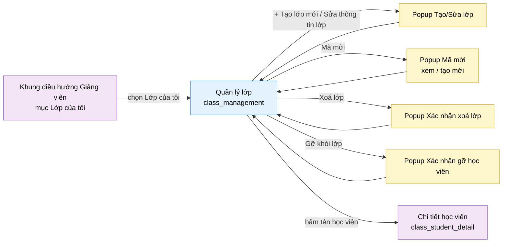

# Tài liệu thiết kế cơ bản (BD) — Quản lý lớp (`INS0201`)

## Phương châm tài liệu [Nội bộ — không cần khách duyệt]

- Viết theo **mẫu 9 sheet**. Bộ thẻ đóng, quy ước ID, ký hiệu chuẩn, ranh giới với tài liệu khác và
  checklist kiểm toán nằm ở `02-bd/_rules/bd-template-9sheet.md` — file này không chép lại.
- Phần gắn nhãn `[Nội bộ]` phục vụ sinh mã và tự kiểm toán, không phải yêu cầu của khách hàng: mục 4.5,
  mục 7.3 và các ghi chú quy ước.
- Mã màn `INS0201` theo bảng mã ở `02-bd/_rules/bd-template-9sheet.md` mục 8 dòng 151; tên file mang tiền
  tố mã.
- Màn này không có màn con. Có **4 popup**: Tạo/Sửa lớp, Mã mời, Xác nhận xoá lớp, Xác nhận gỡ học viên.
- Khung điều hướng bên trái **không mô tả lại ở đây** — dùng chung `02-bd/screens/teacher/_shell.md`.
  Khu Giảng viên **không có toolbar dùng chung**, nên hàng đầu tiên trong `<main>` là item của chính màn
  này và được mô tả ở Khu vực A [Nguồn: 02-bd/screens/teacher/_shell.md:30,113-114].

> Đọc cùng `01-rd/screens/teacher/INS0201_class_management.md` (hành vi ở mức yêu cầu, không lặp lại ở
> đây) và `02-bd/database/identity.md` mục 1.8 tới 1.10 (bảng `classes`, `class_invite_codes`,
> `class_enrollments`).
>
> **Không thiết kế** phần giao/gán bài toán cho lớp — đã tách sang màn `class_assignments` (`INS0202`)
> [Nguồn: DEC-2026-0828-split-class-management-assignments].
> **Không thiết kế** bất kỳ giao diện chấm lại nào — tính năng đã loại hoàn toàn khỏi phạm vi
> [Nguồn: DEC-2026-0828-remove-rejudge-scope].
> **Không thiết kế** bộ câu hỏi phỏng vấn riêng theo lớp — đã loại khỏi phạm vi
> [Nguồn: DEC-2026-0828-remove-per-class-interview-set].

> **Quy ước đặt tên khối cho cụm màn lớp** [Nội bộ]. Màn này là gốc của cụm (`class_assignments`,
> `class_progress`, `class_student_detail` treo vào cùng khái niệm lớp), nên các tên khối dưới đây là
> chuẩn cho cả cụm: `header` (hàng đầu `<main>`), `stats` (dải thẻ số liệu), `classList` (lưới thẻ lớp),
> `studentList` (bảng danh sách học viên, kèm tab lọc), `popup`. Cột trong danh sách thêm đoạn `col`.

---

## Sheet 1. Bìa

| Mục | Giá trị |
| :--- | :--- |
| Hệ thống | AlgoPrep |
| Phân hệ | `identity` (F1) |
| Công đoạn | BD — Thiết kế cơ bản |
| Phân loại | Màn hình |
| Tên màn | Quản lý lớp ("Lớp của tôi") |
| Mã màn hình | `INS0201` |
| Tên vật lý (slug) | `class_management` |
| Trục tài liệu | Màn hình (`02-bd/screens/`) |
| Actor | A2 (`INSTRUCTOR`) |
| Phiên bản | V0.1 |
| Người tạo | Nhóm phát triển AlgoPrep |
| Ngày tạo | 2026/09/21 |
| Người cập nhật | Nhóm phát triển AlgoPrep |
| Ngày cập nhật | 2026/09/21 |

---

## Sheet 2. Lịch sử sửa đổi

| Ver | Sheet bị sửa | Nội dung sửa | Ngày | Người sửa |
| :--- | :--- | :--- | :--- | :--- |
| V0.1 | Toàn bộ | Tạo mới theo mẫu 9 sheet. Chốt nguồn dữ liệu của mọi trường hiển thị, ánh xạ về `identity.classes` / `class_invite_codes` / `class_enrollments`. Thiết kế bổ sung 4 popup và các thao tác F1-24 tới F1-27 mà prototype chưa dựng. Phát sinh 10 câu hỏi mở | 2026/09/21 | Nhóm phát triển AlgoPrep |
| V0.2 | 5, 7.1, 7.2, 4.3, Câu hỏi mở | Áp `DEC-2026-0921-teacher-screens-conflict-resolutions` và `DEC-2026-0921-class-completion-owned-by-identity`: bộ nhãn trạng thái học viên đổi sang bộ 5 giá trị dùng chung cụm lớp (điều kiện "hoàn thành dưới 50%" nay là "Theo dõi" chứ không phải "Cần hỗ trợ"); Điểm TB đổi nguồn sang `judge.submissions` tính theo phạm vi lớp; bỏ `GetClassAssignmentCompletion`, thay bằng `ListClassAssignments` và `identity` tự tính. Đóng Q2, Q4, Q7 | 2026-09-21 | AI |

---

## Sheet 3. Sơ đồ chuyển màn

> [Nội bộ] Quy ước vẽ: bố trí từ trái sang phải. Màn gọi tới tô tím, màn hiện tại tô xanh nhạt, popup tô
> vàng. Màu và `[Nguồn:]` dùng để truy vết, không phải yêu cầu của khách hàng.

### 3.1 Danh sách chuyển màn

#### Khung điều hướng Giảng viên → Quản lý lớp

[Điều kiện mở] Chọn mục "Lớp của tôi" (mục nav thứ 2) trên thanh điều hướng bên trái của khu Giảng viên
[Nguồn: 02-bd/screens/teacher/_shell.md:73].

[Chế độ mở] Không có.

[Thông tin truyền] Không có.

[Giá trị trả về] Không có.

[Khi thành công] Tải danh sách lớp mà giảng viên đang đăng nhập phụ trách, 4 thẻ số liệu tổng và bảng
danh sách học viên ở bộ lọc mặc định "Tất cả".

[Khi huỷ] Không có.

#### Quản lý lớp → Popup Tạo/Sửa lớp

[Điều kiện mở] Bấm nút "+ Tạo lớp mới" ở hàng đầu (chế độ tạo), hoặc chọn "Sửa thông tin lớp" trong menu
thao tác của một thẻ lớp (chế độ sửa).

[Chế độ mở] Hai chế độ dùng chung một form: **tạo mới** (mọi trường rỗng) và **sửa** (nạp sẵn giá trị
hiện tại của lớp). Sửa lớp dùng chung luồng với tạo lớp [Nguồn: 01-rd/req/identity.md:88-89].

[Thông tin truyền] Chế độ tạo: không có. Chế độ sửa: `id` của lớp được chọn.

[Giá trị trả về] Lớp vừa tạo hoặc vừa sửa; không có gì nếu người dùng huỷ.

[Khi thành công] Đóng popup, tải lại lưới thẻ lớp và 4 thẻ số liệu. Chế độ tạo còn hiển thị mã mời đầu
tiên của lớp ngay trong popup trước khi đóng [Nguồn: 01-rd/req/identity.md:79-81].

[Khi huỷ] Đóng popup, không tạo và không sửa gì; lưới thẻ lớp giữ nguyên.

#### Quản lý lớp → Popup Mã mời

[Điều kiện mở] Chọn "Mã mời" trong menu thao tác của một thẻ lớp.

[Chế độ mở] Chế độ xem danh sách mã, có hành động tạo mã mới và sao chép.

[Thông tin truyền] `id` của lớp được chọn.

[Giá trị trả về] Không có — mọi thay đổi ghi trực tiếp, màn chính không cần nhận giá trị.

[Khi thành công] Hiển thị danh sách mã mời của lớp kèm hạn dùng; nhiều mã cùng hiệu lực song song là hợp
lệ [Nguồn: 02-bd/database/identity.md:92-93].

[Khi huỷ] Đóng popup, màn chính không đổi.

#### Quản lý lớp → Popup Xác nhận xoá lớp

[Điều kiện mở] Chọn "Xoá lớp" trong menu thao tác của một thẻ lớp.

[Chế độ mở] Không có.

[Thông tin truyền] `id` và tên lớp được chọn, kèm số học viên đang thuộc lớp.

[Giá trị trả về] Kết quả chọn "Xoá lớp" hoặc "Huỷ".

[Khi thành công] Hiển thị cảnh báo đây là **xoá thật, không khôi phục được** [Nguồn: 01-rd/req/identity.md:86-88].

[Khi huỷ] Đóng popup, lớp giữ nguyên.

#### Quản lý lớp → Popup Xác nhận gỡ học viên

[Điều kiện mở] Bấm "Gỡ khỏi lớp" trên một dòng của bảng danh sách học viên.

[Chế độ mở] Không có.

[Thông tin truyền] `id` học viên, `id` lớp và tên hiển thị của cả hai.

[Giá trị trả về] Kết quả chọn "Gỡ học viên" hoặc "Huỷ".

[Khi thành công] Hiển thị cảnh báo gỡ học viên sẽ **xoá luôn lịch sử làm bài của học viên đó trong phạm
vi lớp này** [Nguồn: 01-rd/req/identity.md:98-103].

[Khi huỷ] Đóng popup, học viên vẫn thuộc lớp.

#### Quản lý lớp → Chi tiết học viên

[Điều kiện mở] Bấm vào tên một học viên trong bảng danh sách học viên.

[Chế độ mở] Không có.

[Thông tin truyền] `id` học viên và `id` lớp đang xét — phạm vi hiển thị của màn đích giới hạn trong lớp
này [Nguồn: 01-rd/req/identity.md:104-108].

[Giá trị trả về] Không có.

[Khi thành công] Điều hướng sang màn `class_student_detail` (`INS0204`). Màn này không có thay đổi chưa
lưu ngoài popup nên không cần hỏi xác nhận trước khi rời.

[Khi huỷ] Không có.

### 3.2 Sơ đồ

[Nguồn: 09-layoutBase/Giáo viên - Lớp của tôi.dc.html:115-121,136-157,159-188; 01-rd/screens/teacher/INS0201_class_management.md:70-85]

---

## Sheet 4. Bố cục màn hình

### 4.1 Tổng quan màn

[Mục đích màn] Cho giảng viên xem tổng quan các lớp mình phụ trách, quản lý vòng đời lớp (tạo, sửa, xoá,
mã mời) và quản lý danh sách học viên trong lớp (xem, lọc, gỡ, mở hồ sơ chi tiết)
[Nguồn: 01-rd/screens/teacher/INS0201_class_management.md:15-18; 01-rd/req/identity.md:79-111].

[Luồng nghiệp vụ chính]

1. **Hiển thị ban đầu**: vào màn, hệ thống tải song song ba nhóm dữ liệu — 4 thẻ số liệu tổng, lưới thẻ
   lớp, bảng danh sách học viên của bộ lọc "Tất cả". Trong lúc chờ, mỗi khối hiển thị khung chờ đúng số
   dòng dự kiến.
2. **Tạo lớp**: bấm "+ Tạo lớp mới", nhập tên lớp (bắt buộc), mô tả và lịch học (tuỳ chọn), lưu. Hệ thống
   sinh ngay một mã mời đầu tiên kèm hạn dùng và hiển thị để giảng viên chia sẻ cho học viên
   [Nguồn: 01-rd/req/identity.md:79-85].
3. **Quản lý mã mời**: mở popup "Mã mời" của lớp để xem các mã còn hiệu lực và tạo thêm mã mới. Nhiều mã
   cùng hiệu lực song song là hợp lệ, không thu hồi mã cũ [Nguồn: 01-rd/req/identity.md:93-97].
4. **Sửa hoặc xoá lớp**: sửa dùng chung form với tạo; xoá là **xoá thật**, có popup xác nhận.
5. **Lọc danh sách học viên**: chọn tab lớp hoặc bấm vào một thẻ lớp — cả hai cùng đặt một trạng thái lọc
   duy nhất [Nguồn: 01-rd/screens/teacher/INS0201_class_management.md:123].
6. **Gỡ học viên**: bấm "Gỡ khỏi lớp" trên một dòng, xác nhận trong popup. Thao tác kéo theo xoá lịch sử
   làm bài của học viên trong phạm vi lớp.
7. **Xem hồ sơ học viên**: bấm tên học viên để sang màn `class_student_detail`.

[Người dùng] Giảng viên đã đăng nhập, có Function `CLASS_MANAGEMENT` [Nguồn: 01-rd/req/identity.md:57].

[Tệp liên quan] Không có. Màn này không xuất hay nhập tệp.

[Phạm vi]
- Chỉ các lớp có `instructor_id` bằng người đang đăng nhập. Không có chế độ xem toàn hệ thống ở màn này.
- **Không** giao/gỡ bài toán cho lớp — thuộc `class_assignments` [Nguồn: DEC-2026-0828-split-class-management-assignments].
- **Không** có giao diện chấm lại [Nguồn: DEC-2026-0828-remove-rejudge-scope].
- **Không** có bộ câu hỏi phỏng vấn riêng theo lớp [Nguồn: DEC-2026-0828-remove-per-class-interview-set].
- **Không** thêm học viên thủ công — học viên tự tham gia bằng mã mời [Nguồn: 01-rd/req/identity.md:81-83].
- Không có trang con `/class/:id`; tổng quan cộng bảng học viên lọc theo tab đã đủ
  [Nguồn: 01-rd/screens/teacher/INS0201_class_management.md:123].

[Quyền sử dụng]
- Xem: được, khi có `CLASS_MANAGEMENT:READ`.
- Thêm: được — tạo lớp, tạo mã mời (`CLASS_MANAGEMENT:CREATE`).
- Sửa: được — sửa thông tin lớp (`CLASS_MANAGEMENT:UPDATE`).
- Xoá: được — xoá lớp và gỡ học viên (`CLASS_MANAGEMENT:DELETE`), cả hai đều là xoá thật.

[Số bản ghi tối đa] Thẻ số liệu: đúng 4 thẻ. Lưới thẻ lớp: theo số lớp giảng viên phụ trách, không phân
trang (prototype 3 lớp). Tab lọc: 1 + số lớp. Bảng học viên: phân trang, xem Câu hỏi mở Q9. Danh sách mã
mời trong popup: theo số mã của lớp, không phân trang.

[Nguồn: 01-rd/screens/teacher/INS0201_class_management.md:62-90; 02-bd/database/identity.md:85-101]

### 4.2 DTO liên quan

- `InstructorClassSummaryDto` — 4 thẻ số liệu tổng.
- `ClassCardDto` — một thẻ lớp trong lưới.
- `ClassFormDto` — dữ liệu tạo và sửa lớp.
- `ClassInviteCodeDto` — một mã mời.
- `ClassStudentRowDto` — một dòng của bảng danh sách học viên.

`[Suy luận]` — tên DTO do BD này đề xuất, `03-dd/api/identity.md` chốt lại.

### 4.3 Bảng dữ liệu liên quan (6)

| NO | Bảng | Ghi chú |
| --: | :--- | :--- |
| 1 | `identity.classes` | [Nguồn: 02-bd/database/identity.md:85-88] |
| 2 | `identity.class_invite_codes` | [Nguồn: 02-bd/database/identity.md:90-93] |
| 3 | `identity.class_enrollments` | [Nguồn: 02-bd/database/identity.md:95-101] |
| 4 | `identity.users` | Tên hiển thị học viên — cột `display_name` [Nguồn: 02-bd/database/identity.md:16] |
| 5 | `judge.submissions` | Nguồn tính Điểm TB **theo phạm vi lớp**, đọc qua `GetStudentSubmissionMetrics` của `judge-orchestration`, không truy vấn chéo schema. Thay cho `identity.user_submission_stats` (read model toàn cục, không có chiều `class_id`) từ 2026-09-21 theo `DEC-2026-0921-teacher-screens-conflict-resolutions` |
| 6 | `identity.identity_recent_activity` | Cột "Hoạt động" của bảng học viên [Nguồn: 02-bd/database/identity.md:115-116] |

Hai số liệu còn lại **không đọc từ bảng của `identity`**: tỉ lệ "Hoàn thành" cần dữ liệu bài đã giao cho
lớp (F2-12, thuộc `problem-bank`) và "Cần chấm tay" cần hàng chờ chấm tay (F5-27, thuộc `ai-review`). Cả
hai lấy qua endpoint của module sở hữu, không truy vấn chéo schema — xem Câu hỏi mở Q2 và Q3.

### 4.4 Vùng bố cục

Đối chiếu `09-layoutBase/Giáo viên - Lớp của tôi.dc.html` — bằng chứng bố cục chỉ-đọc, **không phải**
design system cuối cùng.

| Vùng | Vị trí trong prototype | Nội dung |
| :--- | :--- | :--- |
| Thanh điều hướng bên trái (khung chung Giảng viên) | `:62-110` | Mục "Lớp của tôi" đang chọn, badge `3` — dùng lại khung chung, không mô tả lại ở đây |
| Container nội dung | `:112-113` | `max-width: 1320px` căn giữa, các khối xếp dọc, khoảng cách đều |
| Hàng đầu — tiêu đề và nút chính | `:115-121` | Tiêu đề "Lớp của tôi", dòng phụ "3 lớp · 82 học viên", nút "+ Tạo lớp mới". **Không phải toolbar dùng chung** — khu Giảng viên không có toolbar [Nguồn: 02-bd/screens/teacher/_shell.md:30] |
| Dải thẻ số liệu | `:123-134`, dữ liệu `:253-258` | Lưới `auto-fit minmax(200px, 1fr)`, 4 thẻ: Tổng số lớp, Hoàn thành TB, Cần chấm tay, Học viên vắng bài |
| Lưới thẻ lớp | `:136-157`, dữ liệu `:260-265` | Lưới `auto-fit minmax(300px, 1fr)`; mỗi thẻ có tên lớp, lịch học, huy hiệu số học viên, thanh tiến độ, và 3 số ở chân thẻ: Điểm TB, Cần chấm, Vắng bài |
| Khối "Danh sách học viên" — hàng tiêu đề | `:160-167`, dữ liệu tab `:267-272` | Tiêu đề khối bên trái, cụm tab lọc theo lớp bên phải (Tất cả + tên từng lớp) |
| Khối "Danh sách học viên" — bảng | `:169-187`, dữ liệu `:274-284` | Lưới 6 cột `minmax(160px,1.4fr) 120px 90px 90px 120px 110px`, `min-width: 700px`, cuộn ngang khi hẹp |
| Chân trang | không có | Cả 5 prototype khu Giảng viên đều không có `<footer>` [Nguồn: 02-bd/screens/teacher/_shell.md:31] |

Bốn nhóm điều khiển dưới đây **không có trong prototype** và do BD này thiết kế bổ sung, vì yêu cầu F1-24
tới F1-27 đã chốt mà prototype vẽ trước thời điểm đó [Nguồn: 01-rd/screens/teacher/INS0201_class_management.md:70-74]:
menu thao tác trên thẻ lớp (Sửa / Mã mời / Xoá), hành vi bấm thẻ lớp để lọc, nút "Gỡ khỏi lớp" trên dòng
học viên, và liên kết tên học viên sang `class_student_detail`. Vị trí cụ thể xem Câu hỏi mở Q6.

### 4.5 Cấu trúc slice FSD [Nội bộ]

| Khối | Slice dự kiến | Căn cứ |
| :--- | :--- | :--- |
| Trang | `views/class-management` | Quy ước FSD của dự án; slice đã được tạo sẵn dạng stub [Nguồn: 02-bd/screens/teacher/_shell.md:13-14] |
| Khung Giảng viên | Dùng lại `widgets/app-shell` (biến thể `instructor-sidebar`) | `02-bd/screens/teacher/_shell.md` mục 1 |
| Dải thẻ số liệu | `widgets/class-summary-stats` | Prototype `:123-134` |
| Lưới thẻ lớp | `widgets/class-card-grid` + `entities/class` | Prototype `:136-157` |
| Bảng học viên | `widgets/class-student-table` + `entities/class-student` | Prototype `:159-188` |
| Popup | `features/class-create-edit`, `features/class-invite-code`, `features/class-delete`, `features/class-student-remove` | BD này thiết kế bổ sung |

`[Suy luận]` — ánh xạ slice do BD đề xuất, DD màn hình chốt lại. Ba màn còn lại của cụm lớp
(`class_assignments`, `class_progress`, `class_student_detail`) dùng lại `entities/class` và
`entities/class-student`, không tự định nghĩa lại.

> [Nội bộ] Ảnh minh hoạ đặt ở `08-diagram/02-bd/screens/teacher/`, chụp bằng Playwright trên ứng dụng
> Next.js thật khi đã có mã chạy được. Chưa có thì tham chiếu prototype, không vẽ tay.

---

## Sheet 5. Danh sách item màn hình

> Quy ước ID, bộ thẻ và giá trị chuẩn: `02-bd/_rules/bd-template-9sheet.md` mục 2, 3, 4.

### Khu vực A — Hàng đầu

| Khu vực | NO | Tên item | ID item | Bảng DB | Cột DB | Loại UI | Kiểu | Độ dài | Bắt buộc | I/O | Giá trị mặc định | Định dạng | Ghi chú |
| :--- | --: | :--- | :--- | :--- | :--- | :--- | :--- | :--- | :-: | :-: | :--- | :--- | :--- |
| Hàng đầu | | | | | | | | | | | | | |
| | 1 | Tiêu đề màn | `classManagement.header.title` | - | - | Label | String | - | - | O | Lớp của tôi | - | Tên màn hiển thị cố định [Nguồn giá trị] Nhãn tĩnh i18n [EVT liên quan] - |
| | 2 | Dòng tóm tắt | `classManagement.header.summary` | `identity.classes`, `identity.class_enrollments` | - | Label | String | - | - | O | - | `{số} lớp · {số} học viên` | Tổng quy mô giảng dạy của người đang đăng nhập [Công thức] Số lớp = đếm `classes` có `instructor_id` bằng người đăng nhập; số học viên = đếm `class_enrollments` của các lớp đó [EVT liên quan] EVT-1 |
| | 3 | Tạo lớp mới | `classManagement.header.btnCreateClass` | - | - | Button | - | - | - | I | - | `+ Tạo lớp mới` | Mở popup tạo lớp (F1-23) [Nguồn giá trị] - [EVT liên quan] EVT-2 |

### Khu vực B — Thẻ số liệu

| Khu vực | NO | Tên item | ID item | Bảng DB | Cột DB | Loại UI | Kiểu | Độ dài | Bắt buộc | I/O | Giá trị mặc định | Định dạng | Ghi chú |
| :--- | --: | :--- | :--- | :--- | :--- | :--- | :--- | :--- | :-: | :-: | :--- | :--- | :--- |
| Thẻ số liệu | | | | | | | | | | | | | |
| | 1 | Tổng số lớp | `classManagement.stats.classCount` | `identity.classes` | `id` | Label | Number | 4 | - | O | - | Số nguyên | Số lớp đang phụ trách; dòng phụ hiển thị tổng số học viên [Công thức] Đếm `classes` có `instructor_id` bằng người đăng nhập [EVT liên quan] EVT-1 |
| | 2 | Hoàn thành trung bình | `classManagement.stats.avgCompletion` | - | - | Label | Number | 3 | - | O | - | `{số}%` | Tỉ lệ hoàn thành trung bình của toàn bộ học viên trong các lớp phụ trách [Công thức] Trung bình cộng tỉ lệ "Hoàn thành" của từng học viên; tỉ lệ một học viên = số bài đã giao mà học viên Accepted ít nhất một lần chia tổng số bài đã giao [Nguồn: DEC-2026-0830-class-progress-dashboard]. Dữ liệu bài đã giao thuộc `problem-bank`, xem Q2 [EVT liên quan] EVT-1 |
| | 3 | Chênh lệch so với tuần trước | `classManagement.stats.avgCompletionDelta` | - | - | Label | String | 6 | - | O | - | `{dấu}{số}%` | Mức tăng giảm của tỉ lệ hoàn thành trung bình so với tuần trước [Công thức] Hiệu giữa giá trị hiện tại và giá trị của ảnh chụp tuần trước. **Chưa có nguồn**: `02-bd/database/identity.md` mục 1.12 không có bảng ảnh chụp theo tuần — xem Câu hỏi mở Q1 [EVT liên quan] EVT-1 |
| | 4 | Cần chấm tay | `classManagement.stats.pendingGrading` | - | - | Label | Number | 4 | - | O | - | Số nguyên | Số lượt nộp đang chờ chấm tay trên toàn bộ lớp phụ trách (F5-27) [Nguồn giá trị] Endpoint của `ai-review`, không truy vấn chéo schema — xem Câu hỏi mở Q3 [EVT liên quan] EVT-1 |
| | 5 | Học viên vắng bài | `classManagement.stats.absentStudents` | - | - | Label | Number | 4 | - | O | - | Số nguyên | Số học viên không nộp bài trong 7 ngày gần nhất [Công thức] Đếm học viên thuộc các lớp phụ trách có trạng thái "Vắng bài" theo ngưỡng ở Khu vực D NO 7 [EVT liên quan] EVT-1 |

### Khu vực C — Lưới thẻ lớp

| Khu vực | NO | Tên item | ID item | Bảng DB | Cột DB | Loại UI | Kiểu | Độ dài | Bắt buộc | I/O | Giá trị mặc định | Định dạng | Ghi chú |
| :--- | --: | :--- | :--- | :--- | :--- | :--- | :--- | :--- | :-: | :-: | :--- | :--- | :--- |
| Lưới thẻ lớp | | | | | | | | | | | | | |
| | 1 | Danh sách lớp | `classManagement.classList.grid` | `identity.classes` | - | List | List | - | - | O | rỗng | - | Mỗi thẻ là một lớp giảng viên phụ trách, sắp xếp theo `created_at` giảm dần [Nguồn giá trị] Kết quả gọi `ListInstructorClasses` [EVT liên quan] EVT-1 |
| | 2 | Tên lớp | `classManagement.classList.col.name` | `identity.classes` | `name` | ListColumn | String | 120 | - | O | - | - | Tên lớp do giảng viên đặt [Nguồn giá trị] Cột `name` [EVT liên quan] - |
| | 3 | Lịch học | `classManagement.classList.col.schedule` | `identity.classes` | `schedule_note` | ListColumn | String | 200 | - | O | - | Chuỗi tự do | Ghi chú lịch học, ví dụ "Thứ 2 · 4 · 6 — 19:00" [Nguồn giá trị] Cột `schedule_note`; rỗng thì ẩn dòng [EVT liên quan] - |
| | 4 | Số học viên | `classManagement.classList.col.studentCount` | `identity.class_enrollments` | `id` | Badge | Number | 4 | - | O | 0 | `{số} HV` | Số học viên đang thuộc lớp [Công thức] Đếm `class_enrollments` theo `class_id` [EVT liên quan] - |
| | 5 | Thanh hoàn thành | `classManagement.classList.col.completionBar` | - | - | ProgressBar | Number | - | - | O | 0 | - | Biểu diễn trực quan tỉ lệ hoàn thành trung bình của lớp [Công thức] Chiều rộng bằng đúng giá trị của NO 6 [EVT liên quan] - |
| | 6 | Hoàn thành TB của lớp | `classManagement.classList.col.completionPct` | - | - | ListColumn | Number | 3 | - | O | 0 | `{số}%` | Tỉ lệ hoàn thành trung bình của học viên trong lớp [Công thức] Trung bình cộng tỉ lệ "Hoàn thành" của các học viên trong lớp, cùng công thức với Khu vực B NO 2 [Nguồn: DEC-2026-0830-class-progress-dashboard]. Xem Q2 [EVT liên quan] - |
| | 7 | Điểm TB của lớp | `classManagement.classList.col.avgScore` | `judge.submissions` | `status`, `problem_id`, `user_id` | ListColumn | Number | 4 | - | O | - | Một chữ số thập phân, thang 10 | Điểm trung bình của học viên trong lớp [Công thức] Trung bình cộng Điểm TB từng học viên; Điểm TB một học viên = `accepted_count` chia `total_submissions` rồi nhân 10 [Nguồn: DEC-2026-0830-class-progress-dashboard]. Read model hiện toàn cục theo người dùng, xem Q4 [EVT liên quan] - |
| | 8 | Cần chấm của lớp | `classManagement.classList.col.pendingGrading` | - | - | ListColumn | Number | 4 | - | O | 0 | Số nguyên | Số lượt nộp của lớp đang chờ chấm tay [Nguồn giá trị] Endpoint của `ai-review`, chia theo `class_id` — xem Q3 [EVT liên quan] - |
| | 9 | Vắng bài của lớp | `classManagement.classList.col.absentCount` | - | - | ListColumn | Number | 4 | - | O | 0 | Số nguyên | Số học viên của lớp không nộp bài trong 7 ngày gần nhất [Công thức] Đếm học viên trong lớp có trạng thái "Vắng bài" theo ngưỡng ở Khu vực D NO 7 [EVT liên quan] - |
| | 10 | Menu thao tác lớp | `classManagement.classList.col.btnActions` | - | - | Button | - | - | - | I | - | - | Mở menu ba mục: "Sửa thông tin lớp", "Mã mời", "Xoá lớp". **Không có trong prototype**, BD thiết kế bổ sung cho F1-24 và F1-25 — xem Q6 [Nguồn giá trị] - [EVT liên quan] EVT-5 |
| | 11 | Sửa thông tin lớp | `classManagement.classList.col.menuEdit` | `identity.classes` | `name`, `description`, `schedule_note` | Link | - | - | - | I | - | - | Mục menu mở popup Tạo/Sửa lớp ở chế độ sửa (F1-24 dòng "sửa dùng chung luồng với F1-23") [Nguồn giá trị] - [EVT liên quan] EVT-6 |
| | 12 | Mã mời | `classManagement.classList.col.menuInvite` | `identity.class_invite_codes` | - | Link | - | - | - | I | - | - | Mục menu mở popup Mã mời của lớp (F1-25) [Nguồn giá trị] - [EVT liên quan] EVT-7 |
| | 13 | Xoá lớp | `classManagement.classList.col.menuDelete` | `identity.classes` | `id` | Link | - | - | - | I | - | - | Mục menu mở popup xác nhận xoá lớp (F1-24, xoá thật) [Nguồn giá trị] - [EVT liên quan] EVT-11 |

### Khu vực D — Danh sách học viên

| Khu vực | NO | Tên item | ID item | Bảng DB | Cột DB | Loại UI | Kiểu | Độ dài | Bắt buộc | I/O | Giá trị mặc định | Định dạng | Ghi chú |
| :--- | --: | :--- | :--- | :--- | :--- | :--- | :--- | :--- | :-: | :-: | :--- | :--- | :--- |
| Danh sách học viên | | | | | | | | | | | | | |
| | 1 | Tiêu đề khối | `classManagement.studentList.title` | - | - | Label | String | - | - | O | Danh sách học viên | - | Tiêu đề khối bảng học viên [Nguồn giá trị] Nhãn tĩnh i18n [EVT liên quan] - |
| | 2 | Tab lọc theo lớp | `classManagement.studentList.classTabs` | `identity.classes` | `id`, `name` | Button | List | - | - | I/O | Tất cả | - | Cụm tab: mục "Tất cả" cố định cộng một mục cho mỗi lớp phụ trách [Nguồn giá trị] Mục "Tất cả" là nhãn tĩnh i18n; các mục còn lại lấy `classes.name` [EVT liên quan] EVT-15 |
| | 3 | Bảng học viên | `classManagement.studentList.table` | `identity.class_enrollments` | - | List | List | - | - | O | rỗng | - | Học viên thuộc các lớp phụ trách, lọc theo tab đang chọn [Nguồn giá trị] Kết quả gọi `ListClassStudents` [EVT liên quan] EVT-1, EVT-14, EVT-15 |
| | 4 | Học viên | `classManagement.studentList.col.studentName` | `identity.users` | `display_name` | Link | String | 100 | - | O | - | Chữ cái đầu + tên | Tên hiển thị kèm ô chữ cái đầu; bấm vào mở màn `class_student_detail` (F1-27) [Công thức] Ô chữ cái đầu ghép từ hai ký tự đầu của hai từ cuối trong `display_name`; ảnh đại diện thật chưa có nguồn nên dùng chữ cái đầu `[Suy luận]` [EVT liên quan] EVT-16 |
| | 5 | Lớp | `classManagement.studentList.col.className` | `identity.classes` | `name` | ListColumn | String | 120 | - | O | - | - | Lớp mà dòng này thuộc về [Nguồn giá trị] Cột `name` của lớp gắn với dòng `class_enrollments` [EVT liên quan] - |
| | 6 | Điểm TB | `classManagement.studentList.col.avgScore` | `judge.submissions` | `status`, `problem_id`, `user_id` | ListColumn | Number | 4 | - | O | - | Một chữ số thập phân, thang 10 | Điểm trung bình của học viên [Công thức] `accepted_count` chia `total_submissions` rồi nhân 10 [Nguồn: DEC-2026-0830-class-progress-dashboard]. Chưa có bài nộp nào thì hiển thị `-`. Read model toàn cục, xem Q4 [EVT liên quan] - |
| | 7 | Hoàn thành | `classManagement.studentList.col.completion` | - | - | ListColumn | Number | 3 | - | O | - | `{số}%` | Tỉ lệ bài đã giao mà học viên đã Accepted [Công thức] Số bài đã giao cho lớp mà học viên Accepted ít nhất một lần chia tổng số bài đã giao [Nguồn: DEC-2026-0830-class-progress-dashboard]. Xem Q2 [EVT liên quan] - |
| | 8 | Trạng thái | `classManagement.studentList.col.status` | - | - | Badge | Enum | - | - | O | - | Nhãn tiếng Việt kèm chấm màu | Năm nhãn thống nhất cho cả cụm lớp: "Chưa đủ dữ liệu", "Vắng bài", "Cần hỗ trợ", "Theo dõi", "Đang tốt" [Công thức] Xét theo thứ tự nghiêm trọng, dừng ở điều kiện đầu tiên khớp: chưa có lượt nộp nào trong lớp thì "Chưa đủ dữ liệu"; không nộp trong 7 ngày gần nhất thì "Vắng bài"; Điểm TB giảm từ 2 mốc tuần liên tiếp thì "Cần hỗ trợ"; Hoàn thành dưới 50% thì "Theo dõi"; còn lại "Đang tốt". Bộ nhãn và thứ tự chốt bởi `DEC-2026-0921-teacher-screens-conflict-resolutions`, ngưỡng gốc từ `DEC-2026-0830-class-progress-dashboard` [EVT liên quan] - |
| | 9 | Hoạt động | `classManagement.studentList.col.lastActive` | `identity.identity_recent_activity` | `occurred_at` | ListColumn | String | 20 | - | O | - | Khoảng thời gian tương đối | Thời điểm hoạt động gần nhất của học viên [Công thức] `occurred_at` lớn nhất của học viên, hiển thị dạng tương đối ("12 phút trước", "Hôm qua"); chưa có hoạt động nào thì hiển thị `-` [EVT liên quan] - |
| | 10 | Gỡ khỏi lớp | `classManagement.studentList.col.btnRemove` | `identity.class_enrollments` | `id` | Button | - | - | - | I | - | - | Mở popup xác nhận gỡ học viên khỏi lớp (F1-26). **Không có trong prototype**, BD thiết kế bổ sung — xem Q6 [Nguồn giá trị] - [EVT liên quan] EVT-17 |

### Popup

| Khu vực | NO | Tên item | ID item | Bảng DB | Cột DB | Loại UI | Kiểu | Độ dài | Bắt buộc | I/O | Giá trị mặc định | Định dạng | Ghi chú |
| :--- | --: | :--- | :--- | :--- | :--- | :--- | :--- | :--- | :-: | :-: | :--- | :--- | :--- |
| Popup | | | | | | | | | | | | | |
| | 1 | Tạo/Sửa lớp | `classManagement.popup.classForm` | `identity.classes` | `name`, `description`, `schedule_note` | Popup | - | - | - | I/O | - | - | Form ba trường: Tên lớp (bắt buộc), Mô tả (tuỳ chọn), Lịch học (tuỳ chọn). Danh sách trường lấy đúng cột có thật của bảng `classes`, không thêm cột mới [Nguồn: 02-bd/database/identity.md:87] [Nguồn giá trị] Chế độ tạo: rỗng. Chế độ sửa: dòng `classes` được chọn [EVT liên quan] EVT-2, EVT-3, EVT-4, EVT-6 |
| | 2 | Mã mời đầu tiên | `classManagement.popup.firstInviteCode` | `identity.class_invite_codes` | `code`, `expires_at` | Label | String | 32 | - | O | - | Mã kèm dòng "Hết hạn {ngày}" | Mã mời hệ thống sinh ngay sau khi tạo lớp, hiển thị trong chính popup tạo lớp (F1-23) [Nguồn giá trị] Cột `code` và `expires_at` của dòng vừa tạo [EVT liên quan] EVT-3 |
| | 3 | Mã mời | `classManagement.popup.inviteCodes` | `identity.class_invite_codes` | `code`, `expires_at`, `created_at` | Popup | - | - | - | I/O | - | - | Danh sách mã mời của lớp, sắp xếp theo `created_at` giảm dần, kèm nút "Tạo mã mới" và nút sao chép từng mã. Nhiều mã cùng hiệu lực song song là hợp lệ, **không thiết kế nút thu hồi** vì `class_invite_codes` không có cột trạng thái [Nguồn: 02-bd/database/identity.md:92-93] [Nguồn giá trị] Kết quả gọi `ListClassInviteCodes` [EVT liên quan] EVT-7, EVT-8, EVT-9, EVT-10 |
| | 4 | Xác nhận xoá lớp | `classManagement.popup.deleteClassConfirm` | `identity.classes` | `id`, `name` | Popup | - | - | - | I | - | Xoá lớp / Huỷ | Xác nhận trước khi xoá thật một lớp; nêu rõ số học viên sẽ mất quyền truy cập và thao tác không khôi phục được (F1-24) [Nguồn giá trị] Tên lớp và số học viên của thẻ được chọn [EVT liên quan] EVT-11, EVT-12, EVT-13 |
| | 5 | Xác nhận gỡ học viên | `classManagement.popup.removeStudentConfirm` | `identity.class_enrollments` | `id` | Popup | - | - | - | I | - | Gỡ học viên / Huỷ | Xác nhận trước khi gỡ học viên; nêu rõ lịch sử làm bài của học viên trong lớp này sẽ bị xoá theo (F1-26) [Nguồn giá trị] Tên học viên và tên lớp của dòng được chọn [EVT liên quan] EVT-17, EVT-18, EVT-19 |

[Nguồn: 09-layoutBase/Giáo viên - Lớp của tôi.dc.html:115-121,123-134,136-157,159-188,253-258,260-265,267-272,274-284; 02-bd/database/identity.md:16,85-101,113-116; 01-rd/req/identity.md:79-111]

---

## Sheet 6. Đặc tả điều khiển item

> Ký hiệu cột `Hiển thị` và thứ tự thẻ: `02-bd/_rules/bd-template-9sheet.md` mục 2, 3. Dùng đúng NO, tên
> item và thứ tự của Sheet 5. Lỗi nhập liệu ghi ở Sheet 9, xử lý nghiệp vụ ghi ở Sheet 8.

### Khu vực A — Hàng đầu

| Khu vực | NO | Tên item | Hiển thị | Ghi chú |
| :--- | --: | :--- | :-: | :--- |
| Hàng đầu | | | | |
| | 1 | Tiêu đề màn | Có | - |
| | 2 | Dòng tóm tắt | Có | [Tự động đặt] Tính lại sau mỗi lần tạo lớp, xoá lớp hoặc gỡ học viên thành công. Trong lúc tải hiển thị khung chờ một dòng. |
| | 3 | Tạo lớp mới | Có | [Điều kiện kích hoạt] Không kích hoạt trong lúc đang tải danh sách lớp; kích hoạt sau khi tải xong. Người dùng không có `CLASS_MANAGEMENT:CREATE` thì không hiển thị nút. |

### Khu vực B — Thẻ số liệu

| Khu vực | NO | Tên item | Hiển thị | Ghi chú |
| :--- | --: | :--- | :-: | :--- |
| Thẻ số liệu | | | | |
| | 1 | Tổng số lớp | Có | [Điều kiện hiển thị] Trong lúc tải hiển thị khung chờ đúng 4 thẻ. |
| | 2 | Hoàn thành trung bình | Có | [Điều kiện hiển thị] Chưa có lớp nào hoặc chưa có bài nào được giao thì hiển thị `-` thay vì `0%`, tránh hiểu nhầm là học viên không làm bài. |
| | 3 | Chênh lệch so với tuần trước | Điều kiện | [Điều kiện hiển thị] Chỉ hiển thị khi có dữ liệu tuần trước; chưa có thì ẩn hẳn phần chênh lệch, thẻ vẫn hiển thị giá trị hiện tại. Nguồn dữ liệu chưa chốt, xem Q1. |
| | 4 | Cần chấm tay | Điều kiện | [Điều kiện hiển thị] Gọi `ai-review` thất bại thì ẩn giá trị và hiển thị `-`; không chặn ba thẻ còn lại. Đây là ràng buộc bắt buộc — phân hệ AI hỏng thì F1 tới F4 vẫn phải chạy. |
| | 5 | Học viên vắng bài | Có | [Điều kiện hiển thị] Chưa có học viên nào thì hiển thị `0`. |

### Khu vực C — Lưới thẻ lớp

| Khu vực | NO | Tên item | Hiển thị | Ghi chú |
| :--- | --: | :--- | :-: | :--- |
| Lưới thẻ lớp | | | | |
| | 1 | Danh sách lớp | Có | [Điều kiện hiển thị] Trong lúc tải hiển thị khung chờ 3 thẻ. Tải xong mà không có lớp nào thì thay lưới bằng trạng thái rỗng "Chưa có lớp nào — Tạo lớp mới". |
| | 2 | Tên lớp | Có | - |
| | 3 | Lịch học | Điều kiện | [Điều kiện hiển thị] Chỉ hiển thị khi `schedule_note` khác rỗng; rỗng thì bỏ hẳn dòng, không để khoảng trắng. |
| | 4 | Số học viên | Có | - |
| | 5 | Thanh hoàn thành | Có | [Tự động đặt] Chiều rộng cập nhật cùng lúc với giá trị NO 6. |
| | 6 | Hoàn thành TB của lớp | Có | [Điều kiện hiển thị] Lớp chưa được giao bài nào thì hiển thị `-`. |
| | 7 | Điểm TB của lớp | Có | [Điều kiện hiển thị] Lớp chưa có lượt nộp nào thì hiển thị `-`. |
| | 8 | Cần chấm của lớp | Điều kiện | [Điều kiện hiển thị] Gọi `ai-review` thất bại thì hiển thị `-`, thẻ lớp vẫn hiển thị đầy đủ các số còn lại. |
| | 9 | Vắng bài của lớp | Có | - |
| | 10 | Menu thao tác lớp | Điều kiện | [Điều kiện hiển thị] Chỉ hiển thị khi người dùng có ít nhất một trong `CLASS_MANAGEMENT:UPDATE`, `CLASS_MANAGEMENT:CREATE`, `CLASS_MANAGEMENT:DELETE`. [Điều kiện kích hoạt] Không kích hoạt khi đang có một popup mở. |
| | 11 | Sửa thông tin lớp | Điều kiện | [Điều kiện hiển thị] Chỉ hiển thị khi có `CLASS_MANAGEMENT:UPDATE`. |
| | 12 | Mã mời | Điều kiện | [Điều kiện hiển thị] Chỉ hiển thị khi có `CLASS_MANAGEMENT:CREATE` — tạo mã mời là hành vi tạo mới. |
| | 13 | Xoá lớp | Điều kiện | [Điều kiện hiển thị] Chỉ hiển thị khi có `CLASS_MANAGEMENT:DELETE`. |

### Khu vực D — Danh sách học viên

| Khu vực | NO | Tên item | Hiển thị | Ghi chú |
| :--- | --: | :--- | :-: | :--- |
| Danh sách học viên | | | | |
| | 1 | Tiêu đề khối | Có | - |
| | 2 | Tab lọc theo lớp | Có | [Điều kiện hiển thị] Chỉ hiển thị khi có từ 1 lớp trở lên; không có lớp nào thì ẩn cả khối bảng học viên. [Tự động đặt] Tab đang chọn đồng bộ với thẻ lớp đang được chọn ở Khu vực C — hai thao tác đặt cùng một trạng thái lọc, xem Q10. |
| | 3 | Bảng học viên | Có | [Điều kiện hiển thị] Trong lúc tải hiển thị khung chờ 8 dòng. Lọc xong không còn dòng nào thì hiển thị "Lớp này chưa có học viên nào — chia sẻ mã mời để học viên tham gia". |
| | 4 | Học viên | Có | [Điều kiện kích hoạt] Luôn kích hoạt sau khi tải xong; liên kết mở màn `class_student_detail`. |
| | 5 | Lớp | Điều kiện | [Điều kiện hiển thị] Chỉ hiển thị khi tab đang chọn là "Tất cả"; đang lọc theo một lớp cụ thể thì cột này thừa, ẩn đi để trả chỗ cho các cột số. |
| | 6 | Điểm TB | Có | - |
| | 7 | Hoàn thành | Có | - |
| | 8 | Trạng thái | Có | [Tự động đặt] Nhãn và màu chấm tính lại theo đúng công thức ở Sheet 5 mỗi lần tải lại bảng; không phải giá trị lưu sẵn. |
| | 9 | Hoạt động | Có | - |
| | 10 | Gỡ khỏi lớp | Điều kiện | [Điều kiện hiển thị] Chỉ hiển thị khi có `CLASS_MANAGEMENT:DELETE` và lớp của dòng đó do chính người đang đăng nhập phụ trách. [Điều kiện kích hoạt] Không kích hoạt khi đang có một popup mở. |

### Popup

| Khu vực | NO | Tên item | Hiển thị | Ghi chú |
| :--- | --: | :--- | :-: | :--- |
| Popup | | | | |
| | 1 | Tạo/Sửa lớp | Điều kiện | [Điều kiện hiển thị] Chỉ hiển thị sau khi bấm "+ Tạo lớp mới" (chế độ tạo) hoặc chọn "Sửa thông tin lớp" (chế độ sửa). [Điều kiện kích hoạt] Nút "Lưu" chỉ kích hoạt khi Tên lớp khác rỗng. |
| | 2 | Mã mời đầu tiên | Điều kiện | [Điều kiện hiển thị] Chỉ hiển thị ở chế độ tạo, sau khi lưu thành công; chế độ sửa không hiển thị. |
| | 3 | Mã mời | Điều kiện | [Điều kiện hiển thị] Chỉ hiển thị sau khi chọn "Mã mời" trong menu thao tác của một thẻ lớp. [Tự động đặt] Mã đã quá `expires_at` hiển thị nhãn "Hết hạn" và không cho sao chép. |
| | 4 | Xác nhận xoá lớp | Điều kiện | [Điều kiện hiển thị] Chỉ hiển thị sau khi chọn "Xoá lớp". |
| | 5 | Xác nhận gỡ học viên | Điều kiện | [Điều kiện hiển thị] Chỉ hiển thị sau khi bấm "Gỡ khỏi lớp" trên một dòng học viên. |

[Nguồn: 09-layoutBase/Giáo viên - Lớp của tôi.dc.html:142,179,198,284; 02-bd/database/identity.md:92-93; 01-rd/req/identity.md:79-103]

---

## Sheet 7. Danh sách truyền dữ liệu

### 7.1 Trường DTO

| NO | DTO | Trường DTO | Kiểu | Bảng DB | Cột DB | Item màn | Hiển thị | Ghi chú |
| --: | :--- | :--- | :--- | :--- | :--- | :--- | :-: | :--- |
| 1 | `InstructorClassSummaryDto` | `classCount` | Number | `identity.classes` | `id` | Thẻ "Tổng số lớp" | Có | [Nguồn] Phản hồi của `GetInstructorClassSummary` |
| 2 | `InstructorClassSummaryDto` | `studentCount` | Number | `identity.class_enrollments` | `id` | Hàng đầu "Dòng tóm tắt", dòng phụ thẻ "Tổng số lớp" | Có | [Chuyển đổi] Ghép với `classCount` thành chuỗi `{số} lớp · {số} học viên`. |
| 3 | `InstructorClassSummaryDto` | `avgCompletionPercent` | Number | - | - | Thẻ "Hoàn thành trung bình" | Có | [Nguồn] Tổng hợp từ dữ liệu bài đã giao của `problem-bank`, xem Q2. |
| 4 | `InstructorClassSummaryDto` | `avgCompletionDeltaPercent` | Number | - | - | Thẻ "Chênh lệch so với tuần trước" | Có | [Nguồn] **Chưa xác định** — không có ảnh chụp theo tuần trong `identity`, xem Q1. Không có giá trị thì để rỗng và giao diện ẩn phần chênh lệch. |
| 5 | `InstructorClassSummaryDto` | `pendingGradingCount` | Number | - | - | Thẻ "Cần chấm tay" | Có | [Nguồn] Phản hồi của `CountPendingManualGrading` (`ai-review`), xem Q3. |
| 6 | `InstructorClassSummaryDto` | `absentStudentCount` | Number | - | - | Thẻ "Học viên vắng bài" | Có | [Chuyển đổi] Đếm học viên có trạng thái "Vắng bài" theo ngưỡng 7 ngày. |
| 7 | `ClassCardDto` | `id` | UUID | `identity.classes` | `id` | - | Không | [Đích] Tham số của `UpdateClass`, `DeleteClass`, `ListClassInviteCodes`, `ListClassStudents`. |
| 8 | `ClassCardDto` | `name` | String | `identity.classes` | `name` | Thẻ lớp "Tên lớp", tab lọc | Có | - |
| 9 | `ClassCardDto` | `scheduleNote` | String | `identity.classes` | `schedule_note` | Thẻ lớp "Lịch học" | Có | [Chuyển đổi] Rỗng thì giao diện bỏ hẳn dòng. |
| 10 | `ClassCardDto` | `studentCount` | Number | `identity.class_enrollments` | `id` | Thẻ lớp "Số học viên" | Có | [Chuyển đổi] Hiển thị dạng `{số} HV`. |
| 11 | `ClassCardDto` | `completionPercent` | Number | - | - | Thẻ lớp "Hoàn thành TB", "Thanh hoàn thành" | Có | [Nguồn] Cùng nguồn với NO 3, chia theo lớp. |
| 12 | `ClassCardDto` | `avgScore` | Number | `judge.submissions` | `status`, `problem_id`, `user_id` | Thẻ lớp "Điểm TB" | Có | [Chuyển đổi] Làm tròn một chữ số thập phân, thang 10. |
| 13 | `ClassCardDto` | `pendingGradingCount` | Number | - | - | Thẻ lớp "Cần chấm" | Có | [Nguồn] `ai-review`, chia theo `class_id`, xem Q3. |
| 14 | `ClassCardDto` | `absentCount` | Number | - | - | Thẻ lớp "Vắng bài" | Có | - |
| 15 | `ClassFormDto` | `name` | String | `identity.classes` | `name` | Popup "Tạo/Sửa lớp" | Có | [Nguồn] Giá trị người dùng nhập [Đích] Tham số của `CreateClass` và `UpdateClass`. |
| 16 | `ClassFormDto` | `description` | String | `identity.classes` | `description` | Popup "Tạo/Sửa lớp" | Có | [Nguồn] Giá trị người dùng nhập, tuỳ chọn. |
| 17 | `ClassFormDto` | `scheduleNote` | String | `identity.classes` | `schedule_note` | Popup "Tạo/Sửa lớp" | Có | [Nguồn] Giá trị người dùng nhập, tuỳ chọn. Chuỗi tự do, không phải lịch có cấu trúc. |
| 18 | `ClassInviteCodeDto` | `code` | String | `identity.class_invite_codes` | `code` | Popup "Mã mời", "Mã mời đầu tiên" | Có | [Nguồn] Máy chủ sinh, giao diện chỉ hiển thị và sao chép. |
| 19 | `ClassInviteCodeDto` | `expiresAt` | Date | `identity.class_invite_codes` | `expires_at` | Popup "Mã mời" | Có | [Chuyển đổi] Hiển thị "Hết hạn {ngày}"; đã quá hạn thì hiển thị nhãn "Hết hạn". Giá trị mặc định của hạn dùng xem Q5. |
| 20 | `ClassInviteCodeDto` | `createdAt` | Date | `identity.class_invite_codes` | `created_at` | Popup "Mã mời" | Có | [Chuyển đổi] Dùng để sắp xếp giảm dần. |
| 21 | `ClassStudentRowDto` | `studentId` | UUID | `identity.class_enrollments` | `student_id` | - | Không | [Đích] Tham số của `RemoveStudentFromClass` và của điều hướng sang `class_student_detail`. |
| 22 | `ClassStudentRowDto` | `displayName` | String | `identity.users` | `display_name` | Bảng "Học viên" | Có | [Chuyển đổi] Sinh thêm ô chữ cái đầu ở phía giao diện, không lưu trong DB. |
| 23 | `ClassStudentRowDto` | `classId`, `className` | UUID, String | `identity.classes` | `id`, `name` | Bảng "Lớp" | Có | [Chuyển đổi] Cột ẩn khi đang lọc theo một lớp cụ thể. |
| 24 | `ClassStudentRowDto` | `avgScore` | Number | `judge.submissions` | `status`, `problem_id`, `user_id` | Bảng "Điểm TB" | Có | [Chuyển đổi] Chưa có lượt nộp nào thì trả rỗng, giao diện hiển thị `-`. |
| 25 | `ClassStudentRowDto` | `completionPercent` | Number | - | - | Bảng "Hoàn thành" | Có | [Nguồn] Cùng nguồn với NO 3, tính theo cặp học viên và lớp. |
| 26 | `ClassStudentRowDto` | `status` | Enum | - | - | Bảng "Trạng thái" | Có | [Chuyển đổi] Máy chủ trả mã `INSUFFICIENT_DATA` / `ABSENT` / `NEEDS_SUPPORT` / `WATCH` / `ON_TRACK`; giao diện đổi sang "Chưa đủ dữ liệu" / "Vắng bài" / "Cần hỗ trợ" / "Theo dõi" / "Đang tốt". Bộ mã chốt bởi `DEC-2026-0921-teacher-screens-conflict-resolutions`, dùng chung cho cả 4 màn cụm lớp. |
| 27 | `ClassStudentRowDto` | `lastActiveAt` | Date | `identity.identity_recent_activity` | `occurred_at` | Bảng "Hoạt động" | Có | [Chuyển đổi] Giao diện đổi sang khoảng thời gian tương đối. |

### 7.2 Truy cập bảng dữ liệu (6)

| NO | Tên logic | Bảng | Repository | CRUD | Mục đích | Ghi chú |
| --: | :--- | :--- | :--- | :-: | :--- | :--- |
| 1 | Lớp học | `identity.classes` | `ClassRepository` | C, R, U, D | Liệt kê lớp phụ trách, tạo lớp, sửa thông tin lớp, xoá thật một lớp | `ListInstructorClasses`: R `CreateClass`: C `UpdateClass`: U `DeleteClass`: D |
| 2 | Mã mời lớp | `identity.class_invite_codes` | `ClassInviteCodeRepository` | C, R | Liệt kê mã mời của lớp, tạo mã mới; không thu hồi và không sửa mã cũ | `ListClassInviteCodes`: R `CreateClassInviteCode`: C `CreateClass`: C (mã đầu tiên) |
| 3 | Ghi danh lớp | `identity.class_enrollments` | `ClassEnrollmentRepository` | R, D | Đọc danh sách học viên theo lớp, xoá dòng ghi danh khi gỡ học viên | `ListClassStudents`: R `RemoveStudentFromClass`: D |
| 4 | Người dùng | `identity.users` | `UserRepository` | R | Lấy tên hiển thị của học viên trong bảng | `ListClassStudents`: R |
| 5 | Lượt nộp bài | `judge.submissions` | qua cổng ra `StudentSubmissionMetricsPort` | R | Tính Điểm TB trong phạm vi lớp (giới hạn theo tập bài đã giao cho lớp) | `GetStudentSubmissionMetrics`: R |
| 6 | Hoạt động gần đây | `identity.identity_recent_activity` | `IdentityRecentActivityRepository` | R | Lấy mốc hoạt động gần nhất cho cột "Hoạt động" và cho phân loại "Vắng bài" | `ListClassStudents`: R |

Màn này có **hai thao tác xoá thật**: xoá lớp (F1-24) và gỡ học viên (F1-26). Cascade dữ liệu làm bài của
học viên sang module khác **không** do màn này mô tả — `identity` chỉ xoá dòng của mình và phát sự kiện
miền `StudentRemovedFromClass` [Nguồn: 02-bd/database/identity.md:97-101].

`[Suy luận]` — tên repository do BD này đề xuất, DD module `identity` chốt lại.

### 7.3 Danh sách endpoint [Nội bộ]

> Chỉ tên nghiệp vụ và BC sở hữu. Hợp đồng chi tiết thuộc `03-dd/api/identity.md`.

| NO | Endpoint (tên nghiệp vụ) | Mục đích | BC sở hữu |
| --: | :--- | :--- | :--- |
| 1 | `GetInstructorClassSummary` | Tải 4 thẻ số liệu tổng của giảng viên | `identity` |
| 2 | `ListInstructorClasses` | Tải danh sách lớp phụ trách kèm số liệu từng lớp | `identity` |
| 3 | `CreateClass` | Tạo lớp mới và sinh mã mời đầu tiên | `identity` |
| 4 | `UpdateClass` | Sửa tên, mô tả, lịch học của một lớp | `identity` |
| 5 | `DeleteClass` | Xoá thật một lớp | `identity` |
| 6 | `ListClassInviteCodes` | Tải danh sách mã mời của một lớp | `identity` |
| 7 | `CreateClassInviteCode` | Tạo thêm một mã mời cho lớp | `identity` |
| 8 | `ListClassStudents` | Tải danh sách học viên theo lớp hoặc theo toàn bộ lớp phụ trách | `identity` |
| 9 | `RemoveStudentFromClass` | Gỡ một học viên khỏi lớp | `identity` |
| 10 | `ListClassAssignments` | Cung cấp danh sách bài đã giao cho lớp; `identity` tự tính tỉ lệ Hoàn thành từ danh sách này kết hợp `user_problem_best_score`. Thay cho `GetClassAssignmentCompletion` (đã bỏ, `DEC-2026-0921-class-completion-owned-by-identity`) | `problem-bank` |
| 11 | `CountPendingManualGrading` | Đếm lượt nộp chờ chấm tay theo lớp | `ai-review` |

Endpoint 10 và 11 thuộc module khác; chúng chưa được thiết kế ở BD của module sở hữu — xem Câu hỏi mở Q2
và Q3. Endpoint 11 hỏng thì màn vẫn phải hiển thị đầy đủ phần còn lại.

[Nguồn: 02-bd/database/identity.md:85-101,113-116]

---

## Sheet 8. Danh sách sự kiện

> Bộ thẻ và quy ước cột `Chuyển màn`: `02-bd/_rules/bd-template-9sheet.md` mục 2, 3.

### Màn chính: Quản lý lớp

| NO | Loại | Sự kiện | Chi tiết | Chuyển màn | Gọi API | Tên xử lý | Ghi chú |
| --: | :--- | :--- | :--- | :-: | :-: | :--- | :--- |
| 1 | Màn hình | Khởi tạo màn | Vào màn thì tải số liệu tổng, danh sách lớp và danh sách học viên. | Không | Có | `GetInstructorClassSummary`, `ListInstructorClasses`, `ListClassStudents` | [Các bước] 1. Kiểm tra quyền `CLASS_MANAGEMENT:READ`. 2. Hiển thị khung chờ cho ba khối. 3. Tải song song ba nhóm dữ liệu, bộ lọc mặc định "Tất cả". [Khi thành công] Hiển thị đủ hàng đầu, 4 thẻ số liệu, lưới thẻ lớp và bảng học viên. [Khi lỗi] Hiển thị lỗi tại đúng khối tải thất bại kèm nút "Thử lại"; các khối tải được vẫn hiển thị bình thường, không rời màn. Riêng số "Cần chấm tay" lỗi thì chỉ hiển thị `-`, không coi là lỗi màn. |
| 2 | Nút | Mở popup tạo lớp | Bấm "+ Tạo lớp mới". | Không | Không | - | [Các bước] 1. Mở popup Tạo/Sửa lớp ở chế độ tạo, mọi trường rỗng, con trỏ đặt ở ô Tên lớp. [Khi thành công] Popup hiển thị, nền màn chính không thao tác được. |
| 3 | Nút | Lưu lớp | Bấm "Lưu" trong popup Tạo/Sửa lớp. | Không | Có | `CreateClass` hoặc `UpdateClass` | [Các bước] 1. Kiểm tra Tên lớp không rỗng và không vượt độ dài. 2. Gửi dữ liệu lên máy chủ. 3. Chế độ tạo: hiển thị mã mời đầu tiên ngay trong popup rồi mới cho đóng. Chế độ sửa: đóng popup ngay. 4. Tải lại lưới thẻ lớp, thẻ số liệu và tab lọc. [Khi thành công] Lớp mới xuất hiện ở đầu lưới; chế độ sửa thì thẻ tương ứng đổi nội dung tại chỗ. [Khi lỗi] Giữ popup mở, giữ nguyên nội dung người dùng đã nhập, hiển thị lỗi ngay trong popup. [Thông báo hoàn tất] "Đã tạo lớp." hoặc "Đã lưu thay đổi." |
| 4 | Nút | Huỷ popup Tạo/Sửa lớp | Bấm "Huỷ", bấm ra ngoài hoặc nhấn phím thoát. | Không | Không | - | [Các bước] 1. Đóng popup. [Khi xác nhận] Đã sửa nội dung mà chưa lưu thì hỏi xác nhận trước khi bỏ thay đổi. [Khi thành công] Popup đóng, lưới thẻ lớp giữ nguyên. |
| 5 | Nút | Mở menu thao tác lớp | Bấm nút menu trên một thẻ lớp. | Không | Không | - | [Các bước] 1. Mở menu ba mục ngay tại thẻ đó. [Khi thành công] Menu hiển thị, chỉ các mục người dùng có quyền mới xuất hiện. Bấm ra ngoài thì đóng menu, không có tác dụng phụ. |
| 6 | Liên kết | Mở popup sửa lớp | Chọn "Sửa thông tin lớp" trong menu. | Không | Không | - | [Các bước] 1. Nạp tên, mô tả, lịch học hiện tại của lớp vào form. 2. Mở popup ở chế độ sửa. [Khi thành công] Popup hiển thị với giá trị hiện tại, nút "Lưu" chưa kích hoạt cho tới khi có thay đổi. |
| 7 | Liên kết | Mở popup mã mời | Chọn "Mã mời" trong menu. | Không | Có | `ListClassInviteCodes` | [Các bước] 1. Tải danh sách mã mời của lớp. 2. Mở popup, sắp xếp mã mới nhất lên đầu. [Khi thành công] Popup hiển thị từng mã kèm hạn dùng; mã quá hạn gắn nhãn "Hết hạn". [Khi lỗi] Không mở popup, hiển thị thông báo lỗi trên màn chính. |
| 8 | Nút | Tạo mã mời mới | Bấm "Tạo mã mới" trong popup Mã mời. | Không | Có | `CreateClassInviteCode` | [Các bước] 1. Gửi yêu cầu tạo mã cho lớp đang mở. 2. Chèn mã mới lên đầu danh sách. [Khi thành công] Mã mới hiển thị kèm hạn dùng riêng; **các mã cũ vẫn còn hiệu lực**, không bị thu hồi [Nguồn: 01-rd/req/identity.md:93-97]. [Khi lỗi] Giữ popup mở, danh sách không đổi, hiển thị lỗi trong popup. [Thông báo hoàn tất] "Đã tạo mã mời mới." |
| 9 | Nút | Sao chép mã mời | Bấm nút sao chép bên cạnh một mã. | Không | Không | - | [Các bước] 1. Chép chuỗi mã vào bộ nhớ tạm của trình duyệt. [Khi thành công] Hiển thị xác nhận ngắn tại chỗ, danh sách không đổi. [Thông báo hoàn tất] "Đã sao chép mã mời." |
| 10 | Nút | Đóng popup mã mời | Bấm "Đóng". | Không | Không | - | [Các bước] 1. Đóng popup. [Khi thành công] Màn chính giữ nguyên; không có thay đổi chưa lưu vì mọi thao tác trong popup đã ghi ngay. |
| 11 | Liên kết | Mở xác nhận xoá lớp | Chọn "Xoá lớp" trong menu. | Không | Không | - | [Các bước] 1. Mở popup xác nhận kèm tên lớp và số học viên sẽ mất quyền truy cập. [Khi thành công] Popup hiển thị cảnh báo thao tác không khôi phục được. |
| 12 | Nút | Xác nhận xoá lớp | Bấm "Xoá lớp" trong popup xác nhận. | Không | Có | `DeleteClass` | [Các bước] 1. Gửi yêu cầu xoá. 2. Đóng popup, gỡ thẻ lớp khỏi lưới, gỡ tab lọc tương ứng. 3. Tải lại thẻ số liệu và bảng học viên. [Khi xác nhận] Popup này chính là bước xác nhận; không xoá khi chưa qua bước này. [Khi thành công] Lớp biến mất khỏi lưới; bộ lọc đang chọn chính là lớp vừa xoá thì tự chuyển về "Tất cả". [Khi lỗi] Giữ nguyên lớp, đóng popup và hiển thị lỗi trên màn chính. [Thông báo hoàn tất] "Đã xoá lớp." |
| 13 | Nút | Huỷ xoá lớp | Bấm "Huỷ" trong popup xác nhận xoá lớp. | Không | Không | - | [Các bước] 1. Đóng popup. [Khi thành công] Lớp giữ nguyên, lưới không đổi. |
| 14 | Thẻ | Chọn lớp từ lưới thẻ | Bấm vào một thẻ lớp (ngoài vùng nút menu). | Không | Có | `ListClassStudents` | [Các bước] 1. Đặt trạng thái lọc bằng lớp của thẻ đó. 2. Đồng bộ tab lọc ở khối bảng học viên. 3. Tải lại bảng học viên theo lớp. [Khi thành công] Thẻ được đánh dấu đang chọn, bảng bên dưới chỉ còn học viên của lớp đó, cột "Lớp" ẩn đi. Bấm lại đúng thẻ đang chọn thì trở về "Tất cả". |
| 15 | Nút | Chọn tab lọc lớp | Bấm một tab trong cụm tab của khối "Danh sách học viên". | Không | Có | `ListClassStudents` | [Các bước] 1. Đặt trạng thái lọc bằng tab được chọn. 2. Đồng bộ thẻ lớp đang chọn ở lưới. 3. Tải lại bảng học viên. [Khi thành công] Bảng hiển thị đúng phạm vi tab; chọn "Tất cả" thì hiện lại cột "Lớp". |
| 16 | Liên kết | Mở hồ sơ học viên | Bấm tên một học viên. | Có | Không | - | [Các bước] 1. Điều hướng sang màn `class_student_detail` kèm `id` học viên và `id` lớp. [Khi thành công] Mở màn chi tiết học viên trong phạm vi lớp đang xét (F1-27). Màn hiện tại không có thay đổi chưa lưu nên không hỏi xác nhận. |
| 17 | Nút | Mở xác nhận gỡ học viên | Bấm "Gỡ khỏi lớp" trên một dòng. | Không | Không | - | [Các bước] 1. Mở popup xác nhận kèm tên học viên và tên lớp. [Khi thành công] Popup hiển thị cảnh báo lịch sử làm bài của học viên trong lớp này sẽ bị xoá theo. |
| 18 | Nút | Xác nhận gỡ học viên | Bấm "Gỡ học viên" trong popup xác nhận. | Không | Có | `RemoveStudentFromClass` | [Các bước] 1. Gửi yêu cầu gỡ. 2. Đóng popup, gỡ dòng khỏi bảng. 3. Tải lại thẻ số liệu và thẻ lớp tương ứng. [Khi xác nhận] Popup này chính là bước xác nhận; thao tác kéo theo xoá dữ liệu ở module khác qua sự kiện miền nên không có hoàn tác. [Khi thành công] Dòng biến mất, số học viên trên thẻ lớp giảm 1. [Khi lỗi] Giữ nguyên dòng, đóng popup và hiển thị lỗi trên màn chính. [Thông báo hoàn tất] "Đã gỡ học viên khỏi lớp." |
| 19 | Nút | Huỷ gỡ học viên | Bấm "Huỷ" trong popup xác nhận gỡ học viên. | Không | Không | - | [Các bước] 1. Đóng popup. [Khi thành công] Học viên vẫn thuộc lớp, bảng không đổi. |

[Nguồn: 09-layoutBase/Giáo viên - Lớp của tôi.dc.html:120,164,269,284; 01-rd/req/identity.md:79-111; 01-rd/screens/teacher/INS0201_class_management.md:70-85,123]

---

## Sheet 9. Đặc tả kiểm tra

> Bộ thẻ và quy ước mã thông báo: `02-bd/_rules/bd-template-9sheet.md` mục 2, 4. Sheet này ghi **điều kiện
> kiểm và thông báo**; tiêu chí nghiệm thu `AC-nn` thuộc `04-tdd/class_management.md`, không lặp lại ở đây.

| NO | Loại | Tóm tắt kiểm | Chi tiết | Mức | Mã thông báo | Ghi chú | EVT gọi | Thứ tự |
| --: | :--- | :--- | :--- | :--- | :--- | :--- | :--- | :-: |
| 1 | Kiểm quyền | Quyền truy cập màn | [Nội dung kiểm] Người dùng không có Function `CLASS_MANAGEMENT` thì không được vào màn. [Nơi thực thi] Chặn ở cả tầng định tuyến phía giao diện và tầng phân quyền phía máy chủ, không chỉ ẩn giao diện. | Lỗi | Chưa có mã thông báo | Nội dung "Bạn không có quyền truy cập chức năng này." [Nguồn: 01-rd/req/identity.md:57] | EVT-1 | 1 |
| 2 | Kiểm quyền | Phạm vi lớp phụ trách | [Nội dung kiểm] Mọi thao tác đọc và ghi chỉ áp dụng cho lớp có `instructor_id` bằng người đang đăng nhập. [Nơi thực thi] Máy chủ, trên từng yêu cầu — không dựa vào việc giao diện chỉ hiển thị lớp của mình. | Lỗi | Chưa có mã thông báo | Nội dung "Bạn không phụ trách lớp này." Áp cho cả `UpdateClass`, `DeleteClass`, `ListClassStudents`, `RemoveStudentFromClass`, `CreateClassInviteCode`. | EVT-3, EVT-7, EVT-8, EVT-12, EVT-15, EVT-18 | 1 |
| 3 | Kiểm nhập liệu | Tên lớp bắt buộc | [Nội dung kiểm] Tên lớp rỗng hoặc chỉ gồm khoảng trắng thì không cho lưu. [Nơi thực thi] Popup và máy chủ. [Tiêu điểm] Ô Tên lớp. | Lỗi | Chưa có mã thông báo | Nội dung "Tên lớp không được để trống." | EVT-3 | 1 |
| 4 | Kiểm nhập liệu | Độ dài các trường lớp | [Nội dung kiểm] Tên lớp quá 120 ký tự, mô tả quá 500 ký tự hoặc lịch học quá 200 ký tự thì báo lỗi. [Nơi thực thi] Popup và máy chủ. [Tiêu điểm] Ô vi phạm. | Lỗi | Chưa có mã thông báo | Nội dung "Nội dung vượt quá độ dài cho phép." Ba giới hạn là đề xuất của BD `[Suy luận]` — `02-bd/database/identity.md:87` chỉ ghi tên cột, không ghi độ dài; DD chốt lại. | EVT-3 | 2 |
| 5 | Kiểm nghiệp vụ | Xác nhận xoá lớp | [Nội dung kiểm] Không được gọi xoá lớp khi chưa qua popup xác nhận; popup phải nêu rõ đây là xoá thật. [Nơi thực thi] Màn hình. | Cảnh báo | Chưa có mã thông báo | Nội dung "Xoá lớp sẽ gỡ toàn bộ {số} học viên khỏi lớp và không khôi phục được." [Nguồn: 01-rd/req/identity.md:86-88] | EVT-11, EVT-12 | 1 |
| 6 | Kiểm nghiệp vụ | Xác nhận gỡ học viên | [Nội dung kiểm] Không được gọi gỡ học viên khi chưa qua popup xác nhận; popup phải nêu rõ hệ quả xoá lịch sử làm bài trong lớp. [Nơi thực thi] Màn hình. | Cảnh báo | Chưa có mã thông báo | Nội dung "Gỡ học viên sẽ xoá toàn bộ lịch sử làm bài của học viên này trong lớp và không khôi phục được." [Nguồn: 01-rd/req/identity.md:98-103] | EVT-17, EVT-18 | 1 |
| 7 | Kiểm nghiệp vụ | Mã mời hết hạn | [Nội dung kiểm] Mã đã quá `expires_at` thì không cho sao chép và phải hiển thị nhãn "Hết hạn". [Nơi thực thi] Màn hình; máy chủ kiểm lại khi học viên nhập mã (thuộc luồng của màn khác). [Tiêu điểm] Dòng mã vi phạm. | Cảnh báo | Chưa có mã thông báo | Nội dung "Mã này đã hết hạn. Hãy tạo mã mới." [Nguồn: 02-bd/database/identity.md:92] | EVT-7, EVT-9 | 1 |
| 8 | Kiểm nghiệp vụ | Lớp đã bị xoá bởi phiên khác | [Nội dung kiểm] Thao tác trên một lớp không còn tồn tại thì dừng và yêu cầu tải lại. [Nơi thực thi] Máy chủ. | Lỗi | Mã lỗi trong phản hồi | Nội dung "Lớp này không còn tồn tại. Vui lòng tải lại màn hình." Cần vì xoá lớp là hard delete, không có bản ghi mềm để phát hiện [Nguồn: 02-bd/database/identity.md:87-88]. | EVT-3, EVT-7, EVT-8, EVT-12, EVT-18 | 2 |
| 9 | Kiểm nghiệp vụ | Phân hệ AI không khả dụng | [Nội dung kiểm] Gọi `ai-review` để lấy số "Cần chấm tay" thất bại thì vẫn hiển thị đầy đủ phần còn lại của màn. [Nơi thực thi] Màn hình. | Cảnh báo | Chưa có mã thông báo | Hiển thị `-` tại thẻ và tại cột "Cần chấm" của thẻ lớp, không hiện hộp lỗi. Bắt buộc theo nguyên tắc phân hệ AI suy giảm êm của dự án. | EVT-1 | 2 |
| 10 | Kiểm nghiệp vụ | Lỗi hệ thống hoặc lỗi gọi máy chủ | [Nội dung kiểm] Gọi máy chủ thất bại hoặc trả lỗi nghiệp vụ thì dừng thao tác, giữ nguyên dữ liệu đang hiển thị. [Nơi thực thi] Màn hình. | Lỗi | Mã lỗi trong phản hồi | Phản hồi có mã lỗi đã đăng ký thì hiển thị nội dung tương ứng; chưa đăng ký thì hiển thị "Không kết nối được máy chủ." | EVT-1, EVT-3, EVT-7, EVT-8, EVT-12, EVT-14, EVT-15, EVT-18 | 1 |

Cột `Thứ tự` là thứ tự kiểm trong cùng một sự kiện.

[Nguồn: 01-rd/req/identity.md:57,79-111; 02-bd/database/identity.md:87-101]

---

## Câu hỏi mở

| # | Câu hỏi | Vì sao chưa trả lời được | Chủ sở hữu |
| :-: | :--- | :--- | :--- |
| Q1 | Thẻ "Hoàn thành TB" hiển thị chênh lệch "+5% so với tuần trước", nhưng không có bảng ảnh chụp theo tuần nào trong `identity` để so. Đề xuất: **bỏ phần chênh lệch ở màn này**, giữ số hiện tại — `class_progress` mới là nơi có khái niệm ảnh chụp theo tuần [Nguồn: DEC-2026-0830-class-progress-dashboard]. Nếu chủ dự án muốn giữ thì phải thêm một read model ảnh chụp tuần, kèm job chạy định kỳ. | Prototype vẽ số cứng `'+5%'` [Nguồn: 09-layoutBase/Giáo viên - Lớp của tôi.dc.html:255]; `02-bd/database/identity.md` mục 1.12 không có bảng nào lưu giá trị theo tuần | Chủ dự án |
| Q2 | ~~"Hoàn thành %" lấy dữ liệu bài đã giao của `problem-bank` bằng đường nào?~~ **ĐÃ CHỐT 2026-09-21** bởi `DEC-2026-0921-class-completion-owned-by-identity`: **bỏ hẳn** `GetClassAssignmentCompletion`. `problem-bank` chỉ cung cấp danh sách bài đã giao qua `ListClassAssignments` (endpoint đã tồn tại sẵn, không phải viết mới), `identity` tự tính tỉ lệ từ danh sách đó kết hợp read model `user_problem_best_score` mà chính nó đã sở hữu. Ba lý do: (1) không đẻ endpoint liên module mới; (2) `identity` đằng nào cũng phải lấy danh sách bài đã giao để tính Điểm TB theo lớp (`DEC-2026-0921-teacher-screens-conflict-resolutions` mục 3), nên tính thêm Hoàn thành từ cùng danh sách là miễn phí; (3) đúng chủ sở hữu nghiệp vụ — tiến độ học viên là việc của `identity` (F1-06, F1-28), `problem-bank` chỉ sở hữu "lớp này được giao bài nào"; phương án cũ bắt `problem-bank` đọc ngược hai bảng của `identity`. | Đã đóng | Đã đóng |
| Q3 | "Cần chấm tay" thuộc `ai-review` (F5-27, cột `manual_graded_by` [Nguồn: 02-bd/database/ai-review.md:56]) nhưng chưa có cách đếm theo lớp. Đề xuất: `ai-review` cung cấp `CountPendingManualGrading` nhận danh sách `class_id`. Số này còn xuất hiện ở badge nav "Chấm bài" [Nguồn: 02-bd/screens/teacher/_shell.md:75] nên gộp chung một endpoint. | Cùng một con số đang bị ba nơi yêu cầu độc lập | BD/DD `ai-review` |
| Q4 | ~~Điểm TB là điểm toàn hệ thống hay điểm trong phạm vi lớp?~~ **ĐÃ CHỐT 2026-09-21** bởi `DEC-2026-0921-teacher-screens-conflict-resolutions`: Điểm TB tính **đúng theo phạm vi lớp**, theo đúng câu chữ của F1-28 — RD đứng bậc P2 trên thang SoT, cao hơn BD (P3), nên khi hai bên lệch thì BD phải theo RD chứ không phải ngược lại. Cách tính: giới hạn tập lượt nộp theo danh sách bài đã giao cho lớp rồi đếm qua `GetStudentSubmissionMetrics` của `judge-orchestration`. **Không** thêm chiều `class_id` vào `user_submission_stats`: danh sách bài đã giao thay đổi theo thời gian nên read model sẽ sai ngay khi giảng viên gỡ một bài. `user_submission_stats` vẫn giữ nguyên cho mục đích toàn cục của nó (F1-07), chỉ là không còn là nguồn của màn này. Mục 4.3, Sheet 5, Sheet 7.1 và 7.2 đã cập nhật. | Đã đóng | Đã đóng |
| Q5 | Thời hạn mặc định của mã mời là bao lâu? RD để BD quyết [Nguồn: 01-rd/req/identity.md:90-92]. Đề xuất: **7 ngày** kể từ lúc tạo, và cho phép giảng viên tạo mã mới bất cứ lúc nào (đã chốt ở F1-25) nên hạn ngắn không gây phiền. | Không có nguồn nào ghi con số; prototype không có UI mã mời | Chủ dự án |
| Q6 | Prototype **không có** menu thao tác trên thẻ lớp, **không có** nút gỡ học viên, **không có** giao diện mã mời — nhưng F1-24 tới F1-27 đã chốt là phải có. BD này đề xuất: menu ba chấm ở góc trên phải mỗi thẻ lớp (Sửa / Mã mời / Xoá), và nút gỡ ở cuối mỗi dòng học viên (hiện khi rê chuột). Cần chủ dự án xác nhận vị trí trước khi dựng. | Prototype vẽ trước 2026-08-28 [Nguồn: 01-rd/screens/teacher/INS0201_class_management.md:70-74] | Chủ dự án |
| Q7 | ~~Ngưỡng phân loại ở màn này có dùng lại đúng ngưỡng của `class_progress` không?~~ **ĐÃ CHỐT 2026-09-21** bởi `DEC-2026-0921-teacher-screens-conflict-resolutions`: một bộ **năm** nhãn dùng chung cho cả 4 màn cụm lớp — `INSUFFICIENT_DATA` "Chưa đủ dữ liệu" · `ABSENT` "Vắng bài" · `NEEDS_SUPPORT` "Cần hỗ trợ" · `WATCH` "Theo dõi" · `ON_TRACK` "Đang tốt", xét theo đúng thứ tự đó. Điểm sửa quan trọng: điều kiện "Hoàn thành dưới 50%" trước đây bị màn này gán nhãn "Cần hỗ trợ", nay đúng là **"Theo dõi"**; "Cần hỗ trợ" chỉ dành cho trường hợp điểm giảm từ 2 mốc tuần. Sheet 5 NO 8 và Sheet 7.1 dòng 26 đã cập nhật. | Đã đóng | Đã đóng |
| Q8 | Thẻ "Học viên vắng bài" ghi dòng phụ "Chưa nộp tuần này" [Nguồn: 09-layoutBase/Giáo viên - Lớp của tôi.dc.html:257] nhưng ngưỡng đã chốt là "không nộp trong 7 ngày gần nhất" — tuần theo lịch và cửa sổ trượt 7 ngày cho kết quả khác nhau vào đầu tuần. Đề xuất: giữ **cửa sổ trượt 7 ngày**, sửa dòng phụ thành "Chưa nộp 7 ngày qua". | Prototype và quyết định dùng hai cách tính khác nhau | Chủ dự án |
| Q9 | Bảng danh sách học viên có phân trang không? Prototype hiển thị 8 dòng cố định, không có điều khiển phân trang [Nguồn: 09-layoutBase/Giáo viên - Lớp của tôi.dc.html:173]. `class_progress` đã chốt phân trang [Nguồn: DEC-2026-0830-class-progress-dashboard]. Đề xuất: phân trang cùng kiểu, 20 dòng mỗi trang — một giảng viên 82 học viên mà cuộn một mạch là không dùng được. | Prototype không dựng, RD không nói | Chủ dự án |
| Q10 | Bấm thẻ lớp và bấm tab lọc cùng đặt một trạng thái lọc duy nhất (thiết kế của BD này). Nhưng bấm lại đúng thẻ đang chọn thì trở về "Tất cả" — hành vi này chưa có nguồn nào xác nhận, chỉ là `[Suy luận]` để người dùng có đường thoát bộ lọc mà không phải tìm tab. | Prototype chỉ nối `onClick` cho tab, không nối cho thẻ lớp [Nguồn: 09-layoutBase/Giáo viên - Lớp của tôi.dc.html:164,269] | DD màn hình |
