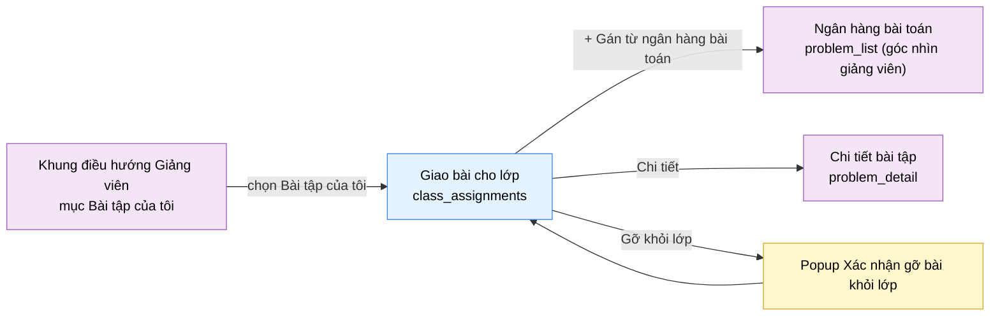

# Tài liệu thiết kế cơ bản (BD) — Giao bài cho lớp (`INS0202`)

## Phương châm tài liệu [Nội bộ — không cần khách duyệt]

- Viết theo **mẫu 9 sheet**. Bộ thẻ đóng, quy ước ID, ký hiệu chuẩn, ranh giới với tài liệu khác và
  checklist kiểm toán nằm ở `02-bd/_rules/bd-template-9sheet.md` — file này không chép lại.
- Phần gắn nhãn `[Nội bộ]` phục vụ sinh mã và tự kiểm toán, không phải yêu cầu của khách hàng: mục 4.5,
  mục 7.3 và các ghi chú quy ước.
- Mã màn `INS0202` theo bảng mã ở `02-bd/_rules/bd-template-9sheet.md` mục 8 dòng 152; tên file mang tiền
  tố mã.
- Màn này không có màn con. Có **1 popup**: Xác nhận gỡ bài khỏi lớp.
- Khung điều hướng bên trái **không mô tả lại ở đây** — dùng chung `02-bd/screens/teacher/_shell.md`.
  Khu Giảng viên **không có toolbar dùng chung**, nên hàng đầu tiên trong `<main>` là item của chính màn
  này và được mô tả ở Khu vực A [Nguồn: 02-bd/screens/teacher/_shell.md:30,113-114].

> Đọc cùng `01-rd/screens/teacher/INS0202_class_assignments.md` (hành vi ở mức yêu cầu, không lặp lại ở
> đây), `02-bd/database/problem-bank.md` mục 1.7 (bảng `class_assignments`) và mục 1.1 (bảng `problems`).
>
> **Không thiết kế** vòng đời lớp (tạo, sửa, xoá lớp, mã mời, danh sách học viên) — thuộc màn
> `class_management` (`INS0201`) [Nguồn: DEC-2026-0828-split-class-management-assignments].
> **Không thiết kế** việc soạn hay quản lý bản thân bài toán — thuộc hai màn dùng chung
> `problem_management` và `problem_authoring` [Nguồn: DEC-2026-0825-shared-content-authoring-screens].
> **Không thiết kế** modal "Giao cho lớp này": theo quyết định đã chốt, modal chọn lớp nằm trên **từng
> dòng của `problem_list` ở góc nhìn giảng viên**, không nằm ở màn này
> [Nguồn: DEC-2026-0831-class-assignments-round2]. Màn này chỉ có nút điều hướng sang đó.
> **Không thiết kế** bất kỳ giao diện chấm lại nào — tính năng đã loại hoàn toàn khỏi phạm vi
> [Nguồn: DEC-2026-0828-remove-rejudge-scope].

> **Quy ước đặt tên khối** [Nội bộ]. Màn này nằm trong cụm 4 màn lớp học, gốc cụm là `class_management`
> [Nguồn: 02-bd/screens/teacher/INS0201_class_management.md:27-30]. Dùng lại tên khối chuẩn của cụm:
> `header` (hàng đầu `<main>`), `stats` (dải thẻ số liệu), `popup` (mọi popup). Khối danh sách của màn
> này đặt theo nội dung thật: `assignmentList` (bộ lọc và bảng bài đã gán). Cột trong danh sách thêm
> đoạn `col`. Tiền tố ID item của màn: `classAssignments.`.

---

## Sheet 1. Bìa

| Mục | Giá trị |
| :--- | :--- |
| Hệ thống | AlgoPrep |
| Phân hệ | `problem-bank` (F2) |
| Công đoạn | BD — Thiết kế cơ bản |
| Phân loại | Màn hình |
| Tên màn | Giao bài cho lớp ("Bài tập của tôi") |
| Mã màn hình | `INS0202` |
| Tên vật lý (slug) | `class_assignments` |
| Trục tài liệu | Màn hình (`02-bd/screens/`) |
| Actor | A2 (`INSTRUCTOR`) |
| Phiên bản | V0.2 |
| Người tạo | Nhóm phát triển AlgoPrep |
| Ngày tạo | 2026/09/21 |
| Người cập nhật | Nhóm phát triển AlgoPrep |
| Ngày cập nhật | 2026/10/03 |

---

## Sheet 2. Lịch sử sửa đổi

| Ver | Sheet bị sửa | Nội dung sửa | Ngày | Người sửa |
| :--- | :--- | :--- | :--- | :--- |
| V0.1 | Toàn bộ | Tạo mới theo mẫu 9 sheet. Chốt nguồn dữ liệu của mọi trường hiển thị, ánh xạ về `problem.class_assignments` / `problems` / `problem_stats`. Thiết kế bổ sung hành động gỡ bài khỏi lớp (ẩn mềm) theo `DEC-2026-0831-class-assignments-round2` mà prototype chưa dựng. Phát sinh 10 câu hỏi mở | 2026/09/21 | Nhóm phát triển AlgoPrep |
| V0.2 | 1, 8, 9 | Áp `DEC-2026-1003-toast-feedback-channel`: kết quả gỡ bài và lỗi gọi máy chủ ghi là toast, bỏ cụm "lỗi trên màn chính" | 2026-10-03 | AI |

---

## Sheet 3. Sơ đồ chuyển màn

> [Nội bộ] Quy ước vẽ: bố trí từ trái sang phải. Màn gọi tới tô tím, màn hiện tại tô xanh nhạt, popup tô
> vàng. Màu và `[Nguồn:]` dùng để truy vết, không phải yêu cầu của khách hàng.

### 3.1 Danh sách chuyển màn

#### Khung điều hướng Giảng viên → Giao bài cho lớp

[Điều kiện mở] Chọn mục "Bài tập của tôi" (mục nav thứ 3) trên thanh điều hướng bên trái của khu Giảng
viên [Nguồn: 02-bd/screens/teacher/_shell.md:74].

[Chế độ mở] Không có.

[Thông tin truyền] Không có.

[Giá trị trả về] Không có.

[Khi thành công] Tải 4 thẻ số liệu tổng, danh sách lớp để dựng tab lọc, và bảng bài đã gán ở bộ lọc mặc
định "Tất cả" với ô tìm kiếm rỗng.

[Khi huỷ] Không có.

#### Giao bài cho lớp → Ngân hàng bài toán (`problem_list`, góc nhìn giảng viên)

[Điều kiện mở] Bấm nút "+ Gán từ ngân hàng bài toán" ở hàng đầu
[Nguồn: 09-layoutBase/Giáo viên - Bài tập của tôi.dc.html:120].

[Chế độ mở] Mở `problem_list` ở **góc nhìn giảng viên** — mỗi dòng bài toán có thêm nút "Giao cho lớp
này" mở modal chọn lớp ngay tại chỗ [Nguồn: DEC-2026-0831-class-assignments-round2]. Modal đó
thuộc thiết kế của `problem_list`, **không** thuộc màn này.

[Thông tin truyền] Không có tham số bắt buộc. Nếu tab lọc đang chọn một lớp cụ thể thì truyền thêm `id`
lớp đó để modal bên kia chọn sẵn — đề xuất của BD, xem Câu hỏi mở Q7.

[Giá trị trả về] Không có. Việc gán bài ghi trực tiếp ở màn đích.

[Khi thành công] Rời màn hiện tại sang `problem_list`. Màn này không có thay đổi chưa lưu nên không hỏi
xác nhận.

[Khi huỷ] Không có.

#### Giao bài cho lớp → Chi tiết bài tập

[Điều kiện mở] Bấm nút "Chi tiết" trên một dòng của bảng bài đã gán
[Nguồn: 09-layoutBase/Giáo viên - Bài tập của tôi.dc.html:165].

[Chế độ mở] Chế độ xem đề bài (góc nhìn giảng viên), không mở trình soạn thảo bài toán.

[Thông tin truyền] `id` bài toán của dòng được chọn.

[Giá trị trả về] Không có.

[Khi thành công] Điều hướng sang màn `problem_detail`. Đích này theo kết luận đã chốt của RD, không theo
liên kết trong prototype [Nguồn: 01-rd/screens/teacher/INS0202_class_assignments.md:123] — xem Câu hỏi
mở Q8.

[Khi huỷ] Không có.

#### Giao bài cho lớp → Popup Xác nhận gỡ bài khỏi lớp

[Điều kiện mở] Bấm "Gỡ khỏi lớp" trên một dòng của bảng bài đã gán.

[Chế độ mở] Hai chế độ theo bộ lọc đang chọn: tab đang lọc **một lớp cụ thể** thì popup chỉ xác nhận;
tab đang là "Tất cả" và bài đang gán cho nhiều lớp thì popup buộc chọn lớp cần gỡ trước khi xác nhận.

[Thông tin truyền] `id` bài toán, tên bài toán, và danh sách lớp bài đó đang được gán.

[Giá trị trả về] Kết quả chọn "Gỡ khỏi lớp" hoặc "Huỷ".

[Khi thành công] Hiển thị cảnh báo: bài sẽ **không còn hiện trong danh sách được giao** của lớp kể từ
lúc gỡ, nhưng **lịch sử nộp bài, điểm và tiến độ của học viên vẫn giữ nguyên**
[Nguồn: DEC-2026-0831-class-assignments-round2].

[Khi huỷ] Đóng popup, bài vẫn được gán cho lớp.

### 3.2 Sơ đồ

[Nguồn: 09-layoutBase/Giáo viên - Bài tập của tôi.dc.html:115-121,152-167; 01-rd/screens/teacher/INS0202_class_assignments.md:63-86,122-124]

---

## Sheet 4. Bố cục màn hình

### 4.1 Tổng quan màn

[Mục đích màn] Cho giảng viên xem toàn bộ bài toán đã gán cho các lớp mình phụ trách, lọc theo lớp và
theo tên bài, theo dõi mức độ sử dụng của từng bài (lượt nộp, tỉ lệ AC), mở đường sang ngân hàng bài
toán để gán thêm, và gỡ một bài khỏi một lớp
[Nguồn: 01-rd/screens/teacher/INS0202_class_assignments.md:15-18; 01-rd/req/problem-bank.md:44,52].

[Luồng nghiệp vụ chính]

1. **Hiển thị ban đầu**: vào màn, hệ thống tải song song ba nhóm dữ liệu — 4 thẻ số liệu tổng, danh sách
   lớp phụ trách để dựng tab lọc, và bảng bài đã gán ở bộ lọc "Tất cả". Trong lúc chờ, mỗi khối hiển thị
   khung chờ đúng số dòng dự kiến.
2. **Lọc và tìm**: gõ từ khoá vào ô "Tìm theo tên bài" và/hoặc chọn một tab lớp. Hai bộ lọc cộng dồn
   (AND), số kết quả hiển thị ở góc phải hàng lọc
   [Nguồn: 09-layoutBase/Giáo viên - Bài tập của tôi.dc.html:279-284].
3. **Gán thêm bài**: bấm "+ Gán từ ngân hàng bài toán" để sang `problem_list`; việc chọn bài và chọn lớp
   diễn ra ở màn đó [Nguồn: DEC-2026-0831-class-assignments-round2].
4. **Xem chi tiết một bài**: bấm "Chi tiết" để sang `problem_detail`.
5. **Gỡ bài khỏi lớp**: bấm "Gỡ khỏi lớp" trên một dòng, chọn lớp nếu cần, xác nhận trong popup. Gỡ là
   **ẩn mềm**: dòng `class_assignments` được đặt `removed_at`, không xoá dòng và không đụng tới lịch sử
   nộp bài [Nguồn: 02-bd/database/problem-bank.md:125].

[Người dùng] Giảng viên đã đăng nhập, có Function `CLASS_MANAGEMENT` [Nguồn: 01-rd/req/identity.md:57].

[Tệp liên quan] Không có. Màn này không xuất hay nhập tệp.

[Phạm vi]
- Chỉ các bài đang được gán (`removed_at IS NULL`) cho lớp có `instructor_id` bằng người đang đăng nhập.
  Bài đã gỡ không hiển thị; không có chế độ xem lịch sử gán/gỡ ở màn này.
- **Không** tạo, sửa, xoá bản thân bài toán — thuộc `problem_authoring` và `problem_management`
  [Nguồn: DEC-2026-0825-shared-content-authoring-screens].
- **Không** chọn bài và chọn lớp để gán tại màn này — thao tác gán nằm trên `problem_list`
  [Nguồn: DEC-2026-0831-class-assignments-round2].
- **Không** quản lý lớp hay học viên — thuộc `class_management` [Nguồn: DEC-2026-0828-split-class-management-assignments].
- **Không** có giao diện chấm lại [Nguồn: DEC-2026-0828-remove-rejudge-scope].
- **Không** hiển thị dữ liệu của học viên cụ thể; số liệu ở màn này ở mức bài toán, không ở mức người học.

[Quyền sử dụng]
- Xem: được, khi có `CLASS_MANAGEMENT:READ`.
- Thêm: không — việc gán bài xảy ra ở màn `problem_list`.
- Sửa: được — gỡ bài khỏi lớp là thao tác `CLASS_MANAGEMENT:UPDATE` (ẩn mềm, không phải xoá)
  [Nguồn: DEC-2026-0831-class-assignments-round2].
- Xoá: không. Màn này không có thao tác xoá thật nào.

[Số bản ghi tối đa] Thẻ số liệu: đúng 4 thẻ. Tab lọc: 1 + số lớp phụ trách. Bảng bài đã gán: phân trang,
xem Câu hỏi mở Q9 (prototype dựng 18 dòng liền một mạch).

[Nguồn: 01-rd/screens/teacher/INS0202_class_assignments.md:40-49,63-86; 02-bd/database/problem-bank.md:116-128]

### 4.2 DTO liên quan

- `InstructorAssignmentSummaryDto` — 4 thẻ số liệu tổng.
- `AssignedProblemRowDto` — một dòng của bảng bài đã gán.
- `AssignmentClassRefDto` — một lớp mà bài đang được gán (dùng ở cột "Gán cho lớp" và trong popup gỡ).
- `RemoveAssignmentCommandDto` — dữ liệu thao tác gỡ bài khỏi một lớp.

`[Suy luận]` — tên DTO do BD này đề xuất, `03-dd/api/problem-bank.md` chốt lại.

### 4.3 Bảng dữ liệu liên quan (6)

| NO | Bảng | Ghi chú |
| --: | :--- | :--- |
| 1 | `problem.class_assignments` | Nguồn dữ liệu chính của bảng danh sách [Nguồn: 02-bd/database/problem-bank.md:116-128] |
| 2 | `problem.problems` | Tên bài, độ khó, trạng thái xuất bản, cờ ẩn mềm [Nguồn: 02-bd/database/problem-bank.md:15,17,18,19] |
| 3 | `problem.problem_topics` | Nối bài toán với chủ đề [Nguồn: 02-bd/database/problem-bank.md:35-39] |
| 4 | `problem.topics` | Tên chủ đề hiển thị ở cột "Chủ đề" [Nguồn: 02-bd/database/problem-bank.md:37-38] |
| 5 | `problem.problem_stats` | Read model lượt nộp và tỉ lệ AC [Nguồn: 02-bd/database/problem-bank.md:138-139]. Hiện là read model **toàn cục theo bài toán**, không theo lớp — xem Câu hỏi mở Q3 |
| 6 | `identity.classes` | Tên lớp cho tab lọc và cột "Gán cho lớp" [Nguồn: 02-bd/database/identity.md:85-88]. Đọc **qua cổng ra** sang `identity`, không join chéo schema |

Số "Cần chấm tay" **không đọc từ bảng của `problem-bank`**: nó thuộc `ai-review` (F5-27, cột
`manual_graded_by` [Nguồn: 02-bd/database/ai-review.md:56]), lấy qua endpoint của module sở hữu — xem
Câu hỏi mở Q4.

### 4.4 Vùng bố cục

Đối chiếu `09-layoutBase/Giáo viên - Bài tập của tôi.dc.html` — bằng chứng bố cục chỉ-đọc, **không phải**
design system cuối cùng.

| Vùng | Vị trí trong prototype | Nội dung |
| :--- | :--- | :--- |
| Thanh điều hướng bên trái (khung chung Giảng viên) | `:225-231` | Mục "Bài tập của tôi" đang chọn, badge `18` — dùng lại khung chung, không mô tả lại ở đây |
| Container nội dung | `:112-113` | `max-width: 1320px` căn giữa, các khối xếp dọc, khoảng cách đều |
| Hàng đầu — tiêu đề và nút chính | `:115-121` | Tiêu đề "Bài tập của tôi", dòng phụ "18 bài đã gán cho lớp · từ ngân hàng bài toán chung", nút "+ Gán từ ngân hàng bài toán". **Không phải toolbar dùng chung** — khu Giảng viên không có toolbar [Nguồn: 02-bd/screens/teacher/_shell.md:30] |
| Dải thẻ số liệu | `:123-134`, dữ liệu `:259-264` | Lưới `auto-fit minmax(200px, 1fr)`, 4 thẻ: Bài đã gán, Lượt nộp tuần này, AC trung bình, Cần chấm tay. Ba thẻ có dòng phụ, hai thẻ có phần chênh lệch |
| Khối danh sách — hàng lọc | `:138-149`, dữ liệu `:266-271,301` | Ô tìm theo tên bài (co giãn), cụm tab lọc theo lớp (Tất cả + tên từng lớp), số kết quả căn phải |
| Khối danh sách — bảng | `:151-170`, dữ liệu `:286-292` | Lưới 7 cột `minmax(200px,1.6fr) 130px 96px 130px 90px 90px 100px`, `min-width: 900px`, cuộn ngang khi hẹp; hai cột số căn phải |
| Chân trang | không có | Cả 5 prototype khu Giảng viên đều không có `<footer>` [Nguồn: 02-bd/screens/teacher/_shell.md:31] |

Hai điều khiển dưới đây **không có trong prototype** và do BD này thiết kế bổ sung:

- **Nút "Gỡ khỏi lớp"** trên mỗi dòng, cùng popup xác nhận. Prototype chỉ có nút "Chi tiết"
  [Nguồn: 09-layoutBase/Giáo viên - Bài tập của tôi.dc.html:164-166], nhưng hành động gỡ đã được chốt sau
  khi prototype vẽ xong [Nguồn: DEC-2026-0831-class-assignments-round2]. Vị trí đề xuất: nút thứ
  hai trong cụm nút cuối dòng, đặt sau "Chi tiết" — xem Câu hỏi mở Q7.
- **Trạng thái rỗng và trạng thái lỗi** của bảng. Prototype luôn có dữ liệu mẫu nên không dựng hai
  trạng thái này.

### 4.5 Cấu trúc slice FSD [Nội bộ]

| Khối | Slice dự kiến | Căn cứ |
| :--- | :--- | :--- |
| Trang | `views/teacher/class-assignments` | Quy ước FSD của dự án; slice đã được tạo sẵn dạng stub [Nguồn: 02-bd/screens/teacher/_shell.md:13-14] |
| Khung Giảng viên | Dùng lại `widgets/app-shell` (biến thể `instructor-sidebar`) | `02-bd/screens/teacher/_shell.md` mục 1 |
| Dải thẻ số liệu | `widgets/assignment-summary-stats` | Prototype `:123-134` |
| Bảng bài đã gán | `widgets/class-assignment-table` + `entities/class-assignment` | Prototype `:136-171` |
| Tab lọc theo lớp | Dùng lại `entities/class` | Đã khai ở `02-bd/screens/teacher/INS0201_class_management.md:298-300`, không định nghĩa lại |
| Popup gỡ bài | `features/class-assignment-remove` | BD này thiết kế bổ sung |

`[Suy luận]` — ánh xạ slice do BD đề xuất, DD màn hình chốt lại. `entities/class` và
`entities/class-student` là tài sản chung của cụm lớp, màn này chỉ dùng lại `entities/class`.

> [Nội bộ] Ảnh minh hoạ đặt ở `08-diagram/02-bd/screens/teacher/`, chụp bằng Playwright trên ứng dụng
> Next.js thật khi đã có mã chạy được. Chưa có thì tham chiếu prototype, không vẽ tay.

---

## Sheet 5. Danh sách item màn hình

> Quy ước ID, bộ thẻ và giá trị chuẩn: `02-bd/_rules/bd-template-9sheet.md` mục 2, 3, 4.

### Khu vực A — Hàng đầu

| Khu vực | NO | Tên item | ID item | Bảng DB | Cột DB | Loại UI | Kiểu | Độ dài | Bắt buộc | I/O | Giá trị mặc định | Định dạng | Ghi chú |
| :--- | --: | :--- | :--- | :--- | :--- | :--- | :--- | :--- | :-: | :-: | :--- | :--- | :--- |
| Hàng đầu | | | | | | | | | | | | | |
| | 1 | Tiêu đề màn | `classAssignments.header.title` | - | - | Label | String | - | - | O | Bài tập của tôi | - | Tên màn hiển thị cố định [Nguồn giá trị] Nhãn tĩnh i18n [EVT liên quan] - |
| | 2 | Dòng tóm tắt | `classAssignments.header.summary` | `problem.class_assignments` | `id` | Label | String | - | - | O | - | `{số} bài đã gán cho lớp · từ ngân hàng bài toán chung` | Tổng quy mô bài đã giao của người đang đăng nhập [Công thức] Đếm `problem_id` phân biệt trong `class_assignments` có `removed_at IS NULL` và `class_id` thuộc các lớp người đăng nhập phụ trách [EVT liên quan] EVT-1 |
| | 3 | Gán từ ngân hàng bài toán | `classAssignments.header.btnAssignFromBank` | - | - | Button | - | - | - | I | - | `+ Gán từ ngân hàng bài toán` | Điều hướng sang `problem_list` ở góc nhìn giảng viên, nơi có nút "Giao cho lớp này" từng dòng [Nguồn: DEC-2026-0831-class-assignments-round2] [Nguồn giá trị] - [EVT liên quan] EVT-2 |

### Khu vực B — Thẻ số liệu

| Khu vực | NO | Tên item | ID item | Bảng DB | Cột DB | Loại UI | Kiểu | Độ dài | Bắt buộc | I/O | Giá trị mặc định | Định dạng | Ghi chú |
| :--- | --: | :--- | :--- | :--- | :--- | :--- | :--- | :--- | :-: | :-: | :--- | :--- | :--- |
| Thẻ số liệu | | | | | | | | | | | | | |
| | 1 | Bài đã gán | `classAssignments.stats.assignedCount` | `problem.class_assignments` | `problem_id`, `removed_at` | Label | Number | 4 | - | O | 0 | Số nguyên | Số bài toán đang được gán cho ít nhất một lớp phụ trách; dòng phụ "Trên {số} lớp" [Công thức] Đếm `problem_id` phân biệt trong `class_assignments` có `removed_at IS NULL`, giới hạn theo các `class_id` người đăng nhập phụ trách [EVT liên quan] EVT-1 |
| | 2 | Lượt nộp tuần này | `classAssignments.stats.weeklySubmissions` | - | - | Label | Number | 6 | - | O | - | Số nguyên | Số lượt nộp trong 7 ngày gần nhất trên các bài đã gán [Nguồn giá trị] **Chưa có nguồn**: `problem_stats` chỉ có bộ đếm luỹ kế, không có chiều thời gian [Nguồn: 02-bd/database/problem-bank.md:138] — xem Câu hỏi mở Q1 [EVT liên quan] EVT-1 |
| | 3 | Chênh lệch lượt nộp | `classAssignments.stats.weeklySubmissionsDelta` | - | - | Label | String | 6 | - | O | - | `{dấu}{số}` | Mức tăng giảm lượt nộp so với tuần trước [Nguồn giá trị] **Chưa có nguồn**: không có bảng ảnh chụp theo tuần trong `problem-bank` — xem Câu hỏi mở Q1 [EVT liên quan] EVT-1 |
| | 4 | AC trung bình | `classAssignments.stats.avgAcRate` | `problem.problem_stats` | `ac_rate` | Label | Number | 3 | - | O | - | `{số}%` | Tỉ lệ Accepted trung bình trên các bài đã gán [Công thức] Trung bình cộng `ac_rate` của các bài đang được gán. Prototype ghi dòng phụ "90 ngày gần nhất" nhưng `problem_stats` là luỹ kế toàn thời gian — xem Câu hỏi mở Q2 [EVT liên quan] EVT-1 |
| | 5 | Chênh lệch AC | `classAssignments.stats.avgAcRateDelta` | - | - | Label | String | 6 | - | O | - | `{dấu}{số}%` | Mức tăng giảm AC trung bình so với kỳ trước [Nguồn giá trị] **Chưa có nguồn**: cùng lý do với NO 3 — xem Câu hỏi mở Q2 [EVT liên quan] EVT-1 |
| | 6 | Cần chấm tay | `classAssignments.stats.pendingGrading` | - | - | Label | Number | 4 | - | O | - | Số nguyên | Số lượt nộp đang chờ chấm tay trên các lớp phụ trách (F5-27); dòng phụ "AI chấm điểm thấp" [Nguồn giá trị] Endpoint `CountPendingManualGrading` của `ai-review`, không truy vấn chéo schema — xem Câu hỏi mở Q4 [EVT liên quan] EVT-1 |

### Khu vực C — Danh sách bài đã gán

| Khu vực | NO | Tên item | ID item | Bảng DB | Cột DB | Loại UI | Kiểu | Độ dài | Bắt buộc | I/O | Giá trị mặc định | Định dạng | Ghi chú |
| :--- | --: | :--- | :--- | :--- | :--- | :--- | :--- | :--- | :-: | :-: | :--- | :--- | :--- |
| Danh sách bài đã gán | | | | | | | | | | | | | |
| | 1 | Tìm theo tên bài | `classAssignments.assignmentList.search` | `problem.problems` | `title` | TextBox | String | 100 | - | I | rỗng | Chuỗi tự do | Lọc theo tên bài, không phân biệt hoa thường, khớp chuỗi con [Nguồn giá trị] Giá trị người dùng nhập; đối chiếu cột `title` [EVT liên quan] EVT-3 |
| | 2 | Tab lọc theo lớp | `classAssignments.assignmentList.classTabs` | `identity.classes` | `id`, `name` | Button | List | - | - | I/O | Tất cả | - | Cụm tab: mục "Tất cả" cố định cộng một mục cho mỗi lớp phụ trách [Nguồn giá trị] Mục "Tất cả" là nhãn tĩnh i18n; các mục còn lại lấy `classes.name` qua `ListInstructorClasses` [EVT liên quan] EVT-4 |
| | 3 | Số kết quả | `classAssignments.assignmentList.resultCount` | - | - | Label | String | 12 | - | O | - | `{số} / {số} bài` | Số dòng sau lọc trên tổng số bài đã gán [Công thức] Số dòng của kết quả lọc hiện tại chia trên giá trị của Khu vực B NO 1 [EVT liên quan] EVT-3, EVT-4 |
| | 4 | Bảng bài đã gán | `classAssignments.assignmentList.table` | `problem.class_assignments` | - | List | List | - | - | O | rỗng | - | Bài đang được gán cho các lớp phụ trách, lọc theo tab và từ khoá [Nguồn giá trị] Kết quả gọi `ListClassAssignments` [EVT liên quan] EVT-1, EVT-3, EVT-4 |
| | 5 | Bài tập | `classAssignments.assignmentList.col.title` | `problem.problems` | `title` | ListColumn | String | 200 | - | O | - | - | Tên bài toán, cắt bớt bằng dấu ba chấm khi tràn cột [Nguồn giá trị] Cột `title` [Nguồn: 02-bd/database/problem-bank.md:15] [EVT liên quan] - |
| | 6 | Chủ đề | `classAssignments.assignmentList.col.topic` | `problem.topics` | `name` | ListColumn | String | 60 | - | O | - | - | Chủ đề của bài toán [Nguồn giá trị] `topics.name` nối qua `problem_topics` [Nguồn: 02-bd/database/problem-bank.md:37-38]. Quan hệ là N-N nhưng cột chỉ có một ô — cách hiển thị khi bài có nhiều chủ đề xem Câu hỏi mở Q5 [EVT liên quan] - |
| | 7 | Độ khó | `classAssignments.assignmentList.col.difficulty` | `problem.problems` | `difficulty` | Badge | Enum | - | - | O | - | Huy hiệu ba mức | Ba mức `EASY` / `MEDIUM` / `HARD` [Nguồn: 02-bd/database/problem-bank.md:17] [Nguồn giá trị] Cột `difficulty`; nhãn hiển thị lấy từ i18n [EVT liên quan] - |
| | 8 | Gán cho lớp | `classAssignments.assignmentList.col.assignedClasses` | `identity.classes` | `name` | ListColumn | String | 200 | - | O | - | Tên lớp nối bằng dấu phẩy | Danh sách lớp mà bài này đang được gán, trong phạm vi lớp người đăng nhập phụ trách [Công thức] Lấy `class_id` của các dòng `class_assignments` có `removed_at IS NULL` rồi đổi sang tên lớp qua cổng ra sang `identity`; tràn cột thì cắt bằng dấu ba chấm [Nguồn: 09-layoutBase/Giáo viên - Bài tập của tôi.dc.html:161] [EVT liên quan] - |
| | 9 | Lượt nộp | `classAssignments.assignmentList.col.submissionCount` | `problem.problem_stats` | `submission_count` | ListColumn | Number | 8 | - | O | 0 | Số nguyên, phân tách hàng nghìn | Tổng lượt nộp của bài toán [Nguồn giá trị] Cột `submission_count` [Nguồn: 02-bd/database/problem-bank.md:138]. Là số **toàn hệ thống**, không giới hạn trong lớp — xem Câu hỏi mở Q3 [EVT liên quan] - |
| | 10 | AC | `classAssignments.assignmentList.col.acRate` | `problem.problem_stats` | `ac_rate` | ListColumn | Number | 3 | - | O | - | `{số}%` | Tỉ lệ Accepted của bài toán [Nguồn giá trị] Cột `ac_rate` [Nguồn: 02-bd/database/problem-bank.md:138]. Cùng phạm vi toàn hệ thống với NO 9 — xem Câu hỏi mở Q3 [EVT liên quan] - |
| | 11 | Chi tiết | `classAssignments.assignmentList.col.btnDetail` | `problem.problems` | `id` | Link | - | - | - | I | - | `Chi tiết` | Mở màn `problem_detail` của bài toán ở chế độ xem [Nguồn giá trị] - [EVT liên quan] EVT-5 |
| | 12 | Gỡ khỏi lớp | `classAssignments.assignmentList.col.btnRemove` | `problem.class_assignments` | `id`, `removed_at` | Button | - | - | - | I | - | `Gỡ khỏi lớp` | Mở popup xác nhận gỡ bài khỏi lớp. **Không có trong prototype**, BD thiết kế bổ sung theo quyết định đã chốt [Nguồn: DEC-2026-0831-class-assignments-round2] — vị trí xem Câu hỏi mở Q7 [Nguồn giá trị] - [EVT liên quan] EVT-6 |

### Popup

| Khu vực | NO | Tên item | ID item | Bảng DB | Cột DB | Loại UI | Kiểu | Độ dài | Bắt buộc | I/O | Giá trị mặc định | Định dạng | Ghi chú |
| :--- | --: | :--- | :--- | :--- | :--- | :--- | :--- | :--- | :-: | :-: | :--- | :--- | :--- |
| Popup | | | | | | | | | | | | | |
| | 1 | Xác nhận gỡ bài khỏi lớp | `classAssignments.popup.removeAssignmentConfirm` | `problem.class_assignments` | `id`, `removed_at` | Popup | - | - | - | I | - | Gỡ khỏi lớp / Huỷ | Xác nhận trước khi gỡ; nêu rõ bài chỉ **ẩn khỏi danh sách được giao từ thời điểm gỡ**, lịch sử nộp bài và điểm của học viên **giữ nguyên** [Nguồn: DEC-2026-0831-class-assignments-round2] [Nguồn giá trị] Tên bài và tên lớp của dòng được chọn [EVT liên quan] EVT-6, EVT-8, EVT-9 |
| | 2 | Lớp cần gỡ | `classAssignments.popup.removeClassChoice` | `identity.classes` | `id`, `name` | List | List | - | Bắt buộc | I | Lớp đang lọc | Danh sách chọn một lớp | Chọn lớp sẽ gỡ bài này. Cần vì một bài có thể đang gán cho nhiều lớp [Nguồn: 09-layoutBase/Giáo viên - Bài tập của tôi.dc.html:197] [Nguồn giá trị] Các `class_id` của bài trong `class_assignments` có `removed_at IS NULL`, đổi tên qua cổng ra sang `identity` — xem Câu hỏi mở Q6 [EVT liên quan] EVT-7 |

[Nguồn: 09-layoutBase/Giáo viên - Bài tập của tôi.dc.html:115-121,123-134,138-149,151-170,259-264,266-271,286-292,301; 02-bd/database/problem-bank.md:15-19,35-39,116-128,138-139; 02-bd/database/identity.md:85-88]

---

## Sheet 6. Đặc tả điều khiển item

> Ký hiệu cột `Hiển thị` và thứ tự thẻ: `02-bd/_rules/bd-template-9sheet.md` mục 2, 3. Dùng đúng NO, tên
> item và thứ tự của Sheet 5. Lỗi nhập liệu ghi ở Sheet 9, xử lý nghiệp vụ ghi ở Sheet 8.

### Khu vực A — Hàng đầu

| Khu vực | NO | Tên item | Hiển thị | Ghi chú |
| :--- | --: | :--- | :-: | :--- |
| Hàng đầu | | | | |
| | 1 | Tiêu đề màn | Có | - |
| | 2 | Dòng tóm tắt | Có | [Tự động đặt] Tính lại sau mỗi lần gỡ bài thành công và sau mỗi lần quay lại màn từ `problem_list`. Trong lúc tải hiển thị khung chờ một dòng. |
| | 3 | Gán từ ngân hàng bài toán | Điều kiện | [Điều kiện hiển thị] Chỉ hiển thị khi người dùng có `CLASS_MANAGEMENT:UPDATE` — thao tác gán bài diễn ra ở màn đích nhưng nút này là đường vào duy nhất từ đây. [Điều kiện kích hoạt] Luôn kích hoạt, kể cả khi bảng đang tải: nút không phụ thuộc dữ liệu của màn. |

### Khu vực B — Thẻ số liệu

| Khu vực | NO | Tên item | Hiển thị | Ghi chú |
| :--- | --: | :--- | :-: | :--- |
| Thẻ số liệu | | | | |
| | 1 | Bài đã gán | Có | [Điều kiện hiển thị] Trong lúc tải hiển thị khung chờ đúng 4 thẻ. Chưa gán bài nào thì hiển thị `0` kèm dòng phụ "Trên 0 lớp". |
| | 2 | Lượt nộp tuần này | Điều kiện | [Điều kiện hiển thị] Chỉ hiển thị khi đã chốt nguồn dữ liệu ở Câu hỏi mở Q1; chưa chốt thì ẩn cả thẻ, dải còn 3 thẻ. Không hiển thị `0` vì `0` đọc thành "không ai nộp bài". |
| | 3 | Chênh lệch lượt nộp | Điều kiện | [Điều kiện hiển thị] Chỉ hiển thị khi có dữ liệu tuần trước; chưa có thì ẩn phần chênh lệch, thẻ vẫn hiển thị giá trị hiện tại. |
| | 4 | AC trung bình | Có | [Điều kiện hiển thị] Chưa gán bài nào hoặc chưa có lượt nộp nào thì hiển thị `-` thay vì `0%`. |
| | 5 | Chênh lệch AC | Điều kiện | [Điều kiện hiển thị] Chỉ hiển thị khi có dữ liệu kỳ trước; chưa có thì ẩn phần chênh lệch. Nguồn chưa chốt, xem Q2. |
| | 6 | Cần chấm tay | Điều kiện | [Điều kiện hiển thị] Gọi `ai-review` thất bại thì ẩn giá trị và hiển thị `-`; không chặn các thẻ còn lại và không chặn bảng. Đây là ràng buộc bắt buộc — phân hệ AI hỏng thì F1 tới F4 vẫn phải chạy. |

### Khu vực C — Danh sách bài đã gán

| Khu vực | NO | Tên item | Hiển thị | Ghi chú |
| :--- | --: | :--- | :-: | :--- |
| Danh sách bài đã gán | | | | |
| | 1 | Tìm theo tên bài | Có | [Điều kiện kích hoạt] Không kích hoạt trong lúc tải lần đầu; kích hoạt sau khi bảng có dữ liệu. [Tự động đặt] Giữ nguyên giá trị khi đổi tab lọc — hai bộ lọc cộng dồn, không reset lẫn nhau. |
| | 2 | Tab lọc theo lớp | Điều kiện | [Điều kiện hiển thị] Chỉ hiển thị khi có từ 1 lớp trở lên; chưa phụ trách lớp nào thì ẩn cụm tab và bảng hiển thị trạng thái rỗng riêng. [Tự động đặt] Mặc định "Tất cả" mỗi lần vào màn; không lưu lựa chọn giữa các phiên. |
| | 3 | Số kết quả | Có | [Điều kiện hiển thị] Ẩn trong lúc tải; hiện lại khi đã có kết quả, kể cả khi kết quả bằng 0. |
| | 4 | Bảng bài đã gán | Có | [Điều kiện hiển thị] Trong lúc tải hiển thị khung chờ 8 dòng. Chưa gán bài nào thì hiển thị trạng thái rỗng "Chưa gán bài nào cho lớp — Gán từ ngân hàng bài toán". Lọc xong không còn dòng nào thì hiển thị "Không có bài nào khớp bộ lọc". Hai trạng thái rỗng khác nhau, không dùng chung một câu. |
| | 5 | Bài tập | Có | - |
| | 6 | Chủ đề | Điều kiện | [Điều kiện hiển thị] Bài chưa gắn chủ đề nào thì hiển thị `-`, không để ô trống. |
| | 7 | Độ khó | Có | - |
| | 8 | Gán cho lớp | Điều kiện | [Điều kiện hiển thị] Chỉ hiển thị khi tab đang chọn là "Tất cả"; đang lọc theo một lớp cụ thể thì cột này thừa, ẩn đi để trả chỗ cho các cột số. Quy ước này lấy đúng theo cột "Lớp" của `class_management` [Nguồn: 02-bd/screens/teacher/INS0201_class_management.md:434]. |
| | 9 | Lượt nộp | Có | - |
| | 10 | AC | Có | [Điều kiện hiển thị] Bài chưa có lượt nộp nào thì hiển thị `-` thay vì `0%`. |
| | 11 | Chi tiết | Có | [Điều kiện kích hoạt] Luôn kích hoạt sau khi tải xong. |
| | 12 | Gỡ khỏi lớp | Điều kiện | [Điều kiện hiển thị] Chỉ hiển thị khi có `CLASS_MANAGEMENT:UPDATE` và mọi lớp của dòng đó do chính người đang đăng nhập phụ trách. [Điều kiện kích hoạt] Không kích hoạt khi popup đang mở. |

### Popup

| Khu vực | NO | Tên item | Hiển thị | Ghi chú |
| :--- | --: | :--- | :-: | :--- |
| Popup | | | | |
| | 1 | Xác nhận gỡ bài khỏi lớp | Điều kiện | [Điều kiện hiển thị] Chỉ hiển thị sau khi bấm "Gỡ khỏi lớp" trên một dòng. [Điều kiện kích hoạt] Nút "Gỡ khỏi lớp" trong popup chỉ kích hoạt khi đã xác định đúng một lớp cần gỡ. |
| | 2 | Lớp cần gỡ | Điều kiện | [Điều kiện hiển thị] Chỉ hiển thị khi bài đang gán cho từ 2 lớp trở lên **và** tab lọc đang là "Tất cả". Các trường hợp còn lại lớp đã xác định, popup chỉ nhắc tên lớp trong câu xác nhận. [Tự động đặt] Tab lọc đang là một lớp cụ thể thì chọn sẵn đúng lớp đó và không cho đổi. |

[Nguồn: 09-layoutBase/Giáo viên - Bài tập của tôi.dc.html:145,161,164-166,279-284; 02-bd/database/problem-bank.md:116-128]

---

## Sheet 7. Danh sách truyền dữ liệu

### 7.1 Trường DTO

| NO | DTO | Trường DTO | Kiểu | Bảng DB | Cột DB | Item màn | Hiển thị | Ghi chú |
| --: | :--- | :--- | :--- | :--- | :--- | :--- | :-: | :--- |
| 1 | `InstructorAssignmentSummaryDto` | `assignedProblemCount` | Number | `problem.class_assignments` | `problem_id` | Thẻ "Bài đã gán", Hàng đầu "Dòng tóm tắt" | Có | [Chuyển đổi] Đếm phân biệt, chỉ tính dòng `removed_at IS NULL`. |
| 2 | `InstructorAssignmentSummaryDto` | `classCount` | Number | `identity.classes` | `id` | Dòng phụ thẻ "Bài đã gán" | Có | [Nguồn] Kết quả `ListInstructorClasses`, dùng để dựng chuỗi "Trên {số} lớp". |
| 3 | `InstructorAssignmentSummaryDto` | `weeklySubmissionCount` | Number | - | - | Thẻ "Lượt nộp tuần này" | Có | [Nguồn] **Chưa xác định** — không có chiều thời gian trong `problem_stats`, xem Q1. Không có giá trị thì để rỗng và giao diện ẩn thẻ. |
| 4 | `InstructorAssignmentSummaryDto` | `weeklySubmissionDelta` | Number | - | - | Thẻ "Chênh lệch lượt nộp" | Có | [Nguồn] **Chưa xác định**, cùng lý do NO 3. |
| 5 | `InstructorAssignmentSummaryDto` | `avgAcRatePercent` | Number | `problem.problem_stats` | `ac_rate` | Thẻ "AC trung bình" | Có | [Chuyển đổi] Trung bình cộng `ac_rate` của các bài đang gán, làm tròn số nguyên. |
| 6 | `InstructorAssignmentSummaryDto` | `avgAcRateDeltaPercent` | Number | - | - | Thẻ "Chênh lệch AC" | Có | [Nguồn] **Chưa xác định** — `problem_stats` là luỹ kế, không có cửa sổ 90 ngày, xem Q2. |
| 7 | `InstructorAssignmentSummaryDto` | `pendingGradingCount` | Number | - | - | Thẻ "Cần chấm tay" | Có | [Nguồn] Phản hồi của `CountPendingManualGrading` (`ai-review`), xem Q4. |
| 8 | `AssignedProblemRowDto` | `problemId` | UUID | `problem.problems` | `id` | - | Không | [Đích] Tham số điều hướng sang `problem_detail` và tham số của `RemoveClassAssignment`. |
| 9 | `AssignedProblemRowDto` | `title` | String | `problem.problems` | `title` | Bảng "Bài tập" | Có | - |
| 10 | `AssignedProblemRowDto` | `topicName` | String | `problem.topics` | `name` | Bảng "Chủ đề" | Có | [Chuyển đổi] Bài nhiều chủ đề thì rút gọn, quy tắc rút gọn xem Q5. |
| 11 | `AssignedProblemRowDto` | `difficulty` | Enum | `problem.problems` | `difficulty` | Bảng "Độ khó" | Có | [Chuyển đổi] Máy chủ trả `EASY`/`MEDIUM`/`HARD`, giao diện đổi sang nhãn i18n và màu huy hiệu. |
| 12 | `AssignedProblemRowDto` | `assignedClasses` | List | `problem.class_assignments` | `class_id` | Bảng "Gán cho lớp", Popup "Lớp cần gỡ" | Có | [Chuyển đổi] Danh sách `AssignmentClassRefDto`; giao diện nối tên bằng dấu phẩy. |
| 13 | `AssignedProblemRowDto` | `submissionCount` | Number | `problem.problem_stats` | `submission_count` | Bảng "Lượt nộp" | Có | [Nguồn] Read model toàn cục theo bài toán, xem Q3. |
| 14 | `AssignedProblemRowDto` | `acRatePercent` | Number | `problem.problem_stats` | `ac_rate` | Bảng "AC" | Có | [Chuyển đổi] Chưa có lượt nộp nào thì trả rỗng, giao diện hiển thị `-`. |
| 15 | `AssignedProblemRowDto` | `problemStatus` | Enum | `problem.problems` | `status`, `deleted` | Bảng "Bài tập" (nhãn cảnh báo) | Có | [Chuyển đổi] Bài đã rút xuất bản hoặc đã ẩn mềm vẫn nằm trong danh sách đã gán nhưng gắn nhãn cảnh báo, xem Q10. |
| 16 | `AssignmentClassRefDto` | `classId` | UUID | `problem.class_assignments` | `class_id` | Popup "Lớp cần gỡ" | Không | [Đích] Tham số của `RemoveClassAssignment`. |
| 17 | `AssignmentClassRefDto` | `className` | String | `identity.classes` | `name` | Bảng "Gán cho lớp", Popup "Lớp cần gỡ" | Có | [Nguồn] Lấy qua cổng ra sang `identity`, không join chéo schema. |
| 18 | `RemoveAssignmentCommandDto` | `problemId`, `classId` | UUID | `problem.class_assignments` | `problem_id`, `class_id` | Popup "Xác nhận gỡ bài khỏi lớp" | Không | [Đích] Cặp khoá xác định dòng cần đặt `removed_at`; khớp partial unique index [Nguồn: 02-bd/database/problem-bank.md:127]. |

### 7.2 Truy cập bảng dữ liệu (6)

| NO | Tên logic | Bảng | Repository | CRUD | Mục đích | Ghi chú |
| --: | :--- | :--- | :--- | :-: | :--- | :--- |
| 1 | Bài giao cho lớp | `problem.class_assignments` | `ClassAssignmentRepository` | R, U | Liệt kê bài đang giao cho các lớp phụ trách, đặt `removed_at` khi gỡ | `ListClassAssignments`: R `GetInstructorAssignmentSummary`: R `RemoveClassAssignment`: U (ẩn mềm, không xoá dòng) |
| 2 | Bài toán | `problem.problems` | `ProblemRepository` | R | Lấy tên bài, độ khó, trạng thái xuất bản để dựng dòng | `ListClassAssignments`: R |
| 3 | Chủ đề của bài | `problem.problem_topics` | `ProblemTopicRepository` | R | Nối bài toán với chủ đề cho cột "Chủ đề" | `ListClassAssignments`: R |
| 4 | Danh mục chủ đề | `problem.topics` | `TopicRepository` | R | Lấy tên chủ đề hiển thị | `ListClassAssignments`: R |
| 5 | Thống kê bài toán | `problem.problem_stats` | `ProblemStatsRepository` | R | Lấy lượt nộp và tỉ lệ AC cho cột số và thẻ "AC trung bình" | `ListClassAssignments`: R `GetInstructorAssignmentSummary`: R |
| 6 | Lớp học | `identity.classes` | Cổng ra `InstructorClassPort` | R | Lấy danh sách lớp phụ trách cho tab lọc và tên lớp cho cột "Gán cho lớp" | `ListInstructorClasses`: R. **Không** truy vấn trực tiếp schema `identity` — `class_assignments.class_id` cố ý không có FK vật lý xuyên schema [Nguồn: 02-bd/database/problem-bank.md:122] |

Màn này **không có thao tác xoá thật nào**. Gỡ bài khỏi lớp chỉ đặt `removed_at`, dòng vẫn còn để cho
phép gán lại về sau [Nguồn: 02-bd/database/problem-bank.md:125,127], và **không** kéo theo xoá lịch sử
nộp bài — khác hẳn luồng gỡ học viên F1-26 của `class_management`
[Nguồn: DEC-2026-0831-class-assignments-round2].

`[Suy luận]` — tên repository và tên cổng ra do BD này đề xuất, DD module `problem-bank` chốt lại.

### 7.3 Danh sách endpoint [Nội bộ]

> Chỉ tên nghiệp vụ và BC sở hữu. Hợp đồng chi tiết thuộc `03-dd/api/problem-bank.md`.

| NO | Endpoint (tên nghiệp vụ) | Mục đích | BC sở hữu |
| --: | :--- | :--- | :--- |
| 1 | `GetInstructorAssignmentSummary` | Tải các thẻ số liệu tổng của màn | `problem-bank` |
| 2 | `ListClassAssignments` | Tải danh sách bài đang giao cho các lớp phụ trách, có lọc theo lớp và theo tên bài | `problem-bank` |
| 3 | `RemoveClassAssignment` | Gỡ một bài khỏi một lớp (ẩn mềm) | `problem-bank` |
| 4 | `ListInstructorClasses` | Tải danh sách lớp phụ trách để dựng tab lọc | `identity` |
| 5 | `CountPendingManualGrading` | Đếm lượt nộp chờ chấm tay theo lớp | `ai-review` |

Endpoint 4 và 5 đã được đặt tên ở `02-bd/screens/teacher/INS0201_class_management.md:514,523`; màn này
gọi lại đúng tên, không đặt tên mới. Endpoint 5 hỏng thì màn vẫn phải hiển thị đầy đủ phần còn lại.

[Nguồn: 02-bd/database/problem-bank.md:116-128,138-139; 02-bd/screens/teacher/INS0201_class_management.md:513-523]

---

## Sheet 8. Danh sách sự kiện

> Bộ thẻ và quy ước cột `Chuyển màn`: `02-bd/_rules/bd-template-9sheet.md` mục 2, 3.

### Màn chính: Giao bài cho lớp

| NO | Loại | Sự kiện | Chi tiết | Chuyển màn | Gọi API | Tên xử lý | Ghi chú |
| --: | :--- | :--- | :--- | :-: | :-: | :--- | :--- |
| 1 | Màn hình | Khởi tạo màn | Vào màn thì tải số liệu tổng, danh sách lớp và bảng bài đã gán. | Không | Có | `GetInstructorAssignmentSummary`, `ListInstructorClasses`, `ListClassAssignments` | [Các bước] 1. Kiểm tra quyền `CLASS_MANAGEMENT:READ`. 2. Hiển thị khung chờ cho dải thẻ và bảng. 3. Tải song song ba nhóm dữ liệu, bộ lọc mặc định "Tất cả", ô tìm kiếm rỗng. [Khi thành công] Hiển thị đủ hàng đầu, dải thẻ số liệu, hàng lọc và bảng bài đã gán. [Khi lỗi] Hiển thị lỗi tại đúng khối tải thất bại kèm nút "Thử lại"; các khối tải được vẫn hiển thị bình thường, không rời màn. Riêng số "Cần chấm tay" lỗi thì chỉ hiển thị `-`, không coi là lỗi màn. |
| 2 | Nút | Mở ngân hàng bài toán | Bấm "+ Gán từ ngân hàng bài toán". | Có | Không | - | [Các bước] 1. Điều hướng sang `problem_list` ở góc nhìn giảng viên; tab lọc đang chọn một lớp thì truyền kèm `id` lớp đó. [Khi thành công] Rời màn. Màn này không có thay đổi chưa lưu nên không hỏi xác nhận. Việc chọn bài và chọn lớp diễn ra ở màn đích [Nguồn: DEC-2026-0831-class-assignments-round2]. |
| 3 | Ô nhập | Tìm theo tên bài | Gõ hoặc xoá từ khoá trong ô tìm kiếm. | Không | Có | `ListClassAssignments` | [Các bước] 1. Chờ ngưng gõ rồi mới gửi yêu cầu, tránh gọi mỗi ký tự. 2. Tải lại bảng với từ khoá hiện tại và tab lọc hiện tại, hai điều kiện cộng dồn. 3. Cập nhật số kết quả. [Khi thành công] Bảng chỉ còn dòng khớp; không còn dòng nào thì hiển thị "Không có bài nào khớp bộ lọc" kèm nút xoá bộ lọc. [Khi lỗi] Giữ nguyên bảng cũ và hiển thị lỗi phía trên bảng, không xoá trắng dữ liệu đang xem. |
| 4 | Nút | Chọn tab lọc lớp | Bấm một tab trong cụm tab lọc theo lớp. | Không | Có | `ListClassAssignments` | [Các bước] 1. Đặt trạng thái lọc bằng tab được chọn, giữ nguyên từ khoá tìm kiếm. 2. Tải lại bảng. 3. Ẩn hoặc hiện lại cột "Gán cho lớp" theo tab. [Khi thành công] Bảng hiển thị đúng phạm vi tab; chọn "Tất cả" thì hiện lại cột "Gán cho lớp". [Khi lỗi] Giữ nguyên tab cũ và bảng cũ, hiển thị lỗi phía trên bảng. |
| 5 | Liên kết | Mở chi tiết bài tập | Bấm "Chi tiết" trên một dòng. | Có | Không | - | [Các bước] 1. Điều hướng sang `problem_detail` kèm `id` bài toán. [Khi thành công] Mở màn chi tiết ở chế độ xem. Đích là `problem_detail`, **không phải** màn câu hỏi phỏng vấn như liên kết cũ trong prototype [Nguồn: 01-rd/screens/teacher/INS0202_class_assignments.md:123]. |
| 6 | Nút | Mở xác nhận gỡ bài | Bấm "Gỡ khỏi lớp" trên một dòng. | Không | Không | - | [Các bước] 1. Mở popup xác nhận kèm tên bài. 2. Tab đang lọc một lớp thì chọn sẵn lớp đó; tab là "Tất cả" và bài gán nhiều lớp thì hiển thị danh sách lớp để chọn. [Khi thành công] Popup hiển thị cảnh báo bài sẽ ẩn khỏi danh sách được giao nhưng lịch sử nộp bài giữ nguyên. |
| 7 | Danh sách | Chọn lớp cần gỡ | Chọn một lớp trong danh sách "Lớp cần gỡ" của popup. | Không | Không | - | [Các bước] 1. Ghi nhận lớp được chọn. 2. Kích hoạt nút "Gỡ khỏi lớp" trong popup. [Khi thành công] Câu xác nhận cập nhật đúng tên lớp vừa chọn. Chưa chọn lớp nào thì nút xác nhận vẫn tắt. |
| 8 | Nút | Xác nhận gỡ bài | Bấm "Gỡ khỏi lớp" trong popup xác nhận. | Không | Có | `RemoveClassAssignment` | [Các bước] 1. Gửi yêu cầu gỡ với cặp `problemId` và `classId`. 2. Đóng popup. 3. Gỡ tên lớp khỏi cột "Gán cho lớp"; không còn lớp nào thì gỡ luôn dòng khỏi bảng. 4. Tải lại dải thẻ số liệu và số kết quả. [Khi xác nhận] Popup này chính là bước xác nhận; không gỡ khi chưa qua bước này. [Khi thành công] Bài không còn hiện trong danh sách được giao của lớp đó; **lịch sử nộp bài, điểm và tiến độ của học viên giữ nguyên** [Nguồn: DEC-2026-0831-class-assignments-round2]. [Khi lỗi] Giữ nguyên dòng, đóng popup và hiện toast lỗi. [Thông báo hoàn tất] Toast "Đã gỡ bài khỏi lớp. Lịch sử làm bài của học viên vẫn được giữ." |
| 9 | Nút | Huỷ gỡ bài | Bấm "Huỷ", bấm ra ngoài hoặc nhấn phím thoát trong popup xác nhận. | Không | Không | - | [Các bước] 1. Đóng popup, xoá lựa chọn lớp tạm thời. [Khi thành công] Bài vẫn được gán cho lớp, bảng không đổi. Popup không có dữ liệu nhập nên không cần hỏi xác nhận lần hai. |

[Nguồn: 09-layoutBase/Giáo viên - Bài tập của tôi.dc.html:120,141,145,165,300; 01-rd/screens/teacher/INS0202_class_assignments.md:63-86,122-124; DEC-2026-0831-class-assignments-round2]

---

## Sheet 9. Đặc tả kiểm tra

> Bộ thẻ và quy ước mã thông báo: `02-bd/_rules/bd-template-9sheet.md` mục 2, 4. Sheet này ghi **điều kiện
> kiểm và thông báo**; tiêu chí nghiệm thu `AC-nn` thuộc `04-tdd/class_assignments.md`, không lặp lại ở đây.

| NO | Loại | Tóm tắt kiểm | Chi tiết | Mức | Mã thông báo | Ghi chú | EVT gọi | Thứ tự |
| --: | :--- | :--- | :--- | :--- | :--- | :--- | :--- | :-: |
| 1 | Kiểm quyền | Quyền truy cập màn | [Nội dung kiểm] Người dùng không có Function `CLASS_MANAGEMENT` thì không được vào màn. [Nơi thực thi] Chặn ở cả tầng định tuyến phía giao diện và tầng phân quyền phía máy chủ, không chỉ ẩn giao diện. | Lỗi | Chưa có mã thông báo | Nội dung "Bạn không có quyền truy cập chức năng này." [Nguồn: 01-rd/req/identity.md:57] | EVT-1 | 1 |
| 2 | Kiểm quyền | Phạm vi lớp phụ trách | [Nội dung kiểm] Chỉ trả về và chỉ cho gỡ các dòng `class_assignments` có `class_id` thuộc lớp người đang đăng nhập phụ trách. [Nơi thực thi] Máy chủ, trên từng yêu cầu — không dựa vào việc giao diện chỉ hiển thị lớp của mình. Kiểm quyền sở hữu lớp phải hỏi `identity` qua cổng ra vì `problem-bank` không giữ `instructor_id`. | Lỗi | Chưa có mã thông báo | Nội dung "Bạn không phụ trách lớp này." Áp cho cả `ListClassAssignments`, `GetInstructorAssignmentSummary` và `RemoveClassAssignment`. | EVT-1, EVT-3, EVT-4, EVT-8 | 1 |
| 3 | Kiểm nhập liệu | Độ dài từ khoá tìm kiếm | [Nội dung kiểm] Từ khoá quá 100 ký tự thì cắt bớt và không gửi phần thừa. [Nơi thực thi] Màn hình và máy chủ. [Tiêu điểm] Ô "Tìm theo tên bài". | Cảnh báo | Chưa có mã thông báo | Nội dung "Từ khoá tìm kiếm quá dài." Giới hạn 100 ký tự là đề xuất của BD `[Suy luận]` — dài hơn tên bài dài nhất trong ngân hàng mà vẫn chặn được chuỗi bất thường; DD chốt lại. | EVT-3 | 1 |
| 4 | Kiểm nghiệp vụ | Xác nhận gỡ bài khỏi lớp | [Nội dung kiểm] Không được gọi gỡ khi chưa qua popup xác nhận; popup **bắt buộc** nêu rõ lịch sử nộp bài không bị xoá. [Nơi thực thi] Màn hình. | Cảnh báo | Chưa có mã thông báo | Nội dung "Gỡ bài sẽ ẩn bài này khỏi danh sách được giao của lớp {tên lớp} kể từ bây giờ. Lịch sử nộp bài, điểm và tiến độ của học viên vẫn được giữ nguyên." Câu chữ phải phân biệt rõ với cảnh báo xoá cascade khi gỡ **học viên** ở `class_management`, hai thao tác có hệ quả trái ngược [Nguồn: DEC-2026-0831-class-assignments-round2] | EVT-6, EVT-8 | 1 |
| 5 | Kiểm nghiệp vụ | Chưa chọn lớp cần gỡ | [Nội dung kiểm] Bài đang gán nhiều lớp mà chưa chọn lớp thì không cho xác nhận. [Nơi thực thi] Màn hình. [Tiêu điểm] Danh sách "Lớp cần gỡ". | Lỗi | Chưa có mã thông báo | Nội dung "Hãy chọn lớp cần gỡ bài này." | EVT-7, EVT-8 | 1 |
| 6 | Kiểm nghiệp vụ | Bài đã bị gỡ ở phiên khác | [Nội dung kiểm] Dòng `class_assignments` đã có `removed_at` thì không gỡ lần nữa; coi là đã đạt kết quả mong muốn và yêu cầu tải lại bảng. [Nơi thực thi] Máy chủ. | Cảnh báo | Mã lỗi trong phản hồi | Nội dung "Bài này đã được gỡ khỏi lớp trước đó. Đang tải lại danh sách." Thao tác phải **bất biến khi lặp** — dùng điều kiện `removed_at IS NULL` ngay trong lệnh cập nhật [Nguồn: 02-bd/database/problem-bank.md:125,127]. | EVT-8 | 2 |
| 7 | Kiểm nghiệp vụ | Bài không còn xuất bản | [Nội dung kiểm] Bài đã rút xuất bản (`status = UNPUBLISHED`) hoặc đã ẩn mềm (`deleted = true`) vẫn hiện trong danh sách đã gán nhưng phải gắn nhãn cảnh báo, vì học viên không còn nhìn thấy bài đó. [Nơi thực thi] Màn hình. | Cảnh báo | Chưa có mã thông báo | Nội dung "Bài này đã bị rút khỏi ngân hàng — học viên trong lớp không còn truy cập được." Hành vi đề xuất của BD `[Suy luận]`, xem Câu hỏi mở Q10 [Nguồn: 02-bd/database/problem-bank.md:18,19] | EVT-1 | 2 |
| 8 | Kiểm nghiệp vụ | Phân hệ AI không khả dụng | [Nội dung kiểm] Gọi `ai-review` để lấy số "Cần chấm tay" thất bại thì vẫn hiển thị đầy đủ phần còn lại của màn. [Nơi thực thi] Màn hình. | Cảnh báo | Chưa có mã thông báo | Hiển thị `-` tại thẻ, không hiện hộp lỗi. Bắt buộc theo nguyên tắc phân hệ AI suy giảm êm của dự án. | EVT-1 | 2 |
| 9 | Kiểm nghiệp vụ | Lỗi hệ thống hoặc lỗi gọi máy chủ | [Nội dung kiểm] Gọi máy chủ thất bại hoặc trả lỗi nghiệp vụ thì dừng thao tác, giữ nguyên dữ liệu đang hiển thị. [Nơi thực thi] Màn hình. | Lỗi | Mã lỗi trong phản hồi | Phản hồi có mã lỗi đã đăng ký thì hiển thị nội dung tương ứng; chưa đăng ký thì hiển thị "Không kết nối được máy chủ." Cả hai đều hiện bằng toast. | EVT-1, EVT-3, EVT-4, EVT-8 | 1 |

Cột `Thứ tự` là thứ tự kiểm trong cùng một sự kiện.

[Nguồn: 01-rd/req/identity.md:57; 02-bd/database/problem-bank.md:18,19,116-128; DEC-2026-0831-class-assignments-round2]

---

## Câu hỏi mở

| # | Câu hỏi | Vì sao chưa trả lời được | Chủ sở hữu |
| :-: | :--- | :--- | :--- |
| Q1 | Thẻ "Lượt nộp tuần này" (246, kèm chênh lệch "+38 so với tuần trước") cần số lượt nộp trong cửa sổ 7 ngày và một mốc so sánh của tuần trước, nhưng `problem_stats` chỉ có bộ đếm luỹ kế toàn thời gian, không có chiều thời gian và không có ảnh chụp theo tuần. Đề xuất: **bỏ thẻ này ở đợt đầu**, vì lượt nộp theo tuần là số của `judge-orchestration` chứ không phải của `problem-bank`; nếu chủ dự án muốn giữ thì cần một read model đếm theo tuần, cập nhật bằng sự kiện miền, cộng một job dọn. | Prototype vẽ số cứng [Nguồn: 09-layoutBase/Giáo viên - Bài tập của tôi.dc.html:261]; `02-bd/database/problem-bank.md:138` chỉ có `submission_count`, `accepted_count`, `ac_rate` luỹ kế | Chủ dự án |
| Q2 | Thẻ "AC trung bình" ghi dòng phụ "90 ngày gần nhất" và chênh lệch "−3%", nhưng `problem_stats.ac_rate` là tỉ lệ luỹ kế toàn thời gian, không có cửa sổ 90 ngày và không có giá trị kỳ trước. Đề xuất: giữ thẻ nhưng **đổi dòng phụ thành "toàn thời gian"** và bỏ phần chênh lệch — rẻ, đúng với dữ liệu đang có, không phải thêm bảng. | Prototype và schema mô tả hai cách tính khác nhau [Nguồn: 09-layoutBase/Giáo viên - Bài tập của tôi.dc.html:262; 02-bd/database/problem-bank.md:138] | Chủ dự án |
| Q3 | Cột "Lượt nộp" và "AC" của mỗi dòng lấy từ `problem_stats`, tức là số **toàn hệ thống theo bài toán**, gồm cả lượt nộp của người không thuộc lớp nào của giảng viên này. Màn lại đứng trong ngữ cảnh "bài tôi giao cho lớp tôi", nên con số dễ bị đọc nhầm là của lớp. Đề xuất: đợt này dùng số toàn hệ thống và ghi rõ nhãn cột là "Lượt nộp (toàn hệ thống)"; chỉ tách theo lớp khi có yêu cầu thật, vì tách cần thêm chiều `class_id` vào read model. Cùng dạng vấn đề với Câu hỏi mở Q4 của `class_management` [Nguồn: 02-bd/screens/teacher/INS0201_class_management.md:595]. | `problem_stats` có khoá chính là `problem_id`, không có chiều lớp [Nguồn: 02-bd/database/problem-bank.md:138] | Chủ dự án |
| Q4 | "Cần chấm tay" thuộc `ai-review` (F5-27, cột `manual_graded_by` [Nguồn: 02-bd/database/ai-review.md:56]) nhưng chưa có cách đếm theo lớp. Đề xuất: dùng lại đúng endpoint `CountPendingManualGrading` mà `class_management` đã đề xuất, nhận danh sách `class_id`. Đây là yêu cầu thứ ba lên cùng một con số (thẻ ở `class_management`, badge nav "Chấm bài", thẻ ở màn này) nên càng nên gộp một endpoint. | Endpoint chưa tồn tại ở BD của module sở hữu [Nguồn: 02-bd/screens/teacher/INS0201_class_management.md:594] | BD/DD `ai-review` |
| Q5 | Cột "Chủ đề" chỉ có một ô, nhưng `problem_topics` là quan hệ N-N nên một bài có thể có nhiều chủ đề [Nguồn: 02-bd/database/problem-bank.md:35-39]. Prototype luôn để đúng một giá trị nên không lộ vấn đề. Đề xuất: hiển thị chủ đề đầu tiên theo thứ tự chữ cái, thừa thì thêm hậu tố "+{n}" và đưa danh sách đầy đủ vào `title` khi rê chuột. | Prototype dùng dữ liệu mẫu một chủ đề mỗi bài [Nguồn: 09-layoutBase/Giáo viên - Bài tập của tôi.dc.html:197-215] | DD màn hình |
| Q6 | Khi tab lọc là "Tất cả" và một bài đang gán cho nhiều lớp, bấm "Gỡ khỏi lớp" phải gỡ khỏi lớp nào? BD này thiết kế popup buộc chọn một lớp, gỡ đúng một lớp mỗi lần. Phương án khác là cho gỡ nhiều lớp cùng lúc bằng hộp chọn. Đề xuất: **giữ một lớp mỗi lần** — thao tác gỡ hàng loạt là thao tác nguy hiểm mà không có hoàn tác, và giảng viên hiếm khi gỡ nhiều lớp cùng lúc. | Prototype không có nút gỡ nên không có bằng chứng nào về hành vi này; quyết định chốt hành động gỡ nhưng không nói phạm vi [Nguồn: DEC-2026-0831-class-assignments-round2] | Chủ dự án |
| Q7 | Prototype **không có** nút gỡ bài khỏi lớp, chỉ có nút "Chi tiết" [Nguồn: 09-layoutBase/Giáo viên - Bài tập của tôi.dc.html:164-166], trong khi quyết định ngày 2026-08-31 đã chốt là phải có. BD đề xuất: đặt nút "Gỡ khỏi lớp" ngay sau "Chi tiết" trong cụm nút cuối dòng, hiện rõ chứ không ẩn theo rê chuột (cụm nút này đã có sẵn chỗ). Cần chủ dự án xác nhận vị trí trước khi dựng. Câu hỏi kèm theo: nút "+ Gán từ ngân hàng bài toán" có truyền kèm lớp đang lọc sang `problem_list` không — BD đề xuất **có**, để giảng viên không phải chọn lại lớp trong modal bên kia. | Prototype vẽ trước quyết định 2026-08-31 | Chủ dự án |
| Q8 | RD mục 2 điểm 6 ghi nút "Chi tiết" trỏ nhầm sang `Câu hỏi phỏng vấn.dc.html` [Nguồn: 01-rd/screens/teacher/INS0202_class_assignments.md:80-84], nhưng prototype hiện tại trỏ sang `./Workspace giải bài.dc.html` [Nguồn: 09-layoutBase/Giáo viên - Bài tập của tôi.dc.html:165] — mô tả trong RD đã cũ so với prototype. Kết luận nghiệp vụ không đổi (đích là `problem_detail`), nhưng RD nên được sửa lại cho khớp. BD này **không** sửa file RD. | Hai nguồn mô tả cùng một liên kết khác nhau; RD chưa được cập nhật sau khi prototype đổi | Người phụ trách RD |
| Q9 | Bảng bài đã gán có phân trang không? Prototype đổ thẳng 18 dòng, không có điều khiển phân trang [Nguồn: 09-layoutBase/Giáo viên - Bài tập của tôi.dc.html:156]. `class_progress` đã chốt phân trang [Nguồn: DEC-2026-0830-class-progress-dashboard]. Đề xuất: phân trang cùng kiểu, 20 dòng mỗi trang — số bài gán tích luỹ theo học kỳ, không dừng ở 18. | Prototype không dựng, RD không nói | Chủ dự án |
| Q10 | Một bài đã gán cho lớp rồi sau đó bị rút xuất bản hoặc bị ẩn mềm ở `problem_management` [Nguồn: 02-bd/database/problem-bank.md:18,19] thì hiện thế nào ở màn này? Học viên sẽ không còn thấy bài, nhưng dòng `class_assignments` vẫn còn. Đề xuất: **vẫn hiển thị**, gắn nhãn cảnh báo "Đã rút khỏi ngân hàng", vì giấu đi sẽ khiến giảng viên tưởng lớp vẫn còn bài đó. Phương án ngược lại là ẩn khỏi danh sách nhưng khi đó số "Bài đã gán" và thực tế học viên thấy sẽ lệch nhau mà không ai biết. | Không có nguồn nào mô tả tương tác giữa vòng đời bài toán và bảng gán bài | Chủ dự án |
