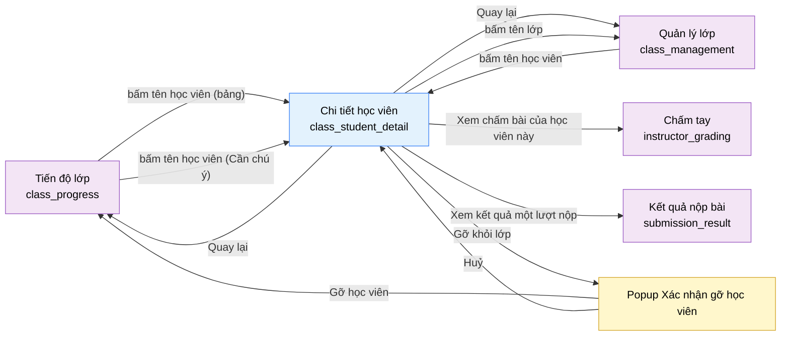

# Tài liệu thiết kế cơ bản (BD) — Chi tiết học viên (`INS0204`)

## Phương châm tài liệu [Nội bộ — không cần khách duyệt]

- Viết theo **mẫu 9 sheet**. Bộ thẻ đóng, quy ước ID, ký hiệu chuẩn, ranh giới với tài liệu khác và
  checklist kiểm toán nằm ở `02-bd/_rules/bd-template-9sheet.md` — file này không chép lại.
- Phần gắn nhãn `[Nội bộ]` phục vụ sinh mã và tự kiểm toán, không phải yêu cầu của khách hàng: mục 4.5,
  mục 7.3 và các ghi chú quy ước.
- Mã màn `INS0204` theo bảng mã ở `02-bd/_rules/bd-template-9sheet.md` mục 8 dòng 154; tên file mang tiền
  tố mã.
- **Màn này KHÔNG CÓ PROTOTYPE.** Không tồn tại file `09-layoutBase/*.dc.html` nào cho nó, và chính RD ghi
  nhận điều đó kèm hai marker `[Đợi nextjs]`
  [Nguồn: 01-rd/screens/teacher/INS0204_class_student_detail.md:14-18,50,73-74]. Hệ quả cho tài liệu này:
  **không có một dòng prototype nào để trích**, nên toàn bộ bố cục là suy diễn và được đánh dấu tại chỗ
  bằng `[SoT: Suy luận]`. Cách làm bám đúng tiền lệ `02-bd/screens/shared/SHR0302_interview_question_authoring.md`
  — màn duy nhất khác cũng không có prototype [Nguồn: 02-bd/screens/shared/SHR0302_interview_question_authoring.md:12-16].
  Khác một điểm: `SHR0302` còn có bản dựng UI thật để đối chiếu, màn này **không có cả bản dựng** — 6 slice
  khu Giảng viên đều còn là stub [Nguồn: 02-bd/screens/teacher/_shell.md:13-15]. Vì vậy nguồn duy nhất là
  RD và quy ước 5 màn anh em cùng cụm.
- Khung điều hướng bên trái **không mô tả lại ở đây** — dùng chung `02-bd/screens/teacher/_shell.md`. Khu
  Giảng viên **không có toolbar dùng chung**, nên hàng đầu tiên trong `<main>` là item của chính màn này và
  được mô tả ở Khu vực A [Nguồn: 02-bd/screens/teacher/_shell.md:30,113-114].
- Màn này **không có mục nav riêng** — đúng thiết kế, chỉ vào được bằng khoan sâu
  [Nguồn: 02-bd/screens/teacher/_shell.md:78-79].
- Màn này có **đúng một popup**: Xác nhận gỡ học viên khỏi lớp.

> Đọc cùng `01-rd/screens/teacher/INS0204_class_student_detail.md` (hành vi ở mức yêu cầu, không lặp lại ở
> đây), `01-rd/req/identity.md:104-111` (F1-27 — mã yêu cầu trực tiếp của màn), `01-rd/req/identity.md:112-138`
> (F1-28 — nguồn của mọi công thức số liệu màn này dùng lại) và `02-bd/database/identity.md` mục 1.8 tới 1.12.
>
> **Không thiết kế lại** vòng đời lớp (tạo/sửa/xoá lớp, mã mời) — thuộc `class_management` (`INS0201`)
> [Nguồn: 02-bd/screens/teacher/INS0201_class_management.md:195-197].
> **Không thiết kế lại** hành vi gỡ học viên ở mức nghiệp vụ — F1-26 đã chốt một hành vi duy nhất, màn này
> chỉ là **điểm vào thứ hai** của cùng hành vi đó
> [Nguồn: 01-rd/screens/teacher/INS0204_class_student_detail.md:93].
> **Không thiết kế** phần giao/gỡ bài toán cho lớp — thuộc `class_assignments` (`INS0202`)
> (`DEC-2026-0828-split-class-management-assignments`).
> **Không hiển thị** điểm AI tham khảo hay điểm chấm tay (F5-27) — RD chốt 2026-09-01 là không hiện ở đây,
> chỉ một liên kết sang `instructor_grading`
> [Nguồn: 01-rd/screens/teacher/INS0204_class_student_detail.md:65-67,94].
> **Không thiết kế** giao diện chấm lại (`DEC-2026-0828-remove-rejudge-scope`) và **không** có luồng "Yêu
> cầu review" của học viên (`DEC-2026-0830-remove-student-review-request`).

> **Quy ước đặt tên khối** [Nội bộ]. Kế thừa chuẩn đặt tên của cụm lớp do `class_management` chốt
> [Nguồn: 02-bd/screens/teacher/INS0201_class_management.md:27-30]: `header` (hàng đầu `<main>`), `stats`
> (dải thẻ số liệu), `popup` (mọi popup). Màn này bổ sung **ba khối riêng** đặt theo nội dung thật:
> `topicProgress` (số bài đã giải theo chủ đề), `assignmentProgress` (bài đã giao kèm điểm tốt nhất), và
> `submissionHistory` (lịch sử nộp bài trong phạm vi lớp). Ba khối này ánh xạ một-một với ba nhóm dữ liệu
> mà F1-27 cho phép [Nguồn: 01-rd/req/identity.md:104-105].

---

## Sheet 1. Bìa

| Mục | Giá trị |
| :--- | :--- |
| Hệ thống | AlgoPrep |
| Phân hệ | `identity` (F1) — có phụ thuộc đọc sang `problem-bank` (F2) và `judge-orchestration` (F4) |
| Công đoạn | BD — Thiết kế cơ bản |
| Phân loại | Màn hình |
| Tên màn | Chi tiết học viên |
| Mã màn hình | `INS0204` |
| Tên vật lý (slug) | `class_student_detail` |
| Trục tài liệu | Màn hình (`02-bd/screens/`) |
| Actor | A2 (`INSTRUCTOR`) |
| Phiên bản | V0.1 |
| Người tạo | Nhóm phát triển AlgoPrep |
| Ngày tạo | 2026/09/21 |
| Người cập nhật | Nhóm phát triển AlgoPrep |
| Ngày cập nhật | 2026/09/21 |

---

## Sheet 2. Lịch sử sửa đổi

| Ver | Sheet bị sửa | Nội dung sửa | Ngày | Người sửa |
| :--- | :--- | :--- | :--- | :--- |
| V0.1 | Toàn bộ | Tạo mới theo mẫu 9 sheet. Màn không có prototype nên toàn bộ bố cục là suy diễn có đánh dấu, bám phạm vi dữ liệu F1-27 và quy ước 5 màn anh em cùng cụm. Chốt hợp đồng ba đường vào (cùng cặp `studentId` + `classId`). Đề xuất tính "Hoàn thành %" và "Số bài đã giải" tại chỗ từ `user_problem_best_score` thay vì gọi `GetClassAssignmentCompletion`, tránh chờ một endpoint chưa tồn tại. Phát sinh 10 câu hỏi mở | 2026/09/21 | Nhóm phát triển AlgoPrep |
| V0.2 | 4.3, 5, 7.1, 7.2, Câu hỏi mở | Áp `DEC-2026-0921-teacher-screens-conflict-resolutions` và `DEC-2026-0921-class-completion-owned-by-identity`: Điểm TB đổi nguồn sang `judge.submissions` theo phạm vi lớp; bộ nhãn trạng thái thêm mã `INSUFFICIENT_DATA` tường minh thay vì trả rỗng; cách tính Hoàn thành của màn này nay áp cho cả cụm và `GetClassAssignmentCompletion` bị bỏ. Đóng Q1, Q3 | 2026-09-21 | AI |

---

## Sheet 3. Sơ đồ chuyển màn

> [Nội bộ] Quy ước vẽ: bố trí từ trái sang phải. Màn gọi tới tô tím, màn hiện tại tô xanh nhạt, popup tô
> vàng. Màu và `[Nguồn:]` dùng để truy vết, không phải yêu cầu của khách hàng.

### 3.1 Danh sách chuyển màn

#### Tiến độ lớp → Chi tiết học viên (từ bảng danh sách học viên)

[Điều kiện mở] Bấm vào tên một học viên trong bảng danh sách học viên của `class_progress`
[Nguồn: 02-bd/screens/teacher/INS0203_class_progress.md:89-98,469].

[Chế độ mở] Chế độ chỉ đọc. Màn không có chế độ sửa nào.

[Thông tin truyền] Cặp `id` học viên và `id` lớp của chính dòng đó. Đây là hợp đồng **đã chốt ở màn cha**,
màn này dùng nguyên, không đặt lại tham số [Nguồn: 02-bd/screens/teacher/INS0203_class_progress.md:95-98].

[Giá trị trả về] Có — khi hành vi gỡ học viên (F1-26) được thực hiện thành công, màn này trả về tín hiệu
"học viên đã bị gỡ khỏi lớp" để màn gọi tới tải lại danh sách, thay vì để lại một dòng ma.

[Khi thành công] Tải năm khối của màn: khối hồ sơ đầu trang, dải thẻ số liệu, khối chủ đề, bảng bài đã giao
và trang đầu của lịch sử nộp bài — toàn bộ giới hạn trong đúng lớp được truyền vào.

[Khi huỷ] Không có.

#### Tiến độ lớp → Chi tiết học viên (từ khối "Cần chú ý")

[Điều kiện mở] Bấm vào tên một học viên trong khối "Cần chú ý" của `class_progress`
[Nguồn: 02-bd/screens/teacher/INS0203_class_progress.md:107-118,470].

[Chế độ mở] Chế độ chỉ đọc.

[Thông tin truyền] Cặp `id` học viên và `id` lớp của mục đó — **giống hệt** đường vào từ bảng. Màn cha đã
ràng buộc rõ hai đường vào không được cho ra hai màn khác nhau
[Nguồn: 02-bd/screens/teacher/INS0203_class_progress.md:117-118].

[Giá trị trả về] Giống đường vào từ bảng.

[Khi thành công] Mở đúng cùng một màn với cùng bộ tham số; không có biến thể giao diện nào theo đường vào.

[Khi huỷ] Không có.

#### Quản lý lớp → Chi tiết học viên (đường vào thứ ba, chờ xác nhận vị trí)

[Điều kiện mở] Bấm vào tên một học viên trong bảng danh sách học viên của `class_management`
[Nguồn: 02-bd/screens/teacher/INS0201_class_management.md:358,555].

[Chế độ mở] Chế độ chỉ đọc.

[Thông tin truyền] Cặp `id` học viên và `id` lớp — cùng hợp đồng với hai đường trên
[Nguồn: 02-bd/screens/teacher/INS0201_class_management.md:482].

[Giá trị trả về] Giống hai đường trên.

[Khi thành công] Mở màn với cùng bộ tham số.

[Khi huỷ] Không có.

Ghi chú: bản thân việc tên học viên ở bảng của `class_management` là một liên kết **vẫn đang chờ chủ dự án
xác nhận vị trí**, vì prototype của màn đó vẽ tên học viên là chữ thường
[Nguồn: 02-bd/screens/teacher/INS0201_class_management.md:285 — Câu hỏi mở Q6 của màn đó]. Hợp đồng tham số
thì không phụ thuộc vào việc xác nhận đó, nên đường vào này ghi nhận có điều kiện.

#### Chi tiết học viên → màn gọi tới (Quay lại)

[Điều kiện mở] Bấm liên kết "Quay lại" ở khối hồ sơ đầu trang.

[Chế độ mở] Không có.

[Thông tin truyền] Không có.

[Giá trị trả về] Không có.

[Khi thành công] Quay về **đúng màn đã gọi tới** (`class_progress` hoặc `class_management`). Màn này chỉ
đọc, không có thay đổi chưa lưu, nên không hỏi xác nhận trước khi rời. Bộ lọc của màn cha (tab lớp, từ
khoá, số trang) chỉ được khôi phục nếu màn cha ghi ba trạng thái đó vào query string — điều này chưa chốt,
xem Câu hỏi mở Q6 và `02-bd/screens/teacher/INS0203_class_progress.md:509`.

[Khi huỷ] Không có.

#### Chi tiết học viên → Quản lý lớp (bấm tên lớp)

[Điều kiện mở] Bấm tên lớp ở khối hồ sơ đầu trang
[Nguồn: 01-rd/screens/teacher/INS0204_class_student_detail.md:58-59].

[Chế độ mở] Không có.

[Thông tin truyền] `id` lớp đang xem.

[Giá trị trả về] Không có.

[Khi thành công] Mở `class_management` với lớp đó đang được chọn.

[Khi huỷ] Không có.

#### Chi tiết học viên → Chấm tay (Xem chấm bài của học viên này)

[Điều kiện mở] Bấm liên kết "Xem chấm bài của học viên này" ở dải thẻ số liệu
[Nguồn: 01-rd/screens/teacher/INS0204_class_student_detail.md:65-67,94].

[Chế độ mở] Không có.

[Thông tin truyền] `id` học viên và `id` lớp, dùng làm bộ lọc sẵn của hàng đợi chấm tay.

[Giá trị trả về] Không có.

[Khi thành công] Mở `instructor_grading` đã lọc sẵn theo học viên này.

[Khi huỷ] Không có.

Ghi chú **Cảnh báo**: `instructor_grading` hiện chỉ có hai bộ lọc — tab trạng thái chấm và tab lớp — **không
có bộ lọc theo học viên** [Nguồn: 02-bd/screens/teacher/INS0301_grading.md:281-285]. Liên kết này do RD chốt
nhưng màn đích chưa có chỗ nhận tham số. Xem Câu hỏi mở Q4.

#### Chi tiết học viên → Kết quả nộp bài

[Điều kiện mở] Bấm "Xem kết quả" trên một dòng của bảng lịch sử nộp bài
[Nguồn: 01-rd/screens/teacher/INS0204_class_student_detail.md:68-70].

[Chế độ mở] Không có.

[Thông tin truyền] `id` lượt nộp của chính dòng đó.

[Giá trị trả về] Không có.

[Khi thành công] Mở `submission_result` của đúng lượt nộp đó.

[Khi huỷ] Không có.

Ghi chú **Cảnh báo**: `submission_result` là màn của A1 và chưa có BD; quyền của A2 khi mở lượt nộp của
người khác, và việc màn đó có hiển thị mã nguồn hay không, chưa có nguồn nào chốt. Xem Câu hỏi mở Q5.

#### Chi tiết học viên → Popup Xác nhận gỡ học viên

[Điều kiện mở] Bấm nút "Gỡ khỏi lớp" ở khối hồ sơ đầu trang
[Nguồn: 01-rd/screens/teacher/INS0204_class_student_detail.md:58-59,93].

[Chế độ mở] Không có.

[Thông tin truyền] `id` học viên, `id` lớp, tên học viên và tên lớp để dựng câu cảnh báo.

[Giá trị trả về] Kết quả chọn "Gỡ học viên" hoặc "Huỷ".

[Khi thành công] Hiển thị cảnh báo gỡ là **xoá thật kèm cascade** dữ liệu lịch sử làm bài trong phạm vi lớp
[Nguồn: 01-rd/req/identity.md:98-103; 02-bd/database/identity.md:95-101].

[Khi huỷ] Đóng popup, giữ nguyên màn.

#### Popup Xác nhận gỡ học viên → màn gọi tới

[Điều kiện mở] Bấm "Gỡ học viên" trong popup.

[Chế độ mở] Không có.

[Thông tin truyền] Không có.

[Giá trị trả về] Tín hiệu "học viên đã bị gỡ khỏi lớp".

[Khi thành công] Đóng popup và **rời màn** — sau khi gỡ thì màn này không còn đối tượng để hiển thị, giữ
lại chỉ cho ra một trang toàn `-`. Quay về đúng màn gọi tới kèm thông báo hoàn tất.

[Khi huỷ] Đóng popup, giữ nguyên màn chi tiết.

### 3.2 Sơ đồ

[Nguồn: 01-rd/screens/teacher/INS0204_class_student_detail.md:58-70,93-95;
02-bd/screens/teacher/INS0203_class_progress.md:89-121,469-470;
02-bd/screens/teacher/INS0201_class_management.md:155-158,555]

---

## Sheet 4. Bố cục màn hình

### 4.1 Tổng quan màn

[Mục đích màn] Cho giảng viên xem hồ sơ chi tiết của **một học viên cụ thể trong một lớp cụ thể** — thông
tin cơ bản, tiến độ, lịch sử nộp bài — thay vì chỉ nhìn một dòng tóm tắt ở bảng danh sách học viên
[Nguồn: 01-rd/screens/teacher/INS0204_class_student_detail.md:23-30; 01-rd/req/identity.md:104-105].

[Luồng nghiệp vụ chính]

1. **Hiển thị ban đầu**: vào màn từ một trong ba đường khoan sâu, hệ thống tải song song bốn nhóm dữ liệu —
   hồ sơ cơ bản kèm số liệu tiến độ, danh sách bài đã giao cho lớp kèm điểm tốt nhất của học viên, số bài
   đã giải theo chủ đề (dẫn xuất từ nhóm trước, không gọi riêng), và trang đầu của lịch sử nộp bài. Trong
   lúc chờ, mỗi khối hiển thị khung chờ riêng `[SoT: Suy luận]` — quy ước ba trạng thái mỗi khối (rỗng,
   đang tải, lỗi) mà RD yêu cầu áp dụng lại từ `admin_overview`/F1-29 và `instructor_overview`/F1-30
   [Nguồn: 01-rd/screens/teacher/INS0204_class_student_detail.md:71-72].
2. **Đọc tiến độ**: đối chiếu bốn con số ở dải thẻ (Điểm TB, Hoàn thành, Chuỗi ngày, Hoạt động) với nhãn
   trạng thái ở khối hồ sơ, rồi xem chi tiết từng bài đã giao.
3. **Xem một lượt nộp cụ thể**: bấm "Xem kết quả" trên một dòng lịch sử để sang `submission_result`.
4. **Sang hàng đợi chấm tay**: bấm "Xem chấm bài của học viên này" — điểm AI và điểm chấm tay **không**
   hiển thị ở màn này.
5. **Gỡ học viên khỏi lớp**: bấm "Gỡ khỏi lớp", xác nhận trong popup, rồi màn tự rời về màn gọi tới.

[Người dùng] Giảng viên đã đăng nhập, có Function `CLASS_MANAGEMENT`, và **phải là người phụ trách đúng lớp
được truyền vào** [Nguồn: 01-rd/req/identity.md:104-105; 01-rd/screens/teacher/INS0204_class_student_detail.md:106].

[Tệp liên quan] Không có. Màn này không xuất hay nhập tệp.

[Phạm vi]
- Chỉ một cặp (học viên, lớp). Không có chế độ xem học viên ngoài lớp phụ trách, không có chế độ so sánh
  nhiều học viên.
- **Chỉ đọc, trừ đúng một thao tác ghi**: gỡ học viên khỏi lớp (F1-26). Đây là điểm khác lớn nhất so với
  `class_progress`, vốn hoàn toàn chỉ đọc [Nguồn: 02-bd/screens/teacher/INS0203_class_progress.md:171-172].
- **Chỉ tính bài toán đã giao qua `class_assignments` (F2-12) của đúng lớp đang xem** — không tính bài tự
  luyện ngoài phạm vi lớp. Ràng buộc này áp cho **cả** bảng bài đã giao, khối chủ đề, bảng lịch sử nộp bài
  và mọi con số ở dải thẻ [Nguồn: 01-rd/screens/teacher/INS0204_class_student_detail.md:68-70,95].
- **Không** hiển thị điểm AI tham khảo hay điểm chấm tay (F5-27)
  [Nguồn: 01-rd/screens/teacher/INS0204_class_student_detail.md:65-67,94].
- **Không** hiển thị mã nguồn bài nộp, nội dung testcase ẩn, hay kết quả so khớp từng testcase ở bất kỳ
  trạng thái nào. Bảng lịch sử chỉ có tên bài, ngôn ngữ, trạng thái, tỉ lệ testcase và mốc thời gian.
- **Không** phụ thuộc phân hệ AI: màn này không gọi `ai-review`, nên F5/F6 chết thì màn vẫn chạy đủ. Liên
  kết sang `instructor_grading` là điều hướng thuần, không cần AI sống.

[Quyền sử dụng]
- Xem: được, khi có `CLASS_MANAGEMENT:READ` **và** phụ trách lớp được truyền vào.
- Thêm: không có.
- Sửa: không có.
- Xoá: được đúng một thao tác — gỡ học viên khỏi lớp (`CLASS_MANAGEMENT:DELETE`), là xoá thật kèm cascade
  [Nguồn: 01-rd/req/identity.md:98-103].

[Số bản ghi tối đa] Khối chủ đề: bằng số chủ đề xuất hiện trong tập bài đã giao, không phân trang. Bảng bài
đã giao: toàn bộ bài đã giao cho lớp, **không phân trang** `[SoT: Suy luận]` — một lớp thường được giao vài
chục bài, thấp hơn nhiều so với 82 học viên mà `class_progress` phải phân trang; thêm phân trang ở đây là
thêm trạng thái mà không giải quyết vấn đề nào. Bảng lịch sử nộp bài: 20 dòng mỗi trang, cùng con số đã
dùng cho bảng học viên của `class_progress` [Nguồn: 02-bd/screens/teacher/INS0203_class_progress.md:190].

[Nguồn: 01-rd/screens/teacher/INS0204_class_student_detail.md:23-30,54-74,93-96,104-108; 01-rd/req/identity.md:98-111]

### 4.2 DTO liên quan

- `ClassStudentProfileDto` — hồ sơ cơ bản của một học viên trong một lớp, kèm bốn số liệu của dải thẻ và
  nhãn trạng thái.
- `ClassAssignmentProgressRowDto` — một dòng của bảng bài đã giao: bài toán, chủ đề, điểm tốt nhất của học
  viên trên bài đó.
- `StudentSubmissionRowDto` — một dòng của bảng lịch sử nộp bài.
- `ClassCardDto` — **dùng lại** của `class_management`, chỉ lấy `id` và `name` để hiển thị tên lớp
  [Nguồn: 02-bd/screens/teacher/INS0201_class_management.md:468].

`[SoT: Suy luận]` — tên DTO do BD này đề xuất, `03-dd/api/identity.md` chốt lại. Khối chủ đề **không có DTO
riêng**: nó được gom từ chính `ClassAssignmentProgressRowDto` ở phía giao diện, xem mục 4.3.

### 4.3 Bảng dữ liệu liên quan (6)

| NO | Bảng | Ghi chú |
| --: | :--- | :--- |
| 1 | `identity.classes` | Tên lớp ở khối hồ sơ và kiểm tra `instructor_id` khi gác quyền [Nguồn: 02-bd/database/identity.md:85-88] |
| 2 | `identity.class_enrollments` | Xác nhận học viên thuộc đúng lớp, lấy `joined_at` cho "Ngày tham gia lớp", và là bảng bị xoá khi gỡ học viên [Nguồn: 02-bd/database/identity.md:95-101] |
| 3 | `identity.users` | Tên hiển thị và email học viên — cột `display_name`, `email` [Nguồn: 02-bd/database/identity.md:14,16] |
| 4 | `judge.submissions` | Nguồn tính Điểm TB **theo phạm vi lớp**, đọc qua `GetClassStudentSubmissionMetrics` của `judge-orchestration`, không truy vấn chéo schema. Thay cho `identity.user_submission_stats` (read model toàn cục, không có chiều `class_id`) từ 2026-09-21 theo `DEC-2026-0921-teacher-screens-conflict-resolutions` |
| 5 | `identity.user_problem_best_score` | Điểm tốt nhất mỗi bài (F4-13 best-attempt) và cờ đã giải, cho bảng bài đã giao, khối chủ đề và thẻ "Hoàn thành" [Nguồn: 02-bd/database/identity.md:111-112] |
| 6 | `identity.identity_recent_activity` | Thẻ "Hoạt động" [Nguồn: 02-bd/database/identity.md:115-116] |

Hai nhóm dữ liệu còn lại **không đọc từ bảng của `identity`**, nên không tính vào bảng trên và không truy
vấn chéo schema:

| Số liệu | Nguồn thật | Cách lấy |
| :--- | :--- | :--- |
| Danh sách bài đã giao cho lớp, tên bài, chủ đề của bài | `problem.class_assignments`, `problem.problems`, `problem.topics`/`problem_topics` [Nguồn: 02-bd/database/problem-bank.md:116-128,8-15,35-39] | Endpoint `ListClassAssignments` của `problem-bank` — tên nghiệp vụ đã có ở `class_assignments`, dùng lại [Nguồn: 02-bd/screens/teacher/INS0202_class_assignments.md:464] |
| Lịch sử nộp bài và "Chuỗi ngày" | `judge.submissions` [Nguồn: 02-bd/database/judge-orchestration.md:8-34] | Endpoint `ListStudentClassSubmissions` (mới) và `GetClassStudentSubmissionMetrics` (đã được `class_progress` đề xuất, dùng lại) của `judge-orchestration`, xem Câu hỏi mở Q2 |

**Cách tính Hoàn thành, nay áp cho cả cụm lớp.** Mẫu số là danh sách bài đã giao, lấy qua
`ListClassAssignments` (endpoint đã tồn tại sẵn); tử số là số bài trong danh sách đó mà
`user_problem_best_score.best_verdict = ACCEPTED` — `identity` tự tính được, không phải chờ module khác.
Đây vốn là đề xuất riêng của màn này, đi lệch so với hai màn anh em; **chốt 2026-09-21** bởi
`DEC-2026-0921-class-completion-owned-by-identity` là cách duy nhất cho cả bốn màn, và
`GetClassAssignmentCompletion` bị bỏ hẳn.

### 4.4 Vùng bố cục

**Không có prototype để bám.** Khác mọi màn khác của khu Giảng viên, `09-layoutBase/` không có file
`.dc.html` nào cho `class_student_detail`, và RD ghi nhận điều đó hai lần kèm marker `[Đợi nextjs]`
[Nguồn: 01-rd/screens/teacher/INS0204_class_student_detail.md:50,73-74]. Cũng **không có bản dựng UI thật**
để đối chiếu — slice khu Giảng viên còn là stub [Nguồn: 02-bd/screens/teacher/_shell.md:13-15]. Bảng dưới
đây vì vậy **không phải mô tả bằng chứng bố cục** mà là **đề xuất bố cục của BD**, toàn bộ là suy diễn.

Căn cứ suy diễn, theo đúng thứ tự ưu tiên đã dùng:

1. **Phạm vi dữ liệu mà RD cho phép** — bốn nhóm: thông tin cơ bản, tiến độ, lịch sử nộp bài, thao tác quản
   lý [Nguồn: 01-rd/screens/teacher/INS0204_class_student_detail.md:27-29,54-70]. Không thêm khối nào ngoài
   bốn nhóm này.
2. **Quy ước 5 màn anh em cùng khu** — container `max-width: 1320px` căn giữa, các khối xếp dọc, hàng đầu
   trong `<main>` là của chính màn, không có chân trang
   [Nguồn: 02-bd/screens/teacher/_shell.md:30-31,110-114].
3. **Tiền lệ màn không có prototype** — `SHR0302` đã xử lý bằng cách nêu rõ bố cục một cột dọc và không quy
   định màu sắc, khoảng cách, typography ở BD
   [Nguồn: 02-bd/screens/shared/SHR0302_interview_question_authoring.md:306-308].

| Vùng | Vị trí | Nội dung |
| :--- | :--- | :--- |
| Thanh điều hướng bên trái (khung chung Giảng viên) | Khung chung | **Không có mục nav nào đang chọn** — màn này không có mục nav [Nguồn: 02-bd/screens/teacher/_shell.md:78-79]. Trạng thái "đang chọn" nên giữ ở mục "Tiến độ học viên" hoặc "Lớp của tôi" theo màn gọi tới `[SoT: Suy luận]`, xem Câu hỏi mở Q7 |
| Container nội dung | Khung chung | `max-width: 1320px` căn giữa, các khối xếp dọc [Nguồn: 02-bd/screens/teacher/_shell.md:110-111] |
| Hàng đầu — khối hồ sơ | Đề xuất BD | Liên kết "Quay lại", tên học viên, email, tên lớp (liên kết), ngày tham gia lớp, nhãn trạng thái, nút "Gỡ khỏi lớp" ở mép phải. Đây là hàng đầu trong `<main>`, **không phải toolbar dùng chung** [Nguồn: 02-bd/screens/teacher/_shell.md:30]. `[SoT: Suy luận]` — thành phần lấy đúng danh sách RD nêu [Nguồn: 01-rd/screens/teacher/INS0204_class_student_detail.md:58-59] |
| Hàng hai — dải thẻ số liệu | Đề xuất BD | Bốn thẻ ngang: Điểm TB, Hoàn thành, Chuỗi ngày, Hoạt động; liên kết "Xem chấm bài của học viên này" ở mép phải dải thẻ. `[SoT: Suy luận]` — dải thẻ ngang là hình thức mà cả `class_management` và `class_assignments` đã dùng cho cùng loại số liệu tổng hợp [Nguồn: 02-bd/screens/teacher/INS0202_class_assignments.md:306] |
| Hàng ba — khối "Theo chủ đề" | Đề xuất BD | Danh sách chủ đề kèm tỉ lệ đã giải trên tổng bài đã giao thuộc chủ đề đó. `[SoT: Suy luận]` — RD yêu cầu "số bài đã giải theo chủ đề" [Nguồn: 01-rd/screens/teacher/INS0204_class_student_detail.md:60-61] nhưng không nói hình thức trình bày |
| Hàng bốn — bảng "Bài đã giao" | Đề xuất BD | Cột: Bài tập, Chủ đề, Điểm tốt nhất, Trạng thái. Không phân trang. `[SoT: Suy luận]` |
| Hàng năm — bảng "Lịch sử nộp bài" | Đề xuất BD | Cột: Bài tập, Ngôn ngữ, Kết quả, Điểm tỉ lệ, Nộp lúc, Xem kết quả. Phân trang 20 dòng. `[SoT: Suy luận]` |
| Popup Xác nhận gỡ học viên | Đề xuất BD | Nội dung cảnh báo xoá thật kèm cascade, nút "Gỡ học viên", nút "Huỷ". `[SoT: Suy luận]` — cùng hình thức popup xác nhận mà `class_management` đã dùng cho chính hành vi này [Nguồn: 02-bd/screens/teacher/INS0201_class_management.md:557] |
| Chân trang | Không có | Cả 5 prototype khu Giảng viên đều không có `<footer>` [Nguồn: 02-bd/screens/teacher/_shell.md:31] |

**Danh sách các điểm phải suy diễn** (để chủ dự án biết chính xác chỗ nào cần xác nhận khi dựng UI thật):
thứ tự năm khối theo chiều dọc; dải thẻ là 4 thẻ ngang chứ không phải bảng; vị trí liên kết "Xem chấm bài";
hình thức khối "Theo chủ đề"; tập cột của hai bảng; việc bảng bài đã giao không phân trang; vị trí nút "Gỡ
khỏi lớp"; và mục nav nào sáng khi ở màn này. Không có điểm nào trong danh sách này có nguồn.

### 4.5 Cấu trúc slice FSD [Nội bộ]

| Khối | Slice dự kiến | Căn cứ |
| :--- | :--- | :--- |
| Trang | `views/teacher/class-student-detail` | Quy ước FSD của dự án; slice khu Giảng viên hiện là stub [Nguồn: 02-bd/screens/teacher/_shell.md:13-14] |
| Khung Giảng viên | Dùng lại `widgets/app-shell` (biến thể `instructor-sidebar`) | `02-bd/screens/teacher/_shell.md` mục 1 |
| Khối hồ sơ đầu trang | `widgets/class-student-profile-header` | Đề xuất BD |
| Bảng bài đã giao và khối chủ đề | `widgets/class-student-assignment-progress` | Đề xuất BD — hai khối cùng một nguồn dữ liệu nên nằm chung một widget, không tách hai |
| Bảng lịch sử nộp bài | `widgets/class-student-submission-history` | Đề xuất BD |
| Popup gỡ học viên | Dùng lại `features/class-student-remove` của `class_management` | Cùng một hành vi F1-26, hai điểm vào [Nguồn: 01-rd/screens/teacher/INS0204_class_student_detail.md:93] — **không** dựng popup thứ hai |
| Thực thể dùng chung | Dùng lại `entities/class` và `entities/class-student` | Đã khai ở `class_management`, **không định nghĩa lại** [Nguồn: 02-bd/screens/teacher/INS0201_class_management.md:298-300] |

`[SoT: Suy luận]` — ánh xạ slice do BD đề xuất, DD màn hình chốt lại.

> [Nội bộ] Ảnh minh hoạ đặt ở `08-diagram/02-bd/screens/teacher/`, chụp bằng Playwright trên ứng dụng
> Next.js thật khi đã có mã chạy được. Màn này **không có prototype để tham chiếu tạm**, nên trước khi có mã
> chạy thì không có ảnh nào — không vẽ tay thay thế.

---

## Sheet 5. Danh sách item màn hình

> Quy ước ID, bộ thẻ và giá trị chuẩn: `02-bd/_rules/bd-template-9sheet.md` mục 2, 3, 4.

### Khu vực A — Khối hồ sơ đầu trang

| Khu vực | NO | Tên item | ID item | Bảng DB | Cột DB | Loại UI | Kiểu | Độ dài | Bắt buộc | I/O | Giá trị mặc định | Định dạng | Ghi chú |
| :--- | --: | :--- | :--- | :--- | :--- | :--- | :--- | :--- | :-: | :-: | :--- | :--- | :--- |
| Khối hồ sơ | | | | | | | | | | | | | |
| | 1 | Quay lại | `classStudentDetail.header.btnBack` | - | - | Link | - | - | - | I | - | Quay lại | Trở về đúng màn đã gọi tới [Nguồn giá trị] Nhãn tĩnh i18n [EVT liên quan] EVT-2 |
| | 2 | Tên học viên | `classStudentDetail.header.studentName` | `identity.users` | `display_name` | Label | String | 100 | - | O | - | - | Tên hiển thị của học viên đang xem [Nguồn giá trị] Cột `display_name` [Nguồn: 02-bd/database/identity.md:16] [EVT liên quan] EVT-1 |
| | 3 | Email | `classStudentDetail.header.email` | `identity.users` | `email` | Label | String | 255 | - | O | - | - | Email của học viên; tài khoản đã ẩn danh hoá sẽ hiện giá trị vô danh, không phải lỗi dữ liệu [Nguồn: 02-bd/database/identity.md:26-29] [Nguồn giá trị] Cột `email` [Nguồn: 02-bd/database/identity.md:14] [EVT liên quan] EVT-1 |
| | 4 | Tên lớp | `classStudentDetail.header.className` | `identity.classes` | `name` | Link | String | 120 | - | O | - | - | Lớp đang xét; bấm vào mở `class_management` [Nguồn: 01-rd/screens/teacher/INS0204_class_student_detail.md:58-59] [Nguồn giá trị] Cột `name` [Nguồn: 02-bd/database/identity.md:85-88] [EVT liên quan] EVT-3 |
| | 5 | Ngày tham gia lớp | `classStudentDetail.header.joinedAt` | `identity.class_enrollments` | `joined_at` | Label | Date | - | - | O | - | `dd/MM/yyyy` | Mốc học viên vào lớp qua mã mời (F1-23) [Nguồn giá trị] Cột `joined_at` [Nguồn: 02-bd/database/identity.md:95-97] [EVT liên quan] EVT-1 |
| | 6 | Trạng thái | `classStudentDetail.header.statusBadge` | - | - | Badge | Enum | - | - | O | Đang tốt | Nhãn tiếng Việt | Bốn nhãn: "Đang tốt", "Theo dõi", "Cần hỗ trợ", "Vắng bài" [Công thức] Dùng đúng bộ ngưỡng của `DEC-2026-0830-class-progress-dashboard` như `class_progress` đã làm: "Vắng bài" = không có lượt nộp nào trong 7 ngày gần nhất; "Theo dõi" = Hoàn thành dưới 50% và đã được giao ít nhất một bài; "Cần hỗ trợ" = Điểm TB giảm liên tiếp từ hai mốc tuần trở lên; không khớp ngưỡng nào thì "Đang tốt" [Nguồn: 01-rd/req/identity.md:129-133]. Khớp nhiều ngưỡng thì lấy nhãn nghiêm trọng nhất theo thứ tự "Vắng bài" > "Cần hỗ trợ" > "Theo dõi" `[SoT: Suy luận]`. Giá trị thứ tư "Đang tốt" là **bắt buộc ở màn này** mà `class_progress` không cần, xem Câu hỏi mở Q8 [EVT liên quan] EVT-1 |
| | 7 | Gỡ khỏi lớp | `classStudentDetail.header.btnRemove` | `identity.class_enrollments` | - | Button | - | - | - | I | - | Gỡ khỏi lớp | Mở popup xác nhận; hành vi F1-26, cùng một hành vi với nút ở bảng của `class_management` [Nguồn: 01-rd/screens/teacher/INS0204_class_student_detail.md:93] [Nguồn giá trị] Nhãn tĩnh i18n [EVT liên quan] EVT-4 |

### Khu vực B — Dải thẻ số liệu tiến độ

| Khu vực | NO | Tên item | ID item | Bảng DB | Cột DB | Loại UI | Kiểu | Độ dài | Bắt buộc | I/O | Giá trị mặc định | Định dạng | Ghi chú |
| :--- | --: | :--- | :--- | :--- | :--- | :--- | :--- | :--- | :-: | :-: | :--- | :--- | :--- |
| Dải thẻ số liệu | | | | | | | | | | | | | |
| | 1 | Điểm TB | `classStudentDetail.stats.avgScore` | `judge.submissions` | `status`, `problem_id`, `user_id` | Label | Number | 4 | - | O | - | Một chữ số thập phân, thang 10 | Điểm trung bình của học viên [Công thức] `accepted_count` chia `total_submissions` rồi nhân 10 (`DEC-2026-0830-class-progress-dashboard`) [Nguồn: 01-rd/req/identity.md:116-119]. Chưa có lượt nộp nào thì hiển thị `-`. Read model là số **toàn hệ thống**, trong khi màn này đứng hẳn trong ngữ cảnh một lớp — xem Câu hỏi mở Q1 [EVT liên quan] EVT-1 |
| | 2 | Hoàn thành | `classStudentDetail.stats.completion` | `identity.user_problem_best_score` | `best_verdict` | Label | Number | 3 | - | O | - | `{số}%` | Tỉ lệ bài đã giao cho lớp mà học viên đã Accepted ít nhất một lần [Công thức] Số bài trong danh sách bài đã giao cho lớp có `best_verdict = ACCEPTED` chia tổng số bài đã giao cho lớp [Nguồn: 01-rd/req/identity.md:120-122]. Mẫu số từ `ListClassAssignments`, tử số từ `user_problem_best_score` [Nguồn: 02-bd/database/identity.md:111-112]. Lớp chưa được giao bài nào thì hiển thị `-` [EVT liên quan] EVT-1 |
| | 3 | Chuỗi ngày | `classStudentDetail.stats.streak` | - | - | Label | Number | 4 | - | O | - | `{số} ngày`, bằng 0 thì `-` | Số ngày liên tiếp gần nhất tính tới hôm nay mà học viên có ít nhất một lượt nộp [Công thức] Đếm ngày liên tiếp có lượt nộp trong `judge.submissions`, cùng khái niệm chuỗi ngày của F1-21 [Nguồn: 01-rd/req/identity.md:123-125]. **Không cột nào lưu sẵn** giá trị này, lấy qua `GetClassStudentSubmissionMetrics` — xem Câu hỏi mở Q2 [EVT liên quan] EVT-1 |
| | 4 | Hoạt động | `classStudentDetail.stats.lastActive` | `identity.identity_recent_activity` | `occurred_at` | Label | String | 20 | - | O | - | Khoảng thời gian tương đối | Thời điểm hoạt động gần nhất của học viên [Công thức] `occurred_at` lớn nhất của học viên, hiển thị dạng tương đối ("12 phút trước", "Hôm qua"); chưa có hoạt động nào thì hiển thị `-`. Cùng quy tắc `class_progress` [Nguồn: 02-bd/screens/teacher/INS0203_class_progress.md:322] [EVT liên quan] EVT-1 |
| | 5 | Xem chấm bài của học viên này | `classStudentDetail.stats.btnViewGrading` | - | - | Link | - | - | - | I | - | Xem chấm bài của học viên này | Mở `instructor_grading` lọc theo học viên này; thay cho việc hiển thị điểm AI/chấm tay tại chỗ [Nguồn: 01-rd/screens/teacher/INS0204_class_student_detail.md:65-67] [Nguồn giá trị] Nhãn tĩnh i18n [EVT liên quan] EVT-7 |
| | 6 | Thử lại | `classStudentDetail.stats.btnRetry` | - | - | Button | - | - | - | I | - | Thử lại | Tải lại khối hồ sơ và dải thẻ khi khối này đang ở trạng thái lỗi [Nguồn giá trị] Nhãn tĩnh i18n; quy ước ba trạng thái mỗi khối [Nguồn: 01-rd/screens/teacher/INS0204_class_student_detail.md:71-72] [EVT liên quan] EVT-9 |

### Khu vực C — Theo chủ đề

| Khu vực | NO | Tên item | ID item | Bảng DB | Cột DB | Loại UI | Kiểu | Độ dài | Bắt buộc | I/O | Giá trị mặc định | Định dạng | Ghi chú |
| :--- | --: | :--- | :--- | :--- | :--- | :--- | :--- | :--- | :-: | :-: | :--- | :--- | :--- |
| Theo chủ đề | | | | | | | | | | | | | |
| | 1 | Tiêu đề khối | `classStudentDetail.topicProgress.title` | - | - | Label | String | - | - | O | Số bài đã giải theo chủ đề | - | Tiêu đề khối [Nguồn giá trị] Nhãn tĩnh i18n [Nguồn: 01-rd/screens/teacher/INS0204_class_student_detail.md:60-61] [EVT liên quan] - |
| | 2 | Danh sách chủ đề | `classStudentDetail.topicProgress.list` | - | - | List | List | - | - | O | rỗng | - | Mỗi mục là một chủ đề xuất hiện trong tập bài đã giao cho lớp [Công thức] Gom nhóm các dòng của bảng "Bài đã giao" (Khu vực D) theo `problem.topics.name`; **không gọi endpoint riêng** [Nguồn: 02-bd/database/problem-bank.md:35-39] [EVT liên quan] EVT-1 |
| | 3 | Chủ đề | `classStudentDetail.topicProgress.col.topicName` | - | - | ListColumn | String | 60 | - | O | - | - | Tên chủ đề [Nguồn giá trị] `problem.topics.name`, đi kèm mỗi bài trong phản hồi `ListClassAssignments` [Nguồn: 02-bd/database/problem-bank.md:35-39] [EVT liên quan] - |
| | 4 | Đã giải | `classStudentDetail.topicProgress.col.solvedRatio` | - | - | ListColumn | String | 12 | - | O | - | `{đã giải}/{tổng}` | Số bài đã giải trên tổng số bài đã giao thuộc chủ đề đó [Công thức] Đếm dòng có `best_verdict = ACCEPTED` chia tổng số dòng cùng chủ đề, trong đúng tập bài đã giao cho lớp [Nguồn: 01-rd/screens/teacher/INS0204_class_student_detail.md:60-61,68-70] [EVT liên quan] - |

### Khu vực D — Bài đã giao

| Khu vực | NO | Tên item | ID item | Bảng DB | Cột DB | Loại UI | Kiểu | Độ dài | Bắt buộc | I/O | Giá trị mặc định | Định dạng | Ghi chú |
| :--- | --: | :--- | :--- | :--- | :--- | :--- | :--- | :--- | :-: | :-: | :--- | :--- | :--- |
| Bài đã giao | | | | | | | | | | | | | |
| | 1 | Tiêu đề khối | `classStudentDetail.assignmentProgress.title` | - | - | Label | String | - | - | O | Bài đã giao cho lớp | - | Tiêu đề khối [Nguồn giá trị] Nhãn tĩnh i18n [EVT liên quan] - |
| | 2 | Bảng bài đã giao | `classStudentDetail.assignmentProgress.table` | `identity.user_problem_best_score` | - | List | List | - | - | O | rỗng | Không phân trang | Mỗi dòng là một bài còn hiệu lực trong danh sách giao cho lớp; bài đã gỡ mềm (`removed_at` khác NULL) không hiển thị [Nguồn: 02-bd/database/problem-bank.md:125] [Nguồn giá trị] Ghép `ListClassAssignments` (danh sách bài) với `user_problem_best_score` (điểm của học viên) [EVT liên quan] EVT-1 |
| | 3 | Bài tập | `classStudentDetail.assignmentProgress.col.problemTitle` | `problem.problems` | `title` | ListColumn | String | 200 | - | O | - | - | Tên bài tập được giao [Nguồn giá trị] `problem.problems.title` qua `ListClassAssignments` [Nguồn: 02-bd/database/problem-bank.md:15] [EVT liên quan] - |
| | 4 | Chủ đề | `classStudentDetail.assignmentProgress.col.topics` | - | - | ListColumn | List | 120 | - | O | - | Danh sách tên, ngăn bằng dấu phẩy | Các chủ đề gắn với bài; một bài có thể có nhiều chủ đề [Nguồn giá trị] `problem.topics.name` qua `problem_topics` [Nguồn: 02-bd/database/problem-bank.md:35-39] [EVT liên quan] - |
| | 5 | Điểm tốt nhất | `classStudentDetail.assignmentProgress.col.bestRatio` | `identity.user_problem_best_score` | `best_ratio` | ListColumn | Number | 4 | - | O | - | `{số}%` | Tỉ lệ testcase tốt nhất mà học viên đạt được trên bài đó (F4-13, best-attempt) [Nguồn giá trị] Cột `best_ratio` [Nguồn: 02-bd/database/identity.md:111-112]. Chưa nộp lần nào thì hiển thị `-`, không hiển thị `0%` — hai chuyện khác nhau [EVT liên quan] - |
| | 6 | Trạng thái | `classStudentDetail.assignmentProgress.col.bestVerdict` | `identity.user_problem_best_score` | `best_verdict` | Badge | Enum | - | - | O | - | Nhãn tiếng Việt | Ba giá trị hiển thị: "Đã giải" (`best_verdict = ACCEPTED`), "Chưa đạt" (có nộp nhưng chưa Accepted), "Chưa nộp" (không có dòng read model nào) [Nguồn giá trị] Cột `best_verdict` [Nguồn: 02-bd/database/identity.md:111-112] [EVT liên quan] - |
| | 7 | Thử lại | `classStudentDetail.assignmentProgress.btnRetry` | - | - | Button | - | - | - | I | - | Thử lại | Tải lại khối "Bài đã giao" và khối "Theo chủ đề" khi lỗi — hai khối cùng một nguồn nên cùng một nút [Nguồn giá trị] Nhãn tĩnh i18n [EVT liên quan] EVT-9 |

### Khu vực E — Lịch sử nộp bài

| Khu vực | NO | Tên item | ID item | Bảng DB | Cột DB | Loại UI | Kiểu | Độ dài | Bắt buộc | I/O | Giá trị mặc định | Định dạng | Ghi chú |
| :--- | --: | :--- | :--- | :--- | :--- | :--- | :--- | :--- | :-: | :-: | :--- | :--- | :--- |
| Lịch sử nộp bài | | | | | | | | | | | | | |
| | 1 | Tiêu đề khối | `classStudentDetail.submissionHistory.title` | - | - | Label | String | - | - | O | Lịch sử nộp bài trong lớp | - | Tiêu đề khối; chữ "trong lớp" là bắt buộc vì đây không phải toàn bộ lịch sử của học viên [Nguồn: 01-rd/screens/teacher/INS0204_class_student_detail.md:68-70] [Nguồn giá trị] Nhãn tĩnh i18n [EVT liên quan] - |
| | 2 | Bảng lịch sử | `classStudentDetail.submissionHistory.table` | - | - | List | List | - | - | O | rỗng | 20 dòng mỗi trang | Các lượt nộp của học viên này cho **các bài đã giao cho đúng lớp đang xem**, sắp xếp theo `submitted_at` giảm dần [Nguồn giá trị] Kết quả gọi `ListStudentClassSubmissions` (`judge-orchestration`) [Nguồn: 02-bd/database/judge-orchestration.md:8-34] [EVT liên quan] EVT-1, EVT-8 |
| | 3 | Bài tập | `classStudentDetail.submissionHistory.col.problemTitle` | `problem.problems` | `title` | ListColumn | String | 200 | - | O | - | - | Tên bài tập của lượt nộp [Nguồn giá trị] `problem.problems.title`, tra theo `judge.submissions.problem_id` [Nguồn: 02-bd/database/problem-bank.md:15; 02-bd/database/judge-orchestration.md:16] [EVT liên quan] - |
| | 4 | Ngôn ngữ | `classStudentDetail.submissionHistory.col.language` | `judge.submissions` | `language` | ListColumn | Enum | - | - | O | - | `Java` / `C++` / `Python` | Ngôn ngữ của lượt nộp — đúng ba giá trị [Nguồn giá trị] Cột `language` [Nguồn: 02-bd/database/judge-orchestration.md:18] [EVT liên quan] - |
| | 5 | Kết quả | `classStudentDetail.submissionHistory.col.status` | `judge.submissions` | `status` | Badge | Enum | - | - | O | - | Nhãn tiếng Việt | Bảy trạng thái cuối của state machine (`DEC-2026-0912-judge-callback-contract`); lượt nộp chưa xong thì hiển thị trạng thái đang chạy [Nguồn giá trị] Cột `status` [Nguồn: 02-bd/database/judge-orchestration.md:22] [EVT liên quan] - |
| | 6 | Điểm tỉ lệ | `classStudentDetail.submissionHistory.col.scoreRatio` | `judge.submissions` | `score_ratio` | ListColumn | Number | 4 | - | O | - | `{số}%` | Tỉ lệ testcase đạt của lượt nộp đó (F4-13) [Nguồn giá trị] Cột `score_ratio`; `NULL` với `COMPILE_ERROR`/`SYSTEM_ERROR` thì hiển thị `-`, **không** hiển thị `0%` [Nguồn: 02-bd/database/judge-orchestration.md:27] [EVT liên quan] - |
| | 7 | Nộp lúc | `classStudentDetail.submissionHistory.col.submittedAt` | `judge.submissions` | `submitted_at` | ListColumn | Date | - | - | O | - | Thời gian tương đối | Thời điểm nộp bài, hiển thị dạng tương đối [Nguồn giá trị] Cột `submitted_at` [Nguồn: 02-bd/database/judge-orchestration.md:31] [EVT liên quan] - |
| | 8 | Xem kết quả | `classStudentDetail.submissionHistory.col.btnViewResult` | - | - | Link | - | - | - | I | - | Xem kết quả | Mở `submission_result` của đúng lượt nộp đó [Nguồn: 01-rd/screens/teacher/INS0204_class_student_detail.md:68-70] [Nguồn giá trị] Nhãn tĩnh i18n [EVT liên quan] EVT-10 |
| | 9 | Phân trang | `classStudentDetail.submissionHistory.pagination` | - | - | Button | Number | 4 | - | I/O | 1 | `Trang {n} / {tổng}` | Điều khiển chuyển trang bảng lịch sử, cùng kiểu `problem_list` (F2-11) như `class_progress` đã chốt [Nguồn: 02-bd/screens/teacher/INS0203_class_progress.md:323] [Nguồn giá trị] Tổng số trang do máy chủ trả về cùng kết quả `ListStudentClassSubmissions` [EVT liên quan] EVT-8 |
| | 10 | Thử lại | `classStudentDetail.submissionHistory.btnRetry` | - | - | Button | - | - | - | I | - | Thử lại | Tải lại khối lịch sử khi lỗi [Nguồn giá trị] Nhãn tĩnh i18n [EVT liên quan] EVT-9 |

### Popup Xác nhận gỡ học viên

| Khu vực | NO | Tên item | ID item | Bảng DB | Cột DB | Loại UI | Kiểu | Độ dài | Bắt buộc | I/O | Giá trị mặc định | Định dạng | Ghi chú |
| :--- | --: | :--- | :--- | :--- | :--- | :--- | :--- | :--- | :-: | :-: | :--- | :--- | :--- |
| Popup gỡ học viên | | | | | | | | | | | | | |
| | 1 | Nội dung cảnh báo | `classStudentDetail.popup.removeBody` | - | - | Label | String | - | - | O | - | - | Nêu rõ gỡ là **xoá thật kèm cascade** dữ liệu lịch sử làm bài trong phạm vi lớp và **không hoàn tác được**; kèm tên học viên và tên lớp [Nguồn giá trị] Nhãn tĩnh i18n ghép tên học viên và tên lớp [Nguồn: 01-rd/req/identity.md:98-103] [EVT liên quan] EVT-4 |
| | 2 | Gỡ học viên | `classStudentDetail.popup.removeConfirm` | `identity.class_enrollments` | - | Button | - | - | - | I | - | Gỡ học viên | Xác nhận gỡ; gọi `RemoveStudentFromClass` [Nguồn giá trị] Nhãn tĩnh i18n, dùng lại nhãn của `class_management` [Nguồn: 02-bd/screens/teacher/INS0201_class_management.md:557] [EVT liên quan] EVT-5 |
| | 3 | Huỷ | `classStudentDetail.popup.removeCancel` | - | - | Button | - | - | - | I | - | Huỷ | Đóng popup, không ghi gì [Nguồn giá trị] Nhãn tĩnh i18n [EVT liên quan] EVT-6 |

[Nguồn: 01-rd/screens/teacher/INS0204_class_student_detail.md:54-74,93-95; 01-rd/req/identity.md:98-133;
02-bd/database/identity.md:14,16,85-101,111-116; 02-bd/database/problem-bank.md:15,35-39,116-128;
02-bd/database/judge-orchestration.md:8-34]

---

## Sheet 6. Đặc tả điều khiển item

> Ký hiệu cột `Hiển thị` và thứ tự thẻ: `02-bd/_rules/bd-template-9sheet.md` mục 2, 3. Dùng đúng NO, tên
> item và thứ tự của Sheet 5. Lỗi nhập liệu ghi ở Sheet 9, xử lý nghiệp vụ ghi ở Sheet 8.

### Khu vực A — Khối hồ sơ đầu trang

| Khu vực | NO | Tên item | Hiển thị | Ghi chú |
| :--- | --: | :--- | :-: | :--- |
| Khối hồ sơ | | | | |
| | 1 | Quay lại | Có | [Điều kiện kích hoạt] Luôn kích hoạt, kể cả khi các khối dữ liệu đang tải hoặc đang lỗi — người dùng phải luôn thoát được khỏi một màn hỏng. |
| | 2 | Tên học viên | Điều kiện | [Điều kiện hiển thị] Trong lúc tải hiển thị khung chờ. Tải thất bại thì cả khối hồ sơ chuyển sang trạng thái lỗi kèm nút "Thử lại", và bốn khối còn lại **không** tải — không có `studentId` hợp lệ thì không có gì để tải. |
| | 3 | Email | Có | - |
| | 4 | Tên lớp | Có | [Điều kiện kích hoạt] Luôn kích hoạt sau khi tải xong. |
| | 5 | Ngày tham gia lớp | Có | - |
| | 6 | Trạng thái | Điều kiện | [Điều kiện hiển thị] Ẩn khi chưa đủ dữ liệu để xếp loại — cụ thể là khi lớp chưa được giao bài nào **và** học viên chưa có lượt nộp nào; khi đó hiển thị "Chưa đủ dữ liệu" thay vì gán "Đang tốt" cho một học viên chưa làm gì `[SoT: Suy luận]`. [Tự động đặt] Nhãn tính lại mỗi lần tải khối hồ sơ; không phải giá trị lưu sẵn trong DB. |
| | 7 | Gỡ khỏi lớp | Điều kiện | [Điều kiện hiển thị] Chỉ hiển thị khi người đăng nhập có `CLASS_MANAGEMENT:DELETE`; chỉ có quyền đọc thì ẩn nút. [Điều kiện kích hoạt] Không kích hoạt trong lúc khối hồ sơ đang tải, và trong lúc yêu cầu gỡ đang chạy. |

### Khu vực B — Dải thẻ số liệu tiến độ

| Khu vực | NO | Tên item | Hiển thị | Ghi chú |
| :--- | --: | :--- | :-: | :--- |
| Dải thẻ số liệu | | | | |
| | 1 | Điểm TB | Có | [Điều kiện hiển thị] Học viên chưa có lượt nộp nào thì hiển thị `-`, không hiển thị `0.0`. |
| | 2 | Hoàn thành | Có | [Điều kiện hiển thị] Lớp chưa được giao bài nào thì hiển thị `-`, vì mẫu số bằng 0. |
| | 3 | Chuỗi ngày | Có | [Điều kiện hiển thị] Chuỗi bằng 0 thì hiển thị `-`, không hiển thị `0 ngày`; cùng quy tắc `class_progress` [Nguồn: 02-bd/screens/teacher/INS0203_class_progress.md:377]. Gọi `judge-orchestration` thất bại thì thẻ hiển thị `-` và ba thẻ còn lại vẫn hiện. |
| | 4 | Hoạt động | Có | [Điều kiện hiển thị] Chưa có hoạt động nào thì hiển thị `-`. |
| | 5 | Xem chấm bài của học viên này | Có | [Điều kiện kích hoạt] Luôn kích hoạt sau khi khối hồ sơ tải xong. **Không** phụ thuộc phân hệ AI còn sống — đây chỉ là điều hướng, màn đích tự xử lý trạng thái của nó. |
| | 6 | Thử lại | Điều kiện | [Điều kiện hiển thị] Chỉ hiển thị khi khối hồ sơ và dải thẻ đang ở trạng thái lỗi tải dữ liệu. [Điều kiện kích hoạt] Không kích hoạt trong lúc lần tải lại đang chạy. |

### Khu vực C — Theo chủ đề

| Khu vực | NO | Tên item | Hiển thị | Ghi chú |
| :--- | --: | :--- | :-: | :--- |
| Theo chủ đề | | | | |
| | 1 | Tiêu đề khối | Có | - |
| | 2 | Danh sách chủ đề | Điều kiện | [Điều kiện hiển thị] Lớp chưa được giao bài nào thì ẩn cả khối — không có gì để gom nhóm. Có bài đã giao nhưng không bài nào gắn chủ đề thì hiển thị một mục "Chưa phân loại" thay vì khối rỗng `[SoT: Suy luận]`. [Tự động đặt] Tính lại mỗi lần bảng "Bài đã giao" tải xong; không có lần gọi máy chủ riêng. |
| | 3 | Chủ đề | Có | - |
| | 4 | Đã giải | Có | - |

### Khu vực D — Bài đã giao

| Khu vực | NO | Tên item | Hiển thị | Ghi chú |
| :--- | --: | :--- | :-: | :--- |
| Bài đã giao | | | | |
| | 1 | Tiêu đề khối | Có | - |
| | 2 | Bảng bài đã giao | Có | [Điều kiện hiển thị] Trong lúc tải hiển thị khung chờ 5 dòng. Lớp chưa được giao bài nào thì hiển thị "Lớp này chưa được giao bài nào — giao bài ở màn Bài tập của tôi"; đây là trạng thái rỗng riêng, không dùng chung câu với trạng thái lỗi. |
| | 3 | Bài tập | Có | - |
| | 4 | Chủ đề | Có | [Điều kiện hiển thị] Bài không gắn chủ đề nào thì hiển thị `-`. |
| | 5 | Điểm tốt nhất | Có | [Điều kiện hiển thị] Không có dòng `user_problem_best_score` cho cặp học viên-bài thì hiển thị `-`. |
| | 6 | Trạng thái | Có | [Tự động đặt] Suy ra từ `best_verdict` mỗi lần tải; không lưu riêng. |
| | 7 | Thử lại | Điều kiện | [Điều kiện hiển thị] Chỉ hiển thị khi khối đang ở trạng thái lỗi. [Điều kiện kích hoạt] Không kích hoạt trong lúc lần tải lại đang chạy. |

### Khu vực E — Lịch sử nộp bài

| Khu vực | NO | Tên item | Hiển thị | Ghi chú |
| :--- | --: | :--- | :-: | :--- |
| Lịch sử nộp bài | | | | |
| | 1 | Tiêu đề khối | Có | - |
| | 2 | Bảng lịch sử | Có | [Điều kiện hiển thị] Trong lúc tải hiển thị khung chờ 8 dòng. Học viên chưa nộp bài nào **cho bài đã giao của lớp này** thì hiển thị "Học viên chưa nộp bài nào trong lớp này" — phải nói rõ "trong lớp này", vì học viên có thể đã nộp rất nhiều bài tự luyện ngoài phạm vi lớp và câu chung chung sẽ gây hiểu sai. |
| | 3 | Bài tập | Có | - |
| | 4 | Ngôn ngữ | Có | - |
| | 5 | Kết quả | Có | - |
| | 6 | Điểm tỉ lệ | Có | [Điều kiện hiển thị] `score_ratio` là `NULL` thì hiển thị `-`. |
| | 7 | Nộp lúc | Có | - |
| | 8 | Xem kết quả | Điều kiện | [Điều kiện hiển thị] Chỉ hiển thị khi lượt nộp đã ở một trạng thái cuối; lượt nộp đang chạy thì ẩn liên kết, vì chưa có kết quả để xem `[SoT: Suy luận]`. |
| | 9 | Phân trang | Điều kiện | [Điều kiện hiển thị] Chỉ hiển thị khi tổng số lượt nộp vượt một trang. |
| | 10 | Thử lại | Điều kiện | [Điều kiện hiển thị] Chỉ hiển thị khi khối đang ở trạng thái lỗi. [Điều kiện kích hoạt] Không kích hoạt trong lúc lần tải lại đang chạy. |

### Popup Xác nhận gỡ học viên

| Khu vực | NO | Tên item | Hiển thị | Ghi chú |
| :--- | --: | :--- | :-: | :--- |
| Popup gỡ học viên | | | | |
| | 1 | Nội dung cảnh báo | Điều kiện | [Điều kiện hiển thị] Chỉ hiển thị sau khi bấm "Gỡ khỏi lớp". |
| | 2 | Gỡ học viên | Điều kiện | [Điều kiện hiển thị] Chỉ hiển thị trong popup. [Điều kiện kích hoạt] Không kích hoạt trong lúc yêu cầu gỡ đang chạy, tránh gửi hai lần. |
| | 3 | Huỷ | Điều kiện | [Điều kiện hiển thị] Chỉ hiển thị trong popup. [Điều kiện kích hoạt] Không kích hoạt trong lúc yêu cầu gỡ đang chạy. |

[Nguồn: 01-rd/screens/teacher/INS0204_class_student_detail.md:71-72; 01-rd/req/identity.md:98-103,129-133;
02-bd/screens/teacher/INS0203_class_progress.md:375-377]

---

## Sheet 7. Danh sách truyền dữ liệu

### 7.1 Trường DTO

| NO | DTO | Trường DTO | Kiểu | Bảng DB | Cột DB | Item màn | Hiển thị | Ghi chú |
| --: | :--- | :--- | :--- | :--- | :--- | :--- | :-: | :--- |
| 1 | `ClassStudentProfileDto` | `studentId` | UUID | `identity.class_enrollments` | `student_id` | - | Không | [Nguồn] Tham số đường vào, giống hệt ba đường khoan sâu. [Đích] Tham số của `RemoveStudentFromClass`, `ListStudentClassSubmissions`, `GetClassStudentSubmissionMetrics`. |
| 2 | `ClassStudentProfileDto` | `classId` | UUID | `identity.classes` | `id` | - | Không | [Nguồn] Tham số đường vào. [Đích] Tham số lọc của mọi lần gọi ở màn này; **mọi** truy vấn đều bị giới hạn bởi trường này. |
| 3 | `ClassStudentProfileDto` | `displayName` | String | `identity.users` | `display_name` | "Tên học viên" | Có | - |
| 4 | `ClassStudentProfileDto` | `email` | String | `identity.users` | `email` | "Email" | Có | - |
| 5 | `ClassStudentProfileDto` | `className` | String | `identity.classes` | `name` | "Tên lớp" | Có | [Chuyển đổi] Giao diện dựng liên kết sang `class_management` từ `classId`. |
| 6 | `ClassStudentProfileDto` | `joinedAt` | Date | `identity.class_enrollments` | `joined_at` | "Ngày tham gia lớp" | Có | [Chuyển đổi] Giao diện định dạng `dd/MM/yyyy`. |
| 7 | `ClassStudentProfileDto` | `status` | Enum | - | - | "Trạng thái" | Có | [Chuyển đổi] Máy chủ trả mã `INSUFFICIENT_DATA` / `ABSENT` / `NEEDS_SUPPORT` / `WATCH` / `ON_TRACK`; giao diện đổi sang "Chưa đủ dữ liệu" / "Vắng bài" / "Cần hỗ trợ" / "Theo dõi" / "Đang tốt". Chưa đủ dữ liệu trả mã `INSUFFICIENT_DATA` tường minh chứ không trả rỗng, chốt bởi `DEC-2026-0921-teacher-screens-conflict-resolutions`. Tên mã là đề xuất của BD, xem Câu hỏi mở Q8. |
| 8 | `ClassStudentProfileDto` | `avgScore` | Number | `judge.submissions` | `status`, `problem_id`, `user_id` | Thẻ "Điểm TB" | Có | [Chuyển đổi] Làm tròn một chữ số thập phân, thang 10; chưa có lượt nộp nào thì trả rỗng và giao diện hiển thị `-`. Phạm vi tính chưa khớp ngữ cảnh lớp — xem Câu hỏi mở Q1. |
| 9 | `ClassStudentProfileDto` | `completionPercent` | Number | `identity.user_problem_best_score` | `best_verdict` | Thẻ "Hoàn thành" | Có | [Chuyển đổi] Tính tại `identity` từ danh sách bài đã giao và read model best score, endpoint `GetClassAssignmentCompletion` đã bỏ khỏi thiết kế cả cụm theo `DEC-2026-0921-class-completion-owned-by-identity` — xem mục 4.3. |
| 10 | `ClassStudentProfileDto` | `streakDays` | Number | - | - | Thẻ "Chuỗi ngày" | Có | [Nguồn] Phản hồi của `GetClassStudentSubmissionMetrics` (`judge-orchestration`), xem Câu hỏi mở Q2. |
| 11 | `ClassStudentProfileDto` | `lastActiveAt` | Date | `identity.identity_recent_activity` | `occurred_at` | Thẻ "Hoạt động" | Có | [Chuyển đổi] Giao diện đổi sang khoảng thời gian tương đối. |
| 12 | `ClassAssignmentProgressRowDto` | `problemId` | UUID | - | - | - | Không | [Nguồn] `problem.class_assignments.problem_id` qua `ListClassAssignments` [Nguồn: 02-bd/database/problem-bank.md:121]. [Đích] Khoá ghép với `user_problem_best_score`. |
| 13 | `ClassAssignmentProgressRowDto` | `problemTitle` | String | `problem.problems` | `title` | Bảng "Bài tập" | Có | [Nguồn] Phản hồi của `ListClassAssignments`. |
| 14 | `ClassAssignmentProgressRowDto` | `topicNames` | List | - | - | Bảng "Chủ đề", khối "Theo chủ đề" | Có | [Nguồn] `problem.topics.name` qua `problem_topics`. [Chuyển đổi] Giao diện gom nhóm chính danh sách này để dựng khối "Theo chủ đề"; một bài nhiều chủ đề thì được đếm ở từng chủ đề. |
| 15 | `ClassAssignmentProgressRowDto` | `bestRatio` | Number | `identity.user_problem_best_score` | `best_ratio` | Bảng "Điểm tốt nhất" | Có | [Chuyển đổi] Hiển thị dạng phần trăm; chưa nộp thì trả rỗng, giao diện hiển thị `-`. |
| 16 | `ClassAssignmentProgressRowDto` | `bestVerdict` | Enum | `identity.user_problem_best_score` | `best_verdict` | Bảng "Trạng thái", thẻ "Hoàn thành", khối "Theo chủ đề" | Có | [Chuyển đổi] Giao diện đổi sang "Đã giải" / "Chưa đạt" / "Chưa nộp". |
| 17 | `StudentSubmissionRowDto` | `submissionId` | UUID | `judge.submissions` | `id` | - | Không | [Đích] Tham số điều hướng sang `submission_result`. |
| 18 | `StudentSubmissionRowDto` | `problemTitle` | String | `problem.problems` | `title` | Bảng "Bài tập" | Có | [Nguồn] `judge-orchestration` ghép sẵn tên bài trong phản hồi, để màn không phải gọi thêm `problem-bank` cho mỗi dòng. |
| 19 | `StudentSubmissionRowDto` | `language` | Enum | `judge.submissions` | `language` | Bảng "Ngôn ngữ" | Có | [Chuyển đổi] `JAVA`/`CPP`/`PYTHON` sang `Java`/`C++`/`Python`. |
| 20 | `StudentSubmissionRowDto` | `status` | Enum | `judge.submissions` | `status` | Bảng "Kết quả" | Có | [Chuyển đổi] Giao diện đổi sang nhãn tiếng Việt. |
| 21 | `StudentSubmissionRowDto` | `scoreRatio` | Number | `judge.submissions` | `score_ratio` | Bảng "Điểm tỉ lệ" | Có | [Chuyển đổi] `NULL` thì giao diện hiển thị `-`. |
| 22 | `StudentSubmissionRowDto` | `submittedAt` | Date | `judge.submissions` | `submitted_at` | Bảng "Nộp lúc" | Có | [Chuyển đổi] Giao diện đổi sang khoảng thời gian tương đối. |
| 23 | `StudentSubmissionRowDto` | `totalCount`, `pageIndex`, `pageSize` | Number | - | - | "Phân trang" | Có | [Nguồn] Máy chủ trả kèm mỗi trang. |

**Ràng buộc bắt buộc cho mọi DTO ở bảng trên**: không DTO nào được chứa `source_code`, `compile_error_message`,
nội dung testcase, hay bất kỳ dòng nào của `submission_testcase_results`
[Nguồn: 02-bd/database/judge-orchestration.md:20,24,40-62].

### 7.2 Truy cập bảng dữ liệu (6)

| NO | Tên logic | Bảng | Repository | CRUD | Mục đích | Ghi chú |
| --: | :--- | :--- | :--- | :-: | :--- | :--- |
| 1 | Lớp học | `identity.classes` | `ClassRepository` | R | Tên lớp và kiểm `instructor_id` khi gác quyền | `GetClassStudentProfile`: R `RemoveStudentFromClass`: R |
| 2 | Ghi danh lớp | `identity.class_enrollments` | `ClassEnrollmentRepository` | R, D | Xác nhận học viên thuộc lớp, lấy `joined_at`; xoá dòng ghi danh khi gỡ học viên | `GetClassStudentProfile`: R `RemoveStudentFromClass`: R, D |
| 3 | Người dùng | `identity.users` | `UserRepository` | R | Tên hiển thị và email của học viên | `GetClassStudentProfile`: R |
| 4 | Lượt nộp bài | `judge.submissions` | qua cổng ra `ClassStudentMetricsPort` | R | Tính Điểm TB trong phạm vi lớp (giới hạn theo tập bài đã giao cho lớp) | `GetClassStudentSubmissionMetrics`: R |
| 5 | Điểm tốt nhất theo bài | `identity.user_problem_best_score` | `UserProblemBestScoreRepository` | R | Điểm tốt nhất mỗi bài, cờ đã giải, và tử số của "Hoàn thành" | `GetClassStudentProfile`: R |
| 6 | Hoạt động gần đây | `identity.identity_recent_activity` | `IdentityRecentActivityRepository` | R | Mốc hoạt động gần nhất cho thẻ "Hoạt động" | `GetClassStudentProfile`: R |

Màn này có **đúng một thao tác ghi** — `D` trên `class_enrollments` ở dòng NO 2. Mọi dòng còn lại chỉ đọc.
Việc xoá kéo theo dữ liệu ở module khác được thực hiện bằng sự kiện miền `StudentRemovedFromClass`, không
phải bằng câu lệnh xoá xuyên schema [Nguồn: 02-bd/database/identity.md:95-101].

`[SoT: Suy luận]` — tên repository do BD này đề xuất, trùng tên với đề xuất của `class_management` và
`class_progress` cho năm bảng dùng chung [Nguồn: 02-bd/screens/teacher/INS0203_class_progress.md:415-419];
`UserProblemBestScoreRepository` là tên mới, do màn này là màn đầu tiên trong cụm đọc read model đó. DD
module `identity` chốt lại.

### 7.3 Danh sách endpoint [Nội bộ]

> Chỉ tên nghiệp vụ và BC sở hữu. Hợp đồng chi tiết thuộc `03-dd/api/identity.md`.

| NO | Endpoint (tên nghiệp vụ) | Mục đích | BC sở hữu |
| --: | :--- | :--- | :--- |
| 1 | `GetClassStudentProfile` | Tải hồ sơ cơ bản, bốn số liệu tiến độ, nhãn trạng thái và điểm tốt nhất từng bài của một học viên trong một lớp | `identity` |
| 2 | `RemoveStudentFromClass` | Gỡ một học viên khỏi lớp | `identity` |
| 3 | `ListClassAssignments` | Cung cấp danh sách bài đã giao cho lớp kèm tên bài và chủ đề | `problem-bank` |
| 4 | `ListStudentClassSubmissions` | Tải lịch sử nộp bài của một học viên, giới hạn theo tập bài đã giao cho một lớp, có phân trang | `judge-orchestration` |
| 5 | `GetClassStudentSubmissionMetrics` | Cung cấp chuỗi ngày và chuỗi điểm theo tuần của học viên, phục vụ thẻ "Chuỗi ngày" và nhãn "Cần hỗ trợ" | `judge-orchestration` |

Ghi chú ranh giới:

- Endpoint 2 **dùng lại đúng tên nghiệp vụ** mà `class_management` đã đặt
  [Nguồn: 02-bd/screens/teacher/INS0201_class_management.md:521] — cùng một hành vi F1-26 với hai điểm vào,
  **không** tách endpoint riêng cho màn này.
- Endpoint 3 dùng lại tên nghiệp vụ của `class_assignments`
  [Nguồn: 02-bd/screens/teacher/INS0202_class_assignments.md:464]; màn này chỉ cần thêm chủ đề của bài trong
  phản hồi, DD quyết định là trường tuỳ chọn hay biến thể.
- Endpoint 5 dùng lại tên nghiệp vụ mà `class_progress` đã đề xuất
  [Nguồn: 02-bd/screens/teacher/INS0203_class_progress.md:438]; endpoint này **chưa tồn tại** ở BD của
  `judge-orchestration` — đây là lần yêu cầu thứ hai, xem Câu hỏi mở Q2.
- Endpoint 1 và 4 là **mới**, chỉ màn này dùng.
- Không có endpoint `GetClassAssignmentCompletion` — đã bỏ khỏi thiết kế của cả cụm lớp theo `DEC-2026-0921-class-completion-owned-by-identity`; cách tính thay thế ở mục 4.3.
- Màn này **không gọi** `ai-review`, nên không chịu ảnh hưởng khi phân hệ AI hỏng. Đây là ràng buộc bắt
  buộc của dự án, không phải lựa chọn.
- Endpoint 3, 4 và 5 thuộc module khác, gọi qua cổng ra, **không truy vấn chéo schema**.

[Nguồn: 02-bd/database/identity.md:85-116; 02-bd/database/problem-bank.md:15,35-39,116-128;
02-bd/database/judge-orchestration.md:8-34]

---

## Sheet 8. Danh sách sự kiện

> Bộ thẻ và quy ước cột `Chuyển màn`: `02-bd/_rules/bd-template-9sheet.md` mục 2, 3.

### Màn chính: Chi tiết học viên

| NO | Loại | Sự kiện | Chi tiết | Chuyển màn | Gọi API | Tên xử lý | Ghi chú |
| --: | :--- | :--- | :--- | :-: | :-: | :--- | :--- |
| 1 | Màn hình | Khởi tạo màn | Vào màn với cặp `studentId` và `classId`, tải bốn nhóm dữ liệu. | Không | Có | `GetClassStudentProfile`, `ListClassAssignments`, `ListStudentClassSubmissions`, `GetClassStudentSubmissionMetrics` | [Các bước] 1. Kiểm tra quyền `CLASS_MANAGEMENT:READ` và kiểm người đăng nhập có phụ trách `classId` không. 2. Hiển thị khung chờ cho bốn khối nội dung. 3. Tải hồ sơ trước; hồ sơ lỗi thì dừng, không tải các khối còn lại. 4. Hồ sơ xong thì tải song song bảng bài đã giao và trang đầu lịch sử nộp bài; khối "Theo chủ đề" dựng từ kết quả bảng bài đã giao, không gọi thêm. [Khi thành công] Hiển thị đủ năm khối, mọi số liệu giới hạn trong đúng lớp được truyền vào. [Khi lỗi] Hiển thị lỗi **tại đúng khối tải thất bại** kèm nút "Thử lại"; các khối tải được vẫn hiển thị bình thường, không rời màn. Học viên không thuộc lớp hoặc lớp không do người này phụ trách thì hiển thị lỗi cấp màn kèm liên kết quay lại, không hiển thị khối nào. |
| 2 | Liên kết | Quay lại màn gọi tới | Bấm "Quay lại" ở khối hồ sơ. | Có | Không | - | [Các bước] 1. Điều hướng về đúng màn đã gọi tới (`class_progress` hoặc `class_management`). [Khi thành công] Rời màn. Màn này chỉ đọc nên **không** hỏi xác nhận; không có thay đổi chưa lưu nào để mất. Bộ lọc của màn cha chỉ được khôi phục nếu màn cha ghi trạng thái lọc vào query string — xem Câu hỏi mở Q6. |
| 3 | Liên kết | Mở màn Quản lý lớp | Bấm tên lớp ở khối hồ sơ. | Có | Không | - | [Các bước] 1. Điều hướng sang `class_management` kèm `classId`. [Khi thành công] Mở màn quản lý lớp với lớp đó đang được chọn. Không hỏi xác nhận trước khi rời. |
| 4 | Nút | Mở popup gỡ học viên | Bấm "Gỡ khỏi lớp". | Không | Không | - | [Các bước] 1. Mở popup xác nhận, truyền `studentId`, `classId`, tên học viên và tên lớp để dựng câu cảnh báo. [Khi thành công] Popup hiển thị, màn nền không đổi dữ liệu. |
| 5 | Nút | Xác nhận gỡ học viên | Bấm "Gỡ học viên" trong popup. | Có | Có | `RemoveStudentFromClass` | [Các bước] 1. Vô hiệu hai nút trong popup, gửi yêu cầu gỡ. 2. Đóng popup. 3. Rời màn về đúng màn gọi tới, kèm tín hiệu để màn đó tải lại danh sách học viên. [Khi xác nhận] Popup này chính là bước xác nhận; thao tác là xoá thật kèm cascade nên **không có hoàn tác** [Nguồn: 01-rd/req/identity.md:98-103]. [Khi thành công] Học viên biến mất khỏi danh sách của màn gọi tới. [Khi lỗi] Đóng popup, **ở lại màn chi tiết** và hiển thị lỗi; không rời màn khi chưa chắc dữ liệu đã đổi. [Thông báo hoàn tất] "Đã gỡ học viên khỏi lớp." — dùng lại đúng nội dung của `class_management` [Nguồn: 02-bd/screens/teacher/INS0201_class_management.md:557]. |
| 6 | Nút | Huỷ popup gỡ học viên | Bấm "Huỷ" trong popup. | Không | Không | - | [Các bước] 1. Đóng popup. [Khi huỷ] Giữ nguyên màn chi tiết, không gọi máy chủ, không đổi dữ liệu đang hiển thị. |
| 7 | Liên kết | Mở màn Chấm tay lọc theo học viên | Bấm "Xem chấm bài của học viên này". | Có | Không | - | [Các bước] 1. Điều hướng sang `instructor_grading` kèm `studentId` và `classId` làm bộ lọc sẵn. [Khi thành công] Hàng đợi chấm tay chỉ còn bài của học viên này. Màn đích hiện **chưa có bộ lọc theo học viên** [Nguồn: 02-bd/screens/teacher/INS0301_grading.md:281-285] — xem Câu hỏi mở Q4. Không hỏi xác nhận trước khi rời. |
| 8 | Nút | Chuyển trang lịch sử nộp bài | Bấm số trang hoặc nút trước/sau. | Không | Có | `ListStudentClassSubmissions` | [Các bước] 1. Tải trang được chọn, giữ nguyên `studentId` và `classId`. 2. Cuộn khối lịch sử về đầu bảng. [Khi thành công] Bảng đổi nội dung tại chỗ; bốn khối còn lại không tải lại. [Khi lỗi] Giữ nguyên trang đang hiển thị, hiển thị lỗi kèm nút "Thử lại". |
| 9 | Nút | Thử lại một khối | Bấm "Thử lại" trong khối đang lỗi. | Không | Có | Đúng endpoint của khối đó | [Các bước] 1. Chuyển khối đó về trạng thái khung chờ. 2. Gọi lại đúng endpoint của khối, giữ nguyên số trang hiện tại nếu là khối lịch sử. [Khi thành công] Khối hiển thị dữ liệu, các khối khác không bị tải lại. Khối hồ sơ tải lại thành công sau khi từng lỗi thì kéo theo tải luôn ba khối còn lại, vì chúng đã bị chặn ở bước 3 của EVT-1. [Khi lỗi] Giữ trạng thái lỗi, nút "Thử lại" kích hoạt trở lại. |
| 10 | Liên kết | Mở kết quả một lượt nộp | Bấm "Xem kết quả" trên một dòng lịch sử. | Có | Không | - | [Các bước] 1. Điều hướng sang `submission_result` kèm `id` lượt nộp của dòng đó. [Khi thành công] Mở kết quả của đúng lượt nộp. Không hỏi xác nhận trước khi rời. Quyền của A2 trên màn đích chưa được thiết kế — xem Câu hỏi mở Q5. |

[Nguồn: 01-rd/screens/teacher/INS0204_class_student_detail.md:58-70,93; 01-rd/req/identity.md:98-103;
02-bd/screens/teacher/INS0201_class_management.md:521,557]

---

## Sheet 9. Đặc tả kiểm tra

> Bộ thẻ và quy ước mã thông báo: `02-bd/_rules/bd-template-9sheet.md` mục 2, 4. Sheet này ghi **điều kiện
> kiểm và thông báo**; tiêu chí nghiệm thu `AC-nn` thuộc `04-tdd/class_student_detail.md`, không lặp lại ở
> đây.

| NO | Loại | Tóm tắt kiểm | Chi tiết | Mức | Mã thông báo | Ghi chú | EVT gọi | Thứ tự |
| --: | :--- | :--- | :--- | :--- | :--- | :--- | :--- | :-: |
| 1 | Kiểm quyền | Quyền truy cập màn | [Nội dung kiểm] Người dùng không có Function `CLASS_MANAGEMENT` thì không được vào màn. [Nơi thực thi] Chặn ở cả tầng định tuyến phía giao diện và tầng phân quyền phía máy chủ, không chỉ ẩn giao diện. | Lỗi | Chưa có mã thông báo | Nội dung "Bạn không có quyền truy cập chức năng này." [Nguồn: 01-rd/req/identity.md:137-138] | EVT-1 | 1 |
| 2 | Kiểm quyền | Phạm vi lớp phụ trách | [Nội dung kiểm] `classId` truyền vào phải là lớp có `instructor_id` bằng người đang đăng nhập; không phải thì từ chối **trước khi** đọc bất cứ dữ liệu nào của học viên. [Nơi thực thi] Máy chủ, trên từng yêu cầu — không dựa vào việc giao diện chỉ dựng liên kết cho lớp của mình. | Lỗi | Chưa có mã thông báo | Nội dung "Bạn không phụ trách lớp này." Ở màn này đây là kiểm **nặng nhất cụm**: tham số đến thẳng từ URL và mở ra hồ sơ một cá nhân, nên không được dựa vào bất kỳ giả định nào từ màn gọi tới. Áp cho cả 5 endpoint ở mục 7.3. | EVT-1, EVT-5, EVT-8, EVT-9 | 1 |
| 3 | Kiểm quyền | Học viên phải thuộc đúng lớp | [Nội dung kiểm] Cặp (`studentId`, `classId`) phải có một dòng trong `class_enrollments`; không có thì từ chối, không trả hồ sơ rỗng. [Nơi thực thi] Máy chủ. | Lỗi | Chưa có mã thông báo | Nội dung "Học viên này không thuộc lớp đã chọn." Cấm trả về hồ sơ của một học viên hợp lệ nhưng ghép với lớp khác — đó là lỗ rò dữ liệu cá nhân, không phải lỗi hiển thị [Nguồn: 02-bd/database/identity.md:95-97]. | EVT-1, EVT-8 | 2 |
| 4 | Kiểm quyền | Không lộ mã nguồn và dữ liệu chấm chi tiết | [Nội dung kiểm] Phản hồi của màn này **chỉ** chứa số liệu tổng hợp và siêu dữ liệu lượt nộp; không chứa `source_code`, `compile_error_message`, nội dung testcase ẩn, hay dòng nào của `submission_testcase_results`. [Nơi thực thi] Máy chủ, ở tầng dựng DTO. | Lỗi | Mã lỗi trong phản hồi | Ràng buộc **Bắt buộc** của dự án. `ListStudentClassSubmissions` chỉ được trả tên bài, ngôn ngữ, trạng thái, tỉ lệ và mốc thời gian [Nguồn: 02-bd/database/judge-orchestration.md:20,24,40-62]. | EVT-1, EVT-8 | 3 |
| 5 | Kiểm quyền | Không lộ điểm AI và điểm chấm tay | [Nội dung kiểm] Không phản hồi nào của màn này chứa `ai_score_10` hay `manual_score`. [Nơi thực thi] Máy chủ, ở tầng dựng DTO. | Cảnh báo | Chưa có mã thông báo | RD chốt 2026-09-01 là không hiện ở đây [Nguồn: 01-rd/screens/teacher/INS0204_class_student_detail.md:65-67,94]. Hai cột này thuộc `ai.solution_reviews`, không thuộc bất kỳ bảng nào màn này đọc. Kiểm ở máy chủ chứ không chỉ bỏ cột ở giao diện, để một lần đổi UI không vô tình làm lộ. | EVT-1 | 4 |
| 6 | Kiểm nhập liệu | Tham số đường vào hợp lệ | [Nội dung kiểm] `studentId` và `classId` phải là UUID hợp lệ và phải **cùng có mặt**; thiếu một trong hai hoặc sai định dạng thì không gọi máy chủ. [Nơi thực thi] Màn hình và máy chủ. [Tiêu điểm] Tham số đường vào của màn. | Lỗi | Chưa có mã thông báo | Nội dung "Đường dẫn không hợp lệ." Màn này chỉ vào được bằng khoan sâu nhưng URL vẫn gõ tay được, nên phải kiểm chứ không giả định màn gọi tới luôn truyền đúng. | EVT-1 | 1 |
| 7 | Kiểm nhập liệu | Số trang hợp lệ | [Nội dung kiểm] Số trang nhỏ hơn 1 hoặc lớn hơn tổng số trang thì đưa về trang hợp lệ gần nhất, không gọi máy chủ với giá trị sai. [Nơi thực thi] Màn hình và máy chủ. [Tiêu điểm] Điều khiển phân trang của bảng lịch sử. | Cảnh báo | Chưa có mã thông báo | Xảy ra thật khi lượt nộp bị xoá theo cascade của một thao tác khác trong lúc giảng viên đang ở trang cuối. | EVT-8 | 1 |
| 8 | Kiểm nghiệp vụ | Mẫu số bằng 0 | [Nội dung kiểm] Không được chia cho 0 ở ba chỗ: "Điểm TB" khi `total_submissions` bằng 0, "Hoàn thành" khi lớp chưa được giao bài nào, và tỉ lệ từng chủ đề khi chủ đề đó không có bài nào. Cả ba hiển thị `-`. [Nơi thực thi] Máy chủ trả rỗng, màn hình hiển thị `-`. | Cảnh báo | Chưa có mã thông báo | Hiển thị `0.0` hay `0%` trong ba trường hợp này là sai nghiệp vụ — nó khiến giảng viên tưởng học viên làm bài mà không đạt, trong khi thực tế chưa có gì để tính. Cùng nguyên tắc `class_progress` [Nguồn: 02-bd/screens/teacher/INS0203_class_progress.md:488]. | EVT-1, EVT-9 | 1 |
| 9 | Kiểm nghiệp vụ | Phạm vi lịch sử nộp bài | [Nội dung kiểm] Bảng lịch sử **chỉ** chứa lượt nộp cho các bài đang nằm trong danh sách giao của đúng lớp đang xem; không được lẫn bài tự luyện. [Nơi thực thi] Máy chủ, ở tầng dựng truy vấn. | Lỗi | Mã lỗi trong phản hồi | Chốt 2026-09-01 [Nguồn: 01-rd/screens/teacher/INS0204_class_student_detail.md:68-70,95]. Lẫn bài ngoài lớp là lộ hoạt động cá nhân ngoài phạm vi giảng viên được phép xem, không chỉ là hiển thị thừa. Cách xử lý bài đã bị **gỡ mềm** khỏi lớp chưa rõ — xem Câu hỏi mở Q9. | EVT-1, EVT-8 | 2 |
| 10 | Kiểm nghiệp vụ | Học viên bị gỡ khỏi lớp ở phiên khác | [Nội dung kiểm] Học viên đã bị gỡ khỏi lớp (F1-26, xoá thật) thì màn này báo không tìm thấy thay vì hiển thị hồ sơ rỗng. [Nơi thực thi] Máy chủ. | Lỗi | Mã lỗi trong phản hồi | Nội dung "Học viên này không còn thuộc lớp." Cần vì gỡ học viên là xoá thật, không có bản ghi mềm để phát hiện [Nguồn: 02-bd/database/identity.md:95-101]. Cùng tình huống mà `class_progress` đã mô tả ở phía màn gọi tới [Nguồn: 02-bd/screens/teacher/INS0203_class_progress.md:490]. | EVT-1, EVT-8, EVT-9 | 2 |
| 11 | Kiểm nghiệp vụ | Gỡ học viên là không hoàn tác | [Nội dung kiểm] Thao tác gỡ chỉ được thực hiện sau khi popup xác nhận đã hiển thị nội dung nêu rõ xoá thật kèm cascade; không có đường tắt bỏ qua popup. [Nơi thực thi] Màn hình và máy chủ. | Cảnh báo | Chưa có mã thông báo | Nội dung "Gỡ học viên sẽ xoá toàn bộ lịch sử làm bài của học viên trong lớp này và không thể hoàn tác." [Nguồn: 01-rd/req/identity.md:98-103] | EVT-4, EVT-5 | 1 |
| 12 | Kiểm nghiệp vụ | Một khối lỗi không kéo đổ cả màn | [Nội dung kiểm] Gọi `problem-bank` hoặc `judge-orchestration` thất bại thì chỉ khối hoặc thẻ phụ thuộc nguồn đó hiển thị `-` hoặc trạng thái lỗi riêng; khối hồ sơ và các khối lấy được vẫn hiển thị. [Nơi thực thi] Màn hình. | Cảnh báo | Chưa có mã thông báo | Không hiện hộp lỗi toàn màn. Ngoại lệ duy nhất là khối hồ sơ lỗi — khi đó không có `studentId` hợp lệ để tải phần còn lại, nên dừng cả màn là đúng. | EVT-1, EVT-9 | 3 |
| 13 | Kiểm nghiệp vụ | Lỗi hệ thống hoặc lỗi gọi máy chủ | [Nội dung kiểm] Gọi máy chủ thất bại hoặc trả lỗi nghiệp vụ thì dừng thao tác, giữ nguyên dữ liệu đang hiển thị và hiện nút "Thử lại" ở đúng khối. [Nơi thực thi] Màn hình. | Lỗi | Mã lỗi trong phản hồi | Phản hồi có mã lỗi đã đăng ký thì hiển thị nội dung tương ứng; chưa đăng ký thì hiển thị "Không kết nối được máy chủ." | EVT-1, EVT-5, EVT-8, EVT-9 | 1 |

Cột `Thứ tự` là thứ tự kiểm trong cùng một sự kiện.

[Nguồn: 01-rd/req/identity.md:98-103,137-138; 01-rd/screens/teacher/INS0204_class_student_detail.md:65-70,94-95;
02-bd/database/identity.md:95-101; 02-bd/database/judge-orchestration.md:20,24,40-62]

---

## Câu hỏi mở

| # | Câu hỏi | Vì sao chưa trả lời được | Chủ sở hữu |
| :-: | :--- | :--- | :--- |
| Q1 | ~~Điểm TB là điểm toàn hệ thống hay điểm trong phạm vi lớp?~~ **ĐÃ CHỐT 2026-09-21** bởi `DEC-2026-0921-teacher-screens-conflict-resolutions`: Điểm TB tính **đúng theo phạm vi lớp**, theo đúng câu chữ của F1-28 — RD đứng bậc P2 trên thang SoT, cao hơn BD (P3), nên khi hai bên lệch thì BD phải theo RD chứ không phải ngược lại. Cách tính: giới hạn tập lượt nộp theo danh sách bài đã giao cho lớp rồi đếm qua `GetClassStudentSubmissionMetrics` của `judge-orchestration`. **Không** thêm chiều `class_id` vào `user_submission_stats`: danh sách bài đã giao thay đổi theo thời gian nên read model sẽ sai ngay khi giảng viên gỡ một bài. `user_submission_stats` vẫn giữ nguyên cho mục đích toàn cục của nó (F1-07), chỉ là không còn là nguồn của màn này. Mục 4.3, Sheet 5, Sheet 7.1 và 7.2 đã cập nhật. | Đã đóng | Đã đóng |
| Q2 | ~~**`GetClassStudentSubmissionMetrics` vẫn chưa tồn tại — lần yêu cầu thứ hai.** `class_progress` đã đề xuất endpoint này [Nguồn: 02-bd/screens/teacher/INS0203_class_progress.md:438,505] nhưng BD `judge-orchestration` chưa có. Màn này cần nó cho thẻ "Chuỗi ngày" và cho việc tính nhãn "Cần hỗ trợ" (điểm giảm qua các mốc tuần). Đề xuất: giữ nguyên tên nghiệp vụ, và bổ sung yêu cầu là endpoint phải nhận **một** `user_id` kèm tập `problem_id` giới hạn theo lớp, chứ không chỉ nhận danh sách người như `class_progress` cần — một endpoint, hai kiểu gọi.~~ | **ĐÃ ĐÓNG 2026-09-27** (`DEC-2026-0927-submission-metrics-two-ports`): cổng nay đã được viết vào `02-bd/architecture/judge-orchestration.md` mục 3.3, và **tách làm hai luồng**. Màn này dùng luồng Giảng viên `GetClassStudentSubmissionMetrics(classId, studentIds[], problemIds[], weekCount)` — đọc dữ liệu người khác theo phạm vi lớp, gom theo tuần. Chữ ký thật và phân trang khi tập học viên lớn còn để mở ở mục 9 của file đó.~~~~ | Đã đóng |
| Q3 | ~~Có nên bỏ hẳn `GetClassAssignmentCompletion` không?~~ **ĐÃ CHỐT 2026-09-21** bởi `DEC-2026-0921-class-completion-owned-by-identity`: **bỏ hẳn** `GetClassAssignmentCompletion`. `problem-bank` chỉ cung cấp danh sách bài đã giao qua `ListClassAssignments` (endpoint đã tồn tại sẵn, không phải viết mới), `identity` tự tính tỉ lệ từ danh sách đó kết hợp read model `user_problem_best_score` mà chính nó đã sở hữu. Ba lý do: (1) không đẻ endpoint liên module mới; (2) `identity` đằng nào cũng phải lấy danh sách bài đã giao để tính Điểm TB theo lớp (`DEC-2026-0921-teacher-screens-conflict-resolutions` mục 3), nên tính thêm Hoàn thành từ cùng danh sách là miễn phí; (3) đúng chủ sở hữu nghiệp vụ — tiến độ học viên là việc của `identity` (F1-06, F1-28), `problem-bank` chỉ sở hữu "lớp này được giao bài nào"; phương án cũ bắt `problem-bank` đọc ngược hai bảng của `identity`. | Đã đóng | Đã đóng |
| Q4 | **`instructor_grading` không có bộ lọc theo học viên, nhưng RD bắt màn này liên kết sang đó "lọc theo học viên".** RD chốt 2026-09-01 là thay việc hiển thị điểm AI bằng liên kết "Xem chấm bài của học viên này" [Nguồn: 01-rd/screens/teacher/INS0204_class_student_detail.md:65-67,94], trong khi BD `instructor_grading` chỉ thiết kế hai bộ lọc: tab trạng thái chấm và tab lớp [Nguồn: 02-bd/screens/teacher/INS0301_grading.md:281-285]. Đề xuất: thêm một bộ lọc học viên **ẩn** cho `instructor_grading` — nhận qua tham số đường dẫn, hiển thị thành một chip "Học viên: {tên}" có nút bỏ lọc, chứ không thêm một cụm tab thứ ba (số học viên quá nhiều để làm tab). Việc này phải sửa `02-bd/screens/teacher/INS0301_grading.md`, file đã viết xong, nên ghi ở đây thay vì tự sửa. | Hai tài liệu đã chốt nói ngược nhau: RD của màn này yêu cầu lọc theo học viên, BD của màn đích không có chỗ nhận | Chủ dự án + BD `instructor_grading` |
| Q5 | **A2 mở `submission_result` của học viên khác thì thấy gì, và có được phép không?** RD bắt mỗi dòng lịch sử dẫn sang `submission_result` của đúng lượt nộp đó [Nguồn: 01-rd/screens/teacher/INS0204_class_student_detail.md:68-70], nhưng `submission_result` là màn của A1, **chưa có BD** (`02-bd/screens/` chưa có thư mục cho khu người học), và không nguồn nào chốt A2 có quyền mở lượt nộp của người khác hay màn đó hiển thị gì cho A2. Màn hiện tại giữ được ràng buộc "không lộ mã nguồn", nhưng liên kết này đẩy vấn đề sang màn khác chứ không giải quyết nó. Đề xuất: A2 được mở, ở **chế độ chỉ đọc giới hạn** — thấy trạng thái, tỉ lệ testcase, thời gian và bộ nhớ, **không** thấy mã nguồn; vì mục đích của F1-27 là theo dõi tiến độ, không phải đọc bài làm. Nếu chủ dự án muốn A2 đọc được mã nguồn (để hỗ trợ học viên) thì đó là một quyết định riêng về quyền riêng tư, phải ghi thành `DEC-`. | Màn đích chưa có BD; quyền của A2 trên dữ liệu bài nộp của A1 chưa có nguồn nào chốt | Chủ dự án |
| Q6 | **Quay lại có giữ được bộ lọc của màn cha không?** Màn cha `class_progress` có ba trạng thái lọc (tab lớp, từ khoá, số trang) và đã tự đặt câu hỏi này [Nguồn: 02-bd/screens/teacher/INS0203_class_progress.md:509 — Q6]. Từ màn này nhìn lại thì vấn đề rõ hơn: một giảng viên duyệt tới trang 4, mở hồ sơ một học viên, xem xong bấm quay lại mà về trang 1 thì phải cuộn lại từ đầu — và đây là thao tác lặp đi lặp lại, không phải trường hợp hiếm. Đề xuất: giữ nguyên đề xuất của màn cha (đưa ba trạng thái vào query string), và bổ sung rằng nút "Quay lại" của màn này nên là **lùi lịch sử trình duyệt** khi màn được mở bằng khoan sâu, chứ không phải điều hướng cứng tới một slug — như vậy đúng màn gọi tới và đúng trạng thái, không cần truyền thêm tham số. | Chưa có quy ước chung về trạng thái lọc trên URL cho toàn dự án | DD màn hình |
| Q7 | **Mục nav nào sáng khi đang ở màn này?** Màn không có mục nav riêng [Nguồn: 02-bd/screens/teacher/_shell.md:78-79], nhưng sidebar luôn hiển thị và phải chọn một trạng thái. Để trống thì người dùng mất cảm giác đang ở đâu trong hệ thống. Đề xuất: giữ sáng mục của **màn gọi tới** — vào từ `class_progress` thì sáng "Tiến độ học viên", vào từ `class_management` thì sáng "Lớp của tôi". Cách rẻ hơn là luôn sáng "Lớp của tôi". Cần chốt vì nó ảnh hưởng tới hợp đồng tham số của khung chung. `[SoT: Suy luận]` — không nguồn nào nói về trạng thái nav của màn khoan sâu. | Khung chung chưa định nghĩa trạng thái nav cho màn không có mục nav | Chủ dự án + DD màn hình |
| Q8 | **Bộ nhãn trạng thái học viên vẫn chưa thống nhất, và màn này cần đúng bốn giá trị.** `class_progress` dùng ba nhãn "Vắng bài / Theo dõi / Cần hỗ trợ" vì khối "Cần chú ý" chỉ liệt kê người có vấn đề; `class_management` dùng "Đang tốt / Cần hỗ trợ / Vắng bài" với "Cần hỗ trợ" mang nghĩa khác [Nguồn: 02-bd/screens/teacher/INS0201_class_management.md:362,598 — Q7; 02-bd/screens/teacher/INS0203_class_progress.md:507 — Q4]. Màn này là màn chi tiết **một** học viên nên **bắt buộc** phải có giá trị cho trường hợp bình thường — tức là cần đủ bốn. BD này dùng bộ bốn giá trị mà `class_progress` đã đề xuất: `ON_TRACK` "Đang tốt" (mặc định), `WATCH` "Theo dõi" (hoàn thành dưới 50%), `NEEDS_SUPPORT` "Cần hỗ trợ" (điểm giảm từ 2 mốc tuần), `ABSENT` "Vắng bài" (không nộp 7 ngày), thứ tự nghiêm trọng `ABSENT` > `NEEDS_SUPPORT` > `WATCH`. Bổ sung thêm một giá trị thứ năm mà ba màn kia không cần: **"Chưa đủ dữ liệu"**, cho học viên vừa vào lớp chưa có bài nào để xếp loại — gán "Đang tốt" cho người chưa làm gì là nói sai. Cần chốt một lần cho cả bốn màn. | Ba màn cùng cụm đang dùng ba bộ nhãn lệch nhau; màn này còn cần thêm một giá trị nữa | Chủ dự án |
| Q9 | **Bài đã bị gỡ mềm khỏi lớp thì lịch sử nộp bài của nó còn hiển thị không?** Gỡ một bài khỏi lớp là ẩn mềm (`removed_at`), **không** xoá lịch sử nộp bài liên quan [Nguồn: 02-bd/database/problem-bank.md:124]. BD này thiết kế bảng "Bài đã giao" chỉ hiện bài còn hiệu lực. Nhưng bảng "Lịch sử nộp bài" thì chưa rõ: loại luôn thì con số lịch sử tự giảm khi giảng viên gỡ bài, giữ lại thì có dòng trỏ tới một bài không còn trong danh sách. Đề xuất: **giữ lại** trong lịch sử, đánh dấu dòng đó bằng ghi chú "Bài đã gỡ khỏi lớp" — học viên đã thực sự làm bài đó trong phạm vi lớp, xoá khỏi lịch sử là viết lại quá khứ. Cùng lý do thì tử số/mẫu số của "Hoàn thành" **không** tính bài đã gỡ, vì đó là số đo hiện tại chứ không phải lịch sử. | `DEC-2026-0831-class-assignments-round2` chốt gỡ là ẩn mềm nhưng không nói màn chi tiết học viên xử lý thế nào | Chủ dự án |
| Q10 | **Gỡ học viên xong thì về đâu, và màn gọi tới có biết để tải lại không?** BD này thiết kế: rời màn về đúng màn gọi tới kèm tín hiệu tải lại. Nhưng nếu bộ lọc màn cha không nằm trên URL (Q6) thì "về đúng màn gọi tới" chỉ khôi phục được slug, không khôi phục được ngữ cảnh. Còn một phương án nữa: **ở lại màn** và chuyển toàn bộ nội dung sang trạng thái "Học viên đã bị gỡ khỏi lớp này" kèm nút quay lại. Đề xuất: **rời màn**, vì ở lại một trang hồ sơ trống rỗng không cho người dùng thêm thông tin gì. Cần chốt cùng Q6 vì hai câu hỏi dùng chung một cơ chế. | Hành vi sau khi xoá đối tượng đang xem chưa có quy ước chung cho toàn dự án | Chủ dự án + DD màn hình |
