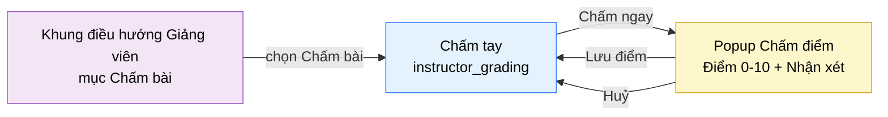

# Tài liệu thiết kế cơ bản (BD) — Chấm tay (`INS0301`)

## Phương châm tài liệu [Nội bộ — không cần khách duyệt]

- Viết theo **mẫu 9 sheet**. Bộ thẻ đóng, quy ước ID, ký hiệu chuẩn, ranh giới với tài liệu khác và
  checklist kiểm toán nằm ở `02-bd/_rules/bd-template-9sheet.md` — file này không chép lại.
- Phần gắn nhãn `[Nội bộ]` phục vụ sinh mã và tự kiểm toán, không phải yêu cầu của khách hàng: mục 4.5,
  mục 7.3 và các ghi chú quy ước.
- Mã màn `INS0301` theo bảng mã ở `02-bd/_rules/bd-template-9sheet.md` mục 8; tên file mang tiền tố mã.
- Màn này không có màn con, chỉ có **1 popup**: Chấm điểm.
- **Khung điều hướng khu Giảng viên không mô tả lại ở đây** — xem `02-bd/screens/teacher/_shell.md`. Khu
  Giảng viên **không có toolbar dùng chung**, nên hàng tiêu đề đầu `<main>` là item riêng của màn này và
  được đặc tả ở Sheet 4.4 và Sheet 5 [Nguồn: 02-bd/screens/teacher/_shell.md:113-114].

> Đọc cùng `01-rd/screens/teacher/INS0301_grading.md` (hành vi ở mức yêu cầu, không lặp lại ở đây) và ba
> file BD module: `02-bd/architecture/ai-review.md`, `02-bd/database/ai-review.md`,
> `02-bd/security/ai-review.md`.
>
> **Không thiết kế** cơ chế "học viên chủ động yêu cầu review" — đã loại khỏi phạm vi theo
> `DEC-2026-0830-remove-student-review-request` [Nguồn: DEC-2026-0830-remove-student-review-request].
> Prototype còn dấu vết của tính năng này ở ba chỗ (dòng mô tả phụ, thẻ thống kê thứ hai, giá trị chuỗi
> trong cột điểm) — prototype **cũ hơn quyết định**, xem Câu hỏi mở Q1.
>
> **Không thiết kế** màn này như danh sách toàn bộ bài nộp của lớp: đây là **hàng đợi đã lọc trước** — bài
> `Accepted` có điểm AI dưới 6/10 [Nguồn: 01-rd/req/ai-review.md:132-133;
> 02-bd/database/ai-review.md:223-233].
>
> **Không thiết kế** bất kỳ đường nào cho điểm AI hoặc điểm chấm tay tác động tới trạng thái Pass/Fail của
> bài nộp — hai lớp dữ liệu tách bạch hoàn toàn [Nguồn: 01-rd/req/ai-review.md:120-125;
> 02-bd/security/ai-review.md:42-46].

---

## Sheet 1. Bìa

| Mục | Giá trị |
| :--- | :--- |
| Hệ thống | AlgoPrep |
| Phân hệ | `ai-review` (F5), đọc kèm `problem-bank` (F2), `judge-orchestration` (F4), `identity` (F1) |
| Công đoạn | BD — Thiết kế cơ bản |
| Phân loại | Màn hình |
| Tên màn | Chấm tay |
| Mã màn hình | `INS0301` |
| Tên vật lý (slug) | `instructor_grading` |
| Trục tài liệu | Màn hình (`02-bd/screens/`) |
| Actor | A2 (`INSTRUCTOR`), gác bởi Function `CLASS_MANAGEMENT` |
| Phiên bản | V0.1 |
| Người tạo | Nhóm phát triển AlgoPrep |
| Ngày tạo | 2026/09/21 |
| Người cập nhật | Nhóm phát triển AlgoPrep |
| Ngày cập nhật | 2026/09/21 |

---

## Sheet 2. Lịch sử sửa đổi

| Ver | Sheet bị sửa | Nội dung sửa | Ngày | Người sửa |
| :--- | :--- | :--- | :--- | :--- |
| V0.1 | Toàn bộ | Tạo mới theo mẫu 9 sheet. Thiết kế theo `DEC-2026-0831-instructor-grading-round2` (hàng đợi lọc trước dưới 6/10, hiển thị song song điểm AI và điểm chấm tay, cửa sổ thống kê 7 ngày, bộ lọc lớp) và `DEC-2026-0830-remove-student-review-request` (gỡ nguồn hàng đợi từ phía học viên). Chốt nguồn dữ liệu cho mọi trường hiển thị, ghi 11 câu hỏi mở | 2026/09/21 | Nhóm phát triển AlgoPrep |
| V0.2 | 3, 5, 6, Câu hỏi mở | Áp `DEC-2026-0921-teacher-screens-conflict-resolutions`: thêm đường vào từ `class_student_detail` kèm bộ lọc học viên (chip bỏ được, không phải cụm tab thứ ba) ở Sheet 3 và Sheet 5 Khu vực C NO 3, Sheet 6 khớp theo; `manual_graded_at IS NULL` chuyển thành điều kiện của tab, sửa tại gốc ở `02-bd/database/ai-review.md` mục 4. Đóng Q3 | 2026-09-21 | AI |

---

## Sheet 3. Sơ đồ chuyển màn

> [Nội bộ] Quy ước vẽ: bố trí từ trái sang phải. Màn gọi tới tô tím, màn hiện tại tô xanh nhạt, popup tô
> vàng. Màu và `[Nguồn:]` dùng để truy vết, không phải yêu cầu của khách hàng.

### 3.1 Danh sách chuyển màn

#### Khung điều hướng Giảng viên → Chấm tay

[Điều kiện mở] Chọn mục "Chấm bài" (mục thứ 4) trên thanh điều hướng bên trái của khu Giảng viên
[Nguồn: 02-bd/screens/teacher/_shell.md:75].

[Chế độ mở] Không có.

[Thông tin truyền] Không có. Phạm vi lớp lấy từ tài khoản đang đăng nhập, **không** nhận từ tham số.

[Giá trị trả về] Không có.

[Khi thành công] Tải 3 thẻ thống kê và trang đầu của hàng đợi chấm tay, bộ lọc trạng thái mặc định "Chờ
chấm", bộ lọc lớp mặc định "Tất cả" [Nguồn: 09-layoutBase/Giáo viên - Chấm bài.dc.html:197].

[Khi huỷ] Không có.

#### Chi tiết học viên → Chấm tay (lọc theo học viên)

Đường vào thứ hai, bổ sung 2026-09-21 theo `DEC-2026-0921-teacher-screens-conflict-resolutions` (mức A4
của `07-review/bd_screens_teacher_open_questions_260921.md`): RD của `class_student_detail` yêu cầu một
liên kết sang màn này **đã lọc sẵn theo học viên**, nhưng bản BD đầu tiên của màn này không có chỗ nhận
tham số đó.

[Điều kiện mở] Bấm liên kết "Xem chấm bài của học viên này" ở màn `class_student_detail`
[Nguồn: 01-rd/screens/teacher/INS0204_class_student_detail.md:65-67].

[Chế độ mở] Không có.

[Thông tin truyền] `student_id` của học viên đang xem, và `class_id` của lớp đang xét — `class_id` dùng
để đặt sẵn tab lớp, `student_id` dùng để đặt chip lọc học viên (Sheet 5 Khu vực C NO 3).

[Giá trị trả về] Không có.

[Khi thành công] Hàng đợi tải với ba bộ lọc cùng lúc: tab trạng thái mặc định "Chờ chấm", tab lớp đặt
theo `class_id` truyền vào, và chip lọc học viên hiển thị tên học viên kèm nút bỏ lọc. Bỏ chip thì quay
về phạm vi tab lớp, **không** quay về "Tất cả" — giảng viên đến từ ngữ cảnh một lớp cụ thể.

[Khi huỷ] Không có.

#### Chấm tay → Popup Chấm điểm

[Điều kiện mở] Bấm nút "Chấm ngay" trên một dòng của hàng đợi
[Nguồn: 09-layoutBase/Giáo viên - Chấm bài.dc.html:164].

[Chế độ mở] Chế độ nhập điểm. Dòng chưa có điểm chấm tay thì mở form rỗng; dòng đã có điểm chấm tay thì mở
form nạp sẵn giá trị đang lưu để sửa — xem Câu hỏi mở Q7.

[Thông tin truyền] `solutionReviewId` của dòng được chọn, kèm tên học viên, tên bài tập và điểm AI để hiển
thị tiêu đề popup [Nguồn: 09-layoutBase/Giáo viên - Chấm bài.dc.html:304,316-317].

[Giá trị trả về] Điểm chấm tay và nhận xét đã lưu, hoặc không có gì nếu người dùng huỷ.

[Khi thành công] Popup hiển thị tên học viên, tên bài tập, điểm AI, ô nhập điểm và ô nhận xét.

[Khi huỷ] Đóng popup, hàng đợi giữ nguyên, không ghi gì xuống máy chủ.

#### Popup Chấm điểm → Chấm tay

[Điều kiện mở] Bấm "Lưu điểm" trong popup [Nguồn: 09-layoutBase/Giáo viên - Chấm bài.dc.html:187].

[Chế độ mở] Không có.

[Thông tin truyền] Không có.

[Giá trị trả về] Kết quả lưu điểm chấm tay.

[Khi thành công] Đóng popup, dòng tương ứng chuyển sang trạng thái "Đã chấm" và hiển thị song song hai
điểm dạng "AI: 4/10 · GV: 7/10"; 3 thẻ thống kê tải lại
[Nguồn: 01-rd/req/ai-review.md:134-136; 09-layoutBase/Giáo viên - Chấm bài.dc.html:300].

[Khi huỷ] Không có.

### 3.2 Sơ đồ

[Nguồn: 09-layoutBase/Giáo viên - Chấm bài.dc.html:76-85,164,176-191; 02-bd/screens/teacher/_shell.md:70-76]

**Màn này không có liên kết đi ra màn khác.** Prototype không có cột hay nhãn nào dẫn sang `submission_result`
hoặc sang báo cáo phân tích bài giải — giảng viên chấm điểm mà không có đường xem lời giải trên chính màn
này. Đây là một khoảng trống thật, xem Câu hỏi mở Q10.

---

## Sheet 4. Bố cục màn hình

### 4.1 Tổng quan màn

[Mục đích màn] Cho giảng viên một hàng đợi đã lọc trước những bài nộp `Accepted` bị AI chấm thấp trong các
lớp mình phụ trách, để chấm tay một điểm tham khảo thang 10 kèm nhận xét, lưu **cạnh** điểm AI chứ không
ghi đè [Nguồn: 01-rd/req/ai-review.md:116-125,132-140].

[Luồng nghiệp vụ chính]

1. **Hiển thị ban đầu**: vào màn, hệ thống tải 3 thẻ thống kê và trang đầu của hàng đợi theo bộ lọc mặc
   định (trạng thái "Chờ chấm", lớp "Tất cả"). Trong lúc chờ, mỗi khối hiển thị khung chờ đúng số dòng dự
   kiến.
2. **Lọc**: giảng viên đổi tab trạng thái ("Chờ chấm" / "Đã chấm" / "Tất cả") hoặc tab lớp. Danh sách và số
   kết quả tải lại; 3 thẻ thống kê **không** đổi theo bộ lọc, chúng luôn tính trên toàn phạm vi phụ trách.
3. **Chấm một bài**: bấm "Chấm ngay" trên một dòng, popup mở ra hiển thị điểm AI, giảng viên nhập điểm
   0-10 và nhận xét rồi bấm "Lưu điểm".
4. **Sau khi lưu**: dòng chuyển sang "Đã chấm", cột điểm hiển thị song song "AI: x/10 · GV: y/10", điểm AI
   gốc không bị ghi đè ở cả tầng dữ liệu lẫn tầng hiển thị.

[Người dùng] Giảng viên (`INSTRUCTOR`) đã đăng nhập, có Function `CLASS_MANAGEMENT`, đang phụ trách ít nhất
một lớp [Nguồn: 02-bd/security/ai-review.md:35-41].

[Tệp liên quan] Không có. Màn này không xuất hay nhập tệp.

[Phạm vi]
- **Chỉ** bài nộp `Accepted` có `ai_score_10 < 6.0` thuộc lớp giảng viên phụ trách. Bài nộp không có báo
  cáo phân tích bài giải (AI chưa chạy, hoặc F5 lỗi) **không** xuất hiện trong hàng đợi — xem Câu hỏi mở Q9.
- Không hiển thị mã nguồn học viên, không hiển thị input/output testcase ẩn, không hiển thị diff chi tiết —
  màn này không có bất kỳ trường nào mang dữ liệu đó.
- Không đổi trạng thái bài nộp, không đổi điểm tỷ lệ testcase F4-13 hiện cho học viên.
- Không có chức năng chấm hàng loạt, không có xuất báo cáo.

[Quyền sử dụng]
- Xem: được, trong phạm vi lớp phụ trách.
- Thêm: không (màn không tạo bản ghi mới, chỉ bổ sung cột `manual_*` vào bản ghi đã có).
- Sửa: được — ghi `manual_score`, `manual_comment`, `manual_graded_by`, `manual_graded_at`.
- Xoá: không.

[Số bản ghi tối đa] 3 thẻ thống kê. Hàng đợi: prototype dựng 9 dòng mẫu và không có phân trang, chỉ có
nhãn đếm "{n} bài" [Nguồn: 09-layoutBase/Giáo viên - Chấm bài.dc.html:213-222,314]; cơ chế phân trang hoặc
tải thêm chưa chốt, xem Câu hỏi mở Q6.

### 4.2 DTO liên quan

- `ManualGradingQueueItemDto`
- `ManualGradingStatsDto`
- `ManualGradeDto`
- `ClassOptionDto`

`[Suy luận]` — tên DTO do BD này đề xuất, `03-dd/api/ai-review.md` chốt lại.

### 4.3 Bảng dữ liệu liên quan (6)

| NO | Bảng | Ghi chú |
| --: | :--- | :--- |
| 1 | `ai.solution_reviews` | Nguồn chính: điểm AI, điểm chấm tay, nhận xét [Nguồn: 02-bd/database/ai-review.md:40-64] |
| 2 | `judge.submissions` | Lọc `status = ACCEPTED`, lấy `submitted_at`, `problem_id`, `user_id` [Nguồn: 02-bd/database/judge-orchestration.md:14-31] |
| 3 | `problem.problems` | Tên bài tập hiển thị ở cột "Bài tập" [Nguồn: 02-bd/database/problem-bank.md:15] |
| 4 | `identity.users` | Tên học viên hiển thị ở cột "Học viên" [Nguồn: 02-bd/database/identity.md:16] |
| 5 | `identity.classes` | Tên lớp ở cột "Lớp" và danh sách tab lọc lớp [Nguồn: 02-bd/database/identity.md:85-88] |
| 6 | `identity.class_enrollments` | Xác định phạm vi lớp phụ trách của giảng viên [Nguồn: 02-bd/database/ai-review.md:186-189] |

Năm bảng từ NO 2 tới NO 6 đều **chỉ đọc** và nằm ngoài schema `ai` — `ai-review` không import trực tiếp mà
đọc qua outbound port (`ClassScopeQueryPort` và tương đương), chi tiết ở
`02-bd/security/ai-review.md:35-41`.

### 4.4 Vùng bố cục

Đối chiếu `09-layoutBase/Giáo viên - Chấm bài.dc.html` — bằng chứng bố cục chỉ-đọc, **không phải** design
system cuối cùng.

| Vùng | Vị trí trong prototype | Nội dung |
| :--- | :--- | :--- |
| Thanh điều hướng bên trái (khung chung Giảng viên) | `:62-110` | 5 mục phẳng, mục "Chấm bài" đang chọn và mang badge số bài chờ chấm — dùng lại khung chung, không mô tả lại ở đây |
| Hàng tiêu đề (riêng của màn) | `:115-121` | Tiêu đề "Chấm bài" và một dòng mô tả phụ. **Không** có nút hành động nào ở hàng này, khác hẳn hàng đầu của `instructor_overview` |
| Dải thẻ thống kê | `:122-133` | Lưới `auto-fit minmax(200px, 1fr)`; prototype dựng 4 thẻ, thiết kế chốt **3 thẻ** sau khi gỡ thẻ "Yêu cầu review" |
| Khối hàng đợi — hàng bộ lọc | `:137-149` | Nhóm tab trạng thái (3 tab), nhóm tab lớp, nhãn đếm kết quả căn phải |
| Khối hàng đợi — tiêu đề cột | `:152-154` | 6 cột: Học viên · Bài tập · Lớp · Nộp lúc · Điểm (căn phải) · cột hành động không nhãn |
| Khối hàng đợi — các dòng | `:155-168` | Lưới 6 cột, `min-width: 900px`, cuộn ngang khi hẹp; nút "Chấm ngay" ở cuối mỗi dòng |
| Popup Chấm điểm | `:176-191` | Lớp phủ toàn màn, hộp rộng tối đa 480px: tiêu đề, dòng phụ, ô "Điểm (0-10)", ô "Nhận xét", nút "Huỷ" và "Lưu điểm" |
| Chân trang | không có | Khu Giảng viên không dựng chân trang [Nguồn: 02-bd/screens/teacher/_shell.md:31] |

Tiêu đề cột thứ 5 trong prototype hiện tại là **"Điểm"** chứ không phải "Điểm AI"
[Nguồn: 09-layoutBase/Giáo viên - Chấm bài.dc.html:153] — hợp với việc ô này chứa cả hai điểm sau khi chấm
tay. Giữ nguyên nhãn "Điểm" khi dựng Next.js. Không quy định màu sắc, khoảng cách hay typography ở BD.

### 4.5 Cấu trúc slice FSD [Nội bộ]

| Khối | Slice dự kiến | Căn cứ |
| :--- | :--- | :--- |
| Trang | `views/instructor-grading` | Quy ước FSD của dự án |
| Khung Giảng viên | Dùng lại `widgets/instructor-shell` | `02-bd/screens/teacher/_shell.md` mục 1 |
| Dải thẻ thống kê | `widgets/grading-stats` | Prototype `:122-133` |
| Hàng đợi | `widgets/grading-queue` + `entities/solution-review` | Prototype `:135-170` |
| Bộ lọc | `features/grading-queue-filter` | Prototype `:137-149` |
| Popup chấm điểm | `features/manual-grade` | Prototype `:176-191` |

`[Suy luận]` — ánh xạ slice do BD đề xuất, DD màn hình chốt lại.

> [Nội bộ] Ảnh minh hoạ đặt ở `08-diagram/02-bd/screens/teacher/`, chụp bằng Playwright trên ứng dụng
> Next.js thật khi đã có mã chạy được. Chưa có thì tham chiếu prototype, không vẽ tay.

---

## Sheet 5. Danh sách item màn hình

> Quy ước ID, bộ thẻ và giá trị chuẩn: `02-bd/_rules/bd-template-9sheet.md` mục 2, 3, 4.

### Khu vực A — Hàng tiêu đề

| Khu vực | NO | Tên item | ID item | Bảng DB | Cột DB | Loại UI | Kiểu | Độ dài | Bắt buộc | I/O | Giá trị mặc định | Định dạng | Ghi chú |
| :--- | --: | :--- | :--- | :--- | :--- | :--- | :--- | :--- | :-: | :-: | :--- | :--- | :--- |
| Hàng tiêu đề | | | | | | | | | | | | | |
| | 1 | Tiêu đề màn | `instructorGrading.header.title` | - | - | Label | String | - | - | O | Chấm bài | - | Tên màn hiển thị cố định [Nguồn giá trị] Nhãn tĩnh i18n [EVT liên quan] - |
| | 2 | Mô tả phụ | `instructorGrading.header.subtitle` | - | - | Label | String | - | - | O | Bài nộp Accepted có điểm AI dưới 6/10 trong các lớp bạn phụ trách | - | Mô tả phạm vi hàng đợi. Prototype còn câu cũ "Bài nộp AI chấm điểm thấp hoặc học viên yêu cầu review" — vế sau đã bị loại khỏi phạm vi, xem Q1 [Nguồn giá trị] Nhãn tĩnh i18n [EVT liên quan] - |

### Khu vực B — Thẻ thống kê

| Khu vực | NO | Tên item | ID item | Bảng DB | Cột DB | Loại UI | Kiểu | Độ dài | Bắt buộc | I/O | Giá trị mặc định | Định dạng | Ghi chú |
| :--- | --: | :--- | :--- | :--- | :--- | :--- | :--- | :--- | :-: | :-: | :--- | :--- | :--- |
| Thẻ thống kê | | | | | | | | | | | | | |
| | 1 | Số bài chờ chấm | `instructorGrading.stats.pendingCount` | `ai.solution_reviews` | `ai_score_10`, `manual_graded_at` | Label | Number | 4 | - | O | - | Số nguyên | Giá trị thẻ "Chờ chấm" [Công thức] Đếm bản ghi đạt điều kiện hàng đợi mà `manual_graded_at IS NULL` [Nguồn: 01-rd/req/ai-review.md:137-138; 02-bd/database/ai-review.md:223-233] [EVT liên quan] EVT-1, EVT-6 |
| | 2 | Ghi chú thẻ chờ chấm | `instructorGrading.stats.pendingMeta` | - | - | Label | String | - | - | O | - | `{số} chờ quá 24 giờ` | Dòng phụ dưới số bài chờ chấm. Prototype ghi "3 chờ quá 24 giờ" nhưng không có công thức nào trong F5-27 amendment — xem Q2 [Nguồn giá trị] Chưa chốt, là một câu hỏi mở (Q2) [EVT liên quan] EVT-1 |
| | 3 | Số bài đã chấm 7 ngày | `instructorGrading.stats.gradedCount` | `ai.solution_reviews` | `manual_graded_at` | Label | Number | 4 | - | O | - | Số nguyên | Giá trị thẻ "Đã chấm tuần này" [Công thức] Đếm bản ghi có `manual_graded_by` là giảng viên hiện tại và `manual_graded_at` nằm trong **7 ngày gần nhất**, không phải tuần lịch [Nguồn: 01-rd/req/ai-review.md:137-140] [EVT liên quan] EVT-1, EVT-6 |
| | 4 | Chênh lệch số bài đã chấm | `instructorGrading.stats.gradedDelta` | - | - | Label | String | 6 | - | O | - | `+{số}` / `-{số}` | Dòng so sánh "So với tuần trước" trên thẻ đã chấm. F5-27 amendment chỉ chốt công thức của con số chính, không chốt của phần chênh lệch — xem Q2 [Nguồn giá trị] Chưa chốt, là một câu hỏi mở (Q2) [EVT liên quan] EVT-1 |
| | 5 | Điểm trung bình sau chấm | `instructorGrading.stats.avgManualScore` | `ai.solution_reviews` | `manual_score` | Label | Number | 4 | - | O | - | Một chữ số thập phân | Giá trị thẻ "Điểm TB sau chấm" [Công thức] Trung bình cộng `manual_score` của các bài đã chấm trong cùng cửa sổ 7 ngày [Nguồn: 01-rd/req/ai-review.md:139-140] [EVT liên quan] EVT-1, EVT-6 |
| | 6 | Chênh lệch so với điểm AI | `instructorGrading.stats.avgScoreDelta` | - | - | Label | String | 6 | - | O | - | `+{số}` / `-{số}` | Dòng "So với điểm AI" trên thẻ điểm trung bình. Cách tính chưa chốt — xem Q2 [Nguồn giá trị] Chưa chốt, là một câu hỏi mở (Q2) [EVT liên quan] EVT-1 |

Prototype dựng **4** thẻ; thẻ "Yêu cầu review" (giá trị 2, dòng phụ "Học viên chủ động gửi")
[Nguồn: 09-layoutBase/Giáo viên - Chấm bài.dc.html:268] **không** được thiết kế — tính năng đã loại khỏi
phạm vi [Nguồn: DEC-2026-0830-remove-student-review-request].

### Khu vực C — Bộ lọc

| Khu vực | NO | Tên item | ID item | Bảng DB | Cột DB | Loại UI | Kiểu | Độ dài | Bắt buộc | I/O | Giá trị mặc định | Định dạng | Ghi chú |
| :--- | --: | :--- | :--- | :--- | :--- | :--- | :--- | :--- | :-: | :-: | :--- | :--- | :--- |
| Bộ lọc | | | | | | | | | | | | | |
| | 1 | Tab trạng thái chấm | `instructorGrading.filter.statusTabs` | - | - | Button | Enum | - | - | I/O | Chờ chấm | Chờ chấm / Đã chấm / Tất cả | Lọc theo **trạng thái chấm của giảng viên**, không phải Pass/Fail của bài nộp [Nguồn: 01-rd/screens/teacher/INS0301_grading.md:70-73] [Nguồn giá trị] Nhãn tĩnh i18n; giá trị ánh xạ về điều kiện trên `manual_graded_at` [EVT liên quan] EVT-2 |
| | 2 | Tab lớp | `instructorGrading.filter.classTabs` | `identity.classes` | `name` | Button | List | - | - | I/O | Tất cả | Danh sách tab | Lọc theo lớp phụ trách (Q5 của `DEC-2026-0831-instructor-grading-round2`). Tab đầu "Tất cả" là nhãn tĩnh, các tab sau là tên lớp thật [Nguồn giá trị] Danh sách lớp do giảng viên hiện tại phụ trách, đọc `identity.classes.name` qua `ListInstructorClasses` [EVT liên quan] EVT-3 |
| | 3 | Chip lọc học viên | `instructorGrading.filter.studentChip` | `identity.users` | `display_name` | Badge | String | 100 | - | O | - | `Học viên: {tên}` kèm nút bỏ lọc | Chỉ xuất hiện khi vào màn từ `class_student_detail` kèm tham số học viên (`DEC-2026-0921-teacher-screens-conflict-resolutions`, mức A4). **Không** làm thành cụm tab thứ ba vì số học viên quá lớn để liệt kê thành tab. Bỏ lọc thì chip biến mất và hàng đợi trở về phạm vi tab lớp đang chọn [Nguồn giá trị] Tên học viên lấy theo `student_id` truyền vào đường dẫn, đọc `identity.users.display_name` [EVT liên quan] EVT-3 |
| | 4 | Số kết quả | `instructorGrading.filter.resultCount` | - | - | Label | String | 10 | - | O | - | `{số} bài` | Số dòng khớp bộ lọc hiện tại [Công thức] Tổng số bản ghi khớp bộ lọc trả về từ máy chủ, không phải số dòng đang hiển thị trên trang [Nguồn: 09-layoutBase/Giáo viên - Chấm bài.dc.html:314] [EVT liên quan] EVT-1, EVT-2, EVT-3 |

### Khu vực D — Hàng đợi chấm tay

| Khu vực | NO | Tên item | ID item | Bảng DB | Cột DB | Loại UI | Kiểu | Độ dài | Bắt buộc | I/O | Giá trị mặc định | Định dạng | Ghi chú |
| :--- | --: | :--- | :--- | :--- | :--- | :--- | :--- | :--- | :-: | :-: | :--- | :--- | :--- |
| Hàng đợi chấm tay | | | | | | | | | | | | | |
| | 1 | Danh sách hàng đợi | `instructorGrading.queue.list` | `ai.solution_reviews` | - | List | List | - | - | O | rỗng | - | Mỗi dòng là một bài nộp `Accepted` có điểm AI dưới 6/10 thuộc lớp phụ trách, sắp xếp theo thời gian nộp tăng dần (cũ trước) [Nguồn giá trị] Kết quả gọi `ListManualGradingQueue` [Nguồn: 02-bd/database/ai-review.md:223-233] [EVT liên quan] EVT-1, EVT-2, EVT-3 |
| | 2 | Học viên | `instructorGrading.queue.col.student` | `identity.users` | `display_name` | ListColumn | String | - | - | O | - | - | Tên học viên nộp bài [Nguồn giá trị] `identity.users.display_name`, tra theo `solution_reviews.user_id` [Nguồn: 02-bd/database/identity.md:16; 02-bd/database/ai-review.md:46] [EVT liên quan] - |
| | 3 | Bài tập | `instructorGrading.queue.col.problem` | `problem.problems` | `title` | ListColumn | String | - | - | O | - | - | Tên bài tập [Nguồn giá trị] `problem.problems.title`, tra theo `solution_reviews.problem_id` [Nguồn: 02-bd/database/problem-bank.md:15; 02-bd/database/ai-review.md:47] [EVT liên quan] - |
| | 4 | Lớp | `instructorGrading.queue.col.className` | `identity.classes` | `name` | ListColumn | String | - | - | O | - | - | Lớp mà học viên thuộc về trong phạm vi phụ trách [Nguồn giá trị] `identity.classes.name`, tra qua `identity.class_enrollments` [Nguồn: 02-bd/database/identity.md:85-97] [EVT liên quan] - |
| | 5 | Nộp lúc | `instructorGrading.queue.col.submittedAt` | `judge.submissions` | `submitted_at` | ListColumn | Date | - | - | O | - | Thời gian tương đối | Thời điểm nộp bài, hiển thị dạng tương đối ("2 giờ trước", "Hôm qua") [Nguồn giá trị] `judge.submissions.submitted_at` [Nguồn: 02-bd/database/judge-orchestration.md:31]. Cách quy đổi sang chuỗi tương đối chốt ở DD màn hình [EVT liên quan] - |
| | 6 | Điểm | `instructorGrading.queue.col.score` | `ai.solution_reviews` | `ai_score_10`, `manual_score` | ListColumn | String | 24 | - | O | - | `AI: {x}/10` hoặc `AI: {x}/10 · GV: {y}/10` | Chưa chấm tay thì chỉ hiện điểm AI; đã chấm thì hiện **song song** hai điểm, không ghi đè [Nguồn: 01-rd/req/ai-review.md:134-136] [Công thức] Ghép `ai_score_10` và `manual_score`; `manual_score IS NULL` thì bỏ vế sau [EVT liên quan] EVT-6 |
| | 7 | Chấm ngay | `instructorGrading.queue.col.btnGrade` | - | - | Button | - | - | - | I | - | - | Mở popup chấm điểm cho dòng đó [Nguồn giá trị] - [EVT liên quan] EVT-4 |

Cột "Điểm" **không bao giờ** nhận giá trị chuỗi "Yêu cầu review" như dữ liệu mẫu của prototype
[Nguồn: 09-layoutBase/Giáo viên - Chấm bài.dc.html:214,218] — mọi dòng đều đến từ một nguồn duy nhất là
điểm AI thấp, nên luôn có `ai_score_10` là số [Nguồn: DEC-2026-0830-remove-student-review-request].

### Popup — Chấm điểm

| Khu vực | NO | Tên item | ID item | Bảng DB | Cột DB | Loại UI | Kiểu | Độ dài | Bắt buộc | I/O | Giá trị mặc định | Định dạng | Ghi chú |
| :--- | --: | :--- | :--- | :--- | :--- | :--- | :--- | :--- | :-: | :-: | :--- | :--- | :--- |
| Popup — Chấm điểm | | | | | | | | | | | | | |
| | 1 | Hộp thoại chấm điểm | `instructorGrading.popup.gradeDialog` | `ai.solution_reviews` | - | Popup | - | - | - | I/O | - | - | Hộp thoại nhập điểm chấm tay cho một bản ghi [Nguồn giá trị] Dòng được chọn trong hàng đợi [EVT liên quan] EVT-4, EVT-5, EVT-6, EVT-7 |
| | 2 | Tiêu đề popup | `instructorGrading.popup.title` | - | - | Label | String | - | - | O | - | `{Học viên} · {Bài tập}` | Định danh bài đang chấm [Công thức] Ghép hai giá trị đã có trên dòng được chọn [Nguồn: 09-layoutBase/Giáo viên - Chấm bài.dc.html:316] [EVT liên quan] EVT-4 |
| | 3 | Dòng phụ popup | `instructorGrading.popup.meta` | `ai.solution_reviews` | `ai_score_10` | Label | String | - | - | O | - | `AI: {x}/10 · GV: {y}/10` hoặc `AI: {x}/10 · GV: (chưa nhập)` | Hiện điểm AI gốc ngay trong popup để giảng viên đối chiếu khi nhập [Công thức] Ghép `ai_score_10` với giá trị đang nhập ở ô điểm [Nguồn: 09-layoutBase/Giáo viên - Chấm bài.dc.html:317] [EVT liên quan] EVT-5 |
| | 4 | Ô nhập điểm | `instructorGrading.popup.scoreInput` | `ai.solution_reviews` | `manual_score` | NumberBox | Number | 4 | Có | I | rỗng | Số từ 0 đến 10, tối đa một chữ số thập phân | Điểm chấm tay. Prototype để ô text tự do không ràng buộc; BD chốt kiểu số theo `manual_score DECIMAL(3,1)` [Nguồn: 02-bd/database/ai-review.md:54]. Bước nhảy cho phép (0,5 hay 0,1) xem Q4 [Nguồn giá trị] Người dùng nhập; dòng đã chấm thì nạp sẵn `manual_score` đang lưu [EVT liên quan] EVT-5, EVT-6 |
| | 5 | Ô nhận xét | `instructorGrading.popup.commentInput` | `ai.solution_reviews` | `manual_comment` | TextArea | String | - | - | I | rỗng | Văn bản thuần | Nhận xét kèm điểm, gợi ý nhập "Ghi chú cho học viên…" [Nguồn: 09-layoutBase/Giáo viên - Chấm bài.dc.html:184]. Bắt buộc hay không và giới hạn độ dài xem Q5 [Nguồn giá trị] Người dùng nhập; dòng đã chấm thì nạp sẵn `manual_comment` đang lưu [EVT liên quan] EVT-5, EVT-6 |
| | 6 | Huỷ | `instructorGrading.popup.btnCancel` | - | - | Button | - | - | - | I | - | - | Đóng popup, bỏ nội dung đang nhập [Nguồn giá trị] - [EVT liên quan] EVT-7 |
| | 7 | Lưu điểm | `instructorGrading.popup.btnSave` | - | - | Button | - | - | - | I | - | - | Ghi điểm chấm tay và nhận xét xuống máy chủ [Nguồn giá trị] - [EVT liên quan] EVT-6 |

Popup **không** hiển thị mã nguồn học viên, kết quả từng testcase, hay bất kỳ dữ liệu testcase ẩn nào —
không có item nào mang dữ liệu đó, ở mọi trạng thái của màn.

[Nguồn: 09-layoutBase/Giáo viên - Chấm bài.dc.html:115-121,122-133,137-149,152-168,176-191;
02-bd/database/ai-review.md:40-64; 01-rd/req/ai-review.md:130-142]

---

## Sheet 6. Đặc tả điều khiển item

> Ký hiệu cột `Hiển thị` và thứ tự thẻ: `02-bd/_rules/bd-template-9sheet.md` mục 2, 3. Dùng đúng NO, tên
> item và thứ tự của Sheet 5. Lỗi nhập liệu ghi ở Sheet 9, xử lý nghiệp vụ ghi ở Sheet 8.

### Khu vực A — Hàng tiêu đề

| Khu vực | NO | Tên item | Hiển thị | Ghi chú |
| :--- | --: | :--- | :-: | :--- |
| Hàng tiêu đề | | | | |
| | 1 | Tiêu đề màn | Có | - |
| | 2 | Mô tả phụ | Có | - |

### Khu vực B — Thẻ thống kê

| Khu vực | NO | Tên item | Hiển thị | Ghi chú |
| :--- | --: | :--- | :-: | :--- |
| Thẻ thống kê | | | | |
| | 1 | Số bài chờ chấm | Có | [Điều kiện hiển thị] Trong lúc tải hiển thị khung chờ đúng 3 thẻ. [Tự động đặt] Tải lại sau mỗi lần lưu điểm thành công. |
| | 2 | Ghi chú thẻ chờ chấm | Điều kiện | [Điều kiện hiển thị] Chỉ hiển thị khi công thức của dòng này đã được chốt (Q2) và giá trị lớn hơn 0; chưa chốt hoặc bằng 0 thì ẩn cả dòng, thẻ vẫn hiện con số chính. |
| | 3 | Số bài đã chấm 7 ngày | Có | [Tự động đặt] Tải lại sau mỗi lần lưu điểm thành công. |
| | 4 | Chênh lệch số bài đã chấm | Điều kiện | [Điều kiện hiển thị] Chỉ hiển thị khi công thức đã chốt (Q2) và có đủ dữ liệu của cửa sổ 7 ngày liền trước; thiếu dữ liệu thì ẩn. |
| | 5 | Điểm trung bình sau chấm | Điều kiện | [Điều kiện hiển thị] Không có bài nào được chấm trong 7 ngày gần nhất thì hiển thị `-` thay cho số, không hiển thị `0.0`. [Tự động đặt] Tải lại sau mỗi lần lưu điểm thành công. |
| | 6 | Chênh lệch so với điểm AI | Điều kiện | [Điều kiện hiển thị] Chỉ hiển thị khi công thức đã chốt (Q2) và thẻ NO 5 đang có giá trị số. |

### Khu vực C — Bộ lọc

| Khu vực | NO | Tên item | Hiển thị | Ghi chú |
| :--- | --: | :--- | :-: | :--- |
| Bộ lọc | | | | |
| | 1 | Tab trạng thái chấm | Có | [Điều kiện kích hoạt] Không kích hoạt trong lúc đang tải danh sách, kích hoạt lại sau khi tải xong. [Tự động đặt] Đổi tab thì đặt lại về trang đầu của danh sách. |
| | 2 | Tab lớp | Điều kiện | [Điều kiện hiển thị] Chỉ hiển thị khi giảng viên phụ trách từ 2 lớp trở lên; phụ trách đúng 1 lớp thì ẩn cả nhóm tab vì không có gì để lọc. [Điều kiện kích hoạt] Kích hoạt sau khi tải xong danh sách lớp. [Tự động đặt] Đổi tab thì đặt lại về trang đầu của danh sách. |
| | 3 | Chip lọc học viên | Điều kiện | [Điều kiện hiển thị] Chỉ hiển thị khi đường vào màn có tham số học viên (từ `class_student_detail`); vào màn bằng mục nav thì không có chip. [Điều kiện kích hoạt] Nút bỏ lọc luôn kích hoạt khi chip hiển thị. [Tự động xoá] Bỏ lọc thì chip biến mất và không quay lại cho tới lần vào màn kèm tham số kế tiếp. |
| | 4 | Số kết quả | Có | [Tự động đặt] Cập nhật cùng lúc với danh sách sau mỗi lần đổi bộ lọc. |

### Khu vực D — Hàng đợi chấm tay

| Khu vực | NO | Tên item | Hiển thị | Ghi chú |
| :--- | --: | :--- | :-: | :--- |
| Hàng đợi chấm tay | | | | |
| | 1 | Danh sách hàng đợi | Có | [Điều kiện hiển thị] Trong lúc tải hiển thị khung chờ. Tải xong mà không có dòng nào thì hiển thị thông báo rỗng thay cho bảng: tab "Chờ chấm" hiện "Không có bài nào chờ chấm", tab "Đã chấm" hiện "Bạn chưa chấm bài nào", tab "Tất cả" hiện "Chưa có bài nộp nào đạt điều kiện hàng đợi". |
| | 2 | Học viên | Có | - |
| | 3 | Bài tập | Có | - |
| | 4 | Lớp | Có | - |
| | 5 | Nộp lúc | Có | - |
| | 6 | Điểm | Có | [Tự động đặt] Sau khi lưu điểm thành công, ô này đổi từ `AI: {x}/10` sang `AI: {x}/10 · GV: {y}/10` ngay trên dòng đó, không tải lại toàn bảng. |
| | 7 | Chấm ngay | Có | [Điều kiện kích hoạt] Kích hoạt trên mọi dòng, kể cả dòng đã chấm — nhãn dòng đã chấm đổi thành "Sửa điểm", xem Q7. Không kích hoạt khi popup đang mở. |

### Popup — Chấm điểm

| Khu vực | NO | Tên item | Hiển thị | Ghi chú |
| :--- | --: | :--- | :-: | :--- |
| Popup — Chấm điểm | | | | |
| | 1 | Hộp thoại chấm điểm | Điều kiện | [Điều kiện hiển thị] Chỉ hiển thị sau khi bấm "Chấm ngay" trên một dòng. Mỗi lần chỉ mở được một hộp thoại. |
| | 2 | Tiêu đề popup | Có | - |
| | 3 | Dòng phụ popup | Có | [Tự động đặt] Phần "GV" cập nhật theo từng ký tự người dùng gõ ở ô điểm; ô điểm rỗng thì hiện "(chưa nhập)". |
| | 4 | Ô nhập điểm | Có | [Điều kiện kích hoạt] Kích hoạt ngay khi popup mở và nhận con trỏ đầu tiên. [Tự động đặt] Dòng đã có điểm chấm tay thì nạp sẵn giá trị đang lưu. |
| | 5 | Ô nhận xét | Có | [Tự động đặt] Dòng đã có nhận xét thì nạp sẵn nội dung đang lưu. |
| | 6 | Huỷ | Có | - |
| | 7 | Lưu điểm | Có | [Điều kiện kích hoạt] Chỉ kích hoạt khi ô điểm có giá trị hợp lệ theo Sheet 9. Trong lúc đang gửi thì không kích hoạt để tránh gửi hai lần. |

---

## Sheet 7. Danh sách truyền dữ liệu

### 7.1 Trường DTO

| NO | DTO | Trường DTO | Kiểu | Bảng DB | Cột DB | Item màn | Hiển thị | Ghi chú |
| --: | :--- | :--- | :--- | :--- | :--- | :--- | :-: | :--- |
| 1 | `ManualGradingQueueItemDto` | `solutionReviewId` | UUID | `ai.solution_reviews` | `id` | - | Không | [Nguồn] Phản hồi của `ListManualGradingQueue` [Đích] Tham số của `SubmitManualGrade`. Không hiển thị trên màn. |
| 2 | `ManualGradingQueueItemDto` | `studentName` | String | `identity.users` | `display_name` | Hàng đợi "Học viên" | Có | [Nguồn] Máy chủ tra qua `solution_reviews.user_id`, giao diện không tự gọi `identity`. |
| 3 | `ManualGradingQueueItemDto` | `problemTitle` | String | `problem.problems` | `title` | Hàng đợi "Bài tập" | Có | [Nguồn] Máy chủ tra qua `solution_reviews.problem_id`. |
| 4 | `ManualGradingQueueItemDto` | `className` | String | `identity.classes` | `name` | Hàng đợi "Lớp" | Có | [Nguồn] Máy chủ tra qua `identity.class_enrollments` trong phạm vi lớp phụ trách. |
| 5 | `ManualGradingQueueItemDto` | `submittedAt` | Date | `judge.submissions` | `submitted_at` | Hàng đợi "Nộp lúc" | Có | [Chuyển đổi] Máy chủ trả mốc thời gian tuyệt đối, giao diện quy đổi sang chuỗi tương đối khi hiển thị. |
| 6 | `ManualGradingQueueItemDto` | `aiScore10` | Number | `ai.solution_reviews` | `ai_score_10` | Hàng đợi "Điểm", popup "Dòng phụ" | Có | [Chuyển đổi] Hiển thị `AI: {x}/10`. **Không bao giờ bị ghi đè** bởi điểm chấm tay [Nguồn: 02-bd/security/ai-review.md:42-46]. |
| 7 | `ManualGradingQueueItemDto` | `manualScore` | Number | `ai.solution_reviews` | `manual_score` | Hàng đợi "Điểm", popup "Ô nhập điểm" | Có | [Chuyển đổi] Khác `null` thì ghép thêm ` · GV: {y}/10` vào cột Điểm; cũng là giá trị nạp sẵn khi mở lại popup. |
| 8 | `ManualGradingQueueItemDto` | `manualComment` | String | `ai.solution_reviews` | `manual_comment` | Popup "Ô nhận xét" | Có | [Nguồn] Chỉ dùng để nạp sẵn khi sửa; không hiển thị trong bảng hàng đợi. |
| 9 | `ManualGradingQueueItemDto` | `manualGradedAt` | Date | `ai.solution_reviews` | `manual_graded_at` | - | Không | [Nguồn] Quyết định dòng thuộc nhóm "Chờ chấm" hay "Đã chấm"; không in ra màn. |
| 10 | `ManualGradingStatsDto` | `pendingCount` | Number | `ai.solution_reviews` | `ai_score_10`, `manual_graded_at` | Thẻ "Số bài chờ chấm" | Có | [Nguồn] Phản hồi của `GetManualGradingStats`, tính trên toàn phạm vi phụ trách, **không** theo bộ lọc đang chọn. |
| 11 | `ManualGradingStatsDto` | `gradedLast7Days` | Number | `ai.solution_reviews` | `manual_graded_at` | Thẻ "Số bài đã chấm 7 ngày" | Có | [Chuyển đổi] Cửa sổ trượt 7 ngày tính tại thời điểm gọi, không phải tuần lịch. |
| 12 | `ManualGradingStatsDto` | `avgManualScoreLast7Days` | Number | `ai.solution_reviews` | `manual_score` | Thẻ "Điểm trung bình sau chấm" | Có | [Chuyển đổi] Không có bài nào trong cửa sổ thì trả `null`, giao diện hiện `-`. |
| 13 | `ManualGradeDto` | `score` | Number | `ai.solution_reviews` | `manual_score` | Popup "Ô nhập điểm" | Có | [Nguồn] Giá trị người dùng nhập [Đích] Tham số của `SubmitManualGrade` [Chuyển đổi] Gửi lên dạng số, không kèm hậu tố `/10`. |
| 14 | `ManualGradeDto` | `comment` | String | `ai.solution_reviews` | `manual_comment` | Popup "Ô nhận xét" | Có | [Nguồn] Giá trị người dùng nhập [Đích] Tham số của `SubmitManualGrade`. Nội dung là **dữ liệu thuần**, không ghép vào bất kỳ prompt AI nào. |
| 15 | `ClassOptionDto` | `classId`, `className` | UUID, String | `identity.classes` | `id`, `name` | Bộ lọc "Tab lớp" | Có | [Nguồn] Phản hồi của `ListInstructorClasses` [Đích] `classId` là tham số lọc của `ListManualGradingQueue`. |

### 7.2 Truy cập bảng dữ liệu (6)

| NO | Tên logic | Bảng | Repository | CRUD | Mục đích | Ghi chú |
| --: | :--- | :--- | :--- | :-: | :--- | :--- |
| 1 | Báo cáo phân tích bài giải | `ai.solution_reviews` | `SolutionReviewRepository` | R, U | Đọc hàng đợi và thống kê; ghi điểm chấm tay | `ListManualGradingQueue`: R `GetManualGradingStats`: R `SubmitManualGrade`: U — chỉ `UPDATE` các cột `manual_*`, không bao giờ `UPDATE ai_score_10`/`result_json` [Nguồn: 02-bd/security/ai-review.md:42-46] |
| 2 | Bài nộp | `judge.submissions` | Đọc qua outbound port | R | Lọc `status = ACCEPTED`, lấy `submitted_at` | `ListManualGradingQueue`: R |
| 3 | Bài tập | `problem.problems` | Đọc qua outbound port | R | Lấy tên bài tập | `ListManualGradingQueue`: R |
| 4 | Người dùng | `identity.users` | Đọc qua outbound port | R | Lấy tên học viên | `ListManualGradingQueue`: R |
| 5 | Lớp học | `identity.classes` | Đọc qua outbound port | R | Lấy tên lớp cho cột "Lớp" và tab lọc | `ListManualGradingQueue`: R `ListInstructorClasses`: R |
| 6 | Ghi danh lớp | `identity.class_enrollments` | `ClassScopeQueryPort` | R | Xác định phạm vi lớp phụ trách, chặn dữ liệu ngoài phạm vi | `ListManualGradingQueue`: R `GetManualGradingStats`: R `SubmitManualGrade`: R (kiểm quyền trước khi ghi) |

Màn này **không** có thao tác tạo (`C`) hay xoá (`D`) trên bất kỳ bảng nào. Năm bảng NO 2 tới NO 6 nằm
ngoài schema `ai` nên chỉ đọc qua outbound port, không import repository của module khác
[Nguồn: 02-bd/security/ai-review.md:35-41].

`[Suy luận]` — tên repository và port do BD này đề xuất, DD module `ai-review` chốt lại.

### 7.3 Danh sách endpoint [Nội bộ]

> Chỉ tên nghiệp vụ và BC sở hữu. Hợp đồng chi tiết thuộc `03-dd/api/ai-review.md`.

| NO | Endpoint (tên nghiệp vụ) | Mục đích | BC sở hữu |
| --: | :--- | :--- | :--- |
| 1 | `ListManualGradingQueue` | Tải hàng đợi chấm tay theo bộ lọc trạng thái và lớp, trong phạm vi lớp phụ trách | `ai-review` |
| 2 | `GetManualGradingStats` | Tải 3 chỉ số thẻ thống kê trên toàn phạm vi phụ trách | `ai-review` |
| 3 | `SubmitManualGrade` | Ghi điểm chấm tay và nhận xét cho một bản ghi | `ai-review` |
| 4 | `ListInstructorClasses` | Tải danh sách lớp giảng viên phụ trách để dựng tab lọc | `identity` |

Badge "Chấm bài" trên thanh điều hướng chung mang đúng con số "Chờ chấm" của endpoint số 2
[Nguồn: 02-bd/screens/teacher/_shell.md:81-83] — gọi chung một endpoint hay gộp vào endpoint tóm tắt của
khung là việc của DD, xem Q11.

[Nguồn: 02-bd/database/ai-review.md:40-64,223-233; 02-bd/security/ai-review.md:35-46]

---

## Sheet 8. Danh sách sự kiện

> Bộ thẻ và quy ước cột `Chuyển màn`: `02-bd/_rules/bd-template-9sheet.md` mục 2, 3.

### Màn chính: Chấm tay

| NO | Loại | Sự kiện | Chi tiết | Chuyển màn | Gọi API | Tên xử lý | Ghi chú |
| --: | :--- | :--- | :--- | :-: | :-: | :--- | :--- |
| 1 | Màn hình | Khởi tạo màn | Vào màn thì tải thống kê, danh sách lớp và trang đầu của hàng đợi. | Không | Có | `GetManualGradingStats`, `ListInstructorClasses`, `ListManualGradingQueue` | [Các bước] 1. Kiểm tra quyền `CLASS_MANAGEMENT`. 2. Hiển thị khung chờ cho dải thẻ và bảng. 3. Tải song song ba nhóm dữ liệu với bộ lọc mặc định "Chờ chấm" + "Tất cả". [Khi thành công] Hiện 3 thẻ thống kê và bảng hàng đợi kèm số kết quả. [Khi lỗi] Hiển thị lỗi tại đúng khối tải thất bại; khối tải được vẫn hiện bình thường, không rời màn. Danh sách lớp lỗi thì ẩn nhóm tab lớp và vẫn cho xem hàng đợi ở phạm vi "Tất cả". |
| 2 | Nút | Đổi tab trạng thái | Bấm một trong ba tab "Chờ chấm" / "Đã chấm" / "Tất cả". | Không | Có | `ListManualGradingQueue` | [Các bước] 1. Ghi nhận trạng thái được chọn, đặt lại về trang đầu. 2. Tải lại danh sách với bộ lọc mới. [Khi thành công] Bảng và số kết quả cập nhật; 3 thẻ thống kê **không** đổi vì chúng không phụ thuộc bộ lọc. [Khi lỗi] Giữ nguyên danh sách đang hiển thị, trả tab về giá trị trước đó và hiện thông báo lỗi. |
| 3 | Nút | Đổi bộ lọc lớp | Bấm một tab lớp. | Không | Có | `ListManualGradingQueue` | [Các bước] 1. Ghi nhận lớp được chọn, đặt lại về trang đầu. 2. Tải lại danh sách. [Khi thành công] Bảng và số kết quả cập nhật, tab trạng thái giữ nguyên. [Khi lỗi] Giữ nguyên danh sách đang hiển thị, trả tab lớp về giá trị trước đó và hiện thông báo lỗi. |
| 4 | Nút | Mở popup chấm điểm | Bấm "Chấm ngay" trên một dòng. | Không | Không | - | [Các bước] 1. Nạp dữ liệu của dòng được chọn vào popup. 2. Dòng đã có điểm chấm tay thì nạp sẵn điểm và nhận xét đang lưu; chưa có thì để rỗng. [Khi thành công] Popup hiển thị, con trỏ đặt ở ô điểm, nền phía sau không thao tác được. |
| 5 | Nhập liệu | Nhập điểm hoặc nhận xét | Gõ vào ô điểm hoặc ô nhận xét trong popup. | Không | Không | - | [Các bước] 1. Ghi nhận giá trị vào trạng thái của popup. 2. Cập nhật dòng phụ "AI: {x}/10 · GV: {y}/10". [Khi thành công] Nút "Lưu điểm" kích hoạt khi điểm hợp lệ. [Khi lỗi] Điểm không hợp lệ thì hiện lỗi ngay dưới ô điểm và giữ nút "Lưu điểm" không kích hoạt. |
| 6 | Nút | Lưu điểm | Bấm "Lưu điểm" trong popup. | Không | Có | `SubmitManualGrade`, `GetManualGradingStats` | [Các bước] 1. Kiểm tra điểm theo Sheet 9. 2. Gửi điểm và nhận xét lên máy chủ. 3. Đóng popup, cập nhật dòng tương ứng, tải lại 3 thẻ thống kê. [Khi thành công] Cột Điểm của dòng đó hiện song song "AI: {x}/10 · GV: {y}/10", dòng chuyển sang nhóm "Đã chấm". Đang ở tab "Chờ chấm" thì dòng rời khỏi danh sách và số kết quả giảm 1. Trạng thái bài nộp và điểm tỷ lệ testcase của học viên **không** đổi. [Khi lỗi] Giữ popup mở, giữ nguyên nội dung đã nhập, hiển thị lỗi trong popup. [Thông báo hoàn tất] "Đã lưu điểm chấm tay." |
| 7 | Nút | Huỷ chấm điểm | Bấm "Huỷ" hoặc bấm ra ngoài popup. | Không | Không | - | [Các bước] 1. Đóng popup. [Khi xác nhận] Đã nhập điểm hoặc nhận xét mà chưa lưu thì hỏi xác nhận trước khi bỏ, nội dung "Bỏ điểm và nhận xét đang nhập?". [Khi thành công] Popup đóng, hàng đợi giữ nguyên, không có lời gọi máy chủ nào. |
| 8 | Màn hình | Rời màn khi còn nội dung chưa lưu | Bấm một mục khác trên thanh điều hướng, hoặc dùng nút lùi của trình duyệt, trong lúc popup đang có nội dung chưa lưu. | Có | Không | - | [Các bước] 1. Chặn điều hướng lại. 2. Hỏi xác nhận. [Khi xác nhận] Nội dung "Bạn có điểm chưa lưu. Rời màn hình và bỏ thay đổi?". Chọn ở lại thì giữ nguyên popup và không điều hướng. [Khi thành công] Rời sang màn được chọn, nội dung đang nhập bị bỏ, **không** tự động lưu. Popup đã đóng và không có gì đang nhập thì rời màn thẳng, không hỏi. |

[Nguồn: 09-layoutBase/Giáo viên - Chấm bài.dc.html:140,145,164,186-187,273-285,304,321-325;
01-rd/req/ai-review.md:132-142; 02-bd/security/ai-review.md:42-46]

---

## Sheet 9. Đặc tả kiểm tra

> Bộ thẻ và quy ước mã thông báo: `02-bd/_rules/bd-template-9sheet.md` mục 2, 4. Sheet này ghi **điều kiện
> kiểm và thông báo**; tiêu chí nghiệm thu `AC-nn` thuộc `04-tdd/instructor_grading.md`, không lặp lại ở đây.

| NO | Loại | Tóm tắt kiểm | Chi tiết | Mức | Mã thông báo | Ghi chú | EVT gọi | Thứ tự |
| --: | :--- | :--- | :--- | :--- | :--- | :--- | :--- | :-: |
| 1 | Kiểm quyền | Quyền truy cập màn | [Nội dung kiểm] Người dùng không có Function `CLASS_MANAGEMENT` thì không được vào màn. [Nơi thực thi] Chặn ở cả tầng định tuyến phía giao diện và tầng phân quyền phía máy chủ, không chỉ ẩn giao diện. | Lỗi | Chưa có mã thông báo | Nội dung "Bạn không có quyền truy cập chức năng này." [Nguồn: 02-bd/security/ai-review.md:39-41] | EVT-1 | 1 |
| 2 | Kiểm quyền | Phạm vi lớp phụ trách | [Nội dung kiểm] Mọi truy vấn và mọi thao tác ghi chỉ chạm tới bản ghi có bài nộp thuộc lớp giảng viên đang đăng nhập phụ trách; định danh giảng viên lấy từ token, **không** nhận từ tham số request. [Nơi thực thi] Máy chủ, ở tầng use case của `ai-review`. | Lỗi | Mã lỗi trong phản hồi | Vi phạm trả `403 FORBIDDEN`, không trả `404` [Nguồn: 02-bd/security/ai-review.md:30-41]. | EVT-1, EVT-2, EVT-3, EVT-6 | 2 |
| 3 | Kiểm nhập liệu | Điểm bắt buộc | [Nội dung kiểm] Ô điểm rỗng thì không cho lưu. [Nơi thực thi] Popup chấm điểm và máy chủ. [Tiêu điểm] Ô nhập điểm. | Lỗi | Chưa có mã thông báo | Nội dung "Vui lòng nhập điểm chấm tay." Nhận xét bắt buộc hay không chưa chốt, xem Q5. | EVT-5, EVT-6 | 1 |
| 4 | Kiểm nhập liệu | Khoảng giá trị và độ chính xác của điểm | [Nội dung kiểm] Điểm phải là số trong khoảng 0 đến 10, tối đa một chữ số thập phân. [Nơi thực thi] Popup chấm điểm và máy chủ. [Tiêu điểm] Ô nhập điểm. | Lỗi | Chưa có mã thông báo | Nội dung "Điểm phải nằm trong khoảng 0 đến 10, tối đa một chữ số thập phân." Ràng buộc bắt nguồn từ `manual_score DECIMAL(3,1)` [Nguồn: 02-bd/database/ai-review.md:54]; prototype để ô text tự do không ràng buộc [Nguồn: 09-layoutBase/Giáo viên - Chấm bài.dc.html:182]. | EVT-5, EVT-6 | 2 |
| 5 | Kiểm nhập liệu | Độ dài nhận xét | [Nội dung kiểm] Nhận xét vượt quá giới hạn độ dài thì không cho lưu. [Nơi thực thi] Popup chấm điểm và máy chủ. [Tiêu điểm] Ô nhận xét. | Lỗi | Chưa có mã thông báo | Nội dung "Nhận xét vượt quá {n} ký tự." Giá trị `{n}` **chưa chốt** — `manual_comment` là `TEXT` không giới hạn ở tầng DB, xem Q5. | EVT-6 | 3 |
| 6 | Kiểm nghiệp vụ | Bản ghi đã bị chấm bởi người khác | [Nội dung kiểm] Bản ghi đã có `manual_graded_at` do một giảng viên khác ghi kể từ lúc tải màn thì dừng lưu. [Nơi thực thi] Máy chủ. | Lỗi | Mã lỗi trong phản hồi | Nội dung "Bài này vừa được người khác chấm. Vui lòng tải lại danh sách." Áp dụng khi một lớp có nhiều giảng viên cùng phụ trách — mô hình đó chưa được RD xác nhận, xem Q8. | EVT-6 | 4 |
| 7 | Kiểm nghiệp vụ | Không lộ dữ liệu nhạy cảm | [Nội dung kiểm] Phản hồi của cả ba endpoint của màn **không** chứa mã nguồn học viên, input hoặc output testcase ẩn, hay diff chi tiết — kể cả ở trạng thái lỗi. [Nơi thực thi] Máy chủ, khi dựng DTO. | Bắt buộc | - | Không phải kiểm theo thao tác người dùng mà là ràng buộc hợp đồng dữ liệu; DD phải giữ đúng khi chốt trường của `ManualGradingQueueItemDto`. | EVT-1 | 5 |
| 8 | Kiểm nghiệp vụ | Lỗi hệ thống hoặc lỗi gọi máy chủ | [Nội dung kiểm] Gọi máy chủ thất bại hoặc trả lỗi nghiệp vụ thì dừng thao tác, giữ nguyên dữ liệu đang hiển thị. [Nơi thực thi] Màn hình. | Lỗi | Mã lỗi trong phản hồi | Phản hồi có mã lỗi đã đăng ký thì hiển thị nội dung tương ứng; chưa đăng ký thì hiển thị "Không kết nối được máy chủ." | EVT-1, EVT-2, EVT-3, EVT-6 | 1 |

Cột `Thứ tự` là thứ tự kiểm trong cùng một sự kiện.

**Suy giảm khi hệ AI chết.** Màn này đọc điểm do F5 sinh ra, nên phải chịu được trường hợp không có điểm:
bài nộp `Accepted` chưa có bản ghi `ai.solution_reviews` (F5 lỗi, hết ngân sách token, hoặc báo cáo chưa
chạy) **không** xuất hiện trong hàng đợi, và màn hiển thị trạng thái rỗng bình thường chứ không báo lỗi.
Không có đường nào từ màn này bắt F1-F4 phải chờ F5 [Nguồn: 02-bd/architecture/ai-review.md:299-300].
Hệ quả là những bài đó **không bao giờ** vào hàng đợi cho tới khi có báo cáo — xem Câu hỏi mở Q9.

---

## Câu hỏi mở

| # | Câu hỏi | Vì sao chưa trả lời được | Chủ sở hữu |
| :-: | :--- | :--- | :--- |
| Q1 | Câu mô tả phụ đầu màn viết lại thành gì? Prototype ghi "Bài nộp AI chấm điểm thấp hoặc học viên yêu cầu review" [Nguồn: 09-layoutBase/Giáo viên - Chấm bài.dc.html:118], nhưng vế "học viên yêu cầu review" đã bị loại khỏi phạm vi [Nguồn: DEC-2026-0830-remove-student-review-request]. Đề xuất câu thay thế: **"Bài nộp Accepted có điểm AI dưới 6/10 trong các lớp bạn phụ trách"**. Prototype còn hai dấu vết cùng nguồn gốc: thẻ thống kê "Yêu cầu review" (`:268`) và giá trị chuỗi "Yêu cầu review" trong cột điểm (`:214,218`) — BD này đã bỏ cả hai. | Prototype cũ hơn quyết định; RD đã đánh dấu **[Đợi nextjs]** cho việc sửa câu chữ, tức là cố ý hoãn tới lúc dựng UI thật [Nguồn: 01-rd/screens/teacher/INS0301_grading.md:58-63] — không phải lỗi tài liệu, nhưng câu chữ cuối cùng vẫn cần một người chốt | Chủ dự án |
| Q2 | Ba dòng phụ trên thẻ thống kê tính thế nào: "3 chờ quá 24 giờ", "+12 so với tuần trước", "+0.4 so với điểm AI"? | `DEC-2026-0831-instructor-grading-round2` Q4 chỉ chốt công thức cho **ba con số chính**, không nói gì về ba dòng phụ [Nguồn: 01-rd/req/ai-review.md:137-140]. Đề xuất: (a) "chờ quá 24 giờ" = số bài trong hàng đợi có `submitted_at` cách hiện tại quá 24 giờ; (b) chênh lệch số bài đã chấm = so với cửa sổ 7 ngày liền trước; (c) chênh lệch điểm = trung bình `manual_score` trừ trung bình `ai_score_10` trên **cùng tập bài** trong cửa sổ 7 ngày. Nếu chủ dự án thấy ba dòng này không đáng, phương án rẻ hơn là bỏ hẳn | Chủ dự án |
| Q3 | ~~Tab "Đã chấm" và "Tất cả" lấy dữ liệu bằng truy vấn nào?~~ **ĐÃ CHỐT 2026-09-21** bởi `DEC-2026-0921-teacher-screens-conflict-resolutions`: `manual_graded_at IS NULL` đã được chuyển khỏi điều kiện cơ sở, nay là điều kiện **của tab** — tab "Chờ chấm" thêm `IS NULL`, tab "Đã chấm" thêm `IS NOT NULL` và sắp xếp theo `manual_graded_at DESC`, tab "Tất cả" không thêm gì. `02-bd/database/ai-review.md` mục 4 đã cập nhật. Index partial hiện có vẫn phục vụ đúng tab mặc định. | Đã đóng — trước đó là mâu thuẫn giữa truy vấn đã chốt ở BD `ai-review` và ba tab trạng thái của prototype [Nguồn: 09-layoutBase/Giáo viên - Chấm bài.dc.html:273-278]. Đề xuất: truy vấn cơ sở giữ `status = ACCEPTED` + `ai_score_10 < 6.0` + phạm vi lớp, còn `manual_graded_at IS NULL` chuyển thành **điều kiện của tab** chứ không phải điều kiện cố định; index partial ở `02-bd/database/ai-review.md:186-189` vẫn đúng cho tab mặc định | BD `ai-review` (sửa mục 4) + DD |
| Q4 | Bước nhảy cho phép của điểm chấm tay là bao nhiêu — 0,5 hay 0,1? | `manual_score DECIMAL(3,1)` chỉ chốt "một chữ số thập phân" [Nguồn: 02-bd/database/ai-review.md:54], prototype để ô text tự do không có `min`/`max`/`step` [Nguồn: 09-layoutBase/Giáo viên - Chấm bài.dc.html:182]. Đề xuất: cho phép bội số 0,5 — đủ mịn để phân biệt, đủ thô để giảng viên không phải cân nhắc 0,1 điểm | Chủ dự án |
| Q5 | Nhận xét là bắt buộc hay tuỳ chọn, và giới hạn bao nhiêu ký tự? | `manual_comment` là `TEXT` nullable [Nguồn: 02-bd/database/ai-review.md:55] nên tầng dữ liệu cho phép để trống; RD và prototype không nói. Đề xuất: **tuỳ chọn**, giới hạn 2000 ký tự — điểm thấp mà không kèm lý do thì vô nghĩa với học viên, nhưng ép nhập sẽ làm chậm hàng đợi; nếu chủ dự án muốn ép thì nên ép có điều kiện (điểm dưới 5 phải có nhận xét) | Chủ dự án |
| Q6 | Hàng đợi phân trang, tải thêm, hay tải hết một lần? | Prototype không có cơ chế nào, chỉ có nhãn đếm "{n} bài" [Nguồn: 09-layoutBase/Giáo viên - Chấm bài.dc.html:314] và 9 dòng mẫu. Đề xuất: phân trang phía máy chủ, 20 dòng mỗi trang — hàng đợi của một giảng viên nhiều lớp có thể lên tới hàng trăm dòng | DD màn hình |
| Q7 | Giảng viên sửa lại điểm đã chấm được không, và có lưu lịch sử sửa không? | Prototype hiện nút "Chấm ngay" trên **mọi** dòng kể cả dòng đã chấm [Nguồn: 09-layoutBase/Giáo viên - Chấm bài.dc.html:164 — nút không có điều kiện], nhưng `solution_reviews` chỉ có một bộ cột `manual_*` duy nhất, không có bảng lịch sử [Nguồn: 02-bd/database/ai-review.md:54-57]. Đề xuất: **cho sửa**, ghi đè bộ `manual_*` và cập nhật `manual_graded_at`, **không** lưu lịch sử ở đợt này; nút đổi nhãn thành "Sửa điểm" trên dòng đã chấm | Chủ dự án |
| Q8 | Một lớp có thể có nhiều giảng viên cùng phụ trách không? | `identity.classes` chỉ có một cột `instructor_id` [Nguồn: 02-bd/database/identity.md:87], tức là một lớp một giảng viên — nếu đúng vậy thì kiểm tra "bản ghi đã bị người khác chấm" (Sheet 9 NO 6) là thừa và nên bỏ để khỏi viết mã không bao giờ chạy. Đề xuất: xác nhận mô hình một-giảng-viên-một-lớp, giữ kiểm tra ở mức tối giản (so khớp phiên bản) hoặc bỏ hẳn | Chủ dự án + BD `identity` |
| Q9 | Bài nộp `Accepted` mà F5 không sinh được báo cáo (lỗi, hết ngân sách token) thì đi đâu? Hiện tại nó **vô hình vĩnh viễn** với giảng viên vì hàng đợi đọc từ `ai.solution_reviews`. | Đây là hệ quả trực tiếp của luật "F1-F4 không phụ thuộc F5" [Nguồn: 02-bd/architecture/ai-review.md:299-300], không phải lỗi thiết kế. Nhưng nghiệp vụ "giảng viên chấm tay" mất hẳn một nhóm bài. Đề xuất: chấp nhận ở đợt này và ghi rõ trong tài liệu vận hành; nếu chủ dự án thấy không chấp nhận được thì cần một nguồn hàng đợi thứ hai (bài `Accepted` không có báo cáo sau N giờ), và đó là thay đổi phạm vi cần quyết định riêng | Chủ dự án |
| Q10 | Giảng viên chấm điểm mà không có đường xem lời giải — màn không có liên kết nào tới báo cáo phân tích bài giải hay tới bài nộp. | Prototype không có cột hay nhãn nào dẫn ra ngoài [Nguồn: 09-layoutBase/Giáo viên - Chấm bài.dc.html:152-168]; RD cũng không yêu cầu. Đề xuất: bổ sung trong popup một khối chỉ-đọc hiển thị **tóm tắt báo cáo F5.1** (`solution_reviews.result_json`) — vẫn không lộ mã nguồn học viên, không lộ testcase ẩn, nhưng cho giảng viên căn cứ để chấm. Nếu bỏ qua, phải chấp nhận giảng viên chấm dựa trên mỗi con số điểm AI | Chủ dự án |
| Q11 | Badge "Chấm bài" trên thanh điều hướng và thẻ "Chờ chấm" của màn này là cùng một con số — gọi chung một endpoint hay gộp vào một endpoint tóm tắt của khung? | `_shell.md` đã ghi cùng câu hỏi ở phạm vi khung [Nguồn: 02-bd/screens/teacher/_shell.md:146]. Đề xuất: khung gọi endpoint tóm tắt riêng, màn này vẫn gọi `GetManualGradingStats` của mình — tránh ràng buộc khung vào một BC cụ thể | DD `identity` + DD `ai-review` |
