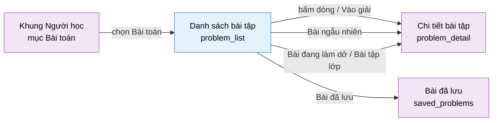

# Tài liệu thiết kế cơ bản (BD) — Danh sách bài tập (`USR0101`)

## Phương châm tài liệu [Nội bộ — không cần khách duyệt]

- Viết theo **mẫu 9 sheet**. Bộ thẻ đóng, quy ước ID, ký hiệu chuẩn, ranh giới với tài liệu khác và
  checklist kiểm toán nằm ở `02-bd/_rules/bd-template-9sheet.md` — file này không chép lại.
- Phần gắn nhãn `[Nội bộ]` phục vụ sinh mã và tự kiểm toán, không phải yêu cầu của khách hàng: mục 4.5,
  mục 7.3 và các ghi chú quy ước.
- Mã màn `USR0101` theo bảng mã ở `02-bd/_rules/bd-template-9sheet.md` mục 8; tên file mang tiền tố mã.
- Màn này **không có popup nào**. Mọi hành động đều là lọc tại chỗ hoặc rời sang màn khác.
- Đây là file BD đầu tiên của khu Người học. Quy ước đặt tên khối và ID item ở đây là khuôn cho 11 màn
  còn lại của khu, đặc biệt `saved_problems` (biến thể danh sách của chính màn này) và `problem_detail`.

> Đọc cùng `01-rd/screens/users/USR0101_problem_list.md` (hành vi ở mức yêu cầu, không lặp lại ở đây),
> `02-bd/screens/users/_shell.md` (khung điều hướng khu Người học) và ba file BD module:
> `02-bd/architecture/problem-bank.md`, `02-bd/database/problem-bank.md`,
> `02-bd/security/problem-bank.md`.
>
> - **Header và chân trang không mô tả lại ở đây** — dùng chung khung khu Người học: header ngang dính
>   trên, không có thanh bên [Nguồn: 02-bd/screens/users/_shell.md:24,40-41], chân trang dùng chung
>   [Nguồn: 02-bd/screens/users/_shell.md:97-105].
> - **Không thiết kế** thao tác quản trị bài toán (xuất bản, đổi độ khó, nhân bản, xoá) — đó là màn
>   `problem_management` của A2/A3 [Nguồn: 02-bd/screens/shared/SHR0201_problem_management.md:550-562].
>   Màn này chỉ đọc.
> - **Không thiết kế** việc chọn mô hình nộp bài. Học viên chọn mỗi lượt làm ở `problem_detail`
>   (`DEC-2026-0824-dual-submission-model-per-problem`); màn này chỉ hiển thị nhãn cho biết bài có bị
>   giới hạn chỉ còn Standard I/O hay không [Nguồn: 01-rd/screens/users/USR0101_problem_list.md:106-107].
> - **Không hiển thị** nội dung testcase ẩn ở bất kỳ trạng thái nào. Màn này không đọc bảng `testcases`.

---

## Sheet 1. Bìa

| Mục | Giá trị |
| :--- | :--- |
| Hệ thống | AlgoPrep |
| Phân hệ | `problem-bank` (F2), đọc thêm từ `identity` (F1), `judge-orchestration` (F4), `ai-review` (F5) |
| Công đoạn | BD — Thiết kế cơ bản |
| Phân loại | Màn hình |
| Tên màn | Danh sách bài tập |
| Mã màn hình | `USR0101` |
| Tên vật lý (slug) | `problem_list` |
| Trục tài liệu | Màn hình (`02-bd/screens/`) |
| Actor | A1 (`STUDENT`) |
| Phiên bản | V0.2 |
| Người tạo | Nhóm phát triển AlgoPrep |
| Ngày tạo | 2026/09/21 |
| Người cập nhật | Nhóm phát triển AlgoPrep |
| Ngày cập nhật | 2026/10/01 |

---

## Sheet 2. Lịch sử sửa đổi

| Ver | Sheet bị sửa | Nội dung sửa | Ngày | Người sửa |
| :--- | :--- | :--- | :--- | :--- |
| V0.1 | Toàn bộ | Tạo mới theo mẫu 9 sheet. Chốt nguồn dữ liệu của mọi trường hiển thị, chốt trạng thái lọc ghi vào URL, chốt cách suy ra trạng thái "Đã giải / Đang làm / Chưa làm" từ read model `user_problem_best_score`, chốt nguyên tắc suy giảm nhẹ nhàng khi `ai-review` hoặc `judge-orchestration` lỗi. Phát sinh 9 câu hỏi mở | 2026/09/21 | Nhóm phát triển AlgoPrep |
| V0.2 | Sheet 5, 7 | Đã chốt 2026-10-01 (owner uỷ quyền), xem `DEC-2026-1001-admin-configurable-settings`: danh mục chủ đề bài toán là dữ liệu do ADMIN quản lý (không còn seed cố định); thanh chủ đề và chip lọc đọc từ `ListTopicsWithProgress` trên dữ liệu `topics`, số chủ đề không cố định, chủ đề mới chưa có bài hiển thị tiến độ `0 / 0`. Không đổi tên endpoint | 2026/10/01 | AI |

---

## Sheet 3. Sơ đồ chuyển màn

> [Nội bộ] Quy ước vẽ: bố trí từ trái sang phải. Màn gọi tới tô tím, màn hiện tại tô xanh nhạt, màn đích
> tô tím. Màu và `[Nguồn:]` dùng để truy vết, không phải yêu cầu của khách hàng.

### 3.1 Danh sách chuyển màn

#### Khung điều hướng Người học → Danh sách bài tập

[Điều kiện mở] Chọn mục "Bài toán" trên thanh điều hướng ngang của khung khu Người học
[Nguồn: 02-bd/screens/users/_shell.md:54].

[Chế độ mở] Chế độ duyệt, chỉ đọc. Không có chế độ sửa.

[Thông tin truyền] Tham số lọc trên URL nếu có (`q`, `status`, `difficulty`, `topic`, `sort`, `dir`,
`page`). Không có tham số thì dùng giá trị mặc định ở Sheet 5 Khu vực C.

[Giá trị trả về] Không có.

[Khi thành công] Hiển thị dải chỉ số, thanh chủ đề, bộ lọc, bảng danh sách bài toán đã xuất bản và hai
khối phụ bên phải.

[Khi huỷ] Không có.

#### Danh sách bài tập → Chi tiết bài tập (mở từ bảng)

[Điều kiện mở] Bấm vào một dòng trong bảng, hoặc bấm nút "Vào giải" hiện lên khi rê chuột qua dòng đó
[Nguồn: 09-layoutBase/Ngân hàng bài toán.dc.html:168,184-186].

[Chế độ mở] Chế độ giải bài.

[Thông tin truyền] `problem_id` của dòng được chọn.

[Giá trị trả về] Không có.

[Khi thành công] Mở màn `problem_detail` của bài được chọn.

[Khi huỷ] Không có.

#### Danh sách bài tập → Chi tiết bài tập (bài ngẫu nhiên)

[Điều kiện mở] Bấm nút "Bài ngẫu nhiên" [Nguồn: 09-layoutBase/Ngân hàng bài toán.dc.html:114].

[Chế độ mở] Chế độ giải bài.

[Thông tin truyền] `problem_id` do máy chủ bốc ngẫu nhiên trong phạm vi bộ lọc đang áp dụng.

[Giá trị trả về] Không có.

[Khi thành công] Mở màn `problem_detail` của bài được bốc.

[Khi huỷ] Không có mục nào khớp bộ lọc thì không chuyển màn, hiển thị thông báo ngay tại màn.

#### Danh sách bài tập → Chi tiết bài tập (mở từ khối phụ)

[Điều kiện mở] Bấm một mục trong khối "Bài đang làm dở" hoặc một bài trong khối "Bài tập lớp"
[Nguồn: 09-layoutBase/Ngân hàng bài toán.dc.html:211,226-234].

[Chế độ mở] Chế độ giải bài.

[Thông tin truyền] `problem_id` của mục được chọn.

[Giá trị trả về] Không có.

[Khi thành công] Mở màn `problem_detail`. Bộ lọc của màn danh sách không bị ảnh hưởng.

[Khi huỷ] Không có.

#### Danh sách bài tập → Bài đã lưu

[Điều kiện mở] Bấm nút "Bài đã lưu" trên dải chỉ số
[Nguồn: 09-layoutBase/Ngân hàng bài toán.dc.html:113].

[Chế độ mở] Không có.

[Thông tin truyền] Không có. Bộ lọc hiện tại **không** mang theo — `saved_problems` có bộ lọc riêng.

[Giá trị trả về] Không có.

[Khi thành công] Mở màn `saved_problems`.

[Khi huỷ] Không có.

### 3.2 Sơ đồ

[Nguồn: 09-layoutBase/Ngân hàng bài toán.dc.html:113,114,168,184-186,211,226-234;
02-bd/screens/users/_shell.md:54]

---

## Sheet 4. Bố cục màn hình

### 4.1 Tổng quan màn

[Mục đích màn] Cho người học tìm và chọn bài toán để luyện tập: tìm theo từ khoá, lọc theo chủ đề, độ khó
và trạng thái đã giải, đồng thời thấy ngay tiến độ của bản thân và những bài giảng viên đã giao cho lớp
[Nguồn: 01-rd/screens/users/USR0101_problem_list.md:17-19,103-104].

[Luồng nghiệp vụ chính]

1. **Hiển thị ban đầu**: vào màn, hệ thống đọc tham số lọc trên URL rồi tải song song sáu nhóm dữ liệu —
   danh sách bài toán đã lọc, dải chỉ số tiến độ, tiến độ theo chủ đề, bài giao theo lớp, bài đang làm dở,
   tập bài đã có Solution Review. Trong lúc chờ, mỗi khối hiển thị khung chờ đúng số dòng dự kiến.
2. **Lọc và tìm kiếm**: người học gõ từ khoá, chọn tab trạng thái, chọn tab độ khó hoặc chọn chủ đề. Mỗi
   lần đổi bộ lọc, trang được đặt về 1 và bảng được tải lại từ máy chủ; trạng thái lọc ghi vào URL.
3. **Sắp xếp**: bấm tiêu đề cột "Độ khó" hoặc "AC rate" để đổi chiều sắp xếp.
4. **Phân trang**: chọn số trang ở cuối bảng. **Không dùng cuộn vô hạn**
   [Nguồn: 01-rd/screens/users/USR0101_problem_list.md:55].
5. **Vào giải**: bấm một dòng, hoặc bấm "Bài ngẫu nhiên", hoặc bấm một mục trong hai khối phụ — mọi đường
   đều dẫn sang `problem_detail`.

[Người dùng] Người học đã đăng nhập (`STUDENT`). Người chưa đăng nhập có xem được màn này hay không còn
mở, xem Câu hỏi mở Q1.

[Tệp liên quan] Không có. Màn này không xuất hay nhập tệp — xuất CSV (F2-17) chỉ có ở `problem_management`
[Nguồn: 02-bd/screens/shared/SHR0201_problem_management.md:560].

[Phạm vi]
- Chỉ hiển thị bài toán `status = PUBLISHED` **và** `deleted = false`
  (`DEC-2026-0830-problem-lifecycle-two-states`) [Nguồn: 02-bd/database/problem-bank.md:18-19].
- Không có thao tác ghi nào lên `problems` — màn chỉ đọc.
- Không có nút đánh dấu lưu (bookmark) ngay trên dòng bảng: prototype không có control đó, và F2-13 đã có
  màn riêng `saved_problems`. Xem Câu hỏi mở Q7.
- Không có bộ lọc theo **thẻ** (`tags`, F2-02 amendment) dù F2-11 có nhắc
  [Nguồn: 01-rd/req/problem-bank.md:42-43] — prototype không có control nào cho thẻ. Xem Câu hỏi mở Q6.
- Không hiển thị điểm theo tỉ lệ testcase (F4-13) trên từng dòng. Tỉ lệ chỉ dùng **bên trong** để suy ra
  trạng thái "Đã giải / Đang làm" (`DEC-2026-0831-partial-score-testcase-ratio`).

[Quyền sử dụng]
- Xem: được, với người học đã đăng nhập.
- Thêm / Sửa / Xoá: không. Màn chỉ đọc.

[Số bản ghi tối đa] Bảng danh sách: 12 dòng mỗi trang, phân trang phía máy chủ
[Nguồn: 09-layoutBase/Ngân hàng bài toán.dc.html:561]. Dải chỉ số: đúng 4 mục. Thanh chủ đề: theo số dòng
thật của bảng `topics`, prototype minh hoạ 7 mục [Nguồn: 09-layoutBase/Ngân hàng bài toán.dc.html:572-580].
Khối "Bài đang làm dở": tối đa 3 mục [Nguồn: 09-layoutBase/Ngân hàng bài toán.dc.html:737-741]. Khối "Bài
tập lớp": theo số bài đang giao cho lớp của người học, prototype minh hoạ 2 mục
[Nguồn: 09-layoutBase/Ngân hàng bài toán.dc.html:754-757].

### 4.2 DTO liên quan

- `ProblemListItemDto`
- `ProblemCatalogSummaryDto`
- `TopicProgressDto`
- `ClassAssignmentGroupDto`
- `InProgressProblemDto`

`[Suy luận]` — tên DTO do BD này đề xuất, `03-dd/api/problem-bank.md` chốt lại. Đặt tên **khác**
`ProblemManagementListItemDto` của màn quản trị [Nguồn: 02-bd/screens/shared/SHR0201_problem_management.md:514]
vì hai màn nhìn cùng bảng nhưng khác tập cột: màn này không có `submissionCount`, `testcaseCount`,
`updatedAt`, `status`; màn kia không có trạng thái đã giải theo người dùng.

### 4.3 Bảng dữ liệu liên quan (8)

| NO | Bảng | Ghi chú |
| --: | :--- | :--- |
| 1 | `problem.problems` | [Nguồn: 02-bd/database/problem-bank.md:11-29] |
| 2 | `problem.topics` | [Nguồn: 02-bd/database/problem-bank.md:37-39] |
| 3 | `problem.problem_topics` | [Nguồn: 02-bd/database/problem-bank.md:37-39] |
| 4 | `problem.problem_stats` | Read model, nguồn của cột "AC rate" [Nguồn: 02-bd/database/problem-bank.md:138] |
| 5 | `problem.class_assignments` | Nguồn khối "Bài tập lớp" [Nguồn: 02-bd/database/problem-bank.md:117-128] |
| 6 | `identity.user_problem_best_score` | Read model, nguồn trạng thái "Đã giải / Đang làm / Chưa làm" [Nguồn: 02-bd/database/identity.md:111-112] |
| 7 | `judge.submissions` | Nguồn khối "Bài đang làm dở" [Nguồn: 02-bd/database/judge-orchestration.md:8-34] |
| 8 | `ai.solution_reviews` | Nguồn nhãn "đã có Solution Review" [Nguồn: 02-bd/database/ai-review.md:44-47] |

Ba bảng cuối nằm ở schema của module khác. Màn không truy vấn thẳng: `problem-bank` gọi qua cổng ra sang
`identity` / `judge-orchestration` / `ai-review`, đúng nguyên tắc mỗi schema một chủ
[Nguồn: 02-bd/database/problem-bank.md:31-33]. Ranh giới sở hữu cụ thể xem Câu hỏi mở Q2 và Q3.

### 4.4 Vùng bố cục

Đối chiếu `09-layoutBase/Ngân hàng bài toán.dc.html` — bằng chứng bố cục chỉ-đọc, **không phải** design
system cuối cùng.

| Vùng | Vị trí trong prototype | Nội dung |
| :--- | :--- | :--- |
| Header ngang dính trên (khung chung Người học) | `:51-98` | Thương hiệu, 6 mục nav, menu người dùng — dùng lại khung chung, không mô tả lại |
| Dải chỉ số tiến độ | `:103-116` | 4 chỉ số "Đã giải / Easy / Medium / Hard" dạng `giá trị / tổng`, cùng hàng với 2 nút "Bài đã lưu" và "Bài ngẫu nhiên" đẩy sang phải |
| Thanh chủ đề | `:118-125` | Hàng ngang cuộn được, mỗi mục là tên chủ đề kèm tỉ lệ `đã giải / tổng`, mục đang chọn gạch chân |
| Khối lọc (đầu bảng) | `:131-153` | Ô tìm kiếm, tab trạng thái (4 tab), tab độ khó (4 tab), hàng chip chủ đề |
| Bảng danh sách | `:155-192` | 5 cột: Bài toán (gộp chấm trạng thái, mã, tên, nhãn mô hình, nhãn Solution Review), Chủ đề, Độ khó, AC rate, cột hành động |
| Phân trang | `:194-201` | Dòng tóm tắt kết quả bên trái, các nút số trang bên phải |
| Cột phải — "Bài đang làm dở" | `:206-220` | Tối đa 3 thẻ, mỗi thẻ có tên bài, ngôn ngữ và trạng thái lần nộp gần nhất |
| Cột phải — "Bài tập lớp" | `:222-236` | Tên lớp ở phụ đề, danh sách bài đã giao kèm dòng phụ tiến độ và hạn nộp |
| Chân trang (khung chung Người học) | `:428-455` | Bản quyền, trạng thái cụm go-judge, phiên bản — dùng lại khung chung |

Bố cục hai cột `minmax(0, 1fr) 268px` (`:127`): cột trái là bảng danh sách, cột phải là hai khối phụ cố
định bề rộng. Dải chỉ số và thanh chủ đề nằm **trên** lưới hai cột, chiếm trọn bề ngang. Giữ nguyên cấu
trúc này khi dựng Next.js; không quy định màu sắc, khoảng cách hay typography ở BD.

Nhánh `isSolve` của prototype (`:242-426`) là mã thừa của một hướng thiết kế cũ, **không đưa vào BD** —
đã chốt ở RD [Nguồn: 01-rd/screens/users/USR0101_problem_list.md:94].

### 4.5 Cấu trúc slice FSD [Nội bộ]

| Khối | Slice dự kiến | Căn cứ |
| :--- | :--- | :--- |
| Trang | `views/users/problem-list` | Quy ước FSD của dự án |
| Khung Người học | Dùng lại `widgets/app-shell` (biến thể `student-header`) | `02-bd/screens/users/_shell.md` mục 1 |
| Dải chỉ số | `widgets/problem-catalog-summary` | Prototype `:103-116` |
| Thanh chủ đề + chip chủ đề | `features/problem-topic-filter` | Prototype `:118-125,148-152` |
| Ô tìm kiếm, tab trạng thái, tab độ khó, sắp xếp | `features/problem-filter` | Prototype `:131-147,161-162` |
| Bảng danh sách + phân trang | `widgets/problem-table` + `entities/problem` | Prototype `:155-201` |
| Khối "Bài đang làm dở" | `widgets/in-progress-problems` | Prototype `:206-220` |
| Khối "Bài tập lớp" | `widgets/class-assignment-panel` | Prototype `:222-236` |

`[Suy luận]` — ánh xạ slice do BD đề xuất, DD màn hình chốt lại. `entities/problem` được `saved_problems`
và `problem_detail` dùng lại, nên dòng bảng phải là component nhận dữ liệu từ ngoài, không tự gọi API.

> [Nội bộ] Ảnh minh hoạ đặt ở `08-diagram/02-bd/screens/users/`, chụp bằng Playwright trên ứng dụng
> Next.js thật khi đã có mã chạy được. Chưa có thì tham chiếu prototype, không vẽ tay.

---

## Sheet 5. Danh sách item màn hình

> Quy ước ID, bộ thẻ và giá trị chuẩn: `02-bd/_rules/bd-template-9sheet.md` mục 2, 3, 4.

### Khu vực A — Dải chỉ số tiến độ

| Khu vực | NO | Tên item | ID item | Bảng DB | Cột DB | Loại UI | Kiểu | Độ dài | Bắt buộc | I/O | Giá trị mặc định | Định dạng | Ghi chú |
| :--- | --: | :--- | :--- | :--- | :--- | :--- | :--- | :--- | :-: | :-: | :--- | :--- | :--- |
| Dải chỉ số tiến độ | | | | | | | | | | | | | |
| | 1 | Đã giải toàn bộ | `problemList.summary.solvedTotal` | `identity.user_problem_best_score`, `problem.problems` | `best_verdict`, `id` | Label | String | - | - | O | `0 / 0` | `{số} / {số}` | Số bài đã giải trên tổng số bài đã xuất bản [Công thức] Tử số đếm dòng `user_problem_best_score` của người dùng có `best_verdict = ACCEPTED`; mẫu số đếm `problems` có `status = PUBLISHED AND deleted = false` [EVT liên quan] EVT-1 |
| | 2 | Đã giải mức Dễ | `problemList.summary.solvedEasy` | `identity.user_problem_best_score`, `problem.problems` | `best_verdict`, `difficulty` | Label | String | - | - | O | `0 / 0` | `{số} / {số}` | Tiến độ riêng cho `difficulty = EASY` [Công thức] Như NO 1, lọc thêm `problems.difficulty = EASY` [EVT liên quan] EVT-1 |
| | 3 | Đã giải mức Trung bình | `problemList.summary.solvedMedium` | `identity.user_problem_best_score`, `problem.problems` | `best_verdict`, `difficulty` | Label | String | - | - | O | `0 / 0` | `{số} / {số}` | Tiến độ riêng cho `difficulty = MEDIUM` [Công thức] Như NO 1, lọc thêm `problems.difficulty = MEDIUM` [EVT liên quan] EVT-1 |
| | 4 | Đã giải mức Khó | `problemList.summary.solvedHard` | `identity.user_problem_best_score`, `problem.problems` | `best_verdict`, `difficulty` | Label | String | - | - | O | `0 / 0` | `{số} / {số}` | Tiến độ riêng cho `difficulty = HARD` [Công thức] Như NO 1, lọc thêm `problems.difficulty = HARD` [EVT liên quan] EVT-1 |
| | 5 | Bài đã lưu | `problemList.summary.linkSaved` | - | - | Button | - | - | - | I | - | - | Điều hướng sang màn `saved_problems` [Nguồn giá trị] Nhãn tĩnh i18n [EVT liên quan] EVT-12 |
| | 6 | Bài ngẫu nhiên | `problemList.summary.btnRandom` | - | - | Button | - | - | - | I | - | - | Bốc ngẫu nhiên một bài trong phạm vi bộ lọc đang áp dụng rồi mở `problem_detail` [Nguồn giá trị] Nhãn tĩnh i18n [EVT liên quan] EVT-11 |

### Khu vực B — Thanh chủ đề

| Khu vực | NO | Tên item | ID item | Bảng DB | Cột DB | Loại UI | Kiểu | Độ dài | Bắt buộc | I/O | Giá trị mặc định | Định dạng | Ghi chú |
| :--- | --: | :--- | :--- | :--- | :--- | :--- | :--- | :--- | :-: | :-: | :--- | :--- | :--- |
| Thanh chủ đề | | | | | | | | | | | | | |
| | 1 | Danh sách chủ đề | `problemList.topicNav.list` | `problem.topics` | - | List | List | - | - | I/O | rỗng | - | Hàng ngang các chủ đề kèm tiến độ riêng từng chủ đề, vừa là chỉ số vừa là bộ lọc [Nguồn giá trị] Kết quả gọi `ListTopicsWithProgress` [EVT liên quan] EVT-1, EVT-5 |
| | 2 | Tên chủ đề | `problemList.topicNav.col.name` | `problem.topics` | `name` | ListColumn | String | - | - | O | - | - | Tên chủ đề đọc từ dữ liệu `topics` do ADMIN quản lý, số chủ đề không cố định (đã chốt 2026-10-01) [Nguồn giá trị] Cột `topics.name` [Nguồn: 02-bd/database/problem-bank.md:35-55] [EVT liên quan] - |
| | 3 | Tiến độ chủ đề | `problemList.topicNav.col.ratio` | `identity.user_problem_best_score`, `problem.problem_topics` | `best_verdict`, `topic_id` | ListColumn | String | - | - | O | `0 / 0` | `{số} / {số}` | Số bài đã giải trên tổng số bài đã xuất bản thuộc chủ đề đó [Công thức] Cùng công thức Khu vực A NO 1, giới hạn theo `problem_topics.topic_id` [EVT liên quan] - |

### Khu vực C — Bộ lọc

| Khu vực | NO | Tên item | ID item | Bảng DB | Cột DB | Loại UI | Kiểu | Độ dài | Bắt buộc | I/O | Giá trị mặc định | Định dạng | Ghi chú |
| :--- | --: | :--- | :--- | :--- | :--- | :--- | :--- | :--- | :-: | :-: | :--- | :--- | :--- |
| Bộ lọc | | | | | | | | | | | | | |
| | 1 | Ô tìm kiếm | `problemList.filter.query` | `problem.problems` | `code`, `title` | TextBox | String | 100 | - | I/O | rỗng | - | Tìm theo tên bài hoặc mã bài [Nguồn giá trị] Tham số URL `q`; không có thì rỗng. Gợi ý trong ô là nhãn tĩnh i18n "Tìm theo tên bài hoặc mã bài" [Nguồn: 09-layoutBase/Ngân hàng bài toán.dc.html:592] [EVT liên quan] EVT-2 |
| | 2 | Tab trạng thái | `problemList.filter.statusTabs` | `identity.user_problem_best_score` | `best_verdict` | List | Enum | - | - | I/O | `Tất cả` | - | 4 tab: Tất cả / Đã giải / Đang làm / Chưa làm [Nguồn: 09-layoutBase/Ngân hàng bài toán.dc.html:609] [Nguồn giá trị] Nhãn tĩnh i18n; giá trị đang chọn lấy từ tham số URL `status` [EVT liên quan] EVT-3 |
| | 3 | Tab độ khó | `problemList.filter.difficultyTabs` | `problem.problems` | `difficulty` | List | Enum | - | - | I/O | `Tất cả` | - | 4 tab: Tất cả / Dễ / Trung bình / Khó [Nguồn giá trị] Nhãn tĩnh i18n map từ enum `EASY`/`MEDIUM`/`HARD` [Nguồn: 02-bd/database/problem-bank.md:17]; giá trị đang chọn lấy từ tham số URL `difficulty` [EVT liên quan] EVT-4 |
| | 4 | Chip chủ đề | `problemList.filter.topicChips` | `problem.topics` | `id`, `name` | List | List | - | - | I/O | `Tất cả` | - | Hàng chip lọc theo chủ đề. **Dùng chung một trạng thái lọc với Khu vực B** — hai control, một giá trị; bấm ở đâu cũng đổi cùng tham số URL `topic`. Có giữ cả hai hay không, xem Câu hỏi mở Q5 [Nguồn giá trị] Cùng nguồn với `problemList.topicNav.list` [EVT liên quan] EVT-5 |
| | 5 | Xoá bộ lọc | `problemList.filter.linkReset` | - | - | Link | - | - | - | I | - | - | Đưa cả 4 bộ lọc về mặc định. Chỉ xuất hiện ở trạng thái không có kết quả [Nguồn giá trị] Nhãn tĩnh i18n [EVT liên quan] EVT-6 |

### Khu vực D — Bảng danh sách bài toán

| Khu vực | NO | Tên item | ID item | Bảng DB | Cột DB | Loại UI | Kiểu | Độ dài | Bắt buộc | I/O | Giá trị mặc định | Định dạng | Ghi chú |
| :--- | --: | :--- | :--- | :--- | :--- | :--- | :--- | :--- | :-: | :-: | :--- | :--- | :--- |
| Bảng danh sách bài toán | | | | | | | | | | | | | |
| | 1 | Danh sách bài toán | `problemList.table.list` | `problem.problems` | - | List | List | - | - | O | rỗng | - | Bảng bài toán đã xuất bản, 12 dòng mỗi trang [Nguồn giá trị] Kết quả gọi `ListPublishedProblems` [EVT liên quan] EVT-1 |
| | 2 | Chấm trạng thái | `problemList.table.col.solveState` | `identity.user_problem_best_score` | `best_verdict` | Badge | Enum | - | - | O | `Chưa làm` | - | Ba trạng thái: Đã giải / Đang làm / Chưa làm [Công thức] Không có dòng `user_problem_best_score` thành "Chưa làm"; có dòng và `best_verdict = ACCEPTED` thành "Đã giải"; có dòng mà khác `ACCEPTED` thành "Đang làm" [Nguồn: 02-bd/database/identity.md:111-112] [EVT liên quan] - |
| | 3 | Mã bài | `problemList.table.col.code` | `problem.problems` | `code` | ListColumn | String | 40 | - | O | - | - | Mã ngắn hiển thị của bài toán [Nguồn giá trị] Cột `code` [Nguồn: 02-bd/database/problem-bank.md:14] [EVT liên quan] - |
| | 4 | Tên bài | `problemList.table.col.title` | `problem.problems` | `title` | ListColumn | String | 200 | - | O | - | - | Tiêu đề bài toán [Nguồn giá trị] Cột `title` [Nguồn: 02-bd/database/problem-bank.md:15] [EVT liên quan] EVT-10 |
| | 5 | Nhãn mô hình nộp bài | `problemList.table.col.submissionModel` | `problem.problems` | `function_wrapper_supported` | Badge | Enum | - | - | O | `Cả hai` | - | Hai giá trị: "Cả hai" khi `function_wrapper_supported = true`, "Chỉ Standard I/O" khi `false` — ngoại lệ lược đồ kiểu R2 [Nguồn giá trị] Cột `function_wrapper_supported` [Nguồn: 02-bd/database/problem-bank.md:20], nhãn là chữ tĩnh i18n theo chốt ở RD [Nguồn: 01-rd/screens/users/USR0101_problem_list.md:95] [EVT liên quan] - |
| | 6 | Nhãn đã có Solution Review | `problemList.table.col.hasReview` | `ai.solution_reviews` | `user_id`, `problem_id` | Badge | Boolean | - | - | O | Ẩn | - | Cho biết người học đã từng phân tích bài này bằng F5.1 [Công thức] Tồn tại dòng `solution_reviews` khớp `(user_id hiện tại, problem_id)` [Nguồn: 02-bd/database/ai-review.md:46-47] [EVT liên quan] - |
| | 7 | Chủ đề | `problemList.table.col.topics` | `problem.topics` | `name` | ListColumn | String | - | - | O | `-` | - | Chủ đề của bài toán [Nguồn giá trị] `topics.name` qua `problem_topics.problem_id`; nhiều chủ đề thì nối bằng dấu phẩy, cùng cách đã dùng ở màn quản trị [Nguồn: 02-bd/screens/shared/SHR0201_problem_management.md:517] [EVT liên quan] - |
| | 8 | Độ khó | `problemList.table.col.difficulty` | `problem.problems` | `difficulty` | ListColumn | Enum | - | - | O | - | Nhãn tiếng Việt | Mức độ khó của bài toán [Nguồn giá trị] `EASY` thành "Dễ", `MEDIUM` thành "Trung bình", `HARD` thành "Khó" [Nguồn: 02-bd/database/problem-bank.md:17] [EVT liên quan] EVT-7 |
| | 9 | AC rate | `problemList.table.col.acRate` | `problem.problem_stats` | `ac_rate` | ListColumn | Number | 5 | - | O | `-` | `{số}%` | Tỉ lệ bài nộp được chấp nhận trên tổng số lượt nộp của toàn hệ thống [Nguồn giá trị] Read model `problem_stats.ac_rate` [Nguồn: 02-bd/database/problem-bank.md:138]. Chưa có dòng read model thì hiển thị `-`, không hiển thị `0%` [EVT liên quan] EVT-8 |
| | 10 | Nút Vào giải | `problemList.table.col.btnSolve` | - | - | Button | - | - | - | I | - | - | Mở `problem_detail` của dòng đang trỏ. Chỉ hiện khi rê chuột qua dòng [Nguồn: 09-layoutBase/Ngân hàng bài toán.dc.html:184-186] [Nguồn giá trị] Nhãn tĩnh i18n [EVT liên quan] EVT-10 |

### Khu vực E — Phân trang

| Khu vực | NO | Tên item | ID item | Bảng DB | Cột DB | Loại UI | Kiểu | Độ dài | Bắt buộc | I/O | Giá trị mặc định | Định dạng | Ghi chú |
| :--- | --: | :--- | :--- | :--- | :--- | :--- | :--- | :--- | :-: | :-: | :--- | :--- | :--- |
| Phân trang | | | | | | | | | | | | | |
| | 1 | Tóm tắt kết quả | `problemList.pager.summary` | - | - | Label | String | - | - | O | - | `Hiển thị {từ}–{đến} trong {tổng} bài` | Dòng tóm tắt phạm vi kết quả đang xem [Công thức] Từ tổng số dòng khớp bộ lọc và số trang hiện tại; không có dòng nào thì đổi thành nhãn tĩnh "Không có bài nào khớp bộ lọc" [Nguồn: 09-layoutBase/Ngân hàng bài toán.dc.html:631] [EVT liên quan] EVT-9 |
| | 2 | Nút số trang | `problemList.pager.pageButtons` | - | - | List | Number | - | - | I/O | `1` | Số nguyên | Danh sách số trang, trang đang xem được làm nổi [Công thức] Số trang bằng tổng số dòng khớp bộ lọc chia 12, làm tròn lên, tối thiểu 1 [EVT liên quan] EVT-9 |

### Khu vực F — Bài đang làm dở

| Khu vực | NO | Tên item | ID item | Bảng DB | Cột DB | Loại UI | Kiểu | Độ dài | Bắt buộc | I/O | Giá trị mặc định | Định dạng | Ghi chú |
| :--- | --: | :--- | :--- | :--- | :--- | :--- | :--- | :--- | :-: | :-: | :--- | :--- | :--- |
| Bài đang làm dở | | | | | | | | | | | | | |
| | 1 | Tiêu đề khối | `problemList.inProgress.title` | - | - | Label | String | - | - | O | Bài đang làm dở | - | Tiêu đề và câu phụ của khối [Nguồn giá trị] Nhãn tĩnh i18n. Câu phụ "Bản nháp lưu trong Workspace" của prototype **không dùng** vì chưa có nơi lưu bản nháp, xem Câu hỏi mở Q4 [EVT liên quan] - |
| | 2 | Danh sách bài dở | `problemList.inProgress.list` | `judge.submissions` | - | List | List | - | - | O | rỗng | - | Tối đa 3 bài người học đã nộp gần nhất mà chưa đạt `ACCEPTED` [Nguồn giá trị] Kết quả gọi `ListMyUnsolvedRecentProblems` [EVT liên quan] EVT-1, EVT-13 |
| | 3 | Tên bài dở | `problemList.inProgress.col.title` | `problem.problems` | `title` | ListColumn | String | 200 | - | O | - | - | Tên bài toán của mục [Nguồn giá trị] Cột `title`, tra theo `submissions.problem_id` [Nguồn: 02-bd/database/judge-orchestration.md:16] [EVT liên quan] - |
| | 4 | Ngôn ngữ lần nộp gần nhất | `problemList.inProgress.col.language` | `judge.submissions` | `language` | ListColumn | Enum | - | - | O | - | Nhãn cố định | Ngôn ngữ của lượt nộp gần nhất [Nguồn giá trị] `JAVA` thành "Java", `CPP` thành "C++", `PYTHON` thành "Python" [Nguồn: 02-bd/database/judge-orchestration.md:18] [EVT liên quan] - |
| | 5 | Kết quả lần nộp gần nhất | `problemList.inProgress.col.lastVerdict` | `judge.submissions` | `status`, `passed_testcase_count`, `total_testcase_count` | ListColumn | String | - | - | O | - | `{nhãn} {đạt}/{tổng}` | Trạng thái lượt nộp gần nhất, kèm số testcase đạt khi có [Công thức] Nhãn tĩnh i18n map từ `status`; `status = WRONG_ANSWER` thì ghép thêm `passed_testcase_count`/`total_testcase_count` (F4-13, `DEC-2026-0831-partial-score-testcase-ratio`) [Nguồn: 02-bd/database/judge-orchestration.md:22,25-26] [EVT liên quan] - |

### Khu vực G — Bài tập lớp

| Khu vực | NO | Tên item | ID item | Bảng DB | Cột DB | Loại UI | Kiểu | Độ dài | Bắt buộc | I/O | Giá trị mặc định | Định dạng | Ghi chú |
| :--- | --: | :--- | :--- | :--- | :--- | :--- | :--- | :--- | :-: | :-: | :--- | :--- | :--- |
| Bài tập lớp | | | | | | | | | | | | | |
| | 1 | Tiêu đề khối | `problemList.assignment.title` | - | - | Label | String | - | - | O | Bài tập lớp | - | Tiêu đề khối [Nguồn giá trị] Nhãn tĩnh i18n [EVT liên quan] - |
| | 2 | Tên lớp | `problemList.assignment.className` | `identity.classes` | `name` | Label | String | 200 | - | O | - | - | Tên lớp người học đang tham gia, hiển thị ở dòng phụ [Nguồn giá trị] Trả kèm trong `ListMyClassAssignments`. Người học thuộc nhiều lớp thì hiển thị thế nào, xem Câu hỏi mở Q8 [EVT liên quan] - |
| | 3 | Danh sách bài được giao | `problemList.assignment.list` | `problem.class_assignments` | - | List | List | - | - | O | rỗng | - | Các bài đang được giao cho lớp của người học, chỉ tính dòng `removed_at IS NULL` [Nguồn: 02-bd/database/problem-bank.md:125,147] [Nguồn giá trị] Kết quả gọi `ListMyClassAssignments` [EVT liên quan] EVT-1, EVT-14 |
| | 4 | Tên bài được giao | `problemList.assignment.col.title` | `problem.problems` | `title` | ListColumn | String | 200 | - | O | - | - | Tên bài toán được giao [Nguồn giá trị] Cột `title` qua `class_assignments.problem_id` [Nguồn: 02-bd/database/problem-bank.md:121] [EVT liên quan] - |
| | 5 | Chấm trạng thái bài được giao | `problemList.assignment.col.solveState` | `identity.user_problem_best_score` | `best_verdict` | Badge | Enum | - | - | O | `Chưa làm` | - | Cùng ba trạng thái và cùng công thức với Khu vực D NO 2 [Công thức] Xem Khu vực D NO 2 [EVT liên quan] - |
| | 6 | Dòng phụ bài được giao | `problemList.assignment.col.meta` | `problem.class_assignments` | `assigned_at` | ListColumn | String | - | - | O | - | - | Câu phụ dưới tên bài. Prototype ghi "3 / 5 bài · hạn 24/08" [Nguồn: 09-layoutBase/Ngân hàng bài toán.dc.html:754-757] nhưng **không có cột hạn nộp** trong `class_assignments` [Nguồn: 02-bd/database/problem-bank.md:117-128] [Nguồn giá trị] Chỉ hiển thị ngày giao từ `assigned_at`; phần hạn nộp là Câu hỏi mở Q9 [EVT liên quan] - |

[Nguồn: 09-layoutBase/Ngân hàng bài toán.dc.html:103-116,118-125,131-153,155-201,206-220,222-236;
02-bd/database/problem-bank.md:11-29,37-39,117-128,138; 02-bd/database/identity.md:111-112;
01-rd/screens/users/USR0101_problem_list.md:39-55]

---

## Sheet 6. Đặc tả điều khiển item

> Ký hiệu cột `Hiển thị` và thứ tự thẻ: `02-bd/_rules/bd-template-9sheet.md` mục 2, 3. Dùng đúng NO, tên
> item và thứ tự của Sheet 5. Lỗi nhập liệu ghi ở Sheet 9, xử lý nghiệp vụ ghi ở Sheet 8.

### Khu vực A — Dải chỉ số tiến độ

| Khu vực | NO | Tên item | Hiển thị | Ghi chú |
| :--- | --: | :--- | :-: | :--- |
| Dải chỉ số tiến độ | | | | |
| | 1 | Đã giải toàn bộ | Có | [Điều kiện hiển thị] Trong lúc tải hiển thị khung chờ đúng 4 ô chỉ số. [Tự động đặt] **Không** tính lại khi đổi bộ lọc — đây là tiến độ trên toàn bộ danh mục, không phải trên tập kết quả đang lọc. |
| | 2 | Đã giải mức Dễ | Có | [Tự động đặt] Như NO 1. |
| | 3 | Đã giải mức Trung bình | Có | [Tự động đặt] Như NO 1. |
| | 4 | Đã giải mức Khó | Có | [Tự động đặt] Như NO 1. |
| | 5 | Bài đã lưu | Có | [Điều kiện kích hoạt] Luôn kích hoạt. |
| | 6 | Bài ngẫu nhiên | Có | [Điều kiện kích hoạt] Không kích hoạt khi bộ lọc hiện tại không cho kết quả nào, và trong lúc đang tải bảng. |

### Khu vực B — Thanh chủ đề

| Khu vực | NO | Tên item | Hiển thị | Ghi chú |
| :--- | --: | :--- | :-: | :--- |
| Thanh chủ đề | | | | |
| | 1 | Danh sách chủ đề | Có | [Điều kiện hiển thị] Trong lúc tải hiển thị khung chờ 7 mục. Không có chủ đề nào thì ẩn cả thanh, không để hàng trống. [Điều kiện kích hoạt] Kích hoạt sau khi tải xong. [Tự động đặt] Mục ứng với chủ đề đang lọc được làm nổi; bấm lại chính mục đang chọn thì bỏ lọc, về "Tất cả". |
| | 2 | Tên chủ đề | Có | - |
| | 3 | Tiến độ chủ đề | Có | [Điều kiện hiển thị] Tải được danh mục chủ đề nhưng không lấy được tiến độ thì vẫn hiển thị tên chủ đề và ẩn phần tỉ lệ, không chặn cả thanh. |

### Khu vực C — Bộ lọc

| Khu vực | NO | Tên item | Hiển thị | Ghi chú |
| :--- | --: | :--- | :-: | :--- |
| Bộ lọc | | | | |
| | 1 | Ô tìm kiếm | Có | [Điều kiện kích hoạt] Luôn kích hoạt, kể cả khi bảng đang tải. [Tự động đặt] Nhận giá trị ban đầu từ tham số URL `q`. Gõ xong dừng 400 ms mới gọi máy chủ, không gọi theo từng ký tự. |
| | 2 | Tab trạng thái | Có | [Điều kiện kích hoạt] Kích hoạt sau khi tải xong lần đầu. [Tự động đặt] Tab đang chọn lấy từ tham số URL `status`, mặc định "Tất cả". |
| | 3 | Tab độ khó | Có | [Tự động đặt] Tab đang chọn lấy từ tham số URL `difficulty`, mặc định "Tất cả". |
| | 4 | Chip chủ đề | Có | [Tự động đặt] Chip đang chọn đồng bộ với mục đang chọn ở Khu vực B — cùng một giá trị lọc, hai nơi hiển thị. |
| | 5 | Xoá bộ lọc | Điều kiện | [Điều kiện hiển thị] Chỉ hiển thị khi bảng không có dòng nào **và** đang có ít nhất một bộ lọc khác mặc định. Bảng rỗng vì danh mục chưa có bài nào thì không hiển thị liên kết này. |

### Khu vực D — Bảng danh sách bài toán

| Khu vực | NO | Tên item | Hiển thị | Ghi chú |
| :--- | --: | :--- | :-: | :--- |
| Bảng danh sách bài toán | | | | |
| | 1 | Danh sách bài toán | Có | [Điều kiện hiển thị] Trong lúc tải hiển thị khung chờ đúng 12 dòng. Tải xong mà không có dòng nào thì thay bảng bằng dòng "Không có bài nào khớp bộ lọc" kèm liên kết xoá bộ lọc. Tải lỗi thì hiển thị thông báo lỗi kèm nút thử lại, giữ nguyên bộ lọc. |
| | 2 | Chấm trạng thái | Điều kiện | [Điều kiện hiển thị] Chỉ hiển thị khi lấy được dữ liệu trạng thái theo người dùng. Không lấy được thì ẩn chấm trạng thái trên mọi dòng và bảng vẫn hiển thị bình thường, xem EVT-1. |
| | 3 | Mã bài | Có | - |
| | 4 | Tên bài | Có | - |
| | 5 | Nhãn mô hình nộp bài | Điều kiện | [Điều kiện hiển thị] Chỉ hiển thị nhãn "Chỉ Standard I/O" khi `function_wrapper_supported = false`. Bài hỗ trợ cả hai mô hình — tức đa số — thì không vẽ nhãn nào, tránh nhiễu trên mọi dòng. |
| | 6 | Nhãn đã có Solution Review | Điều kiện | [Điều kiện hiển thị] Chỉ hiển thị khi người học đã có báo cáo phân tích cho bài đó. Gọi `ai-review` thất bại thì ẩn nhãn trên mọi dòng, **không** báo lỗi và **không** chặn bảng. |
| | 7 | Chủ đề | Có | - |
| | 8 | Độ khó | Có | [Điều kiện kích hoạt] Tiêu đề cột bấm được để đổi chiều sắp xếp; không kích hoạt trong lúc bảng đang tải. |
| | 9 | AC rate | Có | [Điều kiện kích hoạt] Tiêu đề cột bấm được để đổi chiều sắp xếp; không kích hoạt trong lúc bảng đang tải. |
| | 10 | Nút Vào giải | Điều kiện | [Điều kiện hiển thị] Chỉ hiển thị trên dòng đang được rê chuột hoặc đang nhận tiêu điểm bàn phím. Không dùng chuột được thì vẫn vào giải được bằng cách bấm chính dòng đó. |

### Khu vực E — Phân trang

| Khu vực | NO | Tên item | Hiển thị | Ghi chú |
| :--- | --: | :--- | :-: | :--- |
| Phân trang | | | | |
| | 1 | Tóm tắt kết quả | Có | [Tự động đặt] Cập nhật sau mỗi lần tải bảng. |
| | 2 | Nút số trang | Điều kiện | [Điều kiện hiển thị] Chỉ hiển thị khi có từ 2 trang trở lên. [Điều kiện kích hoạt] Nút của trang đang xem không kích hoạt. |

### Khu vực F — Bài đang làm dở

| Khu vực | NO | Tên item | Hiển thị | Ghi chú |
| :--- | --: | :--- | :-: | :--- |
| Bài đang làm dở | | | | |
| | 1 | Tiêu đề khối | Điều kiện | [Điều kiện hiển thị] Ẩn cả khối, gồm cả tiêu đề, khi không có bài dở nào hoặc khi gọi `judge-orchestration` thất bại. Không hiển thị khối rỗng. |
| | 2 | Danh sách bài dở | Điều kiện | [Điều kiện hiển thị] Như NO 1. Trong lúc tải hiển thị khung chờ 3 thẻ. [Tự động đặt] **Không** tải lại khi đổi bộ lọc — khối này độc lập với bộ lọc của bảng. |
| | 3 | Tên bài dở | Có | - |
| | 4 | Ngôn ngữ lần nộp gần nhất | Có | - |
| | 5 | Kết quả lần nộp gần nhất | Có | [Điều kiện hiển thị] Lượt nộp còn đang chấm (`PENDING`, `COMPILING`, `JUDGING`) thì hiển thị nhãn "Đang chấm" thay cho số testcase. |

### Khu vực G — Bài tập lớp

| Khu vực | NO | Tên item | Hiển thị | Ghi chú |
| :--- | --: | :--- | :-: | :--- |
| Bài tập lớp | | | | |
| | 1 | Tiêu đề khối | Điều kiện | [Điều kiện hiển thị] Ẩn cả khối khi người học không thuộc lớp nào, hoặc lớp không có bài nào đang được giao. |
| | 2 | Tên lớp | Điều kiện | [Điều kiện hiển thị] Như NO 1. |
| | 3 | Danh sách bài được giao | Điều kiện | [Điều kiện hiển thị] Như NO 1. Trong lúc tải hiển thị khung chờ 2 mục. [Tự động đặt] **Không** tải lại khi đổi bộ lọc — khối này độc lập với bộ lọc của bảng. |
| | 4 | Tên bài được giao | Có | - |
| | 5 | Chấm trạng thái bài được giao | Điều kiện | [Điều kiện hiển thị] Cùng điều kiện với Khu vực D NO 2 — không lấy được dữ liệu trạng thái thì ẩn chấm, giữ nguyên danh sách. |
| | 6 | Dòng phụ bài được giao | Có | - |

[Nguồn: 09-layoutBase/Ngân hàng bài toán.dc.html:161-162,184-186,195-199,561,631;
02-bd/database/problem-bank.md:20,125; 02-bd/database/judge-orchestration.md:22]

---

## Sheet 7. Danh sách truyền dữ liệu

### 7.1 Trường DTO

| NO | DTO | Trường DTO | Kiểu | Bảng DB | Cột DB | Item màn | Hiển thị | Ghi chú |
| --: | :--- | :--- | :--- | :--- | :--- | :--- | :-: | :--- |
| 1 | `ProblemListItemDto` | `id` | UUID | `problem.problems` | `id` | - | Không | [Nguồn] Phản hồi của `ListPublishedProblems` [Đích] Tham số điều hướng sang `problem_detail`. Không hiển thị trên màn. |
| 2 | `ProblemListItemDto` | `code` | String | `problem.problems` | `code` | Bảng "Mã bài" | Có | [Nguồn] Phản hồi của `ListPublishedProblems` |
| 3 | `ProblemListItemDto` | `title` | String | `problem.problems` | `title` | Bảng "Tên bài" | Có | - |
| 4 | `ProblemListItemDto` | `topicNames` | List\<String\> | `problem.topics` | `name` | Bảng "Chủ đề" | Có | [Nguồn] `topics.name` qua `problem_topics.problem_id` [Chuyển đổi] Nối bằng dấu phẩy khi hiển thị. |
| 5 | `ProblemListItemDto` | `difficulty` | Enum | `problem.problems` | `difficulty` | Bảng "Độ khó", tab độ khó | Có | [Chuyển đổi] `EASY`/`MEDIUM`/`HARD` thành "Dễ"/"Trung bình"/"Khó". |
| 6 | `ProblemListItemDto` | `acRate` | Number | `problem.problem_stats` | `ac_rate` | Bảng "AC rate" | Có | [Nguồn] Read model [Chuyển đổi] Không có dòng read model thì trả `null`, màn hiển thị `-`. |
| 7 | `ProblemListItemDto` | `functionWrapperSupported` | Boolean | `problem.problems` | `function_wrapper_supported` | Bảng "Nhãn mô hình nộp bài" | Có | [Chuyển đổi] `false` thành nhãn "Chỉ Standard I/O"; `true` thì không vẽ nhãn. |
| 8 | `ProblemListItemDto` | `solveState` | Enum | `identity.user_problem_best_score` | `best_verdict` | Bảng "Chấm trạng thái", tab trạng thái | Có | [Nguồn] `problem-bank` gọi cổng ra sang `identity` (`ListMyProblemSolveStates`), không đọc thẳng schema khác [Chuyển đổi] `SOLVED`/`ATTEMPTED`/`UNSOLVED` thành "Đã giải"/"Đang làm"/"Chưa làm". Ai ghép trường này, xem Câu hỏi mở Q2. |
| 9 | `ProblemListItemDto` | `hasSolutionReview` | Boolean | `ai.solution_reviews` | `user_id`, `problem_id` | Bảng "Nhãn đã có Solution Review" | Có | [Nguồn] Lời gọi **riêng** `ListMyReviewedProblemIds` sang `ai-review`, không gộp vào lời gọi bảng — để bảng vẫn hiển thị khi F5 chết (`CLAUDE.md` — AI suy giảm nhẹ nhàng). Xem Câu hỏi mở Q3. |
| 10 | `ProblemCatalogSummaryDto` | `solvedTotal`, `publishedTotal` | Number | `identity.user_problem_best_score`, `problem.problems` | `best_verdict`, `id` | Dải chỉ số "Đã giải toàn bộ" | Có | [Nguồn] Phản hồi của `GetProblemCatalogSummary` |
| 11 | `ProblemCatalogSummaryDto` | `byDifficulty` | List | `problem.problems` | `difficulty` | Dải chỉ số 3 mức độ khó | Có | [Nguồn] Cùng lời gọi NO 10 [Chuyển đổi] Mỗi phần tử gồm `difficulty`, `solved`, `total`. |
| 12 | `TopicProgressDto` | `topicId`, `topicName` | UUID, String | `problem.topics` | `id`, `name` | Thanh chủ đề, chip chủ đề | Có | [Nguồn] Phản hồi của `ListTopicsWithProgress` [Đích] `topicId` là giá trị của tham số URL `topic`. |
| 13 | `TopicProgressDto` | `solved`, `total` | Number | `identity.user_problem_best_score`, `problem.problem_topics` | `best_verdict`, `topic_id` | Thanh chủ đề "Tiến độ chủ đề" | Có | [Nguồn] Cùng lời gọi NO 12. |
| 14 | `ClassAssignmentGroupDto` | `classId`, `className` | UUID, String | `identity.classes` | `id`, `name` | Khối "Bài tập lớp" — tên lớp | Có | [Nguồn] Phản hồi của `ListMyClassAssignments`. |
| 15 | `ClassAssignmentGroupDto` | `items` | List | `problem.class_assignments` | `problem_id`, `assigned_at` | Khối "Bài tập lớp" — danh sách | Có | [Nguồn] Chỉ lấy dòng `removed_at IS NULL` [Chuyển đổi] Mỗi phần tử gồm `problemId`, `title`, `solveState`, `assignedAt`. |
| 16 | `InProgressProblemDto` | `problemId`, `title` | UUID, String | `judge.submissions`, `problem.problems` | `problem_id`, `title` | Khối "Bài đang làm dở" | Có | [Nguồn] Phản hồi của `ListMyUnsolvedRecentProblems` [Đích] `problemId` là tham số điều hướng sang `problem_detail`. |
| 17 | `InProgressProblemDto` | `language`, `lastStatus`, `passedTestcaseCount`, `totalTestcaseCount` | Enum, Enum, Number, Number | `judge.submissions` | `language`, `status`, `passed_testcase_count`, `total_testcase_count` | Khối "Bài đang làm dở" — ngôn ngữ và kết quả | Có | [Chuyển đổi] Ghép chuỗi hiển thị ở tầng giao diện; DTO trả số thô, không trả câu đã ghép. |

### 7.2 Truy cập bảng dữ liệu (8)

| NO | Tên logic | Bảng | Repository | CRUD | Mục đích | Ghi chú |
| --: | :--- | :--- | :--- | :-: | :--- | :--- |
| 1 | Bài toán | `problem.problems` | `ProblemRepository` | R | Đọc danh sách bài đã xuất bản theo bộ lọc, đếm tổng theo độ khó | `ListPublishedProblems`: R `GetProblemCatalogSummary`: R `GetRandomProblem`: R |
| 2 | Chủ đề | `problem.topics` | `TopicRepository` | R | Đọc danh mục chủ đề cho thanh chủ đề và chip lọc | `ListTopicsWithProgress`: R |
| 3 | Gán chủ đề cho bài | `problem.problem_topics` | `ProblemTopicRepository` | R | Lọc theo chủ đề và đếm tiến độ theo chủ đề | `ListPublishedProblems`: R `ListTopicsWithProgress`: R |
| 4 | Thống kê bài toán | `problem.problem_stats` | `ProblemStatsRepository` | R | Đọc `ac_rate` cho cột AC rate và cho việc sắp xếp | `ListPublishedProblems`: R |
| 5 | Bài giao theo lớp | `problem.class_assignments` | `ClassAssignmentRepository` | R | Đọc bài đang giao cho lớp của chính người học | `ListMyClassAssignments`: R |
| 6 | Tiến độ theo bài của người dùng | `identity.user_problem_best_score` | `UserProblemBestScoreRepository` (module `identity`) | R | Suy ra trạng thái Đã giải / Đang làm / Chưa làm và mọi con số tiến độ | `ListMyProblemSolveStates`: R — gọi qua cổng ra, `problem-bank` không đọc thẳng schema `identity` |
| 7 | Bài nộp | `judge.submissions` | `SubmissionRepository` (module `judge-orchestration`) | R | Lấy tối đa 3 bài nộp gần nhất chưa đạt `ACCEPTED` | `ListMyUnsolvedRecentProblems`: R |
| 8 | Báo cáo phân tích bài giải | `ai.solution_reviews` | `SolutionReviewRepository` (module `ai-review`) | R | Lấy tập `problem_id` người học đã có báo cáo | `ListMyReviewedProblemIds`: R |

Màn này **không có thao tác ghi nào** — không `C`, không `U`, không `D`. Ba bảng cuối thuộc module khác,
truy cập qua cổng ra chứ không qua repository của `problem-bank`.

`[Suy luận]` — tên repository do BD này đề xuất, DD module chốt lại.

### 7.3 Danh sách endpoint [Nội bộ]

> Chỉ tên nghiệp vụ và BC sở hữu. Hợp đồng chi tiết thuộc `03-dd/api/<module>.md`.

| NO | Endpoint (tên nghiệp vụ) | Mục đích | BC sở hữu |
| --: | :--- | :--- | :--- |
| 1 | `ListPublishedProblems` | Tìm kiếm, lọc, sắp xếp và phân trang danh sách bài toán đã xuất bản cho người học | `problem-bank` |
| 2 | `GetProblemCatalogSummary` | Tải dải chỉ số tiến độ tổng và theo ba mức độ khó | `problem-bank` |
| 3 | `ListTopicsWithProgress` | Tải danh mục chủ đề kèm tiến độ đã giải trên tổng của từng chủ đề | `problem-bank` |
| 4 | `GetRandomProblem` | Bốc ngẫu nhiên một bài trong phạm vi bộ lọc đang áp dụng | `problem-bank` |
| 5 | `ListMyClassAssignments` | Tải bài đang được giao cho lớp của chính người học | `problem-bank` |
| 6 | `ListMyProblemSolveStates` | Trả trạng thái Đã giải / Đang làm theo từng bài của chính người dùng | `identity` |
| 7 | `ListMyUnsolvedRecentProblems` | Trả tối đa 3 bài nộp gần nhất chưa đạt `ACCEPTED` của chính người dùng | `judge-orchestration` |
| 8 | `ListMyReviewedProblemIds` | Trả tập `problem_id` người học đã có báo cáo Solution Review | `ai-review` |

Ghi chú ranh giới, để 11 màn còn lại của khu bám theo:
- **Tên nghiệp vụ khác hẳn màn quản trị.** `ListPublishedProblems` (A1) không dùng lại
  `ListProblemsAdmin` (A2/A3) [Nguồn: 02-bd/screens/shared/SHR0201_problem_management.md:550] vì khác
  phạm vi dữ liệu (chỉ bài đã xuất bản), khác tập cột và khác quyền. Trùng tên sẽ ép một endpoint gánh
  hai mô hình phân quyền.
- **Tiền tố `My` nghĩa là phạm vi khoá cứng theo người dùng đăng nhập**, không nhận `user_id` làm tham số.
  Quy ước này áp cho cả khu Người học.

[Nguồn: 02-bd/database/problem-bank.md:11-29,117-128,138; 02-bd/database/identity.md:111-112;
02-bd/database/judge-orchestration.md:8-34; 02-bd/database/ai-review.md:44-47]

---

## Sheet 8. Danh sách sự kiện

> Bộ thẻ và quy ước cột `Chuyển màn`: `02-bd/_rules/bd-template-9sheet.md` mục 2, 3.
>
> **Quy ước trạng thái lọc của khu Người học, chốt tại màn này:** mọi bộ lọc, sắp xếp và số trang đều ghi
> vào tham số truy vấn của URL (`q`, `status`, `difficulty`, `topic`, `sort`, `dir`, `page`). Lý do: người
> học thường xuyên mở một bài rồi quay lại, nút Quay lại của trình duyệt phải trả đúng bộ lọc cũ, và một
> đường dẫn đã lọc phải chia sẻ được `[SoT: Suy luận]`. Đổi bộ lọc dùng cơ chế thay thế mục lịch sử
> (replace) để không sinh một mục lịch sử cho mỗi ký tự gõ vào ô tìm kiếm; đổi trang thì thêm mục mới
> (push). Màn này **không có dữ liệu nhập chưa lưu**, nên không có trường hợp cảnh báo trước khi rời màn.

### Màn chính: Danh sách bài tập

| NO | Loại | Sự kiện | Chi tiết | Chuyển màn | Gọi API | Tên xử lý | Ghi chú |
| --: | :--- | :--- | :--- | :-: | :-: | :--- | :--- |
| 1 | Màn hình | Khởi tạo màn | Vào màn thì đọc tham số lọc trên URL rồi tải dữ liệu. | Không | Có | `ListPublishedProblems`, `GetProblemCatalogSummary`, `ListTopicsWithProgress`, `ListMyClassAssignments`, `ListMyUnsolvedRecentProblems`, `ListMyReviewedProblemIds` | [Các bước] 1. Kiểm tra người dùng đã đăng nhập. 2. Đọc và chuẩn hoá tham số URL; giá trị lạ thì bỏ qua và dùng mặc định. 3. Hiển thị khung chờ cho cả 5 khối. 4. Tải song song các nhóm dữ liệu. [Khi thành công] Hiển thị đủ dải chỉ số, thanh chủ đề, bộ lọc, bảng và hai khối phụ. [Khi lỗi] Lỗi ở lời gọi bảng thì hiển thị lỗi kèm nút thử lại tại vùng bảng. Lỗi ở `ai-review` thì **ẩn nhãn Solution Review, không báo lỗi**. Lỗi ở `judge-orchestration` hoặc ở khối bài tập lớp thì ẩn đúng khối đó. Bảng danh sách **không bao giờ** bị chặn vì một module phụ chết. |
| 2 | Nhập liệu | Gõ từ khoá tìm kiếm | Gõ vào ô tìm kiếm. | Không | Có | `ListPublishedProblems` | [Các bước] 1. Chờ 400 ms sau lần gõ cuối. 2. Đặt trang về 1, cập nhật tham số URL `q` theo cơ chế thay thế. 3. Tải lại bảng. [Khi thành công] Bảng và dòng tóm tắt kết quả cập nhật. Dải chỉ số và hai khối phụ giữ nguyên. [Khi lỗi] Giữ nguyên kết quả cũ, hiển thị thông báo lỗi phía trên bảng. |
| 3 | Nút | Chọn tab trạng thái | Bấm một trong 4 tab Tất cả / Đã giải / Đang làm / Chưa làm. | Không | Có | `ListPublishedProblems` | [Các bước] 1. Đặt trang về 1, cập nhật tham số URL `status`. 2. Tải lại bảng. [Khi thành công] Bảng chỉ còn các bài khớp trạng thái. Lọc chạy ở máy chủ, không lọc trên trang đang xem. [Khi lỗi] Như EVT-2. |
| 4 | Nút | Chọn tab độ khó | Bấm một trong 4 tab Tất cả / Dễ / Trung bình / Khó. | Không | Có | `ListPublishedProblems` | [Các bước] 1. Đặt trang về 1, cập nhật tham số URL `difficulty`. 2. Tải lại bảng. [Khi thành công] Bảng chỉ còn các bài đúng mức độ khó. [Khi lỗi] Như EVT-2. |
| 5 | Nút | Chọn chủ đề | Bấm một mục trên thanh chủ đề hoặc một chip chủ đề. | Không | Có | `ListPublishedProblems` | [Các bước] 1. Bấm đúng chủ đề đang chọn thì bỏ lọc, về "Tất cả"; ngược lại đặt chủ đề mới. 2. Đặt trang về 1, cập nhật tham số URL `topic`. 3. Tải lại bảng. [Khi thành công] Bảng chỉ còn bài thuộc chủ đề, đồng thời thanh chủ đề và hàng chip cùng làm nổi một giá trị. [Khi lỗi] Như EVT-2. |
| 6 | Liên kết | Xoá toàn bộ bộ lọc | Bấm liên kết "Xoá bộ lọc" ở trạng thái không có kết quả. | Không | Có | `ListPublishedProblems` | [Các bước] 1. Đặt lại cả 4 bộ lọc về mặc định và trang về 1. 2. Xoá các tham số lọc khỏi URL. 3. Tải lại bảng. [Khi thành công] Bảng trở lại danh sách đầy đủ. |
| 7 | Nút | Sắp xếp theo độ khó | Bấm tiêu đề cột "Độ khó". | Không | Có | `ListPublishedProblems` | [Các bước] 1. Đang sắp theo cột này thì đảo chiều; đang sắp theo cột khác thì chuyển sang cột này, chiều tăng dần. 2. Cập nhật tham số URL `sort` và `dir`, giữ nguyên số trang. 3. Tải lại bảng. [Khi thành công] Mũi tên chiều sắp xếp hiện trên đúng tiêu đề cột, cột còn lại bỏ mũi tên. Sắp xếp chạy ở máy chủ, trên toàn bộ kết quả lọc chứ không chỉ trang đang xem [Nguồn: 09-layoutBase/Ngân hàng bài toán.dc.html:613-616]. |
| 8 | Nút | Sắp xếp theo AC rate | Bấm tiêu đề cột "AC rate". | Không | Có | `ListPublishedProblems` | [Các bước] 1. Như EVT-7, áp cho cột AC rate. [Khi thành công] Như EVT-7. [Khi lỗi] Như EVT-2. |
| 9 | Nút | Chuyển trang | Bấm một nút số trang. | Không | Có | `ListPublishedProblems` | [Các bước] 1. Cập nhật tham số URL `page` bằng cơ chế thêm mục lịch sử. 2. Tải lại bảng và cuộn về đầu bảng. [Khi thành công] Bảng hiển thị trang mới, dòng tóm tắt kết quả cập nhật theo. [Khi lỗi] Giữ nguyên trang cũ và hiển thị thông báo lỗi. |
| 10 | Liên kết | Mở bài toán | Bấm một dòng trong bảng, hoặc bấm nút "Vào giải" của dòng đó. | Có | Không | - | [Các bước] 1. Điều hướng sang `problem_detail` kèm `problem_id` của dòng. [Khi thành công] Mở màn `problem_detail`. Không có dữ liệu chưa lưu nên **không hỏi xác nhận**. Bộ lọc còn nguyên trên URL của màn này, quay lại là thấy đúng trạng thái cũ. |
| 11 | Nút | Bài ngẫu nhiên | Bấm nút "Bài ngẫu nhiên". | Có | Có | `GetRandomProblem` | [Các bước] 1. Gửi bộ lọc hiện tại lên máy chủ để bốc ngẫu nhiên trong đúng phạm vi đó. 2. Nhận `problem_id` rồi điều hướng. [Khi thành công] Mở `problem_detail` của bài được bốc. [Khi lỗi] Bộ lọc không còn bài nào thì **không chuyển màn**, hiển thị thông báo ngay tại màn. |
| 12 | Nút | Bài đã lưu | Bấm nút "Bài đã lưu". | Có | Không | - | [Các bước] 1. Điều hướng sang `saved_problems`. [Khi thành công] Mở màn `saved_problems`. Bộ lọc của màn này **không** mang theo. |
| 13 | Liên kết | Mở bài đang làm dở | Bấm một thẻ trong khối "Bài đang làm dở". | Có | Không | - | [Các bước] 1. Điều hướng sang `problem_detail` kèm `problem_id` của thẻ. [Khi thành công] Mở `problem_detail`. Có khôi phục lại mã nguồn của lượt nộp trước hay không thuộc màn `problem_detail`, không thuộc màn này. |
| 14 | Liên kết | Mở bài tập lớp | Bấm một bài trong khối "Bài tập lớp". | Có | Không | - | [Các bước] 1. Điều hướng sang `problem_detail` kèm `problem_id` của bài. [Khi thành công] Mở `problem_detail`. |

[Nguồn: 09-layoutBase/Ngân hàng bài toán.dc.html:113,114,135,139,144,150,161-162,168,184-186,197-199,211,226-234,539,613-616]

---

## Sheet 9. Đặc tả kiểm tra

> Bộ thẻ và quy ước mã thông báo: `02-bd/_rules/bd-template-9sheet.md` mục 2, 4. Sheet này ghi **điều kiện
> kiểm và thông báo**; tiêu chí nghiệm thu `AC-nn` thuộc `04-tdd/problem_list.md`, không lặp lại ở đây.

| NO | Loại | Tóm tắt kiểm | Chi tiết | Mức | Mã thông báo | Ghi chú | EVT gọi | Thứ tự |
| --: | :--- | :--- | :--- | :--- | :--- | :--- | :--- | :-: |
| 1 | Kiểm quyền | Yêu cầu đăng nhập | [Nội dung kiểm] Người dùng chưa đăng nhập thì chuyển về màn `auth`. [Nơi thực thi] Chặn ở cả tầng định tuyến phía giao diện và tầng phân quyền phía máy chủ. Áp dụng **nếu** chốt màn này bắt buộc đăng nhập, xem Câu hỏi mở Q1. | Lỗi | Chưa có mã thông báo | Nội dung "Vui lòng đăng nhập để tiếp tục." | EVT-1 | 1 |
| 2 | Kiểm nghiệp vụ | Phạm vi bài toán hiển thị | [Nội dung kiểm] Chỉ trả về bài có `status = PUBLISHED` và `deleted = false`; bài chưa xuất bản hoặc đã ẩn mềm không được lọt vào kết quả kể cả khi người dùng gõ đúng mã bài. [Nơi thực thi] Máy chủ, trong điều kiện truy vấn — không lọc ở giao diện. | Lỗi | Không có thông báo | Bài không thuộc phạm vi thì coi như không tồn tại, **không** báo "bạn không có quyền" — tránh lộ sự tồn tại của bài chưa xuất bản (`DEC-2026-0830-problem-lifecycle-two-states`) [Nguồn: 02-bd/database/problem-bank.md:18-19]. | EVT-1, EVT-2, EVT-11 | 1 |
| 3 | Kiểm nghiệp vụ | Phạm vi khối Bài tập lớp | [Nội dung kiểm] Chỉ trả về bài đang giao cho lớp mà chính người dùng có ghi danh, và chỉ dòng `removed_at IS NULL`. [Nơi thực thi] Máy chủ. | Lỗi | Không có thông báo | Không nhận `class_id` từ giao diện; phạm vi lớp suy ra từ người dùng đăng nhập [Nguồn: 02-bd/database/problem-bank.md:125]. | EVT-1 | 2 |
| 4 | Kiểm nghiệp vụ | Phạm vi dữ liệu cá nhân | [Nội dung kiểm] Trạng thái đã giải, bài đang làm dở và nhãn Solution Review chỉ được tính theo chính người dùng đăng nhập; không endpoint nào của màn này nhận `user_id` từ phía gọi. [Nơi thực thi] Máy chủ. | Lỗi | Không có thông báo | Cùng nguyên tắc riêng tư đã áp cho bookmark ở F2-13 [Nguồn: 01-rd/req/problem-bank.md:59-62]. | EVT-1 | 3 |
| 5 | Kiểm nhập liệu | Độ dài từ khoá tìm kiếm | [Nội dung kiểm] Từ khoá dài quá 100 ký tự thì cắt còn 100, không gọi máy chủ với chuỗi dài hơn. [Nơi thực thi] Màn hình và máy chủ. [Tiêu điểm] Ô tìm kiếm. | Cảnh báo | Chưa có mã thông báo | Nội dung "Từ khoá tìm kiếm tối đa 100 ký tự." | EVT-2 | 1 |
| 6 | Kiểm nhập liệu | Tham số lọc trên URL | [Nội dung kiểm] Giá trị `status`, `difficulty`, `topic`, `sort`, `dir`, `page` không nằm trong tập hợp lệ thì bỏ qua và dùng mặc định, **không** báo lỗi cho người dùng. [Nơi thực thi] Màn hình khi khởi tạo, và máy chủ khi nhận tham số. | Cảnh báo | Không có thông báo | URL do người dùng sửa tay hoặc đường dẫn cũ đã hỏng không được làm màn trắng. | EVT-1 | 2 |
| 7 | Kiểm nghiệp vụ | Số trang vượt phạm vi | [Nội dung kiểm] `page` lớn hơn số trang hiện có thì trả về trang cuối cùng. [Nơi thực thi] Máy chủ. | Cảnh báo | Không có thông báo | Xảy ra khi bộ lọc đổi làm số trang giảm, hoặc khi mở lại một đường dẫn cũ. | EVT-9 | 1 |
| 8 | Kiểm nghiệp vụ | Bốc ngẫu nhiên trên tập rỗng | [Nội dung kiểm] Bộ lọc hiện tại không còn bài nào thì không chuyển màn. [Nơi thực thi] Màn hình và máy chủ. [Tiêu điểm] Nút "Bài ngẫu nhiên". | Cảnh báo | Chưa có mã thông báo | Nội dung "Không có bài nào khớp bộ lọc hiện tại." | EVT-11 | 1 |
| 9 | Kiểm nghiệp vụ | Suy giảm nhẹ nhàng khi module phụ lỗi | [Nội dung kiểm] Gọi `ai-review` hoặc `judge-orchestration` thất bại thì ẩn đúng phần dữ liệu của module đó và vẫn hiển thị bảng danh sách. [Nơi thực thi] Màn hình. | Cảnh báo | Không có thông báo | Bắt buộc theo nguyên tắc "phân hệ AI suy giảm nhẹ nhàng, F1-F4 vẫn chạy" (`CLAUDE.md` mục Rules). Không hiển thị thông báo lỗi cho phần này vì người học không có hành động khắc phục nào. | EVT-1 | 4 |
| 10 | Kiểm nghiệp vụ | Lỗi hệ thống hoặc lỗi gọi máy chủ | [Nội dung kiểm] Gọi máy chủ cho bảng danh sách thất bại thì giữ nguyên dữ liệu đang hiển thị và cho thử lại. [Nơi thực thi] Màn hình. | Lỗi | Mã lỗi trong phản hồi | Phản hồi có mã lỗi đã đăng ký thì hiển thị nội dung tương ứng; chưa đăng ký thì hiển thị "Không kết nối được máy chủ." | EVT-1, EVT-2, EVT-3, EVT-4, EVT-5, EVT-7, EVT-8, EVT-9 | 1 |

Cột `Thứ tự` là thứ tự kiểm trong cùng một sự kiện.

[Nguồn: 02-bd/database/problem-bank.md:18-19,125; 01-rd/req/problem-bank.md:59-62,94]

---

## Câu hỏi mở

| # | Câu hỏi | Vì sao chưa trả lời được | Đề xuất | Chủ sở hữu |
| :-: | :--- | :--- | :--- | :--- |
| Q1 | **Chưa đăng nhập có xem được danh sách bài toán không?** | Đây là cửa vào chính của hệ thống. Nếu cho xem, gần như mọi trường theo người dùng — chấm trạng thái, dải chỉ số, thanh tiến độ chủ đề, hai khối phụ — phải có trạng thái "khách". Prototype luôn vẽ người đã đăng nhập; RD màn không nói gì. Cùng một câu với `02-bd/screens/users/_shell.md` mục 6 Q4, chưa đóng | Bắt buộc đăng nhập ở đợt này: rẻ hơn hẳn, và giá trị của màn nằm ở phần cá nhân hoá. Cho khách xem là việc của marketing, thêm sau vẫn kịp | Chủ dự án |
| Q2 | **Ai ghép trường `solveState` vào từng dòng bảng, và lọc theo trạng thái chạy ở đâu?** | `problems` nằm ở schema `problem`, `user_problem_best_score` nằm ở schema `identity` [Nguồn: 02-bd/database/identity.md:111-112] — không được join xuyên schema. Nhưng tab trạng thái phải lọc **rồi mới** phân trang, nên không thể ghép sau khi đã phân trang | `identity` cung cấp `ListMyProblemSolveStates` trả về map `problem_id → trạng thái` của riêng người dùng (kích thước bị chặn bởi số bài họ từng nộp, không phải cả danh mục); `problem-bank` nhận map qua cổng ra, cache Redis theo người dùng 60 giây rồi lọc và phân trang trong tầng ứng dụng. Cùng tinh thần `DEC-2026-0921-class-completion-owned-by-identity` — bên nào sở hữu read model thì bên đó tính | DD `problem-bank` + `identity` |
| Q3 | **`GetProblemCatalogSummary` và `ListTopicsWithProgress` đặt ở module nào?** | Cả hai đều cần đồng thời `difficulty` / `topic_id` (thuộc `problem-bank`) và tập bài đã giải (thuộc `identity`). Đặt ở đâu cũng phải có một lời gọi xuyên module | Đặt ở `problem-bank` vì phần phân loại nặng hơn phần tiến độ, dùng lại đúng cổng ra của Q2. Nếu Q2 chốt hướng khác thì hai endpoint này đi theo, không chốt riêng | DD `problem-bank` |
| Q4 | **Khối "Bài đang làm dở" định nghĩa thế nào — bài nộp chưa đạt, hay bản nháp chưa nộp?** | Prototype ghi rõ "Bản nháp lưu trong Workspace" [Nguồn: 09-layoutBase/Ngân hàng bài toán.dc.html:208] và có một mục trạng thái "Nháp chưa nộp" [Nguồn: 09-layoutBase/Ngân hàng bài toán.dc.html:739], nhưng **không có bảng nào lưu bản nháp mã nguồn** trong toàn bộ BD database, cũng không có mã `Fx-nn` nào cho việc đó. RD của màn cũng không liệt kê khối này trong phạm vi [Nguồn: 01-rd/screens/users/USR0101_problem_list.md:39-55] | Định nghĩa lại là "bài đã nộp gần nhất mà chưa `ACCEPTED`", lấy từ `judge.submissions` — không cần bảng mới, không cần mã mới, vẫn đúng tinh thần "quay lại chỗ đang dở". Bỏ hẳn trạng thái "Nháp chưa nộp". Nếu chủ dự án muốn lưu bản nháp thật thì đó là tính năng mới của `problem_detail`, cần mã riêng và bảng riêng | Chủ dự án |
| Q5 | **Giữ cả thanh chủ đề lẫn hàng chip chủ đề, hay bỏ một?** | Prototype có hai control cho **cùng một** giá trị lọc: thanh chủ đề ở `:118-125` và hàng chip ở `:148-152`, cả hai đều gọi cùng một hàm đặt `topic` [Nguồn: 09-layoutBase/Ngân hàng bài toán.dc.html:611,750]. Hai danh sách còn **lệch nhau**: thanh có 7 chủ đề, chip có 8 mục khác tập | Bỏ hàng chip, giữ thanh chủ đề vì nó mang thêm tiến độ từng chủ đề. Ít control hơn thì ít khả năng hai nơi hiển thị lệch nhau. BD này vẫn mô tả cả hai để không tự ý cắt phạm vi | Chủ dự án |
| Q6 | **Lọc theo thẻ (`tags`) có nằm trong màn này không?** | F2-11 sau amendment 2026-08-31 có nhắc lọc theo thẻ [Nguồn: 01-rd/req/problem-bank.md:42-43] và bảng `tags`/`problem_tags` đã tồn tại [Nguồn: 02-bd/database/problem-bank.md:41-45], nhưng prototype không có control nào cho thẻ và RD màn không liệt kê | Hoãn sang đợt sau. Thẻ là danh mục tự do, số lượng không chặn trên — dựng UI cho nó cần chốt trước cách hiển thị khi có hàng trăm thẻ, tốn hơn hẳn giá trị mang lại ở đợt đầu | Chủ dự án |
| Q7 | **Có nút đánh dấu lưu ngay trên dòng bảng không?** | F2-13 cho phép lưu bài kèm ghi chú riêng tư, và màn này có nút dẫn sang `saved_problems`, nhưng prototype không có control lưu trên từng dòng — người học phải vào `problem_detail` mới lưu được | Giữ nguyên như prototype ở đợt này. Nếu thêm thì đó là một thao tác ghi đầu tiên của màn, kéo theo kiểm quyền và xử lý lỗi cho một màn hiện đang thuần đọc. Nên chốt cùng lúc với BD `saved_problems` | Chủ dự án + BD `saved_problems` |
| Q8 | **Người học thuộc nhiều lớp thì khối "Bài tập lớp" hiển thị ra sao?** | Prototype chỉ vẽ đúng một tên lớp ở dòng phụ [Nguồn: 09-layoutBase/Ngân hàng bài toán.dc.html:224]. `class_enrollments` không chặn một học viên ở nhiều lớp [Nguồn: 02-bd/database/identity.md:95-97] | Nhóm theo lớp trong cùng một khối, mỗi lớp một tiêu đề phụ; quá 3 lớp thì chỉ hiện 3 lớp có bài giao gần nhất kèm liên kết xem tất cả. DTO đã thiết kế dạng nhóm (`ClassAssignmentGroupDto`) nên không phải sửa hợp đồng khi chốt | Chủ dự án |
| Q9 | **Bài giao theo lớp có hạn nộp không?** | Prototype hiển thị "hạn 24/08" [Nguồn: 09-layoutBase/Ngân hàng bài toán.dc.html:755] nhưng `class_assignments` **không có cột hạn nộp** [Nguồn: 02-bd/database/problem-bank.md:117-128], và F2-12 không nhắc tới hạn [Nguồn: 01-rd/req/problem-bank.md:44-56] | Không thêm cột ở đợt này: hạn nộp kéo theo cả một nhánh nghiệp vụ (nộp muộn có tính không, ai nhắc, hiển thị ở đâu) mà chưa yêu cầu nào đòi. Dòng phụ chỉ hiển thị ngày giao. Nếu chủ dự án xác nhận cần hạn nộp thì đó là amendment của F2-12 và thuộc màn `class_assignments` của A2, không phải màn này | Chủ dự án |
