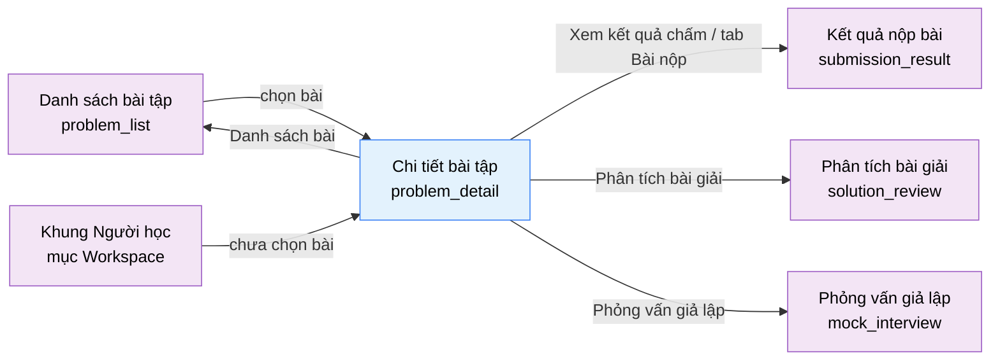

# Tài liệu thiết kế cơ bản (BD) — Chi tiết bài tập / Workspace giải bài (`USR0102`)

## Phương châm tài liệu [Nội bộ — không cần khách duyệt]

- Viết theo **mẫu 9 sheet**. Bộ thẻ đóng, quy ước ID, ký hiệu chuẩn, ranh giới với tài liệu khác và
  checklist kiểm toán nằm ở `02-bd/_rules/bd-template-9sheet.md` — file này không chép lại.
- Phần gắn nhãn `[Nội bộ]` phục vụ sinh mã và tự kiểm toán, không phải yêu cầu của khách hàng: mục 4.5,
  mục 7.3 và các ghi chú quy ước.
- Mã màn `USR0102` theo bảng mã ở `02-bd/_rules/bd-template-9sheet.md` mục 8; tên file mang tiền tố mã.
- Màn này là **màn phức tạp nhất hệ thống**: chạm bốn Bounded Context cùng lúc — `problem-bank` (F2),
  `harness` (F3), `judge-orchestration` (F4), `ai-review` (F5)
  [Nguồn: 01-rd/screens/users/USR0102_problem_detail.md:7-9].
- Kế thừa quy ước đặt tên khối, ID item và tên nghiệp vụ endpoint từ `02-bd/screens/users/USR0101_problem_list.md`
  — file BD đầu tiên của khu Người học [Nguồn: 02-bd/screens/users/USR0101_problem_list.md:11-12].

> **Ranh giới bắt buộc giữ — đọc trước khi sửa file này.** Màn chạm bốn module nên rất dễ biến thành nơi
> chứa mọi thứ. File này **chỉ** mô tả giao diện, item, trạng thái màn, sự kiện và **tên nghiệp vụ** của
> endpoint. Những nội dung sau đã có nơi viết duy nhất và **chỉ được trỏ tới, tuyệt đối không chép lại**:
>
> | Nội dung | Nơi duy nhất |
> | :--- | :--- |
> | Lược đồ kiểu dữ liệu độc lập ngôn ngữ, cách sinh mã bao hàm, tiêm mã, ánh xạ lỗi biên dịch | `02-bd/architecture/harness.md` mục 2b, 4, 6 |
> | State machine bài nộp, hợp đồng `JudgeExecutionPort`, idempotency, Outbox, job sweep | `02-bd/architecture/judge-orchestration.md` mục 3, 4, 5, 6 |
> | Bảng, cột, khoá, index của `judge`/`problem`/`ai` | `02-bd/database/judge-orchestration.md`, `02-bd/database/problem-bank.md`, `02-bd/database/ai-review.md` |
> | Đường dẫn endpoint, request/response, mã lỗi | `03-dd/api/<module>.md` (chưa viết) |
>
> Nếu bạn đang viết về giao dịch, khoá, hàng đợi hay hợp đồng port trong file này thì bạn đang viết nhầm file.

> Đọc cùng `01-rd/screens/users/USR0102_problem_detail.md` (hành vi ở mức yêu cầu, không lặp lại ở đây) và
> `02-bd/screens/users/_shell.md` (khung điều hướng khu Người học).
>
> - **Header dùng chung khung khu Người học nhưng ở biến thể thu gọn** — giữ nguyên thương hiệu và 6 mục
>   nav, lược tên và email trong khối người dùng, chỉ còn avatar
>   [Nguồn: 02-bd/screens/users/_shell.md:78-81]. Đây là khác biệt về mật độ, vẫn một component
>   [Nguồn: 02-bd/screens/users/_shell.md:83-84].
> - **Không có chân trang.** Prototype của màn này không có thẻ `<footer>`; bố cục chiếm trọn chiều cao
>   màn hình (`height: 100vh`, `overflow: hidden`)
>   [Nguồn: 09-layoutBase/Workspace giải bài.dc.html:30,47]. Trạng thái cụm chấm được đưa vào chân panel
>   đề bài thay cho chân trang [Nguồn: 09-layoutBase/Workspace giải bài.dc.html:254].
> - **KHÔNG thiết kế tab "Gợi ý".** Tính năng "Gợi ý theo bậc" đã bị cắt khỏi phạm vi hoàn toàn
>   (`DEC-2026-0831-remove-tiered-hints-ai-config`), trong đó gọi đích danh tab "Gợi ý" của
>   `problem_detail` là một trong ba điểm giao diện phải gỡ. Prototype vẫn còn nguyên tab này — xem
>   Câu hỏi mở Q1. Màn còn **ba** tab.
> - **KHÔNG có nút "Yêu cầu review"** của học viên (`DEC-2026-0830-remove-student-review-request`).
> - **KHÔNG hiển thị nội dung testcase ẩn** ở bất kỳ trạng thái nào — không input, không kết quả mong đợi,
>   không diff. Chỉ trạng thái đạt/không đạt theo từng ô và chỉ số testcase hỏng đầu tiên. Ràng buộc này
>   thực thi ở tầng máy chủ, xem Sheet 9 NO 3.

---

## Sheet 1. Bìa

| Mục | Giá trị |
| :--- | :--- |
| Hệ thống | AlgoPrep |
| Phân hệ | `problem-bank` (F2) + `harness` (F3) + `judge-orchestration` (F4), đọc thêm từ `ai-review` (F5) |
| Công đoạn | BD — Thiết kế cơ bản |
| Phân loại | Màn hình |
| Tên màn | Chi tiết bài tập (Workspace giải bài) |
| Mã màn hình | `USR0102` |
| Tên vật lý (slug) | `problem_detail` |
| Trục tài liệu | Màn hình (`02-bd/screens/`) |
| Actor | A1 (`STUDENT`) |
| Phiên bản | V0.3 |
| Người tạo | Nhóm phát triển AlgoPrep |
| Ngày tạo | 2026/09/22 |
| Người cập nhật | Nhóm phát triển AlgoPrep |
| Ngày cập nhật | 2026/10/03 |

---

## Sheet 2. Lịch sử sửa đổi

| Ver | Sheet bị sửa | Nội dung sửa | Ngày | Người sửa |
| :--- | :--- | :--- | :--- | :--- |
| V0.1 | Toàn bộ | Tạo mới theo mẫu 9 sheet. Gỡ tab "Gợi ý" khỏi thiết kế theo `DEC-2026-0831-remove-tiered-hints-ai-config`, còn 3 tab. Chốt hai trục lựa chọn độc lập (mô hình nộp bài và phương thức nhập mã) theo `DEC-2026-0824-dual-submission-model-per-problem`. Chốt nguyên tắc không lộ testcase ẩn thực thi ở tầng máy chủ. Chốt hợp đồng chuyển màn sang bốn màn hệ quả của một lượt nộp. Phát sinh 13 câu hỏi mở | 2026/09/22 | Nhóm phát triển AlgoPrep |
| V0.2 | Sheet 8, 9 | Đổi phản hồi sau thao tác (đổi ngôn ngữ, tải file, Run Code, Submit, kết quả chấm, lưu bài) và `[Tiêu điểm]` kiểm nhập liệu sang toast + viền ô; giữ vùng lỗi tải panel, lỗi biên dịch trong bảng kết quả, hộp xác nhận rời màn. Theo `DEC-2026-1003-toast-feedback-channel`. | 2026/10/03 | AI |
| V0.3 | Sheet 4, 5, 7 | Đồng bộ `DEC-2026-1001-admin-configurable-settings` mục (7): độ khó bài tập là danh mục do ADMIN quản lý (bảng riêng `problem_levels`). Nhãn độ khó (thanh tác vụ, danh sách chọn bài, tab Đề bài) đọc `display_name` qua `problems.level_id`; DTO `difficulty` thành `levelCode`/`levelDisplayName`; thêm `problem_levels` vào bảng liên quan và Truy cập bảng. Màn chỉ hiển thị nhãn, không lọc theo độ khó và không gọi `ListProblemLevels` (nhãn đã nằm trong phản hồi `GetProblemForWorkspace`) | 2026/10/03 | AI |

---

## Sheet 3. Sơ đồ chuyển màn

> [Nội bộ] Quy ước vẽ: bố trí từ trái sang phải. Màn gọi tới tô tím, màn hiện tại tô xanh nhạt, màn đích
> tô tím. Màu và `[Nguồn:]` dùng để truy vết, không phải yêu cầu của khách hàng.

### 3.1 Danh sách chuyển màn

#### Danh sách bài tập → Chi tiết bài tập

[Điều kiện mở] Bấm một dòng trong bảng danh sách, bấm nút "Vào giải", bấm "Bài ngẫu nhiên", hoặc bấm một
mục trong hai khối phụ của màn danh sách
[Nguồn: 02-bd/screens/users/USR0101_problem_list.md:562-563,565-566].

[Chế độ mở] Chế độ giải bài, có ghi (nộp bài, lưu bài).

[Thông tin truyền] `problem_id` của bài được chọn. Không mang theo bộ lọc của màn danh sách.

[Giá trị trả về] Không có.

[Khi thành công] Mở workspace ở trạng thái đã có bài: panel đề bài bên trái, vùng soạn mã và bảng kết quả
bên phải.

[Khi huỷ] Không có.

#### Khung điều hướng Người học → Chi tiết bài tập

[Điều kiện mở] Chọn mục "Workspace" trên thanh điều hướng ngang của khung khu Người học
[Nguồn: 02-bd/screens/users/_shell.md:55].

[Chế độ mở] Chế độ giải bài.

[Thông tin truyền] Không có `problem_id`. Màn mở ở **trạng thái chưa chọn bài**
[Nguồn: 09-layoutBase/Workspace giải bài.dc.html:112-152]. Mở bài nào khi vào từ lối này còn mở, xem
Câu hỏi mở Q12 và `02-bd/screens/users/_shell.md` mục 6 Q2.

[Giá trị trả về] Không có.

[Khi thành công] Hiển thị khối chọn bài: bài đang làm dở gần nhất và danh sách bài để chọn.

[Khi huỷ] Không có.

#### Chi tiết bài tập → Danh sách bài tập

[Điều kiện mở] Bấm liên kết "Danh sách bài" trên thanh tác vụ
[Nguồn: 09-layoutBase/Workspace giải bài.dc.html:99], hoặc liên kết "Xem toàn bộ bài" ở trạng thái chưa
chọn bài [Nguồn: 09-layoutBase/Workspace giải bài.dc.html:137].

[Chế độ mở] Chế độ duyệt, chỉ đọc.

[Thông tin truyền] Không có.

[Giá trị trả về] Không có.

[Khi thành công] Mở màn `problem_list`.

[Khi huỷ] Còn mã chưa nộp thì hỏi xác nhận trước khi rời màn; người dùng chọn ở lại thì không chuyển màn.
Xem EVT-21.

#### Chi tiết bài tập → Kết quả nộp bài

[Điều kiện mở] Bấm liên kết "Xem kết quả chấm" trong bảng kết quả sau khi một lượt nộp đạt `ACCEPTED`
[Nguồn: 09-layoutBase/Workspace giải bài.dc.html:379], hoặc bấm một dòng trong tab "Bài nộp"
[Nguồn: 09-layoutBase/Workspace giải bài.dc.html:218-225].

[Chế độ mở] Chế độ xem kết quả, chỉ đọc.

[Thông tin truyền] `submission_id` của lượt nộp được chọn.

[Giá trị trả về] Không có.

[Khi thành công] Mở màn `submission_result`.

[Khi huỷ] Như mục trên — còn mã chưa nộp thì hỏi xác nhận.

#### Chi tiết bài tập → Phân tích bài giải

[Điều kiện mở] Bấm liên kết "Phân tích bài giải" trong bảng kết quả khi lượt nộp đạt `ACCEPTED`
[Nguồn: 09-layoutBase/Workspace giải bài.dc.html:380], hoặc bấm liên kết mở báo cáo đầy đủ trong tab
"Solution Review" [Nguồn: 01-rd/screens/users/USR0102_problem_detail.md:116].

[Chế độ mở] Chế độ xem báo cáo, chỉ đọc. F5-01 là hành động **tự chọn**, hệ thống không tự chạy
(`DEC-2026-0831-outside-screens-closures`).

[Thông tin truyền] `submission_id` của lượt nộp `ACCEPTED`.

[Giá trị trả về] Không có.

[Khi thành công] Mở màn `solution_review`.

[Khi huỷ] Phân hệ AI không khả dụng thì liên kết **không hiển thị**, không báo lỗi — xem Sheet 9 NO 13.

#### Chi tiết bài tập → Phỏng vấn giả lập

[Điều kiện mở] Bấm liên kết "Phỏng vấn giả lập" trong bảng kết quả khi lượt nộp đạt `ACCEPTED`
[Nguồn: 09-layoutBase/Workspace giải bài.dc.html:381], hoặc nút "Bắt đầu Mock Interview với bài này" trong
tab "Solution Review" [Nguồn: 09-layoutBase/Workspace giải bài.dc.html:245].

[Chế độ mở] Chế độ hội thoại nhiều lượt.

[Thông tin truyền] `submission_id` của lượt nộp `ACCEPTED`. Lối vào này ứng với
`interview_sessions.entry_type = SUBMISSION` [Nguồn: 02-bd/database/ai-review.md:87-89].

[Giá trị trả về] Không có.

[Khi thành công] Mở màn `mock_interview`.

[Khi huỷ] Phân hệ AI không khả dụng thì liên kết không hiển thị.

### 3.2 Sơ đồ

[Nguồn: 09-layoutBase/Workspace giải bài.dc.html:99,112-152,137,218-225,379,380,381,245;
02-bd/screens/users/_shell.md:55]

---

## Sheet 4. Bố cục màn hình

### 4.1 Tổng quan màn

[Mục đích màn] Nơi người học đọc đề, viết mã trong trình soạn thảo hoặc tải file mã nguồn lên, chạy thử
với testcase mẫu, và nộp bài để chấm với testcase ẩn — cho **cả hai** mô hình nộp bài song song
[Nguồn: 01-rd/screens/users/USR0102_problem_detail.md:18-20].

[Luồng nghiệp vụ chính]

1. **Hiển thị ban đầu**: vào màn với `problem_id`, hệ thống tải song song năm nhóm dữ liệu — đề bài và
   giới hạn, mã khung theo cặp (ngôn ngữ, mô hình) đang chọn, testcase mẫu, lịch sử nộp bài của chính
   người học cho bài này, và tóm tắt phân tích bài giải nếu đã có. Vào màn không có `problem_id` thì hiển
   thị trạng thái chưa chọn bài.
2. **Chọn ngôn ngữ và mô hình**: ba tab ngôn ngữ (Java / C++ / Python) và hai nút mô hình ("Có hàm main" /
   "Bọc hàm"). Đổi một trong hai thì **mã khung được sinh lại** theo đúng cặp mới
   [Nguồn: 09-layoutBase/Workspace giải bài.dc.html:594-601]. Người học chọn tự do **mỗi lượt làm bài**,
   không phải lựa chọn cố định theo bài (`DEC-2026-0824-dual-submission-model-per-problem`).
3. **Chọn phương thức nhập mã**: "Gõ trực tiếp" hoặc "Tải file" — **trục độc lập** với mô hình nộp bài,
   đổi cái này không đặt lại cái kia [Nguồn: 01-rd/screens/users/USR0102_problem_detail.md:136].
4. **Chạy thử**: bấm "Run Code" chạy với testcase Sample, hiển thị input, output thực tế và kết quả mong
   đợi cho từng case. Chạy thử **không ghi nhận vào tiến độ** (F4-02)
   [Nguồn: 01-rd/req/judge-orchestration.md:16].
5. **Nộp bài**: bấm "Submit", máy chủ trả về `submissionId` ngay và không chờ kết quả (F4-01)
   [Nguồn: 01-rd/req/judge-orchestration.md:10-11]; màn chuyển sang tab "Kết quả", mở kênh thời gian thực
   theo `submissionId` và cập nhật dần trạng thái từng testcase (F4-08)
   [Nguồn: 01-rd/req/judge-orchestration.md:45-46].
6. **Sau khi Accepted**: bảng kết quả hiện ba lối đi tiếp theo — xem kết quả chấm đầy đủ, phân tích bài
   giải, phỏng vấn giả lập [Nguồn: 09-layoutBase/Workspace giải bài.dc.html:377-383].

[Người dùng] Người học đã đăng nhập (`STUDENT`). Màn có thao tác ghi (nộp bài, lưu bài) nên **bắt buộc
đăng nhập**, không có chế độ khách — khác `problem_list` vốn còn để ngỏ
[Nguồn: 02-bd/screens/users/USR0101_problem_list.md:600].

[Tệp liên quan] **Có nhập tệp**: file mã nguồn tải lên, giới hạn đúng phần mở rộng của ba ngôn ngữ
(`.java`, `.cpp`, `.py`) và tối đa 64 KB
[Nguồn: 01-rd/req/judge-orchestration.md:14-15; 09-layoutBase/Workspace giải bài.dc.html:307]. Nội dung
file nạp vào cùng một luồng nộp bài F4-01, **không phải một kênh nộp bài riêng**
[Nguồn: 01-rd/req/judge-orchestration.md:13-14]. Không có xuất tệp.

[Phạm vi]
- Chỉ mở được bài có `status = PUBLISHED` và `deleted = false`
  (`DEC-2026-0830-problem-lifecycle-two-states`) [Nguồn: 02-bd/database/problem-bank.md:18-19].
- **Ba tab** ở panel trái: "Đề bài", "Bài nộp", "Solution Review". Tab "Gợi ý" của prototype đã bị cắt
  khỏi phạm vi (`DEC-2026-0831-remove-tiered-hints-ai-config`), xem Câu hỏi mở Q1.
- **Không có nút "Yêu cầu review"** (`DEC-2026-0830-remove-student-review-request`).
- Không hiển thị nội dung testcase ẩn dưới mọi hình thức. Testcase hiển thị được **chỉ** là
  `testcases.visibility = SAMPLE` [Nguồn: 02-bd/database/problem-bank.md:88].
- Không mô tả lại state machine bài nộp — chỉ ánh xạ chín trạng thái của `submissions.status` sang nhãn
  hiển thị [Nguồn: 02-bd/database/judge-orchestration.md:22].
- Không có fail-fast: mọi testcase đều chạy, nhãn kết quả luôn kèm tỉ lệ đạt
  (`DEC-2026-0831-partial-score-testcase-ratio`) [Nguồn: 02-bd/architecture/judge-orchestration.md:94-96].
- Chỉ số "Beats" (F4-12) **không** hiển thị ở màn này dù prototype có vẽ, xem Câu hỏi mở Q11.

[Quyền sử dụng]
- Xem: được, với người học đã đăng nhập.
- Thêm: có — tạo một bài nộp (`judge.submissions`), tạo một dòng lưu bài (`problem.bookmarks`).
- Sửa: không.
- Xoá: có, giới hạn ở việc bỏ lưu bài (xoá dòng `bookmarks` của chính người dùng).

[Số bản ghi tối đa] Tab testcase mẫu: theo số dòng `testcases` có `visibility = SAMPLE` của bài, prototype
minh hoạ 3 case [Nguồn: 09-layoutBase/Workspace giải bài.dc.html:509-513]. Ví dụ trong tab "Đề bài":
prototype minh hoạ 3 ví dụ [Nguồn: 09-layoutBase/Workspace giải bài.dc.html:563-567]. Tab "Bài nộp": 10
lượt nộp gần nhất của chính người học cho chính bài này `[SoT: Suy luận]` — prototype minh hoạ 4 dòng
[Nguồn: 09-layoutBase/Workspace giải bài.dc.html:218], không nêu giới hạn; đề xuất 10 và có liên kết sang
`my_submissions` cho phần còn lại. Dải ô trạng thái testcase: bằng `submissions.total_testcase_count`,
prototype minh hoạ 40 ô [Nguồn: 09-layoutBase/Workspace giải bài.dc.html:643]. Mã nguồn: tối đa 64 KB, xem
Câu hỏi mở Q7.

### 4.2 DTO liên quan

- `ProblemWorkspaceDto`
- `StarterCodeDto`
- `SampleTestcaseDto`
- `ExecutionLimitsDto`
- `MySubmissionSummaryDto`
- `SubmissionTicketDto`
- `SubmissionProgressDto`
- `SampleRunResultDto`
- `SolutionReviewQuickInsightDto`

`[Suy luận]` — tên DTO do BD này đề xuất, `03-dd/api/problem-bank.md`, `03-dd/api/harness.md` và
`03-dd/api/judge-orchestration.md` chốt lại. Đặt tên **khác** DTO của màn quản trị và của màn danh sách:
`ProblemWorkspaceDto` không dùng lại `ProblemListItemDto`
[Nguồn: 02-bd/screens/users/USR0101_problem_list.md:217] vì hai màn khác hẳn tập trường — màn này cần
`statement_md`, giới hạn thời gian/bộ nhớ, cờ `function_wrapper_supported`, chữ ký hàm; màn kia cần
`acRate`, `solveState`, `topicNames`.

### 4.3 Bảng dữ liệu liên quan (13)

| NO | Bảng | Ghi chú |
| --: | :--- | :--- |
| 1 | `problem.problems` | Đề bài, khoá `level_id` của độ khó, giới hạn cơ sở, cờ mô hình [Nguồn: 02-bd/database/problem-bank.md:11-29] |
| 2 | `problem.topics` | Nhãn chủ đề trên tab Đề bài [Nguồn: 02-bd/database/problem-bank.md:37-39] |
| 3 | `problem.problem_topics` | Nối bài với chủ đề [Nguồn: 02-bd/database/problem-bank.md:37-39] |
| 4 | `problem.problem_specs` | Định dạng `stdin`/`stdout` cho mô hình Standard I/O [Nguồn: 02-bd/database/problem-bank.md:58-60] |
| 5 | `problem.function_signatures` | Chữ ký hàm chung (tên theo từng ngôn ngữ do hệ thống suy ra) — đầu vào sinh mã khung [Nguồn: 02-bd/database/problem-bank.md:66-77] |
| 6 | `problem.testcases` | **Chỉ dòng `visibility = SAMPLE`** [Nguồn: 02-bd/database/problem-bank.md:86-88] |
| 7 | `problem.problem_stats` | Read model, nguồn chỉ số "AC rate" ở chân panel [Nguồn: 02-bd/database/problem-bank.md:138-139] |
| 8 | `problem.bookmarks` | Nút "Lưu bài" (F2-13) [Nguồn: 02-bd/database/problem-bank.md:130-132] |
| 9 | `judge.submissions` | Tạo lượt nộp, lịch sử nộp bài của bài này [Nguồn: 02-bd/database/judge-orchestration.md:12-34] |
| 10 | `judge.submission_testcase_results` | Dải ô trạng thái từng testcase — **chỉ đọc cột `verdict` và `testcase_order`** [Nguồn: 02-bd/database/judge-orchestration.md:46-57] |
| 11 | `judge.language_configs` | Hệ số nhân giới hạn theo ngôn ngữ, để hiện giới hạn hiệu lực [Nguồn: 02-bd/database/judge-orchestration.md:95-103] |
| 12 | `ai.solution_reviews` | Tóm tắt phân tích bài giải ở tab thứ ba [Nguồn: 02-bd/database/ai-review.md:36-57] |
| 13 | `problem.problem_levels` | Nhãn độ khó (`display_name`) của bài, đọc qua join `level_id` [Nguồn: 02-bd/database/problem-bank.md mục `problem_levels`] |

Bốn bảng NO 9-12 nằm ở schema của module khác. Màn không truy vấn thẳng: mỗi module tự phục vụ phần dữ liệu
của nó qua endpoint riêng, đúng nguyên tắc mỗi schema một chủ
[Nguồn: 02-bd/database/problem-bank.md:31-33].

### 4.4 Vùng bố cục

Đối chiếu `09-layoutBase/Workspace giải bài.dc.html` — bằng chứng bố cục chỉ-đọc, **không phải** design
system cuối cùng.

| Vùng | Vị trí trong prototype | Nội dung |
| :--- | :--- | :--- |
| Header khu Người học, biến thể thu gọn | `:49-96` | Thương hiệu, 6 mục nav, avatar không kèm tên và email — dùng lại khung chung, không mô tả lại |
| Thanh tác vụ bài toán | `:98-107` | Liên kết "Danh sách bài", mã và tên bài, độ khó, đồng hồ phiên, nút "Run Code" và "Submit" đẩy sang phải. Chỉ hiện khi đã chọn bài |
| Trạng thái chưa chọn bài | `:112-152` | Tiêu đề hướng dẫn, thẻ bài đang làm dở kèm nút "Tiếp tục", danh sách bài để chọn |
| Panel thông tin bài toán (cột trái) | `:158-256` | Dải tab, nội dung tab đang chọn, chân panel (AC rate, nút "Lưu bài", trạng thái cụm chấm) |
| Tab "Đề bài" | `:166-202` | Tên bài, ba nhãn (độ khó, chủ đề, mô hình đang chọn), nội dung đề, câu giải thích mô hình, ví dụ, ràng buộc, câu hỏi mở rộng |
| Tab "Bài nộp" | `:216-227` | Mỗi dòng một lượt nộp: kết quả, ngôn ngữ, thời gian chạy, thời điểm |
| Tab "Solution Review" | `:229-247` | Hai ô chỉ số độ phức tạp, các khối nhận xét rút gọn, nút mở phỏng vấn giả lập |
| Thanh chia đôi bố cục | `:258-260` | Kéo ngang để đổi tỉ lệ hai cột |
| Vùng soạn mã (cột phải, hàng trên) | `:264-325` | Thanh công cụ (ngôn ngữ, mô hình, phương thức nhập), vùng soạn mã hoặc vùng tải file, chân vùng (trạng thái nháp, giới hạn) |
| Bảng kết quả (cột phải, hàng dưới) | `:327-392` | Hai tab "Testcase" và "Kết quả", nhãn verdict tổng hợp bên phải, nội dung tab đang chọn |

Bố cục hai cột chia đôi kéo được: cột trái rộng theo tỉ lệ `split` mặc định 47%, giới hạn kéo trong khoảng
22%–74% [Nguồn: 09-layoutBase/Workspace giải bài.dc.html:400,410,441]; cột phải là lưới hai hàng
`minmax(300px, 1fr) minmax(180px, 246px)` [Nguồn: 09-layoutBase/Workspace giải bài.dc.html:262]. Toàn màn
cao đúng `100vh` và không cuộn ở cấp trang; chỉ nội dung trong từng panel cuộn riêng
[Nguồn: 09-layoutBase/Workspace giải bài.dc.html:30,47]. Giữ nguyên cấu trúc này khi dựng Next.js; không
quy định màu sắc, khoảng cách hay typography ở BD.

**Ba chỗ trong prototype là mã của bản mẫu, không đưa vào BD:**

1. Tab "Gợi ý" `:205-214`, khai báo tab `:552`, cờ `tabIsHint` `:559`, dữ liệu `hints` `:574-578` và nhãn
   "Gợi ý" trong dải badge `:173` — tính năng đã bị cắt, xem Câu hỏi mở Q1.
2. Nhánh `pendingTitle` `:119-124` cùng hàm `choose()` `:426-432` — chỉ để bản mẫu báo rằng chỉ có bài
   Two Sum mới có đề đầy đủ, không phải hành vi của hệ thống thật.
3. Bộ chuyển sáng/tối và VI/EN ở header `:65-70` — thuộc khung chung, đã mô tả ở `_shell`.

### 4.5 Cấu trúc slice FSD [Nội bộ]

| Khối | Slice dự kiến | Căn cứ |
| :--- | :--- | :--- |
| Trang | `views/users/problem-detail` | Quy ước FSD của dự án |
| Khung Người học (thu gọn) | Dùng lại `widgets/app-shell` (biến thể `student-header`, tham số thu gọn) | `02-bd/screens/users/_shell.md` mục 2.5 |
| Thanh tác vụ bài toán | `widgets/problem-taskbar` | Prototype `:98-107` |
| Trạng thái chưa chọn bài | `widgets/workspace-empty-state` | Prototype `:112-152` |
| Panel thông tin bài toán | `widgets/problem-info-panel` | Prototype `:158-256` |
| Nội dung đề bài (Markdown + LaTeX) | `entities/problem` (dùng lại với `problem_list`, `saved_problems`) | `02-bd/screens/users/USR0101_problem_list.md:282-283` |
| Lịch sử nộp bài của bài này | `entities/submission` | Prototype `:216-227` |
| Tóm tắt phân tích bài giải | `widgets/solution-review-summary` | Prototype `:229-247` |
| Thanh chia đôi | `shared/ui/split-pane` | Prototype `:258-260` |
| Thanh công cụ soạn mã | `features/code-toolbar` | Prototype `:265-285` |
| Trình soạn mã Monaco | `features/code-editor` | Prototype `:287-301`, `README.md` mục 5 (Monaco Editor) |
| Tải file mã nguồn | `features/source-file-upload` | Prototype `:303-318` |
| Chạy thử và nộp bài | `features/submit-solution` | Prototype `:105-106` |
| Bảng kết quả và kênh thời gian thực | `widgets/judge-console` + `shared/api/stomp` | Prototype `:327-392` |

`[Suy luận]` — ánh xạ slice do BD đề xuất, DD màn hình chốt lại. `entities/submission` được
`submission_result` và `my_submissions` dùng lại, nên dòng lịch sử nộp bài phải là component nhận dữ liệu
từ ngoài, không tự gọi API.

> [Nội bộ] Ảnh minh hoạ đặt ở `08-diagram/02-bd/screens/users/`, chụp bằng Playwright trên ứng dụng
> Next.js thật khi đã có mã chạy được. Chưa có thì tham chiếu prototype, không vẽ tay.

---

## Sheet 5. Danh sách item màn hình

> Quy ước ID, bộ thẻ và giá trị chuẩn: `02-bd/_rules/bd-template-9sheet.md` mục 2, 3, 4.

### Khu vực A — Thanh tác vụ bài toán

| Khu vực | NO | Tên item | ID item | Bảng DB | Cột DB | Loại UI | Kiểu | Độ dài | Bắt buộc | I/O | Giá trị mặc định | Định dạng | Ghi chú |
| :--- | --: | :--- | :--- | :--- | :--- | :--- | :--- | :--- | :-: | :-: | :--- | :--- | :--- |
| Thanh tác vụ bài toán | | | | | | | | | | | | | |
| | 1 | Liên kết Danh sách bài | `problemDetail.taskbar.linkProblemList` | - | - | Link | - | - | - | I | - | - | Quay về màn `problem_list` [Nguồn: 09-layoutBase/Workspace giải bài.dc.html:99] [Nguồn giá trị] Nhãn tĩnh i18n [EVT liên quan] EVT-19 |
| | 2 | Mã và tên bài | `problemDetail.taskbar.problemTitle` | `problem.problems` | `code`, `title` | Label | String | 240 | - | O | - | `{mã}. {tên}` | Định danh bài đang mở [Nguồn: 09-layoutBase/Workspace giải bài.dc.html:101] [Nguồn giá trị] Cột `code` và `title` [Nguồn: 02-bd/database/problem-bank.md:14-15]. Prototype hiển thị số thứ tự `1.` chứ không phải mã chuỗi — xem Câu hỏi mở Q13 [EVT liên quan] EVT-1 |
| | 3 | Độ khó | `problemDetail.taskbar.difficulty` | `problem.problem_levels` | `display_name` | Badge | String | - | - | O | - | Nhãn `display_name` | Mức độ khó [Nguồn: 09-layoutBase/Workspace giải bài.dc.html:102] [Nguồn giá trị] **đọc từ dữ liệu** `problem_levels.display_name` (qua `problems.level_id`), không còn ánh xạ cứng enum; mức khởi tạo giữ màu badge cũ, mức mới màu trung tính `DEC-2026-1001-admin-configurable-settings` mục (7) [Nguồn: 02-bd/database/problem-bank.md mục `problem_levels`] [EVT liên quan] - |
| | 4 | Đồng hồ phiên làm bài | `problemDetail.taskbar.sessionTimer` | - | - | Label | String | - | - | O | `00:00:00` | `HH:mm:ss` | Thời gian kể từ lúc mở workspace cho bài này [Nguồn: 09-layoutBase/Workspace giải bài.dc.html:104,528] [Công thức] Đếm ở phía trình duyệt từ mốc mở màn; **không có cột DB nào lưu mốc này** — xem Câu hỏi mở Q3 [EVT liên quan] EVT-1 |
| | 5 | Nút Run Code | `problemDetail.taskbar.btnRun` | - | - | Button | - | - | - | I | - | - | Chạy thử mã hiện tại với toàn bộ testcase mẫu, không ghi nhận tiến độ (F4-02) [Nguồn: 09-layoutBase/Workspace giải bài.dc.html:105] [Nguồn giá trị] Nhãn tĩnh i18n [EVT liên quan] EVT-10 |
| | 6 | Nút Submit | `problemDetail.taskbar.btnSubmit` | `judge.submissions` | - | Button | - | - | - | I | - | - | Tạo một lượt nộp và chấm với testcase ẩn (F4-01) [Nguồn: 09-layoutBase/Workspace giải bài.dc.html:106] [Nguồn giá trị] Nhãn tĩnh i18n [EVT liên quan] EVT-11 |

### Khu vực B — Trạng thái chưa chọn bài

| Khu vực | NO | Tên item | ID item | Bảng DB | Cột DB | Loại UI | Kiểu | Độ dài | Bắt buộc | I/O | Giá trị mặc định | Định dạng | Ghi chú |
| :--- | --: | :--- | :--- | :--- | :--- | :--- | :--- | :--- | :-: | :-: | :--- | :--- | :--- |
| Trạng thái chưa chọn bài | | | | | | | | | | | | | |
| | 1 | Tiêu đề và hướng dẫn | `problemDetail.emptyState.title` | - | - | Label | String | - | - | O | - | - | Câu dẫn "Chọn một bài toán để mở workspace" kèm đoạn giải thích [Nguồn: 09-layoutBase/Workspace giải bài.dc.html:115-117] [Nguồn giá trị] Nhãn tĩnh i18n [EVT liên quan] - |
| | 2 | Thẻ bài đang làm dở | `problemDetail.emptyState.inProgressCard` | `judge.submissions` | `problem_id`, `language`, `submitted_at` | Label | String | - | - | O | Ẩn | - | Bài nộp gần nhất chưa đạt `ACCEPTED` của chính người học [Nguồn: 09-layoutBase/Workspace giải bài.dc.html:126-131] [Nguồn giá trị] Kết quả gọi `ListMyUnsolvedRecentProblems`, cùng endpoint đã dùng ở `problem_list` [Nguồn: 02-bd/screens/users/USR0101_problem_list.md:522]. Dòng phụ "18 dòng · lưu 09:42" của prototype **không dùng** vì không có nơi lưu bản nháp, xem Câu hỏi mở Q4 [EVT liên quan] EVT-1 |
| | 3 | Nút Tiếp tục | `problemDetail.emptyState.btnResume` | - | - | Button | - | - | - | I | - | - | Mở workspace cho bài ở thẻ trên [Nguồn: 09-layoutBase/Workspace giải bài.dc.html:132] [Nguồn giá trị] Nhãn tĩnh i18n [EVT liên quan] EVT-2 |
| | 4 | Danh sách bài để chọn | `problemDetail.emptyState.suggestionList` | `problem.problems` | - | List | List | - | - | I/O | rỗng | - | Danh sách bài mở nhanh không cần rời màn [Nguồn: 09-layoutBase/Workspace giải bài.dc.html:140-150] [Nguồn giá trị] Prototype ghi tiêu đề "Gợi ý theo điểm yếu của bạn" [Nguồn: 09-layoutBase/Workspace giải bài.dc.html:136] nhưng **không có mã `Fx-nn` nào cho gợi ý cá nhân hoá** — xem Câu hỏi mở Q2 [EVT liên quan] EVT-2 |
| | 5 | Tên bài trong danh sách | `problemDetail.emptyState.col.title` | `problem.problems` | `code`, `title` | ListColumn | String | 240 | - | O | - | `{mã}. {tên}` | Tên bài của mục [Nguồn: 09-layoutBase/Workspace giải bài.dc.html:143-144] [Nguồn giá trị] Cột `code`, `title` [Nguồn: 02-bd/database/problem-bank.md:14-15] [EVT liên quan] - |
| | 6 | Chủ đề trong danh sách | `problemDetail.emptyState.col.topic` | `problem.topics` | `name` | ListColumn | String | - | - | O | `-` | - | Chủ đề của bài [Nguồn: 09-layoutBase/Workspace giải bài.dc.html:145] [Nguồn giá trị] `topics.name` qua `problem_topics.problem_id` [Nguồn: 02-bd/database/problem-bank.md:37-39] [EVT liên quan] - |
| | 7 | Độ khó trong danh sách | `problemDetail.emptyState.col.difficulty` | `problem.problem_levels` | `display_name` | ListColumn | String | - | - | O | - | Nhãn `display_name` | Mức độ khó của bài [Nguồn: 09-layoutBase/Workspace giải bài.dc.html:146] [Nguồn giá trị] Như Khu vực A NO 3 [EVT liên quan] - |
| | 8 | Liên kết xem toàn bộ bài | `problemDetail.emptyState.linkAllProblems` | - | - | Link | - | - | - | I | - | - | Sang màn `problem_list` [Nguồn: 09-layoutBase/Workspace giải bài.dc.html:137] [Nguồn giá trị] Nhãn tĩnh i18n. Prototype ghi kèm tổng số bài "640" — số này lấy từ cùng nguồn với dải chỉ số của `problem_list` [Nguồn: 02-bd/screens/users/USR0101_problem_list.md:299] [EVT liên quan] EVT-19 |

### Khu vực C — Panel thông tin bài toán

| Khu vực | NO | Tên item | ID item | Bảng DB | Cột DB | Loại UI | Kiểu | Độ dài | Bắt buộc | I/O | Giá trị mặc định | Định dạng | Ghi chú |
| :--- | --: | :--- | :--- | :--- | :--- | :--- | :--- | :--- | :-: | :-: | :--- | :--- | :--- |
| Panel thông tin bài toán | | | | | | | | | | | | | |
| | 1 | Dải tab panel | `problemDetail.infoPanel.tabs` | - | - | List | Enum | - | - | I/O | `Đề bài` | - | **Ba** tab: Đề bài / Bài nộp / Solution Review [Nguồn: 09-layoutBase/Workspace giải bài.dc.html:159-163]. Tab thứ tư "Gợi ý" của prototype [Nguồn: 09-layoutBase/Workspace giải bài.dc.html:552] đã bị cắt (`DEC-2026-0831-remove-tiered-hints-ai-config`) [Nguồn giá trị] Nhãn tĩnh i18n; tab đang chọn lấy từ tham số URL `tab` [EVT liên quan] EVT-3 |
| | 2 | AC rate | `problemDetail.infoPanel.acRate` | `problem.problem_stats` | `ac_rate` | Label | Number | 5 | - | O | `-` | `{số}%` | Tỉ lệ bài nộp được chấp nhận trên toàn hệ thống cho bài này [Nguồn: 09-layoutBase/Workspace giải bài.dc.html:251] [Nguồn giá trị] Read model `problem_stats.ac_rate` [Nguồn: 02-bd/database/problem-bank.md:138-139]. Chưa có dòng read model thì hiển thị `-`, không hiển thị `0%` — cùng quy ước với `problem_list` [Nguồn: 02-bd/screens/users/USR0101_problem_list.md:339] [EVT liên quan] EVT-1 |
| | 3 | Nút Lưu bài | `problemDetail.infoPanel.btnBookmark` | `problem.bookmarks` | `user_id`, `problem_id` | Button | Boolean | - | - | I/O | Chưa lưu | - | Bật/tắt đánh dấu lưu bài của chính người học (F2-13) [Nguồn: 09-layoutBase/Workspace giải bài.dc.html:253] [Công thức] Đã lưu khi tồn tại dòng `bookmarks` khớp `(user_id hiện tại, problem_id)` [Nguồn: 02-bd/database/problem-bank.md:130-132]; nhãn đổi giữa "Lưu bài" và "Bỏ lưu" [EVT liên quan] EVT-15 |
| | 4 | Trạng thái cụm chấm | `problemDetail.infoPanel.judgeClusterStatus` | - | - | Badge | Enum | - | - | O | Ẩn | - | Cho biết cụm go-judge có sẵn sàng nhận bài hay không [Nguồn: 09-layoutBase/Workspace giải bài.dc.html:254] [Nguồn giá trị] Chưa có nguồn chốt — cùng câu hỏi với chân trang khung chung [Nguồn: 02-bd/screens/users/_shell.md:128], xem Câu hỏi mở Q8 [EVT liên quan] EVT-1 |
| | 5 | Thanh chia đôi bố cục | `problemDetail.infoPanel.splitHandle` | - | - | Button | Number | - | - | I/O | `47` | `{số}%` | Kéo ngang để đổi tỉ lệ hai cột [Nguồn: 09-layoutBase/Workspace giải bài.dc.html:258-260] [Công thức] Tỉ lệ bề rộng cột trái, chặn trong khoảng 22–74 [Nguồn: 09-layoutBase/Workspace giải bài.dc.html:441]; giá trị lưu ở phía trình duyệt, không lưu DB [EVT liên quan] EVT-20 |

### Khu vực D — Tab Đề bài

| Khu vực | NO | Tên item | ID item | Bảng DB | Cột DB | Loại UI | Kiểu | Độ dài | Bắt buộc | I/O | Giá trị mặc định | Định dạng | Ghi chú |
| :--- | --: | :--- | :--- | :--- | :--- | :--- | :--- | :--- | :-: | :-: | :--- | :--- | :--- |
| Tab Đề bài | | | | | | | | | | | | | |
| | 1 | Tên bài | `problemDetail.statement.title` | `problem.problems` | `code`, `title` | Label | String | 240 | - | O | - | `{mã}. {tên}` | Tiêu đề đề bài [Nguồn: 09-layoutBase/Workspace giải bài.dc.html:168] [Nguồn giá trị] Cùng nguồn Khu vực A NO 2 [EVT liên quan] - |
| | 2 | Nhãn độ khó | `problemDetail.statement.difficultyBadge` | `problem.problem_levels` | `display_name` | Badge | String | - | - | O | - | Nhãn `display_name` | [Nguồn: 09-layoutBase/Workspace giải bài.dc.html:170] [Nguồn giá trị] Như Khu vực A NO 3 [EVT liên quan] - |
| | 3 | Nhãn chủ đề | `problemDetail.statement.topicBadge` | `problem.topics` | `name` | Badge | String | - | - | O | `-` | - | Chủ đề của bài, nhiều chủ đề thì mỗi chủ đề một nhãn [Nguồn: 09-layoutBase/Workspace giải bài.dc.html:171] [Nguồn giá trị] `topics.name` qua `problem_topics` [Nguồn: 02-bd/database/problem-bank.md:37-39] [EVT liên quan] - |
| | 4 | Nhãn mô hình đang chọn | `problemDetail.statement.modelBadge` | - | - | Badge | Enum | - | - | O | `Bọc hàm` | - | Cho biết mã đang viết theo mô hình nào [Nguồn: 09-layoutBase/Workspace giải bài.dc.html:172] [Công thức] Bám **trạng thái màn** của Khu vực G NO 3, không phải cột DB — mô hình do người học chọn mỗi lượt (`DEC-2026-0824-dual-submission-model-per-problem`) [EVT liên quan] EVT-5 |
| | 5 | Nội dung đề | `problemDetail.statement.body` | `problem.problems` | `statement_md` | Label | String | - | - | O | - | Markdown + LaTeX | Toàn văn đề bài [Nguồn: 09-layoutBase/Workspace giải bài.dc.html:176-177] [Nguồn giá trị] Cột `statement_md`, kết xuất Markdown + LaTeX (F2-01) [Nguồn: 02-bd/database/problem-bank.md:16] [EVT liên quan] - |
| | 6 | Câu giải thích mô hình | `problemDetail.statement.modelNote` | - | - | Label | String | - | - | O | - | - | Câu nói rõ người học phải viết gì ở mô hình đang chọn [Nguồn: 09-layoutBase/Workspace giải bài.dc.html:178] [Nguồn giá trị] Hai nhãn tĩnh i18n, chọn theo Khu vực G NO 3. Ở mô hình Standard I/O, câu này kèm định dạng `stdin`/`stdout` từ `problem_specs.stdin_format_md`/`stdout_format_md` [Nguồn: 02-bd/database/problem-bank.md:59-60] [EVT liên quan] EVT-5 |
| | 7 | Danh sách ví dụ | `problemDetail.statement.exampleList` | `problem.testcases` | `visibility`, `is_worked_example` | List | List | - | - | O | rỗng | - | Các ví dụ mẫu hiển thị kèm đề [Nguồn: 09-layoutBase/Workspace giải bài.dc.html:180-189] [Nguồn giá trị] Dòng `testcases` có `visibility = SAMPLE AND is_worked_example = true` [Nguồn: 02-bd/database/problem-bank.md:88,96] [EVT liên quan] EVT-1 |
| | 8 | Dữ liệu vào của ví dụ | `problemDetail.statement.col.exampleInput` | `problem.testcases` | `input_inline` | ListColumn | String | - | - | O | - | - | [Nguồn: 09-layoutBase/Workspace giải bài.dc.html:184] [Nguồn giá trị] Cột `input_inline` khi `input_storage = INLINE` [Nguồn: 02-bd/database/problem-bank.md:89-91]. Testcase Sample luôn đủ nhỏ để `INLINE` `[SoT: Suy luận]` [EVT liên quan] - |
| | 9 | Kết quả của ví dụ | `problemDetail.statement.col.exampleOutput` | `problem.testcases` | `expected_output_inline` | ListColumn | String | - | - | O | - | - | [Nguồn: 09-layoutBase/Workspace giải bài.dc.html:185] [Nguồn giá trị] Cột `expected_output_inline` [Nguồn: 02-bd/database/problem-bank.md:93-94] [EVT liên quan] - |
| | 10 | Giải thích ví dụ | `problemDetail.statement.col.exampleNote` | - | - | ListColumn | String | - | - | O | Ẩn | - | Câu giải thích vì sao ví dụ cho kết quả đó [Nguồn: 09-layoutBase/Workspace giải bài.dc.html:186] [Nguồn giá trị] **Không có cột nào trong `testcases` lưu câu giải thích** [Nguồn: 02-bd/database/problem-bank.md:86-97] — xem Câu hỏi mở Q6 [EVT liên quan] - |
| | 11 | Danh sách ràng buộc | `problemDetail.statement.constraintList` | `problem.problems` | `statement_md` | List | List | - | - | O | rỗng | - | Các ràng buộc về miền giá trị của bài [Nguồn: 09-layoutBase/Workspace giải bài.dc.html:191-196] [Nguồn giá trị] Không có cột riêng; đề xuất là một mục trong `statement_md` — xem Câu hỏi mở Q5 [EVT liên quan] - |
| | 12 | Khối câu hỏi mở rộng | `problemDetail.statement.followUp` | `problem.problems` | `statement_md` | Label | String | - | - | O | Ẩn | - | Gợi mở hướng tối ưu, dẫn sang phân tích bài giải [Nguồn: 09-layoutBase/Workspace giải bài.dc.html:198-201] [Nguồn giá trị] Không có cột riêng; đề xuất là một mục trong `statement_md` — xem Câu hỏi mở Q5 [EVT liên quan] - |

### Khu vực E — Tab Bài nộp

| Khu vực | NO | Tên item | ID item | Bảng DB | Cột DB | Loại UI | Kiểu | Độ dài | Bắt buộc | I/O | Giá trị mặc định | Định dạng | Ghi chú |
| :--- | --: | :--- | :--- | :--- | :--- | :--- | :--- | :--- | :-: | :-: | :--- | :--- | :--- |
| Tab Bài nộp | | | | | | | | | | | | | |
| | 1 | Danh sách lượt nộp | `problemDetail.submissionHistory.list` | `judge.submissions` | `user_id`, `problem_id` | List | List | - | - | O | rỗng | - | 10 lượt nộp gần nhất của **chính người học** cho **chính bài này** [Nguồn: 09-layoutBase/Workspace giải bài.dc.html:216-227] [Nguồn giá trị] Kết quả gọi `ListMySubmissionsForProblem`, dùng index `submissions(user_id, problem_id, created_at DESC)` [Nguồn: 02-bd/database/judge-orchestration.md:124] [EVT liên quan] EVT-1, EVT-22 |
| | 2 | Kết quả lượt nộp | `problemDetail.submissionHistory.col.verdict` | `judge.submissions` | `status`, `passed_testcase_count`, `total_testcase_count` | ListColumn | String | - | - | O | - | `{nhãn} {đạt}/{tổng}` | Trạng thái cuối của lượt nộp kèm tỉ lệ testcase đạt [Nguồn: 09-layoutBase/Workspace giải bài.dc.html:220] [Công thức] Nhãn tĩnh i18n map từ `status`; trạng thái khác `ACCEPTED`/`COMPILE_ERROR`/`SYSTEM_ERROR` thì ghép thêm `passed_testcase_count`/`total_testcase_count` (F4-13, `DEC-2026-0831-partial-score-testcase-ratio`) [Nguồn: 02-bd/database/judge-orchestration.md:22,25-26] [EVT liên quan] - |
| | 3 | Ngôn ngữ | `problemDetail.submissionHistory.col.language` | `judge.submissions` | `language` | ListColumn | Enum | - | - | O | - | Nhãn cố định | [Nguồn: 09-layoutBase/Workspace giải bài.dc.html:221] [Nguồn giá trị] `JAVA` thành "Java", `CPP` thành "C++", `PYTHON` thành "Python" [Nguồn: 02-bd/database/judge-orchestration.md:18] [EVT liên quan] - |
| | 4 | Thời gian và bộ nhớ | `problemDetail.submissionHistory.col.metrics` | `judge.submissions` | `runtime_ms`, `memory_kb` | ListColumn | String | - | - | O | `-` | `{số} ms · {số} MB` | Chỉ số của lượt nộp [Nguồn: 09-layoutBase/Workspace giải bài.dc.html:222] [Nguồn giá trị] Cột `runtime_ms`, `memory_kb`; cả hai `NULL` khi chưa chấm xong hoặc dừng ở `COMPILE_ERROR` thì hiển thị `-` [Nguồn: 02-bd/database/judge-orchestration.md:28-29] [EVT liên quan] - |
| | 5 | Thời điểm nộp | `problemDetail.submissionHistory.col.submittedAt` | `judge.submissions` | `submitted_at` | ListColumn | Date | - | - | O | - | `dd/MM HH:mm` | [Nguồn: 09-layoutBase/Workspace giải bài.dc.html:223] [Nguồn giá trị] Cột `submitted_at` [Nguồn: 02-bd/database/judge-orchestration.md:31] [EVT liên quan] - |

### Khu vực F — Tab Solution Review

| Khu vực | NO | Tên item | ID item | Bảng DB | Cột DB | Loại UI | Kiểu | Độ dài | Bắt buộc | I/O | Giá trị mặc định | Định dạng | Ghi chú |
| :--- | --: | :--- | :--- | :--- | :--- | :--- | :--- | :--- | :-: | :-: | :--- | :--- | :--- |
| Tab Solution Review | | | | | | | | | | | | | |
| | 1 | Chỉ số độ phức tạp | `problemDetail.reviewSummary.metrics` | `ai.solution_reviews` | `result_json` | Label | String | - | - | O | Ẩn | - | Hai ô "Thời gian" và "Bộ nhớ" dạng ký hiệu Big-O [Nguồn: 09-layoutBase/Workspace giải bài.dc.html:231-238] [Nguồn giá trị] Trường độ phức tạp trong `result_json` của báo cáo đã có (F5-07) [Nguồn: 02-bd/database/ai-review.md:44]. Đây là **bản tóm tắt nhanh đọc lại từ báo cáo đã có**, không tạo dữ liệu mới [Nguồn: 01-rd/screens/users/USR0102_problem_detail.md:116] [EVT liên quan] EVT-1 |
| | 2 | Khối nhận xét rút gọn | `problemDetail.reviewSummary.blocks` | `ai.solution_reviews` | `result_json` | List | List | - | - | O | rỗng | - | 1-2 nhận xét chính rút từ báo cáo [Nguồn: 09-layoutBase/Workspace giải bài.dc.html:239-244] [Nguồn giá trị] Cùng nguồn NO 1. Bản đầy đủ nằm ở màn `solution_review` [Nguồn: 01-rd/screens/users/USR0102_problem_detail.md:116] [EVT liên quan] EVT-1 |
| | 3 | Liên kết mở báo cáo đầy đủ | `problemDetail.reviewSummary.linkFullReport` | - | - | Link | - | - | - | I | - | - | Mở màn `solution_review` của lượt nộp tương ứng [Nguồn giá trị] Nhãn tĩnh i18n. Prototype không vẽ liên kết này nhưng RD đã chốt "mở từ nút trong tab hoặc từ console kết quả" [Nguồn: 01-rd/screens/users/USR0102_problem_detail.md:116] [EVT liên quan] EVT-17 |
| | 4 | Nút bắt đầu phỏng vấn giả lập | `problemDetail.reviewSummary.btnMockInterview` | - | - | Button | - | - | - | I | - | - | Mở màn `mock_interview` với lối vào từ bài nộp [Nguồn: 09-layoutBase/Workspace giải bài.dc.html:245] [Nguồn giá trị] Nhãn tĩnh i18n [EVT liên quan] EVT-18 |

### Khu vực G — Thanh công cụ soạn mã

| Khu vực | NO | Tên item | ID item | Bảng DB | Cột DB | Loại UI | Kiểu | Độ dài | Bắt buộc | I/O | Giá trị mặc định | Định dạng | Ghi chú |
| :--- | --: | :--- | :--- | :--- | :--- | :--- | :--- | :--- | :-: | :-: | :--- | :--- | :--- |
| Thanh công cụ soạn mã | | | | | | | | | | | | | |
| | 1 | Nhãn khối soạn mã | `problemDetail.codeToolbar.label` | - | - | Label | String | - | - | O | `Code` | - | Nhãn nhận dạng khối [Nguồn: 09-layoutBase/Workspace giải bài.dc.html:266] [Nguồn giá trị] Nhãn tĩnh i18n [EVT liên quan] - |
| | 2 | Chọn ngôn ngữ | `problemDetail.codeToolbar.languageTabs` | `judge.submissions` | `language` | List | Enum | - | Bắt buộc | I/O | `PYTHON` | - | Đúng **ba** ngôn ngữ Java / C++ / Python, không hơn [Nguồn: 09-layoutBase/Workspace giải bài.dc.html:267-271,594] [Nguồn giá trị] Enum khoá cứng `JAVA`/`CPP`/`PYTHON` [Nguồn: 02-bd/database/judge-orchestration.md:18]; giá trị đang chọn lấy từ tham số URL `lang`. Mặc định khi không có tham số, xem Câu hỏi mở Q9 [EVT liên quan] EVT-4 |
| | 3 | Chọn mô hình nộp bài | `problemDetail.codeToolbar.modelTabs` | `judge.submissions` | `submission_model` | List | Enum | - | Bắt buộc | I/O | `FUNCTION_WRAPPER` | - | Hai nút "Có hàm main" (`STANDARD_IO`) và "Bọc hàm" (`FUNCTION_WRAPPER`) [Nguồn: 09-layoutBase/Workspace giải bài.dc.html:272-276,596-601] [Nguồn giá trị] Enum `submission_model` [Nguồn: 02-bd/database/judge-orchestration.md:19]; giá trị đang chọn lấy từ tham số URL `model`. Nút "Bọc hàm" bị ẩn khi `problems.function_wrapper_supported = false` — xem Sheet 6 [EVT liên quan] EVT-5 |
| | 4 | Chọn phương thức nhập mã | `problemDetail.codeToolbar.inputMethodTabs` | `judge.submissions` | `source_input_method` | List | Enum | - | Bắt buộc | I/O | `EDITOR` | - | Hai nút "Gõ trực tiếp" (`EDITOR`) và "Tải file" (`FILE_UPLOAD`), tách khỏi nhóm mô hình bằng một đường kẻ dọc [Nguồn: 09-layoutBase/Workspace giải bài.dc.html:277-282,602-607] [Nguồn giá trị] Enum `source_input_method` [Nguồn: 02-bd/database/judge-orchestration.md:21]. **Trục độc lập** với NO 3: đổi mô hình không đặt lại phương thức nhập [Nguồn: 01-rd/screens/users/USR0102_problem_detail.md:136] [EVT liên quan] EVT-6 |
| | 5 | Thông tin vùng soạn mã | `problemDetail.codeToolbar.editorMeta` | - | - | Label | String | - | - | O | - | - | Ở chế độ gõ trực tiếp hiển thị mã hoá và vị trí con trỏ; ở chế độ tải file hiển thị tên file kỳ vọng và giới hạn kích thước [Nguồn: 09-layoutBase/Workspace giải bài.dc.html:284,612] [Công thức] Chuỗi ghép ở tầng giao diện từ trạng thái trình soạn thảo và từ ngôn ngữ đang chọn; phần mở rộng theo bảng `.java`/`.cpp`/`.py` [Nguồn: 01-rd/req/judge-orchestration.md:15] [EVT liên quan] EVT-4, EVT-6, EVT-7 |

### Khu vực H — Vùng nhập mã

| Khu vực | NO | Tên item | ID item | Bảng DB | Cột DB | Loại UI | Kiểu | Độ dài | Bắt buộc | I/O | Giá trị mặc định | Định dạng | Ghi chú |
| :--- | --: | :--- | :--- | :--- | :--- | :--- | :--- | :--- | :-: | :-: | :--- | :--- | :--- |
| Vùng nhập mã | | | | | | | | | | | | | |
| | 1 | Ô soạn mã | `problemDetail.codeInput.editor` | `judge.submissions` | `source_code` | TextArea | String | 65536 | Bắt buộc | I/O | Mã khung | - | Trình soạn thảo Monaco có số dòng và tô màu cú pháp [Nguồn: 09-layoutBase/Workspace giải bài.dc.html:287-301] [Nguồn giá trị] Giá trị ban đầu là **mã khung** do `harness` sinh theo cặp (ngôn ngữ, mô hình) đang chọn (F3-13) [Nguồn: 01-rd/req/harness.md:27-28]; người học sửa được. Cơ chế sinh mã khung thuộc `02-bd/architecture/harness.md`, không mô tả ở đây [EVT liên quan] EVT-4, EVT-5, EVT-7 |
| | 2 | Vùng kéo thả file | `problemDetail.codeInput.dropZone` | - | - | Label | String | - | - | I | - | - | Vùng kéo-thả file mã nguồn kèm câu mô tả giới hạn [Nguồn: 09-layoutBase/Workspace giải bài.dc.html:305-307] [Nguồn giá trị] Nhãn tĩnh i18n ghép với phần mở rộng theo ngôn ngữ đang chọn và hằng số 64 KB [Nguồn: 09-layoutBase/Workspace giải bài.dc.html:307] [EVT liên quan] EVT-8 |
| | 3 | Nút Chọn file | `problemDetail.codeInput.btnChooseFile` | - | - | Button | - | - | - | I | - | - | Mở hộp thoại chọn file của hệ điều hành [Nguồn: 09-layoutBase/Workspace giải bài.dc.html:308] [Nguồn giá trị] Nhãn tĩnh i18n [EVT liên quan] EVT-8 |
| | 4 | Thẻ file đã tải | `problemDetail.codeInput.uploadedFileCard` | - | - | Label | String | - | - | O | Ẩn | `{tên file} · {kích thước}` | Thông tin file vừa tải lên [Nguồn: 09-layoutBase/Workspace giải bài.dc.html:310-314] [Nguồn giá trị] Siêu dữ liệu của file do trình duyệt cung cấp; **không lưu file lên máy chủ** — nội dung nạp vào cùng trường `source_code` của luồng nộp bài F4-01 [Nguồn: 01-rd/req/judge-orchestration.md:13-14] [EVT liên quan] EVT-8 |
| | 5 | Nút Xem nội dung | `problemDetail.codeInput.btnViewUploaded` | - | - | Button | - | - | - | I | - | - | Xem lại nội dung file đã tải trước khi nộp [Nguồn: 09-layoutBase/Workspace giải bài.dc.html:315] [Nguồn giá trị] Nhãn tĩnh i18n [EVT liên quan] EVT-9 |
| | 6 | Trạng thái lưu nháp | `problemDetail.codeInput.draftStatus` | - | - | Label | String | - | - | O | Ẩn | - | Cho biết mã đang soạn đã được giữ lại hay chưa [Nguồn: 09-layoutBase/Workspace giải bài.dc.html:321,531] [Nguồn giá trị] **Không có bảng nào lưu bản nháp mã nguồn** trong toàn bộ BD database — cùng khoảng trống đã ghi ở `problem_list` [Nguồn: 02-bd/screens/users/USR0101_problem_list.md:603]. Xem Câu hỏi mở Q4 [EVT liên quan] EVT-7 |
| | 7 | Giới hạn thời gian và bộ nhớ | `problemDetail.codeInput.limits` | `problem.problems`, `judge.language_configs` | `time_limit_ms`, `memory_limit_mb`, `time_limit_multiplier`, `memory_limit_multiplier` | Label | String | - | - | O | `-` | `Time {số}s · Memory {số}MB` | Giới hạn **hiệu lực** cho ngôn ngữ đang chọn [Nguồn: 09-layoutBase/Workspace giải bài.dc.html:323,530] [Công thức] `time_limit_ms` nhân `time_limit_multiplier` của ngôn ngữ đang chọn; tương tự cho bộ nhớ [Nguồn: 02-bd/database/problem-bank.md:21-22; 02-bd/database/judge-orchestration.md:98-99] [EVT liên quan] EVT-1, EVT-4 |

### Khu vực I — Bảng kết quả

| Khu vực | NO | Tên item | ID item | Bảng DB | Cột DB | Loại UI | Kiểu | Độ dài | Bắt buộc | I/O | Giá trị mặc định | Định dạng | Ghi chú |
| :--- | --: | :--- | :--- | :--- | :--- | :--- | :--- | :--- | :-: | :-: | :--- | :--- | :--- |
| Bảng kết quả | | | | | | | | | | | | | |
| | 1 | Dải tab bảng kết quả | `problemDetail.console.tabs` | - | - | List | Enum | - | - | I/O | `Testcase` | - | Hai tab "Testcase" và "Kết quả" [Nguồn: 09-layoutBase/Workspace giải bài.dc.html:328-332,620] [Nguồn giá trị] Nhãn tĩnh i18n; trạng thái tab là trạng thái màn, không ghi vào URL [EVT liên quan] EVT-13 |
| | 2 | Nhãn kết quả tổng hợp | `problemDetail.console.verdict` | `judge.submissions` | `status`, `passed_testcase_count`, `total_testcase_count` | Badge | String | - | - | O | Ẩn | `{nhãn} · {đạt}/{tổng}` | Kết quả của lượt chạy thử hoặc lượt nộp gần nhất [Nguồn: 09-layoutBase/Workspace giải bài.dc.html:334,638] [Công thức] Như Khu vực E NO 2. Trong lúc chấm, hiển thị nhãn trạng thái trung gian (`PENDING`/`COMPILING`/`JUDGING`) kèm số testcase đã chạy [Nguồn: 02-bd/database/judge-orchestration.md:22] [EVT liên quan] EVT-10, EVT-11, EVT-12 |
| | 3 | Tab chọn testcase mẫu | `problemDetail.console.sampleCaseTabs` | `problem.testcases` | `visibility` | List | Number | - | - | I/O | `1` | `Case {số}` | Mỗi testcase Sample một nút [Nguồn: 09-layoutBase/Workspace giải bài.dc.html:341-345] [Nguồn giá trị] Số dòng `testcases` có `visibility = SAMPLE` [Nguồn: 02-bd/database/problem-bank.md:88] [EVT liên quan] EVT-14 |
| | 4 | Nội dung testcase mẫu | `problemDetail.console.sampleCaseBody` | `problem.testcases` | `input_inline` | Label | String | - | - | O | - | - | Dữ liệu vào của testcase Sample đang chọn, tách theo từng tham số ở mô hình Bọc hàm [Nguồn: 09-layoutBase/Workspace giải bài.dc.html:346-355] [Nguồn giá trị] Cột `input_inline`; tên tham số lấy từ `function_signatures.parameters` [Nguồn: 02-bd/database/problem-bank.md:74]. **Chỉ Sample** — testcase ẩn không bao giờ hiển thị ở đây [EVT liên quan] EVT-14 |
| | 5 | Dải ô trạng thái từng testcase | `problemDetail.console.caseDots` | `judge.submission_testcase_results` | `verdict`, `testcase_order` | List | List | - | - | O | rỗng | - | Mỗi testcase một ô, màu theo trạng thái [Nguồn: 09-layoutBase/Workspace giải bài.dc.html:363-367] [Nguồn giá trị] Cột `verdict` và `testcase_order` [Nguồn: 02-bd/database/judge-orchestration.md:51-52]. **Chỉ trạng thái và số thứ tự** — chú giải của ô không được chứa dữ liệu vào, kết quả mong đợi hay diff, kể cả với testcase ẩn (Sheet 9 NO 3) [EVT liên quan] EVT-10, EVT-11, EVT-12 |
| | 6 | Chỉ số lượt chạy | `problemDetail.console.runMetrics` | `judge.submissions` | `runtime_ms`, `memory_kb` | List | List | - | - | O | `-` | - | Thời gian chạy và bộ nhớ lớn nhất trong các testcase đã chạy [Nguồn: 09-layoutBase/Workspace giải bài.dc.html:368-375] [Nguồn giá trị] Cột `runtime_ms`, `memory_kb` [Nguồn: 02-bd/database/judge-orchestration.md:28-29]. Ô "Beats" của prototype [Nguồn: 09-layoutBase/Workspace giải bài.dc.html:645] **không** đưa vào màn này, xem Câu hỏi mở Q11 [EVT liên quan] EVT-10, EVT-11, EVT-12 |
| | 7 | Khối kết quả dạng văn bản | `problemDetail.console.output` | `judge.submissions` | `compile_error_message` | Label | String | - | - | O | - | - | Với lượt chạy thử: bảng đối chiếu output thực tế và kết quả mong đợi của từng testcase Sample. Với lượt nộp: câu tổng kết và thông báo lỗi biên dịch nếu có [Nguồn: 09-layoutBase/Workspace giải bài.dc.html:376,647-649] [Nguồn giá trị] Cột `compile_error_message` **đã qua bước ánh xạ dòng của `harness`** (F3-11) [Nguồn: 02-bd/database/judge-orchestration.md:24]; phần thuộc mã khung bị lọc bỏ hoàn toàn (F3-12), xem Sheet 9 NO 15 [EVT liên quan] EVT-10, EVT-11 |
| | 8 | Liên kết Xem kết quả chấm | `problemDetail.console.linkFullResult` | - | - | Link | - | - | - | I | - | - | Sang màn `submission_result` của lượt nộp vừa xong [Nguồn: 09-layoutBase/Workspace giải bài.dc.html:379] [Nguồn giá trị] Nhãn tĩnh i18n [EVT liên quan] EVT-16 |
| | 9 | Liên kết Phân tích bài giải | `problemDetail.console.linkSolutionReview` | - | - | Link | - | - | - | I | - | - | Sang màn `solution_review` (F5-01) [Nguồn: 09-layoutBase/Workspace giải bài.dc.html:380] [Nguồn giá trị] Nhãn tĩnh i18n. Hành động **tự chọn**, hệ thống không tự chạy (`DEC-2026-0831-outside-screens-closures`) [EVT liên quan] EVT-17 |
| | 10 | Liên kết Phỏng vấn giả lập | `problemDetail.console.linkMockInterview` | - | - | Link | - | - | - | I | - | - | Sang màn `mock_interview` (F5-09) [Nguồn: 09-layoutBase/Workspace giải bài.dc.html:381] [Nguồn giá trị] Nhãn tĩnh i18n [EVT liên quan] EVT-18 |
| | 11 | Hướng dẫn khi chưa chạy | `problemDetail.console.emptyHint` | - | - | Label | String | - | - | O | - | - | Câu hướng dẫn khi chưa có lượt chạy nào [Nguồn: 09-layoutBase/Workspace giải bài.dc.html:386-388] [Nguồn giá trị] Nhãn tĩnh i18n, chèn số testcase Sample và số testcase ẩn. **Số testcase ẩn là con số duy nhất được tiết lộ**, không kèm bất kỳ nội dung nào [EVT liên quan] EVT-1 |

[Nguồn: 09-layoutBase/Workspace giải bài.dc.html:99-107,112-152,159-163,166-202,216-227,229-247,250-255,
258-260,265-285,287-324,327-392; 02-bd/database/problem-bank.md:11-29,37-39,58-60,66-77,86-97,130-139;
02-bd/database/judge-orchestration.md:12-34,46-57,95-103; 02-bd/database/ai-review.md:36-57]

---

## Sheet 6. Đặc tả điều khiển item

> Ký hiệu cột `Hiển thị` và thứ tự thẻ: `02-bd/_rules/bd-template-9sheet.md` mục 2, 3. Dùng đúng NO, tên
> item và thứ tự của Sheet 5. Lỗi nhập liệu ghi ở Sheet 9, xử lý nghiệp vụ ghi ở Sheet 8.

### Khu vực A — Thanh tác vụ bài toán

| Khu vực | NO | Tên item | Hiển thị | Ghi chú |
| :--- | --: | :--- | :-: | :--- |
| Thanh tác vụ bài toán | | | | |
| | 1 | Liên kết Danh sách bài | Điều kiện | [Điều kiện hiển thị] Chỉ hiển thị khi đã chọn bài — cả thanh tác vụ nằm trong nhánh `hasProblem` [Nguồn: 09-layoutBase/Workspace giải bài.dc.html:97]. |
| | 2 | Mã và tên bài | Điều kiện | [Điều kiện hiển thị] Như NO 1. Trong lúc tải hiển thị khung chờ một dòng, không để trống. |
| | 3 | Độ khó | Điều kiện | [Điều kiện hiển thị] Như NO 1. |
| | 4 | Đồng hồ phiên làm bài | Điều kiện | [Điều kiện hiển thị] Như NO 1; chưa chốt nguồn thì ẩn hẳn thay vì hiển thị `00:00:00` cố định, xem Câu hỏi mở Q3. [Tự động đặt] Đếm mỗi giây từ mốc mở màn; không đặt lại khi đổi ngôn ngữ, mô hình hay tab. |
| | 5 | Nút Run Code | Điều kiện | [Điều kiện hiển thị] Như NO 1. [Điều kiện kích hoạt] Không kích hoạt khi mã rỗng, khi đang có lượt chạy thử chưa xong, hoặc khi đang có lượt nộp chưa vào trạng thái cuối. |
| | 6 | Nút Submit | Điều kiện | [Điều kiện hiển thị] Như NO 1. [Điều kiện kích hoạt] Không kích hoạt khi mã rỗng, khi đã vượt giới hạn số lượt nộp mỗi giờ (Sheet 9 NO 10), hoặc khi lượt nộp trước chưa vào trạng thái cuối. |

### Khu vực B — Trạng thái chưa chọn bài

| Khu vực | NO | Tên item | Hiển thị | Ghi chú |
| :--- | --: | :--- | :-: | :--- |
| Trạng thái chưa chọn bài | | | | |
| | 1 | Tiêu đề và hướng dẫn | Điều kiện | [Điều kiện hiển thị] Chỉ hiển thị khi màn mở **không** có `problem_id` [Nguồn: 09-layoutBase/Workspace giải bài.dc.html:112]. Cả khu vực này và toàn bộ Khu vực A, C đến I loại trừ lẫn nhau. |
| | 2 | Thẻ bài đang làm dở | Điều kiện | [Điều kiện hiển thị] Ẩn cả thẻ khi không có lượt nộp nào chưa đạt `ACCEPTED`, hoặc khi gọi `judge-orchestration` thất bại. Không hiển thị thẻ rỗng. |
| | 3 | Nút Tiếp tục | Điều kiện | [Điều kiện hiển thị] Đi kèm NO 2, ẩn cùng NO 2. |
| | 4 | Danh sách bài để chọn | Điều kiện | [Điều kiện hiển thị] Trong lúc tải hiển thị khung chờ 4 dòng. Không có bài nào thì thay bằng một dòng dẫn sang `problem_list`. |
| | 5 | Tên bài trong danh sách | Có | - |
| | 6 | Chủ đề trong danh sách | Có | [Điều kiện hiển thị] Bài không gắn chủ đề nào thì để trống ô, không hiển thị `-` giữa dòng. |
| | 7 | Độ khó trong danh sách | Có | - |
| | 8 | Liên kết xem toàn bộ bài | Có | [Điều kiện kích hoạt] Luôn kích hoạt. |

### Khu vực C — Panel thông tin bài toán

| Khu vực | NO | Tên item | Hiển thị | Ghi chú |
| :--- | --: | :--- | :-: | :--- |
| Panel thông tin bài toán | | | | |
| | 1 | Dải tab panel | Điều kiện | [Điều kiện hiển thị] Chỉ khi đã chọn bài. Tab "Solution Review" **ẩn** khi bài chưa từng đạt `ACCEPTED` hoặc chưa có báo cáo, và khi gọi `ai-review` thất bại — ẩn im lặng, không báo lỗi. [Tự động đặt] Mở màn thì chọn tab theo tham số URL `tab`; giá trị lạ thì về "Đề bài". |
| | 2 | AC rate | Điều kiện | [Điều kiện hiển thị] Chưa có dòng read model thì hiển thị `-`; gọi thất bại thì ẩn riêng chỉ số này, không chặn chân panel. |
| | 3 | Nút Lưu bài | Điều kiện | [Điều kiện hiển thị] Chỉ khi đã chọn bài. [Điều kiện kích hoạt] Không kích hoạt trong lúc đang gửi yêu cầu bật/tắt. [Tự động đặt] Nhãn và trạng thái nổi đổi ngay khi bấm (cập nhật lạc quan), hoàn lại nguyên trạng nếu máy chủ trả lỗi. |
| | 4 | Trạng thái cụm chấm | Điều kiện | [Điều kiện hiển thị] Ẩn khi chưa chốt nguồn dữ liệu (Câu hỏi mở Q8), và ẩn khi lời gọi lấy trạng thái thất bại. Không hiển thị "sẵn sàng" khi không biết chắc. |
| | 5 | Thanh chia đôi bố cục | Điều kiện | [Điều kiện hiển thị] Ẩn ở bề rộng màn hẹp khi hai panel xếp chồng thay vì cạnh nhau `[SoT: Suy luận]` — prototype không định nghĩa điểm ngắt, xem `02-bd/screens/users/_shell.md` mục 6 Q5. [Tự động đặt] Giá trị khôi phục từ lần dùng trước ở phía trình duyệt. |

### Khu vực D — Tab Đề bài

| Khu vực | NO | Tên item | Hiển thị | Ghi chú |
| :--- | --: | :--- | :-: | :--- |
| Tab Đề bài | | | | |
| | 1 | Tên bài | Điều kiện | [Điều kiện hiển thị] Chỉ khi tab đang chọn là "Đề bài". |
| | 2 | Nhãn độ khó | Điều kiện | [Điều kiện hiển thị] Như NO 1. |
| | 3 | Nhãn chủ đề | Điều kiện | [Điều kiện hiển thị] Như NO 1; bài không gắn chủ đề thì không vẽ nhãn nào. |
| | 4 | Nhãn mô hình đang chọn | Điều kiện | [Điều kiện hiển thị] Như NO 1. [Tự động đặt] Đổi ngay khi đổi mô hình ở Khu vực G NO 3, không cần tải lại đề. |
| | 5 | Nội dung đề | Điều kiện | [Điều kiện hiển thị] Như NO 1. Trong lúc tải hiển thị khung chờ dạng đoạn văn. |
| | 6 | Câu giải thích mô hình | Điều kiện | [Điều kiện hiển thị] Như NO 1. [Tự động đặt] Đổi nội dung theo mô hình đang chọn: mô hình Bọc hàm hiển thị câu "chỉ viết thân hàm"; mô hình Có hàm main hiển thị câu kèm định dạng `stdin`/`stdout`. |
| | 7 | Danh sách ví dụ | Điều kiện | [Điều kiện hiển thị] Như NO 1; không có testcase Sample nào đánh dấu ví dụ mẫu thì ẩn cả khối, không để tiêu đề trống. |
| | 8 | Dữ liệu vào của ví dụ | Có | - |
| | 9 | Kết quả của ví dụ | Có | - |
| | 10 | Giải thích ví dụ | Điều kiện | [Điều kiện hiển thị] Ẩn cho tới khi chốt nguồn (Câu hỏi mở Q6). Không tự bịa câu giải thích. |
| | 11 | Danh sách ràng buộc | Điều kiện | [Điều kiện hiển thị] Như NO 1; phần này nằm trong `statement_md` nên không có trạng thái tải riêng. |
| | 12 | Khối câu hỏi mở rộng | Điều kiện | [Điều kiện hiển thị] Như NO 11; đề không có mục này thì không vẽ khối. |

### Khu vực E — Tab Bài nộp

| Khu vực | NO | Tên item | Hiển thị | Ghi chú |
| :--- | --: | :--- | :-: | :--- |
| Tab Bài nộp | | | | |
| | 1 | Danh sách lượt nộp | Điều kiện | [Điều kiện hiển thị] Chỉ khi tab đang chọn là "Bài nộp". Trong lúc tải hiển thị khung chờ 4 dòng; chưa nộp lần nào thì hiển thị một câu trống kèm hướng dẫn bấm Submit. [Tự động đặt] Nạp lại sau mỗi lượt nộp vào trạng thái cuối (EVT-12), không cần người dùng làm mới. |
| | 2 | Kết quả lượt nộp | Có | [Điều kiện hiển thị] Lượt nộp còn đang chấm (`PENDING`, `COMPILING`, `JUDGING`) thì hiển thị nhãn "Đang chấm" thay cho tỉ lệ testcase — cùng quy ước đã dùng ở `problem_list` [Nguồn: 02-bd/screens/users/USR0101_problem_list.md:449]. |
| | 3 | Ngôn ngữ | Có | - |
| | 4 | Thời gian và bộ nhớ | Có | [Điều kiện hiển thị] `NULL` thì hiển thị `-`, không hiển thị `0 ms`. |
| | 5 | Thời điểm nộp | Có | - |

### Khu vực F — Tab Solution Review

| Khu vực | NO | Tên item | Hiển thị | Ghi chú |
| :--- | --: | :--- | :-: | :--- |
| Tab Solution Review | | | | |
| | 1 | Chỉ số độ phức tạp | Điều kiện | [Điều kiện hiển thị] Chỉ khi tab đang chọn là "Solution Review" **và** đã có báo cáo cho một lượt nộp `ACCEPTED` của chính người học. Gọi `ai-review` thất bại thì ẩn cả tab (Khu vực C NO 1), không hiển thị thông báo lỗi. |
| | 2 | Khối nhận xét rút gọn | Điều kiện | [Điều kiện hiển thị] Như NO 1. Giới hạn 2 khối để giữ vai trò "tóm tắt nhanh"; bản đầy đủ ở màn `solution_review`. |
| | 3 | Liên kết mở báo cáo đầy đủ | Điều kiện | [Điều kiện hiển thị] Như NO 1. |
| | 4 | Nút bắt đầu phỏng vấn giả lập | Điều kiện | [Điều kiện hiển thị] Như NO 1. [Điều kiện kích hoạt] Không kích hoạt khi phân hệ AI đang hết hạn mức; trạng thái này do `ai-review` trả về, màn chỉ hiển thị. |

### Khu vực G — Thanh công cụ soạn mã

| Khu vực | NO | Tên item | Hiển thị | Ghi chú |
| :--- | --: | :--- | :-: | :--- |
| Thanh công cụ soạn mã | | | | |
| | 1 | Nhãn khối soạn mã | Điều kiện | [Điều kiện hiển thị] Chỉ khi đã chọn bài. |
| | 2 | Chọn ngôn ngữ | Điều kiện | [Điều kiện hiển thị] Đúng ba nút, luôn đủ ba — không ngôn ngữ nào bị ẩn theo bài. [Điều kiện kích hoạt] Không kích hoạt trong lúc đang chấm một lượt nộp. [Tự động đặt] Đổi ngôn ngữ thì mã trong ô soạn mã được thay bằng mã khung mới; nếu người học đã sửa mã thì hỏi xác nhận trước khi ghi đè (EVT-4). |
| | 3 | Chọn mô hình nộp bài | Điều kiện | [Điều kiện hiển thị] Nút "Bọc hàm" **ẩn hẳn** khi `problems.function_wrapper_supported = false` — trường hợp kiểu dữ liệu của bài vượt lược đồ kiểu của F3, chỉ còn Standard I/O (F3-13, phương án xử lý rủi ro R2) [Nguồn: 01-rd/req/harness.md:29-33]. Khi đó không vẽ nhóm hai nút mà hiển thị một nhãn tĩnh cho biết bài chỉ hỗ trợ Standard I/O. [Điều kiện kích hoạt] Như NO 2. [Tự động đặt] Như NO 2 — đổi mô hình cũng sinh lại mã khung. |
| | 4 | Chọn phương thức nhập mã | Điều kiện | [Điều kiện hiển thị] Chỉ khi đã chọn bài. [Tự động đặt] Đổi từ "Tải file" về "Gõ trực tiếp" thì nạp lại mã khung theo cặp (ngôn ngữ, mô hình) đang chọn [Nguồn: 09-layoutBase/Workspace giải bài.dc.html:606]; đổi theo chiều ngược lại **không** xoá mã đã gõ. Đổi mô hình hoặc ngôn ngữ **không** đặt lại giá trị của mục này [Nguồn: 01-rd/screens/users/USR0102_problem_detail.md:136]. |
| | 5 | Thông tin vùng soạn mã | Có | [Tự động đặt] Đổi theo phương thức nhập và theo ngôn ngữ đang chọn. |

### Khu vực H — Vùng nhập mã

| Khu vực | NO | Tên item | Hiển thị | Ghi chú |
| :--- | --: | :--- | :-: | :--- |
| Vùng nhập mã | | | | |
| | 1 | Ô soạn mã | Điều kiện | [Điều kiện hiển thị] Chỉ khi phương thức nhập là "Gõ trực tiếp" [Nguồn: 09-layoutBase/Workspace giải bài.dc.html:608]. [Điều kiện kích hoạt] Chỉ đọc trong lúc đang chấm một lượt nộp; vẫn cuộn và bôi đen để sao chép được. |
| | 2 | Vùng kéo thả file | Điều kiện | [Điều kiện hiển thị] Chỉ khi phương thức nhập là "Tải file" [Nguồn: 09-layoutBase/Workspace giải bài.dc.html:609]. |
| | 3 | Nút Chọn file | Điều kiện | [Điều kiện hiển thị] Như NO 2. |
| | 4 | Thẻ file đã tải | Điều kiện | [Điều kiện hiển thị] Chỉ sau khi đã tải lên thành công một file hợp lệ. Lỗi từ chối file hiển thị **ngay trong vùng tải**, không dùng hộp thoại [Nguồn: 01-rd/screens/users/USR0102_problem_detail.md:118]. |
| | 5 | Nút Xem nội dung | Điều kiện | [Điều kiện hiển thị] Đi kèm NO 4. |
| | 6 | Trạng thái lưu nháp | Điều kiện | [Điều kiện hiển thị] Ẩn cho tới khi chốt cơ chế lưu nháp (Câu hỏi mở Q4). Không hiển thị "Đã lưu nháp" khi thực tế không lưu ở đâu — câu đó sai sự thật và gây mất mã. |
| | 7 | Giới hạn thời gian và bộ nhớ | Điều kiện | [Điều kiện hiển thị] Không lấy được hệ số ngôn ngữ thì hiển thị giới hạn cơ sở của bài kèm chú thích là giá trị chưa nhân hệ số, thay vì ẩn hẳn. [Tự động đặt] Tính lại khi đổi ngôn ngữ. |

### Khu vực I — Bảng kết quả

| Khu vực | NO | Tên item | Hiển thị | Ghi chú |
| :--- | --: | :--- | :-: | :--- |
| Bảng kết quả | | | | |
| | 1 | Dải tab bảng kết quả | Điều kiện | [Điều kiện hiển thị] Chỉ khi đã chọn bài. [Tự động đặt] Tự chuyển sang tab "Kết quả" ngay khi bấm Run Code hoặc Submit [Nguồn: 09-layoutBase/Workspace giải bài.dc.html:640-641]. |
| | 2 | Nhãn kết quả tổng hợp | Điều kiện | [Điều kiện hiển thị] Ẩn khi chưa có lượt chạy nào trong phiên. [Tự động đặt] Cập nhật theo từng thông điệp thời gian thực (EVT-12), không chờ tới khi chấm xong. |
| | 3 | Tab chọn testcase mẫu | Điều kiện | [Điều kiện hiển thị] Chỉ khi tab đang chọn là "Testcase". Bài không có testcase Sample nào thì hiển thị một câu trống thay cho dải nút. |
| | 4 | Nội dung testcase mẫu | Điều kiện | [Điều kiện hiển thị] Như NO 3. |
| | 5 | Dải ô trạng thái từng testcase | Điều kiện | [Điều kiện hiển thị] Chỉ khi tab đang chọn là "Kết quả" và đã có ít nhất một testcase chạy xong. [Tự động đặt] Ô được tô dần theo thứ tự testcase khi nhận cập nhật thời gian thực; testcase chưa chạy giữ trạng thái chờ. **Không** dừng ở testcase hỏng đầu tiên — mọi testcase đều chạy (`DEC-2026-0831-partial-score-testcase-ratio`). |
| | 6 | Chỉ số lượt chạy | Điều kiện | [Điều kiện hiển thị] Chỉ khi lượt nộp đã vào trạng thái cuối và có `runtime_ms`; dừng ở `COMPILE_ERROR` hoặc `SYSTEM_ERROR` thì ẩn cả khối. |
| | 7 | Khối kết quả dạng văn bản | Điều kiện | [Điều kiện hiển thị] Chỉ khi tab đang chọn là "Kết quả" và đã có lượt chạy. [Tự động đặt] Với lượt chạy thử hiển thị đối chiếu từng testcase Sample; với lượt nộp **chỉ** hiển thị câu tổng kết và thông báo lỗi biên dịch — không có dòng nào dẫn tới nội dung testcase ẩn. |
| | 8 | Liên kết Xem kết quả chấm | Điều kiện | [Điều kiện hiển thị] Chỉ sau một lượt **nộp** đã vào trạng thái cuối. Hiển thị với mọi trạng thái cuối, không riêng `ACCEPTED` — người học cần xem chi tiết nhất là khi trượt. |
| | 9 | Liên kết Phân tích bài giải | Điều kiện | [Điều kiện hiển thị] Chỉ khi lượt nộp đạt `ACCEPTED` [Nguồn: 09-layoutBase/Workspace giải bài.dc.html:377], **và** phân hệ AI khả dụng. AI chết thì ẩn liên kết, không báo lỗi (Sheet 9 NO 13). |
| | 10 | Liên kết Phỏng vấn giả lập | Điều kiện | [Điều kiện hiển thị] Như NO 9. |
| | 11 | Hướng dẫn khi chưa chạy | Điều kiện | [Điều kiện hiển thị] Chỉ khi tab đang chọn là "Kết quả" và chưa có lượt chạy nào trong phiên [Nguồn: 09-layoutBase/Workspace giải bài.dc.html:386]. |

[Nguồn: 09-layoutBase/Workspace giải bài.dc.html:97,112,377,386,606,608,609,640-641;
02-bd/database/problem-bank.md:20; 01-rd/req/harness.md:29-33;
01-rd/screens/users/USR0102_problem_detail.md:118,129]

---

## Sheet 7. Danh sách truyền dữ liệu

### 7.1 Trường DTO

| NO | DTO | Trường DTO | Kiểu | Bảng DB | Cột DB | Item màn | Hiển thị | Ghi chú |
| --: | :--- | :--- | :--- | :--- | :--- | :--- | :-: | :--- |
| 1 | `ProblemWorkspaceDto` | `id` | UUID | `problem.problems` | `id` | - | Không | [Nguồn] Phản hồi của `GetProblemForWorkspace` [Đích] Tham số của mọi lời gọi còn lại của màn. |
| 2 | `ProblemWorkspaceDto` | `code`, `title` | String | `problem.problems` | `code`, `title` | Thanh tác vụ, tab Đề bài | Có | - |
| 3 | `ProblemWorkspaceDto` | `levelCode`, `levelDisplayName` | String, String | `problem.problem_levels` | `code`, `display_name` | Thanh tác vụ, tab Đề bài, danh sách chọn bài | Có | [Nguồn] Join qua `problems.level_id` (thay trường `difficulty` kiểu Enum cũ, theo `DEC-2026-1001-admin-configurable-settings` mục (7)) [Chuyển đổi] Đọc `display_name` từ dữ liệu, bỏ ánh xạ "EASY/MEDIUM/HARD thành Dễ/Trung bình/Khó". |
| 4 | `ProblemWorkspaceDto` | `topicNames` | List\<String\> | `problem.topics` | `name` | Tab Đề bài — nhãn chủ đề | Có | [Nguồn] `topics.name` qua `problem_topics.problem_id` [Chuyển đổi] Mỗi chủ đề một nhãn, **không** nối bằng dấu phẩy như bảng của `problem_list`. |
| 5 | `ProblemWorkspaceDto` | `statementMd` | String | `problem.problems` | `statement_md` | Tab Đề bài — nội dung đề | Có | [Chuyển đổi] Kết xuất Markdown + LaTeX ở phía giao diện; máy chủ trả nguyên văn. |
| 6 | `ProblemWorkspaceDto` | `functionWrapperSupported` | Boolean | `problem.problems` | `function_wrapper_supported` | Thanh công cụ — nhóm nút mô hình | Có | [Chuyển đổi] `false` thì **ẩn** nút "Bọc hàm", chỉ còn Standard I/O (F3-13). |
| 7 | `ProblemWorkspaceDto` | `stdinFormatMd`, `stdoutFormatMd` | String | `problem.problem_specs` | `stdin_format_md`, `stdout_format_md` | Tab Đề bài — câu giải thích mô hình | Điều kiện | [Chuyển đổi] Chỉ hiển thị khi mô hình đang chọn là Standard I/O. |
| 8 | `ProblemWorkspaceDto` | `acRate` | Number | `problem.problem_stats` | `ac_rate` | Chân panel — AC rate | Có | [Nguồn] Read model [Chuyển đổi] Không có dòng read model thì trả `null`, màn hiển thị `-`. |
| 9 | `ProblemWorkspaceDto` | `bookmarked` | Boolean | `problem.bookmarks` | `user_id`, `problem_id` | Chân panel — nút Lưu bài | Có | [Nguồn] Tính theo người dùng đăng nhập; endpoint **không** nhận `user_id`. |
| 10 | `StarterCodeDto` | `language`, `submissionModel`, `sourceCode` | Enum, Enum, String | - | - | Ô soạn mã | Có | [Nguồn] Phản hồi của `GetStarterCode` [Chuyển đổi] Sinh từ `function_signatures` và `problem_specs` bởi `harness`; thuật toán sinh mã thuộc `02-bd/architecture/harness.md`, không mô tả ở đây. |
| 11 | `SampleTestcaseDto` | `order`, `input`, `expectedOutput` | Number, String, String | `problem.testcases` | `testcase_order` suy từ thứ tự, `input_inline`, `expected_output_inline` | Tab Testcase, ví dụ trong đề | Có | [Nguồn] Phản hồi của `ListSampleTestcases` — **chỉ** dòng `visibility = SAMPLE`. [Chuyển đổi] Ở mô hình Bọc hàm, tách input theo tên tham số trong `function_signatures.parameters`. |
| 12 | `ExecutionLimitsDto` | `effectiveTimeLimitMs`, `effectiveMemoryLimitMb` | Number, Number | `problem.problems`, `judge.language_configs` | `time_limit_ms`, `memory_limit_mb`, `time_limit_multiplier`, `memory_limit_multiplier` | Chân vùng soạn mã — giới hạn | Có | [Nguồn] Phản hồi của `GetEffectiveExecutionLimits` [Chuyển đổi] Nhân hệ số theo ngôn ngữ ở phía máy chủ; màn không tự nhân để tránh hai nơi tính lệch nhau. |
| 13 | `MySubmissionSummaryDto` | `submissionId` | UUID | `judge.submissions` | `id` | - | Không | [Đích] Tham số điều hướng sang `submission_result`, `solution_review`, `mock_interview`. |
| 14 | `MySubmissionSummaryDto` | `status`, `passedTestcaseCount`, `totalTestcaseCount` | Enum, Number, Number | `judge.submissions` | `status`, `passed_testcase_count`, `total_testcase_count` | Tab Bài nộp — kết quả | Có | [Chuyển đổi] Ghép chuỗi hiển thị ở tầng giao diện; DTO trả số thô, không trả câu đã ghép — cùng quy ước với `problem_list` [Nguồn: 02-bd/screens/users/USR0101_problem_list.md:490]. |
| 15 | `MySubmissionSummaryDto` | `language`, `runtimeMs`, `memoryKb`, `submittedAt` | Enum, Number, Number, Date | `judge.submissions` | `language`, `runtime_ms`, `memory_kb`, `submitted_at` | Tab Bài nộp — các cột còn lại | Có | - |
| 16 | `SubmissionTicketDto` | `submissionId`, `status` | UUID, Enum | `judge.submissions` | `id`, `status` | Nhãn kết quả tổng hợp | Có | [Nguồn] Phản hồi của `CreateSubmission`, trả **ngay** với `status = PENDING`, không chờ chấm (F4-01). [Đích] `submissionId` dùng làm khoá kênh thời gian thực. |
| 17 | `SubmissionProgressDto` | `submissionId`, `status`, `testcaseOrder`, `testcaseVerdict`, `passedCount`, `totalCount` | UUID, Enum, Number, Enum, Number, Number | `judge.submissions`, `judge.submission_testcase_results` | `status`, `testcase_order`, `verdict`, `passed_testcase_count`, `total_testcase_count` | Dải ô trạng thái, nhãn kết quả | Có | [Nguồn] Thông điệp đẩy trên kênh thời gian thực theo `submissionId` (F4-08). [Chuyển đổi] **Không** chứa dữ liệu vào, kết quả mong đợi, output thực tế hay diff của testcase ẩn — chỉ thứ tự và trạng thái (Sheet 9 NO 3). |
| 18 | `SubmissionProgressDto` | `compileErrorMessage` | String | `judge.submissions` | `compile_error_message` | Khối kết quả dạng văn bản | Điều kiện | [Chuyển đổi] Chỉ có giá trị khi `status = COMPILE_ERROR`, và **đã qua** bước ánh xạ dòng của `harness` (F3-11), phần thuộc mã khung đã bị lọc bỏ (F3-12). |
| 19 | `SampleRunResultDto` | `cases` | List | `problem.testcases` | - | Khối kết quả dạng văn bản, dải ô trạng thái | Có | [Nguồn] Phản hồi của `RunSampleTestcases` [Chuyển đổi] Mỗi phần tử gồm `order`, `verdict`, `actualOutput`, `expectedOutput`, `runtimeMs`. Được phép trả kết quả mong đợi vì **toàn bộ là testcase Sample công khai**. |
| 20 | `SampleRunResultDto` | `compileErrorMessage` | String | - | - | Khối kết quả dạng văn bản | Điều kiện | [Chuyển đổi] Như NO 18. Lượt chạy thử **không** tạo dòng `submissions`, xem Câu hỏi mở Q10. |
| 21 | `SolutionReviewQuickInsightDto` | `submissionId`, `timeComplexity`, `spaceComplexity`, `highlights` | UUID, String, String, List\<String\> | `ai.solution_reviews` | `submission_id`, `result_json` | Tab Solution Review | Điều kiện | [Nguồn] Lời gọi **riêng** `GetMySolutionReviewQuickInsight` sang `ai-review`, không gộp vào lời gọi đề bài — để màn vẫn chạy đủ khi F5 chết (`CLAUDE.md` — AI suy giảm nhẹ nhàng), cùng nguyên tắc đã áp ở `problem_list` [Nguồn: 02-bd/screens/users/USR0101_problem_list.md:482]. |

### 7.2 Truy cập bảng dữ liệu (13)

| NO | Tên logic | Bảng | Repository | CRUD | Mục đích | Ghi chú |
| --: | :--- | :--- | :--- | :-: | :--- | :--- |
| 1 | Bài toán | `problem.problems` | `ProblemRepository` | R | Đọc đề bài, `level_id` của độ khó, giới hạn cơ sở, cờ mô hình | `GetProblemForWorkspace`: R |
| 2 | Chủ đề | `problem.topics` | `TopicRepository` | R | Nhãn chủ đề trên tab Đề bài | `GetProblemForWorkspace`: R |
| 3 | Gán chủ đề cho bài | `problem.problem_topics` | `ProblemTopicRepository` | R | Nối bài với chủ đề | `GetProblemForWorkspace`: R |
| 4 | Đặc tả bài toán | `problem.problem_specs` | `ProblemSpecRepository` | R | Định dạng `stdin`/`stdout` cho mô hình Standard I/O | `GetProblemForWorkspace`: R `GetStarterCode`: R |
| 5 | Chữ ký hàm | `problem.function_signatures` | `FunctionSignatureRepository` | R | Đầu vào sinh mã khung và tách tên tham số của testcase mẫu | `GetStarterCode`: R `ListSampleTestcases`: R |
| 6 | Testcase | `problem.testcases` | `TestcaseRepository` | R | Đọc **chỉ** testcase `visibility = SAMPLE` cho tab Testcase, ví dụ trong đề và lượt chạy thử | `ListSampleTestcases`: R `RunSampleTestcases`: R |
| 7 | Thống kê bài toán | `problem.problem_stats` | `ProblemStatsRepository` | R | Đọc `ac_rate` cho chân panel | `GetProblemForWorkspace`: R |
| 8 | Bài đã lưu | `problem.bookmarks` | `BookmarkRepository` | C, R, D | Đọc trạng thái đã lưu; tạo dòng khi lưu, xoá dòng khi bỏ lưu | `GetProblemForWorkspace`: R `ToggleMyProblemBookmark`: C, D |
| 9 | Bài nộp | `judge.submissions` | `SubmissionRepository` (module `judge-orchestration`) | C, R | Tạo lượt nộp mới; đọc lịch sử nộp bài của chính người học cho bài này | `CreateSubmission`: C `ListMySubmissionsForProblem`: R `ListMyUnsolvedRecentProblems`: R |
| 10 | Kết quả từng testcase | `judge.submission_testcase_results` | `SubmissionTestcaseResultRepository` (module `judge-orchestration`) | R | Dựng dải ô trạng thái theo thứ tự testcase — **chỉ** đọc `testcase_order` và `verdict` | `SubscribeSubmissionProgress`: R |
| 11 | Cấu hình ngôn ngữ | `judge.language_configs` | `LanguageConfigRepository` (module `judge-orchestration`) | R | Hệ số nhân giới hạn thời gian và bộ nhớ theo ngôn ngữ | `GetEffectiveExecutionLimits`: R |
| 12 | Báo cáo phân tích bài giải | `ai.solution_reviews` | `SolutionReviewRepository` (module `ai-review`) | R | Lấy tóm tắt nhanh cho tab thứ ba | `GetMySolutionReviewQuickInsight`: R |
| 13 | Danh mục độ khó | `problem.problem_levels` | `ProblemLevelRepository` | R | Đọc nhãn độ khó của bài qua join `level_id` | `GetProblemForWorkspace`: R, qua join. Màn này không ghi; ADMIN quản lý độ khó ở `SHR0201` [Nguồn: 02-bd/database/problem-bank.md mục `problem_levels`] |

Màn có đúng **hai** loại thao tác ghi: tạo một dòng `submissions` khi nộp bài, và tạo/xoá một dòng
`bookmarks` khi bật/tắt lưu bài. Mọi bảng còn lại chỉ đọc. Bốn bảng cuối thuộc module khác, truy cập qua
endpoint của module sở hữu chứ không qua repository của `problem-bank`.

`[Suy luận]` — tên repository do BD này đề xuất, DD module chốt lại.

### 7.3 Danh sách endpoint [Nội bộ]

> Chỉ tên nghiệp vụ và BC sở hữu. Hợp đồng chi tiết thuộc `03-dd/api/<module>.md`.

| NO | Endpoint (tên nghiệp vụ) | Mục đích | BC sở hữu |
| --: | :--- | :--- | :--- |
| 1 | `GetProblemForWorkspace` | Tải đề bài, độ khó, chủ đề, giới hạn cơ sở, cờ mô hình, AC rate và trạng thái đã lưu của một bài đã xuất bản | `problem-bank` |
| 2 | `ListSampleTestcases` | Tải toàn bộ testcase `SAMPLE` của bài để hiển thị ví dụ và tab Testcase | `problem-bank` |
| 3 | `ToggleMyProblemBookmark` | Bật hoặc tắt đánh dấu lưu bài của chính người dùng | `problem-bank` |
| 4 | `GetStarterCode` | Sinh mã khung cho cặp (ngôn ngữ, mô hình) đang chọn của một bài | `harness` |
| 5 | `GetEffectiveExecutionLimits` | Trả giới hạn thời gian và bộ nhớ đã nhân hệ số của ngôn ngữ đang chọn | `judge-orchestration` |
| 6 | `RunSampleTestcases` | Chạy thử mã hiện tại với toàn bộ testcase Sample, không ghi nhận tiến độ (F4-02) | `judge-orchestration` |
| 7 | `CreateSubmission` | Tạo một lượt nộp và trả `submissionId` ngay, không chờ kết quả chấm (F4-01) | `judge-orchestration` |
| 8 | `SubscribeSubmissionProgress` | Kênh thời gian thực đẩy trạng thái từng testcase theo `submissionId` (F4-08) | `judge-orchestration` |
| 9 | `ListMySubmissionsForProblem` | Trả các lượt nộp gần nhất của chính người dùng cho chính bài đang mở | `judge-orchestration` |
| 10 | `ListMyUnsolvedRecentProblems` | Trả bài nộp gần nhất chưa đạt `ACCEPTED` cho trạng thái chưa chọn bài — **dùng lại** endpoint của `problem_list` [Nguồn: 02-bd/screens/users/USR0101_problem_list.md:522] | `judge-orchestration` |
| 11 | `GetMySolutionReviewQuickInsight` | Trả tóm tắt nhanh báo cáo phân tích bài giải của chính người dùng cho bài này | `ai-review` |

Ghi chú ranh giới:
- **Tiền tố `My` nghĩa là phạm vi khoá cứng theo người dùng đăng nhập**, không nhận `user_id` làm tham số.
  Quy ước kế thừa từ `problem_list` [Nguồn: 02-bd/screens/users/USR0101_problem_list.md:530-531] và áp cho
  cả `ListMySubmissionsForProblem`, `ToggleMyProblemBookmark`, `GetMySolutionReviewQuickInsight`.
- **Không dùng lại tên nghiệp vụ của màn quản trị.** `GetProblemForWorkspace` (A1) khác hẳn endpoint đọc
  bài của `problem_management` (A2/A3) — khác phạm vi dữ liệu (chỉ bài đã xuất bản), khác tập trường
  (không có testcase ẩn, không có checklist xuất bản) và khác quyền.
- **`GetStarterCode` thuộc `harness`, không thuộc `problem-bank`**, vì mã khung là sản phẩm sinh mã chứ
  không phải dữ liệu lưu trữ; `problem-bank` chỉ giữ chữ ký hàm
  [Nguồn: 02-bd/architecture/harness.md:43-45].
- **Chỉ một kênh thời gian thực**, khoá theo `submissionId` — không có kênh theo `problem_id` hay theo
  người dùng [Nguồn: 02-bd/architecture/judge-orchestration.md:33].

[Nguồn: 02-bd/database/problem-bank.md:11-29,37-39,58-60,66-77,86-97,130-139;
02-bd/database/judge-orchestration.md:12-34,46-57,95-103,124; 02-bd/database/ai-review.md:36-57]

---

## Sheet 8. Danh sách sự kiện

> Bộ thẻ và quy ước cột `Chuyển màn`: `02-bd/_rules/bd-template-9sheet.md` mục 2, 3.
>
> **Trạng thái ghi vào URL ở màn này:** `problem_id` nằm trên đường dẫn; ba giá trị `lang`, `model`, `tab`
> nằm ở tham số truy vấn, dùng cơ chế thay thế mục lịch sử (replace) để không sinh một mục lịch sử cho mỗi
> lần bấm đổi tab. Lý do giữ đúng tinh thần đã chốt ở `problem_list`
> [Nguồn: 02-bd/screens/users/USR0101_problem_list.md:542-547]: một đường dẫn phải mở lại được đúng ngữ
> cảnh cũ và chia sẻ được. **Phương thức nhập mã và mã nguồn không ghi vào URL** — mã nguồn là dữ liệu
> lớn và riêng tư `[SoT: Suy luận]`.
>
> **Màn này CÓ dữ liệu nhập chưa lưu** (mã nguồn trong ô soạn mã), khác hẳn `problem_list`. Mọi sự kiện
> rời màn đều phải đi qua EVT-21.

### Màn chính: Chi tiết bài tập

| NO | Loại | Sự kiện | Chi tiết | Chuyển màn | Gọi API | Tên xử lý | Ghi chú |
| --: | :--- | :--- | :--- | :-: | :-: | :--- | :--- |
| 1 | Màn hình | Khởi tạo màn | Vào màn, đọc `problem_id` trên đường dẫn và ba tham số `lang`, `model`, `tab`. | Không | Có | `GetProblemForWorkspace`, `GetStarterCode`, `ListSampleTestcases`, `GetEffectiveExecutionLimits`, `ListMySubmissionsForProblem`, `GetMySolutionReviewQuickInsight`, `ListMyUnsolvedRecentProblems` | [Các bước] 1. Kiểm tra người dùng đã đăng nhập. 2. Không có `problem_id` thì vào trạng thái chưa chọn bài, chỉ gọi `ListMyUnsolvedRecentProblems`, dừng ở đây. 3. Chuẩn hoá `lang`, `model`, `tab`; giá trị lạ thì bỏ qua và dùng mặc định. 4. Hiển thị khung chờ cho panel đề bài, vùng soạn mã và bảng kết quả. 5. Tải song song các nhóm dữ liệu; `GetStarterCode` chờ `GetProblemForWorkspace` xong vì cần biết `functionWrapperSupported` mới chốt được mô hình. [Khi thành công] Hiển thị đủ ba tab panel, mã khung trong ô soạn mã, testcase mẫu và hướng dẫn ở bảng kết quả. [Khi lỗi] Lỗi ở `GetProblemForWorkspace` thì hiển thị lỗi toàn màn kèm nút thử lại — không có đề bài thì không làm gì được. Lỗi ở `ai-review` thì **ẩn tab Solution Review, không báo lỗi**. Lỗi ở `ListMySubmissionsForProblem` thì tab Bài nộp hiển thị lỗi riêng kèm nút thử lại, hai tab còn lại vẫn dùng được. Lỗi ở `GetEffectiveExecutionLimits` thì hiển thị giới hạn cơ sở chưa nhân hệ số. Vùng soạn mã và nút Submit **không bao giờ** bị chặn vì một module phụ chết. |
| 2 | Liên kết | Chọn bài ở trạng thái chưa chọn bài | Bấm nút "Tiếp tục" hoặc một dòng trong danh sách bài. | Không | Có | Như EVT-1 | [Các bước] 1. Ghi `problem_id` vào đường dẫn bằng cơ chế thay thế. 2. Chạy lại toàn bộ EVT-1 cho bài được chọn. [Khi thành công] Màn chuyển từ trạng thái trống sang bố cục hai cột. Không rời màn nên **không hỏi xác nhận** — chưa có mã nào để mất. |
| 3 | Nút | Chuyển tab panel thông tin | Bấm một trong ba tab Đề bài / Bài nộp / Solution Review. | Không | Điều kiện | `ListMySubmissionsForProblem` | [Các bước] 1. Cập nhật tham số URL `tab` bằng cơ chế thay thế. 2. Tab "Bài nộp" mà dữ liệu đã cũ hơn lượt nộp gần nhất thì tải lại; hai tab còn lại dùng dữ liệu đã tải ở EVT-1. [Khi thành công] Nội dung panel đổi, mã trong ô soạn mã và kết quả ở bảng dưới **không đổi**. [Khi lỗi] Hiển thị lỗi trong phạm vi panel, giữ nguyên tab đang chọn. |
| 4 | Nút | Đổi ngôn ngữ | Bấm một trong ba tab Java / C++ / Python. | Không | Có | `GetStarterCode`, `GetEffectiveExecutionLimits` | [Các bước] 1. Mã hiện tại khác mã khung đang dùng thì hỏi xác nhận trước khi ghi đè. 2. Cập nhật tham số URL `lang`. 3. Sinh lại mã khung cho cặp (ngôn ngữ mới, mô hình đang chọn) và tính lại giới hạn hiệu lực. [Khi xác nhận] Người dùng chọn giữ mã cũ thì đổi ngôn ngữ nhưng **không** ghi đè ô soạn mã — mã cũ có thể không biên dịch được ở ngôn ngữ mới, đó là lựa chọn của người dùng. [Khi thành công] Ô soạn mã, nhãn thông tin và dòng giới hạn cập nhật. [Khi lỗi] Không sinh được mã khung thì giữ nguyên ngôn ngữ cũ và hiển thị toast lỗi. |
| 5 | Nút | Đổi mô hình nộp bài | Bấm "Có hàm main" hoặc "Bọc hàm". | Không | Có | `GetStarterCode` | [Các bước] 1. Như EVT-4 bước 1. 2. Cập nhật tham số URL `model`. 3. Sinh lại mã khung cho cặp (ngôn ngữ đang chọn, mô hình mới). [Khi thành công] Ô soạn mã đổi, nhãn mô hình trên tab Đề bài và câu giải thích mô hình đổi theo. **Phương thức nhập mã giữ nguyên** [Nguồn: 01-rd/screens/users/USR0102_problem_detail.md:136]. [Khi lỗi] Như EVT-4. |
| 6 | Nút | Đổi phương thức nhập mã | Bấm "Gõ trực tiếp" hoặc "Tải file". | Không | Điều kiện | `GetStarterCode` | [Các bước] 1. Đổi sang "Gõ trực tiếp" thì nạp lại mã khung nếu trước đó chưa có mã nào trong ô soạn. 2. Đổi sang "Tải file" thì **giữ nguyên** mã đã gõ, chỉ đổi vùng hiển thị. [Khi thành công] Vùng soạn mã hoặc vùng tải file hiện lên. Mô hình và ngôn ngữ **không đổi**. |
| 7 | Nhập liệu | Soạn mã trong trình soạn thảo | Gõ hoặc dán mã vào ô soạn mã. | Không | Không | - | [Các bước] 1. Cập nhật trạng thái mã ở phía trình duyệt. 2. Đánh dấu màn có thay đổi chưa nộp, kích hoạt EVT-21. [Khi thành công] Số dòng và nhãn thông tin cập nhật. **Không gọi máy chủ theo từng phím** — mã chỉ đi lên máy chủ khi bấm Run Code hoặc Submit. |
| 8 | Nhập liệu | Tải file mã nguồn lên | Kéo-thả hoặc chọn một file. | Không | Không | - | [Các bước] 1. Kiểm tra phần mở rộng đúng ngôn ngữ đang chọn và kích thước tối đa 64 KB (Sheet 9 NO 5, NO 6). 2. Đọc nội dung file ở phía trình duyệt, nạp vào cùng trường mã nguồn của luồng nộp bài. [Khi thành công] Hiện thẻ file đã tải kèm tên và kích thước. [Khi lỗi] Hiển thị toast lỗi (một toast cho lỗi đầu tiên), viền vùng tải đổi sang đỏ, không dùng hộp thoại; giữ nguyên file đã tải trước đó nếu có. |
| 9 | Nút | Xem nội dung file đã tải | Bấm "Xem nội dung". | Không | Không | - | [Các bước] 1. Hiển thị nội dung file ở chế độ chỉ đọc trong chính vùng soạn mã. [Khi thành công] Người học đối chiếu được nội dung trước khi nộp. Không đổi phương thức nhập mã. |
| 10 | Nút | Chạy thử với testcase mẫu | Bấm "Run Code". | Không | Có | `RunSampleTestcases` | [Các bước] 1. Kiểm tra mã không rỗng. 2. Chuyển bảng kết quả sang tab "Kết quả", hiển thị trạng thái đang chạy. 3. Gửi mã, ngôn ngữ và mô hình đang chọn lên máy chủ. [Khi thành công] Hiển thị dải ô trạng thái từng testcase Sample, chỉ số thời gian và bộ nhớ, và bảng đối chiếu output thực tế với kết quả mong đợi. **Không ghi nhận vào tiến độ** (F4-02) [Nguồn: 01-rd/req/judge-orchestration.md:16] — tab "Bài nộp" không đổi, dải chỉ số ở `my_progress` không đổi. Chạy xong thì hiện một toast thành công nêu số testcase mẫu đã chạy [Nguồn: 05-coding/frontend/src/views/users/problem-detail/ui/problem-detail-view.tsx:103]. [Khi lỗi] Lỗi biên dịch thì nội dung lỗi đã ánh xạ về dòng của người học (F3-11) hiển thị trong bảng kết quả (là nội dung kết quả chấm, không phải thông báo thao tác); lỗi hệ thống thì hiển thị toast lỗi, nút Run Code dùng lại được để chạy lại. |
| 11 | Nút | Nộp bài | Bấm "Submit". | Không | Có | `CreateSubmission` | [Các bước] 1. Kiểm tra mã không rỗng và chưa vượt giới hạn số lượt nộp mỗi giờ (Sheet 9 NO 10). 2. Gửi mã, ngôn ngữ, mô hình và phương thức nhập mã lên máy chủ. 3. Nhận `submissionId` ngay, **không chờ kết quả chấm** (F4-01) [Nguồn: 01-rd/req/judge-orchestration.md:10-11]. 4. Chuyển bảng kết quả sang tab "Kết quả", mở kênh thời gian thực theo `submissionId` (EVT-12). 5. Bỏ đánh dấu "có thay đổi chưa nộp". [Khi thành công] Nhãn kết quả hiển thị "Đang chờ", dải ô trạng thái dựng sẵn đủ số testcase ở trạng thái chờ. [Khi lỗi] Vượt giới hạn số lượt nộp thì không tạo lượt nộp và hiển thị toast lỗi. Lỗi mạng thì hiển thị toast lỗi, giữ nguyên mã, cho nộp lại — **không** tự nộp lại để tránh tạo hai lượt nộp trùng. |
| 12 | Màn hình | Nhận cập nhật trạng thái theo thời gian thực | Kênh theo `submissionId` đẩy về một thông điệp trạng thái. | Không | Có | `SubscribeSubmissionProgress` | [Các bước] 1. Nhận thông điệp, đối chiếu `submissionId` với lượt nộp đang theo dõi; lệch thì bỏ qua. 2. Tô ô trạng thái của testcase tương ứng theo thứ tự. 3. Cập nhật nhãn kết quả tổng hợp và số testcase đạt trên tổng. 4. Thông điệp mang một trong bảy trạng thái cuối thì đóng kênh, nạp lại tab "Bài nộp", và hiển thị các liên kết đi tiếp. [Khi thành công] Người học thấy tiến trình chấm chạy dần, **không dừng ở testcase hỏng đầu tiên** (`DEC-2026-0831-partial-score-testcase-ratio`). Khi nhận trạng thái cuối thì hiện một toast kết quả: Accepted là toast thành công, kết quả khác là toast lỗi kèm số testcase đạt trên tổng [Nguồn: 05-coding/frontend/src/views/users/problem-detail/ui/problem-detail-view.tsx:131-132]. [Khi lỗi] Mất kết nối thì thử nối lại vài lần; vẫn không được thì chuyển sang hỏi lại trạng thái theo chu kỳ và hiển thị một dòng nhắc rằng cập nhật đang chậm. **Không** kết luận bài trượt khi chỉ mất kênh. |
| 13 | Nút | Chuyển tab bảng kết quả | Bấm "Testcase" hoặc "Kết quả". | Không | Không | - | [Các bước] 1. Đổi nội dung bảng kết quả. [Khi thành công] Trạng thái tab không ghi vào URL; mọi dữ liệu đã có sẵn ở phía trình duyệt. |
| 14 | Nút | Chọn testcase mẫu | Bấm một nút "Case n". | Không | Không | - | [Các bước] 1. Đổi nội dung hiển thị sang testcase Sample được chọn. [Khi thành công] Hiển thị dữ liệu vào của đúng case đó. **Chỉ testcase Sample** — không có nút nào mở được testcase ẩn. |
| 15 | Nút | Bật hoặc tắt lưu bài | Bấm "Lưu bài" / "Bỏ lưu". | Không | Có | `ToggleMyProblemBookmark` | [Các bước] 1. Đổi nhãn nút ngay (cập nhật lạc quan). 2. Gửi yêu cầu bật/tắt cho bài đang mở. [Khi thành công] Nút giữ trạng thái mới, hiện toast thành công "đã lưu" hoặc "đã bỏ lưu" [Nguồn: 05-coding/frontend/src/views/users/problem-detail/ui/problem-detail-view.tsx:92]; bài xuất hiện hoặc biến mất ở màn `saved_problems`. [Khi lỗi] Hoàn nguyên nhãn nút và hiển thị toast lỗi. Không rời màn, không mất mã đang soạn. |
| 16 | Liên kết | Mở kết quả chấm đầy đủ | Bấm "Xem kết quả chấm", hoặc bấm một dòng trong tab "Bài nộp". | Có | Không | - | [Các bước] 1. Chạy EVT-21. 2. Điều hướng sang `submission_result` kèm `submission_id`. [Khi thành công] Mở màn `submission_result`. |
| 17 | Liên kết | Mở phân tích bài giải | Bấm "Phân tích bài giải" ở bảng kết quả, hoặc liên kết mở báo cáo đầy đủ trong tab Solution Review. | Có | Không | - | [Các bước] 1. Chạy EVT-21. 2. Điều hướng sang `solution_review` kèm `submission_id` của lượt nộp `ACCEPTED`. [Khi thành công] Mở màn `solution_review`. Việc chạy phân tích là hành động tự chọn ở màn đích, màn này **không** tự kích hoạt F5 (`DEC-2026-0831-outside-screens-closures`). |
| 18 | Liên kết | Mở phỏng vấn giả lập | Bấm "Phỏng vấn giả lập" ở bảng kết quả, hoặc nút trong tab Solution Review. | Có | Không | - | [Các bước] 1. Chạy EVT-21. 2. Điều hướng sang `mock_interview` kèm `submission_id`, lối vào ứng với `entry_type = SUBMISSION` [Nguồn: 02-bd/database/ai-review.md:87-89]. [Khi thành công] Mở màn `mock_interview`. |
| 19 | Liên kết | Quay lại danh sách bài | Bấm "Danh sách bài" trên thanh tác vụ, hoặc "Xem toàn bộ bài" ở trạng thái chưa chọn bài. | Có | Không | - | [Các bước] 1. Chạy EVT-21. 2. Điều hướng sang `problem_list`. [Khi thành công] Mở màn `problem_list`. Bộ lọc cũ của màn đó còn nguyên trên lịch sử trình duyệt. |
| 20 | Nút | Kéo thanh chia đôi | Kéo ngang thanh giữa hai cột. | Không | Không | - | [Các bước] 1. Cập nhật tỉ lệ bề rộng cột trái, chặn trong khoảng 22–74 [Nguồn: 09-layoutBase/Workspace giải bài.dc.html:441]. 2. Ghi lại giá trị ở phía trình duyệt khi thả chuột. [Khi thành công] Bố cục đổi ngay; trình soạn thảo tính lại kích thước. Không gọi máy chủ, không ghi vào URL. |
| 21 | Màn hình | Rời màn khi còn mã chưa nộp | Bất kỳ thao tác nào rời khỏi màn: EVT-16 đến EVT-19, bấm mục nav của khung chung, bấm nút Quay lại của trình duyệt, hoặc đóng thẻ. | Điều kiện | Không | - | [Các bước] 1. So mã hiện tại với mã của lượt nộp gần nhất trong phiên **và** với mã khung đang dùng. 2. Giống một trong hai thì rời màn ngay, không hỏi. 3. Khác cả hai thì hiển thị hộp xác nhận. [Khi xác nhận] Người dùng chọn rời thì chuyển màn; chọn ở lại thì huỷ điều hướng, con trỏ quay về ô soạn mã. [Khi thành công] Không mất mã do bấm nhầm. Đây là ràng buộc **bắt buộc** của màn vì mã nguồn hiện không được lưu ở đâu (Câu hỏi mở Q4) — chừng nào chưa có cơ chế lưu nháp, hộp xác nhận này là lớp bảo vệ duy nhất. |
| 22 | Liên kết | Mở một lượt nộp trong lịch sử | Bấm một dòng trong tab "Bài nộp". | Có | Không | - | [Các bước] 1. Chạy EVT-21. 2. Điều hướng sang `submission_result` kèm `submission_id` của dòng. [Khi thành công] Mở màn `submission_result`. Mã nguồn của lượt nộp cũ **không** được nạp ngược vào ô soạn mã của màn này — nếu cần chức năng đó thì đó là yêu cầu mới, chưa có mã `Fx-nn`. |

[Nguồn: 09-layoutBase/Workspace giải bài.dc.html:105,106,159-163,218-225,253,258-260,379,380,381,441,
606,640-641; 01-rd/req/judge-orchestration.md:10-11,16; 01-rd/screens/users/USR0102_problem_detail.md:118,129;
02-bd/database/ai-review.md:87-89]

---

## Sheet 9. Đặc tả kiểm tra

> Bộ thẻ và quy ước mã thông báo: `02-bd/_rules/bd-template-9sheet.md` mục 2, 4. Sheet này ghi **điều kiện
> kiểm và thông báo**; tiêu chí nghiệm thu `AC-nn` thuộc `04-tdd/problem_detail.md`, không lặp lại ở đây.

| NO | Loại | Tóm tắt kiểm | Chi tiết | Mức | Mã thông báo | Ghi chú | EVT gọi | Thứ tự |
| --: | :--- | :--- | :--- | :--- | :--- | :--- | :--- | :-: |
| 1 | Kiểm quyền | Yêu cầu đăng nhập | [Nội dung kiểm] Người dùng chưa đăng nhập thì chuyển về màn `auth`. [Nơi thực thi] Chặn ở cả tầng định tuyến phía giao diện và tầng phân quyền phía máy chủ. Màn có thao tác ghi nên **không có** chế độ khách. | Lỗi | Chưa có mã thông báo | Nội dung "Vui lòng đăng nhập để tiếp tục." | EVT-1 | 1 |
| 2 | Kiểm nghiệp vụ | Phạm vi bài toán mở được | [Nội dung kiểm] Chỉ mở được bài có `status = PUBLISHED` và `deleted = false`; bài chưa xuất bản hoặc đã ẩn mềm trả về như không tồn tại. [Nơi thực thi] Máy chủ, trong điều kiện truy vấn. | Lỗi | Chưa có mã thông báo | Nội dung "Không tìm thấy bài toán." **Không** báo "bạn không có quyền" — tránh lộ sự tồn tại của bài chưa xuất bản (`DEC-2026-0830-problem-lifecycle-two-states`) [Nguồn: 02-bd/database/problem-bank.md:18-19]. | EVT-1, EVT-2 | 1 |
| 3 | Kiểm nghiệp vụ | **Không lộ testcase ẩn dưới mọi hình thức** | [Nội dung kiểm] Không endpoint nào của màn trả về dữ liệu vào, kết quả mong đợi, output thực tế hay diff của testcase có `visibility = HIDDEN`. Thông điệp thời gian thực chỉ mang `testcase_order` và `verdict`. Kết quả tổng hợp chỉ mang số testcase đạt trên tổng và chỉ số testcase hỏng đầu tiên. [Nơi thực thi] **Máy chủ** — lọc ở tầng dựng phản hồi, không phải ẩn ở giao diện. [Tiêu điểm] Dải ô trạng thái, khối kết quả dạng văn bản, kênh thời gian thực. | Lỗi | Không có thông báo | **Bắt buộc.** Ràng buộc cứng của dự án. Ẩn ở giao diện là không đủ: bất kỳ ai mở công cụ mạng của trình duyệt cũng đọc được phản hồi thô. Chú giải của mỗi ô chỉ được ghi dạng "Testcase {số}: {trạng thái}". | EVT-11, EVT-12 | 1 |
| 4 | Kiểm nghiệp vụ | Chỉ đọc testcase Sample | [Nội dung kiểm] `ListSampleTestcases` và `RunSampleTestcases` chỉ nhận dòng `testcases.visibility = SAMPLE`; điều kiện này đặt trong truy vấn, không phải lọc sau khi đã lấy hết. [Nơi thực thi] Máy chủ. | Lỗi | Không có thông báo | Hai lớp độc lập với NO 3: một lớp chặn ở nguồn, một lớp chặn ở phản hồi [Nguồn: 02-bd/database/problem-bank.md:88]. | EVT-1, EVT-10 | 2 |
| 5 | Kiểm nhập liệu | Phần mở rộng file tải lên | [Nội dung kiểm] Chỉ nhận đúng phần mở rộng của ngôn ngữ đang chọn: `.java`, `.cpp`, `.py`. [Nơi thực thi] Màn hình khi chọn file, và máy chủ khi nhận nội dung. [Tiêu điểm] Viền vùng kéo thả file + toast. | Lỗi | Chưa có mã thông báo | Nội dung "File phải có phần mở rộng {ext} đúng với ngôn ngữ đang chọn." Hiển thị bằng toast, không dùng hộp thoại [Nguồn: 01-rd/req/judge-orchestration.md:14-15]. | EVT-8 | 1 |
| 6 | Kiểm nhập liệu | Kích thước file tải lên | [Nội dung kiểm] File lớn hơn 64 KB thì từ chối, không đọc nội dung. [Nơi thực thi] Màn hình và máy chủ. [Tiêu điểm] Viền vùng kéo thả file + toast. | Lỗi | Chưa có mã thông báo | Nội dung "File vượt quá 64 KB." [Nguồn: 09-layoutBase/Workspace giải bài.dc.html:307]. | EVT-8 | 2 |
| 7 | Kiểm nhập liệu | Mã nguồn rỗng | [Nội dung kiểm] Mã chỉ gồm khoảng trắng thì không cho chạy thử và không cho nộp. [Nơi thực thi] Màn hình và máy chủ. [Tiêu điểm] Viền ô soạn mã + toast. | Cảnh báo | Chưa có mã thông báo | Nội dung "Hãy viết mã trước khi chạy thử hoặc nộp bài." Hai nút Run Code và Submit không kích hoạt. | EVT-10, EVT-11 | 1 |
| 8 | Kiểm nhập liệu | Độ dài mã nguồn | [Nội dung kiểm] Mã nguồn vượt 64 KB thì từ chối, kể cả khi gõ trực tiếp. [Nơi thực thi] Máy chủ; màn hình cảnh báo trước khi gửi. [Tiêu điểm] Viền ô soạn mã + toast. | Lỗi | Chưa có mã thông báo | Nội dung "Mã nguồn vượt quá 64 KB." Dùng cùng ngưỡng với file tải lên để hai đường vào không lệch nhau — xem Câu hỏi mở Q7. | EVT-10, EVT-11 | 2 |
| 9 | Kiểm nghiệp vụ | Mô hình nộp bài hợp lệ cho bài | [Nội dung kiểm] Bài có `function_wrapper_supported = false` thì từ chối mọi lượt nộp có `submission_model = FUNCTION_WRAPPER`, kể cả khi tham số URL `model` bị sửa tay. [Nơi thực thi] Máy chủ. | Lỗi | Chưa có mã thông báo | Nội dung "Bài toán này chỉ hỗ trợ mô hình Standard I/O." Giao diện đã ẩn nút nhưng ẩn ở giao diện không phải là kiểm tra (F3-13) [Nguồn: 02-bd/database/problem-bank.md:20; 01-rd/req/harness.md:29-33]. | EVT-5, EVT-10, EVT-11 | 1 |
| 10 | Kiểm nghiệp vụ | Giới hạn số lượt nộp mỗi giờ | [Nội dung kiểm] Số lượt nộp của người học cho bài này trong một giờ gần nhất vượt `problems.max_submissions_per_hour` thì từ chối; cột `NULL` thì dùng mặc định hệ thống 60 lần/giờ. [Nơi thực thi] Máy chủ. | Lỗi | Chưa có mã thông báo | Nội dung "Bạn đã nộp quá số lần cho phép trong một giờ, thử lại sau." [Nguồn: 02-bd/database/problem-bank.md:23; 02-bd/database/problem-bank.md:170]. | EVT-11 | 2 |
| 11 | Kiểm nghiệp vụ | Phạm vi dữ liệu cá nhân | [Nội dung kiểm] Lịch sử nộp bài, trạng thái lưu bài và tóm tắt phân tích bài giải chỉ tính theo chính người dùng đăng nhập; không endpoint nào của màn nhận `user_id` từ phía gọi. [Nơi thực thi] Máy chủ. | Lỗi | Không có thông báo | Quy ước tiền tố `My` của khu Người học [Nguồn: 02-bd/screens/users/USR0101_problem_list.md:530-531]. Áp cho `ListMySubmissionsForProblem`, `ToggleMyProblemBookmark`, `GetMySolutionReviewQuickInsight`, `ListMyUnsolvedRecentProblems`. | EVT-1, EVT-3, EVT-15 | 1 |
| 12 | Kiểm quyền | Chủ sở hữu kênh thời gian thực | [Nội dung kiểm] Chỉ người tạo ra một lượt nộp mới đăng ký được kênh trạng thái của `submissionId` đó. [Nơi thực thi] Máy chủ, tại bước bắt tay của kênh. | Lỗi | Không có thông báo | Không có kênh này thì đoán `submissionId` là đọc được tiến trình chấm của người khác. Từ chối im lặng, không xác nhận `submissionId` có tồn tại hay không. | EVT-12 | 1 |
| 13 | Kiểm nghiệp vụ | Suy giảm êm khi phân hệ AI lỗi | [Nội dung kiểm] Gọi `ai-review` thất bại hoặc hết hạn mức thì ẩn tab "Solution Review" và hai liên kết "Phân tích bài giải", "Phỏng vấn giả lập"; **không** hiển thị thông báo lỗi. [Nơi thực thi] Màn hình. | Cảnh báo | Không có thông báo | **Bắt buộc.** Luồng đọc đề, soạn mã, chạy thử, nộp bài, xem kết quả phải chạy đủ khi F5 chết (`CLAUDE.md` mục Rules). Người học không có hành động khắc phục nào nên không báo lỗi. | EVT-1, EVT-3, EVT-12 | 2 |
| 14 | Kiểm nghiệp vụ | Mã nguồn là dữ liệu, không phải chỉ thị | [Nội dung kiểm] Mọi nơi mã nguồn của người học được đưa sang phân hệ AI, nó phải là tham số dữ liệu tách hẳn khỏi chỉ thị hệ thống. [Nơi thực thi] Máy chủ, ở module `ai-review`. | Lỗi | Không có thông báo | **Bắt buộc.** Màn này không tự gọi mô hình ngôn ngữ; nó chỉ chuyển `submission_id` sang màn đích. Ghi ở đây để bên nhận không coi mã nguồn là một phần lời nhắc (`CLAUDE.md` mục Rules, `DEC-2026-0831-ai-instruction-injection-guard`). | EVT-17, EVT-18 | 1 |
| 15 | Kiểm nghiệp vụ | Che lỗi thuộc mã khung | [Nội dung kiểm] Thông báo lỗi biên dịch hiển thị cho người học phải đã qua bước ánh xạ về đúng dòng mã của họ (F3-11), và mọi lỗi thuộc phần mã khung do hệ thống sinh phải bị lọc bỏ hoàn toàn (F3-12). [Nơi thực thi] Máy chủ, ở module `harness`; màn chỉ hiển thị chuỗi đã xử lý. | Lỗi | Không có thông báo | Không bao giờ hiển thị nguyên văn `stderr` của trình biên dịch [Nguồn: 02-bd/architecture/harness.md:274; 02-bd/database/judge-orchestration.md:24]. | EVT-10, EVT-12 | 2 |
| 16 | Kiểm nghiệp vụ | Cảnh báo trước khi rời màn | [Nội dung kiểm] Mã hiện tại khác cả mã khung đang dùng lẫn mã của lượt nộp gần nhất trong phiên thì hỏi xác nhận trước khi rời màn. [Nơi thực thi] Màn hình. [Tiêu điểm] Ô soạn mã. | Cảnh báo | Chưa có mã thông báo | Nội dung "Bạn có mã chưa nộp. Rời khỏi trang sẽ mất phần mã này." **Bắt buộc** chừng nào chưa có cơ chế lưu nháp (Câu hỏi mở Q4). | EVT-16, EVT-17, EVT-18, EVT-19, EVT-21, EVT-22 | 1 |
| 17 | Kiểm nghiệp vụ | Lỗi hệ thống hoặc lỗi gọi máy chủ | [Nội dung kiểm] Gọi máy chủ thất bại thì giữ nguyên mã đang soạn và cho thử lại; không bao giờ xoá hay thay mã của người dùng vì một lỗi mạng. [Nơi thực thi] Màn hình. | Lỗi | Mã lỗi trong phản hồi | Phản hồi có mã lỗi đã đăng ký thì hiển thị nội dung tương ứng; chưa đăng ký thì hiển thị "Không kết nối được máy chủ." Lỗi của EVT-1 và EVT-3 là vùng lỗi thay chỗ nội dung kèm nút thử lại; lỗi của EVT-4, EVT-5, EVT-10, EVT-11, EVT-15 hiện bằng toast. | EVT-1, EVT-3, EVT-4, EVT-5, EVT-10, EVT-11, EVT-15 | 1 |

Cột `Thứ tự` là thứ tự kiểm trong cùng một sự kiện.

[Nguồn: 02-bd/database/problem-bank.md:18-20,23,88,170; 02-bd/database/judge-orchestration.md:24;
02-bd/architecture/harness.md:274; 01-rd/req/judge-orchestration.md:14-15;
01-rd/req/harness.md:29-33; 09-layoutBase/Workspace giải bài.dc.html:307;
01-rd/screens/users/USR0102_problem_detail.md:118]

---

## Câu hỏi mở

| # | Câu hỏi | Vì sao chưa trả lời được | Đề xuất | Chủ sở hữu |
| :-: | :--- | :--- | :--- | :--- |
| Q1 | **Prototype còn nguyên tab "Gợi ý" đã bị cắt khỏi phạm vi — cập nhật prototype hay đánh dấu lỗi thời?** | Hai nguồn mâu thuẫn trực tiếp. Một bên: `09-layoutBase/Workspace giải bài.dc.html` khai bốn tab ở dòng 552, nhánh hiển thị ở dòng 205-214, cờ `tabIsHint` ở dòng 559, dữ liệu `hints` ở dòng 574-578, và một nhãn "Gợi ý" trong dải badge ở dòng 173. Một bên: `DEC-2026-0831-remove-tiered-hints-ai-config` (ACTIVE) cắt hẳn tính năng và **gọi đích danh** tab "Gợi ý" của `problem_detail` là một trong ba điểm giao diện phải gỡ khi dựng UI thật. BD này thiết kế **ba** tab, nhưng prototype vẫn là bằng chứng bố cục được trích dẫn xuyên `01-rd/screens/**`, nên để nguyên sẽ khiến người đọc sau tưởng là BD viết sót | Không sửa `09-layoutBase/**` (thư mục chỉ-đọc theo quy ước dự án), thay vào đó ghi một dòng vào `06-plan/PROTOTYPE_DEBT.md` đánh dấu năm vị trí trên là mã lỗi thời của bản mẫu. BD này đã ghi rõ ở mục 4.4. Nếu chủ dự án muốn prototype phản ánh đúng phạm vi thì đó là một lượt sửa prototype riêng, không thuộc BD | Chủ dự án |
| Q2 | **Khối "Gợi ý theo điểm yếu của bạn" ở trạng thái chưa chọn bài lấy dữ liệu ở đâu?** | Prototype đặt tiêu đề "Gợi ý theo điểm yếu của bạn" [Nguồn: 09-layoutBase/Workspace giải bài.dc.html:136] và liệt kê 4 bài. Không có mã `Fx-nn` nào cho việc gợi ý bài theo điểm yếu của người học, và không có bảng nào lưu "điểm yếu" ngoài `user_problem_best_score` vốn chỉ có điểm tốt nhất theo bài [Nguồn: 02-bd/database/identity.md:111-112] | Đợt này bỏ phần "theo điểm yếu": hiển thị đúng bài đang làm dở gần nhất kèm liên kết sang `problem_list`, không dựng một cơ chế gợi ý mới. Lý do: trạng thái chưa chọn bài chỉ là đường dẫn tới `problem_list`, không đáng có thuật toán riêng. Nếu chủ dự án muốn gợi ý thật thì đó là yêu cầu mới cần mã riêng | Chủ dự án |
| Q3 | **Đồng hồ phiên làm bài lấy mốc từ đâu và có lưu lại không?** | Prototype hiển thị `00:12:41` cứng [Nguồn: 09-layoutBase/Workspace giải bài.dc.html:104,528]. Không có cột nào lưu mốc bắt đầu làm bài trong `problems` hay `submissions`, và không có mã `Fx-nn` nào cho việc đo thời gian làm bài | Đếm ở phía trình duyệt từ lúc mở màn, không lưu máy chủ, không khôi phục khi tải lại trang. Nếu muốn con số có ý nghĩa thật (ví dụ đưa vào `my_progress`) thì cần một cột và một mã riêng — chưa yêu cầu nào đòi. Hoặc bỏ hẳn cho gọn | Chủ dự án |
| Q4 | **Mã đang soạn có được lưu nháp không, lưu ở đâu?** | Prototype hiển thị "Đã lưu nháp · {n} dòng" ở chân vùng soạn mã [Nguồn: 09-layoutBase/Workspace giải bài.dc.html:321,531] và một dòng "18 dòng · lưu 09:42" ở thẻ bài đang làm dở [Nguồn: 09-layoutBase/Workspace giải bài.dc.html:130], nhưng **không có bảng nào lưu bản nháp mã nguồn** trong toàn bộ BD database. Cùng khoảng trống đã ghi ở `problem_list` Q4 [Nguồn: 02-bd/screens/users/USR0101_problem_list.md:603], chưa đóng | Đợt này lưu ở phía trình duyệt theo khoá `(problem_id, language, submission_model)`, nhãn đổi thành "Đã lưu trên trình duyệt này" để không hứa sai. Không thêm bảng DB: lưu nháp phía máy chủ kéo theo chu kỳ ghi, hạn mức dung lượng và cơ chế dọn, tốn hơn hẳn giá trị ở đợt đầu. **Chừng nào chưa chốt, hộp xác nhận rời màn (EVT-21) là bắt buộc** | Chủ dự án |
| Q5 | **"Ràng buộc" và "Câu hỏi mở rộng" là cột riêng hay nằm trong `statement_md`?** | Prototype tách hai khối này thành vùng hiển thị riêng, có tiêu đề riêng [Nguồn: 09-layoutBase/Workspace giải bài.dc.html:191-196,198-201]. `problems` chỉ có một cột `statement_md` cho toàn bộ đề [Nguồn: 02-bd/database/problem-bank.md:16], và `problem_authoring` chưa chốt có ô nhập riêng cho hai mục này hay không | Giữ trong `statement_md` như hai mục Markdown quy ước (`## Ràng buộc`, `## Câu hỏi mở rộng`), giao diện kết xuất thẳng, không tách cột. Tách cột kéo theo hai ô nhập ở `problem_authoring`, hai trường DTO và một migration — đổi lấy một khác biệt trình bày mà Markdown đã làm được | Chủ dự án + BD `problem_authoring` |
| Q6 | **Câu giải thích cho từng ví dụ lưu ở đâu?** | Prototype hiển thị một dòng giải thích dưới mỗi ví dụ [Nguồn: 09-layoutBase/Workspace giải bài.dc.html:186,564-566]. Bảng `testcases` không có cột nào cho câu giải thích [Nguồn: 02-bd/database/problem-bank.md:86-97], dù đã có cờ `is_worked_example` đánh dấu testcase nào là ví dụ mẫu | Thêm một cột `explanation_md TEXT nullable` vào `testcases`, chỉ có nghĩa khi `is_worked_example = true` — rẻ hơn hẳn việc bắt người ra đề chép lại ví dụ vào `statement_md` rồi phải giữ đồng bộ với testcase thật. Nếu chủ dự án không muốn thêm cột thì ẩn dòng giải thích, BD đã đặt mặc định là ẩn | Chủ dự án + BD `problem-bank` |
| Q7 | **Giới hạn kích thước mã gõ trực tiếp có bằng 64 KB của file tải lên không?** | RD chốt 64 KB cho **file tải lên** [Nguồn: 09-layoutBase/Workspace giải bài.dc.html:307; 01-rd/req/judge-orchestration.md:14-15] nhưng không nói gì về mã gõ trực tiếp. Hai đường vào cùng đổ vào một cột `submissions.source_code` kiểu TEXT [Nguồn: 02-bd/database/judge-orchestration.md:20], nên để lệch ngưỡng là tạo một lỗ: dán 200 KB vào ô soạn mã thì lọt | Dùng chung ngưỡng 64 KB cho cả hai đường vào, kiểm ở máy chủ. Một ngưỡng dễ giải thích hơn hai, và không có bài toán nào cần lời giải dài hơn thế | DD `judge-orchestration` |
| Q8 | **Trạng thái cụm chấm ở chân panel lấy ở đâu, làm mới thế nào?** | Prototype hiển thị chấm xanh kèm "go-judge sẵn sàng" [Nguồn: 09-layoutBase/Workspace giải bài.dc.html:254]. Đây là số liệu của `judge-orchestration` và là **đúng câu hỏi** đã ghi ở khung chung cho chân trang [Nguồn: 02-bd/screens/users/_shell.md:128], chưa đóng | Đi theo kết luận của `_shell` Q3, không chốt riêng ở màn này. Đề xuất: chỉ hiển thị khi đã có sẵn dữ liệu (ví dụ suy từ việc một lượt nộp vừa chạy được), không gọi định kỳ chỉ để vẽ một chấm màu. Chưa chốt thì ẩn — hiển thị "sẵn sàng" khi không biết chắc là nói sai với người dùng | Chủ dự án + DD `judge-orchestration` |
| Q9 | **Ngôn ngữ và mô hình đang chọn có nhớ giữa các lần vào không, và mặc định là gì?** | BD này ghi cả hai vào tham số URL để nút Quay lại hoạt động đúng, nhưng vào bài mới thì lấy mặc định ở đâu chưa có nguồn. Prototype đặt cứng Python và Bọc hàm [Nguồn: 09-layoutBase/Workspace giải bài.dc.html:400]. `settings` (`USR0503`) chưa viết BD nên chưa biết có mục "ngôn ngữ ưa dùng" hay không | Nhớ lựa chọn gần nhất ở phía trình duyệt, dùng làm mặc định cho bài tiếp theo; bài chỉ hỗ trợ Standard I/O thì mô hình về Standard I/O bất kể lựa chọn cũ. Không thêm cột trong `identity` cho tới khi BD `settings` xác nhận có mục thiết lập này | Chủ dự án + BD `settings` |
| Q10 | **Lượt chạy thử có tạo dòng dữ liệu nào không?** | F4-02 nói chạy thử "không ghi nhận vào tiến độ" [Nguồn: 01-rd/req/judge-orchestration.md:16], nhưng không nói có tạo dòng `submissions` rồi đánh dấu, hay không tạo dòng nào. `submissions` không có cột phân biệt lượt chạy thử với lượt nộp [Nguồn: 02-bd/database/judge-orchestration.md:12-34], nên hiện tại chỉ hiểu được là **không tạo dòng nào** | Chốt rõ: chạy thử **không** tạo dòng `submissions`, kết quả trả thẳng trong lời gọi đồng bộ và không lưu lại. Đây cũng là cách đọc duy nhất khớp với lược đồ bảng hiện có. Ghi vào DD `judge-orchestration` để không ai thêm một cột `is_trial` về sau | DD `judge-orchestration` |
| Q11 | **Chỉ số "Beats" (F4-12) hiển thị ở màn nào?** | Prototype hiển thị "Beats 84%" trong dải chỉ số của bảng kết quả sau khi nộp [Nguồn: 09-layoutBase/Workspace giải bài.dc.html:645]. F4-12 chỉ nói chỉ số này có với `ACCEPTED`, so cùng bài và cùng ngôn ngữ [Nguồn: 02-bd/architecture/judge-orchestration.md:37], không nói hiển thị ở màn nào. `submission_result` là màn xem kết quả đầy đủ và chưa viết BD | Để ở `submission_result`, không đưa vào màn này. Bảng kết quả ở đây là khu vực hẹp, chỉ nên mang thông tin cần để quyết định "sửa tiếp hay đi tiếp"; "Beats" là số liệu để ngắm, thuộc màn kết quả đầy đủ. BD `submission_result` chốt lại | BD `submission_result` |
| Q12 | **Vào Workspace từ mục nav khi chưa chọn bài thì mở bài nào?** | `problem_detail` luôn cần một `problem_id`, nhưng mục nav "Workspace" của khung chung trỏ thẳng vào màn này [Nguồn: 02-bd/screens/users/_shell.md:55]. Đúng câu hỏi đã ghi ở `_shell` mục 6 Q2 [Nguồn: 02-bd/screens/users/_shell.md:127], chưa đóng | Đi theo kết luận của `_shell` Q2. BD này đã thiết kế sẵn trạng thái chưa chọn bài để cả ba khả năng (mở bài dở gần nhất, mở bài xem gần nhất, để người dùng chọn) đều dựng được mà không đổi hợp đồng | Chủ dự án |
| Q13 | **Hiển thị "1. Two Sum" — số thứ tự bài lấy ở đâu?** | Prototype hiển thị số thứ tự dạng số nguyên trước tên bài ở ba chỗ [Nguồn: 09-layoutBase/Workspace giải bài.dc.html:101,143-144,168]. `problems.code` là chuỗi tự do (ví dụ `TWO-SUM`) [Nguồn: 02-bd/database/problem-bank.md:14], không phải số thứ tự; không có cột số thứ tự nào trong bảng | Hiển thị `problems.code` nguyên dạng chuỗi, không cố dựng một số thứ tự. Người ra đề muốn kiểu đánh số kiểu LeetCode thì đặt `code` là `1`, `207`, `322` — cột đã là chuỗi tự do nên làm được mà không cần thêm cột. BD `problem_authoring` xác nhận quy ước đặt `code` | Chủ dự án + BD `problem_authoring` |
