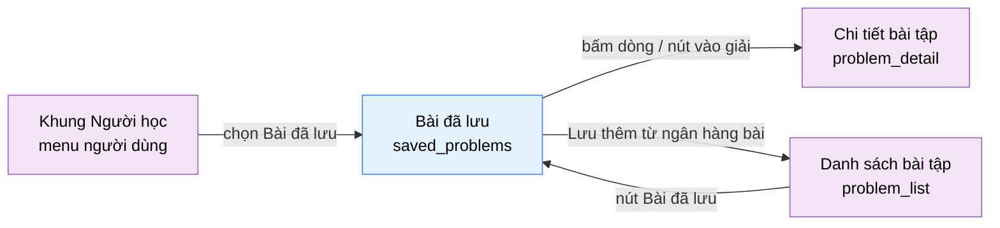

# Tài liệu thiết kế cơ bản (BD) — Bài đã lưu (`USR0103`)

## Phương châm tài liệu [Nội bộ — không cần khách duyệt]

- Viết theo **mẫu 9 sheet**. Bộ thẻ đóng, quy ước ID, ký hiệu chuẩn, ranh giới với tài liệu khác và
  checklist kiểm toán nằm ở `02-bd/_rules/bd-template-9sheet.md` — file này không chép lại.
- Phần gắn nhãn `[Nội bộ]` phục vụ sinh mã và tự kiểm toán, không phải yêu cầu của khách hàng: mục 4.5,
  mục 7.3 và các ghi chú quy ước.
- Mã màn `USR0103` theo bảng mã ở `02-bd/_rules/bd-template-9sheet.md` mục 8; tên file mang tiền tố mã.
- **Màn này là biến thể danh sách của `problem_list`.** Nguyên tắc số một khi đọc file: mọi thứ tương
  đương đều **dùng lại** quy ước đã chốt ở `02-bd/screens/users/USR0101_problem_list.md` — cùng bộ tên khối
  (`filter`, `table`, `pager`), cùng công thức ba trạng thái làm bài, cùng bộ tham số lọc trên URL, cùng
  cách suy giảm êm. Chỗ nào khác là khác thật: nguồn dữ liệu là tập bookmark của chính người học, mỗi dòng
  có ghi chú riêng tư sửa được, và có thao tác bỏ lưu.

> Đọc cùng `01-rd/screens/users/USR0103_saved_problems.md` (hành vi ở mức yêu cầu, không lặp lại ở đây),
> `02-bd/screens/users/USR0101_problem_list.md` (màn gốc của biến thể này),
> `02-bd/screens/users/_shell.md` (khung điều hướng khu Người học) và
> `02-bd/database/problem-bank.md` (bảng `bookmarks`).
>
> - **Header và chân trang không mô tả lại ở đây** — dùng chung khung khu Người học: header ngang dính
>   trên, không có thanh bên [Nguồn: 02-bd/screens/users/_shell.md:24,40-41], chân trang dùng chung
>   [Nguồn: 02-bd/screens/users/_shell.md:97-103].
> - **Màn này nằm trong menu người dùng của khung, không phải nav chính** — mục "Bài đã lưu" là một trong
>   năm mục của menu người dùng [Nguồn: 02-bd/screens/users/_shell.md:60,62-63]. Nó cũng có một lối vào
>   thứ hai từ dải chỉ số của `problem_list`
>   [Nguồn: 02-bd/screens/users/USR0101_problem_list.md:303].
> - **Không thiết kế thao tác lưu bài lần đầu ở màn này.** Màn này chỉ **bỏ lưu** và **sửa ghi chú** trên
>   bookmark đã có. Nơi tạo bookmark là `problem_detail` — xem Câu hỏi mở Q1, đây chính là câu trả lời cho
>   `USR0101` Câu hỏi mở Q7 [Nguồn: 02-bd/screens/users/USR0101_problem_list.md:606].
> - **Không thiết kế** thao tác quản trị bài toán (xuất bản, đổi độ khó, xoá). Đó là màn
>   `problem_management` của A2/A3.
> - **Không hiển thị** nội dung testcase ẩn hay diff chi tiết ở bất kỳ trạng thái nào. Màn này không đọc
>   bảng `testcases`.

---

## Sheet 1. Bìa

| Mục | Giá trị |
| :--- | :--- |
| Hệ thống | AlgoPrep |
| Phân hệ | `problem-bank` (F2), đọc thêm từ `identity` (F1) |
| Công đoạn | BD — Thiết kế cơ bản |
| Phân loại | Màn hình |
| Tên màn | Bài đã lưu |
| Mã màn hình | `USR0103` |
| Tên vật lý (slug) | `saved_problems` |
| Trục tài liệu | Màn hình (`02-bd/screens/`) |
| Actor | A1 (`STUDENT`) |
| Phiên bản | V0.1 |
| Người tạo | Nhóm phát triển AlgoPrep |
| Ngày tạo | 2026/09/22 |
| Người cập nhật | Nhóm phát triển AlgoPrep |
| Ngày cập nhật | 2026/09/22 |

---

## Sheet 2. Lịch sử sửa đổi

| Ver | Sheet bị sửa | Nội dung sửa | Ngày | Người sửa |
| :--- | :--- | :--- | :--- | :--- |
| V0.1 | Toàn bộ | Tạo mới theo mẫu 9 sheet. Kế thừa nguyên bộ quy ước của `USR0101`: tên khối `filter`/`table`/`pager`, công thức ba trạng thái làm bài từ `user_problem_best_score`, bộ tham số lọc trên URL, nguyên tắc suy giảm êm. Chốt phần đặc thù: ghi chú riêng tư sửa tại chỗ trong bảng, bỏ lưu kèm hoàn tác thay cho popup xác nhận, nhãn cảnh báo cho bài đã bị rút khỏi ngân hàng. Trả lời `USR0101` Câu hỏi mở Q7. Phát sinh 7 câu hỏi mở | 2026/09/22 | Nhóm phát triển AlgoPrep |

---

## Sheet 3. Sơ đồ chuyển màn

> [Nội bộ] Quy ước vẽ: bố trí từ trái sang phải. Màn gọi tới tô tím, màn hiện tại tô xanh nhạt, màn đích
> tô tím. Màu và `[Nguồn:]` dùng để truy vết, không phải yêu cầu của khách hàng.

### 3.1 Danh sách chuyển màn

#### Khung điều hướng Người học (menu người dùng) → Bài đã lưu

[Điều kiện mở] Mở menu người dùng trên header rồi chọn mục "Bài đã lưu"
[Nguồn: 02-bd/screens/users/_shell.md:60,62-63].

[Chế độ mở] Chế độ duyệt kèm sửa ghi chú tại chỗ. Không có chế độ sửa riêng biệt.

[Thông tin truyền] Tham số lọc trên URL nếu có (`q`, `status`, `difficulty`, `sort`, `dir`, `page`).
Không có tham số thì dùng giá trị mặc định ở Sheet 5 Khu vực B.

[Giá trị trả về] Không có.

[Khi thành công] Hiển thị dải chỉ số tập bài đã lưu, khối lọc, bảng bài đã lưu kèm ghi chú và chân bảng.

[Khi huỷ] Không có.

#### Danh sách bài tập → Bài đã lưu

[Điều kiện mở] Bấm nút "Bài đã lưu" trên dải chỉ số của `problem_list`
[Nguồn: 02-bd/screens/users/USR0101_problem_list.md:303].

[Chế độ mở] Như trên.

[Thông tin truyền] Không có. Bộ lọc của `problem_list` **không** mang theo — hai màn có bộ lọc độc lập
[Nguồn: 02-bd/screens/users/USR0101_problem_list.md:136].

[Giá trị trả về] Không có.

[Khi thành công] Mở màn `saved_problems` với bộ lọc mặc định.

[Khi huỷ] Không có.

#### Bài đã lưu → Chi tiết bài tập

[Điều kiện mở] Bấm vào một dòng trong bảng, hoặc bấm nút vào giải hiện lên khi rê chuột qua dòng đó
[Nguồn: 09-layoutBase/Bài đã lưu.dc.html:139,154-159].

[Chế độ mở] Chế độ giải bài.

[Thông tin truyền] `problem_id` của dòng được chọn.

[Giá trị trả về] Không có.

[Khi thành công] Mở màn `problem_detail` của bài được chọn.

[Khi huỷ] Còn ghi chú đang sửa chưa lưu thì hỏi xác nhận trước, xem EVT-15. Người dùng chọn ở lại thì
không chuyển màn.

#### Bài đã lưu → Danh sách bài tập

[Điều kiện mở] Bấm nút "Lưu thêm từ ngân hàng bài" ở cuối dải chỉ số
[Nguồn: 09-layoutBase/Bài đã lưu.dc.html:108].

[Chế độ mở] Chế độ duyệt, chỉ đọc.

[Thông tin truyền] Không có. Bộ lọc của màn này không mang sang.

[Giá trị trả về] Không có.

[Khi thành công] Mở màn `problem_list` với bộ lọc mặc định.

[Khi huỷ] Như mục trên — còn ghi chú chưa lưu thì hỏi xác nhận trước.

### 3.2 Sơ đồ

[Nguồn: 09-layoutBase/Bài đã lưu.dc.html:108,139,154-159;
02-bd/screens/users/_shell.md:60,62-63; 02-bd/screens/users/USR0101_problem_list.md:303]

---

## Sheet 4. Bố cục màn hình

### 4.1 Tổng quan màn

[Mục đích màn] Cho người học xem lại tập bài toán đã tự đánh dấu để quay lại, kèm ghi chú riêng tư theo
từng bài; lọc tập đó theo độ khó và theo trạng thái làm bài, sửa ghi chú tại chỗ, bỏ lưu hoặc vào giải
trực tiếp [Nguồn: 01-rd/screens/users/USR0103_saved_problems.md:16-17].

[Luồng nghiệp vụ chính]

1. **Hiển thị ban đầu**: vào màn, hệ thống đọc tham số lọc trên URL rồi tải hai nhóm dữ liệu — trang bài
   đã lưu đã lọc kèm dải chỉ số, và trạng thái làm bài theo từng bài của chính người dùng. Trong lúc chờ,
   mỗi khối hiển thị khung chờ đúng số dòng dự kiến.
2. **Lọc và tìm kiếm**: gõ từ khoá, chọn tab độ khó, chọn tab trạng thái. Mỗi lần đổi bộ lọc, trang được
   đặt về 1 và bảng được tải lại từ máy chủ; trạng thái lọc ghi vào URL.
3. **Sửa ghi chú**: bấm vào ô ghi chú của một dòng để chuyển ô đó sang chế độ nhập, sửa rồi lưu. Đây là
   thao tác ghi duy nhất thường xuyên của màn.
4. **Bỏ lưu**: bấm "Bỏ lưu" trên một dòng. Dòng biến mất ngay, kèm một thông báo có nút hoàn tác.
5. **Vào giải**: bấm một dòng hoặc nút vào giải để sang `problem_detail`.

[Người dùng] Người học đã đăng nhập (`STUDENT`). Màn này **luôn** bắt buộc đăng nhập — khác `problem_list`
(nơi câu hỏi "khách xem được không" còn mở, `USR0101` Q1): toàn bộ nội dung màn này là dữ liệu cá nhân,
không có phần nào hiển thị được cho khách `[SoT: Suy luận]`.

[Tệp liên quan] Không có. Màn này không xuất hay nhập tệp.

[Phạm vi]
- Chỉ hiển thị bookmark của **chính người dùng đăng nhập**. Không có đường nào để `INSTRUCTOR`/`ADMIN` đọc
  bookmark hay ghi chú của người khác [Nguồn: 02-bd/database/problem-bank.md:132-134].
- Thao tác ghi đúng hai loại: sửa ghi chú và bỏ lưu (kèm hoàn tác). **Không có** thao tác lưu bài mới ở
  màn này — muốn lưu thêm thì sang `problem_list` rồi vào `problem_detail`, xem Câu hỏi mở Q1.
- **Có** hiển thị bài đã bị rút xuất bản hoặc ẩn mềm, kèm nhãn cảnh báo — áp cùng cách đã xử lý ở
  `INS0202` [Nguồn: 02-bd/screens/teacher/INS0202_class_assignments.md:414,491] cho
  `DEC-2026-0830-problem-lifecycle-two-states`. Xem Câu hỏi mở Q6.
- Không có bộ lọc theo chủ đề: tập bài đã lưu nhỏ hơn hẳn ngân hàng bài, prototype cũng không có control
  nào cho chủ đề [Nguồn: 09-layoutBase/Bài đã lưu.dc.html:113-122]. Cột "Chủ đề" chỉ để đọc.
- Không hiển thị điểm theo tỉ lệ testcase (F4-13) trên từng dòng. Tỉ lệ chỉ dùng **bên trong** để suy ra
  trạng thái "Đã giải / Đang làm" (`DEC-2026-0831-partial-score-testcase-ratio`), đúng như `USR0101`.

[Quyền sử dụng]
- Xem: được, chỉ với chính chủ tài khoản.
- Thêm: không (không tạo bookmark mới ở màn này).
- Sửa: được, chỉ ghi chú của chính mình.
- Xoá: được, chỉ bookmark của chính mình (bỏ lưu).

[Số bản ghi tối đa] Bảng danh sách: 20 dòng mỗi trang, phân trang phía máy chủ — prototype không có phân
trang và minh hoạ 8 dòng [Nguồn: 09-layoutBase/Bài đã lưu.dc.html:183-192], nhưng tập bookmark không có
trần trên nên vẫn phải phân trang, xem Câu hỏi mở Q5. Dải chỉ số: đúng 3 mục
[Nguồn: 09-layoutBase/Bài đã lưu.dc.html:231-235].

### 4.2 DTO liên quan

- `SavedProblemRowDto`
- `SavedProblemsSummaryDto`

`[Suy luận]` — tên DTO do BD này đề xuất, `03-dd/api/problem-bank.md` chốt lại. Đặt tên **khác**
`ProblemListItemDto` của `USR0101` [Nguồn: 02-bd/screens/users/USR0101_problem_list.md:217] vì tập cột
khác hẳn: màn này có thêm `note` và `savedAt`, bỏ `acRate` và `hasSolutionReview`. Cũng đặt **khác** DTO
của màn quản trị, đúng quy ước "DTO khu người học đặt tên riêng"
[Nguồn: 02-bd/screens/users/USR0101_problem_list.md:223-226].

### 4.3 Bảng dữ liệu liên quan (5)

| NO | Bảng | Ghi chú |
| --: | :--- | :--- |
| 1 | `problem.bookmarks` | Bảng chủ của màn, nguồn của ghi chú và ngày lưu [Nguồn: 02-bd/database/problem-bank.md:130-134] |
| 2 | `problem.problems` | Mã, tên, độ khó, trạng thái vòng đời của bài được lưu [Nguồn: 02-bd/database/problem-bank.md:11-29] |
| 3 | `problem.topics` | Tên chủ đề hiển thị ở cột "Chủ đề" [Nguồn: 02-bd/database/problem-bank.md:37-39] |
| 4 | `problem.problem_topics` | Nối bài với chủ đề [Nguồn: 02-bd/database/problem-bank.md:37-39] |
| 5 | `identity.user_problem_best_score` | Read model, nguồn trạng thái "Đã giải / Đang làm / Chưa làm" [Nguồn: 02-bd/database/identity.md:111-112] |

Bảng cuối nằm ở schema của module khác. Màn không truy vấn thẳng: `problem-bank` gọi qua cổng ra sang
`identity`, đúng nguyên tắc mỗi schema một chủ [Nguồn: 02-bd/database/problem-bank.md:31-33] và đúng hướng
đã chọn ở `USR0101` Câu hỏi mở Q2 [Nguồn: 02-bd/screens/users/USR0101_problem_list.md:601].

Màn này **không** đọc `problem_stats` (không có cột AC rate), không đọc `judge.submissions`, không đọc
`ai.solution_reviews`.

### 4.4 Vùng bố cục

Đối chiếu `09-layoutBase/Bài đã lưu.dc.html` — bằng chứng bố cục chỉ-đọc, **không phải** design system
cuối cùng.

| Vùng | Vị trí trong prototype | Nội dung |
| :--- | :--- | :--- |
| Header ngang dính trên (khung chung Người học) | `:49-95` | Thương hiệu, nav, menu người dùng — dùng lại khung chung, không mô tả lại |
| Dải chỉ số | `:99-109` | 3 chỉ số dạng "nhãn + số + đơn vị", cùng hàng với nút "Lưu thêm từ ngân hàng bài" đẩy sang phải (`:108`) |
| Khối lọc (đầu bảng) | `:112-123` | Ô tìm kiếm (`:115`), nhóm tab độ khó 4 mục (`:118`), nhóm tab trạng thái 4 mục (`:121`) |
| Bảng danh sách | `:125-165` | 6 cột: Bài toán (mã + tên + độ khó, `:129`), Chủ đề (`:130`), Trạng thái (`:131`), Ghi chú (`:132`), Đã lưu (`:133`), cột hành động rộng cố định (`:134`) |
| Khối trạng thái rỗng | `:167-172` | Tiêu đề và câu hướng dẫn, thay cho bảng khi không có dòng nào |
| Chân bảng | `:174-177` | Dòng tóm tắt số dòng bên trái, dòng nhắc riêng tư bên phải (`:176`) |
| Chân trang (khung chung Người học) | — | Prototype này **không có** thẻ `footer`; chân trang áp theo khung chung [Nguồn: 02-bd/screens/users/_shell.md:97-103] |

Bố cục **một cột**, không có cột phụ bên phải — đây là khác biệt bố cục rõ nhất so với `problem_list`
(hai cột `minmax(0, 1fr) 268px`) [Nguồn: 02-bd/screens/users/USR0101_problem_list.md:262]. Dải chỉ số nằm
trên, phần còn lại nằm gọn trong một khung duy nhất có viền: lọc, bảng, trạng thái rỗng và chân bảng đều
là các phần của cùng một `section` (`:111-178`). Giữ nguyên cấu trúc này khi dựng Next.js; không quy định
màu sắc, khoảng cách hay typography ở BD.

Prototype hiển thị ghi chú như **văn bản chỉ đọc** trong ô bảng (`:151`), trong khi F2-13 yêu cầu ghi chú
**sửa được** [Nguồn: 01-rd/screens/users/USR0103_saved_problems.md:41]. BD chốt: ô ghi chú là ô sửa tại chỗ, xem Câu hỏi
mở Q3.

### 4.5 Cấu trúc slice FSD [Nội bộ]

| Khối | Slice dự kiến | Căn cứ |
| :--- | :--- | :--- |
| Trang | `views/users/saved-problems` | Quy ước FSD của dự án |
| Khung Người học | Dùng lại `widgets/app-shell` (biến thể `student-header`) | `02-bd/screens/users/_shell.md` mục 1 |
| Dải chỉ số | `widgets/saved-problems-summary` | Prototype `:99-109` |
| Ô tìm kiếm, tab độ khó, tab trạng thái | Dùng lại `features/problem-filter` của `USR0101` | Prototype `:112-123`; cùng bộ tham số URL nên cùng một feature, chỉ khác tập tham số bật lên |
| Bảng + chân bảng | `widgets/saved-problem-table` + dùng lại `entities/problem` | Prototype `:125-177` |
| Ô ghi chú sửa tại chỗ | `features/bookmark-note-edit` | Prototype `:151`; F2-13 |
| Bỏ lưu kèm hoàn tác | `features/bookmark-toggle` | Prototype `:156,256` |

`[Suy luận]` — ánh xạ slice do BD đề xuất, DD màn hình chốt lại. `features/bookmark-toggle` cố ý đặt tên
theo hành vi bật/tắt chứ không phải "unsave", vì chính slice đó sẽ được `problem_detail` dùng lại cho
thao tác lưu (xem Câu hỏi mở Q1) — viết hai slice cho hai chiều của cùng một cờ là lãng phí.
`entities/problem` phải là component nhận dữ liệu từ ngoài, không tự gọi API — ràng buộc này đã đặt ở
`USR0101` [Nguồn: 02-bd/screens/users/USR0101_problem_list.md:282-283], màn này là lý do nó tồn tại.

> [Nội bộ] Ảnh minh hoạ đặt ở `08-diagram/02-bd/screens/users/`, chụp bằng Playwright trên ứng dụng
> Next.js thật khi đã có mã chạy được. Chưa có thì tham chiếu prototype, không vẽ tay.

---

## Sheet 5. Danh sách item màn hình

> Quy ước ID, bộ thẻ và giá trị chuẩn: `02-bd/_rules/bd-template-9sheet.md` mục 2, 3, 4.
>
> **Ba trạng thái làm bài dùng chung một công thức với `USR0101`**, không định nghĩa lại: không có dòng
> `user_problem_best_score` thành "Chưa làm"; có dòng và `best_verdict = ACCEPTED` thành "Đã giải"; có
> dòng mà khác `ACCEPTED` thành "Đang làm"
> [Nguồn: 02-bd/screens/users/USR0101_problem_list.md:332; 02-bd/database/identity.md:111-112].
> Prototype màn này dùng câu chữ khác ("CHƯA GIẢI / ĐANG DỞ / SOLVED",
> [Nguồn: 09-layoutBase/Bài đã lưu.dc.html:219]) — BD **thống nhất theo nhãn của `USR0101`** để hai màn
> không nói hai kiểu về cùng một trạng thái `[SoT: Suy luận]`.

### Khu vực A — Dải chỉ số tập bài đã lưu

| Khu vực | NO | Tên item | ID item | Bảng DB | Cột DB | Loại UI | Kiểu | Độ dài | Bắt buộc | I/O | Giá trị mặc định | Định dạng | Ghi chú |
| :--- | --: | :--- | :--- | :--- | :--- | :--- | :--- | :--- | :-: | :-: | :--- | :--- | :--- |
| Dải chỉ số tập bài đã lưu | | | | | | | | | | | | | |
| | 1 | Tổng số đã lưu | `savedProblems.summary.savedTotal` | `problem.bookmarks` | `user_id` | Label | Number | - | - | O | `0` | `{số} bài` | Tổng số bookmark còn hiệu lực của chính người dùng [Công thức] Đếm dòng `bookmarks` của người dùng đăng nhập; **không** chịu ảnh hưởng của bộ lọc đang áp dụng [Nguồn: 09-layoutBase/Bài đã lưu.dc.html:212,232] [EVT liên quan] EVT-1, EVT-11, EVT-12 |
| | 2 | Chưa bắt đầu | `savedProblems.summary.todoCount` | `problem.bookmarks`, `identity.user_problem_best_score` | `problem_id`, `best_verdict` | Label | Number | - | - | O | `0` | `{số}` | Số bài đã lưu mà người học chưa nộp lần nào [Công thức] Đếm bookmark có trạng thái làm bài "Chưa làm" theo công thức ba trạng thái ở đầu Sheet 5 [Nguồn: 09-layoutBase/Bài đã lưu.dc.html:233] [EVT liên quan] EVT-1, EVT-11, EVT-12 |
| | 3 | Đang dở | `savedProblems.summary.attemptedCount` | `problem.bookmarks`, `identity.user_problem_best_score` | `problem_id`, `best_verdict` | Label | Number | - | - | O | `0` | `{số}` | Số bài đã lưu đang ở trạng thái "Đang làm" [Công thức] Như NO 2, lấy nhánh "Đang làm" [Nguồn: 09-layoutBase/Bài đã lưu.dc.html:234] [EVT liên quan] EVT-1, EVT-11, EVT-12 |
| | 4 | Lưu thêm từ ngân hàng bài | `savedProblems.summary.linkProblemList` | - | - | Button | - | - | - | I | - | - | Điều hướng sang màn `problem_list` để tìm bài mới mà lưu [Nguồn giá trị] Nhãn tĩnh i18n [Nguồn: 09-layoutBase/Bài đã lưu.dc.html:108] [EVT liên quan] EVT-14 |

### Khu vực B — Bộ lọc

| Khu vực | NO | Tên item | ID item | Bảng DB | Cột DB | Loại UI | Kiểu | Độ dài | Bắt buộc | I/O | Giá trị mặc định | Định dạng | Ghi chú |
| :--- | --: | :--- | :--- | :--- | :--- | :--- | :--- | :--- | :-: | :-: | :--- | :--- | :--- |
| Bộ lọc | | | | | | | | | | | | | |
| | 1 | Ô tìm kiếm | `savedProblems.filter.query` | `problem.problems` | `code`, `title` | TextBox | String | 100 | - | I/O | rỗng | - | Tìm trong tập bài đã lưu theo tên bài hoặc mã bài [Nguồn giá trị] Tham số URL `q`; không có thì rỗng. Gợi ý trong ô là nhãn tĩnh i18n "Tìm trong bài đã lưu" [Nguồn: 09-layoutBase/Bài đã lưu.dc.html:239] [EVT liên quan] EVT-2 |
| | 2 | Tab độ khó | `savedProblems.filter.difficultyTabs` | `problem.problems` | `difficulty` | List | Enum | - | - | I/O | `Tất cả` | - | 4 tab: Tất cả / Dễ / Trung bình / Khó [Nguồn: 09-layoutBase/Bài đã lưu.dc.html:240] [Nguồn giá trị] Nhãn tĩnh i18n map từ enum `EASY`/`MEDIUM`/`HARD` [Nguồn: 02-bd/database/problem-bank.md:17]; giá trị đang chọn lấy từ tham số URL `difficulty` [EVT liên quan] EVT-3 |
| | 3 | Tab trạng thái | `savedProblems.filter.statusTabs` | `identity.user_problem_best_score` | `best_verdict` | List | Enum | - | - | I/O | `Tất cả` | - | 4 tab: Tất cả / Đã giải / Đang làm / Chưa làm — cùng tập giá trị và cùng nhãn với `USR0101` [Nguồn: 02-bd/screens/users/USR0101_problem_list.md:321], không dùng câu chữ riêng của prototype [Nguồn: 09-layoutBase/Bài đã lưu.dc.html:242] [Nguồn giá trị] Nhãn tĩnh i18n; giá trị đang chọn lấy từ tham số URL `status` [EVT liên quan] EVT-4 |
| | 4 | Xoá bộ lọc | `savedProblems.filter.linkReset` | - | - | Link | - | - | - | I | - | - | Đưa cả 3 bộ lọc về mặc định. Chỉ xuất hiện ở trạng thái không có kết quả **do lọc** [Nguồn giá trị] Nhãn tĩnh i18n [EVT liên quan] EVT-7 |

### Khu vực C — Bảng bài đã lưu

| Khu vực | NO | Tên item | ID item | Bảng DB | Cột DB | Loại UI | Kiểu | Độ dài | Bắt buộc | I/O | Giá trị mặc định | Định dạng | Ghi chú |
| :--- | --: | :--- | :--- | :--- | :--- | :--- | :--- | :--- | :-: | :-: | :--- | :--- | :--- |
| Bảng bài đã lưu | | | | | | | | | | | | | |
| | 1 | Danh sách bài đã lưu | `savedProblems.table.list` | `problem.bookmarks` | - | List | List | - | - | O | rỗng | - | Bảng bookmark của chính người dùng, 20 dòng mỗi trang [Nguồn giá trị] Kết quả gọi `ListMySavedProblems` [EVT liên quan] EVT-1 |
| | 2 | Mã bài | `savedProblems.table.col.code` | `problem.problems` | `code` | ListColumn | String | 40 | - | O | - | - | Mã ngắn hiển thị của bài toán [Nguồn giá trị] Cột `code` [Nguồn: 02-bd/database/problem-bank.md:14]; prototype hiển thị ở đầu ô "Bài toán" [Nguồn: 09-layoutBase/Bài đã lưu.dc.html:142] [EVT liên quan] - |
| | 3 | Tên bài | `savedProblems.table.col.title` | `problem.problems` | `title` | ListColumn | String | 200 | - | O | - | - | Tiêu đề bài toán [Nguồn giá trị] Cột `title` [Nguồn: 02-bd/database/problem-bank.md:15; 09-layoutBase/Bài đã lưu.dc.html:143] [EVT liên quan] EVT-13 |
| | 4 | Độ khó | `savedProblems.table.col.difficulty` | `problem.problems` | `difficulty` | ListColumn | Enum | - | - | O | - | Nhãn tiếng Việt | Mức độ khó, hiển thị ngay cạnh tên bài chứ không phải cột riêng [Nguồn: 09-layoutBase/Bài đã lưu.dc.html:144] [Nguồn giá trị] `EASY` thành "Dễ", `MEDIUM` thành "Trung bình", `HARD` thành "Khó" [Nguồn: 02-bd/database/problem-bank.md:17] [EVT liên quan] - |
| | 5 | Nhãn đã rút khỏi ngân hàng | `savedProblems.table.col.withdrawnBadge` | `problem.problems` | `status`, `deleted` | Badge | Boolean | - | - | O | Ẩn | - | Cảnh báo bài đã lưu nhưng nay không còn truy cập được [Công thức] Hiện khi `status = UNPUBLISHED` **hoặc** `deleted = true` [Nguồn: 02-bd/database/problem-bank.md:18-19]; cùng cách xử lý đã áp ở `INS0202` [Nguồn: 02-bd/screens/teacher/INS0202_class_assignments.md:414]. Xem Câu hỏi mở Q6 [EVT liên quan] - |
| | 6 | Chủ đề | `savedProblems.table.col.topics` | `problem.topics` | `name` | ListColumn | String | - | - | O | `-` | - | Chủ đề của bài toán, chỉ đọc, không lọc được [Nguồn giá trị] `topics.name` qua `problem_topics.problem_id`; nhiều chủ đề thì nối bằng dấu phẩy, cùng cách đã dùng ở `USR0101` [Nguồn: 02-bd/screens/users/USR0101_problem_list.md:337; 09-layoutBase/Bài đã lưu.dc.html:147] [EVT liên quan] - |
| | 7 | Trạng thái làm bài | `savedProblems.table.col.solveState` | `identity.user_problem_best_score` | `best_verdict` | Badge | Enum | - | - | O | `Chưa làm` | - | Ba trạng thái: Đã giải / Đang làm / Chưa làm [Công thức] Công thức ba trạng thái ghi ở đầu Sheet 5 [Nguồn: 02-bd/database/identity.md:111-112; 09-layoutBase/Bài đã lưu.dc.html:149] [EVT liên quan] - |
| | 8 | Ghi chú riêng tư | `savedProblems.table.col.note` | `problem.bookmarks` | `note` | TextArea | String | 1000 | - | I/O | rỗng | - | Ghi chú tự do của người học cho bài đó, **riêng tư tuyệt đối**, sửa tại chỗ trong bảng [Nguồn: 01-rd/req/problem-bank.md:57-61] [Nguồn giá trị] Cột `bookmarks.note` [Nguồn: 02-bd/database/problem-bank.md:132]; rỗng thì hiển thị dấu gạch ngang [Nguồn: 09-layoutBase/Bài đã lưu.dc.html:247]. Giới hạn 1000 ký tự là đề xuất của BD, xem Câu hỏi mở Q4 [EVT liên quan] EVT-8, EVT-9, EVT-10 |
| | 9 | Ngày lưu | `savedProblems.table.col.savedAt` | `problem.bookmarks` | `created_at` | ListColumn | Date | - | - | O | - | `dd/MM` | Ngày người học đánh dấu bài này [Nguồn giá trị] Cột `bookmarks.created_at` [Nguồn: 02-bd/database/problem-bank.md:132], **không phải** `updated_at` — sửa ghi chú không được làm đổi ngày lưu [Nguồn: 09-layoutBase/Bài đã lưu.dc.html:152] [EVT liên quan] EVT-5 |
| | 10 | Nút Bỏ lưu | `savedProblems.table.col.btnUnsave` | - | - | Button | - | - | - | I | - | - | Xoá bookmark của dòng đang trỏ. Chỉ hiện khi rê chuột qua dòng [Nguồn: 09-layoutBase/Bài đã lưu.dc.html:154-156] [Nguồn giá trị] Nhãn tĩnh i18n "Bỏ lưu" [EVT liên quan] EVT-11 |
| | 11 | Nút vào giải | `savedProblems.table.col.btnSolve` | `identity.user_problem_best_score` | `best_verdict` | Button | - | - | - | I | - | - | Mở `problem_detail` của dòng đang trỏ. Chỉ hiện khi rê chuột qua dòng [Công thức] Nhãn đổi theo trạng thái làm bài: "Đã giải" thành "Xem lại", "Đang làm" thành "Làm tiếp", "Chưa làm" thành "Giải" [Nguồn: 09-layoutBase/Bài đã lưu.dc.html:251] [EVT liên quan] EVT-13 |
| | 12 | Tiêu đề trạng thái rỗng | `savedProblems.table.emptyTitle` | - | - | Label | String | - | - | O | - | - | Câu tiêu đề thay cho bảng khi không có dòng nào [Công thức] Có bookmark nhưng bộ lọc không khớp thì dùng nhãn tĩnh "Không có bài nào khớp bộ lọc"; chưa lưu bài nào thì dùng nhãn tĩnh "Bạn chưa lưu bài nào" [Nguồn: 09-layoutBase/Bài đã lưu.dc.html:260] [EVT liên quan] EVT-1 |
| | 13 | Câu hướng dẫn trạng thái rỗng | `savedProblems.table.emptyNote` | - | - | Label | String | - | - | O | - | - | Câu phụ gợi hành động kế tiếp [Công thức] Trường hợp lọc không khớp dùng nhãn tĩnh "Bỏ một bộ lọc, hoặc lưu thêm bài từ ngân hàng bài toán." [Nguồn: 09-layoutBase/Bài đã lưu.dc.html:261]; trường hợp chưa lưu bài nào dùng nhãn tĩnh hướng dẫn lưu bài từ màn `problem_detail` [EVT liên quan] EVT-1 |

### Khu vực D — Chân bảng

| Khu vực | NO | Tên item | ID item | Bảng DB | Cột DB | Loại UI | Kiểu | Độ dài | Bắt buộc | I/O | Giá trị mặc định | Định dạng | Ghi chú |
| :--- | --: | :--- | :--- | :--- | :--- | :--- | :--- | :--- | :-: | :-: | :--- | :--- | :--- |
| Chân bảng | | | | | | | | | | | | | |
| | 1 | Tóm tắt kết quả | `savedProblems.pager.summary` | - | - | Label | String | - | - | O | - | `{khớp} / {tổng} bài đã lưu` | Dòng tóm tắt số dòng khớp bộ lọc trên tổng số bookmark [Công thức] Tử số là tổng số dòng khớp bộ lọc, mẫu số là Khu vực A NO 1 [Nguồn: 09-layoutBase/Bài đã lưu.dc.html:262-264] [EVT liên quan] EVT-6 |
| | 2 | Nút số trang | `savedProblems.pager.pageButtons` | - | - | List | Number | - | - | I/O | `1` | Số nguyên | Danh sách số trang, trang đang xem được làm nổi [Công thức] Số trang bằng tổng số dòng khớp bộ lọc chia 20, làm tròn lên, tối thiểu 1. Prototype không có phân trang, xem Câu hỏi mở Q5 [EVT liên quan] EVT-6 |
| | 3 | Dòng nhắc riêng tư | `savedProblems.pager.privacyNote` | - | - | Label | String | - | - | O | - | - | Câu nhắc "Bài đã lưu chỉ hiển thị với bạn." [Nguồn giá trị] Nhãn tĩnh i18n [Nguồn: 09-layoutBase/Bài đã lưu.dc.html:176]; đúng mức riêng tư đã chốt ở RD [Nguồn: 01-rd/screens/users/USR0103_saved_problems.md:44] [EVT liên quan] - |

### Khu vực E — Thông báo hoàn tác bỏ lưu

| Khu vực | NO | Tên item | ID item | Bảng DB | Cột DB | Loại UI | Kiểu | Độ dài | Bắt buộc | I/O | Giá trị mặc định | Định dạng | Ghi chú |
| :--- | --: | :--- | :--- | :--- | :--- | :--- | :--- | :--- | :-: | :-: | :--- | :--- | :--- |
| Thông báo hoàn tác bỏ lưu | | | | | | | | | | | | | |
| | 1 | Câu thông báo | `savedProblems.undoNotice.message` | - | - | Label | String | - | - | O | - | - | Câu xác nhận đã bỏ lưu, kèm tên bài [Nguồn giá trị] Nhãn tĩnh i18n ghép với `savedProblems.table.col.title` của dòng vừa bỏ [EVT liên quan] EVT-11 |
| | 2 | Nút Hoàn tác | `savedProblems.undoNotice.btnUndo` | `problem.bookmarks` | `note` | Button | - | - | - | I | - | - | Tạo lại bookmark vừa bỏ **kèm nguyên ghi chú cũ** [Nguồn giá trị] Nhãn tĩnh i18n; ghi chú cũ giữ ở bộ nhớ tạm của màn cho tới khi thông báo tắt [EVT liên quan] EVT-12 |

### Khu vực F — Hỏi xác nhận rời màn

| Khu vực | NO | Tên item | ID item | Bảng DB | Cột DB | Loại UI | Kiểu | Độ dài | Bắt buộc | I/O | Giá trị mặc định | Định dạng | Ghi chú |
| :--- | --: | :--- | :--- | :--- | :--- | :--- | :--- | :--- | :-: | :-: | :--- | :--- | :--- |
| Hỏi xác nhận rời màn | | | | | | | | | | | | | |
| | 1 | Hộp xác nhận | `savedProblems.leaveGuard.dialog` | - | - | Popup | - | - | - | O | Ẩn | - | Hộp cảnh báo còn ghi chú đang sửa chưa lưu [Nguồn giá trị] Nhãn tĩnh i18n [EVT liên quan] EVT-15 |
| | 2 | Nút Ở lại | `savedProblems.leaveGuard.btnStay` | - | - | Button | - | - | - | I | - | - | Đóng hộp, giữ nguyên ô ghi chú đang sửa [Nguồn giá trị] Nhãn tĩnh i18n [EVT liên quan] EVT-15 |
| | 3 | Nút Rời đi | `savedProblems.leaveGuard.btnLeave` | - | - | Button | - | - | - | I | - | - | Bỏ nội dung đang sửa và tiếp tục điều hướng [Nguồn giá trị] Nhãn tĩnh i18n [EVT liên quan] EVT-15 |

[Nguồn: 09-layoutBase/Bài đã lưu.dc.html:99-109,112-123,125-165,167-172,174-177,212,219,231-235,239-243,247,251,260-264;
02-bd/database/problem-bank.md:11-29,37-39,130-134; 02-bd/database/identity.md:111-112;
01-rd/screens/users/USR0103_saved_problems.md:16-17,44]

---

## Sheet 6. Đặc tả điều khiển item

> Ký hiệu cột `Hiển thị` và thứ tự thẻ: `02-bd/_rules/bd-template-9sheet.md` mục 2, 3. Dùng đúng NO, tên
> item và thứ tự của Sheet 5. Lỗi nhập liệu ghi ở Sheet 9, xử lý nghiệp vụ ghi ở Sheet 8.

### Khu vực A — Dải chỉ số tập bài đã lưu

| Khu vực | NO | Tên item | Hiển thị | Ghi chú |
| :--- | --: | :--- | :-: | :--- |
| Dải chỉ số tập bài đã lưu | | | | |
| | 1 | Tổng số đã lưu | Có | [Điều kiện hiển thị] Trong lúc tải hiển thị khung chờ đúng 3 ô chỉ số. [Tự động đặt] **Không** tính lại khi đổi bộ lọc — đây là chỉ số của cả tập bookmark. Giảm 1 ngay khi bỏ lưu thành công và tăng lại khi hoàn tác. |
| | 2 | Chưa bắt đầu | Điều kiện | [Điều kiện hiển thị] Ẩn riêng ô này khi không lấy được trạng thái làm bài từ `identity`; dải chỉ số vẫn hiển thị ô NO 1. [Tự động đặt] Như NO 1. |
| | 3 | Đang dở | Điều kiện | [Điều kiện hiển thị] Như NO 2. [Tự động đặt] Như NO 1. |
| | 4 | Lưu thêm từ ngân hàng bài | Có | [Điều kiện kích hoạt] Luôn kích hoạt, kể cả khi bảng đang tải hoặc tập bài đã lưu rỗng — đây là lối thoát duy nhất của trạng thái rỗng. |

### Khu vực B — Bộ lọc

| Khu vực | NO | Tên item | Hiển thị | Ghi chú |
| :--- | --: | :--- | :-: | :--- |
| Bộ lọc | | | | |
| | 1 | Ô tìm kiếm | Có | [Điều kiện kích hoạt] Luôn kích hoạt, kể cả khi bảng đang tải. [Tự động đặt] Nhận giá trị ban đầu từ tham số URL `q`. Gõ xong dừng 400 ms mới gọi máy chủ, không gọi theo từng ký tự — cùng ngưỡng với `USR0101`. |
| | 2 | Tab độ khó | Có | [Điều kiện kích hoạt] Không kích hoạt trong lúc bảng đang tải. [Tự động đặt] Tab ứng với tham số URL `difficulty` được làm nổi; giá trị lạ thì về "Tất cả". |
| | 3 | Tab trạng thái | Điều kiện | [Điều kiện hiển thị] Ẩn cả nhóm tab khi không lấy được trạng thái làm bài từ `identity` — lọc theo một dữ liệu không có là bẫy người dùng. [Điều kiện kích hoạt] Không kích hoạt trong lúc bảng đang tải. [Tự động đặt] Tab ứng với tham số URL `status` được làm nổi. |
| | 4 | Xoá bộ lọc | Điều kiện | [Điều kiện hiển thị] Chỉ hiển thị khi bảng rỗng **và** đang có ít nhất một bộ lọc khác mặc định. Tập bookmark rỗng thật thì không hiển thị, vì xoá bộ lọc không giúp được gì. |

### Khu vực C — Bảng bài đã lưu

| Khu vực | NO | Tên item | Hiển thị | Ghi chú |
| :--- | --: | :--- | :-: | :--- |
| Bảng bài đã lưu | | | | |
| | 1 | Danh sách bài đã lưu | Điều kiện | [Điều kiện hiển thị] Trong lúc tải hiển thị khung chờ đúng 8 dòng. Tải xong mà không có dòng nào thì thay bảng bằng khối trạng thái rỗng (NO 12, NO 13). Tải lỗi thì hiển thị thông báo lỗi kèm nút thử lại, giữ nguyên bộ lọc. |
| | 2 | Mã bài | Có | - |
| | 3 | Tên bài | Có | - |
| | 4 | Độ khó | Có | - |
| | 5 | Nhãn đã rút khỏi ngân hàng | Điều kiện | [Điều kiện hiển thị] Chỉ hiển thị khi bài đã bị rút xuất bản hoặc ẩn mềm. Dòng vẫn ở nguyên trong bảng, không bị giấu — giấu đi sẽ khiến người học tưởng mình đã bỏ lưu nhầm. |
| | 6 | Chủ đề | Có | - |
| | 7 | Trạng thái làm bài | Điều kiện | [Điều kiện hiển thị] Chỉ hiển thị khi lấy được trạng thái theo người dùng. Không lấy được thì ẩn ô trạng thái trên mọi dòng và bảng vẫn hiển thị bình thường, xem EVT-1. |
| | 8 | Ghi chú riêng tư | Có | [Điều kiện hiển thị] Mặc định hiển thị dạng văn bản một dòng, cắt bớt khi quá dài; bấm vào thì đổi thành ô nhập nhiều dòng ngay tại chỗ. [Điều kiện kích hoạt] Không kích hoạt trong lúc chính dòng đó đang lưu ghi chú, và không kích hoạt trên dòng có nhãn đã rút khỏi ngân hàng (bookmark vẫn còn nhưng không còn nội dung để ghi chú thêm). [Tự động đặt] Đang mở ô nhập ở một dòng mà bấm sang dòng khác thì lưu dòng đang mở trước, rồi mới mở dòng mới. |
| | 9 | Ngày lưu | Có | [Điều kiện kích hoạt] Tiêu đề cột bấm được để đổi chiều sắp xếp; không kích hoạt trong lúc bảng đang tải. Đây là cột sắp xếp được **duy nhất** của màn. |
| | 10 | Nút Bỏ lưu | Điều kiện | [Điều kiện hiển thị] Chỉ hiển thị trên dòng đang được rê chuột hoặc đang nhận tiêu điểm bàn phím [Nguồn: 09-layoutBase/Bài đã lưu.dc.html:154]. Không dùng chuột được thì vẫn tới được bằng bàn phím. [Điều kiện kích hoạt] Không kích hoạt khi dòng đó đang có yêu cầu bỏ lưu chưa trả lời. |
| | 11 | Nút vào giải | Điều kiện | [Điều kiện hiển thị] Như NO 10. [Điều kiện kích hoạt] **Không kích hoạt** khi dòng có nhãn đã rút khỏi ngân hàng — bài không còn truy cập được thì mở ra chỉ để nhận lỗi. |
| | 12 | Tiêu đề trạng thái rỗng | Điều kiện | [Điều kiện hiển thị] Chỉ hiển thị khi tải xong và không có dòng nào [Nguồn: 09-layoutBase/Bài đã lưu.dc.html:167]. |
| | 13 | Câu hướng dẫn trạng thái rỗng | Điều kiện | [Điều kiện hiển thị] Như NO 12. |

### Khu vực D — Chân bảng

| Khu vực | NO | Tên item | Hiển thị | Ghi chú |
| :--- | --: | :--- | :-: | :--- |
| Chân bảng | | | | |
| | 1 | Tóm tắt kết quả | Có | [Tự động đặt] Cập nhật sau mỗi lần tải bảng, sau khi bỏ lưu và sau khi hoàn tác. |
| | 2 | Nút số trang | Điều kiện | [Điều kiện hiển thị] Chỉ hiển thị khi có từ 2 trang trở lên — với đa số người học thì khối này không bao giờ xuất hiện. [Điều kiện kích hoạt] Nút của trang đang xem không kích hoạt. |
| | 3 | Dòng nhắc riêng tư | Có | [Điều kiện hiển thị] Hiển thị ở mọi trạng thái, kể cả trạng thái rỗng — nó nói về cả danh sách, không về một dòng nào. |

### Khu vực E — Thông báo hoàn tác bỏ lưu

| Khu vực | NO | Tên item | Hiển thị | Ghi chú |
| :--- | --: | :--- | :-: | :--- |
| Thông báo hoàn tác bỏ lưu | | | | |
| | 1 | Câu thông báo | Điều kiện | [Điều kiện hiển thị] Chỉ hiển thị sau khi bỏ lưu thành công, tự tắt sau 8 giây hoặc khi người dùng bỏ lưu bài tiếp theo. [Tự động đặt] Bỏ lưu bài thứ hai khi thông báo cũ còn hiện thì thông báo cũ bị thay, và cơ hội hoàn tác bài thứ nhất mất — nêu rõ ở Sheet 9 NO 7. |
| | 2 | Nút Hoàn tác | Điều kiện | [Điều kiện hiển thị] Như NO 1. [Điều kiện kích hoạt] Không kích hoạt sau khi đã bấm một lần, cho tới khi có phản hồi. |

### Khu vực F — Hỏi xác nhận rời màn

| Khu vực | NO | Tên item | Hiển thị | Ghi chú |
| :--- | --: | :--- | :-: | :--- |
| Hỏi xác nhận rời màn | | | | |
| | 1 | Hộp xác nhận | Điều kiện | [Điều kiện hiển thị] Chỉ hiển thị khi đang có ít nhất một ô ghi chú mở ở chế độ nhập **và** nội dung khác giá trị đã lưu, tại đúng lúc người dùng kích hoạt một đường rời màn. Không có thay đổi thì rời màn thẳng, không hỏi. |
| | 2 | Nút Ở lại | Có | [Điều kiện kích hoạt] Luôn kích hoạt khi hộp đang mở. |
| | 3 | Nút Rời đi | Có | [Điều kiện kích hoạt] Luôn kích hoạt khi hộp đang mở. |

[Nguồn: 09-layoutBase/Bài đã lưu.dc.html:154,167,183-192; 02-bd/database/problem-bank.md:18-19]

---

## Sheet 7. Danh sách truyền dữ liệu

### 7.1 Trường DTO

| NO | DTO | Trường DTO | Kiểu | Bảng DB | Cột DB | Item màn | Hiển thị | Ghi chú |
| --: | :--- | :--- | :--- | :--- | :--- | :--- | :-: | :--- |
| 1 | `SavedProblemRowDto` | `problemId` | UUID | `problem.bookmarks` | `problem_id` | - | Không | [Nguồn] Phản hồi của `ListMySavedProblems` [Đích] Tham số điều hướng sang `problem_detail`, và khoá của mọi thao tác ghi trên dòng. |
| 2 | `SavedProblemRowDto` | `code` | String | `problem.problems` | `code` | Bảng "Mã bài" | Có | - |
| 3 | `SavedProblemRowDto` | `title` | String | `problem.problems` | `title` | Bảng "Tên bài" | Có | - |
| 4 | `SavedProblemRowDto` | `difficulty` | Enum | `problem.problems` | `difficulty` | Bảng "Độ khó", tab độ khó | Có | [Chuyển đổi] `EASY`/`MEDIUM`/`HARD` thành "Dễ"/"Trung bình"/"Khó". |
| 5 | `SavedProblemRowDto` | `topicNames` | List\<String\> | `problem.topics` | `name` | Bảng "Chủ đề" | Có | [Nguồn] `topics.name` qua `problem_topics.problem_id` [Chuyển đổi] Nối bằng dấu phẩy khi hiển thị. |
| 6 | `SavedProblemRowDto` | `solveState` | Enum | `identity.user_problem_best_score` | `best_verdict` | Bảng "Trạng thái làm bài", tab trạng thái, nhãn nút vào giải | Có | [Nguồn] `problem-bank` gọi cổng ra sang `identity` (`ListMyProblemSolveStates`), không đọc thẳng schema khác — dùng lại đúng cổng ra đã đề xuất ở `USR0101` [Nguồn: 02-bd/screens/users/USR0101_problem_list.md:601] [Chuyển đổi] `SOLVED`/`ATTEMPTED`/`UNSOLVED` thành "Đã giải"/"Đang làm"/"Chưa làm". |
| 7 | `SavedProblemRowDto` | `note` | String | `problem.bookmarks` | `note` | Bảng "Ghi chú riêng tư" | Có | [Nguồn] Chỉ trả về cho chính chủ tài khoản [Chuyển đổi] `NULL` trả về chuỗi rỗng; màn hiển thị dấu gạch ngang. |
| 8 | `SavedProblemRowDto` | `savedAt` | Date | `problem.bookmarks` | `created_at` | Bảng "Ngày lưu" | Có | [Chuyển đổi] Trả mốc thời gian đầy đủ, màn hiển thị rút gọn `dd/MM`. Không dùng `updated_at`. |
| 9 | `SavedProblemRowDto` | `withdrawn` | Boolean | `problem.problems` | `status`, `deleted` | Bảng "Nhãn đã rút khỏi ngân hàng" | Có | [Chuyển đổi] `true` khi `status = UNPUBLISHED` hoặc `deleted = true`. Máy chủ tính sẵn, **không** trả hai cột thô ra ngoài — trạng thái vòng đời của bài không phải thông tin của người học. |
| 10 | `SavedProblemsSummaryDto` | `savedTotal` | Number | `problem.bookmarks` | `user_id` | Dải chỉ số "Tổng số đã lưu" | Có | [Nguồn] Trả kèm trong phản hồi của `ListMySavedProblems`, tính trên **toàn bộ** tập bookmark chứ không trên tập đã lọc. |
| 11 | `SavedProblemsSummaryDto` | `todoCount`, `attemptedCount` | Number | `identity.user_problem_best_score` | `best_verdict` | Dải chỉ số "Chưa bắt đầu", "Đang dở" | Có | [Nguồn] Cùng lời gọi NO 10 [Chuyển đổi] Gọi `identity` thất bại thì trả `null`, màn ẩn riêng hai ô này. |
| 12 | `SavedProblemsSummaryDto` | `filteredTotal` | Number | - | - | Chân bảng "Tóm tắt kết quả", "Nút số trang" | Có | [Nguồn] Tổng số dòng khớp bộ lọc, dùng cho cả dòng tóm tắt lẫn việc tính số trang. |

### 7.2 Truy cập bảng dữ liệu (5)

| NO | Tên logic | Bảng | Repository | CRUD | Mục đích | Ghi chú |
| --: | :--- | :--- | :--- | :-: | :--- | :--- |
| 1 | Bài đã lưu | `problem.bookmarks` | `BookmarkRepository` | C/R/U/D | Đọc trang bài đã lưu, ghi ghi chú, tạo lại khi hoàn tác, xoá khi bỏ lưu | `ListMySavedProblems`: R `SaveMyBookmark`: C khi hoàn tác, U khi sửa ghi chú (một lệnh upsert) `RemoveMyBookmark`: D — xoá thật, bảng không có cột ẩn mềm [Nguồn: 02-bd/database/problem-bank.md:132] |
| 2 | Bài toán | `problem.problems` | `ProblemRepository` | R | Lấy mã, tên, độ khó và trạng thái vòng đời của bài được lưu | `ListMySavedProblems`: R |
| 3 | Chủ đề | `problem.topics` | `TopicRepository` | R | Lấy tên chủ đề cho cột "Chủ đề" | `ListMySavedProblems`: R |
| 4 | Gán chủ đề cho bài | `problem.problem_topics` | `ProblemTopicRepository` | R | Nối bài với chủ đề | `ListMySavedProblems`: R |
| 5 | Tiến độ theo bài của người dùng | `identity.user_problem_best_score` | `UserProblemBestScoreRepository` (module `identity`) | R | Suy ra trạng thái Đã giải / Đang làm / Chưa làm và hai ô chỉ số | `ListMyProblemSolveStates`: R — gọi qua cổng ra, `problem-bank` không đọc thẳng schema `identity` |

Khác `USR0101` ở đúng một điểm về CRUD: màn này **có thao tác ghi**, và toàn bộ thao tác ghi chỉ chạm
**một** bảng là `bookmarks`. Bốn bảng còn lại chỉ đọc.

`[Suy luận]` — tên repository do BD này đề xuất, DD module chốt lại.

### 7.3 Danh sách endpoint [Nội bộ]

> Chỉ tên nghiệp vụ và BC sở hữu. Hợp đồng chi tiết thuộc `03-dd/api/<module>.md`.

| NO | Endpoint (tên nghiệp vụ) | Mục đích | BC sở hữu |
| --: | :--- | :--- | :--- |
| 1 | `ListMySavedProblems` | Tìm kiếm, lọc, sắp xếp và phân trang tập bài đã lưu của chính người dùng, kèm ba chỉ số tóm tắt | `problem-bank` |
| 2 | `SaveMyBookmark` | Tạo hoặc cập nhật bookmark của chính người dùng kèm ghi chú (một lệnh upsert) | `problem-bank` |
| 3 | `RemoveMyBookmark` | Xoá bookmark của chính người dùng | `problem-bank` |
| 4 | `ListMyProblemSolveStates` | Trả trạng thái Đã giải / Đang làm theo từng bài của chính người dùng | `identity` |

Ghi chú ranh giới:
- **Chỉ có 4 endpoint, không có endpoint riêng cho dải chỉ số.** Ba chỉ số tóm tắt đi kèm phản hồi của
  `ListMySavedProblems` vì chúng tính trên cùng tập dữ liệu mà lời gọi đó vốn đã phải quét. Tách thành
  `GetMySavedProblemsSummary` sẽ thêm một vòng gọi mạng cho đúng ba con số `[SoT: Suy luận]`.
- **`SaveMyBookmark` là một lệnh upsert dùng chung cho ba việc**: lưu bài lần đầu (ở `problem_detail`),
  sửa ghi chú (màn này), và tạo lại khi hoàn tác (màn này). Khoá là `(user_id, problem_id)`, đúng khoá
  chính của bảng [Nguồn: 02-bd/database/problem-bank.md:133], nên ba việc là cùng một phép ghi. Viết ba
  endpoint cho một phép ghi sẽ đẻ ra ba nhánh kiểm quyền phải giữ đồng bộ.
- **`ListMyProblemSolveStates` dùng lại nguyên endpoint của `USR0101`**
  [Nguồn: 02-bd/screens/users/USR0101_problem_list.md:521], không đặt tên mới. Cùng dữ liệu, cùng phạm vi,
  cùng chủ sở hữu.
- **Tiền tố `My` nghĩa là phạm vi khoá cứng theo người dùng đăng nhập**, không nhận `user_id` làm tham số
  — quy ước chung của khu Người học [Nguồn: 02-bd/screens/users/USR0101_problem_list.md:530]. Với màn
  này quy ước đó còn là điều kiện bắt buộc của F2-13, xem Sheet 9 NO 2.
- **Tên nghiệp vụ không dùng lại tên của màn quản trị.** Không có endpoint quản trị nào đọc `bookmarks`,
  và đó là chủ ý [Nguồn: 02-bd/database/problem-bank.md:132-134].

[Nguồn: 02-bd/database/problem-bank.md:11-29,37-39,130-134; 02-bd/database/identity.md:111-112]

---

## Sheet 8. Danh sách sự kiện

> Bộ thẻ và quy ước cột `Chuyển màn`: `02-bd/_rules/bd-template-9sheet.md` mục 2, 3.
>
> **Trạng thái lọc ghi vào URL theo đúng quy ước đã chốt ở `USR0101`**
> [Nguồn: 02-bd/screens/users/USR0101_problem_list.md:542-547], không định nghĩa lại: dùng cùng bộ tham số
> `q` `status` `difficulty` `sort` `dir` `page` (màn này không có `topic` vì không lọc theo chủ đề); đổi
> bộ lọc dùng cơ chế thay thế mục lịch sử, đổi trang thì thêm mục mới; tham số lạ thì bỏ qua và dùng mặc
> định, **không** báo lỗi.
>
> **Khác `USR0101` ở một chỗ quan trọng:** màn này **có dữ liệu nhập chưa lưu** (ô ghi chú đang sửa), nên
> mọi đường rời màn phải đi qua EVT-15.

### Màn chính: Bài đã lưu

| NO | Loại | Sự kiện | Chi tiết | Chuyển màn | Gọi API | Tên xử lý | Ghi chú |
| --: | :--- | :--- | :--- | :-: | :-: | :--- | :--- |
| 1 | Màn hình | Khởi tạo màn | Vào màn thì đọc tham số lọc trên URL rồi tải dữ liệu. | Không | Có | `ListMySavedProblems`, `ListMyProblemSolveStates` | [Các bước] 1. Kiểm tra người dùng đã đăng nhập. 2. Đọc và chuẩn hoá tham số URL; giá trị lạ thì bỏ qua và dùng mặc định. 3. Hiển thị khung chờ cho dải chỉ số và bảng. 4. Tải song song hai nhóm dữ liệu. [Khi thành công] Hiển thị đủ dải chỉ số, khối lọc, bảng và chân bảng. Không có dòng nào thì hiển thị khối trạng thái rỗng đúng biến thể (chưa lưu bài nào, hay lọc không khớp). [Khi lỗi] Lỗi ở `ListMySavedProblems` thì hiển thị lỗi kèm nút thử lại tại vùng bảng. Lỗi ở `ListMyProblemSolveStates` thì **ẩn ô trạng thái, ẩn nhóm tab trạng thái và ẩn hai ô chỉ số phụ, không báo lỗi** — bảng bài đã lưu và ghi chú vẫn dùng được bình thường. |
| 2 | Nhập liệu | Gõ từ khoá tìm kiếm | Gõ vào ô tìm kiếm. | Không | Có | `ListMySavedProblems` | [Các bước] 1. Chờ 400 ms sau lần gõ cuối. 2. Đặt trang về 1, cập nhật tham số URL `q` theo cơ chế thay thế. 3. Tải lại bảng. [Khi thành công] Bảng và dòng tóm tắt cập nhật. Dải chỉ số giữ nguyên. [Khi lỗi] Giữ nguyên kết quả cũ, hiển thị thông báo lỗi phía trên bảng. |
| 3 | Nút | Chọn tab độ khó | Bấm một trong 4 tab Tất cả / Dễ / Trung bình / Khó. | Không | Có | `ListMySavedProblems` | [Các bước] 1. Đặt trang về 1, cập nhật tham số URL `difficulty`. 2. Tải lại bảng. [Khi thành công] Bảng chỉ còn bài đã lưu đúng mức độ khó. [Khi lỗi] Như EVT-2. |
| 4 | Nút | Chọn tab trạng thái | Bấm một trong 4 tab Tất cả / Đã giải / Đang làm / Chưa làm. | Không | Có | `ListMySavedProblems` | [Các bước] 1. Đặt trang về 1, cập nhật tham số URL `status`. 2. Tải lại bảng. [Khi thành công] Bảng chỉ còn bài khớp trạng thái; ghi chú của từng dòng vẫn hiển thị đầy đủ [Nguồn: 01-rd/screens/users/USR0103_saved_problems.md:90]. Lọc chạy ở máy chủ, không lọc trên trang đang xem. [Khi lỗi] Như EVT-2. |
| 5 | Nút | Sắp xếp theo ngày lưu | Bấm tiêu đề cột "Đã lưu". | Không | Có | `ListMySavedProblems` | [Các bước] 1. Đảo chiều sắp xếp; mặc định ban đầu là mới lưu trước. 2. Cập nhật tham số URL `sort` và `dir`, giữ nguyên số trang. 3. Tải lại bảng. [Khi thành công] Mũi tên chiều sắp xếp hiện trên tiêu đề cột. Sắp xếp chạy ở máy chủ, trên toàn bộ kết quả lọc chứ không chỉ trang đang xem. [Khi lỗi] Như EVT-2. |
| 6 | Nút | Chuyển trang | Bấm một nút số trang. | Không | Có | `ListMySavedProblems` | [Các bước] 1. Còn ghi chú đang sửa chưa lưu thì chạy EVT-15 trước. 2. Cập nhật tham số URL `page` bằng cơ chế thêm mục lịch sử. 3. Tải lại bảng và cuộn về đầu bảng. [Khi thành công] Bảng hiển thị trang mới, dòng tóm tắt cập nhật theo. [Khi lỗi] Giữ nguyên trang cũ và hiển thị thông báo lỗi. |
| 7 | Liên kết | Xoá toàn bộ bộ lọc | Bấm liên kết "Xoá bộ lọc" ở trạng thái không có kết quả. | Không | Có | `ListMySavedProblems` | [Các bước] 1. Đặt lại cả 3 bộ lọc về mặc định và trang về 1. 2. Xoá các tham số lọc khỏi URL. 3. Tải lại bảng. [Khi thành công] Bảng trở lại toàn bộ tập bài đã lưu. |
| 8 | Nút | Mở ô ghi chú để sửa | Bấm vào ô "Ghi chú" của một dòng. | Không | Không | - | [Các bước] 1. Đang mở ô ghi chú ở dòng khác và nội dung đã đổi thì chạy EVT-9 cho dòng đó trước. 2. Đổi ô của dòng vừa bấm sang chế độ nhập, đặt sẵn nội dung hiện có và đưa con trỏ về cuối. [Khi thành công] Ô chuyển sang chế độ nhập. Không gọi máy chủ ở bước này. |
| 9 | Nhập liệu | Lưu ghi chú | Rời tiêu điểm khỏi ô ghi chú, hoặc bấm tổ hợp phím lưu. | Không | Có | `SaveMyBookmark` | [Các bước] 1. Nội dung không đổi thì đóng ô, **không** gọi máy chủ. 2. Cắt khoảng trắng thừa hai đầu, kiểm độ dài theo Sheet 9 NO 5. 3. Gửi `problem_id` và nội dung ghi chú mới. [Khi thành công] Ô trở lại chế độ đọc với nội dung mới; **không** tải lại cả bảng, chỉ cập nhật đúng dòng đó. Ngày lưu không đổi. [Khi lỗi] Giữ ô ở chế độ nhập với nguyên nội dung người dùng vừa gõ, hiển thị thông báo lỗi cạnh ô, cho lưu lại. Tuyệt đối không âm thầm bỏ nội dung. |
| 10 | Nút | Huỷ sửa ghi chú | Bấm phím thoát khi đang mở ô ghi chú. | Không | Không | - | [Các bước] 1. Trả ô về nội dung đã lưu gần nhất và đóng chế độ nhập. [Khi thành công] Nội dung vừa gõ bị bỏ, không gọi máy chủ. Đây là đường bỏ thay đổi duy nhất **không** hỏi lại, vì người dùng chủ động bấm huỷ. |
| 11 | Nút | Bỏ lưu một bài | Bấm "Bỏ lưu" trên một dòng. | Không | Có | `RemoveMyBookmark` | [Các bước] 1. Giữ lại `problem_id`, tên bài và ghi chú của dòng vào bộ nhớ tạm của màn. 2. Gọi máy chủ xoá bookmark. 3. Bỏ dòng khỏi bảng, giảm các chỉ số tương ứng. [Khi thành công] Dòng biến mất ngay [Nguồn: 01-rd/screens/users/USR0103_saved_problems.md:91], hiện thông báo kèm nút Hoàn tác. Trang hiện tại còn 0 dòng mà vẫn còn trang trước thì lùi về trang trước. [Khi lỗi] Đưa dòng trở lại đúng vị trí cũ và hiển thị thông báo lỗi. Bookmark đã bị xoá ở phiên khác thì coi như đã đạt kết quả mong muốn, xem Sheet 9 NO 6. [Thông báo hoàn tất] "Đã bỏ lưu {tên bài}." |
| 12 | Nút | Hoàn tác bỏ lưu | Bấm "Hoàn tác" trên thông báo. | Không | Có | `SaveMyBookmark` | [Các bước] 1. Gửi lại `problem_id` kèm **nguyên ghi chú cũ** lấy từ bộ nhớ tạm. 2. Tải lại trang bảng hiện tại. [Khi thành công] Bài trở lại danh sách kèm ghi chú cũ; các chỉ số trở lại giá trị trước khi bỏ lưu. Ngày lưu là ngày tạo lại, **không phải** ngày lưu ban đầu — nêu rõ ở Sheet 9 NO 7. [Khi lỗi] Giữ thông báo và cho bấm lại. |
| 13 | Liên kết | Mở bài toán | Bấm một dòng trong bảng, hoặc bấm nút vào giải của dòng đó. | Có | Không | - | [Các bước] 1. Bấm rơi vào ô "Ghi chú" thì đây là EVT-8 chứ không phải EVT-13 — ô ghi chú nuốt sự kiện bấm, không cho nó lan ra cả dòng. 2. Còn ghi chú đang sửa chưa lưu thì chạy EVT-15. 3. Điều hướng sang `problem_detail` kèm `problem_id` của dòng. [Khi thành công] Mở màn `problem_detail`. Bộ lọc còn nguyên trên URL của màn này, quay lại là thấy đúng trạng thái cũ. |
| 14 | Nút | Lưu thêm từ ngân hàng bài | Bấm nút "Lưu thêm từ ngân hàng bài". | Có | Không | - | [Các bước] 1. Còn ghi chú đang sửa chưa lưu thì chạy EVT-15. 2. Điều hướng sang `problem_list`. [Khi thành công] Mở màn `problem_list` với bộ lọc mặc định. Bộ lọc của màn này không mang theo. |
| 15 | Màn hình | Rời màn khi ghi chú chưa lưu | Kích hoạt bất kỳ đường rời màn nào (EVT-6, EVT-13, EVT-14, nút Quay lại của trình duyệt, đóng thẻ) khi đang có ô ghi chú sửa dở. | Không | Không | - | [Các bước] 1. Không có ô nào đang sửa, hoặc nội dung không khác giá trị đã lưu, thì cho đi thẳng, **không** hỏi. 2. Ngược lại chặn điều hướng và mở hộp xác nhận. [Khi xác nhận] Bấm "Rời đi" thì bỏ nội dung đang gõ và tiếp tục đường điều hướng ban đầu; bấm "Ở lại" thì đóng hộp, giữ nguyên ô đang sửa và đặt lại tiêu điểm vào ô đó. [Khi lỗi] Đóng thẻ hoặc tải lại trang thì trình duyệt chỉ cho hiện hộp cảnh báo mặc định của nó, không tuỳ biến được câu chữ — chấp nhận, không tìm cách lách. |

[Nguồn: 09-layoutBase/Bài đã lưu.dc.html:108,151,154-157,167,256;
01-rd/screens/users/USR0103_saved_problems.md:90-91;
02-bd/screens/users/USR0101_problem_list.md:542-547]

---

## Sheet 9. Đặc tả kiểm tra

> Bộ thẻ và quy ước mã thông báo: `02-bd/_rules/bd-template-9sheet.md` mục 2, 4. Sheet này ghi **điều kiện
> kiểm và thông báo**; tiêu chí nghiệm thu `AC-nn` thuộc `04-tdd/saved_problems.md`, không lặp lại ở đây.

| NO | Loại | Tóm tắt kiểm | Chi tiết | Mức | Mã thông báo | Ghi chú | EVT gọi | Thứ tự |
| --: | :--- | :--- | :--- | :--- | :--- | :--- | :--- | :-: |
| 1 | Kiểm quyền | Yêu cầu đăng nhập | [Nội dung kiểm] Người dùng chưa đăng nhập thì chuyển về màn `auth`. Màn này **không** có trạng thái khách, khác `problem_list` nơi câu hỏi đó còn mở. [Nơi thực thi] Chặn ở cả tầng định tuyến phía giao diện và tầng phân quyền phía máy chủ. | Lỗi | Chưa có mã thông báo | Nội dung "Vui lòng đăng nhập để tiếp tục." | EVT-1 | 1 |
| 2 | Kiểm quyền | Phạm vi dữ liệu cá nhân tuyệt đối | [Nội dung kiểm] Cả bốn endpoint của màn chỉ làm việc trên bookmark của **chính người dùng đăng nhập**; không endpoint nào nhận `user_id` từ phía gọi. Vai trò `INSTRUCTOR`/`ADMIN` **không** có đường đọc hay sửa bookmark và ghi chú của người khác, kể cả khi ma trận phân quyền F1-10 cấp toàn quyền. [Nơi thực thi] Máy chủ, ở tầng dịch vụ — không chỉ ở giao diện. | Lỗi | Không có thông báo | Đây là ràng buộc cứng của F2-13, không phải lựa chọn giao diện [Nguồn: 01-rd/req/problem-bank.md:59-61; 02-bd/database/problem-bank.md:132-134]. Quy ước tiền tố `My` của khu Người học chính là hình thức kỹ thuật của ràng buộc này [Nguồn: 02-bd/screens/users/USR0101_problem_list.md:530]. | EVT-1, EVT-9, EVT-11, EVT-12 | 1 |
| 3 | Kiểm nghiệp vụ | Bài đã rút khỏi ngân hàng | [Nội dung kiểm] Bookmark trỏ tới bài có `status = UNPUBLISHED` hoặc `deleted = true` vẫn phải trả về và vẫn hiển thị, kèm nhãn cảnh báo và nút vào giải bị vô hiệu. [Nơi thực thi] Máy chủ tính cờ, màn hình hiển thị nhãn. | Cảnh báo | Chưa có mã thông báo | Nội dung "Bài này đã bị rút khỏi ngân hàng — bạn không mở được nữa, nhưng ghi chú của bạn vẫn còn." Cùng cách xử lý đã áp cho `class_assignments` [Nguồn: 02-bd/screens/teacher/INS0202_class_assignments.md:491] theo `DEC-2026-0830-problem-lifecycle-two-states`. Khác `problem_list` ở chỗ đó: danh sách công khai thì coi bài như không tồn tại, còn ở đây người học đã tự tay lưu nó nên giấu đi là làm mất dữ liệu trước mặt họ. Xem Câu hỏi mở Q6. | EVT-1 | 2 |
| 4 | Kiểm nhập liệu | Độ dài từ khoá tìm kiếm | [Nội dung kiểm] Từ khoá dài quá 100 ký tự thì cắt còn 100, không gọi máy chủ với chuỗi dài hơn. [Nơi thực thi] Màn hình và máy chủ. [Tiêu điểm] Ô tìm kiếm. | Cảnh báo | Chưa có mã thông báo | Nội dung "Từ khoá tìm kiếm tối đa 100 ký tự." Cùng ngưỡng đã chốt ở `USR0101` [Nguồn: 02-bd/screens/users/USR0101_problem_list.md:583]. | EVT-2 | 1 |
| 5 | Kiểm nhập liệu | Độ dài và nội dung ghi chú | [Nội dung kiểm] Ghi chú tối đa 1000 ký tự; cắt khoảng trắng thừa hai đầu trước khi lưu; chuỗi rỗng sau khi cắt thì lưu `NULL` chứ không lưu chuỗi rỗng. Nội dung là **văn bản thuần**, không dựng Markdown và không dựng HTML khi hiển thị. [Nơi thực thi] Màn hình và máy chủ. [Tiêu điểm] Ô ghi chú của dòng đang sửa. | Lỗi | Chưa có mã thông báo | Nội dung "Ghi chú tối đa 1000 ký tự." Ngưỡng 1000 là đề xuất của BD, xem Câu hỏi mở Q4. Quy tắc "văn bản thuần" là bắt buộc dù ai chốt ngưỡng: ghi chú là dữ liệu do người dùng nhập, dựng nó thành đánh dấu sẽ mở đường chèn mã vào trang `[SoT: Suy luận]`. | EVT-9 | 1 |
| 6 | Kiểm nghiệp vụ | Bookmark đã biến mất ở phiên khác | [Nội dung kiểm] Bỏ lưu một bookmark đã không còn, hoặc sửa ghi chú của một bookmark đã bị bỏ lưu ở thiết bị khác, thì không coi là lỗi hệ thống. [Nơi thực thi] Máy chủ. | Cảnh báo | Mã lỗi trong phản hồi | Bỏ lưu: coi là đã đạt kết quả mong muốn, trả thành công — thao tác phải bất biến khi lặp. Sửa ghi chú: nội dung "Bài này đã được bỏ lưu ở nơi khác. Đang tải lại danh sách." rồi tải lại bảng, **không** âm thầm tạo lại bookmark từ một lần gõ ghi chú. | EVT-9, EVT-11 | 2 |
| 7 | Kiểm nghiệp vụ | Cửa sổ hoàn tác bỏ lưu | [Nội dung kiểm] Nút Hoàn tác chỉ còn tác dụng khi thông báo tương ứng còn hiển thị; thông báo tắt thì bookmark coi như đã xoá hẳn. Hoàn tác tạo lại bookmark kèm ghi chú cũ nhưng **ngày lưu là ngày tạo lại**. [Nơi thực thi] Màn hình giữ bộ nhớ tạm, máy chủ thực hiện ghi. | Cảnh báo | Chưa có mã thông báo | Nội dung "Đã bỏ lưu {tên bài}." kèm nút "Hoàn tác". Đây là lý do BD chọn hoàn tác thay cho popup xác nhận — xem Câu hỏi mở Q2. Rủi ro đã biết: đóng thẻ ngay sau khi bỏ lưu thì mất luôn cơ hội hoàn tác. | EVT-11, EVT-12 | 1 |
| 8 | Kiểm nghiệp vụ | Rời màn khi ghi chú chưa lưu | [Nội dung kiểm] Không được rời màn, chuyển trang hay mở bài khác khi đang có ô ghi chú sửa dở mà chưa hỏi người dùng. [Nơi thực thi] Màn hình. | Cảnh báo | Chưa có mã thông báo | Nội dung "Ghi chú của bạn chưa được lưu. Rời khỏi trang sẽ mất phần vừa gõ." kèm hai lựa chọn "Ở lại" và "Rời đi". Bắt buộc theo luật bắt lỗi thứ hai của mẫu 9 sheet — màn này là màn duy nhất trong khu có dữ liệu nhập chưa lưu. | EVT-6, EVT-13, EVT-14, EVT-15 | 1 |
| 9 | Kiểm nhập liệu | Tham số lọc trên URL | [Nội dung kiểm] Giá trị `status`, `difficulty`, `sort`, `dir`, `page` không nằm trong tập hợp lệ thì bỏ qua và dùng mặc định, **không** báo lỗi cho người dùng. [Nơi thực thi] Màn hình khi khởi tạo, và máy chủ khi nhận tham số. | Cảnh báo | Không có thông báo | Cùng quy ước với `USR0101` [Nguồn: 02-bd/screens/users/USR0101_problem_list.md:584]. Tham số `topic` nếu có trên URL cũng rơi vào nhóm "tham số lạ" và bị bỏ qua, vì màn này không lọc theo chủ đề. | EVT-1 | 2 |
| 10 | Kiểm nghiệp vụ | Số trang vượt phạm vi | [Nội dung kiểm] `page` lớn hơn số trang hiện có thì trả về trang cuối cùng. [Nơi thực thi] Máy chủ. | Cảnh báo | Không có thông báo | Hay xảy ra hơn `USR0101` vì bỏ lưu làm tổng số dòng giảm ngay trong lúc dùng. | EVT-6, EVT-11 | 1 |
| 11 | Kiểm nghiệp vụ | Suy giảm êm khi `identity` lỗi | [Nội dung kiểm] Gọi `ListMyProblemSolveStates` thất bại thì ẩn ô trạng thái làm bài, ẩn nhóm tab trạng thái, ẩn hai ô chỉ số phụ, và vẫn hiển thị đủ bảng bài đã lưu kèm ghi chú. [Nơi thực thi] Màn hình. | Cảnh báo | Không có thông báo | Đây là **điều kiện hiển thị, không phải thông báo lỗi** — người học không có hành động khắc phục nào, báo lỗi chỉ gây nhiễu. Cùng nguyên tắc đã áp ở `USR0101` [Nguồn: 02-bd/screens/users/USR0101_problem_list.md:587]. Nhãn nút vào giải khi đó lùi về nhãn trung tính "Giải". | EVT-1 | 3 |
| 12 | Kiểm nghiệp vụ | Lỗi hệ thống hoặc lỗi gọi máy chủ | [Nội dung kiểm] Gọi máy chủ cho bảng thất bại thì giữ nguyên dữ liệu đang hiển thị và cho thử lại. [Nơi thực thi] Màn hình. | Lỗi | Mã lỗi trong phản hồi | Phản hồi có mã lỗi đã đăng ký thì hiển thị nội dung tương ứng; chưa đăng ký thì hiển thị "Không kết nối được máy chủ." | EVT-1, EVT-2, EVT-3, EVT-4, EVT-5, EVT-6, EVT-7, EVT-9, EVT-11, EVT-12 | 1 |

Cột `Thứ tự` là thứ tự kiểm trong cùng một sự kiện.

[Nguồn: 01-rd/req/problem-bank.md:59-61; 02-bd/database/problem-bank.md:18-19,132-134;
02-bd/screens/teacher/INS0202_class_assignments.md:491]

---

## Câu hỏi mở

| # | Câu hỏi | Vì sao chưa trả lời được | Đề xuất | Chủ sở hữu |
| :-: | :--- | :--- | :--- | :--- |
| Q1 | **Luồng lưu bài bắt đầu từ đâu — đây là câu trả lời cho `USR0101` Q7.** Nếu `saved_problems` là nơi duy nhất bỏ lưu được thì người học tạo bookmark ở đâu? | `USR0101` Q7 hỏi có nên thêm nút đánh dấu lưu ngay trên dòng bảng danh sách bài toán và để ngỏ, ghi rõ "nên chốt cùng lúc với BD `saved_problems`" [Nguồn: 02-bd/screens/users/USR0101_problem_list.md:606]. Prototype của cả hai màn đều không có control lưu trên dòng [Nguồn: 09-layoutBase/Bài đã lưu.dc.html:154-157] | **Giữ nguyên: không thêm nút lưu trên dòng của `problem_list`.** Điểm lưu duy nhất là `problem_detail` — người học đọc đề rồi mới biết bài có đáng lưu không, lưu từ danh sách chỉ dựa trên tên bài là đoán mò. Đổi lại, màn này phải đảm bảo hai điều để luồng không cụt: (a) nút "Lưu thêm từ ngân hàng bài" ở dải chỉ số luôn kích hoạt, kể cả khi danh sách rỗng, để trạng thái rỗng có lối ra [Nguồn: 09-layoutBase/Bài đã lưu.dc.html:108]; (b) `SaveMyBookmark` là một endpoint upsert dùng chung cho cả `problem_detail` lẫn thao tác hoàn tác ở màn này, nên nếu sau này chủ dự án đổi ý và muốn nút lưu trên dòng danh sách thì chỉ phải thêm một nút gọi endpoint đã có, không phải thiết kế lại hợp đồng. Nói cách khác: hoãn được mà không tự khoá đường về | Chủ dự án |
| Q2 | **Bỏ lưu có cần popup xác nhận không, hay hoàn tác là đủ?** | RD viết "Khi tôi xác nhận (nếu có)" — cố ý để ngỏ [Nguồn: 01-rd/screens/users/USR0103_saved_problems.md:91]. Prototype bỏ lưu ngay lập tức, không hỏi gì [Nguồn: 09-layoutBase/Bài đã lưu.dc.html:256]. Nhưng bỏ lưu xoá luôn ghi chú riêng tư, tức là mất dữ liệu người dùng tự gõ | **Hoàn tác, không popup.** Popup chặn mọi lần bỏ lưu kể cả những lần đúng ý, trong khi rủi ro thật chỉ nằm ở dòng **có** ghi chú. Hoàn tác trả lại cả bookmark lẫn ghi chú, giữ đúng tốc độ thao tác của prototype. Rủi ro đã biết và chấp nhận: đóng thẻ ngay sau khi bỏ lưu thì mất cơ hội hoàn tác. Phương án trung gian nếu chủ dự án thấy chưa đủ an toàn: chỉ hỏi xác nhận với dòng có ghi chú, dòng ghi chú rỗng thì bỏ lưu thẳng — đắt hơn ở chỗ màn có hai hành vi cho cùng một nút | Chủ dự án |
| Q3 | **Ghi chú sửa ngay trong bảng, hay chỉ sửa được ở `problem_detail`?** | F2-13 nói ghi chú "tự do, sửa được" [Nguồn: 01-rd/screens/users/USR0103_saved_problems.md:41] nhưng prototype vẽ ô ghi chú như văn bản chỉ đọc, không có control nhập nào [Nguồn: 09-layoutBase/Bài đã lưu.dc.html:151]. Hai nguồn không mâu thuẫn trực tiếp — prototype chỉ không vẽ | **Sửa tại chỗ trong bảng.** Đây là màn duy nhất nhìn thấy nhiều ghi chú cùng lúc, nên cũng là nơi duy nhất người học so sánh và dọn lại chúng; bắt mở từng bài ra để sửa một dòng chữ là lãng phí. Đánh đổi phải trả: màn có dữ liệu nhập chưa lưu, kéo theo EVT-15 và Sheet 9 NO 8. Nếu chủ dự án chọn chỉ-đọc thì bỏ EVT-8, EVT-9, EVT-10, EVT-15, Khu vực F và Sheet 9 NO 5, NO 8 — màn gọn đi đáng kể nhưng F2-13 phải được thoả ở `problem_detail` | Chủ dự án |
| Q4 | **Giới hạn độ dài ghi chú là bao nhiêu?** | RD nói rõ giới hạn độ dài và định dạng cho phép thuộc DD, không thuộc RD [Nguồn: 01-rd/screens/users/USR0103_saved_problems.md:70]. Cột `note` là `TEXT` nullable, không có ràng buộc độ dài ở tầng lưu trữ [Nguồn: 02-bd/database/problem-bank.md:132] | 1000 ký tự. Đủ cho vài câu nhắc kiểu "TLE ở testcase 26 — thử stack đơn điệu" [Nguồn: 09-layoutBase/Bài đã lưu.dc.html:184] mà vẫn chặn được việc dán cả bài giải vào ô ghi chú. Quy tắc "hiển thị như văn bản thuần" (Sheet 9 NO 5) **không** phụ thuộc vào con số này và phải giữ dù chốt ngưỡng nào | DD `problem-bank` |
| Q5 | **Danh sách bài đã lưu có phân trang không, và bao nhiêu dòng một trang?** | Prototype không có phân trang, hiển thị thẳng 8 dòng mẫu [Nguồn: 09-layoutBase/Bài đã lưu.dc.html:183-192]. Nhưng số bookmark không có trần trên — không quy tắc nghiệp vụ nào chặn người học lưu 500 bài | Phân trang phía máy chủ, 20 dòng một trang, khối phân trang ẩn khi chỉ có một trang — với đa số người học nó sẽ không bao giờ hiện, tức là nhìn y hệt prototype, mà vẫn không vỡ ở đuôi phân bố. Dùng lại đúng tham số `page` của `USR0101` để hai màn không có hai cơ chế | Chủ dự án |
| Q6 | **Bài đã lưu rồi bị rút xuất bản hoặc ẩn mềm thì hiển thị thế nào?** | `DEC-2026-0830-problem-lifecycle-two-states` định nghĩa vòng đời nhưng không nói gì về bookmark trỏ tới bài đã rút. Hai tiền lệ trong dự án đi ngược nhau: `problem_list` coi bài ngoài phạm vi như không tồn tại [Nguồn: 02-bd/screens/users/USR0101_problem_list.md:580], còn `INS0202` vẫn hiển thị kèm nhãn cảnh báo [Nguồn: 02-bd/screens/teacher/INS0202_class_assignments.md:491] | **Theo tiền lệ `INS0202`: vẫn hiển thị, gắn nhãn cảnh báo, vô hiệu nút vào giải.** Hai tiền lệ không thật sự mâu thuẫn — `problem_list` giấu vì người dùng chưa từng biết bài đó tồn tại, còn ở đây chính người học đã tự tay lưu nó và có thể đã gõ ghi chú vào; xoá khỏi màn mà không nói gì là làm mất dữ liệu ngay trước mặt chủ của nó. Phương án ngược lại (ẩn dòng) còn làm lệch con số "Tổng số đã lưu" mà không ai giải thích được | Chủ dự án |
| Q7 | **Dải chỉ số có thêm ô "Đã giải" không?** | RD mô tả dải chỉ số là "tổng số đã lưu / đã giải trong số đó" [Nguồn: 01-rd/screens/users/USR0103_saved_problems.md:36] nhưng prototype có đúng ba ô và không có ô nào là "Đã giải" [Nguồn: 09-layoutBase/Bài đã lưu.dc.html:231-235] | Giữ đúng ba ô của prototype. Số đã giải suy ra được ngay từ ba ô đang có (tổng trừ chưa bắt đầu trừ đang dở), nên thêm ô thứ tư chỉ là bày lại cùng một thông tin. Nếu chủ dự án muốn nhìn thẳng con số đó thì đổi ô "Chưa bắt đầu" thành "Đã giải" rẻ hơn là thêm ô — dải chỉ số đang nằm cùng hàng với nút "Lưu thêm từ ngân hàng bài", thêm ô thứ tư sẽ ép hàng xuống dòng trên màn hẹp | Chủ dự án |
