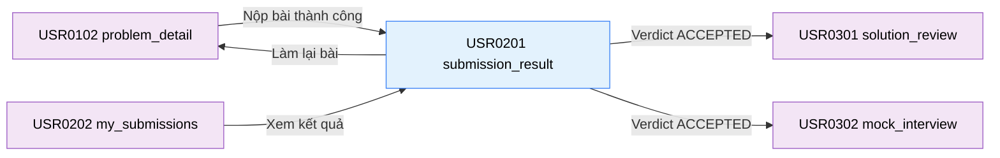

# Tài liệu thiết kế cơ bản (BD) — Kết quả nộp bài (`USR0201`)

## Phương châm tài liệu [Nội bộ — không cần khách duyệt]

- Viết theo **mẫu 9 sheet**. Bộ thẻ đóng, quy ước ID, ký hiệu chuẩn, ranh giới với tài liệu khác và
  checklist kiểm toán nằm ở `02-bd/_rules/bd-template-9sheet.md` — file này không chép lại.
- Phần gắn nhãn `[Nội bộ]` phục vụ sinh mã và tự kiểm toán, không phải yêu cầu của khách hàng: mục 4.5,
  mục 7.3 và các ghi chú quy ước.
- Mã màn `USR0201` theo bảng mã ở `02-bd/_rules/bd-template-9sheet.md` mục 8 dòng 140; tên file mang tiền
  tố mã.
- Khung điều hướng **không mô tả lại ở đây** — dùng chung `02-bd/screens/users/_shell.md`. Khu Người học
  dùng **header ngang dính trên, không có sidebar**, và chân trang dùng chung
  [Nguồn: 02-bd/screens/users/_shell.md:24,86-104]. Màn này là màn khoan sâu từ `problem_detail` hoặc
  `my_submissions`, không có mục nav trực tiếp [Nguồn: 02-bd/screens/users/_shell.md:66-67].
- Màn này **không có popup**. Mọi hành động mở rộng đều chuyển màn hoặc mở ngăn phụ (drawer).

> Đọc cùng `01-rd/screens/users/USR0201_submission_result.md` (hành vi ở mức yêu cầu, không lặp lại ở đây),
> `01-rd/req/judge-orchestration.md` (F4-01, F4-03, F4-08, F4-12, F4-13), `01-rd/req/problem-bank.md` (F2-08),
> `01-rd/req/harness.md` (F3-11, F3-12, F3-13), `01-rd/req/ai-review.md` (F5-01, F5-09),
> `02-bd/architecture/judge-orchestration.md`, `02-bd/database/judge-orchestration.md`,
> `02-bd/security/judge-orchestration.md`.
>
> - **Không gộp với `problem_detail`**: hai màn có URL riêng, vòng đời riêng và mục đích khác nhau;
>   `problem_detail` phục vụ soạn thảo và thử nghiệm, `submission_result` phục vụ kiểm tra kết quả chấm
>   chính thức và lưu trữ vĩnh viễn [Nguồn: 01-rd/screens/users/USR0201_submission_result.md:22-25].
> - **Tuyệt đối chống rò rỉ testcase ẩn**: chỉ hiển thị trạng thái (Accepted, WA, TLE...), thời gian và bộ nhớ;
>   không trả về dữ liệu `input` và `expected_output` của testcase ẩn ở bất kỳ trạng thái nào [Nguồn: F2-08].
> - **Chế độ chấm chạy đủ mọi testcase**: hệ thống chấm toàn bộ N testcase để tính điểm tỷ lệ F4-13, không dừng
>   ở testcase sai đầu tiên (fail-fast đã bãi bỏ theo `DEC-2026-0831-partial-score-testcase-ratio`).
> - **Chỉ số Beats (F4-12)**: tính theo phân phối thời gian chạy của các bài nộp `Accepted` khác cùng bài toán
>   và cùng ngôn ngữ; chỉ hiển thị khi verdict là `Accepted`.

> **Quy ước đặt tên khối** [Nội bộ]. Sáu khối: `breadcrumb` (đường dẫn phân cấp), `verdictBanner` (thẻ kết quả
> tổng quan kèm điểm tỷ lệ), `runStats` (thanh 6 chỉ số vận hành), `testcaseList` (danh sách kết quả từng
> testcase), `codeViewer` (vùng xem mã nguồn đã nộp kèm chỉ báo dòng lỗi biên dịch nếu có), `actionPanel`
> (khối điều hướng tiếp theo: Phân tích AI, Phỏng vấn giả lập, Nộp lại). Tiền tố ID item của toàn màn là
> `submissionResult.`.

---

## Sheet 1. Bìa

| Mục | Giá trị |
| :--- | :--- |
| Hệ thống | AlgoPrep |
| Phân hệ | `judge-orchestration` (F4) — đọc từ `problem-bank` (F2), `harness` (F3), liên kết sang `ai-review` (F5) |
| Công đoạn | BD — Thiết kế cơ bản |
| Phân loại | Màn hình |
| Tên màn | Kết quả nộp bài |
| Mã màn hình | `USR0201` |
| Tên vật lý (slug) | `submission_result` |
| Trục tài liệu | Màn hình (`02-bd/screens/`) |
| Actor | A1 (`STUDENT`) |
| Phiên bản | V0.1 |
| Người tạo | Nhóm phát triển AlgoPrep |
| Ngày tạo | 2026/09/22 |
| Người cập nhật | Nhóm phát triển AlgoPrep |
| Ngày cập nhật | 2026/09/22 |

---

## Sheet 2. Lịch sử sửa đổi

| Ver | Sheet bị sửa | Nội dung sửa | Ngày | Người sửa |
| :--- | :--- | :--- | :--- | :--- |
| V0.1 | Toàn bộ | Tạo mới theo mẫu 9 sheet. Chốt cơ chế realtime WebSocket per-testcase (`/topic/submissions/{id}`), công thức Beats F4-12, hiển thị điểm tỷ lệ F4-13, che giấu testcase ẩn F2-08, ánh xạ lỗi biên dịch F3-11/F3-12 và phân quyền truy cập kết quả bài nộp | 2026/09/22 | Nhóm phát triển AlgoPrep |
| V0.2 | Sheet 3, 5, 7.3, 6, Câu hỏi mở | Viết lại Sheet 3 theo khuôn "Danh sách chuyển màn" 6 thẻ + sơ đồ Mermaid; viết lại Sheet 5 theo khuôn 14 cột (thêm Bảng DB/Cột DB, mỗi item một dòng); bỏ cột "Phương thức & URL dự kiến" ở Sheet 7.3 (đường dẫn API thuộc `03-dd/api/`, chưa viết). Sửa nguồn `beats_percent`: không phải cột DB, là giá trị tính tại thời điểm đọc theo công thức ở `02-bd/architecture/judge-orchestration.md:224-229`. Sửa cột testcase Mẫu/Ẩn về đúng tên thật `testcases.visibility` (không phải `is_sample`), input/expected về `input_inline`/`expected_output_inline`. Bổ sung điều kiện ẩn hẳn bảng testcase khi `status = COMPILE_ERROR` (Sheet 6 Khu vực D NO 1, theo Q3 đã chốt ở RD). Phát hiện thêm: chưa có cột lưu output thực tế của testcase mẫu — thêm Câu hỏi mở Q4 | 2026/09/24 | Nhóm phát triển AlgoPrep |

---

## Sheet 3. Sơ đồ chuyển màn

> [Nội bộ] Quy ước vẽ: `02-bd/_rules/bd-template-9sheet.md` mục 2, 3.

### 3.1 Danh sách chuyển màn

#### Chi tiết bài tập → Kết quả nộp bài (mở ngay sau khi nộp)

[Điều kiện mở] Nộp bài thành công từ Workspace, máy chủ trả về `submission_id` (F4-01)
[Nguồn: 01-rd/screens/users/USR0201_submission_result.md:36].

[Chế độ mở] Điều hướng URL `/submissions/{submission_id}`.

[Thông tin truyền] `submission_id`.

[Giá trị trả về] Không có.

[Khi thành công] Hiển thị màn kết quả; nếu bài nộp chưa ở trạng thái cuối (`PENDING`/`COMPILING`/`JUDGING`)
thì tự động subscribe kênh WebSocket của đúng `submission_id` để nhận cập nhật theo F4-08
[Nguồn: 01-rd/screens/users/USR0201_submission_result.md:141].

[Khi huỷ] Không có.

#### Bài đã nộp → Kết quả nộp bài (mở lại từ lịch sử)

[Điều kiện mở] Bấm nút "Kết quả" ở một dòng lịch sử nộp bài
[Nguồn: 02-bd/screens/users/USR0202_my_submissions.md — Sheet 3 dòng "Xem kết quả"].

[Chế độ mở] Điều hướng URL `/submissions/{submission_id}`.

[Thông tin truyền] `submission_id`.

[Giá trị trả về] Không có.

[Khi thành công] Hiển thị kết quả đã lưu của bài nộp; bài nộp ở lịch sử luôn đã ở trạng thái cuối nên
**không** subscribe WebSocket [Nguồn: 01-rd/screens/users/USR0201_submission_result.md:93-96].

[Khi huỷ] Không có.

#### Kết quả nộp bài → Phân tích bài giải

[Điều kiện mở] Bài nộp có verdict `ACCEPTED`, bấm nút "Phân tích bài giải"
[Nguồn: 01-rd/req/ai-review.md — F5-01].

[Chế độ mở] Điều hướng URL `/submissions/{submission_id}/review`.

[Thông tin truyền] `submission_id`.

[Giá trị trả về] Không có.

[Khi thành công] Mở màn `solution_review`.

[Khi huỷ] Không có — nút bị vô hiệu hoá khi verdict khác `ACCEPTED`, không phát sinh luồng huỷ riêng.

#### Kết quả nộp bài → Phỏng vấn giả lập

[Điều kiện mở] Bài nộp có verdict `ACCEPTED`, bấm nút "Phỏng vấn giả lập"
[Nguồn: 01-rd/req/ai-review.md — F5-09].

[Chế độ mở] Điều hướng URL `/mock-interview?submission_id={submission_id}`.

[Thông tin truyền] `submission_id`, `problem_id`.

[Giá trị trả về] Không có.

[Khi thành công] Mở màn `mock_interview` gắn với bài nộp hiện tại.

[Khi huỷ] Không có.

#### Kết quả nộp bài → Chi tiết bài tập (Làm lại bài)

[Điều kiện mở] Bấm nút "Làm lại bài" hoặc bấm tiêu đề bài toán ở breadcrumb.

[Chế độ mở] Điều hướng URL `/problems/{problem_slug}`.

[Thông tin truyền] `problem_slug` hoặc `problem_id`.

[Giá trị trả về] Không có.

[Khi thành công] Mở Workspace giải bài của đúng bài toán.

[Khi huỷ] Không có.

### 3.2 Sơ đồ

[Nguồn: 01-rd/screens/users/USR0201_submission_result.md:36,93-96,141;
01-rd/req/ai-review.md — F5-01, F5-09]

---

## Sheet 4. Bố cục màn hình

### 4.1. Tổng quan theo thẻ

- `[Mục đích màn]` Hiển thị kết quả chấm chi tiết và tiến trình chấm thời gian thực của một bài nộp, phân tích lỗi (nếu có), thống kê chạy và cung cấp các lựa chọn học tập tiếp theo.
- `[Luồng nghiệp vụ chính]` Sau khi nộp mã từ Workspace, người học vào màn này để theo dõi tiến độ từng testcase qua STOMP WebSocket. Khi hoàn tất, xem verdict tổng, điểm tỷ lệ, bảng testcase, xem lại mã đã nộp và chuyển sang phân tích AI nếu bài giải đạt `ACCEPTED`.
- `[Người dùng]` Học viên (A1 — chủ sở hữu bài nộp). Giảng viên (A2) và Quản trị viên (A3) có thể xem để hỗ trợ hoặc kiểm toán nếu có quyền.
- `[Tệp liên quan]` `01-rd/screens/users/USR0201_submission_result.md`, `09-layoutBase/Kết quả nộp bài.dc.html`.
- `[Phạm vi]` Hiển thị một bài nộp đơn lẻ dựa trên `submission_id`.
- `[Quyền sử dụng]` Học viên chỉ xem được bài nộp của chính mình; cố tình mở bài nộp của học viên khác sẽ bị máy chủ từ chối lỗi `403 FORBIDDEN` hoặc `404 NOT_FOUND`.
- `[Số bản ghi tối đa]` Một bài nộp; danh sách testcase hiển thị tối đa toàn bộ số testcase của bài toán (thông thường từ 10 đến 50 testcase).

### 4.2. Danh sách cấu trúc dữ liệu màn hình (DTOs)

| STT | Tên DTO | Mô tả | Chi tiết trường |
| :-: | :--- | :--- | :--- |
| 1 | `SubmissionDetailDto` | Thông tin chi tiết một lượt nộp | `id`, `problemId`, `problemCode`, `problemTitle`, `difficulty`, `language`, `submissionMode`, `status`, `verdict`, `score`, `runtimeMs`, `memoryMb`, `beatsPercent`, `passedCount`, `totalCount`, `submittedAt`, `completedAt`, `errorMessage`, `sourceCode` |
| 2 | `SubmissionTestcaseResultDto` | Kết quả chi tiết một testcase | `testcaseIndex`, `isSample`, `status`, `runtimeMs`, `memoryMb`, `input` (nullable, chỉ sample), `expectedOutput` (nullable, chỉ sample), `actualOutput` (nullable, chỉ sample) |
| 3 | `SubmissionProgressEventDto` | Sự kiện cập nhật qua WebSocket | `submissionId`, `testcaseIndex`, `status`, `runtimeMs`, `memoryMb`, `isCompleted`, `finalVerdict`, `score` |

### 4.3. Danh sách bảng dữ liệu

| STT | Tên bảng | Mô tả | Thao tác | Bounded Context |
| :-: | :--- | :--- | :--- | :--- |
| 1 | `judge.submissions` | Bản ghi bài nộp và verdict tổng | R | `judge-orchestration` |
| 2 | `judge.submission_testcase_results` | Kết quả chấm từng testcase | R | `judge-orchestration` |
| 3 | `problem.problems` | Thông tin tiêu đề, mã bài, độ khó | R | `problem-bank` |
| 4 | `problem.testcases` | Thông tin testcase mẫu để hiện input/output | R | `problem-bank` |

### 4.4. Vùng bố cục bám prototype

Bố cục dạng luồng dọc đơn cột (Single-column layout), chia thành 6 khu vực chính:

| Ký hiệu | Tên khu vực | Tham chiếu prototype | Ghi chú |
| :-: | :--- | :--- | :--- |
| **A** | Thanh đường dẫn (Breadcrumb) | `Kết quả nộp bài.dc.html:103-108` | Đường dẫn `Bài toán / {Tên bài} / Lượt nộp #{ID}` |
| **B** | Banner kết quả tổng (Verdict Banner) | `Kết quả nộp bài.dc.html:111-122` | Badge verdict (AC/WA/TLE/CE/RE), Điểm tỷ lệ (F4-13), tóm tắt testcase |
| **C** | Thanh 6 chỉ số vận hành (Run Stats) | `Kết quả nộp bài.dc.html:123-131,314-320` | Testcase, Điểm, Runtime, Memory, Beats, Cách nộp |
| **D** | Bảng kết quả từng testcase | `Kết quả nộp bài.dc.html:134-170` | Danh sách testcase, mở rộng chi tiết mẫu, che ẩn testcase bảo mật |
| **E** | Trình xem mã nguồn đã nộp | `Kết quả nộp bài.dc.html:173-195` | Monaco Editor chỉ đọc, syntax highlight, chỉ báo lỗi biên dịch |
| **F** | Thanh hành động tiếp theo | `Kết quả nộp bài.dc.html:198-215` | Nút Phân tích bài giải, Phỏng vấn giả lập, Nộp lại bài |

### 4.5. Cấu trúc slice FSD [Nội bộ]

- Route: `/submissions/[id]`
- View slice: `src/views/users/submission-result/`
  - `ui/submission-result-page.tsx`
  - `ui/verdict-banner.tsx`
  - `ui/run-stats-grid.tsx`
  - `ui/testcase-results-table.tsx`
  - `ui/submitted-code-viewer.tsx`
  - `ui/next-actions-panel.tsx`
  - `model/use-submission-realtime.ts` (quản lý STOMP socket và fallback polling)

---

## Sheet 5. Danh sách item màn hình

> Quy ước ID, bộ thẻ và giá trị chuẩn: `02-bd/_rules/bd-template-9sheet.md` mục 2, 3, 4.

### Khu vực A — Thanh đường dẫn (Breadcrumb)

| Khu vực | NO | Tên item | ID item | Bảng DB | Cột DB | Loại UI | Kiểu | Độ dài | Bắt buộc | I/O | Giá trị mặc định | Định dạng | Ghi chú |
| :--- | --: | :--- | :--- | :--- | :--- | :--- | :--- | :--- | :-: | :-: | :--- | :--- | :--- |
| Breadcrumb | | | | | | | | | | | | | |
| | 1 | Link Bài toán | `submissionResult.breadcrumb.linkProblems` | - | - | Link | String | 50 | Có | O | "Ngân hàng bài toán" | - | Nhãn cố định dẫn về danh sách bài tập [Nguồn giá trị] Nhãn tĩnh i18n [EVT liên quan] EVT-2 |
| | 2 | Link Chi tiết bài | `submissionResult.breadcrumb.linkProblem` | `problem.problems` | `title` | Link | String | 120 | Có | O | - | - | Tên bài toán đang nộp [Nguồn giá trị] Cột `title` [Nguồn: 02-bd/database/problem-bank.md:15] [EVT liên quan] EVT-3 |
| | 3 | Nhãn Lượt nộp | `submissionResult.breadcrumb.lblCurrent` | `judge.submissions` | `id` | Label | String | 50 | Có | O | - | `Lượt nộp #{id}` | Mã định danh lượt nộp [Nguồn giá trị] Cột `id` [Nguồn: 02-bd/database/judge-orchestration.md:14] [EVT liên quan] - |

### Khu vực B — Banner kết quả tổng (Verdict Banner)

| Khu vực | NO | Tên item | ID item | Bảng DB | Cột DB | Loại UI | Kiểu | Độ dài | Bắt buộc | I/O | Giá trị mặc định | Định dạng | Ghi chú |
| :--- | --: | :--- | :--- | :--- | :--- | :--- | :--- | :--- | :-: | :-: | :--- | :--- | :--- |
| Verdict Banner | | | | | | | | | | | | | |
| | 1 | Chấm màu trạng thái | `submissionResult.verdict.statusDot` | `judge.submissions` | `status` | Label | String | 20 | Có | O | - | - | Đèn màu suy ra từ verdict (xanh lá AC, đỏ WA/RE, cam TLE, vàng CE, xanh dương đang chấm) [Công thức] Ánh xạ tĩnh `status` → màu, không lưu cột riêng [Nguồn: 02-bd/database/judge-orchestration.md:22] [EVT liên quan] - |
| | 2 | Nhãn Verdict chính | `submissionResult.verdict.lblTitle` | `judge.submissions` | `status` | Label | String | 50 | Có | O | - | Chữ hoa | Tên verdict [Nguồn giá trị] Cột `status` [Nguồn: 02-bd/database/judge-orchestration.md:22] [EVT liên quan] - |
| | 3 | Điểm số tỷ lệ | `submissionResult.verdict.lblScore` | `judge.submissions` | `passed_testcase_count`, `total_testcase_count`, `score_ratio` | Badge | String | 20 | Có | O | - | `{passed}/{total}` | Điểm đạt theo tỷ lệ testcase F4-13 [Công thức] `score_ratio = passed_testcase_count / total_testcase_count`, `NULL` khi `COMPILE_ERROR`/`SYSTEM_ERROR` — hiển thị `-` [Nguồn: 02-bd/database/judge-orchestration.md:25-27] [EVT liên quan] - |
| | 4 | Dòng mô tả phụ | `submissionResult.verdict.lblSubtitle` | `judge.submissions` | `passed_testcase_count`, `total_testcase_count`, `submitted_at` | Label | String | 150 | Có | O | - | - | Thông tin chi tiết kết quả và thời gian nộp [Công thức] Ghép số testcase đạt/tổng và `submitted_at` [Nguồn: 02-bd/database/judge-orchestration.md:25-26,31] [EVT liên quan] - |
| | 5 | Badge Độ khó bài | `submissionResult.verdict.badgeDifficulty` | `problem.problems` | `difficulty` | Badge | Enum | 20 | Có | O | - | Nhãn tiếng Việt | Độ khó bài toán [Nguồn giá trị] Cột `difficulty` [Nguồn: 02-bd/database/problem-bank.md:17] [EVT liên quan] - |

### Khu vực C — Thanh 6 chỉ số vận hành (Run Stats)

| Khu vực | NO | Tên item | ID item | Bảng DB | Cột DB | Loại UI | Kiểu | Độ dài | Bắt buộc | I/O | Giá trị mặc định | Định dạng | Ghi chú |
| :--- | --: | :--- | :--- | :--- | :--- | :--- | :--- | :--- | :-: | :-: | :--- | :--- | :--- |
| Run Stats | | | | | | | | | | | | | |
| | 1 | Thẻ Testcase | `submissionResult.stats.cardTestcase` | `judge.submissions` | `passed_testcase_count`, `total_testcase_count` | Label | String | 30 | Có | O | - | `{passed} / {total}` | Số testcase đạt trên tổng số testcase [Nguồn: 02-bd/database/judge-orchestration.md:25-26] [EVT liên quan] - |
| | 2 | Thẻ Điểm | `submissionResult.stats.cardScore` | `judge.submissions` | `score_ratio` | Label | String | 30 | Có | O | - | `{score} đ` | Điểm số theo F4-13 [Công thức] `ROUND(score_ratio, 2)` [Nguồn: 02-bd/database/judge-orchestration.md:27] [EVT liên quan] - |
| | 3 | Thẻ Runtime | `submissionResult.stats.cardRuntime` | `judge.submissions` | `runtime_ms` | Label | String | 30 | Có | O | `-` | `{runtime} ms` | Thời gian thực thi lớn nhất trong các testcase [Nguồn: 02-bd/database/judge-orchestration.md:28] [EVT liên quan] - |
| | 4 | Thẻ Memory | `submissionResult.stats.cardMemory` | `judge.submissions` | `memory_kb` | Label | String | 30 | Có | O | `-` | `{memory/1024} MB` | Bộ nhớ lớn nhất trong các testcase [Chuyển đổi] Cột lưu KB, hiển thị quy đổi MB [Nguồn: 02-bd/database/judge-orchestration.md:29] [EVT liên quan] - |
| | 5 | Thẻ Beats | `submissionResult.stats.cardBeats` | `judge.submissions` | `runtime_ms` (của bài nộp hiện tại và của các bài `ACCEPTED` khác cùng `problem_id`+`language`) | Label | String | 30 | Có | O | `-` | `Nhanh hơn {beats}%` | Tỷ lệ % bài nộp `ACCEPTED` khác (cùng bài, cùng ngôn ngữ) có runtime chậm hơn hoặc bằng — **không phải cột lưu sẵn**, tính tại thời điểm đọc [Công thức] `beats% = ROUND(SỐ bài Accepted khác có runtime_ms >= runtime_ms hiện tại / TỔNG bài Accepted cùng problem+language kể cả bài hiện tại * 100)` [Nguồn: 02-bd/architecture/judge-orchestration.md:224-229]. Rỗng khi verdict khác `ACCEPTED` [EVT liên quan] - |
| | 6 | Thẻ Cách nộp | `submissionResult.stats.cardMode` | `judge.submissions` | `submission_model` | Label | String | 30 | Có | O | - | "Hàm (Wrapper)" / "Standard I/O" | Chế độ nộp bài F3-13 [Nguồn: 02-bd/database/judge-orchestration.md:19] [EVT liên quan] - |

### Khu vực D — Bảng kết quả từng testcase

| Khu vực | NO | Tên item | ID item | Bảng DB | Cột DB | Loại UI | Kiểu | Độ dài | Bắt buộc | I/O | Giá trị mặc định | Định dạng | Ghi chú |
| :--- | --: | :--- | :--- | :--- | :--- | :--- | :--- | :--- | :-: | :-: | :--- | :--- | :--- |
| Bảng kết quả testcase | | | | | | | | | | | | | |
| | 1 | Danh sách kết quả testcase | `submissionResult.testcase.list` | `judge.submission_testcase_results` | - | List | List | - | - | O | rỗng | - | Toàn bộ dòng kết quả của submission, sắp theo `testcase_order` [Nguồn: 02-bd/database/judge-orchestration.md:51]. **Ẩn hẳn khối này** khi `status = COMPILE_ERROR` — chưa có testcase nào chạy [Nguồn: 01-rd/screens/users/USR0201_submission_result.md:142] [EVT liên quan] EVT-1 |
| | 2 | Cột Số thứ tự | `submissionResult.testcase.col.index` | `judge.submission_testcase_results` | `testcase_order` | ListColumn | Number | 5 | - | O | - | - | Thứ tự chạy trong submission [Nguồn: 02-bd/database/judge-orchestration.md:51] [EVT liên quan] - |
| | 3 | Cột Loại testcase | `submissionResult.testcase.col.isSample` | `problem.testcases` | `visibility` | ListColumn | Badge | 20 | - | O | - | "Mẫu" / "Ẩn" | Phân biệt `SAMPLE`/`HIDDEN`, tra theo `submission_testcase_results.testcase_id` [Nguồn: 02-bd/database/problem-bank.md:89] [EVT liên quan] - |
| | 4 | Cột Trạng thái | `submissionResult.testcase.col.verdict` | `judge.submission_testcase_results` | `verdict` | ListColumn | Badge | 30 | - | O | - | - | Verdict riêng của testcase: `AC`/`WA`/`TLE`/`MLE`/`RE` [Nguồn: 02-bd/database/judge-orchestration.md:52] [EVT liên quan] - |
| | 5 | Cột Runtime | `submissionResult.testcase.col.runtime` | `judge.submission_testcase_results` | `runtime_ms` | ListColumn | String | 20 | - | O | - | `{runtime} ms` | Thời gian thực thi của riêng testcase [Nguồn: 02-bd/database/judge-orchestration.md:53] [EVT liên quan] - |
| | 6 | Cột Memory | `submissionResult.testcase.col.memory` | `judge.submission_testcase_results` | `memory_kb` | ListColumn | String | 20 | - | O | - | `{memory/1024} MB` | Bộ nhớ của riêng testcase [Chuyển đổi] Cột lưu KB, hiển thị quy đổi MB [Nguồn: 02-bd/database/judge-orchestration.md:54] [EVT liên quan] - |
| | 7 | Nút Mở rộng chi tiết | `submissionResult.testcase.btnExpand` | - | - | Button | - | 20 | - | I | - | "Chi tiết" | Chỉ kích hoạt với testcase Mẫu (`visibility = SAMPLE`) [Nguồn giá trị] Nhãn tĩnh [EVT liên quan] EVT-4 |
| | 8 | Hộp Dữ liệu đầu vào mẫu | `submissionResult.testcase.sampleInput` | `problem.testcases` | `input_inline` (hoặc `input_object_key` trên MinIO nếu `input_storage = MINIO`) | TextArea | String | 2000 | - | O | - | - | Input của testcase mẫu [Nguồn: 02-bd/database/problem-bank.md:90-92] [EVT liên quan] - |
| | 9 | Hộp Kết quả kỳ vọng mẫu | `submissionResult.testcase.sampleExpected` | `problem.testcases` | `expected_output_inline` (hoặc `expected_output_object_key` trên MinIO) | TextArea | String | 2000 | - | O | - | - | Output kỳ vọng của testcase mẫu [Nguồn: 02-bd/database/problem-bank.md:93-95] [EVT liên quan] - |
| | 10 | Hộp Kết quả thực tế mẫu | `submissionResult.testcase.sampleActual` | - | - | TextArea | String | 2000 | - | O | - | - | Output chương trình học viên trả về cho testcase mẫu — **chưa có cột nào lưu output thực tế** ở `submission_testcase_results` (chỉ có `verdict`, `runtime_ms`, `memory_kb`, `stderr_snippet`) [Nguồn: 02-bd/database/judge-orchestration.md:46-57]. Xem Câu hỏi mở Q4 [EVT liên quan] - |
| | 11 | Dòng thông báo testcase ẩn | `submissionResult.testcase.hiddenNotice` | - | - | Label | String | 150 | - | O | - | - | Hiện khi mở rộng hàng testcase `HIDDEN` (F2-08) [Nguồn giá trị] Nhãn tĩnh i18n [EVT liên quan] - |

### Khu vực E — Trình xem mã nguồn đã nộp

| Khu vực | NO | Tên item | ID item | Bảng DB | Cột DB | Loại UI | Kiểu | Độ dài | Bắt buộc | I/O | Giá trị mặc định | Định dạng | Ghi chú |
| :--- | --: | :--- | :--- | :--- | :--- | :--- | :--- | :--- | :-: | :-: | :--- | :--- | :--- |
| Trình xem mã nguồn | | | | | | | | | | | | | |
| | 1 | Nhãn Ngôn ngữ đã nộp | `submissionResult.code.lblLanguage` | `judge.submissions` | `language` | Badge | String | 30 | Có | O | - | - | Ngôn ngữ nộp bài — một trong ba ngôn ngữ khoá cứng [Nguồn: 02-bd/database/judge-orchestration.md:18] [EVT liên quan] - |
| | 2 | Nút Sao chép mã | `submissionResult.code.btnCopy` | - | - | Button | - | 20 | Có | I | - | "Sao chép mã" | Copy mã nguồn vào clipboard [Nguồn giá trị] Nhãn tĩnh [EVT liên quan] EVT-5 |
| | 3 | Trình soạn thảo chỉ đọc | `submissionResult.code.editorViewer` | `judge.submissions` | `source_code` | TextArea | String | 50000 | Có | O | - | - | Monaco Editor chỉ đọc hiển thị mã nguồn đã nộp [Nguồn: 02-bd/database/judge-orchestration.md:20] [EVT liên quan] - |
| | 4 | Khối thông báo lỗi biên dịch | `submissionResult.code.boxCompileError` | `judge.submissions` | `compile_error_message` | TextArea | String | 10000 | - | O | - | - | Lỗi biên dịch đã ánh xạ dòng, che giấu mã harness (F3-11/F3-12); chỉ có giá trị khi `status = COMPILE_ERROR` [Nguồn: 02-bd/database/judge-orchestration.md:24] [EVT liên quan] - |

### Khu vực F — Thanh hành động tiếp theo

| Khu vực | NO | Tên item | ID item | Bảng DB | Cột DB | Loại UI | Kiểu | Độ dài | Bắt buộc | I/O | Giá trị mặc định | Định dạng | Ghi chú |
| :--- | --: | :--- | :--- | :--- | :--- | :--- | :--- | :--- | :-: | :-: | :--- | :--- | :--- |
| Thanh hành động | | | | | | | | | | | | | |
| | 1 | Nút Phân tích bài giải | `submissionResult.action.btnSolutionReview` | - | - | Button | String | 50 | Có | I | - | "Phân tích bài giải (AI)" | Mở phân tích AI F5-01, chỉ bật khi `status = ACCEPTED` [Nguồn giá trị] Nhãn tĩnh [EVT liên quan] EVT-6 |
| | 2 | Nút Phỏng vấn giả lập | `submissionResult.action.btnMockInterview` | - | - | Button | String | 50 | Có | I | - | "Phỏng vấn giả lập (AI)" | Mở phỏng vấn 1:1 F5-09, chỉ bật khi `status = ACCEPTED` [Nguồn giá trị] Nhãn tĩnh [EVT liên quan] EVT-7 |
| | 3 | Nút Làm lại bài | `submissionResult.action.btnRetry` | - | - | Button | String | 50 | Có | I | - | "Quay lại Workspace" | Trở lại Workspace của bài toán hiện tại [Nguồn giá trị] Nhãn tĩnh [EVT liên quan] EVT-8 |

[Nguồn: 02-bd/database/judge-orchestration.md:14,18-31,46-57;
02-bd/database/problem-bank.md:15,17,89-95;
02-bd/architecture/judge-orchestration.md:216-233;
01-rd/screens/users/USR0201_submission_result.md:36,93-96,141-142]

---

## Sheet 6. Đặc tả điều khiển item

### Khu vực A: Thanh đường dẫn (Breadcrumb)

| NO | Tên item | Hiển thị | Kích hoạt | Ghi chú |
| --: | :--- | :--- | :--- | :--- |
| 1 | Link Bài toán | Có | Có | [Điều kiện hiển thị] Luôn hiển thị. [Điều kiện kích hoạt] Luôn kích hoạt. [Tự động đặt] - |
| 2 | Link Chi tiết bài | Có | Có | [Điều kiện hiển thị] Luôn hiển thị. [Điều kiện kích hoạt] Luôn kích hoạt. [Tự động đặt] - |
| 3 | Nhãn Lượt nộp | Có | Không | [Điều kiện hiển thị] Luôn hiển thị. [Điều kiện kích hoạt] Là text hiển thị, không kích hoạt. [Tự động đặt] - |

### Khu vực B: Banner kết quả tổng

| NO | Tên item | Hiển thị | Kích hoạt | Ghi chú |
| --: | :--- | :--- | :--- | :--- |
| 1 | Chấm màu trạng thái | Có | Không | [Điều kiện hiển thị] Luôn hiển thị. [Điều kiện kích hoạt] Không áp dụng. [Tự động đặt] Tự đổi class màu tương ứng với trạng thái kết quả. |
| 2 | Nhãn Verdict chính | Có | Không | [Điều kiện hiển thị] Luôn hiển thị. [Điều kiện kích hoạt] Không áp dụng. [Tự động đặt] Hiển thị "Đang chấm..." khi status đang chạy, hiển thị tên Verdict khi xong. |
| 3 | Điểm số tỷ lệ | Có | Không | [Điều kiện hiển thị] Luôn hiển thị cho mọi verdict sau khi chấm xong (F4-13). [Điều kiện kích hoạt] Không áp dụng. [Tự động đặt] Tính toán từ tỷ lệ số testcase đạt. |
| 4 | Dòng mô tả phụ | Có | Không | [Điều kiện hiển thị] Luôn hiển thị. [Điều kiện kích hoạt] Không áp dụng. [Tự động đặt] Cập nhật số testcase đạt/tổng và mốc thời gian nộp. |
| 5 | Badge Độ khó bài | Có | Không | [Điều kiện hiển thị] Luôn hiển thị. [Điều kiện kích hoạt] Không áp dụng. [Tự động đặt] - |

### Khu vực C: Thanh 6 chỉ số vận hành

| NO | Tên item | Hiển thị | Kích hoạt | Ghi chú |
| --: | :--- | :--- | :--- | :--- |
| 1 | Thẻ Testcase | Có | Không | [Điều kiện hiển thị] Luôn hiển thị. [Điều kiện kích hoạt] Không áp dụng. [Tự động đặt] - |
| 2 | Thẻ Điểm | Có | Không | [Điều kiện hiển thị] Luôn hiển thị. [Điều kiện kích hoạt] Không áp dụng. [Tự động đặt] - |
| 3 | Thẻ Runtime | Có | Không | [Điều kiện hiển thị] Luôn hiển thị. [Điều kiện kích hoạt] Không áp dụng. [Tự động đặt] Hiển thị `-` nếu bài nộp bị lỗi biên dịch hoặc đang chấm. |
| 4 | Thẻ Memory | Có | Không | [Điều kiện hiển thị] Luôn hiển thị. [Điều kiện kích hoạt] Không áp dụng. [Tự động đặt] Hiển thị `-` nếu bài nộp bị lỗi biên dịch hoặc đang chấm. |
| 5 | Thẻ Beats | Có | Không | [Điều kiện hiển thị] Luôn hiển thị. [Điều kiện kích hoạt] Không áp dụng. [Tự động đặt] Chỉ có giá trị khi verdict = `ACCEPTED`; các verdict khác hiển thị `-`. |
| 6 | Thẻ Cách nộp | Có | Không | [Điều kiện hiển thị] Luôn hiển thị. [Điều kiện kích hoạt] Không áp dụng. [Tự động đặt] "Hàm (Wrapper)" hoặc "Standard I/O". |

### Khu vực D: Bảng kết quả từng testcase

| NO | Tên item | Hiển thị | Kích hoạt | Ghi chú |
| --: | :--- | :--- | :--- | :--- |
| 1 | Danh sách kết quả testcase | Điều kiện | Không | [Điều kiện hiển thị] **Ẩn toàn bộ khối này** khi `status = COMPILE_ERROR` — chưa có testcase nào chạy, thay bằng khối thông báo lỗi biên dịch ở Khu vực E NO 4 (Q3 đã chốt) [Nguồn: 01-rd/screens/users/USR0201_submission_result.md:142]. Các trạng thái còn lại hiển thị bình thường, kể cả khi đang `JUDGING` (bảng lấp dần theo realtime). [Điều kiện kích hoạt] Không áp dụng. [Tự động đặt] - |
| 2 | Cột Số thứ tự | Có | Không | [Điều kiện hiển thị] Luôn hiển thị. [Điều kiện kích hoạt] Không áp dụng. [Tự động đặt] - |
| 3 | Cột Loại testcase | Có | Không | [Điều kiện hiển thị] Luôn hiển thị. [Điều kiện kích hoạt] Không áp dụng. [Tự động đặt] - |
| 4 | Cột Trạng thái | Có | Không | [Điều kiện hiển thị] Luôn hiển thị. [Điều kiện kích hoạt] Không áp dụng. [Tự động đặt] Cập nhật realtime khi từng testcase chấm xong. |
| 5 | Cột Runtime | Có | Không | [Điều kiện hiển thị] Luôn hiển thị. [Điều kiện kích hoạt] Không áp dụng. [Tự động đặt] - |
| 6 | Cột Memory | Có | Không | [Điều kiện hiển thị] Luôn hiển thị. [Điều kiện kích hoạt] Không áp dụng. [Tự động đặt] - |
| 7 | Nút Mở rộng chi tiết | Có | Điều kiện | [Điều kiện hiển thị] Luôn hiển thị. [Điều kiện kích hoạt] Chỉ kích hoạt khi dòng là testcase Mẫu (`visibility = SAMPLE`). Hàng testcase Ẩn (`HIDDEN`) bấm vào không mở dữ liệu vào/ra. [Tự động đặt] - |
| 8 | Hộp Dữ liệu đầu vào mẫu | Điều kiện | Không | [Điều kiện hiển thị] Chỉ hiển thị khi hàng testcase mẫu được mở rộng. [Điều kiện kích hoạt] Không áp dụng. [Tự động đặt] - |
| 9 | Hộp Kết quả kỳ vọng mẫu | Điều kiện | Không | [Điều kiện hiển thị] Chỉ hiển thị khi hàng testcase mẫu được mở rộng. [Điều kiện kích hoạt] Không áp dụng. [Tự động đặt] - |
| 10 | Hộp Kết quả thực tế mẫu | Điều kiện | Không | [Điều kiện hiển thị] Chỉ hiển thị khi hàng testcase mẫu được mở rộng, **và** khi có nguồn dữ liệu — xem Câu hỏi mở Q4, hiện chưa có cột lưu. [Điều kiện kích hoạt] Không áp dụng. [Tự động đặt] - |
| 11 | Dòng thông báo testcase ẩn | Điều kiện | Không | [Điều kiện hiển thị] Hiển thị khi hàng testcase ẩn được mở rộng. [Điều kiện kích hoạt] Không áp dụng. [Tự động đặt] - |

### Khu vực E: Trình xem mã nguồn đã nộp

| NO | Tên item | Hiển thị | Kích hoạt | Ghi chú |
| --: | :--- | :--- | :--- | :--- |
| 1 | Nhãn Ngôn ngữ đã nộp | Có | Không | [Điều kiện hiển thị] Luôn hiển thị. [Điều kiện kích hoạt] Không áp dụng. [Tự động đặt] - |
| 2 | Nút Sao chép mã | Có | Có | [Điều kiện hiển thị] Luôn hiển thị. [Điều kiện kích hoạt] Luôn kích hoạt. [Tự động đặt] Đổi nhãn thành "Đã chép!" trong 2 giây sau khi bấm. |
| 3 | Trình soạn thảo chỉ đọc | Có | Không | [Điều kiện hiển thị] Luôn hiển thị ở chế độ `readOnly: true`. [Điều kiện kích hoạt] Cho phép cuộn, chọn text; không cho phép gõ phím sửa mã. [Tự động đặt] Highlight dòng lỗi nếu có thông tin lỗi biên dịch. |
| 4 | Khối thông báo lỗi biên dịch | Điều kiện | Không | [Điều kiện hiển thị] Chỉ hiển thị khi verdict là `COMPILE_ERROR`. [Điều kiện kích hoạt] Cho phép cuộn đọc log lỗi. [Tự động đặt] - |

### Khu vực F: Thanh hành động tiếp theo

| NO | Tên item | Hiển thị | Kích hoạt | Ghi chú |
| --: | :--- | :--- | :--- | :--- |
| 1 | Nút Phân tích bài giải | Có | Điều kiện | [Điều kiện hiển thị] Luôn hiển thị. [Điều kiện kích hoạt] Chỉ kích hoạt khi verdict là `ACCEPTED`. Nếu bài chưa đạt, nút bị mờ kèm tooltip giải thích. [Tự động đặt] - |
| 2 | Nút Phỏng vấn giả lập | Có | Điều kiện | [Điều kiện hiển thị] Luôn hiển thị. [Điều kiện kích hoạt] Chỉ kích hoạt khi verdict là `ACCEPTED`. Nếu bài chưa đạt, nút bị mờ kèm tooltip giải thích. [Tự động đặt] - |
| 3 | Nút Làm lại bài | Có | Có | [Điều kiện hiển thị] Luôn hiển thị. [Điều kiện kích hoạt] Luôn kích hoạt để quay lại Workspace tiếp tục cải thiện code. [Tự động đặt] - |

---

## Sheet 7. Danh sách truyền dữ liệu

### 7.1. Danh sách trường truyền dữ liệu

| STT | Trường giao diện | Kiểu | Trường DTO | Hướng | Ghi chú |
| :-: | :--- | :--- | :--- | :-: | :--- |
| 1 | `submissionResult.verdict.lblTitle` | String | `SubmissionDetailDto.verdict` | O | Chuyển đổi sang nhãn i18n hoa |
| 2 | `submissionResult.verdict.lblScore` | String | `SubmissionDetailDto.score` | O | Hiển thị dạng điểm số tỷ lệ F4-13 |
| 3 | `submissionResult.stats.cardRuntime` | Number | `SubmissionDetailDto.runtimeMs` | O | Định dạng `{runtimeMs} ms` |
| 4 | `submissionResult.stats.cardMemory` | Number | `SubmissionDetailDto.memoryMb` | O | Định dạng `{memoryMb} MB` |
| 5 | `submissionResult.stats.cardBeats` | Number | `SubmissionDetailDto.beatsPercent` | O | Định dạng `Nhanh hơn {beatsPercent}%` |
| 6 | `submissionResult.code.editorViewer` | String | `SubmissionDetailDto.sourceCode` | O | Đổ vào Monaco Editor |
| 7 | `submissionResult.code.boxCompileError` | String | `SubmissionDetailDto.errorMessage` | O | Đổ vào khối log lỗi biên dịch |
| 8 | `submissionResult.testcase.col.verdict` | String | `SubmissionTestcaseResultDto.status` | O | Nhận qua REST hoặc kênh STOMP |

### 7.2. Truy cập bảng dữ liệu

| STT | Tên bảng | C | R | U | D | Điều kiện lọc |
| :-: | :--- | :-: | :-: | :-: | :-: | :--- |
| 1 | `judge.submissions` | - | Có | - | - | `id = :submissionId AND user_id = :currentUserId` |
| 2 | `judge.submission_testcase_results` | - | Có | - | - | `submission_id = :submissionId ORDER BY testcase_index ASC` |
| 3 | `problem.problems` | - | Có | - | - | `id = :problemId` |
| 4 | `problem.testcases` | - | Có | - | - | `problem_id = :problemId AND is_sample = true ORDER BY order_index ASC` |

### 7.3. Danh sách endpoint [Nội bộ]

> Chỉ tên nghiệp vụ và BC sở hữu. Hợp đồng chi tiết (đường dẫn, request, response, mã lỗi) thuộc
> `03-dd/api/<module>.md`, chưa viết.

| NO | Endpoint (tên nghiệp vụ) | Mục đích | BC sở hữu |
| --: | :--- | :--- | :--- |
| 1 | `GetSubmissionDetail` | Lấy chi tiết toàn bộ bài nộp và danh sách kết quả testcase | `judge-orchestration` |
| 2 | `SubscribeSubmissionRealtime` | Kênh realtime (STOMP) đẩy kết quả từng testcase và verdict cuối cùng, theo F4-08 | `judge-orchestration` |
| 3 | `GetProblemSampleTestcases` | Lấy dữ liệu testcase Mẫu để hiển thị đối chiếu trong bảng kết quả | `problem-bank` |

---

## Sheet 8. Danh sách sự kiện

| NO | Loại | Sự kiện | Chi tiết | Chuyển màn | Gọi API | Tên xử lý | Ghi chú |
| --: | :--- | :--- | :--- | :-: | :-: | :--- | :--- |
| 1 | Khởi tạo | Mở màn hình | Tải thông tin ban đầu của bài nộp dựa trên `submission_id` từ URL. | Không | Có | `GetSubmissionDetail` | [Các bước] 1. Đọc `submission_id` từ URL. 2. Gọi `GetSubmissionDetail`. 3. Nếu trạng thái là `PENDING` hoặc `JUDGING`, kích hoạt kết nối STOMP. [Khi thành công] Hiển thị các khối dữ liệu. [Khi lỗi] Báo lỗi không tìm thấy bài nộp hoặc không có quyền truy cập. |
| 2 | Điều hướng | Bấm link Ngân hàng bài | Người dùng bấm link quay về danh sách bài tập. | Có | Không | - | [Các bước] 1. Điều hướng sang `problem_list` (`USR0101`). |
| 3 | Điều hướng | Bấm link Tiêu đề bài | Người dùng bấm vào tiêu đề bài toán. | Có | Không | - | [Các bước] 1. Điều hướng sang `problem_detail` (`USR0102`) của bài toán tương ứng. |
| 4 | Giao diện | Mở rộng chi tiết testcase | Bấm mở rộng hàng kết quả testcase. | Không | Không | - | [Các bước] 1. Nếu là testcase mẫu: toggle mở rộng hiển thị Input, Expected, Actual. 2. Nếu là testcase ẩn: toggle mở rộng hiển thị thông báo bảo mật F2-08. |
| 5 | Giao diện | Sao chép mã nguồn | Bấm nút Sao chép mã. | Không | Không | - | [Các bước] 1. Gọi Clipboard API sao chép toàn bộ `sourceCode`. 2. Đổi nhãn nút thành "Đã chép!" trong 2 giây. |
| 6 | Điều hướng | Bấm Phân tích bài giải | Bấm nút Phân tích bài giải AI. | Có | Không | - | [Các bước] 1. Kiểm tra verdict = `ACCEPTED`. 2. Điều hướng sang `solution_review` (`USR0301`) kèm `submission_id`. |
| 7 | Điều hướng | Bấm Phỏng vấn giả lập | Bấm nút Phỏng vấn giả lập AI. | Có | Không | - | [Các bước] 1. Kiểm tra verdict = `ACCEPTED`. 2. Điều hướng sang `mock_interview` (`USR0302`) kèm `submission_id`. |
| 8 | Điều hướng | Bấm Làm lại bài | Bấm nút Làm lại bài. | Có | Không | - | [Các bước] 1. Điều hướng về `problem_detail` (`USR0102`) của bài toán tương ứng để mở lại Workspace. |
| 9 | Realtime | Nhận event testcase xong | Nhận bản tin STOMP cập nhật tiến độ từ máy chủ. | Không | Không | - | [Các bước] 1. Cập nhật trạng thái dòng testcase tương ứng trong bảng. 2. Tăng số đếm testcase hoàn thành. 3. Nếu `isCompleted = true`, cập nhật verdict tổng và đóng kết nối WebSocket. |

---

## Sheet 9. Đặc tả kiểm tra

| NO | Loại | Tóm tắt kiểm | Chi tiết | Mức | Mã thông báo | Ghi chú | EVT gọi | Thứ tự |
| --: | :--- | :--- | :--- | :--- | :--- | :--- | :--- | :-: |
| 1 | Kiểm quyền | Phải đăng nhập | [Nội dung kiểm] Người dùng chưa đăng nhập thì chuyển hướng về `auth`. [Nơi thực thi] Giao diện và API gateway. [Tiêu điểm] Toàn màn. | Lỗi | Chưa có mã thông báo | Nội dung "Vui lòng đăng nhập để xem kết quả nộp bài." | EVT-1 | 1 |
| 2 | Kiểm quyền | Quyền sở hữu bài nộp | [Nội dung kiểm] Học viên chỉ được xem bài nộp của chính mình. Nếu `user_id` không khớp, trả về lỗi 403 hoặc 404. [Nơi thực thi] Máy chủ tầng dịch vụ. [Tiêu điểm] Toàn màn. | Lỗi | Mã lỗi trong phản hồi | Tránh lỗ hổng IDOR làm lộ mã nguồn của học viên khác. | EVT-1 | 2 |
| 3 | Kiểm nghiệp vụ | Bảo mật testcase ẩn | [Nội dung kiểm] Kiểm tra phản hồi API không bao giờ chứa input/output của testcase ẩn (F2-08). [Nơi thực thi] Máy chủ tầng truy vấn. [Tiêu điểm] Bảng testcase. | Lỗi | Không có thông báo | Ràng buộc bảo mật bắt buộc của phân hệ `problem-bank`. | EVT-1, EVT-4 | 1 |
| 4 | Kiểm nghiệp vụ | Khóa nút AI khi chưa Accepted | [Nội dung kiểm] Nút "Phân tích bài giải" và "Phỏng vấn giả lập" bị vô hiệu hóa khi verdict khác `ACCEPTED`. [Nơi thực thi] Màn hình. [Tiêu điểm] Khối hành động. | Cảnh báo | Chưa có mã thông báo | Tooltip "Tính năng chỉ mở khi bài nộp đạt Accepted." | EVT-6, EVT-7 | 1 |
| 5 | Kiểm nghiệp vụ | Xử lý đứt kết nối WebSocket | [Nội dung kiểm] Nếu kênh STOMP mất kết nối trong khi bài nộp đang `JUDGING`, chuyển sang cơ chế Polling REST mỗi 3 giây tối đa 10 lần. [Nơi thực thi] Màn hình. [Tiêu điểm] Trạng thái chấm. | Cảnh báo | Không có thông báo | Đảm bảo học viên không bị treo giao diện khi kết nối realtime chập chờn. | EVT-9 | 1 |

---

## Câu hỏi mở

| # | Câu hỏi | Vì sao chưa trả lời được | Đề xuất | Chủ sở hữu |
| :-: | :--- | :--- | :--- | :--- |
| Q1 | **Kênh WebSocket STOMP xác thực thế nào để tránh nghe trộm bài nộp của nhau?** | Cần cơ chế bảo vệ topic `/topic/submissions/{id}` để một học viên không subscribe vào `submission_id` của người khác khi biết ID | Dùng user-destination `/user/queue/submissions` hoặc kiểm tra token kết nối STOMP gắn với quyền sở hữu bài nộp tại interceptor WebSocket | DD `judge-orchestration` + Security |
| Q2 | **Công thức tính Beats chính xác khi số lượng bài nộp trong hệ thống còn ít (ví dụ < 10 lượt nộp)?** | Khi bài mới xuất bản, số bài nộp rất ít, % Beats tính theo phân phối có thể nhảy giật hoặc đạt 100% gây hiểu lầm | Khi số bài nộp Accepted < 10 lượt, hiển thị nhãn "Chưa đủ dữ liệu so sánh" thay vì số % cụ thể | Chủ dự án |
| Q3 | **Thời gian lưu giữ chi tiết kết quả từng testcase trong DB là bao lâu?** | Bảng `judge.submission_testcase_results` tăng trưởng cực nhanh (mỗi lượt nộp sinh 15-50 dòng). Lưu vĩnh viễn sẽ phình to DB | Giữ kết quả testcase chi tiết trong 90 ngày; sau 90 ngày chỉ giữ verdict tổng và thống kê ở bảng `submissions` | BD Database `judge-orchestration` |
| Q4 | **Output thực tế của testcase mẫu ("Kết quả thực tế mẫu", Khu vực D NO 10) lấy từ cột nào?** | `judge.submission_testcase_results` hiện chỉ có `verdict`, `runtime_ms`, `memory_kb`, `stderr_snippet` [Nguồn: 02-bd/database/judge-orchestration.md:46-57] — **không có cột lưu output thực tế** của chương trình học viên, kể cả cho testcase Mẫu vốn không thuộc phạm vi bảo vệ F2-08 | Thêm cột `actual_output_snippet` (TEXT, cắt tương tự `stderr_snippet`) vào `submission_testcase_results`, chỉ ghi khi `testcase.visibility = SAMPLE` để tránh phình bảng với dữ liệu Hidden vốn không bao giờ hiển thị | BD Database `judge-orchestration` |

---

## Tham chiếu

- `01-rd/screens/users/USR0201_submission_result.md` — Yêu cầu màn hình.
- `09-layoutBase/Kết quả nộp bài.dc.html` — Bằng chứng bố cục prototype.
- `01-rd/req/judge-orchestration.md` — F4-01, F4-03, F4-08, F4-12, F4-13.
- `01-rd/req/problem-bank.md` — F2-08.
- `01-rd/req/harness.md` — F3-11, F3-12, F3-13.
- `02-bd/_rules/bd-template-9sheet.md` — Quy ước mẫu 9 sheet.
- Quyết định: `DEC-2026-0831-partial-score-testcase-ratio`.
