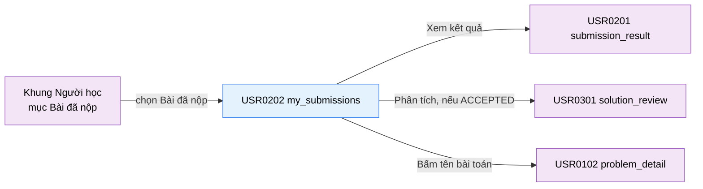

# Tài liệu thiết kế cơ bản (BD) — Bài đã nộp (`USR0202`)

## Phương châm tài liệu [Nội bộ — không cần khách duyệt]

- Viết theo **mẫu 9 sheet**. Bộ thẻ đóng, quy ước ID, ký hiệu chuẩn, ranh giới với tài liệu khác và
  checklist kiểm toán nằm ở `02-bd/_rules/bd-template-9sheet.md` — file này không chép lại.
- Phần gắn nhãn `[Nội bộ]` phục vụ sinh mã và tự kiểm toán, không phải yêu cầu của khách hàng: mục 4.5,
  mục 7.3 và các ghi chú quy ước.
- Mã màn `USR0202` theo bảng mã ở `02-bd/_rules/bd-template-9sheet.md` mục 8 dòng 141; tên file mang tiền
  tố mã.
- Khung điều hướng **không mô tả lại ở đây** — dùng chung `02-bd/screens/users/_shell.md`. Màn này có mục
  điều hướng trực tiếp trên thanh nav chính của header (Mục thứ 4: "Bài đã nộp")
  [Nguồn: 02-bd/screens/users/_shell.md:57].
- Màn này **không có popup**. Tất cả hành động xem chi tiết đều chuyển màn.

> Đọc cùng `01-rd/screens/users/USR0202_my_submissions.md` (hành vi ở mức yêu cầu, không lặp lại ở đây),
> `01-rd/req/identity.md` (F1-07, F1-18), `01-rd/req/judge-orchestration.md` (F4-01→F4-08),
> `01-rd/req/ai-review.md` (F5-01), `02-bd/architecture/judge-orchestration.md`,
> `02-bd/database/judge-orchestration.md`, `02-bd/database/identity.md`.
>
> - **Phạm vi dữ liệu cá nhân tuyệt đối**: màn này chỉ hiển thị các bài nộp của chính người dùng đang đăng nhập
>   thông qua token phiên; không nhận tham số `user_id` từ phía giao diện nhằm triệt tiêu lỗ hổng IDOR.
> - **Mã yêu cầu F1-18**: cung cấp giao diện tra cứu, tìm kiếm theo mã bài/tên bài, lọc theo verdict và ngôn ngữ
>   cho toàn bộ lịch sử bài nộp của người học.
> - **Quy tắc phân tích AI**: nút "Phân tích" trên từng dòng chỉ kích hoạt khi bài nộp đạt verdict `ACCEPTED`
>   (khớp quy tắc F5-01); các dòng không đạt chỉ hiển thị nút "Kết quả".
> - **Phân trang phía máy chủ**: khác với prototype tĩnh vẽ 10 dòng cố định, thiết kế BD bắt buộc thực hiện phân
>   trang tại máy chủ (20 dòng/trang) kèm sắp xếp giảm dần theo thời gian nộp bài (`submitted_at DESC`).

> **Quy ước đặt tên khối** [Nội bộ]. Bốn khối: `summaryStats` (dải 4 thẻ thống kê tổng quan), `filterToolbar`
> (thanh công cụ tìm kiếm và lọc verdict/ngôn ngữ), `submissionsTable` (bảng lịch sử bài nộp), `tableFooter`
> (dòng tổng kết số liệu và phân trang). Tiền tố ID item của toàn màn là `mySubmissions.`.

---

## Sheet 1. Bìa

| Mục | Giá trị |
| :--- | :--- |
| Hệ thống | AlgoPrep |
| Phân hệ | `judge-orchestration` (F4) — đọc từ `identity` (F1), `problem-bank` (F2), liên kết sang `ai-review` (F5) |
| Công đoạn | BD — Thiết kế cơ bản |
| Phân loại | Màn hình |
| Tên màn | Bài đã nộp |
| Mã màn hình | `USR0202` |
| Tên vật lý (slug) | `my_submissions` |
| Trục tài liệu | Màn hình (`02-bd/screens/`) |
| Actor | A1 (`STUDENT`) |
| Phiên bản | V0.1 |
| Người tạo | Nhóm phát triển AlgoPrep |
| Ngày tạo | 2026/09/22 |
| Người cập nhật | Nhóm phát triển AlgoPrep |
| Ngày cập nhật | 2026/09/22 |

---

## Sheet 2. Lịch sử sửa đổi

| Ver | Sheet bị sửa | Nội dung sửa | Ngày | Người sửa |
| :--- | :--- | :--- | :--- | :--- |
| V0.1 | Toàn bộ | Tạo mới theo mẫu 9 sheet. Chốt 4 thẻ thống kê tổng quan (khớp F1-07), bộ lọc kết hợp tìm kiếm và đa tiêu chí (F1-18), phân trang máy chủ và quy tắc mở khóa nút Phân tích AI F5-01 | 2026/09/22 | Nhóm phát triển AlgoPrep |
| V0.2 | Sheet 3, 5, 7.3, Câu hỏi mở | Viết lại Sheet 3 theo khuôn "Danh sách chuyển màn" 6 thẻ + sơ đồ Mermaid; viết lại Sheet 5 theo khuôn 14 cột (thêm Bảng DB/Cột DB, mỗi item một dòng); bỏ cột "Phương thức & URL dự kiến" ở Sheet 7.3. Sửa nguồn 2 thẻ thống kê: "Được chấp nhận" và "Đúng ngay lần đầu" đổi công thức đúng theo cột thật của `identity.user_submission_stats` (không có `acceptedRate` lưu sẵn); phát hiện "Dùng nhiều nhất" (ngôn ngữ) chưa có cột read model nào — thêm Câu hỏi mở Q4 | 2026/09/24 | Nhóm phát triển AlgoPrep |

---

## Sheet 3. Sơ đồ chuyển màn

> [Nội bộ] Quy ước vẽ: `02-bd/_rules/bd-template-9sheet.md` mục 2, 3.

### 3.1 Danh sách chuyển màn

#### Khung điều hướng Người học → Bài đã nộp

[Điều kiện mở] Chọn mục "Bài đã nộp" trên thanh nav chính của header
[Nguồn: 02-bd/screens/users/_shell.md:57].

[Chế độ mở] Điều hướng URL `/my-submissions`.

[Thông tin truyền] Không có.

[Giá trị trả về] Không có.

[Khi thành công] Hiển thị dải thống kê, thanh lọc và bảng lịch sử nộp bài của chính học viên.

[Khi huỷ] Không có.

#### Bài đã nộp → Kết quả nộp bài

[Điều kiện mở] Bấm nút "Kết quả" ở một dòng bài nộp.

[Chế độ mở] Điều hướng URL `/submissions/{submission_id}`.

[Thông tin truyền] `submission_id`.

[Giá trị trả về] Không có.

[Khi thành công] Mở màn `submission_result` tương ứng.

[Khi huỷ] Không có.

#### Bài đã nộp → Phân tích bài giải

[Điều kiện mở] Bấm nút "Phân tích" ở dòng có verdict `ACCEPTED`
[Nguồn: 01-rd/req/ai-review.md — F5-01].

[Chế độ mở] Điều hướng URL `/submissions/{submission_id}/review`.

[Thông tin truyền] `submission_id`.

[Giá trị trả về] Không có.

[Khi thành công] Mở màn `solution_review`.

[Khi huỷ] Không có — nút bị vô hiệu hoá khi verdict khác `ACCEPTED`.

#### Bài đã nộp → Chi tiết bài tập

[Điều kiện mở] Bấm vào tên hoặc mã bài toán trong bảng.

[Chế độ mở] Điều hướng URL `/problems/{problem_slug}`.

[Thông tin truyền] `problem_slug`.

[Giá trị trả về] Không có.

[Khi thành công] Mở Workspace giải bài.

[Khi huỷ] Không có.

### 3.2 Sơ đồ

[Nguồn: 02-bd/screens/users/_shell.md:57; 01-rd/req/ai-review.md — F5-01]

---

## Sheet 4. Bố cục màn hình

### 4.1. Tổng quan theo thẻ

- `[Mục đích màn]` Cho phép người học xem lại toàn bộ lịch sử các lần nộp bài của mình, theo dõi tỷ lệ thành công, phân tích thói quen ngôn ngữ, tìm kiếm bài đã nộp và mở lại kết quả chi tiết hoặc phân tích AI.
- `[Luồng nghiệp vụ chính]` Người học vào màn hình để tra cứu bài đã nộp, sử dụng bộ lọc trạng thái verdict hoặc ngôn ngữ lập trình, tìm kiếm theo từ khóa bài toán, sau đó xem kết quả testcase tại `submission_result` hoặc nhận phản hồi sư phạm AI tại `solution_review`.
- `[Người dùng]` Học viên (A1 — sở hữu lịch sử nộp bài).
- `[Tệp liên quan]` `01-rd/screens/users/USR0202_my_submissions.md`, `09-layoutBase/Bài đã nộp.dc.html`.
- `[Phạm vi]` Toàn bộ lịch sử bài nộp của học viên đang đăng nhập trên hệ thống.
- `[Quyền sử dụng]` Yêu cầu đăng nhập tài khoản học viên (A1).
- `[Số bản ghi tối đa]` Mặc định hiển thị 20 bản ghi trên mỗi trang, phân trang phía máy chủ.

### 4.2. Danh sách cấu trúc dữ liệu màn hình (DTOs)

| STT | Tên DTO | Mô tả | Chi tiết trường |
| :-: | :--- | :--- | :--- |
| 1 | `StudentSubmissionSummaryStatsDto` | Số liệu tổng quan lịch sử | `totalSubmissions`, `acceptedCount`, `acceptedRate`, `firstTryAcceptedCount`, `firstTryAcceptedRate`, `mostUsedLanguage`, `mostUsedLanguagePercent` |
| 2 | `StudentSubmissionItemDto` | Một dòng trong bảng lịch sử | `id`, `problemId`, `problemCode`, `problemTitle`, `difficulty`, `language`, `verdict`, `passedCount`, `totalCount`, `runtimeMs`, `memoryMb`, `submittedAt` |
| 3 | `StudentSubmissionPageResponseDto` | Kết quả phân trang lịch sử bài nộp | `items` (List<StudentSubmissionItemDto>), `currentPage`, `pageSize`, `totalItems`, `totalPages`, `filteredAcceptedCount` |

### 4.3. Danh sách bảng dữ liệu

| STT | Tên bảng | Mô tả | Thao tác | Bounded Context |
| :-: | :--- | :--- | :--- | :--- |
| 1 | `judge.submissions` | Bản ghi các bài nộp của người học | R | `judge-orchestration` |
| 2 | `identity.user_submission_stats` | Read model tổng hợp lượt nộp và AC | R | `identity` |
| 3 | `problem.problems` | Thông tin mã bài, tên bài, độ khó | R | `problem-bank` |

### 4.4. Vùng bố cục bám prototype

Bố cục dạng danh sách trung tâm một cột với các khối chức năng phân lớp:

| Ký hiệu | Tên khu vực | Tham chiếu prototype | Ghi chú |
| :-: | :--- | :--- | :--- |
| **A** | Dải 4 thẻ thống kê (Summary Stats) | `Bài đã nộp.dc.html:104-110,238-243` | 4 thẻ ngang: Lượt nộp, Được chấp nhận (F1-07), Đúng lần đầu, Ngôn ngữ chính |
| **B** | Thanh công cụ lọc & tìm kiếm (Filter Toolbar) | `Bài đã nộp.dc.html:112-123` | Ô tìm kiếm bài, tab lọc Verdict, tab lọc Ngôn ngữ |
| **C** | Bảng lịch sử nộp bài (Submissions Table) | `Bài đã nộp.dc.html:126-170` | Bảng dữ liệu có hover action (Xem kết quả, Phân tích AI) |
| **D** | Chân bảng & phân trang (Table Footer) | `Bài đã nộp.dc.html:171-174` | Dòng tóm tắt số bản ghi và thanh chuyển trang |

### 4.5. Cấu trúc slice FSD [Nội bộ]

- Route: `/my-submissions`
- View slice: `src/views/my-submissions/`
  - `ui/my-submissions-page.tsx`
  - `ui/submission-stats-cards.tsx`
  - `ui/submission-filter-toolbar.tsx`
  - `ui/submissions-data-table.tsx`
  - `ui/submissions-table-footer.tsx`
  - `model/use-my-submissions.ts` (quản lý state URL query params: `q`, `verdict`, `language`, `page`)

---

## Sheet 5. Danh sách item màn hình

> Quy ước ID, bộ thẻ và giá trị chuẩn: `02-bd/_rules/bd-template-9sheet.md` mục 2, 3, 4.

### Khu vực A — Dải 4 thẻ thống kê (Summary Stats)

| Khu vực | NO | Tên item | ID item | Bảng DB | Cột DB | Loại UI | Kiểu | Độ dài | Bắt buộc | I/O | Giá trị mặc định | Định dạng | Ghi chú |
| :--- | --: | :--- | :--- | :--- | :--- | :--- | :--- | :--- | :-: | :-: | :--- | :--- | :--- |
| Summary Stats | | | | | | | | | | | | | |
| | 1 | Thẻ Tổng lượt nộp | `mySubmissions.stats.cardTotal` | `identity.user_submission_stats` | `total_submissions` | Label | String | 30 | Có | O | `0` | `{số} lượt` | Tổng số lượt nộp bài mọi thời đại của chính học viên [Nguồn: 02-bd/database/identity.md:114] [EVT liên quan] - |
| | 2 | Thẻ Được chấp nhận | `mySubmissions.stats.cardAccepted` | `identity.user_submission_stats` | `accepted_count`, `total_submissions` | Label | String | 40 | Có | O | `0 (0%)` | `{count} ({rate}%)` | Số bài đạt AC và tỷ lệ chấp thuận (F1-07) [Công thức] `rate = ROUND(accepted_count / total_submissions * 100)` — `total_submissions = 0` thì hiển thị `0 (—%)` [Nguồn: 02-bd/database/identity.md:114] [EVT liên quan] - |
| | 3 | Thẻ Đúng ngay lần đầu | `mySubmissions.stats.cardFirstTry` | `identity.user_submission_stats` | `first_try_accepted_count`, `accepted_count` | Label | String | 40 | Có | O | `0 / 0 (0%)` | `{firstTry} / {accepted} ({rate}%)` | Số bài Accepted ngay lần nộp đầu tiên [Công thức] `rate = ROUND(first_try_accepted_count / accepted_count * 100)` [Nguồn: 02-bd/database/identity.md:114]. Cột này tính sẵn ở read model, không quét lại lịch sử mỗi lần tải (Câu hỏi mở Q1) [EVT liên quan] - |
| | 4 | Thẻ Dùng nhiều nhất | `mySubmissions.stats.cardTopLang` | `judge.submissions` | `language` | Label | String | 40 | Có | O | `-` | `{ngôn ngữ} ({rate}%)` | Ngôn ngữ lập trình có lượt nộp nhiều nhất [Công thức] `GROUP BY language, COUNT(*)` trên toàn bộ lượt nộp của chính học viên, lấy nhóm lớn nhất — **không có cột read model riêng**, tính trực tiếp trên `judge.submissions` [Nguồn: 02-bd/database/judge-orchestration.md:18]. Chi phí quét, xem Câu hỏi mở Q4 [EVT liên quan] - |

### Khu vực B — Thanh công cụ lọc & tìm kiếm (Filter Toolbar)

| Khu vực | NO | Tên item | ID item | Bảng DB | Cột DB | Loại UI | Kiểu | Độ dài | Bắt buộc | I/O | Giá trị mặc định | Định dạng | Ghi chú |
| :--- | --: | :--- | :--- | :--- | :--- | :--- | :--- | :--- | :-: | :-: | :--- | :--- | :--- |
| Filter Toolbar | | | | | | | | | | | | | |
| | 1 | Ô tìm kiếm bài toán | `mySubmissions.filter.txtSearch` | `problem.problems` | `code`, `title` | TextBox | String | 100 | Không | I/O | rỗng | - | Nhập mã bài hoặc tên bài cần tìm [Nguồn giá trị] Tham số URL `q` [EVT liên quan] EVT-2 |
| | 2 | Tab Lọc verdict | `mySubmissions.filter.tabVerdict` | `judge.submissions` | `status` | Toggle | Enum | 30 | Có | I/O | `ALL` | - | Tất cả, Accepted, Sai kết quả, Quá thời gian, Lỗi biên dịch, Lỗi thực thi — map từ ENUM `status` [Nguồn: 02-bd/database/judge-orchestration.md:22] [Nguồn giá trị] Tham số URL `verdict` [EVT liên quan] EVT-3 |
| | 3 | Tab Lọc ngôn ngữ | `mySubmissions.filter.tabLanguage` | `judge.submissions` | `language` | Toggle | Enum | 20 | Có | I/O | `ALL` | - | Tất cả, Python, Java, C++ — ba ngôn ngữ khoá cứng [Nguồn: 02-bd/database/judge-orchestration.md:18] [Nguồn giá trị] Tham số URL `language` [EVT liên quan] EVT-4 |

### Khu vực C — Bảng lịch sử nộp bài (Submissions Table)

| Khu vực | NO | Tên item | ID item | Bảng DB | Cột DB | Loại UI | Kiểu | Độ dài | Bắt buộc | I/O | Giá trị mặc định | Định dạng | Ghi chú |
| :--- | --: | :--- | :--- | :--- | :--- | :--- | :--- | :--- | :-: | :-: | :--- | :--- | :--- |
| Submissions Table | | | | | | | | | | | | | |
| | 1 | Cột Thời điểm | `mySubmissions.table.col.submittedAt` | `judge.submissions` | `submitted_at` | ListColumn | Date | 30 | Có | O | - | `HH:mm - dd/MM/yyyy` | Mốc thời gian nộp bài [Nguồn: 02-bd/database/judge-orchestration.md:31] [EVT liên quan] - |
| | 2 | Cột Bài toán | `mySubmissions.table.col.problem` | `problem.problems` | `code`, `title`, `difficulty` | ListColumn | Link | 150 | Có | O | - | `{code} · {title}` | Mã và tiêu đề bài toán kèm badge độ khó [Nguồn: 02-bd/database/problem-bank.md:14-17] [EVT liên quan] EVT-5 |
| | 3 | Cột Ngôn ngữ | `mySubmissions.table.col.language` | `judge.submissions` | `language` | ListColumn | Badge | 20 | Có | O | - | - | Ngôn ngữ nộp bài [Nguồn: 02-bd/database/judge-orchestration.md:18] [EVT liên quan] - |
| | 4 | Cột Kết quả | `mySubmissions.table.col.verdict` | `judge.submissions` | `status` | ListColumn | Badge | 30 | Có | O | - | - | Badge trạng thái có màu đặc trưng [Nguồn: 02-bd/database/judge-orchestration.md:22] [EVT liên quan] - |
| | 5 | Cột Testcase | `mySubmissions.table.col.testcases` | `judge.submissions` | `passed_testcase_count`, `total_testcase_count` | ListColumn | String | 20 | Có | O | - | `{passed}/{total}` | Số testcase đạt / tổng số testcase [Nguồn: 02-bd/database/judge-orchestration.md:25-26] [EVT liên quan] - |
| | 6 | Cột Thời gian chạy | `mySubmissions.table.col.runtime` | `judge.submissions` | `runtime_ms` | ListColumn | String | 20 | Có | O | `-` | `{runtime} ms` | Thời gian thực thi lớn nhất [Nguồn: 02-bd/database/judge-orchestration.md:28] [EVT liên quan] - |
| | 7 | Nút Xem kết quả | `mySubmissions.table.row.btnResult` | - | - | Button | String | 20 | Có | I | - | "Kết quả" | Mở màn `submission_result` của dòng đang trỏ [Nguồn giá trị] Nhãn tĩnh [EVT liên quan] EVT-6 |
| | 8 | Nút Phân tích AI | `mySubmissions.table.row.btnReview` | - | - | Button | String | 20 | Có | I | - | "Phân tích" | Mở phân tích AI F5-01, chỉ bật khi `status = ACCEPTED` [Nguồn giá trị] Nhãn tĩnh [EVT liên quan] EVT-7 |

### Khu vực D — Chân bảng & phân trang (Table Footer)

| Khu vực | NO | Tên item | ID item | Bảng DB | Cột DB | Loại UI | Kiểu | Độ dài | Bắt buộc | I/O | Giá trị mặc định | Định dạng | Ghi chú |
| :--- | --: | :--- | :--- | :--- | :--- | :--- | :--- | :--- | :-: | :-: | :--- | :--- | :--- |
| Table Footer | | | | | | | | | | | | | |
| | 1 | Dòng tóm tắt số bản ghi | `mySubmissions.footer.lblSummary` | - | - | Label | String | 100 | Có | O | - | `Hiển thị {từ} - {đến} trong số {tổng} bài nộp` | Tóm tắt khoảng bản ghi và tổng số kết quả lọc [Công thức] Tính từ kết quả phân trang của `ListMySubmissions` [EVT liên quan] - |
| | 2 | Nút Chuyển trang trước | `mySubmissions.footer.btnPrevPage` | - | - | Button | String | 10 | Có | I | - | "‹" | Chuyển về trang trước [Nguồn giá trị] Thao tác người dùng [EVT liên quan] EVT-8 |
| | 3 | Danh sách nút số trang | `mySubmissions.footer.btnPageNumber` | - | - | Button | Number | 5 | Có | I | `1` | Số nguyên | Các nút bấm số trang [Nguồn giá trị] Phân trang máy chủ [EVT liên quan] EVT-9 |
| | 4 | Nút Chuyển trang sau | `mySubmissions.footer.btnNextPage` | - | - | Button | String | 10 | Có | I | - | "›" | Chuyển sang trang kế tiếp [Nguồn giá trị] Thao tác người dùng [EVT liên quan] EVT-10 |

[Nguồn: 02-bd/database/identity.md:114; 02-bd/database/judge-orchestration.md:18,22,25-26,28,31;
02-bd/database/problem-bank.md:14-17; 01-rd/req/ai-review.md — F5-01]

---

## Sheet 6. Đặc tả điều khiển item

### Khu vực A: Dải 4 thẻ thống kê

| NO | Tên item | Hiển thị | Kích hoạt | Ghi chú |
| --: | :--- | :--- | :--- | :--- |
| 1 | Thẻ Tổng lượt nộp | Có | Không | [Điều kiện hiển thị] Luôn hiển thị. [Điều kiện kích hoạt] Không áp dụng. [Tự động đặt] - |
| 2 | Thẻ Được chấp nhận | Có | Không | [Điều kiện hiển thị] Luôn hiển thị. [Điều kiện kích hoạt] Không áp dụng. [Tự động đặt] - |
| 3 | Thẻ Đúng ngay lần đầu | Có | Không | [Điều kiện hiển thị] Luôn hiển thị. [Điều kiện kích hoạt] Không áp dụng. [Tự động đặt] - |
| 4 | Thẻ Dùng nhiều nhất | Có | Không | [Điều kiện hiển thị] Luôn hiển thị. [Điều kiện kích hoạt] Không áp dụng. [Tự động đặt] - |

### Khu vực B: Thanh công cụ lọc & tìm kiếm

| NO | Tên item | Hiển thị | Kích hoạt | Ghi chú |
| --: | :--- | :--- | :--- | :--- |
| 1 | Ô tìm kiếm bài toán | Có | Có | [Điều kiện hiển thị] Luôn hiển thị. [Điều kiện kích hoạt] Luôn kích hoạt. [Tự động đặt] Đọc giá trị từ query param `q` trên URL. |
| 2 | Tab Lọc verdict | Có | Có | [Điều kiện hiển thị] Luôn hiển thị. [Điều kiện kích hoạt] Luôn kích hoạt. [Tự động đặt] Đọc giá trị từ query param `verdict` trên URL. |
| 3 | Tab Lọc ngôn ngữ | Có | Có | [Điều kiện hiển thị] Luôn hiển thị. [Điều kiện kích hoạt] Luôn kích hoạt. [Tự động đặt] Đọc giá trị từ query param `language` trên URL. |

### Khu vực C: Bảng lịch sử nộp bài

| NO | Tên item | Hiển thị | Kích hoạt | Ghi chú |
| --: | :--- | :--- | :--- | :--- |
| 1 | Cột Thời điểm | Có | Không | [Điều kiện hiển thị] Luôn hiển thị. [Điều kiện kích hoạt] Không áp dụng. [Tự động đặt] - |
| 2 | Cột Bài toán | Có | Có | [Điều kiện hiển thị] Luôn hiển thị. [Điều kiện kích hoạt] Bấm để mở bài toán. [Tự động đặt] - |
| 3 | Cột Ngôn ngữ | Có | Không | [Điều kiện hiển thị] Luôn hiển thị. [Điều kiện kích hoạt] Không áp dụng. [Tự động đặt] - |
| 4 | Cột Kết quả | Có | Không | [Điều kiện hiển thị] Luôn hiển thị. [Điều kiện kích hoạt] Không áp dụng. [Tự động đặt] - |
| 5 | Cột Testcase | Có | Không | [Điều kiện hiển thị] Luôn hiển thị. [Điều kiện kích hoạt] Không áp dụng. [Tự động đặt] - |
| 6 | Cột Thời gian chạy | Có | Không | [Điều kiện hiển thị] Luôn hiển thị. [Điều kiện kích hoạt] Không áp dụng. [Tự động đặt] - |
| 7 | Nút Xem kết quả | Có | Có | [Điều kiện hiển thị] Luôn hiển thị ở trạng thái hover hoặc cố định. [Điều kiện kích hoạt] Luôn kích hoạt cho mọi bài nộp. [Tự động đặt] - |
| 8 | Nút Phân tích AI | Có | Điều kiện | [Điều kiện hiển thị] Luôn hiển thị. [Điều kiện kích hoạt] Chỉ kích hoạt khi dòng có verdict = `ACCEPTED`. Nếu bài chưa đạt, nút bị ẩn hoặc vô hiệu hóa. [Tự động đặt] - |

### Khu vực D: Chân bảng & phân trang

| NO | Tên item | Hiển thị | Kích hoạt | Ghi chú |
| --: | :--- | :--- | :--- | :--- |
| 1 | Dòng tóm tắt số bản ghi | Có | Không | [Điều kiện hiển thị] Luôn hiển thị. [Điều kiện kích hoạt] Không áp dụng. [Tự động đặt] - |
| 2 | Nút Chuyển trang trước | Có | Điều kiện | [Điều kiện hiển thị] Luôn hiển thị. [Điều kiện kích hoạt] Kích hoạt khi `currentPage > 1`. [Tự động đặt] - |
| 3 | Danh sách nút số trang | Có | Có | [Điều kiện hiển thị] Luôn hiển thị khi `totalPages > 1`. [Điều kiện kích hoạt] Kích hoạt trừ số trang hiện tại đang xem. [Tự động đặt] - |
| 4 | Nút Chuyển trang sau | Có | Điều kiện | [Điều kiện hiển thị] Luôn hiển thị. [Điều kiện kích hoạt] Kích hoạt khi `currentPage < totalPages`. [Tự động đặt] - |

---

## Sheet 7. Danh sách truyền dữ liệu

### 7.1. Danh sách trường truyền dữ liệu

| STT | Trường giao diện | Kiểu | Trường DTO | Hướng | Ghi chú |
| :-: | :--- | :--- | :--- | :-: | :--- |
| 1 | `mySubmissions.stats.cardTotal` | Number | `StudentSubmissionSummaryStatsDto.totalSubmissions` | O | Hiển thị tổng số bài nộp |
| 2 | `mySubmissions.stats.cardAccepted` | String | `StudentSubmissionSummaryStatsDto.acceptedCount` + `acceptedRate` | O | Định dạng `{count} ({rate}%)` |
| 3 | `mySubmissions.filter.txtSearch` | String | Query parameter `q` | I | Lọc theo mã hoặc tên bài |
| 4 | `mySubmissions.filter.tabVerdict` | String | Query parameter `verdict` | I | Lọc theo kết quả verdict |
| 5 | `mySubmissions.filter.tabLanguage` | String | Query parameter `language` | I | Lọc theo ngôn ngữ lập trình |
| 6 | `mySubmissions.table.col.problem` | String | `StudentSubmissionItemDto.problemTitle` | O | Tên bài toán kèm link |
| 7 | `mySubmissions.table.col.verdict` | String | `StudentSubmissionItemDto.verdict` | O | Ánh xạ sang nhãn và badge |
| 8 | `mySubmissions.footer.lblSummary` | String | `StudentSubmissionPageResponseDto.totalItems` | O | Tổng số kết quả phù hợp |

### 7.2. Truy cập bảng dữ liệu

| STT | Tên bảng | C | R | U | D | Điều kiện lọc |
| :-: | :--- | :-: | :-: | :-: | :-: | :--- |
| 1 | `judge.submissions` | - | Có | - | - | `user_id = :currentUserId [AND conditions] ORDER BY submitted_at DESC` |
| 2 | `identity.user_submission_stats` | - | Có | - | - | `user_id = :currentUserId` |
| 3 | `problem.problems` | - | Có | - | - | `id IN (:problemIds)` |

### 7.3. Danh sách endpoint [Nội bộ]

> Chỉ tên nghiệp vụ và BC sở hữu. Hợp đồng chi tiết (đường dẫn, request, response, mã lỗi) thuộc
> `03-dd/api/<module>.md`, chưa viết.

| NO | Endpoint (tên nghiệp vụ) | Mục đích | BC sở hữu |
| --: | :--- | :--- | :--- |
| 1 | `ListMySubmissions` | Lấy danh sách lịch sử nộp bài có phân trang, tìm kiếm và lọc theo verdict/ngôn ngữ | `judge-orchestration` |
| 2 | `GetMySubmissionSummaryStats` | Lấy 4 chỉ số tổng quan (tổng lượt nộp, tỉ lệ AC, đúng lần đầu, ngôn ngữ dùng nhiều nhất) | `identity` |

Ghi chú ranh giới: tiền tố `My` khoá cứng phạm vi theo người dùng đăng nhập, không nhận `user_id` làm tham
số — cùng quy ước đã chốt ở `02-bd/screens/users/USR0101_problem_list.md` mục 7.3.

---

## Sheet 8. Danh sách sự kiện

| NO | Loại | Sự kiện | Chi tiết | Chuyển màn | Gọi API | Tên xử lý | Ghi chú |
| --: | :--- | :--- | :--- | :-: | :-: | :--- | :--- |
| 1 | Khởi tạo | Tải màn hình | Đọc tham số URL, tải 4 thẻ thống kê và trang danh sách bài nộp đầu tiên. | Không | Có | `GetMySubmissionSummaryStats`, `ListMySubmissions` | [Các bước] 1. Kiểm tra đăng nhập. 2. Đọc các tham số `q`, `verdict`, `language`, `page` từ URL. 3. Tải song song thống kê và bảng dữ liệu. [Khi thành công] Hiển thị các thẻ chỉ số và bảng lịch sử. [Khi lỗi] Hiển thị thông báo lỗi và nút thử lại. |
| 2 | Nhập liệu | Nhập tìm kiếm bài | Gõ từ khóa vào ô tìm kiếm bài toán. | Không | Có | `ListMySubmissions` | [Các bước] 1. Debounce 400ms. 2. Đặt `page = 1`, cập nhật param `q` vào URL. 3. Gọi `ListMySubmissions` tải lại bảng. [Khi thành công] Bảng cập nhật danh sách bài khớp từ khóa. [Khi lỗi] Báo lỗi tải dữ liệu. |
| 3 | Lọc | Chọn tab Verdict | Bấm chọn một tab verdict (Accepted, WA, TLE...). | Không | Có | `ListMySubmissions` | [Các bước] 1. Đặt `page = 1`, cập nhật param `verdict` vào URL. 2. Gọi `ListMySubmissions`. [Khi thành công] Bảng chỉ hiện bài nộp đúng verdict đang chọn. [Khi lỗi] Báo lỗi tải dữ liệu. |
| 4 | Lọc | Chọn tab Ngôn ngữ | Bấm chọn một tab ngôn ngữ (Python, Java, C++). | Không | Có | `ListMySubmissions` | [Các bước] 1. Đặt `page = 1`, cập nhật param `language` vào URL. 2. Gọi `ListMySubmissions`. [Khi thành công] Bảng chỉ hiện bài nộp bằng ngôn ngữ đang chọn. [Khi lỗi] Báo lỗi tải dữ liệu. |
| 5 | Điều hướng | Bấm link bài toán | Bấm vào tên bài toán trong bảng. | Có | Không | - | [Các bước] 1. Điều hướng sang `problem_detail` (`USR0102`) của bài tương ứng. |
| 6 | Điều hướng | Bấm nút Kết quả | Bấm nút "Kết quả" trên dòng bài nộp. | Có | Không | - | [Các bước] 1. Điều hướng sang `submission_result` (`USR0201`) kèm `submission_id`. |
| 7 | Điều hướng | Bấm nút Phân tích | Bấm nút "Phân tích" trên dòng bài nộp Accepted. | Có | Không | - | [Các bước] 1. Kiểm tra verdict = `ACCEPTED`. 2. Điều hướng sang `solution_review` (`USR0301`) kèm `submission_id`. |
| 8 | Phân trang | Bấm Trang trước | Bấm nút ‹ trang trước. | Không | Có | `ListMySubmissions` | [Các bước] 1. Giảm `page = page - 1`, cập nhật URL. 2. Gọi `ListMySubmissions` và cuộn lên đầu bảng. |
| 9 | Phân trang | Bấm Số trang | Bấm một số trang cụ thể. | Không | Có | `ListMySubmissions` | [Các bước] 1. Đặt `page = targetPage`, cập nhật URL. 2. Gọi `ListMySubmissions` và cuộn lên đầu bảng. |
| 10 | Phân trang | Bấm Trang sau | Bấm nút › trang sau. | Không | Có | `ListMySubmissions` | [Các bước] 1. Tăng `page = page + 1`, cập nhật URL. 2. Gọi `ListMySubmissions` và cuộn lên đầu bảng. |

---

## Sheet 9. Đặc tả kiểm tra

| NO | Loại | Tóm tắt kiểm | Chi tiết | Mức | Mã thông báo | Ghi chú | EVT gọi | Thứ tự |
| --: | :--- | :--- | :--- | :--- | :--- | :--- | :--- | :-: |
| 1 | Kiểm quyền | Phải đăng nhập | [Nội dung kiểm] Học viên chưa đăng nhập không được truy cập lịch sử bài nộp. [Nơi thực thi] Giao diện và API gateway. [Tiêu điểm] Toàn màn. | Lỗi | Chưa có mã thông báo | Nội dung "Vui lòng đăng nhập để xem lịch sử bài nộp." | EVT-1 | 1 |
| 2 | Kiểm quyền | Giới hạn dữ liệu cá nhân | [Nội dung kiểm] API chỉ quét các bài nộp có `user_id` trùng với ID trong token phiên đăng nhập. [Nơi thực thi] Máy chủ tầng truy vấn. [Tiêu điểm] Toàn màn. | Lỗi | Mã lỗi trong phản hồi | Bảo đảm quyền riêng tư tuyệt đối cho học viên. | EVT-1, EVT-2, EVT-3, EVT-4 | 2 |
| 3 | Kiểm nhập liệu | Độ dài từ khóa tìm kiếm | [Nội dung kiểm] Cắt gọn chuỗi tìm kiếm tối đa 100 ký tự. [Nơi thực thi] Màn hình. [Tiêu điểm] Ô tìm kiếm. | Cảnh báo | Chưa có mã thông báo | Nội dung "Từ khóa tìm kiếm tối đa 100 ký tự." | EVT-2 | 1 |
| 4 | Kiểm nghiệp vụ | Tham số lọc URL không hợp lệ | [Nội dung kiểm] Nếu người dùng chỉnh tay tham số `verdict` hoặc `language` trên URL thành giá trị lạ, tự động fallback về `ALL`. [Nơi thực thi] Màn hình và máy chủ. [Tiêu điểm] Thanh lọc. | Cảnh báo | Không có thông báo | Tránh lỗi làm trắng màn hình khi mở link cũ. | EVT-1 | 3 |
| 5 | Kiểm nghiệp vụ | Trạng thái nút Phân tích | [Nội dung kiểm] Kiểm tra các dòng có verdict khác `ACCEPTED` không được phép click nút Phân tích AI. [Nơi thực thi] Màn hình. [Tiêu điểm] Nút Phân tích. | Cảnh báo | Không có thông báo | Tuân thủ nghiêm ngặt quy tắc F5-01. | EVT-7 | 1 |

---

## Câu hỏi mở

| # | Câu hỏi | Vì sao chưa trả lời được | Đề xuất | Chủ sở hữu |
| :-: | :--- | :--- | :--- | :--- |
| Q1 | **Chỉ số "Đúng ngay lần đầu" tính toán realtime hay lưu trong read model?** | Tính toán realtime bằng cách quét toàn bộ bài nộp trong lịch sử có thể tốn tài nguyên khi người học có hàng nghìn lượt nộp | Lưu thêm cột `first_try_accepted_count` trong bảng `identity.user_submission_stats` để đọc tức thì O(1) | BD Database `identity` |
| Q2 | **Có hỗ trợ lọc theo khoảng thời gian nộp bài không (ví dụ: tuần này, tháng này)?** | Prototype chỉ có bộ lọc Verdict và Ngôn ngữ, chưa có DatePicker | Ở phiên bản đầu giữ nguyên bộ lọc theo prototype; bổ sung bộ lọc thời gian khi có phản hồi của người học | Chủ dự án |
| Q3 | **Có cho phép học viên xóa hoặc ẩn một lượt nộp bài không?** | RD F1-18 và F4 không nhắc tới quyền xóa bài nộp; việc xóa bài nộp sẽ làm sai lệch chỉ số AC rate và tiến độ học tập | Nghiêm cấm xóa bài nộp để đảm bảo tính toàn vẹn và chống gian lận | Chủ dự án + Security |
| Q4 | **Thẻ "Dùng nhiều nhất" (ngôn ngữ) tính trực tiếp trên `judge.submissions` mỗi lần tải màn có chấp nhận được không?** | Không có cột read model nào lưu sẵn ngôn ngữ dùng nhiều nhất — khác ba chỉ số còn lại đã có cột trong `identity.user_submission_stats` [Nguồn: 02-bd/database/identity.md:114]. Quét `GROUP BY language` trên toàn bộ lịch sử của một học viên có hàng nghìn lượt nộp có thể chậm dần theo thời gian | Thêm cột `top_language`, `top_language_count` vào `identity.user_submission_stats`, cập nhật cùng lúc với `total_submissions` qua domain event, cùng cơ chế đã dùng cho `first_try_accepted_count` | BD Database `identity` |

---

## Tham chiếu

- `01-rd/screens/users/USR0202_my_submissions.md` — Yêu cầu màn hình.
- `09-layoutBase/Bài đã nộp.dc.html` — Bằng chứng bố cục prototype.
- `01-rd/req/identity.md` — F1-07, F1-18.
- `01-rd/req/judge-orchestration.md` — F4-01→F4-08.
- `01-rd/req/ai-review.md` — F5-01.
- `02-bd/_rules/bd-template-9sheet.md` — Quy ước mẫu 9 sheet.
