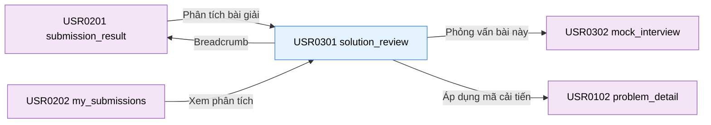

# Tài liệu thiết kế cơ bản (BD) — Phân tích bài giải (`USR0301`)

## Phương châm tài liệu [Nội bộ — không cần khách duyệt]

- Viết theo **mẫu 9 sheet**. Bộ thẻ đóng, quy ước ID, ký hiệu chuẩn, ranh giới với tài liệu khác và
  checklist kiểm toán nằm ở `02-bd/_rules/bd-template-9sheet.md` — file này không chép lại.
- Phần gắn nhãn `[Nội bộ]` phục vụ sinh mã và tự kiểm toán, không phải yêu cầu của khách hàng: mục 4.5,
  mục 7.3 và các ghi chú quy ước.
- Mã màn `USR0301` theo bảng mã ở `02-bd/_rules/bd-template-9sheet.md` mục 8 dòng 142; tên file mang tiền
  tố mã.
- Khung điều hướng **không mô tả lại ở đây** — dùng chung `02-bd/screens/users/_shell.md`. Màn này là màn
  khoan sâu từ `submission_result` hoặc `my_submissions`, không có mục nav riêng trên header
  [Nguồn: 02-bd/screens/users/_shell.md:66-67].
- Màn này có **một popup**: xác nhận áp dụng bản mã đề xuất của AI vào Workspace (F5-26).

> Đọc cùng `01-rd/screens/users/USR0301_solution_review.md` (hành vi ở mức yêu cầu, không lặp lại ở đây),
> `01-rd/req/ai-review.md` (F5-01→F5-08, F5-17, F5-18, F5-20, F5-22, F5-23, F5-25, F5-26),
> `01-rd/req/user_stories/a1_student.md` (`US-A1-06`), `02-bd/architecture/ai-review.md`,
> `02-bd/database/ai-review.md`, `02-bd/security/ai-review.md`.
>
> - **Phân tích một lượt không hội thoại**: màn này chỉ hiển thị báo cáo phân tích tĩnh được AI sinh ra một
>   lượt dưới dạng cấu trúc JSON (F5-07); không duy trì hội thoại kéo dài (hội thoại thuộc `mock_interview`).
> - **Chỉ mở cho bài nộp `ACCEPTED`**: chỉ các bài nộp đã vượt qua toàn bộ testcase mới được phép yêu cầu hoặc
>   mở báo cáo phân tích (F5-01); cố tình mở với bài chưa đạt sẽ bị từ chối.
> - **Bắt buộc hiển thị định hướng giáo dục**: banner định hướng "Là phản hồi để học, không phải điểm chính thức"
>   bắt buộc hiển thị nổi bật ở đầu trang theo quy định tại F5-18.
> - **Bộ nhớ đệm theo mã băm (F5-20)**: nếu nộp lại cùng mã nguồn (cùng hash SHA-256) trên cùng bài toán, hệ thống
>   đọc lại báo cáo từ cache hoặc DB, không gọi lại LLM provider.
> - **Áp dụng bản mã cải tiến (F5-26)**: cung cấp giao diện xem khác biệt (Diff Viewer); khi bấm áp dụng phải có
>   hộp thoại xác nhận ghi đè trước khi chuyển người học về Workspace `problem_detail`.

> **Quy ước đặt tên khối** [Nội bộ]. Bảy khối: `breadcrumb` (đường dẫn phân cấp), `topStats` (thanh chỉ số
> tổng hợp đầu trang), `eduNotice` (banner cảnh báo định hướng giáo dục F5-18), `complexityBlock` (khối phân
> tích độ phức tạp thời gian/bộ nhớ thực tế vs tối ưu), `rubricCards` (5 thẻ tiêu chí đánh giá F5-23),
> `strengthsAndWeaknesses` (danh sách điểm mạnh, điểm cần sửa và trường hợp biên), `codeDiffSection` (khối mã
> đề xuất kèm Diff và nút áp dụng), `applyConfirm` (popup xác nhận ghi đè mã vào Workspace). Tiền tố ID item
> của toàn màn là `solutionReview.`.

---

## Sheet 1. Bìa

| Mục | Giá trị |
| :--- | :--- |
| Hệ thống | AlgoPrep |
| Phân hệ | `ai-review` (F5.1) — liên kết từ `judge-orchestration` (F4), đọc `problem-bank` (F2) |
| Công đoạn | BD — Thiết kế cơ bản |
| Phân loại | Màn hình |
| Tên màn | Phân tích bài giải |
| Mã màn hình | `USR0301` |
| Tên vật lý (slug) | `solution_review` |
| Trục tài liệu | Màn hình (`02-bd/screens/`) |
| Actor | A1 (`STUDENT`) |
| Phiên bản | V0.1 |
| Người tạo | Nhóm phát triển AlgoPrep |
| Ngày tạo | 2026/09/22 |
| Người cập nhật | Nhóm phát triển AlgoPrep |
| Ngày cập nhật | 2026/09/22 |

---

## Sheet 2. Lịch sử sửa đổi

| Ver | Sheet bị sửa | Nội dung sửa | Ngày | Người sửa |
| :--- | :--- | :--- | :--- | :--- |
| V0.1 | Toàn bộ | Tạo mới theo mẫu 9 sheet. Chốt cấu trúc JSON báo cáo phân tích F5-07, so sánh độ phức tạp F5-02/F5-03, rubric 5 tiêu chí F5-23, banner giáo dục F5-18, cơ chế cache mã băm F5-20, và popup xác nhận áp dụng mã F5-26 | 2026/09/22 | Nhóm phát triển AlgoPrep |
| V0.2 | Sheet 3, 5, 6, 7.3, 8, 9, Câu hỏi mở | Viết lại Sheet 3 theo khuôn "Danh sách chuyển màn" 6 thẻ + sơ đồ Mermaid; viết lại Sheet 5 theo khuôn 14 cột (thêm Bảng DB/Cột DB); sửa nguồn phần lớn nội dung báo cáo về đúng cột thật `ai.solution_reviews.result_json` (JSONB) thay vì các cột riêng không tồn tại (`approach_title`, `strengths`...); bỏ cột "Phương thức & URL dự kiến" ở Sheet 7.3. Bổ sung Khu vực I (Trạng thái đang xử lý/lỗi AI) tách rõ ba trạng thái theo Câu hỏi mở Q3 của RD: đang tải, lỗi tạm thời (cho thử lại), bị khoá ngân sách F5-25 (không cho thử lại) — cập nhật đồng bộ Sheet 6, Sheet 8 (EVT-1, EVT-7 mới) và Sheet 9 (tách dòng kiểm 4 thành 4 và 5) | 2026/09/24 | Nhóm phát triển AlgoPrep |

---

## Sheet 3. Sơ đồ chuyển màn

> [Nội bộ] Quy ước vẽ: `02-bd/_rules/bd-template-9sheet.md` mục 2, 3.

### 3.1 Danh sách chuyển màn

#### Kết quả nộp bài → Phân tích bài giải

[Điều kiện mở] Bài nộp có verdict `ACCEPTED`, người học bấm "Phân tích bài giải" (F5-01)
[Nguồn: 01-rd/req/ai-review.md — F5-01].

[Chế độ mở] Điều hướng URL `/submissions/{submission_id}/review`.

[Thông tin truyền] `submission_id`.

[Giá trị trả về] Không có.

[Khi thành công] Hiển thị báo cáo phân tích đã có trong cache/DB (F5-20), hoặc trạng thái đang xử lý nếu
báo cáo chưa từng được sinh cho bài nộp này (REQ-13, Câu hỏi mở Q3 của RD).

[Khi huỷ] Không có.

#### Bài đã nộp → Phân tích bài giải

[Điều kiện mở] Bấm nút "Phân tích" tại dòng bài nộp `ACCEPTED`.

[Chế độ mở] Mở trực tiếp trang phân tích.

[Thông tin truyền] `submission_id`.

[Giá trị trả về] Không có.

[Khi thành công] Mở báo cáo phân tích đã lưu.

[Khi huỷ] Không có.

#### Phân tích bài giải → Phỏng vấn giả lập

[Điều kiện mở] Bấm "Phỏng vấn về bài này" tại góc phải đầu trang.

[Chế độ mở] Điều hướng URL `/mock-interview?submission_id={submission_id}`.

[Thông tin truyền] `submission_id`, `problem_id`.

[Giá trị trả về] Không có.

[Khi thành công] Khởi tạo phiên phỏng vấn giả lập gắn với bài giải hiện tại.

[Khi huỷ] Không có.

#### Phân tích bài giải → Chi tiết bài tập (áp dụng mã đề xuất)

[Điều kiện mở] Bấm "Áp dụng vào Workspace" và xác nhận tại popup (F5-26)
[Nguồn: 01-rd/req/ai-review.md — F5-26].

[Chế độ mở] Điều hướng URL `/problems/{problem_slug}?restore=ai_diff`.

[Thông tin truyền] Bản mã nguồn cải tiến truyền qua state trình duyệt/Session Storage.

[Giá trị trả về] Không có.

[Khi thành công] Workspace mở ra với mã mới nạp sẵn vào editor.

[Khi huỷ] Đóng popup xác nhận, ở lại màn hiện tại — không ghi đè mã.

#### Phân tích bài giải → Kết quả nộp bài (breadcrumb)

[Điều kiện mở] Bấm link `SUB-{id}` trên thanh breadcrumb.

[Chế độ mở] Điều hướng quay lại màn kết quả nộp bài.

[Thông tin truyền] `submission_id`.

[Giá trị trả về] Không có.

[Khi thành công] Quay lại màn `submission_result`.

[Khi huỷ] Không có.

### 3.2 Sơ đồ

[Nguồn: 01-rd/req/ai-review.md — F5-01, F5-20, F5-26; 01-rd/screens/users/USR0301_solution_review.md:158]

---

## Sheet 4. Bố cục màn hình

### 4.1. Tổng quan theo thẻ

- `[Mục đích màn]` Trình bày báo cáo phản hồi sư phạm chuyên sâu của AI về bài giải đã đạt chuẩn: phân tích độ phức tạp, đánh giá phong cách lập trình theo rubric, chỉ ra các bẫy tiềm ẩn và đề xuất mã nguồn tối ưu hơn.
- `[Luồng nghiệp vụ chính]` Sau khi giải thành công một bài toán, người học xem báo cáo phân tích để hiểu rõ điểm mạnh, điểm yếu, đối chiếu độ phức tạp thuật toán với giải pháp tối ưu đã biết, và có thể áp dụng mã gợi ý vào Workspace để thực nghiệm.
- `[Người dùng]` Học viên (A1 — chủ sở hữu bài nộp).
- `[Tệp liên quan]` `01-rd/screens/users/USR0301_solution_review.md`, `09-layoutBase/Phân tích bài giải.dc.html`.
- `[Phạm vi]` Một bài nộp đã `ACCEPTED` tương ứng với `submission_id`.
- `[Quyền sử dụng]` Chỉ học viên sở hữu bài nộp mới được quyền yêu cầu sinh và xem báo cáo phân tích.
- `[Số bản ghi tối đa]` Một báo cáo phân tích cho mỗi bài nộp.

### 4.2. Danh sách cấu trúc dữ liệu màn hình (DTOs)

| STT | Tên DTO | Mô tả | Chi tiết trường |
| :-: | :--- | :--- | :--- |
| 1 | `SolutionReviewDetailDto` | Cấu trúc JSON báo cáo phân tích tĩnh | `id`, `submissionId`, `problemId`, `problemTitle`, `difficulty`, `approachTitle`, `isApproachOptimal`, `readabilityScore`, `createdAt`, `summaryText`, `timeComplexity`, `spaceComplexity`, `criteriaScores`, `strengths`, `improvements`, `edgeCases`, `suggestedCodeDiff` |
| 2 | `ComplexityAnalysisDto` | Phân tích độ phức tạp chi tiết | `actualTime`, `optimalTime`, `timeExplanation`, `actualSpace`, `optimalSpace`, `spaceExplanation` |
| 3 | `ReviewCriterionScoreDto` | Điểm và nhận xét theo tiêu chí rubric | `criterionCode`, `criterionName`, `score`, `maxScore`, `feedback` |
| 4 | `CodeDiffProposalDto` | Bản mã đề xuất cải tiến | `originalCode`, `suggestedCode`, `diffText`, `explanation` |

### 4.3. Danh sách bảng dữ liệu

| STT | Tên bảng | Mô tả | Thao tác | Bounded Context |
| :-: | :--- | :--- | :--- | :--- |
| 1 | `ai.solution_reviews` | Lưu trữ báo cáo phân tích dạng JSON | C, R | `ai-review` |
| 2 | `judge.submissions` | Bản ghi bài nộp gốc và mã nguồn | R | `judge-orchestration` |
| 3 | `problem.problems` | Thông tin bài toán và độ phức tạp chuẩn | R | `problem-bank` |

### 4.4. Vùng bố cục bám prototype

Bố cục dạng tài liệu báo cáo dọc chuyên nghiệp:

| Ký hiệu | Tên khu vực | Tham chiếu prototype | Ghi chú |
| :-: | :--- | :--- | :--- |
| **A** | Thanh đường dẫn (Breadcrumb) | `Phân tích bài giải.dc.html:99-105` | `Kết quả nộp bài / SUB-2841 / Phân tích bài giải` |
| **B** | Thanh chỉ số đầu trang (Top Stats) | `Phân tích bài giải.dc.html:107-117` | Tên bài, Hướng giải, Điểm dễ đọc, nút Phỏng vấn |
| **C** | Banner định hướng giáo dục (Edu Notice) | `Phân tích bài giải.dc.html:124-127` | Thông báo bản quyền & giá trị phản hồi học tập (F5-18) |
| **D** | Khối so sánh độ phức tạp (Complexity) | `Phân tích bài giải.dc.html:130-155` | Bảng đối chiếu Time / Space thực tế vs tối ưu |
| **E** | 5 thẻ tiêu chí Rubric (Rubric Cards) | `Phân tích bài giải.dc.html:158-190` | 5 thẻ tiêu chuẩn theo F5-23 |
| **F** | Điểm mạnh, cải thiện & ca biên | `Phân tích bài giải.dc.html:193-230` | Danh sách gạch đầu dòng phân tích chi tiết |
| **G** | Đề xuất mã nguồn & Diff Viewer | `Phân tích bài giải.dc.html:233-275` | Monaco Diff Editor và nút "Áp dụng vào Workspace" |
| **H** | Popup xác nhận áp dụng mã | `[SoT: Suy luận]` | Hộp thoại cảnh báo ghi đè mã nguồn hiện tại trong Workspace |

### 4.5. Cấu trúc slice FSD [Nội bộ]

- Route: `/submissions/[id]/review`
- View slice: `src/views/users/solution-review/`
  - `ui/solution-review-page.tsx`
  - `ui/review-header-stats.tsx`
  - `ui/educational-disclaimer-banner.tsx`
  - `ui/complexity-comparison-card.tsx`
  - `ui/rubric-criteria-grid.tsx`
  - `ui/insights-and-edge-cases.tsx`
  - `ui/code-diff-viewer.tsx`
  - `ui/apply-code-confirm-modal.tsx`
  - `model/use-solution-review.ts`

---

## Sheet 5. Danh sách item màn hình

> Quy ước ID, bộ thẻ và giá trị chuẩn: `02-bd/_rules/bd-template-9sheet.md` mục 2, 3, 4. Phần lớn nội dung
> báo cáo (Khu vực D-G) nằm trong `ai.solution_reviews.result_json` (JSONB) chứ không phải cột riêng —
> lược đồ JSON chi tiết chốt ở `03-dd/api/ai-review.md`, ở đây chỉ ghi đường dẫn trường dự kiến
> [Nguồn: 02-bd/database/ai-review.md:50].

### Khu vực A — Thanh đường dẫn (Breadcrumb)

| Khu vực | NO | Tên item | ID item | Bảng DB | Cột DB | Loại UI | Kiểu | Độ dài | Bắt buộc | I/O | Giá trị mặc định | Định dạng | Ghi chú |
| :--- | --: | :--- | :--- | :--- | :--- | :--- | :--- | :--- | :-: | :-: | :--- | :--- | :--- |
| Breadcrumb | | | | | | | | | | | | | |
| | 1 | Link Kết quả nộp | `solutionReview.breadcrumb.linkSubmission` | - | - | Link | String | 50 | Có | O | - | "Kết quả nộp bài" | Dẫn về màn `submission_result` [Nguồn giá trị] Nhãn tĩnh [EVT liên quan] EVT-2 |
| | 2 | Link Mã lượt nộp | `solutionReview.breadcrumb.linkSubmissionId` | `judge.submissions` | `id` | Link | String | 30 | Có | O | - | `SUB-{id}` | Mã bài nộp hiện tại [Nguồn: 02-bd/database/judge-orchestration.md:14] [EVT liên quan] EVT-2 |
| | 3 | Nhãn Trang hiện tại | `solutionReview.breadcrumb.lblCurrent` | - | - | Label | String | 50 | Có | O | - | "Phân tích bài giải" | Nhãn trang hiện tại [Nguồn giá trị] Nhãn tĩnh [EVT liên quan] - |

### Khu vực B — Thanh chỉ số đầu trang (Top Stats)

| Khu vực | NO | Tên item | ID item | Bảng DB | Cột DB | Loại UI | Kiểu | Độ dài | Bắt buộc | I/O | Giá trị mặc định | Định dạng | Ghi chú |
| :--- | --: | :--- | :--- | :--- | :--- | :--- | :--- | :--- | :-: | :-: | :--- | :--- | :--- |
| Top Stats | | | | | | | | | | | | | |
| | 1 | Tên và độ khó bài | `solutionReview.stats.lblProblem` | `problem.problems` | `title`, `difficulty` | Label | String | 150 | Có | O | - | `{title} ({độ khó})` | Tiêu đề bài toán và badge độ khó [Nguồn: 02-bd/database/problem-bank.md:15,17] [EVT liên quan] - |
| | 2 | Thẻ Hướng giải thuật | `solutionReview.stats.lblApproach` | `ai.solution_reviews` | `result_json` (path `approachTitle`, `isApproachOptimal`) | Badge | String | 60 | Có | O | - | - | Đánh giá hướng giải AI nhận diện — nằm trong báo cáo JSON F5-07, không phải cột riêng [Nguồn: 02-bd/database/ai-review.md:50] [EVT liên quan] - |
| | 3 | Thẻ Điểm dễ đọc | `solutionReview.stats.lblReadability` | `ai.solution_reviews` | `readability_score` | Badge | String | 20 | Có | O | - | `Dễ đọc: {score} / 5` | Điểm đánh giá độ sạch mã nguồn, AI tự chấm trong cùng lượt (F5-05) [Nguồn: 02-bd/database/ai-review.md:51] [EVT liên quan] - |
| | 4 | Thời điểm phân tích | `solutionReview.stats.lblGeneratedAt` | `ai.solution_reviews` | `created_at` | Label | String | 40 | Có | O | - | `Sinh lúc HH:mm - dd/MM/yyyy` | Mốc thời gian tạo báo cáo [Nguồn: 02-bd/database/ai-review.md:58] [EVT liên quan] - |
| | 5 | Nút Phỏng vấn bài này | `solutionReview.stats.btnInterview` | - | - | Button | String | 50 | Có | I | - | "Phỏng vấn về bài này" | Dẫn sang `mock_interview` [Nguồn giá trị] Nhãn tĩnh [EVT liên quan] EVT-3 |

### Khu vực C — Banner định hướng giáo dục (Edu Notice)

| Khu vực | NO | Tên item | ID item | Bảng DB | Cột DB | Loại UI | Kiểu | Độ dài | Bắt buộc | I/O | Giá trị mặc định | Định dạng | Ghi chú |
| :--- | --: | :--- | :--- | :--- | :--- | :--- | :--- | :--- | :-: | :-: | :--- | :--- | :--- |
| Edu Notice | | | | | | | | | | | | | |
| | 1 | Hộp cảnh báo sư phạm | `solutionReview.eduNotice.boxBanner` | - | - | Label | String | 300 | Có | O | - | - | Bắt buộc hiển thị nổi bật theo F5-18 [Nguồn giá trị] Nhãn tĩnh i18n [EVT liên quan] - |

### Khu vực D — Khối so sánh độ phức tạp (Complexity)

| Khu vực | NO | Tên item | ID item | Bảng DB | Cột DB | Loại UI | Kiểu | Độ dài | Bắt buộc | I/O | Giá trị mặc định | Định dạng | Ghi chú |
| :--- | --: | :--- | :--- | :--- | :--- | :--- | :--- | :--- | :-: | :-: | :--- | :--- | :--- |
| Complexity | | | | | | | | | | | | | |
| | 1 | Nhãn Thời gian thực tế | `solutionReview.complexity.actualTime` | `ai.solution_reviews` | `result_json` (path `complexity.actualTime`) | Label | String | 30 | Có | O | - | - | Độ phức tạp thời gian thực tế F5-02, trong JSON báo cáo [Nguồn: 02-bd/database/ai-review.md:50] [EVT liên quan] - |
| | 2 | Nhãn Thời gian tối ưu | `solutionReview.complexity.optimalTime` | `ai.solution_reviews` | `result_json` (path `complexity.optimalTime`) | Label | String | 30 | Có | O | - | - | Độ phức tạp thời gian tối ưu đã biết, AI đối chiếu [Nguồn: 02-bd/database/ai-review.md:50] [EVT liên quan] - |
| | 3 | Đoạn lập luận thời gian | `solutionReview.complexity.timeExplain` | `ai.solution_reviews` | `result_json` (path `complexity.timeExplanation`) | TextArea | String | 500 | Có | O | - | - | Lập luận chứng minh độ phức tạp thời gian [Nguồn: 02-bd/database/ai-review.md:50] [EVT liên quan] - |
| | 4 | Nhãn Bộ nhớ thực tế | `solutionReview.complexity.actualSpace` | `ai.solution_reviews` | `result_json` (path `complexity.actualSpace`) | Label | String | 30 | Có | O | - | - | Độ phức tạp không gian thực tế F5-03 [Nguồn: 02-bd/database/ai-review.md:50] [EVT liên quan] - |
| | 5 | Nhãn Bộ nhớ tối ưu | `solutionReview.complexity.optimalSpace` | `ai.solution_reviews` | `result_json` (path `complexity.optimalSpace`) | Label | String | 30 | Có | O | - | - | Độ phức tạp không gian tối ưu đã biết [Nguồn: 02-bd/database/ai-review.md:50] [EVT liên quan] - |
| | 6 | Đoạn lập luận bộ nhớ | `solutionReview.complexity.spaceExplain` | `ai.solution_reviews` | `result_json` (path `complexity.spaceExplanation`) | TextArea | String | 500 | Có | O | - | - | Lập luận chứng minh độ phức tạp bộ nhớ [Nguồn: 02-bd/database/ai-review.md:50] [EVT liên quan] - |

### Khu vực E — 5 thẻ tiêu chí Rubric (Rubric Cards)

| Khu vực | NO | Tên item | ID item | Bảng DB | Cột DB | Loại UI | Kiểu | Độ dài | Bắt buộc | I/O | Giá trị mặc định | Định dạng | Ghi chú |
| :--- | --: | :--- | :--- | :--- | :--- | :--- | :--- | :--- | :-: | :-: | :--- | :--- | :--- |
| Rubric Cards | | | | | | | | | | | | | |
| | 1 | Thẻ Tính đúng đắn | `solutionReview.rubric.cardCorrectness` | `ai.solution_reviews` | `result_json` (path `criteriaScores[].feedback` khớp `criterionCode = CORRECTNESS`) | Label | String | 200 | Có | O | - | - | Tiêu chí 1: Tính đúng đắn và ca biên F5-23, trọng số cấu hình ở `rubric_configs` [Nguồn: 02-bd/database/ai-review.md:27-38,50] [EVT liên quan] - |
| | 2 | Thẻ Hiệu năng | `solutionReview.rubric.cardPerformance` | `ai.solution_reviews` | `result_json` (path `criteriaScores[]` khớp `criterionCode = PERFORMANCE`) | Label | String | 200 | Có | O | - | - | Tiêu chí 2: Tối ưu thời gian & bộ nhớ [Nguồn: 02-bd/database/ai-review.md:50] [EVT liên quan] - |
| | 3 | Thẻ Chất lượng mã | `solutionReview.rubric.cardCleanCode` | `ai.solution_reviews` | `result_json` (path `criteriaScores[]` khớp `criterionCode = CLEAN_CODE`) | Label | String | 200 | Có | O | - | - | Tiêu chí 3: Độ sạch và quy chuẩn đặt tên [Nguồn: 02-bd/database/ai-review.md:50] [EVT liên quan] - |
| | 4 | Thẻ Khả năng mở rộng | `solutionReview.rubric.cardScalability` | `ai.solution_reviews` | `result_json` (path `criteriaScores[]` khớp `criterionCode = SCALABILITY`) | Label | String | 200 | Có | O | - | - | Tiêu chí 4: Tính tổng quát hóa của mã [Nguồn: 02-bd/database/ai-review.md:50] [EVT liên quan] - |
| | 5 | Thẻ Cấu trúc dữ liệu | `solutionReview.rubric.cardDataStructure` | `ai.solution_reviews` | `result_json` (path `criteriaScores[]` khớp `criterionCode = DATA_STRUCTURE`) | Label | String | 200 | Có | O | - | - | Tiêu chí 5: Lựa chọn CTDL & giải thuật [Nguồn: 02-bd/database/ai-review.md:50] [EVT liên quan] - |

5 mã `criterionCode` cụ thể (`CORRECTNESS`, `PERFORMANCE`, `CLEAN_CODE`, `SCALABILITY`, `DATA_STRUCTURE`)
là `[SoT: Suy luận]` — `rubric_configs.criterion_code` để A3 tự đặt qua giao diện cấu hình, chưa có danh
sách cố định trong RD [Nguồn: 02-bd/database/ai-review.md:36].

### Khu vực F — Điểm mạnh, cải thiện & ca biên

| Khu vực | NO | Tên item | ID item | Bảng DB | Cột DB | Loại UI | Kiểu | Độ dài | Bắt buộc | I/O | Giá trị mặc định | Định dạng | Ghi chú |
| :--- | --: | :--- | :--- | :--- | :--- | :--- | :--- | :--- | :-: | :-: | :--- | :--- | :--- |
| Insights | | | | | | | | | | | | | |
| | 1 | Danh sách Điểm mạnh | `solutionReview.insights.listStrengths` | `ai.solution_reviews` | `result_json` (path `strengths[]`) | List | String | 2000 | Có | O | - | - | Các điểm làm tốt của giải pháp (F5-05) [Nguồn: 02-bd/database/ai-review.md:50] [EVT liên quan] - |
| | 2 | Danh sách Cần cải thiện | `solutionReview.insights.listImprovements` | `ai.solution_reviews` | `result_json` (path `improvements[]`) | List | String | 2000 | Có | O | - | - | Các gợi ý cải tiến mã nguồn (F5-05) [Nguồn: 02-bd/database/ai-review.md:50] [EVT liên quan] - |
| | 3 | Danh sách Ca biên tiềm ẩn | `solutionReview.insights.listEdgeCases` | `ai.solution_reviews` | `result_json` (path `edgeCases[]`) | List | String | 2000 | Có | O | - | - | Ca biên, giả định ngầm, rủi ro tràn số F5-04 [Nguồn: 02-bd/database/ai-review.md:50] [EVT liên quan] - |

### Khu vực G — Đề xuất mã nguồn & Diff Viewer

| Khu vực | NO | Tên item | ID item | Bảng DB | Cột DB | Loại UI | Kiểu | Độ dài | Bắt buộc | I/O | Giá trị mặc định | Định dạng | Ghi chú |
| :--- | --: | :--- | :--- | :--- | :--- | :--- | :--- | :--- | :-: | :-: | :--- | :--- | :--- |
| Diff Viewer | | | | | | | | | | | | | |
| | 1 | Trình xem so sánh Diff | `solutionReview.diff.viewerMonaco` | `ai.solution_reviews`, `judge.submissions` | `result_json` (path `suggestedCode`), `source_code` | TextArea | String | 50000 | Có | O | - | - | Monaco Diff Editor chỉ đọc so sánh mã gốc (`submissions.source_code`) và mã đề xuất trong báo cáo [Nguồn: 02-bd/database/judge-orchestration.md:20; 02-bd/database/ai-review.md:50] [EVT liên quan] - |
| | 2 | Đoạn giải thích mã mới | `solutionReview.diff.txtExplanation` | `ai.solution_reviews` | `result_json` (path `codeDiff.explanation`) | TextArea | String | 1000 | Có | O | - | - | Giải thích lý do sửa đổi (F5-26) [Nguồn: 02-bd/database/ai-review.md:50] [EVT liên quan] - |
| | 3 | Nút Áp dụng vào Workspace | `solutionReview.diff.btnApply` | - | - | Button | String | 50 | Có | I | - | "Áp dụng vào Workspace" | Kích hoạt popup xác nhận áp dụng mã F5-26 [Nguồn giá trị] Nhãn tĩnh [EVT liên quan] EVT-4 |

### Khu vực H — Popup xác nhận áp dụng mã

| Khu vực | NO | Tên item | ID item | Bảng DB | Cột DB | Loại UI | Kiểu | Độ dài | Bắt buộc | I/O | Giá trị mặc định | Định dạng | Ghi chú |
| :--- | --: | :--- | :--- | :--- | :--- | :--- | :--- | :--- | :-: | :-: | :--- | :--- | :--- |
| Popup xác nhận | | | | | | | | | | | | | |
| | 1 | Tiêu đề popup | `solutionReview.applyConfirm.lblTitle` | - | - | Label | String | 50 | Có | O | - | "Xác nhận ghi đè mã nguồn" | Tiêu đề cảnh báo [Nguồn giá trị] Nhãn tĩnh [EVT liên quan] - |
| | 2 | Nội dung cảnh báo | `solutionReview.applyConfirm.lblMessage` | - | - | Label | String | 200 | Có | O | - | - | Cảnh báo trước khi thay đổi mã nguồn [Nguồn giá trị] Nhãn tĩnh [EVT liên quan] - |
| | 3 | Nút Huỷ | `solutionReview.applyConfirm.btnCancel` | - | - | Button | String | 20 | Có | I | - | "Huỷ" | Đóng popup, không thay đổi [Nguồn giá trị] Nhãn tĩnh [EVT liên quan] EVT-5 |
| | 4 | Nút Xác nhận áp dụng | `solutionReview.applyConfirm.btnConfirm` | - | - | Button | String | 30 | Có | I | - | "Ghi đè & Mở Workspace" | Xác nhận áp dụng và chuyển màn F5-26 [Nguồn giá trị] Nhãn tĩnh [EVT liên quan] EVT-6 |

### Khu vực I — Trạng thái đang xử lý / lỗi AI [Nội bộ, bổ sung khớp RD]

> Chưa có trong prototype tĩnh — RD Câu hỏi mở Q3 (đã chốt hướng nghiệp vụ, phần dựng UI **[Đợi nextjs]**)
> yêu cầu tách rõ ba trạng thái: đang tải báo cáo có sẵn, đang chờ AI sinh báo cáo mới, và không sinh được
> báo cáo — phân biệt lỗi tạm thời (cho thử lại) với bị khoá theo ngân sách token (không cho thử lại)
> [Nguồn: 01-rd/screens/users/USR0301_solution_review.md:138,158-159].

| Khu vực | NO | Tên item | ID item | Bảng DB | Cột DB | Loại UI | Kiểu | Độ dài | Bắt buộc | I/O | Giá trị mặc định | Định dạng | Ghi chú |
| :--- | --: | :--- | :--- | :--- | :--- | :--- | :--- | :--- | :-: | :-: | :--- | :--- | :--- |
| Trạng thái xử lý | | | | | | | | | | | | | |
| | 1 | Khung chờ đang phân tích | `solutionReview.status.loadingSkeleton` | - | - | Label | String | - | - | O | - | - | Hiện khi báo cáo chưa có sẵn và hệ thống đang gọi AI sinh mới (F5-01); thay thế toàn bộ Khu vực B-G [Nguồn giá trị] Trạng thái suy ra: gọi `GetOrCreateSolutionReview` chưa trả kết quả [Nguồn: 01-rd/screens/users/USR0301_solution_review.md:158] [EVT liên quan] EVT-1 |
| | 2 | Thông báo lỗi tạm thời | `solutionReview.status.errorTransient` | - | - | Label | String | 200 | - | O | - | - | AI provider lỗi hoặc timeout gọi model (không phải hết ngân sách) — cho phép bấm thử lại (F5-22) [Nguồn giá trị] Mã lỗi trong phản hồi khác nhóm ngân sách [EVT liên quan] EVT-1 |
| | 3 | Nút Thử lại | `solutionReview.status.btnRetry` | - | - | Button | String | 30 | - | I | - | "Thử lại" | Gọi lại `GetOrCreateSolutionReview`; chỉ xuất hiện cùng lỗi tạm thời (NO 2), không xuất hiện cùng lỗi ngân sách (NO 4) [Nguồn giá trị] Nhãn tĩnh [EVT liên quan] EVT-1 |
| | 4 | Thông báo bị khoá ngân sách | `solutionReview.status.errorBudgetLocked` | - | - | Label | String | 200 | - | O | - | - | Vượt ngân sách token AI (F5-25) — không cho thử lại, chỉ hiện lý do và lối thoát về Workspace/kết quả [Nguồn giá trị] Mã lỗi ngân sách trong phản hồi [Nguồn: 01-rd/req/ai-review.md — F5-25] [EVT liên quan] EVT-1 |

[Nguồn: 02-bd/database/ai-review.md:27-38,50-58; 02-bd/database/problem-bank.md:15,17;
02-bd/database/judge-orchestration.md:14,20; 01-rd/req/ai-review.md — F5-01→F5-06, F5-22, F5-25;
01-rd/screens/users/USR0301_solution_review.md:138,158-159]

---

## Sheet 6. Đặc tả điều khiển item

### Khu vực A: Thanh đường dẫn

| NO | Tên item | Hiển thị | Kích hoạt | Ghi chú |
| --: | :--- | :--- | :--- | :--- |
| 1 | Link Kết quả nộp | Có | Có | [Điều kiện hiển thị] Luôn hiển thị. [Điều kiện kích hoạt] Luôn kích hoạt. [Tự động đặt] - |
| 2 | Link Mã lượt nộp | Có | Có | [Điều kiện hiển thị] Luôn hiển thị. [Điều kiện kích hoạt] Luôn kích hoạt. [Tự động đặt] - |
| 3 | Nhãn Trang hiện tại | Có | Không | [Điều kiện hiển thị] Luôn hiển thị. [Điều kiện kích hoạt] Không áp dụng. [Tự động đặt] - |

### Khu vực B: Thanh chỉ số đầu trang

| NO | Tên item | Hiển thị | Kích hoạt | Ghi chú |
| --: | :--- | :--- | :--- | :--- |
| 1 | Tên và độ khó bài | Có | Không | [Điều kiện hiển thị] Luôn hiển thị. [Điều kiện kích hoạt] Không áp dụng. [Tự động đặt] - |
| 2 | Thẻ Hướng giải thuật | Có | Không | [Điều kiện hiển thị] Luôn hiển thị. [Điều kiện kích hoạt] Không áp dụng. [Tự động đặt] - |
| 3 | Thẻ Điểm dễ đọc | Có | Không | [Điều kiện hiển thị] Luôn hiển thị. [Điều kiện kích hoạt] Không áp dụng. [Tự động đặt] - |
| 4 | Thời điểm phân tích | Có | Không | [Điều kiện hiển thị] Luôn hiển thị. [Điều kiện kích hoạt] Không áp dụng. [Tự động đặt] - |
| 5 | Nút Phỏng vấn bài này | Có | Có | [Điều kiện hiển thị] Luôn hiển thị. [Điều kiện kích hoạt] Luôn kích hoạt. [Tự động đặt] - |

### Khu vực C: Banner định hướng giáo dục

| NO | Tên item | Hiển thị | Kích hoạt | Ghi chú |
| --: | :--- | :--- | :--- | :--- |
| 1 | Hộp cảnh báo sư phạm | Có | Không | [Điều kiện hiển thị] Bắt buộc luôn hiển thị nổi bật ở đầu báo cáo theo F5-18. [Điều kiện kích hoạt] Không áp dụng. [Tự động đặt] - |

### Khu vực D: Khối so sánh độ phức tạp

| NO | Tên item | Hiển thị | Kích hoạt | Ghi chú |
| --: | :--- | :--- | :--- | :--- |
| 1 | Nhãn Thời gian thực tế | Có | Không | [Điều kiện hiển thị] Luôn hiển thị. [Điều kiện kích hoạt] Không áp dụng. [Tự động đặt] - |
| 2 | Nhãn Thời gian tối ưu | Có | Không | [Điều kiện hiển thị] Luôn hiển thị. [Điều kiện kích hoạt] Không áp dụng. [Tự động đặt] - |
| 3 | Đoạn lập luận thời gian | Có | Không | [Điều kiện hiển thị] Luôn hiển thị. [Điều kiện kích hoạt] Không áp dụng. [Tự động đặt] - |
| 4 | Nhãn Bộ nhớ thực tế | Có | Không | [Điều kiện hiển thị] Luôn hiển thị. [Điều kiện kích hoạt] Không áp dụng. [Tự động đặt] - |
| 5 | Nhãn Bộ nhớ tối ưu | Có | Không | [Điều kiện hiển thị] Luôn hiển thị. [Điều kiện kích hoạt] Không áp dụng. [Tự động đặt] - |
| 6 | Đoạn lập luận bộ nhớ | Có | Không | [Điều kiện hiển thị] Luôn hiển thị. [Điều kiện kích hoạt] Không áp dụng. [Tự động đặt] - |

### Khu vực E: 5 thẻ tiêu chí Rubric

| NO | Tên item | Hiển thị | Kích hoạt | Ghi chú |
| --: | :--- | :--- | :--- | :--- |
| 1 | Thẻ Tính đúng đắn | Có | Không | [Điều kiện hiển thị] Luôn hiển thị. [Điều kiện kích hoạt] Không áp dụng. [Tự động đặt] - |
| 2 | Thẻ Hiệu năng | Có | Không | [Điều kiện hiển thị] Luôn hiển thị. [Điều kiện kích hoạt] Không áp dụng. [Tự động đặt] - |
| 3 | Thẻ Chất lượng mã | Có | Không | [Điều kiện hiển thị] Luôn hiển thị. [Điều kiện kích hoạt] Không áp dụng. [Tự động đặt] - |
| 4 | Thẻ Khả năng mở rộng | Có | Không | [Điều kiện hiển thị] Luôn hiển thị. [Điều kiện kích hoạt] Không áp dụng. [Tự động đặt] - |
| 5 | Thẻ Cấu trúc dữ liệu | Có | Không | [Điều kiện hiển thị] Luôn hiển thị. [Điều kiện kích hoạt] Không áp dụng. [Tự động đặt] - |

### Khu vực F: Điểm mạnh, cải thiện & ca biên

| NO | Tên item | Hiển thị | Kích hoạt | Ghi chú |
| --: | :--- | :--- | :--- | :--- |
| 1 | Danh sách Điểm mạnh | Có | Không | [Điều kiện hiển thị] Luôn hiển thị. [Điều kiện kích hoạt] Không áp dụng. [Tự động đặt] - |
| 2 | Danh sách Cần cải thiện | Có | Không | [Điều kiện hiển thị] Luôn hiển thị. [Điều kiện kích hoạt] Không áp dụng. [Tự động đặt] - |
| 3 | Danh sách Ca biên tiềm ẩn | Có | Không | [Điều kiện hiển thị] Luôn hiển thị. [Điều kiện kích hoạt] Không áp dụng. [Tự động đặt] - |

### Khu vực G: Đề xuất mã nguồn & Diff Viewer

| NO | Tên item | Hiển thị | Kích hoạt | Ghi chú |
| --: | :--- | :--- | :--- | :--- |
| 1 | Trình xem so sánh Diff | Có | Không | [Điều kiện hiển thị] Luôn hiển thị ở chế độ `readOnly: true`. [Điều kiện kích hoạt] Cho phép cuộn, xem side-by-side hoặc inline diff. [Tự động đặt] - |
| 2 | Đoạn giải thích mã mới | Có | Không | [Điều kiện hiển thị] Luôn hiển thị. [Điều kiện kích hoạt] Không áp dụng. [Tự động đặt] - |
| 3 | Nút Áp dụng vào Workspace | Có | Có | [Điều kiện hiển thị] Luôn hiển thị. [Điều kiện kích hoạt] Luôn kích hoạt. [Tự động đặt] - |

### Khu vực H: Popup xác nhận áp dụng mã

| NO | Tên item | Hiển thị | Kích hoạt | Ghi chú |
| --: | :--- | :--- | :--- | :--- |
| 1 | Tiêu đề popup | Điều kiện | Không | [Điều kiện hiển thị] Chỉ hiển thị khi popup đang mở. [Điều kiện kích hoạt] Không áp dụng. [Tự động đặt] - |
| 2 | Nội dung cảnh báo | Điều kiện | Không | [Điều kiện hiển thị] Chỉ hiển thị khi popup đang mở. [Điều kiện kích hoạt] Không áp dụng. [Tự động đặt] - |
| 3 | Nút Huỷ | Điều kiện | Có | [Điều kiện hiển thị] Chỉ hiển thị khi popup đang mở. [Điều kiện kích hoạt] Kích hoạt để đóng popup. [Tự động đặt] - |
| 4 | Nút Xác nhận áp dụng | Điều kiện | Có | [Điều kiện hiển thị] Chỉ hiển thị khi popup đang mở. [Điều kiện kích hoạt] Kích hoạt để ghi đè và chuyển màn. [Tự động đặt] - |

### Khu vực I: Trạng thái đang xử lý / lỗi AI

| NO | Tên item | Hiển thị | Kích hoạt | Ghi chú |
| --: | :--- | :--- | :--- | :--- |
| 1 | Khung chờ đang phân tích | Điều kiện | Không | [Điều kiện hiển thị] Chỉ hiển thị khi báo cáo chưa có sẵn và đang gọi AI; **thay thế hoàn toàn** Khu vực B-G trong lúc chờ, không hiển thị đồng thời. [Điều kiện kích hoạt] Không áp dụng. [Tự động đặt] Tự ẩn ngay khi nhận được báo cáo hoặc lỗi. |
| 2 | Thông báo lỗi tạm thời | Điều kiện | Không | [Điều kiện hiển thị] Chỉ hiển thị khi gọi AI thất bại vì lý do tạm thời (timeout, lỗi provider) — phân biệt với NO 4. [Điều kiện kích hoạt] Không áp dụng. [Tự động đặt] - |
| 3 | Nút Thử lại | Điều kiện | Có | [Điều kiện hiển thị] Chỉ hiển thị cùng NO 2, **không** hiển thị cùng NO 4 — bị khoá ngân sách thì không có gì để thử lại ngay. [Điều kiện kích hoạt] Luôn kích hoạt khi hiển thị. [Tự động đặt] - |
| 4 | Thông báo bị khoá ngân sách | Điều kiện | Không | [Điều kiện hiển thị] Chỉ hiển thị khi tài khoản đã vượt ngân sách token AI (F5-25) — loại trừ lẫn nhau với NO 2. [Điều kiện kích hoạt] Không áp dụng. [Tự động đặt] - |

---

## Sheet 7. Danh sách truyền dữ liệu

### 7.1. Danh sách trường truyền dữ liệu

| STT | Trường giao diện | Kiểu | Trường DTO | Hướng | Ghi chú |
| :-: | :--- | :--- | :--- | :-: | :--- |
| 1 | `solutionReview.stats.lblApproach` | String | `SolutionReviewDetailDto.approachTitle` | O | Hiển thị tên hướng giải |
| 2 | `solutionReview.stats.lblReadability` | Number | `SolutionReviewDetailDto.readabilityScore` | O | Điểm dễ đọc thang 1-5 |
| 3 | `solutionReview.complexity.actualTime` | String | `ComplexityAnalysisDto.actualTime` | O | Phức tạp thời gian |
| 4 | `solutionReview.complexity.actualSpace` | String | `ComplexityAnalysisDto.actualSpace` | O | Phức tạp bộ nhớ |
| 5 | `solutionReview.rubric.cardCorrectness` | String | `ReviewCriterionScoreDto.feedback` | O | Nhận xét tiêu chí 1 |
| 6 | `solutionReview.diff.viewerMonaco` | String | `CodeDiffProposalDto.diffText` | O | Hiển thị khác biệt mã |
| 7 | `solutionReview.diff.btnApply` | Button | State chuyển trang `applied_code` | I | Chuyển mã sang Workspace |

### 7.2. Truy cập bảng dữ liệu

| STT | Tên bảng | C | R | U | D | Điều kiện lọc |
| :-: | :--- | :-: | :-: | :-: | :-: | :--- |
| 1 | `ai.solution_reviews` | Có | Có | - | - | `submission_id = :submissionId` |
| 2 | `judge.submissions` | - | Có | - | - | `id = :submissionId AND user_id = :currentUserId` |
| 3 | `problem.problems` | - | Có | - | - | `id = :problemId` |

### 7.3. Danh sách endpoint [Nội bộ]

> Chỉ tên nghiệp vụ và BC sở hữu. Hợp đồng chi tiết (đường dẫn, request, response, mã lỗi) thuộc
> `03-dd/api/<module>.md`, chưa viết.

| NO | Endpoint (tên nghiệp vụ) | Mục đích | BC sở hữu |
| --: | :--- | :--- | :--- |
| 1 | `GetOrCreateSolutionReview` | Lấy báo cáo đã có (cache/DB theo F5-20) hoặc kích hoạt sinh mới nếu chưa có | `ai-review` |
| 2 | `GetSubmissionSourceCode` | Lấy mã nguồn gốc để phục vụ render Diff | `judge-orchestration` |

---

## Sheet 8. Danh sách sự kiện

| NO | Loại | Sự kiện | Chi tiết | Chuyển màn | Gọi API | Tên xử lý | Ghi chú |
| --: | :--- | :--- | :--- | :-: | :-: | :--- | :--- |
| 1 | Khởi tạo | Mở màn hình | Đọc `submission_id` từ URL, gọi API lấy hoặc sinh báo cáo phân tích. | Không | Có | `GetOrCreateSolutionReview` | [Các bước] 1. Kiểm tra đăng nhập và kiểm tra bài nộp đạt `ACCEPTED`. 2. Nếu báo cáo đã có (cache/DB theo F5-20), gọi xong trả ngay, bỏ qua bước 3. 3. Nếu chưa có, hiển thị khung chờ đang phân tích (Khu vực I NO 1) trong lúc gọi AI. [Khi thành công] Ẩn khung chờ, hiển thị toàn bộ báo cáo phân tích tĩnh (Khu vực A-G). [Khi lỗi] Phân biệt hai loại theo F5-22/F5-25: lỗi tạm thời (timeout, provider lỗi) hiển thị Khu vực I NO 2 kèm nút Thử lại (NO 3); vượt ngân sách token hiển thị Khu vực I NO 4, không có nút thử lại, chỉ có lối thoát về `submission_result` hoặc Workspace. |
| 2 | Điều hướng | Bấm link Breadcrumb | Người dùng bấm quay lại Kết quả nộp bài. | Có | Không | - | [Các bước] 1. Điều hướng về `submission_result` (`USR0201`) kèm `submission_id`. |
| 3 | Điều hướng | Bấm Phỏng vấn bài này | Bấm nút "Phỏng vấn về bài này" tại góc phải đầu trang. | Có | Không | - | [Các bước] 1. Điều hướng sang `mock_interview` (`USR0302`) kèm query `submission_id={id}`. |
| 4 | Giao diện | Bấm Áp dụng vào Workspace | Bấm nút "Áp dụng vào Workspace" tại khối Diff. | Không | Không | - | [Các bước] 1. Mở popup `applyConfirm`. |
| 5 | Giao diện | Bấm Huỷ áp dụng | Bấm nút "Huỷ" tại popup xác nhận. | Không | Không | - | [Các bước] 1. Đóng popup `applyConfirm`, giữ nguyên màn hình. |
| 6 | Điều hướng | Xác nhận áp dụng mã | Bấm "Ghi đè & Mở Workspace" tại popup. | Có | Không | - | [Các bước] 1. Lưu bản mã `suggestedCode` vào bộ nhớ tạm trình duyệt (Session Storage). 2. Điều hướng sang `problem_detail` (`USR0102`) của bài toán tương ứng kèm cờ khôi phục mã. [Khi thành công] Workspace mở ra với mã nguồn cải tiến đã được nạp sẵn. |
| 7 | Nút | Bấm Thử lại | Bấm nút "Thử lại" khi đang ở trạng thái lỗi tạm thời (Khu vực I NO 2/3). | Không | Có | `GetOrCreateSolutionReview` | [Các bước] 1. Ẩn thông báo lỗi tạm thời, hiện lại khung chờ đang phân tích. 2. Gọi lại `GetOrCreateSolutionReview`. [Khi thành công] Hiển thị báo cáo như EVT-1. [Khi lỗi] Lỗi tạm thời lặp lại thì hiện lại Khu vực I NO 2/3; nếu lần này là lỗi ngân sách thì chuyển sang NO 4, không còn nút Thử lại. |

---

## Sheet 9. Đặc tả kiểm tra

| NO | Loại | Tóm tắt kiểm | Chi tiết | Mức | Mã thông báo | Ghi chú | EVT gọi | Thứ tự |
| --: | :--- | :--- | :--- | :--- | :--- | :--- | :--- | :-: |
| 1 | Kiểm quyền | Phải đăng nhập | [Nội dung kiểm] Chưa đăng nhập thì chuyển hướng về `auth`. [Nơi thực thi] Giao diện và API gateway. [Tiêu điểm] Toàn màn. | Lỗi | Chưa có mã thông báo | Nội dung "Vui lòng đăng nhập để xem phân tích bài giải." | EVT-1 | 1 |
| 2 | Kiểm quyền | Quyền sở hữu bài nộp | [Nội dung kiểm] Chỉ chủ sở hữu bài nộp mới được xem báo cáo phân tích; người khác mở bị chặn 403. [Nơi thực thi] Máy chủ. [Tiêu điểm] Toàn màn. | Lỗi | Mã lỗi trong phản hồi | Tránh rò rỉ phân tích cá nhân. | EVT-1 | 2 |
| 3 | Kiểm nghiệp vụ | Bắt buộc verdict ACCEPTED | [Nội dung kiểm] Nếu bài nộp chưa đạt `ACCEPTED`, từ chối yêu cầu sinh phân tích (F5-01). [Nơi thực thi] Máy chủ. [Tiêu điểm] Toàn màn. | Lỗi | Chưa có mã thông báo | Nội dung "Tính năng phân tích bài giải chỉ áp dụng cho các lượt nộp đạt Accepted." | EVT-1 | 3 |
| 4 | Kiểm nghiệp vụ | Suy giảm êm khi lỗi tạm thời | [Nội dung kiểm] AI provider lỗi hoặc timeout (không phải hết ngân sách): hiển thị Khu vực I NO 2 kèm nút Thử lại, cho phép học viên gọi lại (F5-22). [Nơi thực thi] Màn hình. [Tiêu điểm] Toàn màn. | Cảnh báo | Chưa có mã thông báo | Nội dung "Hệ thống AI đang bận, thử lại sau ít phút." | EVT-1, EVT-7 | 4 |
| 5 | Kiểm nghiệp vụ | Suy giảm êm khi bị khoá ngân sách | [Nội dung kiểm] Vượt ngân sách token AI (F5-25): hiển thị Khu vực I NO 4, **không** hiện nút Thử lại — gọi lại ngay cũng sẽ thất bại cùng lý do. Học viên vẫn dùng được F1-F4 (xem lại kết quả, làm bài mới) bình thường. [Nơi thực thi] Máy chủ (chặn trước khi gọi LLM) và màn hình. [Tiêu điểm] Toàn màn. | Cảnh báo | Chưa có mã thông báo | Nội dung "Bạn đã đạt giới hạn phân tích AI trong ngày. Bạn vẫn có thể tiếp tục làm bài bình thường." | EVT-1 | 4 |
| 6 | Kiểm nghiệp vụ | Xác nhận trước khi ghi đè mã | [Nội dung kiểm] Tuyệt đối không tự động ghi đè mã nguồn của học viên trong Workspace mà không có xác nhận rõ ràng (F5-26). [Nơi thực thi] Màn hình. [Tiêu điểm] Popup xác nhận. | Cảnh báo | Không có thông báo | Bảo vệ mã gốc của người học tránh mất mát dữ liệu ngoài ý muốn. | EVT-4, EVT-6 | 1 |

---

## Câu hỏi mở

| # | Câu hỏi | Vì sao chưa trả lời được | Đề xuất | Chủ sở hữu |
| :-: | :--- | :--- | :--- | :--- |
| Q1 | **Khi áp dụng mã đề xuất vào Workspace, mã cũ có được sao lưu không?** | F5-26 yêu cầu "giữ lại bản cũ" để người học không bị mất code gốc nếu muốn quay lại | Lưu mã cũ vào lịch sử nháp `localStorage` với nhãn "Bản trước khi áp dụng AI Diff", cho phép hoàn tác bằng một nút bấm | DD `problem_detail` |
| Q2 | **Có cho phép sinh lại báo cáo phân tích nếu người học chưa hài lòng không?** | Sinh lại tốn chi phí token và có thể dẫn đến lạm dụng | Mặc định cache cứng theo `source_code_hash` (F5-20); chỉ cho phép sinh lại khi nộp một bản mã khác biệt | BD `ai-review` |
| Q3 | **Thời gian timeout khi gọi LLM sinh báo cáo phân tích JSON là bao lâu?** | Sinh báo cáo đầy đủ 5 tiêu chí kèm Diff có thể mất 10-25 giây | Đặt timeout 30 giây phía gateway; phía giao diện hiển thị hiệu ứng skeleton loading kèm các câu đố/mẹo giải thuật vui trong lúc chờ | DD `ai-review` + Frontend |

---

## Tham chiếu

- `01-rd/screens/users/USR0301_solution_review.md` — Yêu cầu màn hình.
- `09-layoutBase/Phân tích bài giải.dc.html` — Bằng chứng bố cục prototype.
- `01-rd/req/ai-review.md` — F5-01→F5-08, F5-17, F5-18, F5-20, F5-22, F5-23, F5-25, F5-26.
- `02-bd/_rules/bd-template-9sheet.md` — Quy ước mẫu 9 sheet.
