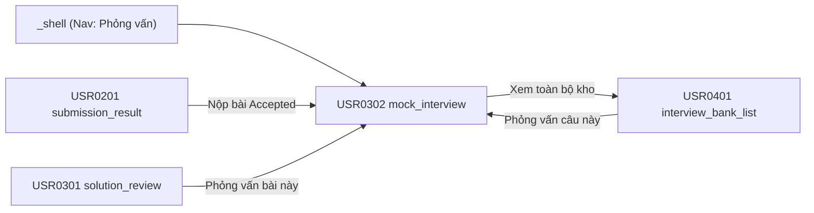

# Tài liệu thiết kế cơ bản (BD) — Phỏng vấn giả lập (`USR0302`)

## Phương châm tài liệu [Nội bộ — không cần khách duyệt]

- Viết theo **mẫu 9 sheet**. Bộ thẻ đóng, quy ước ID, ký hiệu chuẩn, ranh giới với tài liệu khác và
  checklist kiểm toán nằm ở `02-bd/_rules/bd-template-9sheet.md` — file này không chép lại.
- Phần gắn nhãn `[Nội bộ]` phục vụ sinh mã và tự kiểm toán, không phải yêu cầu của khách hàng: mục 4.5,
  mục 7.3 và các ghi chú quy ước.
- Mã màn `USR0302` theo bảng mã ở `02-bd/_rules/bd-template-9sheet.md` mục 8 dòng 143; tên file mang tiền
  tố mã.
- Khung điều hướng **không mô tả lại ở đây** — dùng chung `02-bd/screens/users/_shell.md`. Màn này có mục
  điều hướng trực tiếp trên thanh nav chính của header (Mục thứ 5: "Phỏng vấn giả lập")
  [Nguồn: 02-bd/screens/users/_shell.md:58].
- Màn này có **một popup**: xác nhận kết thúc phiên phỏng vấn sớm trước khi hết số lượt.

> Đọc cùng `01-rd/screens/users/USR0302_mock_interview.md` (hành vi ở mức yêu cầu, không lặp lại ở đây),
> `01-rd/req/ai-review.md` (F5-09→F5-16, F5-17, F5-18, F5-19, F5-22, F5-24, F5-25, F5-28),
> `01-rd/req/user_stories/a1_student.md` (`US-A1-07`), `02-bd/architecture/ai-review.md`,
> `02-bd/database/ai-review.md`, `02-bd/security/ai-review.md`.
>
> - **Mô hình 3 trạng thái**: màn hình quản lý 3 trạng thái rõ rệt trong cùng một URL:
>   1. `entry`: Cửa sổ chọn nguồn bài phỏng vấn và cấu hình phiên.
>   2. `running`: Giao diện hội thoại tương tác 1:1 trực tiếp với AI qua SSE streaming.
>   3. `result`: Báo cáo kết quả và chấm điểm Rubric 4 tiêu chí khi kết phiên.
> - **Ba giai đoạn phỏng vấn (F5-10..F5-12)**: Giải trình thuật toán → Phản biện ca biên & bẫy → Mở rộng quy mô
>   (Scale-up). AI tự quyết định chuyển giai đoạn dựa trên ngữ cảnh hội thoại.
> - **Ngữ cảnh qua Redis (`ChatMemory` F5-13)**: duy trì toàn bộ lịch sử các lượt thoại trong phiên để AI nắm
>   bắt mạch trao đổi; stream từng token phản hồi qua Server-Sent Events (SSE F5-14).
> - **Rubric 4 tiêu chí cố định (F5-15)**: Độ rõ ràng — `CLARITY` (25%), Độ chính xác kỹ thuật —
>   `TECHNICAL_ACCURACY` (30%), Khả năng phản biện — `PUSHBACK_HANDLING` (25%), Nhận thức độ phức tạp —
>   `COMPLEXITY_AWARENESS` (20%) — trọng số cố định, chốt tại `02-bd/database/ai-review.md:96-97`.
> - **Ba lối vào phiên (F5-24)**: (1) Bài nộp `Accepted` gần đây; (2) Ngân hàng câu hỏi phỏng vấn F6; (3) Tự chọn
>   chủ đề tự do.
> - **Bảo mật và chống injection (F5-17)**: mã nguồn và câu trả lời của người học luôn được bọc trong block
>   dữ liệu người dùng, tách biệt khỏi chỉ thị hệ thống của AI.

> **Quy ước đặt tên khối** [Nội bộ]. Tám khối: `entryStats` (thống kê lịch sử phỏng vấn ở màn đón), `entryTabs`
> (3 tab chọn lối vào bài phỏng vấn), `entryConfig` (tham số cấu hình phiên F5-28), `runningHeader` (thanh tiến
> trình 3 giai đoạn và đồng hồ), `runningDrawer` (ngăn kéo xem lại đề bài và mã nguồn gốc), `runningChat` (khung
> chat dòng thời gian SSE), `runningControls` (ô nhập câu trả lời, nút gửi, nút xin gợi ý, nút dừng sớm),
> `earlyExitModal` (popup xác nhận kết thúc sớm), `resultSummary` (bảng điểm Rubric 4 tiêu chí và nhận xét chi tiết).
> Tiền tố ID item của toàn màn là `mockInterview.`.

---

## Sheet 1. Bìa

| Mục | Giá trị |
| :--- | :--- |
| Hệ thống | AlgoPrep |
| Phân hệ | `ai-review` (F5.2) — đọc từ `interview-bank` (F6), `problem-bank` (F2), liên kết từ `judge-orchestration` (F4) |
| Công đoạn | BD — Thiết kế cơ bản |
| Phân loại | Màn hình |
| Tên màn | Phỏng vấn giả lập |
| Mã màn hình | `USR0302` |
| Tên vật lý (slug) | `mock_interview` |
| Trục tài liệu | Màn hình (`02-bd/screens/`) |
| Actor | A1 (`STUDENT`) |
| Phiên bản | V0.2 |
| Người tạo | Nhóm phát triển AlgoPrep |
| Ngày tạo | 2026/09/22 |
| Người cập nhật | Nhóm phát triển AlgoPrep |
| Ngày cập nhật | 2026/09/24 |

---

## Sheet 2. Lịch sử sửa đổi

| Ver | Sheet bị sửa | Nội dung sửa | Ngày | Người sửa |
| :--- | :--- | :--- | :--- | :--- |
| V0.1 | Toàn bộ | Tạo mới theo mẫu 9 sheet. Chốt quản lý 3 trạng thái (entry/running/result), 3 lối vào F5-24, tiến trình 3 giai đoạn F5-10..F5-12, stream phản hồi SSE F5-14, rubric 4 tiêu chí F5-15 trọng số 25/30/25/20%, và popup xác nhận dừng sớm | 2026/09/22 | Nhóm phát triển AlgoPrep |
| V0.2 | Sheet 1 (header), Sheet 5, Sheet 6, Sheet 7 | Sửa lỗi review: (1) gỡ trích dẫn bịa `DEC-2026-0913-interview-rubric-fixed-weights` (không tồn tại trong decision-registry), thay bằng `02-bd/database/ai-review.md:96-97`; (2) đổi tên 4 tiêu chí rubric đúng theo RD/database — Kỹ thuật→Độ rõ ràng (`CLARITY`), Giao tiếp→Độ chính xác kỹ thuật (`TECHNICAL_ACCURACY`), Giải quyết vấn đề→Khả năng phản biện (`PUSHBACK_HANDLING`), Chất lượng mã→Nhận thức độ phức tạp (`COMPLEXITY_AWARENESS`), áp dụng cho toàn bộ field/ID/nhãn liên quan; (3) xác nhận `interviewer_level` 4 mức theo `DEC-2026-0922-users-and-admin-conflict-resolutions`, đóng Câu hỏi mở Q1 cũ; (4) viết lại Sheet 5 và Sheet 7 đúng khuôn mẫu 9 sheet (thêm cột Bảng DB/Cột DB ở Sheet 5 và 7.1, Sheet 7.3 bỏ method/path HTTP); (5) phát hiện và ghi Câu hỏi mở Q4 mới — schema chưa có cột lưu `overallScore`/`feedbackSummary` tổng hợp | 2026/09/24 | Nhóm phát triển AlgoPrep |

---

## Sheet 3. Sơ đồ chuyển màn

| STT | Màn hình nguồn | Màn hình đích | Tham số truyền | Ghi chú |
| :-: | :--- | :--- | :--- | :--- |
| 1 | Khung điều hướng (`_shell`) | Màn hình hiện tại (`USR0302`) | Không có | [Điều kiện mở] Bấm mục "Phỏng vấn giả lập" trên thanh nav chính. [Chế độ mở] Điều hướng URL `/mock-interview`. [Thông tin truyền] Không có. [Giá trị trả về] Không có. [Khi thành công] Mở màn hình ở trạng thái `entry`. [Khi huỷ] Không có. |
| 2 | `submission_result` (`USR0201`) | Màn hình hiện tại (`USR0302`) | `submission_id` | [Điều kiện mở] Bấm "Phỏng vấn giả lập" từ màn kết quả nộp bài. [Chế độ mở] Điều hướng URL `/mock-interview?submission_id={submission_id}`. [Thông tin truyền] `submission_id`. [Giá trị trả về] Không có. [Khi thành công] Tự động chọn tab "Bài nộp đã Accepted" và nạp sẵn cấu hình. [Khi huỷ] Không có. |
| 3 | `solution_review` (`USR0301`) | Màn hình hiện tại (`USR0302`) | `submission_id` | [Điều kiện mở] Bấm "Phỏng vấn về bài này" từ màn phân tích. [Chế độ mở] Điều hướng URL `/mock-interview?submission_id={submission_id}`. [Thông tin truyền] `submission_id`. [Giá trị trả về] Không có. [Khi thành công] Tự động chọn tab "Bài nộp đã Accepted" và nạp sẵn cấu hình. [Khi huỷ] Không có. |
| 4 | `interview_bank_list` (`USR0401`) | Màn hình hiện tại (`USR0302`) | `question_id` | [Điều kiện mở] Bấm "Phỏng vấn câu này" từ ngân hàng câu hỏi. [Chế độ mở] Điều hướng URL `/mock-interview?question_id={question_id}`. [Thông tin truyền] `question_id`. [Giá trị trả về] Không có. [Khi thành công] Tự động chọn tab "Kho câu hỏi" và nạp sẵn câu hỏi. [Khi huỷ] Không có. |
| 5 | Màn hình hiện tại (`USR0302`) | `interview_bank_list` (`USR0401`) | Không có | [Điều kiện mở] Bấm link "Xem toàn bộ N câu hỏi" tại tab Kho câu hỏi. [Chế độ mở] Điều hướng sang `/interview-bank`. [Thông tin truyền] Không có. [Giá trị trả về] Không có. [Khi thành công] Mở danh sách ngân hàng câu hỏi. [Khi huỷ] Giữ nguyên màn hiện tại. |

---

## Sheet 4. Bố cục màn hình

### 4.1. Tổng quan theo thẻ

- `[Mục đích màn]` Cung cấp môi trường luyện phỏng vấn kỹ thuật trực tiếp 1:1 với AI, mô phỏng quy trình phỏng vấn chuẩn của các công ty công nghệ lớn, đánh giá kỹ năng diễn giải và phản biện thuật toán.
- `[Luồng nghiệp vụ chính]` Người học chọn một chủ đề phỏng vấn (từ bài nộp, kho câu hỏi, hoặc chủ đề tự do), cấu hình tham số phiên rồi bắt đầu. Trong phiên, AI đặt câu hỏi qua 3 giai đoạn (Giải trình, Phản biện, Mở rộng); người học trả lời qua ô nhập liệu. Khi kết phiên (hết lượt hoặc chủ động dừng), AI chấm điểm theo Rubric 4 tiêu chí và đưa ra lộ trình cải thiện.
- `[Người dùng]` Học viên (A1).
- `[Tệp liên quan]` `01-rd/screens/users/USR0302_mock_interview.md`, `09-layoutBase/Phỏng vấn giả lập.dc.html`.
- `[Phạm vi]` Một phiên phỏng vấn đơn lẻ từ lúc bắt đầu cấu hình đến khi hoàn tất và xem điểm.
- `[Quyền sử dụng]` Yêu cầu đăng nhập học viên; kiểm tra hạn mức ngân sách token cá nhân trước khi mở phiên.
- `[Số bản ghi tối đa]` Mỗi phiên tối đa 16 lượt hỏi đáp (turn); lịch sử chat lưu toàn văn trong phiên.

### 4.2. Danh sách cấu trúc dữ liệu màn hình (DTOs)

| STT | Tên DTO | Mô tả | Chi tiết trường |
| :-: | :--- | :--- | :--- |
| 1 | `InterviewSessionInitDto` | Yêu cầu khởi tạo phiên | `entryMode`, `submissionId`, `questionId`, `customTopic`, `difficultyLevel`, `maxTurns`, `hintAllowed` |
| 2 | `InterviewSessionDetailDto` | Chi tiết phiên đang chạy | `sessionId`, `currentStage`, `currentTurn`, `maxTurns`, `startTime`, `elapsedSeconds`, `problemContext`, `sourceCode` |
| 3 | `InterviewMessageDto` | Một tin nhắn trong khung chat | `id`, `sender` (AI/USER), `content`, `stage`, `turnIndex`, `sentAt`, `isStreaming` |
| 4 | `InterviewResultSummaryDto` | Kết quả tổng kết phiên | `sessionId`, `overallScore`, `clarityScore`, `technicalAccuracyScore`, `pushbackHandlingScore`, `complexityAwarenessScore`, `feedbackSummary`, `strengths`, `improvements` |

### 4.3. Danh sách bảng dữ liệu

| STT | Tên bảng | Mô tả | Thao tác | Bounded Context |
| :-: | :--- | :--- | :--- | :--- |
| 1 | `ai.interview_sessions` | Lưu trữ phiên phỏng vấn và kết quả rubric | C, R, U | `ai-review` |
| 2 | `ai.interview_turns` | Lưu trữ chi tiết từng lượt hỏi đáp | C, R | `ai-review` |
| 3 | `interview.interview_questions` | Câu hỏi từ kho F6 khi mở từ lối 2 | R | `interview-bank` |
| 4 | `judge.submissions` | Mã nguồn bài nộp khi mở từ lối 1 | R | `judge-orchestration` |

### 4.4. Vùng bố cục bám prototype

Màn hình thay đổi bố cục linh hoạt theo 3 trạng thái:

| Ký hiệu | Tên khu vực | Tham chiếu prototype | Ghi chú |
| :-: | :--- | :--- | :--- |
| **A** | Thống kê lịch sử phỏng vấn (Entry Stats) | `Phỏng vấn giả lập.dc.html:104-113` | Trạng thái `entry`: Số phiên đã làm, điểm TB, tiêu chí yếu |
| **B** | 3 tab chọn lối vào (Entry Tabs) | `Phỏng vấn giả lập.dc.html:118-121` | Trạng thái `entry`: Bài Accepted / Kho câu hỏi / Tự chọn |
| **C** | Cấu hình phiên (Entry Config) | `Phỏng vấn giả lập.dc.html:166-196` | Trạng thái `entry`: Chọn cấp độ, số lượt, gợi ý (F5-28) |
| **D** | Thanh tiến trình 3 giai đoạn (Running Header) | `Phỏng vấn giả lập.dc.html:202-218` | Trạng thái `running`: Giải trình → Phản biện → Mở rộng |
| **E** | Ngăn kéo đề bài & mã nguồn (Running Drawer) | `Phỏng vấn giả lập.dc.html:220-235` | Trạng thái `running`: Drawer trượt ra xem lại mã đã nộp |
| **F** | Khung hội thoại streaming (Running Chat) | `Phỏng vấn giả lập.dc.html:240-310` | Trạng thái `running`: Luồng chat Markdown với AI |
| **G** | Thanh tương tác chat (Running Controls) | `Phỏng vấn giả lập.dc.html:315-340` | Trạng thái `running`: Ô nhập text, nút gửi, xin gợi ý, dừng sớm |
| **H** | Popup xác nhận dừng phiên sớm | `[SoT: Suy luận]` | Hộp thoại cảnh báo kết thúc trước khi đủ số lượt |
| **I** | Bảng điểm Rubric & nhận xét (Result Summary) | `Phỏng vấn giả lập.dc.html:350-410` | Trạng thái `result`: Scorecard 4 tiêu chí và đánh giá |

### 4.5. Cấu trúc slice FSD [Nội bộ]

- Route: `/mock-interview`
- View slice: `src/views/users/mock-interview/`
  - `ui/mock-interview-page.tsx`
  - `ui/entry/entry-stats-banner.tsx`
  - `ui/entry/entry-source-tabs.tsx`
  - `ui/entry/session-config-panel.tsx`
  - `ui/running/running-stage-header.tsx`
  - `ui/running/chat-stream-timeline.tsx`
  - `ui/running/chat-input-toolbar.tsx`
  - `ui/running/code-reference-drawer.tsx`
  - `ui/running/early-exit-confirm-modal.tsx`
  - `ui/result/interview-rubric-card.tsx`
  - `model/use-mock-interview-session.ts` (quản lý state machine: `entry` -> `running` -> `result`)

---

## Sheet 5. Danh sách item màn hình

> Cột và bộ thẻ: `02-bd/_rules/bd-template-9sheet.md` mục 2, 3, 4.

### Khu vực A — Thống kê lịch sử phỏng vấn (Trạng thái Entry)

| Khu vực | NO | Tên item | ID item | Bảng DB | Cột DB | Loại UI | Kiểu | Độ dài | Bắt buộc | I/O | Giá trị mặc định | Định dạng | Ghi chú |
| :--- | --: | :--- | :--- | :--- | :--- | :--- | :--- | :-: | :-: | :-: | :--- | :--- | :--- |
| Thống kê lịch sử phỏng vấn | | | | | | | | | | | | | |
| | 1 | Thẻ Số phiên đã làm | `mockInterview.entry.statsSessions` | `ai.interview_sessions` | `user_id`, `stage` | Label | String | 30 | Có | O | `0 phiên` | `{số} phiên` | Tổng số phiên đã hoàn tất của chính người dùng [Công thức] Đếm dòng `interview_sessions` có `user_id = :currentUserId AND stage = COMPLETED` [EVT liên quan] EVT-1 |
| | 2 | Thẻ Đánh giá trung bình | `mockInterview.entry.statsAvgScore` | `ai.rubric_scores` | `owner_id`, `score`, `weight_percent_snapshot` | Label | String | 30 | Có | O | `- / 10` | `{số} / 10` | Điểm trung bình có trọng số của các phiên đã hoàn tất [Công thức] Trung bình tổng có trọng số của `rubric_scores` (`owner_type = MOCK_INTERVIEW`, `owner_id` thuộc các phiên `COMPLETED` của người dùng) — không có cột `overall_score` lưu sẵn, xem Câu hỏi mở Q4 [EVT liên quan] EVT-1 |
| | 3 | Thẻ Tiêu chí cần cải thiện | `mockInterview.entry.statsWeakest` | `ai.rubric_scores` | `criterion_code`, `score` | Label | String | 50 | Có | O | `-` | `{tên tiêu chí} ({số})` | Tiêu chí trong 4 tiêu chí F5-15 có điểm trung bình thấp nhất [Công thức] Min(trung bình `score` nhóm theo `criterion_code`, cùng phạm vi NO 2) [EVT liên quan] EVT-1 |

### Khu vực B — 3 tab chọn lối vào (Trạng thái Entry)

| Khu vực | NO | Tên item | ID item | Bảng DB | Cột DB | Loại UI | Kiểu | Độ dài | Bắt buộc | I/O | Giá trị mặc định | Định dạng | Ghi chú |
| :--- | --: | :--- | :--- | :--- | :--- | :--- | :--- | :-: | :-: | :-: | :--- | :--- | :--- |
| 3 tab chọn lối vào | | | | | | | | | | | | | |
| | 1 | Tab Bài nộp Accepted | `mockInterview.entry.tabAccepted` | - | - | Toggle | String | 30 | Có | I/O | `ACTIVE` | - | Lối vào từ bài giải đã nộp, ứng với `entry_type = SUBMISSION` (F5-24) [Nguồn giá trị] Trạng thái tab chọn tại giao diện [EVT liên quan] EVT-2 |
| | 2 | Tab Kho câu hỏi F6 | `mockInterview.entry.tabBank` | - | - | Toggle | String | 30 | Có | I/O | `` | - | Lối vào từ ngân hàng câu hỏi, ứng với `entry_type = QUESTION_BANK` [Nguồn giá trị] Trạng thái tab chọn tại giao diện [EVT liên quan] EVT-3 |
| | 3 | Tab Tự chọn chủ đề | `mockInterview.entry.tabCustom` | - | - | Toggle | String | 30 | Có | I/O | `` | - | Lối vào tự do, ứng với `entry_type = TOPIC_SELECTION` [Nguồn giá trị] Trạng thái tab chọn tại giao diện [EVT liên quan] EVT-4 |
| | 4 | Danh sách bài nộp mẫu | `mockInterview.entry.listAccepted` | `judge.submissions` | `id`, `problem_id`, `status`, `created_at` | List | String | 2000 | Không | I/O | rỗng | - | Danh sách bài nộp `ACCEPTED` gần đây của chính người dùng [Nguồn giá trị] Kết quả gọi `ListMyAcceptedSubmissions` [EVT liên quan] EVT-5 |
| | 5 | Danh sách câu hỏi F6 | `mockInterview.entry.listBankQuestions` | `interview.interview_questions` | `id`, `title` | List | String | 2000 | Không | I/O | rỗng | - | Danh sách câu hỏi gợi ý từ kho F6 [Nguồn giá trị] Kết quả gọi `ListInterviewBankShortlist` [EVT liên quan] EVT-6 |

### Khu vực C — Cấu hình phiên (Trạng thái Entry)

| Khu vực | NO | Tên item | ID item | Bảng DB | Cột DB | Loại UI | Kiểu | Độ dài | Bắt buộc | I/O | Giá trị mặc định | Định dạng | Ghi chú |
| :--- | --: | :--- | :--- | :--- | :--- | :--- | :--- | :-: | :-: | :-: | :--- | :--- | :--- |
| Cấu hình phiên | | | | | | | | | | | | | |
| | 1 | Cụm chọn Cấp độ | `mockInterview.entry.optLevel` | `ai.interview_sessions` | `interviewer_level` | Toggle | Enum | 20 | Có | I/O | `MIDDLE` | - | Chọn mức độ: Intern, Junior, Middle, Senior — 4 mức thống nhất toàn hệ thống [Nguồn giá trị] Tham số F5-28, ghi vào cột `interviewer_level` (`02-bd/database/ai-review.md` mục 1.4, `DEC-2026-0922-users-and-admin-conflict-resolutions` mục (2)) [EVT liên quan] EVT-7 |
| | 2 | Cụm chọn Số lượt hỏi | `mockInterview.entry.optTurns` | `ai.interview_sessions` | `max_turns` | Toggle | Number | 10 | Có | I/O | `12` | Số nguyên | Số lượt tối đa: 8, 12 hoặc 16 lượt [Nguồn giá trị] Tham số F5-28, ghi vào cột `max_turns` [EVT liên quan] EVT-8 |
| | 3 | Toggle Cho phép gợi ý | `mockInterview.entry.togHint` | `ai.interview_sessions` | `hint_allowed` | Toggle | Boolean | 10 | Có | I/O | `true` | - | Bật/tắt nút xin gợi ý trong phiên [Nguồn giá trị] Tham số F5-28, ghi vào cột `hint_allowed` [EVT liên quan] EVT-9 |
| | 4 | Nút Bắt đầu phiên | `mockInterview.entry.btnStart` | - | - | Button | String | 30 | Có | I | - | - | Khởi tạo phiên và chuyển sang trạng thái `running` [Nguồn giá trị] Nhãn tĩnh i18n [EVT liên quan] EVT-10 |

### Khu vực D — Thanh tiến trình 3 giai đoạn (Trạng thái Running)

| Khu vực | NO | Tên item | ID item | Bảng DB | Cột DB | Loại UI | Kiểu | Độ dài | Bắt buộc | I/O | Giá trị mặc định | Định dạng | Ghi chú |
| :--- | --: | :--- | :--- | :--- | :--- | :--- | :--- | :-: | :-: | :-: | :--- | :--- | :--- |
| Thanh tiến trình 3 giai đoạn | | | | | | | | | | | | | |
| | 1 | Chỉ báo Giai đoạn 1 | `mockInterview.running.stepExplain` | `ai.interview_sessions` | `stage` | Badge | String | 30 | Có | O | `1. Giải trình` | - | Giai đoạn giải trình thuật toán F5-10 [Nguồn giá trị] Cột `stage`, làm nổi khi `stage = EXPLAIN` [EVT liên quan] - |
| | 2 | Chỉ báo Giai đoạn 2 | `mockInterview.running.stepChallenge` | `ai.interview_sessions` | `stage` | Badge | String | 30 | Có | O | `2. Phản biện` | - | Giai đoạn phản biện ca biên F5-11 [Nguồn giá trị] Cột `stage`, làm nổi khi `stage = CHALLENGE` [EVT liên quan] - |
| | 3 | Chỉ báo Giai đoạn 3 | `mockInterview.running.stepScaleUp` | `ai.interview_sessions` | `stage` | Badge | String | 30 | Có | O | `3. Mở rộng` | - | Giai đoạn mở rộng quy mô dữ liệu F5-12 [Nguồn giá trị] Cột `stage`, làm nổi khi `stage = SCALE_UP` [EVT liên quan] - |
| | 4 | Đếm số lượt hỏi | `mockInterview.running.lblTurnCount` | `ai.interview_sessions` | `turn_count`, `max_turns` | Label | String | 20 | Có | O | `Lượt 0 / 12` | `Lượt {số} / {số}` | Số lượt hiện tại trên tổng số lượt [Nguồn giá trị] Cột `turn_count` / `max_turns` [EVT liên quan] - |
| | 5 | Đồng hồ bấm giờ | `mockInterview.running.lblTimer` | `ai.interview_sessions` | `started_at` | Label | String | 20 | Có | O | `00:00` | `{phút}:{giây}` | Thời gian đã trôi qua trong phiên [Công thức] Bộ đếm giây phía giao diện tính từ `started_at` [EVT liên quan] - |
| | 6 | Nút Mở ngăn kéo mã | `mockInterview.running.btnOpenDrawer` | - | - | Button | String | 30 | Có | I | - | - | Mở drawer xem lại đề bài và mã nguồn gốc [Nguồn giá trị] Nhãn tĩnh i18n [EVT liên quan] EVT-11 |

### Khu vực E — Ngăn kéo đề bài & mã nguồn (Trạng thái Running)

| Khu vực | NO | Tên item | ID item | Bảng DB | Cột DB | Loại UI | Kiểu | Độ dài | Bắt buộc | I/O | Giá trị mặc định | Định dạng | Ghi chú |
| :--- | --: | :--- | :--- | :--- | :--- | :--- | :--- | :-: | :-: | :-: | :--- | :--- | :--- |
| Ngăn kéo đề bài & mã nguồn | | | | | | | | | | | | | |
| | 1 | Vùng đề bài tham chiếu | `mockInterview.drawer.txtStatement` | `problem.problems` | `statement_md` | TextArea | String | 10000 | Có | O | - | Markdown | Nội dung đề bài dạng Markdown, chỉ có khi `entry_type = SUBMISSION` [Nguồn giá trị] Cột `statement_md`, tra theo `submissions.problem_id` [EVT liên quan] - |
| | 2 | Vùng mã nguồn đã nộp | `mockInterview.drawer.viewerCode` | `judge.submissions` | `source_code` | TextArea | String | 50000 | Có | O | - | - | Monaco Editor chỉ đọc hiển thị mã đã nộp [Nguồn giá trị] Cột `source_code` [EVT liên quan] - |
| | 3 | Nút Đóng ngăn kéo | `mockInterview.drawer.btnClose` | - | - | Button | String | 20 | Có | I | - | - | Đóng drawer, quay về khung chat [Nguồn giá trị] Nhãn tĩnh i18n [EVT liên quan] EVT-12 |

### Khu vực F — Khung hội thoại streaming (Trạng thái Running)

| Khu vực | NO | Tên item | ID item | Bảng DB | Cột DB | Loại UI | Kiểu | Độ dài | Bắt buộc | I/O | Giá trị mặc định | Định dạng | Ghi chú |
| :--- | --: | :--- | :--- | :--- | :--- | :--- | :--- | :-: | :-: | :-: | :--- | :--- | :--- |
| Khung hội thoại streaming | | | | | | | | | | | | | |
| | 1 | Luồng tin nhắn chat | `mockInterview.chat.streamTimeline` | `ai.interview_turns` | `role`, `content`, `turn_index`, `stage_at_turn` | List | String | 100000 | Có | O | rỗng | - | Dòng thời gian các bubble tin nhắn F5-14; nguồn sự thật lâu dài là `interview_turns`, phiên đang mở đọc nhanh qua Redis `ChatMemory` [Nguồn giá trị] Nhận qua Server-Sent Events (SSE) khi phiên đang chạy; nạp lại từ `interview_turns` khi mở lại phiên [EVT liên quan] - |
| | 2 | Chỉ báo AI đang gõ | `mockInterview.chat.typingIndicator` | - | - | Label | String | 30 | Không | O | `` | - | Hiệu ứng hiển thị khi SSE đang stream token [Nguồn giá trị] Trạng thái stream phía giao diện, không lưu DB [EVT liên quan] - |

### Khu vực G — Thanh tương tác chat (Trạng thái Running)

| Khu vực | NO | Tên item | ID item | Bảng DB | Cột DB | Loại UI | Kiểu | Độ dài | Bắt buộc | I/O | Giá trị mặc định | Định dạng | Ghi chú |
| :--- | --: | :--- | :--- | :--- | :--- | :--- | :--- | :-: | :-: | :-: | :--- | :--- | :--- |
| Thanh tương tác chat | | | | | | | | | | | | | |
| | 1 | Ô nhập câu trả lời | `mockInterview.controls.txtMessage` | `ai.interview_turns` | `content` | TextArea | String | 4000 | Có | I | `` | - | Người học gõ câu trả lời phỏng vấn, ghi thành một dòng `interview_turns` (`role = USER`) khi gửi [Nguồn giá trị] Người dùng nhập [EVT liên quan] EVT-13 |
| | 2 | Nút Gửi câu trả lời | `mockInterview.controls.btnSend` | - | - | Button | String | 20 | Có | I | - | - | Gửi câu trả lời lên máy chủ [Nguồn giá trị] Nhãn tĩnh i18n [EVT liên quan] EVT-14 |
| | 3 | Nút Xin gợi ý | `mockInterview.controls.btnHint` | - | - | Button | String | 30 | Không | I | - | - | Yêu cầu AI đưa ra gợi ý giải pháp (F5-28), chỉ hiện khi `hintAllowed = true` [Nguồn giá trị] Nhãn tĩnh i18n [EVT liên quan] EVT-15 |
| | 4 | Nút Kết thúc sớm | `mockInterview.controls.btnStopEarly` | - | - | Button | String | 30 | Có | I | - | - | Kích hoạt popup xác nhận kết thúc sớm [Nguồn giá trị] Nhãn tĩnh i18n [EVT liên quan] EVT-16 |

### Khu vực H — Popup xác nhận dừng sớm

| Khu vực | NO | Tên item | ID item | Bảng DB | Cột DB | Loại UI | Kiểu | Độ dài | Bắt buộc | I/O | Giá trị mặc định | Định dạng | Ghi chú |
| :--- | --: | :--- | :--- | :--- | :--- | :--- | :--- | :-: | :-: | :-: | :--- | :--- | :--- |
| Popup xác nhận dừng sớm | | | | | | | | | | | | | |
| | 1 | Tiêu đề popup | `mockInterview.earlyExit.lblTitle` | - | - | Label | String | 50 | Có | O | `Kết thúc phiên phỏng vấn?` | - | Tiêu đề cảnh báo [Nguồn giá trị] Nhãn tĩnh i18n [EVT liên quan] - |
| | 2 | Nội dung cảnh báo | `mockInterview.earlyExit.lblMessage` | - | - | Label | String | 200 | Có | O | - | - | Giải thích hệ quả khi dừng sớm [Nguồn giá trị] Nhãn tĩnh i18n [EVT liên quan] - |
| | 3 | Nút Tiếp tục phỏng vấn | `mockInterview.earlyExit.btnResume` | - | - | Button | String | 20 | Có | I | - | - | Đóng popup, trở lại phiên chat [Nguồn giá trị] Nhãn tĩnh i18n [EVT liên quan] EVT-17 |
| | 4 | Nút Xác nhận dừng | `mockInterview.earlyExit.btnConfirmExit` | - | - | Button | String | 30 | Có | I | - | - | Dừng phiên và chuyển sang màn kết quả [Nguồn giá trị] Nhãn tĩnh i18n [EVT liên quan] EVT-18 |

### Khu vực I — Bảng điểm Rubric & nhận xét (Trạng thái Result)

| Khu vực | NO | Tên item | ID item | Bảng DB | Cột DB | Loại UI | Kiểu | Độ dài | Bắt buộc | I/O | Giá trị mặc định | Định dạng | Ghi chú |
| :--- | --: | :--- | :--- | :--- | :--- | :--- | :--- | :-: | :-: | :-: | :--- | :--- | :--- |
| Bảng điểm Rubric & nhận xét | | | | | | | | | | | | | |
| | 1 | Điểm tổng kết phiên | `mockInterview.result.lblOverallScore` | `ai.rubric_scores` | `score`, `weight_percent_snapshot` | Label | String | 30 | Có | O | `- / 10` | `{số} / 10` | Điểm tổng hợp 4 tiêu chí có trọng số F5-15 [Công thức] Tổng `score * weight_percent_snapshot / 100` của 4 dòng `rubric_scores` cùng `owner_id = sessionId`; không có cột lưu sẵn, xem Câu hỏi mở Q4 [EVT liên quan] - |
| | 2 | Thẻ Điểm Độ rõ ràng (25%) | `mockInterview.result.cardClarity` | `ai.rubric_scores` | `criterion_code`, `score`, `comment` | Label | String | 150 | Có | O | - | `{số} / 10 · {nhận xét}` | Tiêu chí Độ rõ ràng — `CLARITY` (25%) [Nguồn giá trị] Dòng `rubric_scores` với `criterion_code = CLARITY` (`02-bd/database/ai-review.md:96-97`) [EVT liên quan] - |
| | 3 | Thẻ Điểm Độ chính xác kỹ thuật (30%) | `mockInterview.result.cardTechAccuracy` | `ai.rubric_scores` | `criterion_code`, `score`, `comment` | Label | String | 150 | Có | O | - | `{số} / 10 · {nhận xét}` | Tiêu chí Độ chính xác kỹ thuật — `TECHNICAL_ACCURACY` (30%) [Nguồn giá trị] Dòng `rubric_scores` với `criterion_code = TECHNICAL_ACCURACY` (`02-bd/database/ai-review.md:96-97`) [EVT liên quan] - |
| | 4 | Thẻ Khả năng phản biện (25%) | `mockInterview.result.cardPushback` | `ai.rubric_scores` | `criterion_code`, `score`, `comment` | Label | String | 150 | Có | O | - | `{số} / 10 · {nhận xét}` | Tiêu chí Khả năng phản biện — `PUSHBACK_HANDLING` (25%) [Nguồn giá trị] Dòng `rubric_scores` với `criterion_code = PUSHBACK_HANDLING` (`02-bd/database/ai-review.md:96-97`) [EVT liên quan] - |
| | 5 | Thẻ Nhận thức độ phức tạp (20%) | `mockInterview.result.cardComplexity` | `ai.rubric_scores` | `criterion_code`, `score`, `comment` | Label | String | 150 | Có | O | - | `{số} / 10 · {nhận xét}` | Tiêu chí Nhận thức độ phức tạp — `COMPLEXITY_AWARENESS` (20%) [Nguồn giá trị] Dòng `rubric_scores` với `criterion_code = COMPLEXITY_AWARENESS` (`02-bd/database/ai-review.md:96-97`) [EVT liên quan] - |
| | 6 | Đoạn nhận xét tổng quan | `mockInterview.result.txtFeedback` | - | - | TextArea | String | 2000 | Có | O | - | - | Đánh giá tổng thể từ AI, tổng hợp 4 nhận xét tiêu chí — schema hiện tại không có cột riêng lưu đoạn tổng hợp này, xem Câu hỏi mở Q4 [Nguồn giá trị] `[SoT: Suy luận]` — ghép từ `comment` của 4 dòng `rubric_scores` ở tầng ứng dụng, hoặc cần bổ sung cột [EVT liên quan] - |
| | 7 | Nút Luyện tập lại | `mockInterview.result.btnRetry` | - | - | Button | String | 30 | Có | I | - | - | Reset màn hình về trạng thái `entry` [Nguồn giá trị] Nhãn tĩnh i18n [EVT liên quan] EVT-19 |
| | 8 | Nút Về danh sách | `mockInterview.result.btnBack` | - | - | Button | String | 30 | Có | I | - | - | Điều hướng về `problem_list` [Nguồn giá trị] Nhãn tĩnh i18n [EVT liên quan] EVT-20 |

---

## Sheet 6. Đặc tả điều khiển item

### Khu vực A, B, C: Trạng thái Entry

| NO | Tên item | Hiển thị | Kích hoạt | Ghi chú |
| --: | :--- | :--- | :--- | :--- |
| A.1 | Thẻ Số phiên đã làm | Điều kiện | Không | [Điều kiện hiển thị] Chỉ hiển thị khi ở trạng thái `entry`. [Điều kiện kích hoạt] Không áp dụng. [Tự động đặt] - |
| A.2 | Thẻ Đánh giá trung bình | Điều kiện | Không | [Điều kiện hiển thị] Chỉ hiển thị khi ở trạng thái `entry`. [Điều kiện kích hoạt] Không áp dụng. [Tự động đặt] - |
| A.3 | Thẻ Tiêu chí cần cải thiện | Điều kiện | Không | [Điều kiện hiển thị] Chỉ hiển thị khi ở trạng thái `entry`. [Điều kiện kích hoạt] Không áp dụng. [Tự động đặt] - |
| B.1 | Tab Bài nộp Accepted | Điều kiện | Có | [Điều kiện hiển thị] Chỉ hiển thị ở trạng thái `entry`. [Điều kiện kích hoạt] Kích hoạt. [Tự động đặt] Tự chọn tab này nếu có query param `submission_id`. |
| B.2 | Tab Kho câu hỏi F6 | Điều kiện | Có | [Điều kiện hiển thị] Chỉ hiển thị ở trạng thái `entry`. [Điều kiện kích hoạt] Kích hoạt. [Tự động đặt] Tự chọn tab này nếu có query param `question_id`. |
| B.3 | Tab Tự chọn chủ đề | Điều kiện | Có | [Điều kiện hiển thị] Chỉ hiển thị ở trạng thái `entry`. [Điều kiện kích hoạt] Kích hoạt. [Tự động đặt] - |
| C.1 | Cụm chọn Cấp độ | Điều kiện | Có | [Điều kiện hiển thị] Chỉ hiển thị ở trạng thái `entry`. [Điều kiện kích hoạt] Luôn kích hoạt. [Tự động đặt] Mặc định `MIDDLE`. |
| C.2 | Cụm chọn Số lượt hỏi | Điều kiện | Có | [Điều kiện hiển thị] Chỉ hiển thị ở trạng thái `entry`. [Điều kiện kích hoạt] Luôn kích hoạt. [Tự động đặt] Mặc định 12 lượt. |
| C.3 | Toggle Cho phép gợi ý | Điều kiện | Có | [Điều kiện hiển thị] Chỉ hiển thị ở trạng thái `entry`. [Điều kiện kích hoạt] Luôn kích hoạt. [Tự động đặt] Mặc định Bật (`true`). |
| C.4 | Nút Bắt đầu phiên | Điều kiện | Điều kiện | [Điều kiện hiển thị] Chỉ hiển thị ở trạng thái `entry`. [Điều kiện kích hoạt] Chỉ kích hoạt khi đã chọn 1 bài nộp hoặc 1 câu hỏi hoặc chọn ít nhất 1 chủ đề. [Tự động đặt] - |

### Khu vực D, E, F, G: Trạng thái Running

| NO | Tên item | Hiển thị | Kích hoạt | Ghi chú |
| --: | :--- | :--- | :--- | :--- |
| D.1 | Chỉ báo Giai đoạn 1 | Điều kiện | Không | [Điều kiện hiển thị] Chỉ hiển thị ở trạng thái `running`. [Điều kiện kích hoạt] Không áp dụng. [Tự động đặt] Highlight khi `currentStage = EXPLAIN`. |
| D.2 | Chỉ báo Giai đoạn 2 | Điều kiện | Không | [Điều kiện hiển thị] Chỉ hiển thị ở trạng thái `running`. [Điều kiện kích hoạt] Không áp dụng. [Tự động đặt] Highlight khi `currentStage = CHALLENGE`. |
| D.3 | Chỉ báo Giai đoạn 3 | Điều kiện | Không | [Điều kiện hiển thị] Chỉ hiển thị ở trạng thái `running`. [Điều kiện kích hoạt] Không áp dụng. [Tự động đặt] Highlight khi `currentStage = SCALE_UP`. |
| D.4 | Đếm số lượt hỏi | Điều kiện | Không | [Điều kiện hiển thị] Chỉ hiển thị ở trạng thái `running`. [Điều kiện kích hoạt] Không áp dụng. [Tự động đặt] Cập nhật tăng mỗi lượt hội thoại. |
| D.5 | Đồng hồ bấm giờ | Điều kiện | Không | [Điều kiện hiển thị] Chỉ hiển thị ở trạng thái `running`. [Điều kiện kích hoạt] Không áp dụng. [Tự động đặt] Tự đếm tăng mỗi giây. |
| D.6 | Nút Mở ngăn kéo mã | Điều kiện | Có | [Điều kiện hiển thị] Chỉ hiển thị khi phiên có gắn với bài toán/mã nguồn. [Điều kiện kích hoạt] Luôn kích hoạt. [Tự động đặt] - |
| F.1 | Luồng tin nhắn chat | Điều kiện | Có | [Điều kiện hiển thị] Chỉ hiển thị ở trạng thái `running`. [Điều kiện kích hoạt] Cho phép cuộn, chọn text. [Tự động đặt] Tự cuộn xuống đáy khi có tin nhắn mới. |
| G.1 | Ô nhập câu trả lời | Điều kiện | Điều kiện | [Điều kiện hiển thị] Chỉ hiển thị ở trạng thái `running`. [Điều kiện kích hoạt] Bị khóa khi AI đang stream câu trả lời. [Tự động đặt] Tự focus khi AI hoàn tất trả lời. |
| G.2 | Nút Gửi câu trả lời | Điều kiện | Điều kiện | [Điều kiện hiển thị] Chỉ hiển thị ở trạng thái `running`. [Điều kiện kích hoạt] Chỉ kích hoạt khi ô nhập có ít nhất 1 ký tự và AI không đang gõ. [Tự động đặt] - |
| G.3 | Nút Xin gợi ý | Điều kiện | Điều kiện | [Điều kiện hiển thị] Chỉ hiển thị khi `hintAllowed = true` ở cấu hình phiên. [Điều kiện kích hoạt] Kích hoạt khi AI không đang gõ. [Tự động đặt] - |
| G.4 | Nút Kết thúc sớm | Điều kiện | Có | [Điều kiện hiển thị] Chỉ hiển thị ở trạng thái `running`. [Điều kiện kích hoạt] Luôn kích hoạt. [Tự động đặt] - |

### Khu vực H, I: Trạng thái Result & Popup

| NO | Tên item | Hiển thị | Kích hoạt | Ghi chú |
| --: | :--- | :--- | :--- | :--- |
| H.1 | Popup dừng sớm | Điều kiện | Có | [Điều kiện hiển thị] Chỉ hiển thị khi bấm nút Kết thúc sớm. [Điều kiện kích hoạt] Chứa nút Huỷ và Xác nhận. [Tự động đặt] - |
| I.1 | Điểm tổng kết phiên | Điều kiện | Không | [Điều kiện hiển thị] Chỉ hiển thị ở trạng thái `result`. [Điều kiện kích hoạt] Không áp dụng. [Tự động đặt] - |
| I.2 | Thẻ Điểm Độ rõ ràng (25%) | Điều kiện | Không | [Điều kiện hiển thị] Chỉ hiển thị ở trạng thái `result`. [Điều kiện kích hoạt] Không áp dụng. [Tự động đặt] - |
| I.3 | Thẻ Điểm Độ chính xác kỹ thuật (30%) | Điều kiện | Không | [Điều kiện hiển thị] Chỉ hiển thị ở trạng thái `result`. [Điều kiện kích hoạt] Không áp dụng. [Tự động đặt] - |
| I.4 | Thẻ Khả năng phản biện (25%) | Điều kiện | Không | [Điều kiện hiển thị] Chỉ hiển thị ở trạng thái `result`. [Điều kiện kích hoạt] Không áp dụng. [Tự động đặt] - |
| I.5 | Thẻ Nhận thức độ phức tạp (20%) | Điều kiện | Không | [Điều kiện hiển thị] Chỉ hiển thị ở trạng thái `result`. [Điều kiện kích hoạt] Không áp dụng. [Tự động đặt] - |
| I.6 | Đoạn nhận xét tổng quan | Điều kiện | Không | [Điều kiện hiển thị] Chỉ hiển thị ở trạng thái `result`. [Điều kiện kích hoạt] Không áp dụng. [Tự động đặt] - |
| I.7 | Nút Luyện tập lại | Điều kiện | Có | [Điều kiện hiển thị] Chỉ hiển thị ở trạng thái `result`. [Điều kiện kích hoạt] Kích hoạt. [Tự động đặt] - |
| I.8 | Nút Về danh sách | Điều kiện | Có | [Điều kiện hiển thị] Chỉ hiển thị ở trạng thái `result`. [Điều kiện kích hoạt] Kích hoạt. [Tự động đặt] - |

---

## Sheet 7. Danh sách truyền dữ liệu

### 7.1. Trường DTO

| NO | DTO | Trường DTO | Kiểu | Bảng DB | Cột DB | Item màn | Hướng | Ghi chú |
| --: | :--- | :--- | :--- | :--- | :--- | :--- | :-: | :--- |
| 1 | `SendMessageRequest` | `message` | String | `ai.interview_turns` | `content` | `mockInterview.controls.txtMessage` | I | [Đích] Ghi thành một dòng `interview_turns` với `role = USER` |
| 2 | - | Server-Sent Event `token` | String | - | - | `mockInterview.chat.streamTimeline` | O | Stream từng token phản hồi của AI qua SSE (F5-14); tích luỹ đủ lượt thì máy chủ ghi một dòng `interview_turns` với `role = AI` |
| 3 | `InterviewSessionDetailDto` | `currentStage` | Enum | `ai.interview_sessions` | `stage` | `mockInterview.running.stepExplain`, `stepChallenge`, `stepScaleUp` | O | Đồng bộ giai đoạn hiện tại |
| 4 | `InterviewSessionDetailDto` | `currentTurn`, `maxTurns` | Number | `ai.interview_sessions` | `turn_count`, `max_turns` | `mockInterview.running.lblTurnCount` | O | - |
| 5 | `InterviewResultSummaryDto` | `overallScore` | Number | `ai.rubric_scores` | `score`, `weight_percent_snapshot` | `mockInterview.result.lblOverallScore` | O | [Nguồn] Tính từ 4 dòng `rubric_scores` cùng `owner_id`, không đọc từ một cột lưu sẵn — xem Sheet 5 Khu vực I NO 1 |
| 6 | `InterviewResultSummaryDto` | `clarityScore` | Number | `ai.rubric_scores` | `score` (`criterion_code = CLARITY`) | `mockInterview.result.cardClarity` | O | Điểm tiêu chí Độ rõ ràng (25%), `02-bd/database/ai-review.md:96-97` |
| 7 | `InterviewResultSummaryDto` | `technicalAccuracyScore` | Number | `ai.rubric_scores` | `score` (`criterion_code = TECHNICAL_ACCURACY`) | `mockInterview.result.cardTechAccuracy` | O | Điểm tiêu chí Độ chính xác kỹ thuật (30%), `02-bd/database/ai-review.md:96-97` |
| 8 | `InterviewResultSummaryDto` | `pushbackHandlingScore` | Number | `ai.rubric_scores` | `score` (`criterion_code = PUSHBACK_HANDLING`) | `mockInterview.result.cardPushback` | O | Điểm tiêu chí Khả năng phản biện (25%), `02-bd/database/ai-review.md:96-97` |
| 9 | `InterviewResultSummaryDto` | `complexityAwarenessScore` | Number | `ai.rubric_scores` | `score` (`criterion_code = COMPLEXITY_AWARENESS`) | `mockInterview.result.cardComplexity` | O | Điểm tiêu chí Nhận thức độ phức tạp (20%), `02-bd/database/ai-review.md:96-97` |
| 10 | `InterviewResultSummaryDto` | `feedbackSummary` | String | - | - | `mockInterview.result.txtFeedback` | O | `[SoT: Suy luận]` — schema hiện tại không có cột riêng, xem Câu hỏi mở Q4 |

### 7.2. Truy cập bảng dữ liệu (4)

| NO | Tên logic | Bảng | Repository | CRUD | Mục đích | Ghi chú |
| --: | :--- | :--- | :--- | :-: | :--- | :--- |
| 1 | Phiên phỏng vấn | `ai.interview_sessions` | `InterviewSessionRepository` | C, R, U | Khởi tạo phiên, đọc chi tiết phiên đang chạy, cập nhật `stage`/`turn_count`/`ended_at` | `StartInterviewSession`: C `SendInterviewAnswerStream`: R, U `CompleteInterviewSession`: U |
| 2 | Lượt hội thoại | `ai.interview_turns` | `InterviewTurnRepository` | C, R | Ghi mỗi lượt hỏi đáp theo thời gian thực, đọc lại khi mở phiên cũ | `SendInterviewAnswerStream`: C, R |
| 3 | Câu hỏi ngân hàng F6 | `interview.interview_questions` (module `interview-bank`) | `InterviewQuestionRepository` (module `interview-bank`) | R | Đọc tiêu đề rút gọn khi mở từ lối vào 2 | `ListInterviewBankShortlist`: R — gọi qua cổng ra, `ai-review` không đọc thẳng schema `interview` |
| 4 | Bài nộp | `judge.submissions` (module `judge-orchestration`) | `SubmissionRepository` (module `judge-orchestration`) | R | Đọc mã nguồn và đề bài liên quan khi mở từ lối vào 1 | `ListMyAcceptedSubmissions`: R — gọi qua cổng ra, `ai-review` không đọc thẳng schema `judge` |

`[Suy luận]` — tên repository do BD này đề xuất, DD module `ai-review` chốt lại.

### 7.3. Danh sách endpoint [Nội bộ]

> Chỉ tên nghiệp vụ và BC sở hữu. Hợp đồng chi tiết (đường dẫn, request, response, mã lỗi) thuộc
> `03-dd/api/ai-review.md`.

| NO | Endpoint (tên nghiệp vụ) | Mục đích | BC sở hữu |
| --: | :--- | :--- | :--- |
| 1 | `GetMyInterviewStats` | Trả 3 thẻ thống kê lịch sử phỏng vấn của chính người dùng (Khu vực A) | `ai-review` |
| 2 | `StartInterviewSession` | Khởi tạo phiên phỏng vấn mới và nhận câu hỏi mở đầu | `ai-review` |
| 3 | `SendInterviewAnswerStream` | Gửi câu trả lời của người học và stream phản hồi của AI qua SSE | `ai-review` |
| 4 | `RequestInterviewHint` | Yêu cầu AI cung cấp gợi ý ngắn | `ai-review` |
| 5 | `CompleteInterviewSession` | Kết thúc phiên và trả bảng điểm rubric tổng kết | `ai-review` |
| 6 | `ListMyAcceptedSubmissions` | Trả danh sách bài nộp `ACCEPTED` gần đây của chính người dùng | `judge-orchestration` |
| 7 | `ListInterviewBankShortlist` | Trả danh sách câu hỏi gợi ý rút gọn từ kho F6 | `interview-bank` |

---

## Sheet 8. Danh sách sự kiện

| NO | Loại | Sự kiện | Chi tiết | Chuyển màn | Gọi API | Tên xử lý | Ghi chú |
| --: | :--- | :--- | :--- | :-: | :-: | :--- | :--- |
| 1 | Khởi tạo | Mở màn hình | Đọc query params, hiển thị trạng thái `entry`. | Không | Có | `GetMyInterviewStats` | [Các bước] 1. Kiểm tra đăng nhập. 2. Tải 3 thẻ thống kê quá khứ. 3. Kiểm tra query param `submission_id` hoặc `question_id` để active tab tương ứng. |
| 2 | Lựa chọn | Bấm Tab Bài Accepted | Chuyển sang chọn bài nộp Accepted gần đây. | Không | Có | `ListMyAcceptedSubmissions` | [Các bước] 1. Active tab `tabAccepted`. 2. Tải danh sách bài nộp Accepted gần nhất. |
| 3 | Lựa chọn | Bấm Tab Kho câu hỏi | Chuyển sang chọn câu hỏi từ ngân hàng F6. | Không | Có | `ListInterviewBankShortlist` | [Các bước] 1. Active tab `tabBank`. 2. Tải danh sách câu hỏi phỏng vấn gợi ý. |
| 4 | Lựa chọn | Bấm Tab Tự chọn | Chuyển sang chọn chủ đề tự do. | Không | Không | - | [Các bước] 1. Active tab `tabCustom`. 2. Hiển thị danh sách chips chủ đề (Tree, Graph, DP...). |
| 5 | Lựa chọn | Chọn một bài Accepted | Bấm chọn một bài nộp trong danh sách. | Không | Không | - | [Các bước] 1. Highlight bài nộp được chọn. 2. Mở khóa nút "Bắt đầu phỏng vấn". |
| 6 | Lựa chọn | Chọn một câu hỏi F6 | Bấm chọn một câu hỏi trong danh sách. | Không | Không | - | [Các bước] 1. Highlight câu hỏi được chọn. 2. Mở khóa nút "Bắt đầu phỏng vấn". |
| 7 | Cấu hình | Đổi Cấp độ | Chọn mức độ Intern, Junior, Middle, Senior. | Không | Không | - | [Các bước] 1. Lưu giá trị cấp độ vào state cấu hình phiên. |
| 8 | Cấu hình | Đổi Số lượt hỏi | Chọn số lượt 8, 12, hoặc 16. | Không | Không | - | [Các bước] 1. Lưu số lượt vào state cấu hình phiên. |
| 9 | Cấu hình | Đổi Gợi ý | Bật hoặc tắt toggle xin gợi ý. | Không | Không | - | [Các bước] 1. Lưu cờ `hintAllowed` vào state cấu hình. |
| 10 | Hành động | Bấm Bắt đầu phỏng vấn | Khởi tạo phiên làm việc với AI. | Không | Có | `StartInterviewSession` | [Các bước] 1. Gửi cấu hình phiên lên `StartInterviewSession`. 2. Nhận `sessionId` và lời chào/câu hỏi đầu tiên của AI. 3. Chuyển state màn hình sang `running`. 4. Bắt đầu đồng hồ bấm giờ. |
| 11 | Giao diện | Bấm Xem đề & mã | Bấm nút mở drawer tham khảo. | Không | Không | - | [Các bước] 1. Mở drawer hiển thị đề bài và mã nguồn gốc. |
| 12 | Giao diện | Bấm Đóng drawer | Bấm nút đóng drawer. | Không | Không | - | [Các bước] 1. Đóng drawer trở lại khung chat. |
| 13 | Nhập liệu | Nhập tin nhắn | Gõ vào ô nhập câu trả lời. | Không | Không | - | [Các bước] 1. Cập nhật state input; nếu có ký tự thì mở khóa nút Gửi. |
| 14 | Hành động | Bấm Gửi câu trả lời | Gửi câu trả lời của người học qua SSE. | Không | Có | `SendInterviewAnswerStream` | [Các bước] 1. Thêm bubble tin nhắn của người học vào timeline. 2. Xóa trắng ô nhập. 3. Khóa ô nhập và nút gửi. 4. Mở kết nối SSE nhận stream phản hồi từ AI. 5. Append từng token vào bubble tin nhắn của AI. 6. Khi stream kết thúc: mở khóa ô nhập, tăng số lượt hỏi. 7. Nếu đạt `maxTurns`: tự động kích hoạt `CompleteInterviewSession`. |
| 15 | Hành động | Bấm Xin gợi ý | Yêu cầu AI gợi ý hướng tư duy. | Không | Có | `RequestInterviewHint` | [Các bước] 1. Gửi yêu cầu gợi ý lên máy chủ. 2. AI trả về tin nhắn gợi ý đóng khung đặc biệt trong timeline. |
| 16 | Giao diện | Bấm Dừng phỏng vấn | Bấm nút kết thúc sớm. | Không | Không | - | [Các bước] 1. Mở popup xác nhận `earlyExitModal`. |
| 17 | Giao diện | Huỷ dừng sớm | Bấm "Tiếp tục" trong popup. | Không | Không | - | [Các bước] 1. Đóng popup, tiếp tục phiên phỏng vấn. |
| 18 | Hành động | Xác nhận dừng sớm | Bấm "Kết thúc & Chấm điểm" trong popup. | Không | Có | `CompleteInterviewSession` | [Các bước] 1. Đóng popup. 2. Gọi `CompleteInterviewSession` chấm điểm các lượt đã có. 3. Chuyển state màn hình sang `result`. |
| 19 | Hành động | Bấm Luyện tập lại | Bấm nút Luyện tập lại ở màn kết quả. | Không | Không | - | [Các bước] 1. Reset toàn bộ state phiên chat. 2. Chuyển màn hình về trạng thái `entry`. |
| 20 | Điều hướng | Bấm Về danh sách | Bấm nút Về trang bài toán. | Có | Không | - | [Các bước] 1. Điều hướng về `problem_list` (`USR0101`). |

---

## Sheet 9. Đặc tả kiểm tra

| NO | Loại | Tóm tắt kiểm | Chi tiết | Mức | Mã thông báo | Ghi chú | EVT gọi | Thứ tự |
| --: | :--- | :--- | :--- | :--- | :--- | :--- | :--- | :-: |
| 1 | Kiểm quyền | Phải đăng nhập | [Nội dung kiểm] Học viên chưa đăng nhập không được mở phiên phỏng vấn. [Nơi thực thi] Giao diện và API gateway. [Tiêu điểm] Toàn màn. | Lỗi | Chưa có mã thông báo | Nội dung "Vui lòng đăng nhập để bắt đầu phỏng vấn giả lập." | EVT-1, EVT-10 | 1 |
| 2 | Kiểm nghiệp vụ | Hạn mức ngân sách token | [Nội dung kiểm] Kiểm tra hạn mức token AI của học viên trước khi bắt đầu phiên (F5-25). Nếu đã chạm trần, thông báo và từ chối tạo phiên. [Nơi thực thi] Máy chủ. [Tiêu điểm] Nút Bắt đầu. | Lỗi | Chưa có mã thông báo | Nội dung "Bạn đã đạt giới hạn sử dụng AI hôm nay. Vui lòng quay lại vào ngày mai." | EVT-10 | 2 |
| 3 | Kiểm nghiệp vụ | Bắt buộc chọn câu hỏi / chủ đề | [Nội dung kiểm] Không cho phép bấm bắt đầu khi chưa chọn bài nộp, chưa chọn câu hỏi hoặc chưa tick chủ đề. [Nơi thực thi] Màn hình. [Tiêu điểm] Nút Bắt đầu. | Cảnh báo | Chưa có mã thông báo | Nội dung "Vui lòng chọn một bài nộp, câu hỏi hoặc chủ đề để phỏng vấn." | EVT-10 | 1 |
| 4 | Kiểm nghiệp vụ | Chống tấn công Prompt Injection | [Nội dung kiểm] Kiểm tra nội dung câu trả lời của học viên; ngăn chặn các chỉ thị ghi đè prompt hệ thống (F5-17). [Nơi thực thi] Máy chủ tầng AI gateway. [Tiêu điểm] Ô nhập tin nhắn. | Lỗi | Mã lỗi trong phản hồi | Bảo vệ an toàn mô hình ngôn ngữ lớn. | EVT-14 | 1 |
| 5 | Kiểm nghiệp vụ | Xử lý đứt kết nối SSE giữa chừng | [Nội dung kiểm] Nếu kết nối SSE stream bị đứt trong khi AI đang trả lời, màn hình hiển thị nút "Thử tải lại câu trả lời" đọc từ Redis cache. [Nơi thực thi] Màn hình. [Tiêu điểm] Khung chat. | Cảnh báo | Không có thông báo | Giữ trải nghiệm liền mạch cho học viên khi mạng chập chờn. | EVT-14 | 2 |

---

## Câu hỏi mở

| # | Câu hỏi | Vì sao chưa trả lời được | Đề xuất | Chủ sở hữu |
| :-: | :--- | :--- | :--- | :--- |
| ~~Q1~~ | ~~Số cấp độ phỏng vấn là 3 hay 4 mức?~~ | **Đã đóng 2026-09-24**: `DEC-2026-0922-users-and-admin-conflict-resolutions` mục (2) chốt 4 mức enum (`INTERN`, `JUNIOR`, `MIDDLE`, `SENIOR`) thống nhất toàn hệ thống. Cột `ai.interview_sessions.interviewer_level` đã sửa theo (`02-bd/database/ai-review.md` mục 1.4 và mục 7) | Đã áp dụng vào Sheet 5 Khu vực C NO 1 | Đã đóng |
| Q2 | **Học viên vô tình tải lại trang (F5) khi phiên đang chạy thì xử lý thế nào?** | Nếu reload trang làm mất trạng thái phiên thì học viên sẽ mất toàn bộ tiến trình phỏng vấn dở dang | Lưu `currentSessionId` vào `sessionStorage`; khi reload trang, gọi API `GetSessionDetail` khôi phục lại toàn bộ tin nhắn từ Redis và tiếp tục phiên | DD `ai-review` + Frontend |
| Q3 | **Thời gian tối đa cho mỗi lượt trả lời của học viên là bao lâu?** | Nếu học viên treo màn hình quá lâu không trả lời, tài nguyên Redis session sẽ bị giữ chiếm dụng | Đặt timeout 15 phút cho mỗi lượt; sau 15 phút không có tương tác, tự động đóng phiên và chuyển sang trạng thái `result` | DD `ai-review` |
| Q4 | **`overallScore` và `feedbackSummary` của kết quả phỏng vấn lưu ở cột nào?** | `02-bd/database/ai-review.md` mục 1.5 chỉ định nghĩa `rubric_scores` (điểm + nhận xét **từng tiêu chí**); không có cột nào trên `interview_sessions` hay bảng khác lưu điểm tổng hợp hoặc đoạn nhận xét tổng quan gộp cả 4 tiêu chí, khác với `solution_reviews.ai_score_10` đã có sẵn cho Solution Review | Tính `overallScore` tại tầng ứng dụng từ 4 dòng `rubric_scores` (đã áp dụng ở Sheet 5/7.1 đợt này, không cache); `feedbackSummary` ghép từ 4 `comment` hoặc bổ sung cột `interview_sessions.feedback_summary` nếu cần một đoạn văn liền mạch riêng — quyết định thuộc DD `ai-review` | DD `ai-review` |

---

## Tham chiếu

- `01-rd/screens/users/USR0302_mock_interview.md` — Yêu cầu màn hình.
- `09-layoutBase/Phỏng vấn giả lập.dc.html` — Bằng chứng bố cục prototype.
- `01-rd/req/ai-review.md` — F5-09→F5-16, F5-17, F5-18, F5-19, F5-22, F5-24, F5-25, F5-28.
- `02-bd/_rules/bd-template-9sheet.md` — Quy ước mẫu 9 sheet.
- `02-bd/database/ai-review.md` mục 1.4, 1.5, 96-97 — schema `interview_sessions`, `rubric_scores`, rubric 4 tiêu chí F5-15.
- Quyết định: `DEC-2026-0922-users-and-admin-conflict-resolutions`.
