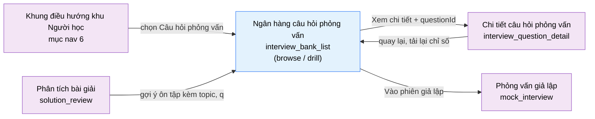

# Tài liệu thiết kế cơ bản (BD) — Ngân hàng câu hỏi phỏng vấn (`USR0401`)

## Phương châm tài liệu [Nội bộ — không cần khách duyệt]

- Viết theo **mẫu 9 sheet**. Bộ thẻ đóng, quy ước ID, ký hiệu chuẩn, ranh giới với tài liệu khác và
  checklist kiểm toán nằm ở `02-bd/_rules/bd-template-9sheet.md` — file này không chép lại.
- Phần gắn nhãn `[Nội bộ]` phục vụ sinh mã và tự kiểm toán, không phải yêu cầu của khách hàng: mục 4.5,
  mục 7.3 và các ghi chú quy ước.
- Mã màn `USR0401` theo bảng mã ở `02-bd/_rules/bd-template-9sheet.md` mục 8; tên file mang tiền tố mã.
  Slug chính tắc `interview_bank_list` không đổi.
- Màn không có màn con và **không có popup**; nó có **hai trạng thái trong cùng một màn**: `browse` (mặc
  định) và `drill` (luyện nhanh dạng thẻ) [Nguồn: 09-layoutBase/Câu hỏi phỏng vấn.dc.html:97,193]. Theo
  quy ước thuật ngữ ở `02-bd/_rules/bd-template-9sheet.md:51-54`, đổi trạng thái **không** phải chuyển màn.
- Màn là gốc của cụm hai màn: màn này và `interview_question_detail` (`USR0402`) — bản xem nhanh ở cột
  phải chỉ là **bản rút gọn**, trang chi tiết đầy đủ là màn riêng
  [Nguồn: 01-rd/screens/users/USR0401_interview_bank_list.md:111].

> Đọc cùng `01-rd/screens/users/USR0401_interview_bank_list.md` (hành vi ở mức yêu cầu, không lặp lại ở
> đây), hai file BD module `02-bd/architecture/interview-bank.md` và `02-bd/database/interview-bank.md`,
> và khung điều hướng khu Người học `02-bd/screens/users/_shell.md`. **Không mô tả lại header và chân
> trang** — màn này là mục nav thứ 5 (cuối) trên thanh header ngang, không có sidebar
> [Nguồn: 02-bd/screens/users/_shell.md:60].
>
> **Phạm vi đã chốt trước khi viết BD** — không mở lại:
> - **Không có** khái niệm "bộ câu hỏi theo lớp" (F6-11 đã loại khỏi phạm vi,
>   `DEC-2026-0828-remove-per-class-interview-set`) và **không có** bảng `question_sets`
>   [Nguồn: 02-bd/database/interview-bank.md:179-185].
> - **Danh mục chủ đề là dữ liệu do ADMIN quản lý** (5 chủ đề khởi tạo, không còn cố định — thay tiểu quyết
>   định 4 của `DEC-2026-0830-interview-bank-crud` bằng `DEC-2026-1001-admin-configurable-settings`), dùng chung ba màn, màn này không tự định
>   nghĩa danh sách riêng [Nguồn: 01-rd/req/interview-bank.md:9-13;
>   02-bd/architecture/interview-bank.md:58-66].
> - **Màn này không gọi AI.** Chế độ luyện (F6-07/F6-08 — nơi duy nhất F6 chạm LLM) nằm ở `USR0402`
>   [Nguồn: 02-bd/architecture/interview-bank.md:49]. Phân hệ AI chết hoặc hết quota thì màn này hoạt
>   động **nguyên vẹn**: duyệt, lọc, xem nhanh, tự chấm, luyện nhanh đều không phụ thuộc AI
>   [Nguồn: 02-bd/architecture/interview-bank.md:270-279].
> - **Không có use case sửa câu trả lời đã nộp** (`DEC-2026-0831-outside-screens-closures`) — màn này
>   không chạm `user_answers` ở bất kỳ chiều nào.

---

## Sheet 1. Bìa

| Mục | Giá trị |
| :--- | :--- |
| Hệ thống | AlgoPrep |
| Phân hệ | `interview-bank` (F6) |
| Công đoạn | BD — Thiết kế cơ bản |
| Phân loại | Màn hình |
| Tên màn | Ngân hàng câu hỏi phỏng vấn |
| Mã màn hình | `USR0401` |
| Tên vật lý (slug) | `interview_bank_list` |
| Trục tài liệu | Màn hình (`02-bd/screens/`) |
| Actor | A1 (`STUDENT`) |
| Phiên bản | V1.5 |
| Người tạo | Nhóm phát triển AlgoPrep |
| Ngày tạo | 2026/09/21 |
| Người cập nhật | Nhóm phát triển AlgoPrep |
| Ngày cập nhật | 2026/10/03 |

---

## Sheet 2. Lịch sử sửa đổi

| Ver | Sheet bị sửa | Nội dung sửa | Ngày | Người sửa |
| :--- | :--- | :--- | :--- | :--- |
| V1.0 | Toàn bộ | Tạo mới theo mẫu 9 sheet. Ánh xạ toàn bộ trường hiển thị của prototype về cột thật trong `02-bd/database/interview-bank.md`; phát hiện 5 trường prototype không có nguồn dữ liệu (mã câu hỏi `IQ-0nn`, dòng "Xuất hiện ở 6/12 buổi phỏng vấn", "Bẫy thường gặp", "Thêm vào phiên giả lập tới", tag) và chuyển thành câu hỏi mở; bổ sung hai điều khiển RD yêu cầu mà prototype thiếu (đánh dấu xem lại F6-03, liên kết mở `USR0402`) | 2026/09/21 | Nhóm phát triển AlgoPrep |
| V1.1 | Sheet 7 (mục 7.3) | Sửa tham chiếu sang `SHR0301`: endpoint `GetInterviewQuestionBankStats` không còn tồn tại ở màn quản trị (dải thẻ chỉ số đã bỏ 2026-10-01), nên bỏ câu "không dùng lại" và trỏ số dòng đúng của `ListInterviewQuestions`, `ListQuestionTopics`. Không đổi hành vi của màn này | 2026/10/01 | AI |
| V1.2 | Sheet 4, 5, 7 | Đã chốt 2026-10-01 (owner uỷ quyền cân nhắc), xem `DEC-2026-1001-admin-configurable-settings`: **danh mục chủ đề do ADMIN quản lý**, không còn "5 chủ đề cố định". Chip chủ đề đọc từ `ListQuestionTopics`: chip "Tất cả" cộng một chip cho mỗi chủ đề hiện có, số chip không cố định; 5 chủ đề cũ chỉ là dữ liệu khởi tạo. `ListQuestionTopics` là endpoint đọc, mọi người dùng đã xác thực gọi được; thêm/sửa/xoá chủ đề ở `SHR0301` | 2026/10/01 | AI |
| V1.3 | Sheet 8, 9 | Đổi phản hồi sau thao tác (tìm kiếm, lọc, đánh dấu, tự chấm, luyện nhanh) và `[Tiêu điểm]` kiểm nhập liệu sang toast; giữ nguyên lỗi tải theo khu vực ở EVT-1, EVT-5, EVT-6. Theo `DEC-2026-1003-toast-feedback-channel`. | 2026/10/03 | AI |
| V1.4 | Sheet 4, 5, 7 | Đồng bộ `DEC-2026-1001-admin-configurable-settings` mục (6): độ khó câu hỏi là danh mục do ADMIN quản lý (`question_levels`), không còn enum cố định. DTO `difficulty` thành `levelCode`/`levelDisplayName` đọc qua `level_id`; nhãn hiển thị lấy từ dữ liệu, bỏ ánh xạ cứng "Dễ/Trung bình/Khó"; thêm `question_levels` vào bảng liên quan và Truy cập bảng (R, qua join). Màn chỉ hiển thị nhãn, không có bộ lọc độ khó (khớp bản dựng lúc đó: chỉ có bộ lọc trạng thái và chủ đề). **Đã thay bởi V1.5**: bản dựng nay có bộ lọc độ khó. Không đổi NO | 2026/10/03 | AI |
| V1.5 | Sheet 4, 5, 6, 7, 8, 9, Câu hỏi mở; rà soát toàn bộ trích dẫn | Chủ dự án duyệt 2026-10-03: thêm **bộ lọc độ khó** phía người học. Tab độ khó đặt sau chip chủ đề, mỗi mức của `question_levels` một tab cộng tab "Tất cả"; cộng dồn `VÀ` với tìm kiếm, tab trạng thái và chip chủ đề, và luyện nhanh lấy bộ thẻ từ danh sách đã lọc kể cả theo độ khó. Màn nay gọi thêm `ListQuestionLevels` (chỉ đọc, mọi người dùng đã xác thực gọi được, `02-bd/security/interview-bank.md:76`). Thêm mới, không đổi số: Sheet 5 khu vực B NO 4; Sheet 6 khu vực B NO 4; Sheet 7.1 NO 15; Sheet 7.3 NO 7; Sheet 8 EVT-15; Câu hỏi mở Q10. Sửa câu "không lọc theo độ khó" ở Sheet 7.1 NO 3 và V1.4. Sửa EVT-1 (tải thêm danh mục độ khó) và Sheet 9 NO 4 (bỏ "5 mã chủ đề seed" đã lỗi thời theo V1.2). Rà lại số dòng mọi trích dẫn: `02-bd/database/interview-bank.md` lệch +22 từ mục 1.1a; `02-bd/architecture/interview-bank.md` lệch ở mục 2.1 trở xuống; các dòng `interview-bank-list-view.tsx` lệch +8; mục nav của màn là thứ 5 (không phải thứ 6) theo `_shell.md:60`; câu hỏi mở Q1 đã được khung khu Người học đóng (`_shell.md:131`) | 2026/10/03 | AI |

---

## Sheet 3. Sơ đồ chuyển màn

> [Nội bộ] Quy ước vẽ: bố trí từ trái sang phải. Màn gọi tới tô tím, màn hiện tại tô xanh nhạt, màn đích
> tô tím. Màu và `[Nguồn:]` dùng để truy vết, không phải yêu cầu của khách hàng. Trạng thái `drill` vẽ
> trong cùng nút với màn chính vì **không phải một màn** — xem Phương châm tài liệu.

### 3.1 Danh sách chuyển màn

#### Khung điều hướng khu Người học → Ngân hàng câu hỏi phỏng vấn

[Điều kiện mở] Chọn mục nav thứ 5 "Câu hỏi phỏng vấn" trên thanh header ngang
[Nguồn: 02-bd/screens/users/_shell.md:60].

[Chế độ mở] Trạng thái `browse`, không có bộ lọc nào được áp.

[Thông tin truyền] Không có.

[Giá trị trả về] Không có.

[Khi thành công] Tải danh mục chủ đề, trang đầu danh sách câu hỏi và bốn chỉ số ôn tập cá nhân; cột phải
hiển thị bản xem nhanh của câu hỏi đầu danh sách.

[Khi huỷ] Không có.

#### Phân tích bài giải → Ngân hàng câu hỏi phỏng vấn

[Điều kiện mở] Bấm liên kết gợi ý ôn tập trên màn `solution_review` (F5-06)
[Nguồn: 01-rd/screens/users/USR0401_interview_bank_list.md:126].

[Chế độ mở] Trạng thái `browse`, bộ lọc áp sẵn theo tham số nhận được.

[Thông tin truyền] `topic` (mã chủ đề, một giá trị) và `q` (từ khoá tìm kiếm) trên tham số truy vấn —
hình dạng chính xác của tham số thuộc DD `interview-bank`, RD đã đánh **[Đợi nextjs]**
[Nguồn: 01-rd/screens/users/USR0401_interview_bank_list.md:113].

[Giá trị trả về] Không có.

[Khi thành công] Chip chủ đề và ô tìm kiếm hiển thị đúng giá trị nhận được, danh sách đã lọc sẵn, người
học không phải gõ lại.

[Khi huỷ] Không có.

#### Ngân hàng câu hỏi phỏng vấn → Chi tiết câu hỏi phỏng vấn

[Điều kiện mở] Bấm liên kết "Xem chi tiết" trong bản xem nhanh ở cột phải.

[Chế độ mở] Chế độ học (`STUDY`) của `USR0402`.

[Thông tin truyền] `questionId` của câu hỏi đang chọn, kèm nguyên trạng thái bộ lọc hiện hành (`topic`,
`q`, `status`) để màn chi tiết dựng được đường quay lại đúng danh sách đã lọc.

[Giá trị trả về] Không có giá trị trả về tường minh. Khi quay lại, màn này tải lại chỉ số và trạng thái
tự chấm — vì người học có thể đã tự chấm hoặc nộp một lượt luyện ở màn chi tiết.

[Khi thành công] Mở màn `interview_question_detail`.

[Khi huỷ] Không có.

#### Ngân hàng câu hỏi phỏng vấn → Phỏng vấn giả lập

[Điều kiện mở] Bấm nút "Vào phiên giả lập" ở đầu trang
[Nguồn: 09-layoutBase/Câu hỏi phỏng vấn.dc.html:110].

[Chế độ mở] Không có.

[Thông tin truyền] Không có. Màn này **không** truyền danh sách câu hỏi đã chọn sang `mock_interview` —
xem Câu hỏi mở Q5.

[Giá trị trả về] Không có.

[Khi thành công] Mở màn `mock_interview` (`USR0302`), thuộc Bounded Context `ai-review` (F5).

[Khi huỷ] Không có.

### 3.2 Sơ đồ

[Nguồn: 09-layoutBase/Câu hỏi phỏng vấn.dc.html:108-111; 01-rd/screens/users/USR0401_interview_bank_list.md:111,113,126; 02-bd/screens/users/_shell.md:60]

---

## Sheet 4. Bố cục màn hình

### 4.1 Tổng quan màn

[Mục đích màn] Cho người học duyệt toàn bộ ngân hàng câu hỏi phỏng vấn lý thuyết dùng chung của hệ
thống, tìm kiếm và lọc theo chủ đề, độ khó và trạng thái ôn tập, xem nhanh gợi ý trả lời của một câu hỏi mà
không rời danh sách, tự chấm mức độ nhớ để hệ thống xếp lịch ôn lại, và luyện nhanh dạng thẻ
[Nguồn: 01-rd/req/interview-bank.md:8,34-40; 01-rd/screens/users/USR0401_interview_bank_list.md:14-16].

[Luồng nghiệp vụ chính]

1. **Hiển thị ban đầu**: vào màn, hệ thống tải song song ba nhóm dữ liệu — danh mục chủ đề và danh mục độ khó (đều đọc từ dữ liệu), trang đầu
   danh sách câu hỏi `ACTIVE`, và bốn chỉ số ôn tập của chính người học. Trong lúc chờ, mỗi khu vực hiển
   thị khung chờ đúng số dòng dự kiến. Có tham số `topic`/`q` trên URL thì áp bộ lọc trước khi gọi danh
   sách.
2. **Lọc và tìm kiếm**: gõ từ khoá, chọn tab trạng thái ôn tập, chọn chip chủ đề, chọn tab độ khó. Bốn bộ lọc cộng dồn
   theo phép `VÀ` [Nguồn: 05-coding/frontend/src/views/users/interview-bank-list/ui/interview-bank-list-view.tsx:76-85]. Prototype `09-layoutBase` chỉ có ba bộ lọc đầu
   [Nguồn: 09-layoutBase/Câu hỏi phỏng vấn.dc.html:343-351]; bộ lọc độ khó là phần bổ sung đã duyệt 2026-10-03, bằng chứng là bản dựng Next.js.
3. **Xem nhanh**: bấm một dòng thì cột phải hiển thị bản rút gọn của câu hỏi đó — tiêu đề đầy đủ, ý cần
   nói, từ khoá cốt lõi. Không rời màn.
4. **Tự chấm mức độ nhớ (F6-12)**: chọn một trong ba mức ngay trong bản xem nhanh. Hệ thống ghi lại và
   tính lại lịch ôn lại đồng bộ, không qua job nền
   [Nguồn: 02-bd/architecture/interview-bank.md:256-259].
5. **Đánh dấu để xem lại (F6-03)**: bật hoặc tắt đánh dấu trên từng dòng câu hỏi.
6. **Luyện nhanh**: bấm "Luyện nhanh", màn chuyển sang trạng thái `drill` — lần lượt từng thẻ, hiện tiêu
   đề trước, người học tự nhớ rồi mới bấm hiện ý cần nói, tự chấm và sang thẻ kế tiếp. Bấm "Thoát" thì
   quay lại `browse` với đúng bộ lọc trước đó. Bộ thẻ lấy từ danh sách đã lọc, nên tab độ khó đang chọn cũng thu hẹp bộ thẻ
   [Nguồn: 05-coding/frontend/src/views/users/interview-bank-list/ui/interview-bank-list-view.tsx:99-103].
7. **Khoan sâu**: cần nội dung đầy đủ (khung trả lời chuẩn, Chế độ luyện có AI chấm) thì mở màn
   `interview_question_detail`.

[Người dùng] Người học đã đăng nhập (`STUDENT`). Toàn bộ trạng thái ôn tập, đánh dấu và chỉ số đều gắn
với một người dùng cụ thể, nên màn không có chế độ xem ẩn danh — xem Câu hỏi mở Q1.

[Tệp liên quan] Không có. Màn này không xuất hay nhập tệp.

[Phạm vi]
- **Không** có Chế độ luyện (soạn câu trả lời, AI chấm — F6-07/F6-08): thuộc `USR0402`
  [Nguồn: 01-rd/screens/users/USR0401_interview_bank_list.md:111].
- **Không** có khung trả lời chuẩn dạng STAR (F6-05): thuộc `USR0402` (cùng nguồn trên).
- **Không** có bộ câu hỏi theo lớp — đã loại khỏi phạm vi
  (`DEC-2026-0828-remove-per-class-interview-set`).
- **Không** có thao tác tạo, sửa, xoá câu hỏi: thuộc `SHR0301`/`SHR0302`, gác bởi Function
  `INTERVIEW_BANK_MANAGEMENT`.
- **Không** hiển thị câu hỏi `status = RETIRED` [Nguồn: 02-bd/database/interview-bank.md:65].
- **Không** lọc câu hỏi thiếu rubric ra khỏi danh sách: câu thiếu rubric vẫn hiện đầy đủ ở Chế độ học,
  chỉ bị ẩn ở Chế độ luyện của màn `USR0402` [Nguồn: 01-rd/req/interview-bank.md:62-63].

[Quyền sử dụng]
- Xem: được, với mọi tài khoản `STUDENT` đã đăng nhập. Toàn bộ ngân hàng là dùng chung cấp hệ thống,
  không chia theo lớp.
- Thêm: chỉ thêm dữ liệu **của chính người học** — một dòng đánh dấu (`bookmarks`) và một dòng trạng thái
  ôn tập (`recall_ratings`). Không thêm câu hỏi.
- Sửa: chỉ ghi đè dòng trạng thái ôn tập của chính mình.
- Xoá: chỉ gỡ đánh dấu của chính mình. Không xoá câu hỏi.

[Số bản ghi tối đa] Danh sách câu hỏi: phân trang cuộn, mỗi lần tải 20 dòng
(`[Suy luận]` — prototype giới hạn vùng cuộn 620px với 9 dòng mẫu và không cài phân trang,
09-layoutBase/Câu hỏi phỏng vấn.dc.html:131-132; 148 câu hỏi trong dữ liệu mẫu là quá nhiều để tải một
lần). Chủ đề: chip "Tất cả" cộng một chip mỗi chủ đề hiện có (prototype vẽ 5). Tab độ khó: "Tất cả" cộng một tab mỗi mức hiện có trong `question_levels` (ban đầu 3 mức, số tab không cố định). Tab trạng thái: đúng 4. Bộ thẻ luyện nhanh: mặc định 10
thẻ, khoảng 5 tới 20 [Nguồn: 09-layoutBase/Câu hỏi phỏng vấn.dc.html:235].

### 4.2 DTO liên quan

- `InterviewQuestionSummaryDto` — một dòng trong danh sách cột trái.
- `InterviewQuestionDetailDto` — nội dung bản xem nhanh cột phải và thẻ luyện nhanh; dùng chung với
  `USR0402`.
- `QuestionTopicDto` — một chip chủ đề.
- `QuestionLevelDto` — một tab độ khó.
- `RecallSummaryDto` — bốn chỉ số ôn tập đầu trang.
- `RecallRatingDto` — một lần tự chấm mức độ nhớ.

`[Suy luận]` — tên DTO do BD này đề xuất, `03-dd/api/interview-bank.md` chốt lại.

### 4.3 Bảng dữ liệu liên quan (5)

| NO | Bảng | Ghi chú |
| --: | :--- | :--- |
| 1 | `interview_bank.interview_questions` | [Nguồn: 02-bd/database/interview-bank.md:52-76] |
| 2 | `interview_bank.question_topics` | [Nguồn: 02-bd/database/interview-bank.md:8-28] |
| 3 | `interview_bank.recall_ratings` | [Nguồn: 02-bd/database/interview-bank.md:159-177] |
| 4 | `interview_bank.bookmarks` | [Nguồn: 02-bd/database/interview-bank.md:98-108] |
| 5 | `interview_bank.question_levels` | Chỉ đọc: qua join `level_id` để lấy nhãn độ khó, và trực tiếp (`ListQuestionLevels`) để dựng tab lọc độ khó [Nguồn: 02-bd/database/interview-bank.md:30-50] |

Ba bảng còn lại của module **không** dùng ở màn này: `answer_rubrics` và `user_answers` chỉ phục vụ Chế
độ luyện ở `USR0402`; `practice_history` phục vụ màn `my_progress` (F6-10), còn bốn chỉ số đầu trang của
màn này tính từ `interview_questions` và `recall_ratings` — xem mục 7.2.

### 4.4 Vùng bố cục

Đối chiếu `09-layoutBase/Câu hỏi phỏng vấn.dc.html` — bằng chứng bố cục chỉ-đọc, **không phải** design
system cuối cùng. Cẩn thận phân biệt với `09-layoutBase/Admin - Câu hỏi phỏng vấn.dc.html`, là prototype
của màn quản trị `SHR0301` chứ không phải màn này.

| Vùng | Vị trí trong prototype | Nội dung |
| :--- | :--- | :--- |
| Header ngang dính trên (khung chung khu Người học) | `:46-93` | Dùng lại `02-bd/screens/users/_shell.md` mục 2, không mô tả lại |
| Vùng nội dung | `:95` | Một cột giữa trang, chiều rộng tối đa 1400px |
| Thanh chỉ số và hành động | `:99-112` | Bốn chỉ số ôn tập bên trái, hai nút hành động dồn về phải |
| Cột trái — bộ lọc | `:117-130` | Ô tìm kiếm, bốn tab trạng thái, chip chủ đề (prototype vẽ sáu chip, số chip thật theo dữ liệu), và tab độ khó đặt sau chip chủ đề — **prototype `09-layoutBase` không vẽ tab độ khó**, bằng chứng là bản dựng Next.js [Nguồn: 05-coding/frontend/src/views/users/interview-bank-list/ui/interview-bank-list-view.tsx:282-292] |
| Cột trái — danh sách câu hỏi | `:131-145` | Vùng cuộn dọc, mỗi dòng gồm chủ đề, độ khó, nhãn trạng thái, tiêu đề; có trạng thái rỗng |
| Cột phải — bản xem nhanh | `:148-188` | Dính trên khi cuộn; tiêu đề, ý cần nói, từ khoá, khối tự chấm |
| Trạng thái `drill` | `:193-229` | Thay toàn bộ vùng nội dung: thanh tiến độ, thẻ câu hỏi, hai nút chấm |
| Chân trang (khung chung khu Người học) | Không có trong prototype này | Vẫn dựng theo `02-bd/screens/users/_shell.md` mục 3 — quyết định nhất quán ba khu, không phải kết luận rút từ prototype |

Bố cục hai cột `1fr 1fr` (`:114`) ở trạng thái `browse`; trạng thái `drill` thu về một cột hẹp
`max-width: 780px` căn giữa (`:194`). Giữ nguyên cấu trúc này khi dựng Next.js; không quy định màu sắc,
khoảng cách hay typography ở BD.

### 4.5 Cấu trúc slice FSD [Nội bộ]

| Khối | Slice dự kiến | Căn cứ |
| :--- | :--- | :--- |
| Trang | `views/users/interview-bank-list` | Quy ước FSD của dự án |
| Khung khu Người học | Dùng lại `widgets/student-shell` | `02-bd/screens/users/_shell.md` |
| Thanh chỉ số | `widgets/recall-summary-bar` + `entities/recall-rating` | Prototype `:99-107` |
| Bộ lọc | `features/interview-question-filter` + `entities/question-topic` + `entities/question-level` | Prototype `:117-130`; tab độ khó theo bản dựng [Nguồn: 05-coding/frontend/src/views/users/interview-bank-list/ui/interview-bank-list-view.tsx:282-292] |
| Danh sách | `widgets/interview-question-list` + `entities/interview-question` | Prototype `:131-145` |
| Bản xem nhanh | `widgets/interview-question-quick-view` | Prototype `:148-188` |
| Tự chấm | `features/rate-question-recall` | Prototype `:180-184` |
| Đánh dấu | `features/bookmark-question` | RD REQ-01 (F6-03), prototype không có |
| Luyện nhanh | `features/question-drill` | Prototype `:193-229` |

`[Suy luận]` — ánh xạ slice do BD đề xuất, DD màn hình chốt lại. `entities/interview-question`,
`entities/question-topic` và `features/rate-question-recall` dùng chung với `USR0402`, không nhân bản.

> [Nội bộ] Ảnh minh hoạ đặt ở `08-diagram/02-bd/screens/users/`, chụp bằng Playwright trên ứng dụng
> Next.js thật khi đã có mã chạy được. Chưa có thì tham chiếu prototype, không vẽ tay.

---

## Sheet 5. Danh sách item màn hình

> Quy ước ID, bộ thẻ và giá trị chuẩn: `02-bd/_rules/bd-template-9sheet.md` mục 2, 3, 4.

### Khu vực A — Thanh chỉ số và hành động

| Khu vực | NO | Tên item | ID item | Bảng DB | Cột DB | Loại UI | Kiểu | Độ dài | Bắt buộc | I/O | Giá trị mặc định | Định dạng | Ghi chú |
| :--- | --: | :--- | :--- | :--- | :--- | :--- | :--- | :--- | :-: | :-: | :--- | :--- | :--- |
| Thanh chỉ số và hành động | | | | | | | | | | | | | |
| | 1 | Tổng câu hỏi | `interviewBankList.stats.totalQuestions` | `interview_questions` | `status` | Label | Number | 5 | - | O | 0 | `{số} câu` | Tổng số câu hỏi đang dùng được của ngân hàng [Công thức] Đếm `interview_questions` có `status = 'ACTIVE'`, không phụ thuộc bộ lọc đang áp [EVT liên quan] EVT-1 |
| | 2 | Đã thuộc | `interviewBankList.stats.known` | `recall_ratings` | `rating` | Label | Number | 5 | - | O | 0 | `{số} / {tổng}` | Số câu hỏi người học tự chấm mức Biết rõ [Công thức] Đếm `recall_ratings` của chính `user_id` có `rating = 'KNOWN'`, mẫu số là item NO 1 [EVT liên quan] EVT-1, EVT-8, EVT-13 |
| | 3 | Đang ôn | `interviewBankList.stats.reviewing` | `recall_ratings` | `rating` | Label | Number | 5 | - | O | 0 | `{số} / {tổng}` | Số câu hỏi người học tự chấm mức Mơ hồ hoặc Quên [Công thức] Đếm `recall_ratings` của chính `user_id` có `rating IN ('VAGUE','FORGOTTEN')` [EVT liên quan] EVT-1, EVT-8, EVT-13 |
| | 4 | Ôn trong tuần | `interviewBankList.stats.drilledThisWeek` | `recall_ratings` | `rated_at` | Label | Number | 5 | - | O | 0 | `{số} thẻ` | Số câu hỏi đã tự chấm trong 7 ngày gần nhất [Công thức] Đếm `recall_ratings` của chính `user_id` có `rated_at >= now() - 7 ngày`. **Đếm thiếu khi một câu được chấm nhiều lần trong tuần** vì bảng ghi đè tại chỗ, chỉ giữ lần chấm mới nhất — xem Câu hỏi mở Q2 [EVT liên quan] EVT-1, EVT-8, EVT-13 |
| | 5 | Luyện nhanh | `interviewBankList.header.btnStartDrill` | - | - | Button | - | - | - | I | - | `Luyện nhanh {số} câu` | Chuyển màn sang trạng thái `drill` [Nguồn giá trị] Số thẻ lấy từ hằng số cấu hình giao diện, mặc định 10, khoảng 5 tới 20 [Nguồn: 09-layoutBase/Câu hỏi phỏng vấn.dc.html:235] [EVT liên quan] EVT-11 |
| | 6 | Vào phiên giả lập | `interviewBankList.header.btnMockInterview` | - | - | Link | - | - | - | I | - | - | Điều hướng sang màn `mock_interview` (`USR0302`) [Nguồn giá trị] - [EVT liên quan] EVT-10 |

### Khu vực B — Bộ lọc

| Khu vực | NO | Tên item | ID item | Bảng DB | Cột DB | Loại UI | Kiểu | Độ dài | Bắt buộc | I/O | Giá trị mặc định | Định dạng | Ghi chú |
| :--- | --: | :--- | :--- | :--- | :--- | :--- | :--- | :--- | :-: | :-: | :--- | :--- | :--- |
| Bộ lọc | | | | | | | | | | | | | |
| | 1 | Ô tìm kiếm | `interviewBankList.filter.searchBox` | `interview_questions` | `title`, `content_markdown`, `core_keywords` | TextBox | String | 100 | - | I/O | Rỗng, hoặc tham số `q` trên URL | - | Tìm theo tiêu đề, nội dung và từ khoá cốt lõi (F6-02) [Nguồn giá trị] Người học nhập; giá trị khởi tạo lấy từ tham số `q` khi đến từ `solution_review` [EVT liên quan] EVT-2 |
| | 2 | Tab trạng thái ôn tập | `interviewBankList.filter.statusTabs` | `recall_ratings` | `rating` | List | Enum | - | - | I/O | `Tất cả` | - | Bốn tab: Tất cả / Chưa xem / Đang ôn / Đã thuộc [Nguồn: 09-layoutBase/Câu hỏi phỏng vấn.dc.html:305-310] [Công thức] `Chưa xem` là **không có** dòng `recall_ratings` cho cặp người dùng và câu hỏi; `Đang ôn` là `rating IN ('VAGUE','FORGOTTEN')`; `Đã thuộc` là `rating = 'KNOWN'` [EVT liên quan] EVT-3 |
| | 3 | Chip chủ đề | `interviewBankList.filter.topicChips` | `question_topics` | `code`, `display_name`, `sort_order` | List | List | - | - | I/O | `Tất cả` | - | Chip "Tất cả" cộng một chip cho mỗi chủ đề trong `question_topics`, sắp theo `sort_order`; số chip không cố định vì ADMIN thêm/xoá chủ đề được (`DEC-2026-1001-admin-configurable-settings`) [Nguồn giá trị] Kết quả gọi `ListQuestionTopics`; nhãn lấy `display_name`, giá trị lọc lấy `code`. Giá trị khởi tạo lấy từ tham số `topic` khi đến từ `solution_review` [EVT liên quan] EVT-1, EVT-4 |
| | 4 | Tab độ khó | `interviewBankList.filter.levelTabs` | `question_levels` | `code`, `display_name`, `sort_order` | List | List | - | - | I/O | `Tất cả` | - | Tab "Tất cả" cộng một tab cho mỗi mức trong `question_levels`, sắp theo `sort_order`, đặt sau chip chủ đề; số tab không cố định vì ADMIN thêm/xoá mức được (`DEC-2026-1001-admin-configurable-settings` mục 6). Chọn một mức tại một thời điểm, cộng dồn `VÀ` với ba bộ lọc còn lại [Nguồn giá trị] Kết quả gọi `ListQuestionLevels`; nhãn lấy `display_name`, giá trị lọc lấy `code` (khớp `interview_questions.level_id`). Không có tham số URL cho bộ lọc này — xem Câu hỏi mở Q10 [Nguồn: 05-coding/frontend/src/views/users/interview-bank-list/ui/interview-bank-list-view.tsx:40,62,68,282-292] [EVT liên quan] EVT-1, EVT-15 |

### Khu vực C — Danh sách câu hỏi

| Khu vực | NO | Tên item | ID item | Bảng DB | Cột DB | Loại UI | Kiểu | Độ dài | Bắt buộc | I/O | Giá trị mặc định | Định dạng | Ghi chú |
| :--- | --: | :--- | :--- | :--- | :--- | :--- | :--- | :--- | :-: | :-: | :--- | :--- | :--- |
| Danh sách câu hỏi | | | | | | | | | | | | | |
| | 1 | Danh sách câu hỏi | `interviewBankList.list` | `interview_questions` | - | List | List | - | - | O | Rỗng | - | Danh sách câu hỏi `ACTIVE` khớp cả bốn bộ lọc (tìm kiếm, trạng thái, chủ đề, độ khó), cuộn tải thêm 20 dòng mỗi lần [Nguồn giá trị] Kết quả gọi `ListInterviewQuestions` [EVT liên quan] EVT-1, EVT-2, EVT-3, EVT-4, EVT-5, EVT-15 |
| | 2 | Chủ đề | `interviewBankList.list.col.topic` | `question_topics` | `display_name` | ListColumn | String | - | - | O | - | Chữ hoa | Chủ đề của câu hỏi, lấy qua `interview_questions.topic_id` [Nguồn giá trị] Cột `question_topics.display_name` [EVT liên quan] - |
| | 3 | Độ khó | `interviewBankList.list.col.difficulty` | `question_levels`, `interview_questions` | `display_name` | ListColumn | String | - | - | O | - | Nhãn `display_name`, badge | Mức độ khó của câu hỏi (F6-01), lấy qua `interview_questions.level_id` [Nguồn giá trị] Cột `question_levels.display_name`, **đọc từ dữ liệu** do ADMIN quản lý ở `SHR0301`, không đi qua khoá i18n (khoá `...col.difficulty` chỉ còn là nhãn tiêu đề cột nếu có). Ba dòng seed `EASY`/`MEDIUM`/`HARD` ("Dễ"/"Trung bình"/"Khó") chỉ là dữ liệu thường. Màu badge: dòng seed giữ màu cũ, dòng ADMIN thêm mới dùng màu trung tính — **không có cột màu** trong `question_levels`, nên màu là quy ước của giao diện, không phải dữ liệu [Nguồn: 05-coding/frontend/src/entities/interview-question/ui/interview-question-list-row.tsx:36,57] [EVT liên quan] - |
| | 4 | Trạng thái ôn tập | `interviewBankList.list.col.recallStatus` | `recall_ratings` | `rating` | Badge | Enum | - | - | O | `Chưa xem` | Nhãn tiếng Việt | Trạng thái ôn tập của **chính người học** với câu hỏi đó [Công thức] Không có dòng `recall_ratings` thành "Chưa xem"; `KNOWN` thành "Đã thuộc"; `VAGUE` và `FORGOTTEN` thành "Đang ôn" [EVT liên quan] EVT-8, EVT-13 |
| | 5 | Tiêu đề câu hỏi | `interviewBankList.list.col.title` | `interview_questions` | `title` | ListColumn | String | - | - | O | - | - | Tiêu đề câu hỏi, hiển thị tối đa hai dòng [Nguồn giá trị] Cột `title` [EVT liên quan] EVT-6 |
| | 6 | Đánh dấu xem lại | `interviewBankList.list.col.btnBookmark` | `bookmarks` | `user_id`, `question_id` | Toggle | Boolean | - | - | I/O | Tắt | Bật / Tắt | Đánh dấu câu hỏi để xem lại (F6-03). **Prototype không có điều khiển này** — BD bổ sung vì RD đưa F6-03 vào phạm vi màn [Nguồn: 01-rd/screens/users/USR0401_interview_bank_list.md:121] [Nguồn giá trị] Có dòng `bookmarks` khớp `(user_id, question_id)` thì Bật [EVT liên quan] EVT-7 |
| | 7 | Trạng thái rỗng | `interviewBankList.list.emptyState` | - | - | Label | String | - | - | O | Không có câu hỏi khớp bộ lọc. | - | Câu thông báo khi bộ lọc không khớp dòng nào [Nguồn giá trị] Nhãn tĩnh i18n [Nguồn: 09-layoutBase/Câu hỏi phỏng vấn.dc.html:143] [EVT liên quan] - |

### Khu vực D — Bản xem nhanh

| Khu vực | NO | Tên item | ID item | Bảng DB | Cột DB | Loại UI | Kiểu | Độ dài | Bắt buộc | I/O | Giá trị mặc định | Định dạng | Ghi chú |
| :--- | --: | :--- | :--- | :--- | :--- | :--- | :--- | :--- | :-: | :-: | :--- | :--- | :--- |
| Bản xem nhanh | | | | | | | | | | | | | |
| | 1 | Chủ đề và độ khó | `interviewBankList.quickView.meta` | `question_topics`, `question_levels` | `display_name`, `display_name` | Label | String | - | - | O | - | `{chủ đề} · {độ khó}` | Nhãn phân loại của câu hỏi đang chọn; độ khó hiển thị dạng chữ thường, không badge [Nguồn giá trị] Hai cột `display_name` đã nêu (chủ đề qua `topic_id`, độ khó qua `level_id`). Prototype còn ghép thêm mã dạng `IQ-014` [Nguồn: 09-layoutBase/Câu hỏi phỏng vấn.dc.html:406] — **không có cột tương ứng**, BD bỏ khỏi thiết kế, xem Câu hỏi mở Q3 [EVT liên quan] EVT-6 |
| | 2 | Tiêu đề đầy đủ | `interviewBankList.quickView.title` | `interview_questions` | `title` | Label | String | - | - | O | - | - | Tiêu đề câu hỏi đang chọn, không cắt dòng [Nguồn giá trị] Cột `title` [EVT liên quan] EVT-6 |
| | 3 | Ý cần nói | `interviewBankList.quickView.outline` | `interview_questions` | `suggested_approach` | List | String | - | - | O | - | Danh sách đánh số hai chữ số | Gợi ý hướng tiếp cận (F6-04), hiển thị dạng danh sách đánh số [Nguồn giá trị] Cột `suggested_approach`, kiểu TEXT dạng Markdown — mỗi mục danh sách trong Markdown thành một dòng [Nguồn: 02-bd/database/interview-bank.md:61] [EVT liên quan] EVT-6 |
| | 4 | Từ khoá cốt lõi | `interviewBankList.quickView.keywords` | `interview_questions` | `core_keywords` | List | List | - | - | O | Rỗng | Chip | Từ khoá kỹ thuật cốt lõi cần nêu (F6-06) [Nguồn giá trị] Cột `core_keywords` [Nguồn: 02-bd/database/interview-bank.md:63]. Prototype gọi khối này là "tag" với nội dung lẫn cả bối cảnh phỏng vấn ("Hỏi ở vòng 1") [Nguồn: 09-layoutBase/Câu hỏi phỏng vấn.dc.html:244] — xem Câu hỏi mở Q4 [EVT liên quan] EVT-6 |
| | 5 | Mức độ nắm | `interviewBankList.quickView.recallLevels` | `recall_ratings` | `rating` | List | Enum | - | - | I/O | Mức hiện hành, không có thì không chọn mức nào | - | Ba nút tự chấm mức độ nhớ (F6-12): Biết rõ / Mơ hồ / Quên [Nguồn giá trị] Enum `rating` của `recall_ratings` [Nguồn: 02-bd/database/interview-bank.md:166]. Prototype dùng ba nhãn khác (Chưa xem / Đang ôn / Đã thuộc) [Nguồn: 09-layoutBase/Câu hỏi phỏng vấn.dc.html:413-418] — BD dùng ba mức của F6-12, xem Câu hỏi mở Q6 [EVT liên quan] EVT-8 |
| | 6 | Xem chi tiết | `interviewBankList.quickView.linkDetail` | - | - | Link | - | - | - | I | - | - | Mở màn `interview_question_detail` (`USR0402`) cho câu hỏi đang chọn. **Prototype không có liên kết này** — BD bổ sung vì cấu trúc hai màn được chốt sau khi prototype dựng xong [Nguồn: 01-rd/screens/users/USR0401_interview_bank_list.md:111] [Nguồn giá trị] - [EVT liên quan] EVT-9 |

### Khu vực E — Trạng thái luyện nhanh

| Khu vực | NO | Tên item | ID item | Bảng DB | Cột DB | Loại UI | Kiểu | Độ dài | Bắt buộc | I/O | Giá trị mặc định | Định dạng | Ghi chú |
| :--- | --: | :--- | :--- | :--- | :--- | :--- | :--- | :--- | :-: | :-: | :--- | :--- | :--- |
| Trạng thái luyện nhanh | | | | | | | | | | | | | |
| | 1 | Bộ đếm thẻ | `interviewBankList.drill.counter` | - | - | Label | String | - | - | O | `Thẻ 1 / {tổng}` | `Thẻ {n} / {tổng}` | Vị trí thẻ hiện tại trong phiên luyện [Công thức] Số thứ tự thẻ đang xem trên tổng số thẻ của phiên [Nguồn: 09-layoutBase/Câu hỏi phỏng vấn.dc.html:424] [EVT liên quan] EVT-11, EVT-13 |
| | 2 | Thanh tiến độ | `interviewBankList.drill.progressBar` | - | - | ProgressBar | Number | - | - | O | 0 | Phần trăm | Tiến độ của phiên luyện [Công thức] Số thứ tự thẻ chia tổng số thẻ, làm tròn phần trăm [Nguồn: 09-layoutBase/Câu hỏi phỏng vấn.dc.html:425] [EVT liên quan] EVT-11, EVT-13 |
| | 3 | Thoát | `interviewBankList.drill.btnExit` | - | - | Button | - | - | - | I | - | - | Quay lại trạng thái `browse`, giữ nguyên bộ lọc trước khi vào luyện [Nguồn giá trị] - [EVT liên quan] EVT-14 |
| | 4 | Phân loại thẻ | `interviewBankList.drill.cardMeta` | `question_topics`, `question_levels` | `display_name`, `display_name` | Label | String | - | - | O | - | `{chủ đề} · {độ khó}` | Nhãn phân loại của thẻ đang xem; độ khó là chữ thường [Nguồn giá trị] Hai cột `display_name` đã nêu (qua `topic_id` và `level_id`) [EVT liên quan] EVT-13 |
| | 5 | Tiêu đề thẻ | `interviewBankList.drill.cardTitle` | `interview_questions` | `title` | Label | String | - | - | O | - | - | Tiêu đề câu hỏi trên thẻ, căn giữa [Nguồn giá trị] Cột `title` [EVT liên quan] EVT-13 |
| | 6 | Ý cần nói trên thẻ | `interviewBankList.drill.cardOutline` | `interview_questions` | `suggested_approach` | List | String | - | - | O | Ẩn | Danh sách đánh số hai chữ số | Cùng nội dung với bản xem nhanh, **không** kèm mục nào khác [Nguồn giá trị] Cột `suggested_approach` [EVT liên quan] EVT-12 |
| | 7 | Hiện hoặc ẩn ý cần nói | `interviewBankList.drill.btnReveal` | - | - | Button | - | - | - | I | - | `Xem ý cần nói` / `Ẩn đáp án` | Đảo trạng thái lộ đáp án của thẻ [Nguồn giá trị] Nhãn tĩnh i18n, đổi theo trạng thái [Nguồn: 09-layoutBase/Câu hỏi phỏng vấn.dc.html:432] [EVT liên quan] EVT-12 |
| | 8 | Tự chấm trên thẻ | `interviewBankList.drill.recallLevels` | `recall_ratings` | `rating` | List | Enum | - | - | I | - | - | Ba nút tự chấm giống khu vực D, bấm xong chuyển sang thẻ kế tiếp. Prototype chỉ có hai nút ("Cần ôn lại", "Đã thuộc") [Nguồn: 09-layoutBase/Câu hỏi phỏng vấn.dc.html:223-224] — xem Câu hỏi mở Q6 [Nguồn giá trị] Enum `rating` của `recall_ratings` [EVT liên quan] EVT-13 |

[Nguồn: 09-layoutBase/Câu hỏi phỏng vấn.dc.html:99-112,117-130,131-145,148-188,193-229; 02-bd/database/interview-bank.md:8-28,52-76,98-108,159-177; 01-rd/screens/users/USR0401_interview_bank_list.md:44-68]

---

## Sheet 6. Đặc tả điều khiển item

> Ký hiệu cột `Hiển thị` và thứ tự thẻ: `02-bd/_rules/bd-template-9sheet.md` mục 2, 3. Dùng đúng NO, tên
> item và thứ tự của Sheet 5. Lỗi nhập liệu ghi ở Sheet 9, xử lý nghiệp vụ ghi ở Sheet 8.

### Khu vực A — Thanh chỉ số và hành động

| Khu vực | NO | Tên item | Hiển thị | Ghi chú |
| :--- | --: | :--- | :-: | :--- |
| Thanh chỉ số và hành động | | | | |
| | 1 | Tổng câu hỏi | Điều kiện | [Điều kiện hiển thị] Chỉ hiển thị ở trạng thái `browse`; trạng thái `drill` ẩn cả thanh chỉ số. Trong lúc tải hiển thị khung chờ đúng 4 chỉ số. |
| | 2 | Đã thuộc | Điều kiện | [Điều kiện hiển thị] Như NO 1. [Tự động đặt] Tính lại ngay sau mỗi lần tự chấm thành công, không cần tải lại màn. |
| | 3 | Đang ôn | Điều kiện | [Điều kiện hiển thị] Như NO 1. [Tự động đặt] Như NO 2. |
| | 4 | Ôn trong tuần | Điều kiện | [Điều kiện hiển thị] Như NO 1. [Tự động đặt] Như NO 2. |
| | 5 | Luyện nhanh | Điều kiện | [Điều kiện hiển thị] Chỉ hiển thị ở trạng thái `browse`. [Điều kiện kích hoạt] Không kích hoạt trong lúc đang tải danh sách, và không kích hoạt khi bộ lọc hiện hành (kể cả tab độ khó) không khớp câu hỏi nào. |
| | 6 | Vào phiên giả lập | Điều kiện | [Điều kiện hiển thị] Chỉ hiển thị ở trạng thái `browse`. |

### Khu vực B — Bộ lọc

| Khu vực | NO | Tên item | Hiển thị | Ghi chú |
| :--- | --: | :--- | :-: | :--- |
| Bộ lọc | | | | |
| | 1 | Ô tìm kiếm | Điều kiện | [Điều kiện hiển thị] Chỉ hiển thị ở trạng thái `browse`. [Tự động đặt] Có tham số `q` trên URL thì đặt sẵn giá trị đó ngay khi khởi tạo màn, trước khi gọi danh sách. |
| | 2 | Tab trạng thái ôn tập | Điều kiện | [Điều kiện hiển thị] Chỉ hiển thị ở trạng thái `browse`. Luôn đủ 4 tab, không ẩn tab nào kể cả khi không có câu hỏi ở trạng thái đó. |
| | 3 | Chip chủ đề | Điều kiện | [Điều kiện hiển thị] Chỉ hiển thị ở trạng thái `browse`. Trong lúc tải danh mục chủ đề hiển thị khung chờ cho dải chip (số chip theo danh mục hiện có, mặc định giả định 6 khi chưa tải). [Tự động đặt] Có tham số `topic` trên URL thì chọn sẵn chip tương ứng; mã chủ đề không khớp chủ đề nào trong danh mục đã tải thì bỏ qua tham số và giữ "Tất cả". |
| | 4 | Tab độ khó | Điều kiện | [Điều kiện hiển thị] Chỉ hiển thị ở trạng thái `browse`. Trong lúc tải danh mục độ khó hiển thị khung chờ; danh mục tải lỗi hoặc rỗng thì chỉ còn tab "Tất cả" và danh sách vẫn xem được. [Tự động đặt] Mặc định "Tất cả" mỗi lần vào màn. Mức đang chọn bị ADMIN xoá giữa chừng thì lần tải danh mục kế tiếp đưa tab về "Tất cả" `[SoT: Suy luận]` — bản dựng chưa xử lý tình huống này vì dữ liệu mẫu cố định. |

### Khu vực C — Danh sách câu hỏi

| Khu vực | NO | Tên item | Hiển thị | Ghi chú |
| :--- | --: | :--- | :-: | :--- |
| Danh sách câu hỏi | | | | |
| | 1 | Danh sách câu hỏi | Điều kiện | [Điều kiện hiển thị] Chỉ hiển thị ở trạng thái `browse`. Trong lúc tải trang đầu hiển thị khung chờ đúng 9 dòng. |
| | 2 | Chủ đề | Có | - |
| | 3 | Độ khó | Có | - |
| | 4 | Trạng thái ôn tập | Có | [Tự động đặt] Đổi ngay sau khi người học tự chấm câu hỏi đó, kể cả khi tự chấm từ bản xem nhanh hoặc từ thẻ luyện nhanh. |
| | 5 | Tiêu đề câu hỏi | Có | - |
| | 6 | Đánh dấu xem lại | Có | [Điều kiện kích hoạt] Kích hoạt sau khi tải xong dòng đó; trong lúc chờ phản hồi của một lần bật hoặc tắt thì không kích hoạt lại chính nút đó. |
| | 7 | Trạng thái rỗng | Điều kiện | [Điều kiện hiển thị] Chỉ hiển thị khi đã tải xong và không có dòng nào khớp bộ lọc; khi đó ẩn toàn bộ vùng danh sách. |

### Khu vực D — Bản xem nhanh

| Khu vực | NO | Tên item | Hiển thị | Ghi chú |
| :--- | --: | :--- | :-: | :--- |
| Bản xem nhanh | | | | |
| | 1 | Chủ đề và độ khó | Điều kiện | [Điều kiện hiển thị] Chỉ hiển thị ở trạng thái `browse` và khi đã có một câu hỏi được chọn. Danh sách rỗng thì cả khối xem nhanh hiển thị câu hướng dẫn chọn câu hỏi. |
| | 2 | Tiêu đề đầy đủ | Điều kiện | [Điều kiện hiển thị] Như NO 1. |
| | 3 | Ý cần nói | Điều kiện | [Điều kiện hiển thị] Như NO 1; câu hỏi có `suggested_approach` rỗng thì ẩn cả khối, không hiển thị tiêu đề khối trống. |
| | 4 | Từ khoá cốt lõi | Điều kiện | [Điều kiện hiển thị] Như NO 1; `core_keywords` rỗng thì ẩn cả khối. |
| | 5 | Mức độ nắm | Điều kiện | [Điều kiện hiển thị] Như NO 1. [Điều kiện kích hoạt] Không kích hoạt trong lúc đang chờ phản hồi của lần tự chấm trước. [Tự động đặt] Mức đang lưu được chọn sẵn; chấm lại thì mức mới thay mức cũ, không cộng dồn. |
| | 6 | Xem chi tiết | Điều kiện | [Điều kiện hiển thị] Như NO 1. |

### Khu vực E — Trạng thái luyện nhanh

| Khu vực | NO | Tên item | Hiển thị | Ghi chú |
| :--- | --: | :--- | :-: | :--- |
| Trạng thái luyện nhanh | | | | |
| | 1 | Bộ đếm thẻ | Điều kiện | [Điều kiện hiển thị] Chỉ hiển thị ở trạng thái `drill`. |
| | 2 | Thanh tiến độ | Điều kiện | [Điều kiện hiển thị] Chỉ hiển thị ở trạng thái `drill`. [Tự động đặt] Cập nhật cùng lúc với bộ đếm thẻ. |
| | 3 | Thoát | Điều kiện | [Điều kiện hiển thị] Chỉ hiển thị ở trạng thái `drill`. |
| | 4 | Phân loại thẻ | Điều kiện | [Điều kiện hiển thị] Chỉ hiển thị ở trạng thái `drill`. |
| | 5 | Tiêu đề thẻ | Điều kiện | [Điều kiện hiển thị] Chỉ hiển thị ở trạng thái `drill`. |
| | 6 | Ý cần nói trên thẻ | Điều kiện | [Điều kiện hiển thị] Chỉ hiển thị sau khi bấm "Xem ý cần nói" trên chính thẻ đang xem. [Tự động đặt] Sang thẻ kế tiếp thì tự thu lại, thẻ mới luôn bắt đầu ở trạng thái chưa lộ đáp án. |
| | 7 | Hiện hoặc ẩn ý cần nói | Điều kiện | [Điều kiện hiển thị] Chỉ hiển thị ở trạng thái `drill`. [Tự động đặt] Nhãn đổi giữa "Xem ý cần nói" và "Ẩn đáp án" theo trạng thái lộ đáp án. |
| | 8 | Tự chấm trên thẻ | Điều kiện | [Điều kiện hiển thị] Chỉ hiển thị ở trạng thái `drill`. [Điều kiện kích hoạt] Kích hoạt kể cả khi chưa lộ đáp án — người học được quyền tự chấm mà không cần xem gợi ý. [Tự động đặt] Bấm xong thì tự chuyển sang thẻ kế tiếp; thẻ cuối cùng thì kết thúc phiên và quay về `browse`. |

[Nguồn: 09-layoutBase/Câu hỏi phỏng vấn.dc.html:97,142-144,193,209,422-425,434-435; 02-bd/database/interview-bank.md:171-174]

---

## Sheet 7. Danh sách truyền dữ liệu

### 7.1 Trường DTO

| NO | DTO | Trường DTO | Kiểu | Bảng DB | Cột DB | Item màn | Hiển thị | Ghi chú |
| --: | :--- | :--- | :--- | :--- | :--- | :--- | :-: | :--- |
| 1 | `InterviewQuestionSummaryDto` | `id` | UUID | `interview_questions` | `id` | - | Không | [Nguồn] Phản hồi của `ListInterviewQuestions` [Đích] Tham số của `GetInterviewQuestion`, `RateQuestionRecall`, `ToggleQuestionBookmark` và của màn `USR0402`. Không hiển thị trên màn. |
| 2 | `InterviewQuestionSummaryDto` | `topicCode`, `topicDisplayName` | Enum, String | `question_topics` | `code`, `display_name` | Danh sách "Chủ đề" | Có | [Nguồn] Join qua `interview_questions.topic_id` [Chuyển đổi] Hiển thị `display_name`, lọc bằng `code`. |
| 3 | `InterviewQuestionSummaryDto` | `levelCode`, `levelDisplayName` | String, String | `question_levels` | `code`, `display_name` | Danh sách "Độ khó"; Xem nhanh và Luyện nhanh "Chủ đề và độ khó" | Có | [Nguồn] Join qua `interview_questions.level_id` (thay trường `difficulty` kiểu Enum cũ, theo `DEC-2026-1001-admin-configurable-settings` mục (6) và [Nguồn: 02-bd/database/interview-bank.md:30,58]) [Chuyển đổi] Đọc `display_name` từ `question_levels`, không còn ánh xạ cứng `EASY`/`MEDIUM`/`HARD` sang "Dễ"/"Trung bình"/"Khó". Màn hiển thị nhãn này và dùng `levelCode` để so khớp với tab độ khó (Sheet 5 khu vực B NO 4); danh sách mức đầy đủ lấy từ `ListQuestionLevels` (NO 15), mở cho mọi người dùng đã xác thực [Nguồn: 02-bd/architecture/interview-bank.md:99]. |
| 4 | `InterviewQuestionSummaryDto` | `title` | String | `interview_questions` | `title` | Danh sách "Tiêu đề câu hỏi" | Có | - |
| 5 | `InterviewQuestionSummaryDto` | `recallRating` | Enum nullable | `recall_ratings` | `rating` | Danh sách "Trạng thái ôn tập" | Có | [Nguồn] Left join `recall_ratings` theo `(user_id hiện hành, question_id)` [Chuyển đổi] Rỗng thành "Chưa xem"; `KNOWN` thành "Đã thuộc"; `VAGUE` và `FORGOTTEN` thành "Đang ôn". |
| 6 | `InterviewQuestionSummaryDto` | `bookmarked` | Boolean | `bookmarks` | `user_id`, `question_id` | Danh sách "Đánh dấu xem lại" | Có | [Nguồn] Tồn tại dòng `bookmarks` khớp cặp khoá thì `true` [Đích] Tham số của `ToggleQuestionBookmark`. |
| 7 | `InterviewQuestionDetailDto` | `suggestedApproach` | String | `interview_questions` | `suggested_approach` | Xem nhanh "Ý cần nói", Luyện nhanh "Ý cần nói trên thẻ" | Có | [Chuyển đổi] Markdown, tách mục danh sách thành các dòng đánh số hai chữ số khi hiển thị. |
| 8 | `InterviewQuestionDetailDto` | `coreKeywords` | List | `interview_questions` | `core_keywords` | Xem nhanh "Từ khoá cốt lõi" | Có | [Chuyển đổi] Mỗi phần tử là một chip. |
| 9 | `InterviewQuestionDetailDto` | `sampleAnswerFramework`, `followUpQuestions` | String, List | `interview_questions` | `sample_answer_framework`, `follow_up_questions` | - | Không | [Đích] Chỉ màn `USR0402` dùng — DTO dùng chung nhưng màn này **không** hiển thị, đúng phạm vi "bản xem nhanh rút gọn" [Nguồn: 01-rd/screens/users/USR0401_interview_bank_list.md:111]. |
| 10 | `QuestionTopicDto` | `code`, `displayName`, `sortOrder` | String, String, Number | `question_topics` | `code`, `display_name`, `sort_order` | Bộ lọc "Chip chủ đề" | Có | [Nguồn] Phản hồi của `ListQuestionTopics`, đọc từ dữ liệu do ADMIN quản lý (không còn đúng 5 dòng seed); `code` là slug, không còn enum [Chuyển đổi] Giao diện tự thêm chip "Tất cả" ở đầu, không phải một dòng dữ liệu. |
| 11 | `RecallSummaryDto` | `totalActiveQuestions` | Number | `interview_questions` | `status` | Chỉ số "Tổng câu hỏi" | Có | [Nguồn] Phản hồi của `GetMyRecallSummary`. |
| 12 | `RecallSummaryDto` | `knownCount`, `reviewingCount`, `ratedLast7Days` | Number | `recall_ratings` | `rating`, `rated_at` | Chỉ số "Đã thuộc", "Đang ôn", "Ôn trong tuần" | Có | [Nguồn] Tính theo `user_id` hiện hành, không phụ thuộc bộ lọc đang áp trên màn. |
| 13 | `RecallRatingDto` | `questionId`, `rating` | UUID, Enum | `recall_ratings` | `question_id`, `rating` | Xem nhanh "Mức độ nắm", Luyện nhanh "Tự chấm trên thẻ" | Có | [Nguồn] Mức người học chọn [Đích] Tham số của `RateQuestionRecall`. |
| 14 | `RecallRatingDto` | `intervalDays`, `nextReviewAt` | Number, Date | `recall_ratings` | `interval_days`, `next_review_at` | - | Không | [Nguồn] Máy chủ tính theo công thức spaced repetition [Nguồn: 02-bd/architecture/interview-bank.md:247-254] [Đích] Trả về để giao diện xác nhận đã ghi; màn này **không** hiển thị ngày ôn lại, xem Câu hỏi mở Q7. |
| 15 | `QuestionLevelDto` | `code`, `displayName`, `sortOrder` | String, String, Number | `question_levels` | `code`, `display_name`, `sort_order` | Bộ lọc "Tab độ khó" | Có | [Nguồn] Phản hồi của `ListQuestionLevels`, đọc từ dữ liệu do ADMIN quản lý; `code` là slug, không còn enum. Endpoint chỉ đọc, mọi người dùng đã xác thực gọi được [Nguồn: 02-bd/security/interview-bank.md:76] [Chuyển đổi] Giao diện tự thêm tab "Tất cả" ở đầu, không phải một dòng dữ liệu. Không gồm số câu hỏi tham chiếu (`questionCount`) như `QuestionLevelOptionDto` của `SHR0301` — học viên không cần. |

### 7.2 Truy cập bảng dữ liệu (5)

| NO | Tên logic | Bảng | Repository | CRUD | Mục đích | Ghi chú |
| --: | :--- | :--- | :--- | :-: | :--- | :--- |
| 1 | Câu hỏi phỏng vấn | `interview_bank.interview_questions` | `InterviewQuestionRepository` | R | Đọc danh sách đã lọc, đọc nội dung một câu hỏi, đếm tổng câu hỏi `ACTIVE` | `ListInterviewQuestions`: R `GetInterviewQuestion`: R `GetMyRecallSummary`: R. Luôn kèm điều kiện `status = 'ACTIVE'` |
| 2 | Danh mục chủ đề | `interview_bank.question_topics` | `QuestionTopicRepository` | R | Đọc danh mục chủ đề cho chip lọc và cho nhãn chủ đề của từng dòng | `ListQuestionTopics`: R. Màn này không ghi; ADMIN thêm/đổi tên/sắp xếp/xoá chủ đề ở `SHR0301` [Nguồn: 02-bd/database/interview-bank.md:8-28] |
| 3 | Trạng thái ôn tập | `interview_bank.recall_ratings` | `RecallRatingRepository` | C, R, U | Đọc trạng thái ôn tập của người học, ghi mức tự chấm mới | `ListInterviewQuestions`: R `GetMyRecallSummary`: R `RateQuestionRecall`: C, U — chưa có dòng thì tạo, đã có thì ghi đè tại chỗ [Nguồn: 02-bd/database/interview-bank.md:169-174] |
| 4 | Đánh dấu xem lại | `interview_bank.bookmarks` | `BookmarkRepository` | C, R, D | Đọc trạng thái đánh dấu, thêm và gỡ đánh dấu | `ListInterviewQuestions`: R `ToggleQuestionBookmark`: C khi bật, D khi tắt — bookmark là nhị phân, không có trường nào để sửa [Nguồn: 02-bd/database/interview-bank.md:107-108] |
| 5 | Danh mục độ khó | `interview_bank.question_levels` | `QuestionLevelRepository` | R | Đọc nhãn độ khó của từng dòng, bản xem nhanh và thẻ luyện nhanh; đọc danh mục cho tab lọc độ khó | `ListQuestionLevels`: R `ListInterviewQuestions`, `GetInterviewQuestion`: R, qua join. Màn này không ghi; ADMIN quản lý độ khó ở `SHR0301` [Nguồn: 02-bd/database/interview-bank.md:30-50] |

Màn này **không** chạm `user_answers`, `answer_rubrics`, `practice_history`. Riêng `user_answers` là bảng
bất biến, không có đường ghi nào từ màn này (`DEC-2026-0831-outside-screens-closures`).

`[Suy luận]` — tên repository do BD này đề xuất, DD module `interview-bank` chốt lại.

### 7.3 Danh sách endpoint [Nội bộ]

> Chỉ tên nghiệp vụ và BC sở hữu. Hợp đồng chi tiết thuộc `03-dd/api/interview-bank.md`.

| NO | Endpoint (tên nghiệp vụ) | Mục đích | BC sở hữu |
| --: | :--- | :--- | :--- |
| 1 | `ListInterviewQuestions` | Tìm kiếm, lọc (từ khoá, trạng thái ôn tập, chủ đề, độ khó) và phân trang danh sách câu hỏi; cũng dùng để lấy bộ thẻ luyện nhanh bằng cách thêm thứ tự ưu tiên câu cần ôn lại và giới hạn số dòng | `interview-bank` |
| 2 | `ListQuestionTopics` | Tải danh mục chủ đề (đọc từ dữ liệu) cho chip lọc | `interview-bank` |
| 3 | `GetInterviewQuestion` | Tải nội dung một câu hỏi cho bản xem nhanh và cho thẻ luyện nhanh; dùng chung với màn `USR0402` | `interview-bank` |
| 4 | `GetMyRecallSummary` | Tải bốn chỉ số ôn tập của chính người học | `interview-bank` |
| 5 | `RateQuestionRecall` | Ghi một lần tự chấm mức độ nhớ và tính lại lịch ôn lại (F6-12) | `interview-bank` |
| 6 | `ToggleQuestionBookmark` | Bật hoặc tắt đánh dấu xem lại một câu hỏi (F6-03) | `interview-bank` |
| 7 | `ListQuestionLevels` | Tải danh mục độ khó (đọc từ dữ liệu) cho tab lọc độ khó; chỉ đọc, mọi người dùng đã xác thực gọi được | `interview-bank` |

Endpoint NO 1, NO 2 và NO 7 **dùng lại đúng tên nghiệp vụ** của màn quản trị `SHR0301`
[Nguồn: 02-bd/screens/shared/SHR0301_interview_question_management.md:606-607,614] — cùng một việc, khác
phạm vi dữ liệu theo quyền, không đặt tên thứ hai. Không có endpoint riêng cho luyện nhanh: RD đã chốt
phiên luyện lấy theo đúng bộ lọc đang áp [Nguồn: 01-rd/screens/users/USR0401_interview_bank_list.md:112],
nên NO 1 đã đủ.

Màn quản trị `SHR0301` **không còn** endpoint thống kê nào để dùng lại: `GetInterviewQuestionBankStats` đã bỏ
cùng dải bốn thẻ chỉ số ngày 2026-10-01 [Nguồn: 02-bd/screens/shared/SHR0301_interview_question_management.md:621].
Bốn chỉ số của màn này là tiến độ ôn tập của một người học, lấy từ `GetMyRecallSummary` (NO 4) — khác dữ liệu,
khác phạm vi quyền với các thẻ chất lượng nội dung toàn ngân hàng từng có ở màn quản trị.

[Nguồn: 02-bd/database/interview-bank.md:8-28,52-76,98-108,159-177]

---

## Sheet 8. Danh sách sự kiện

> Bộ thẻ và quy ước cột `Chuyển màn`: `02-bd/_rules/bd-template-9sheet.md` mục 2, 3. Đổi giữa hai trạng
> thái `browse` và `drill` **không** phải chuyển màn.

| NO | Loại | Sự kiện | Chi tiết | Chuyển màn | Gọi API | Tên xử lý | Ghi chú |
| --: | :--- | :--- | :--- | :-: | :-: | :--- | :--- |
| 1 | Màn hình | Khởi tạo màn | Vào màn thì tải danh mục chủ đề, danh mục độ khó, trang đầu danh sách và bốn chỉ số. | Không | Có | `ListQuestionTopics`, `ListQuestionLevels`, `ListInterviewQuestions`, `GetMyRecallSummary` | [Các bước] 1. Kiểm tra người dùng đã đăng nhập. 2. Đọc tham số `topic`, `q`, `status` trên URL và đặt vào bộ lọc trước khi gọi. 3. Hiển thị khung chờ cho ba khu vực, tải song song. 4. Chọn sẵn dòng đầu tiên của danh sách và tải bản xem nhanh của nó. [Khi thành công] Danh sách, chip chủ đề, bốn chỉ số và bản xem nhanh hiển thị đầy đủ. [Khi lỗi] Hiển thị lỗi tại đúng khu vực tải thất bại; các khu vực tải được vẫn hiển thị bình thường. Danh mục chủ đề lỗi thì chỉ còn chip "Tất cả", danh mục độ khó lỗi thì chỉ còn tab "Tất cả"; danh sách vẫn xem được. |
| 2 | Nhập liệu | Tìm kiếm theo từ khoá | Gõ vào ô tìm kiếm. | Không | Có | `ListInterviewQuestions` | [Các bước] 1. Chờ người học ngừng gõ rồi mới gọi, không gọi theo từng ký tự. 2. Tải lại danh sách từ trang đầu với từ khoá mới. 3. Ghi từ khoá vào tham số `q` trên URL để nút quay lại của trình duyệt khôi phục đúng bộ lọc. [Khi thành công] Danh sách đổi, bốn chỉ số **không** đổi vì không phụ thuộc bộ lọc. Nhấn Enter trong ô tìm kiếm thì toast thông tin báo số câu hỏi tìm thấy (hoặc không có câu nào); gõ dở thì không toast [Nguồn: 05-coding/frontend/src/views/users/interview-bank-list/ui/interview-bank-list-view.tsx:138-141]. [Khi lỗi] Giữ nguyên danh sách cũ và hiển thị toast lỗi. |
| 3 | Nút | Chọn tab trạng thái ôn tập | Bấm một trong bốn tab. | Không | Có | `ListInterviewQuestions` | [Các bước] 1. Đặt tab được chọn, tải lại danh sách từ trang đầu. 2. Ghi vào tham số `status` trên URL. [Khi thành công] Danh sách chỉ còn câu hỏi ở trạng thái tương ứng; không khớp dòng nào thì hiện trạng thái rỗng. [Khi lỗi] Trả tab về giá trị trước đó và hiển thị toast lỗi. |
| 4 | Nút | Chọn chip chủ đề | Bấm một chip chủ đề hoặc chip "Tất cả". | Không | Có | `ListInterviewQuestions` | [Các bước] 1. Đặt chủ đề được chọn (chỉ chọn được **một** chủ đề tại một thời điểm), tải lại danh sách từ trang đầu. 2. Ghi vào tham số `topic` trên URL. [Khi thành công] Danh sách chỉ còn câu hỏi thuộc chủ đề đó. [Khi lỗi] Trả chip về giá trị trước đó và hiển thị toast lỗi. |
| 5 | Màn hình | Cuộn tải thêm | Cuộn tới cuối vùng danh sách. | Không | Có | `ListInterviewQuestions` | [Các bước] 1. Gọi trang kế tiếp với đúng bộ lọc hiện hành. 2. Nối thêm vào cuối danh sách, giữ nguyên vị trí cuộn và câu hỏi đang chọn. [Khi thành công] Thêm tối đa 20 dòng. [Khi lỗi] Giữ nguyên các dòng đã tải, hiển thị lỗi ở cuối danh sách kèm khả năng thử lại. |
| 6 | Danh sách | Chọn một dòng câu hỏi | Bấm vào một dòng trong danh sách. | Không | Có | `GetInterviewQuestion` | [Các bước] 1. Đánh dấu dòng đang chọn. 2. Tải nội dung câu hỏi cho bản xem nhanh. [Khi thành công] Cột phải hiển thị tiêu đề đầy đủ, ý cần nói, từ khoá và mức tự chấm hiện hành; danh sách không bị cuộn lại đầu. [Khi lỗi] Cột phải hiển thị lỗi, danh sách bên trái giữ nguyên. |
| 7 | Nút | Bật hoặc tắt đánh dấu xem lại | Bấm nút đánh dấu trên một dòng. | Không | Có | `ToggleQuestionBookmark` | [Các bước] 1. Đảo trạng thái đánh dấu ngay trên giao diện. 2. Gọi máy chủ ghi nhận. [Khi thành công] Giữ nguyên trạng thái đã đảo, hiện toast thành công "Đã lưu câu hỏi." hoặc "Đã bỏ lưu câu hỏi." [Nguồn: 05-coding/frontend/src/views/users/interview-bank-list/ui/interview-bank-list-view.tsx:132-136]. [Khi lỗi] Trả trạng thái về như cũ và hiển thị toast lỗi. Đây là thao tác chỉ chạm dữ liệu của chính người học, không đổi nội dung câu hỏi. |
| 8 | Nút | Tự chấm mức độ nhớ | Bấm một trong ba mức trong bản xem nhanh. | Không | Có | `RateQuestionRecall` | [Các bước] 1. Gửi mức tự chấm của câu hỏi đang chọn. 2. Máy chủ ghi đè dòng `recall_ratings` và tính lại `interval_days`, `next_review_at`. 3. Cập nhật nhãn trạng thái của dòng tương ứng và ba chỉ số ôn tập. [Khi thành công] Mức mới được chọn sẵn, nhãn trạng thái trên danh sách đổi theo, hiện toast thành công "Đã ghi nhận mức độ nhớ." [Nguồn: 05-coding/frontend/src/views/users/interview-bank-list/ui/interview-bank-list-view.tsx:127-130]. [Khi lỗi] Giữ nguyên mức cũ và hiển thị toast lỗi; **không** chặn các thao tác khác của màn. |
| 9 | Liên kết | Mở chi tiết câu hỏi | Bấm "Xem chi tiết" trong bản xem nhanh. | Có | Không | - | [Các bước] 1. Điều hướng sang màn `interview_question_detail` kèm `questionId` và trạng thái bộ lọc hiện hành. [Khi thành công] Mở màn `USR0402`. Màn này không giữ thay đổi chưa lưu nào — mọi thao tác (tự chấm, đánh dấu) đều đã ghi ngay khi bấm, nên **không** hỏi xác nhận trước khi rời màn. [Thông báo hoàn tất] Không có. |
| 10 | Liên kết | Vào phiên giả lập | Bấm "Vào phiên giả lập". | Có | Không | - | [Các bước] 1. Điều hướng sang màn `mock_interview` (`USR0302`). [Khi thành công] Mở màn `USR0302`. Không truyền câu hỏi nào sang, xem Câu hỏi mở Q5. Không có thay đổi chưa lưu nên không hỏi xác nhận. |
| 11 | Nút | Bắt đầu luyện nhanh | Bấm "Luyện nhanh". | Không | Có | `ListInterviewQuestions` | [Các bước] 1. Lấy bộ thẻ theo **đúng bộ lọc đang áp**, ưu tiên câu hỏi tới hạn ôn lại rồi tới câu chưa từng tự chấm, giới hạn theo số thẻ của phiên [Nguồn: 01-rd/screens/users/USR0401_interview_bank_list.md:112,128]. 2. Chuyển sang trạng thái `drill`, hiển thị thẻ đầu tiên ở trạng thái chưa lộ đáp án. [Khi thành công] Thanh tiến độ ở 1 trên tổng số thẻ. Bộ lọc hiện hành được giữ lại để khôi phục khi thoát. [Khi lỗi] Không chuyển trạng thái, giữ nguyên `browse` và hiển thị toast lỗi. |
| 12 | Nút | Hiện hoặc ẩn ý cần nói | Bấm "Xem ý cần nói" hoặc "Ẩn đáp án". | Không | Không | - | [Các bước] 1. Đảo trạng thái lộ đáp án của thẻ đang xem. [Khi thành công] Ý cần nói hiện ra hoặc thu lại, nhãn nút đổi theo. Không gọi máy chủ vì nội dung thẻ đã tải sẵn. |
| 13 | Nút | Tự chấm trên thẻ và sang thẻ kế | Bấm một trong ba mức ở cuối thẻ. | Không | Có | `RateQuestionRecall` | [Các bước] 1. Gửi mức tự chấm của thẻ hiện tại. 2. Chuyển sang thẻ kế tiếp, thu ý cần nói về trạng thái chưa lộ. 3. Cập nhật bộ đếm và thanh tiến độ. [Khi thành công] Hết thẻ cuối cùng thì kết thúc phiên, quay về `browse` với đúng bộ lọc trước đó và tải lại bốn chỉ số, kèm toast thành công "Đã ôn xong {n} thẻ." [Nguồn: 05-coding/frontend/src/views/users/interview-bank-list/ui/interview-bank-list-view.tsx:114-122]. [Khi lỗi] **Vẫn chuyển sang thẻ kế tiếp** để không chặn nhịp luyện, hiển thị một toast cảnh báo rằng lần tự chấm chưa ghi được — mất một lần tự chấm nhẹ hơn nhiều so với kẹt cả phiên luyện `[SoT: Suy luận]`. |
| 14 | Nút | Thoát luyện nhanh | Bấm "Thoát". | Không | Có | `GetMyRecallSummary` | [Các bước] 1. Quay về trạng thái `browse` với đúng bộ lọc trước khi vào luyện. 2. Tải lại bốn chỉ số vì các lần tự chấm trong phiên đã đổi chúng. [Khi thành công] Danh sách hiển thị lại kèm nhãn trạng thái đã cập nhật. [Khi xác nhận] Không hỏi xác nhận: mỗi lần tự chấm đã ghi ngay khi bấm, thoát giữa chừng không mất dữ liệu nào. |
| 15 | Nút | Chọn tab độ khó | Bấm một tab độ khó hoặc tab "Tất cả". | Không | Có | `ListInterviewQuestions` | [Các bước] 1. Đặt mức được chọn (chỉ chọn được **một** mức tại một thời điểm), tải lại danh sách từ trang đầu với `levelCode`, cộng dồn `VÀ` với từ khoá, tab trạng thái và chip chủ đề đang áp. 2. Cột phải: câu đang chọn còn trong danh sách mới thì giữ, không còn thì chuyển sang dòng đầu của danh sách đã lọc [Nguồn: 05-coding/frontend/src/views/users/interview-bank-list/ui/interview-bank-list-view.tsx:87]. Danh sách rỗng thì cột phải hiện câu hướng dẫn chọn câu hỏi. 3. Không ghi lên URL — xem Câu hỏi mở Q10. [Khi thành công] Danh sách chỉ còn câu hỏi thuộc mức đó; không khớp dòng nào thì hiện trạng thái rỗng và nút "Luyện nhanh" không kích hoạt. Bốn chỉ số **không** đổi. Bộ thẻ luyện nhanh bấm sau đó lấy từ danh sách đã lọc này (EVT-11) [Nguồn: 05-coding/frontend/src/views/users/interview-bank-list/ui/interview-bank-list-view.tsx:76-85,99-103,282-292]. [Khi lỗi] Trả tab về giá trị trước đó và hiển thị toast lỗi. |

[Nguồn: 09-layoutBase/Câu hỏi phỏng vấn.dc.html:109-110,121,124,128,133,183,185,197,221,223-224,422-425,434-435; 01-rd/screens/users/USR0401_interview_bank_list.md:112,126,128; 02-bd/architecture/interview-bank.md:256-259]

---

## Sheet 9. Đặc tả kiểm tra

> Bộ thẻ và quy ước mã thông báo: `02-bd/_rules/bd-template-9sheet.md` mục 2, 4. Sheet này ghi **điều kiện
> kiểm và thông báo**; tiêu chí nghiệm thu `AC-nn` thuộc `04-tdd/interview_bank_list.md`, không lặp lại ở
> đây.

| NO | Loại | Tóm tắt kiểm | Chi tiết | Mức | Mã thông báo | Ghi chú | EVT gọi | Thứ tự |
| --: | :--- | :--- | :--- | :--- | :--- | :--- | :--- | :-: |
| 1 | Kiểm quyền | Yêu cầu đăng nhập | [Nội dung kiểm] Người dùng chưa đăng nhập thì không vào được màn. [Nơi thực thi] Chặn ở cả tầng định tuyến phía giao diện và tầng phân quyền phía máy chủ, không chỉ ẩn giao diện. | Lỗi | Chưa có mã thông báo | Nội dung "Vui lòng đăng nhập để tiếp tục." Lý do bắt buộc đăng nhập: trạng thái ôn tập, đánh dấu và bốn chỉ số đều gắn với một `user_id` cụ thể. Khung khu Người học đã chốt bắt buộc đăng nhập cho mọi tính năng [Nguồn: 02-bd/screens/users/_shell.md:131] — Câu hỏi mở Q1 đã đóng. | EVT-1 | 1 |
| 2 | Kiểm quyền | Quyền sở hữu dữ liệu ôn tập | [Nội dung kiểm] Mọi thao tác đọc và ghi trạng thái ôn tập, đánh dấu chỉ áp dụng cho `user_id` của phiên đăng nhập hiện hành; không nhận `user_id` từ phía giao diện. [Nơi thực thi] Máy chủ. | Lỗi | Mã lỗi trong phản hồi | Nội dung "Bạn không có quyền thực hiện thao tác này." Cùng nguyên tắc quyền sở hữu dữ liệu đã chốt cho module [Nguồn: 02-bd/architecture/interview-bank.md:265-268]. | EVT-7, EVT-8, EVT-13 | 1 |
| 3 | Kiểm nhập liệu | Độ dài từ khoá tìm kiếm | [Nội dung kiểm] Từ khoá dài quá 100 ký tự thì cắt bớt và không gọi máy chủ với phần dư. [Nơi thực thi] Màn hình. [Tiêu điểm] Viền ô tìm kiếm + toast. | Cảnh báo | Chưa có mã thông báo | Nội dung "Từ khoá tìm kiếm tối đa 100 ký tự." Giới hạn là `[Suy luận]` — prototype không đặt `maxlength`, nhưng ô tìm kiếm không có lý do nhận chuỗi dài hơn tiêu đề câu hỏi. | EVT-2 | 1 |
| 4 | Kiểm nhập liệu | Tham số lọc trên URL | [Nội dung kiểm] Tham số `topic` không khớp mã chủ đề nào trong danh mục đã tải, hoặc `status` không khớp 4 giá trị hợp lệ, thì bỏ qua tham số đó và dùng giá trị mặc định, **không** báo lỗi chặn màn. [Nơi thực thi] Màn hình và máy chủ. [Tiêu điểm] Chip chủ đề và tab trạng thái. | Cảnh báo | Chưa có mã thông báo | Nội dung "Bộ lọc trong đường dẫn không hợp lệ, đã bỏ qua." Màn đến từ `solution_review` nên tham số có thể lệch khi hai module đổi độc lập [Nguồn: 01-rd/screens/users/USR0401_interview_bank_list.md:113]. | EVT-1 | 2 |
| 5 | Kiểm nghiệp vụ | Chỉ hiển thị câu hỏi đang dùng | [Nội dung kiểm] Câu hỏi có `status = 'RETIRED'` không xuất hiện ở bất kỳ danh sách, bản xem nhanh hay thẻ luyện nhanh nào. [Nơi thực thi] Máy chủ, ở tầng truy vấn. | Lỗi | Mã lỗi trong phản hồi | Nội dung "Câu hỏi không còn khả dụng." Xoá là xoá mềm, không cascade [Nguồn: 02-bd/database/interview-bank.md:65]. Áp cả khi người học mở lại một đường dẫn cũ trỏ vào câu hỏi đã ngừng dùng. | EVT-1, EVT-6, EVT-11 | 1 |
| 6 | Kiểm nghiệp vụ | Bộ lọc không còn câu hỏi nào khi luyện nhanh | [Nội dung kiểm] Bộ lọc hiện hành không khớp câu hỏi nào thì không cho vào trạng thái `drill`. [Nơi thực thi] Màn hình. [Tiêu điểm] Nút "Luyện nhanh" + toast. | Cảnh báo | Chưa có mã thông báo | Nội dung "Không có câu hỏi nào khớp bộ lọc để luyện." Nút đã không kích hoạt sẵn theo Sheet 6; kiểm này phòng trường hợp danh sách rỗng đi ngay sau khi bấm. | EVT-11 | 1 |
| 7 | Kiểm nghiệp vụ | Lỗi hệ thống hoặc lỗi gọi máy chủ | [Nội dung kiểm] Gọi máy chủ thất bại hoặc trả lỗi nghiệp vụ thì dừng thao tác đó, giữ nguyên dữ liệu đang hiển thị, không rời màn. [Nơi thực thi] Màn hình. | Lỗi | Mã lỗi trong phản hồi | Phản hồi có mã lỗi đã đăng ký thì hiển thị nội dung tương ứng; chưa đăng ký thì hiển thị "Không kết nối được máy chủ." Lỗi của EVT-1 hiện ở đúng khu vực tải hỏng (nội dung thay chỗ); lỗi của các EVT còn lại hiện bằng toast. Riêng EVT-13 vẫn cho đi tiếp sang thẻ kế, xem Sheet 8. | EVT-1, EVT-2, EVT-3, EVT-4, EVT-5, EVT-6, EVT-7, EVT-8, EVT-11, EVT-13, EVT-14, EVT-15 | 1 |

Cột `Thứ tự` là thứ tự kiểm trong cùng một sự kiện.

**Không có mục kiểm nào liên quan tới AI trên màn này** — màn không gọi `AnswerFeedbackPort`, nên phân hệ
AI chết hoặc hết quota không sinh thêm một nhánh lỗi nào ở đây
[Nguồn: 02-bd/architecture/interview-bank.md:270-279].

[Nguồn: 02-bd/architecture/interview-bank.md:265-268,270-279; 02-bd/database/interview-bank.md:65]

---

## Câu hỏi mở

| # | Câu hỏi | Vì sao chưa trả lời được | Đề xuất | Chủ sở hữu |
| :-: | :--- | :--- | :--- | :--- |
| Q1 | ~~**Màn có xem được khi chưa đăng nhập không?**~~ **ĐÃ ĐÓNG 2026-09-22**: khung khu Người học chốt bắt buộc đăng nhập cho mọi tính năng, chưa đăng nhập chuyển hướng về `auth` (`DEC-2026-0922-users-and-admin-conflict-resolutions`) [Nguồn: 02-bd/screens/users/_shell.md:131]. | Khung khu Người học từng để ngỏ câu này và nêu đích danh `interview_bank_list`; nay đã đóng. | Giữ phương án đã chốt: bắt buộc đăng nhập. Bốn chỉ số, nhãn trạng thái từng dòng, tự chấm và đánh dấu đều là dữ liệu của một người dùng cụ thể; làm bản khách chỉ để xem danh sách trần sẽ phải dựng thêm một nhánh giao diện riêng mà không có yêu cầu nào đòi. | Chủ dự án |
| Q2 | **Chỉ số "Ôn trong tuần" đếm thiếu.** `recall_ratings` ghi đè tại chỗ, chỉ giữ `rated_at` của lần chấm mới nhất [Nguồn: 02-bd/database/interview-bank.md:169-174], nên một câu được chấm ba lần trong tuần vẫn chỉ đếm là một. | Không có bảng lịch sử tự chấm. Chính `02-bd/database/interview-bank.md:176-177` đã để ngỏ việc có cần `recall_rating_history` hay không. | Giữ định nghĩa "số **câu hỏi** đã tự chấm trong 7 ngày" và đổi nhãn chỉ số từ "Ôn trong tuần / {số} thẻ" thành "{số} câu" cho đúng nghĩa. Đếm số **lượt** thì mới cần bảng lịch sử, mà chưa có yêu cầu nào đòi biểu đồ tiến bộ theo thời gian. | Chủ dự án + DD `interview-bank` |
| Q3 | **Mã câu hỏi dạng `IQ-014` hiển thị ở bản xem nhanh lấy từ đâu?** Prototype ghép mã này vào nhãn phân loại [Nguồn: 09-layoutBase/Câu hỏi phỏng vấn.dc.html:406], nhưng `interview_questions` chỉ có `id` kiểu UUID [Nguồn: 02-bd/database/interview-bank.md:56]. | Hai nguồn đối lập: prototype có mã người đọc được; BD database không có cột nào tương ứng. | Bỏ mã khỏi giao diện ở bản đầu. Thêm một cột mã hiển thị (kiểu `display_code` tự tăng) là một migration cộng một quy tắc sinh mã, chỉ để làm đẹp một nhãn — chưa có yêu cầu nghiệp vụ nào cần trích dẫn câu hỏi theo mã. Khi nào cần (ví dụ giảng viên muốn đọc mã cho học viên) thì thêm, lúc đó đủ dữ kiện để chọn định dạng đúng. | Chủ dự án |
| Q4 | **"Tag" của prototype và `core_keywords` của BD database có phải một thứ không?** Prototype dùng tag chứa cả bối cảnh phỏng vấn ("Hỏi ở vòng 1", "Vòng senior", "Vòng culture fit") lẫn từ khoá kỹ thuật ("Hash map", "Redis") [Nguồn: 09-layoutBase/Câu hỏi phỏng vấn.dc.html:244,259,294]; `core_keywords` theo F6-06 chỉ là "từ khoá kỹ thuật cốt lõi **cần nêu** khi trả lời" [Nguồn: 02-bd/database/interview-bank.md:63]. | Hai khái niệm chồng lấn một phần: một cái là gợi ý nội dung trả lời, một cái là nhãn phân loại để tìm kiếm. Màn soạn thảo `SHR0302` chỉ có 4 nhóm trường, không có nhóm "tag". | Dùng `core_keywords` cho cả hai vai trò ở bản đầu, và **không** thêm bảng tag riêng. Nhãn bối cảnh phỏng vấn ("Hỏi ở vòng 1") là dữ liệu mẫu của prototype, không có yêu cầu nào trong F6 đòi phân loại theo vòng phỏng vấn. Cần phân loại theo vòng thì đó là một trường phân loại mới, phải sửa cả `SHR0302`. | Chủ dự án + DD `interview-bank` |
| Q5 | **Nút "Thêm vào phiên giả lập tới" có thật không?** Prototype có nút này, nhưng phần cài đặt của chính prototype chỉ đánh dấu câu hỏi là "đang ôn" chứ không thêm vào đâu cả [Nguồn: 09-layoutBase/Câu hỏi phỏng vấn.dc.html:185,420]. Không có bảng nào lưu "hàng đợi câu hỏi cho phiên giả lập tới", và `mock_interview` thuộc Bounded Context `ai-review` (F5), không phải F6. | Nút này là một điểm nối liên module chưa từng được thiết kế ở BD nào của F5 hay F6. Ghép vào sẽ tạo phụ thuộc mới từ F6 sang F5, trong khi kiến trúc đang chốt là F6 độc lập hoàn toàn [Nguồn: 02-bd/architecture/interview-bank.md:127-129]. | Bỏ nút khỏi thiết kế — BD này đã không đưa vào Sheet 5. Giữ nút "Vào phiên giả lập" ở đầu trang là đủ. Muốn có thật thì phải mở một quyết định về việc F5 nhận danh sách câu hỏi khởi tạo từ đâu, và đó là thay đổi phạm vi của `mock_interview`. | Chủ dự án |
| Q6 | **Ba mức tự chấm dùng nhãn nào — nhãn của F6-12 hay nhãn của prototype?** F6-12 chốt ba mức Biết rõ / Mơ hồ / Quên [Nguồn: 01-rd/req/interview-bank.md:34-37], khớp enum `KNOWN`/`VAGUE`/`FORGOTTEN` [Nguồn: 02-bd/database/interview-bank.md:166]. Prototype dùng ba nhãn khác: Chưa xem / Đang ôn / Đã thuộc [Nguồn: 09-layoutBase/Câu hỏi phỏng vấn.dc.html:413-418], và ở trạng thái luyện nhanh chỉ còn hai nút [Nguồn: 09-layoutBase/Câu hỏi phỏng vấn.dc.html:223-224]. | Hai nguồn đối lập về nhãn, và prototype gộp hai khái niệm khác nhau làm một: "bộ lọc trạng thái" (bốn giá trị, trong đó "Chưa xem" là **không có** dòng dữ liệu) và "mức tự chấm" (ba giá trị, luôn có dòng dữ liệu). | Tách hai khái niệm, đúng như BD này đã viết: bộ lọc giữ bốn tab của prototype; nút tự chấm dùng ba mức của F6-12. "Chưa xem" không thể là một lựa chọn tự chấm — không ai tự chấm mình là chưa xem một câu vừa đọc xong. Trạng thái luyện nhanh cũng dùng đủ ba nút để một lần bấm luôn xác định được `interval_days` theo công thức đã chốt [Nguồn: 02-bd/architecture/interview-bank.md:247-254]; hai nút sẽ bỏ phí mức `VAGUE`. | Chủ dự án |
| Q7 | **Có hiển thị ngày ôn lại kế tiếp sau khi tự chấm không?** `recall_ratings.next_review_at` đã có sẵn và máy chủ trả về, nhưng prototype không vẽ chỗ nào hiển thị nó. | Không có yêu cầu nào trong F6-09/F6-12 đòi hiển thị ngày cụ thể; RD chỉ nói hệ thống "tự xếp lịch". | Hiện một dòng ngắn dạng "Sẽ nhắc ôn lại sau {n} ngày" ngay dưới khối tự chấm. Rẻ (dữ liệu đã có trong phản hồi), và nó là phản hồi duy nhất cho người học biết hành động tự chấm vừa rồi có tác dụng gì — không có nó thì ba nút kia trông như một nhãn trang trí. | Chủ dự án |
| Q8 | **Bộ lọc "Đã đánh dấu" (F6-03) có cần một tab riêng không?** BD đã bổ sung nút đánh dấu trên từng dòng, nhưng chưa có đường nào để lọc ra các câu đã đánh dấu — mà đánh dấu mà không lọc lại được thì gần như vô dụng. | Prototype không có cả nút lẫn bộ lọc; RD đưa F6-03 vào phạm vi màn [Nguồn: 01-rd/screens/users/USR0401_interview_bank_list.md:121] nhưng không mô tả cách xem lại. | Thêm một công tắc "Chỉ câu đã đánh dấu" cạnh bốn tab trạng thái, chứ **không** thêm tab thứ năm — đánh dấu và trạng thái ôn tập là hai trục độc lập, gộp vào cùng một dải tab sẽ không lọc chéo được. Nếu chủ dự án đồng ý, BD này cập nhật Sheet 5 khu vực B thêm một item. | Chủ dự án |
| Q9 | **Số thẻ của một phiên luyện nhanh là cố định 10 hay cho người học chọn?** Prototype để nó là một tham số cấu hình (mặc định 10, khoảng 5 tới 20) chứ không phải điều khiển trên màn [Nguồn: 09-layoutBase/Câu hỏi phỏng vấn.dc.html:235]. | Tham số cấu hình của bản mẫu không nói được ý định sản phẩm: nó có thể là một hằng số, cũng có thể là dấu vết của một điều khiển chưa dựng. | Cố định 10 ở bản đầu, ghi thành hằng số cấu hình giao diện. Thêm một ô chọn số thẻ là thêm một điều khiển và một trạng thái cần nhớ, đổi lấy rất ít. | Chủ dự án |
| Q10 | **Bộ lọc độ khó có đi theo tham số URL và đường quay lại từ `USR0402` không?** Hợp đồng tham số hiện chỉ có `topic`, `q`, `status` (Sheet 3, mục "Ngân hàng câu hỏi phỏng vấn → Chi tiết câu hỏi phỏng vấn"); bản dựng không ghi tab độ khó lên URL và không truyền gì sang màn chi tiết [Nguồn: 05-coding/frontend/src/views/users/interview-bank-list/ui/interview-bank-list-view.tsx:68,364-366]. | Thêm `level` vào hợp đồng là đổi tên tham số dùng chung hai màn (`USR0402` Sheet 3) nên chưa tự quyết trong BD này. Hậu quả nếu không thêm: người học quay lại từ màn chi tiết thì mất tab độ khó đang chọn. | Thêm tham số `level` (một mã độ khó) vào hợp đồng, cùng quy tắc bỏ qua nếu không khớp như `topic`; `solution_review` không cần gửi. Sửa đồng thời `USR0402` Sheet 3 và Sheet 9 NO 4 của màn này. Duyệt rồi mới sửa. | Chủ dự án |

---

> [Nội bộ] Tiêu chí nghiệm thu `AC-nn` của màn này viết ở `04-tdd/interview_bank_list.md` cùng lúc với
> DD màn hình, không viết trong file BD.
