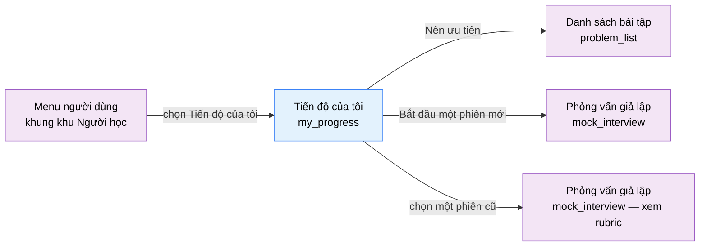

# Tài liệu thiết kế cơ bản (BD) — Tiến độ của tôi (`USR0501`)

## Phương châm tài liệu [Nội bộ — không cần khách duyệt]

- Viết theo **mẫu 9 sheet**. Bộ thẻ đóng, quy ước ID, ký hiệu chuẩn, ranh giới với tài liệu khác và
  checklist kiểm toán nằm ở `02-bd/_rules/bd-template-9sheet.md` — file này không chép lại.
- Phần gắn nhãn `[Nội bộ]` phục vụ sinh mã và tự kiểm toán, không phải yêu cầu của khách hàng: mục 4.5,
  mục 7.3 và các ghi chú quy ước.
- Mã màn `USR0501` theo bảng mã ở `02-bd/_rules/bd-template-9sheet.md` mục 8 dòng 147; tên file mang tiền
  tố mã.
- Màn này **không có popup nào**. Chỉ có hai đường khoan sâu: sang `problem_list` và sang `mock_interview`.
- Khung điều hướng **không mô tả lại ở đây** — dùng chung `02-bd/screens/users/_shell.md`. Khu Người học
  dùng **header ngang dính trên, không có sidebar**, và màn này nằm trong **menu người dùng** chứ không
  phải nav chính [Nguồn: 02-bd/screens/users/_shell.md:24,62-64]. Chân trang cũng thuộc khung chung
  [Nguồn: 02-bd/screens/users/_shell.md:86-104].

> Đọc cùng `01-rd/screens/users/USR0501_my_progress.md` (hành vi ở mức yêu cầu, không lặp lại ở đây),
> `01-rd/req/identity.md:26-32` (F1-06, F1-07, F1-08) và `02-bd/database/identity.md` mục 1.12.
>
> **Không thiết kế lại** cách tính điểm tỉ lệ testcase — thuộc `judge-orchestration`
> [Nguồn: DEC-2026-0831-partial-score-testcase-ratio].
> **Không thiết kế** giao diện một phiên phỏng vấn — thuộc `mock_interview` (`USR0302`); màn này chỉ liệt
> kê phiên và mở sang đó.
> **Không thiết kế** phần hồ sơ cá nhân và thiết lập — thuộc `profile` (`USR0502`) và `settings`
> (`USR0503`).

> **Quy ước đặt tên khối** [Nội bộ]. Sáu khối: `stats` (dải chỉ số tổng và bộ lọc khoảng thời gian),
> `topicProgress` (bảng "Theo chủ đề"), `submissionChart` (biểu đồ cột 14 ngày), `difficultyProgress`
> (khối "Theo độ khó"), `focusNext` (khối "Nên ưu tiên"), `interviewSummary` (khối "Phỏng vấn giả lập").
> Tiền tố ID item của toàn màn là `myProgress.`. Hai màn cá nhân còn lại (`profile`, `settings`) kế thừa
> đúng quy ước này.

---

## Sheet 1. Bìa

| Mục | Giá trị |
| :--- | :--- |
| Hệ thống | AlgoPrep |
| Phân hệ | `identity` (F1) — có phụ thuộc đọc sang `problem-bank` (F2), `judge-orchestration` (F4) và `ai-review` (F5) |
| Công đoạn | BD — Thiết kế cơ bản |
| Phân loại | Màn hình |
| Tên màn | Tiến độ của tôi |
| Mã màn hình | `USR0501` |
| Tên vật lý (slug) | `my_progress` |
| Trục tài liệu | Màn hình (`02-bd/screens/`) |
| Actor | A1 (`STUDENT`) |
| Phiên bản | V0.1 |
| Người tạo | Nhóm phát triển AlgoPrep |
| Ngày tạo | 2026/09/21 |
| Người cập nhật | Nhóm phát triển AlgoPrep |
| Ngày cập nhật | 2026/09/21 |

---

## Sheet 2. Lịch sử sửa đổi

| Ver | Sheet bị sửa | Nội dung sửa | Ngày | Người sửa |
| :--- | :--- | :--- | :--- | :--- |
| V0.1 | Toàn bộ | Tạo mới theo mẫu 9 sheet. Chốt nguồn dữ liệu của mọi trường hiển thị; dùng lại tên nghiệp vụ `GetMySubmissionMetrics` của cụm màn lớp thay vì đặt tên mới. Thiết kế bổ sung danh sách phiên phỏng vấn (prototype thiếu, nhưng F1-08 bắt buộc), trạng thái rỗng, trạng thái lỗi theo từng khối và đường suy giảm khi phân hệ AI hỏng. Phát sinh 9 câu hỏi mở | 2026/09/21 | Nhóm phát triển AlgoPrep |

---

## Sheet 3. Sơ đồ chuyển màn

> [Nội bộ] Quy ước vẽ: bố trí từ trái sang phải. Màn gọi tới tô tím, màn hiện tại tô xanh nhạt. Màn này
> không có popup nên không dùng màu vàng. Màu và `[Nguồn:]` dùng để truy vết, không phải yêu cầu của
> khách hàng.

### 3.1 Danh sách chuyển màn

#### Khung điều hướng khu Người học → Tiến độ của tôi

[Điều kiện mở] Mở menu người dùng trên header ngang rồi chọn mục "Tiến độ của tôi" (mục thứ hai trong năm
mục) [Nguồn: 02-bd/screens/users/_shell.md:62-64; 09-layoutBase/Tiến độ của tôi.dc.html:82].

[Chế độ mở] Không có.

[Thông tin truyền] Không có. Màn luôn hiển thị dữ liệu của chính người đang đăng nhập, không nhận tham số
`user_id` từ bên ngoài.

[Giá trị trả về] Không có.

[Khi thành công] Tải sáu khối dữ liệu theo khoảng thời gian mặc định "30 ngày"
[Nguồn: 09-layoutBase/Tiến độ của tôi.dc.html:231].

[Khi huỷ] Không có.

#### Tiến độ của tôi → Danh sách bài tập

[Điều kiện mở] Bấm một mục trong khối "Nên ưu tiên".

[Thông tin truyền] Tên chủ đề của mục được bấm, dùng làm bộ lọc chủ đề mặc định ở màn đích.

[Chế độ mở] Không có.

[Giá trị trả về] Không có.

[Khi thành công] Điều hướng sang màn `problem_list` đã lọc sẵn theo chủ đề đó. Màn này chỉ đọc, không có
thay đổi chưa lưu, nên không hỏi xác nhận trước khi rời.

[Khi huỷ] Không có.

#### Tiến độ của tôi → Phỏng vấn giả lập (phiên mới)

[Điều kiện mở] Bấm liên kết "Bắt đầu một phiên mới" ở cuối khối "Phỏng vấn giả lập"
[Nguồn: 09-layoutBase/Tiến độ của tôi.dc.html:208].

[Chế độ mở] Chế độ tạo phiên mới.

[Thông tin truyền] Không có. Lối vào, cấp độ người phỏng vấn và chủ đề do chính màn `mock_interview` hỏi.

[Giá trị trả về] Không có.

[Khi thành công] Điều hướng sang màn `mock_interview`.

[Khi huỷ] Không có.

#### Tiến độ của tôi → Phỏng vấn giả lập (mở lại rubric phiên cũ)

[Điều kiện mở] Bấm một dòng trong danh sách lịch sử phiên của khối "Phỏng vấn giả lập". Đây là đường đáp
ứng F1-08 [Nguồn: 01-rd/req/identity.md:27-28].

[Chế độ mở] Chế độ chỉ xem lại phiên đã kết thúc.

[Thông tin truyền] `id` của phiên phỏng vấn trên dòng đó.

[Giá trị trả về] Không có.

[Khi thành công] Điều hướng sang màn `mock_interview` và mở đúng rubric của phiên đó.

[Khi huỷ] Không có.

### 3.2 Sơ đồ

[Nguồn: 09-layoutBase/Tiến độ của tôi.dc.html:82,187,208; 02-bd/screens/users/_shell.md:62-64]

---

## Sheet 4. Bố cục màn hình

### 4.1 Tổng quan màn

[Mục đích màn] Cho người học tự xem lại quá trình luyện tập của mình: số bài đã giải theo chủ đề và theo
độ khó (F1-06), tỉ lệ bài nộp đạt `Accepted` (F1-07), và lịch sử phỏng vấn giả lập mở lại được rubric của
phiên cũ (F1-08) [Nguồn: 01-rd/req/identity.md:26-32].

[Luồng nghiệp vụ chính]

1. **Hiển thị ban đầu**: vào màn, hệ thống tải sáu khối dữ liệu theo khoảng thời gian mặc định "30 ngày".
   Mỗi khối có ba trạng thái riêng — đang tải, có dữ liệu, lỗi — và một khối lỗi không kéo theo khối khác.
2. **Đọc dải chỉ số tổng**: bảy con số luỹ kế toàn thời gian ở hàng đầu, không phụ thuộc khoảng thời gian
   đang chọn (xem Câu hỏi mở Q2).
3. **Đổi khoảng thời gian**: chọn "7 ngày" / "30 ngày" / "Tất cả"; bảng "Theo chủ đề" và biểu đồ lượt nộp
   tải lại theo khoảng mới [Nguồn: 01-rd/screens/users/USR0501_my_progress.md:83].
4. **Khoan sâu**: bấm một mục "Nên ưu tiên" để sang danh sách bài tập đã lọc chủ đề; bấm một phiên phỏng
   vấn cũ để xem lại rubric của phiên đó.

[Người dùng] Người học đã đăng nhập (`STUDENT`). Màn chỉ hiển thị dữ liệu của chính người đang đăng nhập.

[Tệp liên quan] Không có. Màn này không xuất hay nhập tệp.

[Phạm vi]
- Chỉ đọc. Không có thao tác ghi nào trên màn.
- **Không** hiển thị nội dung testcase ẩn, không hiển thị diff chi tiết của lượt nộp — màn này chỉ có số
  đếm và tỉ lệ.
- Không có màn hay khối nào cho phép xem tiến độ của người khác; muốn xem học viên khác là quyền của A2 ở
  `class_student_detail` (`INS0204`).
- Ba khối lấy dữ liệu từ `ai-review` (hai chỉ số phỏng vấn ở dải trên cùng và toàn bộ khối "Phỏng vấn giả
  lập") **phải suy giảm êm**: phân hệ AI hỏng thì các khối còn lại vẫn hiển thị đầy đủ.

[Quyền sử dụng]
- Xem: được, với chính dữ liệu của mình.
- Thêm: không.
- Sửa: không.
- Xoá: không.

[Số bản ghi tối đa] Bảng "Theo chủ đề": theo số chủ đề có thật trong `problem.topics`, prototype dựng 7
dòng [Nguồn: 09-layoutBase/Tiến độ của tôi.dc.html:218-226]. Biểu đồ: đúng 14 cột. Khối "Theo độ khó":
đúng 3 dòng. Khối "Nên ưu tiên": tối đa 3 mục. Lịch sử phiên phỏng vấn: 5 phiên gần nhất, không phân
trang. Toàn màn không có phân trang.

[Nguồn: 01-rd/screens/users/USR0501_my_progress.md:31-36,82-83; 02-bd/database/identity.md:109-117]

### 4.2 DTO liên quan

- `MyProgressOverviewDto`
- `TopicProgressDto`
- `DifficultyProgressDto`
- `FocusSuggestionDto`
- `SubmissionDailyCountDto`
- `MyInterviewSummaryDto`

`[Suy luận]` — tên DTO do BD này đề xuất, `03-dd/api/identity.md` và `03-dd/api/ai-review.md` chốt lại.

### 4.3 Bảng dữ liệu liên quan (8)

| NO | Bảng | Ghi chú |
| --: | :--- | :--- |
| 1 | `identity.user_submission_stats` | [Nguồn: 02-bd/database/identity.md:113-114] |
| 2 | `identity.user_problem_best_score` | [Nguồn: 02-bd/database/identity.md:111-112] |
| 3 | `judge.submissions` | [Nguồn: 02-bd/database/judge-orchestration.md:8-34] |
| 4 | `problem.problems` | [Nguồn: 02-bd/database/problem-bank.md:8-17] |
| 5 | `problem.topics` | [Nguồn: 02-bd/database/problem-bank.md:35-39] |
| 6 | `problem.problem_topics` | [Nguồn: 02-bd/database/problem-bank.md:35-39] |
| 7 | `ai.interview_sessions` | [Nguồn: 02-bd/database/ai-review.md:66-83] |
| 8 | `ai.rubric_scores` | [Nguồn: 02-bd/database/ai-review.md:89-102] |

Màn này **không** đọc `identity.identity_recent_activity`: không có khối "Hoạt động gần đây" nào trên
prototype, và bảng đó phục vụ F1-30 của khu Giảng viên [Nguồn: 02-bd/database/identity.md:115-116].

### 4.4 Vùng bố cục

Đối chiếu `09-layoutBase/Tiến độ của tôi.dc.html` — bằng chứng bố cục chỉ-đọc, **không phải** design
system cuối cùng.

| Vùng | Vị trí trong prototype | Nội dung |
| :--- | :--- | :--- |
| Header ngang dính trên (khung chung khu Người học) | `:46-93` | Thương hiệu, 6 mục nav, menu người dùng đang mở với mục "Tiến độ của tôi" được tô sáng — dùng lại khung chung |
| Dải chỉ số tổng | `:97-105` | 5 mục chỉ số nằm ngang, mỗi mục gồm nhãn, giá trị và đơn vị phụ |
| Cụm tab khoảng thời gian | `:106-108` | 3 nút "7 ngày" / "30 ngày" / "Tất cả", căn phải cùng hàng với dải chỉ số |
| Cột trái — "Theo chủ đề" | `:115-149` | Bảng 4 cột: Chủ đề, Đã giải (thanh tiến độ kèm tỉ số), Tỉ lệ AC, Lần cuối |
| Cột trái — "Lượt nộp 14 ngày gần nhất" | `:151-162` | Biểu đồ 14 cột, mỗi cột có số đếm phía trên và nhãn ngày phía dưới |
| Cột phải — "Theo độ khó" | `:166-181` | 3 dòng Dễ / Trung bình / Khó, mỗi dòng có tỉ số và thanh tiến độ |
| Cột phải — "Nên ưu tiên" | `:183-196` | Tối đa 3 mục, mỗi mục là một liên kết gồm tên chủ đề và một dòng lý do |
| Cột phải — "Phỏng vấn giả lập" | `:198-211` | 3 dòng nhãn-giá trị và một liên kết "Bắt đầu một phiên mới" |
| Chân trang (khung chung khu Người học) | Không có trong file này | Prototype của màn này **không dựng** `<footer>`; khung chung vẫn áp chân trang cho mọi màn của khu, đây là divergence có chủ đích đã ghi ở khung [Nguồn: 02-bd/screens/users/_shell.md:92-95] |

Bố cục hai cột `minmax(0, 1fr) 340px` (`:111`): cột trái chứa hai khối rộng, cột phải chứa ba khối hẹp.
Giữ nguyên cấu trúc này khi dựng Next.js; không quy định màu sắc, khoảng cách hay typography ở BD.

**Hai điểm màn hình này khác prototype, cố ý:**

1. Prototype vẽ đúng ba dòng số trong khối "Phỏng vấn giả lập" và **không có danh sách phiên**
   [Nguồn: 09-layoutBase/Tiến độ của tôi.dc.html:298-302]. Nhưng F1-08 yêu cầu "lịch sử phỏng vấn mở lại
   được rubric của phiên cũ" [Nguồn: 01-rd/req/identity.md:27-28] và RD nhắc lại ở REQ-03
   [Nguồn: 01-rd/screens/users/USR0501_my_progress.md:80]. Không có danh sách phiên thì yêu cầu đó không
   có đường thực hiện nào trên màn. BD này bổ sung một danh sách 5 phiên gần nhất vào khối đó.
2. Prototype hiển thị đồng thời nhãn tiếng Việt và tiếng Anh cho mọi mục. Đó là cách bản mẫu minh hoạ
   i18n, không phải yêu cầu hiển thị song ngữ cùng lúc — cùng kết luận đã ghi ở khung
   [Nguồn: 02-bd/screens/users/_shell.md:69-74].

### 4.5 Cấu trúc slice FSD [Nội bộ]

| Khối | Slice dự kiến | Căn cứ |
| :--- | :--- | :--- |
| Trang | `views/my-progress` | Quy ước FSD của dự án |
| Khung khu Người học | Dùng lại `widgets/app-shell` | `02-bd/screens/users/_shell.md` |
| Dải chỉ số và bộ lọc | `widgets/progress-stats-bar` + `features/progress-range-filter` | Prototype `:97-108` |
| Bảng theo chủ đề | `widgets/topic-progress-table` | Prototype `:115-149` |
| Biểu đồ 14 ngày | `widgets/submission-daily-chart` | Prototype `:151-162` |
| Theo độ khó, Nên ưu tiên | `widgets/difficulty-progress`, `widgets/focus-next-list` | Prototype `:166-196` |
| Phỏng vấn giả lập | `widgets/interview-summary` + `entities/interview-session` | Prototype `:198-211` |

`[Suy luận]` — ánh xạ slice do BD đề xuất, DD màn hình chốt lại.

> [Nội bộ] Ảnh minh hoạ đặt ở `08-diagram/02-bd/screens/users/`, chụp bằng Playwright trên ứng dụng
> Next.js thật khi đã có mã chạy được. Chưa có thì tham chiếu prototype, không vẽ tay.

---

## Sheet 5. Danh sách item màn hình

> Quy ước ID, bộ thẻ và giá trị chuẩn: `02-bd/_rules/bd-template-9sheet.md` mục 2, 3, 4.

### Khu vực A — Dải chỉ số tổng và bộ lọc khoảng thời gian

| Khu vực | NO | Tên item | ID item | Bảng DB | Cột DB | Loại UI | Kiểu | Độ dài | Bắt buộc | I/O | Giá trị mặc định | Định dạng | Ghi chú |
| :--- | --: | :--- | :--- | :--- | :--- | :--- | :--- | :--- | :-: | :-: | :--- | :--- | :--- |
| Dải chỉ số tổng | | | | | | | | | | | | | |
| | 1 | Đã giải | `myProgress.stats.solved` | `identity.user_problem_best_score` | `best_verdict` | Label | String | 12 | - | O | - | `{số} / {số}` | Số bài đã giải trên tổng số bài đang xuất bản. "Đã giải" nghĩa là có ít nhất một lần `Accepted` (F1-06) [Nguồn: 01-rd/req/identity.md:31-32] [Công thức] Tử số: đếm dòng `user_problem_best_score` của người đăng nhập có `best_verdict = ACCEPTED` [Nguồn: 02-bd/database/identity.md:111-112]. Mẫu số: số bài đang ở trạng thái đã xuất bản của `problem.problems`, lấy qua `problem-bank` [Nguồn: DEC-2026-0830-problem-lifecycle-two-states] [EVT liên quan] EVT-1 |
| | 2 | Lượt nộp | `myProgress.stats.submissions` | `identity.user_submission_stats` | `total_submissions` | Label | Number | 6 | - | O | 0 | Số nguyên | Tổng số lượt nộp luỹ kế của người đăng nhập [Nguồn giá trị] Cột `total_submissions` [Nguồn: 02-bd/database/identity.md:113-114] [EVT liên quan] EVT-1 |
| | 3 | Tỉ lệ AC | `myProgress.stats.acRate` | `identity.user_submission_stats` | `accepted_count`, `total_submissions` | Label | Number | 3 | - | O | - | `{số}% AC` | Tỉ lệ chấp thuận — bài nộp đạt `Accepted` trên tổng bài nộp (F1-07) [Nguồn: 01-rd/req/identity.md:27-28]. Hiển thị làm đơn vị phụ của "Lượt nộp" [Nguồn: 09-layoutBase/Tiến độ của tôi.dc.html:260] [Công thức] `accepted_count` chia `total_submissions`, làm tròn về số nguyên phần trăm. Chưa nộp lần nào thì hiển thị `-`, không hiển thị `0%` [EVT liên quan] EVT-1 |
| | 4 | Chuỗi ngày | `myProgress.stats.streak` | - | - | Label | Number | 4 | - | O | - | `{số} ngày`, bằng 0 thì `-` | Số ngày liên tiếp tính tới hôm nay có ít nhất một lượt nộp — cùng khái niệm chuỗi ngày luyện tập của F1-21 [Nguồn: 01-rd/req/identity.md:233] [Công thức] Đếm ngày liên tiếp có lượt nộp trong `judge.submissions`. **Không cột nào lưu sẵn** giá trị này, lấy qua `GetMySubmissionMetrics` — cùng nguồn mà `class_student_detail` đã dùng [Nguồn: 02-bd/screens/teacher/INS0204_class_student_detail.md:36]. Múi giờ dùng để cắt "một ngày" chưa chốt, xem Câu hỏi mở Q4 [EVT liên quan] EVT-1 |
| | 5 | Số lần nộp / bài | `myProgress.stats.avgAttempts` | `identity.user_submission_stats` | `total_submissions` | Label | Number | 4 | - | O | - | Một chữ số thập phân | Số lượt nộp trung bình cho mỗi bài đã giải [Công thức] `total_submissions` chia số bài đã giải (tử số của NO 1), theo đúng định nghĩa đã chốt ở RD [Nguồn: 01-rd/screens/users/USR0501_my_progress.md:69]. Chưa giải bài nào thì hiển thị `-`, không chia cho 0 [EVT liên quan] EVT-1 |
| | 6 | Số phiên phỏng vấn | `myProgress.stats.interviewCount` | `ai.interview_sessions` | `stage` | Label | Number | 5 | - | O | - | Số nguyên | Số phiên phỏng vấn giả lập đã kết thúc của người đăng nhập [Công thức] Đếm dòng `interview_sessions` của người đăng nhập có `stage = COMPLETED` [Nguồn: 02-bd/database/ai-review.md:79]. Phiên `ABANDONED` không tính vì không có rubric. Phân hệ AI hỏng thì hiển thị `-`, không chặn các chỉ số còn lại [EVT liên quan] EVT-1 |
| | 7 | Điểm phỏng vấn trung bình | `myProgress.stats.interviewAvgScore` | `ai.rubric_scores` | `score`, `weight_percent_snapshot` | Label | Number | 5 | - | O | - | `{số} / {thang}` | Điểm trung bình các phiên phỏng vấn đã kết thúc [Công thức] Trung bình cộng điểm tổng của từng phiên; điểm tổng một phiên là tổng `score` nhân `weight_percent_snapshot` của 4 tiêu chí F5-15 [Nguồn: 02-bd/database/ai-review.md:96-97]. Thang điểm của cột `score` **chưa chốt** (prototype ghi `3.8 / 5`, schema để DD chốt 0-10 hay 0-100) — xem Câu hỏi mở Q6 [EVT liên quan] EVT-1 |
| | 8 | Cụm tab khoảng thời gian | `myProgress.stats.rangeTabs` | - | - | Button | Enum | - | - | I/O | 30 ngày | 3 nút | Ba lựa chọn "7 ngày" / "30 ngày" / "Tất cả", áp cho bảng "Theo chủ đề" và biểu đồ lượt nộp [Nguồn: 01-rd/screens/users/USR0501_my_progress.md:83] [Nguồn giá trị] Nhãn tĩnh i18n; giá trị mặc định "30 ngày" lấy từ prototype [Nguồn: 09-layoutBase/Tiến độ của tôi.dc.html:231] [EVT liên quan] EVT-2 |
| | 9 | Thử lại | `myProgress.stats.btnRetry` | - | - | Button | - | - | - | I | - | Thử lại | Tải lại dải chỉ số khi khối này đang ở trạng thái lỗi [Nguồn giá trị] Nhãn tĩnh i18n [EVT liên quan] EVT-7 |

### Khu vực B — Theo chủ đề

| Khu vực | NO | Tên item | ID item | Bảng DB | Cột DB | Loại UI | Kiểu | Độ dài | Bắt buộc | I/O | Giá trị mặc định | Định dạng | Ghi chú |
| :--- | --: | :--- | :--- | :--- | :--- | :--- | :--- | :--- | :-: | :-: | :--- | :--- | :--- |
| Theo chủ đề | | | | | | | | | | | | | |
| | 1 | Tiêu đề khối | `myProgress.topicProgress.title` | - | - | Label | String | - | - | O | Theo chủ đề | - | Tiêu đề khối [Nguồn giá trị] Nhãn tĩnh i18n [Nguồn: 09-layoutBase/Tiến độ của tôi.dc.html:117] [EVT liên quan] - |
| | 2 | Ghi chú sắp xếp | `myProgress.topicProgress.orderNote` | - | - | Label | String | 60 | - | O | Sắp theo phần còn lại nhiều nhất | - | Câu giải thích thứ tự các dòng [Nguồn giá trị] Nhãn tĩnh i18n [Nguồn: 09-layoutBase/Tiến độ của tôi.dc.html:269] [EVT liên quan] - |
| | 3 | Bảng chủ đề | `myProgress.topicProgress.table` | `problem.topics` | - | List | List | - | - | O | rỗng | Không phân trang | Mỗi dòng là một chủ đề trong danh mục chủ đề. Sắp xếp theo số bài chưa giải giảm dần, đúng ghi chú ở NO 2 [Nguồn giá trị] Danh mục `problem.topics` [Nguồn: 02-bd/database/problem-bank.md:35-39], ghép với tiến độ của người đăng nhập [EVT liên quan] EVT-1, EVT-2 |
| | 4 | Chủ đề | `myProgress.topicProgress.col.topicName` | `problem.topics` | `name` | ListColumn | String | 60 | - | O | - | - | Tên chủ đề [Nguồn giá trị] Cột `name` [Nguồn: 02-bd/database/problem-bank.md:37-38] [EVT liên quan] - |
| | 5 | Đã giải | `myProgress.topicProgress.col.solvedRatio` | `identity.user_problem_best_score` | `best_verdict` | ListColumn | String | 12 | - | O | - | `{số} / {số}` | Số bài đã giải trên tổng số bài đang xuất bản thuộc chủ đề đó [Công thức] Tử số: đếm bài thuộc chủ đề có `best_verdict = ACCEPTED`; mẫu số: đếm bài đang xuất bản gắn chủ đề đó qua `problem.problem_topics` [Nguồn: 02-bd/database/problem-bank.md:35-39]. **Luỹ kế toàn thời gian, không chịu bộ lọc khoảng thời gian** — xem Câu hỏi mở Q2 [EVT liên quan] EVT-1 |
| | 6 | Thanh tiến độ | `myProgress.topicProgress.col.progressBar` | - | - | ProgressBar | Number | - | - | O | - | - | Biểu diễn trực quan tỉ lệ ở NO 5 [Công thức] Chiều rộng bằng tử số chia mẫu số của NO 5 [Nguồn: 09-layoutBase/Tiến độ của tôi.dc.html:273] [EVT liên quan] - |
| | 7 | Tỉ lệ AC | `myProgress.topicProgress.col.acRate` | `judge.submissions` | `status`, `problem_id` | ListColumn | Number | 3 | - | O | - | `{số}%` | Tỉ lệ Accepted của riêng chủ đề đó, trong khoảng thời gian đang chọn [Công thức] Số lượt nộp `status = ACCEPTED` chia tổng số lượt nộp của người đăng nhập cho các bài thuộc chủ đề đó [Nguồn: 02-bd/database/judge-orchestration.md:22]. Cùng cách tính F1-07 nhưng thu hẹp phạm vi theo chủ đề [Nguồn: 01-rd/screens/users/USR0501_my_progress.md:32]. Không có lượt nộp nào trong khoảng thì hiển thị `-` [EVT liên quan] EVT-1, EVT-2 |
| | 8 | Lần cuối | `myProgress.topicProgress.col.lastSubmittedAt` | `judge.submissions` | `submitted_at` | ListColumn | Date | - | - | O | - | `dd/MM` | Ngày nộp gần nhất cho một bài thuộc chủ đề đó [Công thức] `MAX(submitted_at)` của các lượt nộp thuộc chủ đề, trong khoảng thời gian đang chọn [Nguồn: 02-bd/database/judge-orchestration.md:31]. Chưa nộp lần nào thì hiển thị `-` [EVT liên quan] EVT-1, EVT-2 |
| | 9 | Thử lại | `myProgress.topicProgress.btnRetry` | - | - | Button | - | - | - | I | - | Thử lại | Tải lại bảng "Theo chủ đề" khi khối này đang ở trạng thái lỗi [Nguồn giá trị] Nhãn tĩnh i18n [EVT liên quan] EVT-7 |

### Khu vực C — Lượt nộp 14 ngày gần nhất

| Khu vực | NO | Tên item | ID item | Bảng DB | Cột DB | Loại UI | Kiểu | Độ dài | Bắt buộc | I/O | Giá trị mặc định | Định dạng | Ghi chú |
| :--- | --: | :--- | :--- | :--- | :--- | :--- | :--- | :--- | :-: | :-: | :--- | :--- | :--- |
| Lượt nộp 14 ngày | | | | | | | | | | | | | |
| | 1 | Tiêu đề khối | `myProgress.submissionChart.title` | - | - | Label | String | - | - | O | Lượt nộp 14 ngày gần nhất | - | Tiêu đề khối [Nguồn giá trị] Nhãn tĩnh i18n [Nguồn: 09-layoutBase/Tiến độ của tôi.dc.html:152] [EVT liên quan] - |
| | 2 | Biểu đồ cột | `myProgress.submissionChart.chart` | `judge.submissions` | `submitted_at` | List | List | - | - | O | rỗng | 14 cột | Một cột cho mỗi ngày, kể cả ngày không có lượt nộp nào (cột rỗng, không bỏ trống chỗ) [Nguồn giá trị] Chuỗi số lượt nộp theo ngày, lấy qua `GetMySubmissionMetrics` [EVT liên quan] EVT-1, EVT-2 |
| | 3 | Số lượt nộp trong ngày | `myProgress.submissionChart.col.count` | `judge.submissions` | `submitted_at` | ListColumn | Number | 4 | - | O | 0 | Số nguyên, bằng 0 thì để trống | Số lượt nộp của ngày đó [Công thức] Đếm dòng `judge.submissions` của người đăng nhập có `submitted_at` rơi vào ngày đó [Nguồn: 02-bd/database/judge-orchestration.md:31] [EVT liên quan] - |
| | 4 | Nhãn ngày | `myProgress.submissionChart.col.dayLabel` | - | - | ListColumn | String | 2 | - | O | - | Hai chữ số ngày trong tháng | Nhãn ngày dưới mỗi cột [Nguồn giá trị] Suy ra từ ngày của cột, không phải cột DB [Nguồn: 09-layoutBase/Tiến độ của tôi.dc.html:282] [EVT liên quan] - |
| | 5 | Cột và chú giải | `myProgress.submissionChart.col.bar` | - | - | ListColumn | Number | - | - | O | - | - | Chiều cao cột tỉ lệ với ngày cao nhất trong 14 ngày; rê chuột hiện chú giải "Lượt nộp: {số}" [Công thức] Số của ngày chia số lớn nhất trong 14 ngày [Nguồn: 09-layoutBase/Tiến độ của tôi.dc.html:280,283] [EVT liên quan] EVT-3 |
| | 6 | Thử lại | `myProgress.submissionChart.btnRetry` | - | - | Button | - | - | - | I | - | Thử lại | Tải lại biểu đồ khi khối này đang ở trạng thái lỗi [Nguồn giá trị] Nhãn tĩnh i18n [EVT liên quan] EVT-7 |

### Khu vực D — Theo độ khó

| Khu vực | NO | Tên item | ID item | Bảng DB | Cột DB | Loại UI | Kiểu | Độ dài | Bắt buộc | I/O | Giá trị mặc định | Định dạng | Ghi chú |
| :--- | --: | :--- | :--- | :--- | :--- | :--- | :--- | :--- | :-: | :-: | :--- | :--- | :--- |
| Theo độ khó | | | | | | | | | | | | | |
| | 1 | Tiêu đề khối | `myProgress.difficultyProgress.title` | - | - | Label | String | - | - | O | Theo độ khó | - | Tiêu đề khối [Nguồn giá trị] Nhãn tĩnh i18n [Nguồn: 09-layoutBase/Tiến độ của tôi.dc.html:167] [EVT liên quan] - |
| | 2 | Danh sách độ khó | `myProgress.difficultyProgress.list` | `problem.problems` | `difficulty` | List | List | - | - | O | 3 dòng | Đúng 3 dòng | Đúng ba dòng theo enum độ khó, luôn hiển thị đủ cả ba kể cả khi chưa giải bài nào [Nguồn giá trị] Enum `difficulty` gồm `EASY`/`MEDIUM`/`HARD` [Nguồn: 02-bd/database/problem-bank.md:17] [EVT liên quan] EVT-1 |
| | 3 | Mức độ khó | `myProgress.difficultyProgress.col.label` | `problem.problems` | `difficulty` | ListColumn | Enum | - | - | O | - | Nhãn tiếng Việt | Tên mức độ khó [Nguồn giá trị] `EASY` thành "Dễ"; `MEDIUM` thành "Trung bình"; `HARD` thành "Khó" [Nguồn: 09-layoutBase/Tiến độ của tôi.dc.html:287-289] [EVT liên quan] - |
| | 4 | Đã giải | `myProgress.difficultyProgress.col.solvedRatio` | `identity.user_problem_best_score` | `best_verdict` | ListColumn | String | 12 | - | O | - | `{số} / {số}` | Số bài đã giải trên tổng số bài đang xuất bản của mức đó [Công thức] Cùng cách tính Khu vực B NO 5, nhưng gom nhóm theo `problems.difficulty` thay vì theo chủ đề. Luỹ kế toàn thời gian [EVT liên quan] EVT-1 |
| | 5 | Thanh tiến độ | `myProgress.difficultyProgress.col.bar` | - | - | ProgressBar | Number | - | - | O | - | - | Biểu diễn trực quan tỉ lệ ở NO 4 [Công thức] Chiều rộng bằng tử số chia mẫu số của NO 4 [Nguồn: 09-layoutBase/Tiến độ của tôi.dc.html:288] [EVT liên quan] - |

### Khu vực E — Nên ưu tiên

| Khu vực | NO | Tên item | ID item | Bảng DB | Cột DB | Loại UI | Kiểu | Độ dài | Bắt buộc | I/O | Giá trị mặc định | Định dạng | Ghi chú |
| :--- | --: | :--- | :--- | :--- | :--- | :--- | :--- | :--- | :-: | :-: | :--- | :--- | :--- |
| Nên ưu tiên | | | | | | | | | | | | | |
| | 1 | Tiêu đề khối | `myProgress.focusNext.title` | - | - | Label | String | - | - | O | Nên ưu tiên | - | Tiêu đề khối [Nguồn giá trị] Nhãn tĩnh i18n [Nguồn: 09-layoutBase/Tiến độ của tôi.dc.html:184] [EVT liên quan] - |
| | 2 | Danh sách gợi ý | `myProgress.focusNext.list` | - | - | List | List | - | - | O | rỗng | Tối đa 3 mục | Ba chủ đề nên làm tiếp. **Không gọi AI** — là quy tắc xếp hạng trên dữ liệu đã có [Nguồn: 01-rd/screens/users/USR0501_my_progress.md:70] [Công thức] Xếp hạng theo đúng thứ tự RD đã chốt: (1) chủ đề có tỉ lệ AC thấp nhất, (2) chủ đề còn nhiều bài chưa giải nhất, (3) chủ đề lâu chưa nộp bài nhất; mỗi chủ đề chỉ xuất hiện một lần. Dẫn xuất từ chính Khu vực B, không có endpoint riêng [EVT liên quan] EVT-1 |
| | 3 | Tên chủ đề | `myProgress.focusNext.col.topicName` | `problem.topics` | `name` | ListColumn | String | 60 | - | O | - | - | Tên chủ đề được gợi ý [Nguồn giá trị] Cột `name` [Nguồn: 02-bd/database/problem-bank.md:37-38] [EVT liên quan] EVT-4 |
| | 4 | Lý do | `myProgress.focusNext.col.reason` | - | - | ListColumn | String | 80 | - | O | - | Câu ngắn kèm số | Một dòng giải thích vì sao chủ đề này được gợi ý [Công thức] Nhãn tĩnh i18n có tham số, chọn theo quy tắc trúng ở NO 2: "Tỉ lệ AC {số}% — thấp nhất" / "Còn {số} bài, tỉ lệ AC {số}%" / "{số} ngày chưa nộp bài nào" [Nguồn: 09-layoutBase/Tiến độ của tôi.dc.html:292-296] [EVT liên quan] - |

### Khu vực F — Phỏng vấn giả lập

| Khu vực | NO | Tên item | ID item | Bảng DB | Cột DB | Loại UI | Kiểu | Độ dài | Bắt buộc | I/O | Giá trị mặc định | Định dạng | Ghi chú |
| :--- | --: | :--- | :--- | :--- | :--- | :--- | :--- | :--- | :-: | :-: | :--- | :--- | :--- |
| Phỏng vấn giả lập | | | | | | | | | | | | | |
| | 1 | Tiêu đề khối | `myProgress.interviewSummary.title` | - | - | Label | String | - | - | O | Phỏng vấn giả lập | - | Tiêu đề khối [Nguồn giá trị] Nhãn tĩnh i18n [Nguồn: 09-layoutBase/Tiến độ của tôi.dc.html:199] [EVT liên quan] - |
| | 2 | Số phiên | `myProgress.interviewSummary.sessionCount` | `ai.interview_sessions` | `stage` | Label | Number | 5 | - | O | - | Số nguyên | Cùng giá trị với Khu vực A NO 6, hiển thị lại trong khối này theo đúng prototype [Nguồn: 09-layoutBase/Tiến độ của tôi.dc.html:299] [Công thức] Cùng công thức Khu vực A NO 6 [EVT liên quan] EVT-1 |
| | 3 | Điểm trung bình | `myProgress.interviewSummary.avgScore` | `ai.rubric_scores` | `score` | Label | Number | 5 | - | O | - | `{số} / {thang}` | Cùng giá trị với Khu vực A NO 7 [Công thức] Cùng công thức Khu vực A NO 7; thang điểm chưa chốt, xem Câu hỏi mở Q6 [EVT liên quan] EVT-1 |
| | 4 | Mục yếu nhất | `myProgress.interviewSummary.weakestCriterion` | `ai.rubric_scores` | `criterion_code`, `score` | Label | Enum | - | - | O | - | Nhãn tiếng Việt | Tiêu chí rubric có điểm trung bình thấp nhất tính trên **toàn bộ** lịch sử phiên, không phải phiên gần nhất [Nguồn: 01-rd/screens/users/USR0501_my_progress.md:82] [Công thức] Trung bình `score` theo từng `criterion_code` có `owner_type = MOCK_INTERVIEW`, lấy tiêu chí thấp nhất. Bốn tiêu chí cố định: `CLARITY` "Độ rõ ràng", `TECHNICAL_ACCURACY` "Độ chính xác kỹ thuật", `PUSHBACK_HANDLING` "Khả năng phản biện", `COMPLEXITY_AWARENESS` "Nhận thức độ phức tạp" [Nguồn: 02-bd/database/ai-review.md:96]. Prototype hiển thị "Đánh đổi" — **không** thuộc bốn tiêu chí này, xem Câu hỏi mở Q5 [EVT liên quan] EVT-1 |
| | 5 | Lịch sử phiên | `myProgress.interviewSummary.sessionList` | `ai.interview_sessions` | `id`, `started_at` | List | List | - | - | O | rỗng | 5 dòng gần nhất | Năm phiên đã kết thúc gần nhất, bấm vào để mở lại rubric của phiên đó (F1-08). **Khối này prototype không có**, BD bổ sung — xem mục 4.4 [Nguồn giá trị] `interview_sessions` của người đăng nhập có `stage = COMPLETED`, sắp theo `started_at` giảm dần [Nguồn: 02-bd/database/ai-review.md:81,190] [EVT liên quan] EVT-1, EVT-5 |
| | 6 | Thời điểm phiên | `myProgress.interviewSummary.col.startedAt` | `ai.interview_sessions` | `started_at` | ListColumn | Date | - | - | O | - | `dd/MM/yyyy` | Ngày bắt đầu phiên [Nguồn giá trị] Cột `started_at` [Nguồn: 02-bd/database/ai-review.md:81] [EVT liên quan] - |
| | 7 | Điểm phiên | `myProgress.interviewSummary.col.sessionScore` | `ai.rubric_scores` | `score`, `weight_percent_snapshot` | ListColumn | Number | 5 | - | O | - | `{số} / {thang}` | Điểm tổng của phiên đó [Công thức] Tổng `score` nhân `weight_percent_snapshot` của 4 tiêu chí thuộc phiên [Nguồn: 02-bd/database/ai-review.md:96-97] [EVT liên quan] - |
| | 8 | Bắt đầu một phiên mới | `myProgress.interviewSummary.linkNewSession` | - | - | Link | - | - | - | I | - | Bắt đầu một phiên mới | Điều hướng sang màn `mock_interview` để tạo phiên mới [Nguồn giá trị] Nhãn tĩnh i18n [Nguồn: 09-layoutBase/Tiến độ của tôi.dc.html:208] [EVT liên quan] EVT-6 |
| | 9 | Dòng suy giảm khi AI hỏng | `myProgress.interviewSummary.degradedNotice` | - | - | Label | String | 120 | - | O | - | Câu tĩnh | Câu thay thế toàn bộ nội dung khối khi `ai-review` không phản hồi [Nguồn giá trị] Nhãn tĩnh i18n, nội dung "Chưa lấy được dữ liệu phỏng vấn giả lập. Các phần còn lại của trang vẫn hiển thị bình thường." [EVT liên quan] EVT-1 |

[Nguồn: 09-layoutBase/Tiến độ của tôi.dc.html:97-108,115-149,151-162,166-181,183-196,198-211,218-226,258-264,286-302; 02-bd/database/identity.md:111-116; 02-bd/database/ai-review.md:66-102]

---

## Sheet 6. Đặc tả điều khiển item

> Ký hiệu cột `Hiển thị` và thứ tự thẻ: `02-bd/_rules/bd-template-9sheet.md` mục 2, 3. Dùng đúng NO, tên
> item và thứ tự của Sheet 5. Lỗi nhập liệu ghi ở Sheet 9, xử lý nghiệp vụ ghi ở Sheet 8.

### Khu vực A — Dải chỉ số tổng và bộ lọc khoảng thời gian

| Khu vực | NO | Tên item | Hiển thị | Ghi chú |
| :--- | --: | :--- | :-: | :--- |
| Dải chỉ số tổng | | | | |
| | 1 | Đã giải | Có | [Điều kiện hiển thị] Trong lúc tải hiển thị khung chờ tại chỗ, không đẩy các mục còn lại. |
| | 2 | Lượt nộp | Có | [Điều kiện hiển thị] Trong lúc tải hiển thị khung chờ tại chỗ. |
| | 3 | Tỉ lệ AC | Điều kiện | [Điều kiện hiển thị] Chỉ hiển thị khi `total_submissions` lớn hơn 0; chưa nộp lần nào thì ẩn đơn vị phụ này, giữ nguyên số "Lượt nộp". |
| | 4 | Chuỗi ngày | Có | [Điều kiện hiển thị] Trong lúc tải hiển thị khung chờ tại chỗ. [Tự động đặt] Giá trị tính lại ở mỗi lần vào màn, không cập nhật thời gian thực trong lúc đang mở màn. |
| | 5 | Số lần nộp / bài | Điều kiện | [Điều kiện hiển thị] Chỉ hiển thị khi số bài đã giải lớn hơn 0; bằng 0 thì hiển thị `-` để tránh chia cho 0. |
| | 6 | Số phiên phỏng vấn | Điều kiện | [Điều kiện hiển thị] Hiển thị `-` khi `ai-review` không phản hồi hoặc người dùng chưa có phiên nào; hai trường hợp này không phân biệt trên dải chỉ số, phân biệt ở Khu vực F. |
| | 7 | Điểm phỏng vấn trung bình | Điều kiện | [Điều kiện hiển thị] Chỉ hiển thị khi có ít nhất một phiên `COMPLETED` có rubric; các trường hợp khác hiển thị `-`. |
| | 8 | Cụm tab khoảng thời gian | Có | [Điều kiện kích hoạt] Không kích hoạt trong lúc Khu vực B hoặc Khu vực C đang tải; kích hoạt lại khi cả hai tải xong. [Tự động đặt] Nút đang chọn được tô sáng; đổi lựa chọn thì tô lại ngay, không chờ dữ liệu về. |
| | 9 | Thử lại | Điều kiện | [Điều kiện hiển thị] Chỉ hiển thị khi dải chỉ số đang ở trạng thái lỗi; tải được thì ẩn. |

### Khu vực B — Theo chủ đề

| Khu vực | NO | Tên item | Hiển thị | Ghi chú |
| :--- | --: | :--- | :-: | :--- |
| Theo chủ đề | | | | |
| | 1 | Tiêu đề khối | Có | - |
| | 2 | Ghi chú sắp xếp | Có | - |
| | 3 | Bảng chủ đề | Có | [Điều kiện hiển thị] Trong lúc tải hiển thị khung chờ 7 dòng. Không có chủ đề nào có bài đang xuất bản thì hiển thị "Chưa có dữ liệu chủ đề" thay cho bảng. Khối lỗi thì chỉ khối này đổi sang trạng thái lỗi, các khối khác không đổi. |
| | 4 | Chủ đề | Có | - |
| | 5 | Đã giải | Có | [Tự động đặt] **Không** tính lại khi đổi khoảng thời gian — đây là số luỹ kế. |
| | 6 | Thanh tiến độ | Có | [Tự động đặt] Chiều rộng cập nhật cùng lúc với giá trị ở NO 5. |
| | 7 | Tỉ lệ AC | Có | [Tự động đặt] Tính lại mỗi lần đổi khoảng thời gian. |
| | 8 | Lần cuối | Có | [Tự động đặt] Tính lại mỗi lần đổi khoảng thời gian. |
| | 9 | Thử lại | Điều kiện | [Điều kiện hiển thị] Chỉ hiển thị khi bảng đang ở trạng thái lỗi. |

### Khu vực C — Lượt nộp 14 ngày gần nhất

| Khu vực | NO | Tên item | Hiển thị | Ghi chú |
| :--- | --: | :--- | :-: | :--- |
| Lượt nộp 14 ngày | | | | |
| | 1 | Tiêu đề khối | Có | [Tự động đặt] Nhãn đổi theo khoảng thời gian đang chọn: "7 ngày gần nhất" / "14 ngày gần nhất" / "Toàn thời gian theo tuần" — xem Câu hỏi mở Q3. |
| | 2 | Biểu đồ cột | Có | [Điều kiện hiển thị] Trong lúc tải hiển thị khung chờ đúng chiều cao biểu đồ. Không có lượt nộp nào trong khoảng thì vẫn vẽ đủ số cột với giá trị 0, không hiển thị trạng thái rỗng riêng. |
| | 3 | Số lượt nộp trong ngày | Điều kiện | [Điều kiện hiển thị] Bằng 0 thì để trống, không in số 0 [Nguồn: 09-layoutBase/Tiến độ của tôi.dc.html:279]. |
| | 4 | Nhãn ngày | Có | - |
| | 5 | Cột và chú giải | Có | [Tự động đặt] Chiều cao tính lại mỗi lần dữ liệu về; chú giải chỉ hiện khi rê chuột. |
| | 6 | Thử lại | Điều kiện | [Điều kiện hiển thị] Chỉ hiển thị khi biểu đồ đang ở trạng thái lỗi. |

### Khu vực D — Theo độ khó

| Khu vực | NO | Tên item | Hiển thị | Ghi chú |
| :--- | --: | :--- | :-: | :--- |
| Theo độ khó | | | | |
| | 1 | Tiêu đề khối | Có | - |
| | 2 | Danh sách độ khó | Có | [Điều kiện hiển thị] Trong lúc tải hiển thị khung chờ đúng 3 dòng. Luôn đủ 3 dòng, không có trạng thái rỗng. |
| | 3 | Mức độ khó | Có | - |
| | 4 | Đã giải | Có | [Tự động đặt] Không tính lại khi đổi khoảng thời gian — số luỹ kế, cùng quy ước Khu vực B NO 5. |
| | 5 | Thanh tiến độ | Có | [Tự động đặt] Chiều rộng cập nhật cùng lúc với giá trị ở NO 4. |

### Khu vực E — Nên ưu tiên

| Khu vực | NO | Tên item | Hiển thị | Ghi chú |
| :--- | --: | :--- | :-: | :--- |
| Nên ưu tiên | | | | |
| | 1 | Tiêu đề khối | Có | - |
| | 2 | Danh sách gợi ý | Điều kiện | [Điều kiện hiển thị] Chỉ hiển thị khi Khu vực B đã tải xong và có ít nhất một chủ đề còn bài chưa giải; ngược lại hiển thị "Bạn đã giải hết bài của mọi chủ đề". Khu vực B lỗi thì khối này cũng ẩn, vì cùng một nguồn dữ liệu. [Tự động đặt] Tính lại mỗi lần Khu vực B tải lại, kể cả khi đổi khoảng thời gian. |
| | 3 | Tên chủ đề | Có | [Điều kiện kích hoạt] Luôn kích hoạt khi mục hiển thị. |
| | 4 | Lý do | Có | - |

### Khu vực F — Phỏng vấn giả lập

| Khu vực | NO | Tên item | Hiển thị | Ghi chú |
| :--- | --: | :--- | :-: | :--- |
| Phỏng vấn giả lập | | | | |
| | 1 | Tiêu đề khối | Có | - |
| | 2 | Số phiên | Điều kiện | [Điều kiện hiển thị] Ẩn khi khối đang ở trạng thái suy giảm (NO 9 đang hiển thị). |
| | 3 | Điểm trung bình | Điều kiện | [Điều kiện hiển thị] Ẩn khi khối suy giảm, hoặc khi chưa có phiên nào có rubric. |
| | 4 | Mục yếu nhất | Điều kiện | [Điều kiện hiển thị] Ẩn khi khối suy giảm, hoặc khi chưa có phiên nào có rubric. |
| | 5 | Lịch sử phiên | Điều kiện | [Điều kiện hiển thị] Ẩn khi khối suy giảm. Chưa có phiên nào thì hiển thị "Bạn chưa có phiên phỏng vấn nào" thay cho danh sách, vẫn giữ liên kết ở NO 8. |
| | 6 | Thời điểm phiên | Có | - |
| | 7 | Điểm phiên | Điều kiện | [Điều kiện hiển thị] Phiên chưa có rubric thì hiển thị `-` thay vì ẩn dòng. |
| | 8 | Bắt đầu một phiên mới | Có | [Điều kiện kích hoạt] Luôn kích hoạt, **kể cả khi khối đang suy giảm** — tạo phiên mới là việc của màn `mock_interview`, không phụ thuộc lời gọi tóm tắt ở màn này. |
| | 9 | Dòng suy giảm khi AI hỏng | Điều kiện | [Điều kiện hiển thị] Chỉ hiển thị khi lời gọi `GetMyInterviewSummary` thất bại hoặc quá hạn chờ. Không có nút "Thử lại" ở khối này: người dùng không sửa được sự cố của phân hệ AI, và nút thử lại sẽ khuyến khích gọi lặp vào một dịch vụ đang hỏng. |

[Nguồn: 09-layoutBase/Tiến độ của tôi.dc.html:231,279; 01-rd/screens/users/USR0501_my_progress.md:83]

---

## Sheet 7. Danh sách truyền dữ liệu

### 7.1 Trường DTO

| NO | DTO | Trường DTO | Kiểu | Bảng DB | Cột DB | Item màn | Hiển thị | Ghi chú |
| --: | :--- | :--- | :--- | :--- | :--- | :--- | :-: | :--- |
| 1 | `MyProgressOverviewDto` | `solvedProblemCount` | Number | `identity.user_problem_best_score` | `best_verdict` | Dải chỉ số "Đã giải" | Có | [Nguồn] Phản hồi của `GetMyProgressOverview` [Chuyển đổi] Ghép với `totalPublishedProblemCount` thành chuỗi `{số} / {số}`. |
| 2 | `MyProgressOverviewDto` | `totalPublishedProblemCount` | Number | `problem.problems` | - | Dải chỉ số "Đã giải" | Có | [Nguồn] `problem-bank` trả qua cổng ra, `identity` không truy vấn chéo schema. |
| 3 | `MyProgressOverviewDto` | `totalSubmissions` | Number | `identity.user_submission_stats` | `total_submissions` | Dải chỉ số "Lượt nộp" | Có | [Nguồn] Read model, không tính lại từ `judge.submissions`. |
| 4 | `MyProgressOverviewDto` | `acceptedCount` | Number | `identity.user_submission_stats` | `accepted_count` | Dải chỉ số "Tỉ lệ AC" | Có | [Chuyển đổi] Chia cho `totalSubmissions` rồi làm tròn về số nguyên phần trăm ở tầng hiển thị. |
| 5 | `MyProgressOverviewDto` | `currentStreakDays` | Number | - | - | Dải chỉ số "Chuỗi ngày" | Có | [Nguồn] `judge-orchestration` trả qua `GetMySubmissionMetrics`; **không có cột nào lưu sẵn**. |
| 6 | `MyProgressOverviewDto` | `avgAttemptsPerSolved` | Number | - | - | Dải chỉ số "Số lần nộp / bài" | Có | [Chuyển đổi] `totalSubmissions` chia `solvedProblemCount`, một chữ số thập phân; bằng 0 thì trả `null` và màn hiển thị `-`. |
| 7 | `TopicProgressDto` | `topicId`, `topicName` | UUID, String | `problem.topics` | `id`, `name` | Theo chủ đề "Chủ đề"; Nên ưu tiên "Tên chủ đề" | Có | [Nguồn] `problem-bank` qua cổng ra [Đích] `topicId` là tham số lọc khi điều hướng sang `problem_list` (EVT-4). |
| 8 | `TopicProgressDto` | `solvedCount`, `totalCount` | Number | `identity.user_problem_best_score`, `problem.problem_topics` | `best_verdict` | Theo chủ đề "Đã giải", "Thanh tiến độ" | Có | [Chuyển đổi] Ghép thành `{số} / {số}`; tỉ lệ hai số này cũng là chiều rộng thanh tiến độ. |
| 9 | `TopicProgressDto` | `acRate` | Number | `judge.submissions` | `status` | Theo chủ đề "Tỉ lệ AC" | Có | [Nguồn] Tính theo khoảng thời gian đang chọn, khác với NO 8 là số luỹ kế. |
| 10 | `TopicProgressDto` | `lastSubmittedAt` | Date | `judge.submissions` | `submitted_at` | Theo chủ đề "Lần cuối" | Có | [Chuyển đổi] Hiển thị `dd/MM`; `null` thì hiển thị `-`. |
| 11 | `DifficultyProgressDto` | `difficulty` | Enum | `problem.problems` | `difficulty` | Theo độ khó "Mức độ khó" | Có | [Chuyển đổi] `EASY`/`MEDIUM`/`HARD` đổi sang "Dễ"/"Trung bình"/"Khó". |
| 12 | `DifficultyProgressDto` | `solvedCount`, `totalCount` | Number | `identity.user_problem_best_score`, `problem.problems` | `best_verdict`, `difficulty` | Theo độ khó "Đã giải", "Thanh tiến độ" | Có | [Chuyển đổi] Giống NO 8 nhưng gom nhóm theo độ khó. |
| 13 | `FocusSuggestionDto` | `topicId`, `reasonCode`, `reasonParams` | UUID, Enum, List | - | - | Nên ưu tiên "Tên chủ đề", "Lý do" | Có | [Nguồn] Dẫn xuất từ `TopicProgressDto`, không có lời gọi riêng [Chuyển đổi] `reasonCode` là khoá tra nhãn tĩnh i18n có tham số; **không ghép câu ở backend** để nhãn dịch được sang tiếng Anh. |
| 14 | `SubmissionDailyCountDto` | `day`, `count` | Date, Number | `judge.submissions` | `submitted_at` | Biểu đồ "Nhãn ngày", "Số lượt nộp trong ngày" | Có | [Nguồn] `judge-orchestration` qua `GetMySubmissionMetrics` [Chuyển đổi] Ngày không có lượt nộp vẫn phải có một phần tử `count = 0`, backend trả đủ chuỗi, màn không tự vá lỗ hổng. |
| 15 | `MyInterviewSummaryDto` | `completedSessionCount` | Number | `ai.interview_sessions` | `stage` | Dải chỉ số "Số phiên phỏng vấn"; Phỏng vấn "Số phiên" | Có | [Nguồn] Phản hồi của `GetMyInterviewSummary` (`ai-review`). |
| 16 | `MyInterviewSummaryDto` | `averageScore` | Number | `ai.rubric_scores` | `score`, `weight_percent_snapshot` | Dải chỉ số "Điểm phỏng vấn trung bình"; Phỏng vấn "Điểm trung bình" | Có | [Chuyển đổi] Thang điểm chưa chốt, xem Câu hỏi mở Q6. |
| 17 | `MyInterviewSummaryDto` | `weakestCriterionCode` | Enum | `ai.rubric_scores` | `criterion_code` | Phỏng vấn "Mục yếu nhất" | Có | [Chuyển đổi] Là khoá tra nhãn tĩnh i18n của 4 tiêu chí F5-15; không trả chuỗi tiếng Việt từ backend. |
| 18 | `MyInterviewSummaryDto` | `recentSessions` | List | `ai.interview_sessions` | `id`, `started_at` | Phỏng vấn "Lịch sử phiên" | Có | [Nguồn] 5 phiên `COMPLETED` gần nhất [Đích] `id` là tham số truyền sang `mock_interview` khi mở lại rubric (EVT-5). |

### 7.2 Truy cập bảng dữ liệu (8)

| NO | Tên logic | Bảng | Repository | CRUD | Mục đích | Ghi chú |
| --: | :--- | :--- | :--- | :-: | :--- | :--- |
| 1 | Thống kê nộp bài của người dùng | `identity.user_submission_stats` | `UserSubmissionStatsRepository` | R | Đọc tổng lượt nộp và số lượt Accepted luỹ kế | `GetMyProgressOverview`: R |
| 2 | Điểm tốt nhất từng bài | `identity.user_problem_best_score` | `UserProblemBestScoreRepository` | R | Đếm bài đã giải toàn cục, theo chủ đề và theo độ khó | `GetMyProgressOverview`: R `GetMyTopicProgress`: R |
| 3 | Bài nộp | `judge.submissions` | Không truy cập trực tiếp — qua cổng ra | R | Chuỗi ngày, tỉ lệ AC theo chủ đề, mốc nộp cuối, chuỗi lượt nộp theo ngày | `GetMySubmissionMetrics`: R. `identity` **không** đọc chéo schema `judge` |
| 4 | Bài toán | `problem.problems` | Không truy cập trực tiếp — qua cổng ra | R | Tổng số bài đang xuất bản, phân bố theo độ khó | `GetPublishedProblemCatalogSummary`: R |
| 5 | Danh mục chủ đề | `problem.topics` | Không truy cập trực tiếp — qua cổng ra | R | Tên và danh sách chủ đề | `GetPublishedProblemCatalogSummary`: R |
| 6 | Gắn chủ đề cho bài | `problem.problem_topics` | Không truy cập trực tiếp — qua cổng ra | R | Đếm tổng số bài của mỗi chủ đề và ánh xạ bài sang chủ đề | `GetPublishedProblemCatalogSummary`: R |
| 7 | Phiên phỏng vấn | `ai.interview_sessions` | `InterviewSessionRepository` | R | Đếm phiên đã kết thúc và liệt kê 5 phiên gần nhất | `GetMyInterviewSummary`: R |
| 8 | Điểm rubric | `ai.rubric_scores` | `RubricScoreRepository` | R | Điểm trung bình phiên và tiêu chí yếu nhất | `GetMyInterviewSummary`: R |

Toàn màn **chỉ đọc**: không có thao tác `C`, `U`, `D` nào. Bốn bảng số 3 tới 6 thuộc schema của module
khác, `identity` đọc qua cổng ra chứ không truy vấn chéo schema — cùng nguyên tắc đã áp ở cụm màn lớp
[Nguồn: 02-bd/screens/teacher/INS0203_class_progress.md:445].

`[Suy luận]` — tên repository do BD này đề xuất, DD module chốt lại.

### 7.3 Danh sách endpoint [Nội bộ]

> Chỉ tên nghiệp vụ và BC sở hữu. Hợp đồng chi tiết thuộc `03-dd/api/identity.md` và
> `03-dd/api/ai-review.md`.

| NO | Endpoint (tên nghiệp vụ) | Mục đích | BC sở hữu |
| --: | :--- | :--- | :--- |
| 1 | `GetMyProgressOverview` | Tải dải chỉ số tổng của người đăng nhập: đã giải, lượt nộp, tỉ lệ AC, chuỗi ngày, số lần nộp trên bài | `identity` |
| 2 | `GetMyTopicProgress` | Tải tiến độ theo chủ đề và theo độ khó, kèm tỉ lệ AC và mốc nộp cuối theo khoảng thời gian đang chọn | `identity` |
| 3 | `GetMySubmissionMetrics` | Cung cấp chuỗi ngày, mốc nộp gần nhất, tỉ lệ AC theo tập bài và chuỗi lượt nộp theo ngày | `judge-orchestration` |
| 4 | `GetPublishedProblemCatalogSummary` | Cung cấp tổng số bài đang xuất bản, phân bố theo chủ đề và theo độ khó — mẫu số của mọi tỉ lệ trên màn | `problem-bank` |
| 5 | `GetMyInterviewSummary` | Tải số phiên, điểm trung bình, tiêu chí yếu nhất và 5 phiên gần nhất của người đăng nhập | `ai-review` |

Ghi chú ranh giới:

- Endpoint 3 **dùng lại đúng tên nghiệp vụ** mà `class_progress` đã đặt và `class_student_detail` đã dùng
  lại [Nguồn: 02-bd/screens/teacher/INS0203_class_progress.md:438;
  02-bd/screens/teacher/INS0204_class_student_detail.md:410] — cùng một nghiệp vụ "số liệu nộp bài của một
  học viên" thì cùng một tên, không đặt tên mới cho màn cá nhân. Màn này cần thêm hai thứ mà hai màn kia
  không cần: chuỗi lượt nộp theo ngày cho biểu đồ, và tỉ lệ AC gom theo tập bài. **Đây là lần yêu cầu thứ
  ba** cho một endpoint chưa tồn tại ở BD của `judge-orchestration` — xem Câu hỏi mở Q7.
- Endpoint 4 là **mới**. Không dùng lại `ListClassAssignments` vì màn này không đứng trong ngữ cảnh lớp
  nào: mẫu số là toàn bộ bài đang xuất bản, không phải tập bài được giao
  [Nguồn: DEC-2026-0921-class-completion-owned-by-identity].
- Endpoint 1, 2 là **mới**, chỉ màn này dùng. Hai màn cá nhân còn lại (`profile`, `settings`) không dùng
  lại chúng.
- Endpoint 5 là **đường duy nhất** màn này chạm tới `ai-review`. Lời gọi này tách riêng khỏi 4 endpoint
  còn lại và **không nằm trong bất kỳ lời gọi gộp nào** — đó là điều kiện kỹ thuật để phân hệ AI hỏng mà
  bốn khối kia vẫn hiển thị đủ.

[Nguồn: 02-bd/database/identity.md:109-117; 02-bd/database/problem-bank.md:8-17,35-39; 02-bd/database/judge-orchestration.md:8-34; 02-bd/database/ai-review.md:66-102]

---

## Sheet 8. Danh sách sự kiện

> Bộ thẻ và quy ước cột `Chuyển màn`: `02-bd/_rules/bd-template-9sheet.md` mục 2, 3.

### Màn chính: Tiến độ của tôi

| NO | Loại | Sự kiện | Chi tiết | Chuyển màn | Gọi API | Tên xử lý | Ghi chú |
| --: | :--- | :--- | :--- | :-: | :-: | :--- | :--- |
| 1 | Màn hình | Khởi tạo màn | Vào màn thì tải sáu khối dữ liệu theo khoảng mặc định "30 ngày". | Không | Có | `GetMyProgressOverview`, `GetMyTopicProgress`, `GetMySubmissionMetrics`, `GetPublishedProblemCatalogSummary`, `GetMyInterviewSummary` | [Các bước] 1. Kiểm tra người dùng đã đăng nhập. 2. Hiển thị khung chờ cho cả sáu khối. 3. Tải song song; lời gọi `ai-review` tách riêng, không chặn bốn lời gọi còn lại. [Khi thành công] Sáu khối hiển thị đầy đủ; khối "Nên ưu tiên" dựng từ dữ liệu của khối "Theo chủ đề", không có lời gọi riêng. [Khi lỗi] Hiển thị trạng thái lỗi **tại đúng khối tải thất bại**, không rời màn, các khối khác vẫn hiển thị. Riêng `GetMyInterviewSummary` thất bại thì Khu vực F chuyển sang dòng suy giảm và hai chỉ số phỏng vấn ở dải trên hiển thị `-`. |
| 2 | Nút | Đổi khoảng thời gian | Bấm "7 ngày" / "30 ngày" / "Tất cả". | Không | Có | `GetMyTopicProgress`, `GetMySubmissionMetrics` | [Các bước] 1. Tô sáng nút vừa chọn ngay lập tức. 2. Chuyển Khu vực B và Khu vực C sang trạng thái đang tải, tải lại theo khoảng mới. 3. Dựng lại Khu vực E từ kết quả mới. [Khi thành công] Cột "Tỉ lệ AC" và "Lần cuối" của bảng chủ đề cùng biểu đồ đổi theo khoảng mới; cột "Đã giải", dải chỉ số tổng và khối "Theo độ khó" **không đổi** vì là số luỹ kế. [Khi lỗi] Giữ nguyên nút vừa chọn được tô sáng, hai khối chuyển sang trạng thái lỗi kèm nút "Thử lại". |
| 3 | Chuột | Rê chuột lên một cột biểu đồ | Đưa con trỏ lên một cột trong biểu đồ 14 ngày. | Không | Không | - | [Các bước] 1. Hiện chú giải "Lượt nộp: {số}" của đúng cột đó [Nguồn: 09-layoutBase/Tiến độ của tôi.dc.html:283]. [Khi thành công] Chú giải hiện; rời chuột thì ẩn. Không gọi máy chủ. |
| 4 | Liên kết | Mở chủ đề được gợi ý | Bấm một mục trong khối "Nên ưu tiên". | Có | Không | - | [Các bước] 1. Điều hướng sang màn `problem_list`, truyền `topicId` của mục đó làm bộ lọc chủ đề mặc định. [Khi thành công] Mở `problem_list` đã lọc sẵn. Màn này chỉ đọc, không có thay đổi chưa lưu nên không hỏi xác nhận trước khi rời. |
| 5 | Liên kết | Mở lại rubric của một phiên cũ | Bấm một dòng trong danh sách lịch sử phiên. | Có | Không | - | [Các bước] 1. Điều hướng sang màn `mock_interview`, truyền `id` của phiên đó ở chế độ chỉ xem. [Khi thành công] Màn đích mở đúng rubric của phiên được chọn (F1-08). [Khi lỗi] Phiên không còn tồn tại thì màn đích tự xử lý và báo lỗi; màn này không kiểm trước. |
| 6 | Liên kết | Bắt đầu một phiên phỏng vấn mới | Bấm "Bắt đầu một phiên mới". | Có | Không | - | [Các bước] 1. Điều hướng sang màn `mock_interview` ở chế độ tạo phiên mới, không truyền tham số. [Khi thành công] Mở `mock_interview`. Liên kết vẫn hoạt động kể cả khi Khu vực F đang ở trạng thái suy giảm. |
| 7 | Nút | Thử lại một khối | Bấm "Thử lại" trong một khối đang ở trạng thái lỗi. | Không | Có | Endpoint của đúng khối đó | [Các bước] 1. Chuyển đúng khối đó về trạng thái đang tải. 2. Gọi lại đúng endpoint của khối đó, không gọi lại cả màn. [Khi thành công] Khối đó hiển thị dữ liệu, các khối khác không đổi trạng thái. [Khi lỗi] Khối giữ nguyên trạng thái lỗi, nút "Thử lại" vẫn kích hoạt. |

[Nguồn: 09-layoutBase/Tiến độ của tôi.dc.html:106-108,187,208,283; 01-rd/screens/users/USR0501_my_progress.md:80,83; 01-rd/req/identity.md:27-28]

---

## Sheet 9. Đặc tả kiểm tra

> Bộ thẻ và quy ước mã thông báo: `02-bd/_rules/bd-template-9sheet.md` mục 2, 4. Sheet này ghi **điều kiện
> kiểm và thông báo**; tiêu chí nghiệm thu `AC-nn` thuộc `04-tdd/my_progress.md`, không lặp lại ở đây.

| NO | Loại | Tóm tắt kiểm | Chi tiết | Mức | Mã thông báo | Ghi chú | EVT gọi | Thứ tự |
| --: | :--- | :--- | :--- | :--- | :--- | :--- | :--- | :-: |
| 1 | Kiểm quyền | Phải đăng nhập | [Nội dung kiểm] Người dùng chưa đăng nhập thì không vào được màn, chuyển về màn `auth`. [Nơi thực thi] Chặn ở cả tầng định tuyến phía giao diện và tầng phân quyền phía máy chủ, không chỉ ẩn giao diện. | Lỗi | Chưa có mã thông báo | Nội dung "Vui lòng đăng nhập để xem tiến độ của bạn." | EVT-1 | 1 |
| 2 | Kiểm quyền | Chỉ xem dữ liệu của chính mình | [Nội dung kiểm] Mọi endpoint của màn lấy `user_id` từ token của phiên đăng nhập, **không** nhận `user_id` từ tham số phía client. [Nơi thực thi] Máy chủ. | Lỗi | Mã lỗi trong phản hồi | Đây là ràng buộc bắt buộc, không phải lựa chọn: màn này không có bất kỳ đường nào xem tiến độ người khác. Nhận `user_id` từ client sẽ mở ngay một lỗ IDOR. | EVT-1, EVT-2 | 2 |
| 3 | Kiểm nhập liệu | Giá trị khoảng thời gian hợp lệ | [Nội dung kiểm] Khoảng thời gian chỉ nhận đúng ba giá trị `7d`, `30d`, `all`; giá trị khác thì máy chủ trả lỗi và màn giữ nguyên lựa chọn cũ. [Nơi thực thi] Màn hình và máy chủ. [Tiêu điểm] Cụm tab khoảng thời gian. | Lỗi | Mã lỗi trong phản hồi | Nội dung "Khoảng thời gian không hợp lệ." Ba giá trị lấy từ prototype [Nguồn: 09-layoutBase/Tiến độ của tôi.dc.html:266]. | EVT-2 | 1 |
| 4 | Kiểm nghiệp vụ | Chia cho 0 | [Nội dung kiểm] Mọi tỉ lệ trên màn phải kiểm mẫu số trước khi chia: tỉ lệ AC, số lần nộp trên bài, tỉ lệ đã giải theo chủ đề và theo độ khó. [Nơi thực thi] Máy chủ khi tính, màn hình khi hiển thị. [Tiêu điểm] Chỉ số vi phạm. | Cảnh báo | Chưa có mã thông báo | Mẫu số bằng 0 thì trả `null` và hiển thị `-`, **không** hiển thị `0%`. Hai chuyện khác nhau: "chưa có dữ liệu" không phải "kết quả bằng 0" — cùng quy ước đã dùng ở `class_student_detail` [Nguồn: 02-bd/screens/teacher/INS0204_class_student_detail.md:48]. | EVT-1, EVT-2 | 1 |
| 5 | Kiểm nghiệp vụ | Suy giảm êm khi phân hệ AI hỏng | [Nội dung kiểm] `GetMyInterviewSummary` lỗi hoặc quá hạn chờ thì **không** được làm hỏng bốn khối còn lại, không được chặn khởi tạo màn. [Nơi thực thi] Màn hình. [Tiêu điểm] Khu vực F. | Cảnh báo | Chưa có mã thông báo | Nội dung "Chưa lấy được dữ liệu phỏng vấn giả lập. Các phần còn lại của trang vẫn hiển thị bình thường." Đây là ràng buộc bắt buộc của dự án, không phải lựa chọn thiết kế. | EVT-1 | 1 |
| 6 | Kiểm nghiệp vụ | Không lộ dữ liệu chấm chi tiết | [Nội dung kiểm] Phản hồi của mọi endpoint trên màn chỉ chứa số đếm và tỉ lệ; **không** chứa nội dung testcase, diff đầu ra, hay mã nguồn bài nộp. [Nơi thực thi] Máy chủ. | Lỗi | Mã lỗi trong phản hồi | Màn tổng hợp không phải nơi khoan sâu vào một lượt nộp; muốn xem chi tiết thì đi qua `submission_result` (`USR0201`). | EVT-1, EVT-2 | 2 |
| 7 | Kiểm nghiệp vụ | Lỗi hệ thống hoặc lỗi gọi máy chủ | [Nội dung kiểm] Gọi máy chủ thất bại thì chỉ khối tương ứng chuyển sang trạng thái lỗi, giữ nguyên dữ liệu các khối khác đang hiển thị. [Nơi thực thi] Màn hình. | Lỗi | Mã lỗi trong phản hồi | Phản hồi có mã lỗi đã đăng ký thì hiển thị nội dung tương ứng; chưa đăng ký thì hiển thị "Không kết nối được máy chủ." | EVT-1, EVT-2, EVT-7 | 1 |

Cột `Thứ tự` là thứ tự kiểm trong cùng một sự kiện.

[Nguồn: 09-layoutBase/Tiến độ của tôi.dc.html:266; 02-bd/database/identity.md:111-114]

---

## Câu hỏi mở

| # | Câu hỏi | Vì sao chưa trả lời được | Chủ sở hữu |
| :-: | :--- | :--- | :--- |
| Q1 | **Màn này có phải gánh luôn vai trò dashboard của khu Người học không?** Khung khu Người học có mục nav "Tổng quan" đang trỏ vào một file điều hướng của bản mẫu chứ không phải màn có slug, và đề xuất đang để ngỏ là bỏ mục đó rồi để `my_progress` thay thế [Nguồn: 02-bd/screens/users/_shell.md:126]. Nếu chốt hướng đó, màn cần thêm ba thứ mà bản thiết kế hiện tại **không có**: một lối tiếp tục bài đang làm dở, một khối bài mới hoặc bài được giao, và một mục nav trên thanh ngang thay vì chỉ nằm trong menu người dùng. Đề xuất: **giữ nguyên phạm vi màn này là trang tiến độ, bỏ mục "Tổng quan"** và để `problem_list` làm màn đầu của khu — thêm ba khối kia sẽ biến màn thành một dashboard thứ hai trùng chức năng với `problem_list` | Quyết định thuộc khung, không thuộc màn; và nếu chốt hướng "cần dashboard riêng" thì phải cấp mã `USR` mới và viết RD trước | Chủ dự án |
| Q2 | **Bộ lọc khoảng thời gian áp tới đâu?** RD nói bảng "Theo chủ đề" và biểu đồ cùng lọc lại [Nguồn: 01-rd/screens/users/USR0501_my_progress.md:83], nhưng cột "Đã giải" của bảng đó là số luỹ kế — "đã giải 34/42 trong 7 ngày qua" không có nghĩa. BD này chốt tạm: khoảng thời gian chỉ áp cho "Tỉ lệ AC" và "Lần cuối" của bảng, cộng toàn bộ biểu đồ; cột "Đã giải", dải chỉ số tổng và khối "Theo độ khó" luôn luỹ kế. Cần chủ dự án xác nhận vì nó đổi cách đọc cả màn | RD không tách hai loại chỉ số này; prototype chỉ có một cụm tab duy nhất | Chủ dự án |
| Q3 | **Chọn "7 ngày" hoặc "Tất cả" thì biểu đồ vẽ bao nhiêu cột?** Tiêu đề khối trong prototype ghi cứng "14 ngày gần nhất" [Nguồn: 09-layoutBase/Tiến độ của tôi.dc.html:152] nhưng cụm tab có ba lựa chọn. Đề xuất: "7 ngày" vẽ 7 cột theo ngày, "30 ngày" vẽ 14 cột theo ngày như prototype, "Tất cả" gom theo tuần thay vì theo ngày — nếu không, "Tất cả" sẽ sinh ra hàng trăm cột | Prototype chỉ dựng một trạng thái duy nhất, không thể suy ra hai trạng thái còn lại | Chủ dự án + DD màn hình |
| Q4 | **Múi giờ nào dùng để cắt "một ngày"** khi tính chuỗi ngày và khi gom cột biểu đồ? Ảnh hưởng trực tiếp: một lượt nộp lúc 23:30 tính vào ngày nào quyết định chuỗi ngày có đứt hay không. RD đánh dấu điểm này là **[Đợi nextjs]** [Nguồn: 01-rd/screens/users/USR0501_my_progress.md:69]. Đề xuất: chốt một múi giờ cố định của hệ thống (giờ Việt Nam) cho mọi phép cắt ngày ở cả `identity` và `judge-orchestration`, không dùng múi giờ trình duyệt — nếu dùng múi giờ trình duyệt thì cùng một dữ liệu sẽ ra hai con số khác nhau trên hai máy | Chưa có nguồn nào chốt; ảnh hưởng cả F1-21 (nhắc nhở chuỗi ngày qua email) chứ không riêng màn này | Chủ dự án + DD `judge-orchestration` |
| Q5 | **"Mục yếu nhất" hiển thị giá trị gì?** Prototype ghi "Đánh đổi" / "Trade-offs" [Nguồn: 09-layoutBase/Tiến độ của tôi.dc.html:301], nhưng rubric Mock Interview chỉ có đúng bốn tiêu chí cố định `CLARITY`, `TECHNICAL_ACCURACY`, `PUSHBACK_HANDLING`, `COMPLEXITY_AWARENESS` [Nguồn: 02-bd/database/ai-review.md:96] — không có tiêu chí nào tên "Đánh đổi". Đề xuất: **prototype sai**, hiển thị một trong bốn tiêu chí thật; "Đánh đổi" gần nghĩa nhất với `COMPLEXITY_AWARENESS` nhưng không trùng. Đổi bộ bốn tiêu chí là việc phải ghi quyết định riêng vì nó chạm rubric AI | Hai nguồn đối lập: prototype và schema `ai-review`. Ưu tiên schema, nhưng cần xác nhận vì đây là chữ người học đọc | Chủ dự án |
| Q6 | **Thang điểm của `rubric_scores.score` là bao nhiêu?** Prototype hiển thị `3.8 / 5` [Nguồn: 09-layoutBase/Tiến độ của tôi.dc.html:300], BD module để mở "chốt ở DD, ví dụ 0-10 hay 0-100" [Nguồn: 02-bd/database/ai-review.md:98]. Ba con số trên màn này phụ thuộc vào nó. Đề xuất: thang 0-10, cùng thang với "Điểm TB" của cụm màn lớp [Nguồn: 02-bd/screens/teacher/INS0204_class_student_detail.md:36], để một người dùng không phải đổi thang khi nhìn hai màn | BD module `ai-review` cố ý để mở cho DD | DD `ai-review` |
| Q7 | ~~**`GetMySubmissionMetrics` bao giờ được thiết kế thật?**~~ Đây là màn thứ ba yêu cầu endpoint này — sau `class_progress` và `class_student_detail` — và ~~nó vẫn chưa tồn tại ở BD của `judge-orchestration`~~ [Nguồn: 02-bd/screens/teacher/INS0204_class_student_detail.md:415-417]. Màn này còn cần thêm hai trường mà hai màn kia không cần: chuỗi lượt nộp theo ngày và tỉ lệ AC gom theo tập bài. Đề xuất: viết BD cho endpoint này trước khi viết tiếp DD của bất kỳ màn nào trong ba màn, vì ba màn đang giả định ba hình dạng phản hồi khác nhau | **ĐÃ ĐÓNG 2026-09-27** (`DEC-2026-0927-submission-metrics-two-ports`): cổng nay đã được viết vào `02-bd/architecture/judge-orchestration.md` mục 3.3, và **tách làm hai luồng**. Màn này dùng luồng Người học `GetMySubmissionMetrics(dayCount, topicIds[]?)` — chỉ đọc dữ liệu của chính mình, `user_id` lấy từ token nên **không có chỗ truyền danh tính người khác**, gom theo ngày. Chữ ký thật và hiệu năng cửa sổ 364 ngày còn để mở ở mục 9 của file đó. | Đã đóng |
| Q8 | **`GetPublishedProblemCatalogSummary` có tồn tại không, hay `problem_list` đã có sẵn một endpoint tương đương?** Mọi mẫu số trên màn này (tổng số bài, tổng số bài theo chủ đề, theo độ khó) đến từ đây. BD của `problem_list` (`USR0101`) chưa viết, nên chưa biết màn đó đặt tên nghiệp vụ gì cho cùng việc. Đề xuất: viết `USR0101` trước hoặc ngay sau màn này rồi thống nhất một tên duy nhất; nếu `problem_list` đặt tên khác cho cùng phép đếm thì phải sửa lại mục 7.3 của file này | Thứ tự viết BD của khu Người học chưa đặt màn `problem_list` trước màn này | Chủ dự án + BD `USR0101` |
| Q9 | **`DEC-2026-0921-teacher-screens-conflict-resolutions` chốt "Điểm TB tính theo phạm vi lớp" — màn này có áp không?** Không áp, và cố ý. Quyết định đó ra đời cho cụm màn lớp, nơi con số phải nằm trong ngữ cảnh một lớp; màn này là màn **cá nhân, không theo lớp**, nên tỉ lệ AC toàn cục từ `user_submission_stats` mới là con số đúng [Nguồn: 02-bd/database/identity.md:113-114]. Ghi lại để sau này không có ai "sửa cho nhất quán". Bộ **5 nhãn trạng thái học viên** của cùng quyết định đó cũng **không** dùng ở màn này: người học tự xem tiến độ của mình thì không cần bị dán nhãn "Cần hỗ trợ" | Cần chủ dự án xác nhận hướng diễn giải này, vì nó là một divergence có chủ đích với một quyết định vừa chốt | Chủ dự án |

---

## Tham chiếu

- `01-rd/screens/users/USR0501_my_progress.md` — RD của màn.
- `01-rd/req/identity.md:26-32,233` — F1-06, F1-07, F1-08, F1-21.
- `01-rd/req/user_stories/a1_student.md:82-90` — `US-A1-05`.
- `02-bd/screens/users/_shell.md` — khung điều hướng khu Người học.
- `02-bd/database/identity.md` mục 1.12 · `02-bd/database/judge-orchestration.md` mục 1.1 ·
  `02-bd/database/problem-bank.md` mục 1.1, 1.2 · `02-bd/database/ai-review.md` mục 1.4, 1.5.
- `02-bd/screens/teacher/INS0203_class_progress.md` · `02-bd/screens/teacher/INS0204_class_student_detail.md`
  — hai màn tiến độ phía giảng viên trên cùng dữ liệu.
- `09-layoutBase/Tiến độ của tôi.dc.html` — bằng chứng bố cục chỉ-đọc.
- `02-bd/_rules/bd-template-9sheet.md` — quy ước mẫu 9 sheet.
- Quyết định: `DEC-2026-0831-partial-score-testcase-ratio`, `DEC-2026-0830-problem-lifecycle-two-states`,
  `DEC-2026-0921-teacher-screens-conflict-resolutions`, `DEC-2026-0921-class-completion-owned-by-identity`.
