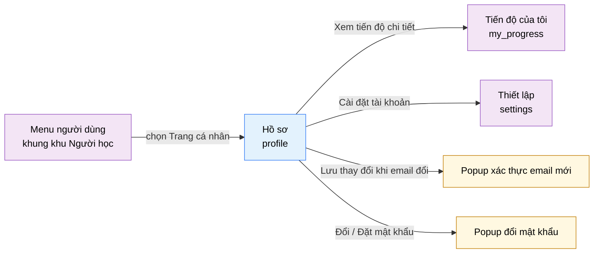

# Tài liệu thiết kế cơ bản (BD) — Hồ sơ (`USR0502`)

## Phương châm tài liệu [Nội bộ — không cần khách duyệt]

- Viết theo **mẫu 9 sheet**. Bộ thẻ đóng, quy ước ID, ký hiệu chuẩn, ranh giới với tài liệu khác và
  checklist kiểm toán nằm ở `02-bd/_rules/bd-template-9sheet.md` — file này không chép lại.
- Phần gắn nhãn `[Nội bộ]` phục vụ sinh mã và tự kiểm toán, không phải yêu cầu của khách hàng: mục 4.5,
  mục 7.3 và các ghi chú quy ước.
- Mã màn `USR0502` theo bảng mã ở `02-bd/_rules/bd-template-9sheet.md` mục 8 dòng 148; tên file mang tiền
  tố mã.
- Khung điều hướng **không mô tả lại ở đây** — dùng chung `02-bd/screens/users/_shell.md`. Khu Người học
  dùng **header ngang dính trên, không có sidebar**, và màn này là **mục thứ nhất trong menu người dùng**
  chứ không phải nav chính [Nguồn: 02-bd/screens/users/_shell.md:24,62-64;
  09-layoutBase/Trang cá nhân.dc.html:81]. Chân trang cũng thuộc khung chung
  [Nguồn: 02-bd/screens/users/_shell.md:86-104].
- **Khối danh tính trong menu người dùng của khung (avatar chữ cái, tên, email) không thiết kế lại ở đây**
  [Nguồn: 02-bd/screens/users/_shell.md:47]. Khu vực A của màn này là khối danh tính **trên thân trang**,
  một thành phần khác, có thêm nút "Đổi ảnh" [Nguồn: 09-layoutBase/Trang cá nhân.dc.html:101-110].

> Đọc cùng `01-rd/screens/users/USR0502_profile.md` (hành vi ở mức yêu cầu, không lặp lại ở đây),
> `01-rd/req/identity.md` (F1-09, F1-19, F1-15, F1-17) và `02-bd/database/identity.md` mục 1.1, 1.2, 1.5.
>
> **Không thiết kế lại** cơ chế băm mật khẩu, vòng đời token, rotation refresh token hay chống dò email —
> thuộc `02-bd/security/identity.md`. Màn này chỉ ghi **điều kiện kiểm và thông báo** ở Sheet 9.
> **Không thiết kế** luồng quên mật khẩu khi chưa đăng nhập (F1-17) — thuộc màn `auth` (`SHR0101`).
> **Không thiết kế** xoá tài khoản (F1-16), tuỳ chọn giao diện, ngôn ngữ hiển thị và thông báo — thuộc
> màn `settings` (`USR0503`).
> **Không thiết kế lại** các chỉ số tiến độ chi tiết — thuộc `my_progress` (`USR0501`); màn này chỉ hiện
> ba con số tóm tắt và mở sang đó.

> **Quy ước đặt tên khối** [Nội bộ], kế thừa đúng quy ước cụm màn cá nhân đã chốt ở
> `02-bd/screens/users/USR0501_my_progress.md:27-31`. Tám khối: `identityCard` (khối danh tính trên thân
> trang), `personalInfo` (biểu mẫu 6 trường), `security` (mật khẩu và phương thức đăng nhập), `account`
> (thông tin tài khoản chỉ đọc), `practice` (ba chỉ số luyện tập), `settingsEntry` (lối ra màn Cài đặt),
> `emailOtp` (popup xác thực email mới), `passwordChange` (popup đổi mật khẩu). Tiền tố ID item của toàn
> màn là `profile.`.

> **Ranh giới `profile` và `settings`** [Nội bộ]. `profile` giữ **dữ liệu nhận dạng của người dùng** — tên
> hiển thị, ảnh đại diện, email, mật khẩu, liên kết tài khoản OAuth. `settings` giữ **tuỳ chọn hành vi ứng
> dụng** — ngôn ngữ hiển thị, giao diện sáng/tối, thông báo, xoá tài khoản (F1-16). Trường "Ngôn ngữ mặc
> định" của biểu mẫu F1-09 là **ngôn ngữ nộp bài** (Java/C++/Python), không phải ngôn ngữ giao diện
> [Nguồn: 02-bd/database/identity.md:20]; nó vẫn nằm ở màn này vì F1-09 liệt kê đủ sáu trường, nhưng có
> trùng lấn với F1-20 — xem Câu hỏi mở Q6. Bộ chuyển ngôn ngữ giao diện VI/EN nằm ở **khung**, theo
> `DEC-2026-0824-i18n-vi-en` và `DEC-2026-0831-i18n-scope-expansion`; màn này không có tuỳ chọn ngôn ngữ
> giao diện nào.

---

## Sheet 1. Bìa

| Mục | Giá trị |
| :--- | :--- |
| Hệ thống | AlgoPrep |
| Phân hệ | `identity` (F1) — có phụ thuộc đọc sang `ai-review` (F5) cho một chỉ số tóm tắt |
| Công đoạn | BD — Thiết kế cơ bản |
| Phân loại | Màn hình |
| Tên màn | Hồ sơ |
| Mã màn hình | `USR0502` |
| Tên vật lý (slug) | `profile` |
| Trục tài liệu | Màn hình (`02-bd/screens/`) |
| Actor | A1 (`STUDENT`) |
| Phiên bản | V0.1 |
| Người tạo | Nhóm phát triển AlgoPrep |
| Ngày tạo | 2026/09/22 |
| Người cập nhật | Nhóm phát triển AlgoPrep |
| Ngày cập nhật | 2026/09/22 |

---

## Sheet 2. Lịch sử sửa đổi

| Ver | Sheet bị sửa | Nội dung sửa | Ngày | Người sửa |
| :--- | :--- | :--- | :--- | :--- |
| V0.1 | Toàn bộ | Tạo mới theo mẫu 9 sheet. Chốt nguồn dữ liệu của mọi trường hiển thị và phát hiện ba trường **không có cột DB** (ảnh đại diện, ngày đổi mật khẩu gần nhất, vị trí mục tiêu). Thiết kế bổ sung hai popup mà prototype không có (xác thực email mới, đổi mật khẩu), nhánh "Đặt mật khẩu" cho tài khoản chỉ OAuth, và cảnh báo rời màn khi còn thay đổi chưa lưu. Bỏ 2FA và gói `Pro` khỏi thiết kế theo REQ-06. Dùng lại hai tên nghiệp vụ `GetMyProgressOverview`, `GetMyInterviewSummary` của `my_progress` thay vì đặt tên mới. Phát sinh 10 câu hỏi mở | 2026/09/22 | Nhóm phát triển AlgoPrep |

---

## Sheet 3. Sơ đồ chuyển màn

> [Nội bộ] Quy ước vẽ: bố trí từ trái sang phải. Màn gọi tới tô tím, màn hiện tại tô xanh nhạt, popup tô
> vàng. Màu và `[Nguồn:]` dùng để truy vết, không phải yêu cầu của khách hàng.

### 3.1 Danh sách chuyển màn

#### Khung điều hướng khu Người học → Hồ sơ

[Điều kiện mở] Mở menu người dùng trên header ngang rồi chọn mục "Trang cá nhân" (mục thứ nhất trong năm
mục) [Nguồn: 02-bd/screens/users/_shell.md:62-64; 09-layoutBase/Trang cá nhân.dc.html:81].

[Chế độ mở] Không có.

[Thông tin truyền] Không có. Màn luôn hiển thị hồ sơ của chính người đang đăng nhập, không nhận tham số
`user_id` từ bên ngoài.

[Giá trị trả về] Không có.

[Khi thành công] Tải hồ sơ và ba chỉ số luyện tập; biểu mẫu ở trạng thái "chưa có thay đổi".

[Khi huỷ] Không có.

#### Hồ sơ → Tiến độ của tôi

[Điều kiện mở] Bấm liên kết "Xem tiến độ chi tiết" ở cuối khối "Luyện tập"
[Nguồn: 09-layoutBase/Trang cá nhân.dc.html:170].

[Chế độ mở] Không có.

[Thông tin truyền] Không có.

[Giá trị trả về] Không có.

[Khi thành công] Điều hướng sang màn `my_progress`.

[Khi huỷ] Còn thay đổi chưa lưu ở khối "Thông tin cá nhân" thì hỏi xác nhận trước; chọn ở lại thì huỷ
điều hướng, giữ nguyên mọi giá trị đang nhập dở (EVT-15).

#### Hồ sơ → Thiết lập

[Điều kiện mở] Bấm liên kết "Cài đặt tài khoản" ở cột phải
[Nguồn: 09-layoutBase/Trang cá nhân.dc.html:174]. Đây là lối vào duy nhất của luồng xoá tài khoản F1-16
từ màn này [Nguồn: 01-rd/screens/users/USR0502_profile.md:26].

[Chế độ mở] Không có.

[Thông tin truyền] Không có.

[Giá trị trả về] Không có.

[Khi thành công] Điều hướng sang màn `settings`.

[Khi huỷ] Cùng cách xử lý thay đổi chưa lưu như mục trên (EVT-15).

#### Hồ sơ → Popup xác thực email mới

[Điều kiện mở] Bấm "Lưu thay đổi" khi giá trị ô Email khác giá trị đã lưu (F1-09 — đổi email bắt buộc xác
thực bằng mã 6 số gửi tới email mới) [Nguồn: 01-rd/screens/users/USR0502_profile.md:78].

[Chế độ mở] Popup chồng lên màn hiện tại, không có slug riêng.

[Thông tin truyền] Email mới vừa nhập, để hiển thị trong câu hướng dẫn.

[Giá trị trả về] Xác thực thành công thì trả về email mới đã có hiệu lực; huỷ thì không trả gì.

[Khi thành công] Đóng popup, cập nhật ô Email và khối danh tính, hiện thông báo đã cập nhật.

[Khi huỷ] Đóng popup. **Email đăng nhập vẫn là email cũ**; ô Email trên biểu mẫu giữ giá trị mới người
dùng vừa nhập và biểu mẫu quay lại trạng thái "có thay đổi chưa lưu", không tự hoàn tác hộ.

#### Hồ sơ → Popup đổi mật khẩu

[Điều kiện mở] Bấm nút ở dòng "Mật khẩu" trong khối Bảo mật (F1-19)
[Nguồn: 09-layoutBase/Trang cá nhân.dc.html:233].

[Chế độ mở] Popup chồng lên màn hiện tại, hai biến thể: "Đổi mật khẩu" cho tài khoản đã có mật khẩu,
"Đặt mật khẩu" cho tài khoản chỉ đăng ký qua OAuth (`password_hash IS NULL`)
[Nguồn: 02-bd/database/identity.md:15].

[Thông tin truyền] Biến thể popup, suy từ trạng thái "đã có mật khẩu hay chưa" của tài khoản.

[Giá trị trả về] Không có giá trị nghiệp vụ; thành công thì mốc "Đổi lần cuối" được làm mới.

[Khi thành công] Đóng popup, hiện thông báo đổi mật khẩu thành công, làm mới dòng phụ của khối Bảo mật.

[Khi huỷ] Đóng popup, xoá sạch mọi ô mật khẩu đã nhập, không hỏi xác nhận (nội dung nhạy cảm, không giữ
lại).

### 3.2 Sơ đồ

[Nguồn: 09-layoutBase/Trang cá nhân.dc.html:81,170,174,233; 02-bd/screens/users/_shell.md:62-64]

---

## Sheet 4. Bố cục màn hình

### 4.1 Tổng quan màn

[Mục đích màn] Cho người học xem và cập nhật dữ liệu nhận dạng của chính mình: sáu trường hồ sơ (F1-09),
mật khẩu (F1-19), thông tin tài khoản chỉ đọc, và ba chỉ số luyện tập tóm tắt kèm đường sang `my_progress`
[Nguồn: 01-rd/screens/users/USR0502_profile.md:14,76-81].

[Luồng nghiệp vụ chính]

1. **Hiển thị ban đầu**: vào màn, hệ thống tải hồ sơ (khối A, B, C, D) bằng một lời gọi và ba chỉ số
   luyện tập bằng hai lời gọi tách riêng. Mỗi nhóm khối có ba trạng thái riêng — đang tải, có dữ liệu,
   lỗi — và một nhóm lỗi không kéo theo nhóm khác.
2. **Sửa hồ sơ**: sửa một hoặc nhiều trong sáu trường, biểu mẫu chuyển sang trạng thái "có thay đổi chưa
   lưu"; bấm "Hoàn tác" trả mọi trường về giá trị đã lưu gần nhất, không hỏi xác nhận
   [Nguồn: 01-rd/screens/users/USR0502_profile.md:66].
3. **Lưu**: email không đổi thì lưu thẳng; email đổi thì mở popup nhập mã 6 số gửi tới email mới, năm
   trường còn lại vẫn được lưu ngay, email cũ còn hiệu lực cho tới khi xác thực xong
   [Nguồn: 01-rd/screens/users/USR0502_profile.md:78,98].
4. **Đổi mật khẩu**: mở popup, nhập mật khẩu hiện tại và mật khẩu mới; tài khoản chỉ OAuth đi nhánh "Đặt
   mật khẩu", không có ô mật khẩu hiện tại.
5. **Rời màn**: còn thay đổi chưa lưu thì hỏi xác nhận trước khi điều hướng.

[Người dùng] Người học đã đăng nhập (`STUDENT`). Màn chỉ hiển thị và sửa hồ sơ của chính người đang đăng
nhập. A2/A3 dùng chung cấu trúc màn nhưng vào từ khung khác — ngoài phạm vi đợt này
[Nguồn: 01-rd/screens/users/USR0502_profile.md:5].

[Tệp liên quan] Nút "Đổi ảnh" là điểm duy nhất có thể liên quan tới tệp. Prototype dựng nút này **không
gắn hành vi** [Nguồn: 09-layoutBase/Trang cá nhân.dc.html:108] và không có cột DB nào lưu ảnh đại diện —
xem Câu hỏi mở Q1. Ngoài nút đó, màn không xuất hay nhập tệp.

[Phạm vi]
- Sửa được: sáu trường hồ sơ và mật khẩu. Ngoài ra chỉ đọc.
- **Không** có 2FA và **không** có trường "Gói"/`Pro` — hai mục này bị loại khỏi giao diện thật
  [Nguồn: 01-rd/screens/users/USR0502_profile.md:55-56,81].
- **Không** có luồng xoá tài khoản (F1-16) — chỉ có liên kết sang `settings`.
- **Không** có tuỳ chọn ngôn ngữ giao diện, giao diện sáng/tối hay thông báo — thuộc `settings`.
- Chỉ số "Phiên phỏng vấn" lấy từ `ai-review` **phải suy giảm êm**: phân hệ AI hỏng thì toàn bộ phần còn
  lại của màn vẫn hiển thị và sửa được bình thường.

[Quyền sử dụng]
- Xem: được, với chính hồ sơ của mình.
- Thêm: không.
- Sửa: được, với sáu trường hồ sơ và mật khẩu của chính mình.
- Xoá: không.

[Số bản ghi tối đa] Biểu mẫu: đúng 6 trường. Khối Bảo mật: 2 dòng. Khối Tài khoản: 3 dòng. Khối Luyện
tập: 3 dòng. Danh sách phương thức đăng nhập đã liên kết: tối đa 2 (Google, GitHub)
[Nguồn: 02-bd/database/identity.md:70]. Toàn màn không có phân trang.

[Nguồn: 01-rd/screens/users/USR0502_profile.md:22-26,76-81; 02-bd/database/identity.md:11-24]

### 4.2 DTO liên quan

- `MyProfileDto`
- `UpdateMyProfileInput`
- `EmailChangeRequestInput`
- `EmailChangeConfirmInput`
- `ChangeMyPasswordInput`
- `MyProgressOverviewDto` — dùng lại của `my_progress` [Nguồn: 02-bd/screens/users/USR0501_my_progress.md:201]
- `MyInterviewSummaryDto` — dùng lại của `my_progress` [Nguồn: 02-bd/screens/users/USR0501_my_progress.md:206]

`[Suy luận]` — tên DTO mới do BD này đề xuất, `03-dd/api/identity.md` chốt lại. Hai DTO dùng lại **không
đặt tên thứ hai**: cùng dữ liệu, cùng phạm vi khoá cứng theo người đăng nhập.

Ba DTO này **không** dùng lại DTO của màn quản trị `admin_user_management`, dù cùng đọc bảng
`identity.users`: khác phạm vi (một người so với toàn hệ thống), khác tập trường và khác mô hình phân
quyền [Nguồn: 02-bd/screens/admin/ADM0201_user_management.md:343].

### 4.3 Bảng dữ liệu liên quan (6)

| NO | Bảng | Ghi chú |
| --: | :--- | :--- |
| 1 | `identity.users` | [Nguồn: 02-bd/database/identity.md:11-24] |
| 2 | `identity.roles` | [Nguồn: 02-bd/database/identity.md:34-41] |
| 3 | `identity.oauth_identities` | [Nguồn: 02-bd/database/identity.md:68-72] |
| 4 | `identity.user_problem_best_score` | [Nguồn: 02-bd/database/identity.md:111-112] |
| 5 | `identity.user_submission_stats` | [Nguồn: 02-bd/database/identity.md:113-114] |
| 6 | `ai.interview_sessions` | [Nguồn: 02-bd/database/ai-review.md:66-83] |

Ngoài sáu bảng trên, luồng đổi email dùng một khoá Redis có TTL 10 phút chứ không có bảng Postgres
[Nguồn: 02-bd/database/identity.md:80-83,134]. Khoá Redis không phải bảng dữ liệu nên không đánh số ở đây
và ở mục 7.2.

Màn này **không** đọc `identity.system_audit_logs`: F1-14 chỉ ghi hành động quản trị của người khác lên
tài khoản, không phải nhật ký tự thao tác của chính người dùng [Nguồn: 02-bd/database/identity.md:103-107].

### 4.4 Vùng bố cục

Đối chiếu `09-layoutBase/Trang cá nhân.dc.html` — bằng chứng bố cục chỉ-đọc, **không phải** design system
cuối cùng.

| Vùng | Vị trí trong prototype | Nội dung |
| :--- | :--- | :--- |
| Header ngang dính trên (khung chung khu Người học) | `:46-93` | Thương hiệu, 6 mục nav, menu người dùng đang mở với mục "Trang cá nhân" được tô sáng — dùng lại khung chung |
| Cột trái — khối danh tính | `:101-110` | Avatar tròn chữ viết tắt, tên, email, nút "Đổi ảnh" căn phải |
| Cột trái — "Thông tin cá nhân" | `:112-129` | Tiêu đề khối, lưới 2 cột chứa 6 ô nhập, hàng chân khối gồm dòng trạng thái bên trái và hai nút "Hoàn tác" / "Lưu thay đổi" bên phải |
| Cột trái — "Bảo mật" | `:131-144` | Danh sách dòng, mỗi dòng gồm tiêu đề, dòng phụ và một nút thao tác căn phải |
| Cột phải — "Tài khoản" | `:148-158` | Danh sách cặp nhãn-giá trị, giá trị căn phải |
| Cột phải — "Luyện tập" | `:160-172` | 3 dòng chỉ số kèm chấm màu, dưới cùng là liên kết "Xem tiến độ chi tiết" dạng nút rộng hết khối |
| Cột phải — lối ra Cài đặt | `:174` | Một liên kết "Cài đặt tài khoản" dạng nút rộng, đứng ngoài mọi khối |
| Popup xác thực email mới | Không có trong prototype | BD bổ sung, xem danh sách divergence bên dưới |
| Popup đổi mật khẩu | Không có trong prototype | BD bổ sung, xem danh sách divergence bên dưới |
| Chân trang (khung chung khu Người học) | Không có trong file này | Prototype của màn này **không dựng** `<footer>`; khung chung vẫn áp chân trang cho mọi màn của khu, đây là divergence có chủ đích đã ghi ở khung [Nguồn: 02-bd/screens/users/_shell.md:92-95] |

Bố cục hai cột `minmax(0, 1fr) 340px` (`:97`) — đúng cùng tỉ lệ mà `my_progress` dùng, giữ nguyên khi dựng
Next.js. Không quy định màu sắc, khoảng cách hay typography ở BD.

**Năm điểm màn hình này khác prototype, cố ý:**

1. **Bỏ dòng "Xác thực hai lớp"** trong khối Bảo mật [Nguồn: 09-layoutBase/Trang cá nhân.dc.html:234] —
   ngoài phạm vi đồ án [Nguồn: 01-rd/screens/users/USR0502_profile.md:55].
2. **Bỏ dòng "Gói / Pro"** trong khối Tài khoản [Nguồn: 09-layoutBase/Trang cá nhân.dc.html:240] —
   AlgoPrep không có mô hình phân hạng tài khoản [Nguồn: 01-rd/screens/users/USR0502_profile.md:56].
3. **Bổ sung popup xác thực email mới.** Prototype lưu biểu mẫu bằng một lệnh `setState` duy nhất
   [Nguồn: 09-layoutBase/Trang cá nhân.dc.html:229], không có bước xác thực nào. Nhưng F1-09 bắt buộc mã
   6 số gửi tới email mới [Nguồn: 01-rd/screens/users/USR0502_profile.md:78]; không có popup thì yêu cầu
   đó không có đường thực hiện trên màn.
4. **Bổ sung popup đổi mật khẩu và nhánh "Đặt mật khẩu".** Prototype chỉ có một nút "Đổi" không gắn hành
   vi [Nguồn: 09-layoutBase/Trang cá nhân.dc.html:233]. Tài khoản đăng ký qua OAuth **chưa từng có mật
   khẩu** (`password_hash` nullable) [Nguồn: 02-bd/database/identity.md:15], nên không thể hỏi "mật khẩu
   hiện tại" — phải có nhánh riêng.
5. **Bổ sung một dòng "Đăng nhập bằng"** trong khối Bảo mật, liệt kê provider đã liên kết. Không có dòng
   này thì người dùng OAuth không hiểu vì sao nút của mình ghi "Đặt mật khẩu" chứ không phải "Đổi".

Prototype còn hiển thị đồng thời nhãn tiếng Việt và tiếng Anh cho mọi mục; đó là cách bản mẫu minh hoạ
i18n, không phải yêu cầu hiển thị song ngữ cùng lúc — cùng kết luận đã ghi ở khung
[Nguồn: 02-bd/screens/users/_shell.md:69-74].

### 4.5 Cấu trúc slice FSD [Nội bộ]

| Khối | Slice dự kiến | Căn cứ |
| :--- | :--- | :--- |
| Trang | `views/profile` | Quy ước FSD của dự án |
| Khung khu Người học | Dùng lại `widgets/app-shell` | `02-bd/screens/users/_shell.md` |
| Khối danh tính | `widgets/profile-identity-card` | Prototype `:101-110` |
| Biểu mẫu 6 trường | `features/edit-my-profile` | Prototype `:112-129` |
| Popup xác thực email mới | `features/confirm-email-change` | BD bổ sung |
| Khối Bảo mật và popup mật khẩu | `widgets/profile-security` + `features/change-my-password` | Prototype `:131-144` |
| Khối Tài khoản | `widgets/profile-account-card` | Prototype `:148-158` |
| Khối Luyện tập | `widgets/profile-practice-card` | Prototype `:160-172` |
| Thực thể người dùng hiện tại | `entities/current-user` | Dùng chung với khung và `settings` |

`[Suy luận]` — ánh xạ slice do BD đề xuất, DD màn hình chốt lại.

> [Nội bộ] Ảnh minh hoạ đặt ở `08-diagram/02-bd/screens/users/`, chụp bằng Playwright trên ứng dụng
> Next.js thật khi đã có mã chạy được. Chưa có thì tham chiếu prototype, không vẽ tay.

---

## Sheet 5. Danh sách item màn hình

> Quy ước ID, bộ thẻ và giá trị chuẩn: `02-bd/_rules/bd-template-9sheet.md` mục 2, 3, 4.

### Khu vực A — Khối danh tính trên thân trang

| Khu vực | NO | Tên item | ID item | Bảng DB | Cột DB | Loại UI | Kiểu | Độ dài | Bắt buộc | I/O | Giá trị mặc định | Định dạng | Ghi chú |
| :--- | --: | :--- | :--- | :--- | :--- | :--- | :--- | :--- | :-: | :-: | :--- | :--- | :--- |
| Khối danh tính | | | | | | | | | | | | | |
| | 1 | Avatar chữ viết tắt | `profile.identityCard.initials` | `identity.users` | `display_name` | Label | String | 2 | - | O | - | 2 ký tự in hoa | Vòng tròn chữ cái đầu thay ảnh đại diện [Công thức] Ghép ký tự đầu của hai từ cuối trong `display_name`, viết hoa — cùng quy tắc đã dùng ở khu Giảng viên và khu Quản trị [Nguồn: 02-bd/screens/teacher/INS0201_class_management.md:359; 02-bd/screens/admin/ADM0201_user_management.md:343]. **Ảnh đại diện thật chưa có cột DB nào** — xem Câu hỏi mở Q1 [EVT liên quan] EVT-1 |
| | 2 | Tên hiển thị | `profile.identityCard.displayName` | `identity.users` | `display_name` | Label | String | 100 | - | O | - | - | Tên hiển thị của người đang đăng nhập [Nguồn: 09-layoutBase/Trang cá nhân.dc.html:104] [Nguồn giá trị] Cột `display_name` [Nguồn: 02-bd/database/identity.md:16] [EVT liên quan] EVT-1, EVT-4 |
| | 3 | Email | `profile.identityCard.email` | `identity.users` | `email` | Label | String | 254 | - | O | - | - | Email đăng nhập hiện hành — **không** phải email mới đang chờ xác thực [Nguồn: 09-layoutBase/Trang cá nhân.dc.html:105] [Nguồn giá trị] Cột `email` [Nguồn: 02-bd/database/identity.md:14] [EVT liên quan] EVT-1, EVT-6 |
| | 4 | Đổi ảnh | `profile.identityCard.btnChangePhoto` | - | - | Button | - | - | - | I | - | Đổi ảnh | Nút đổi ảnh đại diện [Nguồn giá trị] Nhãn tĩnh i18n. Prototype dựng nút này **không gắn hành vi** [Nguồn: 09-layoutBase/Trang cá nhân.dc.html:108] và chưa có cột DB lẫn kho lưu ảnh — xem Câu hỏi mở Q1 [EVT liên quan] EVT-12 |

### Khu vực B — Biểu mẫu thông tin cá nhân

| Khu vực | NO | Tên item | ID item | Bảng DB | Cột DB | Loại UI | Kiểu | Độ dài | Bắt buộc | I/O | Giá trị mặc định | Định dạng | Ghi chú |
| :--- | --: | :--- | :--- | :--- | :--- | :--- | :--- | :--- | :-: | :-: | :--- | :--- | :--- |
| Thông tin cá nhân | | | | | | | | | | | | | |
| | 1 | Họ và tên | `profile.personalInfo.displayName` | `identity.users` | `display_name` | TextBox | String | 100 | Có | I/O | Giá trị đã lưu | - | Trường 1 trong 6 trường F1-09 [Nguồn: 01-rd/screens/users/USR0502_profile.md:23] [Nguồn giá trị] Cột `display_name` [Nguồn: 02-bd/database/identity.md:16]; độ dài 100 `[Suy luận]` theo cột `VARCHAR` chưa chốt độ dài, DD chốt [EVT liên quan] EVT-1, EVT-2 |
| | 2 | Email | `profile.personalInfo.email` | `identity.users` | `email` | TextBox | String | 254 | Có | I/O | Giá trị đã lưu | Chuỗi email hợp lệ | Sửa được nhưng **chỉ có hiệu lực sau khi xác thực mã 6 số** gửi tới email mới [Nguồn: 01-rd/screens/users/USR0502_profile.md:78] [Nguồn giá trị] Cột `email`, unique [Nguồn: 02-bd/database/identity.md:14,121] [EVT liên quan] EVT-2, EVT-5 |
| | 3 | Trường / công ty | `profile.personalInfo.schoolOrCompany` | `identity.users` | `school_or_company` | TextBox | String | 150 | - | I/O | Giá trị đã lưu | - | Nơi học hoặc nơi làm việc tự khai [Nguồn giá trị] Cột `school_or_company`, nullable [Nguồn: 02-bd/database/identity.md:19] [EVT liên quan] EVT-2 |
| | 4 | Vai trò hiện tại | `profile.personalInfo.currentPosition` | `identity.users` | `current_position` | TextBox | String | 100 | - | I/O | Giá trị đã lưu | - | Chức danh **tự khai**, không phải RBAC role — không nhầm với `role_id` [Nguồn: 02-bd/database/identity.md:18] [Nguồn giá trị] Cột `current_position`, nullable [EVT liên quan] EVT-2 |
| | 5 | Ngôn ngữ mặc định | `profile.personalInfo.defaultLanguage` | `identity.users` | `default_language` | Label | Enum | - | - | I/O | Giá trị đã lưu | Một trong ba giá trị | **Ngôn ngữ nộp bài** mặc định (Java / C++ / Python), không phải ngôn ngữ giao diện [Nguồn: 02-bd/database/identity.md:20]. Prototype dựng ô nhập tự do với giá trị "Python 3" [Nguồn: 09-layoutBase/Trang cá nhân.dc.html:183,219] — sai kiểu, phải là danh sách chọn đóng đúng ba ngôn ngữ. Loại UI cụ thể và ranh giới với F1-20 chưa chốt — xem Câu hỏi mở Q6 [Nguồn giá trị] Cột `default_language` [EVT liên quan] EVT-2 |
| | 6 | Vị trí mục tiêu | `profile.personalInfo.targetPosition` | Chưa có | Chưa có | TextBox | String | 100 | - | I/O | Giá trị đã lưu | - | Vị trí công việc người học hướng tới. **Không có cột DB riêng**: `current_position` đang được ghi chú là phục vụ cả "Vị trí mục tiêu" lẫn "Vai trò hiện tại" [Nguồn: 02-bd/database/identity.md:18], nhưng F1-09 liệt kê chúng là **hai trường khác nhau** [Nguồn: 01-rd/screens/users/USR0502_profile.md:23]. Một cột không chứa được hai giá trị — xem Câu hỏi mở Q2 [EVT liên quan] EVT-2 |
| | 7 | Dòng trạng thái biểu mẫu | `profile.personalInfo.formStatus` | - | - | Label | String | 120 | - | O | Câu gợi ý | Câu tĩnh | Ba câu theo ba trạng thái: chưa sửa gì "Email dùng để đăng nhập và nhận nhắc luyện tập." / có sửa "Có thay đổi chưa lưu." / vừa lưu xong "Đã cập nhật thông tin." [Nguồn: 09-layoutBase/Trang cá nhân.dc.html:224-228] [Nguồn giá trị] Nhãn tĩnh i18n, chọn theo trạng thái biểu mẫu [EVT liên quan] EVT-2, EVT-3, EVT-4 |
| | 8 | Hoàn tác | `profile.personalInfo.btnRevert` | - | - | Button | - | - | - | I | - | Hoàn tác | Trả cả sáu trường về giá trị đã lưu gần nhất, **không hỏi xác nhận** [Nguồn: 01-rd/screens/users/USR0502_profile.md:66; 09-layoutBase/Trang cá nhân.dc.html:125,230] [Nguồn giá trị] Nhãn tĩnh i18n [EVT liên quan] EVT-3 |
| | 9 | Lưu thay đổi | `profile.personalInfo.btnSave` | - | - | Button | - | - | - | I | - | Lưu thay đổi | Nhãn đổi thành "Đã lưu" ngay sau khi lưu thành công [Nguồn: 09-layoutBase/Trang cá nhân.dc.html:223] [Nguồn giá trị] Nhãn tĩnh i18n [EVT liên quan] EVT-4, EVT-5 |
| | 10 | Thử lại | `profile.personalInfo.btnRetry` | - | - | Button | - | - | - | I | - | Thử lại | Tải lại hồ sơ khi lời gọi `GetMyProfile` thất bại; cùng quy ước nút thử lại theo khối của `my_progress` [Nguồn: 02-bd/screens/users/USR0501_my_progress.md:293] [Nguồn giá trị] Nhãn tĩnh i18n [EVT liên quan] EVT-16 |

### Khu vực C — Bảo mật tài khoản

| Khu vực | NO | Tên item | ID item | Bảng DB | Cột DB | Loại UI | Kiểu | Độ dài | Bắt buộc | I/O | Giá trị mặc định | Định dạng | Ghi chú |
| :--- | --: | :--- | :--- | :--- | :--- | :--- | :--- | :--- | :-: | :-: | :--- | :--- | :--- |
| Bảo mật | | | | | | | | | | | | | |
| | 1 | Tiêu đề khối | `profile.security.title` | - | - | Label | String | - | - | O | Bảo mật | - | Tiêu đề khối [Nguồn giá trị] Nhãn tĩnh i18n [Nguồn: 09-layoutBase/Trang cá nhân.dc.html:132] [EVT liên quan] - |
| | 2 | Nhãn dòng mật khẩu | `profile.security.passwordLabel` | - | - | Label | String | - | - | O | Mật khẩu | - | Tiêu đề dòng thứ nhất của khối [Nguồn giá trị] Nhãn tĩnh i18n [Nguồn: 09-layoutBase/Trang cá nhân.dc.html:233] [EVT liên quan] - |
| | 3 | Trạng thái mật khẩu | `profile.security.passwordMeta` | Chưa có | Chưa có | Label | String | 60 | - | O | - | `Đổi lần cuối dd/MM/yyyy` | Hai câu theo hai ca: đã có mật khẩu thì "Đổi lần cuối {ngày}"; chưa từng có mật khẩu (`password_hash IS NULL`) thì "Chưa đặt mật khẩu — đang đăng nhập bằng {provider}" [Nguồn: 02-bd/database/identity.md:15]. **Ngày đổi mật khẩu gần nhất không có cột DB nào** [Nguồn: 02-bd/database/identity.md:11-24] dù RD yêu cầu hiển thị [Nguồn: 01-rd/screens/users/USR0502_profile.md:79] — xem Câu hỏi mở Q3 [EVT liên quan] EVT-1, EVT-10 |
| | 4 | Đổi / Đặt mật khẩu | `profile.security.btnChangePassword` | - | - | Button | - | - | - | I | - | Đổi | Nhãn "Đổi" khi tài khoản đã có mật khẩu, "Đặt mật khẩu" khi `password_hash IS NULL` [Nguồn giá trị] Nhãn tĩnh i18n [Nguồn: 09-layoutBase/Trang cá nhân.dc.html:233] [EVT liên quan] EVT-9 |
| | 5 | Nhãn dòng phương thức đăng nhập | `profile.security.providerLabel` | - | - | Label | String | - | - | O | Đăng nhập bằng | - | Tiêu đề dòng thứ hai của khối. **Dòng này prototype không có**, BD bổ sung thay chỗ dòng 2FA đã bỏ — xem mục 4.4 [Nguồn giá trị] Nhãn tĩnh i18n [EVT liên quan] - |
| | 6 | Phương thức đăng nhập đã liên kết | `profile.security.providerList` | `identity.oauth_identities` | `provider` | Badge | List | - | - | O | rỗng | Tối đa 2 thẻ | Liệt kê provider đã liên kết với tài khoản; kèm "Email và mật khẩu" khi `password_hash` khác NULL. Rỗng không xảy ra: mọi tài khoản phải có ít nhất một phương thức đăng nhập [Nguồn giá trị] Cột `provider` ENUM(`GITHUB`,`GOOGLE`) của các dòng `oauth_identities` thuộc người đăng nhập [Nguồn: 02-bd/database/identity.md:70]. **Chỉ đọc** — liên kết thêm và gỡ liên kết chưa có mã `Fx-nn` nào phủ, xem Câu hỏi mở Q4 [EVT liên quan] EVT-1 |

### Khu vực D — Thông tin tài khoản

| Khu vực | NO | Tên item | ID item | Bảng DB | Cột DB | Loại UI | Kiểu | Độ dài | Bắt buộc | I/O | Giá trị mặc định | Định dạng | Ghi chú |
| :--- | --: | :--- | :--- | :--- | :--- | :--- | :--- | :--- | :-: | :-: | :--- | :--- | :--- |
| Tài khoản | | | | | | | | | | | | | |
| | 1 | Tiêu đề khối | `profile.account.title` | - | - | Label | String | - | - | O | Tài khoản | - | Tiêu đề khối [Nguồn giá trị] Nhãn tĩnh i18n [Nguồn: 09-layoutBase/Trang cá nhân.dc.html:149] [EVT liên quan] - |
| | 2 | Mã người dùng | `profile.account.userCode` | `identity.users` | `id` | Label | String | 8 | - | O | - | 8 ký tự đầu của UUID | Mã để người dùng trích dẫn khi báo lỗi. Prototype hiển thị `USR-10482` [Nguồn: 09-layoutBase/Trang cá nhân.dc.html:238] nhưng khoá thật là **UUID** [Nguồn: 02-bd/database/identity.md:13] — hai định dạng không tương thích, xem Câu hỏi mở Q5 [Công thức] Lấy 8 ký tự đầu của `users.id`, viết hoa [EVT liên quan] EVT-1 |
| | 3 | Ngày tham gia | `profile.account.joinedAt` | `identity.users` | `created_at` | Label | Date | - | - | O | - | `dd/MM/yyyy` | Ngày tạo tài khoản [Nguồn: 09-layoutBase/Trang cá nhân.dc.html:239] [Nguồn giá trị] Cột `created_at` [Nguồn: 02-bd/database/identity.md:24] [EVT liên quan] EVT-1 |
| | 4 | Quyền | `profile.account.roleName` | `identity.roles` | `name` | Label | String | 50 | - | O | - | Tên hiển thị của vai trò | Vai trò RBAC của tài khoản, chỉ đọc — người học **không** tự đổi vai trò của mình [Nguồn giá trị] Cột `roles.name` tra qua `users.role_id` [Nguồn: 02-bd/database/identity.md:17,38] [EVT liên quan] EVT-1 |

### Khu vực E — Tóm tắt luyện tập

| Khu vực | NO | Tên item | ID item | Bảng DB | Cột DB | Loại UI | Kiểu | Độ dài | Bắt buộc | I/O | Giá trị mặc định | Định dạng | Ghi chú |
| :--- | --: | :--- | :--- | :--- | :--- | :--- | :--- | :--- | :-: | :-: | :--- | :--- | :--- |
| Luyện tập | | | | | | | | | | | | | |
| | 1 | Tiêu đề khối | `profile.practice.title` | - | - | Label | String | - | - | O | Luyện tập | - | Tiêu đề khối [Nguồn giá trị] Nhãn tĩnh i18n [Nguồn: 09-layoutBase/Trang cá nhân.dc.html:161] [EVT liên quan] - |
| | 2 | Bài đã giải | `profile.practice.solvedCount` | `identity.user_problem_best_score` | `best_verdict` | Label | Number | 6 | - | O | 0 | Số nguyên | Số bài có ít nhất một lần `Accepted` (F1-06). Ở màn này hiển thị **số đếm trần, không có mẫu số**, khác `my_progress` hiển thị `{số} / {số}` [Nguồn: 09-layoutBase/Trang cá nhân.dc.html:245] [Công thức] Đếm dòng `user_problem_best_score` của người đăng nhập có `best_verdict = ACCEPTED` [Nguồn: 02-bd/database/identity.md:111-112] [EVT liên quan] EVT-1 |
| | 3 | Lượt nộp | `profile.practice.submissionCount` | `identity.user_submission_stats` | `total_submissions` | Label | Number | 6 | - | O | 0 | Số nguyên | Tổng số lượt nộp luỹ kế [Nguồn: 09-layoutBase/Trang cá nhân.dc.html:246] [Nguồn giá trị] Cột `total_submissions` [Nguồn: 02-bd/database/identity.md:113-114] [EVT liên quan] EVT-1 |
| | 4 | Phiên phỏng vấn | `profile.practice.interviewCount` | `ai.interview_sessions` | `stage` | Label | Number | 5 | - | O | - | Số nguyên, không lấy được thì `-` | Số phiên phỏng vấn giả lập đã kết thúc [Nguồn: 09-layoutBase/Trang cá nhân.dc.html:247] [Công thức] Đếm dòng `interview_sessions` của người đăng nhập có `stage = COMPLETED` [Nguồn: 02-bd/database/ai-review.md:79] — đúng công thức `my_progress` đã dùng [Nguồn: 02-bd/screens/users/USR0501_my_progress.md:290]. `ai-review` không phản hồi thì hiển thị `-`, **không** chặn phần còn lại của màn [EVT liên quan] EVT-1 |
| | 5 | Xem tiến độ chi tiết | `profile.practice.linkFullProgress` | - | - | Link | - | - | - | I | - | Xem tiến độ chi tiết | Điều hướng sang `my_progress` [Nguồn: 09-layoutBase/Trang cá nhân.dc.html:170] [Nguồn giá trị] Nhãn tĩnh i18n [EVT liên quan] EVT-13 |
| | 6 | Thử lại | `profile.practice.btnRetry` | - | - | Button | - | - | - | I | - | Thử lại | Tải lại riêng khối Luyện tập khi khối này ở trạng thái lỗi [Nguồn giá trị] Nhãn tĩnh i18n [EVT liên quan] EVT-16 |

### Khu vực F — Lối ra màn Thiết lập

| Khu vực | NO | Tên item | ID item | Bảng DB | Cột DB | Loại UI | Kiểu | Độ dài | Bắt buộc | I/O | Giá trị mặc định | Định dạng | Ghi chú |
| :--- | --: | :--- | :--- | :--- | :--- | :--- | :--- | :--- | :-: | :-: | :--- | :--- | :--- |
| Lối ra Cài đặt | | | | | | | | | | | | | |
| | 1 | Cài đặt tài khoản | `profile.settingsEntry.linkAccountSettings` | - | - | Link | - | - | - | I | - | Cài đặt tài khoản | Điều hướng sang `settings`; là lối vào luồng xoá tài khoản F1-16 từ màn này [Nguồn: 09-layoutBase/Trang cá nhân.dc.html:174; 01-rd/screens/users/USR0502_profile.md:26] [Nguồn giá trị] Nhãn tĩnh i18n [EVT liên quan] EVT-14 |

### Khu vực G — Popup xác thực email mới

| Khu vực | NO | Tên item | ID item | Bảng DB | Cột DB | Loại UI | Kiểu | Độ dài | Bắt buộc | I/O | Giá trị mặc định | Định dạng | Ghi chú |
| :--- | --: | :--- | :--- | :--- | :--- | :--- | :--- | :--- | :-: | :-: | :--- | :--- | :--- |
| Popup xác thực email mới | | | | | | | | | | | | | |
| | 1 | Tiêu đề popup | `profile.emailOtp.title` | - | - | Label | String | - | - | O | Xác thực email mới | - | Tiêu đề popup. **Popup này prototype không có**, BD bổ sung theo F1-09 — xem mục 4.4 [Nguồn giá trị] Nhãn tĩnh i18n [EVT liên quan] EVT-5 |
| | 2 | Câu hướng dẫn | `profile.emailOtp.hint` | - | - | Label | String | 150 | - | O | - | Câu có tham số | Nội dung "Đã gửi mã gồm 6 chữ số tới {email mới}. Nhập mã để hoàn tất việc đổi email." [Nguồn giá trị] Nhãn tĩnh i18n có tham số; tham số là giá trị ô Email đang nhập, không phải cột DB [EVT liên quan] EVT-5 |
| | 3 | Ô nhập mã | `profile.emailOtp.code` | - | - | TextBox | String | 6 | Có | I | rỗng | Đúng 6 chữ số | Mã xác nhận gửi tới email mới; dùng lại cơ chế OTP của F1-17 [Nguồn: 01-rd/screens/users/USR0502_profile.md:78] [Nguồn giá trị] Người dùng nhập; mã thật nằm ở khoá Redis `identity:emailchange:<userId>` TTL 10 phút, không ở bảng nào [Nguồn: 02-bd/database/identity.md:80-83,134] [EVT liên quan] EVT-6 |
| | 4 | Thời hạn còn lại | `profile.emailOtp.expiresIn` | - | - | Label | String | 10 | - | O | 10:00 | `mm:ss` | Đếm ngược hiệu lực của mã [Công thức] Đếm ngược từ TTL 10 phút của khoá Redis [Nguồn: 02-bd/database/identity.md:134]; về 0 thì vô hiệu ô nhập mã và chỉ còn "Gửi lại mã" [EVT liên quan] EVT-5, EVT-7 |
| | 5 | Gửi lại mã | `profile.emailOtp.linkResend` | - | - | Link | - | - | - | I | - | Gửi lại mã | Yêu cầu mã mới cho cùng email mới [Nguồn giá trị] Nhãn tĩnh i18n; chặn gửi lại trong 60 giây theo cơ chế chống spam đã có [Nguồn: 02-bd/database/identity.md:133] [EVT liên quan] EVT-7 |
| | 6 | Xác nhận | `profile.emailOtp.btnConfirm` | - | - | Button | - | - | - | I | - | Xác nhận | Gửi mã lên máy chủ để hoàn tất đổi email [Nguồn giá trị] Nhãn tĩnh i18n [EVT liên quan] EVT-6 |
| | 7 | Huỷ | `profile.emailOtp.btnCancel` | - | - | Button | - | - | - | I | - | Huỷ | Đóng popup, giữ nguyên email đăng nhập cũ [Nguồn giá trị] Nhãn tĩnh i18n [EVT liên quan] EVT-8 |

### Khu vực H — Popup đổi mật khẩu

| Khu vực | NO | Tên item | ID item | Bảng DB | Cột DB | Loại UI | Kiểu | Độ dài | Bắt buộc | I/O | Giá trị mặc định | Định dạng | Ghi chú |
| :--- | --: | :--- | :--- | :--- | :--- | :--- | :--- | :--- | :-: | :-: | :--- | :--- | :--- |
| Popup đổi mật khẩu | | | | | | | | | | | | | |
| | 1 | Tiêu đề popup | `profile.passwordChange.title` | - | - | Label | String | - | - | O | Đổi mật khẩu | - | "Đổi mật khẩu" hoặc "Đặt mật khẩu" theo biến thể. **Popup này prototype không có**, BD bổ sung theo F1-19 — xem mục 4.4 [Nguồn giá trị] Nhãn tĩnh i18n [EVT liên quan] EVT-9 |
| | 2 | Mật khẩu hiện tại | `profile.passwordChange.currentPassword` | `identity.users` | `password_hash` (đối chiếu phía máy chủ) | TextBox | String | 128 | Có | I | rỗng | Che ký tự, có nút hiện/ẩn | Chỉ có ở biến thể "Đổi mật khẩu"; F1-19 yêu cầu nhập mật khẩu hiện tại [Nguồn: 01-rd/screens/users/USR0502_profile.md:79] [Nguồn giá trị] Người dùng nhập; máy chủ đối chiếu với `password_hash`, không bao giờ gửi hash về màn [Nguồn: 02-bd/security/identity.md:5] [EVT liên quan] EVT-10 |
| | 3 | Mật khẩu mới | `profile.passwordChange.newPassword` | `identity.users` | `password_hash` (băm phía máy chủ) | TextBox | String | 128 | Có | I | rỗng | Che ký tự, có nút hiện/ẩn | Mật khẩu mới [Nguồn giá trị] Người dùng nhập; băm BCrypt phía máy chủ [Nguồn: 02-bd/security/identity.md:5] [EVT liên quan] EVT-10 |
| | 4 | Nhập lại mật khẩu mới | `profile.passwordChange.confirmPassword` | - | - | TextBox | String | 128 | Có | I | rỗng | Che ký tự | Ô xác nhận, chỉ tồn tại ở màn, không gửi lên máy chủ [Nguồn giá trị] Người dùng nhập [EVT liên quan] EVT-10 |
| | 5 | Quy tắc mật khẩu | `profile.passwordChange.ruleHint` | - | - | Label | String | 120 | - | O | - | Câu tĩnh | Nội dung "Tối thiểu 8 ký tự, có cả chữ và số." [Nguồn giá trị] Nhãn tĩnh i18n; ngưỡng lấy từ đề xuất đã ghi ở BD bảo mật, con số chính xác chốt ở DD [Nguồn: 02-bd/security/identity.md:49-50] [EVT liên quan] - |
| | 6 | Xác nhận | `profile.passwordChange.btnConfirm` | - | - | Button | - | - | - | I | - | Xác nhận | Gửi yêu cầu đổi hoặc đặt mật khẩu [Nguồn giá trị] Nhãn tĩnh i18n [EVT liên quan] EVT-10 |
| | 7 | Huỷ | `profile.passwordChange.btnCancel` | - | - | Button | - | - | - | I | - | Huỷ | Đóng popup, xoá sạch các ô mật khẩu đã nhập [Nguồn giá trị] Nhãn tĩnh i18n [EVT liên quan] EVT-11 |

[Nguồn: 09-layoutBase/Trang cá nhân.dc.html:101-110,112-129,131-144,148-158,160-174,214-247;
02-bd/database/identity.md:11-24,34-41,68-72,111-114,134; 02-bd/database/ai-review.md:79]

---

## Sheet 6. Đặc tả điều khiển item

> Ký hiệu cột `Hiển thị` và thứ tự thẻ: `02-bd/_rules/bd-template-9sheet.md` mục 2, 3. Dùng đúng NO, tên
> item và thứ tự của Sheet 5. Lỗi nhập liệu ghi ở Sheet 9, xử lý nghiệp vụ ghi ở Sheet 8.

### Khu vực A — Khối danh tính trên thân trang

| Khu vực | NO | Tên item | Hiển thị | Ghi chú |
| :--- | --: | :--- | :-: | :--- |
| Khối danh tính | | | | |
| | 1 | Avatar chữ viết tắt | Có | [Điều kiện hiển thị] Trong lúc tải hiển thị khung chờ tại chỗ. [Tự động đặt] Tính lại ngay khi "Họ và tên" được lưu thành công, không chờ tải lại màn. |
| | 2 | Tên hiển thị | Có | [Điều kiện hiển thị] Trong lúc tải hiển thị khung chờ tại chỗ. [Tự động đặt] Cập nhật theo giá trị vừa lưu ở Khu vực B NO 1; **không** đổi theo giá trị đang nhập dở. |
| | 3 | Email | Có | [Điều kiện hiển thị] Trong lúc tải hiển thị khung chờ tại chỗ. [Tự động đặt] Chỉ đổi sau khi xác thực mã 6 số thành công (EVT-6), không đổi khi bấm "Lưu thay đổi". |
| | 4 | Đổi ảnh | Điều kiện | [Điều kiện hiển thị] Chỉ hiển thị khi đã chốt được nguồn lưu ảnh đại diện (Câu hỏi mở Q1); chưa chốt thì **không dựng nút này** ở UI thật thay vì dựng một nút không làm gì. |

### Khu vực B — Biểu mẫu thông tin cá nhân

| Khu vực | NO | Tên item | Hiển thị | Ghi chú |
| :--- | --: | :--- | :-: | :--- |
| Thông tin cá nhân | | | | |
| | 1 | Họ và tên | Có | [Điều kiện kích hoạt] Không kích hoạt trong lúc đang tải hồ sơ hoặc đang lưu. |
| | 2 | Email | Có | [Điều kiện kích hoạt] Không kích hoạt trong lúc đang tải, đang lưu, hoặc khi popup xác thực email đang mở. |
| | 3 | Trường / công ty | Có | [Điều kiện kích hoạt] Như NO 1. |
| | 4 | Vai trò hiện tại | Có | [Điều kiện kích hoạt] Như NO 1. |
| | 5 | Ngôn ngữ mặc định | Có | [Điều kiện kích hoạt] Như NO 1. [Tự động đặt] Chỉ nhận đúng ba ngôn ngữ nộp bài được hỗ trợ; không cho nhập tự do. |
| | 6 | Vị trí mục tiêu | Điều kiện | [Điều kiện hiển thị] Chỉ dựng khi đã chốt nguồn lưu (Câu hỏi mở Q2). Chưa chốt thì biểu mẫu tạm còn 5 trường, **không** ghi đè lên "Vai trò hiện tại". |
| | 7 | Dòng trạng thái biểu mẫu | Có | [Tự động đặt] Đổi theo trạng thái biểu mẫu: chưa sửa / có thay đổi chưa lưu / vừa lưu xong. [Tự động xoá] Câu "Đã cập nhật thông tin." bị thay ngay khi người dùng sửa tiếp một trường bất kỳ. |
| | 8 | Hoàn tác | Điều kiện | [Điều kiện hiển thị] Luôn hiển thị. [Điều kiện kích hoạt] Chỉ kích hoạt khi có ít nhất một trường khác giá trị đã lưu. |
| | 9 | Lưu thay đổi | Điều kiện | [Điều kiện hiển thị] Luôn hiển thị. [Điều kiện kích hoạt] Chỉ kích hoạt khi có thay đổi chưa lưu và mọi trường đều qua kiểm nhập liệu ở Sheet 9. [Tự động đặt] Nhãn đổi thành "Đã lưu" sau khi lưu thành công, trở lại "Lưu thay đổi" khi người dùng sửa tiếp. |
| | 10 | Thử lại | Điều kiện | [Điều kiện hiển thị] Chỉ hiển thị khi `GetMyProfile` thất bại; lúc đó cả bốn khu vực A, B, C, D thay bằng trạng thái lỗi. |

### Khu vực C — Bảo mật tài khoản

| Khu vực | NO | Tên item | Hiển thị | Ghi chú |
| :--- | --: | :--- | :-: | :--- |
| Bảo mật | | | | |
| | 1 | Tiêu đề khối | Có | [Điều kiện hiển thị] Luôn hiển thị. |
| | 2 | Nhãn dòng mật khẩu | Có | [Điều kiện hiển thị] Luôn hiển thị. |
| | 3 | Trạng thái mật khẩu | Điều kiện | [Điều kiện hiển thị] Hiển thị "Đổi lần cuối {ngày}" khi có mốc ngày; chưa chốt được nguồn ngày (Câu hỏi mở Q3) hoặc tài khoản chưa từng có mật khẩu thì hiển thị câu tương ứng, **không** hiển thị ngày bịa. [Tự động đặt] Làm mới ngay sau khi đổi mật khẩu thành công (EVT-10). |
| | 4 | Đổi / Đặt mật khẩu | Có | [Điều kiện hiển thị] Luôn hiển thị. [Tự động đặt] Nhãn chọn theo `password_hash IS NULL` hay không. |
| | 5 | Nhãn dòng phương thức đăng nhập | Có | [Điều kiện hiển thị] Luôn hiển thị. |
| | 6 | Phương thức đăng nhập đã liên kết | Có | [Điều kiện hiển thị] Luôn hiển thị ít nhất một thẻ; danh sách rỗng là tình trạng dữ liệu sai, hiển thị trạng thái lỗi của khối chứ không hiển thị khoảng trắng. |

### Khu vực D — Thông tin tài khoản

| Khu vực | NO | Tên item | Hiển thị | Ghi chú |
| :--- | --: | :--- | :-: | :--- |
| Tài khoản | | | | |
| | 1 | Tiêu đề khối | Có | [Điều kiện hiển thị] Luôn hiển thị. |
| | 2 | Mã người dùng | Điều kiện | [Điều kiện hiển thị] Chỉ hiển thị khi đã chốt định dạng mã (Câu hỏi mở Q5); chưa chốt thì bỏ dòng này khỏi khối, không hiển thị UUID đầy đủ cho người học. |
| | 3 | Ngày tham gia | Có | [Điều kiện hiển thị] Trong lúc tải hiển thị khung chờ tại chỗ. |
| | 4 | Quyền | Có | [Điều kiện hiển thị] Trong lúc tải hiển thị khung chờ tại chỗ. [Điều kiện kích hoạt] Chỉ đọc, không có thao tác nào. |

### Khu vực E — Tóm tắt luyện tập

| Khu vực | NO | Tên item | Hiển thị | Ghi chú |
| :--- | --: | :--- | :-: | :--- |
| Luyện tập | | | | |
| | 1 | Tiêu đề khối | Có | [Điều kiện hiển thị] Luôn hiển thị. |
| | 2 | Bài đã giải | Có | [Điều kiện hiển thị] Trong lúc tải hiển thị khung chờ tại chỗ. |
| | 3 | Lượt nộp | Có | [Điều kiện hiển thị] Trong lúc tải hiển thị khung chờ tại chỗ. |
| | 4 | Phiên phỏng vấn | Điều kiện | [Điều kiện hiển thị] Hiển thị `-` khi `ai-review` không phản hồi hoặc người dùng chưa có phiên nào; hai trường hợp này **không** phân biệt trên màn này và **không** sinh thông báo lỗi — suy giảm êm là điều kiện hiển thị, cùng cách xử lý của `my_progress` [Nguồn: 02-bd/screens/users/USR0501_my_progress.md:376]. |
| | 5 | Xem tiến độ chi tiết | Có | [Điều kiện kích hoạt] Luôn kích hoạt, kể cả khi chỉ số phỏng vấn đang suy giảm. |
| | 6 | Thử lại | Điều kiện | [Điều kiện hiển thị] Chỉ hiển thị khi `GetMyProgressOverview` thất bại. Riêng `GetMyInterviewSummary` thất bại **không** làm hiện nút này — khối vẫn coi là tải xong. |

### Khu vực F — Lối ra màn Thiết lập

| Khu vực | NO | Tên item | Hiển thị | Ghi chú |
| :--- | --: | :--- | :-: | :--- |
| Lối ra Cài đặt | | | | |
| | 1 | Cài đặt tài khoản | Có | [Điều kiện kích hoạt] Luôn kích hoạt, kể cả khi khối hồ sơ đang ở trạng thái lỗi — người dùng vẫn phải đi được sang `settings`. |

### Khu vực G — Popup xác thực email mới

| Khu vực | NO | Tên item | Hiển thị | Ghi chú |
| :--- | --: | :--- | :-: | :--- |
| Popup xác thực email mới | | | | |
| | 1 | Tiêu đề popup | Điều kiện | [Điều kiện hiển thị] Chỉ hiển thị khi popup đang mở, tức sau EVT-5 thành công. |
| | 2 | Câu hướng dẫn | Điều kiện | [Điều kiện hiển thị] Cùng điều kiện NO 1. |
| | 3 | Ô nhập mã | Điều kiện | [Điều kiện hiển thị] Cùng điều kiện NO 1. [Điều kiện kích hoạt] Không kích hoạt khi mã đã hết hạn hoặc đã nhập sai quá số lần cho phép. |
| | 4 | Thời hạn còn lại | Điều kiện | [Điều kiện hiển thị] Cùng điều kiện NO 1. [Tự động đặt] Đếm ngược mỗi giây; về 0 thì đổi thành "Mã đã hết hạn". |
| | 5 | Gửi lại mã | Điều kiện | [Điều kiện hiển thị] Cùng điều kiện NO 1. [Điều kiện kích hoạt] Không kích hoạt trong 60 giây kể từ lần gửi gần nhất, kèm đếm ngược trên nhãn. |
| | 6 | Xác nhận | Điều kiện | [Điều kiện hiển thị] Cùng điều kiện NO 1. [Điều kiện kích hoạt] Chỉ kích hoạt khi ô mã đủ 6 chữ số. |
| | 7 | Huỷ | Điều kiện | [Điều kiện hiển thị] Cùng điều kiện NO 1. [Điều kiện kích hoạt] Luôn kích hoạt. |

### Khu vực H — Popup đổi mật khẩu

| Khu vực | NO | Tên item | Hiển thị | Ghi chú |
| :--- | --: | :--- | :-: | :--- |
| Popup đổi mật khẩu | | | | |
| | 1 | Tiêu đề popup | Điều kiện | [Điều kiện hiển thị] Chỉ hiển thị khi popup đang mở (sau EVT-9). |
| | 2 | Mật khẩu hiện tại | Điều kiện | [Điều kiện hiển thị] Chỉ hiển thị ở biến thể "Đổi mật khẩu"; tài khoản có `password_hash IS NULL` thì **ẩn hoàn toàn** ô này. |
| | 3 | Mật khẩu mới | Điều kiện | [Điều kiện hiển thị] Cùng điều kiện NO 1. |
| | 4 | Nhập lại mật khẩu mới | Điều kiện | [Điều kiện hiển thị] Cùng điều kiện NO 1. |
| | 5 | Quy tắc mật khẩu | Điều kiện | [Điều kiện hiển thị] Cùng điều kiện NO 1. |
| | 6 | Xác nhận | Điều kiện | [Điều kiện hiển thị] Cùng điều kiện NO 1. [Điều kiện kích hoạt] Chỉ kích hoạt khi mọi ô bắt buộc của biến thể đang mở đã điền và hai ô mật khẩu mới khớp nhau. |
| | 7 | Huỷ | Điều kiện | [Điều kiện hiển thị] Cùng điều kiện NO 1. [Tự động xoá] Đóng popup thì xoá sạch giá trị cả ba ô mật khẩu. |

---

## Sheet 7. Danh sách truyền dữ liệu

### 7.1 Trường DTO

| NO | DTO | Trường DTO | Kiểu | Bảng DB | Cột DB | Item màn | Hiển thị | Ghi chú |
| --: | :--- | :--- | :--- | :--- | :--- | :--- | :-: | :--- |
| 1 | `MyProfileDto` | `displayName` | String | `identity.users` | `display_name` | Danh tính "Tên hiển thị"; Thông tin cá nhân "Họ và tên" | Có | [Nguồn] Phản hồi của `GetMyProfile` [Chuyển đổi] Chữ viết tắt của avatar tính ở màn, không trả từ máy chủ. |
| 2 | `MyProfileDto` | `email` | String | `identity.users` | `email` | Danh tính "Email"; Thông tin cá nhân "Email" | Có | [Nguồn] Email đăng nhập **hiện hành**, không phải email đang chờ xác thực. |
| 3 | `MyProfileDto` | `schoolOrCompany` | String | `identity.users` | `school_or_company` | Thông tin cá nhân "Trường / công ty" | Có | [Chuyển đổi] `null` thì hiển thị ô rỗng, không hiển thị chữ "null". |
| 4 | `MyProfileDto` | `currentPosition` | String | `identity.users` | `current_position` | Thông tin cá nhân "Vai trò hiện tại" | Có | [Nguồn] Chức danh tự khai, không phải RBAC role. |
| 5 | `MyProfileDto` | `defaultLanguage` | Enum | `identity.users` | `default_language` | Thông tin cá nhân "Ngôn ngữ mặc định" | Có | [Chuyển đổi] Khoá ngôn ngữ nộp bài, màn tra nhãn hiển thị; **không** phải locale giao diện. |
| 6 | `MyProfileDto` | `targetPosition` | String | Chưa có | Chưa có | Thông tin cá nhân "Vị trí mục tiêu" | Điều kiện | [Nguồn] Chưa có cột — trường này chỉ tồn tại sau khi Câu hỏi mở Q2 được chốt. |
| 7 | `MyProfileDto` | `hasPassword` | Boolean | `identity.users` | `password_hash` | Bảo mật "Trạng thái mật khẩu", "Đổi / Đặt mật khẩu" | Không | [Chuyển đổi] Suy từ `password_hash IS NULL`; **không bao giờ** trả hash hay bất kỳ phần nào của hash về màn [Nguồn: 02-bd/security/identity.md:5]. |
| 8 | `MyProfileDto` | `passwordChangedAt` | Date | Chưa có | Chưa có | Bảo mật "Trạng thái mật khẩu" | Điều kiện | [Nguồn] Chưa có cột — xem Câu hỏi mở Q3. `null` thì màn ẩn mốc ngày. |
| 9 | `MyProfileDto` | `linkedProviders` | List | `identity.oauth_identities` | `provider` | Bảo mật "Phương thức đăng nhập đã liên kết" | Có | [Chuyển đổi] Chỉ trả `provider`; **không** trả `provider_user_id` hay `provider_email` ra màn. |
| 10 | `MyProfileDto` | `userId` | UUID | `identity.users` | `id` | Tài khoản "Mã người dùng" | Điều kiện | [Chuyển đổi] Màn cắt 8 ký tự đầu để hiển thị; định dạng cuối cùng chờ Câu hỏi mở Q5. |
| 11 | `MyProfileDto` | `joinedAt` | Date | `identity.users` | `created_at` | Tài khoản "Ngày tham gia" | Có | [Chuyển đổi] Hiển thị `dd/MM/yyyy`. |
| 12 | `MyProfileDto` | `roleName` | String | `identity.roles` | `name` | Tài khoản "Quyền" | Có | [Nguồn] Tra qua `users.role_id`; chỉ đọc, màn không có đường sửa. |
| 13 | `UpdateMyProfileInput` | `displayName`, `schoolOrCompany`, `currentPosition`, `defaultLanguage` | String, String, String, Enum | `identity.users` | `display_name`, `school_or_company`, `current_position`, `default_language` | Thông tin cá nhân NO 1, 3, 4, 5 | Không | [Đích] Tham số của `UpdateMyProfile` [Chuyển đổi] **Không chứa `email`** — đổi email đi đường riêng qua `RequestMyEmailChange`. |
| 14 | `EmailChangeRequestInput` | `newEmail` | String | `identity.users` | `email` | Thông tin cá nhân "Email" | Không | [Đích] Tham số của `RequestMyEmailChange`; máy chủ gửi mã 6 số tới địa chỉ này, chưa ghi vào `users`. |
| 15 | `EmailChangeConfirmInput` | `code` | String | - | - | Popup email "Ô nhập mã" | Không | [Đích] Tham số của `ConfirmMyEmailChange` [Nguồn] Mã lưu ở khoá Redis TTL 10 phút, không có bảng [Nguồn: 02-bd/database/identity.md:134]. |
| 16 | `ChangeMyPasswordInput` | `currentPassword`, `newPassword` | String | `identity.users` | `password_hash` | Popup mật khẩu NO 2, 3 | Không | [Đích] Tham số của `ChangeMyPassword` [Chuyển đổi] `currentPassword` để trống ở biến thể "Đặt mật khẩu"; băm BCrypt phía máy chủ. Ô "Nhập lại mật khẩu mới" **không** nằm trong DTO, chỉ kiểm ở màn. |
| 17 | `MyProgressOverviewDto` | `solvedProblemCount`, `totalSubmissions` | Number | `identity.user_problem_best_score`, `identity.user_submission_stats` | `best_verdict`, `total_submissions` | Luyện tập "Bài đã giải", "Lượt nộp" | Có | [Nguồn] Dùng lại phản hồi của `GetMyProgressOverview` [Nguồn: 02-bd/screens/users/USR0501_my_progress.md:455,457] [Chuyển đổi] Màn này chỉ lấy hai trường, **không** hiển thị mẫu số, chuỗi ngày hay tỉ lệ AC. |
| 18 | `MyInterviewSummaryDto` | `completedSessionCount` | Number | `ai.interview_sessions` | `stage` | Luyện tập "Phiên phỏng vấn" | Có | [Nguồn] Dùng lại phản hồi của `GetMyInterviewSummary` [Nguồn: 02-bd/screens/users/USR0501_my_progress.md:469] [Chuyển đổi] Không lấy được thì hiển thị `-`. |

### 7.2 Truy cập bảng dữ liệu (6)

| NO | Tên logic | Bảng | Repository | CRUD | Mục đích | Ghi chú |
| --: | :--- | :--- | :--- | :-: | :--- | :--- |
| 1 | Tài khoản người dùng | `identity.users` | `UserRepository` | R, U | Đọc hồ sơ; cập nhật 4 trường hồ sơ, `email` sau khi xác thực, `password_hash` khi đổi mật khẩu | `GetMyProfile`: R `UpdateMyProfile`: U (`display_name`, `school_or_company`, `current_position`, `default_language`) `ConfirmMyEmailChange`: U (`email`) `ChangeMyPassword`: U (`password_hash`) |
| 2 | Vai trò | `identity.roles` | `RoleRepository` | R | Lấy tên hiển thị của vai trò cho khối Tài khoản | `GetMyProfile`: R |
| 3 | Liên kết OAuth | `identity.oauth_identities` | `OAuthIdentityRepository` | R | Liệt kê provider đã liên kết của chính người đăng nhập | `GetMyProfile`: R |
| 4 | Điểm tốt nhất từng bài | `identity.user_problem_best_score` | `UserProblemBestScoreRepository` | R | Đếm số bài đã giải cho khối Luyện tập | `GetMyProgressOverview`: R |
| 5 | Thống kê nộp bài của người dùng | `identity.user_submission_stats` | `UserSubmissionStatsRepository` | R | Đọc tổng lượt nộp luỹ kế | `GetMyProgressOverview`: R |
| 6 | Phiên phỏng vấn | `ai.interview_sessions` | `InterviewSessionRepository` | R | Đếm phiên đã kết thúc | `GetMyInterviewSummary`: R |

Không có thao tác `C` và `D` nào trên màn: màn không tạo và không xoá bản ghi nào. Bảng số 6 thuộc schema
`ai`, `identity` **không** đọc chéo schema — dữ liệu về qua lời gọi riêng của `ai-review`, cùng nguyên tắc
đã áp ở `my_progress` [Nguồn: 02-bd/screens/users/USR0501_my_progress.md:487-489].

Luồng đổi email ghi và đọc khoá Redis `identity:emailchange:<userId>` TTL 10 phút; đó là bộ nhớ tạm, không
phải bảng dữ liệu, nên không có dòng riêng ở đây [Nguồn: 02-bd/database/identity.md:80-83,134].

`[Suy luận]` — tên repository do BD này đề xuất, DD module chốt lại.

### 7.3 Danh sách endpoint [Nội bộ]

> Chỉ tên nghiệp vụ và BC sở hữu. Hợp đồng chi tiết thuộc `03-dd/api/identity.md` và
> `03-dd/api/ai-review.md`.

| NO | Endpoint (tên nghiệp vụ) | Mục đích | BC sở hữu |
| --: | :--- | :--- | :--- |
| 1 | `GetMyProfile` | Tải hồ sơ, thông tin tài khoản, trạng thái mật khẩu và danh sách provider đã liên kết của chính người đăng nhập | `identity` |
| 2 | `UpdateMyProfile` | Cập nhật các trường hồ sơ sửa được, **trừ** email | `identity` |
| 3 | `RequestMyEmailChange` | Nhận email mới, sinh và gửi mã 6 số tới địa chỉ đó; chưa đổi email đăng nhập | `identity` |
| 4 | `ConfirmMyEmailChange` | Xác thực mã 6 số và thay email đăng nhập | `identity` |
| 5 | `ChangeMyPassword` | Đổi mật khẩu khi đã đăng nhập (F1-19), gồm cả ca đặt mật khẩu lần đầu cho tài khoản chỉ OAuth | `identity` |
| 6 | `GetMyProgressOverview` | Cung cấp số bài đã giải và tổng lượt nộp luỹ kế | `identity` |
| 7 | `GetMyInterviewSummary` | Cung cấp số phiên phỏng vấn đã kết thúc | `ai-review` |

Ghi chú ranh giới:

- **Tiền tố `My` nghĩa là phạm vi khoá cứng theo người đăng nhập**, endpoint **không** nhận `user_id` làm
  tham số — quy ước của cả khu Người học, chốt tại `problem_list`
  [Nguồn: 02-bd/screens/users/USR0101_problem_list.md:530]. Áp cho cả bảy endpoint trên, kể cả bốn
  endpoint ghi. Mục kiểm tương ứng ở Sheet 9 NO 2.
- **Không dùng lại tên nghiệp vụ của màn quản trị.** `admin_user_management` thao tác trên cùng bảng
  `identity.users` nhưng khác phạm vi (toàn hệ thống so với một người), khác tập cột và khác mô hình phân
  quyền [Nguồn: 02-bd/screens/admin/ADM0201_user_management.md:343]. Endpoint 1, 2 là **mới và chỉ dành
  cho chính chủ**; không có endpoint nào của màn này nhận vai trò quản trị.
- Endpoint 3 và 4 **tách đôi** thay vì gộp vào `UpdateMyProfile`: email chỉ đổi sau khi xác thực, còn năm
  trường kia lưu ngay. Gộp lại sẽ buộc năm trường vô can phải chờ mã OTP
  [Nguồn: 01-rd/screens/users/USR0502_profile.md:98].
- Endpoint 6 và 7 **dùng lại đúng tên nghiệp vụ** mà `my_progress` đã đặt
  [Nguồn: 02-bd/screens/users/USR0501_my_progress.md:500,504] — cùng một nghiệp vụ thì cùng một tên, màn
  này chỉ dùng một phần các trường trả về.
- Endpoint 7 là **đường duy nhất** màn này chạm tới `ai-review`, tách riêng khỏi sáu endpoint còn lại và
  không nằm trong bất kỳ lời gọi gộp nào — đó là điều kiện kỹ thuật để phân hệ AI hỏng mà màn hồ sơ vẫn
  sửa và lưu được.

[Nguồn: 02-bd/database/identity.md:11-24,34-41,68-72,111-114; 02-bd/database/ai-review.md:66-83]

---

## Sheet 8. Danh sách sự kiện

> Bộ thẻ và quy ước cột `Chuyển màn`: `02-bd/_rules/bd-template-9sheet.md` mục 2, 3.

### Màn chính: Hồ sơ

| NO | Loại | Sự kiện | Chi tiết | Chuyển màn | Gọi API | Tên xử lý | Ghi chú |
| --: | :--- | :--- | :--- | :-: | :-: | :--- | :--- |
| 1 | Màn hình | Khởi tạo màn | Vào màn thì tải hồ sơ và ba chỉ số luyện tập. | Không | Có | `GetMyProfile`, `GetMyProgressOverview`, `GetMyInterviewSummary` | [Các bước] 1. Kiểm tra người dùng đã đăng nhập. 2. Hiển thị khung chờ cho khối hồ sơ và khối Luyện tập. 3. Tải song song; lời gọi `ai-review` tách riêng, không chặn hai lời gọi còn lại. [Khi thành công] Biểu mẫu nhận giá trị đã lưu và ở trạng thái "chưa có thay đổi". [Khi lỗi] `GetMyProfile` lỗi thì bốn khu vực A, B, C, D chuyển sang trạng thái lỗi kèm nút "Thử lại", khối Luyện tập và lối ra Cài đặt vẫn hiển thị. `GetMyInterviewSummary` lỗi thì chỉ số "Phiên phỏng vấn" hiển thị `-`, không có thông báo lỗi nào. |
| 2 | Nhập liệu | Sửa một trường hồ sơ | Gõ hoặc chọn giá trị mới ở một trong sáu trường. | Không | Không | - | [Các bước] 1. So sánh toàn bộ sáu trường với giá trị đã lưu. 2. Khác thì chuyển biểu mẫu sang trạng thái "có thay đổi chưa lưu" và kích hoạt hai nút "Hoàn tác", "Lưu thay đổi". [Khi thành công] Dòng trạng thái đổi thành "Có thay đổi chưa lưu." Không gọi máy chủ ở bước này. |
| 3 | Nút | Hoàn tác | Bấm "Hoàn tác". | Không | Không | - | [Các bước] 1. Trả cả sáu trường về giá trị đã lưu gần nhất. 2. Tắt trạng thái "có thay đổi chưa lưu". [Khi thành công] Dòng trạng thái quay về câu gợi ý mặc định. **Không hỏi xác nhận** [Nguồn: 01-rd/screens/users/USR0502_profile.md:66]. |
| 4 | Nút | Lưu thay đổi — email không đổi | Bấm "Lưu thay đổi" khi ô Email giữ nguyên giá trị đã lưu. | Không | Có | `UpdateMyProfile` | [Các bước] 1. Chạy kiểm nhập liệu Sheet 9 NO 4, 5. 2. Gửi các trường đã sửa. 3. Cập nhật giá trị đã lưu trong bộ nhớ màn. [Khi thành công] Nhãn nút đổi thành "Đã lưu", dòng trạng thái thành "Đã cập nhật thông tin.", khối danh tính cập nhật tên hiển thị mới. [Khi lỗi] Giữ nguyên mọi giá trị đang nhập, biểu mẫu vẫn ở trạng thái "có thay đổi chưa lưu", hiện thông báo lỗi cạnh dòng trạng thái. Không rời màn. |
| 5 | Nút | Lưu thay đổi — email đổi | Bấm "Lưu thay đổi" khi ô Email khác giá trị đã lưu. | Không | Có | `UpdateMyProfile`, `RequestMyEmailChange` | [Các bước] 1. Lưu các trường khác email trước bằng `UpdateMyProfile`. 2. Gọi `RequestMyEmailChange` với email mới. 3. Mở popup Khu vực G. [Khi thành công] Popup mở, đếm ngược 10 phút bắt đầu chạy. Email đăng nhập **chưa** đổi. [Khi lỗi] Email mới đã thuộc tài khoản khác thì không mở popup, hiển thị lỗi ngay dưới ô Email (Sheet 9 NO 5). |
| 6 | Nút | Xác nhận mã đổi email | Bấm "Xác nhận" trong popup email. | Không | Có | `ConfirmMyEmailChange` | [Các bước] 1. Gửi mã 6 số. 2. Đóng popup khi máy chủ chấp nhận. 3. Cập nhật ô Email và khối danh tính bằng email mới. [Khi thành công] Dòng trạng thái thành "Đã cập nhật thông tin." [Khi lỗi] Mã sai hoặc hết hạn thì popup **không đóng**, hiển thị lỗi trong popup, giữ số lần thử còn lại (Sheet 9 NO 6, 9). [Thông báo hoàn tất] "Đã đổi email đăng nhập." |
| 7 | Liên kết | Gửi lại mã đổi email | Bấm "Gửi lại mã" trong popup email. | Không | Có | `RequestMyEmailChange` | [Các bước] 1. Yêu cầu mã mới cho cùng email mới. 2. Đặt lại đếm ngược 10 phút, khoá nút 60 giây. [Khi thành công] Ô nhập mã được xoá trắng và kích hoạt lại. [Khi lỗi] Bấm quá sớm thì hiển thị thời gian phải chờ, không gửi lời gọi. |
| 8 | Nút | Huỷ popup đổi email | Bấm "Huỷ" hoặc đóng popup email. | Không | Không | - | [Các bước] 1. Đóng popup. [Khi huỷ] Email đăng nhập giữ nguyên giá trị cũ. Ô Email trên biểu mẫu **giữ giá trị mới người dùng vừa nhập** và biểu mẫu trở lại trạng thái "có thay đổi chưa lưu" — không tự hoàn tác hộ, muốn bỏ thì bấm "Hoàn tác". |
| 9 | Nút | Mở popup đổi mật khẩu | Bấm nút ở dòng "Mật khẩu" của khối Bảo mật. | Không | Không | - | [Các bước] 1. Chọn biến thể popup theo `hasPassword`. 2. Mở popup Khu vực H với các ô rỗng. [Khi thành công] Popup mở. Biểu mẫu hồ sơ phía dưới **không** bị ảnh hưởng, thay đổi chưa lưu vẫn còn nguyên. |
| 10 | Nút | Xác nhận đổi mật khẩu | Bấm "Xác nhận" trong popup mật khẩu. | Không | Có | `ChangeMyPassword` | [Các bước] 1. Chạy kiểm nhập liệu Sheet 9 NO 7. 2. Gửi mật khẩu hiện tại (nếu có) và mật khẩu mới. 3. Đóng popup, xoá sạch các ô. [Khi thành công] Dòng "Trạng thái mật khẩu" làm mới; tài khoản chỉ OAuth chuyển sang có mật khẩu, nút đổi nhãn từ "Đặt mật khẩu" thành "Đổi". [Khi lỗi] Sai mật khẩu hiện tại thì popup **không đóng**, hiển thị lỗi tại ô đó, xoá ô mật khẩu hiện tại. [Thông báo hoàn tất] "Đã đổi mật khẩu." |
| 11 | Nút | Huỷ popup mật khẩu | Bấm "Huỷ" hoặc đóng popup mật khẩu. | Không | Không | - | [Các bước] 1. Xoá sạch ba ô mật khẩu. 2. Đóng popup. [Khi huỷ] Không hỏi xác nhận dù đã nhập dở — nội dung nhạy cảm, không giữ lại. |
| 12 | Nút | Đổi ảnh đại diện | Bấm "Đổi ảnh". | Không | Không | - | [Các bước] 1. Chưa có hành vi. [Khi thành công] Không có gì thay đổi. Prototype dựng nút này không gắn hành vi [Nguồn: 09-layoutBase/Trang cá nhân.dc.html:108] và chưa có cột DB lẫn kho lưu ảnh — **đề xuất không dựng nút này ở UI thật** cho tới khi Câu hỏi mở Q1 được chốt. |
| 13 | Liên kết | Xem tiến độ chi tiết | Bấm "Xem tiến độ chi tiết". | Có | Không | - | [Các bước] 1. Chạy kiểm rời màn (EVT-15). 2. Điều hướng sang `my_progress`, không truyền tham số. [Khi thành công] Mở `my_progress`. |
| 14 | Liên kết | Cài đặt tài khoản | Bấm "Cài đặt tài khoản". | Có | Không | - | [Các bước] 1. Chạy kiểm rời màn (EVT-15). 2. Điều hướng sang `settings`, không truyền tham số. [Khi thành công] Mở `settings` — cũng là đường vào luồng xoá tài khoản F1-16. |
| 15 | Màn hình | Rời màn khi còn thay đổi chưa lưu | Bấm bất kỳ liên kết rời màn nào: hai liên kết của màn, 6 mục nav và 5 mục menu người dùng của khung, hoặc nút Quay lại của trình duyệt. | Điều kiện | Không | - | [Các bước] 1. Kiểm biểu mẫu Khu vực B có thay đổi chưa lưu hay không. 2. Không có thì điều hướng thẳng. 3. Có thì mở hộp xác nhận "Thay đổi chưa được lưu. Rời khỏi trang?". [Khi xác nhận] Bỏ mọi thay đổi và điều hướng. [Khi huỷ] Ở lại màn, giữ nguyên mọi giá trị đang nhập dở, không tự lưu. Hai popup đang mở **không** kích hoạt kiểm này; chúng tự đóng theo EVT-8 và EVT-11. |
| 16 | Nút | Thử lại một khối | Bấm "Thử lại" trong một khối đang ở trạng thái lỗi. | Không | Có | Endpoint của đúng khối đó | [Các bước] 1. Chuyển đúng khối đó về trạng thái đang tải. 2. Gọi lại đúng endpoint của khối đó, không gọi lại cả màn. [Khi thành công] Khối đó hiển thị dữ liệu, các khối khác không đổi trạng thái. [Khi lỗi] Khối giữ nguyên trạng thái lỗi, nút "Thử lại" vẫn kích hoạt. |

[Nguồn: 09-layoutBase/Trang cá nhân.dc.html:108,125,170,174,223-230,233;
01-rd/screens/users/USR0502_profile.md:66,78,79,98; 02-bd/screens/users/_shell.md:56-63]

---

## Sheet 9. Đặc tả kiểm tra

> Bộ thẻ và quy ước mã thông báo: `02-bd/_rules/bd-template-9sheet.md` mục 2, 4. Sheet này ghi **điều kiện
> kiểm và thông báo**; tiêu chí nghiệm thu `AC-nn` thuộc `04-tdd/profile.md`, không lặp lại ở đây. Cơ chế
> bảo mật (băm, token, chống dò) thuộc `02-bd/security/identity.md`, không chép lại.

| NO | Loại | Tóm tắt kiểm | Chi tiết | Mức | Mã thông báo | Ghi chú | EVT gọi | Thứ tự |
| --: | :--- | :--- | :--- | :--- | :--- | :--- | :--- | :-: |
| 1 | Kiểm quyền | Phải đăng nhập | [Nội dung kiểm] Người dùng chưa đăng nhập thì không vào được màn, chuyển về màn `auth`. [Nơi thực thi] Chặn ở cả tầng định tuyến phía giao diện và tầng phân quyền phía máy chủ, không chỉ ẩn giao diện. | Lỗi | Chưa có mã thông báo | Nội dung "Vui lòng đăng nhập để xem hồ sơ của bạn." | EVT-1 | 1 |
| 2 | Kiểm quyền | Phạm vi khoá cứng theo người đăng nhập | [Nội dung kiểm] Cả bảy endpoint của màn lấy `user_id` từ token của phiên đăng nhập, **không** nhận `user_id` từ tham số phía client — đúng nghĩa tiền tố `My` [Nguồn: 02-bd/screens/users/USR0101_problem_list.md:530]. [Nơi thực thi] Máy chủ. | Lỗi | Mã lỗi trong phản hồi | Ràng buộc bắt buộc, không phải lựa chọn. Bốn endpoint ghi (`UpdateMyProfile`, `RequestMyEmailChange`, `ConfirmMyEmailChange`, `ChangeMyPassword`) nhận `user_id` từ client sẽ mở ngay đường chiếm tài khoản người khác. Sửa hồ sơ người khác là nghiệp vụ của `admin_user_management`, khác endpoint, khác quyền. | EVT-1, EVT-4, EVT-5, EVT-6, EVT-10 | 2 |
| 3 | Kiểm quyền | Không tự đổi vai trò | [Nội dung kiểm] `UpdateMyProfile` **bỏ qua** mọi trường liên quan tới `role_id` và `status` kể cả khi client gửi lên. [Nơi thực thi] Máy chủ. | Lỗi | Mã lỗi trong phản hồi | Khối Tài khoản hiển thị "Quyền" nhưng chỉ đọc; nếu endpoint nhận `role_id` thì một học viên tự nâng quyền được. | EVT-4 | 3 |
| 4 | Kiểm nhập liệu | Họ và tên bắt buộc | [Nội dung kiểm] Không để trống, sau khi cắt khoảng trắng phải còn ít nhất 2 ký tự và không quá 100 ký tự. [Nơi thực thi] Màn hình và máy chủ. [Tiêu điểm] Ô "Họ và tên". | Lỗi | Chưa có mã thông báo | Nội dung "Vui lòng nhập họ và tên." Tên hiển thị còn dùng để sinh chữ viết tắt của avatar nên không được rỗng. | EVT-4 | 1 |
| 5 | Kiểm nhập liệu | Email hợp lệ và chưa bị dùng | [Nội dung kiểm] Đúng định dạng email theo RFC; khác email hiện tại; chưa thuộc tài khoản khác (`users.email` unique). [Nơi thực thi] Định dạng kiểm ở màn và máy chủ; trùng lặp chỉ kiểm ở máy chủ. [Tiêu điểm] Ô "Email". | Lỗi | Chưa có mã thông báo | Nội dung "Email không hợp lệ." và "Email này đã được dùng cho một tài khoản khác." Ràng buộc unique lấy từ schema [Nguồn: 02-bd/database/identity.md:14,121]. Đây là màn của người đã đăng nhập nên báo trùng trực tiếp không vi phạm luật chống dò email của màn `auth` — xem Câu hỏi mở Q8. | EVT-5 | 1 |
| 6 | Kiểm nhập liệu | Mã xác thực email | [Nội dung kiểm] Đúng 6 chữ số, chỉ chứa ký tự số. [Nơi thực thi] Màn hình và máy chủ. [Tiêu điểm] Ô nhập mã trong popup email. | Lỗi | Chưa có mã thông báo | Nội dung "Mã xác nhận gồm 6 chữ số." | EVT-6 | 1 |
| 7 | Kiểm nhập liệu | Mật khẩu mới hợp lệ | [Nội dung kiểm] Tối thiểu 8 ký tự, có cả chữ và số; hai ô mật khẩu mới phải khớp; mật khẩu mới phải khác mật khẩu hiện tại. [Nơi thực thi] Độ mạnh và khớp nhau kiểm ở màn và máy chủ; "khác mật khẩu hiện tại" chỉ máy chủ kiểm được. [Tiêu điểm] Ba ô mật khẩu trong popup. | Lỗi | Chưa có mã thông báo | Nội dung "Mật khẩu tối thiểu 8 ký tự, có cả chữ và số.", "Hai mật khẩu không khớp.", "Mật khẩu mới phải khác mật khẩu hiện tại." Ngưỡng 8 ký tự là đề xuất đang chờ chốt chính xác ở DD [Nguồn: 02-bd/security/identity.md:49-50]. | EVT-10 | 1 |
| 8 | Kiểm nghiệp vụ | Email cũ còn hiệu lực tới khi xác thực xong | [Nội dung kiểm] `RequestMyEmailChange` **không** được ghi vào `users.email`; chỉ `ConfirmMyEmailChange` mới ghi. Trong lúc chờ, đăng nhập vẫn dùng email cũ. [Nơi thực thi] Máy chủ. | Lỗi | Mã lỗi trong phản hồi | Yêu cầu bắt buộc của F1-09 [Nguồn: 01-rd/screens/users/USR0502_profile.md:78,98]. Ghi sớm sẽ khoá người dùng ra khỏi tài khoản nếu họ gõ nhầm email mới. | EVT-5, EVT-6 | 1 |
| 9 | Kiểm nghiệp vụ | Hạn dùng và số lần thử của mã | [Nội dung kiểm] Mã hết hạn sau 10 phút, chỉ dùng được một lần, sai quá 5 lần thì vô hiệu, gửi lại cách nhau tối thiểu 60 giây. [Nơi thực thi] Máy chủ. [Tiêu điểm] Popup xác thực email. | Lỗi | Chưa có mã thông báo | Nội dung "Mã không đúng hoặc đã hết hạn. Vui lòng yêu cầu mã mới." Ba tham số lấy từ cơ chế OTP dùng chung đã có [Nguồn: 02-bd/database/identity.md:132-134]. Thông báo **không** phân biệt sai mã và hết hạn. | EVT-6, EVT-7 | 2 |
| 10 | Kiểm nghiệp vụ | Tài khoản chưa từng có mật khẩu | [Nội dung kiểm] `password_hash IS NULL` thì `ChangeMyPassword` **không** yêu cầu mật khẩu hiện tại; ngược lại, tài khoản đã có mật khẩu mà gửi lên thiếu mật khẩu hiện tại thì từ chối. [Nơi thực thi] Máy chủ. | Lỗi | Mã lỗi trong phản hồi | Nội dung "Vui lòng nhập mật khẩu hiện tại." Ca `NULL` là tài khoản đăng ký qua OAuth [Nguồn: 02-bd/database/identity.md:15; 02-bd/screens/shared/SHR0101_auth.md:560]. Không có nhánh này thì người dùng OAuth vĩnh viễn không đặt được mật khẩu. Có cần thêm một bước xác nhận cho nhánh đặt lần đầu hay không — xem Câu hỏi mở Q7. | EVT-10 | 1 |
| 11 | Kiểm nghiệp vụ | Đổi mật khẩu và các phiên đăng nhập khác | [Nội dung kiểm] Đổi mật khẩu thành công thì thu hồi refresh token của các phiên khác, giữ lại phiên đang thao tác. [Nơi thực thi] Máy chủ. | Cảnh báo | Chưa có mã thông báo | Nội dung "Đã đổi mật khẩu. Các thiết bị khác cần đăng nhập lại." `[Suy luận]` — BD bảo mật mô tả rotation và phát hiện tái sử dụng nhưng **không** nói gì về đổi mật khẩu [Nguồn: 02-bd/security/identity.md:11-15]; xem Câu hỏi mở Q9. | EVT-10 | 2 |
| 12 | Kiểm nghiệp vụ | Suy giảm êm khi phân hệ AI hỏng | [Nội dung kiểm] `GetMyInterviewSummary` lỗi hoặc quá hạn chờ thì **không** được chặn khởi tạo màn, không được chặn việc sửa và lưu hồ sơ. [Nơi thực thi] Màn hình. [Tiêu điểm] Chỉ số "Phiên phỏng vấn". | Cảnh báo | Chưa có mã thông báo | Hiển thị `-` tại chỗ, **không** sinh thông báo lỗi nào — suy giảm êm là điều kiện hiển thị chứ không phải thông báo lỗi. Khác `my_progress` ở chỗ màn đó có nguyên một khối phỏng vấn nên cần một câu thay thế [Nguồn: 02-bd/screens/users/USR0501_my_progress.md:356]; ở đây chỉ có một con số. | EVT-1 | 1 |
| 13 | Kiểm nghiệp vụ | Thay đổi chưa lưu khi rời màn | [Nội dung kiểm] Còn thay đổi chưa lưu ở biểu mẫu hồ sơ thì phải hỏi xác nhận trước khi điều hướng đi, kể cả khi điều hướng phát sinh từ khung. [Nơi thực thi] Màn hình. [Tiêu điểm] Biểu mẫu "Thông tin cá nhân". | Cảnh báo | Chưa có mã thông báo | Nội dung "Thay đổi chưa được lưu. Rời khỏi trang?" Đây là màn duy nhất của cụm ba màn cá nhân có biểu mẫu sửa được, nên là màn duy nhất cần kiểm này. **Không tự lưu hộ** khi người dùng rời đi. | EVT-13, EVT-14, EVT-15 | 1 |
| 14 | Kiểm nghiệp vụ | Lỗi hệ thống hoặc lỗi gọi máy chủ | [Nội dung kiểm] Gọi máy chủ thất bại thì chỉ khối tương ứng chuyển sang trạng thái lỗi; lời gọi ghi thất bại thì **giữ nguyên** mọi giá trị người dùng đang nhập. [Nơi thực thi] Màn hình. | Lỗi | Mã lỗi trong phản hồi | Phản hồi có mã lỗi đã đăng ký thì hiển thị nội dung tương ứng; chưa đăng ký thì hiển thị "Không kết nối được máy chủ." Không bao giờ xoá trắng biểu mẫu sau một lần lưu hỏng. | EVT-1, EVT-4, EVT-5, EVT-6, EVT-10, EVT-16 | 1 |

Cột `Thứ tự` là thứ tự kiểm trong cùng một sự kiện.

[Nguồn: 02-bd/database/identity.md:14-15,121,132-134; 02-bd/security/identity.md:5,11-15,49-50]

---

## Câu hỏi mở

| # | Câu hỏi | Vì sao chưa trả lời được | Chủ sở hữu |
| :-: | :--- | :--- | :--- |
| Q1 | **Ảnh đại diện thật có trong phạm vi không?** Prototype có nút "Đổi ảnh" nhưng không gắn hành vi [Nguồn: 09-layoutBase/Trang cá nhân.dc.html:108], RD ghi rõ nút này chỉ là placeholder [Nguồn: 01-rd/screens/users/USR0502_profile.md:22]. Bảng `users` **không có cột ảnh** [Nguồn: 02-bd/database/identity.md:11-24] và `02-bd/storage/` mới chỉ có `problem-bank.md`, chưa có thư mục lưu ảnh người dùng. Đề xuất: **bỏ nút "Đổi ảnh" khỏi UI thật**, giữ avatar chữ viết tắt như ba khu còn lại đã làm [Nguồn: 02-bd/screens/teacher/INS0201_class_management.md:359]. Muốn có ảnh thật thì phải thêm cột `avatar_url`, một bucket MinIO, quy tắc kích thước và kiểm loại tệp — đủ lớn để cần một mã `Fx-nn` riêng | Không nguồn nào chốt; ảnh đại diện chưa từng xuất hiện trong bất kỳ `Fx-nn` nào của F1 | Chủ dự án |
| Q2 | **"Vai trò hiện tại" và "Vị trí mục tiêu" là hai trường nhưng chỉ có một cột.** F1-09 liệt kê chúng là hai trong sáu trường sửa được [Nguồn: 01-rd/screens/users/USR0502_profile.md:23], prototype dựng hai ô riêng với hai giá trị khác nhau "Sinh viên năm 4" và "Middle Backend" [Nguồn: 09-layoutBase/Trang cá nhân.dc.html:183]. Nhưng schema chỉ có `current_position` và ghi chú của nó nói cột này phục vụ **cả hai** [Nguồn: 02-bd/database/identity.md:18]. Một cột không giữ được hai giá trị. Đề xuất: **thêm cột `target_position VARCHAR nullable`** và sửa ghi chú của `current_position` cho hết mơ hồ; phương án thay thế là bỏ bớt một trường, nhưng như vậy là sửa F1-09 | Hai nguồn đối lập: RD/prototype nói hai trường, schema nói một cột. Sửa schema là việc của `02-bd/database/identity.md`, không phải của file màn | Chủ dự án + BD `identity` |
| Q3 | **"Đổi mật khẩu lần cuối" lấy ngày ở đâu?** RD yêu cầu hiển thị [Nguồn: 01-rd/screens/users/USR0502_profile.md:79], prototype hiển thị "Đổi lần cuối 12/06/2026" [Nguồn: 09-layoutBase/Trang cá nhân.dc.html:233], nhưng bảng `users` không có cột nào cho mốc này [Nguồn: 02-bd/database/identity.md:11-24] — `updated_at` không dùng được vì nó đổi theo mọi lần sửa hồ sơ. Đề xuất: **thêm cột `password_changed_at TIMESTAMPTZ nullable`**, `NULL` nghĩa là chưa từng đổi kể từ khi tạo tài khoản. Không thêm thì phải bỏ dòng meta này | Cùng dạng với Q2: phát hiện ở màn, sửa ở BD database | Chủ dự án + BD `identity` |
| Q4 | **Người dùng có được liên kết thêm hoặc gỡ liên kết OAuth ngay tại màn hồ sơ không?** BD này chỉ thiết kế **hiển thị chỉ đọc** danh sách provider, vì không mã `Fx-nn` nào phủ hành vi liên kết/gỡ: F1-15 chỉ nói tới việc tự động liên kết khi email trùng lúc đăng nhập [Nguồn: 01-rd/req/identity.md:189-194]. Đề xuất: **giữ chỉ đọc ở đợt này**. Nếu muốn gỡ liên kết thì phải chốt thêm luật chặn gỡ phương thức đăng nhập cuối cùng còn lại, nếu không người dùng tự khoá mình ra khỏi tài khoản | Hành vi chưa có mã yêu cầu; thêm vào là mở rộng phạm vi F1 | Chủ dự án |
| Q5 | **"Mã người dùng" hiển thị dạng gì?** Prototype hiển thị `USR-10482` [Nguồn: 09-layoutBase/Trang cá nhân.dc.html:238] — một số nguyên tăng dần, trong khi khoá thật là UUID [Nguồn: 02-bd/database/identity.md:13]. Ba khả năng: (a) hiển thị 8 ký tự đầu của UUID, (b) bỏ dòng này khỏi khối Tài khoản, (c) thêm một cột mã hiển thị riêng. Đề xuất (a): đủ để trích dẫn khi báo lỗi, không cần thêm cột, không lộ toàn bộ khoá | Prototype dùng dữ liệu mẫu theo một mô hình khoá khác hẳn schema thật | Chủ dự án |
| Q6 | **[ĐÃ ĐÓNG] "Ngôn ngữ mặc định" thuộc `profile` hay `settings`?** Đã chốt theo `DEC-2026-0922-users-and-admin-conflict-resolutions`: Cột `default_language` thuộc về màn **Thiết lập (`USR0503`)** cùng nhóm Workspace (tuỳ chọn hành vi ứng dụng); đã loại bỏ khỏi form chỉnh sửa hồ sơ `USR0502` để tránh xung đột 2 đường ghi. | Đã chốt theo DEC-2026-0922 | Chủ dự án |
| Q7 | **Đặt mật khẩu lần đầu cho tài khoản chỉ OAuth có cần bước xác nhận thêm không?** Người dùng đã đăng nhập bằng provider nên phiên là hợp lệ, và không có mật khẩu cũ để đối chiếu. Đề xuất: **chỉ cần phiên đăng nhập hợp lệ**, không gửi thêm OTP — thêm OTP làm luồng nặng mà không tăng bảo đảm, vì kẻ chiếm được phiên cũng chiếm được hộp thư đã liên kết trong phần lớn kịch bản. Đổi lại, ghi một dòng vào nhật ký và gửi email thông báo "tài khoản vừa được đặt mật khẩu". `02-bd/security/identity.md` không nói gì về ca này [Nguồn: 02-bd/security/identity.md:46-48 — chỉ nói tới luồng quên mật khẩu khi **chưa** đăng nhập] | BD bảo mật chỉ phủ ca chưa đăng nhập; ca đã đăng nhập chưa ai chốt | Chủ dự án + BD `identity` |
| Q8 | **Báo "email này đã được dùng" ở màn hồ sơ có vi phạm luật chống dò email không?** Màn `auth` bắt buộc trả một câu chung để không lộ email nào đã đăng ký [Nguồn: 02-bd/security/identity.md:41-42]. Ở đây người dùng đã đăng nhập, nhưng nếu báo trực tiếp thì họ vẫn dò được từng email một. Đề xuất: **vẫn báo trực tiếp** vì màn này yêu cầu đăng nhập và có thể giới hạn tần suất theo tài khoản; báo chung ở đây sẽ khiến người dùng không hiểu vì sao lưu không được. Kèm giới hạn số lần đổi email trong một khoảng thời gian | Hai yêu cầu đối nhau: trải nghiệm sửa hồ sơ và luật chống dò của OWASP | Chủ dự án + DD `identity` |
| Q9 | **Đổi mật khẩu xong có thu hồi các phiên đăng nhập khác không?** BD bảo mật mô tả rotation và phát hiện tái sử dụng refresh token nhưng không nói gì về ca đổi mật khẩu chủ động [Nguồn: 02-bd/security/identity.md:11-15]. Đề xuất: **thu hồi mọi refresh token khác, giữ lại phiên đang thao tác**, và hiển thị đúng một câu thông báo — đây là hành vi mặc định người dùng mong đợi khi họ đổi mật khẩu vì nghi bị lộ. Không thu hồi thì việc đổi mật khẩu gần như vô nghĩa với kịch bản đó | Chưa nguồn nào chốt; ảnh hưởng tới `refresh_tokens` nên thuộc DD `identity` chứ không thuộc màn | DD `identity` |
| Q10 | **Màn hồ sơ có dùng chung cho A2 và A3 không, và nếu có thì vào từ khung nào?** RD nói A2/A3 dùng chung cấu trúc màn, khác biệt xử lý khi viết BD [Nguồn: 01-rd/screens/users/USR0502_profile.md:5]. Nhưng khung Giảng viên và khung Quản trị có cấu trúc điều hướng khác hẳn khung Người học [Nguồn: 02-bd/screens/users/_shell.md:20-24], và khối "Luyện tập" hoàn toàn vô nghĩa với một giảng viên. Đề xuất: đợt này **chỉ làm cho A1**; A2/A3 dùng một biến thể **ẩn khối Luyện tập và lối ra `settings`**, gắn vào khung của khu tương ứng — nhưng đó là một lát cắt riêng, nên chốt trước khi dựng UI | Ba khung khác nhau, chưa có màn hồ sơ nào được liệt kê trong bảng mã của khu `INS` hay `ADM` [Nguồn: 02-bd/_rules/bd-template-9sheet.md:150-164] | Chủ dự án |

---

## Tham chiếu

- `01-rd/screens/users/USR0502_profile.md` — RD của màn.
- `01-rd/req/identity.md` — F1-09, F1-19, F1-15, F1-16, F1-17, F1-20, F1-22.
- `01-rd/req/user_stories/a1_student.md` — `US-A1-05`.
- `02-bd/screens/users/_shell.md` — khung điều hướng khu Người học.
- `02-bd/screens/users/USR0501_my_progress.md` — gốc cụm ba màn cá nhân; nguồn của hai tên nghiệp vụ dùng
  lại và của quy ước đặt tên khối.
- `02-bd/screens/shared/SHR0101_auth.md` — màn đăng nhập/đăng ký; ca tài khoản chỉ OAuth.
- `02-bd/screens/admin/ADM0201_user_management.md` — màn quản trị trên cùng bảng `users`, khác phạm vi.
- `02-bd/database/identity.md` mục 1.1, 1.2, 1.5, 1.12, mục 3 · `02-bd/database/ai-review.md` mục 1.4.
- `02-bd/security/identity.md` — ràng buộc mật khẩu, token, chống dò email.
- `09-layoutBase/Trang cá nhân.dc.html` — bằng chứng bố cục chỉ-đọc.
- `02-bd/_rules/bd-template-9sheet.md` — quy ước mẫu 9 sheet.
- Quyết định: `DEC-2026-0824-i18n-vi-en`, `DEC-2026-0831-i18n-scope-expansion`,
  `DEC-2026-0825-frontend-base-architecture`, `DEC-2026-0903-sot-citation-scope`.
