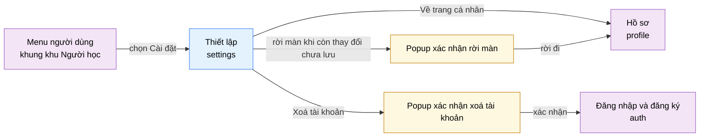

# Tài liệu thiết kế cơ bản (BD) — Thiết lập (`USR0503`)

## Phương châm tài liệu [Nội bộ — không cần khách duyệt]

- Viết theo **mẫu 9 sheet**. Bộ thẻ đóng, quy ước ID, ký hiệu chuẩn, ranh giới với tài liệu khác và
  checklist kiểm toán nằm ở `02-bd/_rules/bd-template-9sheet.md` — file này không chép lại.
- Phần gắn nhãn `[Nội bộ]` phục vụ sinh mã và tự kiểm toán, không phải yêu cầu của khách hàng: mục 4.5,
  mục 7.3 và các ghi chú quy ước.
- Mã màn `USR0503` theo bảng mã ở `02-bd/_rules/bd-template-9sheet.md` mục 8 dòng 149; tên file mang tiền
  tố mã.
- Khung điều hướng **không mô tả lại ở đây** — dùng chung `02-bd/screens/users/_shell.md`. Khu Người học
  dùng **header ngang dính trên, không có sidebar**, và màn này nằm trong **menu người dùng** chứ không
  phải nav chính [Nguồn: 02-bd/screens/users/_shell.md:24,62-64]. Chân trang cũng thuộc khung chung
  [Nguồn: 02-bd/screens/users/_shell.md:86-104].
- Màn này có **hai popup**: xác nhận xoá tài khoản và xác nhận rời màn khi còn thay đổi chưa lưu. Cả hai
  đều **không có trong prototype** — xem mục 4.4.

> Đọc cùng `01-rd/screens/users/USR0503_settings.md` (hành vi ở mức yêu cầu, không lặp lại ở đây),
> `01-rd/req/identity.md:197-202,231-238` (F1-16, F1-20, F1-21, F1-22), `01-rd/req/ai-review.md:103-107`
> (F5-28), `02-bd/database/identity.md` mục 1.1 và 1.12, `02-bd/security/identity.md` mục 3 và 4.
>
> **Không thiết kế** cấu hình ngôn ngữ **lập trình** cho phép nộp bài, hệ số giới hạn hay tham số sandbox —
> đó là màn `admin_language_config` (`ADM0501`) của quản trị viên
> [Nguồn: 02-bd/screens/admin/ADM0501_language_config.md:387-388]. Hai khái niệm **khác nhau hoàn toàn**:
> màn này đổi ngôn ngữ **giao diện** (i18n, vi/en) và chọn ngôn ngữ nộp bài **mặc định của cá nhân**; màn
> kia quyết định ngôn ngữ nộp bài nào được bật cho toàn hệ thống.
> **Không thiết kế** dữ liệu nhận dạng của người dùng — tên hiển thị, ảnh đại diện, email, mật khẩu, liên
> kết OAuth thuộc `profile` (`USR0502`). Ranh giới đã áp: `profile` giữ **dữ liệu nhận dạng**, `settings`
> giữ **tuỳ chọn hành vi ứng dụng**.
> **Không thiết kế** job gửi email nhắc luyện tập và báo cáo tuần — màn này chỉ bật/tắt; job thuộc
> `03-dd/jobs/identity.md`.
> **Không thiết kế** giao diện một phiên phỏng vấn — thuộc `mock_interview` (`USR0302`); màn này chỉ đặt
> tham số mặc định cho phiên tự luyện.

> **Quy ước đặt tên khối** [Nội bộ]. Mười khối, đặt tên theo **vai trò** chứ không theo vị trí trên màn —
> kế thừa quy ước chốt ở `USR0101` và dùng lại ở `USR0501`: `appearance` (nhóm Giao diện), `workspace`
> (nhóm Workspace), `interview` (nhóm Phỏng vấn giả lập), `notification` (nhóm Thông báo), `saveBar`
> (khối trạng thái và nút Lưu), `dataExport` (khối Dữ liệu của bạn), `profileShortcut` (lối tắt về hồ sơ),
> `dangerZone` (Vùng nguy hiểm), `deleteConfirm` (popup xác nhận xoá tài khoản), `leaveConfirm` (popup xác
> nhận rời màn). Tiền tố ID item của toàn màn là `settings.`. Tiền tố loại (`btn`, `link`) đặt ở **tên
> trường**, không ở tên khối.

---

## Sheet 1. Bìa

| Mục | Giá trị |
| :--- | :--- |
| Hệ thống | AlgoPrep |
| Phân hệ | `identity` (F1) — có phụ thuộc đọc/ghi sang `ai-review` (F5) cho nhóm Phỏng vấn giả lập, và đọc sang `judge-orchestration` (F4) khi xuất lượt nộp |
| Công đoạn | BD — Thiết kế cơ bản |
| Phân loại | Màn hình |
| Tên màn | Thiết lập |
| Mã màn hình | `USR0503` |
| Tên vật lý (slug) | `settings` |
| Trục tài liệu | Màn hình (`02-bd/screens/`) |
| Actor | A1 (`STUDENT`) |
| Phiên bản | V0.1 |
| Người tạo | Nhóm phát triển AlgoPrep |
| Ngày tạo | 2026/09/22 |
| Người cập nhật | Nhóm phát triển AlgoPrep |
| Ngày cập nhật | 2026/09/22 |

---

## Sheet 2. Lịch sử sửa đổi

| Ver | Sheet bị sửa | Nội dung sửa | Ngày | Người sửa |
| :--- | :--- | :--- | :--- | :--- |
| V0.1 | Toàn bộ | Tạo mới theo mẫu 9 sheet. Kế thừa quy ước cụm màn cá nhân từ `USR0501`: tiền tố ID `settings.`, tên khối theo vai trò, tiền tố nghiệp vụ `My` cho phạm vi khoá cứng theo người đăng nhập, suy giảm êm là điều kiện hiển thị chứ không phải thông báo lỗi. Chốt phần đặc thù: tách hai chế độ lưu (áp ngay theo thiết bị cho nhóm Giao diện, chờ nút Lưu cho ba nhóm còn lại), bổ sung hai popup mà prototype không có, sửa câu chữ Vùng nguy hiểm cho khớp F1-16. Phát hiện **sáu tuỳ chọn trên prototype chưa có cột lưu**. Phát sinh 11 câu hỏi mở | 2026/09/22 | Nhóm phát triển AlgoPrep |

---

## Sheet 3. Sơ đồ chuyển màn

> [Nội bộ] Quy ước vẽ: bố trí từ trái sang phải. Màn gọi tới tô tím, màn hiện tại tô xanh nhạt, popup tô
> vàng. Màu và `[Nguồn:]` dùng để truy vết, không phải yêu cầu của khách hàng.

### 3.1 Danh sách chuyển màn

#### Khung điều hướng khu Người học → Thiết lập

[Điều kiện mở] Mở menu người dùng trên header ngang rồi chọn mục "Cài đặt" (mục thứ tư trong năm mục)
[Nguồn: 02-bd/screens/users/_shell.md:62-64; 09-layoutBase/Cài đặt.dc.html:87].

[Chế độ mở] Không có.

[Thông tin truyền] Không có. Màn luôn làm việc trên tuỳ chọn của chính người đang đăng nhập, không nhận
tham số `user_id` từ bên ngoài.

[Giá trị trả về] Không có.

[Khi thành công] Tải bốn nhóm tuỳ chọn; nhóm Giao diện lấy giá trị từ bộ nhớ thiết bị nên hiển thị ngay,
ba nhóm còn lại chờ máy chủ trả về.

[Khi huỷ] Không có.

#### Thiết lập → Hồ sơ

[Điều kiện mở] Bấm liên kết "Về trang cá nhân" ở cuối cột phải
[Nguồn: 09-layoutBase/Cài đặt.dc.html:155].

[Chế độ mở] Không có.

[Thông tin truyền] Không có.

[Giá trị trả về] Không có.

[Khi thành công] Điều hướng sang màn `profile`. Còn thay đổi chưa lưu thì mở popup xác nhận rời màn trước
(EVT-14), không rời thẳng.

[Khi huỷ] Ở lại màn `settings`, giữ nguyên mọi thay đổi chưa lưu.

#### Thiết lập → Đăng nhập và đăng ký

[Điều kiện mở] Xác nhận xoá tài khoản thành công trong popup `deleteConfirm`.

[Chế độ mở] Không có.

[Thông tin truyền] Không có.

[Giá trị trả về] Không có.

[Khi thành công] Phiên đăng nhập bị chấm dứt, điều hướng sang màn `auth`. Mọi thay đổi chưa lưu trên màn
bị bỏ, **không** hỏi xác nhận lần hai — người dùng vừa xác nhận một hành động nặng hơn.

[Khi huỷ] Không có.

#### Thiết lập → Popup xác nhận xoá tài khoản

[Điều kiện mở] Bấm nút "Xoá tài khoản" trong khối Vùng nguy hiểm
[Nguồn: 09-layoutBase/Cài đặt.dc.html:131].

[Chế độ mở] Popup chặn thao tác nền.

[Thông tin truyền] Không có. Popup làm việc trên chính tài khoản đang đăng nhập.

[Giá trị trả về] Đã xác nhận hoặc đã huỷ.

[Khi thành công] Tài khoản chuyển `DEACTIVATED`, chuyển sang màn `auth`
[Nguồn: 02-bd/security/identity.md:60-62].

[Khi huỷ] Đóng popup, màn giữ nguyên trạng thái, không gọi máy chủ.

#### Thiết lập → Popup xác nhận rời màn

[Điều kiện mở] Rời màn bằng bất kỳ đường nào (mục nav, menu người dùng, liên kết "Về trang cá nhân", nút
lùi trình duyệt) trong lúc còn thay đổi chưa lưu ở ba nhóm Workspace, Phỏng vấn giả lập, Thông báo.

[Chế độ mở] Popup chặn thao tác nền.

[Thông tin truyền] Đích điều hướng đang chờ.

[Giá trị trả về] Ở lại hoặc rời đi.

[Khi thành công] Rời đi thì bỏ toàn bộ thay đổi chưa lưu và điều hướng tới đích đang chờ.

[Khi huỷ] Ở lại màn, giữ nguyên thay đổi chưa lưu.

### 3.2 Sơ đồ

[Nguồn: 09-layoutBase/Cài đặt.dc.html:87,131,155; 02-bd/screens/users/_shell.md:62-64]

---

## Sheet 4. Bố cục màn hình

### 4.1 Tổng quan màn

[Mục đích màn] Cho người học tự đặt **tuỳ chọn hành vi của ứng dụng**: giao diện sáng/tối và ngôn ngữ
giao diện, cách cư xử của vùng soạn code (F1-20), tham số mặc định của phiên phỏng vấn tự luyện (F5-28),
email định kỳ (F1-21), xuất dữ liệu cá nhân (F1-22) và tự xoá tài khoản (F1-16)
[Nguồn: 01-rd/req/identity.md:197-202,231-236; 01-rd/req/ai-review.md:103-107].

[Luồng nghiệp vụ chính]

1. **Hiển thị ban đầu**: nhóm Giao diện hiển thị ngay từ bộ nhớ thiết bị, không chờ máy chủ. Ba nhóm còn
   lại tải từ máy chủ; nhóm Phỏng vấn giả lập tải bằng một lời gọi riêng sang `ai-review`.
2. **Đổi tuỳ chọn Giao diện**: chọn Sáng/Tối hoặc Tiếng Việt/English thì áp **ngay lập tức** trên toàn bộ
   ứng dụng, không cần bấm Lưu và không gọi máy chủ
   [Nguồn: 01-rd/screens/users/USR0503_settings.md:94].
3. **Đổi tuỳ chọn ba nhóm còn lại**: giá trị mới chỉ nằm trong màn, chưa có hiệu lực thật cho tới khi bấm
   "Lưu cài đặt" [Nguồn: 01-rd/screens/users/USR0503_settings.md:95].
4. **Xuất dữ liệu**: bấm một trong hai nút để tải về tệp dữ liệu của chính mình.
5. **Xoá tài khoản**: bấm nút ở Vùng nguy hiểm, xác nhận trong popup, tài khoản chuyển `DEACTIVATED` ngay
   và phiên đăng nhập chấm dứt.

[Người dùng] Người học đã đăng nhập (`STUDENT`). Màn chỉ làm việc trên tuỳ chọn của chính người đang đăng
nhập.

[Tệp liên quan] Hai tệp **xuất ra**: lượt nộp dạng CSV và hội thoại phỏng vấn dạng JSON
[Nguồn: 09-layoutBase/Cài đặt.dc.html:269-272]. Màn **không** nhập tệp nào.

[Phạm vi]
- Đọc và ghi tuỳ chọn của chính người đăng nhập. Không có đường nào xem hay sửa tuỳ chọn của người khác.
- **Không** cấu hình ngôn ngữ lập trình được phép nộp bài, hệ số giới hạn hay tham số sandbox — việc của
  `admin_language_config` (`ADM0501`).
- **Không** sửa tên hiển thị, ảnh đại diện, email, mật khẩu hay liên kết OAuth — việc của `profile`.
- Nhóm Phỏng vấn giả lập lấy và ghi dữ liệu qua `ai-review` nên **phải suy giảm êm**: phân hệ AI hỏng thì
  ba nhóm còn lại vẫn xem và lưu được bình thường. Đây là ràng buộc bắt buộc của dự án, không phải lựa
  chọn thiết kế.

[Quyền sử dụng]
- Xem: được, với chính tuỳ chọn của mình.
- Thêm: không có bản ghi nào do người dùng tạo mới trực tiếp; dòng `notification_preferences` được tạo
  ngầm ở lần lưu đầu tiên.
- Sửa: được, với chính tuỳ chọn của mình.
- Xoá: không xoá bản ghi nào. "Xoá tài khoản" là **đổi trạng thái**, không phải xoá dòng
  [Nguồn: 02-bd/database/identity.md:28-30].

[Số bản ghi tối đa] Màn không có danh sách và không phân trang. Bốn nhóm cố định, tổng cộng 11 tuỳ chọn:
Giao diện 2, Workspace 4, Phỏng vấn giả lập 3, Thông báo 2
[Nguồn: 09-layoutBase/Cài đặt.dc.html:215-260].

[Nguồn: 01-rd/screens/users/USR0503_settings.md:36-43,94-96; 02-bd/database/identity.md:19,117]

### 4.2 DTO liên quan

- `MySettingsDto`
- `MyWorkspacePreferencesDto`
- `MyNotificationPreferencesDto`
- `MyInterviewPreferencesDto`
- `MyDataExportDto`

`[Suy luận]` — tên DTO do BD này đề xuất, `03-dd/api/identity.md` và `03-dd/api/ai-review.md` chốt lại.

### 4.3 Bảng dữ liệu liên quan (5)

| NO | Bảng | Ghi chú |
| --: | :--- | :--- |
| 1 | `identity.users` | [Nguồn: 02-bd/database/identity.md:11-24] |
| 2 | `identity.notification_preferences` | [Nguồn: 02-bd/database/identity.md:117] |
| 3 | `judge.submissions` | [Nguồn: 02-bd/database/judge-orchestration.md:8-34] |
| 4 | `ai.interview_sessions` | [Nguồn: 02-bd/database/ai-review.md:66-83] |
| 5 | `ai.interview_turns` | [Nguồn: 02-bd/database/ai-review.md:203-217] |

Màn **không** truy cập `judge.language_configs`: danh sách ba ngôn ngữ nộp bài là enum khoá cứng
`JAVA`/`CPP`/`PYTHON` [Nguồn: 02-bd/database/judge-orchestration.md:94], không phải danh mục tra cứu
động — xem Câu hỏi mở Q4.

### 4.4 Vùng bố cục

Đối chiếu `09-layoutBase/Cài đặt.dc.html` — bằng chứng bố cục chỉ-đọc, **không phải** design system cuối
cùng.

| Vùng | Vị trí trong prototype | Nội dung |
| :--- | :--- | :--- |
| Header ngang dính trên (khung chung khu Người học) | `:46-93` | Thương hiệu, 6 mục nav, **bộ chuyển Sáng/Tối và VI/EN**, menu người dùng đang mở với mục "Cài đặt" được tô sáng |
| Cột trái — bốn nhóm tuỳ chọn | `:97-122` | Một vòng lặp dựng bốn khối giống hệt nhau: tiêu đề nhóm, rồi từng dòng gồm tên tuỳ chọn, một câu mô tả, và một điều khiển bên phải (cụm nút phân đoạn hoặc công tắc) |
| Cột trái — Vùng nguy hiểm | `:124-133` | Viền cảnh báo, tiêu đề, câu mô tả hệ quả, nút "Xoá tài khoản" |
| Cột phải — Trạng thái và lưu | `:136-141` | Tiêu đề "Trạng thái", một câu nhắc chế độ lưu, nút "Lưu cài đặt" chiếm hết chiều ngang |
| Cột phải — Dữ liệu của bạn | `:143-153` | Hai nút xuất, mỗi nút có nhãn bên trái và định dạng tệp bên phải |
| Cột phải — Lối tắt hồ sơ | `:155` | Một liên kết "Về trang cá nhân" dạng nút viền |
| Chân trang (khung chung khu Người học) | Không có trong file này | Prototype của màn này **không dựng** `<footer>`; khung chung vẫn áp chân trang cho mọi màn của khu, đây là divergence có chủ đích đã ghi ở khung [Nguồn: 02-bd/screens/users/_shell.md:92-95] |

Bố cục hai cột `minmax(0, 1fr) 320px` (`:95`): cột trái chứa năm khối rộng, cột phải chứa ba khối hẹp.
Giữ nguyên cấu trúc này khi dựng Next.js; không quy định màu sắc, khoảng cách hay typography ở BD.

**Bốn điểm màn hình này khác prototype, cố ý:**

1. **Bổ sung popup xác nhận xoá tài khoản.** Prototype cho bấm thẳng nút "Xoá tài khoản" mà không có bước
   xác nhận nào (`:131` là một `<button>` không gắn `onClick`). RD lại yêu cầu rõ "Khi tôi xác nhận"
   [Nguồn: 01-rd/screens/users/USR0503_settings.md:96], và đây là hành động không hoàn tác được trong 30
   ngày ân hạn [Nguồn: 02-bd/security/identity.md:63]. BD này bổ sung popup.
2. **Bổ sung popup xác nhận rời màn.** Ba nhóm chờ nút Lưu nên màn có trạng thái "còn thay đổi chưa lưu";
   prototype không dựng đường rời màn nào nên không lộ ra vấn đề này. Không có popup thì thay đổi mất âm
   thầm.
3. **Sửa câu chữ Vùng nguy hiểm.** Prototype ghi "Xoá vĩnh viễn tài khoản cùng toàn bộ lượt nộp, bài đã
   lưu và phiên phỏng vấn" [Nguồn: 09-layoutBase/Cài đặt.dc.html:129] — **sai** so với F1-16 đã chốt: khoá
   mềm rồi ẩn danh hoá, dữ liệu không mất [Nguồn: 01-rd/req/identity.md:197-202]. RD đã chốt sửa câu chữ,
   đánh dấu **[Đợi nextjs]** [Nguồn: 01-rd/screens/users/USR0503_settings.md:78]. BD này ghi câu chữ đúng
   ở Sheet 5 Khu vực H NO 2 và không sửa file prototype.
4. **Bỏ hiển thị song ngữ đồng thời.** Prototype hiển thị cả nhãn tiếng Việt và tiếng Anh cạnh nhau. Đó là
   cách bản mẫu minh hoạ i18n, không phải yêu cầu hiển thị song ngữ cùng lúc — cùng kết luận đã ghi ở
   khung [Nguồn: 02-bd/screens/users/_shell.md:69-74].

**Bốn marker `[Đợi nextjs]` của RD** [Nguồn: 01-rd/screens/users/USR0503_settings.md:19,43,73,78] là hành
vi **cố ý hoãn tới lúc dựng UI thật**, không phải khoảng trống thiết kế: chi tiết trình bày thuần hình
thức của bốn nhóm tuỳ chọn, và câu chữ chính xác của Vùng nguy hiểm. BD này chốt **cấu trúc, nguồn dữ
liệu và chế độ lưu** của từng mục; câu chữ hiển thị cuối cùng chốt khi dựng Next.js.

### 4.5 Cấu trúc slice FSD [Nội bộ]

| Khối | Slice dự kiến | Căn cứ |
| :--- | :--- | :--- |
| Trang | `views/users/settings` | Quy ước FSD của dự án |
| Khung khu Người học | Dùng lại `widgets/app-shell` | `02-bd/screens/users/_shell.md` |
| Nhóm Giao diện | Dùng lại `features/theme-switch` + `features/locale-switch` của khung | Prototype `:60,63` và `:215-225` là **cùng một cặp điều khiển**, không dựng hai lần |
| Ba nhóm chờ nút Lưu | `widgets/settings-form` + `features/save-my-settings` | Prototype `:97-122`, `:136-141` |
| Xuất dữ liệu | `features/export-my-data` | Prototype `:143-153` |
| Vùng nguy hiểm và popup xác nhận | `features/deactivate-my-account` | Prototype `:124-133` |

`[Suy luận]` — ánh xạ slice do BD đề xuất, DD màn hình chốt lại. Điểm đáng chú ý: nhóm Giao diện **không
có slice riêng** — nó là cùng hai điều khiển mà khung đã có, chỉ trình bày ở dạng hàng đầy đủ thay vì
dạng nút nhỏ trên header.

> [Nội bộ] Ảnh minh hoạ đặt ở `08-diagram/02-bd/screens/users/`, chụp bằng Playwright trên ứng dụng
> Next.js thật khi đã có mã chạy được. Chưa có thì tham chiếu prototype, không vẽ tay.

---

## Sheet 5. Danh sách item màn hình

> Quy ước ID, bộ thẻ và giá trị chuẩn: `02-bd/_rules/bd-template-9sheet.md` mục 2, 3, 4.
>
> Mỗi dòng tuỳ chọn trong bốn nhóm đều có thêm **một câu mô tả tĩnh** bên dưới tên
> [Nguồn: 09-layoutBase/Cài đặt.dc.html:107]. Câu mô tả là nhãn tĩnh i18n, không lấy từ cột DB nào, nên
> không tách thành item riêng; nội dung ghi ở cột Ghi chú của chính tuỳ chọn đó.

### Khu vực A — Nhóm Giao diện

| Khu vực | NO | Tên item | ID item | Bảng DB | Cột DB | Loại UI | Kiểu | Độ dài | Bắt buộc | I/O | Giá trị mặc định | Định dạng | Ghi chú |
| :--- | --: | :--- | :--- | :--- | :--- | :--- | :--- | :--- | :-: | :-: | :--- | :--- | :--- |
| Nhóm Giao diện | | | | | | | | | | | | | |
| | 1 | Tiêu đề nhóm | `settings.appearance.title` | - | - | Label | String | - | - | O | Giao diện | - | Tiêu đề nhóm [Nguồn giá trị] Nhãn tĩnh i18n [Nguồn: 09-layoutBase/Cài đặt.dc.html:216] [EVT liên quan] - |
| | 2 | Chủ đề màu | `settings.appearance.theme` | - | - | Button | Enum | - | Có | I/O | Sáng | 2 nút phân đoạn | Hai lựa chọn "Sáng" / "Tối". Mô tả: "Áp cho toàn bộ màn hình và được ghi nhớ trên thiết bị này". Áp **ngay**, không chờ nút Lưu [Nguồn giá trị] Bộ nhớ thiết bị qua `next-themes`, **không phải cột DB** — `DEC-2026-0825-frontend-base-architecture` chốt `next-themes` với `defaultTheme="light"`; giá trị mặc định "Sáng" khớp `DEC-2026-0824-dark-light-theme`. Xem Câu hỏi mở Q2 [EVT liên quan] EVT-2 |
| | 3 | Ngôn ngữ giao diện | `settings.appearance.uiLanguage` | - | - | Button | Enum | - | Có | I/O | Tiếng Việt | 2 nút phân đoạn | Hai lựa chọn "Tiếng Việt" / "English". Mô tả: "Nội dung đề bài vẫn giữ ngôn ngữ gốc". Áp **ngay**, không chờ nút Lưu. **Không phải** ngôn ngữ nộp bài — xem NO 2 Khu vực B [Nguồn giá trị] Cookie `NEXT_LOCALE`, **không phải cột DB** — `DEC-2026-0825-frontend-base-architecture` chốt `next-intl` không có đoạn locale trên URL, locale lấy từ cookie. Tập giá trị vi/en theo `DEC-2026-0824-i18n-vi-en`. Xem Câu hỏi mở Q2 [EVT liên quan] EVT-3 |

### Khu vực B — Nhóm Workspace

| Khu vực | NO | Tên item | ID item | Bảng DB | Cột DB | Loại UI | Kiểu | Độ dài | Bắt buộc | I/O | Giá trị mặc định | Định dạng | Ghi chú |
| :--- | --: | :--- | :--- | :--- | :--- | :--- | :--- | :--- | :-: | :-: | :--- | :--- | :--- |
| Nhóm Workspace | | | | | | | | | | | | | |
| | 1 | Tiêu đề nhóm | `settings.workspace.title` | - | - | Label | String | - | - | O | Workspace | - | Tiêu đề nhóm [Nguồn giá trị] Nhãn tĩnh i18n [Nguồn: 09-layoutBase/Cài đặt.dc.html:227] [EVT liên quan] - |
| | 2 | Ngôn ngữ mặc định | `settings.workspace.defaultLanguage` | `identity.users` | `default_language` | Button | Enum | - | Có | I/O | Python 3 | 3 nút phân đoạn | Ngôn ngữ **nộp bài** được chọn sẵn khi mở một bài toán. Mô tả: "Được chọn sẵn khi mở một bài toán". Chờ nút Lưu [Nguồn giá trị] Cột `default_language` [Nguồn: 02-bd/database/identity.md:19]. Tập giá trị là enum khoá cứng `JAVA`/`CPP`/`PYTHON` [Nguồn: 02-bd/database/judge-orchestration.md:94], nhãn hiển thị "Java 21" / "C++ 17" / "Python 3" là nhãn tĩnh i18n [Nguồn: 09-layoutBase/Cài đặt.dc.html:232]. Giá trị mặc định "Python 3" lấy từ prototype [Nguồn: 09-layoutBase/Cài đặt.dc.html:165] — xem Câu hỏi mở Q4 [EVT liên quan] EVT-4 |
| | 3 | Cỡ chữ editor | `settings.workspace.editorFontSize` | - | - | Button | Enum | - | Có | I/O | 14 | 3 nút phân đoạn | Ba lựa chọn "13" / "14" / "16". Mô tả: "Chỉ áp cho vùng soạn code". Chờ nút Lưu [Nguồn giá trị] **Chưa có cột lưu.** F1-20 yêu cầu lưu theo tài khoản [Nguồn: 01-rd/req/identity.md:231-232] nhưng `02-bd/database/identity.md` mục 1.1 và 1.12 không có cột nào cho giá trị này — **đây là một câu hỏi mở, không phải thiết kế đã chốt**, xem Câu hỏi mở Q1 [EVT liên quan] EVT-4 |
| | 4 | Tự lưu bản nháp | `settings.workspace.autosaveDraft` | - | - | Toggle | Boolean | - | Có | I/O | Bật | Công tắc | Mô tả: "Giữ lại code chưa nộp của từng bài, tải lại trang không mất". Chờ nút Lưu [Nguồn giá trị] **Chưa có cột lưu** — xem Câu hỏi mở Q1. Giá trị mặc định "Bật" lấy từ prototype [Nguồn: 09-layoutBase/Cài đặt.dc.html:165] [EVT liên quan] EVT-4 |
| | 5 | Phím tắt Vim | `settings.workspace.vimMode` | - | - | Toggle | Boolean | - | Có | I/O | Tắt | Công tắc | Mô tả: "Áp dụng trong vùng soạn code". Chờ nút Lưu [Nguồn giá trị] **Chưa có cột lưu** — xem Câu hỏi mở Q1. Giá trị mặc định "Tắt" lấy từ prototype [Nguồn: 09-layoutBase/Cài đặt.dc.html:165] [EVT liên quan] EVT-4 |

### Khu vực C — Nhóm Phỏng vấn giả lập

| Khu vực | NO | Tên item | ID item | Bảng DB | Cột DB | Loại UI | Kiểu | Độ dài | Bắt buộc | I/O | Giá trị mặc định | Định dạng | Ghi chú |
| :--- | --: | :--- | :--- | :--- | :--- | :--- | :--- | :--- | :-: | :-: | :--- | :--- | :--- |
| Nhóm Phỏng vấn giả lập | | | | | | | | | | | | | |
| | 1 | Tiêu đề nhóm | `settings.interview.title` | - | - | Label | String | - | - | O | Phỏng vấn giả lập | - | Tiêu đề nhóm [Nguồn giá trị] Nhãn tĩnh i18n [Nguồn: 09-layoutBase/Cài đặt.dc.html:240] [EVT liên quan] - |
| | 2 | Mức người phỏng vấn | `settings.interview.interviewerLevel` | `identity.user_preferences` | `preferred_interview_level` | Button | Enum | - | Có | I/O | Middle | 4 nút phân đoạn | Bốn lựa chọn "Intern" / "Junior" / "Middle" / "Senior" (`DEC-2026-0922-users-and-admin-conflict-resolutions`). Mô tả: "Quyết định độ sâu của các câu hỏi truy vấn". Chờ nút Lưu [Nguồn giá trị] Cột `preferred_interview_level` trong bảng `identity.user_preferences` [Nguồn: 02-bd/database/identity.md:118]. Khớp 4 mức enum toàn hệ thống: `INTERN`/`JUNIOR`/`MIDDLE`/`SENIOR` [EVT liên quan] EVT-5 |
| | 3 | Số lượt tối đa mỗi phiên | `settings.interview.maxTurns` | - | - | Button | Enum | - | Có | I/O | 12 | 3 nút phân đoạn | Ba lựa chọn "8" / "12" / "16". Mô tả: "Đến giới hạn này phiên sẽ kết và trả nhận xét". Chờ nút Lưu [Nguồn giá trị] **Chưa có cột lưu giá trị mặc định theo người dùng**; cột phiên tương ứng là `ai.interview_sessions.max_turns` [Nguồn: 02-bd/database/ai-review.md:76]. Ba giá trị 8/12/16 lấy từ prototype [Nguồn: 09-layoutBase/Cài đặt.dc.html:246]. Xem Câu hỏi mở Q1 [EVT liên quan] EVT-5 |
| | 4 | Cho phép gợi ý | `settings.interview.hintAllowed` | - | - | Toggle | Boolean | - | Có | I/O | Bật | Công tắc | Mô tả: "Người phỏng vấn có thể gợi ý khi bạn bị bí". Chờ nút Lưu [Nguồn giá trị] **Chưa có cột lưu giá trị mặc định theo người dùng**; cột phiên tương ứng là `ai.interview_sessions.hint_allowed` [Nguồn: 02-bd/database/ai-review.md:77]. Xem Câu hỏi mở Q1 [EVT liên quan] EVT-5 |
| | 5 | Dòng phạm vi áp dụng | `settings.interview.scopeNote` | - | - | Label | String | 140 | - | O | - | Câu tĩnh | Câu nói rõ ba tuỳ chọn trên **chỉ áp cho phiên tự luyện**, không áp cho phiên mở từ một bài nộp `Accepted` [Nguồn giá trị] Nhãn tĩnh i18n, nội dung "Ba tuỳ chọn này chỉ áp cho phiên bạn tự mở từ ngân hàng câu hỏi hoặc từ chủ đề tự chọn. Phiên mở từ một bài nộp Accepted luôn dùng tham số chuẩn." Căn cứ F5-28 [Nguồn: 01-rd/req/ai-review.md:105-107]. Prototype **không có** câu này, BD bổ sung vì thiếu nó người dùng hiểu sai phạm vi [EVT liên quan] - |
| | 6 | Dòng suy giảm khi AI hỏng | `settings.interview.degradedNotice` | - | - | Label | String | 140 | - | O | - | Câu tĩnh | Câu thay thế toàn bộ nội dung nhóm khi `ai-review` không phản hồi [Nguồn giá trị] Nhãn tĩnh i18n, nội dung "Chưa lấy được tuỳ chọn phỏng vấn giả lập. Các nhóm còn lại vẫn xem và lưu được bình thường." [EVT liên quan] EVT-1 |

### Khu vực D — Nhóm Thông báo

| Khu vực | NO | Tên item | ID item | Bảng DB | Cột DB | Loại UI | Kiểu | Độ dài | Bắt buộc | I/O | Giá trị mặc định | Định dạng | Ghi chú |
| :--- | --: | :--- | :--- | :--- | :--- | :--- | :--- | :--- | :-: | :-: | :--- | :--- | :--- |
| Nhóm Thông báo | | | | | | | | | | | | | |
| | 1 | Tiêu đề nhóm | `settings.notification.title` | - | - | Label | String | - | - | O | Thông báo | - | Tiêu đề nhóm [Nguồn giá trị] Nhãn tĩnh i18n [Nguồn: 09-layoutBase/Cài đặt.dc.html:253] [EVT liên quan] - |
| | 2 | Nhắc luyện tập | `settings.notification.streakReminder` | `identity.notification_preferences` | `streak_reminder_enabled` | Toggle | Boolean | - | Có | I/O | Bật | Công tắc | Mô tả: "Một email mỗi ngày khi chuỗi ngày luyện tập sắp mất". Chờ nút Lưu [Nguồn giá trị] Cột `streak_reminder_enabled` [Nguồn: 02-bd/database/identity.md:117], phục vụ F1-21 [Nguồn: 01-rd/req/identity.md:233-234] [EVT liên quan] EVT-6 |
| | 3 | Báo cáo hằng tuần | `settings.notification.weeklyReport` | `identity.notification_preferences` | `weekly_report_enabled` | Toggle | Boolean | - | Có | I/O | Tắt | Công tắc | Mô tả: "Tiến độ theo chủ đề, gửi vào thứ Hai". Chờ nút Lưu [Nguồn giá trị] Cột `weekly_report_enabled` [Nguồn: 02-bd/database/identity.md:117]. Giá trị mặc định "Tắt" lấy từ prototype [Nguồn: 09-layoutBase/Cài đặt.dc.html:167] [EVT liên quan] EVT-6 |

### Khu vực E — Khối trạng thái và lưu

| Khu vực | NO | Tên item | ID item | Bảng DB | Cột DB | Loại UI | Kiểu | Độ dài | Bắt buộc | I/O | Giá trị mặc định | Định dạng | Ghi chú |
| :--- | --: | :--- | :--- | :--- | :--- | :--- | :--- | :--- | :-: | :-: | :--- | :--- | :--- |
| Khối trạng thái và lưu | | | | | | | | | | | | | |
| | 1 | Tiêu đề khối | `settings.saveBar.title` | - | - | Label | String | - | - | O | Trạng thái | - | Tiêu đề khối [Nguồn giá trị] Nhãn tĩnh i18n [Nguồn: 09-layoutBase/Cài đặt.dc.html:138] [EVT liên quan] - |
| | 2 | Câu trạng thái | `settings.saveBar.hint` | - | - | Label | String | 120 | - | O | - | Câu tĩnh, ba biến thể | Câu nhắc chế độ lưu, đổi theo trạng thái màn [Công thức] Chưa có thay đổi chưa lưu: "Chủ đề màu và ngôn ngữ áp ngay; các mục còn lại lưu bằng nút bên dưới." Có thay đổi chưa lưu: "Bạn có thay đổi chưa lưu." Vừa lưu xong: "Đã áp cài đặt cho tài khoản này." Ba câu là nhãn tĩnh i18n [Nguồn: 09-layoutBase/Cài đặt.dc.html:264-267]; biến thể giữa là BD bổ sung, prototype chỉ có hai [EVT liên quan] EVT-4, EVT-5, EVT-6, EVT-7 |
| | 3 | Lưu cài đặt | `settings.saveBar.btnSave` | - | - | Button | - | - | - | I | - | Lưu cài đặt | Ghi ba nhóm Workspace, Phỏng vấn giả lập, Thông báo trong một lần bấm. **Không** ghi nhóm Giao diện [Nguồn giá trị] Nhãn tĩnh i18n; đổi thành "Đã lưu" sau khi lưu thành công [Nguồn: 09-layoutBase/Cài đặt.dc.html:263] [EVT liên quan] EVT-7 |

### Khu vực F — Khối xuất dữ liệu

| Khu vực | NO | Tên item | ID item | Bảng DB | Cột DB | Loại UI | Kiểu | Độ dài | Bắt buộc | I/O | Giá trị mặc định | Định dạng | Ghi chú |
| :--- | --: | :--- | :--- | :--- | :--- | :--- | :--- | :--- | :-: | :-: | :--- | :--- | :--- |
| Khối xuất dữ liệu | | | | | | | | | | | | | |
| | 1 | Tiêu đề khối | `settings.dataExport.title` | - | - | Label | String | - | - | O | Dữ liệu của bạn | - | Tiêu đề khối [Nguồn giá trị] Nhãn tĩnh i18n [Nguồn: 09-layoutBase/Cài đặt.dc.html:144] [EVT liên quan] - |
| | 2 | Xuất lượt nộp | `settings.dataExport.btnExportSubmissions` | `judge.submissions` | - | Button | - | - | - | I | - | Xuất lượt nộp · CSV | Tải về toàn bộ lượt nộp của chính người đăng nhập dạng CSV (F1-22) [Nguồn giá trị] Nhãn tĩnh i18n kèm nhãn định dạng "CSV" [Nguồn: 09-layoutBase/Cài đặt.dc.html:270]; dữ liệu đọc từ `judge.submissions` qua cổng ra [Nguồn: 02-bd/database/judge-orchestration.md:8-34]. Tập cột của tệp CSV chưa chốt — xem Câu hỏi mở Q5 [EVT liên quan] EVT-8 |
| | 3 | Xuất hội thoại phỏng vấn | `settings.dataExport.btnExportInterviews` | `ai.interview_turns` | - | Button | - | - | - | I | - | Xuất hội thoại phỏng vấn · JSON | Tải về toàn bộ hội thoại phỏng vấn của chính người đăng nhập dạng JSON (F1-22) [Nguồn giá trị] Nhãn tĩnh i18n kèm nhãn định dạng "JSON" [Nguồn: 09-layoutBase/Cài đặt.dc.html:271]; dữ liệu đọc từ `ai.interview_turns` ghép `ai.interview_sessions` qua cổng ra [Nguồn: 02-bd/database/ai-review.md:203-217] [EVT liên quan] EVT-9 |

### Khu vực G — Lối tắt hồ sơ

| Khu vực | NO | Tên item | ID item | Bảng DB | Cột DB | Loại UI | Kiểu | Độ dài | Bắt buộc | I/O | Giá trị mặc định | Định dạng | Ghi chú |
| :--- | --: | :--- | :--- | :--- | :--- | :--- | :--- | :--- | :-: | :-: | :--- | :--- | :--- |
| Lối tắt hồ sơ | | | | | | | | | | | | | |
| | 1 | Về trang cá nhân | `settings.profileShortcut.linkProfile` | - | - | Link | - | - | - | I | - | Về trang cá nhân | Điều hướng sang màn `profile` [Nguồn giá trị] Nhãn tĩnh i18n [Nguồn: 09-layoutBase/Cài đặt.dc.html:155] [EVT liên quan] EVT-10 |

### Khu vực H — Vùng nguy hiểm

| Khu vực | NO | Tên item | ID item | Bảng DB | Cột DB | Loại UI | Kiểu | Độ dài | Bắt buộc | I/O | Giá trị mặc định | Định dạng | Ghi chú |
| :--- | --: | :--- | :--- | :--- | :--- | :--- | :--- | :--- | :-: | :-: | :--- | :--- | :--- |
| Vùng nguy hiểm | | | | | | | | | | | | | |
| | 1 | Tiêu đề khối | `settings.dangerZone.title` | - | - | Label | String | - | - | O | Vùng nguy hiểm | - | Tiêu đề khối [Nguồn giá trị] Nhãn tĩnh i18n [Nguồn: 09-layoutBase/Cài đặt.dc.html:125] [EVT liên quan] - |
| | 2 | Câu mô tả hệ quả | `settings.dangerZone.consequenceText` | - | - | Label | String | 200 | - | O | - | Câu tĩnh | Câu nói đúng hệ quả thật của F1-16 [Nguồn giá trị] Nhãn tĩnh i18n, nội dung "Tài khoản chuyển sang trạng thái ngừng hoạt động ngay và bạn không đăng nhập lại được. Sau 30 ngày, thông tin định danh của bạn được ẩn danh hoá; lượt nộp, bài đã lưu và phiên phỏng vấn vẫn được giữ lại." Số 30 ngày lấy từ [Nguồn: 02-bd/security/identity.md:63]. **Thay cho** câu sai của prototype [Nguồn: 09-layoutBase/Cài đặt.dc.html:129], theo chốt của RD [Nguồn: 01-rd/screens/users/USR0503_settings.md:78] [EVT liên quan] - |
| | 3 | Xoá tài khoản | `settings.dangerZone.btnDelete` | - | - | Button | - | - | - | I | - | Xoá tài khoản | Mở popup xác nhận, **không** gọi máy chủ ngay [Nguồn giá trị] Nhãn tĩnh i18n [Nguồn: 09-layoutBase/Cài đặt.dc.html:131] [EVT liên quan] EVT-11 |

### Khu vực I — Popup xác nhận xoá tài khoản

| Khu vực | NO | Tên item | ID item | Bảng DB | Cột DB | Loại UI | Kiểu | Độ dài | Bắt buộc | I/O | Giá trị mặc định | Định dạng | Ghi chú |
| :--- | --: | :--- | :--- | :--- | :--- | :--- | :--- | :--- | :-: | :-: | :--- | :--- | :--- |
| Popup xác nhận xoá tài khoản | | | | | | | | | | | | | |
| | 1 | Tiêu đề popup | `settings.deleteConfirm.title` | - | - | Label | String | - | - | O | Xác nhận xoá tài khoản | - | Tiêu đề popup [Nguồn giá trị] Nhãn tĩnh i18n. Popup là phần BD bổ sung, prototype không có — xem mục 4.4 [EVT liên quan] EVT-11 |
| | 2 | Câu mô tả hệ quả | `settings.deleteConfirm.consequenceText` | - | - | Label | String | 200 | - | O | - | Câu tĩnh | Nhắc lại đúng nội dung Khu vực H NO 2, để người dùng không phải nhớ lại câu vừa đọc [Nguồn giá trị] Cùng nhãn tĩnh i18n với Khu vực H NO 2 [EVT liên quan] - |
| | 3 | Ô nhập xác nhận | `settings.deleteConfirm.confirmPhrase` | - | - | TextBox | String | 80 | Có | I | rỗng | Chuỗi đúng nguyên văn | Người dùng gõ lại email của chính mình để mở khoá nút xác nhận. Không dùng mật khẩu vì tài khoản chỉ đăng ký qua OAuth có thể chưa từng có mật khẩu [Nguồn: 02-bd/database/identity.md:15] — xem Câu hỏi mở Q7 [Nguồn giá trị] So khớp với `identity.users.email` của chính người đăng nhập [Nguồn: 02-bd/database/identity.md:13], so khớp thực hiện ở phía máy chủ [EVT liên quan] EVT-12 |
| | 4 | Huỷ | `settings.deleteConfirm.btnCancel` | - | - | Button | - | - | - | I | - | Huỷ | Đóng popup, không gọi máy chủ [Nguồn giá trị] Nhãn tĩnh i18n [EVT liên quan] EVT-13 |
| | 5 | Xác nhận xoá | `settings.deleteConfirm.btnConfirm` | `identity.users` | `status`, `deactivated_at` | Button | - | - | - | I | - | Xoá tài khoản của tôi | Gọi nghiệp vụ huỷ kích hoạt tài khoản [Nguồn giá trị] Nhãn tĩnh i18n; hệ quả ghi vào `status` và `deactivated_at` [Nguồn: 02-bd/database/identity.md:22-23] [EVT liên quan] EVT-12 |

### Khu vực J — Popup xác nhận rời màn

| Khu vực | NO | Tên item | ID item | Bảng DB | Cột DB | Loại UI | Kiểu | Độ dài | Bắt buộc | I/O | Giá trị mặc định | Định dạng | Ghi chú |
| :--- | --: | :--- | :--- | :--- | :--- | :--- | :--- | :--- | :-: | :-: | :--- | :--- | :--- |
| Popup xác nhận rời màn | | | | | | | | | | | | | |
| | 1 | Tiêu đề popup | `settings.leaveConfirm.title` | - | - | Label | String | - | - | O | Thay đổi chưa lưu | - | Tiêu đề popup [Nguồn giá trị] Nhãn tĩnh i18n. Popup là phần BD bổ sung, prototype không có — xem mục 4.4 [EVT liên quan] EVT-14 |
| | 2 | Nội dung | `settings.leaveConfirm.message` | - | - | Label | String | 140 | - | O | - | Câu tĩnh | Câu cảnh báo [Nguồn giá trị] Nhãn tĩnh i18n, nội dung "Bạn có thay đổi chưa lưu ở nhóm Workspace, Phỏng vấn giả lập hoặc Thông báo. Rời màn bây giờ thì các thay đổi đó bị bỏ." [EVT liên quan] - |
| | 3 | Ở lại | `settings.leaveConfirm.btnStay` | - | - | Button | - | - | - | I | - | Ở lại | Đóng popup, giữ nguyên thay đổi chưa lưu [Nguồn giá trị] Nhãn tĩnh i18n [EVT liên quan] EVT-14 |
| | 4 | Rời đi | `settings.leaveConfirm.btnLeave` | - | - | Button | - | - | - | I | - | Rời đi | Bỏ thay đổi chưa lưu và điều hướng tới đích đang chờ [Nguồn giá trị] Nhãn tĩnh i18n [EVT liên quan] EVT-14 |

[Nguồn: 09-layoutBase/Cài đặt.dc.html:125-131,138-144,155,163-167,215-260,263-272; 02-bd/database/identity.md:19,117; 02-bd/database/ai-review.md:75-77]

---

## Sheet 6. Đặc tả điều khiển item

> Ký hiệu cột `Hiển thị` và thứ tự thẻ: `02-bd/_rules/bd-template-9sheet.md` mục 2, 3. Dùng đúng NO, tên
> item và thứ tự của Sheet 5. Lỗi nhập liệu ghi ở Sheet 9, xử lý nghiệp vụ ghi ở Sheet 8.

### Khu vực A — Nhóm Giao diện

| Khu vực | NO | Tên item | Hiển thị | Ghi chú |
| :--- | --: | :--- | :-: | :--- |
| Nhóm Giao diện | | | | |
| | 1 | Tiêu đề nhóm | Có | - |
| | 2 | Chủ đề màu | Có | [Điều kiện kích hoạt] Luôn kích hoạt, kể cả khi ba nhóm còn lại đang tải hoặc đang lỗi — nhóm này không phụ thuộc máy chủ. [Tự động đặt] Nút đang chọn được tô sáng ngay khi bấm; giá trị đọc lại từ bộ nhớ thiết bị ở mỗi lần vào màn. |
| | 3 | Ngôn ngữ giao diện | Có | [Điều kiện kích hoạt] Luôn kích hoạt, cùng lý do NO 2. [Tự động đặt] Đổi giá trị thì toàn bộ nhãn trên màn đổi ngôn ngữ ngay, **không** tải lại trang và **không** đổi đường dẫn — đúng cơ chế đã chốt ở `DEC-2026-0825-frontend-base-architecture`. |

### Khu vực B — Nhóm Workspace

| Khu vực | NO | Tên item | Hiển thị | Ghi chú |
| :--- | --: | :--- | :-: | :--- |
| Nhóm Workspace | | | | |
| | 1 | Tiêu đề nhóm | Có | - |
| | 2 | Ngôn ngữ mặc định | Có | [Điều kiện hiển thị] Trong lúc tải hiển thị khung chờ tại chỗ đúng kích thước cụm nút. [Điều kiện kích hoạt] Không kích hoạt trong lúc nhóm đang tải hoặc đang gửi lưu. |
| | 3 | Cỡ chữ editor | Có | [Điều kiện hiển thị] Như NO 2. [Điều kiện kích hoạt] Như NO 2. |
| | 4 | Tự lưu bản nháp | Có | [Điều kiện hiển thị] Như NO 2. [Điều kiện kích hoạt] Như NO 2. |
| | 5 | Phím tắt Vim | Có | [Điều kiện hiển thị] Như NO 2. [Điều kiện kích hoạt] Như NO 2. |

### Khu vực C — Nhóm Phỏng vấn giả lập

| Khu vực | NO | Tên item | Hiển thị | Ghi chú |
| :--- | --: | :--- | :-: | :--- |
| Nhóm Phỏng vấn giả lập | | | | |
| | 1 | Tiêu đề nhóm | Có | - |
| | 2 | Mức người phỏng vấn | Điều kiện | [Điều kiện hiển thị] Ẩn khi nhóm đang ở trạng thái suy giảm (NO 6 đang hiển thị). [Điều kiện kích hoạt] Không kích hoạt trong lúc nhóm đang tải hoặc đang gửi lưu. |
| | 3 | Số lượt tối đa mỗi phiên | Điều kiện | [Điều kiện hiển thị] Như NO 2. [Điều kiện kích hoạt] Như NO 2. |
| | 4 | Cho phép gợi ý | Điều kiện | [Điều kiện hiển thị] Như NO 2. [Điều kiện kích hoạt] Như NO 2. |
| | 5 | Dòng phạm vi áp dụng | Điều kiện | [Điều kiện hiển thị] Ẩn khi nhóm đang ở trạng thái suy giảm; hiển thị trong mọi trường hợp còn lại. |
| | 6 | Dòng suy giảm khi AI hỏng | Điều kiện | [Điều kiện hiển thị] Chỉ hiển thị khi lời gọi `GetMyInterviewPreferences` thất bại hoặc quá hạn chờ. Không có nút "Thử lại" ở nhóm này: người dùng không sửa được sự cố của phân hệ AI, và nút thử lại chỉ khuyến khích gọi lặp vào một dịch vụ đang hỏng — cùng quy ước đã áp ở `USR0501` Khu vực F [Nguồn: 02-bd/screens/users/USR0501_my_progress.md:446]. |

### Khu vực D — Nhóm Thông báo

| Khu vực | NO | Tên item | Hiển thị | Ghi chú |
| :--- | --: | :--- | :-: | :--- |
| Nhóm Thông báo | | | | |
| | 1 | Tiêu đề nhóm | Có | - |
| | 2 | Nhắc luyện tập | Có | [Điều kiện hiển thị] Trong lúc tải hiển thị khung chờ tại chỗ đúng kích thước công tắc. [Điều kiện kích hoạt] Không kích hoạt trong lúc nhóm đang tải hoặc đang gửi lưu. [Tự động đặt] Người dùng chưa có dòng `notification_preferences` thì công tắc hiển thị theo giá trị mặc định ở Sheet 5, dòng được tạo ở lần lưu đầu tiên. |
| | 3 | Báo cáo hằng tuần | Có | [Điều kiện hiển thị] Như NO 2. [Điều kiện kích hoạt] Như NO 2. [Tự động đặt] Như NO 2. |

### Khu vực E — Khối trạng thái và lưu

| Khu vực | NO | Tên item | Hiển thị | Ghi chú |
| :--- | --: | :--- | :-: | :--- |
| Khối trạng thái và lưu | | | | |
| | 1 | Tiêu đề khối | Có | - |
| | 2 | Câu trạng thái | Có | [Tự động đặt] Đổi sang biến thể "Bạn có thay đổi chưa lưu" ngay khi một tuỳ chọn của ba nhóm chờ Lưu bị đổi; đổi sang biến thể "Đã áp cài đặt cho tài khoản này" sau khi lưu thành công; quay lại biến thể mặc định khi vào màn lần sau. |
| | 3 | Lưu cài đặt | Điều kiện | [Điều kiện hiển thị] Luôn hiển thị. [Điều kiện kích hoạt] Chỉ kích hoạt khi có ít nhất một thay đổi chưa lưu **và** không có lời gọi lưu nào đang chạy. Không có thay đổi thì nút ở trạng thái không kích hoạt, nhãn giữ "Lưu cài đặt". [Tự động đặt] Trong lúc gửi, nhãn đổi sang trạng thái đang xử lý; lưu xong đổi sang "Đã lưu" rồi trở lại "Lưu cài đặt" ở lần đổi tiếp theo. |

### Khu vực F — Khối xuất dữ liệu

| Khu vực | NO | Tên item | Hiển thị | Ghi chú |
| :--- | --: | :--- | :-: | :--- |
| Khối xuất dữ liệu | | | | |
| | 1 | Tiêu đề khối | Có | - |
| | 2 | Xuất lượt nộp | Có | [Điều kiện kích hoạt] Không kích hoạt trong lúc chính lời gọi xuất đó đang chạy; **vẫn kích hoạt** khi ba nhóm tuỳ chọn đang tải hoặc đang lỗi, vì hai việc không liên quan nhau. |
| | 3 | Xuất hội thoại phỏng vấn | Có | [Điều kiện kích hoạt] Như NO 2. Người dùng chưa có phiên phỏng vấn nào thì nút vẫn kích hoạt và tệp trả về là một mảng rỗng — **không** ẩn nút, vì ẩn nút sẽ để lộ việc người dùng chưa từng phỏng vấn ngay trên màn cài đặt mà không giải thích gì. |

### Khu vực G — Lối tắt hồ sơ

| Khu vực | NO | Tên item | Hiển thị | Ghi chú |
| :--- | --: | :--- | :-: | :--- |
| Lối tắt hồ sơ | | | | |
| | 1 | Về trang cá nhân | Có | [Điều kiện kích hoạt] Luôn kích hoạt. Còn thay đổi chưa lưu thì mở popup xác nhận rời màn trước, không rời thẳng. |

### Khu vực H — Vùng nguy hiểm

| Khu vực | NO | Tên item | Hiển thị | Ghi chú |
| :--- | --: | :--- | :-: | :--- |
| Vùng nguy hiểm | | | | |
| | 1 | Tiêu đề khối | Có | - |
| | 2 | Câu mô tả hệ quả | Có | - |
| | 3 | Xoá tài khoản | Có | [Điều kiện kích hoạt] Luôn kích hoạt, kể cả khi ba nhóm tuỳ chọn đang lỗi — người dùng phải xoá được tài khoản kể cả khi một phần màn hỏng. |

### Khu vực I — Popup xác nhận xoá tài khoản

| Khu vực | NO | Tên item | Hiển thị | Ghi chú |
| :--- | --: | :--- | :-: | :--- |
| Popup xác nhận xoá tài khoản | | | | |
| | 1 | Tiêu đề popup | Điều kiện | [Điều kiện hiển thị] Chỉ hiển thị khi popup đang mở. |
| | 2 | Câu mô tả hệ quả | Điều kiện | [Điều kiện hiển thị] Như NO 1. |
| | 3 | Ô nhập xác nhận | Điều kiện | [Điều kiện hiển thị] Như NO 1. [Điều kiện kích hoạt] Kích hoạt khi popup mở và chưa gửi lời gọi huỷ kích hoạt. [Tự động đặt] Ô rỗng mỗi lần mở popup, không nhớ giá trị lần trước. |
| | 4 | Huỷ | Điều kiện | [Điều kiện hiển thị] Như NO 1. [Điều kiện kích hoạt] Luôn kích hoạt khi popup mở, kể cả khi lời gọi đang chạy. |
| | 5 | Xác nhận xoá | Điều kiện | [Điều kiện hiển thị] Như NO 1. [Điều kiện kích hoạt] Chỉ kích hoạt khi giá trị ở NO 3 khớp email của chính người đăng nhập; kiểm sơ bộ ở màn để mở khoá nút, kiểm quyết định vẫn ở máy chủ. |

### Khu vực J — Popup xác nhận rời màn

| Khu vực | NO | Tên item | Hiển thị | Ghi chú |
| :--- | --: | :--- | :-: | :--- |
| Popup xác nhận rời màn | | | | |
| | 1 | Tiêu đề popup | Điều kiện | [Điều kiện hiển thị] Chỉ hiển thị khi có thay đổi chưa lưu **và** người dùng vừa kích hoạt một đường rời màn. |
| | 2 | Nội dung | Điều kiện | [Điều kiện hiển thị] Như NO 1. |
| | 3 | Ở lại | Điều kiện | [Điều kiện hiển thị] Như NO 1. [Điều kiện kích hoạt] Luôn kích hoạt khi popup mở. |
| | 4 | Rời đi | Điều kiện | [Điều kiện hiển thị] Như NO 1. [Điều kiện kích hoạt] Luôn kích hoạt khi popup mở. |

[Nguồn: 09-layoutBase/Cài đặt.dc.html:263-267; 01-rd/screens/users/USR0503_settings.md:94-95]

---

## Sheet 7. Danh sách truyền dữ liệu

### 7.1 Trường DTO

| NO | DTO | Trường DTO | Kiểu | Bảng DB | Cột DB | Item màn | Hiển thị | Ghi chú |
| --: | :--- | :--- | :--- | :--- | :--- | :--- | :-: | :--- |
| 1 | `MySettingsDto` | `workspace` | Object | - | - | Toàn bộ Khu vực B | Có | [Nguồn] Phản hồi của `GetMySettings` [Chuyển đổi] Gói bốn tuỳ chọn Workspace thành một đối tượng con để `UpdateMySettings` nhận lại đúng hình dạng đó. |
| 2 | `MySettingsDto` | `notification` | Object | - | - | Toàn bộ Khu vực D | Có | [Nguồn] Phản hồi của `GetMySettings`. |
| 3 | `MyWorkspacePreferencesDto` | `defaultLanguage` | Enum | `identity.users` | `default_language` | Workspace "Ngôn ngữ mặc định" | Có | [Chuyển đổi] Giá trị truyền là mã enum `JAVA`/`CPP`/`PYTHON`; nhãn "Java 21"/"C++ 17"/"Python 3" tra ở nhãn tĩnh i18n, **không** trả chuỗi hiển thị từ máy chủ. |
| 4 | `MyWorkspacePreferencesDto` | `editorFontSize` | Number | - | - | Workspace "Cỡ chữ editor" | Có | [Nguồn] **Chưa có cột lưu**, xem Câu hỏi mở Q1. |
| 5 | `MyWorkspacePreferencesDto` | `autosaveDraftEnabled` | Boolean | - | - | Workspace "Tự lưu bản nháp" | Có | [Nguồn] **Chưa có cột lưu**, xem Câu hỏi mở Q1. |
| 6 | `MyWorkspacePreferencesDto` | `vimModeEnabled` | Boolean | - | - | Workspace "Phím tắt Vim" | Có | [Nguồn] **Chưa có cột lưu**, xem Câu hỏi mở Q1. |
| 7 | `MyNotificationPreferencesDto` | `streakReminderEnabled` | Boolean | `identity.notification_preferences` | `streak_reminder_enabled` | Thông báo "Nhắc luyện tập" | Có | [Nguồn] Chưa có dòng thì máy chủ trả giá trị mặc định, không trả `null`. |
| 8 | `MyNotificationPreferencesDto` | `weeklyReportEnabled` | Boolean | `identity.notification_preferences` | `weekly_report_enabled` | Thông báo "Báo cáo hằng tuần" | Có | [Nguồn] Như NO 7. |
| 9 | `MyInterviewPreferencesDto` | `interviewerLevel` | Enum | `identity.user_preferences` | `preferred_interview_level` | Phỏng vấn "Mức người phỏng vấn" | Có | [Nguồn] Phản hồi của `GetMySettings` (`identity`). Enum `INTERN`/`JUNIOR`/`MIDDLE`/`SENIOR` (`DEC-2026-0922-users-and-admin-conflict-resolutions`). |
| 10 | `MyInterviewPreferencesDto` | `maxTurns` | Number | - | - | Phỏng vấn "Số lượt tối đa mỗi phiên" | Có | [Nguồn] Như NO 9. |
| 11 | `MyInterviewPreferencesDto` | `hintAllowed` | Boolean | - | - | Phỏng vấn "Cho phép gợi ý" | Có | [Nguồn] Như NO 9. |
| 12 | `MyDataExportDto` | `format`, `fileName`, `content` | Enum, String, Binary | `judge.submissions`, `ai.interview_turns` | - | Xuất dữ liệu "Xuất lượt nộp", "Xuất hội thoại phỏng vấn" | Không | [Nguồn] Phản hồi của `ExportMySubmissions` / `ExportMyInterviewTranscripts` [Đích] Trình duyệt tải tệp về, **không** hiển thị nội dung trên màn. Cơ chế trả tệp (đồng bộ hay job nền) chưa chốt, xem Câu hỏi mở Q5. |

Nhóm Giao diện **không có trường DTO nào**: hai tuỳ chọn của nó nằm ở bộ nhớ thiết bị và cookie, không đi
qua lời gọi máy chủ nào của màn này.

### 7.2 Truy cập bảng dữ liệu (5)

| NO | Tên logic | Bảng | Repository | CRUD | Mục đích | Ghi chú |
| --: | :--- | :--- | :--- | :-: | :--- | :--- |
| 1 | Người dùng | `identity.users` | `UserRepository` | R, U | Đọc và ghi ngôn ngữ nộp bài mặc định; đổi trạng thái khi tự xoá tài khoản | `GetMySettings`: R `UpdateMySettings`: R, U (`default_language`) `DeactivateMyAccount`: R, U (`status`, `deactivated_at`) |
| 2 | Tuỳ chọn thông báo | `identity.notification_preferences` | `NotificationPreferenceRepository` | C, R, U | Đọc và ghi hai công tắc email định kỳ | `GetMySettings`: R `UpdateMySettings`: C (lần lưu đầu tiên, dòng chưa tồn tại), U |
| 3 | Bài nộp | `judge.submissions` | Không truy cập trực tiếp — qua cổng ra | R | Nguồn dữ liệu của tệp CSV xuất lượt nộp | `ExportMySubmissions`: R. `identity` **không** đọc chéo schema `judge` |
| 4 | Phiên phỏng vấn | `ai.interview_sessions` | Không truy cập trực tiếp — qua cổng ra | R | Siêu dữ liệu từng phiên trong tệp JSON xuất hội thoại | `ExportMyInterviewTranscripts`: R |
| 5 | Lượt hội thoại | `ai.interview_turns` | Không truy cập trực tiếp — qua cổng ra | R | Nội dung từng lượt hội thoại trong tệp JSON | `ExportMyInterviewTranscripts`: R |

Màn **không xoá dòng nào**: "Xoá tài khoản" là thao tác `U` trên `identity.users`, không phải `D`
[Nguồn: 02-bd/database/identity.md:28-30]. Ba bảng số 3 tới 5 thuộc schema của module khác, `identity`
đọc qua cổng ra chứ không truy vấn chéo schema — cùng nguyên tắc đã áp ở `USR0501`
[Nguồn: 02-bd/screens/users/USR0501_my_progress.md:489-491].

Ba tuỳ chọn của nhóm Phỏng vấn giả lập **không có dòng nào trong bảng này** vì chưa xác định được bảng
lưu — xem Câu hỏi mở Q1.

`[Suy luận]` — tên repository do BD này đề xuất, DD module chốt lại.

### 7.3 Danh sách endpoint [Nội bộ]

> Chỉ tên nghiệp vụ và BC sở hữu. Hợp đồng chi tiết thuộc `03-dd/api/identity.md` và
> `03-dd/api/ai-review.md`.

| NO | Endpoint (tên nghiệp vụ) | Mục đích | BC sở hữu |
| --: | :--- | :--- | :--- |
| 1 | `GetMySettings` | Tải tuỳ chọn Workspace và tuỳ chọn Thông báo của người đăng nhập | `identity` |
| 2 | `UpdateMySettings` | Ghi tuỳ chọn Workspace và tuỳ chọn Thông báo trong một lần | `identity` |
| 3 | `GetMyInterviewPreferences` | Tải tham số mặc định của phiên phỏng vấn tự luyện | `ai-review` |
| 4 | `UpdateMyInterviewPreferences` | Ghi tham số mặc định của phiên phỏng vấn tự luyện | `ai-review` |
| 5 | `ExportMySubmissions` | Xuất toàn bộ lượt nộp của người đăng nhập ra CSV | `identity` |
| 6 | `ExportMyInterviewTranscripts` | Xuất toàn bộ hội thoại phỏng vấn của người đăng nhập ra JSON | `identity` |
| 7 | `DeactivateMyAccount` | Chuyển tài khoản sang trạng thái ngừng hoạt động và chấm dứt phiên đăng nhập | `identity` |

Ghi chú ranh giới:

- **Bảy endpoint đều là mới**, chưa màn nào khác dùng. Không màn nào khác của khu Người học đặt tên cho
  cùng nghiệp vụ này.
- **Tiền tố `My` nghĩa là phạm vi khoá cứng theo người dùng đăng nhập**, không nhận `user_id` làm tham số
  — kế thừa nguyên quy ước chốt ở `USR0101` [Nguồn: 02-bd/screens/users/USR0101_problem_list.md:530].
  Với bốn endpoint ghi và hai endpoint xuất, đây không phải quy ước đặt tên mà là ràng buộc bảo mật:
  nhận `user_id` từ phía gọi sẽ mở ngay một lỗ IDOR cho phép sửa tuỳ chọn hoặc tải dữ liệu của người khác
  [Nguồn: 02-bd/security/identity.md:53-56].
- **Không dùng lại tên nghiệp vụ của màn quản trị.** `GetLanguageConfigs` / `UpdateLanguageConfigs` của
  `ADM0501` [Nguồn: 02-bd/screens/admin/ADM0501_language_config.md:387-388] là cấu hình **toàn hệ thống**
  cho ngôn ngữ lập trình, thuộc `judge-orchestration`, actor A3. Màn này đặt tuỳ chọn **cá nhân**, thuộc
  `identity`, actor A1. Hai việc chỉ trùng nhau ở chữ "ngôn ngữ" trong tiếng Việt.
- **Endpoint 3 và 4 tách riêng khỏi 1 và 2 một cách có chủ đích.** Đó là điều kiện kỹ thuật để phân hệ AI
  hỏng mà ba nhóm còn lại vẫn xem và lưu được — nếu gộp vào một lời gọi thì `ai-review` hỏng sẽ kéo sập cả
  màn cài đặt, vi phạm ràng buộc suy giảm êm. Hệ quả: một lần bấm "Lưu cài đặt" gọi **hai** endpoint ghi ở
  **hai** BC, nên phải định nghĩa rõ hành vi khi một trong hai thất bại — xem Câu hỏi mở Q11.
- **Endpoint 6 do `identity` sở hữu dù dữ liệu nằm ở `ai-review`**, vì F1-22 đặt việc xuất dữ liệu cá nhân
  vào `identity` [Nguồn: 01-rd/req/identity.md:235-236] và ràng buộc bảo mật cũng viết ở
  `02-bd/security/identity.md:53-56`. `identity` đọc qua cổng ra, không truy vấn chéo schema — xem Câu hỏi
  mở Q6.
- **Không có endpoint nào cho nhóm Giao diện.** Đổi chủ đề màu và ngôn ngữ giao diện không gọi máy chủ.

[Nguồn: 02-bd/database/identity.md:11-24,117; 02-bd/database/judge-orchestration.md:8-34; 02-bd/database/ai-review.md:66-83,203-217; 02-bd/security/identity.md:53-63]

---

## Sheet 8. Danh sách sự kiện

> Bộ thẻ và quy ước cột `Chuyển màn`: `02-bd/_rules/bd-template-9sheet.md` mục 2, 3.

### Màn chính: Thiết lập

| NO | Loại | Sự kiện | Chi tiết | Chuyển màn | Gọi API | Tên xử lý | Ghi chú |
| --: | :--- | :--- | :--- | :-: | :-: | :--- | :--- |
| 1 | Màn hình | Khởi tạo màn | Vào màn thì dựng nhóm Giao diện từ bộ nhớ thiết bị và tải ba nhóm còn lại từ máy chủ. | Không | Có | `GetMySettings`, `GetMyInterviewPreferences` | [Các bước] 1. Kiểm tra người dùng đã đăng nhập. 2. Dựng ngay nhóm Giao diện từ `next-themes` và cookie `NEXT_LOCALE`, không chờ máy chủ. 3. Hiển thị khung chờ cho ba nhóm còn lại, gọi song song; lời gọi `ai-review` tách riêng, không chặn lời gọi kia. [Khi thành công] Bốn nhóm hiển thị đầy đủ, nút "Lưu cài đặt" ở trạng thái không kích hoạt vì chưa có thay đổi nào. [Khi lỗi] `GetMySettings` thất bại thì hai nhóm Workspace và Thông báo chuyển sang trạng thái lỗi kèm nút "Thử lại" (EVT-15), các khối khác không đổi. `GetMyInterviewPreferences` thất bại thì nhóm Phỏng vấn giả lập chuyển sang dòng suy giảm, **không** có nút "Thử lại". |
| 2 | Nút | Đổi Chủ đề màu | Bấm "Sáng" hoặc "Tối". | Không | Không | - | [Các bước] 1. Ghi lựa chọn vào bộ nhớ thiết bị qua `next-themes`. 2. Áp bộ token màu mới cho toàn bộ ứng dụng ngay lập tức. [Khi thành công] Toàn màn đổi màu ngay, **không** gọi máy chủ và **không** đánh dấu màn là có thay đổi chưa lưu — đây là hai chế độ lưu khác nhau, không phải một [Nguồn: 01-rd/screens/users/USR0503_settings.md:94]. [Khi lỗi] Không có đường lỗi: thao tác hoàn toàn cục bộ. |
| 3 | Nút | Đổi Ngôn ngữ giao diện | Bấm "Tiếng Việt" hoặc "English". | Không | Không | - | [Các bước] 1. Ghi locale vào cookie `NEXT_LOCALE`. 2. Áp bộ nhãn tĩnh i18n mới cho toàn bộ ứng dụng ngay. [Khi thành công] Mọi nhãn đổi ngôn ngữ, **đường dẫn không đổi** (`DEC-2026-0825-frontend-base-architecture`), không tải lại trang, không đánh dấu thay đổi chưa lưu. Giá trị đang chọn ở ba nhóm kia giữ nguyên, kể cả khi chúng đang là thay đổi chưa lưu. [Khi lỗi] Không có đường lỗi. |
| 4 | Nút | Đổi một tuỳ chọn nhóm Workspace | Bấm một nút phân đoạn hoặc gạt một công tắc trong nhóm Workspace. | Không | Không | - | [Các bước] 1. Ghi giá trị mới vào trạng thái màn. 2. Đánh dấu màn là **có thay đổi chưa lưu**, đổi câu trạng thái và kích hoạt nút "Lưu cài đặt". [Khi thành công] Giá trị mới hiển thị ngay nhưng **chưa có hiệu lực thật** cho tới khi bấm Lưu [Nguồn: 01-rd/screens/users/USR0503_settings.md:95]. |
| 5 | Nút | Đổi một tuỳ chọn nhóm Phỏng vấn giả lập | Bấm một nút phân đoạn hoặc gạt công tắc trong nhóm Phỏng vấn giả lập. | Không | Không | - | [Các bước] 1. Ghi giá trị mới vào trạng thái màn. 2. Đánh dấu màn là có thay đổi chưa lưu. [Khi thành công] Như EVT-4. Nhóm đang ở trạng thái suy giảm thì sự kiện này không xảy ra được vì các điều khiển đã bị ẩn. |
| 6 | Nút | Bật hoặc tắt một công tắc Thông báo | Gạt "Nhắc luyện tập" hoặc "Báo cáo hằng tuần". | Không | Không | - | [Các bước] 1. Ghi giá trị mới vào trạng thái màn. 2. Đánh dấu màn là có thay đổi chưa lưu. [Khi thành công] Như EVT-4. Email định kỳ chỉ thực sự bật hoặc tắt sau khi bấm Lưu. |
| 7 | Nút | Lưu cài đặt | Bấm "Lưu cài đặt". | Không | Có | `UpdateMySettings`, `UpdateMyInterviewPreferences` | [Các bước] 1. Kiểm giá trị từng tuỳ chọn theo Sheet 9. 2. Chuyển nút sang trạng thái đang xử lý, khoá các điều khiển của ba nhóm chờ Lưu. 3. Gọi `UpdateMySettings`; chỉ gọi `UpdateMyInterviewPreferences` khi nhóm Phỏng vấn giả lập có thay đổi và không ở trạng thái suy giảm. [Khi thành công] Xoá cờ thay đổi chưa lưu, câu trạng thái đổi sang "Đã áp cài đặt cho tài khoản này", nhãn nút đổi sang "Đã lưu". Không rời màn. [Khi lỗi] Giữ nguyên toàn bộ giá trị người dùng vừa đặt, **không** hoàn về giá trị cũ; cờ thay đổi chưa lưu vẫn bật để người dùng bấm lại. Một trong hai lời gọi hỏng thì nhóm tương ứng hiển thị lỗi tại chỗ và nhóm kia vẫn được coi là đã lưu — xem Câu hỏi mở Q11. [Thông báo hoàn tất] Câu trạng thái ở Khu vực E NO 2, không dùng hộp thoại. |
| 8 | Nút | Xuất lượt nộp | Bấm "Xuất lượt nộp". | Không | Có | `ExportMySubmissions` | [Các bước] 1. Khoá nút trong lúc lời gọi đang chạy. 2. Nhận tệp CSV và giao cho trình duyệt tải về. [Khi thành công] Tệp được tải về, màn không đổi trạng thái nào khác, thay đổi chưa lưu giữ nguyên. [Khi lỗi] Hiển thị thông báo lỗi ngay trong khối "Dữ liệu của bạn", không rời màn và không ảnh hưởng ba nhóm tuỳ chọn. |
| 9 | Nút | Xuất hội thoại phỏng vấn | Bấm "Xuất hội thoại phỏng vấn". | Không | Có | `ExportMyInterviewTranscripts` | [Các bước] 1. Khoá nút trong lúc lời gọi đang chạy. 2. Nhận tệp JSON và giao cho trình duyệt tải về. [Khi thành công] Như EVT-8. Chưa có phiên nào thì tệp chứa một mảng rỗng, vẫn coi là thành công. [Khi lỗi] Như EVT-8. `ai-review` hỏng thì lời gọi này lỗi nhưng "Xuất lượt nộp" vẫn dùng được. |
| 10 | Liên kết | Về trang cá nhân | Bấm "Về trang cá nhân". | Có | Không | - | [Các bước] 1. Còn thay đổi chưa lưu thì mở popup xác nhận rời màn (EVT-14) và dừng ở đây. 2. Không còn thay đổi thì điều hướng sang màn `profile`. [Khi thành công] Mở `profile`. |
| 11 | Nút | Mở popup xác nhận xoá tài khoản | Bấm "Xoá tài khoản" ở Vùng nguy hiểm. | Không | Không | - | [Các bước] 1. Mở popup, làm rỗng ô nhập xác nhận. [Khi thành công] Popup hiện, nền bị chặn thao tác. **Không** gọi máy chủ ở bước này. |
| 12 | Nút | Xác nhận xoá tài khoản | Bấm "Xoá tài khoản của tôi" trong popup. | Có | Có | `DeactivateMyAccount` | [Các bước] 1. Máy chủ kiểm chuỗi xác nhận khớp email của chính người đăng nhập. 2. Đổi `status` sang `DEACTIVATED`, ghi `deactivated_at` [Nguồn: 02-bd/security/identity.md:60-62]. 3. Chấm dứt phiên đăng nhập và điều hướng sang màn `auth`. [Khi xác nhận] Mọi thay đổi chưa lưu bị bỏ **không hỏi lại** — người dùng vừa xác nhận một hành động nặng hơn hẳn. [Khi thành công] Về màn `auth`; đăng nhập lại bằng tài khoản đó bị từ chối. [Khi lỗi] Chuỗi xác nhận sai hoặc lời gọi hỏng thì popup vẫn mở, hiển thị lỗi tại chỗ, tài khoản không đổi trạng thái. |
| 13 | Nút | Huỷ xoá tài khoản | Bấm "Huỷ" trong popup xoá tài khoản, hoặc bấm ra ngoài popup. | Không | Không | - | [Các bước] 1. Đóng popup, xoá nội dung ô nhập xác nhận. [Khi huỷ] Màn giữ nguyên mọi trạng thái, kể cả thay đổi chưa lưu. Không gọi máy chủ. |
| 14 | Màn hình | Rời màn khi còn thay đổi chưa lưu | Kích hoạt bất kỳ đường rời màn nào trong lúc còn thay đổi chưa lưu. | Có | Không | - | [Các bước] 1. Chặn điều hướng, mở popup xác nhận rời màn. 2. Bấm "Ở lại" thì đóng popup và giữ nguyên mọi thứ. 3. Bấm "Rời đi" thì bỏ toàn bộ thay đổi chưa lưu và đi tiếp tới đích đang chờ. [Khi xác nhận] Chỉ nhóm Giao diện không bị ảnh hưởng, vì nó đã được áp và ghi từ trước. [Khi huỷ] Ở lại màn. |
| 15 | Nút | Thử lại một nhóm | Bấm "Thử lại" trong nhóm Workspace hoặc Thông báo đang ở trạng thái lỗi. | Không | Có | `GetMySettings` | [Các bước] 1. Chuyển hai nhóm đó về trạng thái đang tải. 2. Gọi lại `GetMySettings`, không gọi lại cả màn. [Khi thành công] Hai nhóm hiển thị dữ liệu, các khối khác không đổi trạng thái. [Khi lỗi] Giữ nguyên trạng thái lỗi, nút "Thử lại" vẫn kích hoạt. |

[Nguồn: 09-layoutBase/Cài đặt.dc.html:131,155,263-267; 01-rd/screens/users/USR0503_settings.md:94-96; 02-bd/security/identity.md:60-63]

---

## Sheet 9. Đặc tả kiểm tra

> Bộ thẻ và quy ước mã thông báo: `02-bd/_rules/bd-template-9sheet.md` mục 2, 4. Sheet này ghi **điều kiện
> kiểm và thông báo**; tiêu chí nghiệm thu `AC-nn` thuộc `04-tdd/settings.md`, không lặp lại ở đây.

| NO | Loại | Tóm tắt kiểm | Chi tiết | Mức | Mã thông báo | Ghi chú | EVT gọi | Thứ tự |
| --: | :--- | :--- | :--- | :--- | :--- | :--- | :--- | :-: |
| 1 | Kiểm quyền | Phải đăng nhập | [Nội dung kiểm] Người dùng chưa đăng nhập thì không vào được màn, chuyển về màn `auth`. [Nơi thực thi] Chặn ở cả tầng định tuyến phía giao diện và tầng phân quyền phía máy chủ, không chỉ ẩn giao diện. | Lỗi | Chưa có mã thông báo | Nội dung "Vui lòng đăng nhập để mở phần thiết lập." | EVT-1 | 1 |
| 2 | Kiểm quyền | Phạm vi dữ liệu cá nhân tuyệt đối | [Nội dung kiểm] Cả bảy endpoint của màn lấy `user_id` từ token của phiên đăng nhập, **không** endpoint nào nhận `user_id` từ phía gọi. Vai trò `INSTRUCTOR`/`ADMIN` **không** có đường đọc hay sửa tuỳ chọn của người khác qua màn này, kể cả khi ma trận phân quyền F1-10 cấp toàn quyền. [Nơi thực thi] Máy chủ, ở tầng dịch vụ. | Lỗi | Mã lỗi trong phản hồi | Với bốn endpoint ghi và hai endpoint xuất, đây là ràng buộc cứng chứ không phải quy ước đặt tên: nhận `user_id` từ client sẽ mở lỗ IDOR cho phép sửa tuỳ chọn và tải dữ liệu của người khác [Nguồn: 02-bd/security/identity.md:53-56]. Quy ước tiền tố `My` của khu Người học là hình thức kỹ thuật của ràng buộc này [Nguồn: 02-bd/screens/users/USR0101_problem_list.md:530]. | EVT-1, EVT-7, EVT-8, EVT-9, EVT-12 | 2 |
| 3 | Kiểm nhập liệu | Giá trị enum hợp lệ | [Nội dung kiểm] Mỗi tuỳ chọn chỉ nhận đúng tập giá trị đã khai ở Sheet 5: chủ đề màu `light`/`dark`; ngôn ngữ giao diện `vi`/`en`; ngôn ngữ nộp bài `JAVA`/`CPP`/`PYTHON`; cỡ chữ 13/14/16; mức người phỏng vấn `JUNIOR`/`MIDDLE`/`SENIOR`; số lượt 8/12/16. Giá trị ngoài tập thì máy chủ từ chối và màn giữ nguyên giá trị cũ. [Nơi thực thi] Màn hình và máy chủ. [Tiêu điểm] Tuỳ chọn vi phạm. | Lỗi | Mã lỗi trong phản hồi | Nội dung "Giá trị không hợp lệ." Ba giá trị cỡ chữ và ba giá trị số lượt lấy từ prototype [Nguồn: 09-layoutBase/Cài đặt.dc.html:234,246]. | EVT-7 | 1 |
| 4 | Kiểm nhập liệu | Không nhầm hai loại ngôn ngữ | [Nội dung kiểm] Trường ngôn ngữ nộp bài mặc định chỉ nhận mã ngôn ngữ lập trình, **không** nhận mã locale (`vi`/`en`); ngược lại locale giao diện không được ghi vào `users.default_language`. [Nơi thực thi] Máy chủ. [Tiêu điểm] Workspace "Ngôn ngữ mặc định". | Lỗi | Mã lỗi trong phản hồi | Hai khái niệm trùng chữ "ngôn ngữ" trong tiếng Việt và nằm cách nhau đúng một nhóm trên màn, nên đây là lỗi rất dễ xảy ra khi dựng mã. Cột đích là `users.default_language`, mô tả rõ là ngôn ngữ nộp bài [Nguồn: 02-bd/database/identity.md:19]. | EVT-7 | 2 |
| 5 | Kiểm nghiệp vụ | Suy giảm êm khi phân hệ AI hỏng | [Nội dung kiểm] `GetMyInterviewPreferences` và `UpdateMyInterviewPreferences` lỗi hoặc quá hạn chờ thì **không** được chặn khởi tạo màn, không được chặn việc lưu ba nhóm còn lại, và không được chặn "Xuất lượt nộp". [Nơi thực thi] Màn hình. [Tiêu điểm] Nhóm Phỏng vấn giả lập. | Cảnh báo | Chưa có mã thông báo | Nội dung "Chưa lấy được tuỳ chọn phỏng vấn giả lập. Các nhóm còn lại vẫn xem và lưu được bình thường." Đây là **điều kiện hiển thị** của nhóm, không phải một thông báo lỗi bật lên — cùng cách xử lý đã chốt ở `USR0501` [Nguồn: 02-bd/screens/users/USR0501_my_progress.md:446]. Ràng buộc bắt buộc của dự án, không phải lựa chọn thiết kế. | EVT-1, EVT-7 | 1 |
| 6 | Kiểm nghiệp vụ | Xoá tài khoản phải qua xác nhận | [Nội dung kiểm] `DeactivateMyAccount` chỉ thực thi khi chuỗi xác nhận khớp email của chính người đăng nhập; kiểm ở máy chủ, không chỉ ở màn. [Nơi thực thi] Máy chủ. [Tiêu điểm] Popup xác nhận xoá tài khoản. | Lỗi | Chưa có mã thông báo | Nội dung "Chuỗi xác nhận không khớp email của bạn." Kiểm ở màn chỉ để mở khoá nút; máy chủ vẫn phải kiểm lại vì lời gọi có thể đến thẳng từ bên ngoài giao diện. | EVT-12 | 1 |
| 7 | Kiểm nghiệp vụ | Xoá tài khoản là khoá mềm, không xoá cứng | [Nội dung kiểm] `DeactivateMyAccount` chỉ đổi `status` và ghi `deactivated_at`; **không** xoá dòng `users`, **không** cascade xoá lượt nộp, bài đã lưu hay phiên phỏng vấn. [Nơi thực thi] Máy chủ. [Tiêu điểm] Vùng nguy hiểm. | Lỗi | Mã lỗi trong phản hồi | Ràng buộc cứng của F1-16 [Nguồn: 01-rd/req/identity.md:197-202; 02-bd/database/identity.md:28-30]. Câu chữ trên UI cũng phải nói đúng việc này — câu hiện tại của prototype nói sai [Nguồn: 09-layoutBase/Cài đặt.dc.html:129]. | EVT-12 | 2 |
| 8 | Kiểm nghiệp vụ | Không rời màn âm thầm khi còn thay đổi chưa lưu | [Nội dung kiểm] Mọi đường rời màn phải đi qua popup xác nhận khi còn thay đổi chưa lưu ở ba nhóm chờ Lưu. Nhóm Giao diện **không** tính là thay đổi chưa lưu vì đã áp và ghi ngay. [Nơi thực thi] Màn hình. [Tiêu điểm] Toàn màn. | Cảnh báo | Chưa có mã thông báo | Nội dung "Bạn có thay đổi chưa lưu ở nhóm Workspace, Phỏng vấn giả lập hoặc Thông báo. Rời màn bây giờ thì các thay đổi đó bị bỏ." Ngoại lệ có chủ đích: xác nhận xoá tài khoản thành công thì không hỏi lại. | EVT-10, EVT-14 | 1 |
| 9 | Kiểm nghiệp vụ | Tệp xuất chỉ chứa dữ liệu của chính người đăng nhập | [Nội dung kiểm] Nội dung tệp CSV và JSON chỉ gồm bản ghi có `user_id` khớp token; không chứa nội dung testcase ẩn, không chứa lời nhắc hệ thống của AI. [Nơi thực thi] Máy chủ. | Lỗi | Mã lỗi trong phản hồi | Hai điều loại trừ này không phải suy diễn: testcase ẩn là tài sản của `problem-bank`, còn lời nhắc hệ thống lọt ra ngoài là một đường rò rỉ prompt. | EVT-8, EVT-9 | 1 |
| 10 | Kiểm nghiệp vụ | Lỗi hệ thống hoặc lỗi gọi máy chủ | [Nội dung kiểm] Gọi máy chủ thất bại thì chỉ khối tương ứng chuyển sang trạng thái lỗi, giữ nguyên giá trị người dùng vừa đặt, không hoàn về giá trị cũ. [Nơi thực thi] Màn hình. | Lỗi | Mã lỗi trong phản hồi | Phản hồi có mã lỗi đã đăng ký thì hiển thị nội dung tương ứng; chưa đăng ký thì hiển thị "Không kết nối được máy chủ." Không hoàn về giá trị cũ là có chủ đích: người dùng vừa gõ xong, mất công gõ lại là tệ hơn hiển thị một lỗi. | EVT-1, EVT-7, EVT-8, EVT-9, EVT-12, EVT-15 | 1 |

Cột `Thứ tự` là thứ tự kiểm trong cùng một sự kiện.

[Nguồn: 02-bd/security/identity.md:53-63; 02-bd/database/identity.md:19,22-23,28-30]

---

## Câu hỏi mở

| # | Câu hỏi | Vì sao chưa trả lời được | Chủ sở hữu |
| :-: | :--- | :--- | :--- |
| Q1 | **[ĐÃ ĐÓNG] Sáu tuỳ chọn trên prototype lưu ở đâu?** Chốt theo `DEC-2026-0922-users-and-admin-conflict-resolutions`: Tuỳ chọn Workspace (cỡ chữ, vim mode) lưu tại `localStorage` thiết bị theo tiêu chí ponytail tinh gọn. Cấp độ phỏng vấn (`preferred_interview_level`) lưu vào `identity.user_preferences`. | Đã giải quyết theo tiêu chí tinh gọn không đẻ bảng nháp | Chủ dự án |
| Q2 | **[ĐÃ ĐÓNG] Chủ đề màu và ngôn ngữ giao diện lưu theo thiết bị hay theo tài khoản?** Đã chốt lưu theo **thiết bị** (Cookie `NEXT_LOCALE` + LocalStorage `next-themes`) theo `DEC-2026-0922-users-and-admin-conflict-resolutions`. Không lưu cột vào `users`. | Đã chốt theo DEC-2026-0922 | Chủ dự án |
| Q3 | **[ĐÃ ĐÓNG] Khung khu Người học có bộ chuyển trên header hay không?** Đã chốt: **Giữ bộ chuyển trên header** cho toàn bộ khu Người học theo `DEC-2026-0922-users-and-admin-conflict-resolutions` và đã cập nhật vào `02-bd/screens/users/_shell.md`. | Đã chốt theo DEC-2026-0922 | Chủ dự án |
| Q4 | **Ngôn ngữ nộp bài mặc định có ẩn ngôn ngữ đang bị tắt không?** `ADM0501` nói màn quản trị ghi "trạng thái bật" của từng ngôn ngữ [Nguồn: 02-bd/screens/admin/ADM0501_language_config.md:388], nhưng bảng `judge.language_configs` không có cột nào cho trạng thái bật [Nguồn: 02-bd/database/judge-orchestration.md:93-102]. Hệ quả cho màn này: nếu trạng thái bật có thật thì cụm ba nút phải là **danh sách động** đọc từ `judge-orchestration`, và phải xử lý trường hợp người dùng đã chọn một ngôn ngữ sau đó bị admin tắt. BD này chốt tạm ba nút cố định, không gọi endpoint nào. Đề xuất: làm rõ ở BD `judge-orchestration` trước, vì cùng một câu hỏi sẽ quay lại ở màn `problem_detail` | Hai tài liệu BD đang nói khác nhau về cùng một bảng | Chủ dự án + BD `judge-orchestration` |
| Q5 | **Xuất dữ liệu trả tệp đồng bộ hay chạy job nền?** Prototype chỉ vẽ hai nút, không có trạng thái chờ hay thông báo nào [Nguồn: 09-layoutBase/Cài đặt.dc.html:143-153]. Một người học lâu năm có thể có hàng nghìn lượt nộp, và tệp JSON hội thoại phỏng vấn còn nặng hơn vì chứa toàn văn từng lượt. Đề xuất: **đồng bộ cho đợt này** (quy mô đồ án, dữ liệu một người dùng không lớn) kèm một giới hạn tần suất, ví dụ mỗi loại tệp một lần trong 5 phút; chuyển sang job nền chỉ khi đo thấy thật sự chậm. Tập cột của tệp CSV và hình dạng tệp JSON cũng chưa chốt, thuộc DD | RD không nêu; prototype không dựng trạng thái chờ | Chủ dự án + DD `identity` |
| Q6 | **Xuất hội thoại phỏng vấn thuộc BC nào, và có phải suy giảm êm không?** F1-22 đặt việc này vào `identity` [Nguồn: 01-rd/req/identity.md:235-236] nhưng dữ liệu nằm hoàn toàn ở `ai.interview_sessions` và `ai.interview_turns`. BD này chốt tạm `identity` sở hữu và đọc qua cổng ra. Câu hỏi thật là: `ai-review` hỏng thì nút này báo lỗi hay bị khoá? BD này chốt **báo lỗi tại chỗ, không khoá nút** — khoá nút sẽ khiến người dùng tưởng mình không có dữ liệu để xuất. Cần xác nhận vì nó đụng ràng buộc suy giảm êm của dự án | Ranh giới BC cho một nghiệp vụ nằm vắt qua hai module chưa có tiền lệ trong tài liệu | Chủ dự án + BD `ai-review` |
| Q7 | **Xác nhận xoá tài khoản bằng gì?** BD này chốt tạm **gõ lại email của chính mình**, vì tài khoản chỉ đăng ký qua OAuth có thể chưa từng có mật khẩu [Nguồn: 02-bd/database/identity.md:15] nên không dùng được cách nhập mật khẩu. Hai khả năng khác: nhập mật khẩu với tài khoản có mật khẩu và bỏ qua bước xác nhận với tài khoản OAuth (không nhất quán), hoặc gửi mã OTP qua email như luồng F1-17 (chắc chắn hơn nhưng thêm một bước và một lời gọi). Prototype **không có** bước xác nhận nào | Chưa nguồn nào chốt; đây là hành động không hoàn tác được nên không tự quyết | Chủ dự án |
| Q8 | **Trong 30 ngày ân hạn, người dùng có đường nào huỷ việc xoá không?** `02-bd/security/identity.md:60-62` nói tài khoản chuyển `DEACTIVATED` ngay và mọi token hết hiệu lực — tức **không đăng nhập lại được**, nên cũng không có đường nào tự huỷ. Nhưng khoảng ân hạn 30 ngày chỉ có nghĩa nếu nó cho phép đổi ý. BD này chốt tạm: không có đường tự huỷ, và câu chữ trên UI **không hứa** có thể khôi phục. Đề xuất: nếu muốn cho đổi ý thì đường rẻ nhất là để A3 mở khoá lại qua F1-13, và câu chữ trên UI phải nói rõ "liên hệ quản trị viên" thay vì im lặng | Ràng buộc bảo mật và ý nghĩa của khoảng ân hạn đang mâu thuẫn nhẹ với nhau | Chủ dự án |
| Q9 | **[ĐÃ ĐÓNG] `users.default_language` xuất hiện ở màn nào — `profile`, `settings`, hay cả hai?** Đã chốt theo `DEC-2026-0922-users-and-admin-conflict-resolutions`: Cột `default_language` là tuỳ chọn hành vi ứng dụng nên thuộc về **`settings` (USR0503)**; đã loại bỏ ô chọn này khỏi form sửa `profile` (USR0502) để tránh xung đột 2 đường ghi. | Đã chốt theo DEC-2026-0922 | Chủ dự án |
| Q10 | **"Xuất dữ liệu" và "Vùng nguy hiểm" thuộc `settings` hay `profile`?** Cả hai đều thao tác trên **tài khoản** chứ không phải trên tuỳ chọn hành vi, nên theo đúng câu chữ của ranh giới thì chúng nghiêng về `profile`. Nhưng prototype đặt cả hai ở màn này [Nguồn: 09-layoutBase/Cài đặt.dc.html:124-133,143-153], và F1-16/F1-22 được RD của màn này nhận [Nguồn: 01-rd/screens/users/USR0503_settings.md:86,91]. BD này giữ cả hai ở `settings` theo prototype và theo RD. Nêu ra vì đây đúng là loại mục có thể thuộc cả hai màn, và nếu `USR0502` cũng thiết kế chúng thì hai file sẽ trùng nhau | Ranh giới "nhận dạng" và "hành vi ứng dụng" không cắt gọn qua hai mục này | Chủ dự án + BD `USR0502` |
| Q11 | **Một nút "Lưu cài đặt" ghi sang hai Bounded Context — thất bại một nửa thì thế nào?** EVT-7 gọi `UpdateMySettings` (`identity`) và `UpdateMyInterviewPreferences` (`ai-review`). Không thể gộp thành một giao dịch vì hai module khác nhau, và cũng không nên gộp vì gộp thì `ai-review` hỏng sẽ chặn luôn việc lưu thông báo. BD này chốt tạm: **mỗi nhóm báo kết quả riêng**, nhóm lưu được thì xoá cờ thay đổi chưa lưu của riêng nó. Hai khả năng khác: tách thành hai nút Lưu (rõ ràng nhưng lệch prototype), hoặc chỉ báo "lưu thất bại" chung và giữ nguyên toàn bộ cờ (đơn giản nhưng khiến người dùng bấm lại và ghi đè lần nữa lên nhóm đã lưu thành công) | Prototype chỉ có một nút và không dựng trạng thái lỗi nào | Chủ dự án + DD màn hình |

---

## Tham chiếu

- `01-rd/screens/users/USR0503_settings.md` — RD của màn.
- `01-rd/req/identity.md:197-202,231-238` — F1-16, F1-20, F1-21, F1-22 · `01-rd/req/ai-review.md:103-107` — F5-28.
- `02-bd/screens/users/_shell.md` — khung điều hướng khu Người học.
- `02-bd/screens/users/USR0501_my_progress.md` — gốc cụm ba màn cá nhân, nguồn của quy ước đặt tên khối,
  tiền tố ID và cách xử lý suy giảm êm.
- `02-bd/screens/users/USR0101_problem_list.md:530` — quy ước tiền tố nghiệp vụ `My`.
- `02-bd/database/identity.md` mục 1.1, 1.12 · `02-bd/security/identity.md` mục 3, 4 ·
  `02-bd/database/ai-review.md` mục 1.4 và bổ sung `interview_turns` ·
  `02-bd/database/judge-orchestration.md` mục 1.1, 1.5.
- `02-bd/screens/admin/ADM0501_language_config.md` — màn cấu hình ngôn ngữ **lập trình** của quản trị
  viên, đọc để không nhầm với ngôn ngữ giao diện.
- `09-layoutBase/Cài đặt.dc.html` — bằng chứng bố cục chỉ-đọc.
- `02-bd/_rules/bd-template-9sheet.md` — quy ước mẫu 9 sheet.
- Quyết định: `DEC-2026-0824-dark-light-theme`, `DEC-2026-0824-i18n-vi-en`,
  `DEC-2026-0825-frontend-base-architecture`, `DEC-2026-0831-i18n-scope-expansion`.
