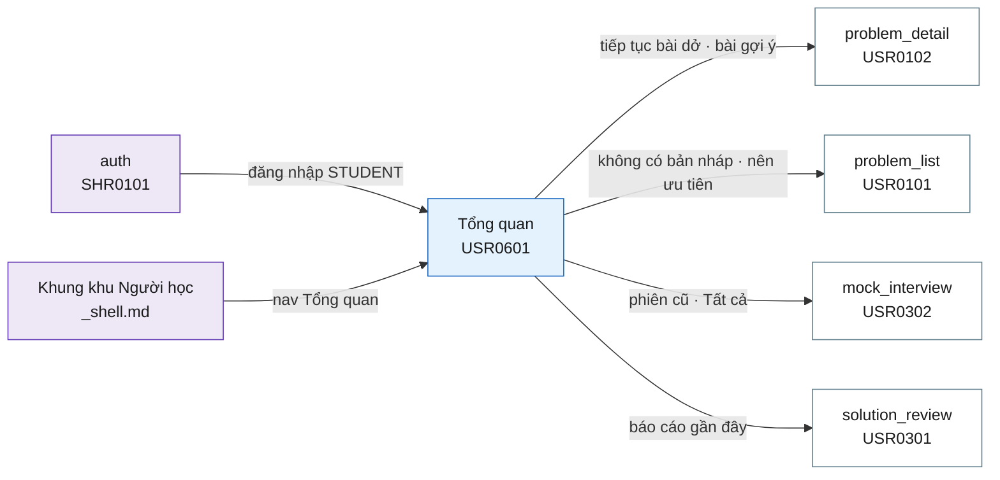

# Tài liệu thiết kế cơ bản (BD) — Tổng quan người học (`USR0601`)

## Phương châm tài liệu [Nội bộ — không cần khách duyệt]

- Viết theo **mẫu 9 sheet**. Bộ thẻ đóng, quy ước ID, ký hiệu chuẩn, ranh giới với tài liệu khác và
  checklist kiểm toán nằm ở `02-bd/_rules/bd-template-9sheet.md` — file này không chép lại.
- Phần gắn nhãn `[Nội bộ]` phục vụ sinh mã và tự kiểm toán, không phải yêu cầu của khách hàng: mục 4.5,
  mục 7.3 và các ghi chú quy ước.
- Mã màn `USR0601` theo bảng mã ở `02-bd/_rules/bd-template-9sheet.md` mục 8 dòng 150; tên file mang tiền
  tố mã. Màn này từng được đặt nhầm mã `USR0100` trong bản RD đầu tiên cùng ngày — sai dạng mã, vì không có
  thứ tự `00` và nhóm `01` của khu Người học đã là "Bài tập". Sửa thành `USR0601` trước khi có BD nào trỏ
  tới, ghi lại ở chính mục 8 đó.
- Màn này **không có popup nào**. Có sáu đường khoan sâu: sang `problem_detail`, `problem_list`,
  `my_submissions`, `mock_interview`, `solution_review`, và `problem_list` đã lọc sẵn chủ đề.
- Khung điều hướng **không mô tả lại ở đây** — dùng chung `02-bd/screens/users/_shell.md`. Màn này là
  mục nav **thứ nhất** trên thanh ngang ("Tổng quan"), không nằm trong menu người dùng
  [Nguồn: 02-bd/screens/users/_shell.md:50-60]. Chân trang cũng thuộc khung chung
  [Nguồn: 02-bd/screens/users/_shell.md:88-110].

> Đọc cùng `01-rd/screens/users/USR0601_dashboard.md` (hành vi ở mức yêu cầu, không lặp lại ở đây),
> `01-rd/req/identity.md` (F1-31, nền F1-06/F1-07/F1-08) và `02-bd/database/identity.md` mục 1.12.
>
> **Màn này đã gộp `my_progress` (`USR0501`)** theo `DEC-2026-0927-student-area-merge-and-shared-shell`.
> `02-bd/screens/users/USR0501_my_progress.md` vẫn là **BD hợp lệ và là nguồn đối chiếu** cho ba khối
> được chuyển sang: Khu vực F, G, H của file này bám sát Khu vực B, D, E của file đó — cùng công thức,
> cùng nguồn dữ liệu, cùng câu hỏi mở. Không thiết kế lại; chỗ nào giống thì trỏ sang, chỗ nào khác thì
> nói rõ khác ở đâu.
>
> **Không thiết kế lại** cách tính điểm tỉ lệ testcase — thuộc `judge-orchestration`
> [Nguồn: DEC-2026-0831-partial-score-testcase-ratio].
> **Không thiết kế** giao diện một phiên phỏng vấn (`mock_interview`, `USR0302`), một báo cáo phân tích
> (`solution_review`, `USR0301`), hay màn soạn mã (`problem_detail`, `USR0102`) — màn này chỉ liệt kê và
> mở sang đó.

> **Quy ước đặt tên khối** [Nội bộ]. Mười khối: `greeting` (lời chào, điểm yếu, nút tiếp tục, dải khoảng
> thời gian), `stats` (bốn thẻ chỉ số), `dailyChart` (bài nộp theo ngày), `skillRadar` (năng lực theo chủ
> đề), `activity` (lưới 12 tháng), `topicProgress` (bảng theo chủ đề), `difficultyProgress` (theo độ khó),
> `focusNext` (nên ưu tiên), `suggestedProblems` (bài toán gợi ý), `recentInterviews` (Mock Interview gần
> đây), `recentReviews` (Solution Review gần đây). Tiền tố ID item của toàn màn là `dashboard.`.
> Ba khối `topicProgress`, `difficultyProgress`, `focusNext` **giữ nguyên tên khối** của `USR0501` để đối
> chiếu hai file không phải dịch tên.

---

## Sheet 1. Bìa

| Mục | Giá trị |
| :--- | :--- |
| Hệ thống | AlgoPrep |
| Phân hệ | `identity` (F1) — có phụ thuộc đọc sang `problem-bank` (F2), `judge-orchestration` (F4) và `ai-review` (F5) |
| Công đoạn | BD — Thiết kế cơ bản |
| Phân loại | Màn hình |
| Tên màn | Tổng quan người học |
| Mã màn hình | `USR0601` |
| Tên vật lý (slug) | `dashboard` |
| Trục tài liệu | Màn hình (`02-bd/screens/`) |
| Actor | A1 (`STUDENT`) |
| Phiên bản | V0.4 |
| Người tạo | Nhóm phát triển AlgoPrep |
| Ngày tạo | 2026/09/27 |
| Người cập nhật | Nhóm phát triển AlgoPrep |
| Ngày cập nhật | 2026/10/03 |

---

## Sheet 2. Lịch sử sửa đổi

| Ver | Sheet bị sửa | Nội dung sửa | Ngày | Người sửa |
| :--- | :--- | :--- | :--- | :--- |
| V0.2 | 4.2, 7.1, 7.3, 9, Câu hỏi mở | Áp `DEC-2026-0927-submission-metrics-two-ports`: đổi `GetStudentSubmissionMetrics` thành `GetMySubmissionMetrics` (luồng Người học, danh tính lấy từ token), bỏ `GetMyActivityCalendar` riêng và gộp lưới 12 tháng vào cùng cổng đó với `dayCount = 364`. Câu hỏi mở Q10 đóng | 2026/09/27 | Nhóm phát triển AlgoPrep |
| V0.1 | Toàn bộ | Tạo mới theo mẫu 9 sheet, **sau khi prototype Next.js đã dựng xong** — ngược thứ tự thường lệ, ghi rõ ở mục 4.4. Gộp ba khối của `USR0501` (bảng theo chủ đề, theo độ khó, nên ưu tiên) và giữ nguyên công thức của file đó. Chốt nguồn dữ liệu cho bốn khối mới chưa từng có BD: năng lực theo chủ đề, lưới hoạt động 12 tháng, bài toán gợi ý, Solution Review gần đây. Chốt một dải khoảng thời gian duy nhất cho cả màn. Phát sinh 11 câu hỏi mở, trong đó 4 câu kế thừa nguyên văn từ `USR0501` | 2026/09/27 | Nhóm phát triển AlgoPrep |
| V0.3 | Sheet 9 | Đổi báo giá trị khoảng thời gian không hợp lệ sang toast; giữ nguyên trạng thái lỗi từng khối kèm nút Thử lại. Theo `DEC-2026-1003-toast-feedback-channel`. | 2026/10/03 | AI |
| V0.4 | Sheet 4, 5, 6, 7, 8 | Đồng bộ `DEC-2026-1001-admin-configurable-settings` mục (7): độ khó bài tập là danh mục do ADMIN quản lý (bảng riêng `problem_levels`), không còn enum cố định. Khối "Theo độ khó" (Khu vực G) thành **một dòng mỗi mức** theo `sort_order`, số dòng không còn cố định 3; ba mức khởi tạo giữ màu thanh cũ, mức mới màu trung tính; mức chưa có dữ liệu hiển thị `0 / 0`. Cụm tab độ khó của "Bài toán gợi ý" là "Tất cả" cộng một tab mỗi mức; cột "Độ khó" đọc `display_name`. `DifficultyProgressDto`/`SuggestedProblemDto`: `difficulty` thành `levelCode`/`levelDisplayName`. Màn gọi thêm `ListProblemLevels` (chỉ đọc) cho các tab; thêm `problem_levels` vào bảng liên quan và Truy cập bảng. Màn chỉ hiển thị, lọc trên tập đã tải; độ khó không gắn logic nào | 2026/10/03 | AI |

---

## Sheet 3. Sơ đồ chuyển màn

> [Nội bộ] Quy ước vẽ: bố trí từ trái sang phải. Màn gọi tới tô tím, màn hiện tại tô xanh nhạt, màn đi
> tới tô trắng. Màn này không có popup nên không dùng màu vàng. Màu và `[Nguồn:]` dùng để truy vết, không
> phải yêu cầu của khách hàng.

### 3.1 Danh sách chuyển màn

#### `auth` → Tổng quan

[Điều kiện mở] Đăng nhập thành công với vai trò `STUDENT` và không đến từ một liên kết cụ thể cần đăng
nhập trước [Nguồn: 01-rd/screens/shared/SHR0101_auth.md Q3; DEC-2026-0927-student-dashboard-home].

[Chế độ mở] Không có.

[Thông tin truyền] Không có. Màn luôn hiển thị dữ liệu của chính người đang đăng nhập, không nhận tham số
`user_id` từ bên ngoài.

[Giá trị trả về] Không có.

[Khi thành công] Mở màn Tổng quan, dải khoảng thời gian ở giá trị mặc định "30 ngày".

[Khi huỷ] Không có.

#### Khung điều hướng khu Người học → Tổng quan

[Điều kiện mở] Bấm mục nav thứ nhất "Tổng quan" trên header ngang, hoặc bấm thương hiệu "AlgoPrep"
[Nguồn: 02-bd/screens/users/_shell.md:50-60].

[Chế độ mở] Không có.

[Thông tin truyền] Không có.

[Giá trị trả về] Không có.

[Khi thành công] Mở màn Tổng quan, dải khoảng thời gian trở về mặc định "30 ngày" — màn không nhớ lựa
chọn giữa hai lần vào (xem Câu hỏi mở Q6).

[Khi huỷ] Không có.

#### Tổng quan → `problem_detail`

[Điều kiện mở] Bấm nút "Tiếp tục bài đang làm" khi có bản nháp dở, hoặc bấm tên một bài trong khối "Bài
toán gợi ý" [Nguồn: 09-layoutBase/Dashboard AlgoPrep.dc.html:106,236-265].

[Chế độ mở] Không có.

[Thông tin truyền] `problemId` của bài được chọn.

[Giá trị trả về] Không có.

[Khi thành công] Mở màn soạn mã của đúng bài đó.

[Khi huỷ] Không có. Màn này chỉ đọc, không có thay đổi chưa lưu nên không hỏi xác nhận trước khi rời.

#### Tổng quan → `problem_list`

[Điều kiện mở] Hai đường: bấm nút "Tiếp tục bài đang làm" khi **không** có bản nháp nào
[Nguồn: 02-bd/screens/users/_shell.md:129 Q2], hoặc bấm một mục trong khối "Nên ưu tiên".

[Chế độ mở] Không có.

[Thông tin truyền] Đường thứ nhất: không có. Đường thứ hai: `topicId` của chủ đề được gợi ý, dùng làm bộ
lọc chủ đề mặc định của màn đích.

[Giá trị trả về] Không có.

[Khi thành công] Mở danh sách bài toán, đã lọc sẵn chủ đề nếu đi theo đường thứ hai.

[Khi huỷ] Không có.

#### Tổng quan → `mock_interview`

[Điều kiện mở] Bấm một dòng trong khối "Mock Interview" gần đây, hoặc bấm liên kết "Tất cả" của khối đó
[Nguồn: 09-layoutBase/Dashboard AlgoPrep.dc.html:289-313].

[Chế độ mở] Bấm một dòng: chế độ chỉ xem rubric của phiên cũ. Bấm "Tất cả": chế độ mặc định của màn đích.

[Thông tin truyền] Bấm một dòng: `sessionId` của phiên đó. Bấm "Tất cả": không có.

[Giá trị trả về] Không có.

[Khi thành công] Mở đúng rubric của phiên được chọn (F1-08), hoặc mở màn phỏng vấn ở trạng thái đầu.

[Khi huỷ] Không có.

#### Tổng quan → `solution_review`

[Điều kiện mở] Bấm tên bài trong một dòng của khối "Solution Review" gần đây
[Nguồn: 09-layoutBase/Dashboard AlgoPrep.dc.html:317-339].

[Chế độ mở] Chế độ đọc báo cáo đã có, không kích hoạt sinh báo cáo mới.

[Thông tin truyền] `submissionId` của lượt nộp có báo cáo đó.

[Giá trị trả về] Không có.

[Khi thành công] Mở báo cáo phân tích của đúng lượt nộp đó.

[Khi huỷ] Không có.

### 3.2 Sơ đồ

---

## Sheet 4. Bố cục màn hình

### 4.1 Tổng quan màn

[Mục đích màn] Trang đích sau khi người học đăng nhập, trả lời đúng một câu hỏi: **làm gì tiếp theo**.
Sau khi gộp `my_progress`, màn còn gánh thêm vai trò "tôi đang ở đâu" — số bài đã giải theo chủ đề và
theo độ khó (F1-06), tỉ lệ Accepted (F1-07), lịch sử phỏng vấn (F1-08), tất cả dưới một mã tổng hợp F1-31
[Nguồn: 01-rd/req/identity.md — F1-31].

[Luồng nghiệp vụ chính]

1. **Hiển thị ban đầu**: vào màn, hệ thống tải mười một khối theo khoảng thời gian mặc định "30 ngày".
   Mỗi khối có ba trạng thái riêng — đang tải, có dữ liệu, lỗi — và một khối lỗi không kéo theo khối khác.
2. **Đọc câu điểm yếu**: một dòng dưới lời chào nêu chủ đề có điểm năng lực thấp nhất. Câu này, biểu đồ
   radar và thứ tự của khối "Bài toán gợi ý" **cùng dẫn xuất từ một phép tính duy nhất** — nếu tính riêng
   từng chỗ thì ba khối sẽ chỉ ra ba chủ đề khác nhau và người đọc không biết tin cái nào.
3. **Hành động tiếp theo**: bấm "Tiếp tục bài đang làm" để về bản nháp dở gần nhất, hoặc chọn một bài
   trong khối "Bài toán gợi ý".
4. **Đổi khoảng thời gian**: chọn "7 ngày" / "30 ngày" / "Tất cả"; bốn khối phụ thuộc khoảng thời gian
   tải lại, bảy khối luỹ kế không đổi (danh sách chính xác ở Câu hỏi mở Q6).
5. **Khoan sâu**: mở một chủ đề nên ưu tiên, một phiên phỏng vấn cũ, hoặc một báo cáo phân tích gần đây.

[Người dùng] Người học đã đăng nhập (`STUDENT`). Màn chỉ hiển thị dữ liệu của chính người đang đăng nhập.

[Tệp liên quan] Không có. Màn này không xuất hay nhập tệp.

[Phạm vi]
- Chỉ đọc. Không có thao tác ghi nào trên màn.
- **Không** hiển thị nội dung testcase ẩn, diff đầu ra, hay mã nguồn bài nộp — màn này chỉ có số đếm,
  tỉ lệ và tên bài.
- Không có đường nào xem tiến độ của người khác; đó là quyền của A2 ở `class_student_detail` (`INS0204`).
- Ba khối lấy dữ liệu từ `ai-review` (thẻ chỉ số "Mock Interview", khối "Mock Interview" gần đây, khối
  "Solution Review" gần đây) **phải suy giảm êm**: phân hệ AI hỏng thì tám khối còn lại vẫn hiển thị đủ.
- **Không** dựng nút "Xem lộ trình" của prototype — xem Câu hỏi mở Q4.

[Quyền sử dụng]
- Xem: được, với chính dữ liệu của mình.
- Thêm: không.
- Sửa: không.
- Xoá: không.

[Số bản ghi tối đa] Bảng "Theo chủ đề": theo số chủ đề có thật trong `problem.topics`, prototype dựng 7
dòng. Biểu đồ "Bài nộp theo ngày": 7 / 15 / 24 điểm tuỳ khoảng đang chọn (Câu hỏi mở Q6). Radar: đúng 6
trục — nhiều hơn thì nhãn chồng nhau. Lưới hoạt động: đúng 52 tuần x 7 ngày = 364 ô. "Theo độ khó": đúng
một dòng mỗi mức trong `problem_levels` (ba mức khởi tạo ra 3 dòng; số dòng không cố định). "Nên ưu tiên": tối đa 3 mục. "Bài toán gợi ý": 7 dòng, không phân trang. "Mock Interview" và
"Solution Review" gần đây: mỗi khối 3 dòng. Toàn màn không có phân trang.

[Nguồn: 01-rd/screens/users/USR0601_dashboard.md; 09-layoutBase/Dashboard AlgoPrep.dc.html:99-340;
09-layoutBase/Tiến độ của tôi.dc.html:115-196]

### 4.2 DTO liên quan

- `MyProgressOverviewDto`
- `TopicProgressDto`
- `DifficultyProgressDto`
- `FocusSuggestionDto`
- `SubmissionDailyCountDto`
- `MyInterviewSummaryDto`
- `SkillRadarPointDto`
- `ActivityCalendarDto`
- `SuggestedProblemDto`
- `RecentSolutionReviewDto`
- `LatestDraftDto`

Sáu DTO đầu **dùng lại nguyên tên** của `USR0501` [Nguồn: 02-bd/screens/users/USR0501_my_progress.md
mục 4.2] — cùng dữ liệu thì cùng DTO, không đặt tên mới vì màn đổi. Năm DTO sau là mới của màn này.

`[Suy luận]` — tên DTO do BD đề xuất, `03-dd/api/identity.md`, `03-dd/api/problem-bank.md` và
`03-dd/api/ai-review.md` chốt lại.

### 4.3 Bảng dữ liệu liên quan (10)

| NO | Bảng | Ghi chú |
| --: | :--- | :--- |
| 1 | `identity.user_submission_stats` | [Nguồn: 02-bd/database/identity.md:113-114] |
| 2 | `identity.user_problem_best_score` | [Nguồn: 02-bd/database/identity.md:111-112] |
| 3 | `judge.submissions` | [Nguồn: 02-bd/database/judge-orchestration.md:8-34] |
| 4 | `problem.problems` | [Nguồn: 02-bd/database/problem-bank.md:8-17] |
| 5 | `problem.topics` | [Nguồn: 02-bd/database/problem-bank.md:35-39] |
| 6 | `problem.problem_topics` | [Nguồn: 02-bd/database/problem-bank.md:35-39] |
| 7 | `ai.interview_sessions` | [Nguồn: 02-bd/database/ai-review.md:66-83] |
| 8 | `ai.rubric_scores` | [Nguồn: 02-bd/database/ai-review.md:89-102] |
| 9 | `ai.solution_reviews` | Khối "Solution Review" gần đây. Đã có sẵn index `solution_reviews(user_id, created_at DESC)` với chú thích "trang tiến độ cá nhân (F5-08)" — tức là truy vấn này **đã được dự trù từ trước**, màn này là nơi dùng nó [Nguồn: 02-bd/database/ai-review.md:40-58,185] |
| 10 | `problem.problem_levels` | Danh mục độ khó do ADMIN quản lý: nguồn nhãn, thứ tự và mẫu số của từng dòng khối "Theo độ khó", nhãn cột "Độ khó" và các tab độ khó của "Bài toán gợi ý" [Nguồn: 02-bd/database/problem-bank.md mục `problem_levels`] |

Màn này **không** đọc `identity.identity_recent_activity`: bảng đó phục vụ F1-30 của khu Giảng viên
[Nguồn: 02-bd/database/identity.md:115-116]. Lưới hoạt động 12 tháng của màn này đếm lượt nộp, không phải
đọc nhật ký sự kiện — xem Câu hỏi mở Q2.

### 4.4 Vùng bố cục

> **Thứ tự viết ngược thường lệ, ghi rõ để không ai đọc nhầm.** Quy trình dự án là RD → BD → Prototype →
> DD. Màn này đi RD → Prototype → BD: chủ dự án yêu cầu dựng trước để xem UI/UX, BD viết sau khi prototype
> Next.js đã chạy. Hệ quả cần biết khi đọc file này: các con số bố cục dưới đây đối chiếu **cả hai** —
> `09-layoutBase/*.dc.html` (bằng chứng bố cục gốc) và bản dựng Next.js thật. Chỗ nào bản dựng đã lệch
> prototype thì nói rõ lệch ở đâu và vì sao, không im lặng chép lại cái đã dựng.

Đối chiếu `09-layoutBase/Dashboard AlgoPrep.dc.html` và `09-layoutBase/Tiến độ của tôi.dc.html` — bằng
chứng bố cục chỉ-đọc, **không phải** design system cuối cùng.

| Vùng | Vị trí trong prototype | Nội dung |
| :--- | :--- | :--- |
| Header ngang dính trên (khung chung) | `Dashboard:50-92` | Thương hiệu, thẻ "GO-JUDGE", 6 mục nav với "Tổng quan" đang được tô sáng, bộ chuyển theme/ngôn ngữ, menu người dùng — dùng lại khung chung |
| Lời chào và điểm yếu | `Dashboard:99-103` | Câu chào và một dòng nêu chủ đề yếu nhất kèm số |
| Nút hành động | `Dashboard:105-106` | Prototype có 2 nút; bản dựng chỉ giữ "Tiếp tục bài đang làm", bỏ "Xem lộ trình" (Câu hỏi mở Q4) |
| Dải khoảng thời gian | Không có ở `Dashboard`; `Tiến độ:106-108` | 3 nút "7 ngày" / "30 ngày" / "Tất cả", căn phải cùng hàng với lời chào. **Lệch prototype có chủ đích**, xem ghi chú 1 bên dưới |
| Bốn thẻ chỉ số | `Dashboard:110-125` | Đã giải · Acceptance rate · Chuỗi ngày · Mock Interview; mỗi thẻ có nhãn, số lớn, đơn vị phụ và một dòng chú |
| Bài nộp theo ngày | `Dashboard:131-157` | Biểu đồ đường có vùng tô, lưới ngang, nhãn ngày dưới trục |
| Năng lực theo chủ đề | `Dashboard:160-184` | Radar 6 trục, 4 vòng tròn đồng tâm, nhãn và số ở đầu mỗi trục |
| Hoạt động 12 tháng | `Dashboard:188-212` | Lưới 52x7 ô, 5 mức đậm nhạt, chú giải Ít/Nhiều, nhãn 12 tháng dưới đáy |
| Theo chủ đề | `Tiến độ:115-149` | Bảng 4 cột: Chủ đề, Đã giải (thanh tiến độ kèm tỉ số), Tỉ lệ AC, Lần cuối |
| Theo độ khó | `Tiến độ:166-181` | 3 dòng Dễ / Trung bình / Khó, mỗi dòng có tỉ số và thanh tiến độ |
| Nên ưu tiên | `Tiến độ:183-196` | Tối đa 3 mục, mỗi mục là liên kết gồm tên chủ đề và một dòng lý do |
| Bài toán gợi ý | `Dashboard:220-265` | Tiêu đề kèm số bài, cụm tab độ khó, dãy chip chủ đề, bảng 4 cột |
| Mock Interview gần đây | `Dashboard:289-313` | 3 thẻ phiên, mỗi thẻ có tên bài, điểm tổng, 4 thanh rubric, giai đoạn, ngày; kèm liên kết "Tất cả" |
| Solution Review gần đây | `Dashboard:317-339` | 3 dòng, mỗi dòng có chấm màu, tên bài, ngày, độ phức tạp; kèm liên kết "Tất cả" |
| Chân trang (khung chung) | `Dashboard:342` trở đi | Prototype dựng footer 3 cột riêng; khung chung quy định 3 khu khác (thương hiệu + bản quyền · trạng thái cụm · phiên bản) và **khung chung thắng** [Nguồn: 02-bd/screens/users/_shell.md:88-110] |

Bố cục hai cột `1.55fr / 1fr` lặp ba lần (`Dashboard:129,215`): cột trái chứa khối rộng, cột phải chứa
khối hẹp. Khối "Hoạt động 12 tháng" chiếm trọn chiều ngang giữa hai cụm. Giữ cấu trúc này khi dựng; không
quy định màu sắc, khoảng cách hay typography ở BD.

**Năm điểm màn hình này khác prototype, cố ý:**

1. **Một dải khoảng thời gian cho cả màn, đặt ở hàng lời chào.** Prototype `Dashboard` đặt cụm tab
   7/30/90 ngày **bên trong** khối biểu đồ (`:134-140`), còn prototype `Tiến độ` đặt cụm tab 7 ngày/30
   ngày/Tất cả ở **đầu màn, áp cho cả màn** (`:106-108`). Gộp hai màn mà giữ cả hai thì trên một trang có
   hai cụm tab với hai bộ giá trị khác nhau, và cụm từ "khoảng đang chọn" có hai nghĩa. Chốt: **một cụm
   duy nhất, dùng bộ giá trị của `Tiến độ`** (7 ngày / 30 ngày / Tất cả).
2. **Bảng "Theo chủ đề" thay cho thanh tiến độ rút gọn.** Prototype `Dashboard:271-285` có khối "Tiến độ
   theo chủ đề" gồm 6 thanh tiến độ. Bảng của `Tiến độ:115-149` chứa đúng thông tin đó **cộng thêm** tỉ lệ
   AC và lần nộp cuối cho từng chủ đề. Giữ cả hai là hiển thị cùng một dữ liệu hai lần trên một trang.
3. **Không dựng nút "Xem lộ trình"** (`Dashboard:105`) — không mã `Fx-nn` nào trong `01-rd/req/` mô tả
   tính năng lộ trình học, và nút trong prototype không có đích. Câu hỏi mở Q4.
4. **Không dựng 4 thanh rubric trong mỗi thẻ phiên phỏng vấn** (`Dashboard:298-304`) — DTO hiện chỉ mang
   điểm tổng mỗi phiên. Câu hỏi mở Q5.
5. **Chân trang theo khung chung, không theo footer 3 cột của prototype này.** Chỉ 2/12 prototype khu
   Người học có footer, và khung chung đã chốt một hình dạng khác cho cả khu từ 2026-09-21.

Prototype hiển thị đồng thời nhãn tiếng Việt và tiếng Anh cho mọi mục. Đó là cách bản mẫu minh hoạ i18n,
không phải yêu cầu hiển thị song ngữ cùng lúc — cùng kết luận đã ghi ở khung
[Nguồn: 02-bd/screens/users/_shell.md:71-76].

### 4.5 Cấu trúc slice FSD [Nội bộ]

| Khối | Slice đã dựng | Căn cứ |
| :--- | :--- | :--- |
| Trang | `views/users/dashboard` | Bản dựng 2026-09-27 |
| Khung khu Người học | Dùng lại `widgets/app-shell` | `02-bd/screens/users/_shell.md` |
| Lời chào, điểm yếu, nút tiếp tục | `views/users/dashboard/ui/blocks/greeting-block` | Prototype `Dashboard:99-106` |
| Bốn thẻ chỉ số | `views/users/dashboard/ui/blocks/stat-cards-row` | Prototype `Dashboard:110-125` |
| Bài nộp theo ngày | `views/users/dashboard/ui/blocks/daily-submissions-block` + `shared/ui/LineChartWithTotal` | Prototype `Dashboard:131-157` |
| Năng lực theo chủ đề | `views/users/dashboard/ui/blocks/skill-radar-block` + `shared/ui/RadarChart` | Prototype `Dashboard:160-184` |
| Hoạt động 12 tháng | `views/users/dashboard/ui/blocks/activity-block` + `shared/ui/ActivityHeatmap` | Prototype `Dashboard:188-212` |
| Theo chủ đề, Theo độ khó, Nên ưu tiên | `views/users/dashboard/ui/blocks/topics-table`, `difficulty-card`, `focus-card` | Chuyển nguyên khối từ `views/my-progress` khi gộp |
| Bài toán gợi ý | `views/users/dashboard/ui/blocks/suggested-problems-block` | Prototype `Dashboard:220-265` |
| Hai khối gần đây | `views/users/dashboard/ui/blocks/recent-interviews-block`, `recent-reviews-block` | Prototype `Dashboard:289-339` |
| Phép tính năng lực dùng chung | `views/users/dashboard/model/derive-skill-radar` | Ba khối cùng dùng, xem mục 4.1 luồng bước 2 |
| Dữ liệu riêng của màn | `views/users/dashboard/api` + `model/types.ts` | Lưới hoạt động, chuỗi bài nộp theo ngày, báo cáo gần đây. Trước 2026-09-29 là slice `entities/student-dashboard`, đã chuyển vào view vì chỉ màn này dùng (`DEC-2026-0929-fsd-views-grouped-entities-domain-only`) |

Hai ghi chú ràng buộc kiến trúc, đã kiểm bằng `pnpm lint`:

- `views/users/dashboard/model/derive-skill-radar` nằm ở tầng view chứ không ở một entity vì nó đọc
  `TopicProgress` của `entities/progress`, mà FSD cấm một entity import entity khác. Ghép hai entity là
  việc của tầng trên [Nguồn: 01-rd/system/SYS0102_frontend_architecture.md mục 2].
- Ba khối gộp từ `USR0501` vẫn đọc namespace i18n `myProgress`, không đổi sang `dashboard` — đổi namespace
  là sửa vài chục khoá dịch mà không đổi hành vi nào.

> [Nội bộ] Ảnh minh hoạ đặt ở `08-diagram/02-bd/screens/users/`, chụp bằng Playwright trên ứng dụng
> Next.js thật. Màn này **đã có mã chạy được**, nên ảnh phải chụp từ ứng dụng thật chứ không tham chiếu
> prototype tĩnh.

---

## Sheet 5. Danh sách item màn hình

> Quy ước ID, bộ thẻ và giá trị chuẩn: `02-bd/_rules/bd-template-9sheet.md` mục 2, 3, 4.

### Khu vực A — Lời chào và bộ lọc khoảng thời gian

| Khu vực | NO | Tên item | ID item | Bảng DB | Cột DB | Loại UI | Kiểu | Độ dài | Bắt buộc | I/O | Giá trị mặc định | Định dạng | Ghi chú |
| :--- | --: | :--- | :--- | :--- | :--- | :--- | :--- | :--- | :-: | :-: | :--- | :--- | :--- |
| Lời chào | | | | | | | | | | | | | |
| | 1 | Câu chào | `dashboard.greeting.title` | `identity.users` | `display_name` | Label | String | 80 | - | O | - | `Chào {tên}, tiếp tục nhé` | Câu chào kèm tên hiển thị của người đăng nhập [Nguồn giá trị] Nhãn tĩnh i18n có tham số; tên lấy từ phiên đăng nhập, **không** gọi thêm endpoint riêng [Nguồn: 09-layoutBase/Dashboard AlgoPrep.dc.html:101] [EVT liên quan] EVT-1 |
| | 2 | Dòng điểm yếu | `dashboard.greeting.weakestTopic` | `problem.topics` | `name` | Label | String | 120 | - | O | - | Câu có 3 tham số | Nêu chủ đề có điểm năng lực thấp nhất, kèm điểm và tổng số chủ đề được xét [Công thức] Lấy chủ đề có `score` nhỏ nhất trong `SkillRadarPointDto` (Khu vực D NO 2) — **cùng một phép tính**, không tính lại riêng. Chưa có dữ liệu luyện tập thì thay bằng câu rỗng ở NO 3 [EVT liên quan] EVT-1 |
| | 3 | Câu khi chưa có dữ liệu | `dashboard.greeting.noData` | - | - | Label | String | 120 | - | O | - | Câu tĩnh | Thay chỗ NO 2 khi người dùng chưa có lượt nộp nào [Nguồn giá trị] Nhãn tĩnh i18n, nội dung "Chưa có dữ liệu luyện tập — giải bài đầu tiên để thấy điểm mạnh yếu của bạn." [EVT liên quan] EVT-1 |
| | 4 | Tiếp tục bài đang làm | `dashboard.greeting.btnResume` | `judge.submissions` | `problem_id`, `submitted_at` | Button | - | - | - | I | - | Nhãn đổi theo trạng thái | Nút hành động chính của màn. Có bản nháp dở thì nhãn "Tiếp tục bài đang làm"; không có thì nhãn "Bắt đầu giải bài" [Nguồn giá trị] Bản nháp dở gần nhất, định nghĩa đã chốt tại `DEC-2026-0922-users-and-admin-conflict-resolutions` và `02-bd/screens/users/_shell.md:129` Q2 [EVT liên quan] EVT-3 |
| | 5 | Cụm tab khoảng thời gian | `dashboard.greeting.rangeTabs` | - | - | Button | Enum | - | - | I/O | 30 ngày | 3 nút | Ba lựa chọn "7 ngày" / "30 ngày" / "Tất cả", áp cho toàn màn [Nguồn giá trị] Nhãn tĩnh i18n; ba giá trị lấy từ `09-layoutBase/Tiến độ của tôi.dc.html:266`, không phải bộ 7/30/90 của prototype dashboard — xem mục 4.4 ghi chú 1 [EVT liên quan] EVT-2 |

### Khu vực B — Bốn thẻ chỉ số

| Khu vực | NO | Tên item | ID item | Bảng DB | Cột DB | Loại UI | Kiểu | Độ dài | Bắt buộc | I/O | Giá trị mặc định | Định dạng | Ghi chú |
| :--- | --: | :--- | :--- | :--- | :--- | :--- | :--- | :--- | :-: | :-: | :--- | :--- | :--- |
| Thẻ chỉ số | | | | | | | | | | | | | |
| | 1 | Đã giải | `dashboard.stats.solved` | `identity.user_problem_best_score` | `best_verdict` | Label | String | 12 | - | O | - | `{số} / {số}` | Số bài đã giải trên tổng số bài đang xuất bản (F1-06) [Công thức] Giống hệt `USR0501` Khu vực A NO 1 [Nguồn: 02-bd/screens/users/USR0501_my_progress.md Sheet 5 Khu vực A] [EVT liên quan] EVT-1 |
| | 2 | Acceptance rate | `dashboard.stats.acRate` | `identity.user_submission_stats` | `accepted_count`, `total_submissions` | Label | Number | 3 | - | O | - | `{số}%` | Tỉ lệ bài nộp đạt `Accepted` trên tổng bài nộp (F1-07) [Công thức] `accepted_count` chia `total_submissions`, làm tròn số nguyên phần trăm. Chưa nộp lần nào thì khối hiển thị trạng thái rỗng, **không** hiển thị `0%` [EVT liên quan] EVT-1 |
| | 3 | Chuỗi ngày | `dashboard.stats.streak` | - | - | Label | Number | 4 | - | O | - | `{số} ngày` | Số ngày liên tiếp tính tới hôm nay có ít nhất một lượt nộp [Công thức] **Dùng lại nguyên định nghĩa đã chốt** ở `01-rd/screens/users/USR0501_my_progress.md` Q1, không định nghĩa lại. Không cột nào lưu sẵn, lấy qua `GetMySubmissionMetrics`. Múi giờ cắt ngày chưa chốt, xem Câu hỏi mở Q9 [EVT liên quan] EVT-1 |
| | 4 | Mock Interview | `dashboard.stats.interview` | `ai.interview_sessions` | `stage` | Label | Number | 5 | - | O | - | `{số} phiên` | Số phiên phỏng vấn đã kết thúc, kèm dòng chú "Rubric trung bình {số} / {thang}" [Công thức] Đếm `interview_sessions` có `stage = COMPLETED`; điểm trung bình theo công thức `USR0501` Khu vực A NO 7. Thang điểm chưa chốt, xem Câu hỏi mở Q8 [EVT liên quan] EVT-1 |
| | 5 | Thử lại | `dashboard.stats.btnRetry` | - | - | Button | - | - | - | I | - | Thử lại | Tải lại một thẻ đang ở trạng thái lỗi. Mỗi thẻ có nút riêng vì NO 4 dùng endpoint khác ba thẻ kia [Nguồn giá trị] Nhãn tĩnh i18n [EVT liên quan] EVT-12 |

### Khu vực C — Bài nộp theo ngày

| Khu vực | NO | Tên item | ID item | Bảng DB | Cột DB | Loại UI | Kiểu | Độ dài | Bắt buộc | I/O | Giá trị mặc định | Định dạng | Ghi chú |
| :--- | --: | :--- | :--- | :--- | :--- | :--- | :--- | :--- | :-: | :-: | :--- | :--- | :--- |
| Bài nộp theo ngày | | | | | | | | | | | | | |
| | 1 | Tiêu đề khối | `dashboard.dailyChart.title` | - | - | Label | String | - | - | O | Bài nộp theo ngày | - | Tiêu đề khối [Nguồn giá trị] Nhãn tĩnh i18n [Nguồn: 09-layoutBase/Dashboard AlgoPrep.dc.html:131] [EVT liên quan] - |
| | 2 | Tổng lượt nộp | `dashboard.dailyChart.total` | `judge.submissions` | `submitted_at` | Label | Number | 5 | - | O | 0 | Số nguyên | Tổng lượt nộp trong khoảng đang chọn, hiển thị làm số lớn đầu khối [Công thức] Cộng `count` của mọi điểm trong `SubmissionDailyCountDto` [EVT liên quan] EVT-1, EVT-2 |
| | 3 | Dòng tóm tắt | `dashboard.dailyChart.summary` | - | - | Label | String | 60 | - | O | - | Câu có 1 tham số | Dòng dưới số lớn, nội dung "lượt nộp · trung bình {số} bài/ngày" [Công thức] Tổng ở NO 2 chia số điểm của chuỗi, một chữ số thập phân [EVT liên quan] EVT-1, EVT-2 |
| | 4 | Biểu đồ đường | `dashboard.dailyChart.chart` | `judge.submissions` | `submitted_at` | List | List | - | - | O | rỗng | 7 / 15 / 24 điểm | Một điểm cho mỗi mốc, kể cả mốc không có lượt nộp nào [Nguồn giá trị] `SubmissionDailyCountDto` qua `GetMySubmissionMetrics`. Số điểm theo khoảng đang chọn, xem Câu hỏi mở Q6 [EVT liên quan] EVT-1, EVT-2 |
| | 5 | Nhãn mốc | `dashboard.dailyChart.col.label` | - | - | ListColumn | String | 4 | - | O | - | `{số}d` | Nhãn dưới trục ngang, đếm lùi từ hôm nay [Nguồn giá trị] Suy ra từ ngày của điểm, không phải cột DB [EVT liên quan] - |
| | 6 | Số lượt nộp của mốc | `dashboard.dailyChart.col.count` | `judge.submissions` | `submitted_at` | ListColumn | Number | 4 | - | O | 0 | Số nguyên | Số lượt nộp của mốc đó [Công thức] Đếm dòng `judge.submissions` của người đăng nhập có `submitted_at` rơi vào mốc đó [Nguồn: 02-bd/database/judge-orchestration.md:31] [EVT liên quan] - |
| | 7 | Thử lại | `dashboard.dailyChart.btnRetry` | - | - | Button | - | - | - | I | - | Thử lại | Tải lại biểu đồ khi khối đang ở trạng thái lỗi [Nguồn giá trị] Nhãn tĩnh i18n [EVT liên quan] EVT-12 |

### Khu vực D — Năng lực theo chủ đề

| Khu vực | NO | Tên item | ID item | Bảng DB | Cột DB | Loại UI | Kiểu | Độ dài | Bắt buộc | I/O | Giá trị mặc định | Định dạng | Ghi chú |
| :--- | --: | :--- | :--- | :--- | :--- | :--- | :--- | :--- | :-: | :-: | :--- | :--- | :--- |
| Năng lực theo chủ đề | | | | | | | | | | | | | |
| | 1 | Tiêu đề và chú thích | `dashboard.skillRadar.title` | - | - | Label | String | 90 | - | O | Năng lực theo chủ đề | - | Tiêu đề kèm một dòng nói rõ thang điểm đến từ đâu [Nguồn giá trị] Nhãn tĩnh i18n, nội dung chú thích "Thang điểm 0-100, tính từ tỉ lệ AC và phần bài đã giải của chủ đề" [Nguồn: 09-layoutBase/Dashboard AlgoPrep.dc.html:160-161] [EVT liên quan] - |
| | 2 | Biểu đồ radar | `dashboard.skillRadar.chart` | `problem.topics` | `name` | List | List | - | - | O | rỗng | Đúng 6 trục | Sáu chủ đề mạnh nhất, vẽ theo đúng thứ tự danh mục chủ đề chứ **không** sắp theo điểm — radar sắp theo điểm sẽ vẽ thành hình xoắn ốc, đọc ra một xu hướng không có thật [Công thức] Điểm mỗi trục = tỉ lệ AC của chủ đề nhân trọng số, cộng tỉ lệ bài đã giải của chủ đề nhân trọng số còn lại; kẹp về 0-100. **Không gọi AI** [Nguồn: 01-rd/screens/users/USR0601_dashboard.md mục 4 Q2]. Bộ trọng số chưa chốt, xem Câu hỏi mở Q1 [EVT liên quan] EVT-1 |
| | 3 | Nhãn trục | `dashboard.skillRadar.col.topicName` | `problem.topics` | `name` | ListColumn | String | 60 | - | O | - | - | Tên chủ đề ở đầu mỗi trục [Nguồn giá trị] Cột `name` [Nguồn: 02-bd/database/problem-bank.md:38] [EVT liên quan] - |
| | 4 | Điểm trục | `dashboard.skillRadar.col.score` | - | - | ListColumn | Number | 3 | - | O | - | Số nguyên 0-100 | Điểm của chủ đề, in dưới nhãn trục [Công thức] Giá trị tính ở NO 2, làm tròn về số nguyên [EVT liên quan] - |
| | 5 | Câu khi chưa đủ dữ liệu | `dashboard.skillRadar.empty` | - | - | Label | String | 90 | - | O | - | Câu tĩnh | Thay chỗ biểu đồ khi có dưới 3 chủ đề có dữ liệu — dưới 3 trục thì radar không thành đa giác [Nguồn giá trị] Nhãn tĩnh i18n, nội dung "Cần ít nhất 3 chủ đề có dữ liệu để vẽ biểu đồ" [EVT liên quan] EVT-1 |
| | 6 | Thử lại | `dashboard.skillRadar.btnRetry` | - | - | Button | - | - | - | I | - | Thử lại | Tải lại khối khi đang ở trạng thái lỗi [Nguồn giá trị] Nhãn tĩnh i18n [EVT liên quan] EVT-12 |

### Khu vực E — Hoạt động 12 tháng

| Khu vực | NO | Tên item | ID item | Bảng DB | Cột DB | Loại UI | Kiểu | Độ dài | Bắt buộc | I/O | Giá trị mặc định | Định dạng | Ghi chú |
| :--- | --: | :--- | :--- | :--- | :--- | :--- | :--- | :--- | :-: | :-: | :--- | :--- | :--- |
| Hoạt động 12 tháng | | | | | | | | | | | | | |
| | 1 | Tiêu đề khối | `dashboard.activity.title` | - | - | Label | String | - | - | O | Hoạt động 12 tháng | - | Tiêu đề khối [Nguồn giá trị] Nhãn tĩnh i18n [Nguồn: 09-layoutBase/Dashboard AlgoPrep.dc.html:188] [EVT liên quan] - |
| | 2 | Dòng tóm tắt | `dashboard.activity.summary` | `judge.submissions` | `submitted_at` | Label | String | 60 | - | O | - | Câu có 1 tham số | Nội dung "{số} ngày có bài nộp trong 12 tháng qua" [Công thức] Đếm số ô có `count` lớn hơn 0 trong `ActivityCalendarDto` [EVT liên quan] EVT-1 |
| | 3 | Lưới hoạt động | `dashboard.activity.grid` | `judge.submissions` | `submitted_at` | List | List | - | - | O | rỗng | 52 tuần x 7 ngày | Một ô cho mỗi ngày trong 364 ngày gần nhất, tuần cũ nhất bên trái [Nguồn giá trị] `ActivityCalendarDto` qua `GetMySubmissionMetrics` với `dayCount = 364`. **Luôn 364 ô**, ngày không có lượt nộp vẫn là một ô mức 0 — backend trả đủ chuỗi, màn không tự vá lỗ hổng. Nguồn tính chưa chốt, xem Câu hỏi mở Q2 [EVT liên quan] EVT-1 |
| | 4 | Mức đậm nhạt của ô | `dashboard.activity.col.level` | - | - | ListColumn | Number | 1 | - | O | 0 | Số nguyên 0-4 | Năm mức, quyết định độ đậm của ô [Công thức] Backend quy đổi `count` sang mức 0-4 và trả kèm, **không** để màn tự chia ngưỡng — nếu màn tự chia thì hai màn khác nhau sẽ chia khác nhau. Ngưỡng cụ thể để DD chốt [EVT liên quan] - |
| | 5 | Chú giải ô | `dashboard.activity.col.tooltip` | - | - | ListColumn | String | 40 | - | O | - | Câu có 2 tham số | Rê chuột lên một ô hiện "{ngày}: {số} bài nộp", ô mức 0 hiện "{ngày}: không có bài nộp" [Nguồn giá trị] Nhãn tĩnh i18n có tham số [EVT liên quan] EVT-4 |
| | 6 | Chú giải mức | `dashboard.activity.legend` | - | - | Label | String | 20 | - | O | - | `Ít` + 5 ô + `Nhiều` | Dải chú giải năm mức, đặt phải tiêu đề [Nguồn giá trị] Nhãn tĩnh i18n [Nguồn: 09-layoutBase/Dashboard AlgoPrep.dc.html:191-197] [EVT liên quan] - |
| | 7 | Nhãn tháng | `dashboard.activity.monthLabels` | - | - | Label | List | - | - | O | 12 nhãn | 12 nhãn | Nhãn 12 tháng dưới đáy lưới, căn theo đúng chiều rộng lưới [Nguồn giá trị] Suy ra từ ngày của các cột, không phải cột DB [Nguồn: 09-layoutBase/Dashboard AlgoPrep.dc.html:207-211] [EVT liên quan] - |
| | 8 | Thử lại | `dashboard.activity.btnRetry` | - | - | Button | - | - | - | I | - | Thử lại | Tải lại khối khi đang ở trạng thái lỗi [Nguồn giá trị] Nhãn tĩnh i18n [EVT liên quan] EVT-12 |

### Khu vực F — Theo chủ đề

> **Gộp từ `USR0501` Khu vực B.** Mọi item, công thức và nguồn dữ liệu giữ nguyên
> [Nguồn: 02-bd/screens/users/USR0501_my_progress.md Sheet 5 Khu vực B]. Chỉ đổi tiền tố ID item từ
> `myProgress.` sang `dashboard.` cho đúng quy ước "ID duy nhất xuyên màn".

| Khu vực | NO | Tên item | ID item | Bảng DB | Cột DB | Loại UI | Kiểu | Độ dài | Bắt buộc | I/O | Giá trị mặc định | Định dạng | Ghi chú |
| :--- | --: | :--- | :--- | :--- | :--- | :--- | :--- | :--- | :-: | :-: | :--- | :--- | :--- |
| Theo chủ đề | | | | | | | | | | | | | |
| | 1 | Tiêu đề khối | `dashboard.topicProgress.title` | - | - | Label | String | - | - | O | Theo chủ đề | - | Tiêu đề khối [Nguồn giá trị] Nhãn tĩnh i18n [Nguồn: 09-layoutBase/Tiến độ của tôi.dc.html:117] [EVT liên quan] - |
| | 2 | Ghi chú sắp xếp | `dashboard.topicProgress.orderNote` | - | - | Label | String | 60 | - | O | Sắp theo phần còn lại nhiều nhất | - | Câu giải thích thứ tự các dòng [Nguồn giá trị] Nhãn tĩnh i18n [EVT liên quan] - |
| | 3 | Bảng chủ đề | `dashboard.topicProgress.table` | `problem.topics` | - | List | List | - | - | O | rỗng | Không phân trang | Mỗi dòng là một chủ đề; sắp theo số bài chưa giải giảm dần [Nguồn giá trị] Giống `USR0501` Khu vực B NO 3 [EVT liên quan] EVT-1, EVT-2 |
| | 4 | Chủ đề | `dashboard.topicProgress.col.topicName` | `problem.topics` | `name` | ListColumn | String | 60 | - | O | - | - | Tên chủ đề [Nguồn giá trị] Cột `name` [Nguồn: 02-bd/database/problem-bank.md:38] [EVT liên quan] - |
| | 5 | Đã giải | `dashboard.topicProgress.col.solvedRatio` | `identity.user_problem_best_score` | `best_verdict` | ListColumn | String | 12 | - | O | - | `{số} / {số}` | Bài đã giải trên tổng bài đang xuất bản của chủ đề [Công thức] Giống `USR0501` Khu vực B NO 5. **Luỹ kế toàn thời gian, không chịu bộ lọc khoảng thời gian** — Câu hỏi mở Q6 [EVT liên quan] EVT-1 |
| | 6 | Thanh tiến độ | `dashboard.topicProgress.col.progressBar` | - | - | ProgressBar | Number | - | - | O | - | - | Biểu diễn trực quan tỉ lệ ở NO 5 [Công thức] Tử số chia mẫu số của NO 5 [EVT liên quan] - |
| | 7 | Tỉ lệ AC | `dashboard.topicProgress.col.acRate` | `judge.submissions` | `status`, `problem_id` | ListColumn | Number | 3 | - | O | - | `{số}%` | Tỉ lệ Accepted của riêng chủ đề, trong khoảng đang chọn [Công thức] Giống `USR0501` Khu vực B NO 7. Không có lượt nộp trong khoảng thì hiển thị `-` [EVT liên quan] EVT-1, EVT-2 |
| | 8 | Lần cuối | `dashboard.topicProgress.col.lastSubmittedAt` | `judge.submissions` | `submitted_at` | ListColumn | Date | - | - | O | - | `dd/MM` | Ngày nộp gần nhất cho một bài thuộc chủ đề [Công thức] `MAX(submitted_at)` trong khoảng đang chọn [EVT liên quan] EVT-1, EVT-2 |
| | 9 | Thử lại | `dashboard.topicProgress.btnRetry` | - | - | Button | - | - | - | I | - | Thử lại | Tải lại bảng khi đang ở trạng thái lỗi [Nguồn giá trị] Nhãn tĩnh i18n [EVT liên quan] EVT-12 |

### Khu vực G — Theo độ khó

> **Gộp từ `USR0501` Khu vực D**, giữ nguyên mọi công thức
> [Nguồn: 02-bd/screens/users/USR0501_my_progress.md Sheet 5 Khu vực D].

| Khu vực | NO | Tên item | ID item | Bảng DB | Cột DB | Loại UI | Kiểu | Độ dài | Bắt buộc | I/O | Giá trị mặc định | Định dạng | Ghi chú |
| :--- | --: | :--- | :--- | :--- | :--- | :--- | :--- | :--- | :-: | :-: | :--- | :--- | :--- |
| Theo độ khó | | | | | | | | | | | | | |
| | 1 | Tiêu đề khối | `dashboard.difficultyProgress.title` | - | - | Label | String | - | - | O | Theo độ khó | - | Tiêu đề khối [Nguồn giá trị] Nhãn tĩnh i18n [Nguồn: 09-layoutBase/Tiến độ của tôi.dc.html:167] [EVT liên quan] - |
| | 2 | Danh sách độ khó | `dashboard.difficultyProgress.list` | `problem.problem_levels` | `code`, `display_name`, `sort_order` | List | List | - | - | O | Một dòng mỗi mức | Số dòng bằng số mức | Một dòng cho **mỗi mức** trong `problem_levels` theo `sort_order`, luôn đủ mọi mức kể cả khi chưa giải bài nào (dòng không có dữ liệu hiển thị `0 / 0`); số dòng không cố định [Nguồn giá trị] Danh sách mức trong `byLevel` của `GetPublishedProblemCatalogSummary`, đọc từ dữ liệu do ADMIN quản lý, không còn enum cố định `DEC-2026-1001-admin-configurable-settings` mục (7) [Nguồn: 02-bd/database/problem-bank.md mục `problem_levels`] [EVT liên quan] EVT-1 |
| | 3 | Mức độ khó | `dashboard.difficultyProgress.col.label` | `problem.problem_levels` | `display_name` | ListColumn | String | - | - | O | - | Nhãn `display_name` | Tên mức độ khó [Nguồn giá trị] Cột `problem_levels.display_name`, **đọc từ dữ liệu**, không còn nhãn tĩnh i18n tra theo enum. Màu thanh: ba mức khởi tạo giữ màu cũ, mức ADMIN thêm sau dùng màu trung tính (không có cột màu) `DEC-2026-1001-admin-configurable-settings` mục (7) [EVT liên quan] - |
| | 4 | Đã giải | `dashboard.difficultyProgress.col.solvedRatio` | `identity.user_problem_best_score` | `best_verdict` | ListColumn | String | 12 | - | O | - | `{số} / {số}` | Bài đã giải trên tổng bài đang xuất bản của mức đó [Công thức] Giống Khu vực F NO 5 nhưng gom nhóm theo `problems.level_id`; mức chưa có bài đã giải thì tử số `0`. Luỹ kế toàn thời gian [EVT liên quan] EVT-1 |
| | 5 | Thanh tiến độ | `dashboard.difficultyProgress.col.bar` | - | - | ProgressBar | Number | - | - | O | - | - | Biểu diễn trực quan tỉ lệ ở NO 4 [Công thức] Tử số chia mẫu số của NO 4 [EVT liên quan] - |

### Khu vực H — Nên ưu tiên

> **Gộp từ `USR0501` Khu vực E**, giữ nguyên quy tắc xếp hạng đã chốt ở RD
> [Nguồn: 02-bd/screens/users/USR0501_my_progress.md Sheet 5 Khu vực E].

| Khu vực | NO | Tên item | ID item | Bảng DB | Cột DB | Loại UI | Kiểu | Độ dài | Bắt buộc | I/O | Giá trị mặc định | Định dạng | Ghi chú |
| :--- | --: | :--- | :--- | :--- | :--- | :--- | :--- | :--- | :-: | :-: | :--- | :--- | :--- |
| Nên ưu tiên | | | | | | | | | | | | | |
| | 1 | Tiêu đề khối | `dashboard.focusNext.title` | - | - | Label | String | - | - | O | Nên ưu tiên | - | Tiêu đề khối [Nguồn giá trị] Nhãn tĩnh i18n [Nguồn: 09-layoutBase/Tiến độ của tôi.dc.html:184] [EVT liên quan] - |
| | 2 | Danh sách gợi ý | `dashboard.focusNext.list` | - | - | List | List | - | - | O | rỗng | Tối đa 3 mục | Ba chủ đề nên làm tiếp. **Không gọi AI** [Công thức] Xếp hạng theo đúng thứ tự RD đã chốt: (1) tỉ lệ AC thấp nhất, (2) còn nhiều bài chưa giải nhất, (3) lâu chưa nộp bài nhất; mỗi chủ đề xuất hiện một lần. Dẫn xuất từ Khu vực F, không có endpoint riêng. Quan hệ với Khu vực I xem Câu hỏi mở Q3 [EVT liên quan] EVT-1 |
| | 3 | Tên chủ đề | `dashboard.focusNext.col.topicName` | `problem.topics` | `name` | ListColumn | String | 60 | - | O | - | - | Tên chủ đề được gợi ý [Nguồn giá trị] Cột `name` [Nguồn: 02-bd/database/problem-bank.md:38] [EVT liên quan] EVT-8 |
| | 4 | Lý do | `dashboard.focusNext.col.reason` | - | - | ListColumn | String | 80 | - | O | - | Câu ngắn kèm số | Một dòng giải thích vì sao chủ đề được gợi ý [Công thức] Nhãn tĩnh i18n có tham số, chọn theo quy tắc trúng ở NO 2 [EVT liên quan] - |

### Khu vực I — Bài toán gợi ý

| Khu vực | NO | Tên item | ID item | Bảng DB | Cột DB | Loại UI | Kiểu | Độ dài | Bắt buộc | I/O | Giá trị mặc định | Định dạng | Ghi chú |
| :--- | --: | :--- | :--- | :--- | :--- | :--- | :--- | :--- | :-: | :-: | :--- | :--- | :--- |
| Bài toán gợi ý | | | | | | | | | | | | | |
| | 1 | Tiêu đề khối | `dashboard.suggestedProblems.title` | - | - | Label | String | - | - | O | Bài toán gợi ý | - | Tiêu đề khối [Nguồn giá trị] Nhãn tĩnh i18n [Nguồn: 09-layoutBase/Dashboard AlgoPrep.dc.html:220] [EVT liên quan] - |
| | 2 | Số bài đang hiện | `dashboard.suggestedProblems.count` | - | - | Label | Number | 3 | - | O | 0 | `{số} bài` | Số dòng đang hiển thị sau khi áp bộ lọc, đặt phải tiêu đề [Công thức] Đếm dòng còn lại sau hai bộ lọc ở NO 3 và NO 4 [Nguồn: 09-layoutBase/Dashboard AlgoPrep.dc.html:221] [EVT liên quan] EVT-5, EVT-6 |
| | 3 | Cụm tab độ khó | `dashboard.suggestedProblems.difficultyTabs` | `problem.problem_levels` | `code`, `display_name`, `sort_order` | Button | List | - | - | I/O | Tất cả | Một nút mỗi mức cộng "Tất cả" | Lựa chọn "Tất cả" cộng một nút cho mỗi mức trong `problem_levels`, theo `sort_order`; số nút không cố định (prototype vẽ 4 nút với 3 mức khởi tạo [Nguồn: 09-layoutBase/Dashboard AlgoPrep.dc.html:223-232]) [Nguồn giá trị] Phản hồi của `ListProblemLevels` (Sheet 7.3 NO 9), đọc từ dữ liệu, không còn nhãn tĩnh i18n tra theo enum `DEC-2026-1001-admin-configurable-settings` mục (7) [Nguồn: 02-bd/database/problem-bank.md mục `problem_levels`] [EVT liên quan] EVT-5 |
| | 4 | Dãy chip chủ đề | `dashboard.suggestedProblems.topicChips` | `problem.topics` | `name` | Button | List | - | - | I/O | Tất cả | Chip tròn | Một chip "Tất cả" cộng một chip cho mỗi chủ đề có bài đang xuất bản; chọn một chip tại một thời điểm [Nguồn giá trị] Danh mục `problem.topics` [Nguồn: 02-bd/database/problem-bank.md:35-39] [EVT liên quan] EVT-6 |
| | 5 | Bảng bài gợi ý | `dashboard.suggestedProblems.table` | `problem.problems` | - | List | List | - | - | O | rỗng | 7 dòng, không phân trang | Bảy bài được gợi ý, đã áp bộ lọc [Công thức] Xếp hạng: bài **chưa giải** lên trước, trong đó bài thuộc chủ đề có điểm năng lực thấp nhất lên trước — dùng chính điểm của Khu vực D. Chủ đề chưa có điểm coi như 100 điểm, tức xếp sau chủ đề đang yếu thật. **Không gọi AI** [Nguồn: 01-rd/screens/users/USR0601_dashboard.md mục 4 Q2] [EVT liên quan] EVT-1, EVT-5, EVT-6 |
| | 6 | Dấu trạng thái | `dashboard.suggestedProblems.col.solveState` | `identity.user_problem_best_score` | `best_verdict` | ListColumn | Enum | - | - | O | - | Chấm tròn 3 màu | Đã giải / đang làm / chưa làm [Công thức] Có `best_verdict = ACCEPTED` là đã giải; có lượt nộp nhưng chưa Accepted là đang làm; chưa nộp lần nào là chưa làm [EVT liên quan] - |
| | 7 | Mã bài | `dashboard.suggestedProblems.col.code` | `problem.problems` | `code` | ListColumn | String | 12 | - | O | - | `#{mã}` | Mã ngắn của bài [Nguồn giá trị] Cột `code` [Nguồn: 02-bd/database/problem-bank.md:14] [EVT liên quan] - |
| | 8 | Tên bài | `dashboard.suggestedProblems.col.title` | `problem.problems` | `title` | ListColumn | String | 120 | - | O | - | - | Tên bài, là liên kết mở màn soạn mã [Nguồn giá trị] Cột `title` [Nguồn: 02-bd/database/problem-bank.md:15] [EVT liên quan] EVT-7 |
| | 9 | Nhãn mô hình nộp | `dashboard.suggestedProblems.col.submissionModel` | `problem.problems` | `function_wrapper_supported` | ListColumn | Badge | - | - | O | - | `function` | Chỉ hiện với bài hỗ trợ mô hình bọc hàm [Nguồn giá trị] Cột `function_wrapper_supported` [Nguồn: 02-bd/database/problem-bank.md:20] [EVT liên quan] - |
| | 10 | Chủ đề | `dashboard.suggestedProblems.col.topic` | `problem.topics` | `name` | ListColumn | String | 60 | - | O | - | - | Chủ đề đầu tiên của bài [Nguồn giá trị] Cột `name` qua `problem.problem_topics` [EVT liên quan] - |
| | 11 | Độ khó | `dashboard.suggestedProblems.col.difficulty` | `problem.problem_levels` | `display_name` | ListColumn | Badge | - | - | O | - | Nhãn `display_name` | Mức độ khó của bài [Nguồn giá trị] Cột `problem_levels.display_name` qua `problems.level_id`, **đọc từ dữ liệu**, không còn nhãn tĩnh i18n tra theo enum; ba mức khởi tạo giữ màu badge cũ, mức mới màu trung tính `DEC-2026-1001-admin-configurable-settings` mục (7) [EVT liên quan] - |
| | 12 | AC rate | `dashboard.suggestedProblems.col.acRate` | `judge.submissions` | `status` | ListColumn | Number | 3 | - | O | - | `{số}%` | Tỉ lệ Accepted **toàn hệ thống** của bài, không phải của riêng người đăng nhập — đây là chỉ báo độ khó thực tế [Công thức] `problem-bank` trả kèm; chưa có lượt nộp nào thì hiển thị `-` [EVT liên quan] - |
| | 13 | Câu khi lọc hết | `dashboard.suggestedProblems.empty` | - | - | Label | String | 60 | - | O | - | Câu tĩnh | Thay chỗ bảng khi bộ lọc không còn bài nào [Nguồn giá trị] Nhãn tĩnh i18n, nội dung "Không có bài nào khớp bộ lọc" [EVT liên quan] EVT-5, EVT-6 |

### Khu vực J — Mock Interview gần đây

| Khu vực | NO | Tên item | ID item | Bảng DB | Cột DB | Loại UI | Kiểu | Độ dài | Bắt buộc | I/O | Giá trị mặc định | Định dạng | Ghi chú |
| :--- | --: | :--- | :--- | :--- | :--- | :--- | :--- | :--- | :-: | :-: | :--- | :--- | :--- |
| Mock Interview gần đây | | | | | | | | | | | | | |
| | 1 | Tiêu đề khối | `dashboard.recentInterviews.title` | - | - | Label | String | - | - | O | Mock Interview | - | Tiêu đề khối [Nguồn giá trị] Nhãn tĩnh i18n [Nguồn: 09-layoutBase/Dashboard AlgoPrep.dc.html:289] [EVT liên quan] - |
| | 2 | Danh sách phiên | `dashboard.recentInterviews.list` | `ai.interview_sessions` | `id`, `started_at` | List | List | - | - | O | rỗng | 3 phiên gần nhất | Ba phiên đã kết thúc gần nhất, bấm vào mở lại rubric (F1-08) [Nguồn giá trị] `interview_sessions` có `stage = COMPLETED`, sắp theo `started_at` giảm dần [Nguồn: 02-bd/database/ai-review.md:81] [EVT liên quan] EVT-1, EVT-9 |
| | 3 | Thời điểm phiên | `dashboard.recentInterviews.col.startedAt` | `ai.interview_sessions` | `started_at` | ListColumn | Date | - | - | O | - | `dd/MM/yyyy` | Ngày bắt đầu phiên [Nguồn giá trị] Cột `started_at` [Nguồn: 02-bd/database/ai-review.md:81] [EVT liên quan] - |
| | 4 | Điểm phiên | `dashboard.recentInterviews.col.score` | `ai.rubric_scores` | `score`, `weight_percent_snapshot` | ListColumn | Number | 5 | - | O | - | `{số} / {thang}` | Điểm tổng của phiên [Công thức] Tổng `score` nhân `weight_percent_snapshot` của 4 tiêu chí thuộc phiên [Nguồn: 02-bd/database/ai-review.md:96-97]. Thang điểm chưa chốt, Câu hỏi mở Q8 [EVT liên quan] - |
| | 5 | Liên kết Tất cả | `dashboard.recentInterviews.linkAll` | - | - | Link | - | - | - | I | - | Tất cả | Mở màn `mock_interview` [Nguồn giá trị] Nhãn tĩnh i18n [Nguồn: 09-layoutBase/Dashboard AlgoPrep.dc.html:290] [EVT liên quan] EVT-10 |
| | 6 | Dòng suy giảm khi AI hỏng | `dashboard.recentInterviews.degradedNotice` | - | - | Label | String | 120 | - | O | - | Câu tĩnh | Thay toàn bộ nội dung khối khi `ai-review` không phản hồi [Nguồn giá trị] Nhãn tĩnh i18n, nội dung "Phân hệ AI đang không phản hồi — các khối còn lại vẫn hoạt động" [EVT liên quan] EVT-1 |
| | 7 | Thử lại | `dashboard.recentInterviews.btnRetry` | - | - | Button | - | - | - | I | - | Thử lại | Tải lại khối khi đang ở trạng thái lỗi [Nguồn giá trị] Nhãn tĩnh i18n [EVT liên quan] EVT-12 |

### Khu vực K — Solution Review gần đây

| Khu vực | NO | Tên item | ID item | Bảng DB | Cột DB | Loại UI | Kiểu | Độ dài | Bắt buộc | I/O | Giá trị mặc định | Định dạng | Ghi chú |
| :--- | --: | :--- | :--- | :--- | :--- | :--- | :--- | :--- | :-: | :-: | :--- | :--- | :--- |
| Solution Review gần đây | | | | | | | | | | | | | |
| | 1 | Tiêu đề khối | `dashboard.recentReviews.title` | - | - | Label | String | - | - | O | Solution Review | - | Tiêu đề khối [Nguồn giá trị] Nhãn tĩnh i18n [Nguồn: 09-layoutBase/Dashboard AlgoPrep.dc.html:317] [EVT liên quan] - |
| | 2 | Danh sách báo cáo | `dashboard.recentReviews.list` | `ai.solution_reviews` | `id`, `created_at` | List | List | - | - | O | rỗng | 3 báo cáo gần nhất | Ba báo cáo phân tích gần nhất của người đăng nhập [Nguồn giá trị] `solution_reviews` của người đăng nhập, sắp theo `created_at` giảm dần — **đúng index đã dự trù sẵn** `solution_reviews(user_id, created_at DESC)` [Nguồn: 02-bd/database/ai-review.md:185] [EVT liên quan] EVT-1, EVT-11 |
| | 3 | Chấm trạng thái | `dashboard.recentReviews.col.verdict` | `ai.solution_reviews` | `result_json` | ListColumn | Enum | - | - | O | - | Chấm vuông 3 màu | Báo cáo đánh giá lời giải đã tối ưu / còn cải thiện được / chưa tối ưu [Nguồn giá trị] Trường trong `result_json`; lược đồ JSON đó **chưa được đặc tả** [Nguồn: 02-bd/database/ai-review.md:282] — xem Câu hỏi mở Q7 [EVT liên quan] - |
| | 4 | Tên bài | `dashboard.recentReviews.col.problemTitle` | `problem.problems` | `title` | ListColumn | String | 120 | - | O | - | - | Tên bài của lượt nộp có báo cáo, là liên kết mở báo cáo [Nguồn giá trị] Cột `title`, tra qua `solution_reviews.problem_id` [Nguồn: 02-bd/database/ai-review.md:47] [EVT liên quan] EVT-11 |
| | 5 | Ngày phân tích | `dashboard.recentReviews.col.reviewedAt` | `ai.solution_reviews` | `created_at` | ListColumn | Date | - | - | O | - | `yyyy-MM-dd` | Thời điểm sinh báo cáo [Nguồn giá trị] Cột `created_at` [Nguồn: 02-bd/database/ai-review.md:57] [EVT liên quan] - |
| | 6 | Độ phức tạp thời gian | `dashboard.recentReviews.col.timeComplexity` | `ai.solution_reviews` | `result_json` | ListColumn | String | 30 | - | O | - | Ký hiệu O lớn | Độ phức tạp thời gian mà báo cáo kết luận [Nguồn giá trị] Trường trong `result_json` (F5-07); lược đồ chưa đặc tả — Câu hỏi mở Q7 [EVT liên quan] - |
| | 7 | Liên kết Tất cả | `dashboard.recentReviews.linkAll` | - | - | Link | - | - | - | I | - | Tất cả | Mở màn `my_submissions` để xem toàn bộ lịch sử [Nguồn giá trị] Nhãn tĩnh i18n [Nguồn: 09-layoutBase/Dashboard AlgoPrep.dc.html:318] [EVT liên quan] EVT-10 |
| | 8 | Thử lại | `dashboard.recentReviews.btnRetry` | - | - | Button | - | - | - | I | - | Thử lại | Tải lại khối khi đang ở trạng thái lỗi [Nguồn giá trị] Nhãn tĩnh i18n [EVT liên quan] EVT-12 |

[Nguồn: 09-layoutBase/Dashboard AlgoPrep.dc.html:99-340; 09-layoutBase/Tiến độ của tôi.dc.html:115-196;
02-bd/database/identity.md:111-116; 02-bd/database/problem-bank.md:8-17,35-39;
02-bd/database/ai-review.md:40-58,66-102,185]

---

## Sheet 6. Đặc tả điều khiển item

> Ký hiệu cột `Hiển thị` và thứ tự thẻ: `02-bd/_rules/bd-template-9sheet.md` mục 2, 3. Dùng đúng NO, tên
> item và thứ tự của Sheet 5. Lỗi nhập liệu ghi ở Sheet 9, xử lý nghiệp vụ ghi ở Sheet 8.

### Khu vực A — Lời chào và bộ lọc khoảng thời gian

| Khu vực | NO | Tên item | Hiển thị | Ghi chú |
| :--- | --: | :--- | :-: | :--- |
| Lời chào | | | | |
| | 1 | Câu chào | Có | [Điều kiện hiển thị] Hiển thị ngay, không chờ endpoint nào — tên lấy từ phiên đăng nhập đã có sẵn. |
| | 2 | Dòng điểm yếu | Điều kiện | [Điều kiện hiển thị] Chỉ hiển thị khi có ít nhất một chủ đề có dữ liệu; trong lúc tải hiển thị khung chờ tại chỗ, không đẩy các mục còn lại. [Tự động đặt] Cập nhật cùng lúc với Khu vực D vì dùng chung một phép tính. |
| | 3 | Câu khi chưa có dữ liệu | Điều kiện | [Điều kiện hiển thị] Chỉ hiển thị khi không có chủ đề nào có dữ liệu; loại trừ lẫn nhau với NO 2. |
| | 4 | Tiếp tục bài đang làm | Có | [Điều kiện kích hoạt] Luôn kích hoạt. Không có bản nháp thì nút **không** bị vô hiệu hoá mà đổi nhãn và đổi đích sang `problem_list` — nút chính của màn không bao giờ là ngõ cụt. [Tự động đặt] Nhãn và đích xác định lại ở mỗi lần vào màn. |
| | 5 | Cụm tab khoảng thời gian | Có | [Điều kiện kích hoạt] Không kích hoạt trong lúc bất kỳ khối phụ thuộc khoảng thời gian nào đang tải; kích hoạt lại khi tất cả tải xong. [Tự động đặt] Nút đang chọn được tô sáng ngay khi bấm, không chờ dữ liệu về. |

### Khu vực B — Bốn thẻ chỉ số

| Khu vực | NO | Tên item | Hiển thị | Ghi chú |
| :--- | --: | :--- | :-: | :--- |
| Thẻ chỉ số | | | | |
| | 1 | Đã giải | Có | [Điều kiện hiển thị] Trong lúc tải hiển thị khung chờ tại chỗ. |
| | 2 | Acceptance rate | Điều kiện | [Điều kiện hiển thị] Chỉ hiển thị số khi `total_submissions` lớn hơn 0; bằng 0 thì thẻ chuyển sang trạng thái rỗng với câu "Chưa có bài nộp nào". |
| | 3 | Chuỗi ngày | Có | [Tự động đặt] Tính lại ở mỗi lần vào màn, không cập nhật thời gian thực trong lúc đang mở màn. |
| | 4 | Mock Interview | Điều kiện | [Điều kiện hiển thị] Chưa có phiên nào thì hiện câu "Chưa có phiên phỏng vấn nào"; `ai-review` hỏng thì hiện câu lỗi riêng của phân hệ AI. Hai trường hợp này **phải phân biệt được** — "chưa làm" khác "hệ thống hỏng". |
| | 5 | Thử lại | Điều kiện | [Điều kiện hiển thị] Chỉ hiển thị trong đúng thẻ đang ở trạng thái lỗi. |

### Khu vực C — Bài nộp theo ngày

| Khu vực | NO | Tên item | Hiển thị | Ghi chú |
| :--- | --: | :--- | :-: | :--- |
| Bài nộp theo ngày | | | | |
| | 1 | Tiêu đề khối | Có | - |
| | 2 | Tổng lượt nộp | Có | [Tự động đặt] Tính lại mỗi lần đổi khoảng thời gian. |
| | 3 | Dòng tóm tắt | Có | [Tự động đặt] Tính lại cùng lúc với NO 2. |
| | 4 | Biểu đồ đường | Có | [Điều kiện hiển thị] Trong lúc tải hiển thị khung chờ cao bằng biểu đồ. Không có lượt nộp nào trong khoảng thì hiện "Chưa có bài nộp nào trong khoảng này" thay cho biểu đồ. [Tự động đặt] Số điểm đổi theo khoảng đang chọn. |
| | 5 | Nhãn mốc | Có | [Tự động đặt] Sinh lại cùng lúc với NO 4. |
| | 6 | Số lượt nộp của mốc | Có | - |
| | 7 | Thử lại | Điều kiện | [Điều kiện hiển thị] Chỉ hiển thị khi khối đang ở trạng thái lỗi. |

### Khu vực D — Năng lực theo chủ đề

| Khu vực | NO | Tên item | Hiển thị | Ghi chú |
| :--- | --: | :--- | :-: | :--- |
| Năng lực theo chủ đề | | | | |
| | 1 | Tiêu đề và chú thích | Có | [Điều kiện hiển thị] Chú thích thang điểm luôn hiển thị cùng biểu đồ — con số 0-100 không tự giải thích được nó đến từ đâu. |
| | 2 | Biểu đồ radar | Điều kiện | [Điều kiện hiển thị] Chỉ hiển thị khi có từ 3 chủ đề có dữ liệu trở lên; dưới ngưỡng đó hiển thị NO 5. |
| | 3 | Nhãn trục | Điều kiện | [Điều kiện hiển thị] Hiển thị cùng NO 2. |
| | 4 | Điểm trục | Điều kiện | [Điều kiện hiển thị] Hiển thị cùng NO 2. |
| | 5 | Câu khi chưa đủ dữ liệu | Điều kiện | [Điều kiện hiển thị] Chỉ hiển thị khi có dưới 3 chủ đề có dữ liệu; loại trừ lẫn nhau với NO 2. |
| | 6 | Thử lại | Điều kiện | [Điều kiện hiển thị] Chỉ hiển thị khi khối đang ở trạng thái lỗi. |

### Khu vực E — Hoạt động 12 tháng

| Khu vực | NO | Tên item | Hiển thị | Ghi chú |
| :--- | --: | :--- | :-: | :--- |
| Hoạt động 12 tháng | | | | |
| | 1 | Tiêu đề khối | Có | - |
| | 2 | Dòng tóm tắt | Có | [Điều kiện hiển thị] Trong lúc tải hiển thị khung chờ tại chỗ. |
| | 3 | Lưới hoạt động | Có | [Điều kiện hiển thị] Không có ngày nào có lượt nộp thì hiện "Chưa có hoạt động nào trong 12 tháng qua" thay cho lưới, **không** vẽ lưới 364 ô rỗng. [Tự động đặt] **Không** tính lại khi đổi khoảng thời gian — khối này luôn là 12 tháng. |
| | 4 | Mức đậm nhạt của ô | Có | - |
| | 5 | Chú giải ô | Điều kiện | [Điều kiện hiển thị] Chỉ hiện khi con trỏ đang ở trên một ô; rời chuột thì ẩn. |
| | 6 | Chú giải mức | Có | - |
| | 7 | Nhãn tháng | Có | [Tự động đặt] Chiều rộng hàng nhãn bằng đúng chiều rộng lưới, không theo chiều rộng thẻ — nếu đo theo thẻ thì nhãn lệch khỏi cột nó đang chú. |
| | 8 | Thử lại | Điều kiện | [Điều kiện hiển thị] Chỉ hiển thị khi khối đang ở trạng thái lỗi. |

### Khu vực F — Theo chủ đề

| Khu vực | NO | Tên item | Hiển thị | Ghi chú |
| :--- | --: | :--- | :-: | :--- |
| Theo chủ đề | | | | |
| | 1 | Tiêu đề khối | Có | - |
| | 2 | Ghi chú sắp xếp | Có | - |
| | 3 | Bảng chủ đề | Có | [Điều kiện hiển thị] Trong lúc tải hiển thị khung chờ 7 dòng. Không có chủ đề nào có bài đang xuất bản thì hiển thị "Chưa có dữ liệu chủ đề". |
| | 4 | Chủ đề | Có | - |
| | 5 | Đã giải | Có | [Tự động đặt] **Không** tính lại khi đổi khoảng thời gian — đây là số luỹ kế. |
| | 6 | Thanh tiến độ | Có | [Tự động đặt] Chiều rộng cập nhật cùng lúc với NO 5. |
| | 7 | Tỉ lệ AC | Có | [Tự động đặt] Tính lại mỗi lần đổi khoảng thời gian. |
| | 8 | Lần cuối | Có | [Tự động đặt] Tính lại mỗi lần đổi khoảng thời gian. |
| | 9 | Thử lại | Điều kiện | [Điều kiện hiển thị] Chỉ hiển thị khi bảng đang ở trạng thái lỗi. |

### Khu vực G — Theo độ khó

| Khu vực | NO | Tên item | Hiển thị | Ghi chú |
| :--- | --: | :--- | :-: | :--- |
| Theo độ khó | | | | |
| | 1 | Tiêu đề khối | Có | - |
| | 2 | Danh sách độ khó | Có | [Điều kiện hiển thị] Luôn đủ một dòng cho mỗi mức kể cả khi chưa giải bài nào; trong lúc tải hiển thị khung chờ 3 dòng (số dòng thật chỉ biết sau khi tải). [Tự động đặt] **Không** tính lại khi đổi khoảng thời gian. |
| | 3 | Mức độ khó | Có | - |
| | 4 | Đã giải | Có | - |
| | 5 | Thanh tiến độ | Có | [Tự động đặt] Chiều rộng cập nhật cùng lúc với NO 4. |

### Khu vực H — Nên ưu tiên

| Khu vực | NO | Tên item | Hiển thị | Ghi chú |
| :--- | --: | :--- | :-: | :--- |
| Nên ưu tiên | | | | |
| | 1 | Tiêu đề khối | Có | - |
| | 2 | Danh sách gợi ý | Điều kiện | [Điều kiện hiển thị] Đã giải hết mọi chủ đề thì hiện câu chúc mừng thay cho danh sách. Khu vực F lỗi thì khối này ẩn hẳn — cùng nguồn dữ liệu, hiện một khối rỗng cạnh một khối lỗi chỉ gây khó hiểu. [Tự động đặt] Dựng lại mỗi lần đổi khoảng thời gian, vì tỉ lệ AC của Khu vực F đổi theo. |
| | 3 | Tên chủ đề | Có | - |
| | 4 | Lý do | Có | [Tự động đặt] Câu lý do đổi theo quy tắc trúng, không cố định theo thứ tự dòng. |

### Khu vực I — Bài toán gợi ý

| Khu vực | NO | Tên item | Hiển thị | Ghi chú |
| :--- | --: | :--- | :-: | :--- |
| Bài toán gợi ý | | | | |
| | 1 | Tiêu đề khối | Có | - |
| | 2 | Số bài đang hiện | Có | [Tự động đặt] Cập nhật ngay khi đổi bộ lọc, không chờ gọi máy chủ — lọc thực hiện trên tập đã tải. |
| | 3 | Cụm tab độ khó | Có | [Điều kiện kích hoạt] Không kích hoạt trong lúc khối đang tải. [Tự động đặt] Nút đang chọn được tô sáng. |
| | 4 | Dãy chip chủ đề | Có | [Điều kiện kích hoạt] Không kích hoạt trong lúc khối đang tải. [Tự động đặt] Chọn chip đang chọn lần nữa **không** bỏ chọn — muốn bỏ lọc thì bấm chip "Tất cả", để trạng thái luôn rõ ràng. |
| | 5 | Bảng bài gợi ý | Có | [Điều kiện hiển thị] Trong lúc tải hiển thị khung chờ 7 dòng. Bộ lọc không còn bài nào thì hiển thị NO 13. [Tự động đặt] **Không** tính lại khi đổi khoảng thời gian — gợi ý dựa trên năng lực luỹ kế, không phải hoạt động trong khoảng. |
| | 6 | Dấu trạng thái | Có | - |
| | 7 | Mã bài | Có | - |
| | 8 | Tên bài | Có | [Điều kiện kích hoạt] Luôn kích hoạt. |
| | 9 | Nhãn mô hình nộp | Điều kiện | [Điều kiện hiển thị] Chỉ hiển thị với bài có `function_wrapper_supported = true`. |
| | 10 | Chủ đề | Có | - |
| | 11 | Độ khó | Có | - |
| | 12 | AC rate | Điều kiện | [Điều kiện hiển thị] Chưa có lượt nộp nào trên toàn hệ thống cho bài đó thì hiển thị `-`. |
| | 13 | Câu khi lọc hết | Điều kiện | [Điều kiện hiển thị] Chỉ hiển thị khi bộ lọc trả về 0 dòng; loại trừ lẫn nhau với NO 5. |

### Khu vực J — Mock Interview gần đây

| Khu vực | NO | Tên item | Hiển thị | Ghi chú |
| :--- | --: | :--- | :-: | :--- |
| Mock Interview gần đây | | | | |
| | 1 | Tiêu đề khối | Có | - |
| | 2 | Danh sách phiên | Điều kiện | [Điều kiện hiển thị] Chưa có phiên `COMPLETED` nào thì hiện "Chưa có phiên phỏng vấn nào"; `ai-review` hỏng thì hiện NO 6. |
| | 3 | Thời điểm phiên | Có | - |
| | 4 | Điểm phiên | Điều kiện | [Điều kiện hiển thị] Phiên chưa có rubric thì hiển thị `-`, không hiển thị `0`. |
| | 5 | Liên kết Tất cả | Có | [Điều kiện kích hoạt] Luôn kích hoạt, **kể cả khi khối đang ở trạng thái suy giảm** — bắt đầu một phiên mới không phụ thuộc việc đọc được lịch sử. |
| | 6 | Dòng suy giảm khi AI hỏng | Điều kiện | [Điều kiện hiển thị] Chỉ hiển thị khi `GetMyInterviewSummary` lỗi hoặc quá hạn chờ. |
| | 7 | Thử lại | Điều kiện | [Điều kiện hiển thị] Chỉ hiển thị cùng NO 6. |

### Khu vực K — Solution Review gần đây

| Khu vực | NO | Tên item | Hiển thị | Ghi chú |
| :--- | --: | :--- | :-: | :--- |
| Solution Review gần đây | | | | |
| | 1 | Tiêu đề khối | Có | - |
| | 2 | Danh sách báo cáo | Điều kiện | [Điều kiện hiển thị] Chưa có báo cáo nào thì hiện "Chưa có báo cáo phân tích nào"; `ai-review` hỏng thì hiện câu suy giảm như Khu vực J NO 6. |
| | 3 | Chấm trạng thái | Có | - |
| | 4 | Tên bài | Có | [Điều kiện kích hoạt] Luôn kích hoạt. |
| | 5 | Ngày phân tích | Có | - |
| | 6 | Độ phức tạp thời gian | Điều kiện | [Điều kiện hiển thị] Báo cáo không kết luận được độ phức tạp thì hiển thị `-`. |
| | 7 | Liên kết Tất cả | Có | [Điều kiện kích hoạt] Luôn kích hoạt kể cả khi khối đang suy giảm — `my_submissions` không thuộc `ai-review`. |
| | 8 | Thử lại | Điều kiện | [Điều kiện hiển thị] Chỉ hiển thị khi khối đang ở trạng thái lỗi. |

---

## Sheet 7. Danh sách truyền dữ liệu

### 7.1 Trường DTO

| NO | DTO | Trường DTO | Kiểu | Bảng DB | Cột DB | Item màn | Hiển thị | Ghi chú |
| --: | :--- | :--- | :--- | :--- | :--- | :--- | :-: | :--- |
| 1 | `MyProgressOverviewDto` | `solvedProblemCount`, `totalPublishedProblemCount` | Number | `identity.user_problem_best_score`, `problem.problems` | `best_verdict` | Thẻ "Đã giải" | Có | [Nguồn] Phản hồi của `GetMyProgressOverview` [Chuyển đổi] Ghép thành `{số} / {số}`. |
| 2 | `MyProgressOverviewDto` | `totalSubmissions`, `acceptedCount` | Number | `identity.user_submission_stats` | `total_submissions`, `accepted_count` | Thẻ "Acceptance rate" | Có | [Chuyển đổi] Chia rồi làm tròn về số nguyên phần trăm ở tầng hiển thị; mẫu số bằng 0 thì trả `null`. |
| 3 | `MyProgressOverviewDto` | `currentStreakDays` | Number | - | - | Thẻ "Chuỗi ngày" | Có | [Nguồn] `judge-orchestration` qua `GetMySubmissionMetrics`; **không có cột nào lưu sẵn**. |
| 4 | `TopicProgressDto` | `topicId`, `topicName` | UUID, String | `problem.topics` | `id`, `name` | Khu vực F "Chủ đề"; Khu vực H "Tên chủ đề" | Có | [Nguồn] `problem-bank` qua cổng ra [Đích] `topicId` là tham số lọc khi điều hướng sang `problem_list` (EVT-8). |
| 5 | `TopicProgressDto` | `solvedCount`, `totalCount` | Number | `identity.user_problem_best_score`, `problem.problem_topics` | `best_verdict` | Khu vực F "Đã giải", "Thanh tiến độ" | Có | [Chuyển đổi] Ghép thành `{số} / {số}`; tỉ lệ hai số cũng là chiều rộng thanh tiến độ. |
| 6 | `TopicProgressDto` | `acRate`, `lastSubmittedAt` | Number, Date | `judge.submissions` | `status`, `submitted_at` | Khu vực F "Tỉ lệ AC", "Lần cuối" | Có | [Nguồn] Tính theo khoảng thời gian đang chọn, khác NO 5 là số luỹ kế. |
| 7 | `DifficultyProgressDto` | `levelCode`, `levelDisplayName`, `solvedCount`, `totalCount` | String, String, Number | `problem.problem_levels`, `identity.user_problem_best_score` | `code`, `display_name`, `best_verdict` | Khu vực G | Có | [Nguồn] Một phần tử cho **mỗi mức** trong `problem_levels` theo `sort_order` (thay trường `difficulty` kiểu Enum cũ, theo `DEC-2026-1001-admin-configurable-settings` mục (7)) [Chuyển đổi] Backend trả `display_name` đã đọc từ dữ liệu, không còn đổi enum sang nhãn ở tầng hiển thị; mức chưa có dữ liệu trả `0`/`totalCount`. |
| 8 | `FocusSuggestionDto` | `topicId`, `reasonCode`, `reasonParams` | UUID, Enum, List | - | - | Khu vực H "Tên chủ đề", "Lý do" | Có | [Nguồn] Dẫn xuất từ `TopicProgressDto`, không có lời gọi riêng [Chuyển đổi] `reasonCode` là khoá tra nhãn tĩnh i18n có tham số; **không ghép câu ở backend** để nhãn dịch được. |
| 9 | `SubmissionDailyCountDto` | `day`, `count` | Date, Number | `judge.submissions` | `submitted_at` | Khu vực C | Có | [Nguồn] `judge-orchestration` qua `GetMySubmissionMetrics` [Chuyển đổi] Mốc không có lượt nộp vẫn phải có phần tử `count = 0`; backend trả đủ chuỗi. |
| 10 | `SkillRadarPointDto` | `topicId`, `topicName`, `score` | UUID, String, Number | `problem.topics` | `id`, `name` | Khu vực D; Khu vực A "Dòng điểm yếu"; thứ tự của Khu vực I | Có | [Nguồn] Dẫn xuất từ `TopicProgressDto`, **không có endpoint riêng** [Chuyển đổi] `score` là số nguyên 0-100; ba nơi dùng chung đúng một mảng này, không tính lại. |
| 11 | `ActivityCalendarDto` | `days`, `activeDayCount` | List, Number | `judge.submissions` | `submitted_at` | Khu vực E | Có | [Nguồn] `GetMySubmissionMetrics` với `dayCount = 364` (không phải endpoint riêng — xem mục 7.3) [Chuyển đổi] `days` đúng 364 phần tử, mỗi phần tử có `day`, `count`, `level` 0-4; backend quy đổi `level`, màn không tự chia ngưỡng. |
| 12 | `SuggestedProblemDto` | `problemId`, `code`, `title`, `levelCode`, `levelDisplayName`, `topicName`, `acRate`, `solveState`, `functionWrapperSupported` | UUID, String, String, Number, Boolean | `problem.problems`, `problem.problem_levels`, `problem.topics`, `identity.user_problem_best_score` | `code`, `title`, `display_name`, `name`, `best_verdict` | Khu vực I | Có | [Nguồn] `GetSuggestedProblems` [Đích] `problemId` là tham số truyền sang `problem_detail` (EVT-7) [Chuyển đổi] `acRate` là tỉ lệ **toàn hệ thống** của bài, không phải của người đăng nhập. |
| 13 | `RecentSolutionReviewDto` | `submissionId`, `problemTitle`, `reviewedAt`, `timeComplexity`, `verdict` | UUID, String, Date, String, Enum | `ai.solution_reviews`, `problem.problems` | `id`, `created_at`, `result_json`, `title` | Khu vực K | Có | [Nguồn] `GetMyRecentSolutionReviews` [Đích] `submissionId` truyền sang `solution_review` (EVT-11) [Chuyển đổi] `timeComplexity` và `verdict` lấy từ `result_json`, lược đồ chưa đặc tả — Câu hỏi mở Q7. |
| 14 | `MyInterviewSummaryDto` | `completedSessionCount`, `averageScore`, `recentSessions` | Number, Number, List | `ai.interview_sessions`, `ai.rubric_scores` | `stage`, `score` | Thẻ "Mock Interview"; Khu vực J | Có | [Nguồn] `GetMyInterviewSummary` (`ai-review`) [Đích] `recentSessions[].sessionId` truyền sang `mock_interview` (EVT-9) [Chuyển đổi] Chỉ lấy 3 phiên gần nhất trên màn này, khác `USR0501` lấy 5 — **cùng DTO, khác tham số**, không tách DTO mới. |
| 15 | `LatestDraftDto` | `problemId`, `problemTitle`, `lastTouchedAt` | UUID, String, Date | `judge.submissions` | `problem_id`, `submitted_at` | Khu vực A "Tiếp tục bài đang làm" | Có | [Nguồn] `GetMyLatestDraft` (`judge-orchestration`) [Chuyển đổi] Trả `null` khi không có bản nháp nào; màn đổi nhãn nút và đổi đích sang `problem_list`, **không** vô hiệu hoá nút. |
| 16 | `ProblemLevelDto` | `code`, `displayName`, `sortOrder` | String, String, Number | `problem.problem_levels` | `code`, `display_name`, `sort_order` | Khu vực I NO 3 | Có | [Nguồn] Phản hồi của `ListProblemLevels`, **dùng lại** DTO của `USR0101` (Sheet 7 NO 16); chỉ đọc, mọi người dùng đã xác thực gọi được (`DEC-2026-1001-admin-configurable-settings` mục (7)) [Chuyển đổi] Giao diện tự thêm nút "Tất cả" ở đầu; thứ tự nút theo `sortOrder`. |

### 7.2 Truy cập bảng dữ liệu (10)

| NO | Tên logic | Bảng | Repository | CRUD | Mục đích | Ghi chú |
| --: | :--- | :--- | :--- | :-: | :--- | :--- |
| 1 | Thống kê nộp bài của người dùng | `identity.user_submission_stats` | `UserSubmissionStatsRepository` | R | Tổng lượt nộp và số lượt Accepted luỹ kế | `GetMyProgressOverview`: R |
| 2 | Điểm tốt nhất từng bài | `identity.user_problem_best_score` | `UserProblemBestScoreRepository` | R | Đếm bài đã giải toàn cục, theo chủ đề, theo độ khó; dấu trạng thái của bài gợi ý | `GetMyProgressOverview`: R `GetMyTopicProgress`: R `GetSuggestedProblems`: R |
| 3 | Bài nộp | `judge.submissions` | Không truy cập trực tiếp — qua cổng ra | R | Chuỗi ngày, tỉ lệ AC theo chủ đề, mốc nộp cuối, chuỗi lượt nộp theo ngày, lưới 12 tháng, bản nháp dở gần nhất | `GetMySubmissionMetrics`: R `GetMyActivityCalendar`: R `GetMyLatestDraft`: R. `identity` **không** đọc chéo schema `judge` |
| 4 | Bài toán | `problem.problems` | Không truy cập trực tiếp — qua cổng ra | R | Tổng số bài đang xuất bản, phân bố theo mức độ khó (`level_id`), danh sách bài gợi ý | `GetPublishedProblemCatalogSummary`: R `GetSuggestedProblems`: R |
| 5 | Danh mục chủ đề | `problem.topics` | Không truy cập trực tiếp — qua cổng ra | R | Tên và danh sách chủ đề, chip lọc | `GetPublishedProblemCatalogSummary`: R `GetSuggestedProblems`: R |
| 6 | Gắn chủ đề cho bài | `problem.problem_topics` | Không truy cập trực tiếp — qua cổng ra | R | Đếm tổng số bài của mỗi chủ đề, ánh xạ bài sang chủ đề | `GetPublishedProblemCatalogSummary`: R |
| 7 | Phiên phỏng vấn | `ai.interview_sessions` | `InterviewSessionRepository` | R | Đếm phiên đã kết thúc, liệt kê 3 phiên gần nhất | `GetMyInterviewSummary`: R |
| 8 | Điểm rubric | `ai.rubric_scores` | `RubricScoreRepository` | R | Điểm trung bình và điểm từng phiên | `GetMyInterviewSummary`: R |
| 9 | Báo cáo phân tích bài giải | `ai.solution_reviews` | `SolutionReviewRepository` | R | Ba báo cáo gần nhất của người đăng nhập | `GetMyRecentSolutionReviews`: R |
| 10 | Danh mục độ khó | `problem.problem_levels` | `ProblemLevelRepository` (module `problem-bank`) | R | Danh sách mức theo `sort_order` và nhãn `display_name`: dựng dòng khối "Theo độ khó", nhãn cột "Độ khó" và các tab độ khó | `ListProblemLevels`: R `GetPublishedProblemCatalogSummary`, `GetSuggestedProblems`: R, qua join. Màn này không ghi; ADMIN quản lý độ khó ở `SHR0201` [Nguồn: 02-bd/database/problem-bank.md mục `problem_levels`] |

Toàn màn **chỉ đọc**: không có thao tác `C`, `U`, `D` nào. Bốn bảng số 3 tới 6 thuộc schema module khác (và bảng 10 thuộc `problem-bank`, `ListProblemLevels` gọi thẳng module đó),
`identity` đọc qua cổng ra chứ không truy vấn chéo schema — cùng nguyên tắc đã áp ở `USR0501` và cụm màn
lớp.

`[Suy luận]` — tên repository do BD đề xuất, DD module chốt lại.

### 7.3 Danh sách endpoint [Nội bộ]

> Chỉ tên nghiệp vụ và BC sở hữu. Hợp đồng chi tiết thuộc `03-dd/api/identity.md`,
> `03-dd/api/problem-bank.md`, `03-dd/api/judge-orchestration.md` và `03-dd/api/ai-review.md`.

| NO | Endpoint (tên nghiệp vụ) | Mục đích | BC sở hữu |
| --: | :--- | :--- | :--- |
| 1 | `GetMyProgressOverview` | Tải các chỉ số luỹ kế: đã giải, lượt nộp, tỉ lệ AC, chuỗi ngày | `identity` |
| 2 | `GetMyTopicProgress` | Tải tiến độ theo chủ đề và theo độ khó, kèm tỉ lệ AC và mốc nộp cuối theo khoảng đang chọn | `identity` |
| 3 | `GetMySubmissionMetrics` | Cung cấp chuỗi ngày, mốc nộp gần nhất, tỉ lệ AC theo tập bài và chuỗi lượt nộp theo ngày | `judge-orchestration` |
| 4 | `GetPublishedProblemCatalogSummary` | Tổng số bài đang xuất bản, phân bố theo chủ đề và theo từng mức độ khó (một phần tử mỗi mức trong `problem_levels`, theo `sort_order`) — mẫu số của mọi tỉ lệ trên màn | `problem-bank` |
| 5 | `GetMyInterviewSummary` | Số phiên, điểm trung bình và 3 phiên gần nhất của người đăng nhập | `ai-review` |
| 6 | `GetSuggestedProblems` | Danh sách bài gợi ý đã xếp hạng, kèm trạng thái giải của người đăng nhập | `problem-bank` |
| 7 | `GetMyRecentSolutionReviews` | Ba báo cáo phân tích gần nhất của người đăng nhập | `ai-review` |
| 8 | `GetMyLatestDraft` | Bản nháp dở gần nhất, để nút hành động chính biết mở bài nào | `judge-orchestration` |
| 9 | `ListProblemLevels` | Tải danh mục độ khó (đọc từ dữ liệu) cho các tab độ khó của "Bài toán gợi ý"; chỉ đọc, mọi người dùng đã xác thực gọi được, không nhận `user_id`; **dùng lại** endpoint của `USR0101` | `problem-bank` |

Ghi chú ranh giới:

- Endpoint 1, 2, 3, 4, 5 **dùng lại nguyên tên** của `USR0501` [Nguồn: 02-bd/screens/users/USR0501_my_progress.md
  mục 7.3]. Cùng nghiệp vụ thì cùng tên, không đặt tên mới vì màn đổi.
- Endpoint 3 nay là **màn thứ năm** yêu cầu một endpoint vẫn chưa tồn tại ở BD của
  `judge-orchestration` — sau `class_management`, `class_progress`, `class_student_detail` và
  `my_progress`. Xem Câu hỏi mở Q10.
- **Lưới hoạt động 12 tháng không có endpoint riêng.** Bản BD này lúc đầu đề xuất một
  `GetMyActivityCalendar` thuộc `identity`; `DEC-2026-0927-submission-metrics-two-ports` bác bỏ và gộp nó
  vào endpoint 3 với `dayCount = 364`, vì để hai module cùng trả lời câu "mỗi ngày có bao nhiêu lượt nộp"
  đúng là cái trôi lệch mà quyết định đó sinh ra để chặn. Việc quy đổi số đếm sang 5 mức đậm nhạt là của
  bên gọi, không phải của cổng. Rủi ro hiệu năng cửa sổ 364 ngày vẫn mở — xem Câu hỏi mở Q2.
- Endpoint 6 là **mới**. Quy tắc xếp hạng cần điểm năng lực, mà điểm đó dẫn xuất từ endpoint 2 của
  `identity`. Hai hướng khả dĩ (tính xếp hạng ở backend hay ở màn) chưa chốt — xem Câu hỏi mở Q3.
- Endpoint 5 và 7 là **hai đường duy nhất** màn này chạm tới `ai-review`. Hai lời gọi này tách riêng khỏi
  tám lời gọi còn lại và **không nằm trong bất kỳ lời gọi gộp nào** — đó là điều kiện kỹ thuật để phân hệ
  AI hỏng mà tám khối kia vẫn hiển thị đủ.
- Endpoint 8 hiện thực hoá đúng câu trả lời đã chốt ở `02-bd/screens/users/_shell.md` mục 6 Q2, không phải
  thiết kế mới.

[Nguồn: 02-bd/database/identity.md:109-117; 02-bd/database/problem-bank.md:8-17,35-39;
02-bd/database/judge-orchestration.md:8-34; 02-bd/database/ai-review.md:40-58,66-102]

---

## Sheet 8. Danh sách sự kiện

> Bộ thẻ và quy ước cột `Chuyển màn`: `02-bd/_rules/bd-template-9sheet.md` mục 2, 3.

### Màn chính: Tổng quan người học

| NO | Loại | Sự kiện | Chi tiết | Chuyển màn | Gọi API | Tên xử lý | Ghi chú |
| --: | :--- | :--- | :--- | :-: | :-: | :--- | :--- |
| 1 | Màn hình | Khởi tạo màn | Vào màn thì tải mười một khối theo khoảng mặc định "30 ngày". | Không | Có | Mười endpoint ở mục 7.3 | [Các bước] 1. Kiểm tra người dùng đã đăng nhập. 2. Hiển thị khung chờ cho mọi khối. 3. Tải song song; hai lời gọi `ai-review` tách riêng, không chặn tám lời gọi còn lại. [Khi thành công] Mọi khối hiển thị đầy đủ. Khu vực D, Khu vực A NO 2 và thứ tự Khu vực I dựng từ **một** mảng `SkillRadarPointDto`; Khu vực H dựng từ Khu vực F — cả hai không có lời gọi riêng. [Khi lỗi] Hiển thị trạng thái lỗi **tại đúng khối tải thất bại**, không rời màn. `GetMyInterviewSummary` hoặc `GetMyRecentSolutionReviews` thất bại thì Khu vực J/K chuyển sang dòng suy giảm và thẻ "Mock Interview" hiển thị câu lỗi riêng. |
| 2 | Nút | Đổi khoảng thời gian | Bấm "7 ngày" / "30 ngày" / "Tất cả". | Không | Có | `GetMyTopicProgress`, `GetMySubmissionMetrics` | [Các bước] 1. Tô sáng nút vừa chọn ngay lập tức. 2. Chuyển bốn khối phụ thuộc khoảng thời gian sang trạng thái đang tải. 3. Dựng lại Khu vực H từ kết quả mới. [Khi thành công] Khu vực C, cột "Tỉ lệ AC" và "Lần cuối" của Khu vực F, và Khu vực H đổi theo khoảng mới. Khu vực B, D, E, G, I và cột "Đã giải" của Khu vực F **không đổi** — đều là số luỹ kế (Câu hỏi mở Q6). [Khi lỗi] Giữ nguyên nút vừa chọn được tô sáng; các khối liên quan chuyển sang trạng thái lỗi kèm nút "Thử lại". |
| 3 | Nút | Tiếp tục bài đang làm | Bấm nút hành động chính ở hàng lời chào. | Có | Không | - | [Các bước] 1. Có bản nháp dở thì điều hướng sang `problem_detail` với `problemId` của bản nháp. 2. Không có thì điều hướng sang `problem_list`. [Khi thành công] Mở đúng màn đích. Màn này chỉ đọc, không có thay đổi chưa lưu nên không hỏi xác nhận trước khi rời. [Khi lỗi] Bài không còn tồn tại hoặc đã bị ẩn mềm thì màn đích tự xử lý và báo lỗi; màn này không kiểm trước. |
| 4 | Chuột | Rê chuột lên một ô lưới hoạt động | Đưa con trỏ lên một ô trong lưới 12 tháng. | Không | Không | - | [Các bước] 1. Hiện chú giải "{ngày}: {số} bài nộp" của đúng ô đó. [Khi thành công] Chú giải hiện; rời chuột thì ẩn. Không gọi máy chủ. |
| 5 | Nút | Lọc bài gợi ý theo độ khó | Bấm một nút trong cụm tab độ khó ("Tất cả" hoặc một mức trong `problem_levels`; danh sách nút nạp một lần từ `ListProblemLevels` lúc khởi tạo). | Không | Không | - | [Các bước] 1. Lọc tập bài đã tải theo mức vừa chọn. 2. Cập nhật số bài ở tiêu đề khối. [Khi thành công] Bảng và số bài đổi ngay, không gọi máy chủ — lọc trên tập đã tải. [Khi lỗi] Không áp dụng. |
| 6 | Nút | Lọc bài gợi ý theo chủ đề | Bấm một chip chủ đề. | Không | Không | - | [Các bước] 1. Lọc tập bài đã tải theo chủ đề vừa chọn. 2. Cập nhật số bài ở tiêu đề khối. [Khi thành công] Bảng và số bài đổi ngay. Bộ lọc độ khó và bộ lọc chủ đề **cộng dồn**, không thay thế nhau. [Khi lỗi] Không áp dụng. |
| 7 | Liên kết | Mở một bài toán gợi ý | Bấm tên bài trong bảng "Bài toán gợi ý". | Có | Không | - | [Các bước] 1. Điều hướng sang `problem_detail`, truyền `problemId` của bài đó. [Khi thành công] Mở màn soạn mã của bài đó. |
| 8 | Liên kết | Mở chủ đề được gợi ý | Bấm một mục trong khối "Nên ưu tiên". | Có | Không | - | [Các bước] 1. Điều hướng sang `problem_list`, truyền `topicId` làm bộ lọc chủ đề mặc định. [Khi thành công] Mở `problem_list` đã lọc sẵn. |
| 9 | Liên kết | Mở lại rubric một phiên cũ | Bấm một dòng trong khối "Mock Interview" gần đây. | Có | Không | - | [Các bước] 1. Điều hướng sang `mock_interview`, truyền `sessionId` ở chế độ chỉ xem. [Khi thành công] Màn đích mở đúng rubric của phiên được chọn (F1-08). [Khi lỗi] Phiên không còn tồn tại thì màn đích tự xử lý; màn này không kiểm trước. |
| 10 | Liên kết | Mở "Tất cả" của một khối gần đây | Bấm "Tất cả" ở khối "Mock Interview" hoặc "Solution Review". | Có | Không | - | [Các bước] 1. Khối phỏng vấn dẫn sang `mock_interview`; khối báo cáo dẫn sang `my_submissions`. [Khi thành công] Mở màn đích ở trạng thái mặc định. Hai liên kết này **vẫn hoạt động khi khối đang suy giảm**. |
| 11 | Liên kết | Mở một báo cáo phân tích | Bấm tên bài trong khối "Solution Review" gần đây. | Có | Không | - | [Các bước] 1. Điều hướng sang `solution_review`, truyền `submissionId`, chế độ đọc báo cáo đã có. [Khi thành công] Mở báo cáo của đúng lượt nộp đó. **Không** kích hoạt sinh báo cáo mới — màn này không tiêu thụ hạn mức token. |
| 12 | Nút | Thử lại một khối | Bấm "Thử lại" trong một khối đang ở trạng thái lỗi. | Không | Có | Endpoint của đúng khối đó | [Các bước] 1. Chuyển đúng khối đó về trạng thái đang tải. 2. Gọi lại đúng endpoint của khối đó, không gọi lại cả màn. [Khi thành công] Khối đó hiển thị dữ liệu, các khối khác không đổi trạng thái. [Khi lỗi] Khối giữ nguyên trạng thái lỗi, nút "Thử lại" vẫn kích hoạt. |

[Nguồn: 09-layoutBase/Dashboard AlgoPrep.dc.html:106,134-140,208-212,223-233,236-265,289-339;
01-rd/screens/users/USR0601_dashboard.md REQ-03, REQ-05, REQ-06, REQ-07;
02-bd/screens/users/_shell.md:129]

---

## Sheet 9. Đặc tả kiểm tra

> Bộ thẻ và quy ước mã thông báo: `02-bd/_rules/bd-template-9sheet.md` mục 2, 4. Sheet này ghi **điều kiện
> kiểm và thông báo**; tiêu chí nghiệm thu `AC-nn` thuộc `04-tdd/dashboard.md`, không lặp lại ở đây.

| NO | Loại | Tóm tắt kiểm | Chi tiết | Mức | Mã thông báo | Ghi chú | EVT gọi | Thứ tự |
| --: | :--- | :--- | :--- | :--- | :--- | :--- | :--- | :-: |
| 1 | Kiểm quyền | Phải đăng nhập | [Nội dung kiểm] Người dùng chưa đăng nhập thì không vào được màn, chuyển về màn `auth`. [Nơi thực thi] Chặn ở cả tầng định tuyến phía giao diện và tầng phân quyền phía máy chủ, không chỉ ẩn giao diện. | Lỗi | Chưa có mã thông báo | Nội dung "Vui lòng đăng nhập để xem trang tổng quan của bạn." Màn này là đích sau đăng nhập nên cũng là nơi người dùng hết phiên hay gặp nhất. | EVT-1 | 1 |
| 2 | Kiểm quyền | Chỉ xem dữ liệu của chính mình | [Nội dung kiểm] Cả chín endpoint dữ liệu cá nhân (không tính `ListProblemLevels`, danh mục dùng chung) lấy `user_id` từ token của phiên đăng nhập, **không** nhận `user_id` từ tham số phía client. [Nơi thực thi] Máy chủ. | Lỗi | Mã lỗi trong phản hồi | Ràng buộc bắt buộc, không phải lựa chọn: màn này không có đường nào xem tiến độ người khác. Nhận `user_id` từ client sẽ mở ngay một lỗ IDOR. | EVT-1, EVT-2 | 2 |
| 3 | Kiểm nhập liệu | Giá trị khoảng thời gian hợp lệ | [Nội dung kiểm] Khoảng thời gian chỉ nhận đúng ba giá trị `7d`, `30d`, `all`; giá trị khác thì máy chủ trả lỗi và màn giữ nguyên lựa chọn cũ. [Nơi thực thi] Màn hình và máy chủ. [Tiêu điểm] Cụm tab khoảng thời gian + toast. | Lỗi | Mã lỗi trong phản hồi | Nội dung "Khoảng thời gian không hợp lệ." hiện bằng toast. Ba giá trị dùng chung với `USR0501` [Nguồn: 09-layoutBase/Tiến độ của tôi.dc.html:266]. | EVT-2 | 1 |
| 4 | Kiểm nghiệp vụ | Chia cho 0 | [Nội dung kiểm] Mọi tỉ lệ trên màn phải kiểm mẫu số trước khi chia: acceptance rate, tỉ lệ đã giải theo chủ đề và theo độ khó, trung bình lượt nộp mỗi ngày, điểm năng lực từng chủ đề. [Nơi thực thi] Máy chủ khi tính, màn hình khi hiển thị. [Tiêu điểm] Chỉ số vi phạm. | Cảnh báo | Chưa có mã thông báo | Mẫu số bằng 0 thì trả `null` và hiển thị `-` hoặc trạng thái rỗng, **không** hiển thị `0%`. "Chưa có dữ liệu" không phải "kết quả bằng 0" — cùng quy ước đã dùng ở `USR0501`. | EVT-1, EVT-2 | 1 |
| 5 | Kiểm nghiệp vụ | Suy giảm êm khi phân hệ AI hỏng | [Nội dung kiểm] `GetMyInterviewSummary` hoặc `GetMyRecentSolutionReviews` lỗi hay quá hạn chờ thì **không** được làm hỏng tám khối còn lại, không được chặn khởi tạo màn. [Nơi thực thi] Màn hình. [Tiêu điểm] Khu vực J, Khu vực K, thẻ "Mock Interview". | Cảnh báo | Chưa có mã thông báo | Nội dung "Phân hệ AI đang không phản hồi — các khối còn lại vẫn hoạt động." Ràng buộc bắt buộc của dự án (`CLAUDE.md`), không phải lựa chọn thiết kế. Đây là màn đích sau đăng nhập nên nếu khối AI chặn được cả màn thì người dùng **không vào được ứng dụng** khi F5 hỏng. | EVT-1 | 1 |
| 6 | Kiểm nghiệp vụ | Không lộ dữ liệu chấm chi tiết | [Nội dung kiểm] Phản hồi của mọi endpoint trên màn chỉ chứa số đếm, tỉ lệ, tên bài và tên chủ đề; **không** chứa nội dung testcase, diff đầu ra, hay mã nguồn bài nộp. [Nơi thực thi] Máy chủ. | Lỗi | Mã lỗi trong phản hồi | Khối "Solution Review" gần đây chỉ lấy hai trường nhỏ từ `result_json`, không trả nguyên khối JSON của báo cáo — muốn đọc đầy đủ thì đi qua `solution_review` (`USR0301`). | EVT-1, EVT-11 | 2 |
| 7 | Kiểm nghiệp vụ | Một phép tính năng lực duy nhất | [Nội dung kiểm] Dòng điểm yếu (Khu vực A NO 2), biểu đồ radar (Khu vực D) và thứ tự xếp hạng bài gợi ý (Khu vực I NO 5) phải cùng đọc một mảng `SkillRadarPointDto`. [Nơi thực thi] Màn hình. [Tiêu điểm] Ba khối nêu trên. | Lỗi | Không áp dụng | Tính riêng ở ba nơi thì ba khối sẽ chỉ ra ba chủ đề yếu khác nhau trên cùng một màn, và người đọc không có cách nào biết tin chỗ nào. Đây là kiểm về tính nhất quán hiển thị, không phải kiểm dữ liệu vào. | EVT-1 | 3 |
| 8 | Kiểm nghiệp vụ | Lưới hoạt động luôn đủ 364 ô | [Nội dung kiểm] Phản hồi của `GetMySubmissionMetrics` với `dayCount = 364` phải có đúng 364 phần tử, ngày không có lượt nộp vẫn là một phần tử `count = 0`. [Nơi thực thi] Máy chủ. [Tiêu điểm] Khu vực E. | Lỗi | Mã lỗi trong phản hồi | Backend trả đủ chuỗi, **màn không tự vá lỗ hổng** — cùng nguyên tắc đã áp cho biểu đồ theo ngày. Trả thiếu ngày thì lưới lệch cột và nhãn tháng chỉ sai chỗ. | EVT-1 | 1 |
| 9 | Kiểm nghiệp vụ | Lỗi hệ thống hoặc lỗi gọi máy chủ | [Nội dung kiểm] Gọi máy chủ thất bại thì chỉ khối tương ứng chuyển sang trạng thái lỗi, giữ nguyên dữ liệu các khối khác đang hiển thị. [Nơi thực thi] Màn hình. | Lỗi | Mã lỗi trong phản hồi | Phản hồi có mã lỗi đã đăng ký thì hiển thị nội dung tương ứng; chưa đăng ký thì hiển thị "Không tải được khối này." | EVT-1, EVT-2, EVT-12 | 1 |

Cột `Thứ tự` là thứ tự kiểm trong cùng một sự kiện.

[Nguồn: 09-layoutBase/Tiến độ của tôi.dc.html:266; 02-bd/database/identity.md:111-114;
02-bd/database/ai-review.md:40-58]

---

## Câu hỏi mở

| # | Câu hỏi | Vì sao chưa trả lời được | Chủ sở hữu |
| :-: | :--- | :--- | :--- |
| Q1 | **Công thức điểm năng lực 0-100 là gì?** Prototype chỉ ghi "dựa trên acceptance rate và độ khó" [Nguồn: 09-layoutBase/Dashboard AlgoPrep.dc.html:161] và RD đánh dấu **[Đợi nextjs]**. Bản dựng hiện dùng 70% tỉ lệ AC cộng 30% tỉ lệ bài đã giải của chủ đề — con số của bản prototype, không phải hợp đồng. Đề xuất: giữ hai thành phần đó nhưng **thêm trọng số theo độ khó bài đã giải** đúng như chú thích prototype hứa, vì công thức hiện tại bỏ qua độ khó hoàn toàn: giải 10 bài Dễ và giải 10 bài Khó đang cho cùng điểm | RD cố ý để mở; con số cụ thể cần chủ dự án chốt vì nó là thứ người học đọc thấy | Chủ dự án + DD `identity` |
| Q2 | **Lưới 12 tháng tính ở đâu và lưu ở đâu?** Đếm trực tiếp trên `judge.submissions` mỗi lần vào màn nghĩa là quét 364 ngày lượt nộp cho mỗi lần tải trang đích — mà đây là màn **mọi người học đều vào ngay sau đăng nhập**. Ba hướng: (a) truy vấn trực tiếp có index theo `(user_id, submitted_at)`, (b) thêm một read model đếm sẵn theo ngày ở `identity`, (c) cache Redis theo `user_id` với thời hạn ngắn. Đề xuất: **(b)**, cùng họ với `user_submission_stats` đã có sẵn — không bảng nào hiện đếm lượt nộp theo ngày | Chưa có bảng nào phục vụ việc này; chọn hướng nào là quyết định về hiệu năng và schema, không phải chi tiết màn | Chủ dự án + BD `identity` |
| Q3 | **"Nên ưu tiên" và "Bài toán gợi ý" có trùng chức năng không?** Cả hai cùng trả lời "làm gì tiếp theo" và cùng dẫn xuất từ điểm yếu: khối thứ nhất gợi ý **chủ đề**, khối thứ hai gợi ý **bài cụ thể**. Trên `USR0501` chỉ có khối thứ nhất; gộp màn xong thì cả hai nằm cùng trang. Đề xuất: **giữ cả hai** vì khác mức hành động — chọn chủ đề để học rộng, chọn bài để làm ngay — nhưng cần chủ dự án xác nhận, và nếu bỏ thì bỏ "Nên ưu tiên" vì "Bài toán gợi ý" hành động được ngay. Liên quan: nếu giữ cả hai thì xếp hạng của endpoint 7 tính ở backend hay ở màn cũng cần chốt | Phát sinh **do việc gộp màn**, không màn nào trước đây phải trả lời | Chủ dự án |
| Q4 | **Nút "Xem lộ trình" có làm không?** Prototype có nút này cạnh nút hành động chính [Nguồn: 09-layoutBase/Dashboard AlgoPrep.dc.html:105] nhưng không có đích, và không mã `Fx-nn` nào trong `01-rd/req/` mô tả tính năng lộ trình học. Đề xuất: **không làm ở đợt này**; nếu làm thì đó là phạm vi F1/F2 mới, cần RD và quyết định riêng trước | Không có nguồn yêu cầu nào để suy ra hành vi | Chủ dự án |
| Q5 | **Thẻ phiên phỏng vấn có hiện 4 thanh rubric không?** Prototype vẽ 4 thanh theo từng tiêu chí trong mỗi thẻ [Nguồn: 09-layoutBase/Dashboard AlgoPrep.dc.html:298-304], nhưng `MyInterviewSummaryDto.recentSessions` chỉ mang điểm tổng. Đề xuất: **bổ sung trường phân rã theo tiêu chí** vào DTO đó — dữ liệu đã có sẵn ở `ai.rubric_scores`, chỉ là chưa ai khai vào hợp đồng; bốn thanh nhỏ nói được "yếu ở đâu" mà một con số tổng không nói được | Thiếu trường ở DTO, không phải thiếu dữ liệu ở DB | DD `ai-review` |
| Q6 | **Bộ lọc khoảng thời gian áp tới đúng những khối nào?** Kế thừa Q2 của `USR0501`, nhưng nay rộng hơn vì màn có thêm bốn khối. BD này chốt tạm: **áp** cho Khu vực C (biểu đồ), cột "Tỉ lệ AC" và "Lần cuối" của Khu vực F, và Khu vực H. **Không áp** cho Khu vực B (chỉ số luỹ kế), D (năng lực luỹ kế), E (luôn 12 tháng), G (luỹ kế), I (gợi ý theo năng lực luỹ kế) và cột "Đã giải" của Khu vực F. Kèm theo: chọn "7 ngày" / "Tất cả" thì biểu đồ vẽ bao nhiêu điểm — bản dựng đang là 7 / 15 / 24 | Cùng gốc với `USR0501` Q2 và Q3, chưa được trả lời; nay ảnh hưởng nhiều khối hơn | Chủ dự án |
| Q7 | **Lược đồ `solution_reviews.result_json` gồm những trường gì?** Khối "Solution Review" gần đây đọc hai trường từ đó (`timeComplexity`, `verdict`) nhưng lược đồ JSON **chưa được đặc tả** [Nguồn: 02-bd/database/ai-review.md:282]. Đề xuất: đặc tả lược đồ trước khi viết DD của màn này **và** của `USR0301`, vì hai màn đang giả định hai hình dạng khác nhau của cùng một khối JSON | BD module `ai-review` cố ý để mở cho DD | DD `ai-review` |
| Q8 | **Thang điểm của `rubric_scores.score` là bao nhiêu?** Kế thừa nguyên văn Q6 của `USR0501`. Hai con số trên màn này phụ thuộc vào nó. Đề xuất: thang 0-10, cùng thang với "Điểm TB" của cụm màn lớp | BD module `ai-review` cố ý để mở cho DD | DD `ai-review` |
| Q9 | **Múi giờ nào dùng để cắt "một ngày"?** Kế thừa nguyên văn Q4 của `USR0501`, nhưng nay nghiêm trọng hơn: ngoài chuỗi ngày và biểu đồ, nó còn quyết định một lượt nộp lúc 23:30 rơi vào ô nào trong lưới 364 ngày. Đề xuất: chốt một múi giờ cố định của hệ thống cho mọi phép cắt ngày ở cả `identity` và `judge-orchestration` | Chưa có nguồn nào chốt; ảnh hưởng cả F1-21 | Chủ dự án + DD `judge-orchestration` |
| Q10 | ~~**`GetMySubmissionMetrics` bao giờ được thiết kế thật?**~~ Đây là màn **thứ năm** yêu cầu endpoint này (`INS0201`, `INS0203`, `INS0204`, `USR0501`, `USR0601`) và ~~nó vẫn chưa tồn tại ở BD của `judge-orchestration`~~ — `02-bd/architecture/judge-orchestration.md` chỉ định nghĩa `JudgeExecutionPort` và `ProblemGradingSpecPort`, và mục 9 "Việc còn mở" của file đó **không liệt kê** cổng này, tức là module sở hữu chưa hề biết mình đang bị yêu cầu. Năm màn đang giả định năm hình dạng phản hồi khác nhau. Hướng xử lý đã được ghi ở `07-review/bd_screens_unified_open_questions_260922.md` mục B-10 và đánh dấu "ĐÃ XỬ LÝ", nhưng **chưa bao giờ được chép vào BD module**, và hướng đó chỉ bao phần phía giảng viên. Đề xuất: bổ sung một cổng ra duy nhất vào BD `judge-orchestration`, tham số hoá đủ cho cả năm màn, **trước** khi viết DD của bất kỳ màn nào trong năm | **ĐÃ ĐÓNG 2026-09-27** (`DEC-2026-0927-submission-metrics-two-ports`): cổng nay đã được viết vào `02-bd/architecture/judge-orchestration.md` mục 3.3, và **tách làm hai luồng**. Màn này dùng luồng Người học `GetMySubmissionMetrics(dayCount, topicIds[]?)` — chỉ đọc dữ liệu của chính mình, `user_id` lấy từ token nên **không có chỗ truyền danh tính người khác**, gom theo ngày. Chữ ký thật và hiệu năng cửa sổ 364 ngày còn để mở ở mục 9 của file đó. | Đã đóng |
| Q11 | **Số "hàng đợi {n} bài" ở chân trang lấy ở đâu?** Kế thừa Q3 của `_shell.md`. Bản dựng đang để câu trạng thái tĩnh theo đúng đề xuất ở đó. Ghi lại ở đây vì màn này là màn đích sau đăng nhập, tức là nơi con số đó bị nhìn nhiều nhất | Thuộc khung chung, chờ DD `judge-orchestration` | Chủ dự án + DD `judge-orchestration` |

---

## Tham chiếu

- `01-rd/screens/users/USR0601_dashboard.md` — RD của màn.
- `01-rd/screens/users/USR0501_my_progress.md` — RD của màn đã gộp vào đây, còn hiệu lực cho REQ-01..06.
- `02-bd/screens/users/USR0501_my_progress.md` — BD của màn đã gộp; nguồn đối chiếu cho Khu vực F, G, H.
- `01-rd/req/identity.md` — F1-31 (nền F1-06, F1-07, F1-08, F1-21).
- `02-bd/screens/users/_shell.md` — khung điều hướng và chân trang khu Người học.
- `02-bd/database/identity.md` mục 1.12 · `02-bd/database/judge-orchestration.md` mục 1.1 ·
  `02-bd/database/problem-bank.md` mục 1.1, 1.2 · `02-bd/database/ai-review.md` mục 1.3, 1.4, 1.5.
- `09-layoutBase/Dashboard AlgoPrep.dc.html` · `09-layoutBase/Tiến độ của tôi.dc.html` — bằng chứng bố cục
  chỉ-đọc.
- `05-coding/frontend/src/views/users/dashboard/` — bản dựng prototype Next.js, dựng **trước** BD này.
- `02-bd/_rules/bd-template-9sheet.md` — quy ước mẫu 9 sheet.
- Quyết định: `DEC-2026-0927-student-dashboard-home`,
  `DEC-2026-0927-student-area-merge-and-shared-shell`,
  `DEC-2026-0922-users-and-admin-conflict-resolutions`,
  `DEC-2026-0831-partial-score-testcase-ratio`, `DEC-2026-0830-problem-lifecycle-two-states`.
