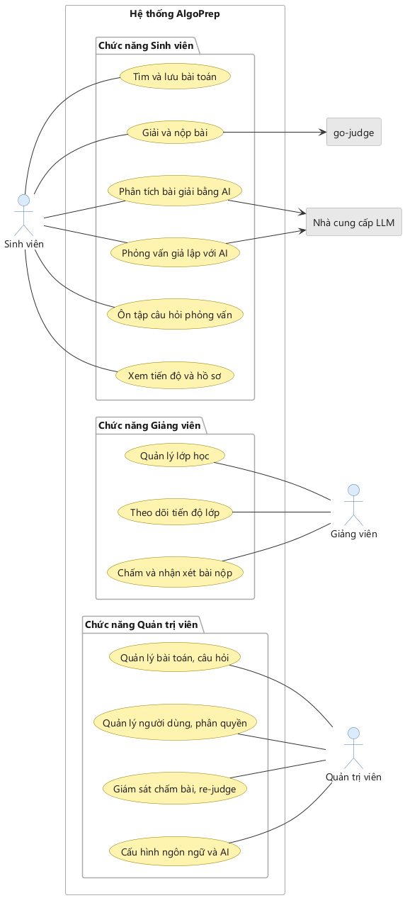

# BÁO CÁO KHẢO SÁT HỆ THỐNG

## NỀN TẢNG LUYỆN TẬP THUẬT TOÁN LẬP TRÌNH VÀ ÔN TẬP PHỎNG VẤN TÍCH HỢP AI

**Tích hợp go-judge và Spring AI**

[[TOC]]

---

## 1. KHẢO SÁT HỆ THỐNG THAM KHẢO

### 1.1. Bối cảnh

Sinh viên công nghệ thông tin và người chuyển ngành đều phải đi qua cùng một cửa khi xin việc: vòng phỏng vấn kỹ thuật. Ở đó ứng viên không chỉ cần giải được bài toán, mà còn phải bảo vệ được lời giải của mình — vì sao chọn cấu trúc dữ liệu đó, độ phức tạp bao nhiêu, dữ liệu lớn gấp nghìn lần thì còn chạy được không.

Các nền tảng luyện tập hiện nay giải quyết rất tốt nửa đầu của bài toán (viết code, chấm đúng/sai) nhưng gần như bỏ trống nửa sau. Khảo sát dưới đây xác định chính xác khoảng trống đó và vị trí đề tài chen vào.

### 1.2. Nền tảng thương mại

Ba nền tảng phổ biến nhất được so sánh theo bốn tiêu chí sát với mục tiêu đề tài, trình bày ở Bảng 1.1.

**Bảng 1.1: So sánh các nền tảng luyện thuật toán thương mại**

| Tiêu chí | LeetCode | Codeforces | HackerRank |
| :--- | :--- | :--- | :--- |
| Mô hình nộp bài | Bọc hàm (Function Wrapper) | Nhập/Xuất chuẩn (Standard I/O) | Cả hai |
| Phản hồi khi giải đúng | Percentile, gợi ý code (trả phí) | Chỉ trạng thái Accepted | Rubric tĩnh |
| Rèn kỹ năng giải trình | Không | Không | Theo mẫu cố định |
| Triển khai nội bộ | Không | Không | Chỉ qua hợp đồng B2B |

Điểm chung: tất cả đều dừng lại ở đúng/sai. Không nền tảng nào cho người học tập nói ra lời giải của mình, và không nền tảng nào cho một trường đại học tự dựng bản riêng để dùng trong môn học.

### 1.3. Các bộ máy chấm bài mã nguồn mở

Vì đề tài cần tự triển khai nội bộ, phần khảo sát tiếp theo tập trung vào các bộ máy chấm bài mã nguồn mở, tổng hợp ở Bảng 1.2.

**Bảng 1.2: Khảo sát các bộ máy chấm bài mã nguồn mở**

| Hệ thống | Giải quyết được | Còn thiếu |
| :--- | :--- | :--- |
| isolate | Cô lập tiến trình ở cấp nhân hệ điều hành | Chỉ là thư viện sandbox, không có tầng ứng dụng |
| Judge0 | REST API thực thi mã đa ngôn ngữ | Chỉ nhận stdin/stdout, không hỗ trợ bọc hàm, không có phản hồi định tính; bản đóng gói yêu cầu cgroup v1 |
| go-judge | REST/gRPC thực thi mã đa ngôn ngữ, sandbox riêng `go-sandbox`, chạy được cả cgroup v1 và v2 | Chỉ nhận stdin/stdout như Judge0, không hỗ trợ bọc hàm, không có phản hồi định tính |
| DOMjudge / CMS | Bộ máy chấm cho thi đấu ICPC, IOI | Thiết kế cho kỳ thi, không cho việc tự học |
| QDUOJ / HUSTOJ | Bộ máy chấm kèm giao diện cho trường học | Chỉ stdin/stdout, không có tầng đánh giá chuyên sâu |

### 1.4. Vì sao chọn go-judge làm bộ máy thực thi mặc định

- **Không xây lại sandbox.** Cô lập tiến trình khi chạy mã lạ là bài toán ở cấp nhân hệ điều hành và đã có lời giải chín. `go-sandbox` — lõi của go-judge — đang chạy thật trong Hydro, một online judge đang vận hành. Viết lại chỉ thêm rủi ro bảo mật mà không tạo ra đóng góp mới.
- **Đúng tầng cần tích hợp.** go-judge chỉ là API thực thi, không áp đặt mô hình bài toán hay quy trình nghiệp vụ, nên ba tầng đóng góp của đề tài xây thẳng lên trên được — khác với DOMjudge hay HUSTOJ vốn là hệ trọn gói.
- **Không kén phiên bản cgroup.** go-judge chạy được cả cgroup v1 lẫn v2, trong khi Judge0 chỉ chạy được v1. Điều này đóng hẳn rủi ro triển khai trên máy phát triển Windows/WSL2 mà không phải ép tham số nhân hệ điều hành rồi khởi động lại máy chủ.
- **Hạ tầng nhẹ.** go-judge không cần cơ sở dữ liệu hay hàng đợi riêng; toàn bộ trạng thái bài nộp vẫn nằm trong cơ sở dữ liệu của hệ thống.
- **Gói nhiều lệnh trong một lần gọi.** Một yêu cầu có thể chứa nhiều lệnh nối tiếp, cho phép biên dịch rồi chạy trong cùng một lượt — hợp với kiến trúc hàng đợi và phản hồi thời gian thực của đề tài.
- **Giữ đường lui.** Hệ thống gọi bộ máy chấm qua một cổng ra trung lập, không gắn với engine cụ thể. Nếu sau này cần đúng chuẩn thi đấu mà Judge0 có nhiều tiền lệ hơn, việc chuyển đổi chỉ là viết thêm một bộ chuyển đổi, không phải sửa nghiệp vụ.

### 1.5. Khoảng trống và định vị đề tài

Khảo sát cho thấy ba khoảng trống cùng tồn tại và chưa hệ thống mã nguồn mở nào lấp:

1. Không hệ thống nào hỗ trợ mô hình bọc hàm — đúng hình thức được dùng trong phỏng vấn thực tế.
2. Không hệ thống nào đưa ra phản hồi định tính sau khi bài nộp được chấp nhận.
3. Không có môi trường luyện kỹ năng giải trình và phản biện giải thuật mà một trường học tự triển khai được.

**Định vị:** đề tài không xây lại bộ máy chấm bài. Đóng góp nằm ở ba tầng phía trên: mô hình bọc hàm đa ngôn ngữ, phản hồi thời gian thực theo từng testcase, và tầng đánh giá bằng AI.

---

## 2. TỔNG QUAN ĐỀ TÀI

Hệ thống là một nền tảng web giúp người học luyện thuật toán và rèn kỹ năng phỏng vấn kỹ thuật. Người dùng chọn bài toán, viết mã trên trình soạn thảo trực tuyến theo một trong hai hình thức — viết hàm giải thuật hoặc đọc/ghi dữ liệu chuẩn — bài nộp được chạy trong môi trường cô lập, và kết quả từng testcase hiện dần về giao diện theo thời gian thực.

Điểm khác biệt nằm ở phần sau khi bài nộp đạt Accepted. Thay vì dừng ở đúng/sai, hệ thống mở ra hai hướng:

1. **Phân tích bài giải.** Một báo cáo chỉ ra độ phức tạp thực tế của đoạn mã vừa nộp, bài giải đã tối ưu chưa, còn lỗ hổng hay trường hợp biên nào chưa xử lý.
2. **Phỏng vấn giả lập 1:1.** Một phiên hội thoại nhiều lượt với AI đóng vai kỹ sư phỏng vấn; người học bảo vệ chính bài giải của mình qua ba giai đoạn giải trình, phản biện và mở rộng quy mô, khép lại bằng một bảng đánh giá năng lực.

Ngoài luồng gắn với bài nộp, hệ thống còn có một kho câu hỏi phỏng vấn lý thuyết để người dùng ôn tập và luyện trả lời độc lập.

Về mặt xây dựng, hệ thống tích hợp go-judge tự triển khai làm tầng thực thi và tự phát triển ba phần: bộ sinh mã bọc hàm, tầng điều phối chấm bài, và phân hệ AI. Toàn bộ là mã nguồn mở, dựng lại được bằng một lệnh Docker Compose.

---

## 3. ĐỐI TƯỢNG SỬ DỤNG

Hệ thống phục vụ ba nhóm người dùng và một tác nhân tự động, mô tả ở Bảng 3.1.

**Bảng 3.1: Các đối tượng sử dụng hệ thống**

| Mã | Đối tượng | Vai trò chính |
| :--- | :--- | :--- |
| A1 | Sinh viên, người dùng cuối | Tìm và giải bài toán, chạy thử và nộp bài, xem kết quả từng testcase, chọn phân tích bài giải hoặc phỏng vấn giả lập sau khi đạt Accepted, theo dõi tiến độ cá nhân |
| A2 | Giảng viên | Soạn đề bài và đặc tả hàm, tải lên bộ testcase, quản lý kho câu hỏi phỏng vấn, tạo lớp và giao bài theo lớp, theo dõi tiến độ lớp |
| A3 | Quản trị viên | Giám sát cụm máy chấm và hàng đợi, quản lý ngôn ngữ và giới hạn tài nguyên, cấu hình prompt và rubric AI, quản lý tài khoản và ma trận phân quyền |
| A4 | Hệ thống tự động | Điều phối bài nộp sang bộ máy chấm, phát hiện bài nộp bị treo, sinh báo cáo phân tích và điều phối phiên phỏng vấn |

Ba vai trò người thật tương ứng ba quyền trong hệ thống: `STUDENT`, `INSTRUCTOR`, `ADMIN`. Một số màn hình soạn nội dung được dùng chung giữa giảng viên và quản trị viên, phân biệt bằng quyền chứ không nhân đôi màn hình.

---

## 4. PHÂN HỆ CHỨC NĂNG

Hệ thống được chia thành sáu phân hệ theo miền nghiệp vụ. Ranh giới giữa các phân hệ được kiểm soát tự động khi biên dịch, không phụ thuộc vào kỷ luật của người viết mã.

### F1 — Danh tính và phân quyền

- Xác thực bằng JWT: access token thời hạn ngắn, refresh token đặt trong cookie HTTP-Only.
- Phân quyền theo ba vai trò `STUDENT`, `INSTRUCTOR`, `ADMIN`, kiểm ở tầng ứng dụng kèm kiểm quyền sở hữu dữ liệu.
- Trang tiến độ cá nhân: bài đã giải theo chủ đề, tỉ lệ chấp thuận, lịch sử phỏng vấn.
- Quản lý lớp học: tạo lớp, mã mời, danh sách học viên, hồ sơ chi tiết từng học viên.
- Ba bảng tổng hợp: tiến độ lớp cho giảng viên, tổng quan giảng viên, tổng quan quản trị.

### F2 — Ngân hàng bài toán và testcase

- Soạn đề bài bằng Markdown kèm công thức LaTeX, phân loại theo độ khó và chủ đề.
- Khai báo đặc tả bài toán: chữ ký hàm theo từng ngôn ngữ, kiểu tham số và kiểu trả về, chiến lược so khớp kết quả.
- Hai loại testcase: Sample công khai cho chế độ chạy thử, và Hidden dùng khi nộp bài.
- Chống rò rỉ testcase ẩn: chỉ hiển thị trạng thái và số thứ tự testcase sai, không lộ dữ liệu vào hay khác biệt chi tiết.
- Phiên bản hóa bộ testcase để truy vết được một lượt nộp cũ đã chấm theo phiên bản nào.
- Giới hạn thời gian và bộ nhớ theo từng bài, có hệ số nhân riêng cho mỗi ngôn ngữ.
- Vòng đời đề bài gồm hai trạng thái: chưa xuất bản và đã xuất bản; xóa là xóa mềm để không mất lịch sử bài nộp.

### F3 — Bộ sinh mã bọc hàm

Đây là trọng tâm kỹ thuật của đề tài: phần khiến mô hình bọc hàm chạy được trên một bộ máy chấm vốn chỉ biết đọc stdin và ghi stdout.

- **Lược đồ đặc tả kiểu dữ liệu độc lập ngôn ngữ:** kiểu nguyên thủy, chuỗi, mảng nhiều chiều, danh sách lồng nhau, danh sách liên kết, cây nhị phân.
- **Sinh mã đa ngôn ngữ:** từ một đặc tả duy nhất, sinh phần mã đọc dữ liệu, gọi hàm người dùng và in kết quả cho cả Java, C++ và Python.
- **Tiêm mã người dùng** vào khung sinh sẵn rồi đóng gói theo đúng định dạng mà bộ chuyển đổi đang dùng yêu cầu.
- **Chiến lược so khớp khai báo được:** so khớp chính xác, chuẩn hóa khoảng trắng, so sánh số thực theo sai số, so sánh tập hợp không xét thứ tự.
- **Ánh xạ lỗi biên dịch** về đúng dòng trong mã người dùng và che đi các lỗi thuộc phần mã sinh tự động — người học không bao giờ thấy lỗi ở một đoạn mã mình không viết.
- Mỗi bài toán hỗ trợ song song cả hai mô hình nộp bài; người học chọn mô hình ở từng lần làm, không do người ra đề ấn định.

### F4 — Điều phối và giao tiếp với bộ máy chấm

Toàn bộ giao tiếp đi qua một cổng ra trung lập theo engine, bộ chuyển đổi mặc định là go-judge.

- **Tiếp nhận bài nộp:** ghi trạng thái chờ, đẩy vào hàng đợi RabbitMQ và phản hồi ngay cho người dùng, không bắt trình duyệt đợi.
- **Chạy hết toàn bộ testcase:** mỗi testcase là một lần gọi riêng và luôn chạy đủ, để tính được tỉ lệ testcase đạt. Cách này đánh đổi tải máy chủ lấy khả năng cho người học biết mình đúng được bao nhiêu phần, thay vì chỉ biết "sai từ testcase thứ mấy".
- **Điểm theo tỉ lệ testcase:** hiển thị song song với kết luận Accepted hay Wrong Answer, không thay thế kết luận đó.
- **Vòng đời bài nộp rõ ràng:** trạng thái đi từ chờ, biên dịch, đang chấm tới một trong các trạng thái cuối, không có đường quay lui.
- **Không để bài nộp treo vĩnh viễn:** một tác vụ quét định kỳ phát hiện bài nộp đứng yên quá ngưỡng và dọn dẹp, kết hợp với cơ chế gửi lại thông điệp của hàng đợi.
- **Chống xử lý trùng:** hàng đợi cam kết giao ít nhất một lần, nên phần tiêu thụ được thiết kế để xử lý lại cùng một thông điệp vẫn cho kết quả cũ, không bao giờ ghi đè trạng thái cuối.
- **Cập nhật thời gian thực:** trạng thái từng testcase được đẩy qua WebSocket trên kênh riêng của mỗi bài nộp, ngay khi bộ máy chấm trả kết quả.

### F5 — Phân hệ AI

Phân hệ gồm hai chức năng độc lập, người dùng chủ động chọn.

#### F5.1 — Phân tích bài giải

Chức năng một lượt, không hội thoại. AI nhận đề bài, đặc tả hàm và mã nguồn vừa nộp, trả về dữ liệu có cấu trúc gồm:

- Độ phức tạp thời gian và bộ nhớ thực tế của bài giải, kèm lập luận dẫn tới con số đó.
- Đối chiếu với độ phức tạp tối ưu đã biết: bài giải đã tối ưu chưa, nếu chưa thì hướng đi tốt hơn là gì.
- Lỗ hổng còn lại: trường hợp biên bộ test chưa phủ, giả định ngầm trong mã, nguy cơ tràn số, rủi ro khi dữ liệu vào lớn hơn ràng buộc đề bài.
- Nhận xét chất lượng mã: cách đặt tên, cấu trúc phân rã hàm, đoạn mã lặp, độ dễ đọc.
- Câu hỏi mở rộng để người học tự kiểm tra hiểu biết.

Kết quả hiển thị dạng báo cáo tĩnh và lưu kèm bài nộp để xem lại trong trang tiến độ.

#### F5.2 — Phỏng vấn giả lập 1:1

Phiên hội thoại nhiều lượt, AI đóng vai kỹ sư phỏng vấn, người dùng đóng vai ứng viên. Phiên đi qua ba giai đoạn:

1. **Giải trình thuật toán** — trình bày hướng tiếp cận và lý do chọn cấu trúc dữ liệu.
2. **Phản biện** — người phỏng vấn chất vấn những điểm chưa tối ưu, hỏi xoáy vào trường hợp biên.
3. **Mở rộng quy mô** — đặt tình huống dữ liệu tăng đột biến hoặc ràng buộc hệ thống thay đổi.

Ngữ cảnh phiên được giữ trên Redis, phản hồi chảy về giao diện theo từng đoạn qua Server-Sent Events. Kết phiên, hệ thống xuất bảng đánh giá theo bốn tiêu chí: độ rõ ràng khi trình bày, độ chính xác kỹ thuật, khả năng phản biện và nhận thức về độ phức tạp, kèm nhận xét cụ thể cho từng tiêu chí.

Phỏng vấn giả lập có ba lối vào: từ một bài nộp đã Accepted, từ một câu hỏi trong kho lý thuyết, hoặc tự chọn chủ đề để luyện.

#### Ràng buộc chung cho cả hai chức năng

- **Chống tiêm chỉ thị.** Mã nguồn và câu trả lời của người dùng luôn đi vào prompt dưới dạng dữ liệu, tách hẳn khỏi chỉ thị hệ thống. Cả phần bối cảnh do giảng viên soạn riêng cho từng bài cũng chỉ là chỉ thị hạng hai, không bao giờ được nâng lên thành chỉ thị hệ thống.
- **Định hướng học tập.** Bảng đánh giá và báo cáo phân tích là phản hồi hỗ trợ người học, không dùng làm điểm chính thức.
- **Kiểm soát chi phí.** Giới hạn tần suất theo người dùng, lưu đệm kết quả phân tích theo mã băm của mã nguồn, theo dõi lượng token tiêu thụ theo từng phiên và tự khóa khi vượt ngân sách.
- **Suy giảm có kiểm soát.** Khi phân hệ AI gặp sự cố hoặc hết hạn mức, toàn bộ chức năng chấm bài vẫn chạy bình thường. Không dòng mã chấm bài nào được phép phụ thuộc vào đường AI.

### F6 — Ngân hàng câu hỏi phỏng vấn

Một khu vực độc lập, không gắn với bài nộp, phục vụ việc ôn lý thuyết và luyện trả lời.

- **Danh sách câu hỏi** phân loại theo năm chủ đề (lý thuyết khoa học máy tính, thiết kế hệ thống, cơ sở dữ liệu, ngôn ngữ lập trình, câu hỏi hành vi) và theo mức độ khó, có tìm kiếm, lọc và đánh dấu.
- **Chế độ học:** xem gợi ý hướng tiếp cận, khung trả lời mẫu (câu hỏi hành vi dùng cấu trúc STAR) và danh sách từ khóa kỹ thuật cốt lõi cần nhắc tới.
- **Chế độ luyện:** người dùng tự viết câu trả lời, AI đối chiếu với tiêu chí chuẩn của câu hỏi và trả về phản hồi ngắn gồm điểm đã đạt, điểm còn thiếu và gợi ý bổ sung.
- **Theo dõi:** lịch sử luyện tập, danh sách câu hỏi cần ôn lại theo chu kỳ, tỉ lệ hoàn thành theo chủ đề.
- Kho câu hỏi là **một kho dùng chung ở cấp hệ thống**; giảng viên và quản trị viên cùng biên tập nội dung, không có khái niệm bộ câu hỏi riêng theo lớp.

### Quy mô chức năng

Sau các đợt rà soát phạm vi, sáu phân hệ được chia thành 111 chức năng có mã số, phân bố như Bảng 4.1. Con số này là cơ sở để ước lượng khối lượng công việc và xếp thứ tự cắt giảm khi tiến độ căng.

**Bảng 4.1: Phân bố chức năng theo phân hệ**

| Phân hệ | Số chức năng | Trọng số công việc |
| :--- | :---: | :--- |
| F1 — Danh tính và phân quyền | 30 | Trung bình, rộng về bề mặt: phân quyền, lớp học, ba bảng tổng hợp |
| F2 — Ngân hàng bài toán và testcase | 17 | Trung bình |
| F3 — Bộ sinh mã bọc hàm | 13 | Cao nhất — nhân ba theo số ngôn ngữ, lại nhân đôi theo hai mô hình nộp bài |
| F4 — Điều phối bộ máy chấm | 11 | Cao — xử lý đồng thời và phản hồi thời gian thực |
| F5 — Phân hệ AI | 28 | Cao — hai luồng AI độc lập cộng phần kiểm soát chi phí |
| F6 — Ngân hàng câu hỏi | 12 | Thấp |
| **Tổng** | **111** | Tương ứng 30 màn hình giao diện |

---

## 5. QUY TRÌNH NGHIỆP VỤ CHÍNH

Luồng xương sống của hệ thống — giải một bài toán từ đầu tới khi nhận phản hồi AI — đi qua các bước sau:

1. Người học chọn bài toán và chọn mô hình nộp bài; giao diện nạp sẵn khung hàm đúng ngôn ngữ đang chọn.
2. Người học viết mã và chạy thử với bộ testcase công khai để kiểm tra nhanh.
3. Khi nộp bài, hệ thống ghi nhận, đẩy vào hàng đợi và trả về ngay một mã bài nộp; giao diện chuyển sang trạng thái theo dõi.
4. Với mô hình bọc hàm, bộ sinh mã ghép mã người dùng vào khung đọc/ghi dữ liệu tương ứng đặc tả của bài.
5. Tầng điều phối gọi bộ máy chấm lần lượt cho từng testcase và đẩy kết quả về giao diện ngay khi có.
6. Sau khi chạy hết, hệ thống chốt kết luận và tỉ lệ testcase đạt, cập nhật tiến độ cá nhân.
7. Nếu đạt Accepted, người học được mời chọn phân tích bài giải hoặc bước vào phiên phỏng vấn giả lập.

Ba luồng còn lại — phỏng vấn giả lập, soạn nội dung của giảng viên, vận hành của quản trị viên — được mô tả chi tiết trong tài liệu đặc tả yêu cầu.

---

## 6. CÔNG NGHỆ SỬ DỤNG

Các công nghệ được chốt theo nguyên tắc: ưu tiên nền tảng có bản hỗ trợ dài hạn, tự triển khai được, và không khóa vào một nhà cung cấp dịch vụ. Bảng 6.1 liệt kê lựa chọn theo từng tầng.

**Bảng 6.1: Công nghệ sử dụng theo tầng kiến trúc**

| Tầng | Công nghệ |
| :--- | :--- |
| Giao diện | Next.js 16 (App Router), React, TypeScript chế độ strict, Tailwind CSS, Monaco Editor |
| Backend | Java 21 LTS (Virtual Threads), Spring Boot 4.0, Spring Security, Spring Data JPA, Maven đa module |
| Hàng đợi và thời gian thực | RabbitMQ, WebSocket theo giao thức STOMP, Server-Sent Events |
| Dữ liệu và lưu trữ | PostgreSQL, Redis (bộ nhớ đệm, ngữ cảnh hội thoại, giới hạn tần suất), MinIO (bộ testcase lớn) |
| Thực thi mã nguồn | go-judge tự triển khai, sandbox `go-sandbox` dùng cgroup v1/v2 và namespace; cổng ra trung lập nên Judge0 vẫn là lựa chọn thay thế hợp lệ |
| Trí tuệ nhân tạo | Spring AI |
| Triển khai và giám sát | Docker Compose, GitHub Actions, Prometheus, Grafana |
| Kiểm thử | JUnit 5, Testcontainers, k6, Vitest, Playwright |

Về kiến trúc, hệ thống là một **khối đơn có module hóa**: một tiến trình, một cơ sở dữ liệu với sáu lược đồ tách theo miền nghiệp vụ. Ranh giới giữa các module được bảo vệ bằng kiểm tra tự động chứ không bằng ranh giới mạng — đủ chặt để giữ thiết kế sạch, đủ nhẹ để một nhóm nhỏ vận hành được. Phía giao diện tổ chức theo Feature-Sliced Design, có luật tự động chặn việc nhập khẩu sai chiều. Giao diện hỗ trợ hai chế độ màu sáng/tối và hai ngôn ngữ Việt/Anh.

---

## 7. GIỚI HẠN PHẠM VI

### 7.1. Nằm trong phạm vi

- Ba ngôn ngữ nộp bài: Java, C++, Python.
- Hai mô hình nộp bài song song trên cùng một bài toán: bọc hàm và nhập/xuất chuẩn.
- Thực thi đơn luồng cho mỗi bài nộp trong môi trường cô lập.
- Phỏng vấn AI dạng văn bản, có đầy đủ ngữ cảnh mã nguồn vừa nộp.
- Giao bài và theo dõi tiến độ theo lớp cho giảng viên.
- Giao diện đa ngôn ngữ Việt/Anh và hai chế độ màu.

### 7.2. Ngoài phạm vi

- Môi trường phát triển tích hợp trên nền web hoàn chỉnh.
- Bài toán tương tác, nơi chương trình chấm và chương trình dự thi trao đổi qua lại.
- Phỏng vấn bằng giọng nói.
- Hệ thống thi đấu và bảng xếp hạng thời gian thực.
- **Chấm lại hàng loạt.** Khi phát hiện một testcase sai, học viên báo giảng viên, giảng viên sửa và tăng phiên bản bộ testcase; các lượt nộp cũ giữ nguyên kết quả cũ.
- Trình chấm tùy biến do người ra đề tự nạp lên.
- Phát hiện sao chép mã nguồn giữa các bài nộp.
- Gợi ý theo bậc trong lúc người học đang làm bài.

Bốn mục cuối từng nằm trong ý tưởng ban đầu và được loại bỏ có chủ đích: mỗi mục đều là một luồng nghiệp vụ trọn vẹn, không đóng góp vào ba tầng đóng góp chính, và nếu giữ lại sẽ lấy mất thời gian của phần trọng tâm.

---

## 8. RỦI RO VÀ PHƯƠNG ÁN XỬ LÝ

Các rủi ro được xếp theo mức độ ảnh hưởng tới khả năng hoàn thành đề tài, trình bày ở Bảng 8.1.

**Bảng 8.1: Rủi ro chính và phương án xử lý**

| # | Rủi ro | Mức | Phương án xử lý |
| :--- | :--- | :--- | :--- |
| R1 | Bộ máy chấm không chạy được trên môi trường phát triển (Judge0 yêu cầu cgroup v1) | Đã đóng | Chuyển bộ máy chấm mặc định sang go-judge, chạy được cả cgroup v1 và v2. Rủi ro chỉ trở lại nếu quay về dùng Judge0 |
| R2 | Bộ sinh mã không bao phủ hết kiểu dữ liệu | Cao | Chốt trước tập kiểu ưu tiên; bài toán có cấu trúc dữ liệu chưa hỗ trợ thì ẩn mô hình bọc hàm, chỉ hiện nhập/xuất chuẩn |
| R3 | Khối lượng công việc vượt tiến độ | Cao | Cố định hoàn thiện F1 đến F4; thứ tự cắt giảm khi cần: phỏng vấn giả lập, công cụ lớp học, các bảng tổng hợp nâng cao |
| R4 | Chi phí gọi API mô hình ngôn ngữ vượt dự kiến | Trung bình | Giới hạn tần suất theo người dùng, lưu đệm theo mã băm mã nguồn, đặt hạn mức token và tự khóa khi vượt |
| R5 | Không đủ người dùng thật để kiểm thử | Trung bình | Phối hợp với giảng viên môn Cấu trúc dữ liệu và Giải thuật để đưa vào bài tập trên lớp |

R1 từng là rủi ro phải xử lý trước tiên, vì nếu bộ máy chấm không chạy thì bộ sinh mã không kiểm chứng được, tầng điều phối không có gì để điều phối, và phân hệ AI không có bài nộp Accepted nào để phân tích — cả đề tài đứng lại. Việc đổi bộ máy chấm mặc định ngay ở giai đoạn khảo sát đã đóng rủi ro này trước khi viết dòng mã đầu tiên.

---

## 9. TIÊU CHÍ THÀNH CÔNG

Đề tài được đánh giá bằng tám tiêu chí đo được, không bằng nhận định định tính. Bảng 9.1 liệt kê từng tiêu chí kèm cách kiểm chứng.

**Bảng 9.1: Tiêu chí thành công và cách kiểm chứng**

| # | Tiêu chí | Cách kiểm chứng |
| :--- | :--- | :--- |
| S1 | Một bài toán bọc hàm chạy đúng trên cả ba ngôn ngữ từ một đặc tả duy nhất | So khớp mã sinh ra với bản mẫu, cộng một lần chạy thật qua bộ máy chấm |
| S2 | Lỗi biên dịch ánh xạ đúng dòng và không lộ mã sinh tự động | Bộ test có mã sai cố ý, đối chiếu số dòng báo lỗi |
| S3 | Trạng thái từng testcase hiện về theo thời gian thực | Đo độ trễ từ lúc bộ máy chấm trả kết quả tới lúc giao diện đổi |
| S4 | Không có bài nộp treo vĩnh viễn | Cố ý cho tiến trình xử lý dừng giữa chừng, xác nhận hàng đợi gửi lại và tác vụ quét dọn được |
| S5 | Xử lý lại một thông điệp không làm sai kết quả | Gửi lại thông điệp đã xử lý, xác nhận trạng thái cuối không bị ghi đè |
| S6 | Testcase ẩn không rò rỉ qua bất kỳ bề mặt nào | Rà toàn bộ phản hồi API và nhật ký hệ thống |
| S7 | Tắt hoàn toàn AI thì chức năng chấm bài vẫn chạy đủ | Chạy lại kịch bản đầu-cuối chính với phân hệ AI bị vô hiệu hóa |
| S8 | Mã nguồn người dùng không thể trở thành chỉ thị cho AI | Bộ test chứa mã có câu lệnh tiêm chỉ thị |

Bên cạnh đó, chất lượng mã được giữ bằng các cổng kiểm tra tự động chạy trước mỗi lần tích hợp: kiểm tra định dạng và lỗi tiềm ẩn ở backend, độ phủ kiểm thử tối thiểu 80% cho tầng nghiệp vụ, kiểm tra ranh giới module, và ở giao diện là TypeScript chế độ strict cùng luật chặn nhập khẩu sai chiều.

---

## 10. PHÂN TÍCH THIẾT KẾ HỆ THỐNG

Chương này chuyển các yêu cầu đã khảo sát ở trên thành mô hình. Ba loại sơ đồ được dùng, mỗi loại trả lời một câu hỏi khác nhau: sơ đồ Use Case trả lời "ai làm được gì", sơ đồ tuần tự trả lời "các thành phần trao đổi với nhau theo thứ tự nào", còn sơ đồ hoạt động trả lời "luồng công việc rẽ ở đâu".

Chương được tổ chức theo vai trò người dùng, và trong mỗi vai trò đi theo đúng thứ tự Use Case, tuần tự, rồi hoạt động — nghĩa là từ "làm được gì" tới "hệ thống chạy ra sao" tới "quy trình đi thế nào". Bốn phần lần lượt dành cho sinh viên, giảng viên, quản trị viên và nhóm chức năng dùng chung. Toàn bộ sơ đồ được sinh từ tệp đặc tả nên khi thiết kế đổi thì vẽ lại được, không phải kéo tay từng hình.

### 10.1. Mô hình nghiệp vụ tổng thể

Sơ đồ Use Case tổng quan ở Hình 10.1 cho thấy toàn cảnh hệ thống: ba nhóm chức năng theo ba vai trò người dùng, một nhóm dùng chung giữa giảng viên và quản trị viên, chức năng đăng nhập chung cho mọi vai trò, và hai hệ thống ngoài mà nền tảng phụ thuộc là go-judge cùng nhà cung cấp mô hình ngôn ngữ.

Hai hệ thống ngoài này là ranh giới tiến trình thật, không phải module bên trong. Cách vẽ đó phản ánh đúng nguyên tắc thiết kế đã nêu ở mục 4: hệ thống gọi bộ máy chấm qua một cổng ra trung lập, và phân hệ AI hỏng thì đường chấm bài vẫn chạy.

Mỗi hình bầu dục trong sơ đồ tổng quan được bung thành một sơ đồ chi tiết riêng ở các mục tiếp theo.

### 10.2. Vai trò Sinh viên (A1)

#### 10.2.1. Sơ đồ Use Case

Hình 10.2 mô tả nhóm chức năng lõi của người học: soạn mã, chạy thử với testcase công khai, chọn mô hình nộp bài, rồi nộp và theo dõi kết quả từng testcase. Bộ sinh mã bọc hàm không xuất hiện thành một hình bầu dục riêng vì đó là việc hệ thống tự làm, không phải thao tác người học chủ động gọi.

Hai nhóm chức năng AI được tách riêng vì hoạt động khác hẳn nhau: một bên là báo cáo một lượt, một bên là hội thoại nhiều lượt.

Hình 10.5 gồm phần mở phiên với ba lối vào, phần tiến hành hội thoại và kết phiên bằng bảng đánh giá. Các ràng buộc kỹ thuật như lưu ngữ cảnh trên Redis hay truyền phản hồi qua SSE không vẽ thành chức năng, vì chúng là cách hiện thực chứ không phải việc người dùng yêu cầu.

#### 10.2.2. Sơ đồ tuần tự

Hình 10.9 mô tả luồng xác thực. Điểm đáng chú ý nằm ở ba thông điệp cuối: khi access token hết hạn, giao diện tự đổi lấy token mới bằng refresh token trong cookie HTTP-Only, người dùng không phải đăng nhập lại. Nhánh rẽ "mật khẩu đúng?" được vẽ vì đó là nhánh nghiệp vụ chính của màn đăng nhập, không phải xử lý lỗi phụ.

Hình 10.10 là luồng quan trọng nhất của đề tài. Máy chủ trả mã bài nộp ngay sau khi ghi trạng thái chờ, không bắt người dùng đợi chấm xong; công việc chấm đi qua hàng đợi, kết quả từng testcase quay về giao diện qua WebSocket. Sơ đồ ghi rõ "chạy hết, không dừng sớm" — đây chính là điểm đã đổi so với thiết kế ban đầu để tính được điểm theo tỉ lệ testcase.

Hình 10.11 mô tả luồng phân tích bài giải. Trước khi gọi mô hình ngôn ngữ, máy chủ tính mã băm của mã nguồn và tra bộ nhớ đệm; trùng thì trả báo cáo cũ, không tốn thêm một lượt gọi. Thông điệp gửi sang nhà cung cấp mô hình ghi rõ mã nguồn đi vào dưới dạng tham số dữ liệu — đó là cách thể hiện ràng buộc chống tiêm chỉ thị ngay trên sơ đồ, không phải chú thích trang trí.

Hình 10.12 mô tả phiên phỏng vấn giả lập, từ lúc mở phiên và khởi tạo ngữ cảnh hội thoại, qua các giai đoạn hỏi đáp có phản hồi chảy dần về giao diện, tới lúc kết phiên và tổng hợp bảng đánh giá bốn tiêu chí. Thông điệp cuối kèm luôn cảnh báo rằng bảng đánh giá là phản hồi học tập, không phải điểm chính thức.

Hình 10.13 là luồng ôn tập lý thuyết, nơi hai chế độ dùng chung một màn hình: chế độ học chỉ đọc gợi ý và khung trả lời, chế độ luyện mới gọi AI đối chiếu câu trả lời của người dùng.

#### 10.2.3. Sơ đồ hoạt động

Cùng năm luồng trên nhìn theo góc quy trình: đi qua những bước nào, rẽ nhánh ở đâu.

Hình 10.15 là luồng nộp bài dưới dạng quy trình. Toàn bộ là chuỗi tuần tự, không có điểm rẽ nhánh — đúng với thiết kế hiện tại, vì hệ thống chạy hết mọi testcase chứ không dừng sớm khi gặp testcase sai.

Hình 10.16 là luồng duy nhất trong nhóm có điểm rẽ nhánh thật: "đã có báo cáo trong bộ nhớ đệm chưa". Hai nhánh gặp lại nhau ở một nút gộp trước khi hiển thị báo cáo, nên người dùng thấy cùng một kết quả dù đi đường nào.

### 10.3. Vai trò Giảng viên (A2)

#### 10.3.1. Sơ đồ Use Case

Giảng viên có ba nhóm chức năng: quản lý lớp, theo dõi tiến độ, và chấm nhận xét bài nộp.

Ở Hình 10.19, học viên tự tham gia lớp bằng mã mời chứ giảng viên không thêm thủ công — chi tiết này quyết định thiết kế bảng dữ liệu và luồng màn hình phía sau.

#### 10.3.2. Sơ đồ tuần tự

Năm luồng nghiệp vụ của giảng viên. Đáng chú ý là luồng chấm tay ở Hình 10.26: điểm AI chỉ mang tính tham khảo, điểm giảng viên nhập vào đè lên điểm đó và hiển thị song song để người học thấy cả hai.

#### 10.3.3. Sơ đồ hoạt động

Ở Hình 10.28, hai bước cuối cố ý nhìn từ phía sinh viên, để thấy hệ quả của việc gán bài: bài chỉ hiện trong nhóm "bài được giao" của đúng lớp đó. Danh sách chọn bài chỉ liệt kê những bài đã xuất bản — một điều kiện lọc dữ liệu chứ không phải điểm rẽ nhánh, nên không vẽ thành nút quyết định.

### 10.4. Vai trò Quản trị viên (A3)

#### 10.4.1. Sơ đồ Use Case

Quản trị viên có năm nhóm chức năng: giám sát bộ máy chấm, quản lý người dùng và phân quyền, cấu hình ngôn ngữ cùng tham số AI, kiểm soát ngân sách token, và tra nhật ký hệ thống.

Nhóm ở Hình 10.32 từng có thêm phần chấm lại hàng loạt; phần đó đã ra khỏi phạm vi nên sơ đồ cũng bỏ theo, giữ cho mô hình khớp đúng với phạm vi đã chốt ở mục 7.

#### 10.4.2. Sơ đồ tuần tự

Hình 10.37 là luồng vận hành chính: quản trị viên mở màn giám sát, máy chủ đọc độ dài hàng đợi từ RabbitMQ, hỏi tình trạng worker và thông lượng từ go-judge, đọc số bài nộp treo quá ngưỡng từ cơ sở dữ liệu, rồi gộp lại thành bảng số liệu. Sơ đồ này cho thấy rõ ba hệ thống nằm ngoài tiến trình ứng dụng.

Hai luồng cuối cho thấy cơ chế kiểm soát chi phí đã nêu ở mục 4: prompt được quản lý theo phiên bản, còn ngân sách token vượt ngưỡng thì hệ thống tự khóa.

#### 10.4.3. Sơ đồ hoạt động

### 10.5. Nhóm chức năng dùng chung nhiều vai trò

Năm nhóm dưới đây không thuộc riêng vai trò nào. Đăng nhập là chức năng chung của cả ba vai trò; bốn nhóm còn lại là màn hình quản trị nội dung được gắn vào cả khu vực giảng viên lẫn khu vực quản trị, phạm vi dữ liệu do ma trận phân quyền quyết định — vẽ chúng dưới một vai trò duy nhất sẽ sai mô hình. Các luồng tuần tự và hoạt động của nhóm này nằm trong phần của vai trò thực hiện nó, nên ở đây chỉ có sơ đồ Use Case.

### 10.6. Tổng hợp bộ sơ đồ thiết kế

Chương này trình bày đủ 51 sơ đồ của hệ thống, phủ hết ba vai trò người dùng. Toàn bộ được lưu kèm mã nguồn ở thư mục `08-diagram/`, mỗi sơ đồ có sẵn tệp đặc tả, tệp `.drawio` chỉnh sửa được và ảnh đã kết xuất, nên khi thiết kế thay đổi thì sinh lại được chứ không phải vẽ tay. Bảng 10.1 tóm tắt cách phân bố.

**Bảng 10.1: Phân bố bộ sơ đồ thiết kế**

| Loại sơ đồ | Sinh viên | Giảng viên | Quản trị viên | Dùng chung | Tổng |
| :--- | :---: | :---: | :---: | :---: | :---: |
| Use Case tổng quan | | | | | 1 |
| Use Case chi tiết | 7 | 3 | 5 | 5 | 20 |
| Tuần tự | 5 | 5 | 5 | 0 | 15 |
| Hoạt động | 5 | 5 | 5 | 0 | 15 |
| **Tổng** | 17 | 13 | 15 | 5 | **51** |
